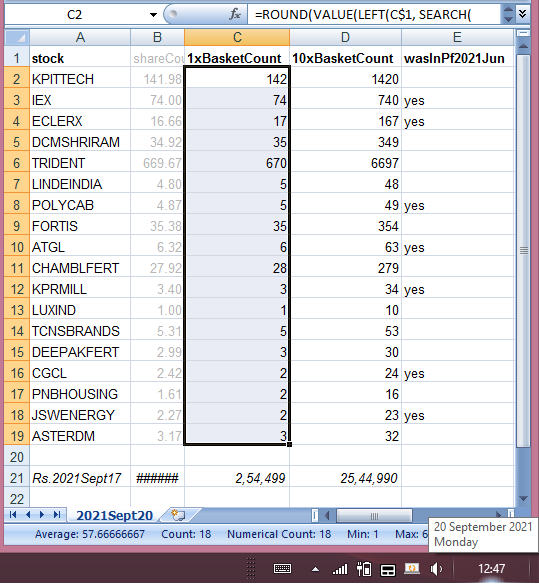
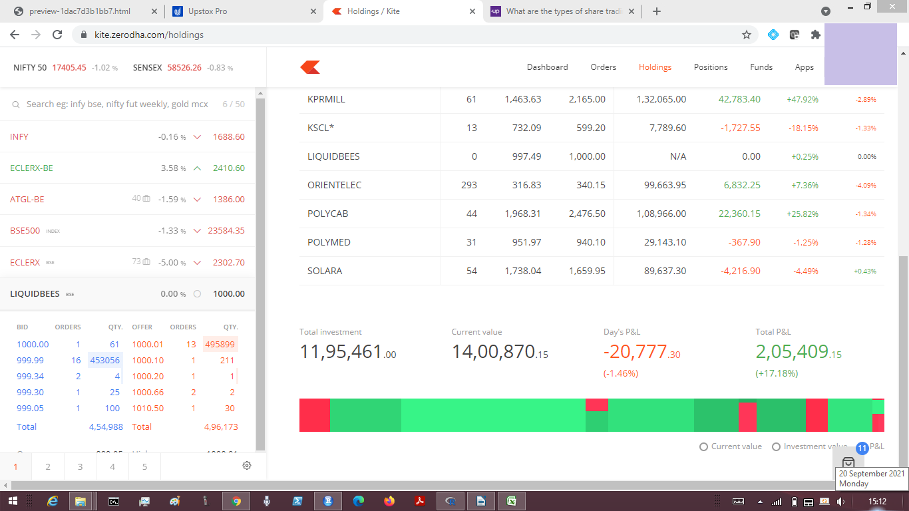
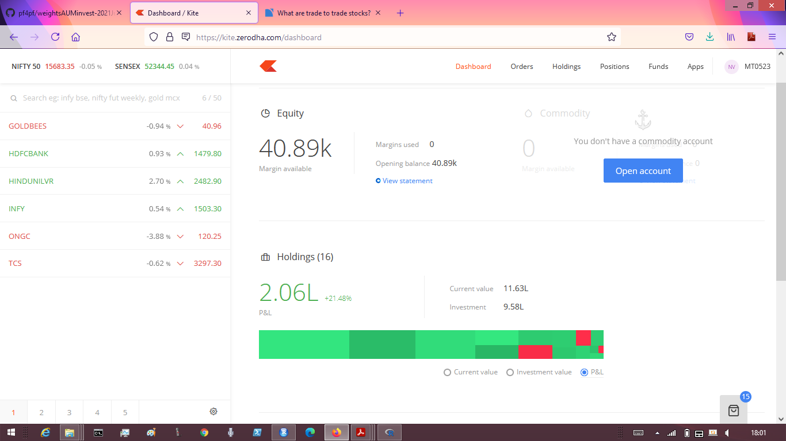

# pf4pf
## Portfolios for Pension Funds
Here are links to sub-Projects emerging within, listed with the most-recent ones first:
- [Explaining the Stability Simulations](./stabilityExplain.md#explaining-the-stability-simulations) explains [Stability](./stability.md#infy-stability-in-a-world-that-is). It seems suitable for those who prefer to stabilize an investable asset, possibly at scale and in addition to using a portfolio-optimization approach to diversify away some of that asset's risks.
- Weights to AUM to Invest: following are rebalancing outputs and investment illustrations:
    * 2021-Sept: [weightsAUMinvest-2021Sept20-0825](./bt77rebal2021Sept/preview-1dac7d3b1bb7html-2021Sept20-0825.pdf) has portfolio weights and corresponding share counts from rebalancing of 2021-Sept. (Beware that its paragraphs' text is yet to be updated to match, but outputs of code-session blocks are valid.)
        + To illustrate its use which is valid till 2021-Dec:
            * Following screenshot aids rebalancing and uses downloadable portfolio share counts [pf2021Sept18](./bt77rebal2021Sept/pfShareCountAdj2021Sept18.txt):

              
 
            * Basket-trading BUY orders (excluding existing stock holdings from 2021-Jun and created on [Zerodha](https://zerodha.com/) platform) can be downloaded in JSON format: [basket10x](./bt77rebal2021Sept/bt772021sept10xnoheld.json) and as After-Market (limit) Orders [basket10xAMO](./bt77rebal2021Sept/SeptLimAMOx10n11.json).
        + Following screenshot shows a portfolio growth of over 17% absolute, consistent with over 36% CAGR annualized which is part of the result commitment moving this author:

          

    * 2021-Jun: [weightsAUMinvest-2021Jun20-1535](./bt77rebal2021Jun/weightsAUMinvest-2021Jun20-1535.pdf) has portfolio weights and corresponding share counts from rebalancing of 2021-Jun.

        + To illustrate its use which is valid till 2021-Sept, basket-trading BUY orders (excluding existing stock holdings such as `ATGL` and `KPRMILL` and created on [Zerodha](https://zerodha.com/) platform) can be downloaded in JSON format: (a) rounded for approx. INR Rs 120,000 at [basket1x](./bt77rebal2021Jun/bt77x1entry2021JunNoHeld.json) and (b) rounded to reduce Tracking Error for a larger 5x investment approx. INR Rs 600,000 at [basket5x](./bt77rebal2021Jun/bt77x5entry2021JunNoHeld.json). Basket for exit SELL orders (excluding stock holdings) from 2021-Mar portfolio can be adapted from [exitBasket5x](./bt77rebal2021Jun/bt77x5exit2021MarNoHeld.json).
        + Its earlier version [weightsAUMinvest-2021Jun19-2300](./bt77rebal2021Jun/weightsAUMinvest-2021Jun19-2300.pdf) reports rebalancing prior to including a further 100 stocks (with missing data) after using [Imputation of Financial Time Series](https://cran.r-project.org/web/packages/imputeFin/vignettes/ImputeFinancialTimeSeries.html). (Beware that their text is yet to be updated to match.)
        + Following screenshot shows a portfolio growth of over 20% absolute, consistent with over 36% CAGR annualized, which is part of the result commitment moving this author:

          

    * 2021-Mar: [weightsAUMinvest-2021Mar22-1200](./bt77rebal2021Mar/weightsAUMinvest-2021Mar22-1200.pdf) has portfolio weights and corresponding share counts from rebalancing of 2021-Mar. (Beware that its text is yet to be updated to match.)

        + To illustrate its use which is valid till 2021-Jun, basket-trading BUY orders (created on [Zerodha](https://zerodha.com/) platform) can be downloaded in JSON format: (a) rounded for approx. INR Rs 100,000 at [basket1x](./bt77rebal2021Mar/bt77entry2021Mar22.json) and (b) rounded to reduce Tracking Error for a larger 5x investment approx. INR Rs 500,000 at [basket5x](./bt77rebal2021Mar/bt77x5entry2021Mar.json).
        + Following screenshots show a portfolio growth of over 20% absolute, consistent with over 36% CAGR annualized, which is part of the result commitment moving this author:

            

    * 2020-Dec: [Weights to AUM to Invest](./weightsAUMinvest.md).
- [500 invest for 36% CAGR](./invest500CAGR36.md). This is yet to be reduced in size for GitHub to show it. Meanwhile, you could view (and possibly, download 4.4MB of) its PDF [form](./preview-63070e03e9f-500invest36CAGR-2021Jan01-2358.pdf); the code-session outputs and charts are ok to depend on, but beware that its text is yet to be updated to match.
- [Rebalancing Objectives](./rebalanceObjectives.md).
- [Exploring Objectives with R-Optimization Infrastructure (ROI)](./momentObjective.md).
- [Risk-free Nay Ratna](./riskfreeNayRatna.md).
- [Nay Ratna](nayRatna/nayRatna.md).

**Disclaimer**: This [author](mailto:yadevinit@gmail.com) does not have a Research Advisor's license registered with SEBI (Securities Exchange Board of India). The author and family might hold market positions as per the optimal portfolios shared here. The reader may please consider this Disclaimer for assessing any conflict of interest regarding the use of the knowledge shared here. In fact, as expressed in these research viewpoints, the author stands for extraordinary growth and harmony in (pension-) fund management and has taken actions for moving the market regulator PFRDA (Pension Fund Regulatory and Development Authority) and other wealth-ecosystem players for that.
