500 invest for 36% CAGR
================
Vinit Kaushik.
January 01, 2021

Now using the 500 or so investible stock assets constituting index `BSE500`, the [author](mailto:yadevinit@gmail.com) explores the possibility of generating a target return consistent with 36% CAGR. - Some of the data from Yahoo Finance had NAs or was missing for some durations. - TBD M4 failure for ESmodified. Chose Gaussian. Then chart failed.

``` r
date()
```

    ## [1] "Fri Jan 01 22:49:58 2021"

``` r
# Initialize globals before source():
cMyPath <- "F:/pf4pf/toDo/"
cFileIndex <- "BSE500stocks2020Dec22-0735"
cDateRange <- "2012-07/2020-12-18" # coz "2010-07/" is missing Yahoo Finance data for many.
source(paste0(cMyPath, "../gettingStarted.R")) # (gIx["2014/2016-05","CGCL"]) not ok coz repeated data and NAs.
```

    ## Warning: package 'DEoptim' was built under R version 3.6.3

    ## Loading required package: parallel

    ## 
    ## DEoptim package
    ## Differential Evolution algorithm in R
    ## Authors: D. Ardia, K. Mullen, B. Peterson and J. Ulrich

    ## Warning: package 'ROI' was built under R version 3.6.3

    ## ROI: R Optimization Infrastructure

    ## Registered solver plugins: nlminb, glpk, quadprog.

    ## Default solver: auto.

    ## Warning: package 'ROI.plugin.glpk' was built under R version 3.6.3

    ## Warning: package 'ROI.plugin.quadprog' was built under R version 3.6.3

    ## Warning: package 'PortfolioAnalytics' was built under R version 3.6.3

    ## Loading required package: zoo

    ## 
    ## Attaching package: 'zoo'

    ## The following objects are masked from 'package:base':
    ## 
    ##     as.Date, as.Date.numeric

    ## Loading required package: xts

    ## Loading required package: foreach

    ## Loading required package: PerformanceAnalytics

    ## 
    ## Attaching package: 'PerformanceAnalytics'

    ## The following object is masked from 'package:graphics':
    ## 
    ##     legend

    ## Registered S3 method overwritten by 'PortfolioAnalytics':
    ##   method           from
    ##   print.constraint ROI

    ## 
    ## Attaching package: 'PortfolioAnalytics'

    ## The following objects are masked from 'package:ROI':
    ## 
    ##     is.constraint, objective

    ## Warning in eval(ei, envir): gIx must drop CGCL. Fix ESCORTS ALOKTEXT

    ## Daily periodicity from 2012-07-02 05:30:00 to 2020-12-18 05:30:00 
    ## [1] 2089  500

    ## Warning in myAssetsWithReturnsOverCompletePeriod(argIsLogReturns, argix = gIx, :
    ## Presuming arithmetic= and log= for log return as per wantLogReturn=FALSE

    ## [1] 440 385
    ## [1] "TATACHEM" "NBCC"     "AVANTI"  
    ## An 'xts' object on 2012-07-20 05:30:00/2020-12-18 05:30:00 containing:
    ##   Data: num [1:440, 1:382] 0.00543 -0.00311 0.03123 0.0527 0.04226 ...
    ##  - attr(*, "dimnames")=List of 2
    ##   ..$ : NULL
    ##   ..$ : chr [1:382] "RELIANCE" "HDFCBANK" "ICICIBANK" "HDFC" ...
    ##   Indexed by objects of class: [POSIXct,POSIXt] TZ: 
    ##   xts Attributes:  
    ##  NULL
    ## NULL
    ## [1] "You must set Rfree to a relevant risk-free rate."
    ## [1] "You must set Rmarket to a relevant market benchmark."

    ## Loading required package: unikn

    ## Warning: package 'unikn' was built under R version 3.6.3

    ## Welcome to unikn (v0.3.0)!

    ## unikn.guide() opens user guides.

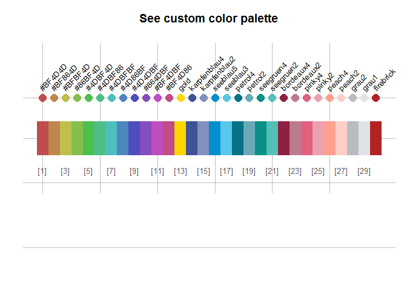

``` r
setwd(paste0(cMyPath, "../"))
```

Target Return and Rebalancing on \[6.5 Minimize expected tail loss with ROI\]
=============================================================================

This also adapts \[Vignette: Portfolio Optimization with CVaR budgetsin PortfolioAnalytics 2010\] for targeting (mean weekly) return equivalent to 36% CAGR while also minimizing risk as measured by (Expected Shortfall) `ES`, possibly also budgeting for (a) a component risk (as a percentage range) or (b) concentration (as equal budget). These variants of portfolio specification are iterated through ahead.

Static Optimization Now (Leading to Dynamic Rebalancing)
--------------------------------------------------------

``` r
require(Rglpk)
```

    ## Loading required package: Rglpk

    ## Loading required package: slam

    ## Using the GLPK callable library version 4.47

``` r
require(quadprog)
```

    ## Loading required package: quadprog

``` r
mustRebalance <- FALSE # TRUE
cESpValue <- 0.925 # Was: 0.925. default 0.95 or higher might result in too few exceedences/
  # outliers esp. for smaller training/rolling windows such as 36. Warnings such as:
  # [Initial scale 0 because more than 'h' (=36) observations are identical.Returning original
  # data; unable to clean data due to error: Lapack routine dgesv: system is exactly singular].
cReturnTargetCwGR <- ifelse(wantLogReturn, log(1 + CaGRtoCwGR(0.36)), CaGRtoCwGR(0.36))
  # Consider target 36% (or 24%) CAGR.
cHHIconcAversion <- c(0, 0.01, 0.06, 0.10, 1e6)[1] # coz can't seem to get ROI to work with (mean xor ES)+conc_aversion
# warning("risk-budgeting/lim needs max return maybe without target.")
  # [The conc_aversion parameter controls how much concentration is
  # penalized. The portfolio concentration is defined as the Herfindahl Hirschman Index of the weights.]
  # conc_aversion=1e6 with min-var objective [High conc_aversion values should result in an equal weight portfolio.]
  # [For otpimization problems solved with theglobal numeric optimizers, the portfolio HHI value is penalized
  # using conc_aversion value as the multiplier. For quadratic utility problems with weight concentration as an
  # objective using the ROI solver, this is implemented as a penalty to the objective function.]
  # [... retrive the objectives to minimize, these should either be "var" and/or "mean"
  # we can eight miniminze variance or maximize quiadratic utility (we will be minimizing the neg. quad. utility)]
warning("minES etc only singletons, for now. ES() crashes on clean=boudt!!"); ESargs.opts <- c(4,3)
```

    ## Warning: minES etc only singletons, for now. ES() crashes on clean=boudt!!

``` r
  # c(2,3) changed 2020Dec26. Was: c(FALSE) # c(FALSE, TRUE)
pfESplus.ix.opts <- c(2:3) # Beware: not c(1,2) for now.
minESv3.ix.opts <- c(1:4) # c(3,1) coz 2 prisk= seems variable "industry standard".
cRebalSpec.ix.opts <- c(9:11, 12:13, 14) # Was: c(14). c(9:11, 12:13) # c(9, 10)

for(cRebalSpec.ix in cRebalSpec.ix.opts){
for(ESargs.ix in ESargs.opts){
for(pfESplus.ix in pfESplus.ix.opts){
  ES.args <- switch(ESargs.ix, # Note: ES args are passed in as a named list.
    list(p=cESpValue, clean="boudt"), # for robustness/ stability.
    list(p=cESpValue, clean="none"), # for conservative (investor) estimates.
    list(p=cESpValue, clean="none", method="gaussian"), # portfolio_method="single" by default.
      # method="gaussian" added 2020Dec26 coz "modified" fails (and "historical" deemed unsuitable for short histories)
      # as it depends on a Kurtosis estimate that exceedingly demands RAM etc. for BSE500 stocks.
    list(p=cESpValue, clean="none", method="gaussian", portfolio_method="component")
  )
  for(minESv3.ix in minESv3.ix.opts){
    pfPreES <- switch(pfESplus.ix,
      init.portFL,
      add.objective(portfolio=init.portFL, type="return", name="mean", target=cReturnTargetCwGR),
      add.objective(portfolio=init.portFL, type="return", name="mean") # without any target= spec.
    )

    etlv2 <- add.objective(portfolio=pfPreES, type="risk", name="ES", arguments=ES.args) # or name="ETL"
    etlv2.RB <- add.objective(portfolio=etlv2, type="risk_budget", name="ES", arguments=ES.args,
      min_prisk=0, max_prisk=0.6) # limits on component risk contribution.
    etlv2.eqRB <- add.objective(portfolio=etlv2, type="risk_budget", name="ES", arguments=ES.args,
      min_concentration=TRUE) # objective with equal component risk contribution.

    pfESplus.preConcAversion <- minESv3 <- list(etlv2, etlv2.RB, etlv2.eqRB, pfPreES)[[minESv3.ix]]
    if(cHHIconcAversion > 0){
      if(minESv3.ix != 4){
        warning(paste0("conc_aversion=", cHHIconcAversion,
          " other than mean xor var seems unsupported by ROI. So, it is ignored."))
        pfESplus <- pfESplus.preConcAversion
      } else {
        pfESplus <- add.objective(portfolio=pfESplus.preConcAversion, type="weight_concentration",
          name="HHI", conc_aversion=cHHIconcAversion)
      }
    } else {
      pfESplus <- pfESplus.preConcAversion
    }

    tmp5.filePrefix <- paste0("opt_pfESplus", "-ESarg", ESargs.ix, # Was: "-clean" till 2020Dec26.
      "Retarg", pfESplus.ix, "ES", minESv3.ix, tStamp()); print(paste0("Starting ", tmp5.filePrefix))
    opt_pfESplus <- optimize.portfolio(R=R, portfolio=pfESplus, optimize_method="ROI",
      momentFUN=cRebalSpec$momentFUN[cRebalSpec.ix], # Added 2020Dec23
      trace=TRUE)
    saveRDS(opt_pfESplus, file=paste0(paste0(results.dir, "/"), tmp5.filePrefix, ".rds"))
    print(opt_pfESplus)
    charTitle <- tmp5.filePrefix
      # paste0("ETL Optimization", "-ESarg", ESargs.ix, "-targRet", pfESplus.ix, "ES", minESv3.ix)
    chart.Weights(opt_pfESplus, main=charTitle)
    if(FALSE){
      warning("Following plot() crashes the R session for 380+ assets!  Manually run iff needed.")
      plot(opt_pfESplus, risk.col="ES", return.col="mean", main=charTitle) # , chart.assets=TRUE)
    } # else continue.

    if(mustRebalance){
      btopt_pfESplus <- optimize.portfolio.rebalancing(R=R, portfolio=pfESplus,
        optimize_method="ROI", trace=TRUE,
        momentFUN=cRebalSpec$momentFUN[cRebalSpec.ix], # Added 2020Dec23
        rebalance_on=cRebalSpec$rebalance_on[cRebalSpec.ix], # Was: "quarters",
        training_period=cRebalSpec$training_period[cRebalSpec.ix], # Was: 36
        rolling_window=cRebalSpec$rolling_window[cRebalSpec.ix])
      saveRDS(btopt_pfESplus, file=paste0(paste0(results.dir, "/"),
        paste0("bt-rebal", cRebalSpec.ix, tmp5.filePrefix), tStamp(), ".rds"))
      print(btopt_pfESplus)
      if(FALSE){ # to avoid possible crashing due to large set of assets.
        btpfRets <- summary(btopt_pfESplus)$portfolio_returns
        rebalWts <- mychart.Weights(btopt_pfESplus, main=paste0("Weights", charTitle)); print(tail(round(rebalWts, 3), 6))
        # chart.Weights(btopt_pfESplus, main=paste0("Weights", charTitle),
        #   cex.legend=0.8/2) # , col=my_colors) # ylim=c(1.2),
        # # col=my_colors # bluemono)
        charts.PerformanceSummary(btpfRets, main=paste0("performance ", charTitle))
        # , col=my_colors)
      } # else continue
    } # else continue
  }
}
}
}
```

    ## [1] "Starting opt_pfESplus-ESarg4Retarg2ES1-202101012250"
    ## ***********************************
    ## PortfolioAnalytics Optimization
    ## ***********************************
    ## 
    ## Call:
    ## optimize.portfolio(R = R, portfolio = pfESplus, optimize_method = "ROI", 
    ##     trace = TRUE, momentFUN = cRebalSpec$momentFUN[cRebalSpec.ix])
    ## 
    ## Optimal Weights:
    ##   RELIANCE   HDFCBANK  ICICIBANK       HDFC        ITC   AXISBANK       SBIN 
    ##     0.0000     0.0000     0.0000     0.0000     0.0000     0.0000     0.0000 
    ##         LT BAJFINANCE       INFY BHARTIARTL        TCS        M.M  KOTAKBANK 
    ##     0.0000     0.0000     0.0791     0.0000     0.0000     0.0000     0.0000 
    ## INDUSINDBK       ONGC       NTPC TATAMOTORS  TATASTEEL     MARUTI   DIVISLAB 
    ##     0.0000     0.0000     0.0000     0.0000     0.0000     0.0000     0.0000 
    ##   HINDALCO  SUNPHARMA       VEDL HINDUNILVR    HCLTECH BAJAJFINSV  POWERGRID 
    ##     0.0000     0.0000     0.0000     0.0000     0.0000     0.0000     0.0000 
    ##       BPCL ASIANPAINT      TITAN    DRREDDY       GAIL HEROMOTOCO  COALINDIA 
    ##     0.0000     0.0000     0.0000     0.0000     0.0000     0.0000     0.0000 
    ##        IOC      TECHM ULTRACEMCO BAJAJ.AUTO ADANIPORTS     GRASIM      WIPRO 
    ##     0.0000     0.0000     0.0000     0.0000     0.0000     0.0000     0.0000 
    ##        UPL   JSWSTEEL       ZEEL     NAUKRI FEDERALBNK MOTHERSUMI  TATAPOWER 
    ##     0.0000     0.0000     0.0000     0.0106     0.0000     0.0000     0.0000 
    ##  BRITANNIA  AMBUJACEM  EICHERMOT AUROPHARMA SRTRANSFIN        BEL        PEL 
    ##     0.0000     0.0000     0.0000     0.0000     0.0000     0.0000     0.0000 
    ##   PETRONET        DLF      LUPIN     VOLTAS    HAVELLS     BIOCON        PFC 
    ##     0.0000     0.0000     0.0000     0.0000     0.0000     0.0000     0.0000 
    ##   ASHOKLEY   CHOLAFIN      CIPLA   SHREECEM     COLPAL BHARATFORG        SRF 
    ##     0.0000     0.0046     0.0000     0.0000     0.0000     0.0000     0.0000 
    ## PIDILITIND JINDALSTEL   ADANIENT     RECLTD     CONCOR    ESCORTS        ACC 
    ##     0.0064     0.0000     0.0000     0.0000     0.0000     0.0000     0.0000 
    ##   RAMCOCEM     MARICO     M.MFIN   GODREJCP  NESTLEIND  LICHSGFIN MANAPPURAM 
    ##     0.0000     0.0000     0.0000     0.0000     0.0000     0.0000     0.0000 
    ## BALKRISIND   CADILAHC      PIIND   BOSCHLTD GODREJPROP       NMDC BANKBARODA 
    ##     0.0000     0.0000     0.0000     0.0000     0.0000     0.0000     0.0000 
    ##   INDHOTEL    SIEMENS APOLLOHOSP TORNTPHARM   TVSMOTOR   JUBLFOOD CUMMINSIND 
    ##     0.0000     0.0000     0.0000     0.0000     0.0000     0.0000     0.0000 
    ##       IDEA PHOENIXLTD   GMRINFRA        MRF        IGL  BATAINDIA APOLLOTYRE 
    ##     0.0000     0.0000     0.0000     0.0000     0.0763     0.0000     0.0000 
    ## MUTHOOTFIN SUNDRMFAST     APLLTD       BHEL      L.TFH   EXIDEIND NATIONALUM 
    ##     0.0000     0.0000     0.0707     0.0000     0.0000     0.0000     0.0000 
    ##        CUB   GLENMARK AMARAJABAT        PVR SUPREMEIND NAVINFLUOR TORNTPOWER 
    ##     0.0000     0.0000     0.0000     0.0000     0.0000     0.0693     0.0000 
    ##      CANBK   DEEPAKNI   GRANULES    PAGEIND TATAMTRDVR BERGEPAINT   AARTIIND 
    ##     0.0000     0.0000     0.0000     0.0000     0.0000     0.0000     0.0000 
    ##  APLAPOLLO        PNB        UBL      DABUR  WHIRLPOOL       GSPL      TRENT 
    ##     0.0000     0.0000     0.0000     0.0000     0.0000     0.0000     0.0000 
    ##     FORTIS    DCBBANK   TATACOMM        NCC  TATAELXSI     CYIENT       IDFC 
    ##     0.0000     0.0000     0.0000     0.0000     0.0000     0.0000     0.0000 
    ##      GLAXO        OIL JMFINANCIL NATCOPHARM CANFINHOME       RAIN       ATUL 
    ##     0.0000     0.0000     0.0000     0.0000     0.0000     0.0000     0.0000 
    ## RAJESHEXPO       SAIL   SPICEJET       NHPC        MCX      SUNTV  REDINGTON 
    ##     0.0000     0.0000     0.0000     0.0000     0.0000     0.0000     0.0000 
    ##   MINDTREE   X3MINDIA      TANLA   EIDPARRY   GRAPHITE  GODREJIND  EDELWEISS 
    ##     0.0171     0.0000     0.0000     0.0000     0.0000     0.0000     0.0000 
    ##  LAXMIMACH     GESHIP   HINDZINC CASTROLIND       CESC   INDIACEM        FSL 
    ##     0.0000     0.0000     0.0000     0.0000     0.0000     0.0000     0.0000 
    ##       GNFC ABBOTINDIA ADANIPOWER  VAKRANGEE  UNIONBANK DCMSHRIRAM    WELCORP 
    ##     0.0000     0.0699     0.0000     0.0000     0.0000     0.0000     0.0000 
    ##   ALOKTEXT  DELTACORP  IBREALEST    KPRMILL        ABB  FINCABLES    CEATLTD 
    ##     0.0000     0.0000     0.0000     0.0000     0.0000     0.0000     0.0000 
    ##     VIPIND    KTKBANK     RALLIS CENTURYTEX BALRAMCHIN       IIFL       OFSS 
    ##     0.0000     0.0000     0.0000     0.0000     0.0000     0.0000     0.0000 
    ##     RELAXO        KEC AJANTPHARM   WESTLIFE TV18BRDCST  SOUTHBANK       GPPL 
    ##     0.0709     0.0000     0.0000     0.0277     0.0000     0.0000     0.0000 
    ## KALPATPOWR HINDCOPPER       STAR AARTIDRUGS SHRIRAMCIT       CERA WOCKPHARMA 
    ##     0.0000     0.0000     0.0000     0.0552     0.0000     0.0000     0.0000 
    ##  BAJAJELEC ENGINERSIN       GSFC COROMANDEL   AEGISLOG      IOLCP       BEML 
    ##     0.0000     0.0000     0.0000     0.0000     0.0000     0.0283     0.0000 
    ##        IRB      UFLEX       BASF    INDIANB  AKZOINDIA       BBTC SONATSOFTW 
    ##     0.0000     0.0000     0.0000     0.0000     0.0000     0.0000     0.0000 
    ##    SEQUENT    EIHOTEL  BAYERCROP  ZYDUSWELL  JSWENERGY WELSPUNIND     DISHTV 
    ##     0.0000     0.0000     0.0000     0.0000     0.0000     0.0000     0.0000 
    ## CARBORUNIV        HEG        PTC VINATIORGA     TIMKEN       HFCL        VTL 
    ##     0.0000     0.0000     0.0000     0.0000     0.0000     0.0000     0.0000 
    ## ZENSARTECH      SPARC     ECLERX    RAYMOND    TRIDENT     ASHOKA     RADICO 
    ##     0.0000     0.0000     0.0000     0.0000     0.0000     0.0000     0.0000 
    ## ALKYLAMINE  BANKINDIA SUDARSCHEM    IPCALAB OBEROIRLTY        FDC GODFRYPHLP 
    ##     0.1318     0.0000     0.0000     0.0000     0.0000     0.0000     0.0000 
    ##  SHILPAMED PHILIPCARB       MOIL      SOBHA       MEGH   PRESTIGE     VSTIND 
    ##     0.0000     0.0000     0.0000     0.0000     0.0000     0.0000     0.0000 
    ## MAHSCOOTER      NOCIL INOXLEISUR       GHCL TATAINVEST   NLCINDIA  JYOTHYLAB 
    ##     0.0000     0.0000     0.0000     0.0000     0.0000     0.0000     0.0000 
    ## KAJARIACER   GILLETTE  RESPONIND MOTILALOFS       KRBL       SJVN   ALLCARGO 
    ##     0.0000     0.0000     0.0000     0.0000     0.0000     0.0000     0.0000 
    ##  ORIENTREF       DCAL CHENNPETRO   SKFINDIA FINOLEXIND CENTURYPLY        SCI 
    ##     0.0000     0.0000     0.0000     0.0000     0.0000     0.0000     0.0000 
    ##        GDL GREAVESCOT HERITGFOOD SHOPERSTOP  BOMDYEING     KNRCON HAWKINCOOK 
    ##     0.0000     0.0000     0.0000     0.0000     0.0000     0.0000     0.0000 
    ##     VENKYS  JINDALSAW    JKPAPER  ESABINDIA   MAHABANK SCHAEFFLER BIRLACORPN 
    ##     0.0000     0.0000     0.0000     0.0000     0.0000     0.0000     0.0000 
    ## BALMLAWRIE       MFSL       PGHH   MINDAIND     VGUARD LINDEINDIA      JCHAC 
    ##     0.0000     0.0000     0.0839     0.0371     0.0000     0.0000     0.0000 
    ##       KSCL    LAOPALA TATACOFFEE TRITURBINE DEEPAKFERT   ASTRAZEN  JKLAKSHMI 
    ##     0.0000     0.0050     0.0000     0.0000     0.0000     0.0000     0.0000 
    ## VAIBHAVGBL   SUPRAJIT        GMM     IFBIND       IDBI   FORCEMOT    THERMAX 
    ##     0.0557     0.0000     0.0000     0.0000     0.0000     0.0000     0.0000 
    ##  SOLARINDS   BLUEDART      NESCO  JAMNAAUTO        JSL    DHANUKA TVSSRICHAK 
    ##     0.0175     0.0000     0.0000     0.0000     0.0000     0.0000     0.0000 
    ## TATAMETALI       MRPL NBVENTURES BAJAJHLDNG   JUBILANT JBCHEPHARM CHAMBLFERT 
    ##     0.0000     0.0000     0.0000     0.0000     0.0000     0.0000     0.0000 
    ##        KEI TTKPRESTIG    SUNTECK      CAPPL  NETWORK18  GUJALKALI  CENTRALBK 
    ##     0.0000     0.0000     0.0000     0.0000     0.0000     0.0000     0.0000 
    ##    J.KBANK       HSCL    GMDCLTD     PFIZER      MHRIL NAVNETEDUL        RCF 
    ##     0.0000     0.0000     0.0000     0.0000     0.0000     0.0000     0.0000 
    ##        IOB    TVTODAY  SCHNEIDER  RATNAMANI     JKTYRE    UCOBANK      GEPIL 
    ##     0.0000     0.0000     0.0000     0.0000     0.0000     0.0000     0.0000 
    ##  FCONSUMER TIMETECHNO     JAGRAN       MMTC     SANOFI        CCL SWANENERGY 
    ##     0.0000     0.0000     0.0000     0.0000     0.0000     0.0000     0.0000 
    ## JAICORPLTD     DBCORP   BLISSGVS WABCOINDIA      OMAXE    HATHWAY  MAHINDCIE 
    ##     0.0000     0.0000     0.0000     0.0000     0.0000     0.0000     0.0000 
    ##    MAHLIFE        ITI   EMAMILTD     ASTRAL   SYMPHONY     INDOCO   NILKAMAL 
    ##     0.0000     0.0000     0.0000     0.0827     0.0000     0.0000     0.0000 
    ##     SUZLON       IFCI       ITDC     CRISIL    BRIGADE BLUESTARCO MAHSEAMLES 
    ##     0.0000     0.0000     0.0000     0.0000     0.0000     0.0000     0.0000 
    ## HEIDELBERG    POLYMED  GRINDWELL  KANSAINER     AIAENG   TASTYBIT PERSISTENT 
    ##     0.0000     0.0000     0.0000     0.0000     0.0000     0.0000     0.0000 
    ##   JKCEMENT    MPHASIS     HONAUT  HINDPETRO 
    ##     0.0000     0.0000     0.0000     0.0000 
    ## 
    ## Objective Measure:
    ##     mean 
    ## 0.009028 
    ## 
    ## 
    ##      ES 
    ## 0.03268

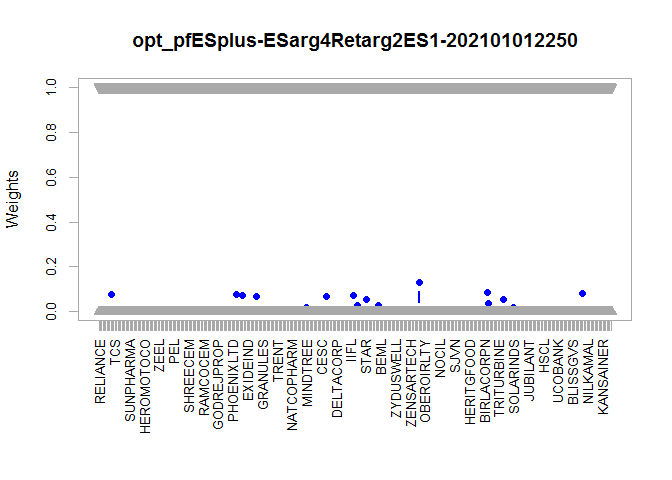

    ## [1] "Starting opt_pfESplus-ESarg4Retarg2ES2-202101012251"
    ## ***********************************
    ## PortfolioAnalytics Optimization
    ## ***********************************
    ## 
    ## Call:
    ## optimize.portfolio(R = R, portfolio = pfESplus, optimize_method = "ROI", 
    ##     trace = TRUE, momentFUN = cRebalSpec$momentFUN[cRebalSpec.ix])
    ## 
    ## Optimal Weights:
    ##   RELIANCE   HDFCBANK  ICICIBANK       HDFC        ITC   AXISBANK       SBIN 
    ##     0.0000     0.0000     0.0000     0.0000     0.0000     0.0000     0.0000 
    ##         LT BAJFINANCE       INFY BHARTIARTL        TCS        M.M  KOTAKBANK 
    ##     0.0000     0.0000     0.0791     0.0000     0.0000     0.0000     0.0000 
    ## INDUSINDBK       ONGC       NTPC TATAMOTORS  TATASTEEL     MARUTI   DIVISLAB 
    ##     0.0000     0.0000     0.0000     0.0000     0.0000     0.0000     0.0000 
    ##   HINDALCO  SUNPHARMA       VEDL HINDUNILVR    HCLTECH BAJAJFINSV  POWERGRID 
    ##     0.0000     0.0000     0.0000     0.0000     0.0000     0.0000     0.0000 
    ##       BPCL ASIANPAINT      TITAN    DRREDDY       GAIL HEROMOTOCO  COALINDIA 
    ##     0.0000     0.0000     0.0000     0.0000     0.0000     0.0000     0.0000 
    ##        IOC      TECHM ULTRACEMCO BAJAJ.AUTO ADANIPORTS     GRASIM      WIPRO 
    ##     0.0000     0.0000     0.0000     0.0000     0.0000     0.0000     0.0000 
    ##        UPL   JSWSTEEL       ZEEL     NAUKRI FEDERALBNK MOTHERSUMI  TATAPOWER 
    ##     0.0000     0.0000     0.0000     0.0106     0.0000     0.0000     0.0000 
    ##  BRITANNIA  AMBUJACEM  EICHERMOT AUROPHARMA SRTRANSFIN        BEL        PEL 
    ##     0.0000     0.0000     0.0000     0.0000     0.0000     0.0000     0.0000 
    ##   PETRONET        DLF      LUPIN     VOLTAS    HAVELLS     BIOCON        PFC 
    ##     0.0000     0.0000     0.0000     0.0000     0.0000     0.0000     0.0000 
    ##   ASHOKLEY   CHOLAFIN      CIPLA   SHREECEM     COLPAL BHARATFORG        SRF 
    ##     0.0000     0.0046     0.0000     0.0000     0.0000     0.0000     0.0000 
    ## PIDILITIND JINDALSTEL   ADANIENT     RECLTD     CONCOR    ESCORTS        ACC 
    ##     0.0064     0.0000     0.0000     0.0000     0.0000     0.0000     0.0000 
    ##   RAMCOCEM     MARICO     M.MFIN   GODREJCP  NESTLEIND  LICHSGFIN MANAPPURAM 
    ##     0.0000     0.0000     0.0000     0.0000     0.0000     0.0000     0.0000 
    ## BALKRISIND   CADILAHC      PIIND   BOSCHLTD GODREJPROP       NMDC BANKBARODA 
    ##     0.0000     0.0000     0.0000     0.0000     0.0000     0.0000     0.0000 
    ##   INDHOTEL    SIEMENS APOLLOHOSP TORNTPHARM   TVSMOTOR   JUBLFOOD CUMMINSIND 
    ##     0.0000     0.0000     0.0000     0.0000     0.0000     0.0000     0.0000 
    ##       IDEA PHOENIXLTD   GMRINFRA        MRF        IGL  BATAINDIA APOLLOTYRE 
    ##     0.0000     0.0000     0.0000     0.0000     0.0763     0.0000     0.0000 
    ## MUTHOOTFIN SUNDRMFAST     APLLTD       BHEL      L.TFH   EXIDEIND NATIONALUM 
    ##     0.0000     0.0000     0.0707     0.0000     0.0000     0.0000     0.0000 
    ##        CUB   GLENMARK AMARAJABAT        PVR SUPREMEIND NAVINFLUOR TORNTPOWER 
    ##     0.0000     0.0000     0.0000     0.0000     0.0000     0.0693     0.0000 
    ##      CANBK   DEEPAKNI   GRANULES    PAGEIND TATAMTRDVR BERGEPAINT   AARTIIND 
    ##     0.0000     0.0000     0.0000     0.0000     0.0000     0.0000     0.0000 
    ##  APLAPOLLO        PNB        UBL      DABUR  WHIRLPOOL       GSPL      TRENT 
    ##     0.0000     0.0000     0.0000     0.0000     0.0000     0.0000     0.0000 
    ##     FORTIS    DCBBANK   TATACOMM        NCC  TATAELXSI     CYIENT       IDFC 
    ##     0.0000     0.0000     0.0000     0.0000     0.0000     0.0000     0.0000 
    ##      GLAXO        OIL JMFINANCIL NATCOPHARM CANFINHOME       RAIN       ATUL 
    ##     0.0000     0.0000     0.0000     0.0000     0.0000     0.0000     0.0000 
    ## RAJESHEXPO       SAIL   SPICEJET       NHPC        MCX      SUNTV  REDINGTON 
    ##     0.0000     0.0000     0.0000     0.0000     0.0000     0.0000     0.0000 
    ##   MINDTREE   X3MINDIA      TANLA   EIDPARRY   GRAPHITE  GODREJIND  EDELWEISS 
    ##     0.0171     0.0000     0.0000     0.0000     0.0000     0.0000     0.0000 
    ##  LAXMIMACH     GESHIP   HINDZINC CASTROLIND       CESC   INDIACEM        FSL 
    ##     0.0000     0.0000     0.0000     0.0000     0.0000     0.0000     0.0000 
    ##       GNFC ABBOTINDIA ADANIPOWER  VAKRANGEE  UNIONBANK DCMSHRIRAM    WELCORP 
    ##     0.0000     0.0699     0.0000     0.0000     0.0000     0.0000     0.0000 
    ##   ALOKTEXT  DELTACORP  IBREALEST    KPRMILL        ABB  FINCABLES    CEATLTD 
    ##     0.0000     0.0000     0.0000     0.0000     0.0000     0.0000     0.0000 
    ##     VIPIND    KTKBANK     RALLIS CENTURYTEX BALRAMCHIN       IIFL       OFSS 
    ##     0.0000     0.0000     0.0000     0.0000     0.0000     0.0000     0.0000 
    ##     RELAXO        KEC AJANTPHARM   WESTLIFE TV18BRDCST  SOUTHBANK       GPPL 
    ##     0.0709     0.0000     0.0000     0.0277     0.0000     0.0000     0.0000 
    ## KALPATPOWR HINDCOPPER       STAR AARTIDRUGS SHRIRAMCIT       CERA WOCKPHARMA 
    ##     0.0000     0.0000     0.0000     0.0552     0.0000     0.0000     0.0000 
    ##  BAJAJELEC ENGINERSIN       GSFC COROMANDEL   AEGISLOG      IOLCP       BEML 
    ##     0.0000     0.0000     0.0000     0.0000     0.0000     0.0283     0.0000 
    ##        IRB      UFLEX       BASF    INDIANB  AKZOINDIA       BBTC SONATSOFTW 
    ##     0.0000     0.0000     0.0000     0.0000     0.0000     0.0000     0.0000 
    ##    SEQUENT    EIHOTEL  BAYERCROP  ZYDUSWELL  JSWENERGY WELSPUNIND     DISHTV 
    ##     0.0000     0.0000     0.0000     0.0000     0.0000     0.0000     0.0000 
    ## CARBORUNIV        HEG        PTC VINATIORGA     TIMKEN       HFCL        VTL 
    ##     0.0000     0.0000     0.0000     0.0000     0.0000     0.0000     0.0000 
    ## ZENSARTECH      SPARC     ECLERX    RAYMOND    TRIDENT     ASHOKA     RADICO 
    ##     0.0000     0.0000     0.0000     0.0000     0.0000     0.0000     0.0000 
    ## ALKYLAMINE  BANKINDIA SUDARSCHEM    IPCALAB OBEROIRLTY        FDC GODFRYPHLP 
    ##     0.1318     0.0000     0.0000     0.0000     0.0000     0.0000     0.0000 
    ##  SHILPAMED PHILIPCARB       MOIL      SOBHA       MEGH   PRESTIGE     VSTIND 
    ##     0.0000     0.0000     0.0000     0.0000     0.0000     0.0000     0.0000 
    ## MAHSCOOTER      NOCIL INOXLEISUR       GHCL TATAINVEST   NLCINDIA  JYOTHYLAB 
    ##     0.0000     0.0000     0.0000     0.0000     0.0000     0.0000     0.0000 
    ## KAJARIACER   GILLETTE  RESPONIND MOTILALOFS       KRBL       SJVN   ALLCARGO 
    ##     0.0000     0.0000     0.0000     0.0000     0.0000     0.0000     0.0000 
    ##  ORIENTREF       DCAL CHENNPETRO   SKFINDIA FINOLEXIND CENTURYPLY        SCI 
    ##     0.0000     0.0000     0.0000     0.0000     0.0000     0.0000     0.0000 
    ##        GDL GREAVESCOT HERITGFOOD SHOPERSTOP  BOMDYEING     KNRCON HAWKINCOOK 
    ##     0.0000     0.0000     0.0000     0.0000     0.0000     0.0000     0.0000 
    ##     VENKYS  JINDALSAW    JKPAPER  ESABINDIA   MAHABANK SCHAEFFLER BIRLACORPN 
    ##     0.0000     0.0000     0.0000     0.0000     0.0000     0.0000     0.0000 
    ## BALMLAWRIE       MFSL       PGHH   MINDAIND     VGUARD LINDEINDIA      JCHAC 
    ##     0.0000     0.0000     0.0839     0.0371     0.0000     0.0000     0.0000 
    ##       KSCL    LAOPALA TATACOFFEE TRITURBINE DEEPAKFERT   ASTRAZEN  JKLAKSHMI 
    ##     0.0000     0.0050     0.0000     0.0000     0.0000     0.0000     0.0000 
    ## VAIBHAVGBL   SUPRAJIT        GMM     IFBIND       IDBI   FORCEMOT    THERMAX 
    ##     0.0557     0.0000     0.0000     0.0000     0.0000     0.0000     0.0000 
    ##  SOLARINDS   BLUEDART      NESCO  JAMNAAUTO        JSL    DHANUKA TVSSRICHAK 
    ##     0.0175     0.0000     0.0000     0.0000     0.0000     0.0000     0.0000 
    ## TATAMETALI       MRPL NBVENTURES BAJAJHLDNG   JUBILANT JBCHEPHARM CHAMBLFERT 
    ##     0.0000     0.0000     0.0000     0.0000     0.0000     0.0000     0.0000 
    ##        KEI TTKPRESTIG    SUNTECK      CAPPL  NETWORK18  GUJALKALI  CENTRALBK 
    ##     0.0000     0.0000     0.0000     0.0000     0.0000     0.0000     0.0000 
    ##    J.KBANK       HSCL    GMDCLTD     PFIZER      MHRIL NAVNETEDUL        RCF 
    ##     0.0000     0.0000     0.0000     0.0000     0.0000     0.0000     0.0000 
    ##        IOB    TVTODAY  SCHNEIDER  RATNAMANI     JKTYRE    UCOBANK      GEPIL 
    ##     0.0000     0.0000     0.0000     0.0000     0.0000     0.0000     0.0000 
    ##  FCONSUMER TIMETECHNO     JAGRAN       MMTC     SANOFI        CCL SWANENERGY 
    ##     0.0000     0.0000     0.0000     0.0000     0.0000     0.0000     0.0000 
    ## JAICORPLTD     DBCORP   BLISSGVS WABCOINDIA      OMAXE    HATHWAY  MAHINDCIE 
    ##     0.0000     0.0000     0.0000     0.0000     0.0000     0.0000     0.0000 
    ##    MAHLIFE        ITI   EMAMILTD     ASTRAL   SYMPHONY     INDOCO   NILKAMAL 
    ##     0.0000     0.0000     0.0000     0.0827     0.0000     0.0000     0.0000 
    ##     SUZLON       IFCI       ITDC     CRISIL    BRIGADE BLUESTARCO MAHSEAMLES 
    ##     0.0000     0.0000     0.0000     0.0000     0.0000     0.0000     0.0000 
    ## HEIDELBERG    POLYMED  GRINDWELL  KANSAINER     AIAENG   TASTYBIT PERSISTENT 
    ##     0.0000     0.0000     0.0000     0.0000     0.0000     0.0000     0.0000 
    ##   JKCEMENT    MPHASIS     HONAUT  HINDPETRO 
    ##     0.0000     0.0000     0.0000     0.0000 
    ## 
    ## Objective Measure:
    ##     mean 
    ## 0.009028 
    ## 
    ## 
    ##      ES 
    ## 0.03268


    ## [1] "Starting opt_pfESplus-ESarg4Retarg2ES3-202101012251"
    ## ***********************************
    ## PortfolioAnalytics Optimization
    ## ***********************************
    ## 
    ## Call:
    ## optimize.portfolio(R = R, portfolio = pfESplus, optimize_method = "ROI", 
    ##     trace = TRUE, momentFUN = cRebalSpec$momentFUN[cRebalSpec.ix])
    ## 
    ## Optimal Weights:
    ##   RELIANCE   HDFCBANK  ICICIBANK       HDFC        ITC   AXISBANK       SBIN 
    ##     0.0000     0.0000     0.0000     0.0000     0.0000     0.0000     0.0000 
    ##         LT BAJFINANCE       INFY BHARTIARTL        TCS        M.M  KOTAKBANK 
    ##     0.0000     0.0000     0.0791     0.0000     0.0000     0.0000     0.0000 
    ## INDUSINDBK       ONGC       NTPC TATAMOTORS  TATASTEEL     MARUTI   DIVISLAB 
    ##     0.0000     0.0000     0.0000     0.0000     0.0000     0.0000     0.0000 
    ##   HINDALCO  SUNPHARMA       VEDL HINDUNILVR    HCLTECH BAJAJFINSV  POWERGRID 
    ##     0.0000     0.0000     0.0000     0.0000     0.0000     0.0000     0.0000 
    ##       BPCL ASIANPAINT      TITAN    DRREDDY       GAIL HEROMOTOCO  COALINDIA 
    ##     0.0000     0.0000     0.0000     0.0000     0.0000     0.0000     0.0000 
    ##        IOC      TECHM ULTRACEMCO BAJAJ.AUTO ADANIPORTS     GRASIM      WIPRO 
    ##     0.0000     0.0000     0.0000     0.0000     0.0000     0.0000     0.0000 
    ##        UPL   JSWSTEEL       ZEEL     NAUKRI FEDERALBNK MOTHERSUMI  TATAPOWER 
    ##     0.0000     0.0000     0.0000     0.0106     0.0000     0.0000     0.0000 
    ##  BRITANNIA  AMBUJACEM  EICHERMOT AUROPHARMA SRTRANSFIN        BEL        PEL 
    ##     0.0000     0.0000     0.0000     0.0000     0.0000     0.0000     0.0000 
    ##   PETRONET        DLF      LUPIN     VOLTAS    HAVELLS     BIOCON        PFC 
    ##     0.0000     0.0000     0.0000     0.0000     0.0000     0.0000     0.0000 
    ##   ASHOKLEY   CHOLAFIN      CIPLA   SHREECEM     COLPAL BHARATFORG        SRF 
    ##     0.0000     0.0046     0.0000     0.0000     0.0000     0.0000     0.0000 
    ## PIDILITIND JINDALSTEL   ADANIENT     RECLTD     CONCOR    ESCORTS        ACC 
    ##     0.0064     0.0000     0.0000     0.0000     0.0000     0.0000     0.0000 
    ##   RAMCOCEM     MARICO     M.MFIN   GODREJCP  NESTLEIND  LICHSGFIN MANAPPURAM 
    ##     0.0000     0.0000     0.0000     0.0000     0.0000     0.0000     0.0000 
    ## BALKRISIND   CADILAHC      PIIND   BOSCHLTD GODREJPROP       NMDC BANKBARODA 
    ##     0.0000     0.0000     0.0000     0.0000     0.0000     0.0000     0.0000 
    ##   INDHOTEL    SIEMENS APOLLOHOSP TORNTPHARM   TVSMOTOR   JUBLFOOD CUMMINSIND 
    ##     0.0000     0.0000     0.0000     0.0000     0.0000     0.0000     0.0000 
    ##       IDEA PHOENIXLTD   GMRINFRA        MRF        IGL  BATAINDIA APOLLOTYRE 
    ##     0.0000     0.0000     0.0000     0.0000     0.0763     0.0000     0.0000 
    ## MUTHOOTFIN SUNDRMFAST     APLLTD       BHEL      L.TFH   EXIDEIND NATIONALUM 
    ##     0.0000     0.0000     0.0707     0.0000     0.0000     0.0000     0.0000 
    ##        CUB   GLENMARK AMARAJABAT        PVR SUPREMEIND NAVINFLUOR TORNTPOWER 
    ##     0.0000     0.0000     0.0000     0.0000     0.0000     0.0693     0.0000 
    ##      CANBK   DEEPAKNI   GRANULES    PAGEIND TATAMTRDVR BERGEPAINT   AARTIIND 
    ##     0.0000     0.0000     0.0000     0.0000     0.0000     0.0000     0.0000 
    ##  APLAPOLLO        PNB        UBL      DABUR  WHIRLPOOL       GSPL      TRENT 
    ##     0.0000     0.0000     0.0000     0.0000     0.0000     0.0000     0.0000 
    ##     FORTIS    DCBBANK   TATACOMM        NCC  TATAELXSI     CYIENT       IDFC 
    ##     0.0000     0.0000     0.0000     0.0000     0.0000     0.0000     0.0000 
    ##      GLAXO        OIL JMFINANCIL NATCOPHARM CANFINHOME       RAIN       ATUL 
    ##     0.0000     0.0000     0.0000     0.0000     0.0000     0.0000     0.0000 
    ## RAJESHEXPO       SAIL   SPICEJET       NHPC        MCX      SUNTV  REDINGTON 
    ##     0.0000     0.0000     0.0000     0.0000     0.0000     0.0000     0.0000 
    ##   MINDTREE   X3MINDIA      TANLA   EIDPARRY   GRAPHITE  GODREJIND  EDELWEISS 
    ##     0.0171     0.0000     0.0000     0.0000     0.0000     0.0000     0.0000 
    ##  LAXMIMACH     GESHIP   HINDZINC CASTROLIND       CESC   INDIACEM        FSL 
    ##     0.0000     0.0000     0.0000     0.0000     0.0000     0.0000     0.0000 
    ##       GNFC ABBOTINDIA ADANIPOWER  VAKRANGEE  UNIONBANK DCMSHRIRAM    WELCORP 
    ##     0.0000     0.0699     0.0000     0.0000     0.0000     0.0000     0.0000 
    ##   ALOKTEXT  DELTACORP  IBREALEST    KPRMILL        ABB  FINCABLES    CEATLTD 
    ##     0.0000     0.0000     0.0000     0.0000     0.0000     0.0000     0.0000 
    ##     VIPIND    KTKBANK     RALLIS CENTURYTEX BALRAMCHIN       IIFL       OFSS 
    ##     0.0000     0.0000     0.0000     0.0000     0.0000     0.0000     0.0000 
    ##     RELAXO        KEC AJANTPHARM   WESTLIFE TV18BRDCST  SOUTHBANK       GPPL 
    ##     0.0709     0.0000     0.0000     0.0277     0.0000     0.0000     0.0000 
    ## KALPATPOWR HINDCOPPER       STAR AARTIDRUGS SHRIRAMCIT       CERA WOCKPHARMA 
    ##     0.0000     0.0000     0.0000     0.0552     0.0000     0.0000     0.0000 
    ##  BAJAJELEC ENGINERSIN       GSFC COROMANDEL   AEGISLOG      IOLCP       BEML 
    ##     0.0000     0.0000     0.0000     0.0000     0.0000     0.0283     0.0000 
    ##        IRB      UFLEX       BASF    INDIANB  AKZOINDIA       BBTC SONATSOFTW 
    ##     0.0000     0.0000     0.0000     0.0000     0.0000     0.0000     0.0000 
    ##    SEQUENT    EIHOTEL  BAYERCROP  ZYDUSWELL  JSWENERGY WELSPUNIND     DISHTV 
    ##     0.0000     0.0000     0.0000     0.0000     0.0000     0.0000     0.0000 
    ## CARBORUNIV        HEG        PTC VINATIORGA     TIMKEN       HFCL        VTL 
    ##     0.0000     0.0000     0.0000     0.0000     0.0000     0.0000     0.0000 
    ## ZENSARTECH      SPARC     ECLERX    RAYMOND    TRIDENT     ASHOKA     RADICO 
    ##     0.0000     0.0000     0.0000     0.0000     0.0000     0.0000     0.0000 
    ## ALKYLAMINE  BANKINDIA SUDARSCHEM    IPCALAB OBEROIRLTY        FDC GODFRYPHLP 
    ##     0.1318     0.0000     0.0000     0.0000     0.0000     0.0000     0.0000 
    ##  SHILPAMED PHILIPCARB       MOIL      SOBHA       MEGH   PRESTIGE     VSTIND 
    ##     0.0000     0.0000     0.0000     0.0000     0.0000     0.0000     0.0000 
    ## MAHSCOOTER      NOCIL INOXLEISUR       GHCL TATAINVEST   NLCINDIA  JYOTHYLAB 
    ##     0.0000     0.0000     0.0000     0.0000     0.0000     0.0000     0.0000 
    ## KAJARIACER   GILLETTE  RESPONIND MOTILALOFS       KRBL       SJVN   ALLCARGO 
    ##     0.0000     0.0000     0.0000     0.0000     0.0000     0.0000     0.0000 
    ##  ORIENTREF       DCAL CHENNPETRO   SKFINDIA FINOLEXIND CENTURYPLY        SCI 
    ##     0.0000     0.0000     0.0000     0.0000     0.0000     0.0000     0.0000 
    ##        GDL GREAVESCOT HERITGFOOD SHOPERSTOP  BOMDYEING     KNRCON HAWKINCOOK 
    ##     0.0000     0.0000     0.0000     0.0000     0.0000     0.0000     0.0000 
    ##     VENKYS  JINDALSAW    JKPAPER  ESABINDIA   MAHABANK SCHAEFFLER BIRLACORPN 
    ##     0.0000     0.0000     0.0000     0.0000     0.0000     0.0000     0.0000 
    ## BALMLAWRIE       MFSL       PGHH   MINDAIND     VGUARD LINDEINDIA      JCHAC 
    ##     0.0000     0.0000     0.0839     0.0371     0.0000     0.0000     0.0000 
    ##       KSCL    LAOPALA TATACOFFEE TRITURBINE DEEPAKFERT   ASTRAZEN  JKLAKSHMI 
    ##     0.0000     0.0050     0.0000     0.0000     0.0000     0.0000     0.0000 
    ## VAIBHAVGBL   SUPRAJIT        GMM     IFBIND       IDBI   FORCEMOT    THERMAX 
    ##     0.0557     0.0000     0.0000     0.0000     0.0000     0.0000     0.0000 
    ##  SOLARINDS   BLUEDART      NESCO  JAMNAAUTO        JSL    DHANUKA TVSSRICHAK 
    ##     0.0175     0.0000     0.0000     0.0000     0.0000     0.0000     0.0000 
    ## TATAMETALI       MRPL NBVENTURES BAJAJHLDNG   JUBILANT JBCHEPHARM CHAMBLFERT 
    ##     0.0000     0.0000     0.0000     0.0000     0.0000     0.0000     0.0000 
    ##        KEI TTKPRESTIG    SUNTECK      CAPPL  NETWORK18  GUJALKALI  CENTRALBK 
    ##     0.0000     0.0000     0.0000     0.0000     0.0000     0.0000     0.0000 
    ##    J.KBANK       HSCL    GMDCLTD     PFIZER      MHRIL NAVNETEDUL        RCF 
    ##     0.0000     0.0000     0.0000     0.0000     0.0000     0.0000     0.0000 
    ##        IOB    TVTODAY  SCHNEIDER  RATNAMANI     JKTYRE    UCOBANK      GEPIL 
    ##     0.0000     0.0000     0.0000     0.0000     0.0000     0.0000     0.0000 
    ##  FCONSUMER TIMETECHNO     JAGRAN       MMTC     SANOFI        CCL SWANENERGY 
    ##     0.0000     0.0000     0.0000     0.0000     0.0000     0.0000     0.0000 
    ## JAICORPLTD     DBCORP   BLISSGVS WABCOINDIA      OMAXE    HATHWAY  MAHINDCIE 
    ##     0.0000     0.0000     0.0000     0.0000     0.0000     0.0000     0.0000 
    ##    MAHLIFE        ITI   EMAMILTD     ASTRAL   SYMPHONY     INDOCO   NILKAMAL 
    ##     0.0000     0.0000     0.0000     0.0827     0.0000     0.0000     0.0000 
    ##     SUZLON       IFCI       ITDC     CRISIL    BRIGADE BLUESTARCO MAHSEAMLES 
    ##     0.0000     0.0000     0.0000     0.0000     0.0000     0.0000     0.0000 
    ## HEIDELBERG    POLYMED  GRINDWELL  KANSAINER     AIAENG   TASTYBIT PERSISTENT 
    ##     0.0000     0.0000     0.0000     0.0000     0.0000     0.0000     0.0000 
    ##   JKCEMENT    MPHASIS     HONAUT  HINDPETRO 
    ##     0.0000     0.0000     0.0000     0.0000 
    ## 
    ## Objective Measure:
    ##     mean 
    ## 0.009028 
    ## 
    ## 
    ##      ES 
    ## 0.03268


    ## [1] "Starting opt_pfESplus-ESarg4Retarg2ES4-202101012251"
    ## ***********************************
    ## PortfolioAnalytics Optimization
    ## ***********************************
    ## 
    ## Call:
    ## optimize.portfolio(R = R, portfolio = pfESplus, optimize_method = "ROI", 
    ##     trace = TRUE, momentFUN = cRebalSpec$momentFUN[cRebalSpec.ix])
    ## 
    ## Optimal Weights:
    ##   RELIANCE   HDFCBANK  ICICIBANK       HDFC        ITC   AXISBANK       SBIN 
    ##     0.0000     0.0000     0.0000     0.0000     0.0000     0.0000     0.0000 
    ##         LT BAJFINANCE       INFY BHARTIARTL        TCS        M.M  KOTAKBANK 
    ##     0.0000     0.0000     0.0000     0.0000     0.0000     0.0000     0.0000 
    ## INDUSINDBK       ONGC       NTPC TATAMOTORS  TATASTEEL     MARUTI   DIVISLAB 
    ##     0.0000     0.0000     0.0000     0.0000     0.0000     0.0000     0.0000 
    ##   HINDALCO  SUNPHARMA       VEDL HINDUNILVR    HCLTECH BAJAJFINSV  POWERGRID 
    ##     0.0000     0.0000     0.0000     0.0000     0.0000     0.0000     0.0000 
    ##       BPCL ASIANPAINT      TITAN    DRREDDY       GAIL HEROMOTOCO  COALINDIA 
    ##     0.0000     0.0000     0.0000     0.0000     0.0000     0.0000     0.0000 
    ##        IOC      TECHM ULTRACEMCO BAJAJ.AUTO ADANIPORTS     GRASIM      WIPRO 
    ##     0.0000     0.0000     0.0000     0.0000     0.0000     0.0000     0.0000 
    ##        UPL   JSWSTEEL       ZEEL     NAUKRI FEDERALBNK MOTHERSUMI  TATAPOWER 
    ##     0.0000     0.0000     0.0000     0.0000     0.0000     0.0000     0.0000 
    ##  BRITANNIA  AMBUJACEM  EICHERMOT AUROPHARMA SRTRANSFIN        BEL        PEL 
    ##     0.0000     0.0000     0.0000     0.0000     0.0000     0.0000     0.0000 
    ##   PETRONET        DLF      LUPIN     VOLTAS    HAVELLS     BIOCON        PFC 
    ##     0.0000     0.0000     0.0000     0.0000     0.0000     0.0000     0.0000 
    ##   ASHOKLEY   CHOLAFIN      CIPLA   SHREECEM     COLPAL BHARATFORG        SRF 
    ##     0.0000     0.0000     0.0000     0.0000     0.0000     0.0000     0.0000 
    ## PIDILITIND JINDALSTEL   ADANIENT     RECLTD     CONCOR    ESCORTS        ACC 
    ##     0.0000     0.0000     0.0000     0.0000     0.0000     0.0000     0.0000 
    ##   RAMCOCEM     MARICO     M.MFIN   GODREJCP  NESTLEIND  LICHSGFIN MANAPPURAM 
    ##     0.0000     0.0000     0.0000     0.0000     0.0000     0.0000     0.0000 
    ## BALKRISIND   CADILAHC      PIIND   BOSCHLTD GODREJPROP       NMDC BANKBARODA 
    ##     0.0000     0.0000     0.0000     0.0000     0.0000     0.0000     0.0000 
    ##   INDHOTEL    SIEMENS APOLLOHOSP TORNTPHARM   TVSMOTOR   JUBLFOOD CUMMINSIND 
    ##     0.0000     0.0000     0.0000     0.0000     0.0000     0.0000     0.0000 
    ##       IDEA PHOENIXLTD   GMRINFRA        MRF        IGL  BATAINDIA APOLLOTYRE 
    ##     0.0000     0.0000     0.0000     0.0000     0.0000     0.0000     0.0000 
    ## MUTHOOTFIN SUNDRMFAST     APLLTD       BHEL      L.TFH   EXIDEIND NATIONALUM 
    ##     0.0000     0.0000     0.0000     0.0000     0.0000     0.0000     0.0000 
    ##        CUB   GLENMARK AMARAJABAT        PVR SUPREMEIND NAVINFLUOR TORNTPOWER 
    ##     0.0000     0.0000     0.0000     0.0000     0.0000     0.0000     0.0000 
    ##      CANBK   DEEPAKNI   GRANULES    PAGEIND TATAMTRDVR BERGEPAINT   AARTIIND 
    ##     0.0000     0.0000     0.0000     0.0000     0.0000     0.0000     0.0000 
    ##  APLAPOLLO        PNB        UBL      DABUR  WHIRLPOOL       GSPL      TRENT 
    ##     0.0000     0.0000     0.0000     0.0000     0.0000     0.0000     0.0000 
    ##     FORTIS    DCBBANK   TATACOMM        NCC  TATAELXSI     CYIENT       IDFC 
    ##     0.0000     0.0000     0.0000     0.0000     0.0000     0.0000     0.0000 
    ##      GLAXO        OIL JMFINANCIL NATCOPHARM CANFINHOME       RAIN       ATUL 
    ##     0.0000     0.0000     0.0000     0.0000     0.0000     0.0000     0.0000 
    ## RAJESHEXPO       SAIL   SPICEJET       NHPC        MCX      SUNTV  REDINGTON 
    ##     0.0000     0.0000     0.0000     0.0000     0.0000     0.0000     0.0000 
    ##   MINDTREE   X3MINDIA      TANLA   EIDPARRY   GRAPHITE  GODREJIND  EDELWEISS 
    ##     0.0000     0.0000     0.5053     0.0000     0.0000     0.0000     0.0000 
    ##  LAXMIMACH     GESHIP   HINDZINC CASTROLIND       CESC   INDIACEM        FSL 
    ##     0.0000     0.0000     0.0000     0.0000     0.0000     0.0000     0.0000 
    ##       GNFC ABBOTINDIA ADANIPOWER  VAKRANGEE  UNIONBANK DCMSHRIRAM    WELCORP 
    ##     0.0000     0.0000     0.0000     0.0000     0.0000     0.0000     0.0000 
    ##   ALOKTEXT  DELTACORP  IBREALEST    KPRMILL        ABB  FINCABLES    CEATLTD 
    ##     0.0000     0.0000     0.0000     0.0000     0.0000     0.0000     0.0000 
    ##     VIPIND    KTKBANK     RALLIS CENTURYTEX BALRAMCHIN       IIFL       OFSS 
    ##     0.0000     0.0000     0.0000     0.0000     0.0000     0.0000     0.0000 
    ##     RELAXO        KEC AJANTPHARM   WESTLIFE TV18BRDCST  SOUTHBANK       GPPL 
    ##     0.0000     0.0000     0.0000     0.0000     0.0000     0.0000     0.0000 
    ## KALPATPOWR HINDCOPPER       STAR AARTIDRUGS SHRIRAMCIT       CERA WOCKPHARMA 
    ##     0.0000     0.0000     0.0000     0.0000     0.0000     0.0000     0.0000 
    ##  BAJAJELEC ENGINERSIN       GSFC COROMANDEL   AEGISLOG      IOLCP       BEML 
    ##     0.0000     0.0000     0.0000     0.0000     0.0000     0.0000     0.0000 
    ##        IRB      UFLEX       BASF    INDIANB  AKZOINDIA       BBTC SONATSOFTW 
    ##     0.0000     0.0000     0.0000     0.0000     0.0000     0.0000     0.0000 
    ##    SEQUENT    EIHOTEL  BAYERCROP  ZYDUSWELL  JSWENERGY WELSPUNIND     DISHTV 
    ##     0.0000     0.0000     0.0000     0.0000     0.0000     0.0000     0.0000 
    ## CARBORUNIV        HEG        PTC VINATIORGA     TIMKEN       HFCL        VTL 
    ##     0.0000     0.0000     0.0000     0.0000     0.0000     0.0000     0.0000 
    ## ZENSARTECH      SPARC     ECLERX    RAYMOND    TRIDENT     ASHOKA     RADICO 
    ##     0.0000     0.0000     0.0000     0.0000     0.0000     0.0000     0.0000 
    ## ALKYLAMINE  BANKINDIA SUDARSCHEM    IPCALAB OBEROIRLTY        FDC GODFRYPHLP 
    ##     0.0000     0.0000     0.0000     0.0000     0.0000     0.0000     0.0000 
    ##  SHILPAMED PHILIPCARB       MOIL      SOBHA       MEGH   PRESTIGE     VSTIND 
    ##     0.0000     0.0000     0.0000     0.0000     0.0000     0.0000     0.0000 
    ## MAHSCOOTER      NOCIL INOXLEISUR       GHCL TATAINVEST   NLCINDIA  JYOTHYLAB 
    ##     0.0000     0.0000     0.0000     0.0000     0.0000     0.0000     0.0000 
    ## KAJARIACER   GILLETTE  RESPONIND MOTILALOFS       KRBL       SJVN   ALLCARGO 
    ##     0.0000     0.0000     0.0000     0.0000     0.0000     0.0000     0.0000 
    ##  ORIENTREF       DCAL CHENNPETRO   SKFINDIA FINOLEXIND CENTURYPLY        SCI 
    ##     0.0000     0.0000     0.0000     0.0000     0.0000     0.0000     0.0000 
    ##        GDL GREAVESCOT HERITGFOOD SHOPERSTOP  BOMDYEING     KNRCON HAWKINCOOK 
    ##     0.0000     0.0000     0.0000     0.0000     0.0000     0.0000     0.0000 
    ##     VENKYS  JINDALSAW    JKPAPER  ESABINDIA   MAHABANK SCHAEFFLER BIRLACORPN 
    ##     0.0000     0.0000     0.0000     0.0000     0.0000     0.0000     0.0000 
    ## BALMLAWRIE       MFSL       PGHH   MINDAIND     VGUARD LINDEINDIA      JCHAC 
    ##     0.0000     0.0000     0.0000     0.0000     0.0000     0.0000     0.0000 
    ##       KSCL    LAOPALA TATACOFFEE TRITURBINE DEEPAKFERT   ASTRAZEN  JKLAKSHMI 
    ##     0.0000     0.0000     0.0000     0.0000     0.0000     0.0000     0.0000 
    ## VAIBHAVGBL   SUPRAJIT        GMM     IFBIND       IDBI   FORCEMOT    THERMAX 
    ##     0.0000     0.0000     0.0000     0.0000     0.0000     0.0000     0.0000 
    ##  SOLARINDS   BLUEDART      NESCO  JAMNAAUTO        JSL    DHANUKA TVSSRICHAK 
    ##     0.0000     0.0000     0.0000     0.0000     0.0000     0.0000     0.0000 
    ## TATAMETALI       MRPL NBVENTURES BAJAJHLDNG   JUBILANT JBCHEPHARM CHAMBLFERT 
    ##     0.0000     0.0000     0.0000     0.0000     0.0000     0.0000     0.0000 
    ##        KEI TTKPRESTIG    SUNTECK      CAPPL  NETWORK18  GUJALKALI  CENTRALBK 
    ##     0.0000     0.0000     0.0000     0.0000     0.0000     0.0000     0.0000 
    ##    J.KBANK       HSCL    GMDCLTD     PFIZER      MHRIL NAVNETEDUL        RCF 
    ##     0.0000     0.0000     0.0000     0.0000     0.0000     0.0000     0.0000 
    ##        IOB    TVTODAY  SCHNEIDER  RATNAMANI     JKTYRE    UCOBANK      GEPIL 
    ##     0.0000     0.0000     0.0000     0.0000     0.0000     0.0000     0.0000 
    ##  FCONSUMER TIMETECHNO     JAGRAN       MMTC     SANOFI        CCL SWANENERGY 
    ##     0.0000     0.0000     0.0000     0.4947     0.0000     0.0000     0.0000 
    ## JAICORPLTD     DBCORP   BLISSGVS WABCOINDIA      OMAXE    HATHWAY  MAHINDCIE 
    ##     0.0000     0.0000     0.0000     0.0000     0.0000     0.0000     0.0000 
    ##    MAHLIFE        ITI   EMAMILTD     ASTRAL   SYMPHONY     INDOCO   NILKAMAL 
    ##     0.0000     0.0000     0.0000     0.0000     0.0000     0.0000     0.0000 
    ##     SUZLON       IFCI       ITDC     CRISIL    BRIGADE BLUESTARCO MAHSEAMLES 
    ##     0.0000     0.0000     0.0000     0.0000     0.0000     0.0000     0.0000 
    ## HEIDELBERG    POLYMED  GRINDWELL  KANSAINER     AIAENG   TASTYBIT PERSISTENT 
    ##     0.0000     0.0000     0.0000     0.0000     0.0000     0.0000     0.0000 
    ##   JKCEMENT    MPHASIS     HONAUT  HINDPETRO 
    ##     0.0000     0.0000     0.0000     0.0000 
    ## 
    ## Objective Measure:
    ##     mean 
    ## 0.005931


    ## [1] "Starting opt_pfESplus-ESarg4Retarg3ES1-202101012251"
    ## ***********************************
    ## PortfolioAnalytics Optimization
    ## ***********************************
    ## 
    ## Call:
    ## optimize.portfolio(R = R, portfolio = pfESplus, optimize_method = "ROI", 
    ##     trace = TRUE, momentFUN = cRebalSpec$momentFUN[cRebalSpec.ix])
    ## 
    ## Optimal Weights:
    ##   RELIANCE   HDFCBANK  ICICIBANK       HDFC        ITC   AXISBANK       SBIN 
    ##     0.0000     0.0000     0.0000     0.0000     0.0000     0.0000     0.0000 
    ##         LT BAJFINANCE       INFY BHARTIARTL        TCS        M.M  KOTAKBANK 
    ##     0.0000     0.0000     0.0791     0.0000     0.0000     0.0000     0.0000 
    ## INDUSINDBK       ONGC       NTPC TATAMOTORS  TATASTEEL     MARUTI   DIVISLAB 
    ##     0.0000     0.0000     0.0000     0.0000     0.0000     0.0000     0.0000 
    ##   HINDALCO  SUNPHARMA       VEDL HINDUNILVR    HCLTECH BAJAJFINSV  POWERGRID 
    ##     0.0000     0.0000     0.0000     0.0000     0.0000     0.0000     0.0000 
    ##       BPCL ASIANPAINT      TITAN    DRREDDY       GAIL HEROMOTOCO  COALINDIA 
    ##     0.0000     0.0000     0.0000     0.0000     0.0000     0.0000     0.0000 
    ##        IOC      TECHM ULTRACEMCO BAJAJ.AUTO ADANIPORTS     GRASIM      WIPRO 
    ##     0.0000     0.0000     0.0000     0.0000     0.0000     0.0000     0.0000 
    ##        UPL   JSWSTEEL       ZEEL     NAUKRI FEDERALBNK MOTHERSUMI  TATAPOWER 
    ##     0.0000     0.0000     0.0000     0.0106     0.0000     0.0000     0.0000 
    ##  BRITANNIA  AMBUJACEM  EICHERMOT AUROPHARMA SRTRANSFIN        BEL        PEL 
    ##     0.0000     0.0000     0.0000     0.0000     0.0000     0.0000     0.0000 
    ##   PETRONET        DLF      LUPIN     VOLTAS    HAVELLS     BIOCON        PFC 
    ##     0.0000     0.0000     0.0000     0.0000     0.0000     0.0000     0.0000 
    ##   ASHOKLEY   CHOLAFIN      CIPLA   SHREECEM     COLPAL BHARATFORG        SRF 
    ##     0.0000     0.0046     0.0000     0.0000     0.0000     0.0000     0.0000 
    ## PIDILITIND JINDALSTEL   ADANIENT     RECLTD     CONCOR    ESCORTS        ACC 
    ##     0.0064     0.0000     0.0000     0.0000     0.0000     0.0000     0.0000 
    ##   RAMCOCEM     MARICO     M.MFIN   GODREJCP  NESTLEIND  LICHSGFIN MANAPPURAM 
    ##     0.0000     0.0000     0.0000     0.0000     0.0000     0.0000     0.0000 
    ## BALKRISIND   CADILAHC      PIIND   BOSCHLTD GODREJPROP       NMDC BANKBARODA 
    ##     0.0000     0.0000     0.0000     0.0000     0.0000     0.0000     0.0000 
    ##   INDHOTEL    SIEMENS APOLLOHOSP TORNTPHARM   TVSMOTOR   JUBLFOOD CUMMINSIND 
    ##     0.0000     0.0000     0.0000     0.0000     0.0000     0.0000     0.0000 
    ##       IDEA PHOENIXLTD   GMRINFRA        MRF        IGL  BATAINDIA APOLLOTYRE 
    ##     0.0000     0.0000     0.0000     0.0000     0.0763     0.0000     0.0000 
    ## MUTHOOTFIN SUNDRMFAST     APLLTD       BHEL      L.TFH   EXIDEIND NATIONALUM 
    ##     0.0000     0.0000     0.0707     0.0000     0.0000     0.0000     0.0000 
    ##        CUB   GLENMARK AMARAJABAT        PVR SUPREMEIND NAVINFLUOR TORNTPOWER 
    ##     0.0000     0.0000     0.0000     0.0000     0.0000     0.0693     0.0000 
    ##      CANBK   DEEPAKNI   GRANULES    PAGEIND TATAMTRDVR BERGEPAINT   AARTIIND 
    ##     0.0000     0.0000     0.0000     0.0000     0.0000     0.0000     0.0000 
    ##  APLAPOLLO        PNB        UBL      DABUR  WHIRLPOOL       GSPL      TRENT 
    ##     0.0000     0.0000     0.0000     0.0000     0.0000     0.0000     0.0000 
    ##     FORTIS    DCBBANK   TATACOMM        NCC  TATAELXSI     CYIENT       IDFC 
    ##     0.0000     0.0000     0.0000     0.0000     0.0000     0.0000     0.0000 
    ##      GLAXO        OIL JMFINANCIL NATCOPHARM CANFINHOME       RAIN       ATUL 
    ##     0.0000     0.0000     0.0000     0.0000     0.0000     0.0000     0.0000 
    ## RAJESHEXPO       SAIL   SPICEJET       NHPC        MCX      SUNTV  REDINGTON 
    ##     0.0000     0.0000     0.0000     0.0000     0.0000     0.0000     0.0000 
    ##   MINDTREE   X3MINDIA      TANLA   EIDPARRY   GRAPHITE  GODREJIND  EDELWEISS 
    ##     0.0171     0.0000     0.0000     0.0000     0.0000     0.0000     0.0000 
    ##  LAXMIMACH     GESHIP   HINDZINC CASTROLIND       CESC   INDIACEM        FSL 
    ##     0.0000     0.0000     0.0000     0.0000     0.0000     0.0000     0.0000 
    ##       GNFC ABBOTINDIA ADANIPOWER  VAKRANGEE  UNIONBANK DCMSHRIRAM    WELCORP 
    ##     0.0000     0.0699     0.0000     0.0000     0.0000     0.0000     0.0000 
    ##   ALOKTEXT  DELTACORP  IBREALEST    KPRMILL        ABB  FINCABLES    CEATLTD 
    ##     0.0000     0.0000     0.0000     0.0000     0.0000     0.0000     0.0000 
    ##     VIPIND    KTKBANK     RALLIS CENTURYTEX BALRAMCHIN       IIFL       OFSS 
    ##     0.0000     0.0000     0.0000     0.0000     0.0000     0.0000     0.0000 
    ##     RELAXO        KEC AJANTPHARM   WESTLIFE TV18BRDCST  SOUTHBANK       GPPL 
    ##     0.0709     0.0000     0.0000     0.0277     0.0000     0.0000     0.0000 
    ## KALPATPOWR HINDCOPPER       STAR AARTIDRUGS SHRIRAMCIT       CERA WOCKPHARMA 
    ##     0.0000     0.0000     0.0000     0.0552     0.0000     0.0000     0.0000 
    ##  BAJAJELEC ENGINERSIN       GSFC COROMANDEL   AEGISLOG      IOLCP       BEML 
    ##     0.0000     0.0000     0.0000     0.0000     0.0000     0.0283     0.0000 
    ##        IRB      UFLEX       BASF    INDIANB  AKZOINDIA       BBTC SONATSOFTW 
    ##     0.0000     0.0000     0.0000     0.0000     0.0000     0.0000     0.0000 
    ##    SEQUENT    EIHOTEL  BAYERCROP  ZYDUSWELL  JSWENERGY WELSPUNIND     DISHTV 
    ##     0.0000     0.0000     0.0000     0.0000     0.0000     0.0000     0.0000 
    ## CARBORUNIV        HEG        PTC VINATIORGA     TIMKEN       HFCL        VTL 
    ##     0.0000     0.0000     0.0000     0.0000     0.0000     0.0000     0.0000 
    ## ZENSARTECH      SPARC     ECLERX    RAYMOND    TRIDENT     ASHOKA     RADICO 
    ##     0.0000     0.0000     0.0000     0.0000     0.0000     0.0000     0.0000 
    ## ALKYLAMINE  BANKINDIA SUDARSCHEM    IPCALAB OBEROIRLTY        FDC GODFRYPHLP 
    ##     0.1318     0.0000     0.0000     0.0000     0.0000     0.0000     0.0000 
    ##  SHILPAMED PHILIPCARB       MOIL      SOBHA       MEGH   PRESTIGE     VSTIND 
    ##     0.0000     0.0000     0.0000     0.0000     0.0000     0.0000     0.0000 
    ## MAHSCOOTER      NOCIL INOXLEISUR       GHCL TATAINVEST   NLCINDIA  JYOTHYLAB 
    ##     0.0000     0.0000     0.0000     0.0000     0.0000     0.0000     0.0000 
    ## KAJARIACER   GILLETTE  RESPONIND MOTILALOFS       KRBL       SJVN   ALLCARGO 
    ##     0.0000     0.0000     0.0000     0.0000     0.0000     0.0000     0.0000 
    ##  ORIENTREF       DCAL CHENNPETRO   SKFINDIA FINOLEXIND CENTURYPLY        SCI 
    ##     0.0000     0.0000     0.0000     0.0000     0.0000     0.0000     0.0000 
    ##        GDL GREAVESCOT HERITGFOOD SHOPERSTOP  BOMDYEING     KNRCON HAWKINCOOK 
    ##     0.0000     0.0000     0.0000     0.0000     0.0000     0.0000     0.0000 
    ##     VENKYS  JINDALSAW    JKPAPER  ESABINDIA   MAHABANK SCHAEFFLER BIRLACORPN 
    ##     0.0000     0.0000     0.0000     0.0000     0.0000     0.0000     0.0000 
    ## BALMLAWRIE       MFSL       PGHH   MINDAIND     VGUARD LINDEINDIA      JCHAC 
    ##     0.0000     0.0000     0.0839     0.0371     0.0000     0.0000     0.0000 
    ##       KSCL    LAOPALA TATACOFFEE TRITURBINE DEEPAKFERT   ASTRAZEN  JKLAKSHMI 
    ##     0.0000     0.0050     0.0000     0.0000     0.0000     0.0000     0.0000 
    ## VAIBHAVGBL   SUPRAJIT        GMM     IFBIND       IDBI   FORCEMOT    THERMAX 
    ##     0.0557     0.0000     0.0000     0.0000     0.0000     0.0000     0.0000 
    ##  SOLARINDS   BLUEDART      NESCO  JAMNAAUTO        JSL    DHANUKA TVSSRICHAK 
    ##     0.0175     0.0000     0.0000     0.0000     0.0000     0.0000     0.0000 
    ## TATAMETALI       MRPL NBVENTURES BAJAJHLDNG   JUBILANT JBCHEPHARM CHAMBLFERT 
    ##     0.0000     0.0000     0.0000     0.0000     0.0000     0.0000     0.0000 
    ##        KEI TTKPRESTIG    SUNTECK      CAPPL  NETWORK18  GUJALKALI  CENTRALBK 
    ##     0.0000     0.0000     0.0000     0.0000     0.0000     0.0000     0.0000 
    ##    J.KBANK       HSCL    GMDCLTD     PFIZER      MHRIL NAVNETEDUL        RCF 
    ##     0.0000     0.0000     0.0000     0.0000     0.0000     0.0000     0.0000 
    ##        IOB    TVTODAY  SCHNEIDER  RATNAMANI     JKTYRE    UCOBANK      GEPIL 
    ##     0.0000     0.0000     0.0000     0.0000     0.0000     0.0000     0.0000 
    ##  FCONSUMER TIMETECHNO     JAGRAN       MMTC     SANOFI        CCL SWANENERGY 
    ##     0.0000     0.0000     0.0000     0.0000     0.0000     0.0000     0.0000 
    ## JAICORPLTD     DBCORP   BLISSGVS WABCOINDIA      OMAXE    HATHWAY  MAHINDCIE 
    ##     0.0000     0.0000     0.0000     0.0000     0.0000     0.0000     0.0000 
    ##    MAHLIFE        ITI   EMAMILTD     ASTRAL   SYMPHONY     INDOCO   NILKAMAL 
    ##     0.0000     0.0000     0.0000     0.0827     0.0000     0.0000     0.0000 
    ##     SUZLON       IFCI       ITDC     CRISIL    BRIGADE BLUESTARCO MAHSEAMLES 
    ##     0.0000     0.0000     0.0000     0.0000     0.0000     0.0000     0.0000 
    ## HEIDELBERG    POLYMED  GRINDWELL  KANSAINER     AIAENG   TASTYBIT PERSISTENT 
    ##     0.0000     0.0000     0.0000     0.0000     0.0000     0.0000     0.0000 
    ##   JKCEMENT    MPHASIS     HONAUT  HINDPETRO 
    ##     0.0000     0.0000     0.0000     0.0000 
    ## 
    ## Objective Measure:
    ##     mean 
    ## 0.009028 
    ## 
    ## 
    ##      ES 
    ## 0.03268


    ## [1] "Starting opt_pfESplus-ESarg4Retarg3ES2-202101012251"
    ## ***********************************
    ## PortfolioAnalytics Optimization
    ## ***********************************
    ## 
    ## Call:
    ## optimize.portfolio(R = R, portfolio = pfESplus, optimize_method = "ROI", 
    ##     trace = TRUE, momentFUN = cRebalSpec$momentFUN[cRebalSpec.ix])
    ## 
    ## Optimal Weights:
    ##   RELIANCE   HDFCBANK  ICICIBANK       HDFC        ITC   AXISBANK       SBIN 
    ##     0.0000     0.0000     0.0000     0.0000     0.0000     0.0000     0.0000 
    ##         LT BAJFINANCE       INFY BHARTIARTL        TCS        M.M  KOTAKBANK 
    ##     0.0000     0.0000     0.0791     0.0000     0.0000     0.0000     0.0000 
    ## INDUSINDBK       ONGC       NTPC TATAMOTORS  TATASTEEL     MARUTI   DIVISLAB 
    ##     0.0000     0.0000     0.0000     0.0000     0.0000     0.0000     0.0000 
    ##   HINDALCO  SUNPHARMA       VEDL HINDUNILVR    HCLTECH BAJAJFINSV  POWERGRID 
    ##     0.0000     0.0000     0.0000     0.0000     0.0000     0.0000     0.0000 
    ##       BPCL ASIANPAINT      TITAN    DRREDDY       GAIL HEROMOTOCO  COALINDIA 
    ##     0.0000     0.0000     0.0000     0.0000     0.0000     0.0000     0.0000 
    ##        IOC      TECHM ULTRACEMCO BAJAJ.AUTO ADANIPORTS     GRASIM      WIPRO 
    ##     0.0000     0.0000     0.0000     0.0000     0.0000     0.0000     0.0000 
    ##        UPL   JSWSTEEL       ZEEL     NAUKRI FEDERALBNK MOTHERSUMI  TATAPOWER 
    ##     0.0000     0.0000     0.0000     0.0106     0.0000     0.0000     0.0000 
    ##  BRITANNIA  AMBUJACEM  EICHERMOT AUROPHARMA SRTRANSFIN        BEL        PEL 
    ##     0.0000     0.0000     0.0000     0.0000     0.0000     0.0000     0.0000 
    ##   PETRONET        DLF      LUPIN     VOLTAS    HAVELLS     BIOCON        PFC 
    ##     0.0000     0.0000     0.0000     0.0000     0.0000     0.0000     0.0000 
    ##   ASHOKLEY   CHOLAFIN      CIPLA   SHREECEM     COLPAL BHARATFORG        SRF 
    ##     0.0000     0.0046     0.0000     0.0000     0.0000     0.0000     0.0000 
    ## PIDILITIND JINDALSTEL   ADANIENT     RECLTD     CONCOR    ESCORTS        ACC 
    ##     0.0064     0.0000     0.0000     0.0000     0.0000     0.0000     0.0000 
    ##   RAMCOCEM     MARICO     M.MFIN   GODREJCP  NESTLEIND  LICHSGFIN MANAPPURAM 
    ##     0.0000     0.0000     0.0000     0.0000     0.0000     0.0000     0.0000 
    ## BALKRISIND   CADILAHC      PIIND   BOSCHLTD GODREJPROP       NMDC BANKBARODA 
    ##     0.0000     0.0000     0.0000     0.0000     0.0000     0.0000     0.0000 
    ##   INDHOTEL    SIEMENS APOLLOHOSP TORNTPHARM   TVSMOTOR   JUBLFOOD CUMMINSIND 
    ##     0.0000     0.0000     0.0000     0.0000     0.0000     0.0000     0.0000 
    ##       IDEA PHOENIXLTD   GMRINFRA        MRF        IGL  BATAINDIA APOLLOTYRE 
    ##     0.0000     0.0000     0.0000     0.0000     0.0763     0.0000     0.0000 
    ## MUTHOOTFIN SUNDRMFAST     APLLTD       BHEL      L.TFH   EXIDEIND NATIONALUM 
    ##     0.0000     0.0000     0.0707     0.0000     0.0000     0.0000     0.0000 
    ##        CUB   GLENMARK AMARAJABAT        PVR SUPREMEIND NAVINFLUOR TORNTPOWER 
    ##     0.0000     0.0000     0.0000     0.0000     0.0000     0.0693     0.0000 
    ##      CANBK   DEEPAKNI   GRANULES    PAGEIND TATAMTRDVR BERGEPAINT   AARTIIND 
    ##     0.0000     0.0000     0.0000     0.0000     0.0000     0.0000     0.0000 
    ##  APLAPOLLO        PNB        UBL      DABUR  WHIRLPOOL       GSPL      TRENT 
    ##     0.0000     0.0000     0.0000     0.0000     0.0000     0.0000     0.0000 
    ##     FORTIS    DCBBANK   TATACOMM        NCC  TATAELXSI     CYIENT       IDFC 
    ##     0.0000     0.0000     0.0000     0.0000     0.0000     0.0000     0.0000 
    ##      GLAXO        OIL JMFINANCIL NATCOPHARM CANFINHOME       RAIN       ATUL 
    ##     0.0000     0.0000     0.0000     0.0000     0.0000     0.0000     0.0000 
    ## RAJESHEXPO       SAIL   SPICEJET       NHPC        MCX      SUNTV  REDINGTON 
    ##     0.0000     0.0000     0.0000     0.0000     0.0000     0.0000     0.0000 
    ##   MINDTREE   X3MINDIA      TANLA   EIDPARRY   GRAPHITE  GODREJIND  EDELWEISS 
    ##     0.0171     0.0000     0.0000     0.0000     0.0000     0.0000     0.0000 
    ##  LAXMIMACH     GESHIP   HINDZINC CASTROLIND       CESC   INDIACEM        FSL 
    ##     0.0000     0.0000     0.0000     0.0000     0.0000     0.0000     0.0000 
    ##       GNFC ABBOTINDIA ADANIPOWER  VAKRANGEE  UNIONBANK DCMSHRIRAM    WELCORP 
    ##     0.0000     0.0699     0.0000     0.0000     0.0000     0.0000     0.0000 
    ##   ALOKTEXT  DELTACORP  IBREALEST    KPRMILL        ABB  FINCABLES    CEATLTD 
    ##     0.0000     0.0000     0.0000     0.0000     0.0000     0.0000     0.0000 
    ##     VIPIND    KTKBANK     RALLIS CENTURYTEX BALRAMCHIN       IIFL       OFSS 
    ##     0.0000     0.0000     0.0000     0.0000     0.0000     0.0000     0.0000 
    ##     RELAXO        KEC AJANTPHARM   WESTLIFE TV18BRDCST  SOUTHBANK       GPPL 
    ##     0.0709     0.0000     0.0000     0.0277     0.0000     0.0000     0.0000 
    ## KALPATPOWR HINDCOPPER       STAR AARTIDRUGS SHRIRAMCIT       CERA WOCKPHARMA 
    ##     0.0000     0.0000     0.0000     0.0552     0.0000     0.0000     0.0000 
    ##  BAJAJELEC ENGINERSIN       GSFC COROMANDEL   AEGISLOG      IOLCP       BEML 
    ##     0.0000     0.0000     0.0000     0.0000     0.0000     0.0283     0.0000 
    ##        IRB      UFLEX       BASF    INDIANB  AKZOINDIA       BBTC SONATSOFTW 
    ##     0.0000     0.0000     0.0000     0.0000     0.0000     0.0000     0.0000 
    ##    SEQUENT    EIHOTEL  BAYERCROP  ZYDUSWELL  JSWENERGY WELSPUNIND     DISHTV 
    ##     0.0000     0.0000     0.0000     0.0000     0.0000     0.0000     0.0000 
    ## CARBORUNIV        HEG        PTC VINATIORGA     TIMKEN       HFCL        VTL 
    ##     0.0000     0.0000     0.0000     0.0000     0.0000     0.0000     0.0000 
    ## ZENSARTECH      SPARC     ECLERX    RAYMOND    TRIDENT     ASHOKA     RADICO 
    ##     0.0000     0.0000     0.0000     0.0000     0.0000     0.0000     0.0000 
    ## ALKYLAMINE  BANKINDIA SUDARSCHEM    IPCALAB OBEROIRLTY        FDC GODFRYPHLP 
    ##     0.1318     0.0000     0.0000     0.0000     0.0000     0.0000     0.0000 
    ##  SHILPAMED PHILIPCARB       MOIL      SOBHA       MEGH   PRESTIGE     VSTIND 
    ##     0.0000     0.0000     0.0000     0.0000     0.0000     0.0000     0.0000 
    ## MAHSCOOTER      NOCIL INOXLEISUR       GHCL TATAINVEST   NLCINDIA  JYOTHYLAB 
    ##     0.0000     0.0000     0.0000     0.0000     0.0000     0.0000     0.0000 
    ## KAJARIACER   GILLETTE  RESPONIND MOTILALOFS       KRBL       SJVN   ALLCARGO 
    ##     0.0000     0.0000     0.0000     0.0000     0.0000     0.0000     0.0000 
    ##  ORIENTREF       DCAL CHENNPETRO   SKFINDIA FINOLEXIND CENTURYPLY        SCI 
    ##     0.0000     0.0000     0.0000     0.0000     0.0000     0.0000     0.0000 
    ##        GDL GREAVESCOT HERITGFOOD SHOPERSTOP  BOMDYEING     KNRCON HAWKINCOOK 
    ##     0.0000     0.0000     0.0000     0.0000     0.0000     0.0000     0.0000 
    ##     VENKYS  JINDALSAW    JKPAPER  ESABINDIA   MAHABANK SCHAEFFLER BIRLACORPN 
    ##     0.0000     0.0000     0.0000     0.0000     0.0000     0.0000     0.0000 
    ## BALMLAWRIE       MFSL       PGHH   MINDAIND     VGUARD LINDEINDIA      JCHAC 
    ##     0.0000     0.0000     0.0839     0.0371     0.0000     0.0000     0.0000 
    ##       KSCL    LAOPALA TATACOFFEE TRITURBINE DEEPAKFERT   ASTRAZEN  JKLAKSHMI 
    ##     0.0000     0.0050     0.0000     0.0000     0.0000     0.0000     0.0000 
    ## VAIBHAVGBL   SUPRAJIT        GMM     IFBIND       IDBI   FORCEMOT    THERMAX 
    ##     0.0557     0.0000     0.0000     0.0000     0.0000     0.0000     0.0000 
    ##  SOLARINDS   BLUEDART      NESCO  JAMNAAUTO        JSL    DHANUKA TVSSRICHAK 
    ##     0.0175     0.0000     0.0000     0.0000     0.0000     0.0000     0.0000 
    ## TATAMETALI       MRPL NBVENTURES BAJAJHLDNG   JUBILANT JBCHEPHARM CHAMBLFERT 
    ##     0.0000     0.0000     0.0000     0.0000     0.0000     0.0000     0.0000 
    ##        KEI TTKPRESTIG    SUNTECK      CAPPL  NETWORK18  GUJALKALI  CENTRALBK 
    ##     0.0000     0.0000     0.0000     0.0000     0.0000     0.0000     0.0000 
    ##    J.KBANK       HSCL    GMDCLTD     PFIZER      MHRIL NAVNETEDUL        RCF 
    ##     0.0000     0.0000     0.0000     0.0000     0.0000     0.0000     0.0000 
    ##        IOB    TVTODAY  SCHNEIDER  RATNAMANI     JKTYRE    UCOBANK      GEPIL 
    ##     0.0000     0.0000     0.0000     0.0000     0.0000     0.0000     0.0000 
    ##  FCONSUMER TIMETECHNO     JAGRAN       MMTC     SANOFI        CCL SWANENERGY 
    ##     0.0000     0.0000     0.0000     0.0000     0.0000     0.0000     0.0000 
    ## JAICORPLTD     DBCORP   BLISSGVS WABCOINDIA      OMAXE    HATHWAY  MAHINDCIE 
    ##     0.0000     0.0000     0.0000     0.0000     0.0000     0.0000     0.0000 
    ##    MAHLIFE        ITI   EMAMILTD     ASTRAL   SYMPHONY     INDOCO   NILKAMAL 
    ##     0.0000     0.0000     0.0000     0.0827     0.0000     0.0000     0.0000 
    ##     SUZLON       IFCI       ITDC     CRISIL    BRIGADE BLUESTARCO MAHSEAMLES 
    ##     0.0000     0.0000     0.0000     0.0000     0.0000     0.0000     0.0000 
    ## HEIDELBERG    POLYMED  GRINDWELL  KANSAINER     AIAENG   TASTYBIT PERSISTENT 
    ##     0.0000     0.0000     0.0000     0.0000     0.0000     0.0000     0.0000 
    ##   JKCEMENT    MPHASIS     HONAUT  HINDPETRO 
    ##     0.0000     0.0000     0.0000     0.0000 
    ## 
    ## Objective Measure:
    ##     mean 
    ## 0.009028 
    ## 
    ## 
    ##      ES 
    ## 0.03268


    ## [1] "Starting opt_pfESplus-ESarg4Retarg3ES3-202101012252"
    ## ***********************************
    ## PortfolioAnalytics Optimization
    ## ***********************************
    ## 
    ## Call:
    ## optimize.portfolio(R = R, portfolio = pfESplus, optimize_method = "ROI", 
    ##     trace = TRUE, momentFUN = cRebalSpec$momentFUN[cRebalSpec.ix])
    ## 
    ## Optimal Weights:
    ##   RELIANCE   HDFCBANK  ICICIBANK       HDFC        ITC   AXISBANK       SBIN 
    ##     0.0000     0.0000     0.0000     0.0000     0.0000     0.0000     0.0000 
    ##         LT BAJFINANCE       INFY BHARTIARTL        TCS        M.M  KOTAKBANK 
    ##     0.0000     0.0000     0.0791     0.0000     0.0000     0.0000     0.0000 
    ## INDUSINDBK       ONGC       NTPC TATAMOTORS  TATASTEEL     MARUTI   DIVISLAB 
    ##     0.0000     0.0000     0.0000     0.0000     0.0000     0.0000     0.0000 
    ##   HINDALCO  SUNPHARMA       VEDL HINDUNILVR    HCLTECH BAJAJFINSV  POWERGRID 
    ##     0.0000     0.0000     0.0000     0.0000     0.0000     0.0000     0.0000 
    ##       BPCL ASIANPAINT      TITAN    DRREDDY       GAIL HEROMOTOCO  COALINDIA 
    ##     0.0000     0.0000     0.0000     0.0000     0.0000     0.0000     0.0000 
    ##        IOC      TECHM ULTRACEMCO BAJAJ.AUTO ADANIPORTS     GRASIM      WIPRO 
    ##     0.0000     0.0000     0.0000     0.0000     0.0000     0.0000     0.0000 
    ##        UPL   JSWSTEEL       ZEEL     NAUKRI FEDERALBNK MOTHERSUMI  TATAPOWER 
    ##     0.0000     0.0000     0.0000     0.0106     0.0000     0.0000     0.0000 
    ##  BRITANNIA  AMBUJACEM  EICHERMOT AUROPHARMA SRTRANSFIN        BEL        PEL 
    ##     0.0000     0.0000     0.0000     0.0000     0.0000     0.0000     0.0000 
    ##   PETRONET        DLF      LUPIN     VOLTAS    HAVELLS     BIOCON        PFC 
    ##     0.0000     0.0000     0.0000     0.0000     0.0000     0.0000     0.0000 
    ##   ASHOKLEY   CHOLAFIN      CIPLA   SHREECEM     COLPAL BHARATFORG        SRF 
    ##     0.0000     0.0046     0.0000     0.0000     0.0000     0.0000     0.0000 
    ## PIDILITIND JINDALSTEL   ADANIENT     RECLTD     CONCOR    ESCORTS        ACC 
    ##     0.0064     0.0000     0.0000     0.0000     0.0000     0.0000     0.0000 
    ##   RAMCOCEM     MARICO     M.MFIN   GODREJCP  NESTLEIND  LICHSGFIN MANAPPURAM 
    ##     0.0000     0.0000     0.0000     0.0000     0.0000     0.0000     0.0000 
    ## BALKRISIND   CADILAHC      PIIND   BOSCHLTD GODREJPROP       NMDC BANKBARODA 
    ##     0.0000     0.0000     0.0000     0.0000     0.0000     0.0000     0.0000 
    ##   INDHOTEL    SIEMENS APOLLOHOSP TORNTPHARM   TVSMOTOR   JUBLFOOD CUMMINSIND 
    ##     0.0000     0.0000     0.0000     0.0000     0.0000     0.0000     0.0000 
    ##       IDEA PHOENIXLTD   GMRINFRA        MRF        IGL  BATAINDIA APOLLOTYRE 
    ##     0.0000     0.0000     0.0000     0.0000     0.0763     0.0000     0.0000 
    ## MUTHOOTFIN SUNDRMFAST     APLLTD       BHEL      L.TFH   EXIDEIND NATIONALUM 
    ##     0.0000     0.0000     0.0707     0.0000     0.0000     0.0000     0.0000 
    ##        CUB   GLENMARK AMARAJABAT        PVR SUPREMEIND NAVINFLUOR TORNTPOWER 
    ##     0.0000     0.0000     0.0000     0.0000     0.0000     0.0693     0.0000 
    ##      CANBK   DEEPAKNI   GRANULES    PAGEIND TATAMTRDVR BERGEPAINT   AARTIIND 
    ##     0.0000     0.0000     0.0000     0.0000     0.0000     0.0000     0.0000 
    ##  APLAPOLLO        PNB        UBL      DABUR  WHIRLPOOL       GSPL      TRENT 
    ##     0.0000     0.0000     0.0000     0.0000     0.0000     0.0000     0.0000 
    ##     FORTIS    DCBBANK   TATACOMM        NCC  TATAELXSI     CYIENT       IDFC 
    ##     0.0000     0.0000     0.0000     0.0000     0.0000     0.0000     0.0000 
    ##      GLAXO        OIL JMFINANCIL NATCOPHARM CANFINHOME       RAIN       ATUL 
    ##     0.0000     0.0000     0.0000     0.0000     0.0000     0.0000     0.0000 
    ## RAJESHEXPO       SAIL   SPICEJET       NHPC        MCX      SUNTV  REDINGTON 
    ##     0.0000     0.0000     0.0000     0.0000     0.0000     0.0000     0.0000 
    ##   MINDTREE   X3MINDIA      TANLA   EIDPARRY   GRAPHITE  GODREJIND  EDELWEISS 
    ##     0.0171     0.0000     0.0000     0.0000     0.0000     0.0000     0.0000 
    ##  LAXMIMACH     GESHIP   HINDZINC CASTROLIND       CESC   INDIACEM        FSL 
    ##     0.0000     0.0000     0.0000     0.0000     0.0000     0.0000     0.0000 
    ##       GNFC ABBOTINDIA ADANIPOWER  VAKRANGEE  UNIONBANK DCMSHRIRAM    WELCORP 
    ##     0.0000     0.0699     0.0000     0.0000     0.0000     0.0000     0.0000 
    ##   ALOKTEXT  DELTACORP  IBREALEST    KPRMILL        ABB  FINCABLES    CEATLTD 
    ##     0.0000     0.0000     0.0000     0.0000     0.0000     0.0000     0.0000 
    ##     VIPIND    KTKBANK     RALLIS CENTURYTEX BALRAMCHIN       IIFL       OFSS 
    ##     0.0000     0.0000     0.0000     0.0000     0.0000     0.0000     0.0000 
    ##     RELAXO        KEC AJANTPHARM   WESTLIFE TV18BRDCST  SOUTHBANK       GPPL 
    ##     0.0709     0.0000     0.0000     0.0277     0.0000     0.0000     0.0000 
    ## KALPATPOWR HINDCOPPER       STAR AARTIDRUGS SHRIRAMCIT       CERA WOCKPHARMA 
    ##     0.0000     0.0000     0.0000     0.0552     0.0000     0.0000     0.0000 
    ##  BAJAJELEC ENGINERSIN       GSFC COROMANDEL   AEGISLOG      IOLCP       BEML 
    ##     0.0000     0.0000     0.0000     0.0000     0.0000     0.0283     0.0000 
    ##        IRB      UFLEX       BASF    INDIANB  AKZOINDIA       BBTC SONATSOFTW 
    ##     0.0000     0.0000     0.0000     0.0000     0.0000     0.0000     0.0000 
    ##    SEQUENT    EIHOTEL  BAYERCROP  ZYDUSWELL  JSWENERGY WELSPUNIND     DISHTV 
    ##     0.0000     0.0000     0.0000     0.0000     0.0000     0.0000     0.0000 
    ## CARBORUNIV        HEG        PTC VINATIORGA     TIMKEN       HFCL        VTL 
    ##     0.0000     0.0000     0.0000     0.0000     0.0000     0.0000     0.0000 
    ## ZENSARTECH      SPARC     ECLERX    RAYMOND    TRIDENT     ASHOKA     RADICO 
    ##     0.0000     0.0000     0.0000     0.0000     0.0000     0.0000     0.0000 
    ## ALKYLAMINE  BANKINDIA SUDARSCHEM    IPCALAB OBEROIRLTY        FDC GODFRYPHLP 
    ##     0.1318     0.0000     0.0000     0.0000     0.0000     0.0000     0.0000 
    ##  SHILPAMED PHILIPCARB       MOIL      SOBHA       MEGH   PRESTIGE     VSTIND 
    ##     0.0000     0.0000     0.0000     0.0000     0.0000     0.0000     0.0000 
    ## MAHSCOOTER      NOCIL INOXLEISUR       GHCL TATAINVEST   NLCINDIA  JYOTHYLAB 
    ##     0.0000     0.0000     0.0000     0.0000     0.0000     0.0000     0.0000 
    ## KAJARIACER   GILLETTE  RESPONIND MOTILALOFS       KRBL       SJVN   ALLCARGO 
    ##     0.0000     0.0000     0.0000     0.0000     0.0000     0.0000     0.0000 
    ##  ORIENTREF       DCAL CHENNPETRO   SKFINDIA FINOLEXIND CENTURYPLY        SCI 
    ##     0.0000     0.0000     0.0000     0.0000     0.0000     0.0000     0.0000 
    ##        GDL GREAVESCOT HERITGFOOD SHOPERSTOP  BOMDYEING     KNRCON HAWKINCOOK 
    ##     0.0000     0.0000     0.0000     0.0000     0.0000     0.0000     0.0000 
    ##     VENKYS  JINDALSAW    JKPAPER  ESABINDIA   MAHABANK SCHAEFFLER BIRLACORPN 
    ##     0.0000     0.0000     0.0000     0.0000     0.0000     0.0000     0.0000 
    ## BALMLAWRIE       MFSL       PGHH   MINDAIND     VGUARD LINDEINDIA      JCHAC 
    ##     0.0000     0.0000     0.0839     0.0371     0.0000     0.0000     0.0000 
    ##       KSCL    LAOPALA TATACOFFEE TRITURBINE DEEPAKFERT   ASTRAZEN  JKLAKSHMI 
    ##     0.0000     0.0050     0.0000     0.0000     0.0000     0.0000     0.0000 
    ## VAIBHAVGBL   SUPRAJIT        GMM     IFBIND       IDBI   FORCEMOT    THERMAX 
    ##     0.0557     0.0000     0.0000     0.0000     0.0000     0.0000     0.0000 
    ##  SOLARINDS   BLUEDART      NESCO  JAMNAAUTO        JSL    DHANUKA TVSSRICHAK 
    ##     0.0175     0.0000     0.0000     0.0000     0.0000     0.0000     0.0000 
    ## TATAMETALI       MRPL NBVENTURES BAJAJHLDNG   JUBILANT JBCHEPHARM CHAMBLFERT 
    ##     0.0000     0.0000     0.0000     0.0000     0.0000     0.0000     0.0000 
    ##        KEI TTKPRESTIG    SUNTECK      CAPPL  NETWORK18  GUJALKALI  CENTRALBK 
    ##     0.0000     0.0000     0.0000     0.0000     0.0000     0.0000     0.0000 
    ##    J.KBANK       HSCL    GMDCLTD     PFIZER      MHRIL NAVNETEDUL        RCF 
    ##     0.0000     0.0000     0.0000     0.0000     0.0000     0.0000     0.0000 
    ##        IOB    TVTODAY  SCHNEIDER  RATNAMANI     JKTYRE    UCOBANK      GEPIL 
    ##     0.0000     0.0000     0.0000     0.0000     0.0000     0.0000     0.0000 
    ##  FCONSUMER TIMETECHNO     JAGRAN       MMTC     SANOFI        CCL SWANENERGY 
    ##     0.0000     0.0000     0.0000     0.0000     0.0000     0.0000     0.0000 
    ## JAICORPLTD     DBCORP   BLISSGVS WABCOINDIA      OMAXE    HATHWAY  MAHINDCIE 
    ##     0.0000     0.0000     0.0000     0.0000     0.0000     0.0000     0.0000 
    ##    MAHLIFE        ITI   EMAMILTD     ASTRAL   SYMPHONY     INDOCO   NILKAMAL 
    ##     0.0000     0.0000     0.0000     0.0827     0.0000     0.0000     0.0000 
    ##     SUZLON       IFCI       ITDC     CRISIL    BRIGADE BLUESTARCO MAHSEAMLES 
    ##     0.0000     0.0000     0.0000     0.0000     0.0000     0.0000     0.0000 
    ## HEIDELBERG    POLYMED  GRINDWELL  KANSAINER     AIAENG   TASTYBIT PERSISTENT 
    ##     0.0000     0.0000     0.0000     0.0000     0.0000     0.0000     0.0000 
    ##   JKCEMENT    MPHASIS     HONAUT  HINDPETRO 
    ##     0.0000     0.0000     0.0000     0.0000 
    ## 
    ## Objective Measure:
    ##     mean 
    ## 0.009028 
    ## 
    ## 
    ##      ES 
    ## 0.03268


    ## [1] "Starting opt_pfESplus-ESarg4Retarg3ES4-202101012252"
    ## ***********************************
    ## PortfolioAnalytics Optimization
    ## ***********************************
    ## 
    ## Call:
    ## optimize.portfolio(R = R, portfolio = pfESplus, optimize_method = "ROI", 
    ##     trace = TRUE, momentFUN = cRebalSpec$momentFUN[cRebalSpec.ix])
    ## 
    ## Optimal Weights:
    ##   RELIANCE   HDFCBANK  ICICIBANK       HDFC        ITC   AXISBANK       SBIN 
    ##          0          0          0          0          0          0          0 
    ##         LT BAJFINANCE       INFY BHARTIARTL        TCS        M.M  KOTAKBANK 
    ##          0          0          0          0          0          0          0 
    ## INDUSINDBK       ONGC       NTPC TATAMOTORS  TATASTEEL     MARUTI   DIVISLAB 
    ##          0          0          0          0          0          0          0 
    ##   HINDALCO  SUNPHARMA       VEDL HINDUNILVR    HCLTECH BAJAJFINSV  POWERGRID 
    ##          0          0          0          0          0          0          0 
    ##       BPCL ASIANPAINT      TITAN    DRREDDY       GAIL HEROMOTOCO  COALINDIA 
    ##          0          0          0          0          0          0          0 
    ##        IOC      TECHM ULTRACEMCO BAJAJ.AUTO ADANIPORTS     GRASIM      WIPRO 
    ##          0          0          0          0          0          0          0 
    ##        UPL   JSWSTEEL       ZEEL     NAUKRI FEDERALBNK MOTHERSUMI  TATAPOWER 
    ##          0          0          0          0          0          0          0 
    ##  BRITANNIA  AMBUJACEM  EICHERMOT AUROPHARMA SRTRANSFIN        BEL        PEL 
    ##          0          0          0          0          0          0          0 
    ##   PETRONET        DLF      LUPIN     VOLTAS    HAVELLS     BIOCON        PFC 
    ##          0          0          0          0          0          0          0 
    ##   ASHOKLEY   CHOLAFIN      CIPLA   SHREECEM     COLPAL BHARATFORG        SRF 
    ##          0          0          0          0          0          0          0 
    ## PIDILITIND JINDALSTEL   ADANIENT     RECLTD     CONCOR    ESCORTS        ACC 
    ##          0          0          0          0          0          0          0 
    ##   RAMCOCEM     MARICO     M.MFIN   GODREJCP  NESTLEIND  LICHSGFIN MANAPPURAM 
    ##          0          0          0          0          0          0          0 
    ## BALKRISIND   CADILAHC      PIIND   BOSCHLTD GODREJPROP       NMDC BANKBARODA 
    ##          0          0          0          0          0          0          0 
    ##   INDHOTEL    SIEMENS APOLLOHOSP TORNTPHARM   TVSMOTOR   JUBLFOOD CUMMINSIND 
    ##          0          0          0          0          0          0          0 
    ##       IDEA PHOENIXLTD   GMRINFRA        MRF        IGL  BATAINDIA APOLLOTYRE 
    ##          0          0          0          0          0          0          0 
    ## MUTHOOTFIN SUNDRMFAST     APLLTD       BHEL      L.TFH   EXIDEIND NATIONALUM 
    ##          0          0          0          0          0          0          0 
    ##        CUB   GLENMARK AMARAJABAT        PVR SUPREMEIND NAVINFLUOR TORNTPOWER 
    ##          0          0          0          0          0          0          0 
    ##      CANBK   DEEPAKNI   GRANULES    PAGEIND TATAMTRDVR BERGEPAINT   AARTIIND 
    ##          0          0          0          0          0          0          0 
    ##  APLAPOLLO        PNB        UBL      DABUR  WHIRLPOOL       GSPL      TRENT 
    ##          0          0          0          0          0          0          0 
    ##     FORTIS    DCBBANK   TATACOMM        NCC  TATAELXSI     CYIENT       IDFC 
    ##          0          0          0          0          0          0          0 
    ##      GLAXO        OIL JMFINANCIL NATCOPHARM CANFINHOME       RAIN       ATUL 
    ##          0          0          0          0          0          0          0 
    ## RAJESHEXPO       SAIL   SPICEJET       NHPC        MCX      SUNTV  REDINGTON 
    ##          0          0          0          0          0          0          0 
    ##   MINDTREE   X3MINDIA      TANLA   EIDPARRY   GRAPHITE  GODREJIND  EDELWEISS 
    ##          0          0          1          0          0          0          0 
    ##  LAXMIMACH     GESHIP   HINDZINC CASTROLIND       CESC   INDIACEM        FSL 
    ##          0          0          0          0          0          0          0 
    ##       GNFC ABBOTINDIA ADANIPOWER  VAKRANGEE  UNIONBANK DCMSHRIRAM    WELCORP 
    ##          0          0          0          0          0          0          0 
    ##   ALOKTEXT  DELTACORP  IBREALEST    KPRMILL        ABB  FINCABLES    CEATLTD 
    ##          0          0          0          0          0          0          0 
    ##     VIPIND    KTKBANK     RALLIS CENTURYTEX BALRAMCHIN       IIFL       OFSS 
    ##          0          0          0          0          0          0          0 
    ##     RELAXO        KEC AJANTPHARM   WESTLIFE TV18BRDCST  SOUTHBANK       GPPL 
    ##          0          0          0          0          0          0          0 
    ## KALPATPOWR HINDCOPPER       STAR AARTIDRUGS SHRIRAMCIT       CERA WOCKPHARMA 
    ##          0          0          0          0          0          0          0 
    ##  BAJAJELEC ENGINERSIN       GSFC COROMANDEL   AEGISLOG      IOLCP       BEML 
    ##          0          0          0          0          0          0          0 
    ##        IRB      UFLEX       BASF    INDIANB  AKZOINDIA       BBTC SONATSOFTW 
    ##          0          0          0          0          0          0          0 
    ##    SEQUENT    EIHOTEL  BAYERCROP  ZYDUSWELL  JSWENERGY WELSPUNIND     DISHTV 
    ##          0          0          0          0          0          0          0 
    ## CARBORUNIV        HEG        PTC VINATIORGA     TIMKEN       HFCL        VTL 
    ##          0          0          0          0          0          0          0 
    ## ZENSARTECH      SPARC     ECLERX    RAYMOND    TRIDENT     ASHOKA     RADICO 
    ##          0          0          0          0          0          0          0 
    ## ALKYLAMINE  BANKINDIA SUDARSCHEM    IPCALAB OBEROIRLTY        FDC GODFRYPHLP 
    ##          0          0          0          0          0          0          0 
    ##  SHILPAMED PHILIPCARB       MOIL      SOBHA       MEGH   PRESTIGE     VSTIND 
    ##          0          0          0          0          0          0          0 
    ## MAHSCOOTER      NOCIL INOXLEISUR       GHCL TATAINVEST   NLCINDIA  JYOTHYLAB 
    ##          0          0          0          0          0          0          0 
    ## KAJARIACER   GILLETTE  RESPONIND MOTILALOFS       KRBL       SJVN   ALLCARGO 
    ##          0          0          0          0          0          0          0 
    ##  ORIENTREF       DCAL CHENNPETRO   SKFINDIA FINOLEXIND CENTURYPLY        SCI 
    ##          0          0          0          0          0          0          0 
    ##        GDL GREAVESCOT HERITGFOOD SHOPERSTOP  BOMDYEING     KNRCON HAWKINCOOK 
    ##          0          0          0          0          0          0          0 
    ##     VENKYS  JINDALSAW    JKPAPER  ESABINDIA   MAHABANK SCHAEFFLER BIRLACORPN 
    ##          0          0          0          0          0          0          0 
    ## BALMLAWRIE       MFSL       PGHH   MINDAIND     VGUARD LINDEINDIA      JCHAC 
    ##          0          0          0          0          0          0          0 
    ##       KSCL    LAOPALA TATACOFFEE TRITURBINE DEEPAKFERT   ASTRAZEN  JKLAKSHMI 
    ##          0          0          0          0          0          0          0 
    ## VAIBHAVGBL   SUPRAJIT        GMM     IFBIND       IDBI   FORCEMOT    THERMAX 
    ##          0          0          0          0          0          0          0 
    ##  SOLARINDS   BLUEDART      NESCO  JAMNAAUTO        JSL    DHANUKA TVSSRICHAK 
    ##          0          0          0          0          0          0          0 
    ## TATAMETALI       MRPL NBVENTURES BAJAJHLDNG   JUBILANT JBCHEPHARM CHAMBLFERT 
    ##          0          0          0          0          0          0          0 
    ##        KEI TTKPRESTIG    SUNTECK      CAPPL  NETWORK18  GUJALKALI  CENTRALBK 
    ##          0          0          0          0          0          0          0 
    ##    J.KBANK       HSCL    GMDCLTD     PFIZER      MHRIL NAVNETEDUL        RCF 
    ##          0          0          0          0          0          0          0 
    ##        IOB    TVTODAY  SCHNEIDER  RATNAMANI     JKTYRE    UCOBANK      GEPIL 
    ##          0          0          0          0          0          0          0 
    ##  FCONSUMER TIMETECHNO     JAGRAN       MMTC     SANOFI        CCL SWANENERGY 
    ##          0          0          0          0          0          0          0 
    ## JAICORPLTD     DBCORP   BLISSGVS WABCOINDIA      OMAXE    HATHWAY  MAHINDCIE 
    ##          0          0          0          0          0          0          0 
    ##    MAHLIFE        ITI   EMAMILTD     ASTRAL   SYMPHONY     INDOCO   NILKAMAL 
    ##          0          0          0          0          0          0          0 
    ##     SUZLON       IFCI       ITDC     CRISIL    BRIGADE BLUESTARCO MAHSEAMLES 
    ##          0          0          0          0          0          0          0 
    ## HEIDELBERG    POLYMED  GRINDWELL  KANSAINER     AIAENG   TASTYBIT PERSISTENT 
    ##          0          0          0          0          0          0          0 
    ##   JKCEMENT    MPHASIS     HONAUT  HINDPETRO 
    ##          0          0          0          0 
    ## 
    ## Objective Measure:
    ##    mean 
    ## 0.01533


    ## [1] "Starting opt_pfESplus-ESarg3Retarg2ES1-202101012252"
    ## ***********************************
    ## PortfolioAnalytics Optimization
    ## ***********************************
    ## 
    ## Call:
    ## optimize.portfolio(R = R, portfolio = pfESplus, optimize_method = "ROI", 
    ##     trace = TRUE, momentFUN = cRebalSpec$momentFUN[cRebalSpec.ix])
    ## 
    ## Optimal Weights:
    ##   RELIANCE   HDFCBANK  ICICIBANK       HDFC        ITC   AXISBANK       SBIN 
    ##     0.0000     0.0000     0.0000     0.0000     0.0000     0.0000     0.0000 
    ##         LT BAJFINANCE       INFY BHARTIARTL        TCS        M.M  KOTAKBANK 
    ##     0.0000     0.0000     0.0791     0.0000     0.0000     0.0000     0.0000 
    ## INDUSINDBK       ONGC       NTPC TATAMOTORS  TATASTEEL     MARUTI   DIVISLAB 
    ##     0.0000     0.0000     0.0000     0.0000     0.0000     0.0000     0.0000 
    ##   HINDALCO  SUNPHARMA       VEDL HINDUNILVR    HCLTECH BAJAJFINSV  POWERGRID 
    ##     0.0000     0.0000     0.0000     0.0000     0.0000     0.0000     0.0000 
    ##       BPCL ASIANPAINT      TITAN    DRREDDY       GAIL HEROMOTOCO  COALINDIA 
    ##     0.0000     0.0000     0.0000     0.0000     0.0000     0.0000     0.0000 
    ##        IOC      TECHM ULTRACEMCO BAJAJ.AUTO ADANIPORTS     GRASIM      WIPRO 
    ##     0.0000     0.0000     0.0000     0.0000     0.0000     0.0000     0.0000 
    ##        UPL   JSWSTEEL       ZEEL     NAUKRI FEDERALBNK MOTHERSUMI  TATAPOWER 
    ##     0.0000     0.0000     0.0000     0.0106     0.0000     0.0000     0.0000 
    ##  BRITANNIA  AMBUJACEM  EICHERMOT AUROPHARMA SRTRANSFIN        BEL        PEL 
    ##     0.0000     0.0000     0.0000     0.0000     0.0000     0.0000     0.0000 
    ##   PETRONET        DLF      LUPIN     VOLTAS    HAVELLS     BIOCON        PFC 
    ##     0.0000     0.0000     0.0000     0.0000     0.0000     0.0000     0.0000 
    ##   ASHOKLEY   CHOLAFIN      CIPLA   SHREECEM     COLPAL BHARATFORG        SRF 
    ##     0.0000     0.0046     0.0000     0.0000     0.0000     0.0000     0.0000 
    ## PIDILITIND JINDALSTEL   ADANIENT     RECLTD     CONCOR    ESCORTS        ACC 
    ##     0.0064     0.0000     0.0000     0.0000     0.0000     0.0000     0.0000 
    ##   RAMCOCEM     MARICO     M.MFIN   GODREJCP  NESTLEIND  LICHSGFIN MANAPPURAM 
    ##     0.0000     0.0000     0.0000     0.0000     0.0000     0.0000     0.0000 
    ## BALKRISIND   CADILAHC      PIIND   BOSCHLTD GODREJPROP       NMDC BANKBARODA 
    ##     0.0000     0.0000     0.0000     0.0000     0.0000     0.0000     0.0000 
    ##   INDHOTEL    SIEMENS APOLLOHOSP TORNTPHARM   TVSMOTOR   JUBLFOOD CUMMINSIND 
    ##     0.0000     0.0000     0.0000     0.0000     0.0000     0.0000     0.0000 
    ##       IDEA PHOENIXLTD   GMRINFRA        MRF        IGL  BATAINDIA APOLLOTYRE 
    ##     0.0000     0.0000     0.0000     0.0000     0.0763     0.0000     0.0000 
    ## MUTHOOTFIN SUNDRMFAST     APLLTD       BHEL      L.TFH   EXIDEIND NATIONALUM 
    ##     0.0000     0.0000     0.0707     0.0000     0.0000     0.0000     0.0000 
    ##        CUB   GLENMARK AMARAJABAT        PVR SUPREMEIND NAVINFLUOR TORNTPOWER 
    ##     0.0000     0.0000     0.0000     0.0000     0.0000     0.0693     0.0000 
    ##      CANBK   DEEPAKNI   GRANULES    PAGEIND TATAMTRDVR BERGEPAINT   AARTIIND 
    ##     0.0000     0.0000     0.0000     0.0000     0.0000     0.0000     0.0000 
    ##  APLAPOLLO        PNB        UBL      DABUR  WHIRLPOOL       GSPL      TRENT 
    ##     0.0000     0.0000     0.0000     0.0000     0.0000     0.0000     0.0000 
    ##     FORTIS    DCBBANK   TATACOMM        NCC  TATAELXSI     CYIENT       IDFC 
    ##     0.0000     0.0000     0.0000     0.0000     0.0000     0.0000     0.0000 
    ##      GLAXO        OIL JMFINANCIL NATCOPHARM CANFINHOME       RAIN       ATUL 
    ##     0.0000     0.0000     0.0000     0.0000     0.0000     0.0000     0.0000 
    ## RAJESHEXPO       SAIL   SPICEJET       NHPC        MCX      SUNTV  REDINGTON 
    ##     0.0000     0.0000     0.0000     0.0000     0.0000     0.0000     0.0000 
    ##   MINDTREE   X3MINDIA      TANLA   EIDPARRY   GRAPHITE  GODREJIND  EDELWEISS 
    ##     0.0171     0.0000     0.0000     0.0000     0.0000     0.0000     0.0000 
    ##  LAXMIMACH     GESHIP   HINDZINC CASTROLIND       CESC   INDIACEM        FSL 
    ##     0.0000     0.0000     0.0000     0.0000     0.0000     0.0000     0.0000 
    ##       GNFC ABBOTINDIA ADANIPOWER  VAKRANGEE  UNIONBANK DCMSHRIRAM    WELCORP 
    ##     0.0000     0.0699     0.0000     0.0000     0.0000     0.0000     0.0000 
    ##   ALOKTEXT  DELTACORP  IBREALEST    KPRMILL        ABB  FINCABLES    CEATLTD 
    ##     0.0000     0.0000     0.0000     0.0000     0.0000     0.0000     0.0000 
    ##     VIPIND    KTKBANK     RALLIS CENTURYTEX BALRAMCHIN       IIFL       OFSS 
    ##     0.0000     0.0000     0.0000     0.0000     0.0000     0.0000     0.0000 
    ##     RELAXO        KEC AJANTPHARM   WESTLIFE TV18BRDCST  SOUTHBANK       GPPL 
    ##     0.0709     0.0000     0.0000     0.0277     0.0000     0.0000     0.0000 
    ## KALPATPOWR HINDCOPPER       STAR AARTIDRUGS SHRIRAMCIT       CERA WOCKPHARMA 
    ##     0.0000     0.0000     0.0000     0.0552     0.0000     0.0000     0.0000 
    ##  BAJAJELEC ENGINERSIN       GSFC COROMANDEL   AEGISLOG      IOLCP       BEML 
    ##     0.0000     0.0000     0.0000     0.0000     0.0000     0.0283     0.0000 
    ##        IRB      UFLEX       BASF    INDIANB  AKZOINDIA       BBTC SONATSOFTW 
    ##     0.0000     0.0000     0.0000     0.0000     0.0000     0.0000     0.0000 
    ##    SEQUENT    EIHOTEL  BAYERCROP  ZYDUSWELL  JSWENERGY WELSPUNIND     DISHTV 
    ##     0.0000     0.0000     0.0000     0.0000     0.0000     0.0000     0.0000 
    ## CARBORUNIV        HEG        PTC VINATIORGA     TIMKEN       HFCL        VTL 
    ##     0.0000     0.0000     0.0000     0.0000     0.0000     0.0000     0.0000 
    ## ZENSARTECH      SPARC     ECLERX    RAYMOND    TRIDENT     ASHOKA     RADICO 
    ##     0.0000     0.0000     0.0000     0.0000     0.0000     0.0000     0.0000 
    ## ALKYLAMINE  BANKINDIA SUDARSCHEM    IPCALAB OBEROIRLTY        FDC GODFRYPHLP 
    ##     0.1318     0.0000     0.0000     0.0000     0.0000     0.0000     0.0000 
    ##  SHILPAMED PHILIPCARB       MOIL      SOBHA       MEGH   PRESTIGE     VSTIND 
    ##     0.0000     0.0000     0.0000     0.0000     0.0000     0.0000     0.0000 
    ## MAHSCOOTER      NOCIL INOXLEISUR       GHCL TATAINVEST   NLCINDIA  JYOTHYLAB 
    ##     0.0000     0.0000     0.0000     0.0000     0.0000     0.0000     0.0000 
    ## KAJARIACER   GILLETTE  RESPONIND MOTILALOFS       KRBL       SJVN   ALLCARGO 
    ##     0.0000     0.0000     0.0000     0.0000     0.0000     0.0000     0.0000 
    ##  ORIENTREF       DCAL CHENNPETRO   SKFINDIA FINOLEXIND CENTURYPLY        SCI 
    ##     0.0000     0.0000     0.0000     0.0000     0.0000     0.0000     0.0000 
    ##        GDL GREAVESCOT HERITGFOOD SHOPERSTOP  BOMDYEING     KNRCON HAWKINCOOK 
    ##     0.0000     0.0000     0.0000     0.0000     0.0000     0.0000     0.0000 
    ##     VENKYS  JINDALSAW    JKPAPER  ESABINDIA   MAHABANK SCHAEFFLER BIRLACORPN 
    ##     0.0000     0.0000     0.0000     0.0000     0.0000     0.0000     0.0000 
    ## BALMLAWRIE       MFSL       PGHH   MINDAIND     VGUARD LINDEINDIA      JCHAC 
    ##     0.0000     0.0000     0.0839     0.0371     0.0000     0.0000     0.0000 
    ##       KSCL    LAOPALA TATACOFFEE TRITURBINE DEEPAKFERT   ASTRAZEN  JKLAKSHMI 
    ##     0.0000     0.0050     0.0000     0.0000     0.0000     0.0000     0.0000 
    ## VAIBHAVGBL   SUPRAJIT        GMM     IFBIND       IDBI   FORCEMOT    THERMAX 
    ##     0.0557     0.0000     0.0000     0.0000     0.0000     0.0000     0.0000 
    ##  SOLARINDS   BLUEDART      NESCO  JAMNAAUTO        JSL    DHANUKA TVSSRICHAK 
    ##     0.0175     0.0000     0.0000     0.0000     0.0000     0.0000     0.0000 
    ## TATAMETALI       MRPL NBVENTURES BAJAJHLDNG   JUBILANT JBCHEPHARM CHAMBLFERT 
    ##     0.0000     0.0000     0.0000     0.0000     0.0000     0.0000     0.0000 
    ##        KEI TTKPRESTIG    SUNTECK      CAPPL  NETWORK18  GUJALKALI  CENTRALBK 
    ##     0.0000     0.0000     0.0000     0.0000     0.0000     0.0000     0.0000 
    ##    J.KBANK       HSCL    GMDCLTD     PFIZER      MHRIL NAVNETEDUL        RCF 
    ##     0.0000     0.0000     0.0000     0.0000     0.0000     0.0000     0.0000 
    ##        IOB    TVTODAY  SCHNEIDER  RATNAMANI     JKTYRE    UCOBANK      GEPIL 
    ##     0.0000     0.0000     0.0000     0.0000     0.0000     0.0000     0.0000 
    ##  FCONSUMER TIMETECHNO     JAGRAN       MMTC     SANOFI        CCL SWANENERGY 
    ##     0.0000     0.0000     0.0000     0.0000     0.0000     0.0000     0.0000 
    ## JAICORPLTD     DBCORP   BLISSGVS WABCOINDIA      OMAXE    HATHWAY  MAHINDCIE 
    ##     0.0000     0.0000     0.0000     0.0000     0.0000     0.0000     0.0000 
    ##    MAHLIFE        ITI   EMAMILTD     ASTRAL   SYMPHONY     INDOCO   NILKAMAL 
    ##     0.0000     0.0000     0.0000     0.0827     0.0000     0.0000     0.0000 
    ##     SUZLON       IFCI       ITDC     CRISIL    BRIGADE BLUESTARCO MAHSEAMLES 
    ##     0.0000     0.0000     0.0000     0.0000     0.0000     0.0000     0.0000 
    ## HEIDELBERG    POLYMED  GRINDWELL  KANSAINER     AIAENG   TASTYBIT PERSISTENT 
    ##     0.0000     0.0000     0.0000     0.0000     0.0000     0.0000     0.0000 
    ##   JKCEMENT    MPHASIS     HONAUT  HINDPETRO 
    ##     0.0000     0.0000     0.0000     0.0000 
    ## 
    ## Objective Measure:
    ##     mean 
    ## 0.009028 
    ## 
    ## 
    ##      ES 
    ## 0.03268


    ## [1] "Starting opt_pfESplus-ESarg3Retarg2ES2-202101012252"
    ## ***********************************
    ## PortfolioAnalytics Optimization
    ## ***********************************
    ## 
    ## Call:
    ## optimize.portfolio(R = R, portfolio = pfESplus, optimize_method = "ROI", 
    ##     trace = TRUE, momentFUN = cRebalSpec$momentFUN[cRebalSpec.ix])
    ## 
    ## Optimal Weights:
    ##   RELIANCE   HDFCBANK  ICICIBANK       HDFC        ITC   AXISBANK       SBIN 
    ##     0.0000     0.0000     0.0000     0.0000     0.0000     0.0000     0.0000 
    ##         LT BAJFINANCE       INFY BHARTIARTL        TCS        M.M  KOTAKBANK 
    ##     0.0000     0.0000     0.0791     0.0000     0.0000     0.0000     0.0000 
    ## INDUSINDBK       ONGC       NTPC TATAMOTORS  TATASTEEL     MARUTI   DIVISLAB 
    ##     0.0000     0.0000     0.0000     0.0000     0.0000     0.0000     0.0000 
    ##   HINDALCO  SUNPHARMA       VEDL HINDUNILVR    HCLTECH BAJAJFINSV  POWERGRID 
    ##     0.0000     0.0000     0.0000     0.0000     0.0000     0.0000     0.0000 
    ##       BPCL ASIANPAINT      TITAN    DRREDDY       GAIL HEROMOTOCO  COALINDIA 
    ##     0.0000     0.0000     0.0000     0.0000     0.0000     0.0000     0.0000 
    ##        IOC      TECHM ULTRACEMCO BAJAJ.AUTO ADANIPORTS     GRASIM      WIPRO 
    ##     0.0000     0.0000     0.0000     0.0000     0.0000     0.0000     0.0000 
    ##        UPL   JSWSTEEL       ZEEL     NAUKRI FEDERALBNK MOTHERSUMI  TATAPOWER 
    ##     0.0000     0.0000     0.0000     0.0106     0.0000     0.0000     0.0000 
    ##  BRITANNIA  AMBUJACEM  EICHERMOT AUROPHARMA SRTRANSFIN        BEL        PEL 
    ##     0.0000     0.0000     0.0000     0.0000     0.0000     0.0000     0.0000 
    ##   PETRONET        DLF      LUPIN     VOLTAS    HAVELLS     BIOCON        PFC 
    ##     0.0000     0.0000     0.0000     0.0000     0.0000     0.0000     0.0000 
    ##   ASHOKLEY   CHOLAFIN      CIPLA   SHREECEM     COLPAL BHARATFORG        SRF 
    ##     0.0000     0.0046     0.0000     0.0000     0.0000     0.0000     0.0000 
    ## PIDILITIND JINDALSTEL   ADANIENT     RECLTD     CONCOR    ESCORTS        ACC 
    ##     0.0064     0.0000     0.0000     0.0000     0.0000     0.0000     0.0000 
    ##   RAMCOCEM     MARICO     M.MFIN   GODREJCP  NESTLEIND  LICHSGFIN MANAPPURAM 
    ##     0.0000     0.0000     0.0000     0.0000     0.0000     0.0000     0.0000 
    ## BALKRISIND   CADILAHC      PIIND   BOSCHLTD GODREJPROP       NMDC BANKBARODA 
    ##     0.0000     0.0000     0.0000     0.0000     0.0000     0.0000     0.0000 
    ##   INDHOTEL    SIEMENS APOLLOHOSP TORNTPHARM   TVSMOTOR   JUBLFOOD CUMMINSIND 
    ##     0.0000     0.0000     0.0000     0.0000     0.0000     0.0000     0.0000 
    ##       IDEA PHOENIXLTD   GMRINFRA        MRF        IGL  BATAINDIA APOLLOTYRE 
    ##     0.0000     0.0000     0.0000     0.0000     0.0763     0.0000     0.0000 
    ## MUTHOOTFIN SUNDRMFAST     APLLTD       BHEL      L.TFH   EXIDEIND NATIONALUM 
    ##     0.0000     0.0000     0.0707     0.0000     0.0000     0.0000     0.0000 
    ##        CUB   GLENMARK AMARAJABAT        PVR SUPREMEIND NAVINFLUOR TORNTPOWER 
    ##     0.0000     0.0000     0.0000     0.0000     0.0000     0.0693     0.0000 
    ##      CANBK   DEEPAKNI   GRANULES    PAGEIND TATAMTRDVR BERGEPAINT   AARTIIND 
    ##     0.0000     0.0000     0.0000     0.0000     0.0000     0.0000     0.0000 
    ##  APLAPOLLO        PNB        UBL      DABUR  WHIRLPOOL       GSPL      TRENT 
    ##     0.0000     0.0000     0.0000     0.0000     0.0000     0.0000     0.0000 
    ##     FORTIS    DCBBANK   TATACOMM        NCC  TATAELXSI     CYIENT       IDFC 
    ##     0.0000     0.0000     0.0000     0.0000     0.0000     0.0000     0.0000 
    ##      GLAXO        OIL JMFINANCIL NATCOPHARM CANFINHOME       RAIN       ATUL 
    ##     0.0000     0.0000     0.0000     0.0000     0.0000     0.0000     0.0000 
    ## RAJESHEXPO       SAIL   SPICEJET       NHPC        MCX      SUNTV  REDINGTON 
    ##     0.0000     0.0000     0.0000     0.0000     0.0000     0.0000     0.0000 
    ##   MINDTREE   X3MINDIA      TANLA   EIDPARRY   GRAPHITE  GODREJIND  EDELWEISS 
    ##     0.0171     0.0000     0.0000     0.0000     0.0000     0.0000     0.0000 
    ##  LAXMIMACH     GESHIP   HINDZINC CASTROLIND       CESC   INDIACEM        FSL 
    ##     0.0000     0.0000     0.0000     0.0000     0.0000     0.0000     0.0000 
    ##       GNFC ABBOTINDIA ADANIPOWER  VAKRANGEE  UNIONBANK DCMSHRIRAM    WELCORP 
    ##     0.0000     0.0699     0.0000     0.0000     0.0000     0.0000     0.0000 
    ##   ALOKTEXT  DELTACORP  IBREALEST    KPRMILL        ABB  FINCABLES    CEATLTD 
    ##     0.0000     0.0000     0.0000     0.0000     0.0000     0.0000     0.0000 
    ##     VIPIND    KTKBANK     RALLIS CENTURYTEX BALRAMCHIN       IIFL       OFSS 
    ##     0.0000     0.0000     0.0000     0.0000     0.0000     0.0000     0.0000 
    ##     RELAXO        KEC AJANTPHARM   WESTLIFE TV18BRDCST  SOUTHBANK       GPPL 
    ##     0.0709     0.0000     0.0000     0.0277     0.0000     0.0000     0.0000 
    ## KALPATPOWR HINDCOPPER       STAR AARTIDRUGS SHRIRAMCIT       CERA WOCKPHARMA 
    ##     0.0000     0.0000     0.0000     0.0552     0.0000     0.0000     0.0000 
    ##  BAJAJELEC ENGINERSIN       GSFC COROMANDEL   AEGISLOG      IOLCP       BEML 
    ##     0.0000     0.0000     0.0000     0.0000     0.0000     0.0283     0.0000 
    ##        IRB      UFLEX       BASF    INDIANB  AKZOINDIA       BBTC SONATSOFTW 
    ##     0.0000     0.0000     0.0000     0.0000     0.0000     0.0000     0.0000 
    ##    SEQUENT    EIHOTEL  BAYERCROP  ZYDUSWELL  JSWENERGY WELSPUNIND     DISHTV 
    ##     0.0000     0.0000     0.0000     0.0000     0.0000     0.0000     0.0000 
    ## CARBORUNIV        HEG        PTC VINATIORGA     TIMKEN       HFCL        VTL 
    ##     0.0000     0.0000     0.0000     0.0000     0.0000     0.0000     0.0000 
    ## ZENSARTECH      SPARC     ECLERX    RAYMOND    TRIDENT     ASHOKA     RADICO 
    ##     0.0000     0.0000     0.0000     0.0000     0.0000     0.0000     0.0000 
    ## ALKYLAMINE  BANKINDIA SUDARSCHEM    IPCALAB OBEROIRLTY        FDC GODFRYPHLP 
    ##     0.1318     0.0000     0.0000     0.0000     0.0000     0.0000     0.0000 
    ##  SHILPAMED PHILIPCARB       MOIL      SOBHA       MEGH   PRESTIGE     VSTIND 
    ##     0.0000     0.0000     0.0000     0.0000     0.0000     0.0000     0.0000 
    ## MAHSCOOTER      NOCIL INOXLEISUR       GHCL TATAINVEST   NLCINDIA  JYOTHYLAB 
    ##     0.0000     0.0000     0.0000     0.0000     0.0000     0.0000     0.0000 
    ## KAJARIACER   GILLETTE  RESPONIND MOTILALOFS       KRBL       SJVN   ALLCARGO 
    ##     0.0000     0.0000     0.0000     0.0000     0.0000     0.0000     0.0000 
    ##  ORIENTREF       DCAL CHENNPETRO   SKFINDIA FINOLEXIND CENTURYPLY        SCI 
    ##     0.0000     0.0000     0.0000     0.0000     0.0000     0.0000     0.0000 
    ##        GDL GREAVESCOT HERITGFOOD SHOPERSTOP  BOMDYEING     KNRCON HAWKINCOOK 
    ##     0.0000     0.0000     0.0000     0.0000     0.0000     0.0000     0.0000 
    ##     VENKYS  JINDALSAW    JKPAPER  ESABINDIA   MAHABANK SCHAEFFLER BIRLACORPN 
    ##     0.0000     0.0000     0.0000     0.0000     0.0000     0.0000     0.0000 
    ## BALMLAWRIE       MFSL       PGHH   MINDAIND     VGUARD LINDEINDIA      JCHAC 
    ##     0.0000     0.0000     0.0839     0.0371     0.0000     0.0000     0.0000 
    ##       KSCL    LAOPALA TATACOFFEE TRITURBINE DEEPAKFERT   ASTRAZEN  JKLAKSHMI 
    ##     0.0000     0.0050     0.0000     0.0000     0.0000     0.0000     0.0000 
    ## VAIBHAVGBL   SUPRAJIT        GMM     IFBIND       IDBI   FORCEMOT    THERMAX 
    ##     0.0557     0.0000     0.0000     0.0000     0.0000     0.0000     0.0000 
    ##  SOLARINDS   BLUEDART      NESCO  JAMNAAUTO        JSL    DHANUKA TVSSRICHAK 
    ##     0.0175     0.0000     0.0000     0.0000     0.0000     0.0000     0.0000 
    ## TATAMETALI       MRPL NBVENTURES BAJAJHLDNG   JUBILANT JBCHEPHARM CHAMBLFERT 
    ##     0.0000     0.0000     0.0000     0.0000     0.0000     0.0000     0.0000 
    ##        KEI TTKPRESTIG    SUNTECK      CAPPL  NETWORK18  GUJALKALI  CENTRALBK 
    ##     0.0000     0.0000     0.0000     0.0000     0.0000     0.0000     0.0000 
    ##    J.KBANK       HSCL    GMDCLTD     PFIZER      MHRIL NAVNETEDUL        RCF 
    ##     0.0000     0.0000     0.0000     0.0000     0.0000     0.0000     0.0000 
    ##        IOB    TVTODAY  SCHNEIDER  RATNAMANI     JKTYRE    UCOBANK      GEPIL 
    ##     0.0000     0.0000     0.0000     0.0000     0.0000     0.0000     0.0000 
    ##  FCONSUMER TIMETECHNO     JAGRAN       MMTC     SANOFI        CCL SWANENERGY 
    ##     0.0000     0.0000     0.0000     0.0000     0.0000     0.0000     0.0000 
    ## JAICORPLTD     DBCORP   BLISSGVS WABCOINDIA      OMAXE    HATHWAY  MAHINDCIE 
    ##     0.0000     0.0000     0.0000     0.0000     0.0000     0.0000     0.0000 
    ##    MAHLIFE        ITI   EMAMILTD     ASTRAL   SYMPHONY     INDOCO   NILKAMAL 
    ##     0.0000     0.0000     0.0000     0.0827     0.0000     0.0000     0.0000 
    ##     SUZLON       IFCI       ITDC     CRISIL    BRIGADE BLUESTARCO MAHSEAMLES 
    ##     0.0000     0.0000     0.0000     0.0000     0.0000     0.0000     0.0000 
    ## HEIDELBERG    POLYMED  GRINDWELL  KANSAINER     AIAENG   TASTYBIT PERSISTENT 
    ##     0.0000     0.0000     0.0000     0.0000     0.0000     0.0000     0.0000 
    ##   JKCEMENT    MPHASIS     HONAUT  HINDPETRO 
    ##     0.0000     0.0000     0.0000     0.0000 
    ## 
    ## Objective Measure:
    ##     mean 
    ## 0.009028 
    ## 
    ## 
    ##      ES 
    ## 0.03268


    ## [1] "Starting opt_pfESplus-ESarg3Retarg2ES3-202101012252"
    ## ***********************************
    ## PortfolioAnalytics Optimization
    ## ***********************************
    ## 
    ## Call:
    ## optimize.portfolio(R = R, portfolio = pfESplus, optimize_method = "ROI", 
    ##     trace = TRUE, momentFUN = cRebalSpec$momentFUN[cRebalSpec.ix])
    ## 
    ## Optimal Weights:
    ##   RELIANCE   HDFCBANK  ICICIBANK       HDFC        ITC   AXISBANK       SBIN 
    ##     0.0000     0.0000     0.0000     0.0000     0.0000     0.0000     0.0000 
    ##         LT BAJFINANCE       INFY BHARTIARTL        TCS        M.M  KOTAKBANK 
    ##     0.0000     0.0000     0.0791     0.0000     0.0000     0.0000     0.0000 
    ## INDUSINDBK       ONGC       NTPC TATAMOTORS  TATASTEEL     MARUTI   DIVISLAB 
    ##     0.0000     0.0000     0.0000     0.0000     0.0000     0.0000     0.0000 
    ##   HINDALCO  SUNPHARMA       VEDL HINDUNILVR    HCLTECH BAJAJFINSV  POWERGRID 
    ##     0.0000     0.0000     0.0000     0.0000     0.0000     0.0000     0.0000 
    ##       BPCL ASIANPAINT      TITAN    DRREDDY       GAIL HEROMOTOCO  COALINDIA 
    ##     0.0000     0.0000     0.0000     0.0000     0.0000     0.0000     0.0000 
    ##        IOC      TECHM ULTRACEMCO BAJAJ.AUTO ADANIPORTS     GRASIM      WIPRO 
    ##     0.0000     0.0000     0.0000     0.0000     0.0000     0.0000     0.0000 
    ##        UPL   JSWSTEEL       ZEEL     NAUKRI FEDERALBNK MOTHERSUMI  TATAPOWER 
    ##     0.0000     0.0000     0.0000     0.0106     0.0000     0.0000     0.0000 
    ##  BRITANNIA  AMBUJACEM  EICHERMOT AUROPHARMA SRTRANSFIN        BEL        PEL 
    ##     0.0000     0.0000     0.0000     0.0000     0.0000     0.0000     0.0000 
    ##   PETRONET        DLF      LUPIN     VOLTAS    HAVELLS     BIOCON        PFC 
    ##     0.0000     0.0000     0.0000     0.0000     0.0000     0.0000     0.0000 
    ##   ASHOKLEY   CHOLAFIN      CIPLA   SHREECEM     COLPAL BHARATFORG        SRF 
    ##     0.0000     0.0046     0.0000     0.0000     0.0000     0.0000     0.0000 
    ## PIDILITIND JINDALSTEL   ADANIENT     RECLTD     CONCOR    ESCORTS        ACC 
    ##     0.0064     0.0000     0.0000     0.0000     0.0000     0.0000     0.0000 
    ##   RAMCOCEM     MARICO     M.MFIN   GODREJCP  NESTLEIND  LICHSGFIN MANAPPURAM 
    ##     0.0000     0.0000     0.0000     0.0000     0.0000     0.0000     0.0000 
    ## BALKRISIND   CADILAHC      PIIND   BOSCHLTD GODREJPROP       NMDC BANKBARODA 
    ##     0.0000     0.0000     0.0000     0.0000     0.0000     0.0000     0.0000 
    ##   INDHOTEL    SIEMENS APOLLOHOSP TORNTPHARM   TVSMOTOR   JUBLFOOD CUMMINSIND 
    ##     0.0000     0.0000     0.0000     0.0000     0.0000     0.0000     0.0000 
    ##       IDEA PHOENIXLTD   GMRINFRA        MRF        IGL  BATAINDIA APOLLOTYRE 
    ##     0.0000     0.0000     0.0000     0.0000     0.0763     0.0000     0.0000 
    ## MUTHOOTFIN SUNDRMFAST     APLLTD       BHEL      L.TFH   EXIDEIND NATIONALUM 
    ##     0.0000     0.0000     0.0707     0.0000     0.0000     0.0000     0.0000 
    ##        CUB   GLENMARK AMARAJABAT        PVR SUPREMEIND NAVINFLUOR TORNTPOWER 
    ##     0.0000     0.0000     0.0000     0.0000     0.0000     0.0693     0.0000 
    ##      CANBK   DEEPAKNI   GRANULES    PAGEIND TATAMTRDVR BERGEPAINT   AARTIIND 
    ##     0.0000     0.0000     0.0000     0.0000     0.0000     0.0000     0.0000 
    ##  APLAPOLLO        PNB        UBL      DABUR  WHIRLPOOL       GSPL      TRENT 
    ##     0.0000     0.0000     0.0000     0.0000     0.0000     0.0000     0.0000 
    ##     FORTIS    DCBBANK   TATACOMM        NCC  TATAELXSI     CYIENT       IDFC 
    ##     0.0000     0.0000     0.0000     0.0000     0.0000     0.0000     0.0000 
    ##      GLAXO        OIL JMFINANCIL NATCOPHARM CANFINHOME       RAIN       ATUL 
    ##     0.0000     0.0000     0.0000     0.0000     0.0000     0.0000     0.0000 
    ## RAJESHEXPO       SAIL   SPICEJET       NHPC        MCX      SUNTV  REDINGTON 
    ##     0.0000     0.0000     0.0000     0.0000     0.0000     0.0000     0.0000 
    ##   MINDTREE   X3MINDIA      TANLA   EIDPARRY   GRAPHITE  GODREJIND  EDELWEISS 
    ##     0.0171     0.0000     0.0000     0.0000     0.0000     0.0000     0.0000 
    ##  LAXMIMACH     GESHIP   HINDZINC CASTROLIND       CESC   INDIACEM        FSL 
    ##     0.0000     0.0000     0.0000     0.0000     0.0000     0.0000     0.0000 
    ##       GNFC ABBOTINDIA ADANIPOWER  VAKRANGEE  UNIONBANK DCMSHRIRAM    WELCORP 
    ##     0.0000     0.0699     0.0000     0.0000     0.0000     0.0000     0.0000 
    ##   ALOKTEXT  DELTACORP  IBREALEST    KPRMILL        ABB  FINCABLES    CEATLTD 
    ##     0.0000     0.0000     0.0000     0.0000     0.0000     0.0000     0.0000 
    ##     VIPIND    KTKBANK     RALLIS CENTURYTEX BALRAMCHIN       IIFL       OFSS 
    ##     0.0000     0.0000     0.0000     0.0000     0.0000     0.0000     0.0000 
    ##     RELAXO        KEC AJANTPHARM   WESTLIFE TV18BRDCST  SOUTHBANK       GPPL 
    ##     0.0709     0.0000     0.0000     0.0277     0.0000     0.0000     0.0000 
    ## KALPATPOWR HINDCOPPER       STAR AARTIDRUGS SHRIRAMCIT       CERA WOCKPHARMA 
    ##     0.0000     0.0000     0.0000     0.0552     0.0000     0.0000     0.0000 
    ##  BAJAJELEC ENGINERSIN       GSFC COROMANDEL   AEGISLOG      IOLCP       BEML 
    ##     0.0000     0.0000     0.0000     0.0000     0.0000     0.0283     0.0000 
    ##        IRB      UFLEX       BASF    INDIANB  AKZOINDIA       BBTC SONATSOFTW 
    ##     0.0000     0.0000     0.0000     0.0000     0.0000     0.0000     0.0000 
    ##    SEQUENT    EIHOTEL  BAYERCROP  ZYDUSWELL  JSWENERGY WELSPUNIND     DISHTV 
    ##     0.0000     0.0000     0.0000     0.0000     0.0000     0.0000     0.0000 
    ## CARBORUNIV        HEG        PTC VINATIORGA     TIMKEN       HFCL        VTL 
    ##     0.0000     0.0000     0.0000     0.0000     0.0000     0.0000     0.0000 
    ## ZENSARTECH      SPARC     ECLERX    RAYMOND    TRIDENT     ASHOKA     RADICO 
    ##     0.0000     0.0000     0.0000     0.0000     0.0000     0.0000     0.0000 
    ## ALKYLAMINE  BANKINDIA SUDARSCHEM    IPCALAB OBEROIRLTY        FDC GODFRYPHLP 
    ##     0.1318     0.0000     0.0000     0.0000     0.0000     0.0000     0.0000 
    ##  SHILPAMED PHILIPCARB       MOIL      SOBHA       MEGH   PRESTIGE     VSTIND 
    ##     0.0000     0.0000     0.0000     0.0000     0.0000     0.0000     0.0000 
    ## MAHSCOOTER      NOCIL INOXLEISUR       GHCL TATAINVEST   NLCINDIA  JYOTHYLAB 
    ##     0.0000     0.0000     0.0000     0.0000     0.0000     0.0000     0.0000 
    ## KAJARIACER   GILLETTE  RESPONIND MOTILALOFS       KRBL       SJVN   ALLCARGO 
    ##     0.0000     0.0000     0.0000     0.0000     0.0000     0.0000     0.0000 
    ##  ORIENTREF       DCAL CHENNPETRO   SKFINDIA FINOLEXIND CENTURYPLY        SCI 
    ##     0.0000     0.0000     0.0000     0.0000     0.0000     0.0000     0.0000 
    ##        GDL GREAVESCOT HERITGFOOD SHOPERSTOP  BOMDYEING     KNRCON HAWKINCOOK 
    ##     0.0000     0.0000     0.0000     0.0000     0.0000     0.0000     0.0000 
    ##     VENKYS  JINDALSAW    JKPAPER  ESABINDIA   MAHABANK SCHAEFFLER BIRLACORPN 
    ##     0.0000     0.0000     0.0000     0.0000     0.0000     0.0000     0.0000 
    ## BALMLAWRIE       MFSL       PGHH   MINDAIND     VGUARD LINDEINDIA      JCHAC 
    ##     0.0000     0.0000     0.0839     0.0371     0.0000     0.0000     0.0000 
    ##       KSCL    LAOPALA TATACOFFEE TRITURBINE DEEPAKFERT   ASTRAZEN  JKLAKSHMI 
    ##     0.0000     0.0050     0.0000     0.0000     0.0000     0.0000     0.0000 
    ## VAIBHAVGBL   SUPRAJIT        GMM     IFBIND       IDBI   FORCEMOT    THERMAX 
    ##     0.0557     0.0000     0.0000     0.0000     0.0000     0.0000     0.0000 
    ##  SOLARINDS   BLUEDART      NESCO  JAMNAAUTO        JSL    DHANUKA TVSSRICHAK 
    ##     0.0175     0.0000     0.0000     0.0000     0.0000     0.0000     0.0000 
    ## TATAMETALI       MRPL NBVENTURES BAJAJHLDNG   JUBILANT JBCHEPHARM CHAMBLFERT 
    ##     0.0000     0.0000     0.0000     0.0000     0.0000     0.0000     0.0000 
    ##        KEI TTKPRESTIG    SUNTECK      CAPPL  NETWORK18  GUJALKALI  CENTRALBK 
    ##     0.0000     0.0000     0.0000     0.0000     0.0000     0.0000     0.0000 
    ##    J.KBANK       HSCL    GMDCLTD     PFIZER      MHRIL NAVNETEDUL        RCF 
    ##     0.0000     0.0000     0.0000     0.0000     0.0000     0.0000     0.0000 
    ##        IOB    TVTODAY  SCHNEIDER  RATNAMANI     JKTYRE    UCOBANK      GEPIL 
    ##     0.0000     0.0000     0.0000     0.0000     0.0000     0.0000     0.0000 
    ##  FCONSUMER TIMETECHNO     JAGRAN       MMTC     SANOFI        CCL SWANENERGY 
    ##     0.0000     0.0000     0.0000     0.0000     0.0000     0.0000     0.0000 
    ## JAICORPLTD     DBCORP   BLISSGVS WABCOINDIA      OMAXE    HATHWAY  MAHINDCIE 
    ##     0.0000     0.0000     0.0000     0.0000     0.0000     0.0000     0.0000 
    ##    MAHLIFE        ITI   EMAMILTD     ASTRAL   SYMPHONY     INDOCO   NILKAMAL 
    ##     0.0000     0.0000     0.0000     0.0827     0.0000     0.0000     0.0000 
    ##     SUZLON       IFCI       ITDC     CRISIL    BRIGADE BLUESTARCO MAHSEAMLES 
    ##     0.0000     0.0000     0.0000     0.0000     0.0000     0.0000     0.0000 
    ## HEIDELBERG    POLYMED  GRINDWELL  KANSAINER     AIAENG   TASTYBIT PERSISTENT 
    ##     0.0000     0.0000     0.0000     0.0000     0.0000     0.0000     0.0000 
    ##   JKCEMENT    MPHASIS     HONAUT  HINDPETRO 
    ##     0.0000     0.0000     0.0000     0.0000 
    ## 
    ## Objective Measure:
    ##     mean 
    ## 0.009028 
    ## 
    ## 
    ##      ES 
    ## 0.03268


    ## [1] "Starting opt_pfESplus-ESarg3Retarg2ES4-202101012253"
    ## ***********************************
    ## PortfolioAnalytics Optimization
    ## ***********************************
    ## 
    ## Call:
    ## optimize.portfolio(R = R, portfolio = pfESplus, optimize_method = "ROI", 
    ##     trace = TRUE, momentFUN = cRebalSpec$momentFUN[cRebalSpec.ix])
    ## 
    ## Optimal Weights:
    ##   RELIANCE   HDFCBANK  ICICIBANK       HDFC        ITC   AXISBANK       SBIN 
    ##     0.0000     0.0000     0.0000     0.0000     0.0000     0.0000     0.0000 
    ##         LT BAJFINANCE       INFY BHARTIARTL        TCS        M.M  KOTAKBANK 
    ##     0.0000     0.0000     0.0000     0.0000     0.0000     0.0000     0.0000 
    ## INDUSINDBK       ONGC       NTPC TATAMOTORS  TATASTEEL     MARUTI   DIVISLAB 
    ##     0.0000     0.0000     0.0000     0.0000     0.0000     0.0000     0.0000 
    ##   HINDALCO  SUNPHARMA       VEDL HINDUNILVR    HCLTECH BAJAJFINSV  POWERGRID 
    ##     0.0000     0.0000     0.0000     0.0000     0.0000     0.0000     0.0000 
    ##       BPCL ASIANPAINT      TITAN    DRREDDY       GAIL HEROMOTOCO  COALINDIA 
    ##     0.0000     0.0000     0.0000     0.0000     0.0000     0.0000     0.0000 
    ##        IOC      TECHM ULTRACEMCO BAJAJ.AUTO ADANIPORTS     GRASIM      WIPRO 
    ##     0.0000     0.0000     0.0000     0.0000     0.0000     0.0000     0.0000 
    ##        UPL   JSWSTEEL       ZEEL     NAUKRI FEDERALBNK MOTHERSUMI  TATAPOWER 
    ##     0.0000     0.0000     0.0000     0.0000     0.0000     0.0000     0.0000 
    ##  BRITANNIA  AMBUJACEM  EICHERMOT AUROPHARMA SRTRANSFIN        BEL        PEL 
    ##     0.0000     0.0000     0.0000     0.0000     0.0000     0.0000     0.0000 
    ##   PETRONET        DLF      LUPIN     VOLTAS    HAVELLS     BIOCON        PFC 
    ##     0.0000     0.0000     0.0000     0.0000     0.0000     0.0000     0.0000 
    ##   ASHOKLEY   CHOLAFIN      CIPLA   SHREECEM     COLPAL BHARATFORG        SRF 
    ##     0.0000     0.0000     0.0000     0.0000     0.0000     0.0000     0.0000 
    ## PIDILITIND JINDALSTEL   ADANIENT     RECLTD     CONCOR    ESCORTS        ACC 
    ##     0.0000     0.0000     0.0000     0.0000     0.0000     0.0000     0.0000 
    ##   RAMCOCEM     MARICO     M.MFIN   GODREJCP  NESTLEIND  LICHSGFIN MANAPPURAM 
    ##     0.0000     0.0000     0.0000     0.0000     0.0000     0.0000     0.0000 
    ## BALKRISIND   CADILAHC      PIIND   BOSCHLTD GODREJPROP       NMDC BANKBARODA 
    ##     0.0000     0.0000     0.0000     0.0000     0.0000     0.0000     0.0000 
    ##   INDHOTEL    SIEMENS APOLLOHOSP TORNTPHARM   TVSMOTOR   JUBLFOOD CUMMINSIND 
    ##     0.0000     0.0000     0.0000     0.0000     0.0000     0.0000     0.0000 
    ##       IDEA PHOENIXLTD   GMRINFRA        MRF        IGL  BATAINDIA APOLLOTYRE 
    ##     0.0000     0.0000     0.0000     0.0000     0.0000     0.0000     0.0000 
    ## MUTHOOTFIN SUNDRMFAST     APLLTD       BHEL      L.TFH   EXIDEIND NATIONALUM 
    ##     0.0000     0.0000     0.0000     0.0000     0.0000     0.0000     0.0000 
    ##        CUB   GLENMARK AMARAJABAT        PVR SUPREMEIND NAVINFLUOR TORNTPOWER 
    ##     0.0000     0.0000     0.0000     0.0000     0.0000     0.0000     0.0000 
    ##      CANBK   DEEPAKNI   GRANULES    PAGEIND TATAMTRDVR BERGEPAINT   AARTIIND 
    ##     0.0000     0.0000     0.0000     0.0000     0.0000     0.0000     0.0000 
    ##  APLAPOLLO        PNB        UBL      DABUR  WHIRLPOOL       GSPL      TRENT 
    ##     0.0000     0.0000     0.0000     0.0000     0.0000     0.0000     0.0000 
    ##     FORTIS    DCBBANK   TATACOMM        NCC  TATAELXSI     CYIENT       IDFC 
    ##     0.0000     0.0000     0.0000     0.0000     0.0000     0.0000     0.0000 
    ##      GLAXO        OIL JMFINANCIL NATCOPHARM CANFINHOME       RAIN       ATUL 
    ##     0.0000     0.0000     0.0000     0.0000     0.0000     0.0000     0.0000 
    ## RAJESHEXPO       SAIL   SPICEJET       NHPC        MCX      SUNTV  REDINGTON 
    ##     0.0000     0.0000     0.0000     0.0000     0.0000     0.0000     0.0000 
    ##   MINDTREE   X3MINDIA      TANLA   EIDPARRY   GRAPHITE  GODREJIND  EDELWEISS 
    ##     0.0000     0.0000     0.5053     0.0000     0.0000     0.0000     0.0000 
    ##  LAXMIMACH     GESHIP   HINDZINC CASTROLIND       CESC   INDIACEM        FSL 
    ##     0.0000     0.0000     0.0000     0.0000     0.0000     0.0000     0.0000 
    ##       GNFC ABBOTINDIA ADANIPOWER  VAKRANGEE  UNIONBANK DCMSHRIRAM    WELCORP 
    ##     0.0000     0.0000     0.0000     0.0000     0.0000     0.0000     0.0000 
    ##   ALOKTEXT  DELTACORP  IBREALEST    KPRMILL        ABB  FINCABLES    CEATLTD 
    ##     0.0000     0.0000     0.0000     0.0000     0.0000     0.0000     0.0000 
    ##     VIPIND    KTKBANK     RALLIS CENTURYTEX BALRAMCHIN       IIFL       OFSS 
    ##     0.0000     0.0000     0.0000     0.0000     0.0000     0.0000     0.0000 
    ##     RELAXO        KEC AJANTPHARM   WESTLIFE TV18BRDCST  SOUTHBANK       GPPL 
    ##     0.0000     0.0000     0.0000     0.0000     0.0000     0.0000     0.0000 
    ## KALPATPOWR HINDCOPPER       STAR AARTIDRUGS SHRIRAMCIT       CERA WOCKPHARMA 
    ##     0.0000     0.0000     0.0000     0.0000     0.0000     0.0000     0.0000 
    ##  BAJAJELEC ENGINERSIN       GSFC COROMANDEL   AEGISLOG      IOLCP       BEML 
    ##     0.0000     0.0000     0.0000     0.0000     0.0000     0.0000     0.0000 
    ##        IRB      UFLEX       BASF    INDIANB  AKZOINDIA       BBTC SONATSOFTW 
    ##     0.0000     0.0000     0.0000     0.0000     0.0000     0.0000     0.0000 
    ##    SEQUENT    EIHOTEL  BAYERCROP  ZYDUSWELL  JSWENERGY WELSPUNIND     DISHTV 
    ##     0.0000     0.0000     0.0000     0.0000     0.0000     0.0000     0.0000 
    ## CARBORUNIV        HEG        PTC VINATIORGA     TIMKEN       HFCL        VTL 
    ##     0.0000     0.0000     0.0000     0.0000     0.0000     0.0000     0.0000 
    ## ZENSARTECH      SPARC     ECLERX    RAYMOND    TRIDENT     ASHOKA     RADICO 
    ##     0.0000     0.0000     0.0000     0.0000     0.0000     0.0000     0.0000 
    ## ALKYLAMINE  BANKINDIA SUDARSCHEM    IPCALAB OBEROIRLTY        FDC GODFRYPHLP 
    ##     0.0000     0.0000     0.0000     0.0000     0.0000     0.0000     0.0000 
    ##  SHILPAMED PHILIPCARB       MOIL      SOBHA       MEGH   PRESTIGE     VSTIND 
    ##     0.0000     0.0000     0.0000     0.0000     0.0000     0.0000     0.0000 
    ## MAHSCOOTER      NOCIL INOXLEISUR       GHCL TATAINVEST   NLCINDIA  JYOTHYLAB 
    ##     0.0000     0.0000     0.0000     0.0000     0.0000     0.0000     0.0000 
    ## KAJARIACER   GILLETTE  RESPONIND MOTILALOFS       KRBL       SJVN   ALLCARGO 
    ##     0.0000     0.0000     0.0000     0.0000     0.0000     0.0000     0.0000 
    ##  ORIENTREF       DCAL CHENNPETRO   SKFINDIA FINOLEXIND CENTURYPLY        SCI 
    ##     0.0000     0.0000     0.0000     0.0000     0.0000     0.0000     0.0000 
    ##        GDL GREAVESCOT HERITGFOOD SHOPERSTOP  BOMDYEING     KNRCON HAWKINCOOK 
    ##     0.0000     0.0000     0.0000     0.0000     0.0000     0.0000     0.0000 
    ##     VENKYS  JINDALSAW    JKPAPER  ESABINDIA   MAHABANK SCHAEFFLER BIRLACORPN 
    ##     0.0000     0.0000     0.0000     0.0000     0.0000     0.0000     0.0000 
    ## BALMLAWRIE       MFSL       PGHH   MINDAIND     VGUARD LINDEINDIA      JCHAC 
    ##     0.0000     0.0000     0.0000     0.0000     0.0000     0.0000     0.0000 
    ##       KSCL    LAOPALA TATACOFFEE TRITURBINE DEEPAKFERT   ASTRAZEN  JKLAKSHMI 
    ##     0.0000     0.0000     0.0000     0.0000     0.0000     0.0000     0.0000 
    ## VAIBHAVGBL   SUPRAJIT        GMM     IFBIND       IDBI   FORCEMOT    THERMAX 
    ##     0.0000     0.0000     0.0000     0.0000     0.0000     0.0000     0.0000 
    ##  SOLARINDS   BLUEDART      NESCO  JAMNAAUTO        JSL    DHANUKA TVSSRICHAK 
    ##     0.0000     0.0000     0.0000     0.0000     0.0000     0.0000     0.0000 
    ## TATAMETALI       MRPL NBVENTURES BAJAJHLDNG   JUBILANT JBCHEPHARM CHAMBLFERT 
    ##     0.0000     0.0000     0.0000     0.0000     0.0000     0.0000     0.0000 
    ##        KEI TTKPRESTIG    SUNTECK      CAPPL  NETWORK18  GUJALKALI  CENTRALBK 
    ##     0.0000     0.0000     0.0000     0.0000     0.0000     0.0000     0.0000 
    ##    J.KBANK       HSCL    GMDCLTD     PFIZER      MHRIL NAVNETEDUL        RCF 
    ##     0.0000     0.0000     0.0000     0.0000     0.0000     0.0000     0.0000 
    ##        IOB    TVTODAY  SCHNEIDER  RATNAMANI     JKTYRE    UCOBANK      GEPIL 
    ##     0.0000     0.0000     0.0000     0.0000     0.0000     0.0000     0.0000 
    ##  FCONSUMER TIMETECHNO     JAGRAN       MMTC     SANOFI        CCL SWANENERGY 
    ##     0.0000     0.0000     0.0000     0.4947     0.0000     0.0000     0.0000 
    ## JAICORPLTD     DBCORP   BLISSGVS WABCOINDIA      OMAXE    HATHWAY  MAHINDCIE 
    ##     0.0000     0.0000     0.0000     0.0000     0.0000     0.0000     0.0000 
    ##    MAHLIFE        ITI   EMAMILTD     ASTRAL   SYMPHONY     INDOCO   NILKAMAL 
    ##     0.0000     0.0000     0.0000     0.0000     0.0000     0.0000     0.0000 
    ##     SUZLON       IFCI       ITDC     CRISIL    BRIGADE BLUESTARCO MAHSEAMLES 
    ##     0.0000     0.0000     0.0000     0.0000     0.0000     0.0000     0.0000 
    ## HEIDELBERG    POLYMED  GRINDWELL  KANSAINER     AIAENG   TASTYBIT PERSISTENT 
    ##     0.0000     0.0000     0.0000     0.0000     0.0000     0.0000     0.0000 
    ##   JKCEMENT    MPHASIS     HONAUT  HINDPETRO 
    ##     0.0000     0.0000     0.0000     0.0000 
    ## 
    ## Objective Measure:
    ##     mean 
    ## 0.005931


    ## [1] "Starting opt_pfESplus-ESarg3Retarg3ES1-202101012253"
    ## ***********************************
    ## PortfolioAnalytics Optimization
    ## ***********************************
    ## 
    ## Call:
    ## optimize.portfolio(R = R, portfolio = pfESplus, optimize_method = "ROI", 
    ##     trace = TRUE, momentFUN = cRebalSpec$momentFUN[cRebalSpec.ix])
    ## 
    ## Optimal Weights:
    ##   RELIANCE   HDFCBANK  ICICIBANK       HDFC        ITC   AXISBANK       SBIN 
    ##     0.0000     0.0000     0.0000     0.0000     0.0000     0.0000     0.0000 
    ##         LT BAJFINANCE       INFY BHARTIARTL        TCS        M.M  KOTAKBANK 
    ##     0.0000     0.0000     0.0791     0.0000     0.0000     0.0000     0.0000 
    ## INDUSINDBK       ONGC       NTPC TATAMOTORS  TATASTEEL     MARUTI   DIVISLAB 
    ##     0.0000     0.0000     0.0000     0.0000     0.0000     0.0000     0.0000 
    ##   HINDALCO  SUNPHARMA       VEDL HINDUNILVR    HCLTECH BAJAJFINSV  POWERGRID 
    ##     0.0000     0.0000     0.0000     0.0000     0.0000     0.0000     0.0000 
    ##       BPCL ASIANPAINT      TITAN    DRREDDY       GAIL HEROMOTOCO  COALINDIA 
    ##     0.0000     0.0000     0.0000     0.0000     0.0000     0.0000     0.0000 
    ##        IOC      TECHM ULTRACEMCO BAJAJ.AUTO ADANIPORTS     GRASIM      WIPRO 
    ##     0.0000     0.0000     0.0000     0.0000     0.0000     0.0000     0.0000 
    ##        UPL   JSWSTEEL       ZEEL     NAUKRI FEDERALBNK MOTHERSUMI  TATAPOWER 
    ##     0.0000     0.0000     0.0000     0.0106     0.0000     0.0000     0.0000 
    ##  BRITANNIA  AMBUJACEM  EICHERMOT AUROPHARMA SRTRANSFIN        BEL        PEL 
    ##     0.0000     0.0000     0.0000     0.0000     0.0000     0.0000     0.0000 
    ##   PETRONET        DLF      LUPIN     VOLTAS    HAVELLS     BIOCON        PFC 
    ##     0.0000     0.0000     0.0000     0.0000     0.0000     0.0000     0.0000 
    ##   ASHOKLEY   CHOLAFIN      CIPLA   SHREECEM     COLPAL BHARATFORG        SRF 
    ##     0.0000     0.0046     0.0000     0.0000     0.0000     0.0000     0.0000 
    ## PIDILITIND JINDALSTEL   ADANIENT     RECLTD     CONCOR    ESCORTS        ACC 
    ##     0.0064     0.0000     0.0000     0.0000     0.0000     0.0000     0.0000 
    ##   RAMCOCEM     MARICO     M.MFIN   GODREJCP  NESTLEIND  LICHSGFIN MANAPPURAM 
    ##     0.0000     0.0000     0.0000     0.0000     0.0000     0.0000     0.0000 
    ## BALKRISIND   CADILAHC      PIIND   BOSCHLTD GODREJPROP       NMDC BANKBARODA 
    ##     0.0000     0.0000     0.0000     0.0000     0.0000     0.0000     0.0000 
    ##   INDHOTEL    SIEMENS APOLLOHOSP TORNTPHARM   TVSMOTOR   JUBLFOOD CUMMINSIND 
    ##     0.0000     0.0000     0.0000     0.0000     0.0000     0.0000     0.0000 
    ##       IDEA PHOENIXLTD   GMRINFRA        MRF        IGL  BATAINDIA APOLLOTYRE 
    ##     0.0000     0.0000     0.0000     0.0000     0.0763     0.0000     0.0000 
    ## MUTHOOTFIN SUNDRMFAST     APLLTD       BHEL      L.TFH   EXIDEIND NATIONALUM 
    ##     0.0000     0.0000     0.0707     0.0000     0.0000     0.0000     0.0000 
    ##        CUB   GLENMARK AMARAJABAT        PVR SUPREMEIND NAVINFLUOR TORNTPOWER 
    ##     0.0000     0.0000     0.0000     0.0000     0.0000     0.0693     0.0000 
    ##      CANBK   DEEPAKNI   GRANULES    PAGEIND TATAMTRDVR BERGEPAINT   AARTIIND 
    ##     0.0000     0.0000     0.0000     0.0000     0.0000     0.0000     0.0000 
    ##  APLAPOLLO        PNB        UBL      DABUR  WHIRLPOOL       GSPL      TRENT 
    ##     0.0000     0.0000     0.0000     0.0000     0.0000     0.0000     0.0000 
    ##     FORTIS    DCBBANK   TATACOMM        NCC  TATAELXSI     CYIENT       IDFC 
    ##     0.0000     0.0000     0.0000     0.0000     0.0000     0.0000     0.0000 
    ##      GLAXO        OIL JMFINANCIL NATCOPHARM CANFINHOME       RAIN       ATUL 
    ##     0.0000     0.0000     0.0000     0.0000     0.0000     0.0000     0.0000 
    ## RAJESHEXPO       SAIL   SPICEJET       NHPC        MCX      SUNTV  REDINGTON 
    ##     0.0000     0.0000     0.0000     0.0000     0.0000     0.0000     0.0000 
    ##   MINDTREE   X3MINDIA      TANLA   EIDPARRY   GRAPHITE  GODREJIND  EDELWEISS 
    ##     0.0171     0.0000     0.0000     0.0000     0.0000     0.0000     0.0000 
    ##  LAXMIMACH     GESHIP   HINDZINC CASTROLIND       CESC   INDIACEM        FSL 
    ##     0.0000     0.0000     0.0000     0.0000     0.0000     0.0000     0.0000 
    ##       GNFC ABBOTINDIA ADANIPOWER  VAKRANGEE  UNIONBANK DCMSHRIRAM    WELCORP 
    ##     0.0000     0.0699     0.0000     0.0000     0.0000     0.0000     0.0000 
    ##   ALOKTEXT  DELTACORP  IBREALEST    KPRMILL        ABB  FINCABLES    CEATLTD 
    ##     0.0000     0.0000     0.0000     0.0000     0.0000     0.0000     0.0000 
    ##     VIPIND    KTKBANK     RALLIS CENTURYTEX BALRAMCHIN       IIFL       OFSS 
    ##     0.0000     0.0000     0.0000     0.0000     0.0000     0.0000     0.0000 
    ##     RELAXO        KEC AJANTPHARM   WESTLIFE TV18BRDCST  SOUTHBANK       GPPL 
    ##     0.0709     0.0000     0.0000     0.0277     0.0000     0.0000     0.0000 
    ## KALPATPOWR HINDCOPPER       STAR AARTIDRUGS SHRIRAMCIT       CERA WOCKPHARMA 
    ##     0.0000     0.0000     0.0000     0.0552     0.0000     0.0000     0.0000 
    ##  BAJAJELEC ENGINERSIN       GSFC COROMANDEL   AEGISLOG      IOLCP       BEML 
    ##     0.0000     0.0000     0.0000     0.0000     0.0000     0.0283     0.0000 
    ##        IRB      UFLEX       BASF    INDIANB  AKZOINDIA       BBTC SONATSOFTW 
    ##     0.0000     0.0000     0.0000     0.0000     0.0000     0.0000     0.0000 
    ##    SEQUENT    EIHOTEL  BAYERCROP  ZYDUSWELL  JSWENERGY WELSPUNIND     DISHTV 
    ##     0.0000     0.0000     0.0000     0.0000     0.0000     0.0000     0.0000 
    ## CARBORUNIV        HEG        PTC VINATIORGA     TIMKEN       HFCL        VTL 
    ##     0.0000     0.0000     0.0000     0.0000     0.0000     0.0000     0.0000 
    ## ZENSARTECH      SPARC     ECLERX    RAYMOND    TRIDENT     ASHOKA     RADICO 
    ##     0.0000     0.0000     0.0000     0.0000     0.0000     0.0000     0.0000 
    ## ALKYLAMINE  BANKINDIA SUDARSCHEM    IPCALAB OBEROIRLTY        FDC GODFRYPHLP 
    ##     0.1318     0.0000     0.0000     0.0000     0.0000     0.0000     0.0000 
    ##  SHILPAMED PHILIPCARB       MOIL      SOBHA       MEGH   PRESTIGE     VSTIND 
    ##     0.0000     0.0000     0.0000     0.0000     0.0000     0.0000     0.0000 
    ## MAHSCOOTER      NOCIL INOXLEISUR       GHCL TATAINVEST   NLCINDIA  JYOTHYLAB 
    ##     0.0000     0.0000     0.0000     0.0000     0.0000     0.0000     0.0000 
    ## KAJARIACER   GILLETTE  RESPONIND MOTILALOFS       KRBL       SJVN   ALLCARGO 
    ##     0.0000     0.0000     0.0000     0.0000     0.0000     0.0000     0.0000 
    ##  ORIENTREF       DCAL CHENNPETRO   SKFINDIA FINOLEXIND CENTURYPLY        SCI 
    ##     0.0000     0.0000     0.0000     0.0000     0.0000     0.0000     0.0000 
    ##        GDL GREAVESCOT HERITGFOOD SHOPERSTOP  BOMDYEING     KNRCON HAWKINCOOK 
    ##     0.0000     0.0000     0.0000     0.0000     0.0000     0.0000     0.0000 
    ##     VENKYS  JINDALSAW    JKPAPER  ESABINDIA   MAHABANK SCHAEFFLER BIRLACORPN 
    ##     0.0000     0.0000     0.0000     0.0000     0.0000     0.0000     0.0000 
    ## BALMLAWRIE       MFSL       PGHH   MINDAIND     VGUARD LINDEINDIA      JCHAC 
    ##     0.0000     0.0000     0.0839     0.0371     0.0000     0.0000     0.0000 
    ##       KSCL    LAOPALA TATACOFFEE TRITURBINE DEEPAKFERT   ASTRAZEN  JKLAKSHMI 
    ##     0.0000     0.0050     0.0000     0.0000     0.0000     0.0000     0.0000 
    ## VAIBHAVGBL   SUPRAJIT        GMM     IFBIND       IDBI   FORCEMOT    THERMAX 
    ##     0.0557     0.0000     0.0000     0.0000     0.0000     0.0000     0.0000 
    ##  SOLARINDS   BLUEDART      NESCO  JAMNAAUTO        JSL    DHANUKA TVSSRICHAK 
    ##     0.0175     0.0000     0.0000     0.0000     0.0000     0.0000     0.0000 
    ## TATAMETALI       MRPL NBVENTURES BAJAJHLDNG   JUBILANT JBCHEPHARM CHAMBLFERT 
    ##     0.0000     0.0000     0.0000     0.0000     0.0000     0.0000     0.0000 
    ##        KEI TTKPRESTIG    SUNTECK      CAPPL  NETWORK18  GUJALKALI  CENTRALBK 
    ##     0.0000     0.0000     0.0000     0.0000     0.0000     0.0000     0.0000 
    ##    J.KBANK       HSCL    GMDCLTD     PFIZER      MHRIL NAVNETEDUL        RCF 
    ##     0.0000     0.0000     0.0000     0.0000     0.0000     0.0000     0.0000 
    ##        IOB    TVTODAY  SCHNEIDER  RATNAMANI     JKTYRE    UCOBANK      GEPIL 
    ##     0.0000     0.0000     0.0000     0.0000     0.0000     0.0000     0.0000 
    ##  FCONSUMER TIMETECHNO     JAGRAN       MMTC     SANOFI        CCL SWANENERGY 
    ##     0.0000     0.0000     0.0000     0.0000     0.0000     0.0000     0.0000 
    ## JAICORPLTD     DBCORP   BLISSGVS WABCOINDIA      OMAXE    HATHWAY  MAHINDCIE 
    ##     0.0000     0.0000     0.0000     0.0000     0.0000     0.0000     0.0000 
    ##    MAHLIFE        ITI   EMAMILTD     ASTRAL   SYMPHONY     INDOCO   NILKAMAL 
    ##     0.0000     0.0000     0.0000     0.0827     0.0000     0.0000     0.0000 
    ##     SUZLON       IFCI       ITDC     CRISIL    BRIGADE BLUESTARCO MAHSEAMLES 
    ##     0.0000     0.0000     0.0000     0.0000     0.0000     0.0000     0.0000 
    ## HEIDELBERG    POLYMED  GRINDWELL  KANSAINER     AIAENG   TASTYBIT PERSISTENT 
    ##     0.0000     0.0000     0.0000     0.0000     0.0000     0.0000     0.0000 
    ##   JKCEMENT    MPHASIS     HONAUT  HINDPETRO 
    ##     0.0000     0.0000     0.0000     0.0000 
    ## 
    ## Objective Measure:
    ##     mean 
    ## 0.009028 
    ## 
    ## 
    ##      ES 
    ## 0.03268


    ## [1] "Starting opt_pfESplus-ESarg3Retarg3ES2-202101012253"
    ## ***********************************
    ## PortfolioAnalytics Optimization
    ## ***********************************
    ## 
    ## Call:
    ## optimize.portfolio(R = R, portfolio = pfESplus, optimize_method = "ROI", 
    ##     trace = TRUE, momentFUN = cRebalSpec$momentFUN[cRebalSpec.ix])
    ## 
    ## Optimal Weights:
    ##   RELIANCE   HDFCBANK  ICICIBANK       HDFC        ITC   AXISBANK       SBIN 
    ##     0.0000     0.0000     0.0000     0.0000     0.0000     0.0000     0.0000 
    ##         LT BAJFINANCE       INFY BHARTIARTL        TCS        M.M  KOTAKBANK 
    ##     0.0000     0.0000     0.0791     0.0000     0.0000     0.0000     0.0000 
    ## INDUSINDBK       ONGC       NTPC TATAMOTORS  TATASTEEL     MARUTI   DIVISLAB 
    ##     0.0000     0.0000     0.0000     0.0000     0.0000     0.0000     0.0000 
    ##   HINDALCO  SUNPHARMA       VEDL HINDUNILVR    HCLTECH BAJAJFINSV  POWERGRID 
    ##     0.0000     0.0000     0.0000     0.0000     0.0000     0.0000     0.0000 
    ##       BPCL ASIANPAINT      TITAN    DRREDDY       GAIL HEROMOTOCO  COALINDIA 
    ##     0.0000     0.0000     0.0000     0.0000     0.0000     0.0000     0.0000 
    ##        IOC      TECHM ULTRACEMCO BAJAJ.AUTO ADANIPORTS     GRASIM      WIPRO 
    ##     0.0000     0.0000     0.0000     0.0000     0.0000     0.0000     0.0000 
    ##        UPL   JSWSTEEL       ZEEL     NAUKRI FEDERALBNK MOTHERSUMI  TATAPOWER 
    ##     0.0000     0.0000     0.0000     0.0106     0.0000     0.0000     0.0000 
    ##  BRITANNIA  AMBUJACEM  EICHERMOT AUROPHARMA SRTRANSFIN        BEL        PEL 
    ##     0.0000     0.0000     0.0000     0.0000     0.0000     0.0000     0.0000 
    ##   PETRONET        DLF      LUPIN     VOLTAS    HAVELLS     BIOCON        PFC 
    ##     0.0000     0.0000     0.0000     0.0000     0.0000     0.0000     0.0000 
    ##   ASHOKLEY   CHOLAFIN      CIPLA   SHREECEM     COLPAL BHARATFORG        SRF 
    ##     0.0000     0.0046     0.0000     0.0000     0.0000     0.0000     0.0000 
    ## PIDILITIND JINDALSTEL   ADANIENT     RECLTD     CONCOR    ESCORTS        ACC 
    ##     0.0064     0.0000     0.0000     0.0000     0.0000     0.0000     0.0000 
    ##   RAMCOCEM     MARICO     M.MFIN   GODREJCP  NESTLEIND  LICHSGFIN MANAPPURAM 
    ##     0.0000     0.0000     0.0000     0.0000     0.0000     0.0000     0.0000 
    ## BALKRISIND   CADILAHC      PIIND   BOSCHLTD GODREJPROP       NMDC BANKBARODA 
    ##     0.0000     0.0000     0.0000     0.0000     0.0000     0.0000     0.0000 
    ##   INDHOTEL    SIEMENS APOLLOHOSP TORNTPHARM   TVSMOTOR   JUBLFOOD CUMMINSIND 
    ##     0.0000     0.0000     0.0000     0.0000     0.0000     0.0000     0.0000 
    ##       IDEA PHOENIXLTD   GMRINFRA        MRF        IGL  BATAINDIA APOLLOTYRE 
    ##     0.0000     0.0000     0.0000     0.0000     0.0763     0.0000     0.0000 
    ## MUTHOOTFIN SUNDRMFAST     APLLTD       BHEL      L.TFH   EXIDEIND NATIONALUM 
    ##     0.0000     0.0000     0.0707     0.0000     0.0000     0.0000     0.0000 
    ##        CUB   GLENMARK AMARAJABAT        PVR SUPREMEIND NAVINFLUOR TORNTPOWER 
    ##     0.0000     0.0000     0.0000     0.0000     0.0000     0.0693     0.0000 
    ##      CANBK   DEEPAKNI   GRANULES    PAGEIND TATAMTRDVR BERGEPAINT   AARTIIND 
    ##     0.0000     0.0000     0.0000     0.0000     0.0000     0.0000     0.0000 
    ##  APLAPOLLO        PNB        UBL      DABUR  WHIRLPOOL       GSPL      TRENT 
    ##     0.0000     0.0000     0.0000     0.0000     0.0000     0.0000     0.0000 
    ##     FORTIS    DCBBANK   TATACOMM        NCC  TATAELXSI     CYIENT       IDFC 
    ##     0.0000     0.0000     0.0000     0.0000     0.0000     0.0000     0.0000 
    ##      GLAXO        OIL JMFINANCIL NATCOPHARM CANFINHOME       RAIN       ATUL 
    ##     0.0000     0.0000     0.0000     0.0000     0.0000     0.0000     0.0000 
    ## RAJESHEXPO       SAIL   SPICEJET       NHPC        MCX      SUNTV  REDINGTON 
    ##     0.0000     0.0000     0.0000     0.0000     0.0000     0.0000     0.0000 
    ##   MINDTREE   X3MINDIA      TANLA   EIDPARRY   GRAPHITE  GODREJIND  EDELWEISS 
    ##     0.0171     0.0000     0.0000     0.0000     0.0000     0.0000     0.0000 
    ##  LAXMIMACH     GESHIP   HINDZINC CASTROLIND       CESC   INDIACEM        FSL 
    ##     0.0000     0.0000     0.0000     0.0000     0.0000     0.0000     0.0000 
    ##       GNFC ABBOTINDIA ADANIPOWER  VAKRANGEE  UNIONBANK DCMSHRIRAM    WELCORP 
    ##     0.0000     0.0699     0.0000     0.0000     0.0000     0.0000     0.0000 
    ##   ALOKTEXT  DELTACORP  IBREALEST    KPRMILL        ABB  FINCABLES    CEATLTD 
    ##     0.0000     0.0000     0.0000     0.0000     0.0000     0.0000     0.0000 
    ##     VIPIND    KTKBANK     RALLIS CENTURYTEX BALRAMCHIN       IIFL       OFSS 
    ##     0.0000     0.0000     0.0000     0.0000     0.0000     0.0000     0.0000 
    ##     RELAXO        KEC AJANTPHARM   WESTLIFE TV18BRDCST  SOUTHBANK       GPPL 
    ##     0.0709     0.0000     0.0000     0.0277     0.0000     0.0000     0.0000 
    ## KALPATPOWR HINDCOPPER       STAR AARTIDRUGS SHRIRAMCIT       CERA WOCKPHARMA 
    ##     0.0000     0.0000     0.0000     0.0552     0.0000     0.0000     0.0000 
    ##  BAJAJELEC ENGINERSIN       GSFC COROMANDEL   AEGISLOG      IOLCP       BEML 
    ##     0.0000     0.0000     0.0000     0.0000     0.0000     0.0283     0.0000 
    ##        IRB      UFLEX       BASF    INDIANB  AKZOINDIA       BBTC SONATSOFTW 
    ##     0.0000     0.0000     0.0000     0.0000     0.0000     0.0000     0.0000 
    ##    SEQUENT    EIHOTEL  BAYERCROP  ZYDUSWELL  JSWENERGY WELSPUNIND     DISHTV 
    ##     0.0000     0.0000     0.0000     0.0000     0.0000     0.0000     0.0000 
    ## CARBORUNIV        HEG        PTC VINATIORGA     TIMKEN       HFCL        VTL 
    ##     0.0000     0.0000     0.0000     0.0000     0.0000     0.0000     0.0000 
    ## ZENSARTECH      SPARC     ECLERX    RAYMOND    TRIDENT     ASHOKA     RADICO 
    ##     0.0000     0.0000     0.0000     0.0000     0.0000     0.0000     0.0000 
    ## ALKYLAMINE  BANKINDIA SUDARSCHEM    IPCALAB OBEROIRLTY        FDC GODFRYPHLP 
    ##     0.1318     0.0000     0.0000     0.0000     0.0000     0.0000     0.0000 
    ##  SHILPAMED PHILIPCARB       MOIL      SOBHA       MEGH   PRESTIGE     VSTIND 
    ##     0.0000     0.0000     0.0000     0.0000     0.0000     0.0000     0.0000 
    ## MAHSCOOTER      NOCIL INOXLEISUR       GHCL TATAINVEST   NLCINDIA  JYOTHYLAB 
    ##     0.0000     0.0000     0.0000     0.0000     0.0000     0.0000     0.0000 
    ## KAJARIACER   GILLETTE  RESPONIND MOTILALOFS       KRBL       SJVN   ALLCARGO 
    ##     0.0000     0.0000     0.0000     0.0000     0.0000     0.0000     0.0000 
    ##  ORIENTREF       DCAL CHENNPETRO   SKFINDIA FINOLEXIND CENTURYPLY        SCI 
    ##     0.0000     0.0000     0.0000     0.0000     0.0000     0.0000     0.0000 
    ##        GDL GREAVESCOT HERITGFOOD SHOPERSTOP  BOMDYEING     KNRCON HAWKINCOOK 
    ##     0.0000     0.0000     0.0000     0.0000     0.0000     0.0000     0.0000 
    ##     VENKYS  JINDALSAW    JKPAPER  ESABINDIA   MAHABANK SCHAEFFLER BIRLACORPN 
    ##     0.0000     0.0000     0.0000     0.0000     0.0000     0.0000     0.0000 
    ## BALMLAWRIE       MFSL       PGHH   MINDAIND     VGUARD LINDEINDIA      JCHAC 
    ##     0.0000     0.0000     0.0839     0.0371     0.0000     0.0000     0.0000 
    ##       KSCL    LAOPALA TATACOFFEE TRITURBINE DEEPAKFERT   ASTRAZEN  JKLAKSHMI 
    ##     0.0000     0.0050     0.0000     0.0000     0.0000     0.0000     0.0000 
    ## VAIBHAVGBL   SUPRAJIT        GMM     IFBIND       IDBI   FORCEMOT    THERMAX 
    ##     0.0557     0.0000     0.0000     0.0000     0.0000     0.0000     0.0000 
    ##  SOLARINDS   BLUEDART      NESCO  JAMNAAUTO        JSL    DHANUKA TVSSRICHAK 
    ##     0.0175     0.0000     0.0000     0.0000     0.0000     0.0000     0.0000 
    ## TATAMETALI       MRPL NBVENTURES BAJAJHLDNG   JUBILANT JBCHEPHARM CHAMBLFERT 
    ##     0.0000     0.0000     0.0000     0.0000     0.0000     0.0000     0.0000 
    ##        KEI TTKPRESTIG    SUNTECK      CAPPL  NETWORK18  GUJALKALI  CENTRALBK 
    ##     0.0000     0.0000     0.0000     0.0000     0.0000     0.0000     0.0000 
    ##    J.KBANK       HSCL    GMDCLTD     PFIZER      MHRIL NAVNETEDUL        RCF 
    ##     0.0000     0.0000     0.0000     0.0000     0.0000     0.0000     0.0000 
    ##        IOB    TVTODAY  SCHNEIDER  RATNAMANI     JKTYRE    UCOBANK      GEPIL 
    ##     0.0000     0.0000     0.0000     0.0000     0.0000     0.0000     0.0000 
    ##  FCONSUMER TIMETECHNO     JAGRAN       MMTC     SANOFI        CCL SWANENERGY 
    ##     0.0000     0.0000     0.0000     0.0000     0.0000     0.0000     0.0000 
    ## JAICORPLTD     DBCORP   BLISSGVS WABCOINDIA      OMAXE    HATHWAY  MAHINDCIE 
    ##     0.0000     0.0000     0.0000     0.0000     0.0000     0.0000     0.0000 
    ##    MAHLIFE        ITI   EMAMILTD     ASTRAL   SYMPHONY     INDOCO   NILKAMAL 
    ##     0.0000     0.0000     0.0000     0.0827     0.0000     0.0000     0.0000 
    ##     SUZLON       IFCI       ITDC     CRISIL    BRIGADE BLUESTARCO MAHSEAMLES 
    ##     0.0000     0.0000     0.0000     0.0000     0.0000     0.0000     0.0000 
    ## HEIDELBERG    POLYMED  GRINDWELL  KANSAINER     AIAENG   TASTYBIT PERSISTENT 
    ##     0.0000     0.0000     0.0000     0.0000     0.0000     0.0000     0.0000 
    ##   JKCEMENT    MPHASIS     HONAUT  HINDPETRO 
    ##     0.0000     0.0000     0.0000     0.0000 
    ## 
    ## Objective Measure:
    ##     mean 
    ## 0.009028 
    ## 
    ## 
    ##      ES 
    ## 0.03268


    ## [1] "Starting opt_pfESplus-ESarg3Retarg3ES3-202101012253"
    ## ***********************************
    ## PortfolioAnalytics Optimization
    ## ***********************************
    ## 
    ## Call:
    ## optimize.portfolio(R = R, portfolio = pfESplus, optimize_method = "ROI", 
    ##     trace = TRUE, momentFUN = cRebalSpec$momentFUN[cRebalSpec.ix])
    ## 
    ## Optimal Weights:
    ##   RELIANCE   HDFCBANK  ICICIBANK       HDFC        ITC   AXISBANK       SBIN 
    ##     0.0000     0.0000     0.0000     0.0000     0.0000     0.0000     0.0000 
    ##         LT BAJFINANCE       INFY BHARTIARTL        TCS        M.M  KOTAKBANK 
    ##     0.0000     0.0000     0.0791     0.0000     0.0000     0.0000     0.0000 
    ## INDUSINDBK       ONGC       NTPC TATAMOTORS  TATASTEEL     MARUTI   DIVISLAB 
    ##     0.0000     0.0000     0.0000     0.0000     0.0000     0.0000     0.0000 
    ##   HINDALCO  SUNPHARMA       VEDL HINDUNILVR    HCLTECH BAJAJFINSV  POWERGRID 
    ##     0.0000     0.0000     0.0000     0.0000     0.0000     0.0000     0.0000 
    ##       BPCL ASIANPAINT      TITAN    DRREDDY       GAIL HEROMOTOCO  COALINDIA 
    ##     0.0000     0.0000     0.0000     0.0000     0.0000     0.0000     0.0000 
    ##        IOC      TECHM ULTRACEMCO BAJAJ.AUTO ADANIPORTS     GRASIM      WIPRO 
    ##     0.0000     0.0000     0.0000     0.0000     0.0000     0.0000     0.0000 
    ##        UPL   JSWSTEEL       ZEEL     NAUKRI FEDERALBNK MOTHERSUMI  TATAPOWER 
    ##     0.0000     0.0000     0.0000     0.0106     0.0000     0.0000     0.0000 
    ##  BRITANNIA  AMBUJACEM  EICHERMOT AUROPHARMA SRTRANSFIN        BEL        PEL 
    ##     0.0000     0.0000     0.0000     0.0000     0.0000     0.0000     0.0000 
    ##   PETRONET        DLF      LUPIN     VOLTAS    HAVELLS     BIOCON        PFC 
    ##     0.0000     0.0000     0.0000     0.0000     0.0000     0.0000     0.0000 
    ##   ASHOKLEY   CHOLAFIN      CIPLA   SHREECEM     COLPAL BHARATFORG        SRF 
    ##     0.0000     0.0046     0.0000     0.0000     0.0000     0.0000     0.0000 
    ## PIDILITIND JINDALSTEL   ADANIENT     RECLTD     CONCOR    ESCORTS        ACC 
    ##     0.0064     0.0000     0.0000     0.0000     0.0000     0.0000     0.0000 
    ##   RAMCOCEM     MARICO     M.MFIN   GODREJCP  NESTLEIND  LICHSGFIN MANAPPURAM 
    ##     0.0000     0.0000     0.0000     0.0000     0.0000     0.0000     0.0000 
    ## BALKRISIND   CADILAHC      PIIND   BOSCHLTD GODREJPROP       NMDC BANKBARODA 
    ##     0.0000     0.0000     0.0000     0.0000     0.0000     0.0000     0.0000 
    ##   INDHOTEL    SIEMENS APOLLOHOSP TORNTPHARM   TVSMOTOR   JUBLFOOD CUMMINSIND 
    ##     0.0000     0.0000     0.0000     0.0000     0.0000     0.0000     0.0000 
    ##       IDEA PHOENIXLTD   GMRINFRA        MRF        IGL  BATAINDIA APOLLOTYRE 
    ##     0.0000     0.0000     0.0000     0.0000     0.0763     0.0000     0.0000 
    ## MUTHOOTFIN SUNDRMFAST     APLLTD       BHEL      L.TFH   EXIDEIND NATIONALUM 
    ##     0.0000     0.0000     0.0707     0.0000     0.0000     0.0000     0.0000 
    ##        CUB   GLENMARK AMARAJABAT        PVR SUPREMEIND NAVINFLUOR TORNTPOWER 
    ##     0.0000     0.0000     0.0000     0.0000     0.0000     0.0693     0.0000 
    ##      CANBK   DEEPAKNI   GRANULES    PAGEIND TATAMTRDVR BERGEPAINT   AARTIIND 
    ##     0.0000     0.0000     0.0000     0.0000     0.0000     0.0000     0.0000 
    ##  APLAPOLLO        PNB        UBL      DABUR  WHIRLPOOL       GSPL      TRENT 
    ##     0.0000     0.0000     0.0000     0.0000     0.0000     0.0000     0.0000 
    ##     FORTIS    DCBBANK   TATACOMM        NCC  TATAELXSI     CYIENT       IDFC 
    ##     0.0000     0.0000     0.0000     0.0000     0.0000     0.0000     0.0000 
    ##      GLAXO        OIL JMFINANCIL NATCOPHARM CANFINHOME       RAIN       ATUL 
    ##     0.0000     0.0000     0.0000     0.0000     0.0000     0.0000     0.0000 
    ## RAJESHEXPO       SAIL   SPICEJET       NHPC        MCX      SUNTV  REDINGTON 
    ##     0.0000     0.0000     0.0000     0.0000     0.0000     0.0000     0.0000 
    ##   MINDTREE   X3MINDIA      TANLA   EIDPARRY   GRAPHITE  GODREJIND  EDELWEISS 
    ##     0.0171     0.0000     0.0000     0.0000     0.0000     0.0000     0.0000 
    ##  LAXMIMACH     GESHIP   HINDZINC CASTROLIND       CESC   INDIACEM        FSL 
    ##     0.0000     0.0000     0.0000     0.0000     0.0000     0.0000     0.0000 
    ##       GNFC ABBOTINDIA ADANIPOWER  VAKRANGEE  UNIONBANK DCMSHRIRAM    WELCORP 
    ##     0.0000     0.0699     0.0000     0.0000     0.0000     0.0000     0.0000 
    ##   ALOKTEXT  DELTACORP  IBREALEST    KPRMILL        ABB  FINCABLES    CEATLTD 
    ##     0.0000     0.0000     0.0000     0.0000     0.0000     0.0000     0.0000 
    ##     VIPIND    KTKBANK     RALLIS CENTURYTEX BALRAMCHIN       IIFL       OFSS 
    ##     0.0000     0.0000     0.0000     0.0000     0.0000     0.0000     0.0000 
    ##     RELAXO        KEC AJANTPHARM   WESTLIFE TV18BRDCST  SOUTHBANK       GPPL 
    ##     0.0709     0.0000     0.0000     0.0277     0.0000     0.0000     0.0000 
    ## KALPATPOWR HINDCOPPER       STAR AARTIDRUGS SHRIRAMCIT       CERA WOCKPHARMA 
    ##     0.0000     0.0000     0.0000     0.0552     0.0000     0.0000     0.0000 
    ##  BAJAJELEC ENGINERSIN       GSFC COROMANDEL   AEGISLOG      IOLCP       BEML 
    ##     0.0000     0.0000     0.0000     0.0000     0.0000     0.0283     0.0000 
    ##        IRB      UFLEX       BASF    INDIANB  AKZOINDIA       BBTC SONATSOFTW 
    ##     0.0000     0.0000     0.0000     0.0000     0.0000     0.0000     0.0000 
    ##    SEQUENT    EIHOTEL  BAYERCROP  ZYDUSWELL  JSWENERGY WELSPUNIND     DISHTV 
    ##     0.0000     0.0000     0.0000     0.0000     0.0000     0.0000     0.0000 
    ## CARBORUNIV        HEG        PTC VINATIORGA     TIMKEN       HFCL        VTL 
    ##     0.0000     0.0000     0.0000     0.0000     0.0000     0.0000     0.0000 
    ## ZENSARTECH      SPARC     ECLERX    RAYMOND    TRIDENT     ASHOKA     RADICO 
    ##     0.0000     0.0000     0.0000     0.0000     0.0000     0.0000     0.0000 
    ## ALKYLAMINE  BANKINDIA SUDARSCHEM    IPCALAB OBEROIRLTY        FDC GODFRYPHLP 
    ##     0.1318     0.0000     0.0000     0.0000     0.0000     0.0000     0.0000 
    ##  SHILPAMED PHILIPCARB       MOIL      SOBHA       MEGH   PRESTIGE     VSTIND 
    ##     0.0000     0.0000     0.0000     0.0000     0.0000     0.0000     0.0000 
    ## MAHSCOOTER      NOCIL INOXLEISUR       GHCL TATAINVEST   NLCINDIA  JYOTHYLAB 
    ##     0.0000     0.0000     0.0000     0.0000     0.0000     0.0000     0.0000 
    ## KAJARIACER   GILLETTE  RESPONIND MOTILALOFS       KRBL       SJVN   ALLCARGO 
    ##     0.0000     0.0000     0.0000     0.0000     0.0000     0.0000     0.0000 
    ##  ORIENTREF       DCAL CHENNPETRO   SKFINDIA FINOLEXIND CENTURYPLY        SCI 
    ##     0.0000     0.0000     0.0000     0.0000     0.0000     0.0000     0.0000 
    ##        GDL GREAVESCOT HERITGFOOD SHOPERSTOP  BOMDYEING     KNRCON HAWKINCOOK 
    ##     0.0000     0.0000     0.0000     0.0000     0.0000     0.0000     0.0000 
    ##     VENKYS  JINDALSAW    JKPAPER  ESABINDIA   MAHABANK SCHAEFFLER BIRLACORPN 
    ##     0.0000     0.0000     0.0000     0.0000     0.0000     0.0000     0.0000 
    ## BALMLAWRIE       MFSL       PGHH   MINDAIND     VGUARD LINDEINDIA      JCHAC 
    ##     0.0000     0.0000     0.0839     0.0371     0.0000     0.0000     0.0000 
    ##       KSCL    LAOPALA TATACOFFEE TRITURBINE DEEPAKFERT   ASTRAZEN  JKLAKSHMI 
    ##     0.0000     0.0050     0.0000     0.0000     0.0000     0.0000     0.0000 
    ## VAIBHAVGBL   SUPRAJIT        GMM     IFBIND       IDBI   FORCEMOT    THERMAX 
    ##     0.0557     0.0000     0.0000     0.0000     0.0000     0.0000     0.0000 
    ##  SOLARINDS   BLUEDART      NESCO  JAMNAAUTO        JSL    DHANUKA TVSSRICHAK 
    ##     0.0175     0.0000     0.0000     0.0000     0.0000     0.0000     0.0000 
    ## TATAMETALI       MRPL NBVENTURES BAJAJHLDNG   JUBILANT JBCHEPHARM CHAMBLFERT 
    ##     0.0000     0.0000     0.0000     0.0000     0.0000     0.0000     0.0000 
    ##        KEI TTKPRESTIG    SUNTECK      CAPPL  NETWORK18  GUJALKALI  CENTRALBK 
    ##     0.0000     0.0000     0.0000     0.0000     0.0000     0.0000     0.0000 
    ##    J.KBANK       HSCL    GMDCLTD     PFIZER      MHRIL NAVNETEDUL        RCF 
    ##     0.0000     0.0000     0.0000     0.0000     0.0000     0.0000     0.0000 
    ##        IOB    TVTODAY  SCHNEIDER  RATNAMANI     JKTYRE    UCOBANK      GEPIL 
    ##     0.0000     0.0000     0.0000     0.0000     0.0000     0.0000     0.0000 
    ##  FCONSUMER TIMETECHNO     JAGRAN       MMTC     SANOFI        CCL SWANENERGY 
    ##     0.0000     0.0000     0.0000     0.0000     0.0000     0.0000     0.0000 
    ## JAICORPLTD     DBCORP   BLISSGVS WABCOINDIA      OMAXE    HATHWAY  MAHINDCIE 
    ##     0.0000     0.0000     0.0000     0.0000     0.0000     0.0000     0.0000 
    ##    MAHLIFE        ITI   EMAMILTD     ASTRAL   SYMPHONY     INDOCO   NILKAMAL 
    ##     0.0000     0.0000     0.0000     0.0827     0.0000     0.0000     0.0000 
    ##     SUZLON       IFCI       ITDC     CRISIL    BRIGADE BLUESTARCO MAHSEAMLES 
    ##     0.0000     0.0000     0.0000     0.0000     0.0000     0.0000     0.0000 
    ## HEIDELBERG    POLYMED  GRINDWELL  KANSAINER     AIAENG   TASTYBIT PERSISTENT 
    ##     0.0000     0.0000     0.0000     0.0000     0.0000     0.0000     0.0000 
    ##   JKCEMENT    MPHASIS     HONAUT  HINDPETRO 
    ##     0.0000     0.0000     0.0000     0.0000 
    ## 
    ## Objective Measure:
    ##     mean 
    ## 0.009028 
    ## 
    ## 
    ##      ES 
    ## 0.03268


    ## [1] "Starting opt_pfESplus-ESarg3Retarg3ES4-202101012253"
    ## ***********************************
    ## PortfolioAnalytics Optimization
    ## ***********************************
    ## 
    ## Call:
    ## optimize.portfolio(R = R, portfolio = pfESplus, optimize_method = "ROI", 
    ##     trace = TRUE, momentFUN = cRebalSpec$momentFUN[cRebalSpec.ix])
    ## 
    ## Optimal Weights:
    ##   RELIANCE   HDFCBANK  ICICIBANK       HDFC        ITC   AXISBANK       SBIN 
    ##          0          0          0          0          0          0          0 
    ##         LT BAJFINANCE       INFY BHARTIARTL        TCS        M.M  KOTAKBANK 
    ##          0          0          0          0          0          0          0 
    ## INDUSINDBK       ONGC       NTPC TATAMOTORS  TATASTEEL     MARUTI   DIVISLAB 
    ##          0          0          0          0          0          0          0 
    ##   HINDALCO  SUNPHARMA       VEDL HINDUNILVR    HCLTECH BAJAJFINSV  POWERGRID 
    ##          0          0          0          0          0          0          0 
    ##       BPCL ASIANPAINT      TITAN    DRREDDY       GAIL HEROMOTOCO  COALINDIA 
    ##          0          0          0          0          0          0          0 
    ##        IOC      TECHM ULTRACEMCO BAJAJ.AUTO ADANIPORTS     GRASIM      WIPRO 
    ##          0          0          0          0          0          0          0 
    ##        UPL   JSWSTEEL       ZEEL     NAUKRI FEDERALBNK MOTHERSUMI  TATAPOWER 
    ##          0          0          0          0          0          0          0 
    ##  BRITANNIA  AMBUJACEM  EICHERMOT AUROPHARMA SRTRANSFIN        BEL        PEL 
    ##          0          0          0          0          0          0          0 
    ##   PETRONET        DLF      LUPIN     VOLTAS    HAVELLS     BIOCON        PFC 
    ##          0          0          0          0          0          0          0 
    ##   ASHOKLEY   CHOLAFIN      CIPLA   SHREECEM     COLPAL BHARATFORG        SRF 
    ##          0          0          0          0          0          0          0 
    ## PIDILITIND JINDALSTEL   ADANIENT     RECLTD     CONCOR    ESCORTS        ACC 
    ##          0          0          0          0          0          0          0 
    ##   RAMCOCEM     MARICO     M.MFIN   GODREJCP  NESTLEIND  LICHSGFIN MANAPPURAM 
    ##          0          0          0          0          0          0          0 
    ## BALKRISIND   CADILAHC      PIIND   BOSCHLTD GODREJPROP       NMDC BANKBARODA 
    ##          0          0          0          0          0          0          0 
    ##   INDHOTEL    SIEMENS APOLLOHOSP TORNTPHARM   TVSMOTOR   JUBLFOOD CUMMINSIND 
    ##          0          0          0          0          0          0          0 
    ##       IDEA PHOENIXLTD   GMRINFRA        MRF        IGL  BATAINDIA APOLLOTYRE 
    ##          0          0          0          0          0          0          0 
    ## MUTHOOTFIN SUNDRMFAST     APLLTD       BHEL      L.TFH   EXIDEIND NATIONALUM 
    ##          0          0          0          0          0          0          0 
    ##        CUB   GLENMARK AMARAJABAT        PVR SUPREMEIND NAVINFLUOR TORNTPOWER 
    ##          0          0          0          0          0          0          0 
    ##      CANBK   DEEPAKNI   GRANULES    PAGEIND TATAMTRDVR BERGEPAINT   AARTIIND 
    ##          0          0          0          0          0          0          0 
    ##  APLAPOLLO        PNB        UBL      DABUR  WHIRLPOOL       GSPL      TRENT 
    ##          0          0          0          0          0          0          0 
    ##     FORTIS    DCBBANK   TATACOMM        NCC  TATAELXSI     CYIENT       IDFC 
    ##          0          0          0          0          0          0          0 
    ##      GLAXO        OIL JMFINANCIL NATCOPHARM CANFINHOME       RAIN       ATUL 
    ##          0          0          0          0          0          0          0 
    ## RAJESHEXPO       SAIL   SPICEJET       NHPC        MCX      SUNTV  REDINGTON 
    ##          0          0          0          0          0          0          0 
    ##   MINDTREE   X3MINDIA      TANLA   EIDPARRY   GRAPHITE  GODREJIND  EDELWEISS 
    ##          0          0          1          0          0          0          0 
    ##  LAXMIMACH     GESHIP   HINDZINC CASTROLIND       CESC   INDIACEM        FSL 
    ##          0          0          0          0          0          0          0 
    ##       GNFC ABBOTINDIA ADANIPOWER  VAKRANGEE  UNIONBANK DCMSHRIRAM    WELCORP 
    ##          0          0          0          0          0          0          0 
    ##   ALOKTEXT  DELTACORP  IBREALEST    KPRMILL        ABB  FINCABLES    CEATLTD 
    ##          0          0          0          0          0          0          0 
    ##     VIPIND    KTKBANK     RALLIS CENTURYTEX BALRAMCHIN       IIFL       OFSS 
    ##          0          0          0          0          0          0          0 
    ##     RELAXO        KEC AJANTPHARM   WESTLIFE TV18BRDCST  SOUTHBANK       GPPL 
    ##          0          0          0          0          0          0          0 
    ## KALPATPOWR HINDCOPPER       STAR AARTIDRUGS SHRIRAMCIT       CERA WOCKPHARMA 
    ##          0          0          0          0          0          0          0 
    ##  BAJAJELEC ENGINERSIN       GSFC COROMANDEL   AEGISLOG      IOLCP       BEML 
    ##          0          0          0          0          0          0          0 
    ##        IRB      UFLEX       BASF    INDIANB  AKZOINDIA       BBTC SONATSOFTW 
    ##          0          0          0          0          0          0          0 
    ##    SEQUENT    EIHOTEL  BAYERCROP  ZYDUSWELL  JSWENERGY WELSPUNIND     DISHTV 
    ##          0          0          0          0          0          0          0 
    ## CARBORUNIV        HEG        PTC VINATIORGA     TIMKEN       HFCL        VTL 
    ##          0          0          0          0          0          0          0 
    ## ZENSARTECH      SPARC     ECLERX    RAYMOND    TRIDENT     ASHOKA     RADICO 
    ##          0          0          0          0          0          0          0 
    ## ALKYLAMINE  BANKINDIA SUDARSCHEM    IPCALAB OBEROIRLTY        FDC GODFRYPHLP 
    ##          0          0          0          0          0          0          0 
    ##  SHILPAMED PHILIPCARB       MOIL      SOBHA       MEGH   PRESTIGE     VSTIND 
    ##          0          0          0          0          0          0          0 
    ## MAHSCOOTER      NOCIL INOXLEISUR       GHCL TATAINVEST   NLCINDIA  JYOTHYLAB 
    ##          0          0          0          0          0          0          0 
    ## KAJARIACER   GILLETTE  RESPONIND MOTILALOFS       KRBL       SJVN   ALLCARGO 
    ##          0          0          0          0          0          0          0 
    ##  ORIENTREF       DCAL CHENNPETRO   SKFINDIA FINOLEXIND CENTURYPLY        SCI 
    ##          0          0          0          0          0          0          0 
    ##        GDL GREAVESCOT HERITGFOOD SHOPERSTOP  BOMDYEING     KNRCON HAWKINCOOK 
    ##          0          0          0          0          0          0          0 
    ##     VENKYS  JINDALSAW    JKPAPER  ESABINDIA   MAHABANK SCHAEFFLER BIRLACORPN 
    ##          0          0          0          0          0          0          0 
    ## BALMLAWRIE       MFSL       PGHH   MINDAIND     VGUARD LINDEINDIA      JCHAC 
    ##          0          0          0          0          0          0          0 
    ##       KSCL    LAOPALA TATACOFFEE TRITURBINE DEEPAKFERT   ASTRAZEN  JKLAKSHMI 
    ##          0          0          0          0          0          0          0 
    ## VAIBHAVGBL   SUPRAJIT        GMM     IFBIND       IDBI   FORCEMOT    THERMAX 
    ##          0          0          0          0          0          0          0 
    ##  SOLARINDS   BLUEDART      NESCO  JAMNAAUTO        JSL    DHANUKA TVSSRICHAK 
    ##          0          0          0          0          0          0          0 
    ## TATAMETALI       MRPL NBVENTURES BAJAJHLDNG   JUBILANT JBCHEPHARM CHAMBLFERT 
    ##          0          0          0          0          0          0          0 
    ##        KEI TTKPRESTIG    SUNTECK      CAPPL  NETWORK18  GUJALKALI  CENTRALBK 
    ##          0          0          0          0          0          0          0 
    ##    J.KBANK       HSCL    GMDCLTD     PFIZER      MHRIL NAVNETEDUL        RCF 
    ##          0          0          0          0          0          0          0 
    ##        IOB    TVTODAY  SCHNEIDER  RATNAMANI     JKTYRE    UCOBANK      GEPIL 
    ##          0          0          0          0          0          0          0 
    ##  FCONSUMER TIMETECHNO     JAGRAN       MMTC     SANOFI        CCL SWANENERGY 
    ##          0          0          0          0          0          0          0 
    ## JAICORPLTD     DBCORP   BLISSGVS WABCOINDIA      OMAXE    HATHWAY  MAHINDCIE 
    ##          0          0          0          0          0          0          0 
    ##    MAHLIFE        ITI   EMAMILTD     ASTRAL   SYMPHONY     INDOCO   NILKAMAL 
    ##          0          0          0          0          0          0          0 
    ##     SUZLON       IFCI       ITDC     CRISIL    BRIGADE BLUESTARCO MAHSEAMLES 
    ##          0          0          0          0          0          0          0 
    ## HEIDELBERG    POLYMED  GRINDWELL  KANSAINER     AIAENG   TASTYBIT PERSISTENT 
    ##          0          0          0          0          0          0          0 
    ##   JKCEMENT    MPHASIS     HONAUT  HINDPETRO 
    ##          0          0          0          0 
    ## 
    ## Objective Measure:
    ##    mean 
    ## 0.01533


    ## [1] "Starting opt_pfESplus-ESarg4Retarg2ES1-202101012253"
    ## ***********************************
    ## PortfolioAnalytics Optimization
    ## ***********************************
    ## 
    ## Call:
    ## optimize.portfolio(R = R, portfolio = pfESplus, optimize_method = "ROI", 
    ##     trace = TRUE, momentFUN = cRebalSpec$momentFUN[cRebalSpec.ix])
    ## 
    ## Optimal Weights:
    ##   RELIANCE   HDFCBANK  ICICIBANK       HDFC        ITC   AXISBANK       SBIN 
    ##     0.0000     0.0000     0.0000     0.0000     0.0000     0.0000     0.0000 
    ##         LT BAJFINANCE       INFY BHARTIARTL        TCS        M.M  KOTAKBANK 
    ##     0.0000     0.0000     0.0791     0.0000     0.0000     0.0000     0.0000 
    ## INDUSINDBK       ONGC       NTPC TATAMOTORS  TATASTEEL     MARUTI   DIVISLAB 
    ##     0.0000     0.0000     0.0000     0.0000     0.0000     0.0000     0.0000 
    ##   HINDALCO  SUNPHARMA       VEDL HINDUNILVR    HCLTECH BAJAJFINSV  POWERGRID 
    ##     0.0000     0.0000     0.0000     0.0000     0.0000     0.0000     0.0000 
    ##       BPCL ASIANPAINT      TITAN    DRREDDY       GAIL HEROMOTOCO  COALINDIA 
    ##     0.0000     0.0000     0.0000     0.0000     0.0000     0.0000     0.0000 
    ##        IOC      TECHM ULTRACEMCO BAJAJ.AUTO ADANIPORTS     GRASIM      WIPRO 
    ##     0.0000     0.0000     0.0000     0.0000     0.0000     0.0000     0.0000 
    ##        UPL   JSWSTEEL       ZEEL     NAUKRI FEDERALBNK MOTHERSUMI  TATAPOWER 
    ##     0.0000     0.0000     0.0000     0.0106     0.0000     0.0000     0.0000 
    ##  BRITANNIA  AMBUJACEM  EICHERMOT AUROPHARMA SRTRANSFIN        BEL        PEL 
    ##     0.0000     0.0000     0.0000     0.0000     0.0000     0.0000     0.0000 
    ##   PETRONET        DLF      LUPIN     VOLTAS    HAVELLS     BIOCON        PFC 
    ##     0.0000     0.0000     0.0000     0.0000     0.0000     0.0000     0.0000 
    ##   ASHOKLEY   CHOLAFIN      CIPLA   SHREECEM     COLPAL BHARATFORG        SRF 
    ##     0.0000     0.0046     0.0000     0.0000     0.0000     0.0000     0.0000 
    ## PIDILITIND JINDALSTEL   ADANIENT     RECLTD     CONCOR    ESCORTS        ACC 
    ##     0.0064     0.0000     0.0000     0.0000     0.0000     0.0000     0.0000 
    ##   RAMCOCEM     MARICO     M.MFIN   GODREJCP  NESTLEIND  LICHSGFIN MANAPPURAM 
    ##     0.0000     0.0000     0.0000     0.0000     0.0000     0.0000     0.0000 
    ## BALKRISIND   CADILAHC      PIIND   BOSCHLTD GODREJPROP       NMDC BANKBARODA 
    ##     0.0000     0.0000     0.0000     0.0000     0.0000     0.0000     0.0000 
    ##   INDHOTEL    SIEMENS APOLLOHOSP TORNTPHARM   TVSMOTOR   JUBLFOOD CUMMINSIND 
    ##     0.0000     0.0000     0.0000     0.0000     0.0000     0.0000     0.0000 
    ##       IDEA PHOENIXLTD   GMRINFRA        MRF        IGL  BATAINDIA APOLLOTYRE 
    ##     0.0000     0.0000     0.0000     0.0000     0.0763     0.0000     0.0000 
    ## MUTHOOTFIN SUNDRMFAST     APLLTD       BHEL      L.TFH   EXIDEIND NATIONALUM 
    ##     0.0000     0.0000     0.0707     0.0000     0.0000     0.0000     0.0000 
    ##        CUB   GLENMARK AMARAJABAT        PVR SUPREMEIND NAVINFLUOR TORNTPOWER 
    ##     0.0000     0.0000     0.0000     0.0000     0.0000     0.0693     0.0000 
    ##      CANBK   DEEPAKNI   GRANULES    PAGEIND TATAMTRDVR BERGEPAINT   AARTIIND 
    ##     0.0000     0.0000     0.0000     0.0000     0.0000     0.0000     0.0000 
    ##  APLAPOLLO        PNB        UBL      DABUR  WHIRLPOOL       GSPL      TRENT 
    ##     0.0000     0.0000     0.0000     0.0000     0.0000     0.0000     0.0000 
    ##     FORTIS    DCBBANK   TATACOMM        NCC  TATAELXSI     CYIENT       IDFC 
    ##     0.0000     0.0000     0.0000     0.0000     0.0000     0.0000     0.0000 
    ##      GLAXO        OIL JMFINANCIL NATCOPHARM CANFINHOME       RAIN       ATUL 
    ##     0.0000     0.0000     0.0000     0.0000     0.0000     0.0000     0.0000 
    ## RAJESHEXPO       SAIL   SPICEJET       NHPC        MCX      SUNTV  REDINGTON 
    ##     0.0000     0.0000     0.0000     0.0000     0.0000     0.0000     0.0000 
    ##   MINDTREE   X3MINDIA      TANLA   EIDPARRY   GRAPHITE  GODREJIND  EDELWEISS 
    ##     0.0171     0.0000     0.0000     0.0000     0.0000     0.0000     0.0000 
    ##  LAXMIMACH     GESHIP   HINDZINC CASTROLIND       CESC   INDIACEM        FSL 
    ##     0.0000     0.0000     0.0000     0.0000     0.0000     0.0000     0.0000 
    ##       GNFC ABBOTINDIA ADANIPOWER  VAKRANGEE  UNIONBANK DCMSHRIRAM    WELCORP 
    ##     0.0000     0.0699     0.0000     0.0000     0.0000     0.0000     0.0000 
    ##   ALOKTEXT  DELTACORP  IBREALEST    KPRMILL        ABB  FINCABLES    CEATLTD 
    ##     0.0000     0.0000     0.0000     0.0000     0.0000     0.0000     0.0000 
    ##     VIPIND    KTKBANK     RALLIS CENTURYTEX BALRAMCHIN       IIFL       OFSS 
    ##     0.0000     0.0000     0.0000     0.0000     0.0000     0.0000     0.0000 
    ##     RELAXO        KEC AJANTPHARM   WESTLIFE TV18BRDCST  SOUTHBANK       GPPL 
    ##     0.0709     0.0000     0.0000     0.0277     0.0000     0.0000     0.0000 
    ## KALPATPOWR HINDCOPPER       STAR AARTIDRUGS SHRIRAMCIT       CERA WOCKPHARMA 
    ##     0.0000     0.0000     0.0000     0.0552     0.0000     0.0000     0.0000 
    ##  BAJAJELEC ENGINERSIN       GSFC COROMANDEL   AEGISLOG      IOLCP       BEML 
    ##     0.0000     0.0000     0.0000     0.0000     0.0000     0.0283     0.0000 
    ##        IRB      UFLEX       BASF    INDIANB  AKZOINDIA       BBTC SONATSOFTW 
    ##     0.0000     0.0000     0.0000     0.0000     0.0000     0.0000     0.0000 
    ##    SEQUENT    EIHOTEL  BAYERCROP  ZYDUSWELL  JSWENERGY WELSPUNIND     DISHTV 
    ##     0.0000     0.0000     0.0000     0.0000     0.0000     0.0000     0.0000 
    ## CARBORUNIV        HEG        PTC VINATIORGA     TIMKEN       HFCL        VTL 
    ##     0.0000     0.0000     0.0000     0.0000     0.0000     0.0000     0.0000 
    ## ZENSARTECH      SPARC     ECLERX    RAYMOND    TRIDENT     ASHOKA     RADICO 
    ##     0.0000     0.0000     0.0000     0.0000     0.0000     0.0000     0.0000 
    ## ALKYLAMINE  BANKINDIA SUDARSCHEM    IPCALAB OBEROIRLTY        FDC GODFRYPHLP 
    ##     0.1318     0.0000     0.0000     0.0000     0.0000     0.0000     0.0000 
    ##  SHILPAMED PHILIPCARB       MOIL      SOBHA       MEGH   PRESTIGE     VSTIND 
    ##     0.0000     0.0000     0.0000     0.0000     0.0000     0.0000     0.0000 
    ## MAHSCOOTER      NOCIL INOXLEISUR       GHCL TATAINVEST   NLCINDIA  JYOTHYLAB 
    ##     0.0000     0.0000     0.0000     0.0000     0.0000     0.0000     0.0000 
    ## KAJARIACER   GILLETTE  RESPONIND MOTILALOFS       KRBL       SJVN   ALLCARGO 
    ##     0.0000     0.0000     0.0000     0.0000     0.0000     0.0000     0.0000 
    ##  ORIENTREF       DCAL CHENNPETRO   SKFINDIA FINOLEXIND CENTURYPLY        SCI 
    ##     0.0000     0.0000     0.0000     0.0000     0.0000     0.0000     0.0000 
    ##        GDL GREAVESCOT HERITGFOOD SHOPERSTOP  BOMDYEING     KNRCON HAWKINCOOK 
    ##     0.0000     0.0000     0.0000     0.0000     0.0000     0.0000     0.0000 
    ##     VENKYS  JINDALSAW    JKPAPER  ESABINDIA   MAHABANK SCHAEFFLER BIRLACORPN 
    ##     0.0000     0.0000     0.0000     0.0000     0.0000     0.0000     0.0000 
    ## BALMLAWRIE       MFSL       PGHH   MINDAIND     VGUARD LINDEINDIA      JCHAC 
    ##     0.0000     0.0000     0.0839     0.0371     0.0000     0.0000     0.0000 
    ##       KSCL    LAOPALA TATACOFFEE TRITURBINE DEEPAKFERT   ASTRAZEN  JKLAKSHMI 
    ##     0.0000     0.0050     0.0000     0.0000     0.0000     0.0000     0.0000 
    ## VAIBHAVGBL   SUPRAJIT        GMM     IFBIND       IDBI   FORCEMOT    THERMAX 
    ##     0.0557     0.0000     0.0000     0.0000     0.0000     0.0000     0.0000 
    ##  SOLARINDS   BLUEDART      NESCO  JAMNAAUTO        JSL    DHANUKA TVSSRICHAK 
    ##     0.0175     0.0000     0.0000     0.0000     0.0000     0.0000     0.0000 
    ## TATAMETALI       MRPL NBVENTURES BAJAJHLDNG   JUBILANT JBCHEPHARM CHAMBLFERT 
    ##     0.0000     0.0000     0.0000     0.0000     0.0000     0.0000     0.0000 
    ##        KEI TTKPRESTIG    SUNTECK      CAPPL  NETWORK18  GUJALKALI  CENTRALBK 
    ##     0.0000     0.0000     0.0000     0.0000     0.0000     0.0000     0.0000 
    ##    J.KBANK       HSCL    GMDCLTD     PFIZER      MHRIL NAVNETEDUL        RCF 
    ##     0.0000     0.0000     0.0000     0.0000     0.0000     0.0000     0.0000 
    ##        IOB    TVTODAY  SCHNEIDER  RATNAMANI     JKTYRE    UCOBANK      GEPIL 
    ##     0.0000     0.0000     0.0000     0.0000     0.0000     0.0000     0.0000 
    ##  FCONSUMER TIMETECHNO     JAGRAN       MMTC     SANOFI        CCL SWANENERGY 
    ##     0.0000     0.0000     0.0000     0.0000     0.0000     0.0000     0.0000 
    ## JAICORPLTD     DBCORP   BLISSGVS WABCOINDIA      OMAXE    HATHWAY  MAHINDCIE 
    ##     0.0000     0.0000     0.0000     0.0000     0.0000     0.0000     0.0000 
    ##    MAHLIFE        ITI   EMAMILTD     ASTRAL   SYMPHONY     INDOCO   NILKAMAL 
    ##     0.0000     0.0000     0.0000     0.0827     0.0000     0.0000     0.0000 
    ##     SUZLON       IFCI       ITDC     CRISIL    BRIGADE BLUESTARCO MAHSEAMLES 
    ##     0.0000     0.0000     0.0000     0.0000     0.0000     0.0000     0.0000 
    ## HEIDELBERG    POLYMED  GRINDWELL  KANSAINER     AIAENG   TASTYBIT PERSISTENT 
    ##     0.0000     0.0000     0.0000     0.0000     0.0000     0.0000     0.0000 
    ##   JKCEMENT    MPHASIS     HONAUT  HINDPETRO 
    ##     0.0000     0.0000     0.0000     0.0000 
    ## 
    ## Objective Measure:
    ##     mean 
    ## 0.009028 
    ## 
    ## 
    ##      ES 
    ## 0.03268


    ## [1] "Starting opt_pfESplus-ESarg4Retarg2ES2-202101012254"
    ## ***********************************
    ## PortfolioAnalytics Optimization
    ## ***********************************
    ## 
    ## Call:
    ## optimize.portfolio(R = R, portfolio = pfESplus, optimize_method = "ROI", 
    ##     trace = TRUE, momentFUN = cRebalSpec$momentFUN[cRebalSpec.ix])
    ## 
    ## Optimal Weights:
    ##   RELIANCE   HDFCBANK  ICICIBANK       HDFC        ITC   AXISBANK       SBIN 
    ##     0.0000     0.0000     0.0000     0.0000     0.0000     0.0000     0.0000 
    ##         LT BAJFINANCE       INFY BHARTIARTL        TCS        M.M  KOTAKBANK 
    ##     0.0000     0.0000     0.0791     0.0000     0.0000     0.0000     0.0000 
    ## INDUSINDBK       ONGC       NTPC TATAMOTORS  TATASTEEL     MARUTI   DIVISLAB 
    ##     0.0000     0.0000     0.0000     0.0000     0.0000     0.0000     0.0000 
    ##   HINDALCO  SUNPHARMA       VEDL HINDUNILVR    HCLTECH BAJAJFINSV  POWERGRID 
    ##     0.0000     0.0000     0.0000     0.0000     0.0000     0.0000     0.0000 
    ##       BPCL ASIANPAINT      TITAN    DRREDDY       GAIL HEROMOTOCO  COALINDIA 
    ##     0.0000     0.0000     0.0000     0.0000     0.0000     0.0000     0.0000 
    ##        IOC      TECHM ULTRACEMCO BAJAJ.AUTO ADANIPORTS     GRASIM      WIPRO 
    ##     0.0000     0.0000     0.0000     0.0000     0.0000     0.0000     0.0000 
    ##        UPL   JSWSTEEL       ZEEL     NAUKRI FEDERALBNK MOTHERSUMI  TATAPOWER 
    ##     0.0000     0.0000     0.0000     0.0106     0.0000     0.0000     0.0000 
    ##  BRITANNIA  AMBUJACEM  EICHERMOT AUROPHARMA SRTRANSFIN        BEL        PEL 
    ##     0.0000     0.0000     0.0000     0.0000     0.0000     0.0000     0.0000 
    ##   PETRONET        DLF      LUPIN     VOLTAS    HAVELLS     BIOCON        PFC 
    ##     0.0000     0.0000     0.0000     0.0000     0.0000     0.0000     0.0000 
    ##   ASHOKLEY   CHOLAFIN      CIPLA   SHREECEM     COLPAL BHARATFORG        SRF 
    ##     0.0000     0.0046     0.0000     0.0000     0.0000     0.0000     0.0000 
    ## PIDILITIND JINDALSTEL   ADANIENT     RECLTD     CONCOR    ESCORTS        ACC 
    ##     0.0064     0.0000     0.0000     0.0000     0.0000     0.0000     0.0000 
    ##   RAMCOCEM     MARICO     M.MFIN   GODREJCP  NESTLEIND  LICHSGFIN MANAPPURAM 
    ##     0.0000     0.0000     0.0000     0.0000     0.0000     0.0000     0.0000 
    ## BALKRISIND   CADILAHC      PIIND   BOSCHLTD GODREJPROP       NMDC BANKBARODA 
    ##     0.0000     0.0000     0.0000     0.0000     0.0000     0.0000     0.0000 
    ##   INDHOTEL    SIEMENS APOLLOHOSP TORNTPHARM   TVSMOTOR   JUBLFOOD CUMMINSIND 
    ##     0.0000     0.0000     0.0000     0.0000     0.0000     0.0000     0.0000 
    ##       IDEA PHOENIXLTD   GMRINFRA        MRF        IGL  BATAINDIA APOLLOTYRE 
    ##     0.0000     0.0000     0.0000     0.0000     0.0763     0.0000     0.0000 
    ## MUTHOOTFIN SUNDRMFAST     APLLTD       BHEL      L.TFH   EXIDEIND NATIONALUM 
    ##     0.0000     0.0000     0.0707     0.0000     0.0000     0.0000     0.0000 
    ##        CUB   GLENMARK AMARAJABAT        PVR SUPREMEIND NAVINFLUOR TORNTPOWER 
    ##     0.0000     0.0000     0.0000     0.0000     0.0000     0.0693     0.0000 
    ##      CANBK   DEEPAKNI   GRANULES    PAGEIND TATAMTRDVR BERGEPAINT   AARTIIND 
    ##     0.0000     0.0000     0.0000     0.0000     0.0000     0.0000     0.0000 
    ##  APLAPOLLO        PNB        UBL      DABUR  WHIRLPOOL       GSPL      TRENT 
    ##     0.0000     0.0000     0.0000     0.0000     0.0000     0.0000     0.0000 
    ##     FORTIS    DCBBANK   TATACOMM        NCC  TATAELXSI     CYIENT       IDFC 
    ##     0.0000     0.0000     0.0000     0.0000     0.0000     0.0000     0.0000 
    ##      GLAXO        OIL JMFINANCIL NATCOPHARM CANFINHOME       RAIN       ATUL 
    ##     0.0000     0.0000     0.0000     0.0000     0.0000     0.0000     0.0000 
    ## RAJESHEXPO       SAIL   SPICEJET       NHPC        MCX      SUNTV  REDINGTON 
    ##     0.0000     0.0000     0.0000     0.0000     0.0000     0.0000     0.0000 
    ##   MINDTREE   X3MINDIA      TANLA   EIDPARRY   GRAPHITE  GODREJIND  EDELWEISS 
    ##     0.0171     0.0000     0.0000     0.0000     0.0000     0.0000     0.0000 
    ##  LAXMIMACH     GESHIP   HINDZINC CASTROLIND       CESC   INDIACEM        FSL 
    ##     0.0000     0.0000     0.0000     0.0000     0.0000     0.0000     0.0000 
    ##       GNFC ABBOTINDIA ADANIPOWER  VAKRANGEE  UNIONBANK DCMSHRIRAM    WELCORP 
    ##     0.0000     0.0699     0.0000     0.0000     0.0000     0.0000     0.0000 
    ##   ALOKTEXT  DELTACORP  IBREALEST    KPRMILL        ABB  FINCABLES    CEATLTD 
    ##     0.0000     0.0000     0.0000     0.0000     0.0000     0.0000     0.0000 
    ##     VIPIND    KTKBANK     RALLIS CENTURYTEX BALRAMCHIN       IIFL       OFSS 
    ##     0.0000     0.0000     0.0000     0.0000     0.0000     0.0000     0.0000 
    ##     RELAXO        KEC AJANTPHARM   WESTLIFE TV18BRDCST  SOUTHBANK       GPPL 
    ##     0.0709     0.0000     0.0000     0.0277     0.0000     0.0000     0.0000 
    ## KALPATPOWR HINDCOPPER       STAR AARTIDRUGS SHRIRAMCIT       CERA WOCKPHARMA 
    ##     0.0000     0.0000     0.0000     0.0552     0.0000     0.0000     0.0000 
    ##  BAJAJELEC ENGINERSIN       GSFC COROMANDEL   AEGISLOG      IOLCP       BEML 
    ##     0.0000     0.0000     0.0000     0.0000     0.0000     0.0283     0.0000 
    ##        IRB      UFLEX       BASF    INDIANB  AKZOINDIA       BBTC SONATSOFTW 
    ##     0.0000     0.0000     0.0000     0.0000     0.0000     0.0000     0.0000 
    ##    SEQUENT    EIHOTEL  BAYERCROP  ZYDUSWELL  JSWENERGY WELSPUNIND     DISHTV 
    ##     0.0000     0.0000     0.0000     0.0000     0.0000     0.0000     0.0000 
    ## CARBORUNIV        HEG        PTC VINATIORGA     TIMKEN       HFCL        VTL 
    ##     0.0000     0.0000     0.0000     0.0000     0.0000     0.0000     0.0000 
    ## ZENSARTECH      SPARC     ECLERX    RAYMOND    TRIDENT     ASHOKA     RADICO 
    ##     0.0000     0.0000     0.0000     0.0000     0.0000     0.0000     0.0000 
    ## ALKYLAMINE  BANKINDIA SUDARSCHEM    IPCALAB OBEROIRLTY        FDC GODFRYPHLP 
    ##     0.1318     0.0000     0.0000     0.0000     0.0000     0.0000     0.0000 
    ##  SHILPAMED PHILIPCARB       MOIL      SOBHA       MEGH   PRESTIGE     VSTIND 
    ##     0.0000     0.0000     0.0000     0.0000     0.0000     0.0000     0.0000 
    ## MAHSCOOTER      NOCIL INOXLEISUR       GHCL TATAINVEST   NLCINDIA  JYOTHYLAB 
    ##     0.0000     0.0000     0.0000     0.0000     0.0000     0.0000     0.0000 
    ## KAJARIACER   GILLETTE  RESPONIND MOTILALOFS       KRBL       SJVN   ALLCARGO 
    ##     0.0000     0.0000     0.0000     0.0000     0.0000     0.0000     0.0000 
    ##  ORIENTREF       DCAL CHENNPETRO   SKFINDIA FINOLEXIND CENTURYPLY        SCI 
    ##     0.0000     0.0000     0.0000     0.0000     0.0000     0.0000     0.0000 
    ##        GDL GREAVESCOT HERITGFOOD SHOPERSTOP  BOMDYEING     KNRCON HAWKINCOOK 
    ##     0.0000     0.0000     0.0000     0.0000     0.0000     0.0000     0.0000 
    ##     VENKYS  JINDALSAW    JKPAPER  ESABINDIA   MAHABANK SCHAEFFLER BIRLACORPN 
    ##     0.0000     0.0000     0.0000     0.0000     0.0000     0.0000     0.0000 
    ## BALMLAWRIE       MFSL       PGHH   MINDAIND     VGUARD LINDEINDIA      JCHAC 
    ##     0.0000     0.0000     0.0839     0.0371     0.0000     0.0000     0.0000 
    ##       KSCL    LAOPALA TATACOFFEE TRITURBINE DEEPAKFERT   ASTRAZEN  JKLAKSHMI 
    ##     0.0000     0.0050     0.0000     0.0000     0.0000     0.0000     0.0000 
    ## VAIBHAVGBL   SUPRAJIT        GMM     IFBIND       IDBI   FORCEMOT    THERMAX 
    ##     0.0557     0.0000     0.0000     0.0000     0.0000     0.0000     0.0000 
    ##  SOLARINDS   BLUEDART      NESCO  JAMNAAUTO        JSL    DHANUKA TVSSRICHAK 
    ##     0.0175     0.0000     0.0000     0.0000     0.0000     0.0000     0.0000 
    ## TATAMETALI       MRPL NBVENTURES BAJAJHLDNG   JUBILANT JBCHEPHARM CHAMBLFERT 
    ##     0.0000     0.0000     0.0000     0.0000     0.0000     0.0000     0.0000 
    ##        KEI TTKPRESTIG    SUNTECK      CAPPL  NETWORK18  GUJALKALI  CENTRALBK 
    ##     0.0000     0.0000     0.0000     0.0000     0.0000     0.0000     0.0000 
    ##    J.KBANK       HSCL    GMDCLTD     PFIZER      MHRIL NAVNETEDUL        RCF 
    ##     0.0000     0.0000     0.0000     0.0000     0.0000     0.0000     0.0000 
    ##        IOB    TVTODAY  SCHNEIDER  RATNAMANI     JKTYRE    UCOBANK      GEPIL 
    ##     0.0000     0.0000     0.0000     0.0000     0.0000     0.0000     0.0000 
    ##  FCONSUMER TIMETECHNO     JAGRAN       MMTC     SANOFI        CCL SWANENERGY 
    ##     0.0000     0.0000     0.0000     0.0000     0.0000     0.0000     0.0000 
    ## JAICORPLTD     DBCORP   BLISSGVS WABCOINDIA      OMAXE    HATHWAY  MAHINDCIE 
    ##     0.0000     0.0000     0.0000     0.0000     0.0000     0.0000     0.0000 
    ##    MAHLIFE        ITI   EMAMILTD     ASTRAL   SYMPHONY     INDOCO   NILKAMAL 
    ##     0.0000     0.0000     0.0000     0.0827     0.0000     0.0000     0.0000 
    ##     SUZLON       IFCI       ITDC     CRISIL    BRIGADE BLUESTARCO MAHSEAMLES 
    ##     0.0000     0.0000     0.0000     0.0000     0.0000     0.0000     0.0000 
    ## HEIDELBERG    POLYMED  GRINDWELL  KANSAINER     AIAENG   TASTYBIT PERSISTENT 
    ##     0.0000     0.0000     0.0000     0.0000     0.0000     0.0000     0.0000 
    ##   JKCEMENT    MPHASIS     HONAUT  HINDPETRO 
    ##     0.0000     0.0000     0.0000     0.0000 
    ## 
    ## Objective Measure:
    ##     mean 
    ## 0.009028 
    ## 
    ## 
    ##      ES 
    ## 0.03268


    ## [1] "Starting opt_pfESplus-ESarg4Retarg2ES3-202101012254"
    ## ***********************************
    ## PortfolioAnalytics Optimization
    ## ***********************************
    ## 
    ## Call:
    ## optimize.portfolio(R = R, portfolio = pfESplus, optimize_method = "ROI", 
    ##     trace = TRUE, momentFUN = cRebalSpec$momentFUN[cRebalSpec.ix])
    ## 
    ## Optimal Weights:
    ##   RELIANCE   HDFCBANK  ICICIBANK       HDFC        ITC   AXISBANK       SBIN 
    ##     0.0000     0.0000     0.0000     0.0000     0.0000     0.0000     0.0000 
    ##         LT BAJFINANCE       INFY BHARTIARTL        TCS        M.M  KOTAKBANK 
    ##     0.0000     0.0000     0.0791     0.0000     0.0000     0.0000     0.0000 
    ## INDUSINDBK       ONGC       NTPC TATAMOTORS  TATASTEEL     MARUTI   DIVISLAB 
    ##     0.0000     0.0000     0.0000     0.0000     0.0000     0.0000     0.0000 
    ##   HINDALCO  SUNPHARMA       VEDL HINDUNILVR    HCLTECH BAJAJFINSV  POWERGRID 
    ##     0.0000     0.0000     0.0000     0.0000     0.0000     0.0000     0.0000 
    ##       BPCL ASIANPAINT      TITAN    DRREDDY       GAIL HEROMOTOCO  COALINDIA 
    ##     0.0000     0.0000     0.0000     0.0000     0.0000     0.0000     0.0000 
    ##        IOC      TECHM ULTRACEMCO BAJAJ.AUTO ADANIPORTS     GRASIM      WIPRO 
    ##     0.0000     0.0000     0.0000     0.0000     0.0000     0.0000     0.0000 
    ##        UPL   JSWSTEEL       ZEEL     NAUKRI FEDERALBNK MOTHERSUMI  TATAPOWER 
    ##     0.0000     0.0000     0.0000     0.0106     0.0000     0.0000     0.0000 
    ##  BRITANNIA  AMBUJACEM  EICHERMOT AUROPHARMA SRTRANSFIN        BEL        PEL 
    ##     0.0000     0.0000     0.0000     0.0000     0.0000     0.0000     0.0000 
    ##   PETRONET        DLF      LUPIN     VOLTAS    HAVELLS     BIOCON        PFC 
    ##     0.0000     0.0000     0.0000     0.0000     0.0000     0.0000     0.0000 
    ##   ASHOKLEY   CHOLAFIN      CIPLA   SHREECEM     COLPAL BHARATFORG        SRF 
    ##     0.0000     0.0046     0.0000     0.0000     0.0000     0.0000     0.0000 
    ## PIDILITIND JINDALSTEL   ADANIENT     RECLTD     CONCOR    ESCORTS        ACC 
    ##     0.0064     0.0000     0.0000     0.0000     0.0000     0.0000     0.0000 
    ##   RAMCOCEM     MARICO     M.MFIN   GODREJCP  NESTLEIND  LICHSGFIN MANAPPURAM 
    ##     0.0000     0.0000     0.0000     0.0000     0.0000     0.0000     0.0000 
    ## BALKRISIND   CADILAHC      PIIND   BOSCHLTD GODREJPROP       NMDC BANKBARODA 
    ##     0.0000     0.0000     0.0000     0.0000     0.0000     0.0000     0.0000 
    ##   INDHOTEL    SIEMENS APOLLOHOSP TORNTPHARM   TVSMOTOR   JUBLFOOD CUMMINSIND 
    ##     0.0000     0.0000     0.0000     0.0000     0.0000     0.0000     0.0000 
    ##       IDEA PHOENIXLTD   GMRINFRA        MRF        IGL  BATAINDIA APOLLOTYRE 
    ##     0.0000     0.0000     0.0000     0.0000     0.0763     0.0000     0.0000 
    ## MUTHOOTFIN SUNDRMFAST     APLLTD       BHEL      L.TFH   EXIDEIND NATIONALUM 
    ##     0.0000     0.0000     0.0707     0.0000     0.0000     0.0000     0.0000 
    ##        CUB   GLENMARK AMARAJABAT        PVR SUPREMEIND NAVINFLUOR TORNTPOWER 
    ##     0.0000     0.0000     0.0000     0.0000     0.0000     0.0693     0.0000 
    ##      CANBK   DEEPAKNI   GRANULES    PAGEIND TATAMTRDVR BERGEPAINT   AARTIIND 
    ##     0.0000     0.0000     0.0000     0.0000     0.0000     0.0000     0.0000 
    ##  APLAPOLLO        PNB        UBL      DABUR  WHIRLPOOL       GSPL      TRENT 
    ##     0.0000     0.0000     0.0000     0.0000     0.0000     0.0000     0.0000 
    ##     FORTIS    DCBBANK   TATACOMM        NCC  TATAELXSI     CYIENT       IDFC 
    ##     0.0000     0.0000     0.0000     0.0000     0.0000     0.0000     0.0000 
    ##      GLAXO        OIL JMFINANCIL NATCOPHARM CANFINHOME       RAIN       ATUL 
    ##     0.0000     0.0000     0.0000     0.0000     0.0000     0.0000     0.0000 
    ## RAJESHEXPO       SAIL   SPICEJET       NHPC        MCX      SUNTV  REDINGTON 
    ##     0.0000     0.0000     0.0000     0.0000     0.0000     0.0000     0.0000 
    ##   MINDTREE   X3MINDIA      TANLA   EIDPARRY   GRAPHITE  GODREJIND  EDELWEISS 
    ##     0.0171     0.0000     0.0000     0.0000     0.0000     0.0000     0.0000 
    ##  LAXMIMACH     GESHIP   HINDZINC CASTROLIND       CESC   INDIACEM        FSL 
    ##     0.0000     0.0000     0.0000     0.0000     0.0000     0.0000     0.0000 
    ##       GNFC ABBOTINDIA ADANIPOWER  VAKRANGEE  UNIONBANK DCMSHRIRAM    WELCORP 
    ##     0.0000     0.0699     0.0000     0.0000     0.0000     0.0000     0.0000 
    ##   ALOKTEXT  DELTACORP  IBREALEST    KPRMILL        ABB  FINCABLES    CEATLTD 
    ##     0.0000     0.0000     0.0000     0.0000     0.0000     0.0000     0.0000 
    ##     VIPIND    KTKBANK     RALLIS CENTURYTEX BALRAMCHIN       IIFL       OFSS 
    ##     0.0000     0.0000     0.0000     0.0000     0.0000     0.0000     0.0000 
    ##     RELAXO        KEC AJANTPHARM   WESTLIFE TV18BRDCST  SOUTHBANK       GPPL 
    ##     0.0709     0.0000     0.0000     0.0277     0.0000     0.0000     0.0000 
    ## KALPATPOWR HINDCOPPER       STAR AARTIDRUGS SHRIRAMCIT       CERA WOCKPHARMA 
    ##     0.0000     0.0000     0.0000     0.0552     0.0000     0.0000     0.0000 
    ##  BAJAJELEC ENGINERSIN       GSFC COROMANDEL   AEGISLOG      IOLCP       BEML 
    ##     0.0000     0.0000     0.0000     0.0000     0.0000     0.0283     0.0000 
    ##        IRB      UFLEX       BASF    INDIANB  AKZOINDIA       BBTC SONATSOFTW 
    ##     0.0000     0.0000     0.0000     0.0000     0.0000     0.0000     0.0000 
    ##    SEQUENT    EIHOTEL  BAYERCROP  ZYDUSWELL  JSWENERGY WELSPUNIND     DISHTV 
    ##     0.0000     0.0000     0.0000     0.0000     0.0000     0.0000     0.0000 
    ## CARBORUNIV        HEG        PTC VINATIORGA     TIMKEN       HFCL        VTL 
    ##     0.0000     0.0000     0.0000     0.0000     0.0000     0.0000     0.0000 
    ## ZENSARTECH      SPARC     ECLERX    RAYMOND    TRIDENT     ASHOKA     RADICO 
    ##     0.0000     0.0000     0.0000     0.0000     0.0000     0.0000     0.0000 
    ## ALKYLAMINE  BANKINDIA SUDARSCHEM    IPCALAB OBEROIRLTY        FDC GODFRYPHLP 
    ##     0.1318     0.0000     0.0000     0.0000     0.0000     0.0000     0.0000 
    ##  SHILPAMED PHILIPCARB       MOIL      SOBHA       MEGH   PRESTIGE     VSTIND 
    ##     0.0000     0.0000     0.0000     0.0000     0.0000     0.0000     0.0000 
    ## MAHSCOOTER      NOCIL INOXLEISUR       GHCL TATAINVEST   NLCINDIA  JYOTHYLAB 
    ##     0.0000     0.0000     0.0000     0.0000     0.0000     0.0000     0.0000 
    ## KAJARIACER   GILLETTE  RESPONIND MOTILALOFS       KRBL       SJVN   ALLCARGO 
    ##     0.0000     0.0000     0.0000     0.0000     0.0000     0.0000     0.0000 
    ##  ORIENTREF       DCAL CHENNPETRO   SKFINDIA FINOLEXIND CENTURYPLY        SCI 
    ##     0.0000     0.0000     0.0000     0.0000     0.0000     0.0000     0.0000 
    ##        GDL GREAVESCOT HERITGFOOD SHOPERSTOP  BOMDYEING     KNRCON HAWKINCOOK 
    ##     0.0000     0.0000     0.0000     0.0000     0.0000     0.0000     0.0000 
    ##     VENKYS  JINDALSAW    JKPAPER  ESABINDIA   MAHABANK SCHAEFFLER BIRLACORPN 
    ##     0.0000     0.0000     0.0000     0.0000     0.0000     0.0000     0.0000 
    ## BALMLAWRIE       MFSL       PGHH   MINDAIND     VGUARD LINDEINDIA      JCHAC 
    ##     0.0000     0.0000     0.0839     0.0371     0.0000     0.0000     0.0000 
    ##       KSCL    LAOPALA TATACOFFEE TRITURBINE DEEPAKFERT   ASTRAZEN  JKLAKSHMI 
    ##     0.0000     0.0050     0.0000     0.0000     0.0000     0.0000     0.0000 
    ## VAIBHAVGBL   SUPRAJIT        GMM     IFBIND       IDBI   FORCEMOT    THERMAX 
    ##     0.0557     0.0000     0.0000     0.0000     0.0000     0.0000     0.0000 
    ##  SOLARINDS   BLUEDART      NESCO  JAMNAAUTO        JSL    DHANUKA TVSSRICHAK 
    ##     0.0175     0.0000     0.0000     0.0000     0.0000     0.0000     0.0000 
    ## TATAMETALI       MRPL NBVENTURES BAJAJHLDNG   JUBILANT JBCHEPHARM CHAMBLFERT 
    ##     0.0000     0.0000     0.0000     0.0000     0.0000     0.0000     0.0000 
    ##        KEI TTKPRESTIG    SUNTECK      CAPPL  NETWORK18  GUJALKALI  CENTRALBK 
    ##     0.0000     0.0000     0.0000     0.0000     0.0000     0.0000     0.0000 
    ##    J.KBANK       HSCL    GMDCLTD     PFIZER      MHRIL NAVNETEDUL        RCF 
    ##     0.0000     0.0000     0.0000     0.0000     0.0000     0.0000     0.0000 
    ##        IOB    TVTODAY  SCHNEIDER  RATNAMANI     JKTYRE    UCOBANK      GEPIL 
    ##     0.0000     0.0000     0.0000     0.0000     0.0000     0.0000     0.0000 
    ##  FCONSUMER TIMETECHNO     JAGRAN       MMTC     SANOFI        CCL SWANENERGY 
    ##     0.0000     0.0000     0.0000     0.0000     0.0000     0.0000     0.0000 
    ## JAICORPLTD     DBCORP   BLISSGVS WABCOINDIA      OMAXE    HATHWAY  MAHINDCIE 
    ##     0.0000     0.0000     0.0000     0.0000     0.0000     0.0000     0.0000 
    ##    MAHLIFE        ITI   EMAMILTD     ASTRAL   SYMPHONY     INDOCO   NILKAMAL 
    ##     0.0000     0.0000     0.0000     0.0827     0.0000     0.0000     0.0000 
    ##     SUZLON       IFCI       ITDC     CRISIL    BRIGADE BLUESTARCO MAHSEAMLES 
    ##     0.0000     0.0000     0.0000     0.0000     0.0000     0.0000     0.0000 
    ## HEIDELBERG    POLYMED  GRINDWELL  KANSAINER     AIAENG   TASTYBIT PERSISTENT 
    ##     0.0000     0.0000     0.0000     0.0000     0.0000     0.0000     0.0000 
    ##   JKCEMENT    MPHASIS     HONAUT  HINDPETRO 
    ##     0.0000     0.0000     0.0000     0.0000 
    ## 
    ## Objective Measure:
    ##     mean 
    ## 0.009028 
    ## 
    ## 
    ##      ES 
    ## 0.03268


    ## [1] "Starting opt_pfESplus-ESarg4Retarg2ES4-202101012254"
    ## ***********************************
    ## PortfolioAnalytics Optimization
    ## ***********************************
    ## 
    ## Call:
    ## optimize.portfolio(R = R, portfolio = pfESplus, optimize_method = "ROI", 
    ##     trace = TRUE, momentFUN = cRebalSpec$momentFUN[cRebalSpec.ix])
    ## 
    ## Optimal Weights:
    ##   RELIANCE   HDFCBANK  ICICIBANK       HDFC        ITC   AXISBANK       SBIN 
    ##     0.0000     0.0000     0.0000     0.0000     0.0000     0.0000     0.0000 
    ##         LT BAJFINANCE       INFY BHARTIARTL        TCS        M.M  KOTAKBANK 
    ##     0.0000     0.0000     0.0000     0.0000     0.0000     0.0000     0.0000 
    ## INDUSINDBK       ONGC       NTPC TATAMOTORS  TATASTEEL     MARUTI   DIVISLAB 
    ##     0.0000     0.0000     0.0000     0.0000     0.0000     0.0000     0.0000 
    ##   HINDALCO  SUNPHARMA       VEDL HINDUNILVR    HCLTECH BAJAJFINSV  POWERGRID 
    ##     0.0000     0.0000     0.0000     0.0000     0.0000     0.0000     0.0000 
    ##       BPCL ASIANPAINT      TITAN    DRREDDY       GAIL HEROMOTOCO  COALINDIA 
    ##     0.0000     0.0000     0.0000     0.0000     0.0000     0.0000     0.0000 
    ##        IOC      TECHM ULTRACEMCO BAJAJ.AUTO ADANIPORTS     GRASIM      WIPRO 
    ##     0.0000     0.0000     0.0000     0.0000     0.0000     0.0000     0.0000 
    ##        UPL   JSWSTEEL       ZEEL     NAUKRI FEDERALBNK MOTHERSUMI  TATAPOWER 
    ##     0.0000     0.0000     0.0000     0.0000     0.0000     0.0000     0.0000 
    ##  BRITANNIA  AMBUJACEM  EICHERMOT AUROPHARMA SRTRANSFIN        BEL        PEL 
    ##     0.0000     0.0000     0.0000     0.0000     0.0000     0.0000     0.0000 
    ##   PETRONET        DLF      LUPIN     VOLTAS    HAVELLS     BIOCON        PFC 
    ##     0.0000     0.0000     0.0000     0.0000     0.0000     0.0000     0.0000 
    ##   ASHOKLEY   CHOLAFIN      CIPLA   SHREECEM     COLPAL BHARATFORG        SRF 
    ##     0.0000     0.0000     0.0000     0.0000     0.0000     0.0000     0.0000 
    ## PIDILITIND JINDALSTEL   ADANIENT     RECLTD     CONCOR    ESCORTS        ACC 
    ##     0.0000     0.0000     0.0000     0.0000     0.0000     0.0000     0.0000 
    ##   RAMCOCEM     MARICO     M.MFIN   GODREJCP  NESTLEIND  LICHSGFIN MANAPPURAM 
    ##     0.0000     0.0000     0.0000     0.0000     0.0000     0.0000     0.0000 
    ## BALKRISIND   CADILAHC      PIIND   BOSCHLTD GODREJPROP       NMDC BANKBARODA 
    ##     0.0000     0.0000     0.0000     0.0000     0.0000     0.0000     0.0000 
    ##   INDHOTEL    SIEMENS APOLLOHOSP TORNTPHARM   TVSMOTOR   JUBLFOOD CUMMINSIND 
    ##     0.0000     0.0000     0.0000     0.0000     0.0000     0.0000     0.0000 
    ##       IDEA PHOENIXLTD   GMRINFRA        MRF        IGL  BATAINDIA APOLLOTYRE 
    ##     0.0000     0.0000     0.0000     0.0000     0.0000     0.0000     0.0000 
    ## MUTHOOTFIN SUNDRMFAST     APLLTD       BHEL      L.TFH   EXIDEIND NATIONALUM 
    ##     0.0000     0.0000     0.0000     0.0000     0.0000     0.0000     0.0000 
    ##        CUB   GLENMARK AMARAJABAT        PVR SUPREMEIND NAVINFLUOR TORNTPOWER 
    ##     0.0000     0.0000     0.0000     0.0000     0.0000     0.0000     0.0000 
    ##      CANBK   DEEPAKNI   GRANULES    PAGEIND TATAMTRDVR BERGEPAINT   AARTIIND 
    ##     0.0000     0.0000     0.0000     0.0000     0.0000     0.0000     0.0000 
    ##  APLAPOLLO        PNB        UBL      DABUR  WHIRLPOOL       GSPL      TRENT 
    ##     0.0000     0.0000     0.0000     0.0000     0.0000     0.0000     0.0000 
    ##     FORTIS    DCBBANK   TATACOMM        NCC  TATAELXSI     CYIENT       IDFC 
    ##     0.0000     0.0000     0.0000     0.0000     0.0000     0.0000     0.0000 
    ##      GLAXO        OIL JMFINANCIL NATCOPHARM CANFINHOME       RAIN       ATUL 
    ##     0.0000     0.0000     0.0000     0.0000     0.0000     0.0000     0.0000 
    ## RAJESHEXPO       SAIL   SPICEJET       NHPC        MCX      SUNTV  REDINGTON 
    ##     0.0000     0.0000     0.0000     0.0000     0.0000     0.0000     0.0000 
    ##   MINDTREE   X3MINDIA      TANLA   EIDPARRY   GRAPHITE  GODREJIND  EDELWEISS 
    ##     0.0000     0.0000     0.5053     0.0000     0.0000     0.0000     0.0000 
    ##  LAXMIMACH     GESHIP   HINDZINC CASTROLIND       CESC   INDIACEM        FSL 
    ##     0.0000     0.0000     0.0000     0.0000     0.0000     0.0000     0.0000 
    ##       GNFC ABBOTINDIA ADANIPOWER  VAKRANGEE  UNIONBANK DCMSHRIRAM    WELCORP 
    ##     0.0000     0.0000     0.0000     0.0000     0.0000     0.0000     0.0000 
    ##   ALOKTEXT  DELTACORP  IBREALEST    KPRMILL        ABB  FINCABLES    CEATLTD 
    ##     0.0000     0.0000     0.0000     0.0000     0.0000     0.0000     0.0000 
    ##     VIPIND    KTKBANK     RALLIS CENTURYTEX BALRAMCHIN       IIFL       OFSS 
    ##     0.0000     0.0000     0.0000     0.0000     0.0000     0.0000     0.0000 
    ##     RELAXO        KEC AJANTPHARM   WESTLIFE TV18BRDCST  SOUTHBANK       GPPL 
    ##     0.0000     0.0000     0.0000     0.0000     0.0000     0.0000     0.0000 
    ## KALPATPOWR HINDCOPPER       STAR AARTIDRUGS SHRIRAMCIT       CERA WOCKPHARMA 
    ##     0.0000     0.0000     0.0000     0.0000     0.0000     0.0000     0.0000 
    ##  BAJAJELEC ENGINERSIN       GSFC COROMANDEL   AEGISLOG      IOLCP       BEML 
    ##     0.0000     0.0000     0.0000     0.0000     0.0000     0.0000     0.0000 
    ##        IRB      UFLEX       BASF    INDIANB  AKZOINDIA       BBTC SONATSOFTW 
    ##     0.0000     0.0000     0.0000     0.0000     0.0000     0.0000     0.0000 
    ##    SEQUENT    EIHOTEL  BAYERCROP  ZYDUSWELL  JSWENERGY WELSPUNIND     DISHTV 
    ##     0.0000     0.0000     0.0000     0.0000     0.0000     0.0000     0.0000 
    ## CARBORUNIV        HEG        PTC VINATIORGA     TIMKEN       HFCL        VTL 
    ##     0.0000     0.0000     0.0000     0.0000     0.0000     0.0000     0.0000 
    ## ZENSARTECH      SPARC     ECLERX    RAYMOND    TRIDENT     ASHOKA     RADICO 
    ##     0.0000     0.0000     0.0000     0.0000     0.0000     0.0000     0.0000 
    ## ALKYLAMINE  BANKINDIA SUDARSCHEM    IPCALAB OBEROIRLTY        FDC GODFRYPHLP 
    ##     0.0000     0.0000     0.0000     0.0000     0.0000     0.0000     0.0000 
    ##  SHILPAMED PHILIPCARB       MOIL      SOBHA       MEGH   PRESTIGE     VSTIND 
    ##     0.0000     0.0000     0.0000     0.0000     0.0000     0.0000     0.0000 
    ## MAHSCOOTER      NOCIL INOXLEISUR       GHCL TATAINVEST   NLCINDIA  JYOTHYLAB 
    ##     0.0000     0.0000     0.0000     0.0000     0.0000     0.0000     0.0000 
    ## KAJARIACER   GILLETTE  RESPONIND MOTILALOFS       KRBL       SJVN   ALLCARGO 
    ##     0.0000     0.0000     0.0000     0.0000     0.0000     0.0000     0.0000 
    ##  ORIENTREF       DCAL CHENNPETRO   SKFINDIA FINOLEXIND CENTURYPLY        SCI 
    ##     0.0000     0.0000     0.0000     0.0000     0.0000     0.0000     0.0000 
    ##        GDL GREAVESCOT HERITGFOOD SHOPERSTOP  BOMDYEING     KNRCON HAWKINCOOK 
    ##     0.0000     0.0000     0.0000     0.0000     0.0000     0.0000     0.0000 
    ##     VENKYS  JINDALSAW    JKPAPER  ESABINDIA   MAHABANK SCHAEFFLER BIRLACORPN 
    ##     0.0000     0.0000     0.0000     0.0000     0.0000     0.0000     0.0000 
    ## BALMLAWRIE       MFSL       PGHH   MINDAIND     VGUARD LINDEINDIA      JCHAC 
    ##     0.0000     0.0000     0.0000     0.0000     0.0000     0.0000     0.0000 
    ##       KSCL    LAOPALA TATACOFFEE TRITURBINE DEEPAKFERT   ASTRAZEN  JKLAKSHMI 
    ##     0.0000     0.0000     0.0000     0.0000     0.0000     0.0000     0.0000 
    ## VAIBHAVGBL   SUPRAJIT        GMM     IFBIND       IDBI   FORCEMOT    THERMAX 
    ##     0.0000     0.0000     0.0000     0.0000     0.0000     0.0000     0.0000 
    ##  SOLARINDS   BLUEDART      NESCO  JAMNAAUTO        JSL    DHANUKA TVSSRICHAK 
    ##     0.0000     0.0000     0.0000     0.0000     0.0000     0.0000     0.0000 
    ## TATAMETALI       MRPL NBVENTURES BAJAJHLDNG   JUBILANT JBCHEPHARM CHAMBLFERT 
    ##     0.0000     0.0000     0.0000     0.0000     0.0000     0.0000     0.0000 
    ##        KEI TTKPRESTIG    SUNTECK      CAPPL  NETWORK18  GUJALKALI  CENTRALBK 
    ##     0.0000     0.0000     0.0000     0.0000     0.0000     0.0000     0.0000 
    ##    J.KBANK       HSCL    GMDCLTD     PFIZER      MHRIL NAVNETEDUL        RCF 
    ##     0.0000     0.0000     0.0000     0.0000     0.0000     0.0000     0.0000 
    ##        IOB    TVTODAY  SCHNEIDER  RATNAMANI     JKTYRE    UCOBANK      GEPIL 
    ##     0.0000     0.0000     0.0000     0.0000     0.0000     0.0000     0.0000 
    ##  FCONSUMER TIMETECHNO     JAGRAN       MMTC     SANOFI        CCL SWANENERGY 
    ##     0.0000     0.0000     0.0000     0.4947     0.0000     0.0000     0.0000 
    ## JAICORPLTD     DBCORP   BLISSGVS WABCOINDIA      OMAXE    HATHWAY  MAHINDCIE 
    ##     0.0000     0.0000     0.0000     0.0000     0.0000     0.0000     0.0000 
    ##    MAHLIFE        ITI   EMAMILTD     ASTRAL   SYMPHONY     INDOCO   NILKAMAL 
    ##     0.0000     0.0000     0.0000     0.0000     0.0000     0.0000     0.0000 
    ##     SUZLON       IFCI       ITDC     CRISIL    BRIGADE BLUESTARCO MAHSEAMLES 
    ##     0.0000     0.0000     0.0000     0.0000     0.0000     0.0000     0.0000 
    ## HEIDELBERG    POLYMED  GRINDWELL  KANSAINER     AIAENG   TASTYBIT PERSISTENT 
    ##     0.0000     0.0000     0.0000     0.0000     0.0000     0.0000     0.0000 
    ##   JKCEMENT    MPHASIS     HONAUT  HINDPETRO 
    ##     0.0000     0.0000     0.0000     0.0000 
    ## 
    ## Objective Measure:
    ##     mean 
    ## 0.005931

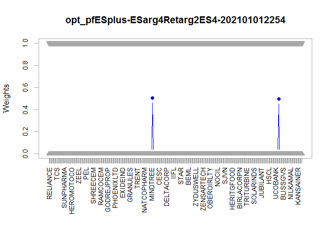

    ## [1] "Starting opt_pfESplus-ESarg4Retarg3ES1-202101012254"
    ## ***********************************
    ## PortfolioAnalytics Optimization
    ## ***********************************
    ## 
    ## Call:
    ## optimize.portfolio(R = R, portfolio = pfESplus, optimize_method = "ROI", 
    ##     trace = TRUE, momentFUN = cRebalSpec$momentFUN[cRebalSpec.ix])
    ## 
    ## Optimal Weights:
    ##   RELIANCE   HDFCBANK  ICICIBANK       HDFC        ITC   AXISBANK       SBIN 
    ##     0.0000     0.0000     0.0000     0.0000     0.0000     0.0000     0.0000 
    ##         LT BAJFINANCE       INFY BHARTIARTL        TCS        M.M  KOTAKBANK 
    ##     0.0000     0.0000     0.0791     0.0000     0.0000     0.0000     0.0000 
    ## INDUSINDBK       ONGC       NTPC TATAMOTORS  TATASTEEL     MARUTI   DIVISLAB 
    ##     0.0000     0.0000     0.0000     0.0000     0.0000     0.0000     0.0000 
    ##   HINDALCO  SUNPHARMA       VEDL HINDUNILVR    HCLTECH BAJAJFINSV  POWERGRID 
    ##     0.0000     0.0000     0.0000     0.0000     0.0000     0.0000     0.0000 
    ##       BPCL ASIANPAINT      TITAN    DRREDDY       GAIL HEROMOTOCO  COALINDIA 
    ##     0.0000     0.0000     0.0000     0.0000     0.0000     0.0000     0.0000 
    ##        IOC      TECHM ULTRACEMCO BAJAJ.AUTO ADANIPORTS     GRASIM      WIPRO 
    ##     0.0000     0.0000     0.0000     0.0000     0.0000     0.0000     0.0000 
    ##        UPL   JSWSTEEL       ZEEL     NAUKRI FEDERALBNK MOTHERSUMI  TATAPOWER 
    ##     0.0000     0.0000     0.0000     0.0106     0.0000     0.0000     0.0000 
    ##  BRITANNIA  AMBUJACEM  EICHERMOT AUROPHARMA SRTRANSFIN        BEL        PEL 
    ##     0.0000     0.0000     0.0000     0.0000     0.0000     0.0000     0.0000 
    ##   PETRONET        DLF      LUPIN     VOLTAS    HAVELLS     BIOCON        PFC 
    ##     0.0000     0.0000     0.0000     0.0000     0.0000     0.0000     0.0000 
    ##   ASHOKLEY   CHOLAFIN      CIPLA   SHREECEM     COLPAL BHARATFORG        SRF 
    ##     0.0000     0.0046     0.0000     0.0000     0.0000     0.0000     0.0000 
    ## PIDILITIND JINDALSTEL   ADANIENT     RECLTD     CONCOR    ESCORTS        ACC 
    ##     0.0064     0.0000     0.0000     0.0000     0.0000     0.0000     0.0000 
    ##   RAMCOCEM     MARICO     M.MFIN   GODREJCP  NESTLEIND  LICHSGFIN MANAPPURAM 
    ##     0.0000     0.0000     0.0000     0.0000     0.0000     0.0000     0.0000 
    ## BALKRISIND   CADILAHC      PIIND   BOSCHLTD GODREJPROP       NMDC BANKBARODA 
    ##     0.0000     0.0000     0.0000     0.0000     0.0000     0.0000     0.0000 
    ##   INDHOTEL    SIEMENS APOLLOHOSP TORNTPHARM   TVSMOTOR   JUBLFOOD CUMMINSIND 
    ##     0.0000     0.0000     0.0000     0.0000     0.0000     0.0000     0.0000 
    ##       IDEA PHOENIXLTD   GMRINFRA        MRF        IGL  BATAINDIA APOLLOTYRE 
    ##     0.0000     0.0000     0.0000     0.0000     0.0763     0.0000     0.0000 
    ## MUTHOOTFIN SUNDRMFAST     APLLTD       BHEL      L.TFH   EXIDEIND NATIONALUM 
    ##     0.0000     0.0000     0.0707     0.0000     0.0000     0.0000     0.0000 
    ##        CUB   GLENMARK AMARAJABAT        PVR SUPREMEIND NAVINFLUOR TORNTPOWER 
    ##     0.0000     0.0000     0.0000     0.0000     0.0000     0.0693     0.0000 
    ##      CANBK   DEEPAKNI   GRANULES    PAGEIND TATAMTRDVR BERGEPAINT   AARTIIND 
    ##     0.0000     0.0000     0.0000     0.0000     0.0000     0.0000     0.0000 
    ##  APLAPOLLO        PNB        UBL      DABUR  WHIRLPOOL       GSPL      TRENT 
    ##     0.0000     0.0000     0.0000     0.0000     0.0000     0.0000     0.0000 
    ##     FORTIS    DCBBANK   TATACOMM        NCC  TATAELXSI     CYIENT       IDFC 
    ##     0.0000     0.0000     0.0000     0.0000     0.0000     0.0000     0.0000 
    ##      GLAXO        OIL JMFINANCIL NATCOPHARM CANFINHOME       RAIN       ATUL 
    ##     0.0000     0.0000     0.0000     0.0000     0.0000     0.0000     0.0000 
    ## RAJESHEXPO       SAIL   SPICEJET       NHPC        MCX      SUNTV  REDINGTON 
    ##     0.0000     0.0000     0.0000     0.0000     0.0000     0.0000     0.0000 
    ##   MINDTREE   X3MINDIA      TANLA   EIDPARRY   GRAPHITE  GODREJIND  EDELWEISS 
    ##     0.0171     0.0000     0.0000     0.0000     0.0000     0.0000     0.0000 
    ##  LAXMIMACH     GESHIP   HINDZINC CASTROLIND       CESC   INDIACEM        FSL 
    ##     0.0000     0.0000     0.0000     0.0000     0.0000     0.0000     0.0000 
    ##       GNFC ABBOTINDIA ADANIPOWER  VAKRANGEE  UNIONBANK DCMSHRIRAM    WELCORP 
    ##     0.0000     0.0699     0.0000     0.0000     0.0000     0.0000     0.0000 
    ##   ALOKTEXT  DELTACORP  IBREALEST    KPRMILL        ABB  FINCABLES    CEATLTD 
    ##     0.0000     0.0000     0.0000     0.0000     0.0000     0.0000     0.0000 
    ##     VIPIND    KTKBANK     RALLIS CENTURYTEX BALRAMCHIN       IIFL       OFSS 
    ##     0.0000     0.0000     0.0000     0.0000     0.0000     0.0000     0.0000 
    ##     RELAXO        KEC AJANTPHARM   WESTLIFE TV18BRDCST  SOUTHBANK       GPPL 
    ##     0.0709     0.0000     0.0000     0.0277     0.0000     0.0000     0.0000 
    ## KALPATPOWR HINDCOPPER       STAR AARTIDRUGS SHRIRAMCIT       CERA WOCKPHARMA 
    ##     0.0000     0.0000     0.0000     0.0552     0.0000     0.0000     0.0000 
    ##  BAJAJELEC ENGINERSIN       GSFC COROMANDEL   AEGISLOG      IOLCP       BEML 
    ##     0.0000     0.0000     0.0000     0.0000     0.0000     0.0283     0.0000 
    ##        IRB      UFLEX       BASF    INDIANB  AKZOINDIA       BBTC SONATSOFTW 
    ##     0.0000     0.0000     0.0000     0.0000     0.0000     0.0000     0.0000 
    ##    SEQUENT    EIHOTEL  BAYERCROP  ZYDUSWELL  JSWENERGY WELSPUNIND     DISHTV 
    ##     0.0000     0.0000     0.0000     0.0000     0.0000     0.0000     0.0000 
    ## CARBORUNIV        HEG        PTC VINATIORGA     TIMKEN       HFCL        VTL 
    ##     0.0000     0.0000     0.0000     0.0000     0.0000     0.0000     0.0000 
    ## ZENSARTECH      SPARC     ECLERX    RAYMOND    TRIDENT     ASHOKA     RADICO 
    ##     0.0000     0.0000     0.0000     0.0000     0.0000     0.0000     0.0000 
    ## ALKYLAMINE  BANKINDIA SUDARSCHEM    IPCALAB OBEROIRLTY        FDC GODFRYPHLP 
    ##     0.1318     0.0000     0.0000     0.0000     0.0000     0.0000     0.0000 
    ##  SHILPAMED PHILIPCARB       MOIL      SOBHA       MEGH   PRESTIGE     VSTIND 
    ##     0.0000     0.0000     0.0000     0.0000     0.0000     0.0000     0.0000 
    ## MAHSCOOTER      NOCIL INOXLEISUR       GHCL TATAINVEST   NLCINDIA  JYOTHYLAB 
    ##     0.0000     0.0000     0.0000     0.0000     0.0000     0.0000     0.0000 
    ## KAJARIACER   GILLETTE  RESPONIND MOTILALOFS       KRBL       SJVN   ALLCARGO 
    ##     0.0000     0.0000     0.0000     0.0000     0.0000     0.0000     0.0000 
    ##  ORIENTREF       DCAL CHENNPETRO   SKFINDIA FINOLEXIND CENTURYPLY        SCI 
    ##     0.0000     0.0000     0.0000     0.0000     0.0000     0.0000     0.0000 
    ##        GDL GREAVESCOT HERITGFOOD SHOPERSTOP  BOMDYEING     KNRCON HAWKINCOOK 
    ##     0.0000     0.0000     0.0000     0.0000     0.0000     0.0000     0.0000 
    ##     VENKYS  JINDALSAW    JKPAPER  ESABINDIA   MAHABANK SCHAEFFLER BIRLACORPN 
    ##     0.0000     0.0000     0.0000     0.0000     0.0000     0.0000     0.0000 
    ## BALMLAWRIE       MFSL       PGHH   MINDAIND     VGUARD LINDEINDIA      JCHAC 
    ##     0.0000     0.0000     0.0839     0.0371     0.0000     0.0000     0.0000 
    ##       KSCL    LAOPALA TATACOFFEE TRITURBINE DEEPAKFERT   ASTRAZEN  JKLAKSHMI 
    ##     0.0000     0.0050     0.0000     0.0000     0.0000     0.0000     0.0000 
    ## VAIBHAVGBL   SUPRAJIT        GMM     IFBIND       IDBI   FORCEMOT    THERMAX 
    ##     0.0557     0.0000     0.0000     0.0000     0.0000     0.0000     0.0000 
    ##  SOLARINDS   BLUEDART      NESCO  JAMNAAUTO        JSL    DHANUKA TVSSRICHAK 
    ##     0.0175     0.0000     0.0000     0.0000     0.0000     0.0000     0.0000 
    ## TATAMETALI       MRPL NBVENTURES BAJAJHLDNG   JUBILANT JBCHEPHARM CHAMBLFERT 
    ##     0.0000     0.0000     0.0000     0.0000     0.0000     0.0000     0.0000 
    ##        KEI TTKPRESTIG    SUNTECK      CAPPL  NETWORK18  GUJALKALI  CENTRALBK 
    ##     0.0000     0.0000     0.0000     0.0000     0.0000     0.0000     0.0000 
    ##    J.KBANK       HSCL    GMDCLTD     PFIZER      MHRIL NAVNETEDUL        RCF 
    ##     0.0000     0.0000     0.0000     0.0000     0.0000     0.0000     0.0000 
    ##        IOB    TVTODAY  SCHNEIDER  RATNAMANI     JKTYRE    UCOBANK      GEPIL 
    ##     0.0000     0.0000     0.0000     0.0000     0.0000     0.0000     0.0000 
    ##  FCONSUMER TIMETECHNO     JAGRAN       MMTC     SANOFI        CCL SWANENERGY 
    ##     0.0000     0.0000     0.0000     0.0000     0.0000     0.0000     0.0000 
    ## JAICORPLTD     DBCORP   BLISSGVS WABCOINDIA      OMAXE    HATHWAY  MAHINDCIE 
    ##     0.0000     0.0000     0.0000     0.0000     0.0000     0.0000     0.0000 
    ##    MAHLIFE        ITI   EMAMILTD     ASTRAL   SYMPHONY     INDOCO   NILKAMAL 
    ##     0.0000     0.0000     0.0000     0.0827     0.0000     0.0000     0.0000 
    ##     SUZLON       IFCI       ITDC     CRISIL    BRIGADE BLUESTARCO MAHSEAMLES 
    ##     0.0000     0.0000     0.0000     0.0000     0.0000     0.0000     0.0000 
    ## HEIDELBERG    POLYMED  GRINDWELL  KANSAINER     AIAENG   TASTYBIT PERSISTENT 
    ##     0.0000     0.0000     0.0000     0.0000     0.0000     0.0000     0.0000 
    ##   JKCEMENT    MPHASIS     HONAUT  HINDPETRO 
    ##     0.0000     0.0000     0.0000     0.0000 
    ## 
    ## Objective Measure:
    ##     mean 
    ## 0.009028 
    ## 
    ## 
    ##      ES 
    ## 0.03268

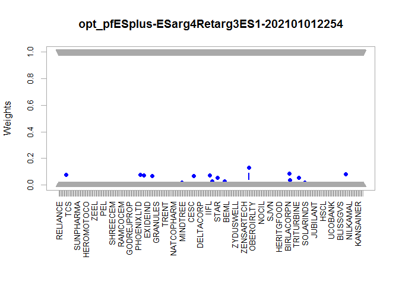

    ## [1] "Starting opt_pfESplus-ESarg4Retarg3ES2-202101012254"
    ## ***********************************
    ## PortfolioAnalytics Optimization
    ## ***********************************
    ## 
    ## Call:
    ## optimize.portfolio(R = R, portfolio = pfESplus, optimize_method = "ROI", 
    ##     trace = TRUE, momentFUN = cRebalSpec$momentFUN[cRebalSpec.ix])
    ## 
    ## Optimal Weights:
    ##   RELIANCE   HDFCBANK  ICICIBANK       HDFC        ITC   AXISBANK       SBIN 
    ##     0.0000     0.0000     0.0000     0.0000     0.0000     0.0000     0.0000 
    ##         LT BAJFINANCE       INFY BHARTIARTL        TCS        M.M  KOTAKBANK 
    ##     0.0000     0.0000     0.0791     0.0000     0.0000     0.0000     0.0000 
    ## INDUSINDBK       ONGC       NTPC TATAMOTORS  TATASTEEL     MARUTI   DIVISLAB 
    ##     0.0000     0.0000     0.0000     0.0000     0.0000     0.0000     0.0000 
    ##   HINDALCO  SUNPHARMA       VEDL HINDUNILVR    HCLTECH BAJAJFINSV  POWERGRID 
    ##     0.0000     0.0000     0.0000     0.0000     0.0000     0.0000     0.0000 
    ##       BPCL ASIANPAINT      TITAN    DRREDDY       GAIL HEROMOTOCO  COALINDIA 
    ##     0.0000     0.0000     0.0000     0.0000     0.0000     0.0000     0.0000 
    ##        IOC      TECHM ULTRACEMCO BAJAJ.AUTO ADANIPORTS     GRASIM      WIPRO 
    ##     0.0000     0.0000     0.0000     0.0000     0.0000     0.0000     0.0000 
    ##        UPL   JSWSTEEL       ZEEL     NAUKRI FEDERALBNK MOTHERSUMI  TATAPOWER 
    ##     0.0000     0.0000     0.0000     0.0106     0.0000     0.0000     0.0000 
    ##  BRITANNIA  AMBUJACEM  EICHERMOT AUROPHARMA SRTRANSFIN        BEL        PEL 
    ##     0.0000     0.0000     0.0000     0.0000     0.0000     0.0000     0.0000 
    ##   PETRONET        DLF      LUPIN     VOLTAS    HAVELLS     BIOCON        PFC 
    ##     0.0000     0.0000     0.0000     0.0000     0.0000     0.0000     0.0000 
    ##   ASHOKLEY   CHOLAFIN      CIPLA   SHREECEM     COLPAL BHARATFORG        SRF 
    ##     0.0000     0.0046     0.0000     0.0000     0.0000     0.0000     0.0000 
    ## PIDILITIND JINDALSTEL   ADANIENT     RECLTD     CONCOR    ESCORTS        ACC 
    ##     0.0064     0.0000     0.0000     0.0000     0.0000     0.0000     0.0000 
    ##   RAMCOCEM     MARICO     M.MFIN   GODREJCP  NESTLEIND  LICHSGFIN MANAPPURAM 
    ##     0.0000     0.0000     0.0000     0.0000     0.0000     0.0000     0.0000 
    ## BALKRISIND   CADILAHC      PIIND   BOSCHLTD GODREJPROP       NMDC BANKBARODA 
    ##     0.0000     0.0000     0.0000     0.0000     0.0000     0.0000     0.0000 
    ##   INDHOTEL    SIEMENS APOLLOHOSP TORNTPHARM   TVSMOTOR   JUBLFOOD CUMMINSIND 
    ##     0.0000     0.0000     0.0000     0.0000     0.0000     0.0000     0.0000 
    ##       IDEA PHOENIXLTD   GMRINFRA        MRF        IGL  BATAINDIA APOLLOTYRE 
    ##     0.0000     0.0000     0.0000     0.0000     0.0763     0.0000     0.0000 
    ## MUTHOOTFIN SUNDRMFAST     APLLTD       BHEL      L.TFH   EXIDEIND NATIONALUM 
    ##     0.0000     0.0000     0.0707     0.0000     0.0000     0.0000     0.0000 
    ##        CUB   GLENMARK AMARAJABAT        PVR SUPREMEIND NAVINFLUOR TORNTPOWER 
    ##     0.0000     0.0000     0.0000     0.0000     0.0000     0.0693     0.0000 
    ##      CANBK   DEEPAKNI   GRANULES    PAGEIND TATAMTRDVR BERGEPAINT   AARTIIND 
    ##     0.0000     0.0000     0.0000     0.0000     0.0000     0.0000     0.0000 
    ##  APLAPOLLO        PNB        UBL      DABUR  WHIRLPOOL       GSPL      TRENT 
    ##     0.0000     0.0000     0.0000     0.0000     0.0000     0.0000     0.0000 
    ##     FORTIS    DCBBANK   TATACOMM        NCC  TATAELXSI     CYIENT       IDFC 
    ##     0.0000     0.0000     0.0000     0.0000     0.0000     0.0000     0.0000 
    ##      GLAXO        OIL JMFINANCIL NATCOPHARM CANFINHOME       RAIN       ATUL 
    ##     0.0000     0.0000     0.0000     0.0000     0.0000     0.0000     0.0000 
    ## RAJESHEXPO       SAIL   SPICEJET       NHPC        MCX      SUNTV  REDINGTON 
    ##     0.0000     0.0000     0.0000     0.0000     0.0000     0.0000     0.0000 
    ##   MINDTREE   X3MINDIA      TANLA   EIDPARRY   GRAPHITE  GODREJIND  EDELWEISS 
    ##     0.0171     0.0000     0.0000     0.0000     0.0000     0.0000     0.0000 
    ##  LAXMIMACH     GESHIP   HINDZINC CASTROLIND       CESC   INDIACEM        FSL 
    ##     0.0000     0.0000     0.0000     0.0000     0.0000     0.0000     0.0000 
    ##       GNFC ABBOTINDIA ADANIPOWER  VAKRANGEE  UNIONBANK DCMSHRIRAM    WELCORP 
    ##     0.0000     0.0699     0.0000     0.0000     0.0000     0.0000     0.0000 
    ##   ALOKTEXT  DELTACORP  IBREALEST    KPRMILL        ABB  FINCABLES    CEATLTD 
    ##     0.0000     0.0000     0.0000     0.0000     0.0000     0.0000     0.0000 
    ##     VIPIND    KTKBANK     RALLIS CENTURYTEX BALRAMCHIN       IIFL       OFSS 
    ##     0.0000     0.0000     0.0000     0.0000     0.0000     0.0000     0.0000 
    ##     RELAXO        KEC AJANTPHARM   WESTLIFE TV18BRDCST  SOUTHBANK       GPPL 
    ##     0.0709     0.0000     0.0000     0.0277     0.0000     0.0000     0.0000 
    ## KALPATPOWR HINDCOPPER       STAR AARTIDRUGS SHRIRAMCIT       CERA WOCKPHARMA 
    ##     0.0000     0.0000     0.0000     0.0552     0.0000     0.0000     0.0000 
    ##  BAJAJELEC ENGINERSIN       GSFC COROMANDEL   AEGISLOG      IOLCP       BEML 
    ##     0.0000     0.0000     0.0000     0.0000     0.0000     0.0283     0.0000 
    ##        IRB      UFLEX       BASF    INDIANB  AKZOINDIA       BBTC SONATSOFTW 
    ##     0.0000     0.0000     0.0000     0.0000     0.0000     0.0000     0.0000 
    ##    SEQUENT    EIHOTEL  BAYERCROP  ZYDUSWELL  JSWENERGY WELSPUNIND     DISHTV 
    ##     0.0000     0.0000     0.0000     0.0000     0.0000     0.0000     0.0000 
    ## CARBORUNIV        HEG        PTC VINATIORGA     TIMKEN       HFCL        VTL 
    ##     0.0000     0.0000     0.0000     0.0000     0.0000     0.0000     0.0000 
    ## ZENSARTECH      SPARC     ECLERX    RAYMOND    TRIDENT     ASHOKA     RADICO 
    ##     0.0000     0.0000     0.0000     0.0000     0.0000     0.0000     0.0000 
    ## ALKYLAMINE  BANKINDIA SUDARSCHEM    IPCALAB OBEROIRLTY        FDC GODFRYPHLP 
    ##     0.1318     0.0000     0.0000     0.0000     0.0000     0.0000     0.0000 
    ##  SHILPAMED PHILIPCARB       MOIL      SOBHA       MEGH   PRESTIGE     VSTIND 
    ##     0.0000     0.0000     0.0000     0.0000     0.0000     0.0000     0.0000 
    ## MAHSCOOTER      NOCIL INOXLEISUR       GHCL TATAINVEST   NLCINDIA  JYOTHYLAB 
    ##     0.0000     0.0000     0.0000     0.0000     0.0000     0.0000     0.0000 
    ## KAJARIACER   GILLETTE  RESPONIND MOTILALOFS       KRBL       SJVN   ALLCARGO 
    ##     0.0000     0.0000     0.0000     0.0000     0.0000     0.0000     0.0000 
    ##  ORIENTREF       DCAL CHENNPETRO   SKFINDIA FINOLEXIND CENTURYPLY        SCI 
    ##     0.0000     0.0000     0.0000     0.0000     0.0000     0.0000     0.0000 
    ##        GDL GREAVESCOT HERITGFOOD SHOPERSTOP  BOMDYEING     KNRCON HAWKINCOOK 
    ##     0.0000     0.0000     0.0000     0.0000     0.0000     0.0000     0.0000 
    ##     VENKYS  JINDALSAW    JKPAPER  ESABINDIA   MAHABANK SCHAEFFLER BIRLACORPN 
    ##     0.0000     0.0000     0.0000     0.0000     0.0000     0.0000     0.0000 
    ## BALMLAWRIE       MFSL       PGHH   MINDAIND     VGUARD LINDEINDIA      JCHAC 
    ##     0.0000     0.0000     0.0839     0.0371     0.0000     0.0000     0.0000 
    ##       KSCL    LAOPALA TATACOFFEE TRITURBINE DEEPAKFERT   ASTRAZEN  JKLAKSHMI 
    ##     0.0000     0.0050     0.0000     0.0000     0.0000     0.0000     0.0000 
    ## VAIBHAVGBL   SUPRAJIT        GMM     IFBIND       IDBI   FORCEMOT    THERMAX 
    ##     0.0557     0.0000     0.0000     0.0000     0.0000     0.0000     0.0000 
    ##  SOLARINDS   BLUEDART      NESCO  JAMNAAUTO        JSL    DHANUKA TVSSRICHAK 
    ##     0.0175     0.0000     0.0000     0.0000     0.0000     0.0000     0.0000 
    ## TATAMETALI       MRPL NBVENTURES BAJAJHLDNG   JUBILANT JBCHEPHARM CHAMBLFERT 
    ##     0.0000     0.0000     0.0000     0.0000     0.0000     0.0000     0.0000 
    ##        KEI TTKPRESTIG    SUNTECK      CAPPL  NETWORK18  GUJALKALI  CENTRALBK 
    ##     0.0000     0.0000     0.0000     0.0000     0.0000     0.0000     0.0000 
    ##    J.KBANK       HSCL    GMDCLTD     PFIZER      MHRIL NAVNETEDUL        RCF 
    ##     0.0000     0.0000     0.0000     0.0000     0.0000     0.0000     0.0000 
    ##        IOB    TVTODAY  SCHNEIDER  RATNAMANI     JKTYRE    UCOBANK      GEPIL 
    ##     0.0000     0.0000     0.0000     0.0000     0.0000     0.0000     0.0000 
    ##  FCONSUMER TIMETECHNO     JAGRAN       MMTC     SANOFI        CCL SWANENERGY 
    ##     0.0000     0.0000     0.0000     0.0000     0.0000     0.0000     0.0000 
    ## JAICORPLTD     DBCORP   BLISSGVS WABCOINDIA      OMAXE    HATHWAY  MAHINDCIE 
    ##     0.0000     0.0000     0.0000     0.0000     0.0000     0.0000     0.0000 
    ##    MAHLIFE        ITI   EMAMILTD     ASTRAL   SYMPHONY     INDOCO   NILKAMAL 
    ##     0.0000     0.0000     0.0000     0.0827     0.0000     0.0000     0.0000 
    ##     SUZLON       IFCI       ITDC     CRISIL    BRIGADE BLUESTARCO MAHSEAMLES 
    ##     0.0000     0.0000     0.0000     0.0000     0.0000     0.0000     0.0000 
    ## HEIDELBERG    POLYMED  GRINDWELL  KANSAINER     AIAENG   TASTYBIT PERSISTENT 
    ##     0.0000     0.0000     0.0000     0.0000     0.0000     0.0000     0.0000 
    ##   JKCEMENT    MPHASIS     HONAUT  HINDPETRO 
    ##     0.0000     0.0000     0.0000     0.0000 
    ## 
    ## Objective Measure:
    ##     mean 
    ## 0.009028 
    ## 
    ## 
    ##      ES 
    ## 0.03268


    ## [1] "Starting opt_pfESplus-ESarg4Retarg3ES3-202101012255"
    ## ***********************************
    ## PortfolioAnalytics Optimization
    ## ***********************************
    ## 
    ## Call:
    ## optimize.portfolio(R = R, portfolio = pfESplus, optimize_method = "ROI", 
    ##     trace = TRUE, momentFUN = cRebalSpec$momentFUN[cRebalSpec.ix])
    ## 
    ## Optimal Weights:
    ##   RELIANCE   HDFCBANK  ICICIBANK       HDFC        ITC   AXISBANK       SBIN 
    ##     0.0000     0.0000     0.0000     0.0000     0.0000     0.0000     0.0000 
    ##         LT BAJFINANCE       INFY BHARTIARTL        TCS        M.M  KOTAKBANK 
    ##     0.0000     0.0000     0.0791     0.0000     0.0000     0.0000     0.0000 
    ## INDUSINDBK       ONGC       NTPC TATAMOTORS  TATASTEEL     MARUTI   DIVISLAB 
    ##     0.0000     0.0000     0.0000     0.0000     0.0000     0.0000     0.0000 
    ##   HINDALCO  SUNPHARMA       VEDL HINDUNILVR    HCLTECH BAJAJFINSV  POWERGRID 
    ##     0.0000     0.0000     0.0000     0.0000     0.0000     0.0000     0.0000 
    ##       BPCL ASIANPAINT      TITAN    DRREDDY       GAIL HEROMOTOCO  COALINDIA 
    ##     0.0000     0.0000     0.0000     0.0000     0.0000     0.0000     0.0000 
    ##        IOC      TECHM ULTRACEMCO BAJAJ.AUTO ADANIPORTS     GRASIM      WIPRO 
    ##     0.0000     0.0000     0.0000     0.0000     0.0000     0.0000     0.0000 
    ##        UPL   JSWSTEEL       ZEEL     NAUKRI FEDERALBNK MOTHERSUMI  TATAPOWER 
    ##     0.0000     0.0000     0.0000     0.0106     0.0000     0.0000     0.0000 
    ##  BRITANNIA  AMBUJACEM  EICHERMOT AUROPHARMA SRTRANSFIN        BEL        PEL 
    ##     0.0000     0.0000     0.0000     0.0000     0.0000     0.0000     0.0000 
    ##   PETRONET        DLF      LUPIN     VOLTAS    HAVELLS     BIOCON        PFC 
    ##     0.0000     0.0000     0.0000     0.0000     0.0000     0.0000     0.0000 
    ##   ASHOKLEY   CHOLAFIN      CIPLA   SHREECEM     COLPAL BHARATFORG        SRF 
    ##     0.0000     0.0046     0.0000     0.0000     0.0000     0.0000     0.0000 
    ## PIDILITIND JINDALSTEL   ADANIENT     RECLTD     CONCOR    ESCORTS        ACC 
    ##     0.0064     0.0000     0.0000     0.0000     0.0000     0.0000     0.0000 
    ##   RAMCOCEM     MARICO     M.MFIN   GODREJCP  NESTLEIND  LICHSGFIN MANAPPURAM 
    ##     0.0000     0.0000     0.0000     0.0000     0.0000     0.0000     0.0000 
    ## BALKRISIND   CADILAHC      PIIND   BOSCHLTD GODREJPROP       NMDC BANKBARODA 
    ##     0.0000     0.0000     0.0000     0.0000     0.0000     0.0000     0.0000 
    ##   INDHOTEL    SIEMENS APOLLOHOSP TORNTPHARM   TVSMOTOR   JUBLFOOD CUMMINSIND 
    ##     0.0000     0.0000     0.0000     0.0000     0.0000     0.0000     0.0000 
    ##       IDEA PHOENIXLTD   GMRINFRA        MRF        IGL  BATAINDIA APOLLOTYRE 
    ##     0.0000     0.0000     0.0000     0.0000     0.0763     0.0000     0.0000 
    ## MUTHOOTFIN SUNDRMFAST     APLLTD       BHEL      L.TFH   EXIDEIND NATIONALUM 
    ##     0.0000     0.0000     0.0707     0.0000     0.0000     0.0000     0.0000 
    ##        CUB   GLENMARK AMARAJABAT        PVR SUPREMEIND NAVINFLUOR TORNTPOWER 
    ##     0.0000     0.0000     0.0000     0.0000     0.0000     0.0693     0.0000 
    ##      CANBK   DEEPAKNI   GRANULES    PAGEIND TATAMTRDVR BERGEPAINT   AARTIIND 
    ##     0.0000     0.0000     0.0000     0.0000     0.0000     0.0000     0.0000 
    ##  APLAPOLLO        PNB        UBL      DABUR  WHIRLPOOL       GSPL      TRENT 
    ##     0.0000     0.0000     0.0000     0.0000     0.0000     0.0000     0.0000 
    ##     FORTIS    DCBBANK   TATACOMM        NCC  TATAELXSI     CYIENT       IDFC 
    ##     0.0000     0.0000     0.0000     0.0000     0.0000     0.0000     0.0000 
    ##      GLAXO        OIL JMFINANCIL NATCOPHARM CANFINHOME       RAIN       ATUL 
    ##     0.0000     0.0000     0.0000     0.0000     0.0000     0.0000     0.0000 
    ## RAJESHEXPO       SAIL   SPICEJET       NHPC        MCX      SUNTV  REDINGTON 
    ##     0.0000     0.0000     0.0000     0.0000     0.0000     0.0000     0.0000 
    ##   MINDTREE   X3MINDIA      TANLA   EIDPARRY   GRAPHITE  GODREJIND  EDELWEISS 
    ##     0.0171     0.0000     0.0000     0.0000     0.0000     0.0000     0.0000 
    ##  LAXMIMACH     GESHIP   HINDZINC CASTROLIND       CESC   INDIACEM        FSL 
    ##     0.0000     0.0000     0.0000     0.0000     0.0000     0.0000     0.0000 
    ##       GNFC ABBOTINDIA ADANIPOWER  VAKRANGEE  UNIONBANK DCMSHRIRAM    WELCORP 
    ##     0.0000     0.0699     0.0000     0.0000     0.0000     0.0000     0.0000 
    ##   ALOKTEXT  DELTACORP  IBREALEST    KPRMILL        ABB  FINCABLES    CEATLTD 
    ##     0.0000     0.0000     0.0000     0.0000     0.0000     0.0000     0.0000 
    ##     VIPIND    KTKBANK     RALLIS CENTURYTEX BALRAMCHIN       IIFL       OFSS 
    ##     0.0000     0.0000     0.0000     0.0000     0.0000     0.0000     0.0000 
    ##     RELAXO        KEC AJANTPHARM   WESTLIFE TV18BRDCST  SOUTHBANK       GPPL 
    ##     0.0709     0.0000     0.0000     0.0277     0.0000     0.0000     0.0000 
    ## KALPATPOWR HINDCOPPER       STAR AARTIDRUGS SHRIRAMCIT       CERA WOCKPHARMA 
    ##     0.0000     0.0000     0.0000     0.0552     0.0000     0.0000     0.0000 
    ##  BAJAJELEC ENGINERSIN       GSFC COROMANDEL   AEGISLOG      IOLCP       BEML 
    ##     0.0000     0.0000     0.0000     0.0000     0.0000     0.0283     0.0000 
    ##        IRB      UFLEX       BASF    INDIANB  AKZOINDIA       BBTC SONATSOFTW 
    ##     0.0000     0.0000     0.0000     0.0000     0.0000     0.0000     0.0000 
    ##    SEQUENT    EIHOTEL  BAYERCROP  ZYDUSWELL  JSWENERGY WELSPUNIND     DISHTV 
    ##     0.0000     0.0000     0.0000     0.0000     0.0000     0.0000     0.0000 
    ## CARBORUNIV        HEG        PTC VINATIORGA     TIMKEN       HFCL        VTL 
    ##     0.0000     0.0000     0.0000     0.0000     0.0000     0.0000     0.0000 
    ## ZENSARTECH      SPARC     ECLERX    RAYMOND    TRIDENT     ASHOKA     RADICO 
    ##     0.0000     0.0000     0.0000     0.0000     0.0000     0.0000     0.0000 
    ## ALKYLAMINE  BANKINDIA SUDARSCHEM    IPCALAB OBEROIRLTY        FDC GODFRYPHLP 
    ##     0.1318     0.0000     0.0000     0.0000     0.0000     0.0000     0.0000 
    ##  SHILPAMED PHILIPCARB       MOIL      SOBHA       MEGH   PRESTIGE     VSTIND 
    ##     0.0000     0.0000     0.0000     0.0000     0.0000     0.0000     0.0000 
    ## MAHSCOOTER      NOCIL INOXLEISUR       GHCL TATAINVEST   NLCINDIA  JYOTHYLAB 
    ##     0.0000     0.0000     0.0000     0.0000     0.0000     0.0000     0.0000 
    ## KAJARIACER   GILLETTE  RESPONIND MOTILALOFS       KRBL       SJVN   ALLCARGO 
    ##     0.0000     0.0000     0.0000     0.0000     0.0000     0.0000     0.0000 
    ##  ORIENTREF       DCAL CHENNPETRO   SKFINDIA FINOLEXIND CENTURYPLY        SCI 
    ##     0.0000     0.0000     0.0000     0.0000     0.0000     0.0000     0.0000 
    ##        GDL GREAVESCOT HERITGFOOD SHOPERSTOP  BOMDYEING     KNRCON HAWKINCOOK 
    ##     0.0000     0.0000     0.0000     0.0000     0.0000     0.0000     0.0000 
    ##     VENKYS  JINDALSAW    JKPAPER  ESABINDIA   MAHABANK SCHAEFFLER BIRLACORPN 
    ##     0.0000     0.0000     0.0000     0.0000     0.0000     0.0000     0.0000 
    ## BALMLAWRIE       MFSL       PGHH   MINDAIND     VGUARD LINDEINDIA      JCHAC 
    ##     0.0000     0.0000     0.0839     0.0371     0.0000     0.0000     0.0000 
    ##       KSCL    LAOPALA TATACOFFEE TRITURBINE DEEPAKFERT   ASTRAZEN  JKLAKSHMI 
    ##     0.0000     0.0050     0.0000     0.0000     0.0000     0.0000     0.0000 
    ## VAIBHAVGBL   SUPRAJIT        GMM     IFBIND       IDBI   FORCEMOT    THERMAX 
    ##     0.0557     0.0000     0.0000     0.0000     0.0000     0.0000     0.0000 
    ##  SOLARINDS   BLUEDART      NESCO  JAMNAAUTO        JSL    DHANUKA TVSSRICHAK 
    ##     0.0175     0.0000     0.0000     0.0000     0.0000     0.0000     0.0000 
    ## TATAMETALI       MRPL NBVENTURES BAJAJHLDNG   JUBILANT JBCHEPHARM CHAMBLFERT 
    ##     0.0000     0.0000     0.0000     0.0000     0.0000     0.0000     0.0000 
    ##        KEI TTKPRESTIG    SUNTECK      CAPPL  NETWORK18  GUJALKALI  CENTRALBK 
    ##     0.0000     0.0000     0.0000     0.0000     0.0000     0.0000     0.0000 
    ##    J.KBANK       HSCL    GMDCLTD     PFIZER      MHRIL NAVNETEDUL        RCF 
    ##     0.0000     0.0000     0.0000     0.0000     0.0000     0.0000     0.0000 
    ##        IOB    TVTODAY  SCHNEIDER  RATNAMANI     JKTYRE    UCOBANK      GEPIL 
    ##     0.0000     0.0000     0.0000     0.0000     0.0000     0.0000     0.0000 
    ##  FCONSUMER TIMETECHNO     JAGRAN       MMTC     SANOFI        CCL SWANENERGY 
    ##     0.0000     0.0000     0.0000     0.0000     0.0000     0.0000     0.0000 
    ## JAICORPLTD     DBCORP   BLISSGVS WABCOINDIA      OMAXE    HATHWAY  MAHINDCIE 
    ##     0.0000     0.0000     0.0000     0.0000     0.0000     0.0000     0.0000 
    ##    MAHLIFE        ITI   EMAMILTD     ASTRAL   SYMPHONY     INDOCO   NILKAMAL 
    ##     0.0000     0.0000     0.0000     0.0827     0.0000     0.0000     0.0000 
    ##     SUZLON       IFCI       ITDC     CRISIL    BRIGADE BLUESTARCO MAHSEAMLES 
    ##     0.0000     0.0000     0.0000     0.0000     0.0000     0.0000     0.0000 
    ## HEIDELBERG    POLYMED  GRINDWELL  KANSAINER     AIAENG   TASTYBIT PERSISTENT 
    ##     0.0000     0.0000     0.0000     0.0000     0.0000     0.0000     0.0000 
    ##   JKCEMENT    MPHASIS     HONAUT  HINDPETRO 
    ##     0.0000     0.0000     0.0000     0.0000 
    ## 
    ## Objective Measure:
    ##     mean 
    ## 0.009028 
    ## 
    ## 
    ##      ES 
    ## 0.03268


    ## [1] "Starting opt_pfESplus-ESarg4Retarg3ES4-202101012255"
    ## ***********************************
    ## PortfolioAnalytics Optimization
    ## ***********************************
    ## 
    ## Call:
    ## optimize.portfolio(R = R, portfolio = pfESplus, optimize_method = "ROI", 
    ##     trace = TRUE, momentFUN = cRebalSpec$momentFUN[cRebalSpec.ix])
    ## 
    ## Optimal Weights:
    ##   RELIANCE   HDFCBANK  ICICIBANK       HDFC        ITC   AXISBANK       SBIN 
    ##          0          0          0          0          0          0          0 
    ##         LT BAJFINANCE       INFY BHARTIARTL        TCS        M.M  KOTAKBANK 
    ##          0          0          0          0          0          0          0 
    ## INDUSINDBK       ONGC       NTPC TATAMOTORS  TATASTEEL     MARUTI   DIVISLAB 
    ##          0          0          0          0          0          0          0 
    ##   HINDALCO  SUNPHARMA       VEDL HINDUNILVR    HCLTECH BAJAJFINSV  POWERGRID 
    ##          0          0          0          0          0          0          0 
    ##       BPCL ASIANPAINT      TITAN    DRREDDY       GAIL HEROMOTOCO  COALINDIA 
    ##          0          0          0          0          0          0          0 
    ##        IOC      TECHM ULTRACEMCO BAJAJ.AUTO ADANIPORTS     GRASIM      WIPRO 
    ##          0          0          0          0          0          0          0 
    ##        UPL   JSWSTEEL       ZEEL     NAUKRI FEDERALBNK MOTHERSUMI  TATAPOWER 
    ##          0          0          0          0          0          0          0 
    ##  BRITANNIA  AMBUJACEM  EICHERMOT AUROPHARMA SRTRANSFIN        BEL        PEL 
    ##          0          0          0          0          0          0          0 
    ##   PETRONET        DLF      LUPIN     VOLTAS    HAVELLS     BIOCON        PFC 
    ##          0          0          0          0          0          0          0 
    ##   ASHOKLEY   CHOLAFIN      CIPLA   SHREECEM     COLPAL BHARATFORG        SRF 
    ##          0          0          0          0          0          0          0 
    ## PIDILITIND JINDALSTEL   ADANIENT     RECLTD     CONCOR    ESCORTS        ACC 
    ##          0          0          0          0          0          0          0 
    ##   RAMCOCEM     MARICO     M.MFIN   GODREJCP  NESTLEIND  LICHSGFIN MANAPPURAM 
    ##          0          0          0          0          0          0          0 
    ## BALKRISIND   CADILAHC      PIIND   BOSCHLTD GODREJPROP       NMDC BANKBARODA 
    ##          0          0          0          0          0          0          0 
    ##   INDHOTEL    SIEMENS APOLLOHOSP TORNTPHARM   TVSMOTOR   JUBLFOOD CUMMINSIND 
    ##          0          0          0          0          0          0          0 
    ##       IDEA PHOENIXLTD   GMRINFRA        MRF        IGL  BATAINDIA APOLLOTYRE 
    ##          0          0          0          0          0          0          0 
    ## MUTHOOTFIN SUNDRMFAST     APLLTD       BHEL      L.TFH   EXIDEIND NATIONALUM 
    ##          0          0          0          0          0          0          0 
    ##        CUB   GLENMARK AMARAJABAT        PVR SUPREMEIND NAVINFLUOR TORNTPOWER 
    ##          0          0          0          0          0          0          0 
    ##      CANBK   DEEPAKNI   GRANULES    PAGEIND TATAMTRDVR BERGEPAINT   AARTIIND 
    ##          0          0          0          0          0          0          0 
    ##  APLAPOLLO        PNB        UBL      DABUR  WHIRLPOOL       GSPL      TRENT 
    ##          0          0          0          0          0          0          0 
    ##     FORTIS    DCBBANK   TATACOMM        NCC  TATAELXSI     CYIENT       IDFC 
    ##          0          0          0          0          0          0          0 
    ##      GLAXO        OIL JMFINANCIL NATCOPHARM CANFINHOME       RAIN       ATUL 
    ##          0          0          0          0          0          0          0 
    ## RAJESHEXPO       SAIL   SPICEJET       NHPC        MCX      SUNTV  REDINGTON 
    ##          0          0          0          0          0          0          0 
    ##   MINDTREE   X3MINDIA      TANLA   EIDPARRY   GRAPHITE  GODREJIND  EDELWEISS 
    ##          0          0          1          0          0          0          0 
    ##  LAXMIMACH     GESHIP   HINDZINC CASTROLIND       CESC   INDIACEM        FSL 
    ##          0          0          0          0          0          0          0 
    ##       GNFC ABBOTINDIA ADANIPOWER  VAKRANGEE  UNIONBANK DCMSHRIRAM    WELCORP 
    ##          0          0          0          0          0          0          0 
    ##   ALOKTEXT  DELTACORP  IBREALEST    KPRMILL        ABB  FINCABLES    CEATLTD 
    ##          0          0          0          0          0          0          0 
    ##     VIPIND    KTKBANK     RALLIS CENTURYTEX BALRAMCHIN       IIFL       OFSS 
    ##          0          0          0          0          0          0          0 
    ##     RELAXO        KEC AJANTPHARM   WESTLIFE TV18BRDCST  SOUTHBANK       GPPL 
    ##          0          0          0          0          0          0          0 
    ## KALPATPOWR HINDCOPPER       STAR AARTIDRUGS SHRIRAMCIT       CERA WOCKPHARMA 
    ##          0          0          0          0          0          0          0 
    ##  BAJAJELEC ENGINERSIN       GSFC COROMANDEL   AEGISLOG      IOLCP       BEML 
    ##          0          0          0          0          0          0          0 
    ##        IRB      UFLEX       BASF    INDIANB  AKZOINDIA       BBTC SONATSOFTW 
    ##          0          0          0          0          0          0          0 
    ##    SEQUENT    EIHOTEL  BAYERCROP  ZYDUSWELL  JSWENERGY WELSPUNIND     DISHTV 
    ##          0          0          0          0          0          0          0 
    ## CARBORUNIV        HEG        PTC VINATIORGA     TIMKEN       HFCL        VTL 
    ##          0          0          0          0          0          0          0 
    ## ZENSARTECH      SPARC     ECLERX    RAYMOND    TRIDENT     ASHOKA     RADICO 
    ##          0          0          0          0          0          0          0 
    ## ALKYLAMINE  BANKINDIA SUDARSCHEM    IPCALAB OBEROIRLTY        FDC GODFRYPHLP 
    ##          0          0          0          0          0          0          0 
    ##  SHILPAMED PHILIPCARB       MOIL      SOBHA       MEGH   PRESTIGE     VSTIND 
    ##          0          0          0          0          0          0          0 
    ## MAHSCOOTER      NOCIL INOXLEISUR       GHCL TATAINVEST   NLCINDIA  JYOTHYLAB 
    ##          0          0          0          0          0          0          0 
    ## KAJARIACER   GILLETTE  RESPONIND MOTILALOFS       KRBL       SJVN   ALLCARGO 
    ##          0          0          0          0          0          0          0 
    ##  ORIENTREF       DCAL CHENNPETRO   SKFINDIA FINOLEXIND CENTURYPLY        SCI 
    ##          0          0          0          0          0          0          0 
    ##        GDL GREAVESCOT HERITGFOOD SHOPERSTOP  BOMDYEING     KNRCON HAWKINCOOK 
    ##          0          0          0          0          0          0          0 
    ##     VENKYS  JINDALSAW    JKPAPER  ESABINDIA   MAHABANK SCHAEFFLER BIRLACORPN 
    ##          0          0          0          0          0          0          0 
    ## BALMLAWRIE       MFSL       PGHH   MINDAIND     VGUARD LINDEINDIA      JCHAC 
    ##          0          0          0          0          0          0          0 
    ##       KSCL    LAOPALA TATACOFFEE TRITURBINE DEEPAKFERT   ASTRAZEN  JKLAKSHMI 
    ##          0          0          0          0          0          0          0 
    ## VAIBHAVGBL   SUPRAJIT        GMM     IFBIND       IDBI   FORCEMOT    THERMAX 
    ##          0          0          0          0          0          0          0 
    ##  SOLARINDS   BLUEDART      NESCO  JAMNAAUTO        JSL    DHANUKA TVSSRICHAK 
    ##          0          0          0          0          0          0          0 
    ## TATAMETALI       MRPL NBVENTURES BAJAJHLDNG   JUBILANT JBCHEPHARM CHAMBLFERT 
    ##          0          0          0          0          0          0          0 
    ##        KEI TTKPRESTIG    SUNTECK      CAPPL  NETWORK18  GUJALKALI  CENTRALBK 
    ##          0          0          0          0          0          0          0 
    ##    J.KBANK       HSCL    GMDCLTD     PFIZER      MHRIL NAVNETEDUL        RCF 
    ##          0          0          0          0          0          0          0 
    ##        IOB    TVTODAY  SCHNEIDER  RATNAMANI     JKTYRE    UCOBANK      GEPIL 
    ##          0          0          0          0          0          0          0 
    ##  FCONSUMER TIMETECHNO     JAGRAN       MMTC     SANOFI        CCL SWANENERGY 
    ##          0          0          0          0          0          0          0 
    ## JAICORPLTD     DBCORP   BLISSGVS WABCOINDIA      OMAXE    HATHWAY  MAHINDCIE 
    ##          0          0          0          0          0          0          0 
    ##    MAHLIFE        ITI   EMAMILTD     ASTRAL   SYMPHONY     INDOCO   NILKAMAL 
    ##          0          0          0          0          0          0          0 
    ##     SUZLON       IFCI       ITDC     CRISIL    BRIGADE BLUESTARCO MAHSEAMLES 
    ##          0          0          0          0          0          0          0 
    ## HEIDELBERG    POLYMED  GRINDWELL  KANSAINER     AIAENG   TASTYBIT PERSISTENT 
    ##          0          0          0          0          0          0          0 
    ##   JKCEMENT    MPHASIS     HONAUT  HINDPETRO 
    ##          0          0          0          0 
    ## 
    ## Objective Measure:
    ##    mean 
    ## 0.01533


    ## [1] "Starting opt_pfESplus-ESarg3Retarg2ES1-202101012255"
    ## ***********************************
    ## PortfolioAnalytics Optimization
    ## ***********************************
    ## 
    ## Call:
    ## optimize.portfolio(R = R, portfolio = pfESplus, optimize_method = "ROI", 
    ##     trace = TRUE, momentFUN = cRebalSpec$momentFUN[cRebalSpec.ix])
    ## 
    ## Optimal Weights:
    ##   RELIANCE   HDFCBANK  ICICIBANK       HDFC        ITC   AXISBANK       SBIN 
    ##     0.0000     0.0000     0.0000     0.0000     0.0000     0.0000     0.0000 
    ##         LT BAJFINANCE       INFY BHARTIARTL        TCS        M.M  KOTAKBANK 
    ##     0.0000     0.0000     0.0791     0.0000     0.0000     0.0000     0.0000 
    ## INDUSINDBK       ONGC       NTPC TATAMOTORS  TATASTEEL     MARUTI   DIVISLAB 
    ##     0.0000     0.0000     0.0000     0.0000     0.0000     0.0000     0.0000 
    ##   HINDALCO  SUNPHARMA       VEDL HINDUNILVR    HCLTECH BAJAJFINSV  POWERGRID 
    ##     0.0000     0.0000     0.0000     0.0000     0.0000     0.0000     0.0000 
    ##       BPCL ASIANPAINT      TITAN    DRREDDY       GAIL HEROMOTOCO  COALINDIA 
    ##     0.0000     0.0000     0.0000     0.0000     0.0000     0.0000     0.0000 
    ##        IOC      TECHM ULTRACEMCO BAJAJ.AUTO ADANIPORTS     GRASIM      WIPRO 
    ##     0.0000     0.0000     0.0000     0.0000     0.0000     0.0000     0.0000 
    ##        UPL   JSWSTEEL       ZEEL     NAUKRI FEDERALBNK MOTHERSUMI  TATAPOWER 
    ##     0.0000     0.0000     0.0000     0.0106     0.0000     0.0000     0.0000 
    ##  BRITANNIA  AMBUJACEM  EICHERMOT AUROPHARMA SRTRANSFIN        BEL        PEL 
    ##     0.0000     0.0000     0.0000     0.0000     0.0000     0.0000     0.0000 
    ##   PETRONET        DLF      LUPIN     VOLTAS    HAVELLS     BIOCON        PFC 
    ##     0.0000     0.0000     0.0000     0.0000     0.0000     0.0000     0.0000 
    ##   ASHOKLEY   CHOLAFIN      CIPLA   SHREECEM     COLPAL BHARATFORG        SRF 
    ##     0.0000     0.0046     0.0000     0.0000     0.0000     0.0000     0.0000 
    ## PIDILITIND JINDALSTEL   ADANIENT     RECLTD     CONCOR    ESCORTS        ACC 
    ##     0.0064     0.0000     0.0000     0.0000     0.0000     0.0000     0.0000 
    ##   RAMCOCEM     MARICO     M.MFIN   GODREJCP  NESTLEIND  LICHSGFIN MANAPPURAM 
    ##     0.0000     0.0000     0.0000     0.0000     0.0000     0.0000     0.0000 
    ## BALKRISIND   CADILAHC      PIIND   BOSCHLTD GODREJPROP       NMDC BANKBARODA 
    ##     0.0000     0.0000     0.0000     0.0000     0.0000     0.0000     0.0000 
    ##   INDHOTEL    SIEMENS APOLLOHOSP TORNTPHARM   TVSMOTOR   JUBLFOOD CUMMINSIND 
    ##     0.0000     0.0000     0.0000     0.0000     0.0000     0.0000     0.0000 
    ##       IDEA PHOENIXLTD   GMRINFRA        MRF        IGL  BATAINDIA APOLLOTYRE 
    ##     0.0000     0.0000     0.0000     0.0000     0.0763     0.0000     0.0000 
    ## MUTHOOTFIN SUNDRMFAST     APLLTD       BHEL      L.TFH   EXIDEIND NATIONALUM 
    ##     0.0000     0.0000     0.0707     0.0000     0.0000     0.0000     0.0000 
    ##        CUB   GLENMARK AMARAJABAT        PVR SUPREMEIND NAVINFLUOR TORNTPOWER 
    ##     0.0000     0.0000     0.0000     0.0000     0.0000     0.0693     0.0000 
    ##      CANBK   DEEPAKNI   GRANULES    PAGEIND TATAMTRDVR BERGEPAINT   AARTIIND 
    ##     0.0000     0.0000     0.0000     0.0000     0.0000     0.0000     0.0000 
    ##  APLAPOLLO        PNB        UBL      DABUR  WHIRLPOOL       GSPL      TRENT 
    ##     0.0000     0.0000     0.0000     0.0000     0.0000     0.0000     0.0000 
    ##     FORTIS    DCBBANK   TATACOMM        NCC  TATAELXSI     CYIENT       IDFC 
    ##     0.0000     0.0000     0.0000     0.0000     0.0000     0.0000     0.0000 
    ##      GLAXO        OIL JMFINANCIL NATCOPHARM CANFINHOME       RAIN       ATUL 
    ##     0.0000     0.0000     0.0000     0.0000     0.0000     0.0000     0.0000 
    ## RAJESHEXPO       SAIL   SPICEJET       NHPC        MCX      SUNTV  REDINGTON 
    ##     0.0000     0.0000     0.0000     0.0000     0.0000     0.0000     0.0000 
    ##   MINDTREE   X3MINDIA      TANLA   EIDPARRY   GRAPHITE  GODREJIND  EDELWEISS 
    ##     0.0171     0.0000     0.0000     0.0000     0.0000     0.0000     0.0000 
    ##  LAXMIMACH     GESHIP   HINDZINC CASTROLIND       CESC   INDIACEM        FSL 
    ##     0.0000     0.0000     0.0000     0.0000     0.0000     0.0000     0.0000 
    ##       GNFC ABBOTINDIA ADANIPOWER  VAKRANGEE  UNIONBANK DCMSHRIRAM    WELCORP 
    ##     0.0000     0.0699     0.0000     0.0000     0.0000     0.0000     0.0000 
    ##   ALOKTEXT  DELTACORP  IBREALEST    KPRMILL        ABB  FINCABLES    CEATLTD 
    ##     0.0000     0.0000     0.0000     0.0000     0.0000     0.0000     0.0000 
    ##     VIPIND    KTKBANK     RALLIS CENTURYTEX BALRAMCHIN       IIFL       OFSS 
    ##     0.0000     0.0000     0.0000     0.0000     0.0000     0.0000     0.0000 
    ##     RELAXO        KEC AJANTPHARM   WESTLIFE TV18BRDCST  SOUTHBANK       GPPL 
    ##     0.0709     0.0000     0.0000     0.0277     0.0000     0.0000     0.0000 
    ## KALPATPOWR HINDCOPPER       STAR AARTIDRUGS SHRIRAMCIT       CERA WOCKPHARMA 
    ##     0.0000     0.0000     0.0000     0.0552     0.0000     0.0000     0.0000 
    ##  BAJAJELEC ENGINERSIN       GSFC COROMANDEL   AEGISLOG      IOLCP       BEML 
    ##     0.0000     0.0000     0.0000     0.0000     0.0000     0.0283     0.0000 
    ##        IRB      UFLEX       BASF    INDIANB  AKZOINDIA       BBTC SONATSOFTW 
    ##     0.0000     0.0000     0.0000     0.0000     0.0000     0.0000     0.0000 
    ##    SEQUENT    EIHOTEL  BAYERCROP  ZYDUSWELL  JSWENERGY WELSPUNIND     DISHTV 
    ##     0.0000     0.0000     0.0000     0.0000     0.0000     0.0000     0.0000 
    ## CARBORUNIV        HEG        PTC VINATIORGA     TIMKEN       HFCL        VTL 
    ##     0.0000     0.0000     0.0000     0.0000     0.0000     0.0000     0.0000 
    ## ZENSARTECH      SPARC     ECLERX    RAYMOND    TRIDENT     ASHOKA     RADICO 
    ##     0.0000     0.0000     0.0000     0.0000     0.0000     0.0000     0.0000 
    ## ALKYLAMINE  BANKINDIA SUDARSCHEM    IPCALAB OBEROIRLTY        FDC GODFRYPHLP 
    ##     0.1318     0.0000     0.0000     0.0000     0.0000     0.0000     0.0000 
    ##  SHILPAMED PHILIPCARB       MOIL      SOBHA       MEGH   PRESTIGE     VSTIND 
    ##     0.0000     0.0000     0.0000     0.0000     0.0000     0.0000     0.0000 
    ## MAHSCOOTER      NOCIL INOXLEISUR       GHCL TATAINVEST   NLCINDIA  JYOTHYLAB 
    ##     0.0000     0.0000     0.0000     0.0000     0.0000     0.0000     0.0000 
    ## KAJARIACER   GILLETTE  RESPONIND MOTILALOFS       KRBL       SJVN   ALLCARGO 
    ##     0.0000     0.0000     0.0000     0.0000     0.0000     0.0000     0.0000 
    ##  ORIENTREF       DCAL CHENNPETRO   SKFINDIA FINOLEXIND CENTURYPLY        SCI 
    ##     0.0000     0.0000     0.0000     0.0000     0.0000     0.0000     0.0000 
    ##        GDL GREAVESCOT HERITGFOOD SHOPERSTOP  BOMDYEING     KNRCON HAWKINCOOK 
    ##     0.0000     0.0000     0.0000     0.0000     0.0000     0.0000     0.0000 
    ##     VENKYS  JINDALSAW    JKPAPER  ESABINDIA   MAHABANK SCHAEFFLER BIRLACORPN 
    ##     0.0000     0.0000     0.0000     0.0000     0.0000     0.0000     0.0000 
    ## BALMLAWRIE       MFSL       PGHH   MINDAIND     VGUARD LINDEINDIA      JCHAC 
    ##     0.0000     0.0000     0.0839     0.0371     0.0000     0.0000     0.0000 
    ##       KSCL    LAOPALA TATACOFFEE TRITURBINE DEEPAKFERT   ASTRAZEN  JKLAKSHMI 
    ##     0.0000     0.0050     0.0000     0.0000     0.0000     0.0000     0.0000 
    ## VAIBHAVGBL   SUPRAJIT        GMM     IFBIND       IDBI   FORCEMOT    THERMAX 
    ##     0.0557     0.0000     0.0000     0.0000     0.0000     0.0000     0.0000 
    ##  SOLARINDS   BLUEDART      NESCO  JAMNAAUTO        JSL    DHANUKA TVSSRICHAK 
    ##     0.0175     0.0000     0.0000     0.0000     0.0000     0.0000     0.0000 
    ## TATAMETALI       MRPL NBVENTURES BAJAJHLDNG   JUBILANT JBCHEPHARM CHAMBLFERT 
    ##     0.0000     0.0000     0.0000     0.0000     0.0000     0.0000     0.0000 
    ##        KEI TTKPRESTIG    SUNTECK      CAPPL  NETWORK18  GUJALKALI  CENTRALBK 
    ##     0.0000     0.0000     0.0000     0.0000     0.0000     0.0000     0.0000 
    ##    J.KBANK       HSCL    GMDCLTD     PFIZER      MHRIL NAVNETEDUL        RCF 
    ##     0.0000     0.0000     0.0000     0.0000     0.0000     0.0000     0.0000 
    ##        IOB    TVTODAY  SCHNEIDER  RATNAMANI     JKTYRE    UCOBANK      GEPIL 
    ##     0.0000     0.0000     0.0000     0.0000     0.0000     0.0000     0.0000 
    ##  FCONSUMER TIMETECHNO     JAGRAN       MMTC     SANOFI        CCL SWANENERGY 
    ##     0.0000     0.0000     0.0000     0.0000     0.0000     0.0000     0.0000 
    ## JAICORPLTD     DBCORP   BLISSGVS WABCOINDIA      OMAXE    HATHWAY  MAHINDCIE 
    ##     0.0000     0.0000     0.0000     0.0000     0.0000     0.0000     0.0000 
    ##    MAHLIFE        ITI   EMAMILTD     ASTRAL   SYMPHONY     INDOCO   NILKAMAL 
    ##     0.0000     0.0000     0.0000     0.0827     0.0000     0.0000     0.0000 
    ##     SUZLON       IFCI       ITDC     CRISIL    BRIGADE BLUESTARCO MAHSEAMLES 
    ##     0.0000     0.0000     0.0000     0.0000     0.0000     0.0000     0.0000 
    ## HEIDELBERG    POLYMED  GRINDWELL  KANSAINER     AIAENG   TASTYBIT PERSISTENT 
    ##     0.0000     0.0000     0.0000     0.0000     0.0000     0.0000     0.0000 
    ##   JKCEMENT    MPHASIS     HONAUT  HINDPETRO 
    ##     0.0000     0.0000     0.0000     0.0000 
    ## 
    ## Objective Measure:
    ##     mean 
    ## 0.009028 
    ## 
    ## 
    ##      ES 
    ## 0.03268


    ## [1] "Starting opt_pfESplus-ESarg3Retarg2ES2-202101012255"
    ## ***********************************
    ## PortfolioAnalytics Optimization
    ## ***********************************
    ## 
    ## Call:
    ## optimize.portfolio(R = R, portfolio = pfESplus, optimize_method = "ROI", 
    ##     trace = TRUE, momentFUN = cRebalSpec$momentFUN[cRebalSpec.ix])
    ## 
    ## Optimal Weights:
    ##   RELIANCE   HDFCBANK  ICICIBANK       HDFC        ITC   AXISBANK       SBIN 
    ##     0.0000     0.0000     0.0000     0.0000     0.0000     0.0000     0.0000 
    ##         LT BAJFINANCE       INFY BHARTIARTL        TCS        M.M  KOTAKBANK 
    ##     0.0000     0.0000     0.0791     0.0000     0.0000     0.0000     0.0000 
    ## INDUSINDBK       ONGC       NTPC TATAMOTORS  TATASTEEL     MARUTI   DIVISLAB 
    ##     0.0000     0.0000     0.0000     0.0000     0.0000     0.0000     0.0000 
    ##   HINDALCO  SUNPHARMA       VEDL HINDUNILVR    HCLTECH BAJAJFINSV  POWERGRID 
    ##     0.0000     0.0000     0.0000     0.0000     0.0000     0.0000     0.0000 
    ##       BPCL ASIANPAINT      TITAN    DRREDDY       GAIL HEROMOTOCO  COALINDIA 
    ##     0.0000     0.0000     0.0000     0.0000     0.0000     0.0000     0.0000 
    ##        IOC      TECHM ULTRACEMCO BAJAJ.AUTO ADANIPORTS     GRASIM      WIPRO 
    ##     0.0000     0.0000     0.0000     0.0000     0.0000     0.0000     0.0000 
    ##        UPL   JSWSTEEL       ZEEL     NAUKRI FEDERALBNK MOTHERSUMI  TATAPOWER 
    ##     0.0000     0.0000     0.0000     0.0106     0.0000     0.0000     0.0000 
    ##  BRITANNIA  AMBUJACEM  EICHERMOT AUROPHARMA SRTRANSFIN        BEL        PEL 
    ##     0.0000     0.0000     0.0000     0.0000     0.0000     0.0000     0.0000 
    ##   PETRONET        DLF      LUPIN     VOLTAS    HAVELLS     BIOCON        PFC 
    ##     0.0000     0.0000     0.0000     0.0000     0.0000     0.0000     0.0000 
    ##   ASHOKLEY   CHOLAFIN      CIPLA   SHREECEM     COLPAL BHARATFORG        SRF 
    ##     0.0000     0.0046     0.0000     0.0000     0.0000     0.0000     0.0000 
    ## PIDILITIND JINDALSTEL   ADANIENT     RECLTD     CONCOR    ESCORTS        ACC 
    ##     0.0064     0.0000     0.0000     0.0000     0.0000     0.0000     0.0000 
    ##   RAMCOCEM     MARICO     M.MFIN   GODREJCP  NESTLEIND  LICHSGFIN MANAPPURAM 
    ##     0.0000     0.0000     0.0000     0.0000     0.0000     0.0000     0.0000 
    ## BALKRISIND   CADILAHC      PIIND   BOSCHLTD GODREJPROP       NMDC BANKBARODA 
    ##     0.0000     0.0000     0.0000     0.0000     0.0000     0.0000     0.0000 
    ##   INDHOTEL    SIEMENS APOLLOHOSP TORNTPHARM   TVSMOTOR   JUBLFOOD CUMMINSIND 
    ##     0.0000     0.0000     0.0000     0.0000     0.0000     0.0000     0.0000 
    ##       IDEA PHOENIXLTD   GMRINFRA        MRF        IGL  BATAINDIA APOLLOTYRE 
    ##     0.0000     0.0000     0.0000     0.0000     0.0763     0.0000     0.0000 
    ## MUTHOOTFIN SUNDRMFAST     APLLTD       BHEL      L.TFH   EXIDEIND NATIONALUM 
    ##     0.0000     0.0000     0.0707     0.0000     0.0000     0.0000     0.0000 
    ##        CUB   GLENMARK AMARAJABAT        PVR SUPREMEIND NAVINFLUOR TORNTPOWER 
    ##     0.0000     0.0000     0.0000     0.0000     0.0000     0.0693     0.0000 
    ##      CANBK   DEEPAKNI   GRANULES    PAGEIND TATAMTRDVR BERGEPAINT   AARTIIND 
    ##     0.0000     0.0000     0.0000     0.0000     0.0000     0.0000     0.0000 
    ##  APLAPOLLO        PNB        UBL      DABUR  WHIRLPOOL       GSPL      TRENT 
    ##     0.0000     0.0000     0.0000     0.0000     0.0000     0.0000     0.0000 
    ##     FORTIS    DCBBANK   TATACOMM        NCC  TATAELXSI     CYIENT       IDFC 
    ##     0.0000     0.0000     0.0000     0.0000     0.0000     0.0000     0.0000 
    ##      GLAXO        OIL JMFINANCIL NATCOPHARM CANFINHOME       RAIN       ATUL 
    ##     0.0000     0.0000     0.0000     0.0000     0.0000     0.0000     0.0000 
    ## RAJESHEXPO       SAIL   SPICEJET       NHPC        MCX      SUNTV  REDINGTON 
    ##     0.0000     0.0000     0.0000     0.0000     0.0000     0.0000     0.0000 
    ##   MINDTREE   X3MINDIA      TANLA   EIDPARRY   GRAPHITE  GODREJIND  EDELWEISS 
    ##     0.0171     0.0000     0.0000     0.0000     0.0000     0.0000     0.0000 
    ##  LAXMIMACH     GESHIP   HINDZINC CASTROLIND       CESC   INDIACEM        FSL 
    ##     0.0000     0.0000     0.0000     0.0000     0.0000     0.0000     0.0000 
    ##       GNFC ABBOTINDIA ADANIPOWER  VAKRANGEE  UNIONBANK DCMSHRIRAM    WELCORP 
    ##     0.0000     0.0699     0.0000     0.0000     0.0000     0.0000     0.0000 
    ##   ALOKTEXT  DELTACORP  IBREALEST    KPRMILL        ABB  FINCABLES    CEATLTD 
    ##     0.0000     0.0000     0.0000     0.0000     0.0000     0.0000     0.0000 
    ##     VIPIND    KTKBANK     RALLIS CENTURYTEX BALRAMCHIN       IIFL       OFSS 
    ##     0.0000     0.0000     0.0000     0.0000     0.0000     0.0000     0.0000 
    ##     RELAXO        KEC AJANTPHARM   WESTLIFE TV18BRDCST  SOUTHBANK       GPPL 
    ##     0.0709     0.0000     0.0000     0.0277     0.0000     0.0000     0.0000 
    ## KALPATPOWR HINDCOPPER       STAR AARTIDRUGS SHRIRAMCIT       CERA WOCKPHARMA 
    ##     0.0000     0.0000     0.0000     0.0552     0.0000     0.0000     0.0000 
    ##  BAJAJELEC ENGINERSIN       GSFC COROMANDEL   AEGISLOG      IOLCP       BEML 
    ##     0.0000     0.0000     0.0000     0.0000     0.0000     0.0283     0.0000 
    ##        IRB      UFLEX       BASF    INDIANB  AKZOINDIA       BBTC SONATSOFTW 
    ##     0.0000     0.0000     0.0000     0.0000     0.0000     0.0000     0.0000 
    ##    SEQUENT    EIHOTEL  BAYERCROP  ZYDUSWELL  JSWENERGY WELSPUNIND     DISHTV 
    ##     0.0000     0.0000     0.0000     0.0000     0.0000     0.0000     0.0000 
    ## CARBORUNIV        HEG        PTC VINATIORGA     TIMKEN       HFCL        VTL 
    ##     0.0000     0.0000     0.0000     0.0000     0.0000     0.0000     0.0000 
    ## ZENSARTECH      SPARC     ECLERX    RAYMOND    TRIDENT     ASHOKA     RADICO 
    ##     0.0000     0.0000     0.0000     0.0000     0.0000     0.0000     0.0000 
    ## ALKYLAMINE  BANKINDIA SUDARSCHEM    IPCALAB OBEROIRLTY        FDC GODFRYPHLP 
    ##     0.1318     0.0000     0.0000     0.0000     0.0000     0.0000     0.0000 
    ##  SHILPAMED PHILIPCARB       MOIL      SOBHA       MEGH   PRESTIGE     VSTIND 
    ##     0.0000     0.0000     0.0000     0.0000     0.0000     0.0000     0.0000 
    ## MAHSCOOTER      NOCIL INOXLEISUR       GHCL TATAINVEST   NLCINDIA  JYOTHYLAB 
    ##     0.0000     0.0000     0.0000     0.0000     0.0000     0.0000     0.0000 
    ## KAJARIACER   GILLETTE  RESPONIND MOTILALOFS       KRBL       SJVN   ALLCARGO 
    ##     0.0000     0.0000     0.0000     0.0000     0.0000     0.0000     0.0000 
    ##  ORIENTREF       DCAL CHENNPETRO   SKFINDIA FINOLEXIND CENTURYPLY        SCI 
    ##     0.0000     0.0000     0.0000     0.0000     0.0000     0.0000     0.0000 
    ##        GDL GREAVESCOT HERITGFOOD SHOPERSTOP  BOMDYEING     KNRCON HAWKINCOOK 
    ##     0.0000     0.0000     0.0000     0.0000     0.0000     0.0000     0.0000 
    ##     VENKYS  JINDALSAW    JKPAPER  ESABINDIA   MAHABANK SCHAEFFLER BIRLACORPN 
    ##     0.0000     0.0000     0.0000     0.0000     0.0000     0.0000     0.0000 
    ## BALMLAWRIE       MFSL       PGHH   MINDAIND     VGUARD LINDEINDIA      JCHAC 
    ##     0.0000     0.0000     0.0839     0.0371     0.0000     0.0000     0.0000 
    ##       KSCL    LAOPALA TATACOFFEE TRITURBINE DEEPAKFERT   ASTRAZEN  JKLAKSHMI 
    ##     0.0000     0.0050     0.0000     0.0000     0.0000     0.0000     0.0000 
    ## VAIBHAVGBL   SUPRAJIT        GMM     IFBIND       IDBI   FORCEMOT    THERMAX 
    ##     0.0557     0.0000     0.0000     0.0000     0.0000     0.0000     0.0000 
    ##  SOLARINDS   BLUEDART      NESCO  JAMNAAUTO        JSL    DHANUKA TVSSRICHAK 
    ##     0.0175     0.0000     0.0000     0.0000     0.0000     0.0000     0.0000 
    ## TATAMETALI       MRPL NBVENTURES BAJAJHLDNG   JUBILANT JBCHEPHARM CHAMBLFERT 
    ##     0.0000     0.0000     0.0000     0.0000     0.0000     0.0000     0.0000 
    ##        KEI TTKPRESTIG    SUNTECK      CAPPL  NETWORK18  GUJALKALI  CENTRALBK 
    ##     0.0000     0.0000     0.0000     0.0000     0.0000     0.0000     0.0000 
    ##    J.KBANK       HSCL    GMDCLTD     PFIZER      MHRIL NAVNETEDUL        RCF 
    ##     0.0000     0.0000     0.0000     0.0000     0.0000     0.0000     0.0000 
    ##        IOB    TVTODAY  SCHNEIDER  RATNAMANI     JKTYRE    UCOBANK      GEPIL 
    ##     0.0000     0.0000     0.0000     0.0000     0.0000     0.0000     0.0000 
    ##  FCONSUMER TIMETECHNO     JAGRAN       MMTC     SANOFI        CCL SWANENERGY 
    ##     0.0000     0.0000     0.0000     0.0000     0.0000     0.0000     0.0000 
    ## JAICORPLTD     DBCORP   BLISSGVS WABCOINDIA      OMAXE    HATHWAY  MAHINDCIE 
    ##     0.0000     0.0000     0.0000     0.0000     0.0000     0.0000     0.0000 
    ##    MAHLIFE        ITI   EMAMILTD     ASTRAL   SYMPHONY     INDOCO   NILKAMAL 
    ##     0.0000     0.0000     0.0000     0.0827     0.0000     0.0000     0.0000 
    ##     SUZLON       IFCI       ITDC     CRISIL    BRIGADE BLUESTARCO MAHSEAMLES 
    ##     0.0000     0.0000     0.0000     0.0000     0.0000     0.0000     0.0000 
    ## HEIDELBERG    POLYMED  GRINDWELL  KANSAINER     AIAENG   TASTYBIT PERSISTENT 
    ##     0.0000     0.0000     0.0000     0.0000     0.0000     0.0000     0.0000 
    ##   JKCEMENT    MPHASIS     HONAUT  HINDPETRO 
    ##     0.0000     0.0000     0.0000     0.0000 
    ## 
    ## Objective Measure:
    ##     mean 
    ## 0.009028 
    ## 
    ## 
    ##      ES 
    ## 0.03268


    ## [1] "Starting opt_pfESplus-ESarg3Retarg2ES3-202101012255"
    ## ***********************************
    ## PortfolioAnalytics Optimization
    ## ***********************************
    ## 
    ## Call:
    ## optimize.portfolio(R = R, portfolio = pfESplus, optimize_method = "ROI", 
    ##     trace = TRUE, momentFUN = cRebalSpec$momentFUN[cRebalSpec.ix])
    ## 
    ## Optimal Weights:
    ##   RELIANCE   HDFCBANK  ICICIBANK       HDFC        ITC   AXISBANK       SBIN 
    ##     0.0000     0.0000     0.0000     0.0000     0.0000     0.0000     0.0000 
    ##         LT BAJFINANCE       INFY BHARTIARTL        TCS        M.M  KOTAKBANK 
    ##     0.0000     0.0000     0.0791     0.0000     0.0000     0.0000     0.0000 
    ## INDUSINDBK       ONGC       NTPC TATAMOTORS  TATASTEEL     MARUTI   DIVISLAB 
    ##     0.0000     0.0000     0.0000     0.0000     0.0000     0.0000     0.0000 
    ##   HINDALCO  SUNPHARMA       VEDL HINDUNILVR    HCLTECH BAJAJFINSV  POWERGRID 
    ##     0.0000     0.0000     0.0000     0.0000     0.0000     0.0000     0.0000 
    ##       BPCL ASIANPAINT      TITAN    DRREDDY       GAIL HEROMOTOCO  COALINDIA 
    ##     0.0000     0.0000     0.0000     0.0000     0.0000     0.0000     0.0000 
    ##        IOC      TECHM ULTRACEMCO BAJAJ.AUTO ADANIPORTS     GRASIM      WIPRO 
    ##     0.0000     0.0000     0.0000     0.0000     0.0000     0.0000     0.0000 
    ##        UPL   JSWSTEEL       ZEEL     NAUKRI FEDERALBNK MOTHERSUMI  TATAPOWER 
    ##     0.0000     0.0000     0.0000     0.0106     0.0000     0.0000     0.0000 
    ##  BRITANNIA  AMBUJACEM  EICHERMOT AUROPHARMA SRTRANSFIN        BEL        PEL 
    ##     0.0000     0.0000     0.0000     0.0000     0.0000     0.0000     0.0000 
    ##   PETRONET        DLF      LUPIN     VOLTAS    HAVELLS     BIOCON        PFC 
    ##     0.0000     0.0000     0.0000     0.0000     0.0000     0.0000     0.0000 
    ##   ASHOKLEY   CHOLAFIN      CIPLA   SHREECEM     COLPAL BHARATFORG        SRF 
    ##     0.0000     0.0046     0.0000     0.0000     0.0000     0.0000     0.0000 
    ## PIDILITIND JINDALSTEL   ADANIENT     RECLTD     CONCOR    ESCORTS        ACC 
    ##     0.0064     0.0000     0.0000     0.0000     0.0000     0.0000     0.0000 
    ##   RAMCOCEM     MARICO     M.MFIN   GODREJCP  NESTLEIND  LICHSGFIN MANAPPURAM 
    ##     0.0000     0.0000     0.0000     0.0000     0.0000     0.0000     0.0000 
    ## BALKRISIND   CADILAHC      PIIND   BOSCHLTD GODREJPROP       NMDC BANKBARODA 
    ##     0.0000     0.0000     0.0000     0.0000     0.0000     0.0000     0.0000 
    ##   INDHOTEL    SIEMENS APOLLOHOSP TORNTPHARM   TVSMOTOR   JUBLFOOD CUMMINSIND 
    ##     0.0000     0.0000     0.0000     0.0000     0.0000     0.0000     0.0000 
    ##       IDEA PHOENIXLTD   GMRINFRA        MRF        IGL  BATAINDIA APOLLOTYRE 
    ##     0.0000     0.0000     0.0000     0.0000     0.0763     0.0000     0.0000 
    ## MUTHOOTFIN SUNDRMFAST     APLLTD       BHEL      L.TFH   EXIDEIND NATIONALUM 
    ##     0.0000     0.0000     0.0707     0.0000     0.0000     0.0000     0.0000 
    ##        CUB   GLENMARK AMARAJABAT        PVR SUPREMEIND NAVINFLUOR TORNTPOWER 
    ##     0.0000     0.0000     0.0000     0.0000     0.0000     0.0693     0.0000 
    ##      CANBK   DEEPAKNI   GRANULES    PAGEIND TATAMTRDVR BERGEPAINT   AARTIIND 
    ##     0.0000     0.0000     0.0000     0.0000     0.0000     0.0000     0.0000 
    ##  APLAPOLLO        PNB        UBL      DABUR  WHIRLPOOL       GSPL      TRENT 
    ##     0.0000     0.0000     0.0000     0.0000     0.0000     0.0000     0.0000 
    ##     FORTIS    DCBBANK   TATACOMM        NCC  TATAELXSI     CYIENT       IDFC 
    ##     0.0000     0.0000     0.0000     0.0000     0.0000     0.0000     0.0000 
    ##      GLAXO        OIL JMFINANCIL NATCOPHARM CANFINHOME       RAIN       ATUL 
    ##     0.0000     0.0000     0.0000     0.0000     0.0000     0.0000     0.0000 
    ## RAJESHEXPO       SAIL   SPICEJET       NHPC        MCX      SUNTV  REDINGTON 
    ##     0.0000     0.0000     0.0000     0.0000     0.0000     0.0000     0.0000 
    ##   MINDTREE   X3MINDIA      TANLA   EIDPARRY   GRAPHITE  GODREJIND  EDELWEISS 
    ##     0.0171     0.0000     0.0000     0.0000     0.0000     0.0000     0.0000 
    ##  LAXMIMACH     GESHIP   HINDZINC CASTROLIND       CESC   INDIACEM        FSL 
    ##     0.0000     0.0000     0.0000     0.0000     0.0000     0.0000     0.0000 
    ##       GNFC ABBOTINDIA ADANIPOWER  VAKRANGEE  UNIONBANK DCMSHRIRAM    WELCORP 
    ##     0.0000     0.0699     0.0000     0.0000     0.0000     0.0000     0.0000 
    ##   ALOKTEXT  DELTACORP  IBREALEST    KPRMILL        ABB  FINCABLES    CEATLTD 
    ##     0.0000     0.0000     0.0000     0.0000     0.0000     0.0000     0.0000 
    ##     VIPIND    KTKBANK     RALLIS CENTURYTEX BALRAMCHIN       IIFL       OFSS 
    ##     0.0000     0.0000     0.0000     0.0000     0.0000     0.0000     0.0000 
    ##     RELAXO        KEC AJANTPHARM   WESTLIFE TV18BRDCST  SOUTHBANK       GPPL 
    ##     0.0709     0.0000     0.0000     0.0277     0.0000     0.0000     0.0000 
    ## KALPATPOWR HINDCOPPER       STAR AARTIDRUGS SHRIRAMCIT       CERA WOCKPHARMA 
    ##     0.0000     0.0000     0.0000     0.0552     0.0000     0.0000     0.0000 
    ##  BAJAJELEC ENGINERSIN       GSFC COROMANDEL   AEGISLOG      IOLCP       BEML 
    ##     0.0000     0.0000     0.0000     0.0000     0.0000     0.0283     0.0000 
    ##        IRB      UFLEX       BASF    INDIANB  AKZOINDIA       BBTC SONATSOFTW 
    ##     0.0000     0.0000     0.0000     0.0000     0.0000     0.0000     0.0000 
    ##    SEQUENT    EIHOTEL  BAYERCROP  ZYDUSWELL  JSWENERGY WELSPUNIND     DISHTV 
    ##     0.0000     0.0000     0.0000     0.0000     0.0000     0.0000     0.0000 
    ## CARBORUNIV        HEG        PTC VINATIORGA     TIMKEN       HFCL        VTL 
    ##     0.0000     0.0000     0.0000     0.0000     0.0000     0.0000     0.0000 
    ## ZENSARTECH      SPARC     ECLERX    RAYMOND    TRIDENT     ASHOKA     RADICO 
    ##     0.0000     0.0000     0.0000     0.0000     0.0000     0.0000     0.0000 
    ## ALKYLAMINE  BANKINDIA SUDARSCHEM    IPCALAB OBEROIRLTY        FDC GODFRYPHLP 
    ##     0.1318     0.0000     0.0000     0.0000     0.0000     0.0000     0.0000 
    ##  SHILPAMED PHILIPCARB       MOIL      SOBHA       MEGH   PRESTIGE     VSTIND 
    ##     0.0000     0.0000     0.0000     0.0000     0.0000     0.0000     0.0000 
    ## MAHSCOOTER      NOCIL INOXLEISUR       GHCL TATAINVEST   NLCINDIA  JYOTHYLAB 
    ##     0.0000     0.0000     0.0000     0.0000     0.0000     0.0000     0.0000 
    ## KAJARIACER   GILLETTE  RESPONIND MOTILALOFS       KRBL       SJVN   ALLCARGO 
    ##     0.0000     0.0000     0.0000     0.0000     0.0000     0.0000     0.0000 
    ##  ORIENTREF       DCAL CHENNPETRO   SKFINDIA FINOLEXIND CENTURYPLY        SCI 
    ##     0.0000     0.0000     0.0000     0.0000     0.0000     0.0000     0.0000 
    ##        GDL GREAVESCOT HERITGFOOD SHOPERSTOP  BOMDYEING     KNRCON HAWKINCOOK 
    ##     0.0000     0.0000     0.0000     0.0000     0.0000     0.0000     0.0000 
    ##     VENKYS  JINDALSAW    JKPAPER  ESABINDIA   MAHABANK SCHAEFFLER BIRLACORPN 
    ##     0.0000     0.0000     0.0000     0.0000     0.0000     0.0000     0.0000 
    ## BALMLAWRIE       MFSL       PGHH   MINDAIND     VGUARD LINDEINDIA      JCHAC 
    ##     0.0000     0.0000     0.0839     0.0371     0.0000     0.0000     0.0000 
    ##       KSCL    LAOPALA TATACOFFEE TRITURBINE DEEPAKFERT   ASTRAZEN  JKLAKSHMI 
    ##     0.0000     0.0050     0.0000     0.0000     0.0000     0.0000     0.0000 
    ## VAIBHAVGBL   SUPRAJIT        GMM     IFBIND       IDBI   FORCEMOT    THERMAX 
    ##     0.0557     0.0000     0.0000     0.0000     0.0000     0.0000     0.0000 
    ##  SOLARINDS   BLUEDART      NESCO  JAMNAAUTO        JSL    DHANUKA TVSSRICHAK 
    ##     0.0175     0.0000     0.0000     0.0000     0.0000     0.0000     0.0000 
    ## TATAMETALI       MRPL NBVENTURES BAJAJHLDNG   JUBILANT JBCHEPHARM CHAMBLFERT 
    ##     0.0000     0.0000     0.0000     0.0000     0.0000     0.0000     0.0000 
    ##        KEI TTKPRESTIG    SUNTECK      CAPPL  NETWORK18  GUJALKALI  CENTRALBK 
    ##     0.0000     0.0000     0.0000     0.0000     0.0000     0.0000     0.0000 
    ##    J.KBANK       HSCL    GMDCLTD     PFIZER      MHRIL NAVNETEDUL        RCF 
    ##     0.0000     0.0000     0.0000     0.0000     0.0000     0.0000     0.0000 
    ##        IOB    TVTODAY  SCHNEIDER  RATNAMANI     JKTYRE    UCOBANK      GEPIL 
    ##     0.0000     0.0000     0.0000     0.0000     0.0000     0.0000     0.0000 
    ##  FCONSUMER TIMETECHNO     JAGRAN       MMTC     SANOFI        CCL SWANENERGY 
    ##     0.0000     0.0000     0.0000     0.0000     0.0000     0.0000     0.0000 
    ## JAICORPLTD     DBCORP   BLISSGVS WABCOINDIA      OMAXE    HATHWAY  MAHINDCIE 
    ##     0.0000     0.0000     0.0000     0.0000     0.0000     0.0000     0.0000 
    ##    MAHLIFE        ITI   EMAMILTD     ASTRAL   SYMPHONY     INDOCO   NILKAMAL 
    ##     0.0000     0.0000     0.0000     0.0827     0.0000     0.0000     0.0000 
    ##     SUZLON       IFCI       ITDC     CRISIL    BRIGADE BLUESTARCO MAHSEAMLES 
    ##     0.0000     0.0000     0.0000     0.0000     0.0000     0.0000     0.0000 
    ## HEIDELBERG    POLYMED  GRINDWELL  KANSAINER     AIAENG   TASTYBIT PERSISTENT 
    ##     0.0000     0.0000     0.0000     0.0000     0.0000     0.0000     0.0000 
    ##   JKCEMENT    MPHASIS     HONAUT  HINDPETRO 
    ##     0.0000     0.0000     0.0000     0.0000 
    ## 
    ## Objective Measure:
    ##     mean 
    ## 0.009028 
    ## 
    ## 
    ##      ES 
    ## 0.03268


    ## [1] "Starting opt_pfESplus-ESarg3Retarg2ES4-202101012256"
    ## ***********************************
    ## PortfolioAnalytics Optimization
    ## ***********************************
    ## 
    ## Call:
    ## optimize.portfolio(R = R, portfolio = pfESplus, optimize_method = "ROI", 
    ##     trace = TRUE, momentFUN = cRebalSpec$momentFUN[cRebalSpec.ix])
    ## 
    ## Optimal Weights:
    ##   RELIANCE   HDFCBANK  ICICIBANK       HDFC        ITC   AXISBANK       SBIN 
    ##     0.0000     0.0000     0.0000     0.0000     0.0000     0.0000     0.0000 
    ##         LT BAJFINANCE       INFY BHARTIARTL        TCS        M.M  KOTAKBANK 
    ##     0.0000     0.0000     0.0000     0.0000     0.0000     0.0000     0.0000 
    ## INDUSINDBK       ONGC       NTPC TATAMOTORS  TATASTEEL     MARUTI   DIVISLAB 
    ##     0.0000     0.0000     0.0000     0.0000     0.0000     0.0000     0.0000 
    ##   HINDALCO  SUNPHARMA       VEDL HINDUNILVR    HCLTECH BAJAJFINSV  POWERGRID 
    ##     0.0000     0.0000     0.0000     0.0000     0.0000     0.0000     0.0000 
    ##       BPCL ASIANPAINT      TITAN    DRREDDY       GAIL HEROMOTOCO  COALINDIA 
    ##     0.0000     0.0000     0.0000     0.0000     0.0000     0.0000     0.0000 
    ##        IOC      TECHM ULTRACEMCO BAJAJ.AUTO ADANIPORTS     GRASIM      WIPRO 
    ##     0.0000     0.0000     0.0000     0.0000     0.0000     0.0000     0.0000 
    ##        UPL   JSWSTEEL       ZEEL     NAUKRI FEDERALBNK MOTHERSUMI  TATAPOWER 
    ##     0.0000     0.0000     0.0000     0.0000     0.0000     0.0000     0.0000 
    ##  BRITANNIA  AMBUJACEM  EICHERMOT AUROPHARMA SRTRANSFIN        BEL        PEL 
    ##     0.0000     0.0000     0.0000     0.0000     0.0000     0.0000     0.0000 
    ##   PETRONET        DLF      LUPIN     VOLTAS    HAVELLS     BIOCON        PFC 
    ##     0.0000     0.0000     0.0000     0.0000     0.0000     0.0000     0.0000 
    ##   ASHOKLEY   CHOLAFIN      CIPLA   SHREECEM     COLPAL BHARATFORG        SRF 
    ##     0.0000     0.0000     0.0000     0.0000     0.0000     0.0000     0.0000 
    ## PIDILITIND JINDALSTEL   ADANIENT     RECLTD     CONCOR    ESCORTS        ACC 
    ##     0.0000     0.0000     0.0000     0.0000     0.0000     0.0000     0.0000 
    ##   RAMCOCEM     MARICO     M.MFIN   GODREJCP  NESTLEIND  LICHSGFIN MANAPPURAM 
    ##     0.0000     0.0000     0.0000     0.0000     0.0000     0.0000     0.0000 
    ## BALKRISIND   CADILAHC      PIIND   BOSCHLTD GODREJPROP       NMDC BANKBARODA 
    ##     0.0000     0.0000     0.0000     0.0000     0.0000     0.0000     0.0000 
    ##   INDHOTEL    SIEMENS APOLLOHOSP TORNTPHARM   TVSMOTOR   JUBLFOOD CUMMINSIND 
    ##     0.0000     0.0000     0.0000     0.0000     0.0000     0.0000     0.0000 
    ##       IDEA PHOENIXLTD   GMRINFRA        MRF        IGL  BATAINDIA APOLLOTYRE 
    ##     0.0000     0.0000     0.0000     0.0000     0.0000     0.0000     0.0000 
    ## MUTHOOTFIN SUNDRMFAST     APLLTD       BHEL      L.TFH   EXIDEIND NATIONALUM 
    ##     0.0000     0.0000     0.0000     0.0000     0.0000     0.0000     0.0000 
    ##        CUB   GLENMARK AMARAJABAT        PVR SUPREMEIND NAVINFLUOR TORNTPOWER 
    ##     0.0000     0.0000     0.0000     0.0000     0.0000     0.0000     0.0000 
    ##      CANBK   DEEPAKNI   GRANULES    PAGEIND TATAMTRDVR BERGEPAINT   AARTIIND 
    ##     0.0000     0.0000     0.0000     0.0000     0.0000     0.0000     0.0000 
    ##  APLAPOLLO        PNB        UBL      DABUR  WHIRLPOOL       GSPL      TRENT 
    ##     0.0000     0.0000     0.0000     0.0000     0.0000     0.0000     0.0000 
    ##     FORTIS    DCBBANK   TATACOMM        NCC  TATAELXSI     CYIENT       IDFC 
    ##     0.0000     0.0000     0.0000     0.0000     0.0000     0.0000     0.0000 
    ##      GLAXO        OIL JMFINANCIL NATCOPHARM CANFINHOME       RAIN       ATUL 
    ##     0.0000     0.0000     0.0000     0.0000     0.0000     0.0000     0.0000 
    ## RAJESHEXPO       SAIL   SPICEJET       NHPC        MCX      SUNTV  REDINGTON 
    ##     0.0000     0.0000     0.0000     0.0000     0.0000     0.0000     0.0000 
    ##   MINDTREE   X3MINDIA      TANLA   EIDPARRY   GRAPHITE  GODREJIND  EDELWEISS 
    ##     0.0000     0.0000     0.5053     0.0000     0.0000     0.0000     0.0000 
    ##  LAXMIMACH     GESHIP   HINDZINC CASTROLIND       CESC   INDIACEM        FSL 
    ##     0.0000     0.0000     0.0000     0.0000     0.0000     0.0000     0.0000 
    ##       GNFC ABBOTINDIA ADANIPOWER  VAKRANGEE  UNIONBANK DCMSHRIRAM    WELCORP 
    ##     0.0000     0.0000     0.0000     0.0000     0.0000     0.0000     0.0000 
    ##   ALOKTEXT  DELTACORP  IBREALEST    KPRMILL        ABB  FINCABLES    CEATLTD 
    ##     0.0000     0.0000     0.0000     0.0000     0.0000     0.0000     0.0000 
    ##     VIPIND    KTKBANK     RALLIS CENTURYTEX BALRAMCHIN       IIFL       OFSS 
    ##     0.0000     0.0000     0.0000     0.0000     0.0000     0.0000     0.0000 
    ##     RELAXO        KEC AJANTPHARM   WESTLIFE TV18BRDCST  SOUTHBANK       GPPL 
    ##     0.0000     0.0000     0.0000     0.0000     0.0000     0.0000     0.0000 
    ## KALPATPOWR HINDCOPPER       STAR AARTIDRUGS SHRIRAMCIT       CERA WOCKPHARMA 
    ##     0.0000     0.0000     0.0000     0.0000     0.0000     0.0000     0.0000 
    ##  BAJAJELEC ENGINERSIN       GSFC COROMANDEL   AEGISLOG      IOLCP       BEML 
    ##     0.0000     0.0000     0.0000     0.0000     0.0000     0.0000     0.0000 
    ##        IRB      UFLEX       BASF    INDIANB  AKZOINDIA       BBTC SONATSOFTW 
    ##     0.0000     0.0000     0.0000     0.0000     0.0000     0.0000     0.0000 
    ##    SEQUENT    EIHOTEL  BAYERCROP  ZYDUSWELL  JSWENERGY WELSPUNIND     DISHTV 
    ##     0.0000     0.0000     0.0000     0.0000     0.0000     0.0000     0.0000 
    ## CARBORUNIV        HEG        PTC VINATIORGA     TIMKEN       HFCL        VTL 
    ##     0.0000     0.0000     0.0000     0.0000     0.0000     0.0000     0.0000 
    ## ZENSARTECH      SPARC     ECLERX    RAYMOND    TRIDENT     ASHOKA     RADICO 
    ##     0.0000     0.0000     0.0000     0.0000     0.0000     0.0000     0.0000 
    ## ALKYLAMINE  BANKINDIA SUDARSCHEM    IPCALAB OBEROIRLTY        FDC GODFRYPHLP 
    ##     0.0000     0.0000     0.0000     0.0000     0.0000     0.0000     0.0000 
    ##  SHILPAMED PHILIPCARB       MOIL      SOBHA       MEGH   PRESTIGE     VSTIND 
    ##     0.0000     0.0000     0.0000     0.0000     0.0000     0.0000     0.0000 
    ## MAHSCOOTER      NOCIL INOXLEISUR       GHCL TATAINVEST   NLCINDIA  JYOTHYLAB 
    ##     0.0000     0.0000     0.0000     0.0000     0.0000     0.0000     0.0000 
    ## KAJARIACER   GILLETTE  RESPONIND MOTILALOFS       KRBL       SJVN   ALLCARGO 
    ##     0.0000     0.0000     0.0000     0.0000     0.0000     0.0000     0.0000 
    ##  ORIENTREF       DCAL CHENNPETRO   SKFINDIA FINOLEXIND CENTURYPLY        SCI 
    ##     0.0000     0.0000     0.0000     0.0000     0.0000     0.0000     0.0000 
    ##        GDL GREAVESCOT HERITGFOOD SHOPERSTOP  BOMDYEING     KNRCON HAWKINCOOK 
    ##     0.0000     0.0000     0.0000     0.0000     0.0000     0.0000     0.0000 
    ##     VENKYS  JINDALSAW    JKPAPER  ESABINDIA   MAHABANK SCHAEFFLER BIRLACORPN 
    ##     0.0000     0.0000     0.0000     0.0000     0.0000     0.0000     0.0000 
    ## BALMLAWRIE       MFSL       PGHH   MINDAIND     VGUARD LINDEINDIA      JCHAC 
    ##     0.0000     0.0000     0.0000     0.0000     0.0000     0.0000     0.0000 
    ##       KSCL    LAOPALA TATACOFFEE TRITURBINE DEEPAKFERT   ASTRAZEN  JKLAKSHMI 
    ##     0.0000     0.0000     0.0000     0.0000     0.0000     0.0000     0.0000 
    ## VAIBHAVGBL   SUPRAJIT        GMM     IFBIND       IDBI   FORCEMOT    THERMAX 
    ##     0.0000     0.0000     0.0000     0.0000     0.0000     0.0000     0.0000 
    ##  SOLARINDS   BLUEDART      NESCO  JAMNAAUTO        JSL    DHANUKA TVSSRICHAK 
    ##     0.0000     0.0000     0.0000     0.0000     0.0000     0.0000     0.0000 
    ## TATAMETALI       MRPL NBVENTURES BAJAJHLDNG   JUBILANT JBCHEPHARM CHAMBLFERT 
    ##     0.0000     0.0000     0.0000     0.0000     0.0000     0.0000     0.0000 
    ##        KEI TTKPRESTIG    SUNTECK      CAPPL  NETWORK18  GUJALKALI  CENTRALBK 
    ##     0.0000     0.0000     0.0000     0.0000     0.0000     0.0000     0.0000 
    ##    J.KBANK       HSCL    GMDCLTD     PFIZER      MHRIL NAVNETEDUL        RCF 
    ##     0.0000     0.0000     0.0000     0.0000     0.0000     0.0000     0.0000 
    ##        IOB    TVTODAY  SCHNEIDER  RATNAMANI     JKTYRE    UCOBANK      GEPIL 
    ##     0.0000     0.0000     0.0000     0.0000     0.0000     0.0000     0.0000 
    ##  FCONSUMER TIMETECHNO     JAGRAN       MMTC     SANOFI        CCL SWANENERGY 
    ##     0.0000     0.0000     0.0000     0.4947     0.0000     0.0000     0.0000 
    ## JAICORPLTD     DBCORP   BLISSGVS WABCOINDIA      OMAXE    HATHWAY  MAHINDCIE 
    ##     0.0000     0.0000     0.0000     0.0000     0.0000     0.0000     0.0000 
    ##    MAHLIFE        ITI   EMAMILTD     ASTRAL   SYMPHONY     INDOCO   NILKAMAL 
    ##     0.0000     0.0000     0.0000     0.0000     0.0000     0.0000     0.0000 
    ##     SUZLON       IFCI       ITDC     CRISIL    BRIGADE BLUESTARCO MAHSEAMLES 
    ##     0.0000     0.0000     0.0000     0.0000     0.0000     0.0000     0.0000 
    ## HEIDELBERG    POLYMED  GRINDWELL  KANSAINER     AIAENG   TASTYBIT PERSISTENT 
    ##     0.0000     0.0000     0.0000     0.0000     0.0000     0.0000     0.0000 
    ##   JKCEMENT    MPHASIS     HONAUT  HINDPETRO 
    ##     0.0000     0.0000     0.0000     0.0000 
    ## 
    ## Objective Measure:
    ##     mean 
    ## 0.005931

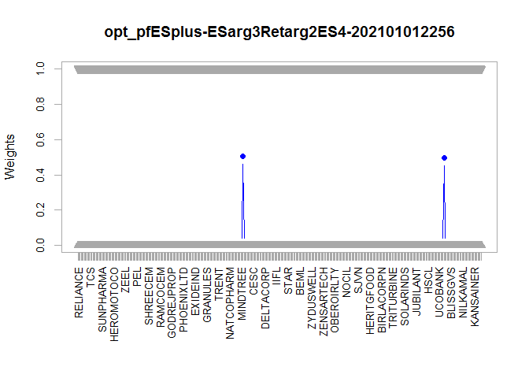

    ## [1] "Starting opt_pfESplus-ESarg3Retarg3ES1-202101012256"
    ## ***********************************
    ## PortfolioAnalytics Optimization
    ## ***********************************
    ## 
    ## Call:
    ## optimize.portfolio(R = R, portfolio = pfESplus, optimize_method = "ROI", 
    ##     trace = TRUE, momentFUN = cRebalSpec$momentFUN[cRebalSpec.ix])
    ## 
    ## Optimal Weights:
    ##   RELIANCE   HDFCBANK  ICICIBANK       HDFC        ITC   AXISBANK       SBIN 
    ##     0.0000     0.0000     0.0000     0.0000     0.0000     0.0000     0.0000 
    ##         LT BAJFINANCE       INFY BHARTIARTL        TCS        M.M  KOTAKBANK 
    ##     0.0000     0.0000     0.0791     0.0000     0.0000     0.0000     0.0000 
    ## INDUSINDBK       ONGC       NTPC TATAMOTORS  TATASTEEL     MARUTI   DIVISLAB 
    ##     0.0000     0.0000     0.0000     0.0000     0.0000     0.0000     0.0000 
    ##   HINDALCO  SUNPHARMA       VEDL HINDUNILVR    HCLTECH BAJAJFINSV  POWERGRID 
    ##     0.0000     0.0000     0.0000     0.0000     0.0000     0.0000     0.0000 
    ##       BPCL ASIANPAINT      TITAN    DRREDDY       GAIL HEROMOTOCO  COALINDIA 
    ##     0.0000     0.0000     0.0000     0.0000     0.0000     0.0000     0.0000 
    ##        IOC      TECHM ULTRACEMCO BAJAJ.AUTO ADANIPORTS     GRASIM      WIPRO 
    ##     0.0000     0.0000     0.0000     0.0000     0.0000     0.0000     0.0000 
    ##        UPL   JSWSTEEL       ZEEL     NAUKRI FEDERALBNK MOTHERSUMI  TATAPOWER 
    ##     0.0000     0.0000     0.0000     0.0106     0.0000     0.0000     0.0000 
    ##  BRITANNIA  AMBUJACEM  EICHERMOT AUROPHARMA SRTRANSFIN        BEL        PEL 
    ##     0.0000     0.0000     0.0000     0.0000     0.0000     0.0000     0.0000 
    ##   PETRONET        DLF      LUPIN     VOLTAS    HAVELLS     BIOCON        PFC 
    ##     0.0000     0.0000     0.0000     0.0000     0.0000     0.0000     0.0000 
    ##   ASHOKLEY   CHOLAFIN      CIPLA   SHREECEM     COLPAL BHARATFORG        SRF 
    ##     0.0000     0.0046     0.0000     0.0000     0.0000     0.0000     0.0000 
    ## PIDILITIND JINDALSTEL   ADANIENT     RECLTD     CONCOR    ESCORTS        ACC 
    ##     0.0064     0.0000     0.0000     0.0000     0.0000     0.0000     0.0000 
    ##   RAMCOCEM     MARICO     M.MFIN   GODREJCP  NESTLEIND  LICHSGFIN MANAPPURAM 
    ##     0.0000     0.0000     0.0000     0.0000     0.0000     0.0000     0.0000 
    ## BALKRISIND   CADILAHC      PIIND   BOSCHLTD GODREJPROP       NMDC BANKBARODA 
    ##     0.0000     0.0000     0.0000     0.0000     0.0000     0.0000     0.0000 
    ##   INDHOTEL    SIEMENS APOLLOHOSP TORNTPHARM   TVSMOTOR   JUBLFOOD CUMMINSIND 
    ##     0.0000     0.0000     0.0000     0.0000     0.0000     0.0000     0.0000 
    ##       IDEA PHOENIXLTD   GMRINFRA        MRF        IGL  BATAINDIA APOLLOTYRE 
    ##     0.0000     0.0000     0.0000     0.0000     0.0763     0.0000     0.0000 
    ## MUTHOOTFIN SUNDRMFAST     APLLTD       BHEL      L.TFH   EXIDEIND NATIONALUM 
    ##     0.0000     0.0000     0.0707     0.0000     0.0000     0.0000     0.0000 
    ##        CUB   GLENMARK AMARAJABAT        PVR SUPREMEIND NAVINFLUOR TORNTPOWER 
    ##     0.0000     0.0000     0.0000     0.0000     0.0000     0.0693     0.0000 
    ##      CANBK   DEEPAKNI   GRANULES    PAGEIND TATAMTRDVR BERGEPAINT   AARTIIND 
    ##     0.0000     0.0000     0.0000     0.0000     0.0000     0.0000     0.0000 
    ##  APLAPOLLO        PNB        UBL      DABUR  WHIRLPOOL       GSPL      TRENT 
    ##     0.0000     0.0000     0.0000     0.0000     0.0000     0.0000     0.0000 
    ##     FORTIS    DCBBANK   TATACOMM        NCC  TATAELXSI     CYIENT       IDFC 
    ##     0.0000     0.0000     0.0000     0.0000     0.0000     0.0000     0.0000 
    ##      GLAXO        OIL JMFINANCIL NATCOPHARM CANFINHOME       RAIN       ATUL 
    ##     0.0000     0.0000     0.0000     0.0000     0.0000     0.0000     0.0000 
    ## RAJESHEXPO       SAIL   SPICEJET       NHPC        MCX      SUNTV  REDINGTON 
    ##     0.0000     0.0000     0.0000     0.0000     0.0000     0.0000     0.0000 
    ##   MINDTREE   X3MINDIA      TANLA   EIDPARRY   GRAPHITE  GODREJIND  EDELWEISS 
    ##     0.0171     0.0000     0.0000     0.0000     0.0000     0.0000     0.0000 
    ##  LAXMIMACH     GESHIP   HINDZINC CASTROLIND       CESC   INDIACEM        FSL 
    ##     0.0000     0.0000     0.0000     0.0000     0.0000     0.0000     0.0000 
    ##       GNFC ABBOTINDIA ADANIPOWER  VAKRANGEE  UNIONBANK DCMSHRIRAM    WELCORP 
    ##     0.0000     0.0699     0.0000     0.0000     0.0000     0.0000     0.0000 
    ##   ALOKTEXT  DELTACORP  IBREALEST    KPRMILL        ABB  FINCABLES    CEATLTD 
    ##     0.0000     0.0000     0.0000     0.0000     0.0000     0.0000     0.0000 
    ##     VIPIND    KTKBANK     RALLIS CENTURYTEX BALRAMCHIN       IIFL       OFSS 
    ##     0.0000     0.0000     0.0000     0.0000     0.0000     0.0000     0.0000 
    ##     RELAXO        KEC AJANTPHARM   WESTLIFE TV18BRDCST  SOUTHBANK       GPPL 
    ##     0.0709     0.0000     0.0000     0.0277     0.0000     0.0000     0.0000 
    ## KALPATPOWR HINDCOPPER       STAR AARTIDRUGS SHRIRAMCIT       CERA WOCKPHARMA 
    ##     0.0000     0.0000     0.0000     0.0552     0.0000     0.0000     0.0000 
    ##  BAJAJELEC ENGINERSIN       GSFC COROMANDEL   AEGISLOG      IOLCP       BEML 
    ##     0.0000     0.0000     0.0000     0.0000     0.0000     0.0283     0.0000 
    ##        IRB      UFLEX       BASF    INDIANB  AKZOINDIA       BBTC SONATSOFTW 
    ##     0.0000     0.0000     0.0000     0.0000     0.0000     0.0000     0.0000 
    ##    SEQUENT    EIHOTEL  BAYERCROP  ZYDUSWELL  JSWENERGY WELSPUNIND     DISHTV 
    ##     0.0000     0.0000     0.0000     0.0000     0.0000     0.0000     0.0000 
    ## CARBORUNIV        HEG        PTC VINATIORGA     TIMKEN       HFCL        VTL 
    ##     0.0000     0.0000     0.0000     0.0000     0.0000     0.0000     0.0000 
    ## ZENSARTECH      SPARC     ECLERX    RAYMOND    TRIDENT     ASHOKA     RADICO 
    ##     0.0000     0.0000     0.0000     0.0000     0.0000     0.0000     0.0000 
    ## ALKYLAMINE  BANKINDIA SUDARSCHEM    IPCALAB OBEROIRLTY        FDC GODFRYPHLP 
    ##     0.1318     0.0000     0.0000     0.0000     0.0000     0.0000     0.0000 
    ##  SHILPAMED PHILIPCARB       MOIL      SOBHA       MEGH   PRESTIGE     VSTIND 
    ##     0.0000     0.0000     0.0000     0.0000     0.0000     0.0000     0.0000 
    ## MAHSCOOTER      NOCIL INOXLEISUR       GHCL TATAINVEST   NLCINDIA  JYOTHYLAB 
    ##     0.0000     0.0000     0.0000     0.0000     0.0000     0.0000     0.0000 
    ## KAJARIACER   GILLETTE  RESPONIND MOTILALOFS       KRBL       SJVN   ALLCARGO 
    ##     0.0000     0.0000     0.0000     0.0000     0.0000     0.0000     0.0000 
    ##  ORIENTREF       DCAL CHENNPETRO   SKFINDIA FINOLEXIND CENTURYPLY        SCI 
    ##     0.0000     0.0000     0.0000     0.0000     0.0000     0.0000     0.0000 
    ##        GDL GREAVESCOT HERITGFOOD SHOPERSTOP  BOMDYEING     KNRCON HAWKINCOOK 
    ##     0.0000     0.0000     0.0000     0.0000     0.0000     0.0000     0.0000 
    ##     VENKYS  JINDALSAW    JKPAPER  ESABINDIA   MAHABANK SCHAEFFLER BIRLACORPN 
    ##     0.0000     0.0000     0.0000     0.0000     0.0000     0.0000     0.0000 
    ## BALMLAWRIE       MFSL       PGHH   MINDAIND     VGUARD LINDEINDIA      JCHAC 
    ##     0.0000     0.0000     0.0839     0.0371     0.0000     0.0000     0.0000 
    ##       KSCL    LAOPALA TATACOFFEE TRITURBINE DEEPAKFERT   ASTRAZEN  JKLAKSHMI 
    ##     0.0000     0.0050     0.0000     0.0000     0.0000     0.0000     0.0000 
    ## VAIBHAVGBL   SUPRAJIT        GMM     IFBIND       IDBI   FORCEMOT    THERMAX 
    ##     0.0557     0.0000     0.0000     0.0000     0.0000     0.0000     0.0000 
    ##  SOLARINDS   BLUEDART      NESCO  JAMNAAUTO        JSL    DHANUKA TVSSRICHAK 
    ##     0.0175     0.0000     0.0000     0.0000     0.0000     0.0000     0.0000 
    ## TATAMETALI       MRPL NBVENTURES BAJAJHLDNG   JUBILANT JBCHEPHARM CHAMBLFERT 
    ##     0.0000     0.0000     0.0000     0.0000     0.0000     0.0000     0.0000 
    ##        KEI TTKPRESTIG    SUNTECK      CAPPL  NETWORK18  GUJALKALI  CENTRALBK 
    ##     0.0000     0.0000     0.0000     0.0000     0.0000     0.0000     0.0000 
    ##    J.KBANK       HSCL    GMDCLTD     PFIZER      MHRIL NAVNETEDUL        RCF 
    ##     0.0000     0.0000     0.0000     0.0000     0.0000     0.0000     0.0000 
    ##        IOB    TVTODAY  SCHNEIDER  RATNAMANI     JKTYRE    UCOBANK      GEPIL 
    ##     0.0000     0.0000     0.0000     0.0000     0.0000     0.0000     0.0000 
    ##  FCONSUMER TIMETECHNO     JAGRAN       MMTC     SANOFI        CCL SWANENERGY 
    ##     0.0000     0.0000     0.0000     0.0000     0.0000     0.0000     0.0000 
    ## JAICORPLTD     DBCORP   BLISSGVS WABCOINDIA      OMAXE    HATHWAY  MAHINDCIE 
    ##     0.0000     0.0000     0.0000     0.0000     0.0000     0.0000     0.0000 
    ##    MAHLIFE        ITI   EMAMILTD     ASTRAL   SYMPHONY     INDOCO   NILKAMAL 
    ##     0.0000     0.0000     0.0000     0.0827     0.0000     0.0000     0.0000 
    ##     SUZLON       IFCI       ITDC     CRISIL    BRIGADE BLUESTARCO MAHSEAMLES 
    ##     0.0000     0.0000     0.0000     0.0000     0.0000     0.0000     0.0000 
    ## HEIDELBERG    POLYMED  GRINDWELL  KANSAINER     AIAENG   TASTYBIT PERSISTENT 
    ##     0.0000     0.0000     0.0000     0.0000     0.0000     0.0000     0.0000 
    ##   JKCEMENT    MPHASIS     HONAUT  HINDPETRO 
    ##     0.0000     0.0000     0.0000     0.0000 
    ## 
    ## Objective Measure:
    ##     mean 
    ## 0.009028 
    ## 
    ## 
    ##      ES 
    ## 0.03268


    ## [1] "Starting opt_pfESplus-ESarg3Retarg3ES2-202101012256"
    ## ***********************************
    ## PortfolioAnalytics Optimization
    ## ***********************************
    ## 
    ## Call:
    ## optimize.portfolio(R = R, portfolio = pfESplus, optimize_method = "ROI", 
    ##     trace = TRUE, momentFUN = cRebalSpec$momentFUN[cRebalSpec.ix])
    ## 
    ## Optimal Weights:
    ##   RELIANCE   HDFCBANK  ICICIBANK       HDFC        ITC   AXISBANK       SBIN 
    ##     0.0000     0.0000     0.0000     0.0000     0.0000     0.0000     0.0000 
    ##         LT BAJFINANCE       INFY BHARTIARTL        TCS        M.M  KOTAKBANK 
    ##     0.0000     0.0000     0.0791     0.0000     0.0000     0.0000     0.0000 
    ## INDUSINDBK       ONGC       NTPC TATAMOTORS  TATASTEEL     MARUTI   DIVISLAB 
    ##     0.0000     0.0000     0.0000     0.0000     0.0000     0.0000     0.0000 
    ##   HINDALCO  SUNPHARMA       VEDL HINDUNILVR    HCLTECH BAJAJFINSV  POWERGRID 
    ##     0.0000     0.0000     0.0000     0.0000     0.0000     0.0000     0.0000 
    ##       BPCL ASIANPAINT      TITAN    DRREDDY       GAIL HEROMOTOCO  COALINDIA 
    ##     0.0000     0.0000     0.0000     0.0000     0.0000     0.0000     0.0000 
    ##        IOC      TECHM ULTRACEMCO BAJAJ.AUTO ADANIPORTS     GRASIM      WIPRO 
    ##     0.0000     0.0000     0.0000     0.0000     0.0000     0.0000     0.0000 
    ##        UPL   JSWSTEEL       ZEEL     NAUKRI FEDERALBNK MOTHERSUMI  TATAPOWER 
    ##     0.0000     0.0000     0.0000     0.0106     0.0000     0.0000     0.0000 
    ##  BRITANNIA  AMBUJACEM  EICHERMOT AUROPHARMA SRTRANSFIN        BEL        PEL 
    ##     0.0000     0.0000     0.0000     0.0000     0.0000     0.0000     0.0000 
    ##   PETRONET        DLF      LUPIN     VOLTAS    HAVELLS     BIOCON        PFC 
    ##     0.0000     0.0000     0.0000     0.0000     0.0000     0.0000     0.0000 
    ##   ASHOKLEY   CHOLAFIN      CIPLA   SHREECEM     COLPAL BHARATFORG        SRF 
    ##     0.0000     0.0046     0.0000     0.0000     0.0000     0.0000     0.0000 
    ## PIDILITIND JINDALSTEL   ADANIENT     RECLTD     CONCOR    ESCORTS        ACC 
    ##     0.0064     0.0000     0.0000     0.0000     0.0000     0.0000     0.0000 
    ##   RAMCOCEM     MARICO     M.MFIN   GODREJCP  NESTLEIND  LICHSGFIN MANAPPURAM 
    ##     0.0000     0.0000     0.0000     0.0000     0.0000     0.0000     0.0000 
    ## BALKRISIND   CADILAHC      PIIND   BOSCHLTD GODREJPROP       NMDC BANKBARODA 
    ##     0.0000     0.0000     0.0000     0.0000     0.0000     0.0000     0.0000 
    ##   INDHOTEL    SIEMENS APOLLOHOSP TORNTPHARM   TVSMOTOR   JUBLFOOD CUMMINSIND 
    ##     0.0000     0.0000     0.0000     0.0000     0.0000     0.0000     0.0000 
    ##       IDEA PHOENIXLTD   GMRINFRA        MRF        IGL  BATAINDIA APOLLOTYRE 
    ##     0.0000     0.0000     0.0000     0.0000     0.0763     0.0000     0.0000 
    ## MUTHOOTFIN SUNDRMFAST     APLLTD       BHEL      L.TFH   EXIDEIND NATIONALUM 
    ##     0.0000     0.0000     0.0707     0.0000     0.0000     0.0000     0.0000 
    ##        CUB   GLENMARK AMARAJABAT        PVR SUPREMEIND NAVINFLUOR TORNTPOWER 
    ##     0.0000     0.0000     0.0000     0.0000     0.0000     0.0693     0.0000 
    ##      CANBK   DEEPAKNI   GRANULES    PAGEIND TATAMTRDVR BERGEPAINT   AARTIIND 
    ##     0.0000     0.0000     0.0000     0.0000     0.0000     0.0000     0.0000 
    ##  APLAPOLLO        PNB        UBL      DABUR  WHIRLPOOL       GSPL      TRENT 
    ##     0.0000     0.0000     0.0000     0.0000     0.0000     0.0000     0.0000 
    ##     FORTIS    DCBBANK   TATACOMM        NCC  TATAELXSI     CYIENT       IDFC 
    ##     0.0000     0.0000     0.0000     0.0000     0.0000     0.0000     0.0000 
    ##      GLAXO        OIL JMFINANCIL NATCOPHARM CANFINHOME       RAIN       ATUL 
    ##     0.0000     0.0000     0.0000     0.0000     0.0000     0.0000     0.0000 
    ## RAJESHEXPO       SAIL   SPICEJET       NHPC        MCX      SUNTV  REDINGTON 
    ##     0.0000     0.0000     0.0000     0.0000     0.0000     0.0000     0.0000 
    ##   MINDTREE   X3MINDIA      TANLA   EIDPARRY   GRAPHITE  GODREJIND  EDELWEISS 
    ##     0.0171     0.0000     0.0000     0.0000     0.0000     0.0000     0.0000 
    ##  LAXMIMACH     GESHIP   HINDZINC CASTROLIND       CESC   INDIACEM        FSL 
    ##     0.0000     0.0000     0.0000     0.0000     0.0000     0.0000     0.0000 
    ##       GNFC ABBOTINDIA ADANIPOWER  VAKRANGEE  UNIONBANK DCMSHRIRAM    WELCORP 
    ##     0.0000     0.0699     0.0000     0.0000     0.0000     0.0000     0.0000 
    ##   ALOKTEXT  DELTACORP  IBREALEST    KPRMILL        ABB  FINCABLES    CEATLTD 
    ##     0.0000     0.0000     0.0000     0.0000     0.0000     0.0000     0.0000 
    ##     VIPIND    KTKBANK     RALLIS CENTURYTEX BALRAMCHIN       IIFL       OFSS 
    ##     0.0000     0.0000     0.0000     0.0000     0.0000     0.0000     0.0000 
    ##     RELAXO        KEC AJANTPHARM   WESTLIFE TV18BRDCST  SOUTHBANK       GPPL 
    ##     0.0709     0.0000     0.0000     0.0277     0.0000     0.0000     0.0000 
    ## KALPATPOWR HINDCOPPER       STAR AARTIDRUGS SHRIRAMCIT       CERA WOCKPHARMA 
    ##     0.0000     0.0000     0.0000     0.0552     0.0000     0.0000     0.0000 
    ##  BAJAJELEC ENGINERSIN       GSFC COROMANDEL   AEGISLOG      IOLCP       BEML 
    ##     0.0000     0.0000     0.0000     0.0000     0.0000     0.0283     0.0000 
    ##        IRB      UFLEX       BASF    INDIANB  AKZOINDIA       BBTC SONATSOFTW 
    ##     0.0000     0.0000     0.0000     0.0000     0.0000     0.0000     0.0000 
    ##    SEQUENT    EIHOTEL  BAYERCROP  ZYDUSWELL  JSWENERGY WELSPUNIND     DISHTV 
    ##     0.0000     0.0000     0.0000     0.0000     0.0000     0.0000     0.0000 
    ## CARBORUNIV        HEG        PTC VINATIORGA     TIMKEN       HFCL        VTL 
    ##     0.0000     0.0000     0.0000     0.0000     0.0000     0.0000     0.0000 
    ## ZENSARTECH      SPARC     ECLERX    RAYMOND    TRIDENT     ASHOKA     RADICO 
    ##     0.0000     0.0000     0.0000     0.0000     0.0000     0.0000     0.0000 
    ## ALKYLAMINE  BANKINDIA SUDARSCHEM    IPCALAB OBEROIRLTY        FDC GODFRYPHLP 
    ##     0.1318     0.0000     0.0000     0.0000     0.0000     0.0000     0.0000 
    ##  SHILPAMED PHILIPCARB       MOIL      SOBHA       MEGH   PRESTIGE     VSTIND 
    ##     0.0000     0.0000     0.0000     0.0000     0.0000     0.0000     0.0000 
    ## MAHSCOOTER      NOCIL INOXLEISUR       GHCL TATAINVEST   NLCINDIA  JYOTHYLAB 
    ##     0.0000     0.0000     0.0000     0.0000     0.0000     0.0000     0.0000 
    ## KAJARIACER   GILLETTE  RESPONIND MOTILALOFS       KRBL       SJVN   ALLCARGO 
    ##     0.0000     0.0000     0.0000     0.0000     0.0000     0.0000     0.0000 
    ##  ORIENTREF       DCAL CHENNPETRO   SKFINDIA FINOLEXIND CENTURYPLY        SCI 
    ##     0.0000     0.0000     0.0000     0.0000     0.0000     0.0000     0.0000 
    ##        GDL GREAVESCOT HERITGFOOD SHOPERSTOP  BOMDYEING     KNRCON HAWKINCOOK 
    ##     0.0000     0.0000     0.0000     0.0000     0.0000     0.0000     0.0000 
    ##     VENKYS  JINDALSAW    JKPAPER  ESABINDIA   MAHABANK SCHAEFFLER BIRLACORPN 
    ##     0.0000     0.0000     0.0000     0.0000     0.0000     0.0000     0.0000 
    ## BALMLAWRIE       MFSL       PGHH   MINDAIND     VGUARD LINDEINDIA      JCHAC 
    ##     0.0000     0.0000     0.0839     0.0371     0.0000     0.0000     0.0000 
    ##       KSCL    LAOPALA TATACOFFEE TRITURBINE DEEPAKFERT   ASTRAZEN  JKLAKSHMI 
    ##     0.0000     0.0050     0.0000     0.0000     0.0000     0.0000     0.0000 
    ## VAIBHAVGBL   SUPRAJIT        GMM     IFBIND       IDBI   FORCEMOT    THERMAX 
    ##     0.0557     0.0000     0.0000     0.0000     0.0000     0.0000     0.0000 
    ##  SOLARINDS   BLUEDART      NESCO  JAMNAAUTO        JSL    DHANUKA TVSSRICHAK 
    ##     0.0175     0.0000     0.0000     0.0000     0.0000     0.0000     0.0000 
    ## TATAMETALI       MRPL NBVENTURES BAJAJHLDNG   JUBILANT JBCHEPHARM CHAMBLFERT 
    ##     0.0000     0.0000     0.0000     0.0000     0.0000     0.0000     0.0000 
    ##        KEI TTKPRESTIG    SUNTECK      CAPPL  NETWORK18  GUJALKALI  CENTRALBK 
    ##     0.0000     0.0000     0.0000     0.0000     0.0000     0.0000     0.0000 
    ##    J.KBANK       HSCL    GMDCLTD     PFIZER      MHRIL NAVNETEDUL        RCF 
    ##     0.0000     0.0000     0.0000     0.0000     0.0000     0.0000     0.0000 
    ##        IOB    TVTODAY  SCHNEIDER  RATNAMANI     JKTYRE    UCOBANK      GEPIL 
    ##     0.0000     0.0000     0.0000     0.0000     0.0000     0.0000     0.0000 
    ##  FCONSUMER TIMETECHNO     JAGRAN       MMTC     SANOFI        CCL SWANENERGY 
    ##     0.0000     0.0000     0.0000     0.0000     0.0000     0.0000     0.0000 
    ## JAICORPLTD     DBCORP   BLISSGVS WABCOINDIA      OMAXE    HATHWAY  MAHINDCIE 
    ##     0.0000     0.0000     0.0000     0.0000     0.0000     0.0000     0.0000 
    ##    MAHLIFE        ITI   EMAMILTD     ASTRAL   SYMPHONY     INDOCO   NILKAMAL 
    ##     0.0000     0.0000     0.0000     0.0827     0.0000     0.0000     0.0000 
    ##     SUZLON       IFCI       ITDC     CRISIL    BRIGADE BLUESTARCO MAHSEAMLES 
    ##     0.0000     0.0000     0.0000     0.0000     0.0000     0.0000     0.0000 
    ## HEIDELBERG    POLYMED  GRINDWELL  KANSAINER     AIAENG   TASTYBIT PERSISTENT 
    ##     0.0000     0.0000     0.0000     0.0000     0.0000     0.0000     0.0000 
    ##   JKCEMENT    MPHASIS     HONAUT  HINDPETRO 
    ##     0.0000     0.0000     0.0000     0.0000 
    ## 
    ## Objective Measure:
    ##     mean 
    ## 0.009028 
    ## 
    ## 
    ##      ES 
    ## 0.03268

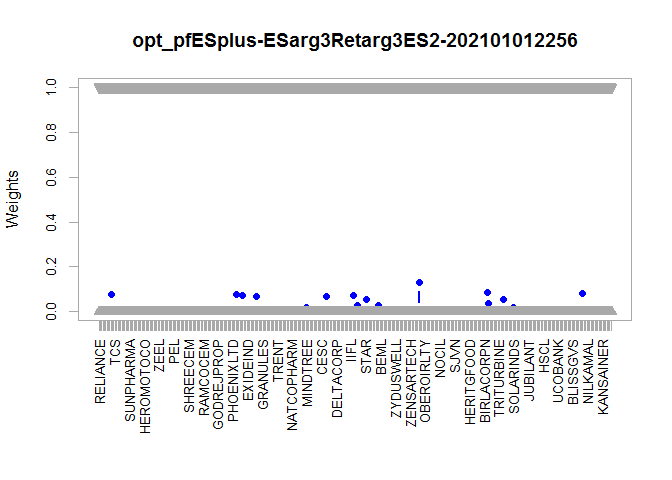

    ## [1] "Starting opt_pfESplus-ESarg3Retarg3ES3-202101012256"
    ## ***********************************
    ## PortfolioAnalytics Optimization
    ## ***********************************
    ## 
    ## Call:
    ## optimize.portfolio(R = R, portfolio = pfESplus, optimize_method = "ROI", 
    ##     trace = TRUE, momentFUN = cRebalSpec$momentFUN[cRebalSpec.ix])
    ## 
    ## Optimal Weights:
    ##   RELIANCE   HDFCBANK  ICICIBANK       HDFC        ITC   AXISBANK       SBIN 
    ##     0.0000     0.0000     0.0000     0.0000     0.0000     0.0000     0.0000 
    ##         LT BAJFINANCE       INFY BHARTIARTL        TCS        M.M  KOTAKBANK 
    ##     0.0000     0.0000     0.0791     0.0000     0.0000     0.0000     0.0000 
    ## INDUSINDBK       ONGC       NTPC TATAMOTORS  TATASTEEL     MARUTI   DIVISLAB 
    ##     0.0000     0.0000     0.0000     0.0000     0.0000     0.0000     0.0000 
    ##   HINDALCO  SUNPHARMA       VEDL HINDUNILVR    HCLTECH BAJAJFINSV  POWERGRID 
    ##     0.0000     0.0000     0.0000     0.0000     0.0000     0.0000     0.0000 
    ##       BPCL ASIANPAINT      TITAN    DRREDDY       GAIL HEROMOTOCO  COALINDIA 
    ##     0.0000     0.0000     0.0000     0.0000     0.0000     0.0000     0.0000 
    ##        IOC      TECHM ULTRACEMCO BAJAJ.AUTO ADANIPORTS     GRASIM      WIPRO 
    ##     0.0000     0.0000     0.0000     0.0000     0.0000     0.0000     0.0000 
    ##        UPL   JSWSTEEL       ZEEL     NAUKRI FEDERALBNK MOTHERSUMI  TATAPOWER 
    ##     0.0000     0.0000     0.0000     0.0106     0.0000     0.0000     0.0000 
    ##  BRITANNIA  AMBUJACEM  EICHERMOT AUROPHARMA SRTRANSFIN        BEL        PEL 
    ##     0.0000     0.0000     0.0000     0.0000     0.0000     0.0000     0.0000 
    ##   PETRONET        DLF      LUPIN     VOLTAS    HAVELLS     BIOCON        PFC 
    ##     0.0000     0.0000     0.0000     0.0000     0.0000     0.0000     0.0000 
    ##   ASHOKLEY   CHOLAFIN      CIPLA   SHREECEM     COLPAL BHARATFORG        SRF 
    ##     0.0000     0.0046     0.0000     0.0000     0.0000     0.0000     0.0000 
    ## PIDILITIND JINDALSTEL   ADANIENT     RECLTD     CONCOR    ESCORTS        ACC 
    ##     0.0064     0.0000     0.0000     0.0000     0.0000     0.0000     0.0000 
    ##   RAMCOCEM     MARICO     M.MFIN   GODREJCP  NESTLEIND  LICHSGFIN MANAPPURAM 
    ##     0.0000     0.0000     0.0000     0.0000     0.0000     0.0000     0.0000 
    ## BALKRISIND   CADILAHC      PIIND   BOSCHLTD GODREJPROP       NMDC BANKBARODA 
    ##     0.0000     0.0000     0.0000     0.0000     0.0000     0.0000     0.0000 
    ##   INDHOTEL    SIEMENS APOLLOHOSP TORNTPHARM   TVSMOTOR   JUBLFOOD CUMMINSIND 
    ##     0.0000     0.0000     0.0000     0.0000     0.0000     0.0000     0.0000 
    ##       IDEA PHOENIXLTD   GMRINFRA        MRF        IGL  BATAINDIA APOLLOTYRE 
    ##     0.0000     0.0000     0.0000     0.0000     0.0763     0.0000     0.0000 
    ## MUTHOOTFIN SUNDRMFAST     APLLTD       BHEL      L.TFH   EXIDEIND NATIONALUM 
    ##     0.0000     0.0000     0.0707     0.0000     0.0000     0.0000     0.0000 
    ##        CUB   GLENMARK AMARAJABAT        PVR SUPREMEIND NAVINFLUOR TORNTPOWER 
    ##     0.0000     0.0000     0.0000     0.0000     0.0000     0.0693     0.0000 
    ##      CANBK   DEEPAKNI   GRANULES    PAGEIND TATAMTRDVR BERGEPAINT   AARTIIND 
    ##     0.0000     0.0000     0.0000     0.0000     0.0000     0.0000     0.0000 
    ##  APLAPOLLO        PNB        UBL      DABUR  WHIRLPOOL       GSPL      TRENT 
    ##     0.0000     0.0000     0.0000     0.0000     0.0000     0.0000     0.0000 
    ##     FORTIS    DCBBANK   TATACOMM        NCC  TATAELXSI     CYIENT       IDFC 
    ##     0.0000     0.0000     0.0000     0.0000     0.0000     0.0000     0.0000 
    ##      GLAXO        OIL JMFINANCIL NATCOPHARM CANFINHOME       RAIN       ATUL 
    ##     0.0000     0.0000     0.0000     0.0000     0.0000     0.0000     0.0000 
    ## RAJESHEXPO       SAIL   SPICEJET       NHPC        MCX      SUNTV  REDINGTON 
    ##     0.0000     0.0000     0.0000     0.0000     0.0000     0.0000     0.0000 
    ##   MINDTREE   X3MINDIA      TANLA   EIDPARRY   GRAPHITE  GODREJIND  EDELWEISS 
    ##     0.0171     0.0000     0.0000     0.0000     0.0000     0.0000     0.0000 
    ##  LAXMIMACH     GESHIP   HINDZINC CASTROLIND       CESC   INDIACEM        FSL 
    ##     0.0000     0.0000     0.0000     0.0000     0.0000     0.0000     0.0000 
    ##       GNFC ABBOTINDIA ADANIPOWER  VAKRANGEE  UNIONBANK DCMSHRIRAM    WELCORP 
    ##     0.0000     0.0699     0.0000     0.0000     0.0000     0.0000     0.0000 
    ##   ALOKTEXT  DELTACORP  IBREALEST    KPRMILL        ABB  FINCABLES    CEATLTD 
    ##     0.0000     0.0000     0.0000     0.0000     0.0000     0.0000     0.0000 
    ##     VIPIND    KTKBANK     RALLIS CENTURYTEX BALRAMCHIN       IIFL       OFSS 
    ##     0.0000     0.0000     0.0000     0.0000     0.0000     0.0000     0.0000 
    ##     RELAXO        KEC AJANTPHARM   WESTLIFE TV18BRDCST  SOUTHBANK       GPPL 
    ##     0.0709     0.0000     0.0000     0.0277     0.0000     0.0000     0.0000 
    ## KALPATPOWR HINDCOPPER       STAR AARTIDRUGS SHRIRAMCIT       CERA WOCKPHARMA 
    ##     0.0000     0.0000     0.0000     0.0552     0.0000     0.0000     0.0000 
    ##  BAJAJELEC ENGINERSIN       GSFC COROMANDEL   AEGISLOG      IOLCP       BEML 
    ##     0.0000     0.0000     0.0000     0.0000     0.0000     0.0283     0.0000 
    ##        IRB      UFLEX       BASF    INDIANB  AKZOINDIA       BBTC SONATSOFTW 
    ##     0.0000     0.0000     0.0000     0.0000     0.0000     0.0000     0.0000 
    ##    SEQUENT    EIHOTEL  BAYERCROP  ZYDUSWELL  JSWENERGY WELSPUNIND     DISHTV 
    ##     0.0000     0.0000     0.0000     0.0000     0.0000     0.0000     0.0000 
    ## CARBORUNIV        HEG        PTC VINATIORGA     TIMKEN       HFCL        VTL 
    ##     0.0000     0.0000     0.0000     0.0000     0.0000     0.0000     0.0000 
    ## ZENSARTECH      SPARC     ECLERX    RAYMOND    TRIDENT     ASHOKA     RADICO 
    ##     0.0000     0.0000     0.0000     0.0000     0.0000     0.0000     0.0000 
    ## ALKYLAMINE  BANKINDIA SUDARSCHEM    IPCALAB OBEROIRLTY        FDC GODFRYPHLP 
    ##     0.1318     0.0000     0.0000     0.0000     0.0000     0.0000     0.0000 
    ##  SHILPAMED PHILIPCARB       MOIL      SOBHA       MEGH   PRESTIGE     VSTIND 
    ##     0.0000     0.0000     0.0000     0.0000     0.0000     0.0000     0.0000 
    ## MAHSCOOTER      NOCIL INOXLEISUR       GHCL TATAINVEST   NLCINDIA  JYOTHYLAB 
    ##     0.0000     0.0000     0.0000     0.0000     0.0000     0.0000     0.0000 
    ## KAJARIACER   GILLETTE  RESPONIND MOTILALOFS       KRBL       SJVN   ALLCARGO 
    ##     0.0000     0.0000     0.0000     0.0000     0.0000     0.0000     0.0000 
    ##  ORIENTREF       DCAL CHENNPETRO   SKFINDIA FINOLEXIND CENTURYPLY        SCI 
    ##     0.0000     0.0000     0.0000     0.0000     0.0000     0.0000     0.0000 
    ##        GDL GREAVESCOT HERITGFOOD SHOPERSTOP  BOMDYEING     KNRCON HAWKINCOOK 
    ##     0.0000     0.0000     0.0000     0.0000     0.0000     0.0000     0.0000 
    ##     VENKYS  JINDALSAW    JKPAPER  ESABINDIA   MAHABANK SCHAEFFLER BIRLACORPN 
    ##     0.0000     0.0000     0.0000     0.0000     0.0000     0.0000     0.0000 
    ## BALMLAWRIE       MFSL       PGHH   MINDAIND     VGUARD LINDEINDIA      JCHAC 
    ##     0.0000     0.0000     0.0839     0.0371     0.0000     0.0000     0.0000 
    ##       KSCL    LAOPALA TATACOFFEE TRITURBINE DEEPAKFERT   ASTRAZEN  JKLAKSHMI 
    ##     0.0000     0.0050     0.0000     0.0000     0.0000     0.0000     0.0000 
    ## VAIBHAVGBL   SUPRAJIT        GMM     IFBIND       IDBI   FORCEMOT    THERMAX 
    ##     0.0557     0.0000     0.0000     0.0000     0.0000     0.0000     0.0000 
    ##  SOLARINDS   BLUEDART      NESCO  JAMNAAUTO        JSL    DHANUKA TVSSRICHAK 
    ##     0.0175     0.0000     0.0000     0.0000     0.0000     0.0000     0.0000 
    ## TATAMETALI       MRPL NBVENTURES BAJAJHLDNG   JUBILANT JBCHEPHARM CHAMBLFERT 
    ##     0.0000     0.0000     0.0000     0.0000     0.0000     0.0000     0.0000 
    ##        KEI TTKPRESTIG    SUNTECK      CAPPL  NETWORK18  GUJALKALI  CENTRALBK 
    ##     0.0000     0.0000     0.0000     0.0000     0.0000     0.0000     0.0000 
    ##    J.KBANK       HSCL    GMDCLTD     PFIZER      MHRIL NAVNETEDUL        RCF 
    ##     0.0000     0.0000     0.0000     0.0000     0.0000     0.0000     0.0000 
    ##        IOB    TVTODAY  SCHNEIDER  RATNAMANI     JKTYRE    UCOBANK      GEPIL 
    ##     0.0000     0.0000     0.0000     0.0000     0.0000     0.0000     0.0000 
    ##  FCONSUMER TIMETECHNO     JAGRAN       MMTC     SANOFI        CCL SWANENERGY 
    ##     0.0000     0.0000     0.0000     0.0000     0.0000     0.0000     0.0000 
    ## JAICORPLTD     DBCORP   BLISSGVS WABCOINDIA      OMAXE    HATHWAY  MAHINDCIE 
    ##     0.0000     0.0000     0.0000     0.0000     0.0000     0.0000     0.0000 
    ##    MAHLIFE        ITI   EMAMILTD     ASTRAL   SYMPHONY     INDOCO   NILKAMAL 
    ##     0.0000     0.0000     0.0000     0.0827     0.0000     0.0000     0.0000 
    ##     SUZLON       IFCI       ITDC     CRISIL    BRIGADE BLUESTARCO MAHSEAMLES 
    ##     0.0000     0.0000     0.0000     0.0000     0.0000     0.0000     0.0000 
    ## HEIDELBERG    POLYMED  GRINDWELL  KANSAINER     AIAENG   TASTYBIT PERSISTENT 
    ##     0.0000     0.0000     0.0000     0.0000     0.0000     0.0000     0.0000 
    ##   JKCEMENT    MPHASIS     HONAUT  HINDPETRO 
    ##     0.0000     0.0000     0.0000     0.0000 
    ## 
    ## Objective Measure:
    ##     mean 
    ## 0.009028 
    ## 
    ## 
    ##      ES 
    ## 0.03268


    ## [1] "Starting opt_pfESplus-ESarg3Retarg3ES4-202101012256"
    ## ***********************************
    ## PortfolioAnalytics Optimization
    ## ***********************************
    ## 
    ## Call:
    ## optimize.portfolio(R = R, portfolio = pfESplus, optimize_method = "ROI", 
    ##     trace = TRUE, momentFUN = cRebalSpec$momentFUN[cRebalSpec.ix])
    ## 
    ## Optimal Weights:
    ##   RELIANCE   HDFCBANK  ICICIBANK       HDFC        ITC   AXISBANK       SBIN 
    ##          0          0          0          0          0          0          0 
    ##         LT BAJFINANCE       INFY BHARTIARTL        TCS        M.M  KOTAKBANK 
    ##          0          0          0          0          0          0          0 
    ## INDUSINDBK       ONGC       NTPC TATAMOTORS  TATASTEEL     MARUTI   DIVISLAB 
    ##          0          0          0          0          0          0          0 
    ##   HINDALCO  SUNPHARMA       VEDL HINDUNILVR    HCLTECH BAJAJFINSV  POWERGRID 
    ##          0          0          0          0          0          0          0 
    ##       BPCL ASIANPAINT      TITAN    DRREDDY       GAIL HEROMOTOCO  COALINDIA 
    ##          0          0          0          0          0          0          0 
    ##        IOC      TECHM ULTRACEMCO BAJAJ.AUTO ADANIPORTS     GRASIM      WIPRO 
    ##          0          0          0          0          0          0          0 
    ##        UPL   JSWSTEEL       ZEEL     NAUKRI FEDERALBNK MOTHERSUMI  TATAPOWER 
    ##          0          0          0          0          0          0          0 
    ##  BRITANNIA  AMBUJACEM  EICHERMOT AUROPHARMA SRTRANSFIN        BEL        PEL 
    ##          0          0          0          0          0          0          0 
    ##   PETRONET        DLF      LUPIN     VOLTAS    HAVELLS     BIOCON        PFC 
    ##          0          0          0          0          0          0          0 
    ##   ASHOKLEY   CHOLAFIN      CIPLA   SHREECEM     COLPAL BHARATFORG        SRF 
    ##          0          0          0          0          0          0          0 
    ## PIDILITIND JINDALSTEL   ADANIENT     RECLTD     CONCOR    ESCORTS        ACC 
    ##          0          0          0          0          0          0          0 
    ##   RAMCOCEM     MARICO     M.MFIN   GODREJCP  NESTLEIND  LICHSGFIN MANAPPURAM 
    ##          0          0          0          0          0          0          0 
    ## BALKRISIND   CADILAHC      PIIND   BOSCHLTD GODREJPROP       NMDC BANKBARODA 
    ##          0          0          0          0          0          0          0 
    ##   INDHOTEL    SIEMENS APOLLOHOSP TORNTPHARM   TVSMOTOR   JUBLFOOD CUMMINSIND 
    ##          0          0          0          0          0          0          0 
    ##       IDEA PHOENIXLTD   GMRINFRA        MRF        IGL  BATAINDIA APOLLOTYRE 
    ##          0          0          0          0          0          0          0 
    ## MUTHOOTFIN SUNDRMFAST     APLLTD       BHEL      L.TFH   EXIDEIND NATIONALUM 
    ##          0          0          0          0          0          0          0 
    ##        CUB   GLENMARK AMARAJABAT        PVR SUPREMEIND NAVINFLUOR TORNTPOWER 
    ##          0          0          0          0          0          0          0 
    ##      CANBK   DEEPAKNI   GRANULES    PAGEIND TATAMTRDVR BERGEPAINT   AARTIIND 
    ##          0          0          0          0          0          0          0 
    ##  APLAPOLLO        PNB        UBL      DABUR  WHIRLPOOL       GSPL      TRENT 
    ##          0          0          0          0          0          0          0 
    ##     FORTIS    DCBBANK   TATACOMM        NCC  TATAELXSI     CYIENT       IDFC 
    ##          0          0          0          0          0          0          0 
    ##      GLAXO        OIL JMFINANCIL NATCOPHARM CANFINHOME       RAIN       ATUL 
    ##          0          0          0          0          0          0          0 
    ## RAJESHEXPO       SAIL   SPICEJET       NHPC        MCX      SUNTV  REDINGTON 
    ##          0          0          0          0          0          0          0 
    ##   MINDTREE   X3MINDIA      TANLA   EIDPARRY   GRAPHITE  GODREJIND  EDELWEISS 
    ##          0          0          1          0          0          0          0 
    ##  LAXMIMACH     GESHIP   HINDZINC CASTROLIND       CESC   INDIACEM        FSL 
    ##          0          0          0          0          0          0          0 
    ##       GNFC ABBOTINDIA ADANIPOWER  VAKRANGEE  UNIONBANK DCMSHRIRAM    WELCORP 
    ##          0          0          0          0          0          0          0 
    ##   ALOKTEXT  DELTACORP  IBREALEST    KPRMILL        ABB  FINCABLES    CEATLTD 
    ##          0          0          0          0          0          0          0 
    ##     VIPIND    KTKBANK     RALLIS CENTURYTEX BALRAMCHIN       IIFL       OFSS 
    ##          0          0          0          0          0          0          0 
    ##     RELAXO        KEC AJANTPHARM   WESTLIFE TV18BRDCST  SOUTHBANK       GPPL 
    ##          0          0          0          0          0          0          0 
    ## KALPATPOWR HINDCOPPER       STAR AARTIDRUGS SHRIRAMCIT       CERA WOCKPHARMA 
    ##          0          0          0          0          0          0          0 
    ##  BAJAJELEC ENGINERSIN       GSFC COROMANDEL   AEGISLOG      IOLCP       BEML 
    ##          0          0          0          0          0          0          0 
    ##        IRB      UFLEX       BASF    INDIANB  AKZOINDIA       BBTC SONATSOFTW 
    ##          0          0          0          0          0          0          0 
    ##    SEQUENT    EIHOTEL  BAYERCROP  ZYDUSWELL  JSWENERGY WELSPUNIND     DISHTV 
    ##          0          0          0          0          0          0          0 
    ## CARBORUNIV        HEG        PTC VINATIORGA     TIMKEN       HFCL        VTL 
    ##          0          0          0          0          0          0          0 
    ## ZENSARTECH      SPARC     ECLERX    RAYMOND    TRIDENT     ASHOKA     RADICO 
    ##          0          0          0          0          0          0          0 
    ## ALKYLAMINE  BANKINDIA SUDARSCHEM    IPCALAB OBEROIRLTY        FDC GODFRYPHLP 
    ##          0          0          0          0          0          0          0 
    ##  SHILPAMED PHILIPCARB       MOIL      SOBHA       MEGH   PRESTIGE     VSTIND 
    ##          0          0          0          0          0          0          0 
    ## MAHSCOOTER      NOCIL INOXLEISUR       GHCL TATAINVEST   NLCINDIA  JYOTHYLAB 
    ##          0          0          0          0          0          0          0 
    ## KAJARIACER   GILLETTE  RESPONIND MOTILALOFS       KRBL       SJVN   ALLCARGO 
    ##          0          0          0          0          0          0          0 
    ##  ORIENTREF       DCAL CHENNPETRO   SKFINDIA FINOLEXIND CENTURYPLY        SCI 
    ##          0          0          0          0          0          0          0 
    ##        GDL GREAVESCOT HERITGFOOD SHOPERSTOP  BOMDYEING     KNRCON HAWKINCOOK 
    ##          0          0          0          0          0          0          0 
    ##     VENKYS  JINDALSAW    JKPAPER  ESABINDIA   MAHABANK SCHAEFFLER BIRLACORPN 
    ##          0          0          0          0          0          0          0 
    ## BALMLAWRIE       MFSL       PGHH   MINDAIND     VGUARD LINDEINDIA      JCHAC 
    ##          0          0          0          0          0          0          0 
    ##       KSCL    LAOPALA TATACOFFEE TRITURBINE DEEPAKFERT   ASTRAZEN  JKLAKSHMI 
    ##          0          0          0          0          0          0          0 
    ## VAIBHAVGBL   SUPRAJIT        GMM     IFBIND       IDBI   FORCEMOT    THERMAX 
    ##          0          0          0          0          0          0          0 
    ##  SOLARINDS   BLUEDART      NESCO  JAMNAAUTO        JSL    DHANUKA TVSSRICHAK 
    ##          0          0          0          0          0          0          0 
    ## TATAMETALI       MRPL NBVENTURES BAJAJHLDNG   JUBILANT JBCHEPHARM CHAMBLFERT 
    ##          0          0          0          0          0          0          0 
    ##        KEI TTKPRESTIG    SUNTECK      CAPPL  NETWORK18  GUJALKALI  CENTRALBK 
    ##          0          0          0          0          0          0          0 
    ##    J.KBANK       HSCL    GMDCLTD     PFIZER      MHRIL NAVNETEDUL        RCF 
    ##          0          0          0          0          0          0          0 
    ##        IOB    TVTODAY  SCHNEIDER  RATNAMANI     JKTYRE    UCOBANK      GEPIL 
    ##          0          0          0          0          0          0          0 
    ##  FCONSUMER TIMETECHNO     JAGRAN       MMTC     SANOFI        CCL SWANENERGY 
    ##          0          0          0          0          0          0          0 
    ## JAICORPLTD     DBCORP   BLISSGVS WABCOINDIA      OMAXE    HATHWAY  MAHINDCIE 
    ##          0          0          0          0          0          0          0 
    ##    MAHLIFE        ITI   EMAMILTD     ASTRAL   SYMPHONY     INDOCO   NILKAMAL 
    ##          0          0          0          0          0          0          0 
    ##     SUZLON       IFCI       ITDC     CRISIL    BRIGADE BLUESTARCO MAHSEAMLES 
    ##          0          0          0          0          0          0          0 
    ## HEIDELBERG    POLYMED  GRINDWELL  KANSAINER     AIAENG   TASTYBIT PERSISTENT 
    ##          0          0          0          0          0          0          0 
    ##   JKCEMENT    MPHASIS     HONAUT  HINDPETRO 
    ##          0          0          0          0 
    ## 
    ## Objective Measure:
    ##    mean 
    ## 0.01533


    ## [1] "Starting opt_pfESplus-ESarg4Retarg2ES1-202101012256"
    ## ***********************************
    ## PortfolioAnalytics Optimization
    ## ***********************************
    ## 
    ## Call:
    ## optimize.portfolio(R = R, portfolio = pfESplus, optimize_method = "ROI", 
    ##     trace = TRUE, momentFUN = cRebalSpec$momentFUN[cRebalSpec.ix])
    ## 
    ## Optimal Weights:
    ##   RELIANCE   HDFCBANK  ICICIBANK       HDFC        ITC   AXISBANK       SBIN 
    ##     0.0000     0.0000     0.0000     0.0000     0.0000     0.0000     0.0000 
    ##         LT BAJFINANCE       INFY BHARTIARTL        TCS        M.M  KOTAKBANK 
    ##     0.0000     0.0000     0.0791     0.0000     0.0000     0.0000     0.0000 
    ## INDUSINDBK       ONGC       NTPC TATAMOTORS  TATASTEEL     MARUTI   DIVISLAB 
    ##     0.0000     0.0000     0.0000     0.0000     0.0000     0.0000     0.0000 
    ##   HINDALCO  SUNPHARMA       VEDL HINDUNILVR    HCLTECH BAJAJFINSV  POWERGRID 
    ##     0.0000     0.0000     0.0000     0.0000     0.0000     0.0000     0.0000 
    ##       BPCL ASIANPAINT      TITAN    DRREDDY       GAIL HEROMOTOCO  COALINDIA 
    ##     0.0000     0.0000     0.0000     0.0000     0.0000     0.0000     0.0000 
    ##        IOC      TECHM ULTRACEMCO BAJAJ.AUTO ADANIPORTS     GRASIM      WIPRO 
    ##     0.0000     0.0000     0.0000     0.0000     0.0000     0.0000     0.0000 
    ##        UPL   JSWSTEEL       ZEEL     NAUKRI FEDERALBNK MOTHERSUMI  TATAPOWER 
    ##     0.0000     0.0000     0.0000     0.0106     0.0000     0.0000     0.0000 
    ##  BRITANNIA  AMBUJACEM  EICHERMOT AUROPHARMA SRTRANSFIN        BEL        PEL 
    ##     0.0000     0.0000     0.0000     0.0000     0.0000     0.0000     0.0000 
    ##   PETRONET        DLF      LUPIN     VOLTAS    HAVELLS     BIOCON        PFC 
    ##     0.0000     0.0000     0.0000     0.0000     0.0000     0.0000     0.0000 
    ##   ASHOKLEY   CHOLAFIN      CIPLA   SHREECEM     COLPAL BHARATFORG        SRF 
    ##     0.0000     0.0046     0.0000     0.0000     0.0000     0.0000     0.0000 
    ## PIDILITIND JINDALSTEL   ADANIENT     RECLTD     CONCOR    ESCORTS        ACC 
    ##     0.0064     0.0000     0.0000     0.0000     0.0000     0.0000     0.0000 
    ##   RAMCOCEM     MARICO     M.MFIN   GODREJCP  NESTLEIND  LICHSGFIN MANAPPURAM 
    ##     0.0000     0.0000     0.0000     0.0000     0.0000     0.0000     0.0000 
    ## BALKRISIND   CADILAHC      PIIND   BOSCHLTD GODREJPROP       NMDC BANKBARODA 
    ##     0.0000     0.0000     0.0000     0.0000     0.0000     0.0000     0.0000 
    ##   INDHOTEL    SIEMENS APOLLOHOSP TORNTPHARM   TVSMOTOR   JUBLFOOD CUMMINSIND 
    ##     0.0000     0.0000     0.0000     0.0000     0.0000     0.0000     0.0000 
    ##       IDEA PHOENIXLTD   GMRINFRA        MRF        IGL  BATAINDIA APOLLOTYRE 
    ##     0.0000     0.0000     0.0000     0.0000     0.0763     0.0000     0.0000 
    ## MUTHOOTFIN SUNDRMFAST     APLLTD       BHEL      L.TFH   EXIDEIND NATIONALUM 
    ##     0.0000     0.0000     0.0707     0.0000     0.0000     0.0000     0.0000 
    ##        CUB   GLENMARK AMARAJABAT        PVR SUPREMEIND NAVINFLUOR TORNTPOWER 
    ##     0.0000     0.0000     0.0000     0.0000     0.0000     0.0693     0.0000 
    ##      CANBK   DEEPAKNI   GRANULES    PAGEIND TATAMTRDVR BERGEPAINT   AARTIIND 
    ##     0.0000     0.0000     0.0000     0.0000     0.0000     0.0000     0.0000 
    ##  APLAPOLLO        PNB        UBL      DABUR  WHIRLPOOL       GSPL      TRENT 
    ##     0.0000     0.0000     0.0000     0.0000     0.0000     0.0000     0.0000 
    ##     FORTIS    DCBBANK   TATACOMM        NCC  TATAELXSI     CYIENT       IDFC 
    ##     0.0000     0.0000     0.0000     0.0000     0.0000     0.0000     0.0000 
    ##      GLAXO        OIL JMFINANCIL NATCOPHARM CANFINHOME       RAIN       ATUL 
    ##     0.0000     0.0000     0.0000     0.0000     0.0000     0.0000     0.0000 
    ## RAJESHEXPO       SAIL   SPICEJET       NHPC        MCX      SUNTV  REDINGTON 
    ##     0.0000     0.0000     0.0000     0.0000     0.0000     0.0000     0.0000 
    ##   MINDTREE   X3MINDIA      TANLA   EIDPARRY   GRAPHITE  GODREJIND  EDELWEISS 
    ##     0.0171     0.0000     0.0000     0.0000     0.0000     0.0000     0.0000 
    ##  LAXMIMACH     GESHIP   HINDZINC CASTROLIND       CESC   INDIACEM        FSL 
    ##     0.0000     0.0000     0.0000     0.0000     0.0000     0.0000     0.0000 
    ##       GNFC ABBOTINDIA ADANIPOWER  VAKRANGEE  UNIONBANK DCMSHRIRAM    WELCORP 
    ##     0.0000     0.0699     0.0000     0.0000     0.0000     0.0000     0.0000 
    ##   ALOKTEXT  DELTACORP  IBREALEST    KPRMILL        ABB  FINCABLES    CEATLTD 
    ##     0.0000     0.0000     0.0000     0.0000     0.0000     0.0000     0.0000 
    ##     VIPIND    KTKBANK     RALLIS CENTURYTEX BALRAMCHIN       IIFL       OFSS 
    ##     0.0000     0.0000     0.0000     0.0000     0.0000     0.0000     0.0000 
    ##     RELAXO        KEC AJANTPHARM   WESTLIFE TV18BRDCST  SOUTHBANK       GPPL 
    ##     0.0709     0.0000     0.0000     0.0277     0.0000     0.0000     0.0000 
    ## KALPATPOWR HINDCOPPER       STAR AARTIDRUGS SHRIRAMCIT       CERA WOCKPHARMA 
    ##     0.0000     0.0000     0.0000     0.0552     0.0000     0.0000     0.0000 
    ##  BAJAJELEC ENGINERSIN       GSFC COROMANDEL   AEGISLOG      IOLCP       BEML 
    ##     0.0000     0.0000     0.0000     0.0000     0.0000     0.0283     0.0000 
    ##        IRB      UFLEX       BASF    INDIANB  AKZOINDIA       BBTC SONATSOFTW 
    ##     0.0000     0.0000     0.0000     0.0000     0.0000     0.0000     0.0000 
    ##    SEQUENT    EIHOTEL  BAYERCROP  ZYDUSWELL  JSWENERGY WELSPUNIND     DISHTV 
    ##     0.0000     0.0000     0.0000     0.0000     0.0000     0.0000     0.0000 
    ## CARBORUNIV        HEG        PTC VINATIORGA     TIMKEN       HFCL        VTL 
    ##     0.0000     0.0000     0.0000     0.0000     0.0000     0.0000     0.0000 
    ## ZENSARTECH      SPARC     ECLERX    RAYMOND    TRIDENT     ASHOKA     RADICO 
    ##     0.0000     0.0000     0.0000     0.0000     0.0000     0.0000     0.0000 
    ## ALKYLAMINE  BANKINDIA SUDARSCHEM    IPCALAB OBEROIRLTY        FDC GODFRYPHLP 
    ##     0.1318     0.0000     0.0000     0.0000     0.0000     0.0000     0.0000 
    ##  SHILPAMED PHILIPCARB       MOIL      SOBHA       MEGH   PRESTIGE     VSTIND 
    ##     0.0000     0.0000     0.0000     0.0000     0.0000     0.0000     0.0000 
    ## MAHSCOOTER      NOCIL INOXLEISUR       GHCL TATAINVEST   NLCINDIA  JYOTHYLAB 
    ##     0.0000     0.0000     0.0000     0.0000     0.0000     0.0000     0.0000 
    ## KAJARIACER   GILLETTE  RESPONIND MOTILALOFS       KRBL       SJVN   ALLCARGO 
    ##     0.0000     0.0000     0.0000     0.0000     0.0000     0.0000     0.0000 
    ##  ORIENTREF       DCAL CHENNPETRO   SKFINDIA FINOLEXIND CENTURYPLY        SCI 
    ##     0.0000     0.0000     0.0000     0.0000     0.0000     0.0000     0.0000 
    ##        GDL GREAVESCOT HERITGFOOD SHOPERSTOP  BOMDYEING     KNRCON HAWKINCOOK 
    ##     0.0000     0.0000     0.0000     0.0000     0.0000     0.0000     0.0000 
    ##     VENKYS  JINDALSAW    JKPAPER  ESABINDIA   MAHABANK SCHAEFFLER BIRLACORPN 
    ##     0.0000     0.0000     0.0000     0.0000     0.0000     0.0000     0.0000 
    ## BALMLAWRIE       MFSL       PGHH   MINDAIND     VGUARD LINDEINDIA      JCHAC 
    ##     0.0000     0.0000     0.0839     0.0371     0.0000     0.0000     0.0000 
    ##       KSCL    LAOPALA TATACOFFEE TRITURBINE DEEPAKFERT   ASTRAZEN  JKLAKSHMI 
    ##     0.0000     0.0050     0.0000     0.0000     0.0000     0.0000     0.0000 
    ## VAIBHAVGBL   SUPRAJIT        GMM     IFBIND       IDBI   FORCEMOT    THERMAX 
    ##     0.0557     0.0000     0.0000     0.0000     0.0000     0.0000     0.0000 
    ##  SOLARINDS   BLUEDART      NESCO  JAMNAAUTO        JSL    DHANUKA TVSSRICHAK 
    ##     0.0175     0.0000     0.0000     0.0000     0.0000     0.0000     0.0000 
    ## TATAMETALI       MRPL NBVENTURES BAJAJHLDNG   JUBILANT JBCHEPHARM CHAMBLFERT 
    ##     0.0000     0.0000     0.0000     0.0000     0.0000     0.0000     0.0000 
    ##        KEI TTKPRESTIG    SUNTECK      CAPPL  NETWORK18  GUJALKALI  CENTRALBK 
    ##     0.0000     0.0000     0.0000     0.0000     0.0000     0.0000     0.0000 
    ##    J.KBANK       HSCL    GMDCLTD     PFIZER      MHRIL NAVNETEDUL        RCF 
    ##     0.0000     0.0000     0.0000     0.0000     0.0000     0.0000     0.0000 
    ##        IOB    TVTODAY  SCHNEIDER  RATNAMANI     JKTYRE    UCOBANK      GEPIL 
    ##     0.0000     0.0000     0.0000     0.0000     0.0000     0.0000     0.0000 
    ##  FCONSUMER TIMETECHNO     JAGRAN       MMTC     SANOFI        CCL SWANENERGY 
    ##     0.0000     0.0000     0.0000     0.0000     0.0000     0.0000     0.0000 
    ## JAICORPLTD     DBCORP   BLISSGVS WABCOINDIA      OMAXE    HATHWAY  MAHINDCIE 
    ##     0.0000     0.0000     0.0000     0.0000     0.0000     0.0000     0.0000 
    ##    MAHLIFE        ITI   EMAMILTD     ASTRAL   SYMPHONY     INDOCO   NILKAMAL 
    ##     0.0000     0.0000     0.0000     0.0827     0.0000     0.0000     0.0000 
    ##     SUZLON       IFCI       ITDC     CRISIL    BRIGADE BLUESTARCO MAHSEAMLES 
    ##     0.0000     0.0000     0.0000     0.0000     0.0000     0.0000     0.0000 
    ## HEIDELBERG    POLYMED  GRINDWELL  KANSAINER     AIAENG   TASTYBIT PERSISTENT 
    ##     0.0000     0.0000     0.0000     0.0000     0.0000     0.0000     0.0000 
    ##   JKCEMENT    MPHASIS     HONAUT  HINDPETRO 
    ##     0.0000     0.0000     0.0000     0.0000 
    ## 
    ## Objective Measure:
    ##     mean 
    ## 0.009028 
    ## 
    ## 
    ##      ES 
    ## 0.03268


    ## [1] "Starting opt_pfESplus-ESarg4Retarg2ES2-202101012257"
    ## ***********************************
    ## PortfolioAnalytics Optimization
    ## ***********************************
    ## 
    ## Call:
    ## optimize.portfolio(R = R, portfolio = pfESplus, optimize_method = "ROI", 
    ##     trace = TRUE, momentFUN = cRebalSpec$momentFUN[cRebalSpec.ix])
    ## 
    ## Optimal Weights:
    ##   RELIANCE   HDFCBANK  ICICIBANK       HDFC        ITC   AXISBANK       SBIN 
    ##     0.0000     0.0000     0.0000     0.0000     0.0000     0.0000     0.0000 
    ##         LT BAJFINANCE       INFY BHARTIARTL        TCS        M.M  KOTAKBANK 
    ##     0.0000     0.0000     0.0791     0.0000     0.0000     0.0000     0.0000 
    ## INDUSINDBK       ONGC       NTPC TATAMOTORS  TATASTEEL     MARUTI   DIVISLAB 
    ##     0.0000     0.0000     0.0000     0.0000     0.0000     0.0000     0.0000 
    ##   HINDALCO  SUNPHARMA       VEDL HINDUNILVR    HCLTECH BAJAJFINSV  POWERGRID 
    ##     0.0000     0.0000     0.0000     0.0000     0.0000     0.0000     0.0000 
    ##       BPCL ASIANPAINT      TITAN    DRREDDY       GAIL HEROMOTOCO  COALINDIA 
    ##     0.0000     0.0000     0.0000     0.0000     0.0000     0.0000     0.0000 
    ##        IOC      TECHM ULTRACEMCO BAJAJ.AUTO ADANIPORTS     GRASIM      WIPRO 
    ##     0.0000     0.0000     0.0000     0.0000     0.0000     0.0000     0.0000 
    ##        UPL   JSWSTEEL       ZEEL     NAUKRI FEDERALBNK MOTHERSUMI  TATAPOWER 
    ##     0.0000     0.0000     0.0000     0.0106     0.0000     0.0000     0.0000 
    ##  BRITANNIA  AMBUJACEM  EICHERMOT AUROPHARMA SRTRANSFIN        BEL        PEL 
    ##     0.0000     0.0000     0.0000     0.0000     0.0000     0.0000     0.0000 
    ##   PETRONET        DLF      LUPIN     VOLTAS    HAVELLS     BIOCON        PFC 
    ##     0.0000     0.0000     0.0000     0.0000     0.0000     0.0000     0.0000 
    ##   ASHOKLEY   CHOLAFIN      CIPLA   SHREECEM     COLPAL BHARATFORG        SRF 
    ##     0.0000     0.0046     0.0000     0.0000     0.0000     0.0000     0.0000 
    ## PIDILITIND JINDALSTEL   ADANIENT     RECLTD     CONCOR    ESCORTS        ACC 
    ##     0.0064     0.0000     0.0000     0.0000     0.0000     0.0000     0.0000 
    ##   RAMCOCEM     MARICO     M.MFIN   GODREJCP  NESTLEIND  LICHSGFIN MANAPPURAM 
    ##     0.0000     0.0000     0.0000     0.0000     0.0000     0.0000     0.0000 
    ## BALKRISIND   CADILAHC      PIIND   BOSCHLTD GODREJPROP       NMDC BANKBARODA 
    ##     0.0000     0.0000     0.0000     0.0000     0.0000     0.0000     0.0000 
    ##   INDHOTEL    SIEMENS APOLLOHOSP TORNTPHARM   TVSMOTOR   JUBLFOOD CUMMINSIND 
    ##     0.0000     0.0000     0.0000     0.0000     0.0000     0.0000     0.0000 
    ##       IDEA PHOENIXLTD   GMRINFRA        MRF        IGL  BATAINDIA APOLLOTYRE 
    ##     0.0000     0.0000     0.0000     0.0000     0.0763     0.0000     0.0000 
    ## MUTHOOTFIN SUNDRMFAST     APLLTD       BHEL      L.TFH   EXIDEIND NATIONALUM 
    ##     0.0000     0.0000     0.0707     0.0000     0.0000     0.0000     0.0000 
    ##        CUB   GLENMARK AMARAJABAT        PVR SUPREMEIND NAVINFLUOR TORNTPOWER 
    ##     0.0000     0.0000     0.0000     0.0000     0.0000     0.0693     0.0000 
    ##      CANBK   DEEPAKNI   GRANULES    PAGEIND TATAMTRDVR BERGEPAINT   AARTIIND 
    ##     0.0000     0.0000     0.0000     0.0000     0.0000     0.0000     0.0000 
    ##  APLAPOLLO        PNB        UBL      DABUR  WHIRLPOOL       GSPL      TRENT 
    ##     0.0000     0.0000     0.0000     0.0000     0.0000     0.0000     0.0000 
    ##     FORTIS    DCBBANK   TATACOMM        NCC  TATAELXSI     CYIENT       IDFC 
    ##     0.0000     0.0000     0.0000     0.0000     0.0000     0.0000     0.0000 
    ##      GLAXO        OIL JMFINANCIL NATCOPHARM CANFINHOME       RAIN       ATUL 
    ##     0.0000     0.0000     0.0000     0.0000     0.0000     0.0000     0.0000 
    ## RAJESHEXPO       SAIL   SPICEJET       NHPC        MCX      SUNTV  REDINGTON 
    ##     0.0000     0.0000     0.0000     0.0000     0.0000     0.0000     0.0000 
    ##   MINDTREE   X3MINDIA      TANLA   EIDPARRY   GRAPHITE  GODREJIND  EDELWEISS 
    ##     0.0171     0.0000     0.0000     0.0000     0.0000     0.0000     0.0000 
    ##  LAXMIMACH     GESHIP   HINDZINC CASTROLIND       CESC   INDIACEM        FSL 
    ##     0.0000     0.0000     0.0000     0.0000     0.0000     0.0000     0.0000 
    ##       GNFC ABBOTINDIA ADANIPOWER  VAKRANGEE  UNIONBANK DCMSHRIRAM    WELCORP 
    ##     0.0000     0.0699     0.0000     0.0000     0.0000     0.0000     0.0000 
    ##   ALOKTEXT  DELTACORP  IBREALEST    KPRMILL        ABB  FINCABLES    CEATLTD 
    ##     0.0000     0.0000     0.0000     0.0000     0.0000     0.0000     0.0000 
    ##     VIPIND    KTKBANK     RALLIS CENTURYTEX BALRAMCHIN       IIFL       OFSS 
    ##     0.0000     0.0000     0.0000     0.0000     0.0000     0.0000     0.0000 
    ##     RELAXO        KEC AJANTPHARM   WESTLIFE TV18BRDCST  SOUTHBANK       GPPL 
    ##     0.0709     0.0000     0.0000     0.0277     0.0000     0.0000     0.0000 
    ## KALPATPOWR HINDCOPPER       STAR AARTIDRUGS SHRIRAMCIT       CERA WOCKPHARMA 
    ##     0.0000     0.0000     0.0000     0.0552     0.0000     0.0000     0.0000 
    ##  BAJAJELEC ENGINERSIN       GSFC COROMANDEL   AEGISLOG      IOLCP       BEML 
    ##     0.0000     0.0000     0.0000     0.0000     0.0000     0.0283     0.0000 
    ##        IRB      UFLEX       BASF    INDIANB  AKZOINDIA       BBTC SONATSOFTW 
    ##     0.0000     0.0000     0.0000     0.0000     0.0000     0.0000     0.0000 
    ##    SEQUENT    EIHOTEL  BAYERCROP  ZYDUSWELL  JSWENERGY WELSPUNIND     DISHTV 
    ##     0.0000     0.0000     0.0000     0.0000     0.0000     0.0000     0.0000 
    ## CARBORUNIV        HEG        PTC VINATIORGA     TIMKEN       HFCL        VTL 
    ##     0.0000     0.0000     0.0000     0.0000     0.0000     0.0000     0.0000 
    ## ZENSARTECH      SPARC     ECLERX    RAYMOND    TRIDENT     ASHOKA     RADICO 
    ##     0.0000     0.0000     0.0000     0.0000     0.0000     0.0000     0.0000 
    ## ALKYLAMINE  BANKINDIA SUDARSCHEM    IPCALAB OBEROIRLTY        FDC GODFRYPHLP 
    ##     0.1318     0.0000     0.0000     0.0000     0.0000     0.0000     0.0000 
    ##  SHILPAMED PHILIPCARB       MOIL      SOBHA       MEGH   PRESTIGE     VSTIND 
    ##     0.0000     0.0000     0.0000     0.0000     0.0000     0.0000     0.0000 
    ## MAHSCOOTER      NOCIL INOXLEISUR       GHCL TATAINVEST   NLCINDIA  JYOTHYLAB 
    ##     0.0000     0.0000     0.0000     0.0000     0.0000     0.0000     0.0000 
    ## KAJARIACER   GILLETTE  RESPONIND MOTILALOFS       KRBL       SJVN   ALLCARGO 
    ##     0.0000     0.0000     0.0000     0.0000     0.0000     0.0000     0.0000 
    ##  ORIENTREF       DCAL CHENNPETRO   SKFINDIA FINOLEXIND CENTURYPLY        SCI 
    ##     0.0000     0.0000     0.0000     0.0000     0.0000     0.0000     0.0000 
    ##        GDL GREAVESCOT HERITGFOOD SHOPERSTOP  BOMDYEING     KNRCON HAWKINCOOK 
    ##     0.0000     0.0000     0.0000     0.0000     0.0000     0.0000     0.0000 
    ##     VENKYS  JINDALSAW    JKPAPER  ESABINDIA   MAHABANK SCHAEFFLER BIRLACORPN 
    ##     0.0000     0.0000     0.0000     0.0000     0.0000     0.0000     0.0000 
    ## BALMLAWRIE       MFSL       PGHH   MINDAIND     VGUARD LINDEINDIA      JCHAC 
    ##     0.0000     0.0000     0.0839     0.0371     0.0000     0.0000     0.0000 
    ##       KSCL    LAOPALA TATACOFFEE TRITURBINE DEEPAKFERT   ASTRAZEN  JKLAKSHMI 
    ##     0.0000     0.0050     0.0000     0.0000     0.0000     0.0000     0.0000 
    ## VAIBHAVGBL   SUPRAJIT        GMM     IFBIND       IDBI   FORCEMOT    THERMAX 
    ##     0.0557     0.0000     0.0000     0.0000     0.0000     0.0000     0.0000 
    ##  SOLARINDS   BLUEDART      NESCO  JAMNAAUTO        JSL    DHANUKA TVSSRICHAK 
    ##     0.0175     0.0000     0.0000     0.0000     0.0000     0.0000     0.0000 
    ## TATAMETALI       MRPL NBVENTURES BAJAJHLDNG   JUBILANT JBCHEPHARM CHAMBLFERT 
    ##     0.0000     0.0000     0.0000     0.0000     0.0000     0.0000     0.0000 
    ##        KEI TTKPRESTIG    SUNTECK      CAPPL  NETWORK18  GUJALKALI  CENTRALBK 
    ##     0.0000     0.0000     0.0000     0.0000     0.0000     0.0000     0.0000 
    ##    J.KBANK       HSCL    GMDCLTD     PFIZER      MHRIL NAVNETEDUL        RCF 
    ##     0.0000     0.0000     0.0000     0.0000     0.0000     0.0000     0.0000 
    ##        IOB    TVTODAY  SCHNEIDER  RATNAMANI     JKTYRE    UCOBANK      GEPIL 
    ##     0.0000     0.0000     0.0000     0.0000     0.0000     0.0000     0.0000 
    ##  FCONSUMER TIMETECHNO     JAGRAN       MMTC     SANOFI        CCL SWANENERGY 
    ##     0.0000     0.0000     0.0000     0.0000     0.0000     0.0000     0.0000 
    ## JAICORPLTD     DBCORP   BLISSGVS WABCOINDIA      OMAXE    HATHWAY  MAHINDCIE 
    ##     0.0000     0.0000     0.0000     0.0000     0.0000     0.0000     0.0000 
    ##    MAHLIFE        ITI   EMAMILTD     ASTRAL   SYMPHONY     INDOCO   NILKAMAL 
    ##     0.0000     0.0000     0.0000     0.0827     0.0000     0.0000     0.0000 
    ##     SUZLON       IFCI       ITDC     CRISIL    BRIGADE BLUESTARCO MAHSEAMLES 
    ##     0.0000     0.0000     0.0000     0.0000     0.0000     0.0000     0.0000 
    ## HEIDELBERG    POLYMED  GRINDWELL  KANSAINER     AIAENG   TASTYBIT PERSISTENT 
    ##     0.0000     0.0000     0.0000     0.0000     0.0000     0.0000     0.0000 
    ##   JKCEMENT    MPHASIS     HONAUT  HINDPETRO 
    ##     0.0000     0.0000     0.0000     0.0000 
    ## 
    ## Objective Measure:
    ##     mean 
    ## 0.009028 
    ## 
    ## 
    ##      ES 
    ## 0.03268

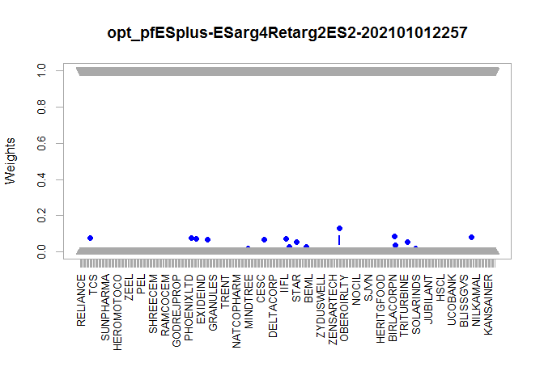

    ## [1] "Starting opt_pfESplus-ESarg4Retarg2ES3-202101012257"
    ## ***********************************
    ## PortfolioAnalytics Optimization
    ## ***********************************
    ## 
    ## Call:
    ## optimize.portfolio(R = R, portfolio = pfESplus, optimize_method = "ROI", 
    ##     trace = TRUE, momentFUN = cRebalSpec$momentFUN[cRebalSpec.ix])
    ## 
    ## Optimal Weights:
    ##   RELIANCE   HDFCBANK  ICICIBANK       HDFC        ITC   AXISBANK       SBIN 
    ##     0.0000     0.0000     0.0000     0.0000     0.0000     0.0000     0.0000 
    ##         LT BAJFINANCE       INFY BHARTIARTL        TCS        M.M  KOTAKBANK 
    ##     0.0000     0.0000     0.0791     0.0000     0.0000     0.0000     0.0000 
    ## INDUSINDBK       ONGC       NTPC TATAMOTORS  TATASTEEL     MARUTI   DIVISLAB 
    ##     0.0000     0.0000     0.0000     0.0000     0.0000     0.0000     0.0000 
    ##   HINDALCO  SUNPHARMA       VEDL HINDUNILVR    HCLTECH BAJAJFINSV  POWERGRID 
    ##     0.0000     0.0000     0.0000     0.0000     0.0000     0.0000     0.0000 
    ##       BPCL ASIANPAINT      TITAN    DRREDDY       GAIL HEROMOTOCO  COALINDIA 
    ##     0.0000     0.0000     0.0000     0.0000     0.0000     0.0000     0.0000 
    ##        IOC      TECHM ULTRACEMCO BAJAJ.AUTO ADANIPORTS     GRASIM      WIPRO 
    ##     0.0000     0.0000     0.0000     0.0000     0.0000     0.0000     0.0000 
    ##        UPL   JSWSTEEL       ZEEL     NAUKRI FEDERALBNK MOTHERSUMI  TATAPOWER 
    ##     0.0000     0.0000     0.0000     0.0106     0.0000     0.0000     0.0000 
    ##  BRITANNIA  AMBUJACEM  EICHERMOT AUROPHARMA SRTRANSFIN        BEL        PEL 
    ##     0.0000     0.0000     0.0000     0.0000     0.0000     0.0000     0.0000 
    ##   PETRONET        DLF      LUPIN     VOLTAS    HAVELLS     BIOCON        PFC 
    ##     0.0000     0.0000     0.0000     0.0000     0.0000     0.0000     0.0000 
    ##   ASHOKLEY   CHOLAFIN      CIPLA   SHREECEM     COLPAL BHARATFORG        SRF 
    ##     0.0000     0.0046     0.0000     0.0000     0.0000     0.0000     0.0000 
    ## PIDILITIND JINDALSTEL   ADANIENT     RECLTD     CONCOR    ESCORTS        ACC 
    ##     0.0064     0.0000     0.0000     0.0000     0.0000     0.0000     0.0000 
    ##   RAMCOCEM     MARICO     M.MFIN   GODREJCP  NESTLEIND  LICHSGFIN MANAPPURAM 
    ##     0.0000     0.0000     0.0000     0.0000     0.0000     0.0000     0.0000 
    ## BALKRISIND   CADILAHC      PIIND   BOSCHLTD GODREJPROP       NMDC BANKBARODA 
    ##     0.0000     0.0000     0.0000     0.0000     0.0000     0.0000     0.0000 
    ##   INDHOTEL    SIEMENS APOLLOHOSP TORNTPHARM   TVSMOTOR   JUBLFOOD CUMMINSIND 
    ##     0.0000     0.0000     0.0000     0.0000     0.0000     0.0000     0.0000 
    ##       IDEA PHOENIXLTD   GMRINFRA        MRF        IGL  BATAINDIA APOLLOTYRE 
    ##     0.0000     0.0000     0.0000     0.0000     0.0763     0.0000     0.0000 
    ## MUTHOOTFIN SUNDRMFAST     APLLTD       BHEL      L.TFH   EXIDEIND NATIONALUM 
    ##     0.0000     0.0000     0.0707     0.0000     0.0000     0.0000     0.0000 
    ##        CUB   GLENMARK AMARAJABAT        PVR SUPREMEIND NAVINFLUOR TORNTPOWER 
    ##     0.0000     0.0000     0.0000     0.0000     0.0000     0.0693     0.0000 
    ##      CANBK   DEEPAKNI   GRANULES    PAGEIND TATAMTRDVR BERGEPAINT   AARTIIND 
    ##     0.0000     0.0000     0.0000     0.0000     0.0000     0.0000     0.0000 
    ##  APLAPOLLO        PNB        UBL      DABUR  WHIRLPOOL       GSPL      TRENT 
    ##     0.0000     0.0000     0.0000     0.0000     0.0000     0.0000     0.0000 
    ##     FORTIS    DCBBANK   TATACOMM        NCC  TATAELXSI     CYIENT       IDFC 
    ##     0.0000     0.0000     0.0000     0.0000     0.0000     0.0000     0.0000 
    ##      GLAXO        OIL JMFINANCIL NATCOPHARM CANFINHOME       RAIN       ATUL 
    ##     0.0000     0.0000     0.0000     0.0000     0.0000     0.0000     0.0000 
    ## RAJESHEXPO       SAIL   SPICEJET       NHPC        MCX      SUNTV  REDINGTON 
    ##     0.0000     0.0000     0.0000     0.0000     0.0000     0.0000     0.0000 
    ##   MINDTREE   X3MINDIA      TANLA   EIDPARRY   GRAPHITE  GODREJIND  EDELWEISS 
    ##     0.0171     0.0000     0.0000     0.0000     0.0000     0.0000     0.0000 
    ##  LAXMIMACH     GESHIP   HINDZINC CASTROLIND       CESC   INDIACEM        FSL 
    ##     0.0000     0.0000     0.0000     0.0000     0.0000     0.0000     0.0000 
    ##       GNFC ABBOTINDIA ADANIPOWER  VAKRANGEE  UNIONBANK DCMSHRIRAM    WELCORP 
    ##     0.0000     0.0699     0.0000     0.0000     0.0000     0.0000     0.0000 
    ##   ALOKTEXT  DELTACORP  IBREALEST    KPRMILL        ABB  FINCABLES    CEATLTD 
    ##     0.0000     0.0000     0.0000     0.0000     0.0000     0.0000     0.0000 
    ##     VIPIND    KTKBANK     RALLIS CENTURYTEX BALRAMCHIN       IIFL       OFSS 
    ##     0.0000     0.0000     0.0000     0.0000     0.0000     0.0000     0.0000 
    ##     RELAXO        KEC AJANTPHARM   WESTLIFE TV18BRDCST  SOUTHBANK       GPPL 
    ##     0.0709     0.0000     0.0000     0.0277     0.0000     0.0000     0.0000 
    ## KALPATPOWR HINDCOPPER       STAR AARTIDRUGS SHRIRAMCIT       CERA WOCKPHARMA 
    ##     0.0000     0.0000     0.0000     0.0552     0.0000     0.0000     0.0000 
    ##  BAJAJELEC ENGINERSIN       GSFC COROMANDEL   AEGISLOG      IOLCP       BEML 
    ##     0.0000     0.0000     0.0000     0.0000     0.0000     0.0283     0.0000 
    ##        IRB      UFLEX       BASF    INDIANB  AKZOINDIA       BBTC SONATSOFTW 
    ##     0.0000     0.0000     0.0000     0.0000     0.0000     0.0000     0.0000 
    ##    SEQUENT    EIHOTEL  BAYERCROP  ZYDUSWELL  JSWENERGY WELSPUNIND     DISHTV 
    ##     0.0000     0.0000     0.0000     0.0000     0.0000     0.0000     0.0000 
    ## CARBORUNIV        HEG        PTC VINATIORGA     TIMKEN       HFCL        VTL 
    ##     0.0000     0.0000     0.0000     0.0000     0.0000     0.0000     0.0000 
    ## ZENSARTECH      SPARC     ECLERX    RAYMOND    TRIDENT     ASHOKA     RADICO 
    ##     0.0000     0.0000     0.0000     0.0000     0.0000     0.0000     0.0000 
    ## ALKYLAMINE  BANKINDIA SUDARSCHEM    IPCALAB OBEROIRLTY        FDC GODFRYPHLP 
    ##     0.1318     0.0000     0.0000     0.0000     0.0000     0.0000     0.0000 
    ##  SHILPAMED PHILIPCARB       MOIL      SOBHA       MEGH   PRESTIGE     VSTIND 
    ##     0.0000     0.0000     0.0000     0.0000     0.0000     0.0000     0.0000 
    ## MAHSCOOTER      NOCIL INOXLEISUR       GHCL TATAINVEST   NLCINDIA  JYOTHYLAB 
    ##     0.0000     0.0000     0.0000     0.0000     0.0000     0.0000     0.0000 
    ## KAJARIACER   GILLETTE  RESPONIND MOTILALOFS       KRBL       SJVN   ALLCARGO 
    ##     0.0000     0.0000     0.0000     0.0000     0.0000     0.0000     0.0000 
    ##  ORIENTREF       DCAL CHENNPETRO   SKFINDIA FINOLEXIND CENTURYPLY        SCI 
    ##     0.0000     0.0000     0.0000     0.0000     0.0000     0.0000     0.0000 
    ##        GDL GREAVESCOT HERITGFOOD SHOPERSTOP  BOMDYEING     KNRCON HAWKINCOOK 
    ##     0.0000     0.0000     0.0000     0.0000     0.0000     0.0000     0.0000 
    ##     VENKYS  JINDALSAW    JKPAPER  ESABINDIA   MAHABANK SCHAEFFLER BIRLACORPN 
    ##     0.0000     0.0000     0.0000     0.0000     0.0000     0.0000     0.0000 
    ## BALMLAWRIE       MFSL       PGHH   MINDAIND     VGUARD LINDEINDIA      JCHAC 
    ##     0.0000     0.0000     0.0839     0.0371     0.0000     0.0000     0.0000 
    ##       KSCL    LAOPALA TATACOFFEE TRITURBINE DEEPAKFERT   ASTRAZEN  JKLAKSHMI 
    ##     0.0000     0.0050     0.0000     0.0000     0.0000     0.0000     0.0000 
    ## VAIBHAVGBL   SUPRAJIT        GMM     IFBIND       IDBI   FORCEMOT    THERMAX 
    ##     0.0557     0.0000     0.0000     0.0000     0.0000     0.0000     0.0000 
    ##  SOLARINDS   BLUEDART      NESCO  JAMNAAUTO        JSL    DHANUKA TVSSRICHAK 
    ##     0.0175     0.0000     0.0000     0.0000     0.0000     0.0000     0.0000 
    ## TATAMETALI       MRPL NBVENTURES BAJAJHLDNG   JUBILANT JBCHEPHARM CHAMBLFERT 
    ##     0.0000     0.0000     0.0000     0.0000     0.0000     0.0000     0.0000 
    ##        KEI TTKPRESTIG    SUNTECK      CAPPL  NETWORK18  GUJALKALI  CENTRALBK 
    ##     0.0000     0.0000     0.0000     0.0000     0.0000     0.0000     0.0000 
    ##    J.KBANK       HSCL    GMDCLTD     PFIZER      MHRIL NAVNETEDUL        RCF 
    ##     0.0000     0.0000     0.0000     0.0000     0.0000     0.0000     0.0000 
    ##        IOB    TVTODAY  SCHNEIDER  RATNAMANI     JKTYRE    UCOBANK      GEPIL 
    ##     0.0000     0.0000     0.0000     0.0000     0.0000     0.0000     0.0000 
    ##  FCONSUMER TIMETECHNO     JAGRAN       MMTC     SANOFI        CCL SWANENERGY 
    ##     0.0000     0.0000     0.0000     0.0000     0.0000     0.0000     0.0000 
    ## JAICORPLTD     DBCORP   BLISSGVS WABCOINDIA      OMAXE    HATHWAY  MAHINDCIE 
    ##     0.0000     0.0000     0.0000     0.0000     0.0000     0.0000     0.0000 
    ##    MAHLIFE        ITI   EMAMILTD     ASTRAL   SYMPHONY     INDOCO   NILKAMAL 
    ##     0.0000     0.0000     0.0000     0.0827     0.0000     0.0000     0.0000 
    ##     SUZLON       IFCI       ITDC     CRISIL    BRIGADE BLUESTARCO MAHSEAMLES 
    ##     0.0000     0.0000     0.0000     0.0000     0.0000     0.0000     0.0000 
    ## HEIDELBERG    POLYMED  GRINDWELL  KANSAINER     AIAENG   TASTYBIT PERSISTENT 
    ##     0.0000     0.0000     0.0000     0.0000     0.0000     0.0000     0.0000 
    ##   JKCEMENT    MPHASIS     HONAUT  HINDPETRO 
    ##     0.0000     0.0000     0.0000     0.0000 
    ## 
    ## Objective Measure:
    ##     mean 
    ## 0.009028 
    ## 
    ## 
    ##      ES 
    ## 0.03268


    ## [1] "Starting opt_pfESplus-ESarg4Retarg2ES4-202101012257"
    ## ***********************************
    ## PortfolioAnalytics Optimization
    ## ***********************************
    ## 
    ## Call:
    ## optimize.portfolio(R = R, portfolio = pfESplus, optimize_method = "ROI", 
    ##     trace = TRUE, momentFUN = cRebalSpec$momentFUN[cRebalSpec.ix])
    ## 
    ## Optimal Weights:
    ##   RELIANCE   HDFCBANK  ICICIBANK       HDFC        ITC   AXISBANK       SBIN 
    ##     0.0000     0.0000     0.0000     0.0000     0.0000     0.0000     0.0000 
    ##         LT BAJFINANCE       INFY BHARTIARTL        TCS        M.M  KOTAKBANK 
    ##     0.0000     0.0000     0.0000     0.0000     0.0000     0.0000     0.0000 
    ## INDUSINDBK       ONGC       NTPC TATAMOTORS  TATASTEEL     MARUTI   DIVISLAB 
    ##     0.0000     0.0000     0.0000     0.0000     0.0000     0.0000     0.0000 
    ##   HINDALCO  SUNPHARMA       VEDL HINDUNILVR    HCLTECH BAJAJFINSV  POWERGRID 
    ##     0.0000     0.0000     0.0000     0.0000     0.0000     0.0000     0.0000 
    ##       BPCL ASIANPAINT      TITAN    DRREDDY       GAIL HEROMOTOCO  COALINDIA 
    ##     0.0000     0.0000     0.0000     0.0000     0.0000     0.0000     0.0000 
    ##        IOC      TECHM ULTRACEMCO BAJAJ.AUTO ADANIPORTS     GRASIM      WIPRO 
    ##     0.0000     0.0000     0.0000     0.0000     0.0000     0.0000     0.0000 
    ##        UPL   JSWSTEEL       ZEEL     NAUKRI FEDERALBNK MOTHERSUMI  TATAPOWER 
    ##     0.0000     0.0000     0.0000     0.0000     0.0000     0.0000     0.0000 
    ##  BRITANNIA  AMBUJACEM  EICHERMOT AUROPHARMA SRTRANSFIN        BEL        PEL 
    ##     0.0000     0.0000     0.0000     0.0000     0.0000     0.0000     0.0000 
    ##   PETRONET        DLF      LUPIN     VOLTAS    HAVELLS     BIOCON        PFC 
    ##     0.0000     0.0000     0.0000     0.0000     0.0000     0.0000     0.0000 
    ##   ASHOKLEY   CHOLAFIN      CIPLA   SHREECEM     COLPAL BHARATFORG        SRF 
    ##     0.0000     0.0000     0.0000     0.0000     0.0000     0.0000     0.0000 
    ## PIDILITIND JINDALSTEL   ADANIENT     RECLTD     CONCOR    ESCORTS        ACC 
    ##     0.0000     0.0000     0.0000     0.0000     0.0000     0.0000     0.0000 
    ##   RAMCOCEM     MARICO     M.MFIN   GODREJCP  NESTLEIND  LICHSGFIN MANAPPURAM 
    ##     0.0000     0.0000     0.0000     0.0000     0.0000     0.0000     0.0000 
    ## BALKRISIND   CADILAHC      PIIND   BOSCHLTD GODREJPROP       NMDC BANKBARODA 
    ##     0.0000     0.0000     0.0000     0.0000     0.0000     0.0000     0.0000 
    ##   INDHOTEL    SIEMENS APOLLOHOSP TORNTPHARM   TVSMOTOR   JUBLFOOD CUMMINSIND 
    ##     0.0000     0.0000     0.0000     0.0000     0.0000     0.0000     0.0000 
    ##       IDEA PHOENIXLTD   GMRINFRA        MRF        IGL  BATAINDIA APOLLOTYRE 
    ##     0.0000     0.0000     0.0000     0.0000     0.0000     0.0000     0.0000 
    ## MUTHOOTFIN SUNDRMFAST     APLLTD       BHEL      L.TFH   EXIDEIND NATIONALUM 
    ##     0.0000     0.0000     0.0000     0.0000     0.0000     0.0000     0.0000 
    ##        CUB   GLENMARK AMARAJABAT        PVR SUPREMEIND NAVINFLUOR TORNTPOWER 
    ##     0.0000     0.0000     0.0000     0.0000     0.0000     0.0000     0.0000 
    ##      CANBK   DEEPAKNI   GRANULES    PAGEIND TATAMTRDVR BERGEPAINT   AARTIIND 
    ##     0.0000     0.0000     0.0000     0.0000     0.0000     0.0000     0.0000 
    ##  APLAPOLLO        PNB        UBL      DABUR  WHIRLPOOL       GSPL      TRENT 
    ##     0.0000     0.0000     0.0000     0.0000     0.0000     0.0000     0.0000 
    ##     FORTIS    DCBBANK   TATACOMM        NCC  TATAELXSI     CYIENT       IDFC 
    ##     0.0000     0.0000     0.0000     0.0000     0.0000     0.0000     0.0000 
    ##      GLAXO        OIL JMFINANCIL NATCOPHARM CANFINHOME       RAIN       ATUL 
    ##     0.0000     0.0000     0.0000     0.0000     0.0000     0.0000     0.0000 
    ## RAJESHEXPO       SAIL   SPICEJET       NHPC        MCX      SUNTV  REDINGTON 
    ##     0.0000     0.0000     0.0000     0.0000     0.0000     0.0000     0.0000 
    ##   MINDTREE   X3MINDIA      TANLA   EIDPARRY   GRAPHITE  GODREJIND  EDELWEISS 
    ##     0.0000     0.0000     0.5053     0.0000     0.0000     0.0000     0.0000 
    ##  LAXMIMACH     GESHIP   HINDZINC CASTROLIND       CESC   INDIACEM        FSL 
    ##     0.0000     0.0000     0.0000     0.0000     0.0000     0.0000     0.0000 
    ##       GNFC ABBOTINDIA ADANIPOWER  VAKRANGEE  UNIONBANK DCMSHRIRAM    WELCORP 
    ##     0.0000     0.0000     0.0000     0.0000     0.0000     0.0000     0.0000 
    ##   ALOKTEXT  DELTACORP  IBREALEST    KPRMILL        ABB  FINCABLES    CEATLTD 
    ##     0.0000     0.0000     0.0000     0.0000     0.0000     0.0000     0.0000 
    ##     VIPIND    KTKBANK     RALLIS CENTURYTEX BALRAMCHIN       IIFL       OFSS 
    ##     0.0000     0.0000     0.0000     0.0000     0.0000     0.0000     0.0000 
    ##     RELAXO        KEC AJANTPHARM   WESTLIFE TV18BRDCST  SOUTHBANK       GPPL 
    ##     0.0000     0.0000     0.0000     0.0000     0.0000     0.0000     0.0000 
    ## KALPATPOWR HINDCOPPER       STAR AARTIDRUGS SHRIRAMCIT       CERA WOCKPHARMA 
    ##     0.0000     0.0000     0.0000     0.0000     0.0000     0.0000     0.0000 
    ##  BAJAJELEC ENGINERSIN       GSFC COROMANDEL   AEGISLOG      IOLCP       BEML 
    ##     0.0000     0.0000     0.0000     0.0000     0.0000     0.0000     0.0000 
    ##        IRB      UFLEX       BASF    INDIANB  AKZOINDIA       BBTC SONATSOFTW 
    ##     0.0000     0.0000     0.0000     0.0000     0.0000     0.0000     0.0000 
    ##    SEQUENT    EIHOTEL  BAYERCROP  ZYDUSWELL  JSWENERGY WELSPUNIND     DISHTV 
    ##     0.0000     0.0000     0.0000     0.0000     0.0000     0.0000     0.0000 
    ## CARBORUNIV        HEG        PTC VINATIORGA     TIMKEN       HFCL        VTL 
    ##     0.0000     0.0000     0.0000     0.0000     0.0000     0.0000     0.0000 
    ## ZENSARTECH      SPARC     ECLERX    RAYMOND    TRIDENT     ASHOKA     RADICO 
    ##     0.0000     0.0000     0.0000     0.0000     0.0000     0.0000     0.0000 
    ## ALKYLAMINE  BANKINDIA SUDARSCHEM    IPCALAB OBEROIRLTY        FDC GODFRYPHLP 
    ##     0.0000     0.0000     0.0000     0.0000     0.0000     0.0000     0.0000 
    ##  SHILPAMED PHILIPCARB       MOIL      SOBHA       MEGH   PRESTIGE     VSTIND 
    ##     0.0000     0.0000     0.0000     0.0000     0.0000     0.0000     0.0000 
    ## MAHSCOOTER      NOCIL INOXLEISUR       GHCL TATAINVEST   NLCINDIA  JYOTHYLAB 
    ##     0.0000     0.0000     0.0000     0.0000     0.0000     0.0000     0.0000 
    ## KAJARIACER   GILLETTE  RESPONIND MOTILALOFS       KRBL       SJVN   ALLCARGO 
    ##     0.0000     0.0000     0.0000     0.0000     0.0000     0.0000     0.0000 
    ##  ORIENTREF       DCAL CHENNPETRO   SKFINDIA FINOLEXIND CENTURYPLY        SCI 
    ##     0.0000     0.0000     0.0000     0.0000     0.0000     0.0000     0.0000 
    ##        GDL GREAVESCOT HERITGFOOD SHOPERSTOP  BOMDYEING     KNRCON HAWKINCOOK 
    ##     0.0000     0.0000     0.0000     0.0000     0.0000     0.0000     0.0000 
    ##     VENKYS  JINDALSAW    JKPAPER  ESABINDIA   MAHABANK SCHAEFFLER BIRLACORPN 
    ##     0.0000     0.0000     0.0000     0.0000     0.0000     0.0000     0.0000 
    ## BALMLAWRIE       MFSL       PGHH   MINDAIND     VGUARD LINDEINDIA      JCHAC 
    ##     0.0000     0.0000     0.0000     0.0000     0.0000     0.0000     0.0000 
    ##       KSCL    LAOPALA TATACOFFEE TRITURBINE DEEPAKFERT   ASTRAZEN  JKLAKSHMI 
    ##     0.0000     0.0000     0.0000     0.0000     0.0000     0.0000     0.0000 
    ## VAIBHAVGBL   SUPRAJIT        GMM     IFBIND       IDBI   FORCEMOT    THERMAX 
    ##     0.0000     0.0000     0.0000     0.0000     0.0000     0.0000     0.0000 
    ##  SOLARINDS   BLUEDART      NESCO  JAMNAAUTO        JSL    DHANUKA TVSSRICHAK 
    ##     0.0000     0.0000     0.0000     0.0000     0.0000     0.0000     0.0000 
    ## TATAMETALI       MRPL NBVENTURES BAJAJHLDNG   JUBILANT JBCHEPHARM CHAMBLFERT 
    ##     0.0000     0.0000     0.0000     0.0000     0.0000     0.0000     0.0000 
    ##        KEI TTKPRESTIG    SUNTECK      CAPPL  NETWORK18  GUJALKALI  CENTRALBK 
    ##     0.0000     0.0000     0.0000     0.0000     0.0000     0.0000     0.0000 
    ##    J.KBANK       HSCL    GMDCLTD     PFIZER      MHRIL NAVNETEDUL        RCF 
    ##     0.0000     0.0000     0.0000     0.0000     0.0000     0.0000     0.0000 
    ##        IOB    TVTODAY  SCHNEIDER  RATNAMANI     JKTYRE    UCOBANK      GEPIL 
    ##     0.0000     0.0000     0.0000     0.0000     0.0000     0.0000     0.0000 
    ##  FCONSUMER TIMETECHNO     JAGRAN       MMTC     SANOFI        CCL SWANENERGY 
    ##     0.0000     0.0000     0.0000     0.4947     0.0000     0.0000     0.0000 
    ## JAICORPLTD     DBCORP   BLISSGVS WABCOINDIA      OMAXE    HATHWAY  MAHINDCIE 
    ##     0.0000     0.0000     0.0000     0.0000     0.0000     0.0000     0.0000 
    ##    MAHLIFE        ITI   EMAMILTD     ASTRAL   SYMPHONY     INDOCO   NILKAMAL 
    ##     0.0000     0.0000     0.0000     0.0000     0.0000     0.0000     0.0000 
    ##     SUZLON       IFCI       ITDC     CRISIL    BRIGADE BLUESTARCO MAHSEAMLES 
    ##     0.0000     0.0000     0.0000     0.0000     0.0000     0.0000     0.0000 
    ## HEIDELBERG    POLYMED  GRINDWELL  KANSAINER     AIAENG   TASTYBIT PERSISTENT 
    ##     0.0000     0.0000     0.0000     0.0000     0.0000     0.0000     0.0000 
    ##   JKCEMENT    MPHASIS     HONAUT  HINDPETRO 
    ##     0.0000     0.0000     0.0000     0.0000 
    ## 
    ## Objective Measure:
    ##     mean 
    ## 0.005931


    ## [1] "Starting opt_pfESplus-ESarg4Retarg3ES1-202101012257"
    ## ***********************************
    ## PortfolioAnalytics Optimization
    ## ***********************************
    ## 
    ## Call:
    ## optimize.portfolio(R = R, portfolio = pfESplus, optimize_method = "ROI", 
    ##     trace = TRUE, momentFUN = cRebalSpec$momentFUN[cRebalSpec.ix])
    ## 
    ## Optimal Weights:
    ##   RELIANCE   HDFCBANK  ICICIBANK       HDFC        ITC   AXISBANK       SBIN 
    ##     0.0000     0.0000     0.0000     0.0000     0.0000     0.0000     0.0000 
    ##         LT BAJFINANCE       INFY BHARTIARTL        TCS        M.M  KOTAKBANK 
    ##     0.0000     0.0000     0.0791     0.0000     0.0000     0.0000     0.0000 
    ## INDUSINDBK       ONGC       NTPC TATAMOTORS  TATASTEEL     MARUTI   DIVISLAB 
    ##     0.0000     0.0000     0.0000     0.0000     0.0000     0.0000     0.0000 
    ##   HINDALCO  SUNPHARMA       VEDL HINDUNILVR    HCLTECH BAJAJFINSV  POWERGRID 
    ##     0.0000     0.0000     0.0000     0.0000     0.0000     0.0000     0.0000 
    ##       BPCL ASIANPAINT      TITAN    DRREDDY       GAIL HEROMOTOCO  COALINDIA 
    ##     0.0000     0.0000     0.0000     0.0000     0.0000     0.0000     0.0000 
    ##        IOC      TECHM ULTRACEMCO BAJAJ.AUTO ADANIPORTS     GRASIM      WIPRO 
    ##     0.0000     0.0000     0.0000     0.0000     0.0000     0.0000     0.0000 
    ##        UPL   JSWSTEEL       ZEEL     NAUKRI FEDERALBNK MOTHERSUMI  TATAPOWER 
    ##     0.0000     0.0000     0.0000     0.0106     0.0000     0.0000     0.0000 
    ##  BRITANNIA  AMBUJACEM  EICHERMOT AUROPHARMA SRTRANSFIN        BEL        PEL 
    ##     0.0000     0.0000     0.0000     0.0000     0.0000     0.0000     0.0000 
    ##   PETRONET        DLF      LUPIN     VOLTAS    HAVELLS     BIOCON        PFC 
    ##     0.0000     0.0000     0.0000     0.0000     0.0000     0.0000     0.0000 
    ##   ASHOKLEY   CHOLAFIN      CIPLA   SHREECEM     COLPAL BHARATFORG        SRF 
    ##     0.0000     0.0046     0.0000     0.0000     0.0000     0.0000     0.0000 
    ## PIDILITIND JINDALSTEL   ADANIENT     RECLTD     CONCOR    ESCORTS        ACC 
    ##     0.0064     0.0000     0.0000     0.0000     0.0000     0.0000     0.0000 
    ##   RAMCOCEM     MARICO     M.MFIN   GODREJCP  NESTLEIND  LICHSGFIN MANAPPURAM 
    ##     0.0000     0.0000     0.0000     0.0000     0.0000     0.0000     0.0000 
    ## BALKRISIND   CADILAHC      PIIND   BOSCHLTD GODREJPROP       NMDC BANKBARODA 
    ##     0.0000     0.0000     0.0000     0.0000     0.0000     0.0000     0.0000 
    ##   INDHOTEL    SIEMENS APOLLOHOSP TORNTPHARM   TVSMOTOR   JUBLFOOD CUMMINSIND 
    ##     0.0000     0.0000     0.0000     0.0000     0.0000     0.0000     0.0000 
    ##       IDEA PHOENIXLTD   GMRINFRA        MRF        IGL  BATAINDIA APOLLOTYRE 
    ##     0.0000     0.0000     0.0000     0.0000     0.0763     0.0000     0.0000 
    ## MUTHOOTFIN SUNDRMFAST     APLLTD       BHEL      L.TFH   EXIDEIND NATIONALUM 
    ##     0.0000     0.0000     0.0707     0.0000     0.0000     0.0000     0.0000 
    ##        CUB   GLENMARK AMARAJABAT        PVR SUPREMEIND NAVINFLUOR TORNTPOWER 
    ##     0.0000     0.0000     0.0000     0.0000     0.0000     0.0693     0.0000 
    ##      CANBK   DEEPAKNI   GRANULES    PAGEIND TATAMTRDVR BERGEPAINT   AARTIIND 
    ##     0.0000     0.0000     0.0000     0.0000     0.0000     0.0000     0.0000 
    ##  APLAPOLLO        PNB        UBL      DABUR  WHIRLPOOL       GSPL      TRENT 
    ##     0.0000     0.0000     0.0000     0.0000     0.0000     0.0000     0.0000 
    ##     FORTIS    DCBBANK   TATACOMM        NCC  TATAELXSI     CYIENT       IDFC 
    ##     0.0000     0.0000     0.0000     0.0000     0.0000     0.0000     0.0000 
    ##      GLAXO        OIL JMFINANCIL NATCOPHARM CANFINHOME       RAIN       ATUL 
    ##     0.0000     0.0000     0.0000     0.0000     0.0000     0.0000     0.0000 
    ## RAJESHEXPO       SAIL   SPICEJET       NHPC        MCX      SUNTV  REDINGTON 
    ##     0.0000     0.0000     0.0000     0.0000     0.0000     0.0000     0.0000 
    ##   MINDTREE   X3MINDIA      TANLA   EIDPARRY   GRAPHITE  GODREJIND  EDELWEISS 
    ##     0.0171     0.0000     0.0000     0.0000     0.0000     0.0000     0.0000 
    ##  LAXMIMACH     GESHIP   HINDZINC CASTROLIND       CESC   INDIACEM        FSL 
    ##     0.0000     0.0000     0.0000     0.0000     0.0000     0.0000     0.0000 
    ##       GNFC ABBOTINDIA ADANIPOWER  VAKRANGEE  UNIONBANK DCMSHRIRAM    WELCORP 
    ##     0.0000     0.0699     0.0000     0.0000     0.0000     0.0000     0.0000 
    ##   ALOKTEXT  DELTACORP  IBREALEST    KPRMILL        ABB  FINCABLES    CEATLTD 
    ##     0.0000     0.0000     0.0000     0.0000     0.0000     0.0000     0.0000 
    ##     VIPIND    KTKBANK     RALLIS CENTURYTEX BALRAMCHIN       IIFL       OFSS 
    ##     0.0000     0.0000     0.0000     0.0000     0.0000     0.0000     0.0000 
    ##     RELAXO        KEC AJANTPHARM   WESTLIFE TV18BRDCST  SOUTHBANK       GPPL 
    ##     0.0709     0.0000     0.0000     0.0277     0.0000     0.0000     0.0000 
    ## KALPATPOWR HINDCOPPER       STAR AARTIDRUGS SHRIRAMCIT       CERA WOCKPHARMA 
    ##     0.0000     0.0000     0.0000     0.0552     0.0000     0.0000     0.0000 
    ##  BAJAJELEC ENGINERSIN       GSFC COROMANDEL   AEGISLOG      IOLCP       BEML 
    ##     0.0000     0.0000     0.0000     0.0000     0.0000     0.0283     0.0000 
    ##        IRB      UFLEX       BASF    INDIANB  AKZOINDIA       BBTC SONATSOFTW 
    ##     0.0000     0.0000     0.0000     0.0000     0.0000     0.0000     0.0000 
    ##    SEQUENT    EIHOTEL  BAYERCROP  ZYDUSWELL  JSWENERGY WELSPUNIND     DISHTV 
    ##     0.0000     0.0000     0.0000     0.0000     0.0000     0.0000     0.0000 
    ## CARBORUNIV        HEG        PTC VINATIORGA     TIMKEN       HFCL        VTL 
    ##     0.0000     0.0000     0.0000     0.0000     0.0000     0.0000     0.0000 
    ## ZENSARTECH      SPARC     ECLERX    RAYMOND    TRIDENT     ASHOKA     RADICO 
    ##     0.0000     0.0000     0.0000     0.0000     0.0000     0.0000     0.0000 
    ## ALKYLAMINE  BANKINDIA SUDARSCHEM    IPCALAB OBEROIRLTY        FDC GODFRYPHLP 
    ##     0.1318     0.0000     0.0000     0.0000     0.0000     0.0000     0.0000 
    ##  SHILPAMED PHILIPCARB       MOIL      SOBHA       MEGH   PRESTIGE     VSTIND 
    ##     0.0000     0.0000     0.0000     0.0000     0.0000     0.0000     0.0000 
    ## MAHSCOOTER      NOCIL INOXLEISUR       GHCL TATAINVEST   NLCINDIA  JYOTHYLAB 
    ##     0.0000     0.0000     0.0000     0.0000     0.0000     0.0000     0.0000 
    ## KAJARIACER   GILLETTE  RESPONIND MOTILALOFS       KRBL       SJVN   ALLCARGO 
    ##     0.0000     0.0000     0.0000     0.0000     0.0000     0.0000     0.0000 
    ##  ORIENTREF       DCAL CHENNPETRO   SKFINDIA FINOLEXIND CENTURYPLY        SCI 
    ##     0.0000     0.0000     0.0000     0.0000     0.0000     0.0000     0.0000 
    ##        GDL GREAVESCOT HERITGFOOD SHOPERSTOP  BOMDYEING     KNRCON HAWKINCOOK 
    ##     0.0000     0.0000     0.0000     0.0000     0.0000     0.0000     0.0000 
    ##     VENKYS  JINDALSAW    JKPAPER  ESABINDIA   MAHABANK SCHAEFFLER BIRLACORPN 
    ##     0.0000     0.0000     0.0000     0.0000     0.0000     0.0000     0.0000 
    ## BALMLAWRIE       MFSL       PGHH   MINDAIND     VGUARD LINDEINDIA      JCHAC 
    ##     0.0000     0.0000     0.0839     0.0371     0.0000     0.0000     0.0000 
    ##       KSCL    LAOPALA TATACOFFEE TRITURBINE DEEPAKFERT   ASTRAZEN  JKLAKSHMI 
    ##     0.0000     0.0050     0.0000     0.0000     0.0000     0.0000     0.0000 
    ## VAIBHAVGBL   SUPRAJIT        GMM     IFBIND       IDBI   FORCEMOT    THERMAX 
    ##     0.0557     0.0000     0.0000     0.0000     0.0000     0.0000     0.0000 
    ##  SOLARINDS   BLUEDART      NESCO  JAMNAAUTO        JSL    DHANUKA TVSSRICHAK 
    ##     0.0175     0.0000     0.0000     0.0000     0.0000     0.0000     0.0000 
    ## TATAMETALI       MRPL NBVENTURES BAJAJHLDNG   JUBILANT JBCHEPHARM CHAMBLFERT 
    ##     0.0000     0.0000     0.0000     0.0000     0.0000     0.0000     0.0000 
    ##        KEI TTKPRESTIG    SUNTECK      CAPPL  NETWORK18  GUJALKALI  CENTRALBK 
    ##     0.0000     0.0000     0.0000     0.0000     0.0000     0.0000     0.0000 
    ##    J.KBANK       HSCL    GMDCLTD     PFIZER      MHRIL NAVNETEDUL        RCF 
    ##     0.0000     0.0000     0.0000     0.0000     0.0000     0.0000     0.0000 
    ##        IOB    TVTODAY  SCHNEIDER  RATNAMANI     JKTYRE    UCOBANK      GEPIL 
    ##     0.0000     0.0000     0.0000     0.0000     0.0000     0.0000     0.0000 
    ##  FCONSUMER TIMETECHNO     JAGRAN       MMTC     SANOFI        CCL SWANENERGY 
    ##     0.0000     0.0000     0.0000     0.0000     0.0000     0.0000     0.0000 
    ## JAICORPLTD     DBCORP   BLISSGVS WABCOINDIA      OMAXE    HATHWAY  MAHINDCIE 
    ##     0.0000     0.0000     0.0000     0.0000     0.0000     0.0000     0.0000 
    ##    MAHLIFE        ITI   EMAMILTD     ASTRAL   SYMPHONY     INDOCO   NILKAMAL 
    ##     0.0000     0.0000     0.0000     0.0827     0.0000     0.0000     0.0000 
    ##     SUZLON       IFCI       ITDC     CRISIL    BRIGADE BLUESTARCO MAHSEAMLES 
    ##     0.0000     0.0000     0.0000     0.0000     0.0000     0.0000     0.0000 
    ## HEIDELBERG    POLYMED  GRINDWELL  KANSAINER     AIAENG   TASTYBIT PERSISTENT 
    ##     0.0000     0.0000     0.0000     0.0000     0.0000     0.0000     0.0000 
    ##   JKCEMENT    MPHASIS     HONAUT  HINDPETRO 
    ##     0.0000     0.0000     0.0000     0.0000 
    ## 
    ## Objective Measure:
    ##     mean 
    ## 0.009028 
    ## 
    ## 
    ##      ES 
    ## 0.03268


    ## [1] "Starting opt_pfESplus-ESarg4Retarg3ES2-202101012257"
    ## ***********************************
    ## PortfolioAnalytics Optimization
    ## ***********************************
    ## 
    ## Call:
    ## optimize.portfolio(R = R, portfolio = pfESplus, optimize_method = "ROI", 
    ##     trace = TRUE, momentFUN = cRebalSpec$momentFUN[cRebalSpec.ix])
    ## 
    ## Optimal Weights:
    ##   RELIANCE   HDFCBANK  ICICIBANK       HDFC        ITC   AXISBANK       SBIN 
    ##     0.0000     0.0000     0.0000     0.0000     0.0000     0.0000     0.0000 
    ##         LT BAJFINANCE       INFY BHARTIARTL        TCS        M.M  KOTAKBANK 
    ##     0.0000     0.0000     0.0791     0.0000     0.0000     0.0000     0.0000 
    ## INDUSINDBK       ONGC       NTPC TATAMOTORS  TATASTEEL     MARUTI   DIVISLAB 
    ##     0.0000     0.0000     0.0000     0.0000     0.0000     0.0000     0.0000 
    ##   HINDALCO  SUNPHARMA       VEDL HINDUNILVR    HCLTECH BAJAJFINSV  POWERGRID 
    ##     0.0000     0.0000     0.0000     0.0000     0.0000     0.0000     0.0000 
    ##       BPCL ASIANPAINT      TITAN    DRREDDY       GAIL HEROMOTOCO  COALINDIA 
    ##     0.0000     0.0000     0.0000     0.0000     0.0000     0.0000     0.0000 
    ##        IOC      TECHM ULTRACEMCO BAJAJ.AUTO ADANIPORTS     GRASIM      WIPRO 
    ##     0.0000     0.0000     0.0000     0.0000     0.0000     0.0000     0.0000 
    ##        UPL   JSWSTEEL       ZEEL     NAUKRI FEDERALBNK MOTHERSUMI  TATAPOWER 
    ##     0.0000     0.0000     0.0000     0.0106     0.0000     0.0000     0.0000 
    ##  BRITANNIA  AMBUJACEM  EICHERMOT AUROPHARMA SRTRANSFIN        BEL        PEL 
    ##     0.0000     0.0000     0.0000     0.0000     0.0000     0.0000     0.0000 
    ##   PETRONET        DLF      LUPIN     VOLTAS    HAVELLS     BIOCON        PFC 
    ##     0.0000     0.0000     0.0000     0.0000     0.0000     0.0000     0.0000 
    ##   ASHOKLEY   CHOLAFIN      CIPLA   SHREECEM     COLPAL BHARATFORG        SRF 
    ##     0.0000     0.0046     0.0000     0.0000     0.0000     0.0000     0.0000 
    ## PIDILITIND JINDALSTEL   ADANIENT     RECLTD     CONCOR    ESCORTS        ACC 
    ##     0.0064     0.0000     0.0000     0.0000     0.0000     0.0000     0.0000 
    ##   RAMCOCEM     MARICO     M.MFIN   GODREJCP  NESTLEIND  LICHSGFIN MANAPPURAM 
    ##     0.0000     0.0000     0.0000     0.0000     0.0000     0.0000     0.0000 
    ## BALKRISIND   CADILAHC      PIIND   BOSCHLTD GODREJPROP       NMDC BANKBARODA 
    ##     0.0000     0.0000     0.0000     0.0000     0.0000     0.0000     0.0000 
    ##   INDHOTEL    SIEMENS APOLLOHOSP TORNTPHARM   TVSMOTOR   JUBLFOOD CUMMINSIND 
    ##     0.0000     0.0000     0.0000     0.0000     0.0000     0.0000     0.0000 
    ##       IDEA PHOENIXLTD   GMRINFRA        MRF        IGL  BATAINDIA APOLLOTYRE 
    ##     0.0000     0.0000     0.0000     0.0000     0.0763     0.0000     0.0000 
    ## MUTHOOTFIN SUNDRMFAST     APLLTD       BHEL      L.TFH   EXIDEIND NATIONALUM 
    ##     0.0000     0.0000     0.0707     0.0000     0.0000     0.0000     0.0000 
    ##        CUB   GLENMARK AMARAJABAT        PVR SUPREMEIND NAVINFLUOR TORNTPOWER 
    ##     0.0000     0.0000     0.0000     0.0000     0.0000     0.0693     0.0000 
    ##      CANBK   DEEPAKNI   GRANULES    PAGEIND TATAMTRDVR BERGEPAINT   AARTIIND 
    ##     0.0000     0.0000     0.0000     0.0000     0.0000     0.0000     0.0000 
    ##  APLAPOLLO        PNB        UBL      DABUR  WHIRLPOOL       GSPL      TRENT 
    ##     0.0000     0.0000     0.0000     0.0000     0.0000     0.0000     0.0000 
    ##     FORTIS    DCBBANK   TATACOMM        NCC  TATAELXSI     CYIENT       IDFC 
    ##     0.0000     0.0000     0.0000     0.0000     0.0000     0.0000     0.0000 
    ##      GLAXO        OIL JMFINANCIL NATCOPHARM CANFINHOME       RAIN       ATUL 
    ##     0.0000     0.0000     0.0000     0.0000     0.0000     0.0000     0.0000 
    ## RAJESHEXPO       SAIL   SPICEJET       NHPC        MCX      SUNTV  REDINGTON 
    ##     0.0000     0.0000     0.0000     0.0000     0.0000     0.0000     0.0000 
    ##   MINDTREE   X3MINDIA      TANLA   EIDPARRY   GRAPHITE  GODREJIND  EDELWEISS 
    ##     0.0171     0.0000     0.0000     0.0000     0.0000     0.0000     0.0000 
    ##  LAXMIMACH     GESHIP   HINDZINC CASTROLIND       CESC   INDIACEM        FSL 
    ##     0.0000     0.0000     0.0000     0.0000     0.0000     0.0000     0.0000 
    ##       GNFC ABBOTINDIA ADANIPOWER  VAKRANGEE  UNIONBANK DCMSHRIRAM    WELCORP 
    ##     0.0000     0.0699     0.0000     0.0000     0.0000     0.0000     0.0000 
    ##   ALOKTEXT  DELTACORP  IBREALEST    KPRMILL        ABB  FINCABLES    CEATLTD 
    ##     0.0000     0.0000     0.0000     0.0000     0.0000     0.0000     0.0000 
    ##     VIPIND    KTKBANK     RALLIS CENTURYTEX BALRAMCHIN       IIFL       OFSS 
    ##     0.0000     0.0000     0.0000     0.0000     0.0000     0.0000     0.0000 
    ##     RELAXO        KEC AJANTPHARM   WESTLIFE TV18BRDCST  SOUTHBANK       GPPL 
    ##     0.0709     0.0000     0.0000     0.0277     0.0000     0.0000     0.0000 
    ## KALPATPOWR HINDCOPPER       STAR AARTIDRUGS SHRIRAMCIT       CERA WOCKPHARMA 
    ##     0.0000     0.0000     0.0000     0.0552     0.0000     0.0000     0.0000 
    ##  BAJAJELEC ENGINERSIN       GSFC COROMANDEL   AEGISLOG      IOLCP       BEML 
    ##     0.0000     0.0000     0.0000     0.0000     0.0000     0.0283     0.0000 
    ##        IRB      UFLEX       BASF    INDIANB  AKZOINDIA       BBTC SONATSOFTW 
    ##     0.0000     0.0000     0.0000     0.0000     0.0000     0.0000     0.0000 
    ##    SEQUENT    EIHOTEL  BAYERCROP  ZYDUSWELL  JSWENERGY WELSPUNIND     DISHTV 
    ##     0.0000     0.0000     0.0000     0.0000     0.0000     0.0000     0.0000 
    ## CARBORUNIV        HEG        PTC VINATIORGA     TIMKEN       HFCL        VTL 
    ##     0.0000     0.0000     0.0000     0.0000     0.0000     0.0000     0.0000 
    ## ZENSARTECH      SPARC     ECLERX    RAYMOND    TRIDENT     ASHOKA     RADICO 
    ##     0.0000     0.0000     0.0000     0.0000     0.0000     0.0000     0.0000 
    ## ALKYLAMINE  BANKINDIA SUDARSCHEM    IPCALAB OBEROIRLTY        FDC GODFRYPHLP 
    ##     0.1318     0.0000     0.0000     0.0000     0.0000     0.0000     0.0000 
    ##  SHILPAMED PHILIPCARB       MOIL      SOBHA       MEGH   PRESTIGE     VSTIND 
    ##     0.0000     0.0000     0.0000     0.0000     0.0000     0.0000     0.0000 
    ## MAHSCOOTER      NOCIL INOXLEISUR       GHCL TATAINVEST   NLCINDIA  JYOTHYLAB 
    ##     0.0000     0.0000     0.0000     0.0000     0.0000     0.0000     0.0000 
    ## KAJARIACER   GILLETTE  RESPONIND MOTILALOFS       KRBL       SJVN   ALLCARGO 
    ##     0.0000     0.0000     0.0000     0.0000     0.0000     0.0000     0.0000 
    ##  ORIENTREF       DCAL CHENNPETRO   SKFINDIA FINOLEXIND CENTURYPLY        SCI 
    ##     0.0000     0.0000     0.0000     0.0000     0.0000     0.0000     0.0000 
    ##        GDL GREAVESCOT HERITGFOOD SHOPERSTOP  BOMDYEING     KNRCON HAWKINCOOK 
    ##     0.0000     0.0000     0.0000     0.0000     0.0000     0.0000     0.0000 
    ##     VENKYS  JINDALSAW    JKPAPER  ESABINDIA   MAHABANK SCHAEFFLER BIRLACORPN 
    ##     0.0000     0.0000     0.0000     0.0000     0.0000     0.0000     0.0000 
    ## BALMLAWRIE       MFSL       PGHH   MINDAIND     VGUARD LINDEINDIA      JCHAC 
    ##     0.0000     0.0000     0.0839     0.0371     0.0000     0.0000     0.0000 
    ##       KSCL    LAOPALA TATACOFFEE TRITURBINE DEEPAKFERT   ASTRAZEN  JKLAKSHMI 
    ##     0.0000     0.0050     0.0000     0.0000     0.0000     0.0000     0.0000 
    ## VAIBHAVGBL   SUPRAJIT        GMM     IFBIND       IDBI   FORCEMOT    THERMAX 
    ##     0.0557     0.0000     0.0000     0.0000     0.0000     0.0000     0.0000 
    ##  SOLARINDS   BLUEDART      NESCO  JAMNAAUTO        JSL    DHANUKA TVSSRICHAK 
    ##     0.0175     0.0000     0.0000     0.0000     0.0000     0.0000     0.0000 
    ## TATAMETALI       MRPL NBVENTURES BAJAJHLDNG   JUBILANT JBCHEPHARM CHAMBLFERT 
    ##     0.0000     0.0000     0.0000     0.0000     0.0000     0.0000     0.0000 
    ##        KEI TTKPRESTIG    SUNTECK      CAPPL  NETWORK18  GUJALKALI  CENTRALBK 
    ##     0.0000     0.0000     0.0000     0.0000     0.0000     0.0000     0.0000 
    ##    J.KBANK       HSCL    GMDCLTD     PFIZER      MHRIL NAVNETEDUL        RCF 
    ##     0.0000     0.0000     0.0000     0.0000     0.0000     0.0000     0.0000 
    ##        IOB    TVTODAY  SCHNEIDER  RATNAMANI     JKTYRE    UCOBANK      GEPIL 
    ##     0.0000     0.0000     0.0000     0.0000     0.0000     0.0000     0.0000 
    ##  FCONSUMER TIMETECHNO     JAGRAN       MMTC     SANOFI        CCL SWANENERGY 
    ##     0.0000     0.0000     0.0000     0.0000     0.0000     0.0000     0.0000 
    ## JAICORPLTD     DBCORP   BLISSGVS WABCOINDIA      OMAXE    HATHWAY  MAHINDCIE 
    ##     0.0000     0.0000     0.0000     0.0000     0.0000     0.0000     0.0000 
    ##    MAHLIFE        ITI   EMAMILTD     ASTRAL   SYMPHONY     INDOCO   NILKAMAL 
    ##     0.0000     0.0000     0.0000     0.0827     0.0000     0.0000     0.0000 
    ##     SUZLON       IFCI       ITDC     CRISIL    BRIGADE BLUESTARCO MAHSEAMLES 
    ##     0.0000     0.0000     0.0000     0.0000     0.0000     0.0000     0.0000 
    ## HEIDELBERG    POLYMED  GRINDWELL  KANSAINER     AIAENG   TASTYBIT PERSISTENT 
    ##     0.0000     0.0000     0.0000     0.0000     0.0000     0.0000     0.0000 
    ##   JKCEMENT    MPHASIS     HONAUT  HINDPETRO 
    ##     0.0000     0.0000     0.0000     0.0000 
    ## 
    ## Objective Measure:
    ##     mean 
    ## 0.009028 
    ## 
    ## 
    ##      ES 
    ## 0.03268


    ## [1] "Starting opt_pfESplus-ESarg4Retarg3ES3-202101012258"
    ## ***********************************
    ## PortfolioAnalytics Optimization
    ## ***********************************
    ## 
    ## Call:
    ## optimize.portfolio(R = R, portfolio = pfESplus, optimize_method = "ROI", 
    ##     trace = TRUE, momentFUN = cRebalSpec$momentFUN[cRebalSpec.ix])
    ## 
    ## Optimal Weights:
    ##   RELIANCE   HDFCBANK  ICICIBANK       HDFC        ITC   AXISBANK       SBIN 
    ##     0.0000     0.0000     0.0000     0.0000     0.0000     0.0000     0.0000 
    ##         LT BAJFINANCE       INFY BHARTIARTL        TCS        M.M  KOTAKBANK 
    ##     0.0000     0.0000     0.0791     0.0000     0.0000     0.0000     0.0000 
    ## INDUSINDBK       ONGC       NTPC TATAMOTORS  TATASTEEL     MARUTI   DIVISLAB 
    ##     0.0000     0.0000     0.0000     0.0000     0.0000     0.0000     0.0000 
    ##   HINDALCO  SUNPHARMA       VEDL HINDUNILVR    HCLTECH BAJAJFINSV  POWERGRID 
    ##     0.0000     0.0000     0.0000     0.0000     0.0000     0.0000     0.0000 
    ##       BPCL ASIANPAINT      TITAN    DRREDDY       GAIL HEROMOTOCO  COALINDIA 
    ##     0.0000     0.0000     0.0000     0.0000     0.0000     0.0000     0.0000 
    ##        IOC      TECHM ULTRACEMCO BAJAJ.AUTO ADANIPORTS     GRASIM      WIPRO 
    ##     0.0000     0.0000     0.0000     0.0000     0.0000     0.0000     0.0000 
    ##        UPL   JSWSTEEL       ZEEL     NAUKRI FEDERALBNK MOTHERSUMI  TATAPOWER 
    ##     0.0000     0.0000     0.0000     0.0106     0.0000     0.0000     0.0000 
    ##  BRITANNIA  AMBUJACEM  EICHERMOT AUROPHARMA SRTRANSFIN        BEL        PEL 
    ##     0.0000     0.0000     0.0000     0.0000     0.0000     0.0000     0.0000 
    ##   PETRONET        DLF      LUPIN     VOLTAS    HAVELLS     BIOCON        PFC 
    ##     0.0000     0.0000     0.0000     0.0000     0.0000     0.0000     0.0000 
    ##   ASHOKLEY   CHOLAFIN      CIPLA   SHREECEM     COLPAL BHARATFORG        SRF 
    ##     0.0000     0.0046     0.0000     0.0000     0.0000     0.0000     0.0000 
    ## PIDILITIND JINDALSTEL   ADANIENT     RECLTD     CONCOR    ESCORTS        ACC 
    ##     0.0064     0.0000     0.0000     0.0000     0.0000     0.0000     0.0000 
    ##   RAMCOCEM     MARICO     M.MFIN   GODREJCP  NESTLEIND  LICHSGFIN MANAPPURAM 
    ##     0.0000     0.0000     0.0000     0.0000     0.0000     0.0000     0.0000 
    ## BALKRISIND   CADILAHC      PIIND   BOSCHLTD GODREJPROP       NMDC BANKBARODA 
    ##     0.0000     0.0000     0.0000     0.0000     0.0000     0.0000     0.0000 
    ##   INDHOTEL    SIEMENS APOLLOHOSP TORNTPHARM   TVSMOTOR   JUBLFOOD CUMMINSIND 
    ##     0.0000     0.0000     0.0000     0.0000     0.0000     0.0000     0.0000 
    ##       IDEA PHOENIXLTD   GMRINFRA        MRF        IGL  BATAINDIA APOLLOTYRE 
    ##     0.0000     0.0000     0.0000     0.0000     0.0763     0.0000     0.0000 
    ## MUTHOOTFIN SUNDRMFAST     APLLTD       BHEL      L.TFH   EXIDEIND NATIONALUM 
    ##     0.0000     0.0000     0.0707     0.0000     0.0000     0.0000     0.0000 
    ##        CUB   GLENMARK AMARAJABAT        PVR SUPREMEIND NAVINFLUOR TORNTPOWER 
    ##     0.0000     0.0000     0.0000     0.0000     0.0000     0.0693     0.0000 
    ##      CANBK   DEEPAKNI   GRANULES    PAGEIND TATAMTRDVR BERGEPAINT   AARTIIND 
    ##     0.0000     0.0000     0.0000     0.0000     0.0000     0.0000     0.0000 
    ##  APLAPOLLO        PNB        UBL      DABUR  WHIRLPOOL       GSPL      TRENT 
    ##     0.0000     0.0000     0.0000     0.0000     0.0000     0.0000     0.0000 
    ##     FORTIS    DCBBANK   TATACOMM        NCC  TATAELXSI     CYIENT       IDFC 
    ##     0.0000     0.0000     0.0000     0.0000     0.0000     0.0000     0.0000 
    ##      GLAXO        OIL JMFINANCIL NATCOPHARM CANFINHOME       RAIN       ATUL 
    ##     0.0000     0.0000     0.0000     0.0000     0.0000     0.0000     0.0000 
    ## RAJESHEXPO       SAIL   SPICEJET       NHPC        MCX      SUNTV  REDINGTON 
    ##     0.0000     0.0000     0.0000     0.0000     0.0000     0.0000     0.0000 
    ##   MINDTREE   X3MINDIA      TANLA   EIDPARRY   GRAPHITE  GODREJIND  EDELWEISS 
    ##     0.0171     0.0000     0.0000     0.0000     0.0000     0.0000     0.0000 
    ##  LAXMIMACH     GESHIP   HINDZINC CASTROLIND       CESC   INDIACEM        FSL 
    ##     0.0000     0.0000     0.0000     0.0000     0.0000     0.0000     0.0000 
    ##       GNFC ABBOTINDIA ADANIPOWER  VAKRANGEE  UNIONBANK DCMSHRIRAM    WELCORP 
    ##     0.0000     0.0699     0.0000     0.0000     0.0000     0.0000     0.0000 
    ##   ALOKTEXT  DELTACORP  IBREALEST    KPRMILL        ABB  FINCABLES    CEATLTD 
    ##     0.0000     0.0000     0.0000     0.0000     0.0000     0.0000     0.0000 
    ##     VIPIND    KTKBANK     RALLIS CENTURYTEX BALRAMCHIN       IIFL       OFSS 
    ##     0.0000     0.0000     0.0000     0.0000     0.0000     0.0000     0.0000 
    ##     RELAXO        KEC AJANTPHARM   WESTLIFE TV18BRDCST  SOUTHBANK       GPPL 
    ##     0.0709     0.0000     0.0000     0.0277     0.0000     0.0000     0.0000 
    ## KALPATPOWR HINDCOPPER       STAR AARTIDRUGS SHRIRAMCIT       CERA WOCKPHARMA 
    ##     0.0000     0.0000     0.0000     0.0552     0.0000     0.0000     0.0000 
    ##  BAJAJELEC ENGINERSIN       GSFC COROMANDEL   AEGISLOG      IOLCP       BEML 
    ##     0.0000     0.0000     0.0000     0.0000     0.0000     0.0283     0.0000 
    ##        IRB      UFLEX       BASF    INDIANB  AKZOINDIA       BBTC SONATSOFTW 
    ##     0.0000     0.0000     0.0000     0.0000     0.0000     0.0000     0.0000 
    ##    SEQUENT    EIHOTEL  BAYERCROP  ZYDUSWELL  JSWENERGY WELSPUNIND     DISHTV 
    ##     0.0000     0.0000     0.0000     0.0000     0.0000     0.0000     0.0000 
    ## CARBORUNIV        HEG        PTC VINATIORGA     TIMKEN       HFCL        VTL 
    ##     0.0000     0.0000     0.0000     0.0000     0.0000     0.0000     0.0000 
    ## ZENSARTECH      SPARC     ECLERX    RAYMOND    TRIDENT     ASHOKA     RADICO 
    ##     0.0000     0.0000     0.0000     0.0000     0.0000     0.0000     0.0000 
    ## ALKYLAMINE  BANKINDIA SUDARSCHEM    IPCALAB OBEROIRLTY        FDC GODFRYPHLP 
    ##     0.1318     0.0000     0.0000     0.0000     0.0000     0.0000     0.0000 
    ##  SHILPAMED PHILIPCARB       MOIL      SOBHA       MEGH   PRESTIGE     VSTIND 
    ##     0.0000     0.0000     0.0000     0.0000     0.0000     0.0000     0.0000 
    ## MAHSCOOTER      NOCIL INOXLEISUR       GHCL TATAINVEST   NLCINDIA  JYOTHYLAB 
    ##     0.0000     0.0000     0.0000     0.0000     0.0000     0.0000     0.0000 
    ## KAJARIACER   GILLETTE  RESPONIND MOTILALOFS       KRBL       SJVN   ALLCARGO 
    ##     0.0000     0.0000     0.0000     0.0000     0.0000     0.0000     0.0000 
    ##  ORIENTREF       DCAL CHENNPETRO   SKFINDIA FINOLEXIND CENTURYPLY        SCI 
    ##     0.0000     0.0000     0.0000     0.0000     0.0000     0.0000     0.0000 
    ##        GDL GREAVESCOT HERITGFOOD SHOPERSTOP  BOMDYEING     KNRCON HAWKINCOOK 
    ##     0.0000     0.0000     0.0000     0.0000     0.0000     0.0000     0.0000 
    ##     VENKYS  JINDALSAW    JKPAPER  ESABINDIA   MAHABANK SCHAEFFLER BIRLACORPN 
    ##     0.0000     0.0000     0.0000     0.0000     0.0000     0.0000     0.0000 
    ## BALMLAWRIE       MFSL       PGHH   MINDAIND     VGUARD LINDEINDIA      JCHAC 
    ##     0.0000     0.0000     0.0839     0.0371     0.0000     0.0000     0.0000 
    ##       KSCL    LAOPALA TATACOFFEE TRITURBINE DEEPAKFERT   ASTRAZEN  JKLAKSHMI 
    ##     0.0000     0.0050     0.0000     0.0000     0.0000     0.0000     0.0000 
    ## VAIBHAVGBL   SUPRAJIT        GMM     IFBIND       IDBI   FORCEMOT    THERMAX 
    ##     0.0557     0.0000     0.0000     0.0000     0.0000     0.0000     0.0000 
    ##  SOLARINDS   BLUEDART      NESCO  JAMNAAUTO        JSL    DHANUKA TVSSRICHAK 
    ##     0.0175     0.0000     0.0000     0.0000     0.0000     0.0000     0.0000 
    ## TATAMETALI       MRPL NBVENTURES BAJAJHLDNG   JUBILANT JBCHEPHARM CHAMBLFERT 
    ##     0.0000     0.0000     0.0000     0.0000     0.0000     0.0000     0.0000 
    ##        KEI TTKPRESTIG    SUNTECK      CAPPL  NETWORK18  GUJALKALI  CENTRALBK 
    ##     0.0000     0.0000     0.0000     0.0000     0.0000     0.0000     0.0000 
    ##    J.KBANK       HSCL    GMDCLTD     PFIZER      MHRIL NAVNETEDUL        RCF 
    ##     0.0000     0.0000     0.0000     0.0000     0.0000     0.0000     0.0000 
    ##        IOB    TVTODAY  SCHNEIDER  RATNAMANI     JKTYRE    UCOBANK      GEPIL 
    ##     0.0000     0.0000     0.0000     0.0000     0.0000     0.0000     0.0000 
    ##  FCONSUMER TIMETECHNO     JAGRAN       MMTC     SANOFI        CCL SWANENERGY 
    ##     0.0000     0.0000     0.0000     0.0000     0.0000     0.0000     0.0000 
    ## JAICORPLTD     DBCORP   BLISSGVS WABCOINDIA      OMAXE    HATHWAY  MAHINDCIE 
    ##     0.0000     0.0000     0.0000     0.0000     0.0000     0.0000     0.0000 
    ##    MAHLIFE        ITI   EMAMILTD     ASTRAL   SYMPHONY     INDOCO   NILKAMAL 
    ##     0.0000     0.0000     0.0000     0.0827     0.0000     0.0000     0.0000 
    ##     SUZLON       IFCI       ITDC     CRISIL    BRIGADE BLUESTARCO MAHSEAMLES 
    ##     0.0000     0.0000     0.0000     0.0000     0.0000     0.0000     0.0000 
    ## HEIDELBERG    POLYMED  GRINDWELL  KANSAINER     AIAENG   TASTYBIT PERSISTENT 
    ##     0.0000     0.0000     0.0000     0.0000     0.0000     0.0000     0.0000 
    ##   JKCEMENT    MPHASIS     HONAUT  HINDPETRO 
    ##     0.0000     0.0000     0.0000     0.0000 
    ## 
    ## Objective Measure:
    ##     mean 
    ## 0.009028 
    ## 
    ## 
    ##      ES 
    ## 0.03268


    ## [1] "Starting opt_pfESplus-ESarg4Retarg3ES4-202101012258"
    ## ***********************************
    ## PortfolioAnalytics Optimization
    ## ***********************************
    ## 
    ## Call:
    ## optimize.portfolio(R = R, portfolio = pfESplus, optimize_method = "ROI", 
    ##     trace = TRUE, momentFUN = cRebalSpec$momentFUN[cRebalSpec.ix])
    ## 
    ## Optimal Weights:
    ##   RELIANCE   HDFCBANK  ICICIBANK       HDFC        ITC   AXISBANK       SBIN 
    ##          0          0          0          0          0          0          0 
    ##         LT BAJFINANCE       INFY BHARTIARTL        TCS        M.M  KOTAKBANK 
    ##          0          0          0          0          0          0          0 
    ## INDUSINDBK       ONGC       NTPC TATAMOTORS  TATASTEEL     MARUTI   DIVISLAB 
    ##          0          0          0          0          0          0          0 
    ##   HINDALCO  SUNPHARMA       VEDL HINDUNILVR    HCLTECH BAJAJFINSV  POWERGRID 
    ##          0          0          0          0          0          0          0 
    ##       BPCL ASIANPAINT      TITAN    DRREDDY       GAIL HEROMOTOCO  COALINDIA 
    ##          0          0          0          0          0          0          0 
    ##        IOC      TECHM ULTRACEMCO BAJAJ.AUTO ADANIPORTS     GRASIM      WIPRO 
    ##          0          0          0          0          0          0          0 
    ##        UPL   JSWSTEEL       ZEEL     NAUKRI FEDERALBNK MOTHERSUMI  TATAPOWER 
    ##          0          0          0          0          0          0          0 
    ##  BRITANNIA  AMBUJACEM  EICHERMOT AUROPHARMA SRTRANSFIN        BEL        PEL 
    ##          0          0          0          0          0          0          0 
    ##   PETRONET        DLF      LUPIN     VOLTAS    HAVELLS     BIOCON        PFC 
    ##          0          0          0          0          0          0          0 
    ##   ASHOKLEY   CHOLAFIN      CIPLA   SHREECEM     COLPAL BHARATFORG        SRF 
    ##          0          0          0          0          0          0          0 
    ## PIDILITIND JINDALSTEL   ADANIENT     RECLTD     CONCOR    ESCORTS        ACC 
    ##          0          0          0          0          0          0          0 
    ##   RAMCOCEM     MARICO     M.MFIN   GODREJCP  NESTLEIND  LICHSGFIN MANAPPURAM 
    ##          0          0          0          0          0          0          0 
    ## BALKRISIND   CADILAHC      PIIND   BOSCHLTD GODREJPROP       NMDC BANKBARODA 
    ##          0          0          0          0          0          0          0 
    ##   INDHOTEL    SIEMENS APOLLOHOSP TORNTPHARM   TVSMOTOR   JUBLFOOD CUMMINSIND 
    ##          0          0          0          0          0          0          0 
    ##       IDEA PHOENIXLTD   GMRINFRA        MRF        IGL  BATAINDIA APOLLOTYRE 
    ##          0          0          0          0          0          0          0 
    ## MUTHOOTFIN SUNDRMFAST     APLLTD       BHEL      L.TFH   EXIDEIND NATIONALUM 
    ##          0          0          0          0          0          0          0 
    ##        CUB   GLENMARK AMARAJABAT        PVR SUPREMEIND NAVINFLUOR TORNTPOWER 
    ##          0          0          0          0          0          0          0 
    ##      CANBK   DEEPAKNI   GRANULES    PAGEIND TATAMTRDVR BERGEPAINT   AARTIIND 
    ##          0          0          0          0          0          0          0 
    ##  APLAPOLLO        PNB        UBL      DABUR  WHIRLPOOL       GSPL      TRENT 
    ##          0          0          0          0          0          0          0 
    ##     FORTIS    DCBBANK   TATACOMM        NCC  TATAELXSI     CYIENT       IDFC 
    ##          0          0          0          0          0          0          0 
    ##      GLAXO        OIL JMFINANCIL NATCOPHARM CANFINHOME       RAIN       ATUL 
    ##          0          0          0          0          0          0          0 
    ## RAJESHEXPO       SAIL   SPICEJET       NHPC        MCX      SUNTV  REDINGTON 
    ##          0          0          0          0          0          0          0 
    ##   MINDTREE   X3MINDIA      TANLA   EIDPARRY   GRAPHITE  GODREJIND  EDELWEISS 
    ##          0          0          1          0          0          0          0 
    ##  LAXMIMACH     GESHIP   HINDZINC CASTROLIND       CESC   INDIACEM        FSL 
    ##          0          0          0          0          0          0          0 
    ##       GNFC ABBOTINDIA ADANIPOWER  VAKRANGEE  UNIONBANK DCMSHRIRAM    WELCORP 
    ##          0          0          0          0          0          0          0 
    ##   ALOKTEXT  DELTACORP  IBREALEST    KPRMILL        ABB  FINCABLES    CEATLTD 
    ##          0          0          0          0          0          0          0 
    ##     VIPIND    KTKBANK     RALLIS CENTURYTEX BALRAMCHIN       IIFL       OFSS 
    ##          0          0          0          0          0          0          0 
    ##     RELAXO        KEC AJANTPHARM   WESTLIFE TV18BRDCST  SOUTHBANK       GPPL 
    ##          0          0          0          0          0          0          0 
    ## KALPATPOWR HINDCOPPER       STAR AARTIDRUGS SHRIRAMCIT       CERA WOCKPHARMA 
    ##          0          0          0          0          0          0          0 
    ##  BAJAJELEC ENGINERSIN       GSFC COROMANDEL   AEGISLOG      IOLCP       BEML 
    ##          0          0          0          0          0          0          0 
    ##        IRB      UFLEX       BASF    INDIANB  AKZOINDIA       BBTC SONATSOFTW 
    ##          0          0          0          0          0          0          0 
    ##    SEQUENT    EIHOTEL  BAYERCROP  ZYDUSWELL  JSWENERGY WELSPUNIND     DISHTV 
    ##          0          0          0          0          0          0          0 
    ## CARBORUNIV        HEG        PTC VINATIORGA     TIMKEN       HFCL        VTL 
    ##          0          0          0          0          0          0          0 
    ## ZENSARTECH      SPARC     ECLERX    RAYMOND    TRIDENT     ASHOKA     RADICO 
    ##          0          0          0          0          0          0          0 
    ## ALKYLAMINE  BANKINDIA SUDARSCHEM    IPCALAB OBEROIRLTY        FDC GODFRYPHLP 
    ##          0          0          0          0          0          0          0 
    ##  SHILPAMED PHILIPCARB       MOIL      SOBHA       MEGH   PRESTIGE     VSTIND 
    ##          0          0          0          0          0          0          0 
    ## MAHSCOOTER      NOCIL INOXLEISUR       GHCL TATAINVEST   NLCINDIA  JYOTHYLAB 
    ##          0          0          0          0          0          0          0 
    ## KAJARIACER   GILLETTE  RESPONIND MOTILALOFS       KRBL       SJVN   ALLCARGO 
    ##          0          0          0          0          0          0          0 
    ##  ORIENTREF       DCAL CHENNPETRO   SKFINDIA FINOLEXIND CENTURYPLY        SCI 
    ##          0          0          0          0          0          0          0 
    ##        GDL GREAVESCOT HERITGFOOD SHOPERSTOP  BOMDYEING     KNRCON HAWKINCOOK 
    ##          0          0          0          0          0          0          0 
    ##     VENKYS  JINDALSAW    JKPAPER  ESABINDIA   MAHABANK SCHAEFFLER BIRLACORPN 
    ##          0          0          0          0          0          0          0 
    ## BALMLAWRIE       MFSL       PGHH   MINDAIND     VGUARD LINDEINDIA      JCHAC 
    ##          0          0          0          0          0          0          0 
    ##       KSCL    LAOPALA TATACOFFEE TRITURBINE DEEPAKFERT   ASTRAZEN  JKLAKSHMI 
    ##          0          0          0          0          0          0          0 
    ## VAIBHAVGBL   SUPRAJIT        GMM     IFBIND       IDBI   FORCEMOT    THERMAX 
    ##          0          0          0          0          0          0          0 
    ##  SOLARINDS   BLUEDART      NESCO  JAMNAAUTO        JSL    DHANUKA TVSSRICHAK 
    ##          0          0          0          0          0          0          0 
    ## TATAMETALI       MRPL NBVENTURES BAJAJHLDNG   JUBILANT JBCHEPHARM CHAMBLFERT 
    ##          0          0          0          0          0          0          0 
    ##        KEI TTKPRESTIG    SUNTECK      CAPPL  NETWORK18  GUJALKALI  CENTRALBK 
    ##          0          0          0          0          0          0          0 
    ##    J.KBANK       HSCL    GMDCLTD     PFIZER      MHRIL NAVNETEDUL        RCF 
    ##          0          0          0          0          0          0          0 
    ##        IOB    TVTODAY  SCHNEIDER  RATNAMANI     JKTYRE    UCOBANK      GEPIL 
    ##          0          0          0          0          0          0          0 
    ##  FCONSUMER TIMETECHNO     JAGRAN       MMTC     SANOFI        CCL SWANENERGY 
    ##          0          0          0          0          0          0          0 
    ## JAICORPLTD     DBCORP   BLISSGVS WABCOINDIA      OMAXE    HATHWAY  MAHINDCIE 
    ##          0          0          0          0          0          0          0 
    ##    MAHLIFE        ITI   EMAMILTD     ASTRAL   SYMPHONY     INDOCO   NILKAMAL 
    ##          0          0          0          0          0          0          0 
    ##     SUZLON       IFCI       ITDC     CRISIL    BRIGADE BLUESTARCO MAHSEAMLES 
    ##          0          0          0          0          0          0          0 
    ## HEIDELBERG    POLYMED  GRINDWELL  KANSAINER     AIAENG   TASTYBIT PERSISTENT 
    ##          0          0          0          0          0          0          0 
    ##   JKCEMENT    MPHASIS     HONAUT  HINDPETRO 
    ##          0          0          0          0 
    ## 
    ## Objective Measure:
    ##    mean 
    ## 0.01533


    ## [1] "Starting opt_pfESplus-ESarg3Retarg2ES1-202101012258"
    ## ***********************************
    ## PortfolioAnalytics Optimization
    ## ***********************************
    ## 
    ## Call:
    ## optimize.portfolio(R = R, portfolio = pfESplus, optimize_method = "ROI", 
    ##     trace = TRUE, momentFUN = cRebalSpec$momentFUN[cRebalSpec.ix])
    ## 
    ## Optimal Weights:
    ##   RELIANCE   HDFCBANK  ICICIBANK       HDFC        ITC   AXISBANK       SBIN 
    ##     0.0000     0.0000     0.0000     0.0000     0.0000     0.0000     0.0000 
    ##         LT BAJFINANCE       INFY BHARTIARTL        TCS        M.M  KOTAKBANK 
    ##     0.0000     0.0000     0.0791     0.0000     0.0000     0.0000     0.0000 
    ## INDUSINDBK       ONGC       NTPC TATAMOTORS  TATASTEEL     MARUTI   DIVISLAB 
    ##     0.0000     0.0000     0.0000     0.0000     0.0000     0.0000     0.0000 
    ##   HINDALCO  SUNPHARMA       VEDL HINDUNILVR    HCLTECH BAJAJFINSV  POWERGRID 
    ##     0.0000     0.0000     0.0000     0.0000     0.0000     0.0000     0.0000 
    ##       BPCL ASIANPAINT      TITAN    DRREDDY       GAIL HEROMOTOCO  COALINDIA 
    ##     0.0000     0.0000     0.0000     0.0000     0.0000     0.0000     0.0000 
    ##        IOC      TECHM ULTRACEMCO BAJAJ.AUTO ADANIPORTS     GRASIM      WIPRO 
    ##     0.0000     0.0000     0.0000     0.0000     0.0000     0.0000     0.0000 
    ##        UPL   JSWSTEEL       ZEEL     NAUKRI FEDERALBNK MOTHERSUMI  TATAPOWER 
    ##     0.0000     0.0000     0.0000     0.0106     0.0000     0.0000     0.0000 
    ##  BRITANNIA  AMBUJACEM  EICHERMOT AUROPHARMA SRTRANSFIN        BEL        PEL 
    ##     0.0000     0.0000     0.0000     0.0000     0.0000     0.0000     0.0000 
    ##   PETRONET        DLF      LUPIN     VOLTAS    HAVELLS     BIOCON        PFC 
    ##     0.0000     0.0000     0.0000     0.0000     0.0000     0.0000     0.0000 
    ##   ASHOKLEY   CHOLAFIN      CIPLA   SHREECEM     COLPAL BHARATFORG        SRF 
    ##     0.0000     0.0046     0.0000     0.0000     0.0000     0.0000     0.0000 
    ## PIDILITIND JINDALSTEL   ADANIENT     RECLTD     CONCOR    ESCORTS        ACC 
    ##     0.0064     0.0000     0.0000     0.0000     0.0000     0.0000     0.0000 
    ##   RAMCOCEM     MARICO     M.MFIN   GODREJCP  NESTLEIND  LICHSGFIN MANAPPURAM 
    ##     0.0000     0.0000     0.0000     0.0000     0.0000     0.0000     0.0000 
    ## BALKRISIND   CADILAHC      PIIND   BOSCHLTD GODREJPROP       NMDC BANKBARODA 
    ##     0.0000     0.0000     0.0000     0.0000     0.0000     0.0000     0.0000 
    ##   INDHOTEL    SIEMENS APOLLOHOSP TORNTPHARM   TVSMOTOR   JUBLFOOD CUMMINSIND 
    ##     0.0000     0.0000     0.0000     0.0000     0.0000     0.0000     0.0000 
    ##       IDEA PHOENIXLTD   GMRINFRA        MRF        IGL  BATAINDIA APOLLOTYRE 
    ##     0.0000     0.0000     0.0000     0.0000     0.0763     0.0000     0.0000 
    ## MUTHOOTFIN SUNDRMFAST     APLLTD       BHEL      L.TFH   EXIDEIND NATIONALUM 
    ##     0.0000     0.0000     0.0707     0.0000     0.0000     0.0000     0.0000 
    ##        CUB   GLENMARK AMARAJABAT        PVR SUPREMEIND NAVINFLUOR TORNTPOWER 
    ##     0.0000     0.0000     0.0000     0.0000     0.0000     0.0693     0.0000 
    ##      CANBK   DEEPAKNI   GRANULES    PAGEIND TATAMTRDVR BERGEPAINT   AARTIIND 
    ##     0.0000     0.0000     0.0000     0.0000     0.0000     0.0000     0.0000 
    ##  APLAPOLLO        PNB        UBL      DABUR  WHIRLPOOL       GSPL      TRENT 
    ##     0.0000     0.0000     0.0000     0.0000     0.0000     0.0000     0.0000 
    ##     FORTIS    DCBBANK   TATACOMM        NCC  TATAELXSI     CYIENT       IDFC 
    ##     0.0000     0.0000     0.0000     0.0000     0.0000     0.0000     0.0000 
    ##      GLAXO        OIL JMFINANCIL NATCOPHARM CANFINHOME       RAIN       ATUL 
    ##     0.0000     0.0000     0.0000     0.0000     0.0000     0.0000     0.0000 
    ## RAJESHEXPO       SAIL   SPICEJET       NHPC        MCX      SUNTV  REDINGTON 
    ##     0.0000     0.0000     0.0000     0.0000     0.0000     0.0000     0.0000 
    ##   MINDTREE   X3MINDIA      TANLA   EIDPARRY   GRAPHITE  GODREJIND  EDELWEISS 
    ##     0.0171     0.0000     0.0000     0.0000     0.0000     0.0000     0.0000 
    ##  LAXMIMACH     GESHIP   HINDZINC CASTROLIND       CESC   INDIACEM        FSL 
    ##     0.0000     0.0000     0.0000     0.0000     0.0000     0.0000     0.0000 
    ##       GNFC ABBOTINDIA ADANIPOWER  VAKRANGEE  UNIONBANK DCMSHRIRAM    WELCORP 
    ##     0.0000     0.0699     0.0000     0.0000     0.0000     0.0000     0.0000 
    ##   ALOKTEXT  DELTACORP  IBREALEST    KPRMILL        ABB  FINCABLES    CEATLTD 
    ##     0.0000     0.0000     0.0000     0.0000     0.0000     0.0000     0.0000 
    ##     VIPIND    KTKBANK     RALLIS CENTURYTEX BALRAMCHIN       IIFL       OFSS 
    ##     0.0000     0.0000     0.0000     0.0000     0.0000     0.0000     0.0000 
    ##     RELAXO        KEC AJANTPHARM   WESTLIFE TV18BRDCST  SOUTHBANK       GPPL 
    ##     0.0709     0.0000     0.0000     0.0277     0.0000     0.0000     0.0000 
    ## KALPATPOWR HINDCOPPER       STAR AARTIDRUGS SHRIRAMCIT       CERA WOCKPHARMA 
    ##     0.0000     0.0000     0.0000     0.0552     0.0000     0.0000     0.0000 
    ##  BAJAJELEC ENGINERSIN       GSFC COROMANDEL   AEGISLOG      IOLCP       BEML 
    ##     0.0000     0.0000     0.0000     0.0000     0.0000     0.0283     0.0000 
    ##        IRB      UFLEX       BASF    INDIANB  AKZOINDIA       BBTC SONATSOFTW 
    ##     0.0000     0.0000     0.0000     0.0000     0.0000     0.0000     0.0000 
    ##    SEQUENT    EIHOTEL  BAYERCROP  ZYDUSWELL  JSWENERGY WELSPUNIND     DISHTV 
    ##     0.0000     0.0000     0.0000     0.0000     0.0000     0.0000     0.0000 
    ## CARBORUNIV        HEG        PTC VINATIORGA     TIMKEN       HFCL        VTL 
    ##     0.0000     0.0000     0.0000     0.0000     0.0000     0.0000     0.0000 
    ## ZENSARTECH      SPARC     ECLERX    RAYMOND    TRIDENT     ASHOKA     RADICO 
    ##     0.0000     0.0000     0.0000     0.0000     0.0000     0.0000     0.0000 
    ## ALKYLAMINE  BANKINDIA SUDARSCHEM    IPCALAB OBEROIRLTY        FDC GODFRYPHLP 
    ##     0.1318     0.0000     0.0000     0.0000     0.0000     0.0000     0.0000 
    ##  SHILPAMED PHILIPCARB       MOIL      SOBHA       MEGH   PRESTIGE     VSTIND 
    ##     0.0000     0.0000     0.0000     0.0000     0.0000     0.0000     0.0000 
    ## MAHSCOOTER      NOCIL INOXLEISUR       GHCL TATAINVEST   NLCINDIA  JYOTHYLAB 
    ##     0.0000     0.0000     0.0000     0.0000     0.0000     0.0000     0.0000 
    ## KAJARIACER   GILLETTE  RESPONIND MOTILALOFS       KRBL       SJVN   ALLCARGO 
    ##     0.0000     0.0000     0.0000     0.0000     0.0000     0.0000     0.0000 
    ##  ORIENTREF       DCAL CHENNPETRO   SKFINDIA FINOLEXIND CENTURYPLY        SCI 
    ##     0.0000     0.0000     0.0000     0.0000     0.0000     0.0000     0.0000 
    ##        GDL GREAVESCOT HERITGFOOD SHOPERSTOP  BOMDYEING     KNRCON HAWKINCOOK 
    ##     0.0000     0.0000     0.0000     0.0000     0.0000     0.0000     0.0000 
    ##     VENKYS  JINDALSAW    JKPAPER  ESABINDIA   MAHABANK SCHAEFFLER BIRLACORPN 
    ##     0.0000     0.0000     0.0000     0.0000     0.0000     0.0000     0.0000 
    ## BALMLAWRIE       MFSL       PGHH   MINDAIND     VGUARD LINDEINDIA      JCHAC 
    ##     0.0000     0.0000     0.0839     0.0371     0.0000     0.0000     0.0000 
    ##       KSCL    LAOPALA TATACOFFEE TRITURBINE DEEPAKFERT   ASTRAZEN  JKLAKSHMI 
    ##     0.0000     0.0050     0.0000     0.0000     0.0000     0.0000     0.0000 
    ## VAIBHAVGBL   SUPRAJIT        GMM     IFBIND       IDBI   FORCEMOT    THERMAX 
    ##     0.0557     0.0000     0.0000     0.0000     0.0000     0.0000     0.0000 
    ##  SOLARINDS   BLUEDART      NESCO  JAMNAAUTO        JSL    DHANUKA TVSSRICHAK 
    ##     0.0175     0.0000     0.0000     0.0000     0.0000     0.0000     0.0000 
    ## TATAMETALI       MRPL NBVENTURES BAJAJHLDNG   JUBILANT JBCHEPHARM CHAMBLFERT 
    ##     0.0000     0.0000     0.0000     0.0000     0.0000     0.0000     0.0000 
    ##        KEI TTKPRESTIG    SUNTECK      CAPPL  NETWORK18  GUJALKALI  CENTRALBK 
    ##     0.0000     0.0000     0.0000     0.0000     0.0000     0.0000     0.0000 
    ##    J.KBANK       HSCL    GMDCLTD     PFIZER      MHRIL NAVNETEDUL        RCF 
    ##     0.0000     0.0000     0.0000     0.0000     0.0000     0.0000     0.0000 
    ##        IOB    TVTODAY  SCHNEIDER  RATNAMANI     JKTYRE    UCOBANK      GEPIL 
    ##     0.0000     0.0000     0.0000     0.0000     0.0000     0.0000     0.0000 
    ##  FCONSUMER TIMETECHNO     JAGRAN       MMTC     SANOFI        CCL SWANENERGY 
    ##     0.0000     0.0000     0.0000     0.0000     0.0000     0.0000     0.0000 
    ## JAICORPLTD     DBCORP   BLISSGVS WABCOINDIA      OMAXE    HATHWAY  MAHINDCIE 
    ##     0.0000     0.0000     0.0000     0.0000     0.0000     0.0000     0.0000 
    ##    MAHLIFE        ITI   EMAMILTD     ASTRAL   SYMPHONY     INDOCO   NILKAMAL 
    ##     0.0000     0.0000     0.0000     0.0827     0.0000     0.0000     0.0000 
    ##     SUZLON       IFCI       ITDC     CRISIL    BRIGADE BLUESTARCO MAHSEAMLES 
    ##     0.0000     0.0000     0.0000     0.0000     0.0000     0.0000     0.0000 
    ## HEIDELBERG    POLYMED  GRINDWELL  KANSAINER     AIAENG   TASTYBIT PERSISTENT 
    ##     0.0000     0.0000     0.0000     0.0000     0.0000     0.0000     0.0000 
    ##   JKCEMENT    MPHASIS     HONAUT  HINDPETRO 
    ##     0.0000     0.0000     0.0000     0.0000 
    ## 
    ## Objective Measure:
    ##     mean 
    ## 0.009028 
    ## 
    ## 
    ##      ES 
    ## 0.03268


    ## [1] "Starting opt_pfESplus-ESarg3Retarg2ES2-202101012258"
    ## ***********************************
    ## PortfolioAnalytics Optimization
    ## ***********************************
    ## 
    ## Call:
    ## optimize.portfolio(R = R, portfolio = pfESplus, optimize_method = "ROI", 
    ##     trace = TRUE, momentFUN = cRebalSpec$momentFUN[cRebalSpec.ix])
    ## 
    ## Optimal Weights:
    ##   RELIANCE   HDFCBANK  ICICIBANK       HDFC        ITC   AXISBANK       SBIN 
    ##     0.0000     0.0000     0.0000     0.0000     0.0000     0.0000     0.0000 
    ##         LT BAJFINANCE       INFY BHARTIARTL        TCS        M.M  KOTAKBANK 
    ##     0.0000     0.0000     0.0791     0.0000     0.0000     0.0000     0.0000 
    ## INDUSINDBK       ONGC       NTPC TATAMOTORS  TATASTEEL     MARUTI   DIVISLAB 
    ##     0.0000     0.0000     0.0000     0.0000     0.0000     0.0000     0.0000 
    ##   HINDALCO  SUNPHARMA       VEDL HINDUNILVR    HCLTECH BAJAJFINSV  POWERGRID 
    ##     0.0000     0.0000     0.0000     0.0000     0.0000     0.0000     0.0000 
    ##       BPCL ASIANPAINT      TITAN    DRREDDY       GAIL HEROMOTOCO  COALINDIA 
    ##     0.0000     0.0000     0.0000     0.0000     0.0000     0.0000     0.0000 
    ##        IOC      TECHM ULTRACEMCO BAJAJ.AUTO ADANIPORTS     GRASIM      WIPRO 
    ##     0.0000     0.0000     0.0000     0.0000     0.0000     0.0000     0.0000 
    ##        UPL   JSWSTEEL       ZEEL     NAUKRI FEDERALBNK MOTHERSUMI  TATAPOWER 
    ##     0.0000     0.0000     0.0000     0.0106     0.0000     0.0000     0.0000 
    ##  BRITANNIA  AMBUJACEM  EICHERMOT AUROPHARMA SRTRANSFIN        BEL        PEL 
    ##     0.0000     0.0000     0.0000     0.0000     0.0000     0.0000     0.0000 
    ##   PETRONET        DLF      LUPIN     VOLTAS    HAVELLS     BIOCON        PFC 
    ##     0.0000     0.0000     0.0000     0.0000     0.0000     0.0000     0.0000 
    ##   ASHOKLEY   CHOLAFIN      CIPLA   SHREECEM     COLPAL BHARATFORG        SRF 
    ##     0.0000     0.0046     0.0000     0.0000     0.0000     0.0000     0.0000 
    ## PIDILITIND JINDALSTEL   ADANIENT     RECLTD     CONCOR    ESCORTS        ACC 
    ##     0.0064     0.0000     0.0000     0.0000     0.0000     0.0000     0.0000 
    ##   RAMCOCEM     MARICO     M.MFIN   GODREJCP  NESTLEIND  LICHSGFIN MANAPPURAM 
    ##     0.0000     0.0000     0.0000     0.0000     0.0000     0.0000     0.0000 
    ## BALKRISIND   CADILAHC      PIIND   BOSCHLTD GODREJPROP       NMDC BANKBARODA 
    ##     0.0000     0.0000     0.0000     0.0000     0.0000     0.0000     0.0000 
    ##   INDHOTEL    SIEMENS APOLLOHOSP TORNTPHARM   TVSMOTOR   JUBLFOOD CUMMINSIND 
    ##     0.0000     0.0000     0.0000     0.0000     0.0000     0.0000     0.0000 
    ##       IDEA PHOENIXLTD   GMRINFRA        MRF        IGL  BATAINDIA APOLLOTYRE 
    ##     0.0000     0.0000     0.0000     0.0000     0.0763     0.0000     0.0000 
    ## MUTHOOTFIN SUNDRMFAST     APLLTD       BHEL      L.TFH   EXIDEIND NATIONALUM 
    ##     0.0000     0.0000     0.0707     0.0000     0.0000     0.0000     0.0000 
    ##        CUB   GLENMARK AMARAJABAT        PVR SUPREMEIND NAVINFLUOR TORNTPOWER 
    ##     0.0000     0.0000     0.0000     0.0000     0.0000     0.0693     0.0000 
    ##      CANBK   DEEPAKNI   GRANULES    PAGEIND TATAMTRDVR BERGEPAINT   AARTIIND 
    ##     0.0000     0.0000     0.0000     0.0000     0.0000     0.0000     0.0000 
    ##  APLAPOLLO        PNB        UBL      DABUR  WHIRLPOOL       GSPL      TRENT 
    ##     0.0000     0.0000     0.0000     0.0000     0.0000     0.0000     0.0000 
    ##     FORTIS    DCBBANK   TATACOMM        NCC  TATAELXSI     CYIENT       IDFC 
    ##     0.0000     0.0000     0.0000     0.0000     0.0000     0.0000     0.0000 
    ##      GLAXO        OIL JMFINANCIL NATCOPHARM CANFINHOME       RAIN       ATUL 
    ##     0.0000     0.0000     0.0000     0.0000     0.0000     0.0000     0.0000 
    ## RAJESHEXPO       SAIL   SPICEJET       NHPC        MCX      SUNTV  REDINGTON 
    ##     0.0000     0.0000     0.0000     0.0000     0.0000     0.0000     0.0000 
    ##   MINDTREE   X3MINDIA      TANLA   EIDPARRY   GRAPHITE  GODREJIND  EDELWEISS 
    ##     0.0171     0.0000     0.0000     0.0000     0.0000     0.0000     0.0000 
    ##  LAXMIMACH     GESHIP   HINDZINC CASTROLIND       CESC   INDIACEM        FSL 
    ##     0.0000     0.0000     0.0000     0.0000     0.0000     0.0000     0.0000 
    ##       GNFC ABBOTINDIA ADANIPOWER  VAKRANGEE  UNIONBANK DCMSHRIRAM    WELCORP 
    ##     0.0000     0.0699     0.0000     0.0000     0.0000     0.0000     0.0000 
    ##   ALOKTEXT  DELTACORP  IBREALEST    KPRMILL        ABB  FINCABLES    CEATLTD 
    ##     0.0000     0.0000     0.0000     0.0000     0.0000     0.0000     0.0000 
    ##     VIPIND    KTKBANK     RALLIS CENTURYTEX BALRAMCHIN       IIFL       OFSS 
    ##     0.0000     0.0000     0.0000     0.0000     0.0000     0.0000     0.0000 
    ##     RELAXO        KEC AJANTPHARM   WESTLIFE TV18BRDCST  SOUTHBANK       GPPL 
    ##     0.0709     0.0000     0.0000     0.0277     0.0000     0.0000     0.0000 
    ## KALPATPOWR HINDCOPPER       STAR AARTIDRUGS SHRIRAMCIT       CERA WOCKPHARMA 
    ##     0.0000     0.0000     0.0000     0.0552     0.0000     0.0000     0.0000 
    ##  BAJAJELEC ENGINERSIN       GSFC COROMANDEL   AEGISLOG      IOLCP       BEML 
    ##     0.0000     0.0000     0.0000     0.0000     0.0000     0.0283     0.0000 
    ##        IRB      UFLEX       BASF    INDIANB  AKZOINDIA       BBTC SONATSOFTW 
    ##     0.0000     0.0000     0.0000     0.0000     0.0000     0.0000     0.0000 
    ##    SEQUENT    EIHOTEL  BAYERCROP  ZYDUSWELL  JSWENERGY WELSPUNIND     DISHTV 
    ##     0.0000     0.0000     0.0000     0.0000     0.0000     0.0000     0.0000 
    ## CARBORUNIV        HEG        PTC VINATIORGA     TIMKEN       HFCL        VTL 
    ##     0.0000     0.0000     0.0000     0.0000     0.0000     0.0000     0.0000 
    ## ZENSARTECH      SPARC     ECLERX    RAYMOND    TRIDENT     ASHOKA     RADICO 
    ##     0.0000     0.0000     0.0000     0.0000     0.0000     0.0000     0.0000 
    ## ALKYLAMINE  BANKINDIA SUDARSCHEM    IPCALAB OBEROIRLTY        FDC GODFRYPHLP 
    ##     0.1318     0.0000     0.0000     0.0000     0.0000     0.0000     0.0000 
    ##  SHILPAMED PHILIPCARB       MOIL      SOBHA       MEGH   PRESTIGE     VSTIND 
    ##     0.0000     0.0000     0.0000     0.0000     0.0000     0.0000     0.0000 
    ## MAHSCOOTER      NOCIL INOXLEISUR       GHCL TATAINVEST   NLCINDIA  JYOTHYLAB 
    ##     0.0000     0.0000     0.0000     0.0000     0.0000     0.0000     0.0000 
    ## KAJARIACER   GILLETTE  RESPONIND MOTILALOFS       KRBL       SJVN   ALLCARGO 
    ##     0.0000     0.0000     0.0000     0.0000     0.0000     0.0000     0.0000 
    ##  ORIENTREF       DCAL CHENNPETRO   SKFINDIA FINOLEXIND CENTURYPLY        SCI 
    ##     0.0000     0.0000     0.0000     0.0000     0.0000     0.0000     0.0000 
    ##        GDL GREAVESCOT HERITGFOOD SHOPERSTOP  BOMDYEING     KNRCON HAWKINCOOK 
    ##     0.0000     0.0000     0.0000     0.0000     0.0000     0.0000     0.0000 
    ##     VENKYS  JINDALSAW    JKPAPER  ESABINDIA   MAHABANK SCHAEFFLER BIRLACORPN 
    ##     0.0000     0.0000     0.0000     0.0000     0.0000     0.0000     0.0000 
    ## BALMLAWRIE       MFSL       PGHH   MINDAIND     VGUARD LINDEINDIA      JCHAC 
    ##     0.0000     0.0000     0.0839     0.0371     0.0000     0.0000     0.0000 
    ##       KSCL    LAOPALA TATACOFFEE TRITURBINE DEEPAKFERT   ASTRAZEN  JKLAKSHMI 
    ##     0.0000     0.0050     0.0000     0.0000     0.0000     0.0000     0.0000 
    ## VAIBHAVGBL   SUPRAJIT        GMM     IFBIND       IDBI   FORCEMOT    THERMAX 
    ##     0.0557     0.0000     0.0000     0.0000     0.0000     0.0000     0.0000 
    ##  SOLARINDS   BLUEDART      NESCO  JAMNAAUTO        JSL    DHANUKA TVSSRICHAK 
    ##     0.0175     0.0000     0.0000     0.0000     0.0000     0.0000     0.0000 
    ## TATAMETALI       MRPL NBVENTURES BAJAJHLDNG   JUBILANT JBCHEPHARM CHAMBLFERT 
    ##     0.0000     0.0000     0.0000     0.0000     0.0000     0.0000     0.0000 
    ##        KEI TTKPRESTIG    SUNTECK      CAPPL  NETWORK18  GUJALKALI  CENTRALBK 
    ##     0.0000     0.0000     0.0000     0.0000     0.0000     0.0000     0.0000 
    ##    J.KBANK       HSCL    GMDCLTD     PFIZER      MHRIL NAVNETEDUL        RCF 
    ##     0.0000     0.0000     0.0000     0.0000     0.0000     0.0000     0.0000 
    ##        IOB    TVTODAY  SCHNEIDER  RATNAMANI     JKTYRE    UCOBANK      GEPIL 
    ##     0.0000     0.0000     0.0000     0.0000     0.0000     0.0000     0.0000 
    ##  FCONSUMER TIMETECHNO     JAGRAN       MMTC     SANOFI        CCL SWANENERGY 
    ##     0.0000     0.0000     0.0000     0.0000     0.0000     0.0000     0.0000 
    ## JAICORPLTD     DBCORP   BLISSGVS WABCOINDIA      OMAXE    HATHWAY  MAHINDCIE 
    ##     0.0000     0.0000     0.0000     0.0000     0.0000     0.0000     0.0000 
    ##    MAHLIFE        ITI   EMAMILTD     ASTRAL   SYMPHONY     INDOCO   NILKAMAL 
    ##     0.0000     0.0000     0.0000     0.0827     0.0000     0.0000     0.0000 
    ##     SUZLON       IFCI       ITDC     CRISIL    BRIGADE BLUESTARCO MAHSEAMLES 
    ##     0.0000     0.0000     0.0000     0.0000     0.0000     0.0000     0.0000 
    ## HEIDELBERG    POLYMED  GRINDWELL  KANSAINER     AIAENG   TASTYBIT PERSISTENT 
    ##     0.0000     0.0000     0.0000     0.0000     0.0000     0.0000     0.0000 
    ##   JKCEMENT    MPHASIS     HONAUT  HINDPETRO 
    ##     0.0000     0.0000     0.0000     0.0000 
    ## 
    ## Objective Measure:
    ##     mean 
    ## 0.009028 
    ## 
    ## 
    ##      ES 
    ## 0.03268


    ## [1] "Starting opt_pfESplus-ESarg3Retarg2ES3-202101012258"
    ## ***********************************
    ## PortfolioAnalytics Optimization
    ## ***********************************
    ## 
    ## Call:
    ## optimize.portfolio(R = R, portfolio = pfESplus, optimize_method = "ROI", 
    ##     trace = TRUE, momentFUN = cRebalSpec$momentFUN[cRebalSpec.ix])
    ## 
    ## Optimal Weights:
    ##   RELIANCE   HDFCBANK  ICICIBANK       HDFC        ITC   AXISBANK       SBIN 
    ##     0.0000     0.0000     0.0000     0.0000     0.0000     0.0000     0.0000 
    ##         LT BAJFINANCE       INFY BHARTIARTL        TCS        M.M  KOTAKBANK 
    ##     0.0000     0.0000     0.0791     0.0000     0.0000     0.0000     0.0000 
    ## INDUSINDBK       ONGC       NTPC TATAMOTORS  TATASTEEL     MARUTI   DIVISLAB 
    ##     0.0000     0.0000     0.0000     0.0000     0.0000     0.0000     0.0000 
    ##   HINDALCO  SUNPHARMA       VEDL HINDUNILVR    HCLTECH BAJAJFINSV  POWERGRID 
    ##     0.0000     0.0000     0.0000     0.0000     0.0000     0.0000     0.0000 
    ##       BPCL ASIANPAINT      TITAN    DRREDDY       GAIL HEROMOTOCO  COALINDIA 
    ##     0.0000     0.0000     0.0000     0.0000     0.0000     0.0000     0.0000 
    ##        IOC      TECHM ULTRACEMCO BAJAJ.AUTO ADANIPORTS     GRASIM      WIPRO 
    ##     0.0000     0.0000     0.0000     0.0000     0.0000     0.0000     0.0000 
    ##        UPL   JSWSTEEL       ZEEL     NAUKRI FEDERALBNK MOTHERSUMI  TATAPOWER 
    ##     0.0000     0.0000     0.0000     0.0106     0.0000     0.0000     0.0000 
    ##  BRITANNIA  AMBUJACEM  EICHERMOT AUROPHARMA SRTRANSFIN        BEL        PEL 
    ##     0.0000     0.0000     0.0000     0.0000     0.0000     0.0000     0.0000 
    ##   PETRONET        DLF      LUPIN     VOLTAS    HAVELLS     BIOCON        PFC 
    ##     0.0000     0.0000     0.0000     0.0000     0.0000     0.0000     0.0000 
    ##   ASHOKLEY   CHOLAFIN      CIPLA   SHREECEM     COLPAL BHARATFORG        SRF 
    ##     0.0000     0.0046     0.0000     0.0000     0.0000     0.0000     0.0000 
    ## PIDILITIND JINDALSTEL   ADANIENT     RECLTD     CONCOR    ESCORTS        ACC 
    ##     0.0064     0.0000     0.0000     0.0000     0.0000     0.0000     0.0000 
    ##   RAMCOCEM     MARICO     M.MFIN   GODREJCP  NESTLEIND  LICHSGFIN MANAPPURAM 
    ##     0.0000     0.0000     0.0000     0.0000     0.0000     0.0000     0.0000 
    ## BALKRISIND   CADILAHC      PIIND   BOSCHLTD GODREJPROP       NMDC BANKBARODA 
    ##     0.0000     0.0000     0.0000     0.0000     0.0000     0.0000     0.0000 
    ##   INDHOTEL    SIEMENS APOLLOHOSP TORNTPHARM   TVSMOTOR   JUBLFOOD CUMMINSIND 
    ##     0.0000     0.0000     0.0000     0.0000     0.0000     0.0000     0.0000 
    ##       IDEA PHOENIXLTD   GMRINFRA        MRF        IGL  BATAINDIA APOLLOTYRE 
    ##     0.0000     0.0000     0.0000     0.0000     0.0763     0.0000     0.0000 
    ## MUTHOOTFIN SUNDRMFAST     APLLTD       BHEL      L.TFH   EXIDEIND NATIONALUM 
    ##     0.0000     0.0000     0.0707     0.0000     0.0000     0.0000     0.0000 
    ##        CUB   GLENMARK AMARAJABAT        PVR SUPREMEIND NAVINFLUOR TORNTPOWER 
    ##     0.0000     0.0000     0.0000     0.0000     0.0000     0.0693     0.0000 
    ##      CANBK   DEEPAKNI   GRANULES    PAGEIND TATAMTRDVR BERGEPAINT   AARTIIND 
    ##     0.0000     0.0000     0.0000     0.0000     0.0000     0.0000     0.0000 
    ##  APLAPOLLO        PNB        UBL      DABUR  WHIRLPOOL       GSPL      TRENT 
    ##     0.0000     0.0000     0.0000     0.0000     0.0000     0.0000     0.0000 
    ##     FORTIS    DCBBANK   TATACOMM        NCC  TATAELXSI     CYIENT       IDFC 
    ##     0.0000     0.0000     0.0000     0.0000     0.0000     0.0000     0.0000 
    ##      GLAXO        OIL JMFINANCIL NATCOPHARM CANFINHOME       RAIN       ATUL 
    ##     0.0000     0.0000     0.0000     0.0000     0.0000     0.0000     0.0000 
    ## RAJESHEXPO       SAIL   SPICEJET       NHPC        MCX      SUNTV  REDINGTON 
    ##     0.0000     0.0000     0.0000     0.0000     0.0000     0.0000     0.0000 
    ##   MINDTREE   X3MINDIA      TANLA   EIDPARRY   GRAPHITE  GODREJIND  EDELWEISS 
    ##     0.0171     0.0000     0.0000     0.0000     0.0000     0.0000     0.0000 
    ##  LAXMIMACH     GESHIP   HINDZINC CASTROLIND       CESC   INDIACEM        FSL 
    ##     0.0000     0.0000     0.0000     0.0000     0.0000     0.0000     0.0000 
    ##       GNFC ABBOTINDIA ADANIPOWER  VAKRANGEE  UNIONBANK DCMSHRIRAM    WELCORP 
    ##     0.0000     0.0699     0.0000     0.0000     0.0000     0.0000     0.0000 
    ##   ALOKTEXT  DELTACORP  IBREALEST    KPRMILL        ABB  FINCABLES    CEATLTD 
    ##     0.0000     0.0000     0.0000     0.0000     0.0000     0.0000     0.0000 
    ##     VIPIND    KTKBANK     RALLIS CENTURYTEX BALRAMCHIN       IIFL       OFSS 
    ##     0.0000     0.0000     0.0000     0.0000     0.0000     0.0000     0.0000 
    ##     RELAXO        KEC AJANTPHARM   WESTLIFE TV18BRDCST  SOUTHBANK       GPPL 
    ##     0.0709     0.0000     0.0000     0.0277     0.0000     0.0000     0.0000 
    ## KALPATPOWR HINDCOPPER       STAR AARTIDRUGS SHRIRAMCIT       CERA WOCKPHARMA 
    ##     0.0000     0.0000     0.0000     0.0552     0.0000     0.0000     0.0000 
    ##  BAJAJELEC ENGINERSIN       GSFC COROMANDEL   AEGISLOG      IOLCP       BEML 
    ##     0.0000     0.0000     0.0000     0.0000     0.0000     0.0283     0.0000 
    ##        IRB      UFLEX       BASF    INDIANB  AKZOINDIA       BBTC SONATSOFTW 
    ##     0.0000     0.0000     0.0000     0.0000     0.0000     0.0000     0.0000 
    ##    SEQUENT    EIHOTEL  BAYERCROP  ZYDUSWELL  JSWENERGY WELSPUNIND     DISHTV 
    ##     0.0000     0.0000     0.0000     0.0000     0.0000     0.0000     0.0000 
    ## CARBORUNIV        HEG        PTC VINATIORGA     TIMKEN       HFCL        VTL 
    ##     0.0000     0.0000     0.0000     0.0000     0.0000     0.0000     0.0000 
    ## ZENSARTECH      SPARC     ECLERX    RAYMOND    TRIDENT     ASHOKA     RADICO 
    ##     0.0000     0.0000     0.0000     0.0000     0.0000     0.0000     0.0000 
    ## ALKYLAMINE  BANKINDIA SUDARSCHEM    IPCALAB OBEROIRLTY        FDC GODFRYPHLP 
    ##     0.1318     0.0000     0.0000     0.0000     0.0000     0.0000     0.0000 
    ##  SHILPAMED PHILIPCARB       MOIL      SOBHA       MEGH   PRESTIGE     VSTIND 
    ##     0.0000     0.0000     0.0000     0.0000     0.0000     0.0000     0.0000 
    ## MAHSCOOTER      NOCIL INOXLEISUR       GHCL TATAINVEST   NLCINDIA  JYOTHYLAB 
    ##     0.0000     0.0000     0.0000     0.0000     0.0000     0.0000     0.0000 
    ## KAJARIACER   GILLETTE  RESPONIND MOTILALOFS       KRBL       SJVN   ALLCARGO 
    ##     0.0000     0.0000     0.0000     0.0000     0.0000     0.0000     0.0000 
    ##  ORIENTREF       DCAL CHENNPETRO   SKFINDIA FINOLEXIND CENTURYPLY        SCI 
    ##     0.0000     0.0000     0.0000     0.0000     0.0000     0.0000     0.0000 
    ##        GDL GREAVESCOT HERITGFOOD SHOPERSTOP  BOMDYEING     KNRCON HAWKINCOOK 
    ##     0.0000     0.0000     0.0000     0.0000     0.0000     0.0000     0.0000 
    ##     VENKYS  JINDALSAW    JKPAPER  ESABINDIA   MAHABANK SCHAEFFLER BIRLACORPN 
    ##     0.0000     0.0000     0.0000     0.0000     0.0000     0.0000     0.0000 
    ## BALMLAWRIE       MFSL       PGHH   MINDAIND     VGUARD LINDEINDIA      JCHAC 
    ##     0.0000     0.0000     0.0839     0.0371     0.0000     0.0000     0.0000 
    ##       KSCL    LAOPALA TATACOFFEE TRITURBINE DEEPAKFERT   ASTRAZEN  JKLAKSHMI 
    ##     0.0000     0.0050     0.0000     0.0000     0.0000     0.0000     0.0000 
    ## VAIBHAVGBL   SUPRAJIT        GMM     IFBIND       IDBI   FORCEMOT    THERMAX 
    ##     0.0557     0.0000     0.0000     0.0000     0.0000     0.0000     0.0000 
    ##  SOLARINDS   BLUEDART      NESCO  JAMNAAUTO        JSL    DHANUKA TVSSRICHAK 
    ##     0.0175     0.0000     0.0000     0.0000     0.0000     0.0000     0.0000 
    ## TATAMETALI       MRPL NBVENTURES BAJAJHLDNG   JUBILANT JBCHEPHARM CHAMBLFERT 
    ##     0.0000     0.0000     0.0000     0.0000     0.0000     0.0000     0.0000 
    ##        KEI TTKPRESTIG    SUNTECK      CAPPL  NETWORK18  GUJALKALI  CENTRALBK 
    ##     0.0000     0.0000     0.0000     0.0000     0.0000     0.0000     0.0000 
    ##    J.KBANK       HSCL    GMDCLTD     PFIZER      MHRIL NAVNETEDUL        RCF 
    ##     0.0000     0.0000     0.0000     0.0000     0.0000     0.0000     0.0000 
    ##        IOB    TVTODAY  SCHNEIDER  RATNAMANI     JKTYRE    UCOBANK      GEPIL 
    ##     0.0000     0.0000     0.0000     0.0000     0.0000     0.0000     0.0000 
    ##  FCONSUMER TIMETECHNO     JAGRAN       MMTC     SANOFI        CCL SWANENERGY 
    ##     0.0000     0.0000     0.0000     0.0000     0.0000     0.0000     0.0000 
    ## JAICORPLTD     DBCORP   BLISSGVS WABCOINDIA      OMAXE    HATHWAY  MAHINDCIE 
    ##     0.0000     0.0000     0.0000     0.0000     0.0000     0.0000     0.0000 
    ##    MAHLIFE        ITI   EMAMILTD     ASTRAL   SYMPHONY     INDOCO   NILKAMAL 
    ##     0.0000     0.0000     0.0000     0.0827     0.0000     0.0000     0.0000 
    ##     SUZLON       IFCI       ITDC     CRISIL    BRIGADE BLUESTARCO MAHSEAMLES 
    ##     0.0000     0.0000     0.0000     0.0000     0.0000     0.0000     0.0000 
    ## HEIDELBERG    POLYMED  GRINDWELL  KANSAINER     AIAENG   TASTYBIT PERSISTENT 
    ##     0.0000     0.0000     0.0000     0.0000     0.0000     0.0000     0.0000 
    ##   JKCEMENT    MPHASIS     HONAUT  HINDPETRO 
    ##     0.0000     0.0000     0.0000     0.0000 
    ## 
    ## Objective Measure:
    ##     mean 
    ## 0.009028 
    ## 
    ## 
    ##      ES 
    ## 0.03268


    ## [1] "Starting opt_pfESplus-ESarg3Retarg2ES4-202101012259"
    ## ***********************************
    ## PortfolioAnalytics Optimization
    ## ***********************************
    ## 
    ## Call:
    ## optimize.portfolio(R = R, portfolio = pfESplus, optimize_method = "ROI", 
    ##     trace = TRUE, momentFUN = cRebalSpec$momentFUN[cRebalSpec.ix])
    ## 
    ## Optimal Weights:
    ##   RELIANCE   HDFCBANK  ICICIBANK       HDFC        ITC   AXISBANK       SBIN 
    ##     0.0000     0.0000     0.0000     0.0000     0.0000     0.0000     0.0000 
    ##         LT BAJFINANCE       INFY BHARTIARTL        TCS        M.M  KOTAKBANK 
    ##     0.0000     0.0000     0.0000     0.0000     0.0000     0.0000     0.0000 
    ## INDUSINDBK       ONGC       NTPC TATAMOTORS  TATASTEEL     MARUTI   DIVISLAB 
    ##     0.0000     0.0000     0.0000     0.0000     0.0000     0.0000     0.0000 
    ##   HINDALCO  SUNPHARMA       VEDL HINDUNILVR    HCLTECH BAJAJFINSV  POWERGRID 
    ##     0.0000     0.0000     0.0000     0.0000     0.0000     0.0000     0.0000 
    ##       BPCL ASIANPAINT      TITAN    DRREDDY       GAIL HEROMOTOCO  COALINDIA 
    ##     0.0000     0.0000     0.0000     0.0000     0.0000     0.0000     0.0000 
    ##        IOC      TECHM ULTRACEMCO BAJAJ.AUTO ADANIPORTS     GRASIM      WIPRO 
    ##     0.0000     0.0000     0.0000     0.0000     0.0000     0.0000     0.0000 
    ##        UPL   JSWSTEEL       ZEEL     NAUKRI FEDERALBNK MOTHERSUMI  TATAPOWER 
    ##     0.0000     0.0000     0.0000     0.0000     0.0000     0.0000     0.0000 
    ##  BRITANNIA  AMBUJACEM  EICHERMOT AUROPHARMA SRTRANSFIN        BEL        PEL 
    ##     0.0000     0.0000     0.0000     0.0000     0.0000     0.0000     0.0000 
    ##   PETRONET        DLF      LUPIN     VOLTAS    HAVELLS     BIOCON        PFC 
    ##     0.0000     0.0000     0.0000     0.0000     0.0000     0.0000     0.0000 
    ##   ASHOKLEY   CHOLAFIN      CIPLA   SHREECEM     COLPAL BHARATFORG        SRF 
    ##     0.0000     0.0000     0.0000     0.0000     0.0000     0.0000     0.0000 
    ## PIDILITIND JINDALSTEL   ADANIENT     RECLTD     CONCOR    ESCORTS        ACC 
    ##     0.0000     0.0000     0.0000     0.0000     0.0000     0.0000     0.0000 
    ##   RAMCOCEM     MARICO     M.MFIN   GODREJCP  NESTLEIND  LICHSGFIN MANAPPURAM 
    ##     0.0000     0.0000     0.0000     0.0000     0.0000     0.0000     0.0000 
    ## BALKRISIND   CADILAHC      PIIND   BOSCHLTD GODREJPROP       NMDC BANKBARODA 
    ##     0.0000     0.0000     0.0000     0.0000     0.0000     0.0000     0.0000 
    ##   INDHOTEL    SIEMENS APOLLOHOSP TORNTPHARM   TVSMOTOR   JUBLFOOD CUMMINSIND 
    ##     0.0000     0.0000     0.0000     0.0000     0.0000     0.0000     0.0000 
    ##       IDEA PHOENIXLTD   GMRINFRA        MRF        IGL  BATAINDIA APOLLOTYRE 
    ##     0.0000     0.0000     0.0000     0.0000     0.0000     0.0000     0.0000 
    ## MUTHOOTFIN SUNDRMFAST     APLLTD       BHEL      L.TFH   EXIDEIND NATIONALUM 
    ##     0.0000     0.0000     0.0000     0.0000     0.0000     0.0000     0.0000 
    ##        CUB   GLENMARK AMARAJABAT        PVR SUPREMEIND NAVINFLUOR TORNTPOWER 
    ##     0.0000     0.0000     0.0000     0.0000     0.0000     0.0000     0.0000 
    ##      CANBK   DEEPAKNI   GRANULES    PAGEIND TATAMTRDVR BERGEPAINT   AARTIIND 
    ##     0.0000     0.0000     0.0000     0.0000     0.0000     0.0000     0.0000 
    ##  APLAPOLLO        PNB        UBL      DABUR  WHIRLPOOL       GSPL      TRENT 
    ##     0.0000     0.0000     0.0000     0.0000     0.0000     0.0000     0.0000 
    ##     FORTIS    DCBBANK   TATACOMM        NCC  TATAELXSI     CYIENT       IDFC 
    ##     0.0000     0.0000     0.0000     0.0000     0.0000     0.0000     0.0000 
    ##      GLAXO        OIL JMFINANCIL NATCOPHARM CANFINHOME       RAIN       ATUL 
    ##     0.0000     0.0000     0.0000     0.0000     0.0000     0.0000     0.0000 
    ## RAJESHEXPO       SAIL   SPICEJET       NHPC        MCX      SUNTV  REDINGTON 
    ##     0.0000     0.0000     0.0000     0.0000     0.0000     0.0000     0.0000 
    ##   MINDTREE   X3MINDIA      TANLA   EIDPARRY   GRAPHITE  GODREJIND  EDELWEISS 
    ##     0.0000     0.0000     0.5053     0.0000     0.0000     0.0000     0.0000 
    ##  LAXMIMACH     GESHIP   HINDZINC CASTROLIND       CESC   INDIACEM        FSL 
    ##     0.0000     0.0000     0.0000     0.0000     0.0000     0.0000     0.0000 
    ##       GNFC ABBOTINDIA ADANIPOWER  VAKRANGEE  UNIONBANK DCMSHRIRAM    WELCORP 
    ##     0.0000     0.0000     0.0000     0.0000     0.0000     0.0000     0.0000 
    ##   ALOKTEXT  DELTACORP  IBREALEST    KPRMILL        ABB  FINCABLES    CEATLTD 
    ##     0.0000     0.0000     0.0000     0.0000     0.0000     0.0000     0.0000 
    ##     VIPIND    KTKBANK     RALLIS CENTURYTEX BALRAMCHIN       IIFL       OFSS 
    ##     0.0000     0.0000     0.0000     0.0000     0.0000     0.0000     0.0000 
    ##     RELAXO        KEC AJANTPHARM   WESTLIFE TV18BRDCST  SOUTHBANK       GPPL 
    ##     0.0000     0.0000     0.0000     0.0000     0.0000     0.0000     0.0000 
    ## KALPATPOWR HINDCOPPER       STAR AARTIDRUGS SHRIRAMCIT       CERA WOCKPHARMA 
    ##     0.0000     0.0000     0.0000     0.0000     0.0000     0.0000     0.0000 
    ##  BAJAJELEC ENGINERSIN       GSFC COROMANDEL   AEGISLOG      IOLCP       BEML 
    ##     0.0000     0.0000     0.0000     0.0000     0.0000     0.0000     0.0000 
    ##        IRB      UFLEX       BASF    INDIANB  AKZOINDIA       BBTC SONATSOFTW 
    ##     0.0000     0.0000     0.0000     0.0000     0.0000     0.0000     0.0000 
    ##    SEQUENT    EIHOTEL  BAYERCROP  ZYDUSWELL  JSWENERGY WELSPUNIND     DISHTV 
    ##     0.0000     0.0000     0.0000     0.0000     0.0000     0.0000     0.0000 
    ## CARBORUNIV        HEG        PTC VINATIORGA     TIMKEN       HFCL        VTL 
    ##     0.0000     0.0000     0.0000     0.0000     0.0000     0.0000     0.0000 
    ## ZENSARTECH      SPARC     ECLERX    RAYMOND    TRIDENT     ASHOKA     RADICO 
    ##     0.0000     0.0000     0.0000     0.0000     0.0000     0.0000     0.0000 
    ## ALKYLAMINE  BANKINDIA SUDARSCHEM    IPCALAB OBEROIRLTY        FDC GODFRYPHLP 
    ##     0.0000     0.0000     0.0000     0.0000     0.0000     0.0000     0.0000 
    ##  SHILPAMED PHILIPCARB       MOIL      SOBHA       MEGH   PRESTIGE     VSTIND 
    ##     0.0000     0.0000     0.0000     0.0000     0.0000     0.0000     0.0000 
    ## MAHSCOOTER      NOCIL INOXLEISUR       GHCL TATAINVEST   NLCINDIA  JYOTHYLAB 
    ##     0.0000     0.0000     0.0000     0.0000     0.0000     0.0000     0.0000 
    ## KAJARIACER   GILLETTE  RESPONIND MOTILALOFS       KRBL       SJVN   ALLCARGO 
    ##     0.0000     0.0000     0.0000     0.0000     0.0000     0.0000     0.0000 
    ##  ORIENTREF       DCAL CHENNPETRO   SKFINDIA FINOLEXIND CENTURYPLY        SCI 
    ##     0.0000     0.0000     0.0000     0.0000     0.0000     0.0000     0.0000 
    ##        GDL GREAVESCOT HERITGFOOD SHOPERSTOP  BOMDYEING     KNRCON HAWKINCOOK 
    ##     0.0000     0.0000     0.0000     0.0000     0.0000     0.0000     0.0000 
    ##     VENKYS  JINDALSAW    JKPAPER  ESABINDIA   MAHABANK SCHAEFFLER BIRLACORPN 
    ##     0.0000     0.0000     0.0000     0.0000     0.0000     0.0000     0.0000 
    ## BALMLAWRIE       MFSL       PGHH   MINDAIND     VGUARD LINDEINDIA      JCHAC 
    ##     0.0000     0.0000     0.0000     0.0000     0.0000     0.0000     0.0000 
    ##       KSCL    LAOPALA TATACOFFEE TRITURBINE DEEPAKFERT   ASTRAZEN  JKLAKSHMI 
    ##     0.0000     0.0000     0.0000     0.0000     0.0000     0.0000     0.0000 
    ## VAIBHAVGBL   SUPRAJIT        GMM     IFBIND       IDBI   FORCEMOT    THERMAX 
    ##     0.0000     0.0000     0.0000     0.0000     0.0000     0.0000     0.0000 
    ##  SOLARINDS   BLUEDART      NESCO  JAMNAAUTO        JSL    DHANUKA TVSSRICHAK 
    ##     0.0000     0.0000     0.0000     0.0000     0.0000     0.0000     0.0000 
    ## TATAMETALI       MRPL NBVENTURES BAJAJHLDNG   JUBILANT JBCHEPHARM CHAMBLFERT 
    ##     0.0000     0.0000     0.0000     0.0000     0.0000     0.0000     0.0000 
    ##        KEI TTKPRESTIG    SUNTECK      CAPPL  NETWORK18  GUJALKALI  CENTRALBK 
    ##     0.0000     0.0000     0.0000     0.0000     0.0000     0.0000     0.0000 
    ##    J.KBANK       HSCL    GMDCLTD     PFIZER      MHRIL NAVNETEDUL        RCF 
    ##     0.0000     0.0000     0.0000     0.0000     0.0000     0.0000     0.0000 
    ##        IOB    TVTODAY  SCHNEIDER  RATNAMANI     JKTYRE    UCOBANK      GEPIL 
    ##     0.0000     0.0000     0.0000     0.0000     0.0000     0.0000     0.0000 
    ##  FCONSUMER TIMETECHNO     JAGRAN       MMTC     SANOFI        CCL SWANENERGY 
    ##     0.0000     0.0000     0.0000     0.4947     0.0000     0.0000     0.0000 
    ## JAICORPLTD     DBCORP   BLISSGVS WABCOINDIA      OMAXE    HATHWAY  MAHINDCIE 
    ##     0.0000     0.0000     0.0000     0.0000     0.0000     0.0000     0.0000 
    ##    MAHLIFE        ITI   EMAMILTD     ASTRAL   SYMPHONY     INDOCO   NILKAMAL 
    ##     0.0000     0.0000     0.0000     0.0000     0.0000     0.0000     0.0000 
    ##     SUZLON       IFCI       ITDC     CRISIL    BRIGADE BLUESTARCO MAHSEAMLES 
    ##     0.0000     0.0000     0.0000     0.0000     0.0000     0.0000     0.0000 
    ## HEIDELBERG    POLYMED  GRINDWELL  KANSAINER     AIAENG   TASTYBIT PERSISTENT 
    ##     0.0000     0.0000     0.0000     0.0000     0.0000     0.0000     0.0000 
    ##   JKCEMENT    MPHASIS     HONAUT  HINDPETRO 
    ##     0.0000     0.0000     0.0000     0.0000 
    ## 
    ## Objective Measure:
    ##     mean 
    ## 0.005931


    ## [1] "Starting opt_pfESplus-ESarg3Retarg3ES1-202101012259"
    ## ***********************************
    ## PortfolioAnalytics Optimization
    ## ***********************************
    ## 
    ## Call:
    ## optimize.portfolio(R = R, portfolio = pfESplus, optimize_method = "ROI", 
    ##     trace = TRUE, momentFUN = cRebalSpec$momentFUN[cRebalSpec.ix])
    ## 
    ## Optimal Weights:
    ##   RELIANCE   HDFCBANK  ICICIBANK       HDFC        ITC   AXISBANK       SBIN 
    ##     0.0000     0.0000     0.0000     0.0000     0.0000     0.0000     0.0000 
    ##         LT BAJFINANCE       INFY BHARTIARTL        TCS        M.M  KOTAKBANK 
    ##     0.0000     0.0000     0.0791     0.0000     0.0000     0.0000     0.0000 
    ## INDUSINDBK       ONGC       NTPC TATAMOTORS  TATASTEEL     MARUTI   DIVISLAB 
    ##     0.0000     0.0000     0.0000     0.0000     0.0000     0.0000     0.0000 
    ##   HINDALCO  SUNPHARMA       VEDL HINDUNILVR    HCLTECH BAJAJFINSV  POWERGRID 
    ##     0.0000     0.0000     0.0000     0.0000     0.0000     0.0000     0.0000 
    ##       BPCL ASIANPAINT      TITAN    DRREDDY       GAIL HEROMOTOCO  COALINDIA 
    ##     0.0000     0.0000     0.0000     0.0000     0.0000     0.0000     0.0000 
    ##        IOC      TECHM ULTRACEMCO BAJAJ.AUTO ADANIPORTS     GRASIM      WIPRO 
    ##     0.0000     0.0000     0.0000     0.0000     0.0000     0.0000     0.0000 
    ##        UPL   JSWSTEEL       ZEEL     NAUKRI FEDERALBNK MOTHERSUMI  TATAPOWER 
    ##     0.0000     0.0000     0.0000     0.0106     0.0000     0.0000     0.0000 
    ##  BRITANNIA  AMBUJACEM  EICHERMOT AUROPHARMA SRTRANSFIN        BEL        PEL 
    ##     0.0000     0.0000     0.0000     0.0000     0.0000     0.0000     0.0000 
    ##   PETRONET        DLF      LUPIN     VOLTAS    HAVELLS     BIOCON        PFC 
    ##     0.0000     0.0000     0.0000     0.0000     0.0000     0.0000     0.0000 
    ##   ASHOKLEY   CHOLAFIN      CIPLA   SHREECEM     COLPAL BHARATFORG        SRF 
    ##     0.0000     0.0046     0.0000     0.0000     0.0000     0.0000     0.0000 
    ## PIDILITIND JINDALSTEL   ADANIENT     RECLTD     CONCOR    ESCORTS        ACC 
    ##     0.0064     0.0000     0.0000     0.0000     0.0000     0.0000     0.0000 
    ##   RAMCOCEM     MARICO     M.MFIN   GODREJCP  NESTLEIND  LICHSGFIN MANAPPURAM 
    ##     0.0000     0.0000     0.0000     0.0000     0.0000     0.0000     0.0000 
    ## BALKRISIND   CADILAHC      PIIND   BOSCHLTD GODREJPROP       NMDC BANKBARODA 
    ##     0.0000     0.0000     0.0000     0.0000     0.0000     0.0000     0.0000 
    ##   INDHOTEL    SIEMENS APOLLOHOSP TORNTPHARM   TVSMOTOR   JUBLFOOD CUMMINSIND 
    ##     0.0000     0.0000     0.0000     0.0000     0.0000     0.0000     0.0000 
    ##       IDEA PHOENIXLTD   GMRINFRA        MRF        IGL  BATAINDIA APOLLOTYRE 
    ##     0.0000     0.0000     0.0000     0.0000     0.0763     0.0000     0.0000 
    ## MUTHOOTFIN SUNDRMFAST     APLLTD       BHEL      L.TFH   EXIDEIND NATIONALUM 
    ##     0.0000     0.0000     0.0707     0.0000     0.0000     0.0000     0.0000 
    ##        CUB   GLENMARK AMARAJABAT        PVR SUPREMEIND NAVINFLUOR TORNTPOWER 
    ##     0.0000     0.0000     0.0000     0.0000     0.0000     0.0693     0.0000 
    ##      CANBK   DEEPAKNI   GRANULES    PAGEIND TATAMTRDVR BERGEPAINT   AARTIIND 
    ##     0.0000     0.0000     0.0000     0.0000     0.0000     0.0000     0.0000 
    ##  APLAPOLLO        PNB        UBL      DABUR  WHIRLPOOL       GSPL      TRENT 
    ##     0.0000     0.0000     0.0000     0.0000     0.0000     0.0000     0.0000 
    ##     FORTIS    DCBBANK   TATACOMM        NCC  TATAELXSI     CYIENT       IDFC 
    ##     0.0000     0.0000     0.0000     0.0000     0.0000     0.0000     0.0000 
    ##      GLAXO        OIL JMFINANCIL NATCOPHARM CANFINHOME       RAIN       ATUL 
    ##     0.0000     0.0000     0.0000     0.0000     0.0000     0.0000     0.0000 
    ## RAJESHEXPO       SAIL   SPICEJET       NHPC        MCX      SUNTV  REDINGTON 
    ##     0.0000     0.0000     0.0000     0.0000     0.0000     0.0000     0.0000 
    ##   MINDTREE   X3MINDIA      TANLA   EIDPARRY   GRAPHITE  GODREJIND  EDELWEISS 
    ##     0.0171     0.0000     0.0000     0.0000     0.0000     0.0000     0.0000 
    ##  LAXMIMACH     GESHIP   HINDZINC CASTROLIND       CESC   INDIACEM        FSL 
    ##     0.0000     0.0000     0.0000     0.0000     0.0000     0.0000     0.0000 
    ##       GNFC ABBOTINDIA ADANIPOWER  VAKRANGEE  UNIONBANK DCMSHRIRAM    WELCORP 
    ##     0.0000     0.0699     0.0000     0.0000     0.0000     0.0000     0.0000 
    ##   ALOKTEXT  DELTACORP  IBREALEST    KPRMILL        ABB  FINCABLES    CEATLTD 
    ##     0.0000     0.0000     0.0000     0.0000     0.0000     0.0000     0.0000 
    ##     VIPIND    KTKBANK     RALLIS CENTURYTEX BALRAMCHIN       IIFL       OFSS 
    ##     0.0000     0.0000     0.0000     0.0000     0.0000     0.0000     0.0000 
    ##     RELAXO        KEC AJANTPHARM   WESTLIFE TV18BRDCST  SOUTHBANK       GPPL 
    ##     0.0709     0.0000     0.0000     0.0277     0.0000     0.0000     0.0000 
    ## KALPATPOWR HINDCOPPER       STAR AARTIDRUGS SHRIRAMCIT       CERA WOCKPHARMA 
    ##     0.0000     0.0000     0.0000     0.0552     0.0000     0.0000     0.0000 
    ##  BAJAJELEC ENGINERSIN       GSFC COROMANDEL   AEGISLOG      IOLCP       BEML 
    ##     0.0000     0.0000     0.0000     0.0000     0.0000     0.0283     0.0000 
    ##        IRB      UFLEX       BASF    INDIANB  AKZOINDIA       BBTC SONATSOFTW 
    ##     0.0000     0.0000     0.0000     0.0000     0.0000     0.0000     0.0000 
    ##    SEQUENT    EIHOTEL  BAYERCROP  ZYDUSWELL  JSWENERGY WELSPUNIND     DISHTV 
    ##     0.0000     0.0000     0.0000     0.0000     0.0000     0.0000     0.0000 
    ## CARBORUNIV        HEG        PTC VINATIORGA     TIMKEN       HFCL        VTL 
    ##     0.0000     0.0000     0.0000     0.0000     0.0000     0.0000     0.0000 
    ## ZENSARTECH      SPARC     ECLERX    RAYMOND    TRIDENT     ASHOKA     RADICO 
    ##     0.0000     0.0000     0.0000     0.0000     0.0000     0.0000     0.0000 
    ## ALKYLAMINE  BANKINDIA SUDARSCHEM    IPCALAB OBEROIRLTY        FDC GODFRYPHLP 
    ##     0.1318     0.0000     0.0000     0.0000     0.0000     0.0000     0.0000 
    ##  SHILPAMED PHILIPCARB       MOIL      SOBHA       MEGH   PRESTIGE     VSTIND 
    ##     0.0000     0.0000     0.0000     0.0000     0.0000     0.0000     0.0000 
    ## MAHSCOOTER      NOCIL INOXLEISUR       GHCL TATAINVEST   NLCINDIA  JYOTHYLAB 
    ##     0.0000     0.0000     0.0000     0.0000     0.0000     0.0000     0.0000 
    ## KAJARIACER   GILLETTE  RESPONIND MOTILALOFS       KRBL       SJVN   ALLCARGO 
    ##     0.0000     0.0000     0.0000     0.0000     0.0000     0.0000     0.0000 
    ##  ORIENTREF       DCAL CHENNPETRO   SKFINDIA FINOLEXIND CENTURYPLY        SCI 
    ##     0.0000     0.0000     0.0000     0.0000     0.0000     0.0000     0.0000 
    ##        GDL GREAVESCOT HERITGFOOD SHOPERSTOP  BOMDYEING     KNRCON HAWKINCOOK 
    ##     0.0000     0.0000     0.0000     0.0000     0.0000     0.0000     0.0000 
    ##     VENKYS  JINDALSAW    JKPAPER  ESABINDIA   MAHABANK SCHAEFFLER BIRLACORPN 
    ##     0.0000     0.0000     0.0000     0.0000     0.0000     0.0000     0.0000 
    ## BALMLAWRIE       MFSL       PGHH   MINDAIND     VGUARD LINDEINDIA      JCHAC 
    ##     0.0000     0.0000     0.0839     0.0371     0.0000     0.0000     0.0000 
    ##       KSCL    LAOPALA TATACOFFEE TRITURBINE DEEPAKFERT   ASTRAZEN  JKLAKSHMI 
    ##     0.0000     0.0050     0.0000     0.0000     0.0000     0.0000     0.0000 
    ## VAIBHAVGBL   SUPRAJIT        GMM     IFBIND       IDBI   FORCEMOT    THERMAX 
    ##     0.0557     0.0000     0.0000     0.0000     0.0000     0.0000     0.0000 
    ##  SOLARINDS   BLUEDART      NESCO  JAMNAAUTO        JSL    DHANUKA TVSSRICHAK 
    ##     0.0175     0.0000     0.0000     0.0000     0.0000     0.0000     0.0000 
    ## TATAMETALI       MRPL NBVENTURES BAJAJHLDNG   JUBILANT JBCHEPHARM CHAMBLFERT 
    ##     0.0000     0.0000     0.0000     0.0000     0.0000     0.0000     0.0000 
    ##        KEI TTKPRESTIG    SUNTECK      CAPPL  NETWORK18  GUJALKALI  CENTRALBK 
    ##     0.0000     0.0000     0.0000     0.0000     0.0000     0.0000     0.0000 
    ##    J.KBANK       HSCL    GMDCLTD     PFIZER      MHRIL NAVNETEDUL        RCF 
    ##     0.0000     0.0000     0.0000     0.0000     0.0000     0.0000     0.0000 
    ##        IOB    TVTODAY  SCHNEIDER  RATNAMANI     JKTYRE    UCOBANK      GEPIL 
    ##     0.0000     0.0000     0.0000     0.0000     0.0000     0.0000     0.0000 
    ##  FCONSUMER TIMETECHNO     JAGRAN       MMTC     SANOFI        CCL SWANENERGY 
    ##     0.0000     0.0000     0.0000     0.0000     0.0000     0.0000     0.0000 
    ## JAICORPLTD     DBCORP   BLISSGVS WABCOINDIA      OMAXE    HATHWAY  MAHINDCIE 
    ##     0.0000     0.0000     0.0000     0.0000     0.0000     0.0000     0.0000 
    ##    MAHLIFE        ITI   EMAMILTD     ASTRAL   SYMPHONY     INDOCO   NILKAMAL 
    ##     0.0000     0.0000     0.0000     0.0827     0.0000     0.0000     0.0000 
    ##     SUZLON       IFCI       ITDC     CRISIL    BRIGADE BLUESTARCO MAHSEAMLES 
    ##     0.0000     0.0000     0.0000     0.0000     0.0000     0.0000     0.0000 
    ## HEIDELBERG    POLYMED  GRINDWELL  KANSAINER     AIAENG   TASTYBIT PERSISTENT 
    ##     0.0000     0.0000     0.0000     0.0000     0.0000     0.0000     0.0000 
    ##   JKCEMENT    MPHASIS     HONAUT  HINDPETRO 
    ##     0.0000     0.0000     0.0000     0.0000 
    ## 
    ## Objective Measure:
    ##     mean 
    ## 0.009028 
    ## 
    ## 
    ##      ES 
    ## 0.03268


    ## [1] "Starting opt_pfESplus-ESarg3Retarg3ES2-202101012259"
    ## ***********************************
    ## PortfolioAnalytics Optimization
    ## ***********************************
    ## 
    ## Call:
    ## optimize.portfolio(R = R, portfolio = pfESplus, optimize_method = "ROI", 
    ##     trace = TRUE, momentFUN = cRebalSpec$momentFUN[cRebalSpec.ix])
    ## 
    ## Optimal Weights:
    ##   RELIANCE   HDFCBANK  ICICIBANK       HDFC        ITC   AXISBANK       SBIN 
    ##     0.0000     0.0000     0.0000     0.0000     0.0000     0.0000     0.0000 
    ##         LT BAJFINANCE       INFY BHARTIARTL        TCS        M.M  KOTAKBANK 
    ##     0.0000     0.0000     0.0791     0.0000     0.0000     0.0000     0.0000 
    ## INDUSINDBK       ONGC       NTPC TATAMOTORS  TATASTEEL     MARUTI   DIVISLAB 
    ##     0.0000     0.0000     0.0000     0.0000     0.0000     0.0000     0.0000 
    ##   HINDALCO  SUNPHARMA       VEDL HINDUNILVR    HCLTECH BAJAJFINSV  POWERGRID 
    ##     0.0000     0.0000     0.0000     0.0000     0.0000     0.0000     0.0000 
    ##       BPCL ASIANPAINT      TITAN    DRREDDY       GAIL HEROMOTOCO  COALINDIA 
    ##     0.0000     0.0000     0.0000     0.0000     0.0000     0.0000     0.0000 
    ##        IOC      TECHM ULTRACEMCO BAJAJ.AUTO ADANIPORTS     GRASIM      WIPRO 
    ##     0.0000     0.0000     0.0000     0.0000     0.0000     0.0000     0.0000 
    ##        UPL   JSWSTEEL       ZEEL     NAUKRI FEDERALBNK MOTHERSUMI  TATAPOWER 
    ##     0.0000     0.0000     0.0000     0.0106     0.0000     0.0000     0.0000 
    ##  BRITANNIA  AMBUJACEM  EICHERMOT AUROPHARMA SRTRANSFIN        BEL        PEL 
    ##     0.0000     0.0000     0.0000     0.0000     0.0000     0.0000     0.0000 
    ##   PETRONET        DLF      LUPIN     VOLTAS    HAVELLS     BIOCON        PFC 
    ##     0.0000     0.0000     0.0000     0.0000     0.0000     0.0000     0.0000 
    ##   ASHOKLEY   CHOLAFIN      CIPLA   SHREECEM     COLPAL BHARATFORG        SRF 
    ##     0.0000     0.0046     0.0000     0.0000     0.0000     0.0000     0.0000 
    ## PIDILITIND JINDALSTEL   ADANIENT     RECLTD     CONCOR    ESCORTS        ACC 
    ##     0.0064     0.0000     0.0000     0.0000     0.0000     0.0000     0.0000 
    ##   RAMCOCEM     MARICO     M.MFIN   GODREJCP  NESTLEIND  LICHSGFIN MANAPPURAM 
    ##     0.0000     0.0000     0.0000     0.0000     0.0000     0.0000     0.0000 
    ## BALKRISIND   CADILAHC      PIIND   BOSCHLTD GODREJPROP       NMDC BANKBARODA 
    ##     0.0000     0.0000     0.0000     0.0000     0.0000     0.0000     0.0000 
    ##   INDHOTEL    SIEMENS APOLLOHOSP TORNTPHARM   TVSMOTOR   JUBLFOOD CUMMINSIND 
    ##     0.0000     0.0000     0.0000     0.0000     0.0000     0.0000     0.0000 
    ##       IDEA PHOENIXLTD   GMRINFRA        MRF        IGL  BATAINDIA APOLLOTYRE 
    ##     0.0000     0.0000     0.0000     0.0000     0.0763     0.0000     0.0000 
    ## MUTHOOTFIN SUNDRMFAST     APLLTD       BHEL      L.TFH   EXIDEIND NATIONALUM 
    ##     0.0000     0.0000     0.0707     0.0000     0.0000     0.0000     0.0000 
    ##        CUB   GLENMARK AMARAJABAT        PVR SUPREMEIND NAVINFLUOR TORNTPOWER 
    ##     0.0000     0.0000     0.0000     0.0000     0.0000     0.0693     0.0000 
    ##      CANBK   DEEPAKNI   GRANULES    PAGEIND TATAMTRDVR BERGEPAINT   AARTIIND 
    ##     0.0000     0.0000     0.0000     0.0000     0.0000     0.0000     0.0000 
    ##  APLAPOLLO        PNB        UBL      DABUR  WHIRLPOOL       GSPL      TRENT 
    ##     0.0000     0.0000     0.0000     0.0000     0.0000     0.0000     0.0000 
    ##     FORTIS    DCBBANK   TATACOMM        NCC  TATAELXSI     CYIENT       IDFC 
    ##     0.0000     0.0000     0.0000     0.0000     0.0000     0.0000     0.0000 
    ##      GLAXO        OIL JMFINANCIL NATCOPHARM CANFINHOME       RAIN       ATUL 
    ##     0.0000     0.0000     0.0000     0.0000     0.0000     0.0000     0.0000 
    ## RAJESHEXPO       SAIL   SPICEJET       NHPC        MCX      SUNTV  REDINGTON 
    ##     0.0000     0.0000     0.0000     0.0000     0.0000     0.0000     0.0000 
    ##   MINDTREE   X3MINDIA      TANLA   EIDPARRY   GRAPHITE  GODREJIND  EDELWEISS 
    ##     0.0171     0.0000     0.0000     0.0000     0.0000     0.0000     0.0000 
    ##  LAXMIMACH     GESHIP   HINDZINC CASTROLIND       CESC   INDIACEM        FSL 
    ##     0.0000     0.0000     0.0000     0.0000     0.0000     0.0000     0.0000 
    ##       GNFC ABBOTINDIA ADANIPOWER  VAKRANGEE  UNIONBANK DCMSHRIRAM    WELCORP 
    ##     0.0000     0.0699     0.0000     0.0000     0.0000     0.0000     0.0000 
    ##   ALOKTEXT  DELTACORP  IBREALEST    KPRMILL        ABB  FINCABLES    CEATLTD 
    ##     0.0000     0.0000     0.0000     0.0000     0.0000     0.0000     0.0000 
    ##     VIPIND    KTKBANK     RALLIS CENTURYTEX BALRAMCHIN       IIFL       OFSS 
    ##     0.0000     0.0000     0.0000     0.0000     0.0000     0.0000     0.0000 
    ##     RELAXO        KEC AJANTPHARM   WESTLIFE TV18BRDCST  SOUTHBANK       GPPL 
    ##     0.0709     0.0000     0.0000     0.0277     0.0000     0.0000     0.0000 
    ## KALPATPOWR HINDCOPPER       STAR AARTIDRUGS SHRIRAMCIT       CERA WOCKPHARMA 
    ##     0.0000     0.0000     0.0000     0.0552     0.0000     0.0000     0.0000 
    ##  BAJAJELEC ENGINERSIN       GSFC COROMANDEL   AEGISLOG      IOLCP       BEML 
    ##     0.0000     0.0000     0.0000     0.0000     0.0000     0.0283     0.0000 
    ##        IRB      UFLEX       BASF    INDIANB  AKZOINDIA       BBTC SONATSOFTW 
    ##     0.0000     0.0000     0.0000     0.0000     0.0000     0.0000     0.0000 
    ##    SEQUENT    EIHOTEL  BAYERCROP  ZYDUSWELL  JSWENERGY WELSPUNIND     DISHTV 
    ##     0.0000     0.0000     0.0000     0.0000     0.0000     0.0000     0.0000 
    ## CARBORUNIV        HEG        PTC VINATIORGA     TIMKEN       HFCL        VTL 
    ##     0.0000     0.0000     0.0000     0.0000     0.0000     0.0000     0.0000 
    ## ZENSARTECH      SPARC     ECLERX    RAYMOND    TRIDENT     ASHOKA     RADICO 
    ##     0.0000     0.0000     0.0000     0.0000     0.0000     0.0000     0.0000 
    ## ALKYLAMINE  BANKINDIA SUDARSCHEM    IPCALAB OBEROIRLTY        FDC GODFRYPHLP 
    ##     0.1318     0.0000     0.0000     0.0000     0.0000     0.0000     0.0000 
    ##  SHILPAMED PHILIPCARB       MOIL      SOBHA       MEGH   PRESTIGE     VSTIND 
    ##     0.0000     0.0000     0.0000     0.0000     0.0000     0.0000     0.0000 
    ## MAHSCOOTER      NOCIL INOXLEISUR       GHCL TATAINVEST   NLCINDIA  JYOTHYLAB 
    ##     0.0000     0.0000     0.0000     0.0000     0.0000     0.0000     0.0000 
    ## KAJARIACER   GILLETTE  RESPONIND MOTILALOFS       KRBL       SJVN   ALLCARGO 
    ##     0.0000     0.0000     0.0000     0.0000     0.0000     0.0000     0.0000 
    ##  ORIENTREF       DCAL CHENNPETRO   SKFINDIA FINOLEXIND CENTURYPLY        SCI 
    ##     0.0000     0.0000     0.0000     0.0000     0.0000     0.0000     0.0000 
    ##        GDL GREAVESCOT HERITGFOOD SHOPERSTOP  BOMDYEING     KNRCON HAWKINCOOK 
    ##     0.0000     0.0000     0.0000     0.0000     0.0000     0.0000     0.0000 
    ##     VENKYS  JINDALSAW    JKPAPER  ESABINDIA   MAHABANK SCHAEFFLER BIRLACORPN 
    ##     0.0000     0.0000     0.0000     0.0000     0.0000     0.0000     0.0000 
    ## BALMLAWRIE       MFSL       PGHH   MINDAIND     VGUARD LINDEINDIA      JCHAC 
    ##     0.0000     0.0000     0.0839     0.0371     0.0000     0.0000     0.0000 
    ##       KSCL    LAOPALA TATACOFFEE TRITURBINE DEEPAKFERT   ASTRAZEN  JKLAKSHMI 
    ##     0.0000     0.0050     0.0000     0.0000     0.0000     0.0000     0.0000 
    ## VAIBHAVGBL   SUPRAJIT        GMM     IFBIND       IDBI   FORCEMOT    THERMAX 
    ##     0.0557     0.0000     0.0000     0.0000     0.0000     0.0000     0.0000 
    ##  SOLARINDS   BLUEDART      NESCO  JAMNAAUTO        JSL    DHANUKA TVSSRICHAK 
    ##     0.0175     0.0000     0.0000     0.0000     0.0000     0.0000     0.0000 
    ## TATAMETALI       MRPL NBVENTURES BAJAJHLDNG   JUBILANT JBCHEPHARM CHAMBLFERT 
    ##     0.0000     0.0000     0.0000     0.0000     0.0000     0.0000     0.0000 
    ##        KEI TTKPRESTIG    SUNTECK      CAPPL  NETWORK18  GUJALKALI  CENTRALBK 
    ##     0.0000     0.0000     0.0000     0.0000     0.0000     0.0000     0.0000 
    ##    J.KBANK       HSCL    GMDCLTD     PFIZER      MHRIL NAVNETEDUL        RCF 
    ##     0.0000     0.0000     0.0000     0.0000     0.0000     0.0000     0.0000 
    ##        IOB    TVTODAY  SCHNEIDER  RATNAMANI     JKTYRE    UCOBANK      GEPIL 
    ##     0.0000     0.0000     0.0000     0.0000     0.0000     0.0000     0.0000 
    ##  FCONSUMER TIMETECHNO     JAGRAN       MMTC     SANOFI        CCL SWANENERGY 
    ##     0.0000     0.0000     0.0000     0.0000     0.0000     0.0000     0.0000 
    ## JAICORPLTD     DBCORP   BLISSGVS WABCOINDIA      OMAXE    HATHWAY  MAHINDCIE 
    ##     0.0000     0.0000     0.0000     0.0000     0.0000     0.0000     0.0000 
    ##    MAHLIFE        ITI   EMAMILTD     ASTRAL   SYMPHONY     INDOCO   NILKAMAL 
    ##     0.0000     0.0000     0.0000     0.0827     0.0000     0.0000     0.0000 
    ##     SUZLON       IFCI       ITDC     CRISIL    BRIGADE BLUESTARCO MAHSEAMLES 
    ##     0.0000     0.0000     0.0000     0.0000     0.0000     0.0000     0.0000 
    ## HEIDELBERG    POLYMED  GRINDWELL  KANSAINER     AIAENG   TASTYBIT PERSISTENT 
    ##     0.0000     0.0000     0.0000     0.0000     0.0000     0.0000     0.0000 
    ##   JKCEMENT    MPHASIS     HONAUT  HINDPETRO 
    ##     0.0000     0.0000     0.0000     0.0000 
    ## 
    ## Objective Measure:
    ##     mean 
    ## 0.009028 
    ## 
    ## 
    ##      ES 
    ## 0.03268


    ## [1] "Starting opt_pfESplus-ESarg3Retarg3ES3-202101012259"
    ## ***********************************
    ## PortfolioAnalytics Optimization
    ## ***********************************
    ## 
    ## Call:
    ## optimize.portfolio(R = R, portfolio = pfESplus, optimize_method = "ROI", 
    ##     trace = TRUE, momentFUN = cRebalSpec$momentFUN[cRebalSpec.ix])
    ## 
    ## Optimal Weights:
    ##   RELIANCE   HDFCBANK  ICICIBANK       HDFC        ITC   AXISBANK       SBIN 
    ##     0.0000     0.0000     0.0000     0.0000     0.0000     0.0000     0.0000 
    ##         LT BAJFINANCE       INFY BHARTIARTL        TCS        M.M  KOTAKBANK 
    ##     0.0000     0.0000     0.0791     0.0000     0.0000     0.0000     0.0000 
    ## INDUSINDBK       ONGC       NTPC TATAMOTORS  TATASTEEL     MARUTI   DIVISLAB 
    ##     0.0000     0.0000     0.0000     0.0000     0.0000     0.0000     0.0000 
    ##   HINDALCO  SUNPHARMA       VEDL HINDUNILVR    HCLTECH BAJAJFINSV  POWERGRID 
    ##     0.0000     0.0000     0.0000     0.0000     0.0000     0.0000     0.0000 
    ##       BPCL ASIANPAINT      TITAN    DRREDDY       GAIL HEROMOTOCO  COALINDIA 
    ##     0.0000     0.0000     0.0000     0.0000     0.0000     0.0000     0.0000 
    ##        IOC      TECHM ULTRACEMCO BAJAJ.AUTO ADANIPORTS     GRASIM      WIPRO 
    ##     0.0000     0.0000     0.0000     0.0000     0.0000     0.0000     0.0000 
    ##        UPL   JSWSTEEL       ZEEL     NAUKRI FEDERALBNK MOTHERSUMI  TATAPOWER 
    ##     0.0000     0.0000     0.0000     0.0106     0.0000     0.0000     0.0000 
    ##  BRITANNIA  AMBUJACEM  EICHERMOT AUROPHARMA SRTRANSFIN        BEL        PEL 
    ##     0.0000     0.0000     0.0000     0.0000     0.0000     0.0000     0.0000 
    ##   PETRONET        DLF      LUPIN     VOLTAS    HAVELLS     BIOCON        PFC 
    ##     0.0000     0.0000     0.0000     0.0000     0.0000     0.0000     0.0000 
    ##   ASHOKLEY   CHOLAFIN      CIPLA   SHREECEM     COLPAL BHARATFORG        SRF 
    ##     0.0000     0.0046     0.0000     0.0000     0.0000     0.0000     0.0000 
    ## PIDILITIND JINDALSTEL   ADANIENT     RECLTD     CONCOR    ESCORTS        ACC 
    ##     0.0064     0.0000     0.0000     0.0000     0.0000     0.0000     0.0000 
    ##   RAMCOCEM     MARICO     M.MFIN   GODREJCP  NESTLEIND  LICHSGFIN MANAPPURAM 
    ##     0.0000     0.0000     0.0000     0.0000     0.0000     0.0000     0.0000 
    ## BALKRISIND   CADILAHC      PIIND   BOSCHLTD GODREJPROP       NMDC BANKBARODA 
    ##     0.0000     0.0000     0.0000     0.0000     0.0000     0.0000     0.0000 
    ##   INDHOTEL    SIEMENS APOLLOHOSP TORNTPHARM   TVSMOTOR   JUBLFOOD CUMMINSIND 
    ##     0.0000     0.0000     0.0000     0.0000     0.0000     0.0000     0.0000 
    ##       IDEA PHOENIXLTD   GMRINFRA        MRF        IGL  BATAINDIA APOLLOTYRE 
    ##     0.0000     0.0000     0.0000     0.0000     0.0763     0.0000     0.0000 
    ## MUTHOOTFIN SUNDRMFAST     APLLTD       BHEL      L.TFH   EXIDEIND NATIONALUM 
    ##     0.0000     0.0000     0.0707     0.0000     0.0000     0.0000     0.0000 
    ##        CUB   GLENMARK AMARAJABAT        PVR SUPREMEIND NAVINFLUOR TORNTPOWER 
    ##     0.0000     0.0000     0.0000     0.0000     0.0000     0.0693     0.0000 
    ##      CANBK   DEEPAKNI   GRANULES    PAGEIND TATAMTRDVR BERGEPAINT   AARTIIND 
    ##     0.0000     0.0000     0.0000     0.0000     0.0000     0.0000     0.0000 
    ##  APLAPOLLO        PNB        UBL      DABUR  WHIRLPOOL       GSPL      TRENT 
    ##     0.0000     0.0000     0.0000     0.0000     0.0000     0.0000     0.0000 
    ##     FORTIS    DCBBANK   TATACOMM        NCC  TATAELXSI     CYIENT       IDFC 
    ##     0.0000     0.0000     0.0000     0.0000     0.0000     0.0000     0.0000 
    ##      GLAXO        OIL JMFINANCIL NATCOPHARM CANFINHOME       RAIN       ATUL 
    ##     0.0000     0.0000     0.0000     0.0000     0.0000     0.0000     0.0000 
    ## RAJESHEXPO       SAIL   SPICEJET       NHPC        MCX      SUNTV  REDINGTON 
    ##     0.0000     0.0000     0.0000     0.0000     0.0000     0.0000     0.0000 
    ##   MINDTREE   X3MINDIA      TANLA   EIDPARRY   GRAPHITE  GODREJIND  EDELWEISS 
    ##     0.0171     0.0000     0.0000     0.0000     0.0000     0.0000     0.0000 
    ##  LAXMIMACH     GESHIP   HINDZINC CASTROLIND       CESC   INDIACEM        FSL 
    ##     0.0000     0.0000     0.0000     0.0000     0.0000     0.0000     0.0000 
    ##       GNFC ABBOTINDIA ADANIPOWER  VAKRANGEE  UNIONBANK DCMSHRIRAM    WELCORP 
    ##     0.0000     0.0699     0.0000     0.0000     0.0000     0.0000     0.0000 
    ##   ALOKTEXT  DELTACORP  IBREALEST    KPRMILL        ABB  FINCABLES    CEATLTD 
    ##     0.0000     0.0000     0.0000     0.0000     0.0000     0.0000     0.0000 
    ##     VIPIND    KTKBANK     RALLIS CENTURYTEX BALRAMCHIN       IIFL       OFSS 
    ##     0.0000     0.0000     0.0000     0.0000     0.0000     0.0000     0.0000 
    ##     RELAXO        KEC AJANTPHARM   WESTLIFE TV18BRDCST  SOUTHBANK       GPPL 
    ##     0.0709     0.0000     0.0000     0.0277     0.0000     0.0000     0.0000 
    ## KALPATPOWR HINDCOPPER       STAR AARTIDRUGS SHRIRAMCIT       CERA WOCKPHARMA 
    ##     0.0000     0.0000     0.0000     0.0552     0.0000     0.0000     0.0000 
    ##  BAJAJELEC ENGINERSIN       GSFC COROMANDEL   AEGISLOG      IOLCP       BEML 
    ##     0.0000     0.0000     0.0000     0.0000     0.0000     0.0283     0.0000 
    ##        IRB      UFLEX       BASF    INDIANB  AKZOINDIA       BBTC SONATSOFTW 
    ##     0.0000     0.0000     0.0000     0.0000     0.0000     0.0000     0.0000 
    ##    SEQUENT    EIHOTEL  BAYERCROP  ZYDUSWELL  JSWENERGY WELSPUNIND     DISHTV 
    ##     0.0000     0.0000     0.0000     0.0000     0.0000     0.0000     0.0000 
    ## CARBORUNIV        HEG        PTC VINATIORGA     TIMKEN       HFCL        VTL 
    ##     0.0000     0.0000     0.0000     0.0000     0.0000     0.0000     0.0000 
    ## ZENSARTECH      SPARC     ECLERX    RAYMOND    TRIDENT     ASHOKA     RADICO 
    ##     0.0000     0.0000     0.0000     0.0000     0.0000     0.0000     0.0000 
    ## ALKYLAMINE  BANKINDIA SUDARSCHEM    IPCALAB OBEROIRLTY        FDC GODFRYPHLP 
    ##     0.1318     0.0000     0.0000     0.0000     0.0000     0.0000     0.0000 
    ##  SHILPAMED PHILIPCARB       MOIL      SOBHA       MEGH   PRESTIGE     VSTIND 
    ##     0.0000     0.0000     0.0000     0.0000     0.0000     0.0000     0.0000 
    ## MAHSCOOTER      NOCIL INOXLEISUR       GHCL TATAINVEST   NLCINDIA  JYOTHYLAB 
    ##     0.0000     0.0000     0.0000     0.0000     0.0000     0.0000     0.0000 
    ## KAJARIACER   GILLETTE  RESPONIND MOTILALOFS       KRBL       SJVN   ALLCARGO 
    ##     0.0000     0.0000     0.0000     0.0000     0.0000     0.0000     0.0000 
    ##  ORIENTREF       DCAL CHENNPETRO   SKFINDIA FINOLEXIND CENTURYPLY        SCI 
    ##     0.0000     0.0000     0.0000     0.0000     0.0000     0.0000     0.0000 
    ##        GDL GREAVESCOT HERITGFOOD SHOPERSTOP  BOMDYEING     KNRCON HAWKINCOOK 
    ##     0.0000     0.0000     0.0000     0.0000     0.0000     0.0000     0.0000 
    ##     VENKYS  JINDALSAW    JKPAPER  ESABINDIA   MAHABANK SCHAEFFLER BIRLACORPN 
    ##     0.0000     0.0000     0.0000     0.0000     0.0000     0.0000     0.0000 
    ## BALMLAWRIE       MFSL       PGHH   MINDAIND     VGUARD LINDEINDIA      JCHAC 
    ##     0.0000     0.0000     0.0839     0.0371     0.0000     0.0000     0.0000 
    ##       KSCL    LAOPALA TATACOFFEE TRITURBINE DEEPAKFERT   ASTRAZEN  JKLAKSHMI 
    ##     0.0000     0.0050     0.0000     0.0000     0.0000     0.0000     0.0000 
    ## VAIBHAVGBL   SUPRAJIT        GMM     IFBIND       IDBI   FORCEMOT    THERMAX 
    ##     0.0557     0.0000     0.0000     0.0000     0.0000     0.0000     0.0000 
    ##  SOLARINDS   BLUEDART      NESCO  JAMNAAUTO        JSL    DHANUKA TVSSRICHAK 
    ##     0.0175     0.0000     0.0000     0.0000     0.0000     0.0000     0.0000 
    ## TATAMETALI       MRPL NBVENTURES BAJAJHLDNG   JUBILANT JBCHEPHARM CHAMBLFERT 
    ##     0.0000     0.0000     0.0000     0.0000     0.0000     0.0000     0.0000 
    ##        KEI TTKPRESTIG    SUNTECK      CAPPL  NETWORK18  GUJALKALI  CENTRALBK 
    ##     0.0000     0.0000     0.0000     0.0000     0.0000     0.0000     0.0000 
    ##    J.KBANK       HSCL    GMDCLTD     PFIZER      MHRIL NAVNETEDUL        RCF 
    ##     0.0000     0.0000     0.0000     0.0000     0.0000     0.0000     0.0000 
    ##        IOB    TVTODAY  SCHNEIDER  RATNAMANI     JKTYRE    UCOBANK      GEPIL 
    ##     0.0000     0.0000     0.0000     0.0000     0.0000     0.0000     0.0000 
    ##  FCONSUMER TIMETECHNO     JAGRAN       MMTC     SANOFI        CCL SWANENERGY 
    ##     0.0000     0.0000     0.0000     0.0000     0.0000     0.0000     0.0000 
    ## JAICORPLTD     DBCORP   BLISSGVS WABCOINDIA      OMAXE    HATHWAY  MAHINDCIE 
    ##     0.0000     0.0000     0.0000     0.0000     0.0000     0.0000     0.0000 
    ##    MAHLIFE        ITI   EMAMILTD     ASTRAL   SYMPHONY     INDOCO   NILKAMAL 
    ##     0.0000     0.0000     0.0000     0.0827     0.0000     0.0000     0.0000 
    ##     SUZLON       IFCI       ITDC     CRISIL    BRIGADE BLUESTARCO MAHSEAMLES 
    ##     0.0000     0.0000     0.0000     0.0000     0.0000     0.0000     0.0000 
    ## HEIDELBERG    POLYMED  GRINDWELL  KANSAINER     AIAENG   TASTYBIT PERSISTENT 
    ##     0.0000     0.0000     0.0000     0.0000     0.0000     0.0000     0.0000 
    ##   JKCEMENT    MPHASIS     HONAUT  HINDPETRO 
    ##     0.0000     0.0000     0.0000     0.0000 
    ## 
    ## Objective Measure:
    ##     mean 
    ## 0.009028 
    ## 
    ## 
    ##      ES 
    ## 0.03268


    ## [1] "Starting opt_pfESplus-ESarg3Retarg3ES4-202101012300"
    ## ***********************************
    ## PortfolioAnalytics Optimization
    ## ***********************************
    ## 
    ## Call:
    ## optimize.portfolio(R = R, portfolio = pfESplus, optimize_method = "ROI", 
    ##     trace = TRUE, momentFUN = cRebalSpec$momentFUN[cRebalSpec.ix])
    ## 
    ## Optimal Weights:
    ##   RELIANCE   HDFCBANK  ICICIBANK       HDFC        ITC   AXISBANK       SBIN 
    ##          0          0          0          0          0          0          0 
    ##         LT BAJFINANCE       INFY BHARTIARTL        TCS        M.M  KOTAKBANK 
    ##          0          0          0          0          0          0          0 
    ## INDUSINDBK       ONGC       NTPC TATAMOTORS  TATASTEEL     MARUTI   DIVISLAB 
    ##          0          0          0          0          0          0          0 
    ##   HINDALCO  SUNPHARMA       VEDL HINDUNILVR    HCLTECH BAJAJFINSV  POWERGRID 
    ##          0          0          0          0          0          0          0 
    ##       BPCL ASIANPAINT      TITAN    DRREDDY       GAIL HEROMOTOCO  COALINDIA 
    ##          0          0          0          0          0          0          0 
    ##        IOC      TECHM ULTRACEMCO BAJAJ.AUTO ADANIPORTS     GRASIM      WIPRO 
    ##          0          0          0          0          0          0          0 
    ##        UPL   JSWSTEEL       ZEEL     NAUKRI FEDERALBNK MOTHERSUMI  TATAPOWER 
    ##          0          0          0          0          0          0          0 
    ##  BRITANNIA  AMBUJACEM  EICHERMOT AUROPHARMA SRTRANSFIN        BEL        PEL 
    ##          0          0          0          0          0          0          0 
    ##   PETRONET        DLF      LUPIN     VOLTAS    HAVELLS     BIOCON        PFC 
    ##          0          0          0          0          0          0          0 
    ##   ASHOKLEY   CHOLAFIN      CIPLA   SHREECEM     COLPAL BHARATFORG        SRF 
    ##          0          0          0          0          0          0          0 
    ## PIDILITIND JINDALSTEL   ADANIENT     RECLTD     CONCOR    ESCORTS        ACC 
    ##          0          0          0          0          0          0          0 
    ##   RAMCOCEM     MARICO     M.MFIN   GODREJCP  NESTLEIND  LICHSGFIN MANAPPURAM 
    ##          0          0          0          0          0          0          0 
    ## BALKRISIND   CADILAHC      PIIND   BOSCHLTD GODREJPROP       NMDC BANKBARODA 
    ##          0          0          0          0          0          0          0 
    ##   INDHOTEL    SIEMENS APOLLOHOSP TORNTPHARM   TVSMOTOR   JUBLFOOD CUMMINSIND 
    ##          0          0          0          0          0          0          0 
    ##       IDEA PHOENIXLTD   GMRINFRA        MRF        IGL  BATAINDIA APOLLOTYRE 
    ##          0          0          0          0          0          0          0 
    ## MUTHOOTFIN SUNDRMFAST     APLLTD       BHEL      L.TFH   EXIDEIND NATIONALUM 
    ##          0          0          0          0          0          0          0 
    ##        CUB   GLENMARK AMARAJABAT        PVR SUPREMEIND NAVINFLUOR TORNTPOWER 
    ##          0          0          0          0          0          0          0 
    ##      CANBK   DEEPAKNI   GRANULES    PAGEIND TATAMTRDVR BERGEPAINT   AARTIIND 
    ##          0          0          0          0          0          0          0 
    ##  APLAPOLLO        PNB        UBL      DABUR  WHIRLPOOL       GSPL      TRENT 
    ##          0          0          0          0          0          0          0 
    ##     FORTIS    DCBBANK   TATACOMM        NCC  TATAELXSI     CYIENT       IDFC 
    ##          0          0          0          0          0          0          0 
    ##      GLAXO        OIL JMFINANCIL NATCOPHARM CANFINHOME       RAIN       ATUL 
    ##          0          0          0          0          0          0          0 
    ## RAJESHEXPO       SAIL   SPICEJET       NHPC        MCX      SUNTV  REDINGTON 
    ##          0          0          0          0          0          0          0 
    ##   MINDTREE   X3MINDIA      TANLA   EIDPARRY   GRAPHITE  GODREJIND  EDELWEISS 
    ##          0          0          1          0          0          0          0 
    ##  LAXMIMACH     GESHIP   HINDZINC CASTROLIND       CESC   INDIACEM        FSL 
    ##          0          0          0          0          0          0          0 
    ##       GNFC ABBOTINDIA ADANIPOWER  VAKRANGEE  UNIONBANK DCMSHRIRAM    WELCORP 
    ##          0          0          0          0          0          0          0 
    ##   ALOKTEXT  DELTACORP  IBREALEST    KPRMILL        ABB  FINCABLES    CEATLTD 
    ##          0          0          0          0          0          0          0 
    ##     VIPIND    KTKBANK     RALLIS CENTURYTEX BALRAMCHIN       IIFL       OFSS 
    ##          0          0          0          0          0          0          0 
    ##     RELAXO        KEC AJANTPHARM   WESTLIFE TV18BRDCST  SOUTHBANK       GPPL 
    ##          0          0          0          0          0          0          0 
    ## KALPATPOWR HINDCOPPER       STAR AARTIDRUGS SHRIRAMCIT       CERA WOCKPHARMA 
    ##          0          0          0          0          0          0          0 
    ##  BAJAJELEC ENGINERSIN       GSFC COROMANDEL   AEGISLOG      IOLCP       BEML 
    ##          0          0          0          0          0          0          0 
    ##        IRB      UFLEX       BASF    INDIANB  AKZOINDIA       BBTC SONATSOFTW 
    ##          0          0          0          0          0          0          0 
    ##    SEQUENT    EIHOTEL  BAYERCROP  ZYDUSWELL  JSWENERGY WELSPUNIND     DISHTV 
    ##          0          0          0          0          0          0          0 
    ## CARBORUNIV        HEG        PTC VINATIORGA     TIMKEN       HFCL        VTL 
    ##          0          0          0          0          0          0          0 
    ## ZENSARTECH      SPARC     ECLERX    RAYMOND    TRIDENT     ASHOKA     RADICO 
    ##          0          0          0          0          0          0          0 
    ## ALKYLAMINE  BANKINDIA SUDARSCHEM    IPCALAB OBEROIRLTY        FDC GODFRYPHLP 
    ##          0          0          0          0          0          0          0 
    ##  SHILPAMED PHILIPCARB       MOIL      SOBHA       MEGH   PRESTIGE     VSTIND 
    ##          0          0          0          0          0          0          0 
    ## MAHSCOOTER      NOCIL INOXLEISUR       GHCL TATAINVEST   NLCINDIA  JYOTHYLAB 
    ##          0          0          0          0          0          0          0 
    ## KAJARIACER   GILLETTE  RESPONIND MOTILALOFS       KRBL       SJVN   ALLCARGO 
    ##          0          0          0          0          0          0          0 
    ##  ORIENTREF       DCAL CHENNPETRO   SKFINDIA FINOLEXIND CENTURYPLY        SCI 
    ##          0          0          0          0          0          0          0 
    ##        GDL GREAVESCOT HERITGFOOD SHOPERSTOP  BOMDYEING     KNRCON HAWKINCOOK 
    ##          0          0          0          0          0          0          0 
    ##     VENKYS  JINDALSAW    JKPAPER  ESABINDIA   MAHABANK SCHAEFFLER BIRLACORPN 
    ##          0          0          0          0          0          0          0 
    ## BALMLAWRIE       MFSL       PGHH   MINDAIND     VGUARD LINDEINDIA      JCHAC 
    ##          0          0          0          0          0          0          0 
    ##       KSCL    LAOPALA TATACOFFEE TRITURBINE DEEPAKFERT   ASTRAZEN  JKLAKSHMI 
    ##          0          0          0          0          0          0          0 
    ## VAIBHAVGBL   SUPRAJIT        GMM     IFBIND       IDBI   FORCEMOT    THERMAX 
    ##          0          0          0          0          0          0          0 
    ##  SOLARINDS   BLUEDART      NESCO  JAMNAAUTO        JSL    DHANUKA TVSSRICHAK 
    ##          0          0          0          0          0          0          0 
    ## TATAMETALI       MRPL NBVENTURES BAJAJHLDNG   JUBILANT JBCHEPHARM CHAMBLFERT 
    ##          0          0          0          0          0          0          0 
    ##        KEI TTKPRESTIG    SUNTECK      CAPPL  NETWORK18  GUJALKALI  CENTRALBK 
    ##          0          0          0          0          0          0          0 
    ##    J.KBANK       HSCL    GMDCLTD     PFIZER      MHRIL NAVNETEDUL        RCF 
    ##          0          0          0          0          0          0          0 
    ##        IOB    TVTODAY  SCHNEIDER  RATNAMANI     JKTYRE    UCOBANK      GEPIL 
    ##          0          0          0          0          0          0          0 
    ##  FCONSUMER TIMETECHNO     JAGRAN       MMTC     SANOFI        CCL SWANENERGY 
    ##          0          0          0          0          0          0          0 
    ## JAICORPLTD     DBCORP   BLISSGVS WABCOINDIA      OMAXE    HATHWAY  MAHINDCIE 
    ##          0          0          0          0          0          0          0 
    ##    MAHLIFE        ITI   EMAMILTD     ASTRAL   SYMPHONY     INDOCO   NILKAMAL 
    ##          0          0          0          0          0          0          0 
    ##     SUZLON       IFCI       ITDC     CRISIL    BRIGADE BLUESTARCO MAHSEAMLES 
    ##          0          0          0          0          0          0          0 
    ## HEIDELBERG    POLYMED  GRINDWELL  KANSAINER     AIAENG   TASTYBIT PERSISTENT 
    ##          0          0          0          0          0          0          0 
    ##   JKCEMENT    MPHASIS     HONAUT  HINDPETRO 
    ##          0          0          0          0 
    ## 
    ## Objective Measure:
    ##    mean 
    ## 0.01533


    ## [1] "Starting opt_pfESplus-ESarg4Retarg2ES1-202101012300"
    ## ***********************************
    ## PortfolioAnalytics Optimization
    ## ***********************************
    ## 
    ## Call:
    ## optimize.portfolio(R = R, portfolio = pfESplus, optimize_method = "ROI", 
    ##     trace = TRUE, momentFUN = cRebalSpec$momentFUN[cRebalSpec.ix])
    ## 
    ## Optimal Weights:
    ##   RELIANCE   HDFCBANK  ICICIBANK       HDFC        ITC   AXISBANK       SBIN 
    ##     0.0000     0.0000     0.0000     0.0000     0.0000     0.0000     0.0000 
    ##         LT BAJFINANCE       INFY BHARTIARTL        TCS        M.M  KOTAKBANK 
    ##     0.0000     0.0000     0.0791     0.0000     0.0000     0.0000     0.0000 
    ## INDUSINDBK       ONGC       NTPC TATAMOTORS  TATASTEEL     MARUTI   DIVISLAB 
    ##     0.0000     0.0000     0.0000     0.0000     0.0000     0.0000     0.0000 
    ##   HINDALCO  SUNPHARMA       VEDL HINDUNILVR    HCLTECH BAJAJFINSV  POWERGRID 
    ##     0.0000     0.0000     0.0000     0.0000     0.0000     0.0000     0.0000 
    ##       BPCL ASIANPAINT      TITAN    DRREDDY       GAIL HEROMOTOCO  COALINDIA 
    ##     0.0000     0.0000     0.0000     0.0000     0.0000     0.0000     0.0000 
    ##        IOC      TECHM ULTRACEMCO BAJAJ.AUTO ADANIPORTS     GRASIM      WIPRO 
    ##     0.0000     0.0000     0.0000     0.0000     0.0000     0.0000     0.0000 
    ##        UPL   JSWSTEEL       ZEEL     NAUKRI FEDERALBNK MOTHERSUMI  TATAPOWER 
    ##     0.0000     0.0000     0.0000     0.0106     0.0000     0.0000     0.0000 
    ##  BRITANNIA  AMBUJACEM  EICHERMOT AUROPHARMA SRTRANSFIN        BEL        PEL 
    ##     0.0000     0.0000     0.0000     0.0000     0.0000     0.0000     0.0000 
    ##   PETRONET        DLF      LUPIN     VOLTAS    HAVELLS     BIOCON        PFC 
    ##     0.0000     0.0000     0.0000     0.0000     0.0000     0.0000     0.0000 
    ##   ASHOKLEY   CHOLAFIN      CIPLA   SHREECEM     COLPAL BHARATFORG        SRF 
    ##     0.0000     0.0046     0.0000     0.0000     0.0000     0.0000     0.0000 
    ## PIDILITIND JINDALSTEL   ADANIENT     RECLTD     CONCOR    ESCORTS        ACC 
    ##     0.0064     0.0000     0.0000     0.0000     0.0000     0.0000     0.0000 
    ##   RAMCOCEM     MARICO     M.MFIN   GODREJCP  NESTLEIND  LICHSGFIN MANAPPURAM 
    ##     0.0000     0.0000     0.0000     0.0000     0.0000     0.0000     0.0000 
    ## BALKRISIND   CADILAHC      PIIND   BOSCHLTD GODREJPROP       NMDC BANKBARODA 
    ##     0.0000     0.0000     0.0000     0.0000     0.0000     0.0000     0.0000 
    ##   INDHOTEL    SIEMENS APOLLOHOSP TORNTPHARM   TVSMOTOR   JUBLFOOD CUMMINSIND 
    ##     0.0000     0.0000     0.0000     0.0000     0.0000     0.0000     0.0000 
    ##       IDEA PHOENIXLTD   GMRINFRA        MRF        IGL  BATAINDIA APOLLOTYRE 
    ##     0.0000     0.0000     0.0000     0.0000     0.0763     0.0000     0.0000 
    ## MUTHOOTFIN SUNDRMFAST     APLLTD       BHEL      L.TFH   EXIDEIND NATIONALUM 
    ##     0.0000     0.0000     0.0707     0.0000     0.0000     0.0000     0.0000 
    ##        CUB   GLENMARK AMARAJABAT        PVR SUPREMEIND NAVINFLUOR TORNTPOWER 
    ##     0.0000     0.0000     0.0000     0.0000     0.0000     0.0693     0.0000 
    ##      CANBK   DEEPAKNI   GRANULES    PAGEIND TATAMTRDVR BERGEPAINT   AARTIIND 
    ##     0.0000     0.0000     0.0000     0.0000     0.0000     0.0000     0.0000 
    ##  APLAPOLLO        PNB        UBL      DABUR  WHIRLPOOL       GSPL      TRENT 
    ##     0.0000     0.0000     0.0000     0.0000     0.0000     0.0000     0.0000 
    ##     FORTIS    DCBBANK   TATACOMM        NCC  TATAELXSI     CYIENT       IDFC 
    ##     0.0000     0.0000     0.0000     0.0000     0.0000     0.0000     0.0000 
    ##      GLAXO        OIL JMFINANCIL NATCOPHARM CANFINHOME       RAIN       ATUL 
    ##     0.0000     0.0000     0.0000     0.0000     0.0000     0.0000     0.0000 
    ## RAJESHEXPO       SAIL   SPICEJET       NHPC        MCX      SUNTV  REDINGTON 
    ##     0.0000     0.0000     0.0000     0.0000     0.0000     0.0000     0.0000 
    ##   MINDTREE   X3MINDIA      TANLA   EIDPARRY   GRAPHITE  GODREJIND  EDELWEISS 
    ##     0.0171     0.0000     0.0000     0.0000     0.0000     0.0000     0.0000 
    ##  LAXMIMACH     GESHIP   HINDZINC CASTROLIND       CESC   INDIACEM        FSL 
    ##     0.0000     0.0000     0.0000     0.0000     0.0000     0.0000     0.0000 
    ##       GNFC ABBOTINDIA ADANIPOWER  VAKRANGEE  UNIONBANK DCMSHRIRAM    WELCORP 
    ##     0.0000     0.0699     0.0000     0.0000     0.0000     0.0000     0.0000 
    ##   ALOKTEXT  DELTACORP  IBREALEST    KPRMILL        ABB  FINCABLES    CEATLTD 
    ##     0.0000     0.0000     0.0000     0.0000     0.0000     0.0000     0.0000 
    ##     VIPIND    KTKBANK     RALLIS CENTURYTEX BALRAMCHIN       IIFL       OFSS 
    ##     0.0000     0.0000     0.0000     0.0000     0.0000     0.0000     0.0000 
    ##     RELAXO        KEC AJANTPHARM   WESTLIFE TV18BRDCST  SOUTHBANK       GPPL 
    ##     0.0709     0.0000     0.0000     0.0277     0.0000     0.0000     0.0000 
    ## KALPATPOWR HINDCOPPER       STAR AARTIDRUGS SHRIRAMCIT       CERA WOCKPHARMA 
    ##     0.0000     0.0000     0.0000     0.0552     0.0000     0.0000     0.0000 
    ##  BAJAJELEC ENGINERSIN       GSFC COROMANDEL   AEGISLOG      IOLCP       BEML 
    ##     0.0000     0.0000     0.0000     0.0000     0.0000     0.0283     0.0000 
    ##        IRB      UFLEX       BASF    INDIANB  AKZOINDIA       BBTC SONATSOFTW 
    ##     0.0000     0.0000     0.0000     0.0000     0.0000     0.0000     0.0000 
    ##    SEQUENT    EIHOTEL  BAYERCROP  ZYDUSWELL  JSWENERGY WELSPUNIND     DISHTV 
    ##     0.0000     0.0000     0.0000     0.0000     0.0000     0.0000     0.0000 
    ## CARBORUNIV        HEG        PTC VINATIORGA     TIMKEN       HFCL        VTL 
    ##     0.0000     0.0000     0.0000     0.0000     0.0000     0.0000     0.0000 
    ## ZENSARTECH      SPARC     ECLERX    RAYMOND    TRIDENT     ASHOKA     RADICO 
    ##     0.0000     0.0000     0.0000     0.0000     0.0000     0.0000     0.0000 
    ## ALKYLAMINE  BANKINDIA SUDARSCHEM    IPCALAB OBEROIRLTY        FDC GODFRYPHLP 
    ##     0.1318     0.0000     0.0000     0.0000     0.0000     0.0000     0.0000 
    ##  SHILPAMED PHILIPCARB       MOIL      SOBHA       MEGH   PRESTIGE     VSTIND 
    ##     0.0000     0.0000     0.0000     0.0000     0.0000     0.0000     0.0000 
    ## MAHSCOOTER      NOCIL INOXLEISUR       GHCL TATAINVEST   NLCINDIA  JYOTHYLAB 
    ##     0.0000     0.0000     0.0000     0.0000     0.0000     0.0000     0.0000 
    ## KAJARIACER   GILLETTE  RESPONIND MOTILALOFS       KRBL       SJVN   ALLCARGO 
    ##     0.0000     0.0000     0.0000     0.0000     0.0000     0.0000     0.0000 
    ##  ORIENTREF       DCAL CHENNPETRO   SKFINDIA FINOLEXIND CENTURYPLY        SCI 
    ##     0.0000     0.0000     0.0000     0.0000     0.0000     0.0000     0.0000 
    ##        GDL GREAVESCOT HERITGFOOD SHOPERSTOP  BOMDYEING     KNRCON HAWKINCOOK 
    ##     0.0000     0.0000     0.0000     0.0000     0.0000     0.0000     0.0000 
    ##     VENKYS  JINDALSAW    JKPAPER  ESABINDIA   MAHABANK SCHAEFFLER BIRLACORPN 
    ##     0.0000     0.0000     0.0000     0.0000     0.0000     0.0000     0.0000 
    ## BALMLAWRIE       MFSL       PGHH   MINDAIND     VGUARD LINDEINDIA      JCHAC 
    ##     0.0000     0.0000     0.0839     0.0371     0.0000     0.0000     0.0000 
    ##       KSCL    LAOPALA TATACOFFEE TRITURBINE DEEPAKFERT   ASTRAZEN  JKLAKSHMI 
    ##     0.0000     0.0050     0.0000     0.0000     0.0000     0.0000     0.0000 
    ## VAIBHAVGBL   SUPRAJIT        GMM     IFBIND       IDBI   FORCEMOT    THERMAX 
    ##     0.0557     0.0000     0.0000     0.0000     0.0000     0.0000     0.0000 
    ##  SOLARINDS   BLUEDART      NESCO  JAMNAAUTO        JSL    DHANUKA TVSSRICHAK 
    ##     0.0175     0.0000     0.0000     0.0000     0.0000     0.0000     0.0000 
    ## TATAMETALI       MRPL NBVENTURES BAJAJHLDNG   JUBILANT JBCHEPHARM CHAMBLFERT 
    ##     0.0000     0.0000     0.0000     0.0000     0.0000     0.0000     0.0000 
    ##        KEI TTKPRESTIG    SUNTECK      CAPPL  NETWORK18  GUJALKALI  CENTRALBK 
    ##     0.0000     0.0000     0.0000     0.0000     0.0000     0.0000     0.0000 
    ##    J.KBANK       HSCL    GMDCLTD     PFIZER      MHRIL NAVNETEDUL        RCF 
    ##     0.0000     0.0000     0.0000     0.0000     0.0000     0.0000     0.0000 
    ##        IOB    TVTODAY  SCHNEIDER  RATNAMANI     JKTYRE    UCOBANK      GEPIL 
    ##     0.0000     0.0000     0.0000     0.0000     0.0000     0.0000     0.0000 
    ##  FCONSUMER TIMETECHNO     JAGRAN       MMTC     SANOFI        CCL SWANENERGY 
    ##     0.0000     0.0000     0.0000     0.0000     0.0000     0.0000     0.0000 
    ## JAICORPLTD     DBCORP   BLISSGVS WABCOINDIA      OMAXE    HATHWAY  MAHINDCIE 
    ##     0.0000     0.0000     0.0000     0.0000     0.0000     0.0000     0.0000 
    ##    MAHLIFE        ITI   EMAMILTD     ASTRAL   SYMPHONY     INDOCO   NILKAMAL 
    ##     0.0000     0.0000     0.0000     0.0827     0.0000     0.0000     0.0000 
    ##     SUZLON       IFCI       ITDC     CRISIL    BRIGADE BLUESTARCO MAHSEAMLES 
    ##     0.0000     0.0000     0.0000     0.0000     0.0000     0.0000     0.0000 
    ## HEIDELBERG    POLYMED  GRINDWELL  KANSAINER     AIAENG   TASTYBIT PERSISTENT 
    ##     0.0000     0.0000     0.0000     0.0000     0.0000     0.0000     0.0000 
    ##   JKCEMENT    MPHASIS     HONAUT  HINDPETRO 
    ##     0.0000     0.0000     0.0000     0.0000 
    ## 
    ## Objective Measure:
    ##     mean 
    ## 0.009028 
    ## 
    ## 
    ##      ES 
    ## 0.03268


    ## [1] "Starting opt_pfESplus-ESarg4Retarg2ES2-202101012300"
    ## ***********************************
    ## PortfolioAnalytics Optimization
    ## ***********************************
    ## 
    ## Call:
    ## optimize.portfolio(R = R, portfolio = pfESplus, optimize_method = "ROI", 
    ##     trace = TRUE, momentFUN = cRebalSpec$momentFUN[cRebalSpec.ix])
    ## 
    ## Optimal Weights:
    ##   RELIANCE   HDFCBANK  ICICIBANK       HDFC        ITC   AXISBANK       SBIN 
    ##     0.0000     0.0000     0.0000     0.0000     0.0000     0.0000     0.0000 
    ##         LT BAJFINANCE       INFY BHARTIARTL        TCS        M.M  KOTAKBANK 
    ##     0.0000     0.0000     0.0791     0.0000     0.0000     0.0000     0.0000 
    ## INDUSINDBK       ONGC       NTPC TATAMOTORS  TATASTEEL     MARUTI   DIVISLAB 
    ##     0.0000     0.0000     0.0000     0.0000     0.0000     0.0000     0.0000 
    ##   HINDALCO  SUNPHARMA       VEDL HINDUNILVR    HCLTECH BAJAJFINSV  POWERGRID 
    ##     0.0000     0.0000     0.0000     0.0000     0.0000     0.0000     0.0000 
    ##       BPCL ASIANPAINT      TITAN    DRREDDY       GAIL HEROMOTOCO  COALINDIA 
    ##     0.0000     0.0000     0.0000     0.0000     0.0000     0.0000     0.0000 
    ##        IOC      TECHM ULTRACEMCO BAJAJ.AUTO ADANIPORTS     GRASIM      WIPRO 
    ##     0.0000     0.0000     0.0000     0.0000     0.0000     0.0000     0.0000 
    ##        UPL   JSWSTEEL       ZEEL     NAUKRI FEDERALBNK MOTHERSUMI  TATAPOWER 
    ##     0.0000     0.0000     0.0000     0.0106     0.0000     0.0000     0.0000 
    ##  BRITANNIA  AMBUJACEM  EICHERMOT AUROPHARMA SRTRANSFIN        BEL        PEL 
    ##     0.0000     0.0000     0.0000     0.0000     0.0000     0.0000     0.0000 
    ##   PETRONET        DLF      LUPIN     VOLTAS    HAVELLS     BIOCON        PFC 
    ##     0.0000     0.0000     0.0000     0.0000     0.0000     0.0000     0.0000 
    ##   ASHOKLEY   CHOLAFIN      CIPLA   SHREECEM     COLPAL BHARATFORG        SRF 
    ##     0.0000     0.0046     0.0000     0.0000     0.0000     0.0000     0.0000 
    ## PIDILITIND JINDALSTEL   ADANIENT     RECLTD     CONCOR    ESCORTS        ACC 
    ##     0.0064     0.0000     0.0000     0.0000     0.0000     0.0000     0.0000 
    ##   RAMCOCEM     MARICO     M.MFIN   GODREJCP  NESTLEIND  LICHSGFIN MANAPPURAM 
    ##     0.0000     0.0000     0.0000     0.0000     0.0000     0.0000     0.0000 
    ## BALKRISIND   CADILAHC      PIIND   BOSCHLTD GODREJPROP       NMDC BANKBARODA 
    ##     0.0000     0.0000     0.0000     0.0000     0.0000     0.0000     0.0000 
    ##   INDHOTEL    SIEMENS APOLLOHOSP TORNTPHARM   TVSMOTOR   JUBLFOOD CUMMINSIND 
    ##     0.0000     0.0000     0.0000     0.0000     0.0000     0.0000     0.0000 
    ##       IDEA PHOENIXLTD   GMRINFRA        MRF        IGL  BATAINDIA APOLLOTYRE 
    ##     0.0000     0.0000     0.0000     0.0000     0.0763     0.0000     0.0000 
    ## MUTHOOTFIN SUNDRMFAST     APLLTD       BHEL      L.TFH   EXIDEIND NATIONALUM 
    ##     0.0000     0.0000     0.0707     0.0000     0.0000     0.0000     0.0000 
    ##        CUB   GLENMARK AMARAJABAT        PVR SUPREMEIND NAVINFLUOR TORNTPOWER 
    ##     0.0000     0.0000     0.0000     0.0000     0.0000     0.0693     0.0000 
    ##      CANBK   DEEPAKNI   GRANULES    PAGEIND TATAMTRDVR BERGEPAINT   AARTIIND 
    ##     0.0000     0.0000     0.0000     0.0000     0.0000     0.0000     0.0000 
    ##  APLAPOLLO        PNB        UBL      DABUR  WHIRLPOOL       GSPL      TRENT 
    ##     0.0000     0.0000     0.0000     0.0000     0.0000     0.0000     0.0000 
    ##     FORTIS    DCBBANK   TATACOMM        NCC  TATAELXSI     CYIENT       IDFC 
    ##     0.0000     0.0000     0.0000     0.0000     0.0000     0.0000     0.0000 
    ##      GLAXO        OIL JMFINANCIL NATCOPHARM CANFINHOME       RAIN       ATUL 
    ##     0.0000     0.0000     0.0000     0.0000     0.0000     0.0000     0.0000 
    ## RAJESHEXPO       SAIL   SPICEJET       NHPC        MCX      SUNTV  REDINGTON 
    ##     0.0000     0.0000     0.0000     0.0000     0.0000     0.0000     0.0000 
    ##   MINDTREE   X3MINDIA      TANLA   EIDPARRY   GRAPHITE  GODREJIND  EDELWEISS 
    ##     0.0171     0.0000     0.0000     0.0000     0.0000     0.0000     0.0000 
    ##  LAXMIMACH     GESHIP   HINDZINC CASTROLIND       CESC   INDIACEM        FSL 
    ##     0.0000     0.0000     0.0000     0.0000     0.0000     0.0000     0.0000 
    ##       GNFC ABBOTINDIA ADANIPOWER  VAKRANGEE  UNIONBANK DCMSHRIRAM    WELCORP 
    ##     0.0000     0.0699     0.0000     0.0000     0.0000     0.0000     0.0000 
    ##   ALOKTEXT  DELTACORP  IBREALEST    KPRMILL        ABB  FINCABLES    CEATLTD 
    ##     0.0000     0.0000     0.0000     0.0000     0.0000     0.0000     0.0000 
    ##     VIPIND    KTKBANK     RALLIS CENTURYTEX BALRAMCHIN       IIFL       OFSS 
    ##     0.0000     0.0000     0.0000     0.0000     0.0000     0.0000     0.0000 
    ##     RELAXO        KEC AJANTPHARM   WESTLIFE TV18BRDCST  SOUTHBANK       GPPL 
    ##     0.0709     0.0000     0.0000     0.0277     0.0000     0.0000     0.0000 
    ## KALPATPOWR HINDCOPPER       STAR AARTIDRUGS SHRIRAMCIT       CERA WOCKPHARMA 
    ##     0.0000     0.0000     0.0000     0.0552     0.0000     0.0000     0.0000 
    ##  BAJAJELEC ENGINERSIN       GSFC COROMANDEL   AEGISLOG      IOLCP       BEML 
    ##     0.0000     0.0000     0.0000     0.0000     0.0000     0.0283     0.0000 
    ##        IRB      UFLEX       BASF    INDIANB  AKZOINDIA       BBTC SONATSOFTW 
    ##     0.0000     0.0000     0.0000     0.0000     0.0000     0.0000     0.0000 
    ##    SEQUENT    EIHOTEL  BAYERCROP  ZYDUSWELL  JSWENERGY WELSPUNIND     DISHTV 
    ##     0.0000     0.0000     0.0000     0.0000     0.0000     0.0000     0.0000 
    ## CARBORUNIV        HEG        PTC VINATIORGA     TIMKEN       HFCL        VTL 
    ##     0.0000     0.0000     0.0000     0.0000     0.0000     0.0000     0.0000 
    ## ZENSARTECH      SPARC     ECLERX    RAYMOND    TRIDENT     ASHOKA     RADICO 
    ##     0.0000     0.0000     0.0000     0.0000     0.0000     0.0000     0.0000 
    ## ALKYLAMINE  BANKINDIA SUDARSCHEM    IPCALAB OBEROIRLTY        FDC GODFRYPHLP 
    ##     0.1318     0.0000     0.0000     0.0000     0.0000     0.0000     0.0000 
    ##  SHILPAMED PHILIPCARB       MOIL      SOBHA       MEGH   PRESTIGE     VSTIND 
    ##     0.0000     0.0000     0.0000     0.0000     0.0000     0.0000     0.0000 
    ## MAHSCOOTER      NOCIL INOXLEISUR       GHCL TATAINVEST   NLCINDIA  JYOTHYLAB 
    ##     0.0000     0.0000     0.0000     0.0000     0.0000     0.0000     0.0000 
    ## KAJARIACER   GILLETTE  RESPONIND MOTILALOFS       KRBL       SJVN   ALLCARGO 
    ##     0.0000     0.0000     0.0000     0.0000     0.0000     0.0000     0.0000 
    ##  ORIENTREF       DCAL CHENNPETRO   SKFINDIA FINOLEXIND CENTURYPLY        SCI 
    ##     0.0000     0.0000     0.0000     0.0000     0.0000     0.0000     0.0000 
    ##        GDL GREAVESCOT HERITGFOOD SHOPERSTOP  BOMDYEING     KNRCON HAWKINCOOK 
    ##     0.0000     0.0000     0.0000     0.0000     0.0000     0.0000     0.0000 
    ##     VENKYS  JINDALSAW    JKPAPER  ESABINDIA   MAHABANK SCHAEFFLER BIRLACORPN 
    ##     0.0000     0.0000     0.0000     0.0000     0.0000     0.0000     0.0000 
    ## BALMLAWRIE       MFSL       PGHH   MINDAIND     VGUARD LINDEINDIA      JCHAC 
    ##     0.0000     0.0000     0.0839     0.0371     0.0000     0.0000     0.0000 
    ##       KSCL    LAOPALA TATACOFFEE TRITURBINE DEEPAKFERT   ASTRAZEN  JKLAKSHMI 
    ##     0.0000     0.0050     0.0000     0.0000     0.0000     0.0000     0.0000 
    ## VAIBHAVGBL   SUPRAJIT        GMM     IFBIND       IDBI   FORCEMOT    THERMAX 
    ##     0.0557     0.0000     0.0000     0.0000     0.0000     0.0000     0.0000 
    ##  SOLARINDS   BLUEDART      NESCO  JAMNAAUTO        JSL    DHANUKA TVSSRICHAK 
    ##     0.0175     0.0000     0.0000     0.0000     0.0000     0.0000     0.0000 
    ## TATAMETALI       MRPL NBVENTURES BAJAJHLDNG   JUBILANT JBCHEPHARM CHAMBLFERT 
    ##     0.0000     0.0000     0.0000     0.0000     0.0000     0.0000     0.0000 
    ##        KEI TTKPRESTIG    SUNTECK      CAPPL  NETWORK18  GUJALKALI  CENTRALBK 
    ##     0.0000     0.0000     0.0000     0.0000     0.0000     0.0000     0.0000 
    ##    J.KBANK       HSCL    GMDCLTD     PFIZER      MHRIL NAVNETEDUL        RCF 
    ##     0.0000     0.0000     0.0000     0.0000     0.0000     0.0000     0.0000 
    ##        IOB    TVTODAY  SCHNEIDER  RATNAMANI     JKTYRE    UCOBANK      GEPIL 
    ##     0.0000     0.0000     0.0000     0.0000     0.0000     0.0000     0.0000 
    ##  FCONSUMER TIMETECHNO     JAGRAN       MMTC     SANOFI        CCL SWANENERGY 
    ##     0.0000     0.0000     0.0000     0.0000     0.0000     0.0000     0.0000 
    ## JAICORPLTD     DBCORP   BLISSGVS WABCOINDIA      OMAXE    HATHWAY  MAHINDCIE 
    ##     0.0000     0.0000     0.0000     0.0000     0.0000     0.0000     0.0000 
    ##    MAHLIFE        ITI   EMAMILTD     ASTRAL   SYMPHONY     INDOCO   NILKAMAL 
    ##     0.0000     0.0000     0.0000     0.0827     0.0000     0.0000     0.0000 
    ##     SUZLON       IFCI       ITDC     CRISIL    BRIGADE BLUESTARCO MAHSEAMLES 
    ##     0.0000     0.0000     0.0000     0.0000     0.0000     0.0000     0.0000 
    ## HEIDELBERG    POLYMED  GRINDWELL  KANSAINER     AIAENG   TASTYBIT PERSISTENT 
    ##     0.0000     0.0000     0.0000     0.0000     0.0000     0.0000     0.0000 
    ##   JKCEMENT    MPHASIS     HONAUT  HINDPETRO 
    ##     0.0000     0.0000     0.0000     0.0000 
    ## 
    ## Objective Measure:
    ##     mean 
    ## 0.009028 
    ## 
    ## 
    ##      ES 
    ## 0.03268


    ## [1] "Starting opt_pfESplus-ESarg4Retarg2ES3-202101012300"
    ## ***********************************
    ## PortfolioAnalytics Optimization
    ## ***********************************
    ## 
    ## Call:
    ## optimize.portfolio(R = R, portfolio = pfESplus, optimize_method = "ROI", 
    ##     trace = TRUE, momentFUN = cRebalSpec$momentFUN[cRebalSpec.ix])
    ## 
    ## Optimal Weights:
    ##   RELIANCE   HDFCBANK  ICICIBANK       HDFC        ITC   AXISBANK       SBIN 
    ##     0.0000     0.0000     0.0000     0.0000     0.0000     0.0000     0.0000 
    ##         LT BAJFINANCE       INFY BHARTIARTL        TCS        M.M  KOTAKBANK 
    ##     0.0000     0.0000     0.0791     0.0000     0.0000     0.0000     0.0000 
    ## INDUSINDBK       ONGC       NTPC TATAMOTORS  TATASTEEL     MARUTI   DIVISLAB 
    ##     0.0000     0.0000     0.0000     0.0000     0.0000     0.0000     0.0000 
    ##   HINDALCO  SUNPHARMA       VEDL HINDUNILVR    HCLTECH BAJAJFINSV  POWERGRID 
    ##     0.0000     0.0000     0.0000     0.0000     0.0000     0.0000     0.0000 
    ##       BPCL ASIANPAINT      TITAN    DRREDDY       GAIL HEROMOTOCO  COALINDIA 
    ##     0.0000     0.0000     0.0000     0.0000     0.0000     0.0000     0.0000 
    ##        IOC      TECHM ULTRACEMCO BAJAJ.AUTO ADANIPORTS     GRASIM      WIPRO 
    ##     0.0000     0.0000     0.0000     0.0000     0.0000     0.0000     0.0000 
    ##        UPL   JSWSTEEL       ZEEL     NAUKRI FEDERALBNK MOTHERSUMI  TATAPOWER 
    ##     0.0000     0.0000     0.0000     0.0106     0.0000     0.0000     0.0000 
    ##  BRITANNIA  AMBUJACEM  EICHERMOT AUROPHARMA SRTRANSFIN        BEL        PEL 
    ##     0.0000     0.0000     0.0000     0.0000     0.0000     0.0000     0.0000 
    ##   PETRONET        DLF      LUPIN     VOLTAS    HAVELLS     BIOCON        PFC 
    ##     0.0000     0.0000     0.0000     0.0000     0.0000     0.0000     0.0000 
    ##   ASHOKLEY   CHOLAFIN      CIPLA   SHREECEM     COLPAL BHARATFORG        SRF 
    ##     0.0000     0.0046     0.0000     0.0000     0.0000     0.0000     0.0000 
    ## PIDILITIND JINDALSTEL   ADANIENT     RECLTD     CONCOR    ESCORTS        ACC 
    ##     0.0064     0.0000     0.0000     0.0000     0.0000     0.0000     0.0000 
    ##   RAMCOCEM     MARICO     M.MFIN   GODREJCP  NESTLEIND  LICHSGFIN MANAPPURAM 
    ##     0.0000     0.0000     0.0000     0.0000     0.0000     0.0000     0.0000 
    ## BALKRISIND   CADILAHC      PIIND   BOSCHLTD GODREJPROP       NMDC BANKBARODA 
    ##     0.0000     0.0000     0.0000     0.0000     0.0000     0.0000     0.0000 
    ##   INDHOTEL    SIEMENS APOLLOHOSP TORNTPHARM   TVSMOTOR   JUBLFOOD CUMMINSIND 
    ##     0.0000     0.0000     0.0000     0.0000     0.0000     0.0000     0.0000 
    ##       IDEA PHOENIXLTD   GMRINFRA        MRF        IGL  BATAINDIA APOLLOTYRE 
    ##     0.0000     0.0000     0.0000     0.0000     0.0763     0.0000     0.0000 
    ## MUTHOOTFIN SUNDRMFAST     APLLTD       BHEL      L.TFH   EXIDEIND NATIONALUM 
    ##     0.0000     0.0000     0.0707     0.0000     0.0000     0.0000     0.0000 
    ##        CUB   GLENMARK AMARAJABAT        PVR SUPREMEIND NAVINFLUOR TORNTPOWER 
    ##     0.0000     0.0000     0.0000     0.0000     0.0000     0.0693     0.0000 
    ##      CANBK   DEEPAKNI   GRANULES    PAGEIND TATAMTRDVR BERGEPAINT   AARTIIND 
    ##     0.0000     0.0000     0.0000     0.0000     0.0000     0.0000     0.0000 
    ##  APLAPOLLO        PNB        UBL      DABUR  WHIRLPOOL       GSPL      TRENT 
    ##     0.0000     0.0000     0.0000     0.0000     0.0000     0.0000     0.0000 
    ##     FORTIS    DCBBANK   TATACOMM        NCC  TATAELXSI     CYIENT       IDFC 
    ##     0.0000     0.0000     0.0000     0.0000     0.0000     0.0000     0.0000 
    ##      GLAXO        OIL JMFINANCIL NATCOPHARM CANFINHOME       RAIN       ATUL 
    ##     0.0000     0.0000     0.0000     0.0000     0.0000     0.0000     0.0000 
    ## RAJESHEXPO       SAIL   SPICEJET       NHPC        MCX      SUNTV  REDINGTON 
    ##     0.0000     0.0000     0.0000     0.0000     0.0000     0.0000     0.0000 
    ##   MINDTREE   X3MINDIA      TANLA   EIDPARRY   GRAPHITE  GODREJIND  EDELWEISS 
    ##     0.0171     0.0000     0.0000     0.0000     0.0000     0.0000     0.0000 
    ##  LAXMIMACH     GESHIP   HINDZINC CASTROLIND       CESC   INDIACEM        FSL 
    ##     0.0000     0.0000     0.0000     0.0000     0.0000     0.0000     0.0000 
    ##       GNFC ABBOTINDIA ADANIPOWER  VAKRANGEE  UNIONBANK DCMSHRIRAM    WELCORP 
    ##     0.0000     0.0699     0.0000     0.0000     0.0000     0.0000     0.0000 
    ##   ALOKTEXT  DELTACORP  IBREALEST    KPRMILL        ABB  FINCABLES    CEATLTD 
    ##     0.0000     0.0000     0.0000     0.0000     0.0000     0.0000     0.0000 
    ##     VIPIND    KTKBANK     RALLIS CENTURYTEX BALRAMCHIN       IIFL       OFSS 
    ##     0.0000     0.0000     0.0000     0.0000     0.0000     0.0000     0.0000 
    ##     RELAXO        KEC AJANTPHARM   WESTLIFE TV18BRDCST  SOUTHBANK       GPPL 
    ##     0.0709     0.0000     0.0000     0.0277     0.0000     0.0000     0.0000 
    ## KALPATPOWR HINDCOPPER       STAR AARTIDRUGS SHRIRAMCIT       CERA WOCKPHARMA 
    ##     0.0000     0.0000     0.0000     0.0552     0.0000     0.0000     0.0000 
    ##  BAJAJELEC ENGINERSIN       GSFC COROMANDEL   AEGISLOG      IOLCP       BEML 
    ##     0.0000     0.0000     0.0000     0.0000     0.0000     0.0283     0.0000 
    ##        IRB      UFLEX       BASF    INDIANB  AKZOINDIA       BBTC SONATSOFTW 
    ##     0.0000     0.0000     0.0000     0.0000     0.0000     0.0000     0.0000 
    ##    SEQUENT    EIHOTEL  BAYERCROP  ZYDUSWELL  JSWENERGY WELSPUNIND     DISHTV 
    ##     0.0000     0.0000     0.0000     0.0000     0.0000     0.0000     0.0000 
    ## CARBORUNIV        HEG        PTC VINATIORGA     TIMKEN       HFCL        VTL 
    ##     0.0000     0.0000     0.0000     0.0000     0.0000     0.0000     0.0000 
    ## ZENSARTECH      SPARC     ECLERX    RAYMOND    TRIDENT     ASHOKA     RADICO 
    ##     0.0000     0.0000     0.0000     0.0000     0.0000     0.0000     0.0000 
    ## ALKYLAMINE  BANKINDIA SUDARSCHEM    IPCALAB OBEROIRLTY        FDC GODFRYPHLP 
    ##     0.1318     0.0000     0.0000     0.0000     0.0000     0.0000     0.0000 
    ##  SHILPAMED PHILIPCARB       MOIL      SOBHA       MEGH   PRESTIGE     VSTIND 
    ##     0.0000     0.0000     0.0000     0.0000     0.0000     0.0000     0.0000 
    ## MAHSCOOTER      NOCIL INOXLEISUR       GHCL TATAINVEST   NLCINDIA  JYOTHYLAB 
    ##     0.0000     0.0000     0.0000     0.0000     0.0000     0.0000     0.0000 
    ## KAJARIACER   GILLETTE  RESPONIND MOTILALOFS       KRBL       SJVN   ALLCARGO 
    ##     0.0000     0.0000     0.0000     0.0000     0.0000     0.0000     0.0000 
    ##  ORIENTREF       DCAL CHENNPETRO   SKFINDIA FINOLEXIND CENTURYPLY        SCI 
    ##     0.0000     0.0000     0.0000     0.0000     0.0000     0.0000     0.0000 
    ##        GDL GREAVESCOT HERITGFOOD SHOPERSTOP  BOMDYEING     KNRCON HAWKINCOOK 
    ##     0.0000     0.0000     0.0000     0.0000     0.0000     0.0000     0.0000 
    ##     VENKYS  JINDALSAW    JKPAPER  ESABINDIA   MAHABANK SCHAEFFLER BIRLACORPN 
    ##     0.0000     0.0000     0.0000     0.0000     0.0000     0.0000     0.0000 
    ## BALMLAWRIE       MFSL       PGHH   MINDAIND     VGUARD LINDEINDIA      JCHAC 
    ##     0.0000     0.0000     0.0839     0.0371     0.0000     0.0000     0.0000 
    ##       KSCL    LAOPALA TATACOFFEE TRITURBINE DEEPAKFERT   ASTRAZEN  JKLAKSHMI 
    ##     0.0000     0.0050     0.0000     0.0000     0.0000     0.0000     0.0000 
    ## VAIBHAVGBL   SUPRAJIT        GMM     IFBIND       IDBI   FORCEMOT    THERMAX 
    ##     0.0557     0.0000     0.0000     0.0000     0.0000     0.0000     0.0000 
    ##  SOLARINDS   BLUEDART      NESCO  JAMNAAUTO        JSL    DHANUKA TVSSRICHAK 
    ##     0.0175     0.0000     0.0000     0.0000     0.0000     0.0000     0.0000 
    ## TATAMETALI       MRPL NBVENTURES BAJAJHLDNG   JUBILANT JBCHEPHARM CHAMBLFERT 
    ##     0.0000     0.0000     0.0000     0.0000     0.0000     0.0000     0.0000 
    ##        KEI TTKPRESTIG    SUNTECK      CAPPL  NETWORK18  GUJALKALI  CENTRALBK 
    ##     0.0000     0.0000     0.0000     0.0000     0.0000     0.0000     0.0000 
    ##    J.KBANK       HSCL    GMDCLTD     PFIZER      MHRIL NAVNETEDUL        RCF 
    ##     0.0000     0.0000     0.0000     0.0000     0.0000     0.0000     0.0000 
    ##        IOB    TVTODAY  SCHNEIDER  RATNAMANI     JKTYRE    UCOBANK      GEPIL 
    ##     0.0000     0.0000     0.0000     0.0000     0.0000     0.0000     0.0000 
    ##  FCONSUMER TIMETECHNO     JAGRAN       MMTC     SANOFI        CCL SWANENERGY 
    ##     0.0000     0.0000     0.0000     0.0000     0.0000     0.0000     0.0000 
    ## JAICORPLTD     DBCORP   BLISSGVS WABCOINDIA      OMAXE    HATHWAY  MAHINDCIE 
    ##     0.0000     0.0000     0.0000     0.0000     0.0000     0.0000     0.0000 
    ##    MAHLIFE        ITI   EMAMILTD     ASTRAL   SYMPHONY     INDOCO   NILKAMAL 
    ##     0.0000     0.0000     0.0000     0.0827     0.0000     0.0000     0.0000 
    ##     SUZLON       IFCI       ITDC     CRISIL    BRIGADE BLUESTARCO MAHSEAMLES 
    ##     0.0000     0.0000     0.0000     0.0000     0.0000     0.0000     0.0000 
    ## HEIDELBERG    POLYMED  GRINDWELL  KANSAINER     AIAENG   TASTYBIT PERSISTENT 
    ##     0.0000     0.0000     0.0000     0.0000     0.0000     0.0000     0.0000 
    ##   JKCEMENT    MPHASIS     HONAUT  HINDPETRO 
    ##     0.0000     0.0000     0.0000     0.0000 
    ## 
    ## Objective Measure:
    ##     mean 
    ## 0.009028 
    ## 
    ## 
    ##      ES 
    ## 0.03268


    ## [1] "Starting opt_pfESplus-ESarg4Retarg2ES4-202101012300"
    ## ***********************************
    ## PortfolioAnalytics Optimization
    ## ***********************************
    ## 
    ## Call:
    ## optimize.portfolio(R = R, portfolio = pfESplus, optimize_method = "ROI", 
    ##     trace = TRUE, momentFUN = cRebalSpec$momentFUN[cRebalSpec.ix])
    ## 
    ## Optimal Weights:
    ##   RELIANCE   HDFCBANK  ICICIBANK       HDFC        ITC   AXISBANK       SBIN 
    ##     0.0000     0.0000     0.0000     0.0000     0.0000     0.0000     0.0000 
    ##         LT BAJFINANCE       INFY BHARTIARTL        TCS        M.M  KOTAKBANK 
    ##     0.0000     0.0000     0.0000     0.0000     0.0000     0.0000     0.0000 
    ## INDUSINDBK       ONGC       NTPC TATAMOTORS  TATASTEEL     MARUTI   DIVISLAB 
    ##     0.0000     0.0000     0.0000     0.0000     0.0000     0.0000     0.0000 
    ##   HINDALCO  SUNPHARMA       VEDL HINDUNILVR    HCLTECH BAJAJFINSV  POWERGRID 
    ##     0.0000     0.0000     0.0000     0.0000     0.0000     0.0000     0.0000 
    ##       BPCL ASIANPAINT      TITAN    DRREDDY       GAIL HEROMOTOCO  COALINDIA 
    ##     0.0000     0.0000     0.0000     0.0000     0.0000     0.0000     0.0000 
    ##        IOC      TECHM ULTRACEMCO BAJAJ.AUTO ADANIPORTS     GRASIM      WIPRO 
    ##     0.0000     0.0000     0.0000     0.0000     0.0000     0.0000     0.0000 
    ##        UPL   JSWSTEEL       ZEEL     NAUKRI FEDERALBNK MOTHERSUMI  TATAPOWER 
    ##     0.0000     0.0000     0.0000     0.0000     0.0000     0.0000     0.0000 
    ##  BRITANNIA  AMBUJACEM  EICHERMOT AUROPHARMA SRTRANSFIN        BEL        PEL 
    ##     0.0000     0.0000     0.0000     0.0000     0.0000     0.0000     0.0000 
    ##   PETRONET        DLF      LUPIN     VOLTAS    HAVELLS     BIOCON        PFC 
    ##     0.0000     0.0000     0.0000     0.0000     0.0000     0.0000     0.0000 
    ##   ASHOKLEY   CHOLAFIN      CIPLA   SHREECEM     COLPAL BHARATFORG        SRF 
    ##     0.0000     0.0000     0.0000     0.0000     0.0000     0.0000     0.0000 
    ## PIDILITIND JINDALSTEL   ADANIENT     RECLTD     CONCOR    ESCORTS        ACC 
    ##     0.0000     0.0000     0.0000     0.0000     0.0000     0.0000     0.0000 
    ##   RAMCOCEM     MARICO     M.MFIN   GODREJCP  NESTLEIND  LICHSGFIN MANAPPURAM 
    ##     0.0000     0.0000     0.0000     0.0000     0.0000     0.0000     0.0000 
    ## BALKRISIND   CADILAHC      PIIND   BOSCHLTD GODREJPROP       NMDC BANKBARODA 
    ##     0.0000     0.0000     0.0000     0.0000     0.0000     0.0000     0.0000 
    ##   INDHOTEL    SIEMENS APOLLOHOSP TORNTPHARM   TVSMOTOR   JUBLFOOD CUMMINSIND 
    ##     0.0000     0.0000     0.0000     0.0000     0.0000     0.0000     0.0000 
    ##       IDEA PHOENIXLTD   GMRINFRA        MRF        IGL  BATAINDIA APOLLOTYRE 
    ##     0.0000     0.0000     0.0000     0.0000     0.0000     0.0000     0.0000 
    ## MUTHOOTFIN SUNDRMFAST     APLLTD       BHEL      L.TFH   EXIDEIND NATIONALUM 
    ##     0.0000     0.0000     0.0000     0.0000     0.0000     0.0000     0.0000 
    ##        CUB   GLENMARK AMARAJABAT        PVR SUPREMEIND NAVINFLUOR TORNTPOWER 
    ##     0.0000     0.0000     0.0000     0.0000     0.0000     0.0000     0.0000 
    ##      CANBK   DEEPAKNI   GRANULES    PAGEIND TATAMTRDVR BERGEPAINT   AARTIIND 
    ##     0.0000     0.0000     0.0000     0.0000     0.0000     0.0000     0.0000 
    ##  APLAPOLLO        PNB        UBL      DABUR  WHIRLPOOL       GSPL      TRENT 
    ##     0.0000     0.0000     0.0000     0.0000     0.0000     0.0000     0.0000 
    ##     FORTIS    DCBBANK   TATACOMM        NCC  TATAELXSI     CYIENT       IDFC 
    ##     0.0000     0.0000     0.0000     0.0000     0.0000     0.0000     0.0000 
    ##      GLAXO        OIL JMFINANCIL NATCOPHARM CANFINHOME       RAIN       ATUL 
    ##     0.0000     0.0000     0.0000     0.0000     0.0000     0.0000     0.0000 
    ## RAJESHEXPO       SAIL   SPICEJET       NHPC        MCX      SUNTV  REDINGTON 
    ##     0.0000     0.0000     0.0000     0.0000     0.0000     0.0000     0.0000 
    ##   MINDTREE   X3MINDIA      TANLA   EIDPARRY   GRAPHITE  GODREJIND  EDELWEISS 
    ##     0.0000     0.0000     0.5053     0.0000     0.0000     0.0000     0.0000 
    ##  LAXMIMACH     GESHIP   HINDZINC CASTROLIND       CESC   INDIACEM        FSL 
    ##     0.0000     0.0000     0.0000     0.0000     0.0000     0.0000     0.0000 
    ##       GNFC ABBOTINDIA ADANIPOWER  VAKRANGEE  UNIONBANK DCMSHRIRAM    WELCORP 
    ##     0.0000     0.0000     0.0000     0.0000     0.0000     0.0000     0.0000 
    ##   ALOKTEXT  DELTACORP  IBREALEST    KPRMILL        ABB  FINCABLES    CEATLTD 
    ##     0.0000     0.0000     0.0000     0.0000     0.0000     0.0000     0.0000 
    ##     VIPIND    KTKBANK     RALLIS CENTURYTEX BALRAMCHIN       IIFL       OFSS 
    ##     0.0000     0.0000     0.0000     0.0000     0.0000     0.0000     0.0000 
    ##     RELAXO        KEC AJANTPHARM   WESTLIFE TV18BRDCST  SOUTHBANK       GPPL 
    ##     0.0000     0.0000     0.0000     0.0000     0.0000     0.0000     0.0000 
    ## KALPATPOWR HINDCOPPER       STAR AARTIDRUGS SHRIRAMCIT       CERA WOCKPHARMA 
    ##     0.0000     0.0000     0.0000     0.0000     0.0000     0.0000     0.0000 
    ##  BAJAJELEC ENGINERSIN       GSFC COROMANDEL   AEGISLOG      IOLCP       BEML 
    ##     0.0000     0.0000     0.0000     0.0000     0.0000     0.0000     0.0000 
    ##        IRB      UFLEX       BASF    INDIANB  AKZOINDIA       BBTC SONATSOFTW 
    ##     0.0000     0.0000     0.0000     0.0000     0.0000     0.0000     0.0000 
    ##    SEQUENT    EIHOTEL  BAYERCROP  ZYDUSWELL  JSWENERGY WELSPUNIND     DISHTV 
    ##     0.0000     0.0000     0.0000     0.0000     0.0000     0.0000     0.0000 
    ## CARBORUNIV        HEG        PTC VINATIORGA     TIMKEN       HFCL        VTL 
    ##     0.0000     0.0000     0.0000     0.0000     0.0000     0.0000     0.0000 
    ## ZENSARTECH      SPARC     ECLERX    RAYMOND    TRIDENT     ASHOKA     RADICO 
    ##     0.0000     0.0000     0.0000     0.0000     0.0000     0.0000     0.0000 
    ## ALKYLAMINE  BANKINDIA SUDARSCHEM    IPCALAB OBEROIRLTY        FDC GODFRYPHLP 
    ##     0.0000     0.0000     0.0000     0.0000     0.0000     0.0000     0.0000 
    ##  SHILPAMED PHILIPCARB       MOIL      SOBHA       MEGH   PRESTIGE     VSTIND 
    ##     0.0000     0.0000     0.0000     0.0000     0.0000     0.0000     0.0000 
    ## MAHSCOOTER      NOCIL INOXLEISUR       GHCL TATAINVEST   NLCINDIA  JYOTHYLAB 
    ##     0.0000     0.0000     0.0000     0.0000     0.0000     0.0000     0.0000 
    ## KAJARIACER   GILLETTE  RESPONIND MOTILALOFS       KRBL       SJVN   ALLCARGO 
    ##     0.0000     0.0000     0.0000     0.0000     0.0000     0.0000     0.0000 
    ##  ORIENTREF       DCAL CHENNPETRO   SKFINDIA FINOLEXIND CENTURYPLY        SCI 
    ##     0.0000     0.0000     0.0000     0.0000     0.0000     0.0000     0.0000 
    ##        GDL GREAVESCOT HERITGFOOD SHOPERSTOP  BOMDYEING     KNRCON HAWKINCOOK 
    ##     0.0000     0.0000     0.0000     0.0000     0.0000     0.0000     0.0000 
    ##     VENKYS  JINDALSAW    JKPAPER  ESABINDIA   MAHABANK SCHAEFFLER BIRLACORPN 
    ##     0.0000     0.0000     0.0000     0.0000     0.0000     0.0000     0.0000 
    ## BALMLAWRIE       MFSL       PGHH   MINDAIND     VGUARD LINDEINDIA      JCHAC 
    ##     0.0000     0.0000     0.0000     0.0000     0.0000     0.0000     0.0000 
    ##       KSCL    LAOPALA TATACOFFEE TRITURBINE DEEPAKFERT   ASTRAZEN  JKLAKSHMI 
    ##     0.0000     0.0000     0.0000     0.0000     0.0000     0.0000     0.0000 
    ## VAIBHAVGBL   SUPRAJIT        GMM     IFBIND       IDBI   FORCEMOT    THERMAX 
    ##     0.0000     0.0000     0.0000     0.0000     0.0000     0.0000     0.0000 
    ##  SOLARINDS   BLUEDART      NESCO  JAMNAAUTO        JSL    DHANUKA TVSSRICHAK 
    ##     0.0000     0.0000     0.0000     0.0000     0.0000     0.0000     0.0000 
    ## TATAMETALI       MRPL NBVENTURES BAJAJHLDNG   JUBILANT JBCHEPHARM CHAMBLFERT 
    ##     0.0000     0.0000     0.0000     0.0000     0.0000     0.0000     0.0000 
    ##        KEI TTKPRESTIG    SUNTECK      CAPPL  NETWORK18  GUJALKALI  CENTRALBK 
    ##     0.0000     0.0000     0.0000     0.0000     0.0000     0.0000     0.0000 
    ##    J.KBANK       HSCL    GMDCLTD     PFIZER      MHRIL NAVNETEDUL        RCF 
    ##     0.0000     0.0000     0.0000     0.0000     0.0000     0.0000     0.0000 
    ##        IOB    TVTODAY  SCHNEIDER  RATNAMANI     JKTYRE    UCOBANK      GEPIL 
    ##     0.0000     0.0000     0.0000     0.0000     0.0000     0.0000     0.0000 
    ##  FCONSUMER TIMETECHNO     JAGRAN       MMTC     SANOFI        CCL SWANENERGY 
    ##     0.0000     0.0000     0.0000     0.4947     0.0000     0.0000     0.0000 
    ## JAICORPLTD     DBCORP   BLISSGVS WABCOINDIA      OMAXE    HATHWAY  MAHINDCIE 
    ##     0.0000     0.0000     0.0000     0.0000     0.0000     0.0000     0.0000 
    ##    MAHLIFE        ITI   EMAMILTD     ASTRAL   SYMPHONY     INDOCO   NILKAMAL 
    ##     0.0000     0.0000     0.0000     0.0000     0.0000     0.0000     0.0000 
    ##     SUZLON       IFCI       ITDC     CRISIL    BRIGADE BLUESTARCO MAHSEAMLES 
    ##     0.0000     0.0000     0.0000     0.0000     0.0000     0.0000     0.0000 
    ## HEIDELBERG    POLYMED  GRINDWELL  KANSAINER     AIAENG   TASTYBIT PERSISTENT 
    ##     0.0000     0.0000     0.0000     0.0000     0.0000     0.0000     0.0000 
    ##   JKCEMENT    MPHASIS     HONAUT  HINDPETRO 
    ##     0.0000     0.0000     0.0000     0.0000 
    ## 
    ## Objective Measure:
    ##     mean 
    ## 0.005931


    ## [1] "Starting opt_pfESplus-ESarg4Retarg3ES1-202101012300"
    ## ***********************************
    ## PortfolioAnalytics Optimization
    ## ***********************************
    ## 
    ## Call:
    ## optimize.portfolio(R = R, portfolio = pfESplus, optimize_method = "ROI", 
    ##     trace = TRUE, momentFUN = cRebalSpec$momentFUN[cRebalSpec.ix])
    ## 
    ## Optimal Weights:
    ##   RELIANCE   HDFCBANK  ICICIBANK       HDFC        ITC   AXISBANK       SBIN 
    ##     0.0000     0.0000     0.0000     0.0000     0.0000     0.0000     0.0000 
    ##         LT BAJFINANCE       INFY BHARTIARTL        TCS        M.M  KOTAKBANK 
    ##     0.0000     0.0000     0.0791     0.0000     0.0000     0.0000     0.0000 
    ## INDUSINDBK       ONGC       NTPC TATAMOTORS  TATASTEEL     MARUTI   DIVISLAB 
    ##     0.0000     0.0000     0.0000     0.0000     0.0000     0.0000     0.0000 
    ##   HINDALCO  SUNPHARMA       VEDL HINDUNILVR    HCLTECH BAJAJFINSV  POWERGRID 
    ##     0.0000     0.0000     0.0000     0.0000     0.0000     0.0000     0.0000 
    ##       BPCL ASIANPAINT      TITAN    DRREDDY       GAIL HEROMOTOCO  COALINDIA 
    ##     0.0000     0.0000     0.0000     0.0000     0.0000     0.0000     0.0000 
    ##        IOC      TECHM ULTRACEMCO BAJAJ.AUTO ADANIPORTS     GRASIM      WIPRO 
    ##     0.0000     0.0000     0.0000     0.0000     0.0000     0.0000     0.0000 
    ##        UPL   JSWSTEEL       ZEEL     NAUKRI FEDERALBNK MOTHERSUMI  TATAPOWER 
    ##     0.0000     0.0000     0.0000     0.0106     0.0000     0.0000     0.0000 
    ##  BRITANNIA  AMBUJACEM  EICHERMOT AUROPHARMA SRTRANSFIN        BEL        PEL 
    ##     0.0000     0.0000     0.0000     0.0000     0.0000     0.0000     0.0000 
    ##   PETRONET        DLF      LUPIN     VOLTAS    HAVELLS     BIOCON        PFC 
    ##     0.0000     0.0000     0.0000     0.0000     0.0000     0.0000     0.0000 
    ##   ASHOKLEY   CHOLAFIN      CIPLA   SHREECEM     COLPAL BHARATFORG        SRF 
    ##     0.0000     0.0046     0.0000     0.0000     0.0000     0.0000     0.0000 
    ## PIDILITIND JINDALSTEL   ADANIENT     RECLTD     CONCOR    ESCORTS        ACC 
    ##     0.0064     0.0000     0.0000     0.0000     0.0000     0.0000     0.0000 
    ##   RAMCOCEM     MARICO     M.MFIN   GODREJCP  NESTLEIND  LICHSGFIN MANAPPURAM 
    ##     0.0000     0.0000     0.0000     0.0000     0.0000     0.0000     0.0000 
    ## BALKRISIND   CADILAHC      PIIND   BOSCHLTD GODREJPROP       NMDC BANKBARODA 
    ##     0.0000     0.0000     0.0000     0.0000     0.0000     0.0000     0.0000 
    ##   INDHOTEL    SIEMENS APOLLOHOSP TORNTPHARM   TVSMOTOR   JUBLFOOD CUMMINSIND 
    ##     0.0000     0.0000     0.0000     0.0000     0.0000     0.0000     0.0000 
    ##       IDEA PHOENIXLTD   GMRINFRA        MRF        IGL  BATAINDIA APOLLOTYRE 
    ##     0.0000     0.0000     0.0000     0.0000     0.0763     0.0000     0.0000 
    ## MUTHOOTFIN SUNDRMFAST     APLLTD       BHEL      L.TFH   EXIDEIND NATIONALUM 
    ##     0.0000     0.0000     0.0707     0.0000     0.0000     0.0000     0.0000 
    ##        CUB   GLENMARK AMARAJABAT        PVR SUPREMEIND NAVINFLUOR TORNTPOWER 
    ##     0.0000     0.0000     0.0000     0.0000     0.0000     0.0693     0.0000 
    ##      CANBK   DEEPAKNI   GRANULES    PAGEIND TATAMTRDVR BERGEPAINT   AARTIIND 
    ##     0.0000     0.0000     0.0000     0.0000     0.0000     0.0000     0.0000 
    ##  APLAPOLLO        PNB        UBL      DABUR  WHIRLPOOL       GSPL      TRENT 
    ##     0.0000     0.0000     0.0000     0.0000     0.0000     0.0000     0.0000 
    ##     FORTIS    DCBBANK   TATACOMM        NCC  TATAELXSI     CYIENT       IDFC 
    ##     0.0000     0.0000     0.0000     0.0000     0.0000     0.0000     0.0000 
    ##      GLAXO        OIL JMFINANCIL NATCOPHARM CANFINHOME       RAIN       ATUL 
    ##     0.0000     0.0000     0.0000     0.0000     0.0000     0.0000     0.0000 
    ## RAJESHEXPO       SAIL   SPICEJET       NHPC        MCX      SUNTV  REDINGTON 
    ##     0.0000     0.0000     0.0000     0.0000     0.0000     0.0000     0.0000 
    ##   MINDTREE   X3MINDIA      TANLA   EIDPARRY   GRAPHITE  GODREJIND  EDELWEISS 
    ##     0.0171     0.0000     0.0000     0.0000     0.0000     0.0000     0.0000 
    ##  LAXMIMACH     GESHIP   HINDZINC CASTROLIND       CESC   INDIACEM        FSL 
    ##     0.0000     0.0000     0.0000     0.0000     0.0000     0.0000     0.0000 
    ##       GNFC ABBOTINDIA ADANIPOWER  VAKRANGEE  UNIONBANK DCMSHRIRAM    WELCORP 
    ##     0.0000     0.0699     0.0000     0.0000     0.0000     0.0000     0.0000 
    ##   ALOKTEXT  DELTACORP  IBREALEST    KPRMILL        ABB  FINCABLES    CEATLTD 
    ##     0.0000     0.0000     0.0000     0.0000     0.0000     0.0000     0.0000 
    ##     VIPIND    KTKBANK     RALLIS CENTURYTEX BALRAMCHIN       IIFL       OFSS 
    ##     0.0000     0.0000     0.0000     0.0000     0.0000     0.0000     0.0000 
    ##     RELAXO        KEC AJANTPHARM   WESTLIFE TV18BRDCST  SOUTHBANK       GPPL 
    ##     0.0709     0.0000     0.0000     0.0277     0.0000     0.0000     0.0000 
    ## KALPATPOWR HINDCOPPER       STAR AARTIDRUGS SHRIRAMCIT       CERA WOCKPHARMA 
    ##     0.0000     0.0000     0.0000     0.0552     0.0000     0.0000     0.0000 
    ##  BAJAJELEC ENGINERSIN       GSFC COROMANDEL   AEGISLOG      IOLCP       BEML 
    ##     0.0000     0.0000     0.0000     0.0000     0.0000     0.0283     0.0000 
    ##        IRB      UFLEX       BASF    INDIANB  AKZOINDIA       BBTC SONATSOFTW 
    ##     0.0000     0.0000     0.0000     0.0000     0.0000     0.0000     0.0000 
    ##    SEQUENT    EIHOTEL  BAYERCROP  ZYDUSWELL  JSWENERGY WELSPUNIND     DISHTV 
    ##     0.0000     0.0000     0.0000     0.0000     0.0000     0.0000     0.0000 
    ## CARBORUNIV        HEG        PTC VINATIORGA     TIMKEN       HFCL        VTL 
    ##     0.0000     0.0000     0.0000     0.0000     0.0000     0.0000     0.0000 
    ## ZENSARTECH      SPARC     ECLERX    RAYMOND    TRIDENT     ASHOKA     RADICO 
    ##     0.0000     0.0000     0.0000     0.0000     0.0000     0.0000     0.0000 
    ## ALKYLAMINE  BANKINDIA SUDARSCHEM    IPCALAB OBEROIRLTY        FDC GODFRYPHLP 
    ##     0.1318     0.0000     0.0000     0.0000     0.0000     0.0000     0.0000 
    ##  SHILPAMED PHILIPCARB       MOIL      SOBHA       MEGH   PRESTIGE     VSTIND 
    ##     0.0000     0.0000     0.0000     0.0000     0.0000     0.0000     0.0000 
    ## MAHSCOOTER      NOCIL INOXLEISUR       GHCL TATAINVEST   NLCINDIA  JYOTHYLAB 
    ##     0.0000     0.0000     0.0000     0.0000     0.0000     0.0000     0.0000 
    ## KAJARIACER   GILLETTE  RESPONIND MOTILALOFS       KRBL       SJVN   ALLCARGO 
    ##     0.0000     0.0000     0.0000     0.0000     0.0000     0.0000     0.0000 
    ##  ORIENTREF       DCAL CHENNPETRO   SKFINDIA FINOLEXIND CENTURYPLY        SCI 
    ##     0.0000     0.0000     0.0000     0.0000     0.0000     0.0000     0.0000 
    ##        GDL GREAVESCOT HERITGFOOD SHOPERSTOP  BOMDYEING     KNRCON HAWKINCOOK 
    ##     0.0000     0.0000     0.0000     0.0000     0.0000     0.0000     0.0000 
    ##     VENKYS  JINDALSAW    JKPAPER  ESABINDIA   MAHABANK SCHAEFFLER BIRLACORPN 
    ##     0.0000     0.0000     0.0000     0.0000     0.0000     0.0000     0.0000 
    ## BALMLAWRIE       MFSL       PGHH   MINDAIND     VGUARD LINDEINDIA      JCHAC 
    ##     0.0000     0.0000     0.0839     0.0371     0.0000     0.0000     0.0000 
    ##       KSCL    LAOPALA TATACOFFEE TRITURBINE DEEPAKFERT   ASTRAZEN  JKLAKSHMI 
    ##     0.0000     0.0050     0.0000     0.0000     0.0000     0.0000     0.0000 
    ## VAIBHAVGBL   SUPRAJIT        GMM     IFBIND       IDBI   FORCEMOT    THERMAX 
    ##     0.0557     0.0000     0.0000     0.0000     0.0000     0.0000     0.0000 
    ##  SOLARINDS   BLUEDART      NESCO  JAMNAAUTO        JSL    DHANUKA TVSSRICHAK 
    ##     0.0175     0.0000     0.0000     0.0000     0.0000     0.0000     0.0000 
    ## TATAMETALI       MRPL NBVENTURES BAJAJHLDNG   JUBILANT JBCHEPHARM CHAMBLFERT 
    ##     0.0000     0.0000     0.0000     0.0000     0.0000     0.0000     0.0000 
    ##        KEI TTKPRESTIG    SUNTECK      CAPPL  NETWORK18  GUJALKALI  CENTRALBK 
    ##     0.0000     0.0000     0.0000     0.0000     0.0000     0.0000     0.0000 
    ##    J.KBANK       HSCL    GMDCLTD     PFIZER      MHRIL NAVNETEDUL        RCF 
    ##     0.0000     0.0000     0.0000     0.0000     0.0000     0.0000     0.0000 
    ##        IOB    TVTODAY  SCHNEIDER  RATNAMANI     JKTYRE    UCOBANK      GEPIL 
    ##     0.0000     0.0000     0.0000     0.0000     0.0000     0.0000     0.0000 
    ##  FCONSUMER TIMETECHNO     JAGRAN       MMTC     SANOFI        CCL SWANENERGY 
    ##     0.0000     0.0000     0.0000     0.0000     0.0000     0.0000     0.0000 
    ## JAICORPLTD     DBCORP   BLISSGVS WABCOINDIA      OMAXE    HATHWAY  MAHINDCIE 
    ##     0.0000     0.0000     0.0000     0.0000     0.0000     0.0000     0.0000 
    ##    MAHLIFE        ITI   EMAMILTD     ASTRAL   SYMPHONY     INDOCO   NILKAMAL 
    ##     0.0000     0.0000     0.0000     0.0827     0.0000     0.0000     0.0000 
    ##     SUZLON       IFCI       ITDC     CRISIL    BRIGADE BLUESTARCO MAHSEAMLES 
    ##     0.0000     0.0000     0.0000     0.0000     0.0000     0.0000     0.0000 
    ## HEIDELBERG    POLYMED  GRINDWELL  KANSAINER     AIAENG   TASTYBIT PERSISTENT 
    ##     0.0000     0.0000     0.0000     0.0000     0.0000     0.0000     0.0000 
    ##   JKCEMENT    MPHASIS     HONAUT  HINDPETRO 
    ##     0.0000     0.0000     0.0000     0.0000 
    ## 
    ## Objective Measure:
    ##     mean 
    ## 0.009028 
    ## 
    ## 
    ##      ES 
    ## 0.03268


    ## [1] "Starting opt_pfESplus-ESarg4Retarg3ES2-202101012301"
    ## ***********************************
    ## PortfolioAnalytics Optimization
    ## ***********************************
    ## 
    ## Call:
    ## optimize.portfolio(R = R, portfolio = pfESplus, optimize_method = "ROI", 
    ##     trace = TRUE, momentFUN = cRebalSpec$momentFUN[cRebalSpec.ix])
    ## 
    ## Optimal Weights:
    ##   RELIANCE   HDFCBANK  ICICIBANK       HDFC        ITC   AXISBANK       SBIN 
    ##     0.0000     0.0000     0.0000     0.0000     0.0000     0.0000     0.0000 
    ##         LT BAJFINANCE       INFY BHARTIARTL        TCS        M.M  KOTAKBANK 
    ##     0.0000     0.0000     0.0791     0.0000     0.0000     0.0000     0.0000 
    ## INDUSINDBK       ONGC       NTPC TATAMOTORS  TATASTEEL     MARUTI   DIVISLAB 
    ##     0.0000     0.0000     0.0000     0.0000     0.0000     0.0000     0.0000 
    ##   HINDALCO  SUNPHARMA       VEDL HINDUNILVR    HCLTECH BAJAJFINSV  POWERGRID 
    ##     0.0000     0.0000     0.0000     0.0000     0.0000     0.0000     0.0000 
    ##       BPCL ASIANPAINT      TITAN    DRREDDY       GAIL HEROMOTOCO  COALINDIA 
    ##     0.0000     0.0000     0.0000     0.0000     0.0000     0.0000     0.0000 
    ##        IOC      TECHM ULTRACEMCO BAJAJ.AUTO ADANIPORTS     GRASIM      WIPRO 
    ##     0.0000     0.0000     0.0000     0.0000     0.0000     0.0000     0.0000 
    ##        UPL   JSWSTEEL       ZEEL     NAUKRI FEDERALBNK MOTHERSUMI  TATAPOWER 
    ##     0.0000     0.0000     0.0000     0.0106     0.0000     0.0000     0.0000 
    ##  BRITANNIA  AMBUJACEM  EICHERMOT AUROPHARMA SRTRANSFIN        BEL        PEL 
    ##     0.0000     0.0000     0.0000     0.0000     0.0000     0.0000     0.0000 
    ##   PETRONET        DLF      LUPIN     VOLTAS    HAVELLS     BIOCON        PFC 
    ##     0.0000     0.0000     0.0000     0.0000     0.0000     0.0000     0.0000 
    ##   ASHOKLEY   CHOLAFIN      CIPLA   SHREECEM     COLPAL BHARATFORG        SRF 
    ##     0.0000     0.0046     0.0000     0.0000     0.0000     0.0000     0.0000 
    ## PIDILITIND JINDALSTEL   ADANIENT     RECLTD     CONCOR    ESCORTS        ACC 
    ##     0.0064     0.0000     0.0000     0.0000     0.0000     0.0000     0.0000 
    ##   RAMCOCEM     MARICO     M.MFIN   GODREJCP  NESTLEIND  LICHSGFIN MANAPPURAM 
    ##     0.0000     0.0000     0.0000     0.0000     0.0000     0.0000     0.0000 
    ## BALKRISIND   CADILAHC      PIIND   BOSCHLTD GODREJPROP       NMDC BANKBARODA 
    ##     0.0000     0.0000     0.0000     0.0000     0.0000     0.0000     0.0000 
    ##   INDHOTEL    SIEMENS APOLLOHOSP TORNTPHARM   TVSMOTOR   JUBLFOOD CUMMINSIND 
    ##     0.0000     0.0000     0.0000     0.0000     0.0000     0.0000     0.0000 
    ##       IDEA PHOENIXLTD   GMRINFRA        MRF        IGL  BATAINDIA APOLLOTYRE 
    ##     0.0000     0.0000     0.0000     0.0000     0.0763     0.0000     0.0000 
    ## MUTHOOTFIN SUNDRMFAST     APLLTD       BHEL      L.TFH   EXIDEIND NATIONALUM 
    ##     0.0000     0.0000     0.0707     0.0000     0.0000     0.0000     0.0000 
    ##        CUB   GLENMARK AMARAJABAT        PVR SUPREMEIND NAVINFLUOR TORNTPOWER 
    ##     0.0000     0.0000     0.0000     0.0000     0.0000     0.0693     0.0000 
    ##      CANBK   DEEPAKNI   GRANULES    PAGEIND TATAMTRDVR BERGEPAINT   AARTIIND 
    ##     0.0000     0.0000     0.0000     0.0000     0.0000     0.0000     0.0000 
    ##  APLAPOLLO        PNB        UBL      DABUR  WHIRLPOOL       GSPL      TRENT 
    ##     0.0000     0.0000     0.0000     0.0000     0.0000     0.0000     0.0000 
    ##     FORTIS    DCBBANK   TATACOMM        NCC  TATAELXSI     CYIENT       IDFC 
    ##     0.0000     0.0000     0.0000     0.0000     0.0000     0.0000     0.0000 
    ##      GLAXO        OIL JMFINANCIL NATCOPHARM CANFINHOME       RAIN       ATUL 
    ##     0.0000     0.0000     0.0000     0.0000     0.0000     0.0000     0.0000 
    ## RAJESHEXPO       SAIL   SPICEJET       NHPC        MCX      SUNTV  REDINGTON 
    ##     0.0000     0.0000     0.0000     0.0000     0.0000     0.0000     0.0000 
    ##   MINDTREE   X3MINDIA      TANLA   EIDPARRY   GRAPHITE  GODREJIND  EDELWEISS 
    ##     0.0171     0.0000     0.0000     0.0000     0.0000     0.0000     0.0000 
    ##  LAXMIMACH     GESHIP   HINDZINC CASTROLIND       CESC   INDIACEM        FSL 
    ##     0.0000     0.0000     0.0000     0.0000     0.0000     0.0000     0.0000 
    ##       GNFC ABBOTINDIA ADANIPOWER  VAKRANGEE  UNIONBANK DCMSHRIRAM    WELCORP 
    ##     0.0000     0.0699     0.0000     0.0000     0.0000     0.0000     0.0000 
    ##   ALOKTEXT  DELTACORP  IBREALEST    KPRMILL        ABB  FINCABLES    CEATLTD 
    ##     0.0000     0.0000     0.0000     0.0000     0.0000     0.0000     0.0000 
    ##     VIPIND    KTKBANK     RALLIS CENTURYTEX BALRAMCHIN       IIFL       OFSS 
    ##     0.0000     0.0000     0.0000     0.0000     0.0000     0.0000     0.0000 
    ##     RELAXO        KEC AJANTPHARM   WESTLIFE TV18BRDCST  SOUTHBANK       GPPL 
    ##     0.0709     0.0000     0.0000     0.0277     0.0000     0.0000     0.0000 
    ## KALPATPOWR HINDCOPPER       STAR AARTIDRUGS SHRIRAMCIT       CERA WOCKPHARMA 
    ##     0.0000     0.0000     0.0000     0.0552     0.0000     0.0000     0.0000 
    ##  BAJAJELEC ENGINERSIN       GSFC COROMANDEL   AEGISLOG      IOLCP       BEML 
    ##     0.0000     0.0000     0.0000     0.0000     0.0000     0.0283     0.0000 
    ##        IRB      UFLEX       BASF    INDIANB  AKZOINDIA       BBTC SONATSOFTW 
    ##     0.0000     0.0000     0.0000     0.0000     0.0000     0.0000     0.0000 
    ##    SEQUENT    EIHOTEL  BAYERCROP  ZYDUSWELL  JSWENERGY WELSPUNIND     DISHTV 
    ##     0.0000     0.0000     0.0000     0.0000     0.0000     0.0000     0.0000 
    ## CARBORUNIV        HEG        PTC VINATIORGA     TIMKEN       HFCL        VTL 
    ##     0.0000     0.0000     0.0000     0.0000     0.0000     0.0000     0.0000 
    ## ZENSARTECH      SPARC     ECLERX    RAYMOND    TRIDENT     ASHOKA     RADICO 
    ##     0.0000     0.0000     0.0000     0.0000     0.0000     0.0000     0.0000 
    ## ALKYLAMINE  BANKINDIA SUDARSCHEM    IPCALAB OBEROIRLTY        FDC GODFRYPHLP 
    ##     0.1318     0.0000     0.0000     0.0000     0.0000     0.0000     0.0000 
    ##  SHILPAMED PHILIPCARB       MOIL      SOBHA       MEGH   PRESTIGE     VSTIND 
    ##     0.0000     0.0000     0.0000     0.0000     0.0000     0.0000     0.0000 
    ## MAHSCOOTER      NOCIL INOXLEISUR       GHCL TATAINVEST   NLCINDIA  JYOTHYLAB 
    ##     0.0000     0.0000     0.0000     0.0000     0.0000     0.0000     0.0000 
    ## KAJARIACER   GILLETTE  RESPONIND MOTILALOFS       KRBL       SJVN   ALLCARGO 
    ##     0.0000     0.0000     0.0000     0.0000     0.0000     0.0000     0.0000 
    ##  ORIENTREF       DCAL CHENNPETRO   SKFINDIA FINOLEXIND CENTURYPLY        SCI 
    ##     0.0000     0.0000     0.0000     0.0000     0.0000     0.0000     0.0000 
    ##        GDL GREAVESCOT HERITGFOOD SHOPERSTOP  BOMDYEING     KNRCON HAWKINCOOK 
    ##     0.0000     0.0000     0.0000     0.0000     0.0000     0.0000     0.0000 
    ##     VENKYS  JINDALSAW    JKPAPER  ESABINDIA   MAHABANK SCHAEFFLER BIRLACORPN 
    ##     0.0000     0.0000     0.0000     0.0000     0.0000     0.0000     0.0000 
    ## BALMLAWRIE       MFSL       PGHH   MINDAIND     VGUARD LINDEINDIA      JCHAC 
    ##     0.0000     0.0000     0.0839     0.0371     0.0000     0.0000     0.0000 
    ##       KSCL    LAOPALA TATACOFFEE TRITURBINE DEEPAKFERT   ASTRAZEN  JKLAKSHMI 
    ##     0.0000     0.0050     0.0000     0.0000     0.0000     0.0000     0.0000 
    ## VAIBHAVGBL   SUPRAJIT        GMM     IFBIND       IDBI   FORCEMOT    THERMAX 
    ##     0.0557     0.0000     0.0000     0.0000     0.0000     0.0000     0.0000 
    ##  SOLARINDS   BLUEDART      NESCO  JAMNAAUTO        JSL    DHANUKA TVSSRICHAK 
    ##     0.0175     0.0000     0.0000     0.0000     0.0000     0.0000     0.0000 
    ## TATAMETALI       MRPL NBVENTURES BAJAJHLDNG   JUBILANT JBCHEPHARM CHAMBLFERT 
    ##     0.0000     0.0000     0.0000     0.0000     0.0000     0.0000     0.0000 
    ##        KEI TTKPRESTIG    SUNTECK      CAPPL  NETWORK18  GUJALKALI  CENTRALBK 
    ##     0.0000     0.0000     0.0000     0.0000     0.0000     0.0000     0.0000 
    ##    J.KBANK       HSCL    GMDCLTD     PFIZER      MHRIL NAVNETEDUL        RCF 
    ##     0.0000     0.0000     0.0000     0.0000     0.0000     0.0000     0.0000 
    ##        IOB    TVTODAY  SCHNEIDER  RATNAMANI     JKTYRE    UCOBANK      GEPIL 
    ##     0.0000     0.0000     0.0000     0.0000     0.0000     0.0000     0.0000 
    ##  FCONSUMER TIMETECHNO     JAGRAN       MMTC     SANOFI        CCL SWANENERGY 
    ##     0.0000     0.0000     0.0000     0.0000     0.0000     0.0000     0.0000 
    ## JAICORPLTD     DBCORP   BLISSGVS WABCOINDIA      OMAXE    HATHWAY  MAHINDCIE 
    ##     0.0000     0.0000     0.0000     0.0000     0.0000     0.0000     0.0000 
    ##    MAHLIFE        ITI   EMAMILTD     ASTRAL   SYMPHONY     INDOCO   NILKAMAL 
    ##     0.0000     0.0000     0.0000     0.0827     0.0000     0.0000     0.0000 
    ##     SUZLON       IFCI       ITDC     CRISIL    BRIGADE BLUESTARCO MAHSEAMLES 
    ##     0.0000     0.0000     0.0000     0.0000     0.0000     0.0000     0.0000 
    ## HEIDELBERG    POLYMED  GRINDWELL  KANSAINER     AIAENG   TASTYBIT PERSISTENT 
    ##     0.0000     0.0000     0.0000     0.0000     0.0000     0.0000     0.0000 
    ##   JKCEMENT    MPHASIS     HONAUT  HINDPETRO 
    ##     0.0000     0.0000     0.0000     0.0000 
    ## 
    ## Objective Measure:
    ##     mean 
    ## 0.009028 
    ## 
    ## 
    ##      ES 
    ## 0.03268


    ## [1] "Starting opt_pfESplus-ESarg4Retarg3ES3-202101012301"
    ## ***********************************
    ## PortfolioAnalytics Optimization
    ## ***********************************
    ## 
    ## Call:
    ## optimize.portfolio(R = R, portfolio = pfESplus, optimize_method = "ROI", 
    ##     trace = TRUE, momentFUN = cRebalSpec$momentFUN[cRebalSpec.ix])
    ## 
    ## Optimal Weights:
    ##   RELIANCE   HDFCBANK  ICICIBANK       HDFC        ITC   AXISBANK       SBIN 
    ##     0.0000     0.0000     0.0000     0.0000     0.0000     0.0000     0.0000 
    ##         LT BAJFINANCE       INFY BHARTIARTL        TCS        M.M  KOTAKBANK 
    ##     0.0000     0.0000     0.0791     0.0000     0.0000     0.0000     0.0000 
    ## INDUSINDBK       ONGC       NTPC TATAMOTORS  TATASTEEL     MARUTI   DIVISLAB 
    ##     0.0000     0.0000     0.0000     0.0000     0.0000     0.0000     0.0000 
    ##   HINDALCO  SUNPHARMA       VEDL HINDUNILVR    HCLTECH BAJAJFINSV  POWERGRID 
    ##     0.0000     0.0000     0.0000     0.0000     0.0000     0.0000     0.0000 
    ##       BPCL ASIANPAINT      TITAN    DRREDDY       GAIL HEROMOTOCO  COALINDIA 
    ##     0.0000     0.0000     0.0000     0.0000     0.0000     0.0000     0.0000 
    ##        IOC      TECHM ULTRACEMCO BAJAJ.AUTO ADANIPORTS     GRASIM      WIPRO 
    ##     0.0000     0.0000     0.0000     0.0000     0.0000     0.0000     0.0000 
    ##        UPL   JSWSTEEL       ZEEL     NAUKRI FEDERALBNK MOTHERSUMI  TATAPOWER 
    ##     0.0000     0.0000     0.0000     0.0106     0.0000     0.0000     0.0000 
    ##  BRITANNIA  AMBUJACEM  EICHERMOT AUROPHARMA SRTRANSFIN        BEL        PEL 
    ##     0.0000     0.0000     0.0000     0.0000     0.0000     0.0000     0.0000 
    ##   PETRONET        DLF      LUPIN     VOLTAS    HAVELLS     BIOCON        PFC 
    ##     0.0000     0.0000     0.0000     0.0000     0.0000     0.0000     0.0000 
    ##   ASHOKLEY   CHOLAFIN      CIPLA   SHREECEM     COLPAL BHARATFORG        SRF 
    ##     0.0000     0.0046     0.0000     0.0000     0.0000     0.0000     0.0000 
    ## PIDILITIND JINDALSTEL   ADANIENT     RECLTD     CONCOR    ESCORTS        ACC 
    ##     0.0064     0.0000     0.0000     0.0000     0.0000     0.0000     0.0000 
    ##   RAMCOCEM     MARICO     M.MFIN   GODREJCP  NESTLEIND  LICHSGFIN MANAPPURAM 
    ##     0.0000     0.0000     0.0000     0.0000     0.0000     0.0000     0.0000 
    ## BALKRISIND   CADILAHC      PIIND   BOSCHLTD GODREJPROP       NMDC BANKBARODA 
    ##     0.0000     0.0000     0.0000     0.0000     0.0000     0.0000     0.0000 
    ##   INDHOTEL    SIEMENS APOLLOHOSP TORNTPHARM   TVSMOTOR   JUBLFOOD CUMMINSIND 
    ##     0.0000     0.0000     0.0000     0.0000     0.0000     0.0000     0.0000 
    ##       IDEA PHOENIXLTD   GMRINFRA        MRF        IGL  BATAINDIA APOLLOTYRE 
    ##     0.0000     0.0000     0.0000     0.0000     0.0763     0.0000     0.0000 
    ## MUTHOOTFIN SUNDRMFAST     APLLTD       BHEL      L.TFH   EXIDEIND NATIONALUM 
    ##     0.0000     0.0000     0.0707     0.0000     0.0000     0.0000     0.0000 
    ##        CUB   GLENMARK AMARAJABAT        PVR SUPREMEIND NAVINFLUOR TORNTPOWER 
    ##     0.0000     0.0000     0.0000     0.0000     0.0000     0.0693     0.0000 
    ##      CANBK   DEEPAKNI   GRANULES    PAGEIND TATAMTRDVR BERGEPAINT   AARTIIND 
    ##     0.0000     0.0000     0.0000     0.0000     0.0000     0.0000     0.0000 
    ##  APLAPOLLO        PNB        UBL      DABUR  WHIRLPOOL       GSPL      TRENT 
    ##     0.0000     0.0000     0.0000     0.0000     0.0000     0.0000     0.0000 
    ##     FORTIS    DCBBANK   TATACOMM        NCC  TATAELXSI     CYIENT       IDFC 
    ##     0.0000     0.0000     0.0000     0.0000     0.0000     0.0000     0.0000 
    ##      GLAXO        OIL JMFINANCIL NATCOPHARM CANFINHOME       RAIN       ATUL 
    ##     0.0000     0.0000     0.0000     0.0000     0.0000     0.0000     0.0000 
    ## RAJESHEXPO       SAIL   SPICEJET       NHPC        MCX      SUNTV  REDINGTON 
    ##     0.0000     0.0000     0.0000     0.0000     0.0000     0.0000     0.0000 
    ##   MINDTREE   X3MINDIA      TANLA   EIDPARRY   GRAPHITE  GODREJIND  EDELWEISS 
    ##     0.0171     0.0000     0.0000     0.0000     0.0000     0.0000     0.0000 
    ##  LAXMIMACH     GESHIP   HINDZINC CASTROLIND       CESC   INDIACEM        FSL 
    ##     0.0000     0.0000     0.0000     0.0000     0.0000     0.0000     0.0000 
    ##       GNFC ABBOTINDIA ADANIPOWER  VAKRANGEE  UNIONBANK DCMSHRIRAM    WELCORP 
    ##     0.0000     0.0699     0.0000     0.0000     0.0000     0.0000     0.0000 
    ##   ALOKTEXT  DELTACORP  IBREALEST    KPRMILL        ABB  FINCABLES    CEATLTD 
    ##     0.0000     0.0000     0.0000     0.0000     0.0000     0.0000     0.0000 
    ##     VIPIND    KTKBANK     RALLIS CENTURYTEX BALRAMCHIN       IIFL       OFSS 
    ##     0.0000     0.0000     0.0000     0.0000     0.0000     0.0000     0.0000 
    ##     RELAXO        KEC AJANTPHARM   WESTLIFE TV18BRDCST  SOUTHBANK       GPPL 
    ##     0.0709     0.0000     0.0000     0.0277     0.0000     0.0000     0.0000 
    ## KALPATPOWR HINDCOPPER       STAR AARTIDRUGS SHRIRAMCIT       CERA WOCKPHARMA 
    ##     0.0000     0.0000     0.0000     0.0552     0.0000     0.0000     0.0000 
    ##  BAJAJELEC ENGINERSIN       GSFC COROMANDEL   AEGISLOG      IOLCP       BEML 
    ##     0.0000     0.0000     0.0000     0.0000     0.0000     0.0283     0.0000 
    ##        IRB      UFLEX       BASF    INDIANB  AKZOINDIA       BBTC SONATSOFTW 
    ##     0.0000     0.0000     0.0000     0.0000     0.0000     0.0000     0.0000 
    ##    SEQUENT    EIHOTEL  BAYERCROP  ZYDUSWELL  JSWENERGY WELSPUNIND     DISHTV 
    ##     0.0000     0.0000     0.0000     0.0000     0.0000     0.0000     0.0000 
    ## CARBORUNIV        HEG        PTC VINATIORGA     TIMKEN       HFCL        VTL 
    ##     0.0000     0.0000     0.0000     0.0000     0.0000     0.0000     0.0000 
    ## ZENSARTECH      SPARC     ECLERX    RAYMOND    TRIDENT     ASHOKA     RADICO 
    ##     0.0000     0.0000     0.0000     0.0000     0.0000     0.0000     0.0000 
    ## ALKYLAMINE  BANKINDIA SUDARSCHEM    IPCALAB OBEROIRLTY        FDC GODFRYPHLP 
    ##     0.1318     0.0000     0.0000     0.0000     0.0000     0.0000     0.0000 
    ##  SHILPAMED PHILIPCARB       MOIL      SOBHA       MEGH   PRESTIGE     VSTIND 
    ##     0.0000     0.0000     0.0000     0.0000     0.0000     0.0000     0.0000 
    ## MAHSCOOTER      NOCIL INOXLEISUR       GHCL TATAINVEST   NLCINDIA  JYOTHYLAB 
    ##     0.0000     0.0000     0.0000     0.0000     0.0000     0.0000     0.0000 
    ## KAJARIACER   GILLETTE  RESPONIND MOTILALOFS       KRBL       SJVN   ALLCARGO 
    ##     0.0000     0.0000     0.0000     0.0000     0.0000     0.0000     0.0000 
    ##  ORIENTREF       DCAL CHENNPETRO   SKFINDIA FINOLEXIND CENTURYPLY        SCI 
    ##     0.0000     0.0000     0.0000     0.0000     0.0000     0.0000     0.0000 
    ##        GDL GREAVESCOT HERITGFOOD SHOPERSTOP  BOMDYEING     KNRCON HAWKINCOOK 
    ##     0.0000     0.0000     0.0000     0.0000     0.0000     0.0000     0.0000 
    ##     VENKYS  JINDALSAW    JKPAPER  ESABINDIA   MAHABANK SCHAEFFLER BIRLACORPN 
    ##     0.0000     0.0000     0.0000     0.0000     0.0000     0.0000     0.0000 
    ## BALMLAWRIE       MFSL       PGHH   MINDAIND     VGUARD LINDEINDIA      JCHAC 
    ##     0.0000     0.0000     0.0839     0.0371     0.0000     0.0000     0.0000 
    ##       KSCL    LAOPALA TATACOFFEE TRITURBINE DEEPAKFERT   ASTRAZEN  JKLAKSHMI 
    ##     0.0000     0.0050     0.0000     0.0000     0.0000     0.0000     0.0000 
    ## VAIBHAVGBL   SUPRAJIT        GMM     IFBIND       IDBI   FORCEMOT    THERMAX 
    ##     0.0557     0.0000     0.0000     0.0000     0.0000     0.0000     0.0000 
    ##  SOLARINDS   BLUEDART      NESCO  JAMNAAUTO        JSL    DHANUKA TVSSRICHAK 
    ##     0.0175     0.0000     0.0000     0.0000     0.0000     0.0000     0.0000 
    ## TATAMETALI       MRPL NBVENTURES BAJAJHLDNG   JUBILANT JBCHEPHARM CHAMBLFERT 
    ##     0.0000     0.0000     0.0000     0.0000     0.0000     0.0000     0.0000 
    ##        KEI TTKPRESTIG    SUNTECK      CAPPL  NETWORK18  GUJALKALI  CENTRALBK 
    ##     0.0000     0.0000     0.0000     0.0000     0.0000     0.0000     0.0000 
    ##    J.KBANK       HSCL    GMDCLTD     PFIZER      MHRIL NAVNETEDUL        RCF 
    ##     0.0000     0.0000     0.0000     0.0000     0.0000     0.0000     0.0000 
    ##        IOB    TVTODAY  SCHNEIDER  RATNAMANI     JKTYRE    UCOBANK      GEPIL 
    ##     0.0000     0.0000     0.0000     0.0000     0.0000     0.0000     0.0000 
    ##  FCONSUMER TIMETECHNO     JAGRAN       MMTC     SANOFI        CCL SWANENERGY 
    ##     0.0000     0.0000     0.0000     0.0000     0.0000     0.0000     0.0000 
    ## JAICORPLTD     DBCORP   BLISSGVS WABCOINDIA      OMAXE    HATHWAY  MAHINDCIE 
    ##     0.0000     0.0000     0.0000     0.0000     0.0000     0.0000     0.0000 
    ##    MAHLIFE        ITI   EMAMILTD     ASTRAL   SYMPHONY     INDOCO   NILKAMAL 
    ##     0.0000     0.0000     0.0000     0.0827     0.0000     0.0000     0.0000 
    ##     SUZLON       IFCI       ITDC     CRISIL    BRIGADE BLUESTARCO MAHSEAMLES 
    ##     0.0000     0.0000     0.0000     0.0000     0.0000     0.0000     0.0000 
    ## HEIDELBERG    POLYMED  GRINDWELL  KANSAINER     AIAENG   TASTYBIT PERSISTENT 
    ##     0.0000     0.0000     0.0000     0.0000     0.0000     0.0000     0.0000 
    ##   JKCEMENT    MPHASIS     HONAUT  HINDPETRO 
    ##     0.0000     0.0000     0.0000     0.0000 
    ## 
    ## Objective Measure:
    ##     mean 
    ## 0.009028 
    ## 
    ## 
    ##      ES 
    ## 0.03268


    ## [1] "Starting opt_pfESplus-ESarg4Retarg3ES4-202101012301"
    ## ***********************************
    ## PortfolioAnalytics Optimization
    ## ***********************************
    ## 
    ## Call:
    ## optimize.portfolio(R = R, portfolio = pfESplus, optimize_method = "ROI", 
    ##     trace = TRUE, momentFUN = cRebalSpec$momentFUN[cRebalSpec.ix])
    ## 
    ## Optimal Weights:
    ##   RELIANCE   HDFCBANK  ICICIBANK       HDFC        ITC   AXISBANK       SBIN 
    ##          0          0          0          0          0          0          0 
    ##         LT BAJFINANCE       INFY BHARTIARTL        TCS        M.M  KOTAKBANK 
    ##          0          0          0          0          0          0          0 
    ## INDUSINDBK       ONGC       NTPC TATAMOTORS  TATASTEEL     MARUTI   DIVISLAB 
    ##          0          0          0          0          0          0          0 
    ##   HINDALCO  SUNPHARMA       VEDL HINDUNILVR    HCLTECH BAJAJFINSV  POWERGRID 
    ##          0          0          0          0          0          0          0 
    ##       BPCL ASIANPAINT      TITAN    DRREDDY       GAIL HEROMOTOCO  COALINDIA 
    ##          0          0          0          0          0          0          0 
    ##        IOC      TECHM ULTRACEMCO BAJAJ.AUTO ADANIPORTS     GRASIM      WIPRO 
    ##          0          0          0          0          0          0          0 
    ##        UPL   JSWSTEEL       ZEEL     NAUKRI FEDERALBNK MOTHERSUMI  TATAPOWER 
    ##          0          0          0          0          0          0          0 
    ##  BRITANNIA  AMBUJACEM  EICHERMOT AUROPHARMA SRTRANSFIN        BEL        PEL 
    ##          0          0          0          0          0          0          0 
    ##   PETRONET        DLF      LUPIN     VOLTAS    HAVELLS     BIOCON        PFC 
    ##          0          0          0          0          0          0          0 
    ##   ASHOKLEY   CHOLAFIN      CIPLA   SHREECEM     COLPAL BHARATFORG        SRF 
    ##          0          0          0          0          0          0          0 
    ## PIDILITIND JINDALSTEL   ADANIENT     RECLTD     CONCOR    ESCORTS        ACC 
    ##          0          0          0          0          0          0          0 
    ##   RAMCOCEM     MARICO     M.MFIN   GODREJCP  NESTLEIND  LICHSGFIN MANAPPURAM 
    ##          0          0          0          0          0          0          0 
    ## BALKRISIND   CADILAHC      PIIND   BOSCHLTD GODREJPROP       NMDC BANKBARODA 
    ##          0          0          0          0          0          0          0 
    ##   INDHOTEL    SIEMENS APOLLOHOSP TORNTPHARM   TVSMOTOR   JUBLFOOD CUMMINSIND 
    ##          0          0          0          0          0          0          0 
    ##       IDEA PHOENIXLTD   GMRINFRA        MRF        IGL  BATAINDIA APOLLOTYRE 
    ##          0          0          0          0          0          0          0 
    ## MUTHOOTFIN SUNDRMFAST     APLLTD       BHEL      L.TFH   EXIDEIND NATIONALUM 
    ##          0          0          0          0          0          0          0 
    ##        CUB   GLENMARK AMARAJABAT        PVR SUPREMEIND NAVINFLUOR TORNTPOWER 
    ##          0          0          0          0          0          0          0 
    ##      CANBK   DEEPAKNI   GRANULES    PAGEIND TATAMTRDVR BERGEPAINT   AARTIIND 
    ##          0          0          0          0          0          0          0 
    ##  APLAPOLLO        PNB        UBL      DABUR  WHIRLPOOL       GSPL      TRENT 
    ##          0          0          0          0          0          0          0 
    ##     FORTIS    DCBBANK   TATACOMM        NCC  TATAELXSI     CYIENT       IDFC 
    ##          0          0          0          0          0          0          0 
    ##      GLAXO        OIL JMFINANCIL NATCOPHARM CANFINHOME       RAIN       ATUL 
    ##          0          0          0          0          0          0          0 
    ## RAJESHEXPO       SAIL   SPICEJET       NHPC        MCX      SUNTV  REDINGTON 
    ##          0          0          0          0          0          0          0 
    ##   MINDTREE   X3MINDIA      TANLA   EIDPARRY   GRAPHITE  GODREJIND  EDELWEISS 
    ##          0          0          1          0          0          0          0 
    ##  LAXMIMACH     GESHIP   HINDZINC CASTROLIND       CESC   INDIACEM        FSL 
    ##          0          0          0          0          0          0          0 
    ##       GNFC ABBOTINDIA ADANIPOWER  VAKRANGEE  UNIONBANK DCMSHRIRAM    WELCORP 
    ##          0          0          0          0          0          0          0 
    ##   ALOKTEXT  DELTACORP  IBREALEST    KPRMILL        ABB  FINCABLES    CEATLTD 
    ##          0          0          0          0          0          0          0 
    ##     VIPIND    KTKBANK     RALLIS CENTURYTEX BALRAMCHIN       IIFL       OFSS 
    ##          0          0          0          0          0          0          0 
    ##     RELAXO        KEC AJANTPHARM   WESTLIFE TV18BRDCST  SOUTHBANK       GPPL 
    ##          0          0          0          0          0          0          0 
    ## KALPATPOWR HINDCOPPER       STAR AARTIDRUGS SHRIRAMCIT       CERA WOCKPHARMA 
    ##          0          0          0          0          0          0          0 
    ##  BAJAJELEC ENGINERSIN       GSFC COROMANDEL   AEGISLOG      IOLCP       BEML 
    ##          0          0          0          0          0          0          0 
    ##        IRB      UFLEX       BASF    INDIANB  AKZOINDIA       BBTC SONATSOFTW 
    ##          0          0          0          0          0          0          0 
    ##    SEQUENT    EIHOTEL  BAYERCROP  ZYDUSWELL  JSWENERGY WELSPUNIND     DISHTV 
    ##          0          0          0          0          0          0          0 
    ## CARBORUNIV        HEG        PTC VINATIORGA     TIMKEN       HFCL        VTL 
    ##          0          0          0          0          0          0          0 
    ## ZENSARTECH      SPARC     ECLERX    RAYMOND    TRIDENT     ASHOKA     RADICO 
    ##          0          0          0          0          0          0          0 
    ## ALKYLAMINE  BANKINDIA SUDARSCHEM    IPCALAB OBEROIRLTY        FDC GODFRYPHLP 
    ##          0          0          0          0          0          0          0 
    ##  SHILPAMED PHILIPCARB       MOIL      SOBHA       MEGH   PRESTIGE     VSTIND 
    ##          0          0          0          0          0          0          0 
    ## MAHSCOOTER      NOCIL INOXLEISUR       GHCL TATAINVEST   NLCINDIA  JYOTHYLAB 
    ##          0          0          0          0          0          0          0 
    ## KAJARIACER   GILLETTE  RESPONIND MOTILALOFS       KRBL       SJVN   ALLCARGO 
    ##          0          0          0          0          0          0          0 
    ##  ORIENTREF       DCAL CHENNPETRO   SKFINDIA FINOLEXIND CENTURYPLY        SCI 
    ##          0          0          0          0          0          0          0 
    ##        GDL GREAVESCOT HERITGFOOD SHOPERSTOP  BOMDYEING     KNRCON HAWKINCOOK 
    ##          0          0          0          0          0          0          0 
    ##     VENKYS  JINDALSAW    JKPAPER  ESABINDIA   MAHABANK SCHAEFFLER BIRLACORPN 
    ##          0          0          0          0          0          0          0 
    ## BALMLAWRIE       MFSL       PGHH   MINDAIND     VGUARD LINDEINDIA      JCHAC 
    ##          0          0          0          0          0          0          0 
    ##       KSCL    LAOPALA TATACOFFEE TRITURBINE DEEPAKFERT   ASTRAZEN  JKLAKSHMI 
    ##          0          0          0          0          0          0          0 
    ## VAIBHAVGBL   SUPRAJIT        GMM     IFBIND       IDBI   FORCEMOT    THERMAX 
    ##          0          0          0          0          0          0          0 
    ##  SOLARINDS   BLUEDART      NESCO  JAMNAAUTO        JSL    DHANUKA TVSSRICHAK 
    ##          0          0          0          0          0          0          0 
    ## TATAMETALI       MRPL NBVENTURES BAJAJHLDNG   JUBILANT JBCHEPHARM CHAMBLFERT 
    ##          0          0          0          0          0          0          0 
    ##        KEI TTKPRESTIG    SUNTECK      CAPPL  NETWORK18  GUJALKALI  CENTRALBK 
    ##          0          0          0          0          0          0          0 
    ##    J.KBANK       HSCL    GMDCLTD     PFIZER      MHRIL NAVNETEDUL        RCF 
    ##          0          0          0          0          0          0          0 
    ##        IOB    TVTODAY  SCHNEIDER  RATNAMANI     JKTYRE    UCOBANK      GEPIL 
    ##          0          0          0          0          0          0          0 
    ##  FCONSUMER TIMETECHNO     JAGRAN       MMTC     SANOFI        CCL SWANENERGY 
    ##          0          0          0          0          0          0          0 
    ## JAICORPLTD     DBCORP   BLISSGVS WABCOINDIA      OMAXE    HATHWAY  MAHINDCIE 
    ##          0          0          0          0          0          0          0 
    ##    MAHLIFE        ITI   EMAMILTD     ASTRAL   SYMPHONY     INDOCO   NILKAMAL 
    ##          0          0          0          0          0          0          0 
    ##     SUZLON       IFCI       ITDC     CRISIL    BRIGADE BLUESTARCO MAHSEAMLES 
    ##          0          0          0          0          0          0          0 
    ## HEIDELBERG    POLYMED  GRINDWELL  KANSAINER     AIAENG   TASTYBIT PERSISTENT 
    ##          0          0          0          0          0          0          0 
    ##   JKCEMENT    MPHASIS     HONAUT  HINDPETRO 
    ##          0          0          0          0 
    ## 
    ## Objective Measure:
    ##    mean 
    ## 0.01533


    ## [1] "Starting opt_pfESplus-ESarg3Retarg2ES1-202101012301"
    ## ***********************************
    ## PortfolioAnalytics Optimization
    ## ***********************************
    ## 
    ## Call:
    ## optimize.portfolio(R = R, portfolio = pfESplus, optimize_method = "ROI", 
    ##     trace = TRUE, momentFUN = cRebalSpec$momentFUN[cRebalSpec.ix])
    ## 
    ## Optimal Weights:
    ##   RELIANCE   HDFCBANK  ICICIBANK       HDFC        ITC   AXISBANK       SBIN 
    ##     0.0000     0.0000     0.0000     0.0000     0.0000     0.0000     0.0000 
    ##         LT BAJFINANCE       INFY BHARTIARTL        TCS        M.M  KOTAKBANK 
    ##     0.0000     0.0000     0.0791     0.0000     0.0000     0.0000     0.0000 
    ## INDUSINDBK       ONGC       NTPC TATAMOTORS  TATASTEEL     MARUTI   DIVISLAB 
    ##     0.0000     0.0000     0.0000     0.0000     0.0000     0.0000     0.0000 
    ##   HINDALCO  SUNPHARMA       VEDL HINDUNILVR    HCLTECH BAJAJFINSV  POWERGRID 
    ##     0.0000     0.0000     0.0000     0.0000     0.0000     0.0000     0.0000 
    ##       BPCL ASIANPAINT      TITAN    DRREDDY       GAIL HEROMOTOCO  COALINDIA 
    ##     0.0000     0.0000     0.0000     0.0000     0.0000     0.0000     0.0000 
    ##        IOC      TECHM ULTRACEMCO BAJAJ.AUTO ADANIPORTS     GRASIM      WIPRO 
    ##     0.0000     0.0000     0.0000     0.0000     0.0000     0.0000     0.0000 
    ##        UPL   JSWSTEEL       ZEEL     NAUKRI FEDERALBNK MOTHERSUMI  TATAPOWER 
    ##     0.0000     0.0000     0.0000     0.0106     0.0000     0.0000     0.0000 
    ##  BRITANNIA  AMBUJACEM  EICHERMOT AUROPHARMA SRTRANSFIN        BEL        PEL 
    ##     0.0000     0.0000     0.0000     0.0000     0.0000     0.0000     0.0000 
    ##   PETRONET        DLF      LUPIN     VOLTAS    HAVELLS     BIOCON        PFC 
    ##     0.0000     0.0000     0.0000     0.0000     0.0000     0.0000     0.0000 
    ##   ASHOKLEY   CHOLAFIN      CIPLA   SHREECEM     COLPAL BHARATFORG        SRF 
    ##     0.0000     0.0046     0.0000     0.0000     0.0000     0.0000     0.0000 
    ## PIDILITIND JINDALSTEL   ADANIENT     RECLTD     CONCOR    ESCORTS        ACC 
    ##     0.0064     0.0000     0.0000     0.0000     0.0000     0.0000     0.0000 
    ##   RAMCOCEM     MARICO     M.MFIN   GODREJCP  NESTLEIND  LICHSGFIN MANAPPURAM 
    ##     0.0000     0.0000     0.0000     0.0000     0.0000     0.0000     0.0000 
    ## BALKRISIND   CADILAHC      PIIND   BOSCHLTD GODREJPROP       NMDC BANKBARODA 
    ##     0.0000     0.0000     0.0000     0.0000     0.0000     0.0000     0.0000 
    ##   INDHOTEL    SIEMENS APOLLOHOSP TORNTPHARM   TVSMOTOR   JUBLFOOD CUMMINSIND 
    ##     0.0000     0.0000     0.0000     0.0000     0.0000     0.0000     0.0000 
    ##       IDEA PHOENIXLTD   GMRINFRA        MRF        IGL  BATAINDIA APOLLOTYRE 
    ##     0.0000     0.0000     0.0000     0.0000     0.0763     0.0000     0.0000 
    ## MUTHOOTFIN SUNDRMFAST     APLLTD       BHEL      L.TFH   EXIDEIND NATIONALUM 
    ##     0.0000     0.0000     0.0707     0.0000     0.0000     0.0000     0.0000 
    ##        CUB   GLENMARK AMARAJABAT        PVR SUPREMEIND NAVINFLUOR TORNTPOWER 
    ##     0.0000     0.0000     0.0000     0.0000     0.0000     0.0693     0.0000 
    ##      CANBK   DEEPAKNI   GRANULES    PAGEIND TATAMTRDVR BERGEPAINT   AARTIIND 
    ##     0.0000     0.0000     0.0000     0.0000     0.0000     0.0000     0.0000 
    ##  APLAPOLLO        PNB        UBL      DABUR  WHIRLPOOL       GSPL      TRENT 
    ##     0.0000     0.0000     0.0000     0.0000     0.0000     0.0000     0.0000 
    ##     FORTIS    DCBBANK   TATACOMM        NCC  TATAELXSI     CYIENT       IDFC 
    ##     0.0000     0.0000     0.0000     0.0000     0.0000     0.0000     0.0000 
    ##      GLAXO        OIL JMFINANCIL NATCOPHARM CANFINHOME       RAIN       ATUL 
    ##     0.0000     0.0000     0.0000     0.0000     0.0000     0.0000     0.0000 
    ## RAJESHEXPO       SAIL   SPICEJET       NHPC        MCX      SUNTV  REDINGTON 
    ##     0.0000     0.0000     0.0000     0.0000     0.0000     0.0000     0.0000 
    ##   MINDTREE   X3MINDIA      TANLA   EIDPARRY   GRAPHITE  GODREJIND  EDELWEISS 
    ##     0.0171     0.0000     0.0000     0.0000     0.0000     0.0000     0.0000 
    ##  LAXMIMACH     GESHIP   HINDZINC CASTROLIND       CESC   INDIACEM        FSL 
    ##     0.0000     0.0000     0.0000     0.0000     0.0000     0.0000     0.0000 
    ##       GNFC ABBOTINDIA ADANIPOWER  VAKRANGEE  UNIONBANK DCMSHRIRAM    WELCORP 
    ##     0.0000     0.0699     0.0000     0.0000     0.0000     0.0000     0.0000 
    ##   ALOKTEXT  DELTACORP  IBREALEST    KPRMILL        ABB  FINCABLES    CEATLTD 
    ##     0.0000     0.0000     0.0000     0.0000     0.0000     0.0000     0.0000 
    ##     VIPIND    KTKBANK     RALLIS CENTURYTEX BALRAMCHIN       IIFL       OFSS 
    ##     0.0000     0.0000     0.0000     0.0000     0.0000     0.0000     0.0000 
    ##     RELAXO        KEC AJANTPHARM   WESTLIFE TV18BRDCST  SOUTHBANK       GPPL 
    ##     0.0709     0.0000     0.0000     0.0277     0.0000     0.0000     0.0000 
    ## KALPATPOWR HINDCOPPER       STAR AARTIDRUGS SHRIRAMCIT       CERA WOCKPHARMA 
    ##     0.0000     0.0000     0.0000     0.0552     0.0000     0.0000     0.0000 
    ##  BAJAJELEC ENGINERSIN       GSFC COROMANDEL   AEGISLOG      IOLCP       BEML 
    ##     0.0000     0.0000     0.0000     0.0000     0.0000     0.0283     0.0000 
    ##        IRB      UFLEX       BASF    INDIANB  AKZOINDIA       BBTC SONATSOFTW 
    ##     0.0000     0.0000     0.0000     0.0000     0.0000     0.0000     0.0000 
    ##    SEQUENT    EIHOTEL  BAYERCROP  ZYDUSWELL  JSWENERGY WELSPUNIND     DISHTV 
    ##     0.0000     0.0000     0.0000     0.0000     0.0000     0.0000     0.0000 
    ## CARBORUNIV        HEG        PTC VINATIORGA     TIMKEN       HFCL        VTL 
    ##     0.0000     0.0000     0.0000     0.0000     0.0000     0.0000     0.0000 
    ## ZENSARTECH      SPARC     ECLERX    RAYMOND    TRIDENT     ASHOKA     RADICO 
    ##     0.0000     0.0000     0.0000     0.0000     0.0000     0.0000     0.0000 
    ## ALKYLAMINE  BANKINDIA SUDARSCHEM    IPCALAB OBEROIRLTY        FDC GODFRYPHLP 
    ##     0.1318     0.0000     0.0000     0.0000     0.0000     0.0000     0.0000 
    ##  SHILPAMED PHILIPCARB       MOIL      SOBHA       MEGH   PRESTIGE     VSTIND 
    ##     0.0000     0.0000     0.0000     0.0000     0.0000     0.0000     0.0000 
    ## MAHSCOOTER      NOCIL INOXLEISUR       GHCL TATAINVEST   NLCINDIA  JYOTHYLAB 
    ##     0.0000     0.0000     0.0000     0.0000     0.0000     0.0000     0.0000 
    ## KAJARIACER   GILLETTE  RESPONIND MOTILALOFS       KRBL       SJVN   ALLCARGO 
    ##     0.0000     0.0000     0.0000     0.0000     0.0000     0.0000     0.0000 
    ##  ORIENTREF       DCAL CHENNPETRO   SKFINDIA FINOLEXIND CENTURYPLY        SCI 
    ##     0.0000     0.0000     0.0000     0.0000     0.0000     0.0000     0.0000 
    ##        GDL GREAVESCOT HERITGFOOD SHOPERSTOP  BOMDYEING     KNRCON HAWKINCOOK 
    ##     0.0000     0.0000     0.0000     0.0000     0.0000     0.0000     0.0000 
    ##     VENKYS  JINDALSAW    JKPAPER  ESABINDIA   MAHABANK SCHAEFFLER BIRLACORPN 
    ##     0.0000     0.0000     0.0000     0.0000     0.0000     0.0000     0.0000 
    ## BALMLAWRIE       MFSL       PGHH   MINDAIND     VGUARD LINDEINDIA      JCHAC 
    ##     0.0000     0.0000     0.0839     0.0371     0.0000     0.0000     0.0000 
    ##       KSCL    LAOPALA TATACOFFEE TRITURBINE DEEPAKFERT   ASTRAZEN  JKLAKSHMI 
    ##     0.0000     0.0050     0.0000     0.0000     0.0000     0.0000     0.0000 
    ## VAIBHAVGBL   SUPRAJIT        GMM     IFBIND       IDBI   FORCEMOT    THERMAX 
    ##     0.0557     0.0000     0.0000     0.0000     0.0000     0.0000     0.0000 
    ##  SOLARINDS   BLUEDART      NESCO  JAMNAAUTO        JSL    DHANUKA TVSSRICHAK 
    ##     0.0175     0.0000     0.0000     0.0000     0.0000     0.0000     0.0000 
    ## TATAMETALI       MRPL NBVENTURES BAJAJHLDNG   JUBILANT JBCHEPHARM CHAMBLFERT 
    ##     0.0000     0.0000     0.0000     0.0000     0.0000     0.0000     0.0000 
    ##        KEI TTKPRESTIG    SUNTECK      CAPPL  NETWORK18  GUJALKALI  CENTRALBK 
    ##     0.0000     0.0000     0.0000     0.0000     0.0000     0.0000     0.0000 
    ##    J.KBANK       HSCL    GMDCLTD     PFIZER      MHRIL NAVNETEDUL        RCF 
    ##     0.0000     0.0000     0.0000     0.0000     0.0000     0.0000     0.0000 
    ##        IOB    TVTODAY  SCHNEIDER  RATNAMANI     JKTYRE    UCOBANK      GEPIL 
    ##     0.0000     0.0000     0.0000     0.0000     0.0000     0.0000     0.0000 
    ##  FCONSUMER TIMETECHNO     JAGRAN       MMTC     SANOFI        CCL SWANENERGY 
    ##     0.0000     0.0000     0.0000     0.0000     0.0000     0.0000     0.0000 
    ## JAICORPLTD     DBCORP   BLISSGVS WABCOINDIA      OMAXE    HATHWAY  MAHINDCIE 
    ##     0.0000     0.0000     0.0000     0.0000     0.0000     0.0000     0.0000 
    ##    MAHLIFE        ITI   EMAMILTD     ASTRAL   SYMPHONY     INDOCO   NILKAMAL 
    ##     0.0000     0.0000     0.0000     0.0827     0.0000     0.0000     0.0000 
    ##     SUZLON       IFCI       ITDC     CRISIL    BRIGADE BLUESTARCO MAHSEAMLES 
    ##     0.0000     0.0000     0.0000     0.0000     0.0000     0.0000     0.0000 
    ## HEIDELBERG    POLYMED  GRINDWELL  KANSAINER     AIAENG   TASTYBIT PERSISTENT 
    ##     0.0000     0.0000     0.0000     0.0000     0.0000     0.0000     0.0000 
    ##   JKCEMENT    MPHASIS     HONAUT  HINDPETRO 
    ##     0.0000     0.0000     0.0000     0.0000 
    ## 
    ## Objective Measure:
    ##     mean 
    ## 0.009028 
    ## 
    ## 
    ##      ES 
    ## 0.03268


    ## [1] "Starting opt_pfESplus-ESarg3Retarg2ES2-202101012301"
    ## ***********************************
    ## PortfolioAnalytics Optimization
    ## ***********************************
    ## 
    ## Call:
    ## optimize.portfolio(R = R, portfolio = pfESplus, optimize_method = "ROI", 
    ##     trace = TRUE, momentFUN = cRebalSpec$momentFUN[cRebalSpec.ix])
    ## 
    ## Optimal Weights:
    ##   RELIANCE   HDFCBANK  ICICIBANK       HDFC        ITC   AXISBANK       SBIN 
    ##     0.0000     0.0000     0.0000     0.0000     0.0000     0.0000     0.0000 
    ##         LT BAJFINANCE       INFY BHARTIARTL        TCS        M.M  KOTAKBANK 
    ##     0.0000     0.0000     0.0791     0.0000     0.0000     0.0000     0.0000 
    ## INDUSINDBK       ONGC       NTPC TATAMOTORS  TATASTEEL     MARUTI   DIVISLAB 
    ##     0.0000     0.0000     0.0000     0.0000     0.0000     0.0000     0.0000 
    ##   HINDALCO  SUNPHARMA       VEDL HINDUNILVR    HCLTECH BAJAJFINSV  POWERGRID 
    ##     0.0000     0.0000     0.0000     0.0000     0.0000     0.0000     0.0000 
    ##       BPCL ASIANPAINT      TITAN    DRREDDY       GAIL HEROMOTOCO  COALINDIA 
    ##     0.0000     0.0000     0.0000     0.0000     0.0000     0.0000     0.0000 
    ##        IOC      TECHM ULTRACEMCO BAJAJ.AUTO ADANIPORTS     GRASIM      WIPRO 
    ##     0.0000     0.0000     0.0000     0.0000     0.0000     0.0000     0.0000 
    ##        UPL   JSWSTEEL       ZEEL     NAUKRI FEDERALBNK MOTHERSUMI  TATAPOWER 
    ##     0.0000     0.0000     0.0000     0.0106     0.0000     0.0000     0.0000 
    ##  BRITANNIA  AMBUJACEM  EICHERMOT AUROPHARMA SRTRANSFIN        BEL        PEL 
    ##     0.0000     0.0000     0.0000     0.0000     0.0000     0.0000     0.0000 
    ##   PETRONET        DLF      LUPIN     VOLTAS    HAVELLS     BIOCON        PFC 
    ##     0.0000     0.0000     0.0000     0.0000     0.0000     0.0000     0.0000 
    ##   ASHOKLEY   CHOLAFIN      CIPLA   SHREECEM     COLPAL BHARATFORG        SRF 
    ##     0.0000     0.0046     0.0000     0.0000     0.0000     0.0000     0.0000 
    ## PIDILITIND JINDALSTEL   ADANIENT     RECLTD     CONCOR    ESCORTS        ACC 
    ##     0.0064     0.0000     0.0000     0.0000     0.0000     0.0000     0.0000 
    ##   RAMCOCEM     MARICO     M.MFIN   GODREJCP  NESTLEIND  LICHSGFIN MANAPPURAM 
    ##     0.0000     0.0000     0.0000     0.0000     0.0000     0.0000     0.0000 
    ## BALKRISIND   CADILAHC      PIIND   BOSCHLTD GODREJPROP       NMDC BANKBARODA 
    ##     0.0000     0.0000     0.0000     0.0000     0.0000     0.0000     0.0000 
    ##   INDHOTEL    SIEMENS APOLLOHOSP TORNTPHARM   TVSMOTOR   JUBLFOOD CUMMINSIND 
    ##     0.0000     0.0000     0.0000     0.0000     0.0000     0.0000     0.0000 
    ##       IDEA PHOENIXLTD   GMRINFRA        MRF        IGL  BATAINDIA APOLLOTYRE 
    ##     0.0000     0.0000     0.0000     0.0000     0.0763     0.0000     0.0000 
    ## MUTHOOTFIN SUNDRMFAST     APLLTD       BHEL      L.TFH   EXIDEIND NATIONALUM 
    ##     0.0000     0.0000     0.0707     0.0000     0.0000     0.0000     0.0000 
    ##        CUB   GLENMARK AMARAJABAT        PVR SUPREMEIND NAVINFLUOR TORNTPOWER 
    ##     0.0000     0.0000     0.0000     0.0000     0.0000     0.0693     0.0000 
    ##      CANBK   DEEPAKNI   GRANULES    PAGEIND TATAMTRDVR BERGEPAINT   AARTIIND 
    ##     0.0000     0.0000     0.0000     0.0000     0.0000     0.0000     0.0000 
    ##  APLAPOLLO        PNB        UBL      DABUR  WHIRLPOOL       GSPL      TRENT 
    ##     0.0000     0.0000     0.0000     0.0000     0.0000     0.0000     0.0000 
    ##     FORTIS    DCBBANK   TATACOMM        NCC  TATAELXSI     CYIENT       IDFC 
    ##     0.0000     0.0000     0.0000     0.0000     0.0000     0.0000     0.0000 
    ##      GLAXO        OIL JMFINANCIL NATCOPHARM CANFINHOME       RAIN       ATUL 
    ##     0.0000     0.0000     0.0000     0.0000     0.0000     0.0000     0.0000 
    ## RAJESHEXPO       SAIL   SPICEJET       NHPC        MCX      SUNTV  REDINGTON 
    ##     0.0000     0.0000     0.0000     0.0000     0.0000     0.0000     0.0000 
    ##   MINDTREE   X3MINDIA      TANLA   EIDPARRY   GRAPHITE  GODREJIND  EDELWEISS 
    ##     0.0171     0.0000     0.0000     0.0000     0.0000     0.0000     0.0000 
    ##  LAXMIMACH     GESHIP   HINDZINC CASTROLIND       CESC   INDIACEM        FSL 
    ##     0.0000     0.0000     0.0000     0.0000     0.0000     0.0000     0.0000 
    ##       GNFC ABBOTINDIA ADANIPOWER  VAKRANGEE  UNIONBANK DCMSHRIRAM    WELCORP 
    ##     0.0000     0.0699     0.0000     0.0000     0.0000     0.0000     0.0000 
    ##   ALOKTEXT  DELTACORP  IBREALEST    KPRMILL        ABB  FINCABLES    CEATLTD 
    ##     0.0000     0.0000     0.0000     0.0000     0.0000     0.0000     0.0000 
    ##     VIPIND    KTKBANK     RALLIS CENTURYTEX BALRAMCHIN       IIFL       OFSS 
    ##     0.0000     0.0000     0.0000     0.0000     0.0000     0.0000     0.0000 
    ##     RELAXO        KEC AJANTPHARM   WESTLIFE TV18BRDCST  SOUTHBANK       GPPL 
    ##     0.0709     0.0000     0.0000     0.0277     0.0000     0.0000     0.0000 
    ## KALPATPOWR HINDCOPPER       STAR AARTIDRUGS SHRIRAMCIT       CERA WOCKPHARMA 
    ##     0.0000     0.0000     0.0000     0.0552     0.0000     0.0000     0.0000 
    ##  BAJAJELEC ENGINERSIN       GSFC COROMANDEL   AEGISLOG      IOLCP       BEML 
    ##     0.0000     0.0000     0.0000     0.0000     0.0000     0.0283     0.0000 
    ##        IRB      UFLEX       BASF    INDIANB  AKZOINDIA       BBTC SONATSOFTW 
    ##     0.0000     0.0000     0.0000     0.0000     0.0000     0.0000     0.0000 
    ##    SEQUENT    EIHOTEL  BAYERCROP  ZYDUSWELL  JSWENERGY WELSPUNIND     DISHTV 
    ##     0.0000     0.0000     0.0000     0.0000     0.0000     0.0000     0.0000 
    ## CARBORUNIV        HEG        PTC VINATIORGA     TIMKEN       HFCL        VTL 
    ##     0.0000     0.0000     0.0000     0.0000     0.0000     0.0000     0.0000 
    ## ZENSARTECH      SPARC     ECLERX    RAYMOND    TRIDENT     ASHOKA     RADICO 
    ##     0.0000     0.0000     0.0000     0.0000     0.0000     0.0000     0.0000 
    ## ALKYLAMINE  BANKINDIA SUDARSCHEM    IPCALAB OBEROIRLTY        FDC GODFRYPHLP 
    ##     0.1318     0.0000     0.0000     0.0000     0.0000     0.0000     0.0000 
    ##  SHILPAMED PHILIPCARB       MOIL      SOBHA       MEGH   PRESTIGE     VSTIND 
    ##     0.0000     0.0000     0.0000     0.0000     0.0000     0.0000     0.0000 
    ## MAHSCOOTER      NOCIL INOXLEISUR       GHCL TATAINVEST   NLCINDIA  JYOTHYLAB 
    ##     0.0000     0.0000     0.0000     0.0000     0.0000     0.0000     0.0000 
    ## KAJARIACER   GILLETTE  RESPONIND MOTILALOFS       KRBL       SJVN   ALLCARGO 
    ##     0.0000     0.0000     0.0000     0.0000     0.0000     0.0000     0.0000 
    ##  ORIENTREF       DCAL CHENNPETRO   SKFINDIA FINOLEXIND CENTURYPLY        SCI 
    ##     0.0000     0.0000     0.0000     0.0000     0.0000     0.0000     0.0000 
    ##        GDL GREAVESCOT HERITGFOOD SHOPERSTOP  BOMDYEING     KNRCON HAWKINCOOK 
    ##     0.0000     0.0000     0.0000     0.0000     0.0000     0.0000     0.0000 
    ##     VENKYS  JINDALSAW    JKPAPER  ESABINDIA   MAHABANK SCHAEFFLER BIRLACORPN 
    ##     0.0000     0.0000     0.0000     0.0000     0.0000     0.0000     0.0000 
    ## BALMLAWRIE       MFSL       PGHH   MINDAIND     VGUARD LINDEINDIA      JCHAC 
    ##     0.0000     0.0000     0.0839     0.0371     0.0000     0.0000     0.0000 
    ##       KSCL    LAOPALA TATACOFFEE TRITURBINE DEEPAKFERT   ASTRAZEN  JKLAKSHMI 
    ##     0.0000     0.0050     0.0000     0.0000     0.0000     0.0000     0.0000 
    ## VAIBHAVGBL   SUPRAJIT        GMM     IFBIND       IDBI   FORCEMOT    THERMAX 
    ##     0.0557     0.0000     0.0000     0.0000     0.0000     0.0000     0.0000 
    ##  SOLARINDS   BLUEDART      NESCO  JAMNAAUTO        JSL    DHANUKA TVSSRICHAK 
    ##     0.0175     0.0000     0.0000     0.0000     0.0000     0.0000     0.0000 
    ## TATAMETALI       MRPL NBVENTURES BAJAJHLDNG   JUBILANT JBCHEPHARM CHAMBLFERT 
    ##     0.0000     0.0000     0.0000     0.0000     0.0000     0.0000     0.0000 
    ##        KEI TTKPRESTIG    SUNTECK      CAPPL  NETWORK18  GUJALKALI  CENTRALBK 
    ##     0.0000     0.0000     0.0000     0.0000     0.0000     0.0000     0.0000 
    ##    J.KBANK       HSCL    GMDCLTD     PFIZER      MHRIL NAVNETEDUL        RCF 
    ##     0.0000     0.0000     0.0000     0.0000     0.0000     0.0000     0.0000 
    ##        IOB    TVTODAY  SCHNEIDER  RATNAMANI     JKTYRE    UCOBANK      GEPIL 
    ##     0.0000     0.0000     0.0000     0.0000     0.0000     0.0000     0.0000 
    ##  FCONSUMER TIMETECHNO     JAGRAN       MMTC     SANOFI        CCL SWANENERGY 
    ##     0.0000     0.0000     0.0000     0.0000     0.0000     0.0000     0.0000 
    ## JAICORPLTD     DBCORP   BLISSGVS WABCOINDIA      OMAXE    HATHWAY  MAHINDCIE 
    ##     0.0000     0.0000     0.0000     0.0000     0.0000     0.0000     0.0000 
    ##    MAHLIFE        ITI   EMAMILTD     ASTRAL   SYMPHONY     INDOCO   NILKAMAL 
    ##     0.0000     0.0000     0.0000     0.0827     0.0000     0.0000     0.0000 
    ##     SUZLON       IFCI       ITDC     CRISIL    BRIGADE BLUESTARCO MAHSEAMLES 
    ##     0.0000     0.0000     0.0000     0.0000     0.0000     0.0000     0.0000 
    ## HEIDELBERG    POLYMED  GRINDWELL  KANSAINER     AIAENG   TASTYBIT PERSISTENT 
    ##     0.0000     0.0000     0.0000     0.0000     0.0000     0.0000     0.0000 
    ##   JKCEMENT    MPHASIS     HONAUT  HINDPETRO 
    ##     0.0000     0.0000     0.0000     0.0000 
    ## 
    ## Objective Measure:
    ##     mean 
    ## 0.009028 
    ## 
    ## 
    ##      ES 
    ## 0.03268


    ## [1] "Starting opt_pfESplus-ESarg3Retarg2ES3-202101012302"
    ## ***********************************
    ## PortfolioAnalytics Optimization
    ## ***********************************
    ## 
    ## Call:
    ## optimize.portfolio(R = R, portfolio = pfESplus, optimize_method = "ROI", 
    ##     trace = TRUE, momentFUN = cRebalSpec$momentFUN[cRebalSpec.ix])
    ## 
    ## Optimal Weights:
    ##   RELIANCE   HDFCBANK  ICICIBANK       HDFC        ITC   AXISBANK       SBIN 
    ##     0.0000     0.0000     0.0000     0.0000     0.0000     0.0000     0.0000 
    ##         LT BAJFINANCE       INFY BHARTIARTL        TCS        M.M  KOTAKBANK 
    ##     0.0000     0.0000     0.0791     0.0000     0.0000     0.0000     0.0000 
    ## INDUSINDBK       ONGC       NTPC TATAMOTORS  TATASTEEL     MARUTI   DIVISLAB 
    ##     0.0000     0.0000     0.0000     0.0000     0.0000     0.0000     0.0000 
    ##   HINDALCO  SUNPHARMA       VEDL HINDUNILVR    HCLTECH BAJAJFINSV  POWERGRID 
    ##     0.0000     0.0000     0.0000     0.0000     0.0000     0.0000     0.0000 
    ##       BPCL ASIANPAINT      TITAN    DRREDDY       GAIL HEROMOTOCO  COALINDIA 
    ##     0.0000     0.0000     0.0000     0.0000     0.0000     0.0000     0.0000 
    ##        IOC      TECHM ULTRACEMCO BAJAJ.AUTO ADANIPORTS     GRASIM      WIPRO 
    ##     0.0000     0.0000     0.0000     0.0000     0.0000     0.0000     0.0000 
    ##        UPL   JSWSTEEL       ZEEL     NAUKRI FEDERALBNK MOTHERSUMI  TATAPOWER 
    ##     0.0000     0.0000     0.0000     0.0106     0.0000     0.0000     0.0000 
    ##  BRITANNIA  AMBUJACEM  EICHERMOT AUROPHARMA SRTRANSFIN        BEL        PEL 
    ##     0.0000     0.0000     0.0000     0.0000     0.0000     0.0000     0.0000 
    ##   PETRONET        DLF      LUPIN     VOLTAS    HAVELLS     BIOCON        PFC 
    ##     0.0000     0.0000     0.0000     0.0000     0.0000     0.0000     0.0000 
    ##   ASHOKLEY   CHOLAFIN      CIPLA   SHREECEM     COLPAL BHARATFORG        SRF 
    ##     0.0000     0.0046     0.0000     0.0000     0.0000     0.0000     0.0000 
    ## PIDILITIND JINDALSTEL   ADANIENT     RECLTD     CONCOR    ESCORTS        ACC 
    ##     0.0064     0.0000     0.0000     0.0000     0.0000     0.0000     0.0000 
    ##   RAMCOCEM     MARICO     M.MFIN   GODREJCP  NESTLEIND  LICHSGFIN MANAPPURAM 
    ##     0.0000     0.0000     0.0000     0.0000     0.0000     0.0000     0.0000 
    ## BALKRISIND   CADILAHC      PIIND   BOSCHLTD GODREJPROP       NMDC BANKBARODA 
    ##     0.0000     0.0000     0.0000     0.0000     0.0000     0.0000     0.0000 
    ##   INDHOTEL    SIEMENS APOLLOHOSP TORNTPHARM   TVSMOTOR   JUBLFOOD CUMMINSIND 
    ##     0.0000     0.0000     0.0000     0.0000     0.0000     0.0000     0.0000 
    ##       IDEA PHOENIXLTD   GMRINFRA        MRF        IGL  BATAINDIA APOLLOTYRE 
    ##     0.0000     0.0000     0.0000     0.0000     0.0763     0.0000     0.0000 
    ## MUTHOOTFIN SUNDRMFAST     APLLTD       BHEL      L.TFH   EXIDEIND NATIONALUM 
    ##     0.0000     0.0000     0.0707     0.0000     0.0000     0.0000     0.0000 
    ##        CUB   GLENMARK AMARAJABAT        PVR SUPREMEIND NAVINFLUOR TORNTPOWER 
    ##     0.0000     0.0000     0.0000     0.0000     0.0000     0.0693     0.0000 
    ##      CANBK   DEEPAKNI   GRANULES    PAGEIND TATAMTRDVR BERGEPAINT   AARTIIND 
    ##     0.0000     0.0000     0.0000     0.0000     0.0000     0.0000     0.0000 
    ##  APLAPOLLO        PNB        UBL      DABUR  WHIRLPOOL       GSPL      TRENT 
    ##     0.0000     0.0000     0.0000     0.0000     0.0000     0.0000     0.0000 
    ##     FORTIS    DCBBANK   TATACOMM        NCC  TATAELXSI     CYIENT       IDFC 
    ##     0.0000     0.0000     0.0000     0.0000     0.0000     0.0000     0.0000 
    ##      GLAXO        OIL JMFINANCIL NATCOPHARM CANFINHOME       RAIN       ATUL 
    ##     0.0000     0.0000     0.0000     0.0000     0.0000     0.0000     0.0000 
    ## RAJESHEXPO       SAIL   SPICEJET       NHPC        MCX      SUNTV  REDINGTON 
    ##     0.0000     0.0000     0.0000     0.0000     0.0000     0.0000     0.0000 
    ##   MINDTREE   X3MINDIA      TANLA   EIDPARRY   GRAPHITE  GODREJIND  EDELWEISS 
    ##     0.0171     0.0000     0.0000     0.0000     0.0000     0.0000     0.0000 
    ##  LAXMIMACH     GESHIP   HINDZINC CASTROLIND       CESC   INDIACEM        FSL 
    ##     0.0000     0.0000     0.0000     0.0000     0.0000     0.0000     0.0000 
    ##       GNFC ABBOTINDIA ADANIPOWER  VAKRANGEE  UNIONBANK DCMSHRIRAM    WELCORP 
    ##     0.0000     0.0699     0.0000     0.0000     0.0000     0.0000     0.0000 
    ##   ALOKTEXT  DELTACORP  IBREALEST    KPRMILL        ABB  FINCABLES    CEATLTD 
    ##     0.0000     0.0000     0.0000     0.0000     0.0000     0.0000     0.0000 
    ##     VIPIND    KTKBANK     RALLIS CENTURYTEX BALRAMCHIN       IIFL       OFSS 
    ##     0.0000     0.0000     0.0000     0.0000     0.0000     0.0000     0.0000 
    ##     RELAXO        KEC AJANTPHARM   WESTLIFE TV18BRDCST  SOUTHBANK       GPPL 
    ##     0.0709     0.0000     0.0000     0.0277     0.0000     0.0000     0.0000 
    ## KALPATPOWR HINDCOPPER       STAR AARTIDRUGS SHRIRAMCIT       CERA WOCKPHARMA 
    ##     0.0000     0.0000     0.0000     0.0552     0.0000     0.0000     0.0000 
    ##  BAJAJELEC ENGINERSIN       GSFC COROMANDEL   AEGISLOG      IOLCP       BEML 
    ##     0.0000     0.0000     0.0000     0.0000     0.0000     0.0283     0.0000 
    ##        IRB      UFLEX       BASF    INDIANB  AKZOINDIA       BBTC SONATSOFTW 
    ##     0.0000     0.0000     0.0000     0.0000     0.0000     0.0000     0.0000 
    ##    SEQUENT    EIHOTEL  BAYERCROP  ZYDUSWELL  JSWENERGY WELSPUNIND     DISHTV 
    ##     0.0000     0.0000     0.0000     0.0000     0.0000     0.0000     0.0000 
    ## CARBORUNIV        HEG        PTC VINATIORGA     TIMKEN       HFCL        VTL 
    ##     0.0000     0.0000     0.0000     0.0000     0.0000     0.0000     0.0000 
    ## ZENSARTECH      SPARC     ECLERX    RAYMOND    TRIDENT     ASHOKA     RADICO 
    ##     0.0000     0.0000     0.0000     0.0000     0.0000     0.0000     0.0000 
    ## ALKYLAMINE  BANKINDIA SUDARSCHEM    IPCALAB OBEROIRLTY        FDC GODFRYPHLP 
    ##     0.1318     0.0000     0.0000     0.0000     0.0000     0.0000     0.0000 
    ##  SHILPAMED PHILIPCARB       MOIL      SOBHA       MEGH   PRESTIGE     VSTIND 
    ##     0.0000     0.0000     0.0000     0.0000     0.0000     0.0000     0.0000 
    ## MAHSCOOTER      NOCIL INOXLEISUR       GHCL TATAINVEST   NLCINDIA  JYOTHYLAB 
    ##     0.0000     0.0000     0.0000     0.0000     0.0000     0.0000     0.0000 
    ## KAJARIACER   GILLETTE  RESPONIND MOTILALOFS       KRBL       SJVN   ALLCARGO 
    ##     0.0000     0.0000     0.0000     0.0000     0.0000     0.0000     0.0000 
    ##  ORIENTREF       DCAL CHENNPETRO   SKFINDIA FINOLEXIND CENTURYPLY        SCI 
    ##     0.0000     0.0000     0.0000     0.0000     0.0000     0.0000     0.0000 
    ##        GDL GREAVESCOT HERITGFOOD SHOPERSTOP  BOMDYEING     KNRCON HAWKINCOOK 
    ##     0.0000     0.0000     0.0000     0.0000     0.0000     0.0000     0.0000 
    ##     VENKYS  JINDALSAW    JKPAPER  ESABINDIA   MAHABANK SCHAEFFLER BIRLACORPN 
    ##     0.0000     0.0000     0.0000     0.0000     0.0000     0.0000     0.0000 
    ## BALMLAWRIE       MFSL       PGHH   MINDAIND     VGUARD LINDEINDIA      JCHAC 
    ##     0.0000     0.0000     0.0839     0.0371     0.0000     0.0000     0.0000 
    ##       KSCL    LAOPALA TATACOFFEE TRITURBINE DEEPAKFERT   ASTRAZEN  JKLAKSHMI 
    ##     0.0000     0.0050     0.0000     0.0000     0.0000     0.0000     0.0000 
    ## VAIBHAVGBL   SUPRAJIT        GMM     IFBIND       IDBI   FORCEMOT    THERMAX 
    ##     0.0557     0.0000     0.0000     0.0000     0.0000     0.0000     0.0000 
    ##  SOLARINDS   BLUEDART      NESCO  JAMNAAUTO        JSL    DHANUKA TVSSRICHAK 
    ##     0.0175     0.0000     0.0000     0.0000     0.0000     0.0000     0.0000 
    ## TATAMETALI       MRPL NBVENTURES BAJAJHLDNG   JUBILANT JBCHEPHARM CHAMBLFERT 
    ##     0.0000     0.0000     0.0000     0.0000     0.0000     0.0000     0.0000 
    ##        KEI TTKPRESTIG    SUNTECK      CAPPL  NETWORK18  GUJALKALI  CENTRALBK 
    ##     0.0000     0.0000     0.0000     0.0000     0.0000     0.0000     0.0000 
    ##    J.KBANK       HSCL    GMDCLTD     PFIZER      MHRIL NAVNETEDUL        RCF 
    ##     0.0000     0.0000     0.0000     0.0000     0.0000     0.0000     0.0000 
    ##        IOB    TVTODAY  SCHNEIDER  RATNAMANI     JKTYRE    UCOBANK      GEPIL 
    ##     0.0000     0.0000     0.0000     0.0000     0.0000     0.0000     0.0000 
    ##  FCONSUMER TIMETECHNO     JAGRAN       MMTC     SANOFI        CCL SWANENERGY 
    ##     0.0000     0.0000     0.0000     0.0000     0.0000     0.0000     0.0000 
    ## JAICORPLTD     DBCORP   BLISSGVS WABCOINDIA      OMAXE    HATHWAY  MAHINDCIE 
    ##     0.0000     0.0000     0.0000     0.0000     0.0000     0.0000     0.0000 
    ##    MAHLIFE        ITI   EMAMILTD     ASTRAL   SYMPHONY     INDOCO   NILKAMAL 
    ##     0.0000     0.0000     0.0000     0.0827     0.0000     0.0000     0.0000 
    ##     SUZLON       IFCI       ITDC     CRISIL    BRIGADE BLUESTARCO MAHSEAMLES 
    ##     0.0000     0.0000     0.0000     0.0000     0.0000     0.0000     0.0000 
    ## HEIDELBERG    POLYMED  GRINDWELL  KANSAINER     AIAENG   TASTYBIT PERSISTENT 
    ##     0.0000     0.0000     0.0000     0.0000     0.0000     0.0000     0.0000 
    ##   JKCEMENT    MPHASIS     HONAUT  HINDPETRO 
    ##     0.0000     0.0000     0.0000     0.0000 
    ## 
    ## Objective Measure:
    ##     mean 
    ## 0.009028 
    ## 
    ## 
    ##      ES 
    ## 0.03268


    ## [1] "Starting opt_pfESplus-ESarg3Retarg2ES4-202101012302"
    ## ***********************************
    ## PortfolioAnalytics Optimization
    ## ***********************************
    ## 
    ## Call:
    ## optimize.portfolio(R = R, portfolio = pfESplus, optimize_method = "ROI", 
    ##     trace = TRUE, momentFUN = cRebalSpec$momentFUN[cRebalSpec.ix])
    ## 
    ## Optimal Weights:
    ##   RELIANCE   HDFCBANK  ICICIBANK       HDFC        ITC   AXISBANK       SBIN 
    ##     0.0000     0.0000     0.0000     0.0000     0.0000     0.0000     0.0000 
    ##         LT BAJFINANCE       INFY BHARTIARTL        TCS        M.M  KOTAKBANK 
    ##     0.0000     0.0000     0.0000     0.0000     0.0000     0.0000     0.0000 
    ## INDUSINDBK       ONGC       NTPC TATAMOTORS  TATASTEEL     MARUTI   DIVISLAB 
    ##     0.0000     0.0000     0.0000     0.0000     0.0000     0.0000     0.0000 
    ##   HINDALCO  SUNPHARMA       VEDL HINDUNILVR    HCLTECH BAJAJFINSV  POWERGRID 
    ##     0.0000     0.0000     0.0000     0.0000     0.0000     0.0000     0.0000 
    ##       BPCL ASIANPAINT      TITAN    DRREDDY       GAIL HEROMOTOCO  COALINDIA 
    ##     0.0000     0.0000     0.0000     0.0000     0.0000     0.0000     0.0000 
    ##        IOC      TECHM ULTRACEMCO BAJAJ.AUTO ADANIPORTS     GRASIM      WIPRO 
    ##     0.0000     0.0000     0.0000     0.0000     0.0000     0.0000     0.0000 
    ##        UPL   JSWSTEEL       ZEEL     NAUKRI FEDERALBNK MOTHERSUMI  TATAPOWER 
    ##     0.0000     0.0000     0.0000     0.0000     0.0000     0.0000     0.0000 
    ##  BRITANNIA  AMBUJACEM  EICHERMOT AUROPHARMA SRTRANSFIN        BEL        PEL 
    ##     0.0000     0.0000     0.0000     0.0000     0.0000     0.0000     0.0000 
    ##   PETRONET        DLF      LUPIN     VOLTAS    HAVELLS     BIOCON        PFC 
    ##     0.0000     0.0000     0.0000     0.0000     0.0000     0.0000     0.0000 
    ##   ASHOKLEY   CHOLAFIN      CIPLA   SHREECEM     COLPAL BHARATFORG        SRF 
    ##     0.0000     0.0000     0.0000     0.0000     0.0000     0.0000     0.0000 
    ## PIDILITIND JINDALSTEL   ADANIENT     RECLTD     CONCOR    ESCORTS        ACC 
    ##     0.0000     0.0000     0.0000     0.0000     0.0000     0.0000     0.0000 
    ##   RAMCOCEM     MARICO     M.MFIN   GODREJCP  NESTLEIND  LICHSGFIN MANAPPURAM 
    ##     0.0000     0.0000     0.0000     0.0000     0.0000     0.0000     0.0000 
    ## BALKRISIND   CADILAHC      PIIND   BOSCHLTD GODREJPROP       NMDC BANKBARODA 
    ##     0.0000     0.0000     0.0000     0.0000     0.0000     0.0000     0.0000 
    ##   INDHOTEL    SIEMENS APOLLOHOSP TORNTPHARM   TVSMOTOR   JUBLFOOD CUMMINSIND 
    ##     0.0000     0.0000     0.0000     0.0000     0.0000     0.0000     0.0000 
    ##       IDEA PHOENIXLTD   GMRINFRA        MRF        IGL  BATAINDIA APOLLOTYRE 
    ##     0.0000     0.0000     0.0000     0.0000     0.0000     0.0000     0.0000 
    ## MUTHOOTFIN SUNDRMFAST     APLLTD       BHEL      L.TFH   EXIDEIND NATIONALUM 
    ##     0.0000     0.0000     0.0000     0.0000     0.0000     0.0000     0.0000 
    ##        CUB   GLENMARK AMARAJABAT        PVR SUPREMEIND NAVINFLUOR TORNTPOWER 
    ##     0.0000     0.0000     0.0000     0.0000     0.0000     0.0000     0.0000 
    ##      CANBK   DEEPAKNI   GRANULES    PAGEIND TATAMTRDVR BERGEPAINT   AARTIIND 
    ##     0.0000     0.0000     0.0000     0.0000     0.0000     0.0000     0.0000 
    ##  APLAPOLLO        PNB        UBL      DABUR  WHIRLPOOL       GSPL      TRENT 
    ##     0.0000     0.0000     0.0000     0.0000     0.0000     0.0000     0.0000 
    ##     FORTIS    DCBBANK   TATACOMM        NCC  TATAELXSI     CYIENT       IDFC 
    ##     0.0000     0.0000     0.0000     0.0000     0.0000     0.0000     0.0000 
    ##      GLAXO        OIL JMFINANCIL NATCOPHARM CANFINHOME       RAIN       ATUL 
    ##     0.0000     0.0000     0.0000     0.0000     0.0000     0.0000     0.0000 
    ## RAJESHEXPO       SAIL   SPICEJET       NHPC        MCX      SUNTV  REDINGTON 
    ##     0.0000     0.0000     0.0000     0.0000     0.0000     0.0000     0.0000 
    ##   MINDTREE   X3MINDIA      TANLA   EIDPARRY   GRAPHITE  GODREJIND  EDELWEISS 
    ##     0.0000     0.0000     0.5053     0.0000     0.0000     0.0000     0.0000 
    ##  LAXMIMACH     GESHIP   HINDZINC CASTROLIND       CESC   INDIACEM        FSL 
    ##     0.0000     0.0000     0.0000     0.0000     0.0000     0.0000     0.0000 
    ##       GNFC ABBOTINDIA ADANIPOWER  VAKRANGEE  UNIONBANK DCMSHRIRAM    WELCORP 
    ##     0.0000     0.0000     0.0000     0.0000     0.0000     0.0000     0.0000 
    ##   ALOKTEXT  DELTACORP  IBREALEST    KPRMILL        ABB  FINCABLES    CEATLTD 
    ##     0.0000     0.0000     0.0000     0.0000     0.0000     0.0000     0.0000 
    ##     VIPIND    KTKBANK     RALLIS CENTURYTEX BALRAMCHIN       IIFL       OFSS 
    ##     0.0000     0.0000     0.0000     0.0000     0.0000     0.0000     0.0000 
    ##     RELAXO        KEC AJANTPHARM   WESTLIFE TV18BRDCST  SOUTHBANK       GPPL 
    ##     0.0000     0.0000     0.0000     0.0000     0.0000     0.0000     0.0000 
    ## KALPATPOWR HINDCOPPER       STAR AARTIDRUGS SHRIRAMCIT       CERA WOCKPHARMA 
    ##     0.0000     0.0000     0.0000     0.0000     0.0000     0.0000     0.0000 
    ##  BAJAJELEC ENGINERSIN       GSFC COROMANDEL   AEGISLOG      IOLCP       BEML 
    ##     0.0000     0.0000     0.0000     0.0000     0.0000     0.0000     0.0000 
    ##        IRB      UFLEX       BASF    INDIANB  AKZOINDIA       BBTC SONATSOFTW 
    ##     0.0000     0.0000     0.0000     0.0000     0.0000     0.0000     0.0000 
    ##    SEQUENT    EIHOTEL  BAYERCROP  ZYDUSWELL  JSWENERGY WELSPUNIND     DISHTV 
    ##     0.0000     0.0000     0.0000     0.0000     0.0000     0.0000     0.0000 
    ## CARBORUNIV        HEG        PTC VINATIORGA     TIMKEN       HFCL        VTL 
    ##     0.0000     0.0000     0.0000     0.0000     0.0000     0.0000     0.0000 
    ## ZENSARTECH      SPARC     ECLERX    RAYMOND    TRIDENT     ASHOKA     RADICO 
    ##     0.0000     0.0000     0.0000     0.0000     0.0000     0.0000     0.0000 
    ## ALKYLAMINE  BANKINDIA SUDARSCHEM    IPCALAB OBEROIRLTY        FDC GODFRYPHLP 
    ##     0.0000     0.0000     0.0000     0.0000     0.0000     0.0000     0.0000 
    ##  SHILPAMED PHILIPCARB       MOIL      SOBHA       MEGH   PRESTIGE     VSTIND 
    ##     0.0000     0.0000     0.0000     0.0000     0.0000     0.0000     0.0000 
    ## MAHSCOOTER      NOCIL INOXLEISUR       GHCL TATAINVEST   NLCINDIA  JYOTHYLAB 
    ##     0.0000     0.0000     0.0000     0.0000     0.0000     0.0000     0.0000 
    ## KAJARIACER   GILLETTE  RESPONIND MOTILALOFS       KRBL       SJVN   ALLCARGO 
    ##     0.0000     0.0000     0.0000     0.0000     0.0000     0.0000     0.0000 
    ##  ORIENTREF       DCAL CHENNPETRO   SKFINDIA FINOLEXIND CENTURYPLY        SCI 
    ##     0.0000     0.0000     0.0000     0.0000     0.0000     0.0000     0.0000 
    ##        GDL GREAVESCOT HERITGFOOD SHOPERSTOP  BOMDYEING     KNRCON HAWKINCOOK 
    ##     0.0000     0.0000     0.0000     0.0000     0.0000     0.0000     0.0000 
    ##     VENKYS  JINDALSAW    JKPAPER  ESABINDIA   MAHABANK SCHAEFFLER BIRLACORPN 
    ##     0.0000     0.0000     0.0000     0.0000     0.0000     0.0000     0.0000 
    ## BALMLAWRIE       MFSL       PGHH   MINDAIND     VGUARD LINDEINDIA      JCHAC 
    ##     0.0000     0.0000     0.0000     0.0000     0.0000     0.0000     0.0000 
    ##       KSCL    LAOPALA TATACOFFEE TRITURBINE DEEPAKFERT   ASTRAZEN  JKLAKSHMI 
    ##     0.0000     0.0000     0.0000     0.0000     0.0000     0.0000     0.0000 
    ## VAIBHAVGBL   SUPRAJIT        GMM     IFBIND       IDBI   FORCEMOT    THERMAX 
    ##     0.0000     0.0000     0.0000     0.0000     0.0000     0.0000     0.0000 
    ##  SOLARINDS   BLUEDART      NESCO  JAMNAAUTO        JSL    DHANUKA TVSSRICHAK 
    ##     0.0000     0.0000     0.0000     0.0000     0.0000     0.0000     0.0000 
    ## TATAMETALI       MRPL NBVENTURES BAJAJHLDNG   JUBILANT JBCHEPHARM CHAMBLFERT 
    ##     0.0000     0.0000     0.0000     0.0000     0.0000     0.0000     0.0000 
    ##        KEI TTKPRESTIG    SUNTECK      CAPPL  NETWORK18  GUJALKALI  CENTRALBK 
    ##     0.0000     0.0000     0.0000     0.0000     0.0000     0.0000     0.0000 
    ##    J.KBANK       HSCL    GMDCLTD     PFIZER      MHRIL NAVNETEDUL        RCF 
    ##     0.0000     0.0000     0.0000     0.0000     0.0000     0.0000     0.0000 
    ##        IOB    TVTODAY  SCHNEIDER  RATNAMANI     JKTYRE    UCOBANK      GEPIL 
    ##     0.0000     0.0000     0.0000     0.0000     0.0000     0.0000     0.0000 
    ##  FCONSUMER TIMETECHNO     JAGRAN       MMTC     SANOFI        CCL SWANENERGY 
    ##     0.0000     0.0000     0.0000     0.4947     0.0000     0.0000     0.0000 
    ## JAICORPLTD     DBCORP   BLISSGVS WABCOINDIA      OMAXE    HATHWAY  MAHINDCIE 
    ##     0.0000     0.0000     0.0000     0.0000     0.0000     0.0000     0.0000 
    ##    MAHLIFE        ITI   EMAMILTD     ASTRAL   SYMPHONY     INDOCO   NILKAMAL 
    ##     0.0000     0.0000     0.0000     0.0000     0.0000     0.0000     0.0000 
    ##     SUZLON       IFCI       ITDC     CRISIL    BRIGADE BLUESTARCO MAHSEAMLES 
    ##     0.0000     0.0000     0.0000     0.0000     0.0000     0.0000     0.0000 
    ## HEIDELBERG    POLYMED  GRINDWELL  KANSAINER     AIAENG   TASTYBIT PERSISTENT 
    ##     0.0000     0.0000     0.0000     0.0000     0.0000     0.0000     0.0000 
    ##   JKCEMENT    MPHASIS     HONAUT  HINDPETRO 
    ##     0.0000     0.0000     0.0000     0.0000 
    ## 
    ## Objective Measure:
    ##     mean 
    ## 0.005931


    ## [1] "Starting opt_pfESplus-ESarg3Retarg3ES1-202101012302"
    ## ***********************************
    ## PortfolioAnalytics Optimization
    ## ***********************************
    ## 
    ## Call:
    ## optimize.portfolio(R = R, portfolio = pfESplus, optimize_method = "ROI", 
    ##     trace = TRUE, momentFUN = cRebalSpec$momentFUN[cRebalSpec.ix])
    ## 
    ## Optimal Weights:
    ##   RELIANCE   HDFCBANK  ICICIBANK       HDFC        ITC   AXISBANK       SBIN 
    ##     0.0000     0.0000     0.0000     0.0000     0.0000     0.0000     0.0000 
    ##         LT BAJFINANCE       INFY BHARTIARTL        TCS        M.M  KOTAKBANK 
    ##     0.0000     0.0000     0.0791     0.0000     0.0000     0.0000     0.0000 
    ## INDUSINDBK       ONGC       NTPC TATAMOTORS  TATASTEEL     MARUTI   DIVISLAB 
    ##     0.0000     0.0000     0.0000     0.0000     0.0000     0.0000     0.0000 
    ##   HINDALCO  SUNPHARMA       VEDL HINDUNILVR    HCLTECH BAJAJFINSV  POWERGRID 
    ##     0.0000     0.0000     0.0000     0.0000     0.0000     0.0000     0.0000 
    ##       BPCL ASIANPAINT      TITAN    DRREDDY       GAIL HEROMOTOCO  COALINDIA 
    ##     0.0000     0.0000     0.0000     0.0000     0.0000     0.0000     0.0000 
    ##        IOC      TECHM ULTRACEMCO BAJAJ.AUTO ADANIPORTS     GRASIM      WIPRO 
    ##     0.0000     0.0000     0.0000     0.0000     0.0000     0.0000     0.0000 
    ##        UPL   JSWSTEEL       ZEEL     NAUKRI FEDERALBNK MOTHERSUMI  TATAPOWER 
    ##     0.0000     0.0000     0.0000     0.0106     0.0000     0.0000     0.0000 
    ##  BRITANNIA  AMBUJACEM  EICHERMOT AUROPHARMA SRTRANSFIN        BEL        PEL 
    ##     0.0000     0.0000     0.0000     0.0000     0.0000     0.0000     0.0000 
    ##   PETRONET        DLF      LUPIN     VOLTAS    HAVELLS     BIOCON        PFC 
    ##     0.0000     0.0000     0.0000     0.0000     0.0000     0.0000     0.0000 
    ##   ASHOKLEY   CHOLAFIN      CIPLA   SHREECEM     COLPAL BHARATFORG        SRF 
    ##     0.0000     0.0046     0.0000     0.0000     0.0000     0.0000     0.0000 
    ## PIDILITIND JINDALSTEL   ADANIENT     RECLTD     CONCOR    ESCORTS        ACC 
    ##     0.0064     0.0000     0.0000     0.0000     0.0000     0.0000     0.0000 
    ##   RAMCOCEM     MARICO     M.MFIN   GODREJCP  NESTLEIND  LICHSGFIN MANAPPURAM 
    ##     0.0000     0.0000     0.0000     0.0000     0.0000     0.0000     0.0000 
    ## BALKRISIND   CADILAHC      PIIND   BOSCHLTD GODREJPROP       NMDC BANKBARODA 
    ##     0.0000     0.0000     0.0000     0.0000     0.0000     0.0000     0.0000 
    ##   INDHOTEL    SIEMENS APOLLOHOSP TORNTPHARM   TVSMOTOR   JUBLFOOD CUMMINSIND 
    ##     0.0000     0.0000     0.0000     0.0000     0.0000     0.0000     0.0000 
    ##       IDEA PHOENIXLTD   GMRINFRA        MRF        IGL  BATAINDIA APOLLOTYRE 
    ##     0.0000     0.0000     0.0000     0.0000     0.0763     0.0000     0.0000 
    ## MUTHOOTFIN SUNDRMFAST     APLLTD       BHEL      L.TFH   EXIDEIND NATIONALUM 
    ##     0.0000     0.0000     0.0707     0.0000     0.0000     0.0000     0.0000 
    ##        CUB   GLENMARK AMARAJABAT        PVR SUPREMEIND NAVINFLUOR TORNTPOWER 
    ##     0.0000     0.0000     0.0000     0.0000     0.0000     0.0693     0.0000 
    ##      CANBK   DEEPAKNI   GRANULES    PAGEIND TATAMTRDVR BERGEPAINT   AARTIIND 
    ##     0.0000     0.0000     0.0000     0.0000     0.0000     0.0000     0.0000 
    ##  APLAPOLLO        PNB        UBL      DABUR  WHIRLPOOL       GSPL      TRENT 
    ##     0.0000     0.0000     0.0000     0.0000     0.0000     0.0000     0.0000 
    ##     FORTIS    DCBBANK   TATACOMM        NCC  TATAELXSI     CYIENT       IDFC 
    ##     0.0000     0.0000     0.0000     0.0000     0.0000     0.0000     0.0000 
    ##      GLAXO        OIL JMFINANCIL NATCOPHARM CANFINHOME       RAIN       ATUL 
    ##     0.0000     0.0000     0.0000     0.0000     0.0000     0.0000     0.0000 
    ## RAJESHEXPO       SAIL   SPICEJET       NHPC        MCX      SUNTV  REDINGTON 
    ##     0.0000     0.0000     0.0000     0.0000     0.0000     0.0000     0.0000 
    ##   MINDTREE   X3MINDIA      TANLA   EIDPARRY   GRAPHITE  GODREJIND  EDELWEISS 
    ##     0.0171     0.0000     0.0000     0.0000     0.0000     0.0000     0.0000 
    ##  LAXMIMACH     GESHIP   HINDZINC CASTROLIND       CESC   INDIACEM        FSL 
    ##     0.0000     0.0000     0.0000     0.0000     0.0000     0.0000     0.0000 
    ##       GNFC ABBOTINDIA ADANIPOWER  VAKRANGEE  UNIONBANK DCMSHRIRAM    WELCORP 
    ##     0.0000     0.0699     0.0000     0.0000     0.0000     0.0000     0.0000 
    ##   ALOKTEXT  DELTACORP  IBREALEST    KPRMILL        ABB  FINCABLES    CEATLTD 
    ##     0.0000     0.0000     0.0000     0.0000     0.0000     0.0000     0.0000 
    ##     VIPIND    KTKBANK     RALLIS CENTURYTEX BALRAMCHIN       IIFL       OFSS 
    ##     0.0000     0.0000     0.0000     0.0000     0.0000     0.0000     0.0000 
    ##     RELAXO        KEC AJANTPHARM   WESTLIFE TV18BRDCST  SOUTHBANK       GPPL 
    ##     0.0709     0.0000     0.0000     0.0277     0.0000     0.0000     0.0000 
    ## KALPATPOWR HINDCOPPER       STAR AARTIDRUGS SHRIRAMCIT       CERA WOCKPHARMA 
    ##     0.0000     0.0000     0.0000     0.0552     0.0000     0.0000     0.0000 
    ##  BAJAJELEC ENGINERSIN       GSFC COROMANDEL   AEGISLOG      IOLCP       BEML 
    ##     0.0000     0.0000     0.0000     0.0000     0.0000     0.0283     0.0000 
    ##        IRB      UFLEX       BASF    INDIANB  AKZOINDIA       BBTC SONATSOFTW 
    ##     0.0000     0.0000     0.0000     0.0000     0.0000     0.0000     0.0000 
    ##    SEQUENT    EIHOTEL  BAYERCROP  ZYDUSWELL  JSWENERGY WELSPUNIND     DISHTV 
    ##     0.0000     0.0000     0.0000     0.0000     0.0000     0.0000     0.0000 
    ## CARBORUNIV        HEG        PTC VINATIORGA     TIMKEN       HFCL        VTL 
    ##     0.0000     0.0000     0.0000     0.0000     0.0000     0.0000     0.0000 
    ## ZENSARTECH      SPARC     ECLERX    RAYMOND    TRIDENT     ASHOKA     RADICO 
    ##     0.0000     0.0000     0.0000     0.0000     0.0000     0.0000     0.0000 
    ## ALKYLAMINE  BANKINDIA SUDARSCHEM    IPCALAB OBEROIRLTY        FDC GODFRYPHLP 
    ##     0.1318     0.0000     0.0000     0.0000     0.0000     0.0000     0.0000 
    ##  SHILPAMED PHILIPCARB       MOIL      SOBHA       MEGH   PRESTIGE     VSTIND 
    ##     0.0000     0.0000     0.0000     0.0000     0.0000     0.0000     0.0000 
    ## MAHSCOOTER      NOCIL INOXLEISUR       GHCL TATAINVEST   NLCINDIA  JYOTHYLAB 
    ##     0.0000     0.0000     0.0000     0.0000     0.0000     0.0000     0.0000 
    ## KAJARIACER   GILLETTE  RESPONIND MOTILALOFS       KRBL       SJVN   ALLCARGO 
    ##     0.0000     0.0000     0.0000     0.0000     0.0000     0.0000     0.0000 
    ##  ORIENTREF       DCAL CHENNPETRO   SKFINDIA FINOLEXIND CENTURYPLY        SCI 
    ##     0.0000     0.0000     0.0000     0.0000     0.0000     0.0000     0.0000 
    ##        GDL GREAVESCOT HERITGFOOD SHOPERSTOP  BOMDYEING     KNRCON HAWKINCOOK 
    ##     0.0000     0.0000     0.0000     0.0000     0.0000     0.0000     0.0000 
    ##     VENKYS  JINDALSAW    JKPAPER  ESABINDIA   MAHABANK SCHAEFFLER BIRLACORPN 
    ##     0.0000     0.0000     0.0000     0.0000     0.0000     0.0000     0.0000 
    ## BALMLAWRIE       MFSL       PGHH   MINDAIND     VGUARD LINDEINDIA      JCHAC 
    ##     0.0000     0.0000     0.0839     0.0371     0.0000     0.0000     0.0000 
    ##       KSCL    LAOPALA TATACOFFEE TRITURBINE DEEPAKFERT   ASTRAZEN  JKLAKSHMI 
    ##     0.0000     0.0050     0.0000     0.0000     0.0000     0.0000     0.0000 
    ## VAIBHAVGBL   SUPRAJIT        GMM     IFBIND       IDBI   FORCEMOT    THERMAX 
    ##     0.0557     0.0000     0.0000     0.0000     0.0000     0.0000     0.0000 
    ##  SOLARINDS   BLUEDART      NESCO  JAMNAAUTO        JSL    DHANUKA TVSSRICHAK 
    ##     0.0175     0.0000     0.0000     0.0000     0.0000     0.0000     0.0000 
    ## TATAMETALI       MRPL NBVENTURES BAJAJHLDNG   JUBILANT JBCHEPHARM CHAMBLFERT 
    ##     0.0000     0.0000     0.0000     0.0000     0.0000     0.0000     0.0000 
    ##        KEI TTKPRESTIG    SUNTECK      CAPPL  NETWORK18  GUJALKALI  CENTRALBK 
    ##     0.0000     0.0000     0.0000     0.0000     0.0000     0.0000     0.0000 
    ##    J.KBANK       HSCL    GMDCLTD     PFIZER      MHRIL NAVNETEDUL        RCF 
    ##     0.0000     0.0000     0.0000     0.0000     0.0000     0.0000     0.0000 
    ##        IOB    TVTODAY  SCHNEIDER  RATNAMANI     JKTYRE    UCOBANK      GEPIL 
    ##     0.0000     0.0000     0.0000     0.0000     0.0000     0.0000     0.0000 
    ##  FCONSUMER TIMETECHNO     JAGRAN       MMTC     SANOFI        CCL SWANENERGY 
    ##     0.0000     0.0000     0.0000     0.0000     0.0000     0.0000     0.0000 
    ## JAICORPLTD     DBCORP   BLISSGVS WABCOINDIA      OMAXE    HATHWAY  MAHINDCIE 
    ##     0.0000     0.0000     0.0000     0.0000     0.0000     0.0000     0.0000 
    ##    MAHLIFE        ITI   EMAMILTD     ASTRAL   SYMPHONY     INDOCO   NILKAMAL 
    ##     0.0000     0.0000     0.0000     0.0827     0.0000     0.0000     0.0000 
    ##     SUZLON       IFCI       ITDC     CRISIL    BRIGADE BLUESTARCO MAHSEAMLES 
    ##     0.0000     0.0000     0.0000     0.0000     0.0000     0.0000     0.0000 
    ## HEIDELBERG    POLYMED  GRINDWELL  KANSAINER     AIAENG   TASTYBIT PERSISTENT 
    ##     0.0000     0.0000     0.0000     0.0000     0.0000     0.0000     0.0000 
    ##   JKCEMENT    MPHASIS     HONAUT  HINDPETRO 
    ##     0.0000     0.0000     0.0000     0.0000 
    ## 
    ## Objective Measure:
    ##     mean 
    ## 0.009028 
    ## 
    ## 
    ##      ES 
    ## 0.03268


    ## [1] "Starting opt_pfESplus-ESarg3Retarg3ES2-202101012302"
    ## ***********************************
    ## PortfolioAnalytics Optimization
    ## ***********************************
    ## 
    ## Call:
    ## optimize.portfolio(R = R, portfolio = pfESplus, optimize_method = "ROI", 
    ##     trace = TRUE, momentFUN = cRebalSpec$momentFUN[cRebalSpec.ix])
    ## 
    ## Optimal Weights:
    ##   RELIANCE   HDFCBANK  ICICIBANK       HDFC        ITC   AXISBANK       SBIN 
    ##     0.0000     0.0000     0.0000     0.0000     0.0000     0.0000     0.0000 
    ##         LT BAJFINANCE       INFY BHARTIARTL        TCS        M.M  KOTAKBANK 
    ##     0.0000     0.0000     0.0791     0.0000     0.0000     0.0000     0.0000 
    ## INDUSINDBK       ONGC       NTPC TATAMOTORS  TATASTEEL     MARUTI   DIVISLAB 
    ##     0.0000     0.0000     0.0000     0.0000     0.0000     0.0000     0.0000 
    ##   HINDALCO  SUNPHARMA       VEDL HINDUNILVR    HCLTECH BAJAJFINSV  POWERGRID 
    ##     0.0000     0.0000     0.0000     0.0000     0.0000     0.0000     0.0000 
    ##       BPCL ASIANPAINT      TITAN    DRREDDY       GAIL HEROMOTOCO  COALINDIA 
    ##     0.0000     0.0000     0.0000     0.0000     0.0000     0.0000     0.0000 
    ##        IOC      TECHM ULTRACEMCO BAJAJ.AUTO ADANIPORTS     GRASIM      WIPRO 
    ##     0.0000     0.0000     0.0000     0.0000     0.0000     0.0000     0.0000 
    ##        UPL   JSWSTEEL       ZEEL     NAUKRI FEDERALBNK MOTHERSUMI  TATAPOWER 
    ##     0.0000     0.0000     0.0000     0.0106     0.0000     0.0000     0.0000 
    ##  BRITANNIA  AMBUJACEM  EICHERMOT AUROPHARMA SRTRANSFIN        BEL        PEL 
    ##     0.0000     0.0000     0.0000     0.0000     0.0000     0.0000     0.0000 
    ##   PETRONET        DLF      LUPIN     VOLTAS    HAVELLS     BIOCON        PFC 
    ##     0.0000     0.0000     0.0000     0.0000     0.0000     0.0000     0.0000 
    ##   ASHOKLEY   CHOLAFIN      CIPLA   SHREECEM     COLPAL BHARATFORG        SRF 
    ##     0.0000     0.0046     0.0000     0.0000     0.0000     0.0000     0.0000 
    ## PIDILITIND JINDALSTEL   ADANIENT     RECLTD     CONCOR    ESCORTS        ACC 
    ##     0.0064     0.0000     0.0000     0.0000     0.0000     0.0000     0.0000 
    ##   RAMCOCEM     MARICO     M.MFIN   GODREJCP  NESTLEIND  LICHSGFIN MANAPPURAM 
    ##     0.0000     0.0000     0.0000     0.0000     0.0000     0.0000     0.0000 
    ## BALKRISIND   CADILAHC      PIIND   BOSCHLTD GODREJPROP       NMDC BANKBARODA 
    ##     0.0000     0.0000     0.0000     0.0000     0.0000     0.0000     0.0000 
    ##   INDHOTEL    SIEMENS APOLLOHOSP TORNTPHARM   TVSMOTOR   JUBLFOOD CUMMINSIND 
    ##     0.0000     0.0000     0.0000     0.0000     0.0000     0.0000     0.0000 
    ##       IDEA PHOENIXLTD   GMRINFRA        MRF        IGL  BATAINDIA APOLLOTYRE 
    ##     0.0000     0.0000     0.0000     0.0000     0.0763     0.0000     0.0000 
    ## MUTHOOTFIN SUNDRMFAST     APLLTD       BHEL      L.TFH   EXIDEIND NATIONALUM 
    ##     0.0000     0.0000     0.0707     0.0000     0.0000     0.0000     0.0000 
    ##        CUB   GLENMARK AMARAJABAT        PVR SUPREMEIND NAVINFLUOR TORNTPOWER 
    ##     0.0000     0.0000     0.0000     0.0000     0.0000     0.0693     0.0000 
    ##      CANBK   DEEPAKNI   GRANULES    PAGEIND TATAMTRDVR BERGEPAINT   AARTIIND 
    ##     0.0000     0.0000     0.0000     0.0000     0.0000     0.0000     0.0000 
    ##  APLAPOLLO        PNB        UBL      DABUR  WHIRLPOOL       GSPL      TRENT 
    ##     0.0000     0.0000     0.0000     0.0000     0.0000     0.0000     0.0000 
    ##     FORTIS    DCBBANK   TATACOMM        NCC  TATAELXSI     CYIENT       IDFC 
    ##     0.0000     0.0000     0.0000     0.0000     0.0000     0.0000     0.0000 
    ##      GLAXO        OIL JMFINANCIL NATCOPHARM CANFINHOME       RAIN       ATUL 
    ##     0.0000     0.0000     0.0000     0.0000     0.0000     0.0000     0.0000 
    ## RAJESHEXPO       SAIL   SPICEJET       NHPC        MCX      SUNTV  REDINGTON 
    ##     0.0000     0.0000     0.0000     0.0000     0.0000     0.0000     0.0000 
    ##   MINDTREE   X3MINDIA      TANLA   EIDPARRY   GRAPHITE  GODREJIND  EDELWEISS 
    ##     0.0171     0.0000     0.0000     0.0000     0.0000     0.0000     0.0000 
    ##  LAXMIMACH     GESHIP   HINDZINC CASTROLIND       CESC   INDIACEM        FSL 
    ##     0.0000     0.0000     0.0000     0.0000     0.0000     0.0000     0.0000 
    ##       GNFC ABBOTINDIA ADANIPOWER  VAKRANGEE  UNIONBANK DCMSHRIRAM    WELCORP 
    ##     0.0000     0.0699     0.0000     0.0000     0.0000     0.0000     0.0000 
    ##   ALOKTEXT  DELTACORP  IBREALEST    KPRMILL        ABB  FINCABLES    CEATLTD 
    ##     0.0000     0.0000     0.0000     0.0000     0.0000     0.0000     0.0000 
    ##     VIPIND    KTKBANK     RALLIS CENTURYTEX BALRAMCHIN       IIFL       OFSS 
    ##     0.0000     0.0000     0.0000     0.0000     0.0000     0.0000     0.0000 
    ##     RELAXO        KEC AJANTPHARM   WESTLIFE TV18BRDCST  SOUTHBANK       GPPL 
    ##     0.0709     0.0000     0.0000     0.0277     0.0000     0.0000     0.0000 
    ## KALPATPOWR HINDCOPPER       STAR AARTIDRUGS SHRIRAMCIT       CERA WOCKPHARMA 
    ##     0.0000     0.0000     0.0000     0.0552     0.0000     0.0000     0.0000 
    ##  BAJAJELEC ENGINERSIN       GSFC COROMANDEL   AEGISLOG      IOLCP       BEML 
    ##     0.0000     0.0000     0.0000     0.0000     0.0000     0.0283     0.0000 
    ##        IRB      UFLEX       BASF    INDIANB  AKZOINDIA       BBTC SONATSOFTW 
    ##     0.0000     0.0000     0.0000     0.0000     0.0000     0.0000     0.0000 
    ##    SEQUENT    EIHOTEL  BAYERCROP  ZYDUSWELL  JSWENERGY WELSPUNIND     DISHTV 
    ##     0.0000     0.0000     0.0000     0.0000     0.0000     0.0000     0.0000 
    ## CARBORUNIV        HEG        PTC VINATIORGA     TIMKEN       HFCL        VTL 
    ##     0.0000     0.0000     0.0000     0.0000     0.0000     0.0000     0.0000 
    ## ZENSARTECH      SPARC     ECLERX    RAYMOND    TRIDENT     ASHOKA     RADICO 
    ##     0.0000     0.0000     0.0000     0.0000     0.0000     0.0000     0.0000 
    ## ALKYLAMINE  BANKINDIA SUDARSCHEM    IPCALAB OBEROIRLTY        FDC GODFRYPHLP 
    ##     0.1318     0.0000     0.0000     0.0000     0.0000     0.0000     0.0000 
    ##  SHILPAMED PHILIPCARB       MOIL      SOBHA       MEGH   PRESTIGE     VSTIND 
    ##     0.0000     0.0000     0.0000     0.0000     0.0000     0.0000     0.0000 
    ## MAHSCOOTER      NOCIL INOXLEISUR       GHCL TATAINVEST   NLCINDIA  JYOTHYLAB 
    ##     0.0000     0.0000     0.0000     0.0000     0.0000     0.0000     0.0000 
    ## KAJARIACER   GILLETTE  RESPONIND MOTILALOFS       KRBL       SJVN   ALLCARGO 
    ##     0.0000     0.0000     0.0000     0.0000     0.0000     0.0000     0.0000 
    ##  ORIENTREF       DCAL CHENNPETRO   SKFINDIA FINOLEXIND CENTURYPLY        SCI 
    ##     0.0000     0.0000     0.0000     0.0000     0.0000     0.0000     0.0000 
    ##        GDL GREAVESCOT HERITGFOOD SHOPERSTOP  BOMDYEING     KNRCON HAWKINCOOK 
    ##     0.0000     0.0000     0.0000     0.0000     0.0000     0.0000     0.0000 
    ##     VENKYS  JINDALSAW    JKPAPER  ESABINDIA   MAHABANK SCHAEFFLER BIRLACORPN 
    ##     0.0000     0.0000     0.0000     0.0000     0.0000     0.0000     0.0000 
    ## BALMLAWRIE       MFSL       PGHH   MINDAIND     VGUARD LINDEINDIA      JCHAC 
    ##     0.0000     0.0000     0.0839     0.0371     0.0000     0.0000     0.0000 
    ##       KSCL    LAOPALA TATACOFFEE TRITURBINE DEEPAKFERT   ASTRAZEN  JKLAKSHMI 
    ##     0.0000     0.0050     0.0000     0.0000     0.0000     0.0000     0.0000 
    ## VAIBHAVGBL   SUPRAJIT        GMM     IFBIND       IDBI   FORCEMOT    THERMAX 
    ##     0.0557     0.0000     0.0000     0.0000     0.0000     0.0000     0.0000 
    ##  SOLARINDS   BLUEDART      NESCO  JAMNAAUTO        JSL    DHANUKA TVSSRICHAK 
    ##     0.0175     0.0000     0.0000     0.0000     0.0000     0.0000     0.0000 
    ## TATAMETALI       MRPL NBVENTURES BAJAJHLDNG   JUBILANT JBCHEPHARM CHAMBLFERT 
    ##     0.0000     0.0000     0.0000     0.0000     0.0000     0.0000     0.0000 
    ##        KEI TTKPRESTIG    SUNTECK      CAPPL  NETWORK18  GUJALKALI  CENTRALBK 
    ##     0.0000     0.0000     0.0000     0.0000     0.0000     0.0000     0.0000 
    ##    J.KBANK       HSCL    GMDCLTD     PFIZER      MHRIL NAVNETEDUL        RCF 
    ##     0.0000     0.0000     0.0000     0.0000     0.0000     0.0000     0.0000 
    ##        IOB    TVTODAY  SCHNEIDER  RATNAMANI     JKTYRE    UCOBANK      GEPIL 
    ##     0.0000     0.0000     0.0000     0.0000     0.0000     0.0000     0.0000 
    ##  FCONSUMER TIMETECHNO     JAGRAN       MMTC     SANOFI        CCL SWANENERGY 
    ##     0.0000     0.0000     0.0000     0.0000     0.0000     0.0000     0.0000 
    ## JAICORPLTD     DBCORP   BLISSGVS WABCOINDIA      OMAXE    HATHWAY  MAHINDCIE 
    ##     0.0000     0.0000     0.0000     0.0000     0.0000     0.0000     0.0000 
    ##    MAHLIFE        ITI   EMAMILTD     ASTRAL   SYMPHONY     INDOCO   NILKAMAL 
    ##     0.0000     0.0000     0.0000     0.0827     0.0000     0.0000     0.0000 
    ##     SUZLON       IFCI       ITDC     CRISIL    BRIGADE BLUESTARCO MAHSEAMLES 
    ##     0.0000     0.0000     0.0000     0.0000     0.0000     0.0000     0.0000 
    ## HEIDELBERG    POLYMED  GRINDWELL  KANSAINER     AIAENG   TASTYBIT PERSISTENT 
    ##     0.0000     0.0000     0.0000     0.0000     0.0000     0.0000     0.0000 
    ##   JKCEMENT    MPHASIS     HONAUT  HINDPETRO 
    ##     0.0000     0.0000     0.0000     0.0000 
    ## 
    ## Objective Measure:
    ##     mean 
    ## 0.009028 
    ## 
    ## 
    ##      ES 
    ## 0.03268


    ## [1] "Starting opt_pfESplus-ESarg3Retarg3ES3-202101012302"
    ## ***********************************
    ## PortfolioAnalytics Optimization
    ## ***********************************
    ## 
    ## Call:
    ## optimize.portfolio(R = R, portfolio = pfESplus, optimize_method = "ROI", 
    ##     trace = TRUE, momentFUN = cRebalSpec$momentFUN[cRebalSpec.ix])
    ## 
    ## Optimal Weights:
    ##   RELIANCE   HDFCBANK  ICICIBANK       HDFC        ITC   AXISBANK       SBIN 
    ##     0.0000     0.0000     0.0000     0.0000     0.0000     0.0000     0.0000 
    ##         LT BAJFINANCE       INFY BHARTIARTL        TCS        M.M  KOTAKBANK 
    ##     0.0000     0.0000     0.0791     0.0000     0.0000     0.0000     0.0000 
    ## INDUSINDBK       ONGC       NTPC TATAMOTORS  TATASTEEL     MARUTI   DIVISLAB 
    ##     0.0000     0.0000     0.0000     0.0000     0.0000     0.0000     0.0000 
    ##   HINDALCO  SUNPHARMA       VEDL HINDUNILVR    HCLTECH BAJAJFINSV  POWERGRID 
    ##     0.0000     0.0000     0.0000     0.0000     0.0000     0.0000     0.0000 
    ##       BPCL ASIANPAINT      TITAN    DRREDDY       GAIL HEROMOTOCO  COALINDIA 
    ##     0.0000     0.0000     0.0000     0.0000     0.0000     0.0000     0.0000 
    ##        IOC      TECHM ULTRACEMCO BAJAJ.AUTO ADANIPORTS     GRASIM      WIPRO 
    ##     0.0000     0.0000     0.0000     0.0000     0.0000     0.0000     0.0000 
    ##        UPL   JSWSTEEL       ZEEL     NAUKRI FEDERALBNK MOTHERSUMI  TATAPOWER 
    ##     0.0000     0.0000     0.0000     0.0106     0.0000     0.0000     0.0000 
    ##  BRITANNIA  AMBUJACEM  EICHERMOT AUROPHARMA SRTRANSFIN        BEL        PEL 
    ##     0.0000     0.0000     0.0000     0.0000     0.0000     0.0000     0.0000 
    ##   PETRONET        DLF      LUPIN     VOLTAS    HAVELLS     BIOCON        PFC 
    ##     0.0000     0.0000     0.0000     0.0000     0.0000     0.0000     0.0000 
    ##   ASHOKLEY   CHOLAFIN      CIPLA   SHREECEM     COLPAL BHARATFORG        SRF 
    ##     0.0000     0.0046     0.0000     0.0000     0.0000     0.0000     0.0000 
    ## PIDILITIND JINDALSTEL   ADANIENT     RECLTD     CONCOR    ESCORTS        ACC 
    ##     0.0064     0.0000     0.0000     0.0000     0.0000     0.0000     0.0000 
    ##   RAMCOCEM     MARICO     M.MFIN   GODREJCP  NESTLEIND  LICHSGFIN MANAPPURAM 
    ##     0.0000     0.0000     0.0000     0.0000     0.0000     0.0000     0.0000 
    ## BALKRISIND   CADILAHC      PIIND   BOSCHLTD GODREJPROP       NMDC BANKBARODA 
    ##     0.0000     0.0000     0.0000     0.0000     0.0000     0.0000     0.0000 
    ##   INDHOTEL    SIEMENS APOLLOHOSP TORNTPHARM   TVSMOTOR   JUBLFOOD CUMMINSIND 
    ##     0.0000     0.0000     0.0000     0.0000     0.0000     0.0000     0.0000 
    ##       IDEA PHOENIXLTD   GMRINFRA        MRF        IGL  BATAINDIA APOLLOTYRE 
    ##     0.0000     0.0000     0.0000     0.0000     0.0763     0.0000     0.0000 
    ## MUTHOOTFIN SUNDRMFAST     APLLTD       BHEL      L.TFH   EXIDEIND NATIONALUM 
    ##     0.0000     0.0000     0.0707     0.0000     0.0000     0.0000     0.0000 
    ##        CUB   GLENMARK AMARAJABAT        PVR SUPREMEIND NAVINFLUOR TORNTPOWER 
    ##     0.0000     0.0000     0.0000     0.0000     0.0000     0.0693     0.0000 
    ##      CANBK   DEEPAKNI   GRANULES    PAGEIND TATAMTRDVR BERGEPAINT   AARTIIND 
    ##     0.0000     0.0000     0.0000     0.0000     0.0000     0.0000     0.0000 
    ##  APLAPOLLO        PNB        UBL      DABUR  WHIRLPOOL       GSPL      TRENT 
    ##     0.0000     0.0000     0.0000     0.0000     0.0000     0.0000     0.0000 
    ##     FORTIS    DCBBANK   TATACOMM        NCC  TATAELXSI     CYIENT       IDFC 
    ##     0.0000     0.0000     0.0000     0.0000     0.0000     0.0000     0.0000 
    ##      GLAXO        OIL JMFINANCIL NATCOPHARM CANFINHOME       RAIN       ATUL 
    ##     0.0000     0.0000     0.0000     0.0000     0.0000     0.0000     0.0000 
    ## RAJESHEXPO       SAIL   SPICEJET       NHPC        MCX      SUNTV  REDINGTON 
    ##     0.0000     0.0000     0.0000     0.0000     0.0000     0.0000     0.0000 
    ##   MINDTREE   X3MINDIA      TANLA   EIDPARRY   GRAPHITE  GODREJIND  EDELWEISS 
    ##     0.0171     0.0000     0.0000     0.0000     0.0000     0.0000     0.0000 
    ##  LAXMIMACH     GESHIP   HINDZINC CASTROLIND       CESC   INDIACEM        FSL 
    ##     0.0000     0.0000     0.0000     0.0000     0.0000     0.0000     0.0000 
    ##       GNFC ABBOTINDIA ADANIPOWER  VAKRANGEE  UNIONBANK DCMSHRIRAM    WELCORP 
    ##     0.0000     0.0699     0.0000     0.0000     0.0000     0.0000     0.0000 
    ##   ALOKTEXT  DELTACORP  IBREALEST    KPRMILL        ABB  FINCABLES    CEATLTD 
    ##     0.0000     0.0000     0.0000     0.0000     0.0000     0.0000     0.0000 
    ##     VIPIND    KTKBANK     RALLIS CENTURYTEX BALRAMCHIN       IIFL       OFSS 
    ##     0.0000     0.0000     0.0000     0.0000     0.0000     0.0000     0.0000 
    ##     RELAXO        KEC AJANTPHARM   WESTLIFE TV18BRDCST  SOUTHBANK       GPPL 
    ##     0.0709     0.0000     0.0000     0.0277     0.0000     0.0000     0.0000 
    ## KALPATPOWR HINDCOPPER       STAR AARTIDRUGS SHRIRAMCIT       CERA WOCKPHARMA 
    ##     0.0000     0.0000     0.0000     0.0552     0.0000     0.0000     0.0000 
    ##  BAJAJELEC ENGINERSIN       GSFC COROMANDEL   AEGISLOG      IOLCP       BEML 
    ##     0.0000     0.0000     0.0000     0.0000     0.0000     0.0283     0.0000 
    ##        IRB      UFLEX       BASF    INDIANB  AKZOINDIA       BBTC SONATSOFTW 
    ##     0.0000     0.0000     0.0000     0.0000     0.0000     0.0000     0.0000 
    ##    SEQUENT    EIHOTEL  BAYERCROP  ZYDUSWELL  JSWENERGY WELSPUNIND     DISHTV 
    ##     0.0000     0.0000     0.0000     0.0000     0.0000     0.0000     0.0000 
    ## CARBORUNIV        HEG        PTC VINATIORGA     TIMKEN       HFCL        VTL 
    ##     0.0000     0.0000     0.0000     0.0000     0.0000     0.0000     0.0000 
    ## ZENSARTECH      SPARC     ECLERX    RAYMOND    TRIDENT     ASHOKA     RADICO 
    ##     0.0000     0.0000     0.0000     0.0000     0.0000     0.0000     0.0000 
    ## ALKYLAMINE  BANKINDIA SUDARSCHEM    IPCALAB OBEROIRLTY        FDC GODFRYPHLP 
    ##     0.1318     0.0000     0.0000     0.0000     0.0000     0.0000     0.0000 
    ##  SHILPAMED PHILIPCARB       MOIL      SOBHA       MEGH   PRESTIGE     VSTIND 
    ##     0.0000     0.0000     0.0000     0.0000     0.0000     0.0000     0.0000 
    ## MAHSCOOTER      NOCIL INOXLEISUR       GHCL TATAINVEST   NLCINDIA  JYOTHYLAB 
    ##     0.0000     0.0000     0.0000     0.0000     0.0000     0.0000     0.0000 
    ## KAJARIACER   GILLETTE  RESPONIND MOTILALOFS       KRBL       SJVN   ALLCARGO 
    ##     0.0000     0.0000     0.0000     0.0000     0.0000     0.0000     0.0000 
    ##  ORIENTREF       DCAL CHENNPETRO   SKFINDIA FINOLEXIND CENTURYPLY        SCI 
    ##     0.0000     0.0000     0.0000     0.0000     0.0000     0.0000     0.0000 
    ##        GDL GREAVESCOT HERITGFOOD SHOPERSTOP  BOMDYEING     KNRCON HAWKINCOOK 
    ##     0.0000     0.0000     0.0000     0.0000     0.0000     0.0000     0.0000 
    ##     VENKYS  JINDALSAW    JKPAPER  ESABINDIA   MAHABANK SCHAEFFLER BIRLACORPN 
    ##     0.0000     0.0000     0.0000     0.0000     0.0000     0.0000     0.0000 
    ## BALMLAWRIE       MFSL       PGHH   MINDAIND     VGUARD LINDEINDIA      JCHAC 
    ##     0.0000     0.0000     0.0839     0.0371     0.0000     0.0000     0.0000 
    ##       KSCL    LAOPALA TATACOFFEE TRITURBINE DEEPAKFERT   ASTRAZEN  JKLAKSHMI 
    ##     0.0000     0.0050     0.0000     0.0000     0.0000     0.0000     0.0000 
    ## VAIBHAVGBL   SUPRAJIT        GMM     IFBIND       IDBI   FORCEMOT    THERMAX 
    ##     0.0557     0.0000     0.0000     0.0000     0.0000     0.0000     0.0000 
    ##  SOLARINDS   BLUEDART      NESCO  JAMNAAUTO        JSL    DHANUKA TVSSRICHAK 
    ##     0.0175     0.0000     0.0000     0.0000     0.0000     0.0000     0.0000 
    ## TATAMETALI       MRPL NBVENTURES BAJAJHLDNG   JUBILANT JBCHEPHARM CHAMBLFERT 
    ##     0.0000     0.0000     0.0000     0.0000     0.0000     0.0000     0.0000 
    ##        KEI TTKPRESTIG    SUNTECK      CAPPL  NETWORK18  GUJALKALI  CENTRALBK 
    ##     0.0000     0.0000     0.0000     0.0000     0.0000     0.0000     0.0000 
    ##    J.KBANK       HSCL    GMDCLTD     PFIZER      MHRIL NAVNETEDUL        RCF 
    ##     0.0000     0.0000     0.0000     0.0000     0.0000     0.0000     0.0000 
    ##        IOB    TVTODAY  SCHNEIDER  RATNAMANI     JKTYRE    UCOBANK      GEPIL 
    ##     0.0000     0.0000     0.0000     0.0000     0.0000     0.0000     0.0000 
    ##  FCONSUMER TIMETECHNO     JAGRAN       MMTC     SANOFI        CCL SWANENERGY 
    ##     0.0000     0.0000     0.0000     0.0000     0.0000     0.0000     0.0000 
    ## JAICORPLTD     DBCORP   BLISSGVS WABCOINDIA      OMAXE    HATHWAY  MAHINDCIE 
    ##     0.0000     0.0000     0.0000     0.0000     0.0000     0.0000     0.0000 
    ##    MAHLIFE        ITI   EMAMILTD     ASTRAL   SYMPHONY     INDOCO   NILKAMAL 
    ##     0.0000     0.0000     0.0000     0.0827     0.0000     0.0000     0.0000 
    ##     SUZLON       IFCI       ITDC     CRISIL    BRIGADE BLUESTARCO MAHSEAMLES 
    ##     0.0000     0.0000     0.0000     0.0000     0.0000     0.0000     0.0000 
    ## HEIDELBERG    POLYMED  GRINDWELL  KANSAINER     AIAENG   TASTYBIT PERSISTENT 
    ##     0.0000     0.0000     0.0000     0.0000     0.0000     0.0000     0.0000 
    ##   JKCEMENT    MPHASIS     HONAUT  HINDPETRO 
    ##     0.0000     0.0000     0.0000     0.0000 
    ## 
    ## Objective Measure:
    ##     mean 
    ## 0.009028 
    ## 
    ## 
    ##      ES 
    ## 0.03268


    ## [1] "Starting opt_pfESplus-ESarg3Retarg3ES4-202101012303"
    ## ***********************************
    ## PortfolioAnalytics Optimization
    ## ***********************************
    ## 
    ## Call:
    ## optimize.portfolio(R = R, portfolio = pfESplus, optimize_method = "ROI", 
    ##     trace = TRUE, momentFUN = cRebalSpec$momentFUN[cRebalSpec.ix])
    ## 
    ## Optimal Weights:
    ##   RELIANCE   HDFCBANK  ICICIBANK       HDFC        ITC   AXISBANK       SBIN 
    ##          0          0          0          0          0          0          0 
    ##         LT BAJFINANCE       INFY BHARTIARTL        TCS        M.M  KOTAKBANK 
    ##          0          0          0          0          0          0          0 
    ## INDUSINDBK       ONGC       NTPC TATAMOTORS  TATASTEEL     MARUTI   DIVISLAB 
    ##          0          0          0          0          0          0          0 
    ##   HINDALCO  SUNPHARMA       VEDL HINDUNILVR    HCLTECH BAJAJFINSV  POWERGRID 
    ##          0          0          0          0          0          0          0 
    ##       BPCL ASIANPAINT      TITAN    DRREDDY       GAIL HEROMOTOCO  COALINDIA 
    ##          0          0          0          0          0          0          0 
    ##        IOC      TECHM ULTRACEMCO BAJAJ.AUTO ADANIPORTS     GRASIM      WIPRO 
    ##          0          0          0          0          0          0          0 
    ##        UPL   JSWSTEEL       ZEEL     NAUKRI FEDERALBNK MOTHERSUMI  TATAPOWER 
    ##          0          0          0          0          0          0          0 
    ##  BRITANNIA  AMBUJACEM  EICHERMOT AUROPHARMA SRTRANSFIN        BEL        PEL 
    ##          0          0          0          0          0          0          0 
    ##   PETRONET        DLF      LUPIN     VOLTAS    HAVELLS     BIOCON        PFC 
    ##          0          0          0          0          0          0          0 
    ##   ASHOKLEY   CHOLAFIN      CIPLA   SHREECEM     COLPAL BHARATFORG        SRF 
    ##          0          0          0          0          0          0          0 
    ## PIDILITIND JINDALSTEL   ADANIENT     RECLTD     CONCOR    ESCORTS        ACC 
    ##          0          0          0          0          0          0          0 
    ##   RAMCOCEM     MARICO     M.MFIN   GODREJCP  NESTLEIND  LICHSGFIN MANAPPURAM 
    ##          0          0          0          0          0          0          0 
    ## BALKRISIND   CADILAHC      PIIND   BOSCHLTD GODREJPROP       NMDC BANKBARODA 
    ##          0          0          0          0          0          0          0 
    ##   INDHOTEL    SIEMENS APOLLOHOSP TORNTPHARM   TVSMOTOR   JUBLFOOD CUMMINSIND 
    ##          0          0          0          0          0          0          0 
    ##       IDEA PHOENIXLTD   GMRINFRA        MRF        IGL  BATAINDIA APOLLOTYRE 
    ##          0          0          0          0          0          0          0 
    ## MUTHOOTFIN SUNDRMFAST     APLLTD       BHEL      L.TFH   EXIDEIND NATIONALUM 
    ##          0          0          0          0          0          0          0 
    ##        CUB   GLENMARK AMARAJABAT        PVR SUPREMEIND NAVINFLUOR TORNTPOWER 
    ##          0          0          0          0          0          0          0 
    ##      CANBK   DEEPAKNI   GRANULES    PAGEIND TATAMTRDVR BERGEPAINT   AARTIIND 
    ##          0          0          0          0          0          0          0 
    ##  APLAPOLLO        PNB        UBL      DABUR  WHIRLPOOL       GSPL      TRENT 
    ##          0          0          0          0          0          0          0 
    ##     FORTIS    DCBBANK   TATACOMM        NCC  TATAELXSI     CYIENT       IDFC 
    ##          0          0          0          0          0          0          0 
    ##      GLAXO        OIL JMFINANCIL NATCOPHARM CANFINHOME       RAIN       ATUL 
    ##          0          0          0          0          0          0          0 
    ## RAJESHEXPO       SAIL   SPICEJET       NHPC        MCX      SUNTV  REDINGTON 
    ##          0          0          0          0          0          0          0 
    ##   MINDTREE   X3MINDIA      TANLA   EIDPARRY   GRAPHITE  GODREJIND  EDELWEISS 
    ##          0          0          1          0          0          0          0 
    ##  LAXMIMACH     GESHIP   HINDZINC CASTROLIND       CESC   INDIACEM        FSL 
    ##          0          0          0          0          0          0          0 
    ##       GNFC ABBOTINDIA ADANIPOWER  VAKRANGEE  UNIONBANK DCMSHRIRAM    WELCORP 
    ##          0          0          0          0          0          0          0 
    ##   ALOKTEXT  DELTACORP  IBREALEST    KPRMILL        ABB  FINCABLES    CEATLTD 
    ##          0          0          0          0          0          0          0 
    ##     VIPIND    KTKBANK     RALLIS CENTURYTEX BALRAMCHIN       IIFL       OFSS 
    ##          0          0          0          0          0          0          0 
    ##     RELAXO        KEC AJANTPHARM   WESTLIFE TV18BRDCST  SOUTHBANK       GPPL 
    ##          0          0          0          0          0          0          0 
    ## KALPATPOWR HINDCOPPER       STAR AARTIDRUGS SHRIRAMCIT       CERA WOCKPHARMA 
    ##          0          0          0          0          0          0          0 
    ##  BAJAJELEC ENGINERSIN       GSFC COROMANDEL   AEGISLOG      IOLCP       BEML 
    ##          0          0          0          0          0          0          0 
    ##        IRB      UFLEX       BASF    INDIANB  AKZOINDIA       BBTC SONATSOFTW 
    ##          0          0          0          0          0          0          0 
    ##    SEQUENT    EIHOTEL  BAYERCROP  ZYDUSWELL  JSWENERGY WELSPUNIND     DISHTV 
    ##          0          0          0          0          0          0          0 
    ## CARBORUNIV        HEG        PTC VINATIORGA     TIMKEN       HFCL        VTL 
    ##          0          0          0          0          0          0          0 
    ## ZENSARTECH      SPARC     ECLERX    RAYMOND    TRIDENT     ASHOKA     RADICO 
    ##          0          0          0          0          0          0          0 
    ## ALKYLAMINE  BANKINDIA SUDARSCHEM    IPCALAB OBEROIRLTY        FDC GODFRYPHLP 
    ##          0          0          0          0          0          0          0 
    ##  SHILPAMED PHILIPCARB       MOIL      SOBHA       MEGH   PRESTIGE     VSTIND 
    ##          0          0          0          0          0          0          0 
    ## MAHSCOOTER      NOCIL INOXLEISUR       GHCL TATAINVEST   NLCINDIA  JYOTHYLAB 
    ##          0          0          0          0          0          0          0 
    ## KAJARIACER   GILLETTE  RESPONIND MOTILALOFS       KRBL       SJVN   ALLCARGO 
    ##          0          0          0          0          0          0          0 
    ##  ORIENTREF       DCAL CHENNPETRO   SKFINDIA FINOLEXIND CENTURYPLY        SCI 
    ##          0          0          0          0          0          0          0 
    ##        GDL GREAVESCOT HERITGFOOD SHOPERSTOP  BOMDYEING     KNRCON HAWKINCOOK 
    ##          0          0          0          0          0          0          0 
    ##     VENKYS  JINDALSAW    JKPAPER  ESABINDIA   MAHABANK SCHAEFFLER BIRLACORPN 
    ##          0          0          0          0          0          0          0 
    ## BALMLAWRIE       MFSL       PGHH   MINDAIND     VGUARD LINDEINDIA      JCHAC 
    ##          0          0          0          0          0          0          0 
    ##       KSCL    LAOPALA TATACOFFEE TRITURBINE DEEPAKFERT   ASTRAZEN  JKLAKSHMI 
    ##          0          0          0          0          0          0          0 
    ## VAIBHAVGBL   SUPRAJIT        GMM     IFBIND       IDBI   FORCEMOT    THERMAX 
    ##          0          0          0          0          0          0          0 
    ##  SOLARINDS   BLUEDART      NESCO  JAMNAAUTO        JSL    DHANUKA TVSSRICHAK 
    ##          0          0          0          0          0          0          0 
    ## TATAMETALI       MRPL NBVENTURES BAJAJHLDNG   JUBILANT JBCHEPHARM CHAMBLFERT 
    ##          0          0          0          0          0          0          0 
    ##        KEI TTKPRESTIG    SUNTECK      CAPPL  NETWORK18  GUJALKALI  CENTRALBK 
    ##          0          0          0          0          0          0          0 
    ##    J.KBANK       HSCL    GMDCLTD     PFIZER      MHRIL NAVNETEDUL        RCF 
    ##          0          0          0          0          0          0          0 
    ##        IOB    TVTODAY  SCHNEIDER  RATNAMANI     JKTYRE    UCOBANK      GEPIL 
    ##          0          0          0          0          0          0          0 
    ##  FCONSUMER TIMETECHNO     JAGRAN       MMTC     SANOFI        CCL SWANENERGY 
    ##          0          0          0          0          0          0          0 
    ## JAICORPLTD     DBCORP   BLISSGVS WABCOINDIA      OMAXE    HATHWAY  MAHINDCIE 
    ##          0          0          0          0          0          0          0 
    ##    MAHLIFE        ITI   EMAMILTD     ASTRAL   SYMPHONY     INDOCO   NILKAMAL 
    ##          0          0          0          0          0          0          0 
    ##     SUZLON       IFCI       ITDC     CRISIL    BRIGADE BLUESTARCO MAHSEAMLES 
    ##          0          0          0          0          0          0          0 
    ## HEIDELBERG    POLYMED  GRINDWELL  KANSAINER     AIAENG   TASTYBIT PERSISTENT 
    ##          0          0          0          0          0          0          0 
    ##   JKCEMENT    MPHASIS     HONAUT  HINDPETRO 
    ##          0          0          0          0 
    ## 
    ## Objective Measure:
    ##    mean 
    ## 0.01533


    ## [1] "Starting opt_pfESplus-ESarg4Retarg2ES1-202101012303"
    ## ***********************************
    ## PortfolioAnalytics Optimization
    ## ***********************************
    ## 
    ## Call:
    ## optimize.portfolio(R = R, portfolio = pfESplus, optimize_method = "ROI", 
    ##     trace = TRUE, momentFUN = cRebalSpec$momentFUN[cRebalSpec.ix])
    ## 
    ## Optimal Weights:
    ##   RELIANCE   HDFCBANK  ICICIBANK       HDFC        ITC   AXISBANK       SBIN 
    ##     0.0000     0.0000     0.0000     0.0000     0.0000     0.0000     0.0000 
    ##         LT BAJFINANCE       INFY BHARTIARTL        TCS        M.M  KOTAKBANK 
    ##     0.0000     0.0000     0.0791     0.0000     0.0000     0.0000     0.0000 
    ## INDUSINDBK       ONGC       NTPC TATAMOTORS  TATASTEEL     MARUTI   DIVISLAB 
    ##     0.0000     0.0000     0.0000     0.0000     0.0000     0.0000     0.0000 
    ##   HINDALCO  SUNPHARMA       VEDL HINDUNILVR    HCLTECH BAJAJFINSV  POWERGRID 
    ##     0.0000     0.0000     0.0000     0.0000     0.0000     0.0000     0.0000 
    ##       BPCL ASIANPAINT      TITAN    DRREDDY       GAIL HEROMOTOCO  COALINDIA 
    ##     0.0000     0.0000     0.0000     0.0000     0.0000     0.0000     0.0000 
    ##        IOC      TECHM ULTRACEMCO BAJAJ.AUTO ADANIPORTS     GRASIM      WIPRO 
    ##     0.0000     0.0000     0.0000     0.0000     0.0000     0.0000     0.0000 
    ##        UPL   JSWSTEEL       ZEEL     NAUKRI FEDERALBNK MOTHERSUMI  TATAPOWER 
    ##     0.0000     0.0000     0.0000     0.0106     0.0000     0.0000     0.0000 
    ##  BRITANNIA  AMBUJACEM  EICHERMOT AUROPHARMA SRTRANSFIN        BEL        PEL 
    ##     0.0000     0.0000     0.0000     0.0000     0.0000     0.0000     0.0000 
    ##   PETRONET        DLF      LUPIN     VOLTAS    HAVELLS     BIOCON        PFC 
    ##     0.0000     0.0000     0.0000     0.0000     0.0000     0.0000     0.0000 
    ##   ASHOKLEY   CHOLAFIN      CIPLA   SHREECEM     COLPAL BHARATFORG        SRF 
    ##     0.0000     0.0046     0.0000     0.0000     0.0000     0.0000     0.0000 
    ## PIDILITIND JINDALSTEL   ADANIENT     RECLTD     CONCOR    ESCORTS        ACC 
    ##     0.0064     0.0000     0.0000     0.0000     0.0000     0.0000     0.0000 
    ##   RAMCOCEM     MARICO     M.MFIN   GODREJCP  NESTLEIND  LICHSGFIN MANAPPURAM 
    ##     0.0000     0.0000     0.0000     0.0000     0.0000     0.0000     0.0000 
    ## BALKRISIND   CADILAHC      PIIND   BOSCHLTD GODREJPROP       NMDC BANKBARODA 
    ##     0.0000     0.0000     0.0000     0.0000     0.0000     0.0000     0.0000 
    ##   INDHOTEL    SIEMENS APOLLOHOSP TORNTPHARM   TVSMOTOR   JUBLFOOD CUMMINSIND 
    ##     0.0000     0.0000     0.0000     0.0000     0.0000     0.0000     0.0000 
    ##       IDEA PHOENIXLTD   GMRINFRA        MRF        IGL  BATAINDIA APOLLOTYRE 
    ##     0.0000     0.0000     0.0000     0.0000     0.0763     0.0000     0.0000 
    ## MUTHOOTFIN SUNDRMFAST     APLLTD       BHEL      L.TFH   EXIDEIND NATIONALUM 
    ##     0.0000     0.0000     0.0707     0.0000     0.0000     0.0000     0.0000 
    ##        CUB   GLENMARK AMARAJABAT        PVR SUPREMEIND NAVINFLUOR TORNTPOWER 
    ##     0.0000     0.0000     0.0000     0.0000     0.0000     0.0693     0.0000 
    ##      CANBK   DEEPAKNI   GRANULES    PAGEIND TATAMTRDVR BERGEPAINT   AARTIIND 
    ##     0.0000     0.0000     0.0000     0.0000     0.0000     0.0000     0.0000 
    ##  APLAPOLLO        PNB        UBL      DABUR  WHIRLPOOL       GSPL      TRENT 
    ##     0.0000     0.0000     0.0000     0.0000     0.0000     0.0000     0.0000 
    ##     FORTIS    DCBBANK   TATACOMM        NCC  TATAELXSI     CYIENT       IDFC 
    ##     0.0000     0.0000     0.0000     0.0000     0.0000     0.0000     0.0000 
    ##      GLAXO        OIL JMFINANCIL NATCOPHARM CANFINHOME       RAIN       ATUL 
    ##     0.0000     0.0000     0.0000     0.0000     0.0000     0.0000     0.0000 
    ## RAJESHEXPO       SAIL   SPICEJET       NHPC        MCX      SUNTV  REDINGTON 
    ##     0.0000     0.0000     0.0000     0.0000     0.0000     0.0000     0.0000 
    ##   MINDTREE   X3MINDIA      TANLA   EIDPARRY   GRAPHITE  GODREJIND  EDELWEISS 
    ##     0.0171     0.0000     0.0000     0.0000     0.0000     0.0000     0.0000 
    ##  LAXMIMACH     GESHIP   HINDZINC CASTROLIND       CESC   INDIACEM        FSL 
    ##     0.0000     0.0000     0.0000     0.0000     0.0000     0.0000     0.0000 
    ##       GNFC ABBOTINDIA ADANIPOWER  VAKRANGEE  UNIONBANK DCMSHRIRAM    WELCORP 
    ##     0.0000     0.0699     0.0000     0.0000     0.0000     0.0000     0.0000 
    ##   ALOKTEXT  DELTACORP  IBREALEST    KPRMILL        ABB  FINCABLES    CEATLTD 
    ##     0.0000     0.0000     0.0000     0.0000     0.0000     0.0000     0.0000 
    ##     VIPIND    KTKBANK     RALLIS CENTURYTEX BALRAMCHIN       IIFL       OFSS 
    ##     0.0000     0.0000     0.0000     0.0000     0.0000     0.0000     0.0000 
    ##     RELAXO        KEC AJANTPHARM   WESTLIFE TV18BRDCST  SOUTHBANK       GPPL 
    ##     0.0709     0.0000     0.0000     0.0277     0.0000     0.0000     0.0000 
    ## KALPATPOWR HINDCOPPER       STAR AARTIDRUGS SHRIRAMCIT       CERA WOCKPHARMA 
    ##     0.0000     0.0000     0.0000     0.0552     0.0000     0.0000     0.0000 
    ##  BAJAJELEC ENGINERSIN       GSFC COROMANDEL   AEGISLOG      IOLCP       BEML 
    ##     0.0000     0.0000     0.0000     0.0000     0.0000     0.0283     0.0000 
    ##        IRB      UFLEX       BASF    INDIANB  AKZOINDIA       BBTC SONATSOFTW 
    ##     0.0000     0.0000     0.0000     0.0000     0.0000     0.0000     0.0000 
    ##    SEQUENT    EIHOTEL  BAYERCROP  ZYDUSWELL  JSWENERGY WELSPUNIND     DISHTV 
    ##     0.0000     0.0000     0.0000     0.0000     0.0000     0.0000     0.0000 
    ## CARBORUNIV        HEG        PTC VINATIORGA     TIMKEN       HFCL        VTL 
    ##     0.0000     0.0000     0.0000     0.0000     0.0000     0.0000     0.0000 
    ## ZENSARTECH      SPARC     ECLERX    RAYMOND    TRIDENT     ASHOKA     RADICO 
    ##     0.0000     0.0000     0.0000     0.0000     0.0000     0.0000     0.0000 
    ## ALKYLAMINE  BANKINDIA SUDARSCHEM    IPCALAB OBEROIRLTY        FDC GODFRYPHLP 
    ##     0.1318     0.0000     0.0000     0.0000     0.0000     0.0000     0.0000 
    ##  SHILPAMED PHILIPCARB       MOIL      SOBHA       MEGH   PRESTIGE     VSTIND 
    ##     0.0000     0.0000     0.0000     0.0000     0.0000     0.0000     0.0000 
    ## MAHSCOOTER      NOCIL INOXLEISUR       GHCL TATAINVEST   NLCINDIA  JYOTHYLAB 
    ##     0.0000     0.0000     0.0000     0.0000     0.0000     0.0000     0.0000 
    ## KAJARIACER   GILLETTE  RESPONIND MOTILALOFS       KRBL       SJVN   ALLCARGO 
    ##     0.0000     0.0000     0.0000     0.0000     0.0000     0.0000     0.0000 
    ##  ORIENTREF       DCAL CHENNPETRO   SKFINDIA FINOLEXIND CENTURYPLY        SCI 
    ##     0.0000     0.0000     0.0000     0.0000     0.0000     0.0000     0.0000 
    ##        GDL GREAVESCOT HERITGFOOD SHOPERSTOP  BOMDYEING     KNRCON HAWKINCOOK 
    ##     0.0000     0.0000     0.0000     0.0000     0.0000     0.0000     0.0000 
    ##     VENKYS  JINDALSAW    JKPAPER  ESABINDIA   MAHABANK SCHAEFFLER BIRLACORPN 
    ##     0.0000     0.0000     0.0000     0.0000     0.0000     0.0000     0.0000 
    ## BALMLAWRIE       MFSL       PGHH   MINDAIND     VGUARD LINDEINDIA      JCHAC 
    ##     0.0000     0.0000     0.0839     0.0371     0.0000     0.0000     0.0000 
    ##       KSCL    LAOPALA TATACOFFEE TRITURBINE DEEPAKFERT   ASTRAZEN  JKLAKSHMI 
    ##     0.0000     0.0050     0.0000     0.0000     0.0000     0.0000     0.0000 
    ## VAIBHAVGBL   SUPRAJIT        GMM     IFBIND       IDBI   FORCEMOT    THERMAX 
    ##     0.0557     0.0000     0.0000     0.0000     0.0000     0.0000     0.0000 
    ##  SOLARINDS   BLUEDART      NESCO  JAMNAAUTO        JSL    DHANUKA TVSSRICHAK 
    ##     0.0175     0.0000     0.0000     0.0000     0.0000     0.0000     0.0000 
    ## TATAMETALI       MRPL NBVENTURES BAJAJHLDNG   JUBILANT JBCHEPHARM CHAMBLFERT 
    ##     0.0000     0.0000     0.0000     0.0000     0.0000     0.0000     0.0000 
    ##        KEI TTKPRESTIG    SUNTECK      CAPPL  NETWORK18  GUJALKALI  CENTRALBK 
    ##     0.0000     0.0000     0.0000     0.0000     0.0000     0.0000     0.0000 
    ##    J.KBANK       HSCL    GMDCLTD     PFIZER      MHRIL NAVNETEDUL        RCF 
    ##     0.0000     0.0000     0.0000     0.0000     0.0000     0.0000     0.0000 
    ##        IOB    TVTODAY  SCHNEIDER  RATNAMANI     JKTYRE    UCOBANK      GEPIL 
    ##     0.0000     0.0000     0.0000     0.0000     0.0000     0.0000     0.0000 
    ##  FCONSUMER TIMETECHNO     JAGRAN       MMTC     SANOFI        CCL SWANENERGY 
    ##     0.0000     0.0000     0.0000     0.0000     0.0000     0.0000     0.0000 
    ## JAICORPLTD     DBCORP   BLISSGVS WABCOINDIA      OMAXE    HATHWAY  MAHINDCIE 
    ##     0.0000     0.0000     0.0000     0.0000     0.0000     0.0000     0.0000 
    ##    MAHLIFE        ITI   EMAMILTD     ASTRAL   SYMPHONY     INDOCO   NILKAMAL 
    ##     0.0000     0.0000     0.0000     0.0827     0.0000     0.0000     0.0000 
    ##     SUZLON       IFCI       ITDC     CRISIL    BRIGADE BLUESTARCO MAHSEAMLES 
    ##     0.0000     0.0000     0.0000     0.0000     0.0000     0.0000     0.0000 
    ## HEIDELBERG    POLYMED  GRINDWELL  KANSAINER     AIAENG   TASTYBIT PERSISTENT 
    ##     0.0000     0.0000     0.0000     0.0000     0.0000     0.0000     0.0000 
    ##   JKCEMENT    MPHASIS     HONAUT  HINDPETRO 
    ##     0.0000     0.0000     0.0000     0.0000 
    ## 
    ## Objective Measure:
    ##     mean 
    ## 0.009028 
    ## 
    ## 
    ##      ES 
    ## 0.03268


    ## [1] "Starting opt_pfESplus-ESarg4Retarg2ES2-202101012303"
    ## ***********************************
    ## PortfolioAnalytics Optimization
    ## ***********************************
    ## 
    ## Call:
    ## optimize.portfolio(R = R, portfolio = pfESplus, optimize_method = "ROI", 
    ##     trace = TRUE, momentFUN = cRebalSpec$momentFUN[cRebalSpec.ix])
    ## 
    ## Optimal Weights:
    ##   RELIANCE   HDFCBANK  ICICIBANK       HDFC        ITC   AXISBANK       SBIN 
    ##     0.0000     0.0000     0.0000     0.0000     0.0000     0.0000     0.0000 
    ##         LT BAJFINANCE       INFY BHARTIARTL        TCS        M.M  KOTAKBANK 
    ##     0.0000     0.0000     0.0791     0.0000     0.0000     0.0000     0.0000 
    ## INDUSINDBK       ONGC       NTPC TATAMOTORS  TATASTEEL     MARUTI   DIVISLAB 
    ##     0.0000     0.0000     0.0000     0.0000     0.0000     0.0000     0.0000 
    ##   HINDALCO  SUNPHARMA       VEDL HINDUNILVR    HCLTECH BAJAJFINSV  POWERGRID 
    ##     0.0000     0.0000     0.0000     0.0000     0.0000     0.0000     0.0000 
    ##       BPCL ASIANPAINT      TITAN    DRREDDY       GAIL HEROMOTOCO  COALINDIA 
    ##     0.0000     0.0000     0.0000     0.0000     0.0000     0.0000     0.0000 
    ##        IOC      TECHM ULTRACEMCO BAJAJ.AUTO ADANIPORTS     GRASIM      WIPRO 
    ##     0.0000     0.0000     0.0000     0.0000     0.0000     0.0000     0.0000 
    ##        UPL   JSWSTEEL       ZEEL     NAUKRI FEDERALBNK MOTHERSUMI  TATAPOWER 
    ##     0.0000     0.0000     0.0000     0.0106     0.0000     0.0000     0.0000 
    ##  BRITANNIA  AMBUJACEM  EICHERMOT AUROPHARMA SRTRANSFIN        BEL        PEL 
    ##     0.0000     0.0000     0.0000     0.0000     0.0000     0.0000     0.0000 
    ##   PETRONET        DLF      LUPIN     VOLTAS    HAVELLS     BIOCON        PFC 
    ##     0.0000     0.0000     0.0000     0.0000     0.0000     0.0000     0.0000 
    ##   ASHOKLEY   CHOLAFIN      CIPLA   SHREECEM     COLPAL BHARATFORG        SRF 
    ##     0.0000     0.0046     0.0000     0.0000     0.0000     0.0000     0.0000 
    ## PIDILITIND JINDALSTEL   ADANIENT     RECLTD     CONCOR    ESCORTS        ACC 
    ##     0.0064     0.0000     0.0000     0.0000     0.0000     0.0000     0.0000 
    ##   RAMCOCEM     MARICO     M.MFIN   GODREJCP  NESTLEIND  LICHSGFIN MANAPPURAM 
    ##     0.0000     0.0000     0.0000     0.0000     0.0000     0.0000     0.0000 
    ## BALKRISIND   CADILAHC      PIIND   BOSCHLTD GODREJPROP       NMDC BANKBARODA 
    ##     0.0000     0.0000     0.0000     0.0000     0.0000     0.0000     0.0000 
    ##   INDHOTEL    SIEMENS APOLLOHOSP TORNTPHARM   TVSMOTOR   JUBLFOOD CUMMINSIND 
    ##     0.0000     0.0000     0.0000     0.0000     0.0000     0.0000     0.0000 
    ##       IDEA PHOENIXLTD   GMRINFRA        MRF        IGL  BATAINDIA APOLLOTYRE 
    ##     0.0000     0.0000     0.0000     0.0000     0.0763     0.0000     0.0000 
    ## MUTHOOTFIN SUNDRMFAST     APLLTD       BHEL      L.TFH   EXIDEIND NATIONALUM 
    ##     0.0000     0.0000     0.0707     0.0000     0.0000     0.0000     0.0000 
    ##        CUB   GLENMARK AMARAJABAT        PVR SUPREMEIND NAVINFLUOR TORNTPOWER 
    ##     0.0000     0.0000     0.0000     0.0000     0.0000     0.0693     0.0000 
    ##      CANBK   DEEPAKNI   GRANULES    PAGEIND TATAMTRDVR BERGEPAINT   AARTIIND 
    ##     0.0000     0.0000     0.0000     0.0000     0.0000     0.0000     0.0000 
    ##  APLAPOLLO        PNB        UBL      DABUR  WHIRLPOOL       GSPL      TRENT 
    ##     0.0000     0.0000     0.0000     0.0000     0.0000     0.0000     0.0000 
    ##     FORTIS    DCBBANK   TATACOMM        NCC  TATAELXSI     CYIENT       IDFC 
    ##     0.0000     0.0000     0.0000     0.0000     0.0000     0.0000     0.0000 
    ##      GLAXO        OIL JMFINANCIL NATCOPHARM CANFINHOME       RAIN       ATUL 
    ##     0.0000     0.0000     0.0000     0.0000     0.0000     0.0000     0.0000 
    ## RAJESHEXPO       SAIL   SPICEJET       NHPC        MCX      SUNTV  REDINGTON 
    ##     0.0000     0.0000     0.0000     0.0000     0.0000     0.0000     0.0000 
    ##   MINDTREE   X3MINDIA      TANLA   EIDPARRY   GRAPHITE  GODREJIND  EDELWEISS 
    ##     0.0171     0.0000     0.0000     0.0000     0.0000     0.0000     0.0000 
    ##  LAXMIMACH     GESHIP   HINDZINC CASTROLIND       CESC   INDIACEM        FSL 
    ##     0.0000     0.0000     0.0000     0.0000     0.0000     0.0000     0.0000 
    ##       GNFC ABBOTINDIA ADANIPOWER  VAKRANGEE  UNIONBANK DCMSHRIRAM    WELCORP 
    ##     0.0000     0.0699     0.0000     0.0000     0.0000     0.0000     0.0000 
    ##   ALOKTEXT  DELTACORP  IBREALEST    KPRMILL        ABB  FINCABLES    CEATLTD 
    ##     0.0000     0.0000     0.0000     0.0000     0.0000     0.0000     0.0000 
    ##     VIPIND    KTKBANK     RALLIS CENTURYTEX BALRAMCHIN       IIFL       OFSS 
    ##     0.0000     0.0000     0.0000     0.0000     0.0000     0.0000     0.0000 
    ##     RELAXO        KEC AJANTPHARM   WESTLIFE TV18BRDCST  SOUTHBANK       GPPL 
    ##     0.0709     0.0000     0.0000     0.0277     0.0000     0.0000     0.0000 
    ## KALPATPOWR HINDCOPPER       STAR AARTIDRUGS SHRIRAMCIT       CERA WOCKPHARMA 
    ##     0.0000     0.0000     0.0000     0.0552     0.0000     0.0000     0.0000 
    ##  BAJAJELEC ENGINERSIN       GSFC COROMANDEL   AEGISLOG      IOLCP       BEML 
    ##     0.0000     0.0000     0.0000     0.0000     0.0000     0.0283     0.0000 
    ##        IRB      UFLEX       BASF    INDIANB  AKZOINDIA       BBTC SONATSOFTW 
    ##     0.0000     0.0000     0.0000     0.0000     0.0000     0.0000     0.0000 
    ##    SEQUENT    EIHOTEL  BAYERCROP  ZYDUSWELL  JSWENERGY WELSPUNIND     DISHTV 
    ##     0.0000     0.0000     0.0000     0.0000     0.0000     0.0000     0.0000 
    ## CARBORUNIV        HEG        PTC VINATIORGA     TIMKEN       HFCL        VTL 
    ##     0.0000     0.0000     0.0000     0.0000     0.0000     0.0000     0.0000 
    ## ZENSARTECH      SPARC     ECLERX    RAYMOND    TRIDENT     ASHOKA     RADICO 
    ##     0.0000     0.0000     0.0000     0.0000     0.0000     0.0000     0.0000 
    ## ALKYLAMINE  BANKINDIA SUDARSCHEM    IPCALAB OBEROIRLTY        FDC GODFRYPHLP 
    ##     0.1318     0.0000     0.0000     0.0000     0.0000     0.0000     0.0000 
    ##  SHILPAMED PHILIPCARB       MOIL      SOBHA       MEGH   PRESTIGE     VSTIND 
    ##     0.0000     0.0000     0.0000     0.0000     0.0000     0.0000     0.0000 
    ## MAHSCOOTER      NOCIL INOXLEISUR       GHCL TATAINVEST   NLCINDIA  JYOTHYLAB 
    ##     0.0000     0.0000     0.0000     0.0000     0.0000     0.0000     0.0000 
    ## KAJARIACER   GILLETTE  RESPONIND MOTILALOFS       KRBL       SJVN   ALLCARGO 
    ##     0.0000     0.0000     0.0000     0.0000     0.0000     0.0000     0.0000 
    ##  ORIENTREF       DCAL CHENNPETRO   SKFINDIA FINOLEXIND CENTURYPLY        SCI 
    ##     0.0000     0.0000     0.0000     0.0000     0.0000     0.0000     0.0000 
    ##        GDL GREAVESCOT HERITGFOOD SHOPERSTOP  BOMDYEING     KNRCON HAWKINCOOK 
    ##     0.0000     0.0000     0.0000     0.0000     0.0000     0.0000     0.0000 
    ##     VENKYS  JINDALSAW    JKPAPER  ESABINDIA   MAHABANK SCHAEFFLER BIRLACORPN 
    ##     0.0000     0.0000     0.0000     0.0000     0.0000     0.0000     0.0000 
    ## BALMLAWRIE       MFSL       PGHH   MINDAIND     VGUARD LINDEINDIA      JCHAC 
    ##     0.0000     0.0000     0.0839     0.0371     0.0000     0.0000     0.0000 
    ##       KSCL    LAOPALA TATACOFFEE TRITURBINE DEEPAKFERT   ASTRAZEN  JKLAKSHMI 
    ##     0.0000     0.0050     0.0000     0.0000     0.0000     0.0000     0.0000 
    ## VAIBHAVGBL   SUPRAJIT        GMM     IFBIND       IDBI   FORCEMOT    THERMAX 
    ##     0.0557     0.0000     0.0000     0.0000     0.0000     0.0000     0.0000 
    ##  SOLARINDS   BLUEDART      NESCO  JAMNAAUTO        JSL    DHANUKA TVSSRICHAK 
    ##     0.0175     0.0000     0.0000     0.0000     0.0000     0.0000     0.0000 
    ## TATAMETALI       MRPL NBVENTURES BAJAJHLDNG   JUBILANT JBCHEPHARM CHAMBLFERT 
    ##     0.0000     0.0000     0.0000     0.0000     0.0000     0.0000     0.0000 
    ##        KEI TTKPRESTIG    SUNTECK      CAPPL  NETWORK18  GUJALKALI  CENTRALBK 
    ##     0.0000     0.0000     0.0000     0.0000     0.0000     0.0000     0.0000 
    ##    J.KBANK       HSCL    GMDCLTD     PFIZER      MHRIL NAVNETEDUL        RCF 
    ##     0.0000     0.0000     0.0000     0.0000     0.0000     0.0000     0.0000 
    ##        IOB    TVTODAY  SCHNEIDER  RATNAMANI     JKTYRE    UCOBANK      GEPIL 
    ##     0.0000     0.0000     0.0000     0.0000     0.0000     0.0000     0.0000 
    ##  FCONSUMER TIMETECHNO     JAGRAN       MMTC     SANOFI        CCL SWANENERGY 
    ##     0.0000     0.0000     0.0000     0.0000     0.0000     0.0000     0.0000 
    ## JAICORPLTD     DBCORP   BLISSGVS WABCOINDIA      OMAXE    HATHWAY  MAHINDCIE 
    ##     0.0000     0.0000     0.0000     0.0000     0.0000     0.0000     0.0000 
    ##    MAHLIFE        ITI   EMAMILTD     ASTRAL   SYMPHONY     INDOCO   NILKAMAL 
    ##     0.0000     0.0000     0.0000     0.0827     0.0000     0.0000     0.0000 
    ##     SUZLON       IFCI       ITDC     CRISIL    BRIGADE BLUESTARCO MAHSEAMLES 
    ##     0.0000     0.0000     0.0000     0.0000     0.0000     0.0000     0.0000 
    ## HEIDELBERG    POLYMED  GRINDWELL  KANSAINER     AIAENG   TASTYBIT PERSISTENT 
    ##     0.0000     0.0000     0.0000     0.0000     0.0000     0.0000     0.0000 
    ##   JKCEMENT    MPHASIS     HONAUT  HINDPETRO 
    ##     0.0000     0.0000     0.0000     0.0000 
    ## 
    ## Objective Measure:
    ##     mean 
    ## 0.009028 
    ## 
    ## 
    ##      ES 
    ## 0.03268


    ## [1] "Starting opt_pfESplus-ESarg4Retarg2ES3-202101012303"
    ## ***********************************
    ## PortfolioAnalytics Optimization
    ## ***********************************
    ## 
    ## Call:
    ## optimize.portfolio(R = R, portfolio = pfESplus, optimize_method = "ROI", 
    ##     trace = TRUE, momentFUN = cRebalSpec$momentFUN[cRebalSpec.ix])
    ## 
    ## Optimal Weights:
    ##   RELIANCE   HDFCBANK  ICICIBANK       HDFC        ITC   AXISBANK       SBIN 
    ##     0.0000     0.0000     0.0000     0.0000     0.0000     0.0000     0.0000 
    ##         LT BAJFINANCE       INFY BHARTIARTL        TCS        M.M  KOTAKBANK 
    ##     0.0000     0.0000     0.0791     0.0000     0.0000     0.0000     0.0000 
    ## INDUSINDBK       ONGC       NTPC TATAMOTORS  TATASTEEL     MARUTI   DIVISLAB 
    ##     0.0000     0.0000     0.0000     0.0000     0.0000     0.0000     0.0000 
    ##   HINDALCO  SUNPHARMA       VEDL HINDUNILVR    HCLTECH BAJAJFINSV  POWERGRID 
    ##     0.0000     0.0000     0.0000     0.0000     0.0000     0.0000     0.0000 
    ##       BPCL ASIANPAINT      TITAN    DRREDDY       GAIL HEROMOTOCO  COALINDIA 
    ##     0.0000     0.0000     0.0000     0.0000     0.0000     0.0000     0.0000 
    ##        IOC      TECHM ULTRACEMCO BAJAJ.AUTO ADANIPORTS     GRASIM      WIPRO 
    ##     0.0000     0.0000     0.0000     0.0000     0.0000     0.0000     0.0000 
    ##        UPL   JSWSTEEL       ZEEL     NAUKRI FEDERALBNK MOTHERSUMI  TATAPOWER 
    ##     0.0000     0.0000     0.0000     0.0106     0.0000     0.0000     0.0000 
    ##  BRITANNIA  AMBUJACEM  EICHERMOT AUROPHARMA SRTRANSFIN        BEL        PEL 
    ##     0.0000     0.0000     0.0000     0.0000     0.0000     0.0000     0.0000 
    ##   PETRONET        DLF      LUPIN     VOLTAS    HAVELLS     BIOCON        PFC 
    ##     0.0000     0.0000     0.0000     0.0000     0.0000     0.0000     0.0000 
    ##   ASHOKLEY   CHOLAFIN      CIPLA   SHREECEM     COLPAL BHARATFORG        SRF 
    ##     0.0000     0.0046     0.0000     0.0000     0.0000     0.0000     0.0000 
    ## PIDILITIND JINDALSTEL   ADANIENT     RECLTD     CONCOR    ESCORTS        ACC 
    ##     0.0064     0.0000     0.0000     0.0000     0.0000     0.0000     0.0000 
    ##   RAMCOCEM     MARICO     M.MFIN   GODREJCP  NESTLEIND  LICHSGFIN MANAPPURAM 
    ##     0.0000     0.0000     0.0000     0.0000     0.0000     0.0000     0.0000 
    ## BALKRISIND   CADILAHC      PIIND   BOSCHLTD GODREJPROP       NMDC BANKBARODA 
    ##     0.0000     0.0000     0.0000     0.0000     0.0000     0.0000     0.0000 
    ##   INDHOTEL    SIEMENS APOLLOHOSP TORNTPHARM   TVSMOTOR   JUBLFOOD CUMMINSIND 
    ##     0.0000     0.0000     0.0000     0.0000     0.0000     0.0000     0.0000 
    ##       IDEA PHOENIXLTD   GMRINFRA        MRF        IGL  BATAINDIA APOLLOTYRE 
    ##     0.0000     0.0000     0.0000     0.0000     0.0763     0.0000     0.0000 
    ## MUTHOOTFIN SUNDRMFAST     APLLTD       BHEL      L.TFH   EXIDEIND NATIONALUM 
    ##     0.0000     0.0000     0.0707     0.0000     0.0000     0.0000     0.0000 
    ##        CUB   GLENMARK AMARAJABAT        PVR SUPREMEIND NAVINFLUOR TORNTPOWER 
    ##     0.0000     0.0000     0.0000     0.0000     0.0000     0.0693     0.0000 
    ##      CANBK   DEEPAKNI   GRANULES    PAGEIND TATAMTRDVR BERGEPAINT   AARTIIND 
    ##     0.0000     0.0000     0.0000     0.0000     0.0000     0.0000     0.0000 
    ##  APLAPOLLO        PNB        UBL      DABUR  WHIRLPOOL       GSPL      TRENT 
    ##     0.0000     0.0000     0.0000     0.0000     0.0000     0.0000     0.0000 
    ##     FORTIS    DCBBANK   TATACOMM        NCC  TATAELXSI     CYIENT       IDFC 
    ##     0.0000     0.0000     0.0000     0.0000     0.0000     0.0000     0.0000 
    ##      GLAXO        OIL JMFINANCIL NATCOPHARM CANFINHOME       RAIN       ATUL 
    ##     0.0000     0.0000     0.0000     0.0000     0.0000     0.0000     0.0000 
    ## RAJESHEXPO       SAIL   SPICEJET       NHPC        MCX      SUNTV  REDINGTON 
    ##     0.0000     0.0000     0.0000     0.0000     0.0000     0.0000     0.0000 
    ##   MINDTREE   X3MINDIA      TANLA   EIDPARRY   GRAPHITE  GODREJIND  EDELWEISS 
    ##     0.0171     0.0000     0.0000     0.0000     0.0000     0.0000     0.0000 
    ##  LAXMIMACH     GESHIP   HINDZINC CASTROLIND       CESC   INDIACEM        FSL 
    ##     0.0000     0.0000     0.0000     0.0000     0.0000     0.0000     0.0000 
    ##       GNFC ABBOTINDIA ADANIPOWER  VAKRANGEE  UNIONBANK DCMSHRIRAM    WELCORP 
    ##     0.0000     0.0699     0.0000     0.0000     0.0000     0.0000     0.0000 
    ##   ALOKTEXT  DELTACORP  IBREALEST    KPRMILL        ABB  FINCABLES    CEATLTD 
    ##     0.0000     0.0000     0.0000     0.0000     0.0000     0.0000     0.0000 
    ##     VIPIND    KTKBANK     RALLIS CENTURYTEX BALRAMCHIN       IIFL       OFSS 
    ##     0.0000     0.0000     0.0000     0.0000     0.0000     0.0000     0.0000 
    ##     RELAXO        KEC AJANTPHARM   WESTLIFE TV18BRDCST  SOUTHBANK       GPPL 
    ##     0.0709     0.0000     0.0000     0.0277     0.0000     0.0000     0.0000 
    ## KALPATPOWR HINDCOPPER       STAR AARTIDRUGS SHRIRAMCIT       CERA WOCKPHARMA 
    ##     0.0000     0.0000     0.0000     0.0552     0.0000     0.0000     0.0000 
    ##  BAJAJELEC ENGINERSIN       GSFC COROMANDEL   AEGISLOG      IOLCP       BEML 
    ##     0.0000     0.0000     0.0000     0.0000     0.0000     0.0283     0.0000 
    ##        IRB      UFLEX       BASF    INDIANB  AKZOINDIA       BBTC SONATSOFTW 
    ##     0.0000     0.0000     0.0000     0.0000     0.0000     0.0000     0.0000 
    ##    SEQUENT    EIHOTEL  BAYERCROP  ZYDUSWELL  JSWENERGY WELSPUNIND     DISHTV 
    ##     0.0000     0.0000     0.0000     0.0000     0.0000     0.0000     0.0000 
    ## CARBORUNIV        HEG        PTC VINATIORGA     TIMKEN       HFCL        VTL 
    ##     0.0000     0.0000     0.0000     0.0000     0.0000     0.0000     0.0000 
    ## ZENSARTECH      SPARC     ECLERX    RAYMOND    TRIDENT     ASHOKA     RADICO 
    ##     0.0000     0.0000     0.0000     0.0000     0.0000     0.0000     0.0000 
    ## ALKYLAMINE  BANKINDIA SUDARSCHEM    IPCALAB OBEROIRLTY        FDC GODFRYPHLP 
    ##     0.1318     0.0000     0.0000     0.0000     0.0000     0.0000     0.0000 
    ##  SHILPAMED PHILIPCARB       MOIL      SOBHA       MEGH   PRESTIGE     VSTIND 
    ##     0.0000     0.0000     0.0000     0.0000     0.0000     0.0000     0.0000 
    ## MAHSCOOTER      NOCIL INOXLEISUR       GHCL TATAINVEST   NLCINDIA  JYOTHYLAB 
    ##     0.0000     0.0000     0.0000     0.0000     0.0000     0.0000     0.0000 
    ## KAJARIACER   GILLETTE  RESPONIND MOTILALOFS       KRBL       SJVN   ALLCARGO 
    ##     0.0000     0.0000     0.0000     0.0000     0.0000     0.0000     0.0000 
    ##  ORIENTREF       DCAL CHENNPETRO   SKFINDIA FINOLEXIND CENTURYPLY        SCI 
    ##     0.0000     0.0000     0.0000     0.0000     0.0000     0.0000     0.0000 
    ##        GDL GREAVESCOT HERITGFOOD SHOPERSTOP  BOMDYEING     KNRCON HAWKINCOOK 
    ##     0.0000     0.0000     0.0000     0.0000     0.0000     0.0000     0.0000 
    ##     VENKYS  JINDALSAW    JKPAPER  ESABINDIA   MAHABANK SCHAEFFLER BIRLACORPN 
    ##     0.0000     0.0000     0.0000     0.0000     0.0000     0.0000     0.0000 
    ## BALMLAWRIE       MFSL       PGHH   MINDAIND     VGUARD LINDEINDIA      JCHAC 
    ##     0.0000     0.0000     0.0839     0.0371     0.0000     0.0000     0.0000 
    ##       KSCL    LAOPALA TATACOFFEE TRITURBINE DEEPAKFERT   ASTRAZEN  JKLAKSHMI 
    ##     0.0000     0.0050     0.0000     0.0000     0.0000     0.0000     0.0000 
    ## VAIBHAVGBL   SUPRAJIT        GMM     IFBIND       IDBI   FORCEMOT    THERMAX 
    ##     0.0557     0.0000     0.0000     0.0000     0.0000     0.0000     0.0000 
    ##  SOLARINDS   BLUEDART      NESCO  JAMNAAUTO        JSL    DHANUKA TVSSRICHAK 
    ##     0.0175     0.0000     0.0000     0.0000     0.0000     0.0000     0.0000 
    ## TATAMETALI       MRPL NBVENTURES BAJAJHLDNG   JUBILANT JBCHEPHARM CHAMBLFERT 
    ##     0.0000     0.0000     0.0000     0.0000     0.0000     0.0000     0.0000 
    ##        KEI TTKPRESTIG    SUNTECK      CAPPL  NETWORK18  GUJALKALI  CENTRALBK 
    ##     0.0000     0.0000     0.0000     0.0000     0.0000     0.0000     0.0000 
    ##    J.KBANK       HSCL    GMDCLTD     PFIZER      MHRIL NAVNETEDUL        RCF 
    ##     0.0000     0.0000     0.0000     0.0000     0.0000     0.0000     0.0000 
    ##        IOB    TVTODAY  SCHNEIDER  RATNAMANI     JKTYRE    UCOBANK      GEPIL 
    ##     0.0000     0.0000     0.0000     0.0000     0.0000     0.0000     0.0000 
    ##  FCONSUMER TIMETECHNO     JAGRAN       MMTC     SANOFI        CCL SWANENERGY 
    ##     0.0000     0.0000     0.0000     0.0000     0.0000     0.0000     0.0000 
    ## JAICORPLTD     DBCORP   BLISSGVS WABCOINDIA      OMAXE    HATHWAY  MAHINDCIE 
    ##     0.0000     0.0000     0.0000     0.0000     0.0000     0.0000     0.0000 
    ##    MAHLIFE        ITI   EMAMILTD     ASTRAL   SYMPHONY     INDOCO   NILKAMAL 
    ##     0.0000     0.0000     0.0000     0.0827     0.0000     0.0000     0.0000 
    ##     SUZLON       IFCI       ITDC     CRISIL    BRIGADE BLUESTARCO MAHSEAMLES 
    ##     0.0000     0.0000     0.0000     0.0000     0.0000     0.0000     0.0000 
    ## HEIDELBERG    POLYMED  GRINDWELL  KANSAINER     AIAENG   TASTYBIT PERSISTENT 
    ##     0.0000     0.0000     0.0000     0.0000     0.0000     0.0000     0.0000 
    ##   JKCEMENT    MPHASIS     HONAUT  HINDPETRO 
    ##     0.0000     0.0000     0.0000     0.0000 
    ## 
    ## Objective Measure:
    ##     mean 
    ## 0.009028 
    ## 
    ## 
    ##      ES 
    ## 0.03268


    ## [1] "Starting opt_pfESplus-ESarg4Retarg2ES4-202101012303"
    ## ***********************************
    ## PortfolioAnalytics Optimization
    ## ***********************************
    ## 
    ## Call:
    ## optimize.portfolio(R = R, portfolio = pfESplus, optimize_method = "ROI", 
    ##     trace = TRUE, momentFUN = cRebalSpec$momentFUN[cRebalSpec.ix])
    ## 
    ## Optimal Weights:
    ##   RELIANCE   HDFCBANK  ICICIBANK       HDFC        ITC   AXISBANK       SBIN 
    ##     0.0000     0.0000     0.0000     0.0000     0.0000     0.0000     0.0000 
    ##         LT BAJFINANCE       INFY BHARTIARTL        TCS        M.M  KOTAKBANK 
    ##     0.0000     0.0000     0.0000     0.0000     0.0000     0.0000     0.0000 
    ## INDUSINDBK       ONGC       NTPC TATAMOTORS  TATASTEEL     MARUTI   DIVISLAB 
    ##     0.0000     0.0000     0.0000     0.0000     0.0000     0.0000     0.0000 
    ##   HINDALCO  SUNPHARMA       VEDL HINDUNILVR    HCLTECH BAJAJFINSV  POWERGRID 
    ##     0.0000     0.0000     0.0000     0.0000     0.0000     0.0000     0.0000 
    ##       BPCL ASIANPAINT      TITAN    DRREDDY       GAIL HEROMOTOCO  COALINDIA 
    ##     0.0000     0.0000     0.0000     0.0000     0.0000     0.0000     0.0000 
    ##        IOC      TECHM ULTRACEMCO BAJAJ.AUTO ADANIPORTS     GRASIM      WIPRO 
    ##     0.0000     0.0000     0.0000     0.0000     0.0000     0.0000     0.0000 
    ##        UPL   JSWSTEEL       ZEEL     NAUKRI FEDERALBNK MOTHERSUMI  TATAPOWER 
    ##     0.0000     0.0000     0.0000     0.0000     0.0000     0.0000     0.0000 
    ##  BRITANNIA  AMBUJACEM  EICHERMOT AUROPHARMA SRTRANSFIN        BEL        PEL 
    ##     0.0000     0.0000     0.0000     0.0000     0.0000     0.0000     0.0000 
    ##   PETRONET        DLF      LUPIN     VOLTAS    HAVELLS     BIOCON        PFC 
    ##     0.0000     0.0000     0.0000     0.0000     0.0000     0.0000     0.0000 
    ##   ASHOKLEY   CHOLAFIN      CIPLA   SHREECEM     COLPAL BHARATFORG        SRF 
    ##     0.0000     0.0000     0.0000     0.0000     0.0000     0.0000     0.0000 
    ## PIDILITIND JINDALSTEL   ADANIENT     RECLTD     CONCOR    ESCORTS        ACC 
    ##     0.0000     0.0000     0.0000     0.0000     0.0000     0.0000     0.0000 
    ##   RAMCOCEM     MARICO     M.MFIN   GODREJCP  NESTLEIND  LICHSGFIN MANAPPURAM 
    ##     0.0000     0.0000     0.0000     0.0000     0.0000     0.0000     0.0000 
    ## BALKRISIND   CADILAHC      PIIND   BOSCHLTD GODREJPROP       NMDC BANKBARODA 
    ##     0.0000     0.0000     0.0000     0.0000     0.0000     0.0000     0.0000 
    ##   INDHOTEL    SIEMENS APOLLOHOSP TORNTPHARM   TVSMOTOR   JUBLFOOD CUMMINSIND 
    ##     0.0000     0.0000     0.0000     0.0000     0.0000     0.0000     0.0000 
    ##       IDEA PHOENIXLTD   GMRINFRA        MRF        IGL  BATAINDIA APOLLOTYRE 
    ##     0.0000     0.0000     0.0000     0.0000     0.0000     0.0000     0.0000 
    ## MUTHOOTFIN SUNDRMFAST     APLLTD       BHEL      L.TFH   EXIDEIND NATIONALUM 
    ##     0.0000     0.0000     0.0000     0.0000     0.0000     0.0000     0.0000 
    ##        CUB   GLENMARK AMARAJABAT        PVR SUPREMEIND NAVINFLUOR TORNTPOWER 
    ##     0.0000     0.0000     0.0000     0.0000     0.0000     0.0000     0.0000 
    ##      CANBK   DEEPAKNI   GRANULES    PAGEIND TATAMTRDVR BERGEPAINT   AARTIIND 
    ##     0.0000     0.0000     0.0000     0.0000     0.0000     0.0000     0.0000 
    ##  APLAPOLLO        PNB        UBL      DABUR  WHIRLPOOL       GSPL      TRENT 
    ##     0.0000     0.0000     0.0000     0.0000     0.0000     0.0000     0.0000 
    ##     FORTIS    DCBBANK   TATACOMM        NCC  TATAELXSI     CYIENT       IDFC 
    ##     0.0000     0.0000     0.0000     0.0000     0.0000     0.0000     0.0000 
    ##      GLAXO        OIL JMFINANCIL NATCOPHARM CANFINHOME       RAIN       ATUL 
    ##     0.0000     0.0000     0.0000     0.0000     0.0000     0.0000     0.0000 
    ## RAJESHEXPO       SAIL   SPICEJET       NHPC        MCX      SUNTV  REDINGTON 
    ##     0.0000     0.0000     0.0000     0.0000     0.0000     0.0000     0.0000 
    ##   MINDTREE   X3MINDIA      TANLA   EIDPARRY   GRAPHITE  GODREJIND  EDELWEISS 
    ##     0.0000     0.0000     0.5053     0.0000     0.0000     0.0000     0.0000 
    ##  LAXMIMACH     GESHIP   HINDZINC CASTROLIND       CESC   INDIACEM        FSL 
    ##     0.0000     0.0000     0.0000     0.0000     0.0000     0.0000     0.0000 
    ##       GNFC ABBOTINDIA ADANIPOWER  VAKRANGEE  UNIONBANK DCMSHRIRAM    WELCORP 
    ##     0.0000     0.0000     0.0000     0.0000     0.0000     0.0000     0.0000 
    ##   ALOKTEXT  DELTACORP  IBREALEST    KPRMILL        ABB  FINCABLES    CEATLTD 
    ##     0.0000     0.0000     0.0000     0.0000     0.0000     0.0000     0.0000 
    ##     VIPIND    KTKBANK     RALLIS CENTURYTEX BALRAMCHIN       IIFL       OFSS 
    ##     0.0000     0.0000     0.0000     0.0000     0.0000     0.0000     0.0000 
    ##     RELAXO        KEC AJANTPHARM   WESTLIFE TV18BRDCST  SOUTHBANK       GPPL 
    ##     0.0000     0.0000     0.0000     0.0000     0.0000     0.0000     0.0000 
    ## KALPATPOWR HINDCOPPER       STAR AARTIDRUGS SHRIRAMCIT       CERA WOCKPHARMA 
    ##     0.0000     0.0000     0.0000     0.0000     0.0000     0.0000     0.0000 
    ##  BAJAJELEC ENGINERSIN       GSFC COROMANDEL   AEGISLOG      IOLCP       BEML 
    ##     0.0000     0.0000     0.0000     0.0000     0.0000     0.0000     0.0000 
    ##        IRB      UFLEX       BASF    INDIANB  AKZOINDIA       BBTC SONATSOFTW 
    ##     0.0000     0.0000     0.0000     0.0000     0.0000     0.0000     0.0000 
    ##    SEQUENT    EIHOTEL  BAYERCROP  ZYDUSWELL  JSWENERGY WELSPUNIND     DISHTV 
    ##     0.0000     0.0000     0.0000     0.0000     0.0000     0.0000     0.0000 
    ## CARBORUNIV        HEG        PTC VINATIORGA     TIMKEN       HFCL        VTL 
    ##     0.0000     0.0000     0.0000     0.0000     0.0000     0.0000     0.0000 
    ## ZENSARTECH      SPARC     ECLERX    RAYMOND    TRIDENT     ASHOKA     RADICO 
    ##     0.0000     0.0000     0.0000     0.0000     0.0000     0.0000     0.0000 
    ## ALKYLAMINE  BANKINDIA SUDARSCHEM    IPCALAB OBEROIRLTY        FDC GODFRYPHLP 
    ##     0.0000     0.0000     0.0000     0.0000     0.0000     0.0000     0.0000 
    ##  SHILPAMED PHILIPCARB       MOIL      SOBHA       MEGH   PRESTIGE     VSTIND 
    ##     0.0000     0.0000     0.0000     0.0000     0.0000     0.0000     0.0000 
    ## MAHSCOOTER      NOCIL INOXLEISUR       GHCL TATAINVEST   NLCINDIA  JYOTHYLAB 
    ##     0.0000     0.0000     0.0000     0.0000     0.0000     0.0000     0.0000 
    ## KAJARIACER   GILLETTE  RESPONIND MOTILALOFS       KRBL       SJVN   ALLCARGO 
    ##     0.0000     0.0000     0.0000     0.0000     0.0000     0.0000     0.0000 
    ##  ORIENTREF       DCAL CHENNPETRO   SKFINDIA FINOLEXIND CENTURYPLY        SCI 
    ##     0.0000     0.0000     0.0000     0.0000     0.0000     0.0000     0.0000 
    ##        GDL GREAVESCOT HERITGFOOD SHOPERSTOP  BOMDYEING     KNRCON HAWKINCOOK 
    ##     0.0000     0.0000     0.0000     0.0000     0.0000     0.0000     0.0000 
    ##     VENKYS  JINDALSAW    JKPAPER  ESABINDIA   MAHABANK SCHAEFFLER BIRLACORPN 
    ##     0.0000     0.0000     0.0000     0.0000     0.0000     0.0000     0.0000 
    ## BALMLAWRIE       MFSL       PGHH   MINDAIND     VGUARD LINDEINDIA      JCHAC 
    ##     0.0000     0.0000     0.0000     0.0000     0.0000     0.0000     0.0000 
    ##       KSCL    LAOPALA TATACOFFEE TRITURBINE DEEPAKFERT   ASTRAZEN  JKLAKSHMI 
    ##     0.0000     0.0000     0.0000     0.0000     0.0000     0.0000     0.0000 
    ## VAIBHAVGBL   SUPRAJIT        GMM     IFBIND       IDBI   FORCEMOT    THERMAX 
    ##     0.0000     0.0000     0.0000     0.0000     0.0000     0.0000     0.0000 
    ##  SOLARINDS   BLUEDART      NESCO  JAMNAAUTO        JSL    DHANUKA TVSSRICHAK 
    ##     0.0000     0.0000     0.0000     0.0000     0.0000     0.0000     0.0000 
    ## TATAMETALI       MRPL NBVENTURES BAJAJHLDNG   JUBILANT JBCHEPHARM CHAMBLFERT 
    ##     0.0000     0.0000     0.0000     0.0000     0.0000     0.0000     0.0000 
    ##        KEI TTKPRESTIG    SUNTECK      CAPPL  NETWORK18  GUJALKALI  CENTRALBK 
    ##     0.0000     0.0000     0.0000     0.0000     0.0000     0.0000     0.0000 
    ##    J.KBANK       HSCL    GMDCLTD     PFIZER      MHRIL NAVNETEDUL        RCF 
    ##     0.0000     0.0000     0.0000     0.0000     0.0000     0.0000     0.0000 
    ##        IOB    TVTODAY  SCHNEIDER  RATNAMANI     JKTYRE    UCOBANK      GEPIL 
    ##     0.0000     0.0000     0.0000     0.0000     0.0000     0.0000     0.0000 
    ##  FCONSUMER TIMETECHNO     JAGRAN       MMTC     SANOFI        CCL SWANENERGY 
    ##     0.0000     0.0000     0.0000     0.4947     0.0000     0.0000     0.0000 
    ## JAICORPLTD     DBCORP   BLISSGVS WABCOINDIA      OMAXE    HATHWAY  MAHINDCIE 
    ##     0.0000     0.0000     0.0000     0.0000     0.0000     0.0000     0.0000 
    ##    MAHLIFE        ITI   EMAMILTD     ASTRAL   SYMPHONY     INDOCO   NILKAMAL 
    ##     0.0000     0.0000     0.0000     0.0000     0.0000     0.0000     0.0000 
    ##     SUZLON       IFCI       ITDC     CRISIL    BRIGADE BLUESTARCO MAHSEAMLES 
    ##     0.0000     0.0000     0.0000     0.0000     0.0000     0.0000     0.0000 
    ## HEIDELBERG    POLYMED  GRINDWELL  KANSAINER     AIAENG   TASTYBIT PERSISTENT 
    ##     0.0000     0.0000     0.0000     0.0000     0.0000     0.0000     0.0000 
    ##   JKCEMENT    MPHASIS     HONAUT  HINDPETRO 
    ##     0.0000     0.0000     0.0000     0.0000 
    ## 
    ## Objective Measure:
    ##     mean 
    ## 0.005931


    ## [1] "Starting opt_pfESplus-ESarg4Retarg3ES1-202101012303"
    ## ***********************************
    ## PortfolioAnalytics Optimization
    ## ***********************************
    ## 
    ## Call:
    ## optimize.portfolio(R = R, portfolio = pfESplus, optimize_method = "ROI", 
    ##     trace = TRUE, momentFUN = cRebalSpec$momentFUN[cRebalSpec.ix])
    ## 
    ## Optimal Weights:
    ##   RELIANCE   HDFCBANK  ICICIBANK       HDFC        ITC   AXISBANK       SBIN 
    ##     0.0000     0.0000     0.0000     0.0000     0.0000     0.0000     0.0000 
    ##         LT BAJFINANCE       INFY BHARTIARTL        TCS        M.M  KOTAKBANK 
    ##     0.0000     0.0000     0.0791     0.0000     0.0000     0.0000     0.0000 
    ## INDUSINDBK       ONGC       NTPC TATAMOTORS  TATASTEEL     MARUTI   DIVISLAB 
    ##     0.0000     0.0000     0.0000     0.0000     0.0000     0.0000     0.0000 
    ##   HINDALCO  SUNPHARMA       VEDL HINDUNILVR    HCLTECH BAJAJFINSV  POWERGRID 
    ##     0.0000     0.0000     0.0000     0.0000     0.0000     0.0000     0.0000 
    ##       BPCL ASIANPAINT      TITAN    DRREDDY       GAIL HEROMOTOCO  COALINDIA 
    ##     0.0000     0.0000     0.0000     0.0000     0.0000     0.0000     0.0000 
    ##        IOC      TECHM ULTRACEMCO BAJAJ.AUTO ADANIPORTS     GRASIM      WIPRO 
    ##     0.0000     0.0000     0.0000     0.0000     0.0000     0.0000     0.0000 
    ##        UPL   JSWSTEEL       ZEEL     NAUKRI FEDERALBNK MOTHERSUMI  TATAPOWER 
    ##     0.0000     0.0000     0.0000     0.0106     0.0000     0.0000     0.0000 
    ##  BRITANNIA  AMBUJACEM  EICHERMOT AUROPHARMA SRTRANSFIN        BEL        PEL 
    ##     0.0000     0.0000     0.0000     0.0000     0.0000     0.0000     0.0000 
    ##   PETRONET        DLF      LUPIN     VOLTAS    HAVELLS     BIOCON        PFC 
    ##     0.0000     0.0000     0.0000     0.0000     0.0000     0.0000     0.0000 
    ##   ASHOKLEY   CHOLAFIN      CIPLA   SHREECEM     COLPAL BHARATFORG        SRF 
    ##     0.0000     0.0046     0.0000     0.0000     0.0000     0.0000     0.0000 
    ## PIDILITIND JINDALSTEL   ADANIENT     RECLTD     CONCOR    ESCORTS        ACC 
    ##     0.0064     0.0000     0.0000     0.0000     0.0000     0.0000     0.0000 
    ##   RAMCOCEM     MARICO     M.MFIN   GODREJCP  NESTLEIND  LICHSGFIN MANAPPURAM 
    ##     0.0000     0.0000     0.0000     0.0000     0.0000     0.0000     0.0000 
    ## BALKRISIND   CADILAHC      PIIND   BOSCHLTD GODREJPROP       NMDC BANKBARODA 
    ##     0.0000     0.0000     0.0000     0.0000     0.0000     0.0000     0.0000 
    ##   INDHOTEL    SIEMENS APOLLOHOSP TORNTPHARM   TVSMOTOR   JUBLFOOD CUMMINSIND 
    ##     0.0000     0.0000     0.0000     0.0000     0.0000     0.0000     0.0000 
    ##       IDEA PHOENIXLTD   GMRINFRA        MRF        IGL  BATAINDIA APOLLOTYRE 
    ##     0.0000     0.0000     0.0000     0.0000     0.0763     0.0000     0.0000 
    ## MUTHOOTFIN SUNDRMFAST     APLLTD       BHEL      L.TFH   EXIDEIND NATIONALUM 
    ##     0.0000     0.0000     0.0707     0.0000     0.0000     0.0000     0.0000 
    ##        CUB   GLENMARK AMARAJABAT        PVR SUPREMEIND NAVINFLUOR TORNTPOWER 
    ##     0.0000     0.0000     0.0000     0.0000     0.0000     0.0693     0.0000 
    ##      CANBK   DEEPAKNI   GRANULES    PAGEIND TATAMTRDVR BERGEPAINT   AARTIIND 
    ##     0.0000     0.0000     0.0000     0.0000     0.0000     0.0000     0.0000 
    ##  APLAPOLLO        PNB        UBL      DABUR  WHIRLPOOL       GSPL      TRENT 
    ##     0.0000     0.0000     0.0000     0.0000     0.0000     0.0000     0.0000 
    ##     FORTIS    DCBBANK   TATACOMM        NCC  TATAELXSI     CYIENT       IDFC 
    ##     0.0000     0.0000     0.0000     0.0000     0.0000     0.0000     0.0000 
    ##      GLAXO        OIL JMFINANCIL NATCOPHARM CANFINHOME       RAIN       ATUL 
    ##     0.0000     0.0000     0.0000     0.0000     0.0000     0.0000     0.0000 
    ## RAJESHEXPO       SAIL   SPICEJET       NHPC        MCX      SUNTV  REDINGTON 
    ##     0.0000     0.0000     0.0000     0.0000     0.0000     0.0000     0.0000 
    ##   MINDTREE   X3MINDIA      TANLA   EIDPARRY   GRAPHITE  GODREJIND  EDELWEISS 
    ##     0.0171     0.0000     0.0000     0.0000     0.0000     0.0000     0.0000 
    ##  LAXMIMACH     GESHIP   HINDZINC CASTROLIND       CESC   INDIACEM        FSL 
    ##     0.0000     0.0000     0.0000     0.0000     0.0000     0.0000     0.0000 
    ##       GNFC ABBOTINDIA ADANIPOWER  VAKRANGEE  UNIONBANK DCMSHRIRAM    WELCORP 
    ##     0.0000     0.0699     0.0000     0.0000     0.0000     0.0000     0.0000 
    ##   ALOKTEXT  DELTACORP  IBREALEST    KPRMILL        ABB  FINCABLES    CEATLTD 
    ##     0.0000     0.0000     0.0000     0.0000     0.0000     0.0000     0.0000 
    ##     VIPIND    KTKBANK     RALLIS CENTURYTEX BALRAMCHIN       IIFL       OFSS 
    ##     0.0000     0.0000     0.0000     0.0000     0.0000     0.0000     0.0000 
    ##     RELAXO        KEC AJANTPHARM   WESTLIFE TV18BRDCST  SOUTHBANK       GPPL 
    ##     0.0709     0.0000     0.0000     0.0277     0.0000     0.0000     0.0000 
    ## KALPATPOWR HINDCOPPER       STAR AARTIDRUGS SHRIRAMCIT       CERA WOCKPHARMA 
    ##     0.0000     0.0000     0.0000     0.0552     0.0000     0.0000     0.0000 
    ##  BAJAJELEC ENGINERSIN       GSFC COROMANDEL   AEGISLOG      IOLCP       BEML 
    ##     0.0000     0.0000     0.0000     0.0000     0.0000     0.0283     0.0000 
    ##        IRB      UFLEX       BASF    INDIANB  AKZOINDIA       BBTC SONATSOFTW 
    ##     0.0000     0.0000     0.0000     0.0000     0.0000     0.0000     0.0000 
    ##    SEQUENT    EIHOTEL  BAYERCROP  ZYDUSWELL  JSWENERGY WELSPUNIND     DISHTV 
    ##     0.0000     0.0000     0.0000     0.0000     0.0000     0.0000     0.0000 
    ## CARBORUNIV        HEG        PTC VINATIORGA     TIMKEN       HFCL        VTL 
    ##     0.0000     0.0000     0.0000     0.0000     0.0000     0.0000     0.0000 
    ## ZENSARTECH      SPARC     ECLERX    RAYMOND    TRIDENT     ASHOKA     RADICO 
    ##     0.0000     0.0000     0.0000     0.0000     0.0000     0.0000     0.0000 
    ## ALKYLAMINE  BANKINDIA SUDARSCHEM    IPCALAB OBEROIRLTY        FDC GODFRYPHLP 
    ##     0.1318     0.0000     0.0000     0.0000     0.0000     0.0000     0.0000 
    ##  SHILPAMED PHILIPCARB       MOIL      SOBHA       MEGH   PRESTIGE     VSTIND 
    ##     0.0000     0.0000     0.0000     0.0000     0.0000     0.0000     0.0000 
    ## MAHSCOOTER      NOCIL INOXLEISUR       GHCL TATAINVEST   NLCINDIA  JYOTHYLAB 
    ##     0.0000     0.0000     0.0000     0.0000     0.0000     0.0000     0.0000 
    ## KAJARIACER   GILLETTE  RESPONIND MOTILALOFS       KRBL       SJVN   ALLCARGO 
    ##     0.0000     0.0000     0.0000     0.0000     0.0000     0.0000     0.0000 
    ##  ORIENTREF       DCAL CHENNPETRO   SKFINDIA FINOLEXIND CENTURYPLY        SCI 
    ##     0.0000     0.0000     0.0000     0.0000     0.0000     0.0000     0.0000 
    ##        GDL GREAVESCOT HERITGFOOD SHOPERSTOP  BOMDYEING     KNRCON HAWKINCOOK 
    ##     0.0000     0.0000     0.0000     0.0000     0.0000     0.0000     0.0000 
    ##     VENKYS  JINDALSAW    JKPAPER  ESABINDIA   MAHABANK SCHAEFFLER BIRLACORPN 
    ##     0.0000     0.0000     0.0000     0.0000     0.0000     0.0000     0.0000 
    ## BALMLAWRIE       MFSL       PGHH   MINDAIND     VGUARD LINDEINDIA      JCHAC 
    ##     0.0000     0.0000     0.0839     0.0371     0.0000     0.0000     0.0000 
    ##       KSCL    LAOPALA TATACOFFEE TRITURBINE DEEPAKFERT   ASTRAZEN  JKLAKSHMI 
    ##     0.0000     0.0050     0.0000     0.0000     0.0000     0.0000     0.0000 
    ## VAIBHAVGBL   SUPRAJIT        GMM     IFBIND       IDBI   FORCEMOT    THERMAX 
    ##     0.0557     0.0000     0.0000     0.0000     0.0000     0.0000     0.0000 
    ##  SOLARINDS   BLUEDART      NESCO  JAMNAAUTO        JSL    DHANUKA TVSSRICHAK 
    ##     0.0175     0.0000     0.0000     0.0000     0.0000     0.0000     0.0000 
    ## TATAMETALI       MRPL NBVENTURES BAJAJHLDNG   JUBILANT JBCHEPHARM CHAMBLFERT 
    ##     0.0000     0.0000     0.0000     0.0000     0.0000     0.0000     0.0000 
    ##        KEI TTKPRESTIG    SUNTECK      CAPPL  NETWORK18  GUJALKALI  CENTRALBK 
    ##     0.0000     0.0000     0.0000     0.0000     0.0000     0.0000     0.0000 
    ##    J.KBANK       HSCL    GMDCLTD     PFIZER      MHRIL NAVNETEDUL        RCF 
    ##     0.0000     0.0000     0.0000     0.0000     0.0000     0.0000     0.0000 
    ##        IOB    TVTODAY  SCHNEIDER  RATNAMANI     JKTYRE    UCOBANK      GEPIL 
    ##     0.0000     0.0000     0.0000     0.0000     0.0000     0.0000     0.0000 
    ##  FCONSUMER TIMETECHNO     JAGRAN       MMTC     SANOFI        CCL SWANENERGY 
    ##     0.0000     0.0000     0.0000     0.0000     0.0000     0.0000     0.0000 
    ## JAICORPLTD     DBCORP   BLISSGVS WABCOINDIA      OMAXE    HATHWAY  MAHINDCIE 
    ##     0.0000     0.0000     0.0000     0.0000     0.0000     0.0000     0.0000 
    ##    MAHLIFE        ITI   EMAMILTD     ASTRAL   SYMPHONY     INDOCO   NILKAMAL 
    ##     0.0000     0.0000     0.0000     0.0827     0.0000     0.0000     0.0000 
    ##     SUZLON       IFCI       ITDC     CRISIL    BRIGADE BLUESTARCO MAHSEAMLES 
    ##     0.0000     0.0000     0.0000     0.0000     0.0000     0.0000     0.0000 
    ## HEIDELBERG    POLYMED  GRINDWELL  KANSAINER     AIAENG   TASTYBIT PERSISTENT 
    ##     0.0000     0.0000     0.0000     0.0000     0.0000     0.0000     0.0000 
    ##   JKCEMENT    MPHASIS     HONAUT  HINDPETRO 
    ##     0.0000     0.0000     0.0000     0.0000 
    ## 
    ## Objective Measure:
    ##     mean 
    ## 0.009028 
    ## 
    ## 
    ##      ES 
    ## 0.03268


    ## [1] "Starting opt_pfESplus-ESarg4Retarg3ES2-202101012304"
    ## ***********************************
    ## PortfolioAnalytics Optimization
    ## ***********************************
    ## 
    ## Call:
    ## optimize.portfolio(R = R, portfolio = pfESplus, optimize_method = "ROI", 
    ##     trace = TRUE, momentFUN = cRebalSpec$momentFUN[cRebalSpec.ix])
    ## 
    ## Optimal Weights:
    ##   RELIANCE   HDFCBANK  ICICIBANK       HDFC        ITC   AXISBANK       SBIN 
    ##     0.0000     0.0000     0.0000     0.0000     0.0000     0.0000     0.0000 
    ##         LT BAJFINANCE       INFY BHARTIARTL        TCS        M.M  KOTAKBANK 
    ##     0.0000     0.0000     0.0791     0.0000     0.0000     0.0000     0.0000 
    ## INDUSINDBK       ONGC       NTPC TATAMOTORS  TATASTEEL     MARUTI   DIVISLAB 
    ##     0.0000     0.0000     0.0000     0.0000     0.0000     0.0000     0.0000 
    ##   HINDALCO  SUNPHARMA       VEDL HINDUNILVR    HCLTECH BAJAJFINSV  POWERGRID 
    ##     0.0000     0.0000     0.0000     0.0000     0.0000     0.0000     0.0000 
    ##       BPCL ASIANPAINT      TITAN    DRREDDY       GAIL HEROMOTOCO  COALINDIA 
    ##     0.0000     0.0000     0.0000     0.0000     0.0000     0.0000     0.0000 
    ##        IOC      TECHM ULTRACEMCO BAJAJ.AUTO ADANIPORTS     GRASIM      WIPRO 
    ##     0.0000     0.0000     0.0000     0.0000     0.0000     0.0000     0.0000 
    ##        UPL   JSWSTEEL       ZEEL     NAUKRI FEDERALBNK MOTHERSUMI  TATAPOWER 
    ##     0.0000     0.0000     0.0000     0.0106     0.0000     0.0000     0.0000 
    ##  BRITANNIA  AMBUJACEM  EICHERMOT AUROPHARMA SRTRANSFIN        BEL        PEL 
    ##     0.0000     0.0000     0.0000     0.0000     0.0000     0.0000     0.0000 
    ##   PETRONET        DLF      LUPIN     VOLTAS    HAVELLS     BIOCON        PFC 
    ##     0.0000     0.0000     0.0000     0.0000     0.0000     0.0000     0.0000 
    ##   ASHOKLEY   CHOLAFIN      CIPLA   SHREECEM     COLPAL BHARATFORG        SRF 
    ##     0.0000     0.0046     0.0000     0.0000     0.0000     0.0000     0.0000 
    ## PIDILITIND JINDALSTEL   ADANIENT     RECLTD     CONCOR    ESCORTS        ACC 
    ##     0.0064     0.0000     0.0000     0.0000     0.0000     0.0000     0.0000 
    ##   RAMCOCEM     MARICO     M.MFIN   GODREJCP  NESTLEIND  LICHSGFIN MANAPPURAM 
    ##     0.0000     0.0000     0.0000     0.0000     0.0000     0.0000     0.0000 
    ## BALKRISIND   CADILAHC      PIIND   BOSCHLTD GODREJPROP       NMDC BANKBARODA 
    ##     0.0000     0.0000     0.0000     0.0000     0.0000     0.0000     0.0000 
    ##   INDHOTEL    SIEMENS APOLLOHOSP TORNTPHARM   TVSMOTOR   JUBLFOOD CUMMINSIND 
    ##     0.0000     0.0000     0.0000     0.0000     0.0000     0.0000     0.0000 
    ##       IDEA PHOENIXLTD   GMRINFRA        MRF        IGL  BATAINDIA APOLLOTYRE 
    ##     0.0000     0.0000     0.0000     0.0000     0.0763     0.0000     0.0000 
    ## MUTHOOTFIN SUNDRMFAST     APLLTD       BHEL      L.TFH   EXIDEIND NATIONALUM 
    ##     0.0000     0.0000     0.0707     0.0000     0.0000     0.0000     0.0000 
    ##        CUB   GLENMARK AMARAJABAT        PVR SUPREMEIND NAVINFLUOR TORNTPOWER 
    ##     0.0000     0.0000     0.0000     0.0000     0.0000     0.0693     0.0000 
    ##      CANBK   DEEPAKNI   GRANULES    PAGEIND TATAMTRDVR BERGEPAINT   AARTIIND 
    ##     0.0000     0.0000     0.0000     0.0000     0.0000     0.0000     0.0000 
    ##  APLAPOLLO        PNB        UBL      DABUR  WHIRLPOOL       GSPL      TRENT 
    ##     0.0000     0.0000     0.0000     0.0000     0.0000     0.0000     0.0000 
    ##     FORTIS    DCBBANK   TATACOMM        NCC  TATAELXSI     CYIENT       IDFC 
    ##     0.0000     0.0000     0.0000     0.0000     0.0000     0.0000     0.0000 
    ##      GLAXO        OIL JMFINANCIL NATCOPHARM CANFINHOME       RAIN       ATUL 
    ##     0.0000     0.0000     0.0000     0.0000     0.0000     0.0000     0.0000 
    ## RAJESHEXPO       SAIL   SPICEJET       NHPC        MCX      SUNTV  REDINGTON 
    ##     0.0000     0.0000     0.0000     0.0000     0.0000     0.0000     0.0000 
    ##   MINDTREE   X3MINDIA      TANLA   EIDPARRY   GRAPHITE  GODREJIND  EDELWEISS 
    ##     0.0171     0.0000     0.0000     0.0000     0.0000     0.0000     0.0000 
    ##  LAXMIMACH     GESHIP   HINDZINC CASTROLIND       CESC   INDIACEM        FSL 
    ##     0.0000     0.0000     0.0000     0.0000     0.0000     0.0000     0.0000 
    ##       GNFC ABBOTINDIA ADANIPOWER  VAKRANGEE  UNIONBANK DCMSHRIRAM    WELCORP 
    ##     0.0000     0.0699     0.0000     0.0000     0.0000     0.0000     0.0000 
    ##   ALOKTEXT  DELTACORP  IBREALEST    KPRMILL        ABB  FINCABLES    CEATLTD 
    ##     0.0000     0.0000     0.0000     0.0000     0.0000     0.0000     0.0000 
    ##     VIPIND    KTKBANK     RALLIS CENTURYTEX BALRAMCHIN       IIFL       OFSS 
    ##     0.0000     0.0000     0.0000     0.0000     0.0000     0.0000     0.0000 
    ##     RELAXO        KEC AJANTPHARM   WESTLIFE TV18BRDCST  SOUTHBANK       GPPL 
    ##     0.0709     0.0000     0.0000     0.0277     0.0000     0.0000     0.0000 
    ## KALPATPOWR HINDCOPPER       STAR AARTIDRUGS SHRIRAMCIT       CERA WOCKPHARMA 
    ##     0.0000     0.0000     0.0000     0.0552     0.0000     0.0000     0.0000 
    ##  BAJAJELEC ENGINERSIN       GSFC COROMANDEL   AEGISLOG      IOLCP       BEML 
    ##     0.0000     0.0000     0.0000     0.0000     0.0000     0.0283     0.0000 
    ##        IRB      UFLEX       BASF    INDIANB  AKZOINDIA       BBTC SONATSOFTW 
    ##     0.0000     0.0000     0.0000     0.0000     0.0000     0.0000     0.0000 
    ##    SEQUENT    EIHOTEL  BAYERCROP  ZYDUSWELL  JSWENERGY WELSPUNIND     DISHTV 
    ##     0.0000     0.0000     0.0000     0.0000     0.0000     0.0000     0.0000 
    ## CARBORUNIV        HEG        PTC VINATIORGA     TIMKEN       HFCL        VTL 
    ##     0.0000     0.0000     0.0000     0.0000     0.0000     0.0000     0.0000 
    ## ZENSARTECH      SPARC     ECLERX    RAYMOND    TRIDENT     ASHOKA     RADICO 
    ##     0.0000     0.0000     0.0000     0.0000     0.0000     0.0000     0.0000 
    ## ALKYLAMINE  BANKINDIA SUDARSCHEM    IPCALAB OBEROIRLTY        FDC GODFRYPHLP 
    ##     0.1318     0.0000     0.0000     0.0000     0.0000     0.0000     0.0000 
    ##  SHILPAMED PHILIPCARB       MOIL      SOBHA       MEGH   PRESTIGE     VSTIND 
    ##     0.0000     0.0000     0.0000     0.0000     0.0000     0.0000     0.0000 
    ## MAHSCOOTER      NOCIL INOXLEISUR       GHCL TATAINVEST   NLCINDIA  JYOTHYLAB 
    ##     0.0000     0.0000     0.0000     0.0000     0.0000     0.0000     0.0000 
    ## KAJARIACER   GILLETTE  RESPONIND MOTILALOFS       KRBL       SJVN   ALLCARGO 
    ##     0.0000     0.0000     0.0000     0.0000     0.0000     0.0000     0.0000 
    ##  ORIENTREF       DCAL CHENNPETRO   SKFINDIA FINOLEXIND CENTURYPLY        SCI 
    ##     0.0000     0.0000     0.0000     0.0000     0.0000     0.0000     0.0000 
    ##        GDL GREAVESCOT HERITGFOOD SHOPERSTOP  BOMDYEING     KNRCON HAWKINCOOK 
    ##     0.0000     0.0000     0.0000     0.0000     0.0000     0.0000     0.0000 
    ##     VENKYS  JINDALSAW    JKPAPER  ESABINDIA   MAHABANK SCHAEFFLER BIRLACORPN 
    ##     0.0000     0.0000     0.0000     0.0000     0.0000     0.0000     0.0000 
    ## BALMLAWRIE       MFSL       PGHH   MINDAIND     VGUARD LINDEINDIA      JCHAC 
    ##     0.0000     0.0000     0.0839     0.0371     0.0000     0.0000     0.0000 
    ##       KSCL    LAOPALA TATACOFFEE TRITURBINE DEEPAKFERT   ASTRAZEN  JKLAKSHMI 
    ##     0.0000     0.0050     0.0000     0.0000     0.0000     0.0000     0.0000 
    ## VAIBHAVGBL   SUPRAJIT        GMM     IFBIND       IDBI   FORCEMOT    THERMAX 
    ##     0.0557     0.0000     0.0000     0.0000     0.0000     0.0000     0.0000 
    ##  SOLARINDS   BLUEDART      NESCO  JAMNAAUTO        JSL    DHANUKA TVSSRICHAK 
    ##     0.0175     0.0000     0.0000     0.0000     0.0000     0.0000     0.0000 
    ## TATAMETALI       MRPL NBVENTURES BAJAJHLDNG   JUBILANT JBCHEPHARM CHAMBLFERT 
    ##     0.0000     0.0000     0.0000     0.0000     0.0000     0.0000     0.0000 
    ##        KEI TTKPRESTIG    SUNTECK      CAPPL  NETWORK18  GUJALKALI  CENTRALBK 
    ##     0.0000     0.0000     0.0000     0.0000     0.0000     0.0000     0.0000 
    ##    J.KBANK       HSCL    GMDCLTD     PFIZER      MHRIL NAVNETEDUL        RCF 
    ##     0.0000     0.0000     0.0000     0.0000     0.0000     0.0000     0.0000 
    ##        IOB    TVTODAY  SCHNEIDER  RATNAMANI     JKTYRE    UCOBANK      GEPIL 
    ##     0.0000     0.0000     0.0000     0.0000     0.0000     0.0000     0.0000 
    ##  FCONSUMER TIMETECHNO     JAGRAN       MMTC     SANOFI        CCL SWANENERGY 
    ##     0.0000     0.0000     0.0000     0.0000     0.0000     0.0000     0.0000 
    ## JAICORPLTD     DBCORP   BLISSGVS WABCOINDIA      OMAXE    HATHWAY  MAHINDCIE 
    ##     0.0000     0.0000     0.0000     0.0000     0.0000     0.0000     0.0000 
    ##    MAHLIFE        ITI   EMAMILTD     ASTRAL   SYMPHONY     INDOCO   NILKAMAL 
    ##     0.0000     0.0000     0.0000     0.0827     0.0000     0.0000     0.0000 
    ##     SUZLON       IFCI       ITDC     CRISIL    BRIGADE BLUESTARCO MAHSEAMLES 
    ##     0.0000     0.0000     0.0000     0.0000     0.0000     0.0000     0.0000 
    ## HEIDELBERG    POLYMED  GRINDWELL  KANSAINER     AIAENG   TASTYBIT PERSISTENT 
    ##     0.0000     0.0000     0.0000     0.0000     0.0000     0.0000     0.0000 
    ##   JKCEMENT    MPHASIS     HONAUT  HINDPETRO 
    ##     0.0000     0.0000     0.0000     0.0000 
    ## 
    ## Objective Measure:
    ##     mean 
    ## 0.009028 
    ## 
    ## 
    ##      ES 
    ## 0.03268


    ## [1] "Starting opt_pfESplus-ESarg4Retarg3ES3-202101012304"
    ## ***********************************
    ## PortfolioAnalytics Optimization
    ## ***********************************
    ## 
    ## Call:
    ## optimize.portfolio(R = R, portfolio = pfESplus, optimize_method = "ROI", 
    ##     trace = TRUE, momentFUN = cRebalSpec$momentFUN[cRebalSpec.ix])
    ## 
    ## Optimal Weights:
    ##   RELIANCE   HDFCBANK  ICICIBANK       HDFC        ITC   AXISBANK       SBIN 
    ##     0.0000     0.0000     0.0000     0.0000     0.0000     0.0000     0.0000 
    ##         LT BAJFINANCE       INFY BHARTIARTL        TCS        M.M  KOTAKBANK 
    ##     0.0000     0.0000     0.0791     0.0000     0.0000     0.0000     0.0000 
    ## INDUSINDBK       ONGC       NTPC TATAMOTORS  TATASTEEL     MARUTI   DIVISLAB 
    ##     0.0000     0.0000     0.0000     0.0000     0.0000     0.0000     0.0000 
    ##   HINDALCO  SUNPHARMA       VEDL HINDUNILVR    HCLTECH BAJAJFINSV  POWERGRID 
    ##     0.0000     0.0000     0.0000     0.0000     0.0000     0.0000     0.0000 
    ##       BPCL ASIANPAINT      TITAN    DRREDDY       GAIL HEROMOTOCO  COALINDIA 
    ##     0.0000     0.0000     0.0000     0.0000     0.0000     0.0000     0.0000 
    ##        IOC      TECHM ULTRACEMCO BAJAJ.AUTO ADANIPORTS     GRASIM      WIPRO 
    ##     0.0000     0.0000     0.0000     0.0000     0.0000     0.0000     0.0000 
    ##        UPL   JSWSTEEL       ZEEL     NAUKRI FEDERALBNK MOTHERSUMI  TATAPOWER 
    ##     0.0000     0.0000     0.0000     0.0106     0.0000     0.0000     0.0000 
    ##  BRITANNIA  AMBUJACEM  EICHERMOT AUROPHARMA SRTRANSFIN        BEL        PEL 
    ##     0.0000     0.0000     0.0000     0.0000     0.0000     0.0000     0.0000 
    ##   PETRONET        DLF      LUPIN     VOLTAS    HAVELLS     BIOCON        PFC 
    ##     0.0000     0.0000     0.0000     0.0000     0.0000     0.0000     0.0000 
    ##   ASHOKLEY   CHOLAFIN      CIPLA   SHREECEM     COLPAL BHARATFORG        SRF 
    ##     0.0000     0.0046     0.0000     0.0000     0.0000     0.0000     0.0000 
    ## PIDILITIND JINDALSTEL   ADANIENT     RECLTD     CONCOR    ESCORTS        ACC 
    ##     0.0064     0.0000     0.0000     0.0000     0.0000     0.0000     0.0000 
    ##   RAMCOCEM     MARICO     M.MFIN   GODREJCP  NESTLEIND  LICHSGFIN MANAPPURAM 
    ##     0.0000     0.0000     0.0000     0.0000     0.0000     0.0000     0.0000 
    ## BALKRISIND   CADILAHC      PIIND   BOSCHLTD GODREJPROP       NMDC BANKBARODA 
    ##     0.0000     0.0000     0.0000     0.0000     0.0000     0.0000     0.0000 
    ##   INDHOTEL    SIEMENS APOLLOHOSP TORNTPHARM   TVSMOTOR   JUBLFOOD CUMMINSIND 
    ##     0.0000     0.0000     0.0000     0.0000     0.0000     0.0000     0.0000 
    ##       IDEA PHOENIXLTD   GMRINFRA        MRF        IGL  BATAINDIA APOLLOTYRE 
    ##     0.0000     0.0000     0.0000     0.0000     0.0763     0.0000     0.0000 
    ## MUTHOOTFIN SUNDRMFAST     APLLTD       BHEL      L.TFH   EXIDEIND NATIONALUM 
    ##     0.0000     0.0000     0.0707     0.0000     0.0000     0.0000     0.0000 
    ##        CUB   GLENMARK AMARAJABAT        PVR SUPREMEIND NAVINFLUOR TORNTPOWER 
    ##     0.0000     0.0000     0.0000     0.0000     0.0000     0.0693     0.0000 
    ##      CANBK   DEEPAKNI   GRANULES    PAGEIND TATAMTRDVR BERGEPAINT   AARTIIND 
    ##     0.0000     0.0000     0.0000     0.0000     0.0000     0.0000     0.0000 
    ##  APLAPOLLO        PNB        UBL      DABUR  WHIRLPOOL       GSPL      TRENT 
    ##     0.0000     0.0000     0.0000     0.0000     0.0000     0.0000     0.0000 
    ##     FORTIS    DCBBANK   TATACOMM        NCC  TATAELXSI     CYIENT       IDFC 
    ##     0.0000     0.0000     0.0000     0.0000     0.0000     0.0000     0.0000 
    ##      GLAXO        OIL JMFINANCIL NATCOPHARM CANFINHOME       RAIN       ATUL 
    ##     0.0000     0.0000     0.0000     0.0000     0.0000     0.0000     0.0000 
    ## RAJESHEXPO       SAIL   SPICEJET       NHPC        MCX      SUNTV  REDINGTON 
    ##     0.0000     0.0000     0.0000     0.0000     0.0000     0.0000     0.0000 
    ##   MINDTREE   X3MINDIA      TANLA   EIDPARRY   GRAPHITE  GODREJIND  EDELWEISS 
    ##     0.0171     0.0000     0.0000     0.0000     0.0000     0.0000     0.0000 
    ##  LAXMIMACH     GESHIP   HINDZINC CASTROLIND       CESC   INDIACEM        FSL 
    ##     0.0000     0.0000     0.0000     0.0000     0.0000     0.0000     0.0000 
    ##       GNFC ABBOTINDIA ADANIPOWER  VAKRANGEE  UNIONBANK DCMSHRIRAM    WELCORP 
    ##     0.0000     0.0699     0.0000     0.0000     0.0000     0.0000     0.0000 
    ##   ALOKTEXT  DELTACORP  IBREALEST    KPRMILL        ABB  FINCABLES    CEATLTD 
    ##     0.0000     0.0000     0.0000     0.0000     0.0000     0.0000     0.0000 
    ##     VIPIND    KTKBANK     RALLIS CENTURYTEX BALRAMCHIN       IIFL       OFSS 
    ##     0.0000     0.0000     0.0000     0.0000     0.0000     0.0000     0.0000 
    ##     RELAXO        KEC AJANTPHARM   WESTLIFE TV18BRDCST  SOUTHBANK       GPPL 
    ##     0.0709     0.0000     0.0000     0.0277     0.0000     0.0000     0.0000 
    ## KALPATPOWR HINDCOPPER       STAR AARTIDRUGS SHRIRAMCIT       CERA WOCKPHARMA 
    ##     0.0000     0.0000     0.0000     0.0552     0.0000     0.0000     0.0000 
    ##  BAJAJELEC ENGINERSIN       GSFC COROMANDEL   AEGISLOG      IOLCP       BEML 
    ##     0.0000     0.0000     0.0000     0.0000     0.0000     0.0283     0.0000 
    ##        IRB      UFLEX       BASF    INDIANB  AKZOINDIA       BBTC SONATSOFTW 
    ##     0.0000     0.0000     0.0000     0.0000     0.0000     0.0000     0.0000 
    ##    SEQUENT    EIHOTEL  BAYERCROP  ZYDUSWELL  JSWENERGY WELSPUNIND     DISHTV 
    ##     0.0000     0.0000     0.0000     0.0000     0.0000     0.0000     0.0000 
    ## CARBORUNIV        HEG        PTC VINATIORGA     TIMKEN       HFCL        VTL 
    ##     0.0000     0.0000     0.0000     0.0000     0.0000     0.0000     0.0000 
    ## ZENSARTECH      SPARC     ECLERX    RAYMOND    TRIDENT     ASHOKA     RADICO 
    ##     0.0000     0.0000     0.0000     0.0000     0.0000     0.0000     0.0000 
    ## ALKYLAMINE  BANKINDIA SUDARSCHEM    IPCALAB OBEROIRLTY        FDC GODFRYPHLP 
    ##     0.1318     0.0000     0.0000     0.0000     0.0000     0.0000     0.0000 
    ##  SHILPAMED PHILIPCARB       MOIL      SOBHA       MEGH   PRESTIGE     VSTIND 
    ##     0.0000     0.0000     0.0000     0.0000     0.0000     0.0000     0.0000 
    ## MAHSCOOTER      NOCIL INOXLEISUR       GHCL TATAINVEST   NLCINDIA  JYOTHYLAB 
    ##     0.0000     0.0000     0.0000     0.0000     0.0000     0.0000     0.0000 
    ## KAJARIACER   GILLETTE  RESPONIND MOTILALOFS       KRBL       SJVN   ALLCARGO 
    ##     0.0000     0.0000     0.0000     0.0000     0.0000     0.0000     0.0000 
    ##  ORIENTREF       DCAL CHENNPETRO   SKFINDIA FINOLEXIND CENTURYPLY        SCI 
    ##     0.0000     0.0000     0.0000     0.0000     0.0000     0.0000     0.0000 
    ##        GDL GREAVESCOT HERITGFOOD SHOPERSTOP  BOMDYEING     KNRCON HAWKINCOOK 
    ##     0.0000     0.0000     0.0000     0.0000     0.0000     0.0000     0.0000 
    ##     VENKYS  JINDALSAW    JKPAPER  ESABINDIA   MAHABANK SCHAEFFLER BIRLACORPN 
    ##     0.0000     0.0000     0.0000     0.0000     0.0000     0.0000     0.0000 
    ## BALMLAWRIE       MFSL       PGHH   MINDAIND     VGUARD LINDEINDIA      JCHAC 
    ##     0.0000     0.0000     0.0839     0.0371     0.0000     0.0000     0.0000 
    ##       KSCL    LAOPALA TATACOFFEE TRITURBINE DEEPAKFERT   ASTRAZEN  JKLAKSHMI 
    ##     0.0000     0.0050     0.0000     0.0000     0.0000     0.0000     0.0000 
    ## VAIBHAVGBL   SUPRAJIT        GMM     IFBIND       IDBI   FORCEMOT    THERMAX 
    ##     0.0557     0.0000     0.0000     0.0000     0.0000     0.0000     0.0000 
    ##  SOLARINDS   BLUEDART      NESCO  JAMNAAUTO        JSL    DHANUKA TVSSRICHAK 
    ##     0.0175     0.0000     0.0000     0.0000     0.0000     0.0000     0.0000 
    ## TATAMETALI       MRPL NBVENTURES BAJAJHLDNG   JUBILANT JBCHEPHARM CHAMBLFERT 
    ##     0.0000     0.0000     0.0000     0.0000     0.0000     0.0000     0.0000 
    ##        KEI TTKPRESTIG    SUNTECK      CAPPL  NETWORK18  GUJALKALI  CENTRALBK 
    ##     0.0000     0.0000     0.0000     0.0000     0.0000     0.0000     0.0000 
    ##    J.KBANK       HSCL    GMDCLTD     PFIZER      MHRIL NAVNETEDUL        RCF 
    ##     0.0000     0.0000     0.0000     0.0000     0.0000     0.0000     0.0000 
    ##        IOB    TVTODAY  SCHNEIDER  RATNAMANI     JKTYRE    UCOBANK      GEPIL 
    ##     0.0000     0.0000     0.0000     0.0000     0.0000     0.0000     0.0000 
    ##  FCONSUMER TIMETECHNO     JAGRAN       MMTC     SANOFI        CCL SWANENERGY 
    ##     0.0000     0.0000     0.0000     0.0000     0.0000     0.0000     0.0000 
    ## JAICORPLTD     DBCORP   BLISSGVS WABCOINDIA      OMAXE    HATHWAY  MAHINDCIE 
    ##     0.0000     0.0000     0.0000     0.0000     0.0000     0.0000     0.0000 
    ##    MAHLIFE        ITI   EMAMILTD     ASTRAL   SYMPHONY     INDOCO   NILKAMAL 
    ##     0.0000     0.0000     0.0000     0.0827     0.0000     0.0000     0.0000 
    ##     SUZLON       IFCI       ITDC     CRISIL    BRIGADE BLUESTARCO MAHSEAMLES 
    ##     0.0000     0.0000     0.0000     0.0000     0.0000     0.0000     0.0000 
    ## HEIDELBERG    POLYMED  GRINDWELL  KANSAINER     AIAENG   TASTYBIT PERSISTENT 
    ##     0.0000     0.0000     0.0000     0.0000     0.0000     0.0000     0.0000 
    ##   JKCEMENT    MPHASIS     HONAUT  HINDPETRO 
    ##     0.0000     0.0000     0.0000     0.0000 
    ## 
    ## Objective Measure:
    ##     mean 
    ## 0.009028 
    ## 
    ## 
    ##      ES 
    ## 0.03268


    ## [1] "Starting opt_pfESplus-ESarg4Retarg3ES4-202101012304"
    ## ***********************************
    ## PortfolioAnalytics Optimization
    ## ***********************************
    ## 
    ## Call:
    ## optimize.portfolio(R = R, portfolio = pfESplus, optimize_method = "ROI", 
    ##     trace = TRUE, momentFUN = cRebalSpec$momentFUN[cRebalSpec.ix])
    ## 
    ## Optimal Weights:
    ##   RELIANCE   HDFCBANK  ICICIBANK       HDFC        ITC   AXISBANK       SBIN 
    ##          0          0          0          0          0          0          0 
    ##         LT BAJFINANCE       INFY BHARTIARTL        TCS        M.M  KOTAKBANK 
    ##          0          0          0          0          0          0          0 
    ## INDUSINDBK       ONGC       NTPC TATAMOTORS  TATASTEEL     MARUTI   DIVISLAB 
    ##          0          0          0          0          0          0          0 
    ##   HINDALCO  SUNPHARMA       VEDL HINDUNILVR    HCLTECH BAJAJFINSV  POWERGRID 
    ##          0          0          0          0          0          0          0 
    ##       BPCL ASIANPAINT      TITAN    DRREDDY       GAIL HEROMOTOCO  COALINDIA 
    ##          0          0          0          0          0          0          0 
    ##        IOC      TECHM ULTRACEMCO BAJAJ.AUTO ADANIPORTS     GRASIM      WIPRO 
    ##          0          0          0          0          0          0          0 
    ##        UPL   JSWSTEEL       ZEEL     NAUKRI FEDERALBNK MOTHERSUMI  TATAPOWER 
    ##          0          0          0          0          0          0          0 
    ##  BRITANNIA  AMBUJACEM  EICHERMOT AUROPHARMA SRTRANSFIN        BEL        PEL 
    ##          0          0          0          0          0          0          0 
    ##   PETRONET        DLF      LUPIN     VOLTAS    HAVELLS     BIOCON        PFC 
    ##          0          0          0          0          0          0          0 
    ##   ASHOKLEY   CHOLAFIN      CIPLA   SHREECEM     COLPAL BHARATFORG        SRF 
    ##          0          0          0          0          0          0          0 
    ## PIDILITIND JINDALSTEL   ADANIENT     RECLTD     CONCOR    ESCORTS        ACC 
    ##          0          0          0          0          0          0          0 
    ##   RAMCOCEM     MARICO     M.MFIN   GODREJCP  NESTLEIND  LICHSGFIN MANAPPURAM 
    ##          0          0          0          0          0          0          0 
    ## BALKRISIND   CADILAHC      PIIND   BOSCHLTD GODREJPROP       NMDC BANKBARODA 
    ##          0          0          0          0          0          0          0 
    ##   INDHOTEL    SIEMENS APOLLOHOSP TORNTPHARM   TVSMOTOR   JUBLFOOD CUMMINSIND 
    ##          0          0          0          0          0          0          0 
    ##       IDEA PHOENIXLTD   GMRINFRA        MRF        IGL  BATAINDIA APOLLOTYRE 
    ##          0          0          0          0          0          0          0 
    ## MUTHOOTFIN SUNDRMFAST     APLLTD       BHEL      L.TFH   EXIDEIND NATIONALUM 
    ##          0          0          0          0          0          0          0 
    ##        CUB   GLENMARK AMARAJABAT        PVR SUPREMEIND NAVINFLUOR TORNTPOWER 
    ##          0          0          0          0          0          0          0 
    ##      CANBK   DEEPAKNI   GRANULES    PAGEIND TATAMTRDVR BERGEPAINT   AARTIIND 
    ##          0          0          0          0          0          0          0 
    ##  APLAPOLLO        PNB        UBL      DABUR  WHIRLPOOL       GSPL      TRENT 
    ##          0          0          0          0          0          0          0 
    ##     FORTIS    DCBBANK   TATACOMM        NCC  TATAELXSI     CYIENT       IDFC 
    ##          0          0          0          0          0          0          0 
    ##      GLAXO        OIL JMFINANCIL NATCOPHARM CANFINHOME       RAIN       ATUL 
    ##          0          0          0          0          0          0          0 
    ## RAJESHEXPO       SAIL   SPICEJET       NHPC        MCX      SUNTV  REDINGTON 
    ##          0          0          0          0          0          0          0 
    ##   MINDTREE   X3MINDIA      TANLA   EIDPARRY   GRAPHITE  GODREJIND  EDELWEISS 
    ##          0          0          1          0          0          0          0 
    ##  LAXMIMACH     GESHIP   HINDZINC CASTROLIND       CESC   INDIACEM        FSL 
    ##          0          0          0          0          0          0          0 
    ##       GNFC ABBOTINDIA ADANIPOWER  VAKRANGEE  UNIONBANK DCMSHRIRAM    WELCORP 
    ##          0          0          0          0          0          0          0 
    ##   ALOKTEXT  DELTACORP  IBREALEST    KPRMILL        ABB  FINCABLES    CEATLTD 
    ##          0          0          0          0          0          0          0 
    ##     VIPIND    KTKBANK     RALLIS CENTURYTEX BALRAMCHIN       IIFL       OFSS 
    ##          0          0          0          0          0          0          0 
    ##     RELAXO        KEC AJANTPHARM   WESTLIFE TV18BRDCST  SOUTHBANK       GPPL 
    ##          0          0          0          0          0          0          0 
    ## KALPATPOWR HINDCOPPER       STAR AARTIDRUGS SHRIRAMCIT       CERA WOCKPHARMA 
    ##          0          0          0          0          0          0          0 
    ##  BAJAJELEC ENGINERSIN       GSFC COROMANDEL   AEGISLOG      IOLCP       BEML 
    ##          0          0          0          0          0          0          0 
    ##        IRB      UFLEX       BASF    INDIANB  AKZOINDIA       BBTC SONATSOFTW 
    ##          0          0          0          0          0          0          0 
    ##    SEQUENT    EIHOTEL  BAYERCROP  ZYDUSWELL  JSWENERGY WELSPUNIND     DISHTV 
    ##          0          0          0          0          0          0          0 
    ## CARBORUNIV        HEG        PTC VINATIORGA     TIMKEN       HFCL        VTL 
    ##          0          0          0          0          0          0          0 
    ## ZENSARTECH      SPARC     ECLERX    RAYMOND    TRIDENT     ASHOKA     RADICO 
    ##          0          0          0          0          0          0          0 
    ## ALKYLAMINE  BANKINDIA SUDARSCHEM    IPCALAB OBEROIRLTY        FDC GODFRYPHLP 
    ##          0          0          0          0          0          0          0 
    ##  SHILPAMED PHILIPCARB       MOIL      SOBHA       MEGH   PRESTIGE     VSTIND 
    ##          0          0          0          0          0          0          0 
    ## MAHSCOOTER      NOCIL INOXLEISUR       GHCL TATAINVEST   NLCINDIA  JYOTHYLAB 
    ##          0          0          0          0          0          0          0 
    ## KAJARIACER   GILLETTE  RESPONIND MOTILALOFS       KRBL       SJVN   ALLCARGO 
    ##          0          0          0          0          0          0          0 
    ##  ORIENTREF       DCAL CHENNPETRO   SKFINDIA FINOLEXIND CENTURYPLY        SCI 
    ##          0          0          0          0          0          0          0 
    ##        GDL GREAVESCOT HERITGFOOD SHOPERSTOP  BOMDYEING     KNRCON HAWKINCOOK 
    ##          0          0          0          0          0          0          0 
    ##     VENKYS  JINDALSAW    JKPAPER  ESABINDIA   MAHABANK SCHAEFFLER BIRLACORPN 
    ##          0          0          0          0          0          0          0 
    ## BALMLAWRIE       MFSL       PGHH   MINDAIND     VGUARD LINDEINDIA      JCHAC 
    ##          0          0          0          0          0          0          0 
    ##       KSCL    LAOPALA TATACOFFEE TRITURBINE DEEPAKFERT   ASTRAZEN  JKLAKSHMI 
    ##          0          0          0          0          0          0          0 
    ## VAIBHAVGBL   SUPRAJIT        GMM     IFBIND       IDBI   FORCEMOT    THERMAX 
    ##          0          0          0          0          0          0          0 
    ##  SOLARINDS   BLUEDART      NESCO  JAMNAAUTO        JSL    DHANUKA TVSSRICHAK 
    ##          0          0          0          0          0          0          0 
    ## TATAMETALI       MRPL NBVENTURES BAJAJHLDNG   JUBILANT JBCHEPHARM CHAMBLFERT 
    ##          0          0          0          0          0          0          0 
    ##        KEI TTKPRESTIG    SUNTECK      CAPPL  NETWORK18  GUJALKALI  CENTRALBK 
    ##          0          0          0          0          0          0          0 
    ##    J.KBANK       HSCL    GMDCLTD     PFIZER      MHRIL NAVNETEDUL        RCF 
    ##          0          0          0          0          0          0          0 
    ##        IOB    TVTODAY  SCHNEIDER  RATNAMANI     JKTYRE    UCOBANK      GEPIL 
    ##          0          0          0          0          0          0          0 
    ##  FCONSUMER TIMETECHNO     JAGRAN       MMTC     SANOFI        CCL SWANENERGY 
    ##          0          0          0          0          0          0          0 
    ## JAICORPLTD     DBCORP   BLISSGVS WABCOINDIA      OMAXE    HATHWAY  MAHINDCIE 
    ##          0          0          0          0          0          0          0 
    ##    MAHLIFE        ITI   EMAMILTD     ASTRAL   SYMPHONY     INDOCO   NILKAMAL 
    ##          0          0          0          0          0          0          0 
    ##     SUZLON       IFCI       ITDC     CRISIL    BRIGADE BLUESTARCO MAHSEAMLES 
    ##          0          0          0          0          0          0          0 
    ## HEIDELBERG    POLYMED  GRINDWELL  KANSAINER     AIAENG   TASTYBIT PERSISTENT 
    ##          0          0          0          0          0          0          0 
    ##   JKCEMENT    MPHASIS     HONAUT  HINDPETRO 
    ##          0          0          0          0 
    ## 
    ## Objective Measure:
    ##    mean 
    ## 0.01533


    ## [1] "Starting opt_pfESplus-ESarg3Retarg2ES1-202101012304"
    ## ***********************************
    ## PortfolioAnalytics Optimization
    ## ***********************************
    ## 
    ## Call:
    ## optimize.portfolio(R = R, portfolio = pfESplus, optimize_method = "ROI", 
    ##     trace = TRUE, momentFUN = cRebalSpec$momentFUN[cRebalSpec.ix])
    ## 
    ## Optimal Weights:
    ##   RELIANCE   HDFCBANK  ICICIBANK       HDFC        ITC   AXISBANK       SBIN 
    ##     0.0000     0.0000     0.0000     0.0000     0.0000     0.0000     0.0000 
    ##         LT BAJFINANCE       INFY BHARTIARTL        TCS        M.M  KOTAKBANK 
    ##     0.0000     0.0000     0.0791     0.0000     0.0000     0.0000     0.0000 
    ## INDUSINDBK       ONGC       NTPC TATAMOTORS  TATASTEEL     MARUTI   DIVISLAB 
    ##     0.0000     0.0000     0.0000     0.0000     0.0000     0.0000     0.0000 
    ##   HINDALCO  SUNPHARMA       VEDL HINDUNILVR    HCLTECH BAJAJFINSV  POWERGRID 
    ##     0.0000     0.0000     0.0000     0.0000     0.0000     0.0000     0.0000 
    ##       BPCL ASIANPAINT      TITAN    DRREDDY       GAIL HEROMOTOCO  COALINDIA 
    ##     0.0000     0.0000     0.0000     0.0000     0.0000     0.0000     0.0000 
    ##        IOC      TECHM ULTRACEMCO BAJAJ.AUTO ADANIPORTS     GRASIM      WIPRO 
    ##     0.0000     0.0000     0.0000     0.0000     0.0000     0.0000     0.0000 
    ##        UPL   JSWSTEEL       ZEEL     NAUKRI FEDERALBNK MOTHERSUMI  TATAPOWER 
    ##     0.0000     0.0000     0.0000     0.0106     0.0000     0.0000     0.0000 
    ##  BRITANNIA  AMBUJACEM  EICHERMOT AUROPHARMA SRTRANSFIN        BEL        PEL 
    ##     0.0000     0.0000     0.0000     0.0000     0.0000     0.0000     0.0000 
    ##   PETRONET        DLF      LUPIN     VOLTAS    HAVELLS     BIOCON        PFC 
    ##     0.0000     0.0000     0.0000     0.0000     0.0000     0.0000     0.0000 
    ##   ASHOKLEY   CHOLAFIN      CIPLA   SHREECEM     COLPAL BHARATFORG        SRF 
    ##     0.0000     0.0046     0.0000     0.0000     0.0000     0.0000     0.0000 
    ## PIDILITIND JINDALSTEL   ADANIENT     RECLTD     CONCOR    ESCORTS        ACC 
    ##     0.0064     0.0000     0.0000     0.0000     0.0000     0.0000     0.0000 
    ##   RAMCOCEM     MARICO     M.MFIN   GODREJCP  NESTLEIND  LICHSGFIN MANAPPURAM 
    ##     0.0000     0.0000     0.0000     0.0000     0.0000     0.0000     0.0000 
    ## BALKRISIND   CADILAHC      PIIND   BOSCHLTD GODREJPROP       NMDC BANKBARODA 
    ##     0.0000     0.0000     0.0000     0.0000     0.0000     0.0000     0.0000 
    ##   INDHOTEL    SIEMENS APOLLOHOSP TORNTPHARM   TVSMOTOR   JUBLFOOD CUMMINSIND 
    ##     0.0000     0.0000     0.0000     0.0000     0.0000     0.0000     0.0000 
    ##       IDEA PHOENIXLTD   GMRINFRA        MRF        IGL  BATAINDIA APOLLOTYRE 
    ##     0.0000     0.0000     0.0000     0.0000     0.0763     0.0000     0.0000 
    ## MUTHOOTFIN SUNDRMFAST     APLLTD       BHEL      L.TFH   EXIDEIND NATIONALUM 
    ##     0.0000     0.0000     0.0707     0.0000     0.0000     0.0000     0.0000 
    ##        CUB   GLENMARK AMARAJABAT        PVR SUPREMEIND NAVINFLUOR TORNTPOWER 
    ##     0.0000     0.0000     0.0000     0.0000     0.0000     0.0693     0.0000 
    ##      CANBK   DEEPAKNI   GRANULES    PAGEIND TATAMTRDVR BERGEPAINT   AARTIIND 
    ##     0.0000     0.0000     0.0000     0.0000     0.0000     0.0000     0.0000 
    ##  APLAPOLLO        PNB        UBL      DABUR  WHIRLPOOL       GSPL      TRENT 
    ##     0.0000     0.0000     0.0000     0.0000     0.0000     0.0000     0.0000 
    ##     FORTIS    DCBBANK   TATACOMM        NCC  TATAELXSI     CYIENT       IDFC 
    ##     0.0000     0.0000     0.0000     0.0000     0.0000     0.0000     0.0000 
    ##      GLAXO        OIL JMFINANCIL NATCOPHARM CANFINHOME       RAIN       ATUL 
    ##     0.0000     0.0000     0.0000     0.0000     0.0000     0.0000     0.0000 
    ## RAJESHEXPO       SAIL   SPICEJET       NHPC        MCX      SUNTV  REDINGTON 
    ##     0.0000     0.0000     0.0000     0.0000     0.0000     0.0000     0.0000 
    ##   MINDTREE   X3MINDIA      TANLA   EIDPARRY   GRAPHITE  GODREJIND  EDELWEISS 
    ##     0.0171     0.0000     0.0000     0.0000     0.0000     0.0000     0.0000 
    ##  LAXMIMACH     GESHIP   HINDZINC CASTROLIND       CESC   INDIACEM        FSL 
    ##     0.0000     0.0000     0.0000     0.0000     0.0000     0.0000     0.0000 
    ##       GNFC ABBOTINDIA ADANIPOWER  VAKRANGEE  UNIONBANK DCMSHRIRAM    WELCORP 
    ##     0.0000     0.0699     0.0000     0.0000     0.0000     0.0000     0.0000 
    ##   ALOKTEXT  DELTACORP  IBREALEST    KPRMILL        ABB  FINCABLES    CEATLTD 
    ##     0.0000     0.0000     0.0000     0.0000     0.0000     0.0000     0.0000 
    ##     VIPIND    KTKBANK     RALLIS CENTURYTEX BALRAMCHIN       IIFL       OFSS 
    ##     0.0000     0.0000     0.0000     0.0000     0.0000     0.0000     0.0000 
    ##     RELAXO        KEC AJANTPHARM   WESTLIFE TV18BRDCST  SOUTHBANK       GPPL 
    ##     0.0709     0.0000     0.0000     0.0277     0.0000     0.0000     0.0000 
    ## KALPATPOWR HINDCOPPER       STAR AARTIDRUGS SHRIRAMCIT       CERA WOCKPHARMA 
    ##     0.0000     0.0000     0.0000     0.0552     0.0000     0.0000     0.0000 
    ##  BAJAJELEC ENGINERSIN       GSFC COROMANDEL   AEGISLOG      IOLCP       BEML 
    ##     0.0000     0.0000     0.0000     0.0000     0.0000     0.0283     0.0000 
    ##        IRB      UFLEX       BASF    INDIANB  AKZOINDIA       BBTC SONATSOFTW 
    ##     0.0000     0.0000     0.0000     0.0000     0.0000     0.0000     0.0000 
    ##    SEQUENT    EIHOTEL  BAYERCROP  ZYDUSWELL  JSWENERGY WELSPUNIND     DISHTV 
    ##     0.0000     0.0000     0.0000     0.0000     0.0000     0.0000     0.0000 
    ## CARBORUNIV        HEG        PTC VINATIORGA     TIMKEN       HFCL        VTL 
    ##     0.0000     0.0000     0.0000     0.0000     0.0000     0.0000     0.0000 
    ## ZENSARTECH      SPARC     ECLERX    RAYMOND    TRIDENT     ASHOKA     RADICO 
    ##     0.0000     0.0000     0.0000     0.0000     0.0000     0.0000     0.0000 
    ## ALKYLAMINE  BANKINDIA SUDARSCHEM    IPCALAB OBEROIRLTY        FDC GODFRYPHLP 
    ##     0.1318     0.0000     0.0000     0.0000     0.0000     0.0000     0.0000 
    ##  SHILPAMED PHILIPCARB       MOIL      SOBHA       MEGH   PRESTIGE     VSTIND 
    ##     0.0000     0.0000     0.0000     0.0000     0.0000     0.0000     0.0000 
    ## MAHSCOOTER      NOCIL INOXLEISUR       GHCL TATAINVEST   NLCINDIA  JYOTHYLAB 
    ##     0.0000     0.0000     0.0000     0.0000     0.0000     0.0000     0.0000 
    ## KAJARIACER   GILLETTE  RESPONIND MOTILALOFS       KRBL       SJVN   ALLCARGO 
    ##     0.0000     0.0000     0.0000     0.0000     0.0000     0.0000     0.0000 
    ##  ORIENTREF       DCAL CHENNPETRO   SKFINDIA FINOLEXIND CENTURYPLY        SCI 
    ##     0.0000     0.0000     0.0000     0.0000     0.0000     0.0000     0.0000 
    ##        GDL GREAVESCOT HERITGFOOD SHOPERSTOP  BOMDYEING     KNRCON HAWKINCOOK 
    ##     0.0000     0.0000     0.0000     0.0000     0.0000     0.0000     0.0000 
    ##     VENKYS  JINDALSAW    JKPAPER  ESABINDIA   MAHABANK SCHAEFFLER BIRLACORPN 
    ##     0.0000     0.0000     0.0000     0.0000     0.0000     0.0000     0.0000 
    ## BALMLAWRIE       MFSL       PGHH   MINDAIND     VGUARD LINDEINDIA      JCHAC 
    ##     0.0000     0.0000     0.0839     0.0371     0.0000     0.0000     0.0000 
    ##       KSCL    LAOPALA TATACOFFEE TRITURBINE DEEPAKFERT   ASTRAZEN  JKLAKSHMI 
    ##     0.0000     0.0050     0.0000     0.0000     0.0000     0.0000     0.0000 
    ## VAIBHAVGBL   SUPRAJIT        GMM     IFBIND       IDBI   FORCEMOT    THERMAX 
    ##     0.0557     0.0000     0.0000     0.0000     0.0000     0.0000     0.0000 
    ##  SOLARINDS   BLUEDART      NESCO  JAMNAAUTO        JSL    DHANUKA TVSSRICHAK 
    ##     0.0175     0.0000     0.0000     0.0000     0.0000     0.0000     0.0000 
    ## TATAMETALI       MRPL NBVENTURES BAJAJHLDNG   JUBILANT JBCHEPHARM CHAMBLFERT 
    ##     0.0000     0.0000     0.0000     0.0000     0.0000     0.0000     0.0000 
    ##        KEI TTKPRESTIG    SUNTECK      CAPPL  NETWORK18  GUJALKALI  CENTRALBK 
    ##     0.0000     0.0000     0.0000     0.0000     0.0000     0.0000     0.0000 
    ##    J.KBANK       HSCL    GMDCLTD     PFIZER      MHRIL NAVNETEDUL        RCF 
    ##     0.0000     0.0000     0.0000     0.0000     0.0000     0.0000     0.0000 
    ##        IOB    TVTODAY  SCHNEIDER  RATNAMANI     JKTYRE    UCOBANK      GEPIL 
    ##     0.0000     0.0000     0.0000     0.0000     0.0000     0.0000     0.0000 
    ##  FCONSUMER TIMETECHNO     JAGRAN       MMTC     SANOFI        CCL SWANENERGY 
    ##     0.0000     0.0000     0.0000     0.0000     0.0000     0.0000     0.0000 
    ## JAICORPLTD     DBCORP   BLISSGVS WABCOINDIA      OMAXE    HATHWAY  MAHINDCIE 
    ##     0.0000     0.0000     0.0000     0.0000     0.0000     0.0000     0.0000 
    ##    MAHLIFE        ITI   EMAMILTD     ASTRAL   SYMPHONY     INDOCO   NILKAMAL 
    ##     0.0000     0.0000     0.0000     0.0827     0.0000     0.0000     0.0000 
    ##     SUZLON       IFCI       ITDC     CRISIL    BRIGADE BLUESTARCO MAHSEAMLES 
    ##     0.0000     0.0000     0.0000     0.0000     0.0000     0.0000     0.0000 
    ## HEIDELBERG    POLYMED  GRINDWELL  KANSAINER     AIAENG   TASTYBIT PERSISTENT 
    ##     0.0000     0.0000     0.0000     0.0000     0.0000     0.0000     0.0000 
    ##   JKCEMENT    MPHASIS     HONAUT  HINDPETRO 
    ##     0.0000     0.0000     0.0000     0.0000 
    ## 
    ## Objective Measure:
    ##     mean 
    ## 0.009028 
    ## 
    ## 
    ##      ES 
    ## 0.03268


    ## [1] "Starting opt_pfESplus-ESarg3Retarg2ES2-202101012304"
    ## ***********************************
    ## PortfolioAnalytics Optimization
    ## ***********************************
    ## 
    ## Call:
    ## optimize.portfolio(R = R, portfolio = pfESplus, optimize_method = "ROI", 
    ##     trace = TRUE, momentFUN = cRebalSpec$momentFUN[cRebalSpec.ix])
    ## 
    ## Optimal Weights:
    ##   RELIANCE   HDFCBANK  ICICIBANK       HDFC        ITC   AXISBANK       SBIN 
    ##     0.0000     0.0000     0.0000     0.0000     0.0000     0.0000     0.0000 
    ##         LT BAJFINANCE       INFY BHARTIARTL        TCS        M.M  KOTAKBANK 
    ##     0.0000     0.0000     0.0791     0.0000     0.0000     0.0000     0.0000 
    ## INDUSINDBK       ONGC       NTPC TATAMOTORS  TATASTEEL     MARUTI   DIVISLAB 
    ##     0.0000     0.0000     0.0000     0.0000     0.0000     0.0000     0.0000 
    ##   HINDALCO  SUNPHARMA       VEDL HINDUNILVR    HCLTECH BAJAJFINSV  POWERGRID 
    ##     0.0000     0.0000     0.0000     0.0000     0.0000     0.0000     0.0000 
    ##       BPCL ASIANPAINT      TITAN    DRREDDY       GAIL HEROMOTOCO  COALINDIA 
    ##     0.0000     0.0000     0.0000     0.0000     0.0000     0.0000     0.0000 
    ##        IOC      TECHM ULTRACEMCO BAJAJ.AUTO ADANIPORTS     GRASIM      WIPRO 
    ##     0.0000     0.0000     0.0000     0.0000     0.0000     0.0000     0.0000 
    ##        UPL   JSWSTEEL       ZEEL     NAUKRI FEDERALBNK MOTHERSUMI  TATAPOWER 
    ##     0.0000     0.0000     0.0000     0.0106     0.0000     0.0000     0.0000 
    ##  BRITANNIA  AMBUJACEM  EICHERMOT AUROPHARMA SRTRANSFIN        BEL        PEL 
    ##     0.0000     0.0000     0.0000     0.0000     0.0000     0.0000     0.0000 
    ##   PETRONET        DLF      LUPIN     VOLTAS    HAVELLS     BIOCON        PFC 
    ##     0.0000     0.0000     0.0000     0.0000     0.0000     0.0000     0.0000 
    ##   ASHOKLEY   CHOLAFIN      CIPLA   SHREECEM     COLPAL BHARATFORG        SRF 
    ##     0.0000     0.0046     0.0000     0.0000     0.0000     0.0000     0.0000 
    ## PIDILITIND JINDALSTEL   ADANIENT     RECLTD     CONCOR    ESCORTS        ACC 
    ##     0.0064     0.0000     0.0000     0.0000     0.0000     0.0000     0.0000 
    ##   RAMCOCEM     MARICO     M.MFIN   GODREJCP  NESTLEIND  LICHSGFIN MANAPPURAM 
    ##     0.0000     0.0000     0.0000     0.0000     0.0000     0.0000     0.0000 
    ## BALKRISIND   CADILAHC      PIIND   BOSCHLTD GODREJPROP       NMDC BANKBARODA 
    ##     0.0000     0.0000     0.0000     0.0000     0.0000     0.0000     0.0000 
    ##   INDHOTEL    SIEMENS APOLLOHOSP TORNTPHARM   TVSMOTOR   JUBLFOOD CUMMINSIND 
    ##     0.0000     0.0000     0.0000     0.0000     0.0000     0.0000     0.0000 
    ##       IDEA PHOENIXLTD   GMRINFRA        MRF        IGL  BATAINDIA APOLLOTYRE 
    ##     0.0000     0.0000     0.0000     0.0000     0.0763     0.0000     0.0000 
    ## MUTHOOTFIN SUNDRMFAST     APLLTD       BHEL      L.TFH   EXIDEIND NATIONALUM 
    ##     0.0000     0.0000     0.0707     0.0000     0.0000     0.0000     0.0000 
    ##        CUB   GLENMARK AMARAJABAT        PVR SUPREMEIND NAVINFLUOR TORNTPOWER 
    ##     0.0000     0.0000     0.0000     0.0000     0.0000     0.0693     0.0000 
    ##      CANBK   DEEPAKNI   GRANULES    PAGEIND TATAMTRDVR BERGEPAINT   AARTIIND 
    ##     0.0000     0.0000     0.0000     0.0000     0.0000     0.0000     0.0000 
    ##  APLAPOLLO        PNB        UBL      DABUR  WHIRLPOOL       GSPL      TRENT 
    ##     0.0000     0.0000     0.0000     0.0000     0.0000     0.0000     0.0000 
    ##     FORTIS    DCBBANK   TATACOMM        NCC  TATAELXSI     CYIENT       IDFC 
    ##     0.0000     0.0000     0.0000     0.0000     0.0000     0.0000     0.0000 
    ##      GLAXO        OIL JMFINANCIL NATCOPHARM CANFINHOME       RAIN       ATUL 
    ##     0.0000     0.0000     0.0000     0.0000     0.0000     0.0000     0.0000 
    ## RAJESHEXPO       SAIL   SPICEJET       NHPC        MCX      SUNTV  REDINGTON 
    ##     0.0000     0.0000     0.0000     0.0000     0.0000     0.0000     0.0000 
    ##   MINDTREE   X3MINDIA      TANLA   EIDPARRY   GRAPHITE  GODREJIND  EDELWEISS 
    ##     0.0171     0.0000     0.0000     0.0000     0.0000     0.0000     0.0000 
    ##  LAXMIMACH     GESHIP   HINDZINC CASTROLIND       CESC   INDIACEM        FSL 
    ##     0.0000     0.0000     0.0000     0.0000     0.0000     0.0000     0.0000 
    ##       GNFC ABBOTINDIA ADANIPOWER  VAKRANGEE  UNIONBANK DCMSHRIRAM    WELCORP 
    ##     0.0000     0.0699     0.0000     0.0000     0.0000     0.0000     0.0000 
    ##   ALOKTEXT  DELTACORP  IBREALEST    KPRMILL        ABB  FINCABLES    CEATLTD 
    ##     0.0000     0.0000     0.0000     0.0000     0.0000     0.0000     0.0000 
    ##     VIPIND    KTKBANK     RALLIS CENTURYTEX BALRAMCHIN       IIFL       OFSS 
    ##     0.0000     0.0000     0.0000     0.0000     0.0000     0.0000     0.0000 
    ##     RELAXO        KEC AJANTPHARM   WESTLIFE TV18BRDCST  SOUTHBANK       GPPL 
    ##     0.0709     0.0000     0.0000     0.0277     0.0000     0.0000     0.0000 
    ## KALPATPOWR HINDCOPPER       STAR AARTIDRUGS SHRIRAMCIT       CERA WOCKPHARMA 
    ##     0.0000     0.0000     0.0000     0.0552     0.0000     0.0000     0.0000 
    ##  BAJAJELEC ENGINERSIN       GSFC COROMANDEL   AEGISLOG      IOLCP       BEML 
    ##     0.0000     0.0000     0.0000     0.0000     0.0000     0.0283     0.0000 
    ##        IRB      UFLEX       BASF    INDIANB  AKZOINDIA       BBTC SONATSOFTW 
    ##     0.0000     0.0000     0.0000     0.0000     0.0000     0.0000     0.0000 
    ##    SEQUENT    EIHOTEL  BAYERCROP  ZYDUSWELL  JSWENERGY WELSPUNIND     DISHTV 
    ##     0.0000     0.0000     0.0000     0.0000     0.0000     0.0000     0.0000 
    ## CARBORUNIV        HEG        PTC VINATIORGA     TIMKEN       HFCL        VTL 
    ##     0.0000     0.0000     0.0000     0.0000     0.0000     0.0000     0.0000 
    ## ZENSARTECH      SPARC     ECLERX    RAYMOND    TRIDENT     ASHOKA     RADICO 
    ##     0.0000     0.0000     0.0000     0.0000     0.0000     0.0000     0.0000 
    ## ALKYLAMINE  BANKINDIA SUDARSCHEM    IPCALAB OBEROIRLTY        FDC GODFRYPHLP 
    ##     0.1318     0.0000     0.0000     0.0000     0.0000     0.0000     0.0000 
    ##  SHILPAMED PHILIPCARB       MOIL      SOBHA       MEGH   PRESTIGE     VSTIND 
    ##     0.0000     0.0000     0.0000     0.0000     0.0000     0.0000     0.0000 
    ## MAHSCOOTER      NOCIL INOXLEISUR       GHCL TATAINVEST   NLCINDIA  JYOTHYLAB 
    ##     0.0000     0.0000     0.0000     0.0000     0.0000     0.0000     0.0000 
    ## KAJARIACER   GILLETTE  RESPONIND MOTILALOFS       KRBL       SJVN   ALLCARGO 
    ##     0.0000     0.0000     0.0000     0.0000     0.0000     0.0000     0.0000 
    ##  ORIENTREF       DCAL CHENNPETRO   SKFINDIA FINOLEXIND CENTURYPLY        SCI 
    ##     0.0000     0.0000     0.0000     0.0000     0.0000     0.0000     0.0000 
    ##        GDL GREAVESCOT HERITGFOOD SHOPERSTOP  BOMDYEING     KNRCON HAWKINCOOK 
    ##     0.0000     0.0000     0.0000     0.0000     0.0000     0.0000     0.0000 
    ##     VENKYS  JINDALSAW    JKPAPER  ESABINDIA   MAHABANK SCHAEFFLER BIRLACORPN 
    ##     0.0000     0.0000     0.0000     0.0000     0.0000     0.0000     0.0000 
    ## BALMLAWRIE       MFSL       PGHH   MINDAIND     VGUARD LINDEINDIA      JCHAC 
    ##     0.0000     0.0000     0.0839     0.0371     0.0000     0.0000     0.0000 
    ##       KSCL    LAOPALA TATACOFFEE TRITURBINE DEEPAKFERT   ASTRAZEN  JKLAKSHMI 
    ##     0.0000     0.0050     0.0000     0.0000     0.0000     0.0000     0.0000 
    ## VAIBHAVGBL   SUPRAJIT        GMM     IFBIND       IDBI   FORCEMOT    THERMAX 
    ##     0.0557     0.0000     0.0000     0.0000     0.0000     0.0000     0.0000 
    ##  SOLARINDS   BLUEDART      NESCO  JAMNAAUTO        JSL    DHANUKA TVSSRICHAK 
    ##     0.0175     0.0000     0.0000     0.0000     0.0000     0.0000     0.0000 
    ## TATAMETALI       MRPL NBVENTURES BAJAJHLDNG   JUBILANT JBCHEPHARM CHAMBLFERT 
    ##     0.0000     0.0000     0.0000     0.0000     0.0000     0.0000     0.0000 
    ##        KEI TTKPRESTIG    SUNTECK      CAPPL  NETWORK18  GUJALKALI  CENTRALBK 
    ##     0.0000     0.0000     0.0000     0.0000     0.0000     0.0000     0.0000 
    ##    J.KBANK       HSCL    GMDCLTD     PFIZER      MHRIL NAVNETEDUL        RCF 
    ##     0.0000     0.0000     0.0000     0.0000     0.0000     0.0000     0.0000 
    ##        IOB    TVTODAY  SCHNEIDER  RATNAMANI     JKTYRE    UCOBANK      GEPIL 
    ##     0.0000     0.0000     0.0000     0.0000     0.0000     0.0000     0.0000 
    ##  FCONSUMER TIMETECHNO     JAGRAN       MMTC     SANOFI        CCL SWANENERGY 
    ##     0.0000     0.0000     0.0000     0.0000     0.0000     0.0000     0.0000 
    ## JAICORPLTD     DBCORP   BLISSGVS WABCOINDIA      OMAXE    HATHWAY  MAHINDCIE 
    ##     0.0000     0.0000     0.0000     0.0000     0.0000     0.0000     0.0000 
    ##    MAHLIFE        ITI   EMAMILTD     ASTRAL   SYMPHONY     INDOCO   NILKAMAL 
    ##     0.0000     0.0000     0.0000     0.0827     0.0000     0.0000     0.0000 
    ##     SUZLON       IFCI       ITDC     CRISIL    BRIGADE BLUESTARCO MAHSEAMLES 
    ##     0.0000     0.0000     0.0000     0.0000     0.0000     0.0000     0.0000 
    ## HEIDELBERG    POLYMED  GRINDWELL  KANSAINER     AIAENG   TASTYBIT PERSISTENT 
    ##     0.0000     0.0000     0.0000     0.0000     0.0000     0.0000     0.0000 
    ##   JKCEMENT    MPHASIS     HONAUT  HINDPETRO 
    ##     0.0000     0.0000     0.0000     0.0000 
    ## 
    ## Objective Measure:
    ##     mean 
    ## 0.009028 
    ## 
    ## 
    ##      ES 
    ## 0.03268


    ## [1] "Starting opt_pfESplus-ESarg3Retarg2ES3-202101012305"
    ## ***********************************
    ## PortfolioAnalytics Optimization
    ## ***********************************
    ## 
    ## Call:
    ## optimize.portfolio(R = R, portfolio = pfESplus, optimize_method = "ROI", 
    ##     trace = TRUE, momentFUN = cRebalSpec$momentFUN[cRebalSpec.ix])
    ## 
    ## Optimal Weights:
    ##   RELIANCE   HDFCBANK  ICICIBANK       HDFC        ITC   AXISBANK       SBIN 
    ##     0.0000     0.0000     0.0000     0.0000     0.0000     0.0000     0.0000 
    ##         LT BAJFINANCE       INFY BHARTIARTL        TCS        M.M  KOTAKBANK 
    ##     0.0000     0.0000     0.0791     0.0000     0.0000     0.0000     0.0000 
    ## INDUSINDBK       ONGC       NTPC TATAMOTORS  TATASTEEL     MARUTI   DIVISLAB 
    ##     0.0000     0.0000     0.0000     0.0000     0.0000     0.0000     0.0000 
    ##   HINDALCO  SUNPHARMA       VEDL HINDUNILVR    HCLTECH BAJAJFINSV  POWERGRID 
    ##     0.0000     0.0000     0.0000     0.0000     0.0000     0.0000     0.0000 
    ##       BPCL ASIANPAINT      TITAN    DRREDDY       GAIL HEROMOTOCO  COALINDIA 
    ##     0.0000     0.0000     0.0000     0.0000     0.0000     0.0000     0.0000 
    ##        IOC      TECHM ULTRACEMCO BAJAJ.AUTO ADANIPORTS     GRASIM      WIPRO 
    ##     0.0000     0.0000     0.0000     0.0000     0.0000     0.0000     0.0000 
    ##        UPL   JSWSTEEL       ZEEL     NAUKRI FEDERALBNK MOTHERSUMI  TATAPOWER 
    ##     0.0000     0.0000     0.0000     0.0106     0.0000     0.0000     0.0000 
    ##  BRITANNIA  AMBUJACEM  EICHERMOT AUROPHARMA SRTRANSFIN        BEL        PEL 
    ##     0.0000     0.0000     0.0000     0.0000     0.0000     0.0000     0.0000 
    ##   PETRONET        DLF      LUPIN     VOLTAS    HAVELLS     BIOCON        PFC 
    ##     0.0000     0.0000     0.0000     0.0000     0.0000     0.0000     0.0000 
    ##   ASHOKLEY   CHOLAFIN      CIPLA   SHREECEM     COLPAL BHARATFORG        SRF 
    ##     0.0000     0.0046     0.0000     0.0000     0.0000     0.0000     0.0000 
    ## PIDILITIND JINDALSTEL   ADANIENT     RECLTD     CONCOR    ESCORTS        ACC 
    ##     0.0064     0.0000     0.0000     0.0000     0.0000     0.0000     0.0000 
    ##   RAMCOCEM     MARICO     M.MFIN   GODREJCP  NESTLEIND  LICHSGFIN MANAPPURAM 
    ##     0.0000     0.0000     0.0000     0.0000     0.0000     0.0000     0.0000 
    ## BALKRISIND   CADILAHC      PIIND   BOSCHLTD GODREJPROP       NMDC BANKBARODA 
    ##     0.0000     0.0000     0.0000     0.0000     0.0000     0.0000     0.0000 
    ##   INDHOTEL    SIEMENS APOLLOHOSP TORNTPHARM   TVSMOTOR   JUBLFOOD CUMMINSIND 
    ##     0.0000     0.0000     0.0000     0.0000     0.0000     0.0000     0.0000 
    ##       IDEA PHOENIXLTD   GMRINFRA        MRF        IGL  BATAINDIA APOLLOTYRE 
    ##     0.0000     0.0000     0.0000     0.0000     0.0763     0.0000     0.0000 
    ## MUTHOOTFIN SUNDRMFAST     APLLTD       BHEL      L.TFH   EXIDEIND NATIONALUM 
    ##     0.0000     0.0000     0.0707     0.0000     0.0000     0.0000     0.0000 
    ##        CUB   GLENMARK AMARAJABAT        PVR SUPREMEIND NAVINFLUOR TORNTPOWER 
    ##     0.0000     0.0000     0.0000     0.0000     0.0000     0.0693     0.0000 
    ##      CANBK   DEEPAKNI   GRANULES    PAGEIND TATAMTRDVR BERGEPAINT   AARTIIND 
    ##     0.0000     0.0000     0.0000     0.0000     0.0000     0.0000     0.0000 
    ##  APLAPOLLO        PNB        UBL      DABUR  WHIRLPOOL       GSPL      TRENT 
    ##     0.0000     0.0000     0.0000     0.0000     0.0000     0.0000     0.0000 
    ##     FORTIS    DCBBANK   TATACOMM        NCC  TATAELXSI     CYIENT       IDFC 
    ##     0.0000     0.0000     0.0000     0.0000     0.0000     0.0000     0.0000 
    ##      GLAXO        OIL JMFINANCIL NATCOPHARM CANFINHOME       RAIN       ATUL 
    ##     0.0000     0.0000     0.0000     0.0000     0.0000     0.0000     0.0000 
    ## RAJESHEXPO       SAIL   SPICEJET       NHPC        MCX      SUNTV  REDINGTON 
    ##     0.0000     0.0000     0.0000     0.0000     0.0000     0.0000     0.0000 
    ##   MINDTREE   X3MINDIA      TANLA   EIDPARRY   GRAPHITE  GODREJIND  EDELWEISS 
    ##     0.0171     0.0000     0.0000     0.0000     0.0000     0.0000     0.0000 
    ##  LAXMIMACH     GESHIP   HINDZINC CASTROLIND       CESC   INDIACEM        FSL 
    ##     0.0000     0.0000     0.0000     0.0000     0.0000     0.0000     0.0000 
    ##       GNFC ABBOTINDIA ADANIPOWER  VAKRANGEE  UNIONBANK DCMSHRIRAM    WELCORP 
    ##     0.0000     0.0699     0.0000     0.0000     0.0000     0.0000     0.0000 
    ##   ALOKTEXT  DELTACORP  IBREALEST    KPRMILL        ABB  FINCABLES    CEATLTD 
    ##     0.0000     0.0000     0.0000     0.0000     0.0000     0.0000     0.0000 
    ##     VIPIND    KTKBANK     RALLIS CENTURYTEX BALRAMCHIN       IIFL       OFSS 
    ##     0.0000     0.0000     0.0000     0.0000     0.0000     0.0000     0.0000 
    ##     RELAXO        KEC AJANTPHARM   WESTLIFE TV18BRDCST  SOUTHBANK       GPPL 
    ##     0.0709     0.0000     0.0000     0.0277     0.0000     0.0000     0.0000 
    ## KALPATPOWR HINDCOPPER       STAR AARTIDRUGS SHRIRAMCIT       CERA WOCKPHARMA 
    ##     0.0000     0.0000     0.0000     0.0552     0.0000     0.0000     0.0000 
    ##  BAJAJELEC ENGINERSIN       GSFC COROMANDEL   AEGISLOG      IOLCP       BEML 
    ##     0.0000     0.0000     0.0000     0.0000     0.0000     0.0283     0.0000 
    ##        IRB      UFLEX       BASF    INDIANB  AKZOINDIA       BBTC SONATSOFTW 
    ##     0.0000     0.0000     0.0000     0.0000     0.0000     0.0000     0.0000 
    ##    SEQUENT    EIHOTEL  BAYERCROP  ZYDUSWELL  JSWENERGY WELSPUNIND     DISHTV 
    ##     0.0000     0.0000     0.0000     0.0000     0.0000     0.0000     0.0000 
    ## CARBORUNIV        HEG        PTC VINATIORGA     TIMKEN       HFCL        VTL 
    ##     0.0000     0.0000     0.0000     0.0000     0.0000     0.0000     0.0000 
    ## ZENSARTECH      SPARC     ECLERX    RAYMOND    TRIDENT     ASHOKA     RADICO 
    ##     0.0000     0.0000     0.0000     0.0000     0.0000     0.0000     0.0000 
    ## ALKYLAMINE  BANKINDIA SUDARSCHEM    IPCALAB OBEROIRLTY        FDC GODFRYPHLP 
    ##     0.1318     0.0000     0.0000     0.0000     0.0000     0.0000     0.0000 
    ##  SHILPAMED PHILIPCARB       MOIL      SOBHA       MEGH   PRESTIGE     VSTIND 
    ##     0.0000     0.0000     0.0000     0.0000     0.0000     0.0000     0.0000 
    ## MAHSCOOTER      NOCIL INOXLEISUR       GHCL TATAINVEST   NLCINDIA  JYOTHYLAB 
    ##     0.0000     0.0000     0.0000     0.0000     0.0000     0.0000     0.0000 
    ## KAJARIACER   GILLETTE  RESPONIND MOTILALOFS       KRBL       SJVN   ALLCARGO 
    ##     0.0000     0.0000     0.0000     0.0000     0.0000     0.0000     0.0000 
    ##  ORIENTREF       DCAL CHENNPETRO   SKFINDIA FINOLEXIND CENTURYPLY        SCI 
    ##     0.0000     0.0000     0.0000     0.0000     0.0000     0.0000     0.0000 
    ##        GDL GREAVESCOT HERITGFOOD SHOPERSTOP  BOMDYEING     KNRCON HAWKINCOOK 
    ##     0.0000     0.0000     0.0000     0.0000     0.0000     0.0000     0.0000 
    ##     VENKYS  JINDALSAW    JKPAPER  ESABINDIA   MAHABANK SCHAEFFLER BIRLACORPN 
    ##     0.0000     0.0000     0.0000     0.0000     0.0000     0.0000     0.0000 
    ## BALMLAWRIE       MFSL       PGHH   MINDAIND     VGUARD LINDEINDIA      JCHAC 
    ##     0.0000     0.0000     0.0839     0.0371     0.0000     0.0000     0.0000 
    ##       KSCL    LAOPALA TATACOFFEE TRITURBINE DEEPAKFERT   ASTRAZEN  JKLAKSHMI 
    ##     0.0000     0.0050     0.0000     0.0000     0.0000     0.0000     0.0000 
    ## VAIBHAVGBL   SUPRAJIT        GMM     IFBIND       IDBI   FORCEMOT    THERMAX 
    ##     0.0557     0.0000     0.0000     0.0000     0.0000     0.0000     0.0000 
    ##  SOLARINDS   BLUEDART      NESCO  JAMNAAUTO        JSL    DHANUKA TVSSRICHAK 
    ##     0.0175     0.0000     0.0000     0.0000     0.0000     0.0000     0.0000 
    ## TATAMETALI       MRPL NBVENTURES BAJAJHLDNG   JUBILANT JBCHEPHARM CHAMBLFERT 
    ##     0.0000     0.0000     0.0000     0.0000     0.0000     0.0000     0.0000 
    ##        KEI TTKPRESTIG    SUNTECK      CAPPL  NETWORK18  GUJALKALI  CENTRALBK 
    ##     0.0000     0.0000     0.0000     0.0000     0.0000     0.0000     0.0000 
    ##    J.KBANK       HSCL    GMDCLTD     PFIZER      MHRIL NAVNETEDUL        RCF 
    ##     0.0000     0.0000     0.0000     0.0000     0.0000     0.0000     0.0000 
    ##        IOB    TVTODAY  SCHNEIDER  RATNAMANI     JKTYRE    UCOBANK      GEPIL 
    ##     0.0000     0.0000     0.0000     0.0000     0.0000     0.0000     0.0000 
    ##  FCONSUMER TIMETECHNO     JAGRAN       MMTC     SANOFI        CCL SWANENERGY 
    ##     0.0000     0.0000     0.0000     0.0000     0.0000     0.0000     0.0000 
    ## JAICORPLTD     DBCORP   BLISSGVS WABCOINDIA      OMAXE    HATHWAY  MAHINDCIE 
    ##     0.0000     0.0000     0.0000     0.0000     0.0000     0.0000     0.0000 
    ##    MAHLIFE        ITI   EMAMILTD     ASTRAL   SYMPHONY     INDOCO   NILKAMAL 
    ##     0.0000     0.0000     0.0000     0.0827     0.0000     0.0000     0.0000 
    ##     SUZLON       IFCI       ITDC     CRISIL    BRIGADE BLUESTARCO MAHSEAMLES 
    ##     0.0000     0.0000     0.0000     0.0000     0.0000     0.0000     0.0000 
    ## HEIDELBERG    POLYMED  GRINDWELL  KANSAINER     AIAENG   TASTYBIT PERSISTENT 
    ##     0.0000     0.0000     0.0000     0.0000     0.0000     0.0000     0.0000 
    ##   JKCEMENT    MPHASIS     HONAUT  HINDPETRO 
    ##     0.0000     0.0000     0.0000     0.0000 
    ## 
    ## Objective Measure:
    ##     mean 
    ## 0.009028 
    ## 
    ## 
    ##      ES 
    ## 0.03268


    ## [1] "Starting opt_pfESplus-ESarg3Retarg2ES4-202101012305"
    ## ***********************************
    ## PortfolioAnalytics Optimization
    ## ***********************************
    ## 
    ## Call:
    ## optimize.portfolio(R = R, portfolio = pfESplus, optimize_method = "ROI", 
    ##     trace = TRUE, momentFUN = cRebalSpec$momentFUN[cRebalSpec.ix])
    ## 
    ## Optimal Weights:
    ##   RELIANCE   HDFCBANK  ICICIBANK       HDFC        ITC   AXISBANK       SBIN 
    ##     0.0000     0.0000     0.0000     0.0000     0.0000     0.0000     0.0000 
    ##         LT BAJFINANCE       INFY BHARTIARTL        TCS        M.M  KOTAKBANK 
    ##     0.0000     0.0000     0.0000     0.0000     0.0000     0.0000     0.0000 
    ## INDUSINDBK       ONGC       NTPC TATAMOTORS  TATASTEEL     MARUTI   DIVISLAB 
    ##     0.0000     0.0000     0.0000     0.0000     0.0000     0.0000     0.0000 
    ##   HINDALCO  SUNPHARMA       VEDL HINDUNILVR    HCLTECH BAJAJFINSV  POWERGRID 
    ##     0.0000     0.0000     0.0000     0.0000     0.0000     0.0000     0.0000 
    ##       BPCL ASIANPAINT      TITAN    DRREDDY       GAIL HEROMOTOCO  COALINDIA 
    ##     0.0000     0.0000     0.0000     0.0000     0.0000     0.0000     0.0000 
    ##        IOC      TECHM ULTRACEMCO BAJAJ.AUTO ADANIPORTS     GRASIM      WIPRO 
    ##     0.0000     0.0000     0.0000     0.0000     0.0000     0.0000     0.0000 
    ##        UPL   JSWSTEEL       ZEEL     NAUKRI FEDERALBNK MOTHERSUMI  TATAPOWER 
    ##     0.0000     0.0000     0.0000     0.0000     0.0000     0.0000     0.0000 
    ##  BRITANNIA  AMBUJACEM  EICHERMOT AUROPHARMA SRTRANSFIN        BEL        PEL 
    ##     0.0000     0.0000     0.0000     0.0000     0.0000     0.0000     0.0000 
    ##   PETRONET        DLF      LUPIN     VOLTAS    HAVELLS     BIOCON        PFC 
    ##     0.0000     0.0000     0.0000     0.0000     0.0000     0.0000     0.0000 
    ##   ASHOKLEY   CHOLAFIN      CIPLA   SHREECEM     COLPAL BHARATFORG        SRF 
    ##     0.0000     0.0000     0.0000     0.0000     0.0000     0.0000     0.0000 
    ## PIDILITIND JINDALSTEL   ADANIENT     RECLTD     CONCOR    ESCORTS        ACC 
    ##     0.0000     0.0000     0.0000     0.0000     0.0000     0.0000     0.0000 
    ##   RAMCOCEM     MARICO     M.MFIN   GODREJCP  NESTLEIND  LICHSGFIN MANAPPURAM 
    ##     0.0000     0.0000     0.0000     0.0000     0.0000     0.0000     0.0000 
    ## BALKRISIND   CADILAHC      PIIND   BOSCHLTD GODREJPROP       NMDC BANKBARODA 
    ##     0.0000     0.0000     0.0000     0.0000     0.0000     0.0000     0.0000 
    ##   INDHOTEL    SIEMENS APOLLOHOSP TORNTPHARM   TVSMOTOR   JUBLFOOD CUMMINSIND 
    ##     0.0000     0.0000     0.0000     0.0000     0.0000     0.0000     0.0000 
    ##       IDEA PHOENIXLTD   GMRINFRA        MRF        IGL  BATAINDIA APOLLOTYRE 
    ##     0.0000     0.0000     0.0000     0.0000     0.0000     0.0000     0.0000 
    ## MUTHOOTFIN SUNDRMFAST     APLLTD       BHEL      L.TFH   EXIDEIND NATIONALUM 
    ##     0.0000     0.0000     0.0000     0.0000     0.0000     0.0000     0.0000 
    ##        CUB   GLENMARK AMARAJABAT        PVR SUPREMEIND NAVINFLUOR TORNTPOWER 
    ##     0.0000     0.0000     0.0000     0.0000     0.0000     0.0000     0.0000 
    ##      CANBK   DEEPAKNI   GRANULES    PAGEIND TATAMTRDVR BERGEPAINT   AARTIIND 
    ##     0.0000     0.0000     0.0000     0.0000     0.0000     0.0000     0.0000 
    ##  APLAPOLLO        PNB        UBL      DABUR  WHIRLPOOL       GSPL      TRENT 
    ##     0.0000     0.0000     0.0000     0.0000     0.0000     0.0000     0.0000 
    ##     FORTIS    DCBBANK   TATACOMM        NCC  TATAELXSI     CYIENT       IDFC 
    ##     0.0000     0.0000     0.0000     0.0000     0.0000     0.0000     0.0000 
    ##      GLAXO        OIL JMFINANCIL NATCOPHARM CANFINHOME       RAIN       ATUL 
    ##     0.0000     0.0000     0.0000     0.0000     0.0000     0.0000     0.0000 
    ## RAJESHEXPO       SAIL   SPICEJET       NHPC        MCX      SUNTV  REDINGTON 
    ##     0.0000     0.0000     0.0000     0.0000     0.0000     0.0000     0.0000 
    ##   MINDTREE   X3MINDIA      TANLA   EIDPARRY   GRAPHITE  GODREJIND  EDELWEISS 
    ##     0.0000     0.0000     0.5053     0.0000     0.0000     0.0000     0.0000 
    ##  LAXMIMACH     GESHIP   HINDZINC CASTROLIND       CESC   INDIACEM        FSL 
    ##     0.0000     0.0000     0.0000     0.0000     0.0000     0.0000     0.0000 
    ##       GNFC ABBOTINDIA ADANIPOWER  VAKRANGEE  UNIONBANK DCMSHRIRAM    WELCORP 
    ##     0.0000     0.0000     0.0000     0.0000     0.0000     0.0000     0.0000 
    ##   ALOKTEXT  DELTACORP  IBREALEST    KPRMILL        ABB  FINCABLES    CEATLTD 
    ##     0.0000     0.0000     0.0000     0.0000     0.0000     0.0000     0.0000 
    ##     VIPIND    KTKBANK     RALLIS CENTURYTEX BALRAMCHIN       IIFL       OFSS 
    ##     0.0000     0.0000     0.0000     0.0000     0.0000     0.0000     0.0000 
    ##     RELAXO        KEC AJANTPHARM   WESTLIFE TV18BRDCST  SOUTHBANK       GPPL 
    ##     0.0000     0.0000     0.0000     0.0000     0.0000     0.0000     0.0000 
    ## KALPATPOWR HINDCOPPER       STAR AARTIDRUGS SHRIRAMCIT       CERA WOCKPHARMA 
    ##     0.0000     0.0000     0.0000     0.0000     0.0000     0.0000     0.0000 
    ##  BAJAJELEC ENGINERSIN       GSFC COROMANDEL   AEGISLOG      IOLCP       BEML 
    ##     0.0000     0.0000     0.0000     0.0000     0.0000     0.0000     0.0000 
    ##        IRB      UFLEX       BASF    INDIANB  AKZOINDIA       BBTC SONATSOFTW 
    ##     0.0000     0.0000     0.0000     0.0000     0.0000     0.0000     0.0000 
    ##    SEQUENT    EIHOTEL  BAYERCROP  ZYDUSWELL  JSWENERGY WELSPUNIND     DISHTV 
    ##     0.0000     0.0000     0.0000     0.0000     0.0000     0.0000     0.0000 
    ## CARBORUNIV        HEG        PTC VINATIORGA     TIMKEN       HFCL        VTL 
    ##     0.0000     0.0000     0.0000     0.0000     0.0000     0.0000     0.0000 
    ## ZENSARTECH      SPARC     ECLERX    RAYMOND    TRIDENT     ASHOKA     RADICO 
    ##     0.0000     0.0000     0.0000     0.0000     0.0000     0.0000     0.0000 
    ## ALKYLAMINE  BANKINDIA SUDARSCHEM    IPCALAB OBEROIRLTY        FDC GODFRYPHLP 
    ##     0.0000     0.0000     0.0000     0.0000     0.0000     0.0000     0.0000 
    ##  SHILPAMED PHILIPCARB       MOIL      SOBHA       MEGH   PRESTIGE     VSTIND 
    ##     0.0000     0.0000     0.0000     0.0000     0.0000     0.0000     0.0000 
    ## MAHSCOOTER      NOCIL INOXLEISUR       GHCL TATAINVEST   NLCINDIA  JYOTHYLAB 
    ##     0.0000     0.0000     0.0000     0.0000     0.0000     0.0000     0.0000 
    ## KAJARIACER   GILLETTE  RESPONIND MOTILALOFS       KRBL       SJVN   ALLCARGO 
    ##     0.0000     0.0000     0.0000     0.0000     0.0000     0.0000     0.0000 
    ##  ORIENTREF       DCAL CHENNPETRO   SKFINDIA FINOLEXIND CENTURYPLY        SCI 
    ##     0.0000     0.0000     0.0000     0.0000     0.0000     0.0000     0.0000 
    ##        GDL GREAVESCOT HERITGFOOD SHOPERSTOP  BOMDYEING     KNRCON HAWKINCOOK 
    ##     0.0000     0.0000     0.0000     0.0000     0.0000     0.0000     0.0000 
    ##     VENKYS  JINDALSAW    JKPAPER  ESABINDIA   MAHABANK SCHAEFFLER BIRLACORPN 
    ##     0.0000     0.0000     0.0000     0.0000     0.0000     0.0000     0.0000 
    ## BALMLAWRIE       MFSL       PGHH   MINDAIND     VGUARD LINDEINDIA      JCHAC 
    ##     0.0000     0.0000     0.0000     0.0000     0.0000     0.0000     0.0000 
    ##       KSCL    LAOPALA TATACOFFEE TRITURBINE DEEPAKFERT   ASTRAZEN  JKLAKSHMI 
    ##     0.0000     0.0000     0.0000     0.0000     0.0000     0.0000     0.0000 
    ## VAIBHAVGBL   SUPRAJIT        GMM     IFBIND       IDBI   FORCEMOT    THERMAX 
    ##     0.0000     0.0000     0.0000     0.0000     0.0000     0.0000     0.0000 
    ##  SOLARINDS   BLUEDART      NESCO  JAMNAAUTO        JSL    DHANUKA TVSSRICHAK 
    ##     0.0000     0.0000     0.0000     0.0000     0.0000     0.0000     0.0000 
    ## TATAMETALI       MRPL NBVENTURES BAJAJHLDNG   JUBILANT JBCHEPHARM CHAMBLFERT 
    ##     0.0000     0.0000     0.0000     0.0000     0.0000     0.0000     0.0000 
    ##        KEI TTKPRESTIG    SUNTECK      CAPPL  NETWORK18  GUJALKALI  CENTRALBK 
    ##     0.0000     0.0000     0.0000     0.0000     0.0000     0.0000     0.0000 
    ##    J.KBANK       HSCL    GMDCLTD     PFIZER      MHRIL NAVNETEDUL        RCF 
    ##     0.0000     0.0000     0.0000     0.0000     0.0000     0.0000     0.0000 
    ##        IOB    TVTODAY  SCHNEIDER  RATNAMANI     JKTYRE    UCOBANK      GEPIL 
    ##     0.0000     0.0000     0.0000     0.0000     0.0000     0.0000     0.0000 
    ##  FCONSUMER TIMETECHNO     JAGRAN       MMTC     SANOFI        CCL SWANENERGY 
    ##     0.0000     0.0000     0.0000     0.4947     0.0000     0.0000     0.0000 
    ## JAICORPLTD     DBCORP   BLISSGVS WABCOINDIA      OMAXE    HATHWAY  MAHINDCIE 
    ##     0.0000     0.0000     0.0000     0.0000     0.0000     0.0000     0.0000 
    ##    MAHLIFE        ITI   EMAMILTD     ASTRAL   SYMPHONY     INDOCO   NILKAMAL 
    ##     0.0000     0.0000     0.0000     0.0000     0.0000     0.0000     0.0000 
    ##     SUZLON       IFCI       ITDC     CRISIL    BRIGADE BLUESTARCO MAHSEAMLES 
    ##     0.0000     0.0000     0.0000     0.0000     0.0000     0.0000     0.0000 
    ## HEIDELBERG    POLYMED  GRINDWELL  KANSAINER     AIAENG   TASTYBIT PERSISTENT 
    ##     0.0000     0.0000     0.0000     0.0000     0.0000     0.0000     0.0000 
    ##   JKCEMENT    MPHASIS     HONAUT  HINDPETRO 
    ##     0.0000     0.0000     0.0000     0.0000 
    ## 
    ## Objective Measure:
    ##     mean 
    ## 0.005931


    ## [1] "Starting opt_pfESplus-ESarg3Retarg3ES1-202101012305"
    ## ***********************************
    ## PortfolioAnalytics Optimization
    ## ***********************************
    ## 
    ## Call:
    ## optimize.portfolio(R = R, portfolio = pfESplus, optimize_method = "ROI", 
    ##     trace = TRUE, momentFUN = cRebalSpec$momentFUN[cRebalSpec.ix])
    ## 
    ## Optimal Weights:
    ##   RELIANCE   HDFCBANK  ICICIBANK       HDFC        ITC   AXISBANK       SBIN 
    ##     0.0000     0.0000     0.0000     0.0000     0.0000     0.0000     0.0000 
    ##         LT BAJFINANCE       INFY BHARTIARTL        TCS        M.M  KOTAKBANK 
    ##     0.0000     0.0000     0.0791     0.0000     0.0000     0.0000     0.0000 
    ## INDUSINDBK       ONGC       NTPC TATAMOTORS  TATASTEEL     MARUTI   DIVISLAB 
    ##     0.0000     0.0000     0.0000     0.0000     0.0000     0.0000     0.0000 
    ##   HINDALCO  SUNPHARMA       VEDL HINDUNILVR    HCLTECH BAJAJFINSV  POWERGRID 
    ##     0.0000     0.0000     0.0000     0.0000     0.0000     0.0000     0.0000 
    ##       BPCL ASIANPAINT      TITAN    DRREDDY       GAIL HEROMOTOCO  COALINDIA 
    ##     0.0000     0.0000     0.0000     0.0000     0.0000     0.0000     0.0000 
    ##        IOC      TECHM ULTRACEMCO BAJAJ.AUTO ADANIPORTS     GRASIM      WIPRO 
    ##     0.0000     0.0000     0.0000     0.0000     0.0000     0.0000     0.0000 
    ##        UPL   JSWSTEEL       ZEEL     NAUKRI FEDERALBNK MOTHERSUMI  TATAPOWER 
    ##     0.0000     0.0000     0.0000     0.0106     0.0000     0.0000     0.0000 
    ##  BRITANNIA  AMBUJACEM  EICHERMOT AUROPHARMA SRTRANSFIN        BEL        PEL 
    ##     0.0000     0.0000     0.0000     0.0000     0.0000     0.0000     0.0000 
    ##   PETRONET        DLF      LUPIN     VOLTAS    HAVELLS     BIOCON        PFC 
    ##     0.0000     0.0000     0.0000     0.0000     0.0000     0.0000     0.0000 
    ##   ASHOKLEY   CHOLAFIN      CIPLA   SHREECEM     COLPAL BHARATFORG        SRF 
    ##     0.0000     0.0046     0.0000     0.0000     0.0000     0.0000     0.0000 
    ## PIDILITIND JINDALSTEL   ADANIENT     RECLTD     CONCOR    ESCORTS        ACC 
    ##     0.0064     0.0000     0.0000     0.0000     0.0000     0.0000     0.0000 
    ##   RAMCOCEM     MARICO     M.MFIN   GODREJCP  NESTLEIND  LICHSGFIN MANAPPURAM 
    ##     0.0000     0.0000     0.0000     0.0000     0.0000     0.0000     0.0000 
    ## BALKRISIND   CADILAHC      PIIND   BOSCHLTD GODREJPROP       NMDC BANKBARODA 
    ##     0.0000     0.0000     0.0000     0.0000     0.0000     0.0000     0.0000 
    ##   INDHOTEL    SIEMENS APOLLOHOSP TORNTPHARM   TVSMOTOR   JUBLFOOD CUMMINSIND 
    ##     0.0000     0.0000     0.0000     0.0000     0.0000     0.0000     0.0000 
    ##       IDEA PHOENIXLTD   GMRINFRA        MRF        IGL  BATAINDIA APOLLOTYRE 
    ##     0.0000     0.0000     0.0000     0.0000     0.0763     0.0000     0.0000 
    ## MUTHOOTFIN SUNDRMFAST     APLLTD       BHEL      L.TFH   EXIDEIND NATIONALUM 
    ##     0.0000     0.0000     0.0707     0.0000     0.0000     0.0000     0.0000 
    ##        CUB   GLENMARK AMARAJABAT        PVR SUPREMEIND NAVINFLUOR TORNTPOWER 
    ##     0.0000     0.0000     0.0000     0.0000     0.0000     0.0693     0.0000 
    ##      CANBK   DEEPAKNI   GRANULES    PAGEIND TATAMTRDVR BERGEPAINT   AARTIIND 
    ##     0.0000     0.0000     0.0000     0.0000     0.0000     0.0000     0.0000 
    ##  APLAPOLLO        PNB        UBL      DABUR  WHIRLPOOL       GSPL      TRENT 
    ##     0.0000     0.0000     0.0000     0.0000     0.0000     0.0000     0.0000 
    ##     FORTIS    DCBBANK   TATACOMM        NCC  TATAELXSI     CYIENT       IDFC 
    ##     0.0000     0.0000     0.0000     0.0000     0.0000     0.0000     0.0000 
    ##      GLAXO        OIL JMFINANCIL NATCOPHARM CANFINHOME       RAIN       ATUL 
    ##     0.0000     0.0000     0.0000     0.0000     0.0000     0.0000     0.0000 
    ## RAJESHEXPO       SAIL   SPICEJET       NHPC        MCX      SUNTV  REDINGTON 
    ##     0.0000     0.0000     0.0000     0.0000     0.0000     0.0000     0.0000 
    ##   MINDTREE   X3MINDIA      TANLA   EIDPARRY   GRAPHITE  GODREJIND  EDELWEISS 
    ##     0.0171     0.0000     0.0000     0.0000     0.0000     0.0000     0.0000 
    ##  LAXMIMACH     GESHIP   HINDZINC CASTROLIND       CESC   INDIACEM        FSL 
    ##     0.0000     0.0000     0.0000     0.0000     0.0000     0.0000     0.0000 
    ##       GNFC ABBOTINDIA ADANIPOWER  VAKRANGEE  UNIONBANK DCMSHRIRAM    WELCORP 
    ##     0.0000     0.0699     0.0000     0.0000     0.0000     0.0000     0.0000 
    ##   ALOKTEXT  DELTACORP  IBREALEST    KPRMILL        ABB  FINCABLES    CEATLTD 
    ##     0.0000     0.0000     0.0000     0.0000     0.0000     0.0000     0.0000 
    ##     VIPIND    KTKBANK     RALLIS CENTURYTEX BALRAMCHIN       IIFL       OFSS 
    ##     0.0000     0.0000     0.0000     0.0000     0.0000     0.0000     0.0000 
    ##     RELAXO        KEC AJANTPHARM   WESTLIFE TV18BRDCST  SOUTHBANK       GPPL 
    ##     0.0709     0.0000     0.0000     0.0277     0.0000     0.0000     0.0000 
    ## KALPATPOWR HINDCOPPER       STAR AARTIDRUGS SHRIRAMCIT       CERA WOCKPHARMA 
    ##     0.0000     0.0000     0.0000     0.0552     0.0000     0.0000     0.0000 
    ##  BAJAJELEC ENGINERSIN       GSFC COROMANDEL   AEGISLOG      IOLCP       BEML 
    ##     0.0000     0.0000     0.0000     0.0000     0.0000     0.0283     0.0000 
    ##        IRB      UFLEX       BASF    INDIANB  AKZOINDIA       BBTC SONATSOFTW 
    ##     0.0000     0.0000     0.0000     0.0000     0.0000     0.0000     0.0000 
    ##    SEQUENT    EIHOTEL  BAYERCROP  ZYDUSWELL  JSWENERGY WELSPUNIND     DISHTV 
    ##     0.0000     0.0000     0.0000     0.0000     0.0000     0.0000     0.0000 
    ## CARBORUNIV        HEG        PTC VINATIORGA     TIMKEN       HFCL        VTL 
    ##     0.0000     0.0000     0.0000     0.0000     0.0000     0.0000     0.0000 
    ## ZENSARTECH      SPARC     ECLERX    RAYMOND    TRIDENT     ASHOKA     RADICO 
    ##     0.0000     0.0000     0.0000     0.0000     0.0000     0.0000     0.0000 
    ## ALKYLAMINE  BANKINDIA SUDARSCHEM    IPCALAB OBEROIRLTY        FDC GODFRYPHLP 
    ##     0.1318     0.0000     0.0000     0.0000     0.0000     0.0000     0.0000 
    ##  SHILPAMED PHILIPCARB       MOIL      SOBHA       MEGH   PRESTIGE     VSTIND 
    ##     0.0000     0.0000     0.0000     0.0000     0.0000     0.0000     0.0000 
    ## MAHSCOOTER      NOCIL INOXLEISUR       GHCL TATAINVEST   NLCINDIA  JYOTHYLAB 
    ##     0.0000     0.0000     0.0000     0.0000     0.0000     0.0000     0.0000 
    ## KAJARIACER   GILLETTE  RESPONIND MOTILALOFS       KRBL       SJVN   ALLCARGO 
    ##     0.0000     0.0000     0.0000     0.0000     0.0000     0.0000     0.0000 
    ##  ORIENTREF       DCAL CHENNPETRO   SKFINDIA FINOLEXIND CENTURYPLY        SCI 
    ##     0.0000     0.0000     0.0000     0.0000     0.0000     0.0000     0.0000 
    ##        GDL GREAVESCOT HERITGFOOD SHOPERSTOP  BOMDYEING     KNRCON HAWKINCOOK 
    ##     0.0000     0.0000     0.0000     0.0000     0.0000     0.0000     0.0000 
    ##     VENKYS  JINDALSAW    JKPAPER  ESABINDIA   MAHABANK SCHAEFFLER BIRLACORPN 
    ##     0.0000     0.0000     0.0000     0.0000     0.0000     0.0000     0.0000 
    ## BALMLAWRIE       MFSL       PGHH   MINDAIND     VGUARD LINDEINDIA      JCHAC 
    ##     0.0000     0.0000     0.0839     0.0371     0.0000     0.0000     0.0000 
    ##       KSCL    LAOPALA TATACOFFEE TRITURBINE DEEPAKFERT   ASTRAZEN  JKLAKSHMI 
    ##     0.0000     0.0050     0.0000     0.0000     0.0000     0.0000     0.0000 
    ## VAIBHAVGBL   SUPRAJIT        GMM     IFBIND       IDBI   FORCEMOT    THERMAX 
    ##     0.0557     0.0000     0.0000     0.0000     0.0000     0.0000     0.0000 
    ##  SOLARINDS   BLUEDART      NESCO  JAMNAAUTO        JSL    DHANUKA TVSSRICHAK 
    ##     0.0175     0.0000     0.0000     0.0000     0.0000     0.0000     0.0000 
    ## TATAMETALI       MRPL NBVENTURES BAJAJHLDNG   JUBILANT JBCHEPHARM CHAMBLFERT 
    ##     0.0000     0.0000     0.0000     0.0000     0.0000     0.0000     0.0000 
    ##        KEI TTKPRESTIG    SUNTECK      CAPPL  NETWORK18  GUJALKALI  CENTRALBK 
    ##     0.0000     0.0000     0.0000     0.0000     0.0000     0.0000     0.0000 
    ##    J.KBANK       HSCL    GMDCLTD     PFIZER      MHRIL NAVNETEDUL        RCF 
    ##     0.0000     0.0000     0.0000     0.0000     0.0000     0.0000     0.0000 
    ##        IOB    TVTODAY  SCHNEIDER  RATNAMANI     JKTYRE    UCOBANK      GEPIL 
    ##     0.0000     0.0000     0.0000     0.0000     0.0000     0.0000     0.0000 
    ##  FCONSUMER TIMETECHNO     JAGRAN       MMTC     SANOFI        CCL SWANENERGY 
    ##     0.0000     0.0000     0.0000     0.0000     0.0000     0.0000     0.0000 
    ## JAICORPLTD     DBCORP   BLISSGVS WABCOINDIA      OMAXE    HATHWAY  MAHINDCIE 
    ##     0.0000     0.0000     0.0000     0.0000     0.0000     0.0000     0.0000 
    ##    MAHLIFE        ITI   EMAMILTD     ASTRAL   SYMPHONY     INDOCO   NILKAMAL 
    ##     0.0000     0.0000     0.0000     0.0827     0.0000     0.0000     0.0000 
    ##     SUZLON       IFCI       ITDC     CRISIL    BRIGADE BLUESTARCO MAHSEAMLES 
    ##     0.0000     0.0000     0.0000     0.0000     0.0000     0.0000     0.0000 
    ## HEIDELBERG    POLYMED  GRINDWELL  KANSAINER     AIAENG   TASTYBIT PERSISTENT 
    ##     0.0000     0.0000     0.0000     0.0000     0.0000     0.0000     0.0000 
    ##   JKCEMENT    MPHASIS     HONAUT  HINDPETRO 
    ##     0.0000     0.0000     0.0000     0.0000 
    ## 
    ## Objective Measure:
    ##     mean 
    ## 0.009028 
    ## 
    ## 
    ##      ES 
    ## 0.03268


    ## [1] "Starting opt_pfESplus-ESarg3Retarg3ES2-202101012305"
    ## ***********************************
    ## PortfolioAnalytics Optimization
    ## ***********************************
    ## 
    ## Call:
    ## optimize.portfolio(R = R, portfolio = pfESplus, optimize_method = "ROI", 
    ##     trace = TRUE, momentFUN = cRebalSpec$momentFUN[cRebalSpec.ix])
    ## 
    ## Optimal Weights:
    ##   RELIANCE   HDFCBANK  ICICIBANK       HDFC        ITC   AXISBANK       SBIN 
    ##     0.0000     0.0000     0.0000     0.0000     0.0000     0.0000     0.0000 
    ##         LT BAJFINANCE       INFY BHARTIARTL        TCS        M.M  KOTAKBANK 
    ##     0.0000     0.0000     0.0791     0.0000     0.0000     0.0000     0.0000 
    ## INDUSINDBK       ONGC       NTPC TATAMOTORS  TATASTEEL     MARUTI   DIVISLAB 
    ##     0.0000     0.0000     0.0000     0.0000     0.0000     0.0000     0.0000 
    ##   HINDALCO  SUNPHARMA       VEDL HINDUNILVR    HCLTECH BAJAJFINSV  POWERGRID 
    ##     0.0000     0.0000     0.0000     0.0000     0.0000     0.0000     0.0000 
    ##       BPCL ASIANPAINT      TITAN    DRREDDY       GAIL HEROMOTOCO  COALINDIA 
    ##     0.0000     0.0000     0.0000     0.0000     0.0000     0.0000     0.0000 
    ##        IOC      TECHM ULTRACEMCO BAJAJ.AUTO ADANIPORTS     GRASIM      WIPRO 
    ##     0.0000     0.0000     0.0000     0.0000     0.0000     0.0000     0.0000 
    ##        UPL   JSWSTEEL       ZEEL     NAUKRI FEDERALBNK MOTHERSUMI  TATAPOWER 
    ##     0.0000     0.0000     0.0000     0.0106     0.0000     0.0000     0.0000 
    ##  BRITANNIA  AMBUJACEM  EICHERMOT AUROPHARMA SRTRANSFIN        BEL        PEL 
    ##     0.0000     0.0000     0.0000     0.0000     0.0000     0.0000     0.0000 
    ##   PETRONET        DLF      LUPIN     VOLTAS    HAVELLS     BIOCON        PFC 
    ##     0.0000     0.0000     0.0000     0.0000     0.0000     0.0000     0.0000 
    ##   ASHOKLEY   CHOLAFIN      CIPLA   SHREECEM     COLPAL BHARATFORG        SRF 
    ##     0.0000     0.0046     0.0000     0.0000     0.0000     0.0000     0.0000 
    ## PIDILITIND JINDALSTEL   ADANIENT     RECLTD     CONCOR    ESCORTS        ACC 
    ##     0.0064     0.0000     0.0000     0.0000     0.0000     0.0000     0.0000 
    ##   RAMCOCEM     MARICO     M.MFIN   GODREJCP  NESTLEIND  LICHSGFIN MANAPPURAM 
    ##     0.0000     0.0000     0.0000     0.0000     0.0000     0.0000     0.0000 
    ## BALKRISIND   CADILAHC      PIIND   BOSCHLTD GODREJPROP       NMDC BANKBARODA 
    ##     0.0000     0.0000     0.0000     0.0000     0.0000     0.0000     0.0000 
    ##   INDHOTEL    SIEMENS APOLLOHOSP TORNTPHARM   TVSMOTOR   JUBLFOOD CUMMINSIND 
    ##     0.0000     0.0000     0.0000     0.0000     0.0000     0.0000     0.0000 
    ##       IDEA PHOENIXLTD   GMRINFRA        MRF        IGL  BATAINDIA APOLLOTYRE 
    ##     0.0000     0.0000     0.0000     0.0000     0.0763     0.0000     0.0000 
    ## MUTHOOTFIN SUNDRMFAST     APLLTD       BHEL      L.TFH   EXIDEIND NATIONALUM 
    ##     0.0000     0.0000     0.0707     0.0000     0.0000     0.0000     0.0000 
    ##        CUB   GLENMARK AMARAJABAT        PVR SUPREMEIND NAVINFLUOR TORNTPOWER 
    ##     0.0000     0.0000     0.0000     0.0000     0.0000     0.0693     0.0000 
    ##      CANBK   DEEPAKNI   GRANULES    PAGEIND TATAMTRDVR BERGEPAINT   AARTIIND 
    ##     0.0000     0.0000     0.0000     0.0000     0.0000     0.0000     0.0000 
    ##  APLAPOLLO        PNB        UBL      DABUR  WHIRLPOOL       GSPL      TRENT 
    ##     0.0000     0.0000     0.0000     0.0000     0.0000     0.0000     0.0000 
    ##     FORTIS    DCBBANK   TATACOMM        NCC  TATAELXSI     CYIENT       IDFC 
    ##     0.0000     0.0000     0.0000     0.0000     0.0000     0.0000     0.0000 
    ##      GLAXO        OIL JMFINANCIL NATCOPHARM CANFINHOME       RAIN       ATUL 
    ##     0.0000     0.0000     0.0000     0.0000     0.0000     0.0000     0.0000 
    ## RAJESHEXPO       SAIL   SPICEJET       NHPC        MCX      SUNTV  REDINGTON 
    ##     0.0000     0.0000     0.0000     0.0000     0.0000     0.0000     0.0000 
    ##   MINDTREE   X3MINDIA      TANLA   EIDPARRY   GRAPHITE  GODREJIND  EDELWEISS 
    ##     0.0171     0.0000     0.0000     0.0000     0.0000     0.0000     0.0000 
    ##  LAXMIMACH     GESHIP   HINDZINC CASTROLIND       CESC   INDIACEM        FSL 
    ##     0.0000     0.0000     0.0000     0.0000     0.0000     0.0000     0.0000 
    ##       GNFC ABBOTINDIA ADANIPOWER  VAKRANGEE  UNIONBANK DCMSHRIRAM    WELCORP 
    ##     0.0000     0.0699     0.0000     0.0000     0.0000     0.0000     0.0000 
    ##   ALOKTEXT  DELTACORP  IBREALEST    KPRMILL        ABB  FINCABLES    CEATLTD 
    ##     0.0000     0.0000     0.0000     0.0000     0.0000     0.0000     0.0000 
    ##     VIPIND    KTKBANK     RALLIS CENTURYTEX BALRAMCHIN       IIFL       OFSS 
    ##     0.0000     0.0000     0.0000     0.0000     0.0000     0.0000     0.0000 
    ##     RELAXO        KEC AJANTPHARM   WESTLIFE TV18BRDCST  SOUTHBANK       GPPL 
    ##     0.0709     0.0000     0.0000     0.0277     0.0000     0.0000     0.0000 
    ## KALPATPOWR HINDCOPPER       STAR AARTIDRUGS SHRIRAMCIT       CERA WOCKPHARMA 
    ##     0.0000     0.0000     0.0000     0.0552     0.0000     0.0000     0.0000 
    ##  BAJAJELEC ENGINERSIN       GSFC COROMANDEL   AEGISLOG      IOLCP       BEML 
    ##     0.0000     0.0000     0.0000     0.0000     0.0000     0.0283     0.0000 
    ##        IRB      UFLEX       BASF    INDIANB  AKZOINDIA       BBTC SONATSOFTW 
    ##     0.0000     0.0000     0.0000     0.0000     0.0000     0.0000     0.0000 
    ##    SEQUENT    EIHOTEL  BAYERCROP  ZYDUSWELL  JSWENERGY WELSPUNIND     DISHTV 
    ##     0.0000     0.0000     0.0000     0.0000     0.0000     0.0000     0.0000 
    ## CARBORUNIV        HEG        PTC VINATIORGA     TIMKEN       HFCL        VTL 
    ##     0.0000     0.0000     0.0000     0.0000     0.0000     0.0000     0.0000 
    ## ZENSARTECH      SPARC     ECLERX    RAYMOND    TRIDENT     ASHOKA     RADICO 
    ##     0.0000     0.0000     0.0000     0.0000     0.0000     0.0000     0.0000 
    ## ALKYLAMINE  BANKINDIA SUDARSCHEM    IPCALAB OBEROIRLTY        FDC GODFRYPHLP 
    ##     0.1318     0.0000     0.0000     0.0000     0.0000     0.0000     0.0000 
    ##  SHILPAMED PHILIPCARB       MOIL      SOBHA       MEGH   PRESTIGE     VSTIND 
    ##     0.0000     0.0000     0.0000     0.0000     0.0000     0.0000     0.0000 
    ## MAHSCOOTER      NOCIL INOXLEISUR       GHCL TATAINVEST   NLCINDIA  JYOTHYLAB 
    ##     0.0000     0.0000     0.0000     0.0000     0.0000     0.0000     0.0000 
    ## KAJARIACER   GILLETTE  RESPONIND MOTILALOFS       KRBL       SJVN   ALLCARGO 
    ##     0.0000     0.0000     0.0000     0.0000     0.0000     0.0000     0.0000 
    ##  ORIENTREF       DCAL CHENNPETRO   SKFINDIA FINOLEXIND CENTURYPLY        SCI 
    ##     0.0000     0.0000     0.0000     0.0000     0.0000     0.0000     0.0000 
    ##        GDL GREAVESCOT HERITGFOOD SHOPERSTOP  BOMDYEING     KNRCON HAWKINCOOK 
    ##     0.0000     0.0000     0.0000     0.0000     0.0000     0.0000     0.0000 
    ##     VENKYS  JINDALSAW    JKPAPER  ESABINDIA   MAHABANK SCHAEFFLER BIRLACORPN 
    ##     0.0000     0.0000     0.0000     0.0000     0.0000     0.0000     0.0000 
    ## BALMLAWRIE       MFSL       PGHH   MINDAIND     VGUARD LINDEINDIA      JCHAC 
    ##     0.0000     0.0000     0.0839     0.0371     0.0000     0.0000     0.0000 
    ##       KSCL    LAOPALA TATACOFFEE TRITURBINE DEEPAKFERT   ASTRAZEN  JKLAKSHMI 
    ##     0.0000     0.0050     0.0000     0.0000     0.0000     0.0000     0.0000 
    ## VAIBHAVGBL   SUPRAJIT        GMM     IFBIND       IDBI   FORCEMOT    THERMAX 
    ##     0.0557     0.0000     0.0000     0.0000     0.0000     0.0000     0.0000 
    ##  SOLARINDS   BLUEDART      NESCO  JAMNAAUTO        JSL    DHANUKA TVSSRICHAK 
    ##     0.0175     0.0000     0.0000     0.0000     0.0000     0.0000     0.0000 
    ## TATAMETALI       MRPL NBVENTURES BAJAJHLDNG   JUBILANT JBCHEPHARM CHAMBLFERT 
    ##     0.0000     0.0000     0.0000     0.0000     0.0000     0.0000     0.0000 
    ##        KEI TTKPRESTIG    SUNTECK      CAPPL  NETWORK18  GUJALKALI  CENTRALBK 
    ##     0.0000     0.0000     0.0000     0.0000     0.0000     0.0000     0.0000 
    ##    J.KBANK       HSCL    GMDCLTD     PFIZER      MHRIL NAVNETEDUL        RCF 
    ##     0.0000     0.0000     0.0000     0.0000     0.0000     0.0000     0.0000 
    ##        IOB    TVTODAY  SCHNEIDER  RATNAMANI     JKTYRE    UCOBANK      GEPIL 
    ##     0.0000     0.0000     0.0000     0.0000     0.0000     0.0000     0.0000 
    ##  FCONSUMER TIMETECHNO     JAGRAN       MMTC     SANOFI        CCL SWANENERGY 
    ##     0.0000     0.0000     0.0000     0.0000     0.0000     0.0000     0.0000 
    ## JAICORPLTD     DBCORP   BLISSGVS WABCOINDIA      OMAXE    HATHWAY  MAHINDCIE 
    ##     0.0000     0.0000     0.0000     0.0000     0.0000     0.0000     0.0000 
    ##    MAHLIFE        ITI   EMAMILTD     ASTRAL   SYMPHONY     INDOCO   NILKAMAL 
    ##     0.0000     0.0000     0.0000     0.0827     0.0000     0.0000     0.0000 
    ##     SUZLON       IFCI       ITDC     CRISIL    BRIGADE BLUESTARCO MAHSEAMLES 
    ##     0.0000     0.0000     0.0000     0.0000     0.0000     0.0000     0.0000 
    ## HEIDELBERG    POLYMED  GRINDWELL  KANSAINER     AIAENG   TASTYBIT PERSISTENT 
    ##     0.0000     0.0000     0.0000     0.0000     0.0000     0.0000     0.0000 
    ##   JKCEMENT    MPHASIS     HONAUT  HINDPETRO 
    ##     0.0000     0.0000     0.0000     0.0000 
    ## 
    ## Objective Measure:
    ##     mean 
    ## 0.009028 
    ## 
    ## 
    ##      ES 
    ## 0.03268


    ## [1] "Starting opt_pfESplus-ESarg3Retarg3ES3-202101012306"
    ## ***********************************
    ## PortfolioAnalytics Optimization
    ## ***********************************
    ## 
    ## Call:
    ## optimize.portfolio(R = R, portfolio = pfESplus, optimize_method = "ROI", 
    ##     trace = TRUE, momentFUN = cRebalSpec$momentFUN[cRebalSpec.ix])
    ## 
    ## Optimal Weights:
    ##   RELIANCE   HDFCBANK  ICICIBANK       HDFC        ITC   AXISBANK       SBIN 
    ##     0.0000     0.0000     0.0000     0.0000     0.0000     0.0000     0.0000 
    ##         LT BAJFINANCE       INFY BHARTIARTL        TCS        M.M  KOTAKBANK 
    ##     0.0000     0.0000     0.0791     0.0000     0.0000     0.0000     0.0000 
    ## INDUSINDBK       ONGC       NTPC TATAMOTORS  TATASTEEL     MARUTI   DIVISLAB 
    ##     0.0000     0.0000     0.0000     0.0000     0.0000     0.0000     0.0000 
    ##   HINDALCO  SUNPHARMA       VEDL HINDUNILVR    HCLTECH BAJAJFINSV  POWERGRID 
    ##     0.0000     0.0000     0.0000     0.0000     0.0000     0.0000     0.0000 
    ##       BPCL ASIANPAINT      TITAN    DRREDDY       GAIL HEROMOTOCO  COALINDIA 
    ##     0.0000     0.0000     0.0000     0.0000     0.0000     0.0000     0.0000 
    ##        IOC      TECHM ULTRACEMCO BAJAJ.AUTO ADANIPORTS     GRASIM      WIPRO 
    ##     0.0000     0.0000     0.0000     0.0000     0.0000     0.0000     0.0000 
    ##        UPL   JSWSTEEL       ZEEL     NAUKRI FEDERALBNK MOTHERSUMI  TATAPOWER 
    ##     0.0000     0.0000     0.0000     0.0106     0.0000     0.0000     0.0000 
    ##  BRITANNIA  AMBUJACEM  EICHERMOT AUROPHARMA SRTRANSFIN        BEL        PEL 
    ##     0.0000     0.0000     0.0000     0.0000     0.0000     0.0000     0.0000 
    ##   PETRONET        DLF      LUPIN     VOLTAS    HAVELLS     BIOCON        PFC 
    ##     0.0000     0.0000     0.0000     0.0000     0.0000     0.0000     0.0000 
    ##   ASHOKLEY   CHOLAFIN      CIPLA   SHREECEM     COLPAL BHARATFORG        SRF 
    ##     0.0000     0.0046     0.0000     0.0000     0.0000     0.0000     0.0000 
    ## PIDILITIND JINDALSTEL   ADANIENT     RECLTD     CONCOR    ESCORTS        ACC 
    ##     0.0064     0.0000     0.0000     0.0000     0.0000     0.0000     0.0000 
    ##   RAMCOCEM     MARICO     M.MFIN   GODREJCP  NESTLEIND  LICHSGFIN MANAPPURAM 
    ##     0.0000     0.0000     0.0000     0.0000     0.0000     0.0000     0.0000 
    ## BALKRISIND   CADILAHC      PIIND   BOSCHLTD GODREJPROP       NMDC BANKBARODA 
    ##     0.0000     0.0000     0.0000     0.0000     0.0000     0.0000     0.0000 
    ##   INDHOTEL    SIEMENS APOLLOHOSP TORNTPHARM   TVSMOTOR   JUBLFOOD CUMMINSIND 
    ##     0.0000     0.0000     0.0000     0.0000     0.0000     0.0000     0.0000 
    ##       IDEA PHOENIXLTD   GMRINFRA        MRF        IGL  BATAINDIA APOLLOTYRE 
    ##     0.0000     0.0000     0.0000     0.0000     0.0763     0.0000     0.0000 
    ## MUTHOOTFIN SUNDRMFAST     APLLTD       BHEL      L.TFH   EXIDEIND NATIONALUM 
    ##     0.0000     0.0000     0.0707     0.0000     0.0000     0.0000     0.0000 
    ##        CUB   GLENMARK AMARAJABAT        PVR SUPREMEIND NAVINFLUOR TORNTPOWER 
    ##     0.0000     0.0000     0.0000     0.0000     0.0000     0.0693     0.0000 
    ##      CANBK   DEEPAKNI   GRANULES    PAGEIND TATAMTRDVR BERGEPAINT   AARTIIND 
    ##     0.0000     0.0000     0.0000     0.0000     0.0000     0.0000     0.0000 
    ##  APLAPOLLO        PNB        UBL      DABUR  WHIRLPOOL       GSPL      TRENT 
    ##     0.0000     0.0000     0.0000     0.0000     0.0000     0.0000     0.0000 
    ##     FORTIS    DCBBANK   TATACOMM        NCC  TATAELXSI     CYIENT       IDFC 
    ##     0.0000     0.0000     0.0000     0.0000     0.0000     0.0000     0.0000 
    ##      GLAXO        OIL JMFINANCIL NATCOPHARM CANFINHOME       RAIN       ATUL 
    ##     0.0000     0.0000     0.0000     0.0000     0.0000     0.0000     0.0000 
    ## RAJESHEXPO       SAIL   SPICEJET       NHPC        MCX      SUNTV  REDINGTON 
    ##     0.0000     0.0000     0.0000     0.0000     0.0000     0.0000     0.0000 
    ##   MINDTREE   X3MINDIA      TANLA   EIDPARRY   GRAPHITE  GODREJIND  EDELWEISS 
    ##     0.0171     0.0000     0.0000     0.0000     0.0000     0.0000     0.0000 
    ##  LAXMIMACH     GESHIP   HINDZINC CASTROLIND       CESC   INDIACEM        FSL 
    ##     0.0000     0.0000     0.0000     0.0000     0.0000     0.0000     0.0000 
    ##       GNFC ABBOTINDIA ADANIPOWER  VAKRANGEE  UNIONBANK DCMSHRIRAM    WELCORP 
    ##     0.0000     0.0699     0.0000     0.0000     0.0000     0.0000     0.0000 
    ##   ALOKTEXT  DELTACORP  IBREALEST    KPRMILL        ABB  FINCABLES    CEATLTD 
    ##     0.0000     0.0000     0.0000     0.0000     0.0000     0.0000     0.0000 
    ##     VIPIND    KTKBANK     RALLIS CENTURYTEX BALRAMCHIN       IIFL       OFSS 
    ##     0.0000     0.0000     0.0000     0.0000     0.0000     0.0000     0.0000 
    ##     RELAXO        KEC AJANTPHARM   WESTLIFE TV18BRDCST  SOUTHBANK       GPPL 
    ##     0.0709     0.0000     0.0000     0.0277     0.0000     0.0000     0.0000 
    ## KALPATPOWR HINDCOPPER       STAR AARTIDRUGS SHRIRAMCIT       CERA WOCKPHARMA 
    ##     0.0000     0.0000     0.0000     0.0552     0.0000     0.0000     0.0000 
    ##  BAJAJELEC ENGINERSIN       GSFC COROMANDEL   AEGISLOG      IOLCP       BEML 
    ##     0.0000     0.0000     0.0000     0.0000     0.0000     0.0283     0.0000 
    ##        IRB      UFLEX       BASF    INDIANB  AKZOINDIA       BBTC SONATSOFTW 
    ##     0.0000     0.0000     0.0000     0.0000     0.0000     0.0000     0.0000 
    ##    SEQUENT    EIHOTEL  BAYERCROP  ZYDUSWELL  JSWENERGY WELSPUNIND     DISHTV 
    ##     0.0000     0.0000     0.0000     0.0000     0.0000     0.0000     0.0000 
    ## CARBORUNIV        HEG        PTC VINATIORGA     TIMKEN       HFCL        VTL 
    ##     0.0000     0.0000     0.0000     0.0000     0.0000     0.0000     0.0000 
    ## ZENSARTECH      SPARC     ECLERX    RAYMOND    TRIDENT     ASHOKA     RADICO 
    ##     0.0000     0.0000     0.0000     0.0000     0.0000     0.0000     0.0000 
    ## ALKYLAMINE  BANKINDIA SUDARSCHEM    IPCALAB OBEROIRLTY        FDC GODFRYPHLP 
    ##     0.1318     0.0000     0.0000     0.0000     0.0000     0.0000     0.0000 
    ##  SHILPAMED PHILIPCARB       MOIL      SOBHA       MEGH   PRESTIGE     VSTIND 
    ##     0.0000     0.0000     0.0000     0.0000     0.0000     0.0000     0.0000 
    ## MAHSCOOTER      NOCIL INOXLEISUR       GHCL TATAINVEST   NLCINDIA  JYOTHYLAB 
    ##     0.0000     0.0000     0.0000     0.0000     0.0000     0.0000     0.0000 
    ## KAJARIACER   GILLETTE  RESPONIND MOTILALOFS       KRBL       SJVN   ALLCARGO 
    ##     0.0000     0.0000     0.0000     0.0000     0.0000     0.0000     0.0000 
    ##  ORIENTREF       DCAL CHENNPETRO   SKFINDIA FINOLEXIND CENTURYPLY        SCI 
    ##     0.0000     0.0000     0.0000     0.0000     0.0000     0.0000     0.0000 
    ##        GDL GREAVESCOT HERITGFOOD SHOPERSTOP  BOMDYEING     KNRCON HAWKINCOOK 
    ##     0.0000     0.0000     0.0000     0.0000     0.0000     0.0000     0.0000 
    ##     VENKYS  JINDALSAW    JKPAPER  ESABINDIA   MAHABANK SCHAEFFLER BIRLACORPN 
    ##     0.0000     0.0000     0.0000     0.0000     0.0000     0.0000     0.0000 
    ## BALMLAWRIE       MFSL       PGHH   MINDAIND     VGUARD LINDEINDIA      JCHAC 
    ##     0.0000     0.0000     0.0839     0.0371     0.0000     0.0000     0.0000 
    ##       KSCL    LAOPALA TATACOFFEE TRITURBINE DEEPAKFERT   ASTRAZEN  JKLAKSHMI 
    ##     0.0000     0.0050     0.0000     0.0000     0.0000     0.0000     0.0000 
    ## VAIBHAVGBL   SUPRAJIT        GMM     IFBIND       IDBI   FORCEMOT    THERMAX 
    ##     0.0557     0.0000     0.0000     0.0000     0.0000     0.0000     0.0000 
    ##  SOLARINDS   BLUEDART      NESCO  JAMNAAUTO        JSL    DHANUKA TVSSRICHAK 
    ##     0.0175     0.0000     0.0000     0.0000     0.0000     0.0000     0.0000 
    ## TATAMETALI       MRPL NBVENTURES BAJAJHLDNG   JUBILANT JBCHEPHARM CHAMBLFERT 
    ##     0.0000     0.0000     0.0000     0.0000     0.0000     0.0000     0.0000 
    ##        KEI TTKPRESTIG    SUNTECK      CAPPL  NETWORK18  GUJALKALI  CENTRALBK 
    ##     0.0000     0.0000     0.0000     0.0000     0.0000     0.0000     0.0000 
    ##    J.KBANK       HSCL    GMDCLTD     PFIZER      MHRIL NAVNETEDUL        RCF 
    ##     0.0000     0.0000     0.0000     0.0000     0.0000     0.0000     0.0000 
    ##        IOB    TVTODAY  SCHNEIDER  RATNAMANI     JKTYRE    UCOBANK      GEPIL 
    ##     0.0000     0.0000     0.0000     0.0000     0.0000     0.0000     0.0000 
    ##  FCONSUMER TIMETECHNO     JAGRAN       MMTC     SANOFI        CCL SWANENERGY 
    ##     0.0000     0.0000     0.0000     0.0000     0.0000     0.0000     0.0000 
    ## JAICORPLTD     DBCORP   BLISSGVS WABCOINDIA      OMAXE    HATHWAY  MAHINDCIE 
    ##     0.0000     0.0000     0.0000     0.0000     0.0000     0.0000     0.0000 
    ##    MAHLIFE        ITI   EMAMILTD     ASTRAL   SYMPHONY     INDOCO   NILKAMAL 
    ##     0.0000     0.0000     0.0000     0.0827     0.0000     0.0000     0.0000 
    ##     SUZLON       IFCI       ITDC     CRISIL    BRIGADE BLUESTARCO MAHSEAMLES 
    ##     0.0000     0.0000     0.0000     0.0000     0.0000     0.0000     0.0000 
    ## HEIDELBERG    POLYMED  GRINDWELL  KANSAINER     AIAENG   TASTYBIT PERSISTENT 
    ##     0.0000     0.0000     0.0000     0.0000     0.0000     0.0000     0.0000 
    ##   JKCEMENT    MPHASIS     HONAUT  HINDPETRO 
    ##     0.0000     0.0000     0.0000     0.0000 
    ## 
    ## Objective Measure:
    ##     mean 
    ## 0.009028 
    ## 
    ## 
    ##      ES 
    ## 0.03268


    ## [1] "Starting opt_pfESplus-ESarg3Retarg3ES4-202101012306"
    ## ***********************************
    ## PortfolioAnalytics Optimization
    ## ***********************************
    ## 
    ## Call:
    ## optimize.portfolio(R = R, portfolio = pfESplus, optimize_method = "ROI", 
    ##     trace = TRUE, momentFUN = cRebalSpec$momentFUN[cRebalSpec.ix])
    ## 
    ## Optimal Weights:
    ##   RELIANCE   HDFCBANK  ICICIBANK       HDFC        ITC   AXISBANK       SBIN 
    ##          0          0          0          0          0          0          0 
    ##         LT BAJFINANCE       INFY BHARTIARTL        TCS        M.M  KOTAKBANK 
    ##          0          0          0          0          0          0          0 
    ## INDUSINDBK       ONGC       NTPC TATAMOTORS  TATASTEEL     MARUTI   DIVISLAB 
    ##          0          0          0          0          0          0          0 
    ##   HINDALCO  SUNPHARMA       VEDL HINDUNILVR    HCLTECH BAJAJFINSV  POWERGRID 
    ##          0          0          0          0          0          0          0 
    ##       BPCL ASIANPAINT      TITAN    DRREDDY       GAIL HEROMOTOCO  COALINDIA 
    ##          0          0          0          0          0          0          0 
    ##        IOC      TECHM ULTRACEMCO BAJAJ.AUTO ADANIPORTS     GRASIM      WIPRO 
    ##          0          0          0          0          0          0          0 
    ##        UPL   JSWSTEEL       ZEEL     NAUKRI FEDERALBNK MOTHERSUMI  TATAPOWER 
    ##          0          0          0          0          0          0          0 
    ##  BRITANNIA  AMBUJACEM  EICHERMOT AUROPHARMA SRTRANSFIN        BEL        PEL 
    ##          0          0          0          0          0          0          0 
    ##   PETRONET        DLF      LUPIN     VOLTAS    HAVELLS     BIOCON        PFC 
    ##          0          0          0          0          0          0          0 
    ##   ASHOKLEY   CHOLAFIN      CIPLA   SHREECEM     COLPAL BHARATFORG        SRF 
    ##          0          0          0          0          0          0          0 
    ## PIDILITIND JINDALSTEL   ADANIENT     RECLTD     CONCOR    ESCORTS        ACC 
    ##          0          0          0          0          0          0          0 
    ##   RAMCOCEM     MARICO     M.MFIN   GODREJCP  NESTLEIND  LICHSGFIN MANAPPURAM 
    ##          0          0          0          0          0          0          0 
    ## BALKRISIND   CADILAHC      PIIND   BOSCHLTD GODREJPROP       NMDC BANKBARODA 
    ##          0          0          0          0          0          0          0 
    ##   INDHOTEL    SIEMENS APOLLOHOSP TORNTPHARM   TVSMOTOR   JUBLFOOD CUMMINSIND 
    ##          0          0          0          0          0          0          0 
    ##       IDEA PHOENIXLTD   GMRINFRA        MRF        IGL  BATAINDIA APOLLOTYRE 
    ##          0          0          0          0          0          0          0 
    ## MUTHOOTFIN SUNDRMFAST     APLLTD       BHEL      L.TFH   EXIDEIND NATIONALUM 
    ##          0          0          0          0          0          0          0 
    ##        CUB   GLENMARK AMARAJABAT        PVR SUPREMEIND NAVINFLUOR TORNTPOWER 
    ##          0          0          0          0          0          0          0 
    ##      CANBK   DEEPAKNI   GRANULES    PAGEIND TATAMTRDVR BERGEPAINT   AARTIIND 
    ##          0          0          0          0          0          0          0 
    ##  APLAPOLLO        PNB        UBL      DABUR  WHIRLPOOL       GSPL      TRENT 
    ##          0          0          0          0          0          0          0 
    ##     FORTIS    DCBBANK   TATACOMM        NCC  TATAELXSI     CYIENT       IDFC 
    ##          0          0          0          0          0          0          0 
    ##      GLAXO        OIL JMFINANCIL NATCOPHARM CANFINHOME       RAIN       ATUL 
    ##          0          0          0          0          0          0          0 
    ## RAJESHEXPO       SAIL   SPICEJET       NHPC        MCX      SUNTV  REDINGTON 
    ##          0          0          0          0          0          0          0 
    ##   MINDTREE   X3MINDIA      TANLA   EIDPARRY   GRAPHITE  GODREJIND  EDELWEISS 
    ##          0          0          1          0          0          0          0 
    ##  LAXMIMACH     GESHIP   HINDZINC CASTROLIND       CESC   INDIACEM        FSL 
    ##          0          0          0          0          0          0          0 
    ##       GNFC ABBOTINDIA ADANIPOWER  VAKRANGEE  UNIONBANK DCMSHRIRAM    WELCORP 
    ##          0          0          0          0          0          0          0 
    ##   ALOKTEXT  DELTACORP  IBREALEST    KPRMILL        ABB  FINCABLES    CEATLTD 
    ##          0          0          0          0          0          0          0 
    ##     VIPIND    KTKBANK     RALLIS CENTURYTEX BALRAMCHIN       IIFL       OFSS 
    ##          0          0          0          0          0          0          0 
    ##     RELAXO        KEC AJANTPHARM   WESTLIFE TV18BRDCST  SOUTHBANK       GPPL 
    ##          0          0          0          0          0          0          0 
    ## KALPATPOWR HINDCOPPER       STAR AARTIDRUGS SHRIRAMCIT       CERA WOCKPHARMA 
    ##          0          0          0          0          0          0          0 
    ##  BAJAJELEC ENGINERSIN       GSFC COROMANDEL   AEGISLOG      IOLCP       BEML 
    ##          0          0          0          0          0          0          0 
    ##        IRB      UFLEX       BASF    INDIANB  AKZOINDIA       BBTC SONATSOFTW 
    ##          0          0          0          0          0          0          0 
    ##    SEQUENT    EIHOTEL  BAYERCROP  ZYDUSWELL  JSWENERGY WELSPUNIND     DISHTV 
    ##          0          0          0          0          0          0          0 
    ## CARBORUNIV        HEG        PTC VINATIORGA     TIMKEN       HFCL        VTL 
    ##          0          0          0          0          0          0          0 
    ## ZENSARTECH      SPARC     ECLERX    RAYMOND    TRIDENT     ASHOKA     RADICO 
    ##          0          0          0          0          0          0          0 
    ## ALKYLAMINE  BANKINDIA SUDARSCHEM    IPCALAB OBEROIRLTY        FDC GODFRYPHLP 
    ##          0          0          0          0          0          0          0 
    ##  SHILPAMED PHILIPCARB       MOIL      SOBHA       MEGH   PRESTIGE     VSTIND 
    ##          0          0          0          0          0          0          0 
    ## MAHSCOOTER      NOCIL INOXLEISUR       GHCL TATAINVEST   NLCINDIA  JYOTHYLAB 
    ##          0          0          0          0          0          0          0 
    ## KAJARIACER   GILLETTE  RESPONIND MOTILALOFS       KRBL       SJVN   ALLCARGO 
    ##          0          0          0          0          0          0          0 
    ##  ORIENTREF       DCAL CHENNPETRO   SKFINDIA FINOLEXIND CENTURYPLY        SCI 
    ##          0          0          0          0          0          0          0 
    ##        GDL GREAVESCOT HERITGFOOD SHOPERSTOP  BOMDYEING     KNRCON HAWKINCOOK 
    ##          0          0          0          0          0          0          0 
    ##     VENKYS  JINDALSAW    JKPAPER  ESABINDIA   MAHABANK SCHAEFFLER BIRLACORPN 
    ##          0          0          0          0          0          0          0 
    ## BALMLAWRIE       MFSL       PGHH   MINDAIND     VGUARD LINDEINDIA      JCHAC 
    ##          0          0          0          0          0          0          0 
    ##       KSCL    LAOPALA TATACOFFEE TRITURBINE DEEPAKFERT   ASTRAZEN  JKLAKSHMI 
    ##          0          0          0          0          0          0          0 
    ## VAIBHAVGBL   SUPRAJIT        GMM     IFBIND       IDBI   FORCEMOT    THERMAX 
    ##          0          0          0          0          0          0          0 
    ##  SOLARINDS   BLUEDART      NESCO  JAMNAAUTO        JSL    DHANUKA TVSSRICHAK 
    ##          0          0          0          0          0          0          0 
    ## TATAMETALI       MRPL NBVENTURES BAJAJHLDNG   JUBILANT JBCHEPHARM CHAMBLFERT 
    ##          0          0          0          0          0          0          0 
    ##        KEI TTKPRESTIG    SUNTECK      CAPPL  NETWORK18  GUJALKALI  CENTRALBK 
    ##          0          0          0          0          0          0          0 
    ##    J.KBANK       HSCL    GMDCLTD     PFIZER      MHRIL NAVNETEDUL        RCF 
    ##          0          0          0          0          0          0          0 
    ##        IOB    TVTODAY  SCHNEIDER  RATNAMANI     JKTYRE    UCOBANK      GEPIL 
    ##          0          0          0          0          0          0          0 
    ##  FCONSUMER TIMETECHNO     JAGRAN       MMTC     SANOFI        CCL SWANENERGY 
    ##          0          0          0          0          0          0          0 
    ## JAICORPLTD     DBCORP   BLISSGVS WABCOINDIA      OMAXE    HATHWAY  MAHINDCIE 
    ##          0          0          0          0          0          0          0 
    ##    MAHLIFE        ITI   EMAMILTD     ASTRAL   SYMPHONY     INDOCO   NILKAMAL 
    ##          0          0          0          0          0          0          0 
    ##     SUZLON       IFCI       ITDC     CRISIL    BRIGADE BLUESTARCO MAHSEAMLES 
    ##          0          0          0          0          0          0          0 
    ## HEIDELBERG    POLYMED  GRINDWELL  KANSAINER     AIAENG   TASTYBIT PERSISTENT 
    ##          0          0          0          0          0          0          0 
    ##   JKCEMENT    MPHASIS     HONAUT  HINDPETRO 
    ##          0          0          0          0 
    ## 
    ## Objective Measure:
    ##    mean 
    ## 0.01533

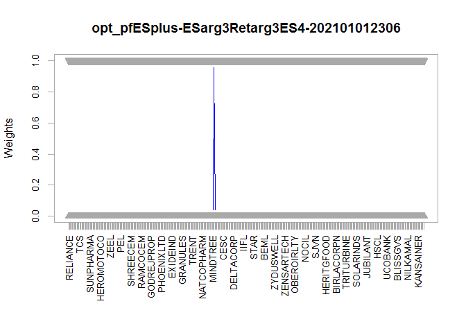

    ## [1] "Starting opt_pfESplus-ESarg4Retarg2ES1-202101012306"
    ## ***********************************
    ## PortfolioAnalytics Optimization
    ## ***********************************
    ## 
    ## Call:
    ## optimize.portfolio(R = R, portfolio = pfESplus, optimize_method = "ROI", 
    ##     trace = TRUE, momentFUN = cRebalSpec$momentFUN[cRebalSpec.ix])
    ## 
    ## Optimal Weights:
    ##   RELIANCE   HDFCBANK  ICICIBANK       HDFC        ITC   AXISBANK       SBIN 
    ##     0.0000     0.0000     0.0000     0.0000     0.0000     0.0000     0.0000 
    ##         LT BAJFINANCE       INFY BHARTIARTL        TCS        M.M  KOTAKBANK 
    ##     0.0000     0.0000     0.0791     0.0000     0.0000     0.0000     0.0000 
    ## INDUSINDBK       ONGC       NTPC TATAMOTORS  TATASTEEL     MARUTI   DIVISLAB 
    ##     0.0000     0.0000     0.0000     0.0000     0.0000     0.0000     0.0000 
    ##   HINDALCO  SUNPHARMA       VEDL HINDUNILVR    HCLTECH BAJAJFINSV  POWERGRID 
    ##     0.0000     0.0000     0.0000     0.0000     0.0000     0.0000     0.0000 
    ##       BPCL ASIANPAINT      TITAN    DRREDDY       GAIL HEROMOTOCO  COALINDIA 
    ##     0.0000     0.0000     0.0000     0.0000     0.0000     0.0000     0.0000 
    ##        IOC      TECHM ULTRACEMCO BAJAJ.AUTO ADANIPORTS     GRASIM      WIPRO 
    ##     0.0000     0.0000     0.0000     0.0000     0.0000     0.0000     0.0000 
    ##        UPL   JSWSTEEL       ZEEL     NAUKRI FEDERALBNK MOTHERSUMI  TATAPOWER 
    ##     0.0000     0.0000     0.0000     0.0106     0.0000     0.0000     0.0000 
    ##  BRITANNIA  AMBUJACEM  EICHERMOT AUROPHARMA SRTRANSFIN        BEL        PEL 
    ##     0.0000     0.0000     0.0000     0.0000     0.0000     0.0000     0.0000 
    ##   PETRONET        DLF      LUPIN     VOLTAS    HAVELLS     BIOCON        PFC 
    ##     0.0000     0.0000     0.0000     0.0000     0.0000     0.0000     0.0000 
    ##   ASHOKLEY   CHOLAFIN      CIPLA   SHREECEM     COLPAL BHARATFORG        SRF 
    ##     0.0000     0.0046     0.0000     0.0000     0.0000     0.0000     0.0000 
    ## PIDILITIND JINDALSTEL   ADANIENT     RECLTD     CONCOR    ESCORTS        ACC 
    ##     0.0064     0.0000     0.0000     0.0000     0.0000     0.0000     0.0000 
    ##   RAMCOCEM     MARICO     M.MFIN   GODREJCP  NESTLEIND  LICHSGFIN MANAPPURAM 
    ##     0.0000     0.0000     0.0000     0.0000     0.0000     0.0000     0.0000 
    ## BALKRISIND   CADILAHC      PIIND   BOSCHLTD GODREJPROP       NMDC BANKBARODA 
    ##     0.0000     0.0000     0.0000     0.0000     0.0000     0.0000     0.0000 
    ##   INDHOTEL    SIEMENS APOLLOHOSP TORNTPHARM   TVSMOTOR   JUBLFOOD CUMMINSIND 
    ##     0.0000     0.0000     0.0000     0.0000     0.0000     0.0000     0.0000 
    ##       IDEA PHOENIXLTD   GMRINFRA        MRF        IGL  BATAINDIA APOLLOTYRE 
    ##     0.0000     0.0000     0.0000     0.0000     0.0763     0.0000     0.0000 
    ## MUTHOOTFIN SUNDRMFAST     APLLTD       BHEL      L.TFH   EXIDEIND NATIONALUM 
    ##     0.0000     0.0000     0.0707     0.0000     0.0000     0.0000     0.0000 
    ##        CUB   GLENMARK AMARAJABAT        PVR SUPREMEIND NAVINFLUOR TORNTPOWER 
    ##     0.0000     0.0000     0.0000     0.0000     0.0000     0.0693     0.0000 
    ##      CANBK   DEEPAKNI   GRANULES    PAGEIND TATAMTRDVR BERGEPAINT   AARTIIND 
    ##     0.0000     0.0000     0.0000     0.0000     0.0000     0.0000     0.0000 
    ##  APLAPOLLO        PNB        UBL      DABUR  WHIRLPOOL       GSPL      TRENT 
    ##     0.0000     0.0000     0.0000     0.0000     0.0000     0.0000     0.0000 
    ##     FORTIS    DCBBANK   TATACOMM        NCC  TATAELXSI     CYIENT       IDFC 
    ##     0.0000     0.0000     0.0000     0.0000     0.0000     0.0000     0.0000 
    ##      GLAXO        OIL JMFINANCIL NATCOPHARM CANFINHOME       RAIN       ATUL 
    ##     0.0000     0.0000     0.0000     0.0000     0.0000     0.0000     0.0000 
    ## RAJESHEXPO       SAIL   SPICEJET       NHPC        MCX      SUNTV  REDINGTON 
    ##     0.0000     0.0000     0.0000     0.0000     0.0000     0.0000     0.0000 
    ##   MINDTREE   X3MINDIA      TANLA   EIDPARRY   GRAPHITE  GODREJIND  EDELWEISS 
    ##     0.0171     0.0000     0.0000     0.0000     0.0000     0.0000     0.0000 
    ##  LAXMIMACH     GESHIP   HINDZINC CASTROLIND       CESC   INDIACEM        FSL 
    ##     0.0000     0.0000     0.0000     0.0000     0.0000     0.0000     0.0000 
    ##       GNFC ABBOTINDIA ADANIPOWER  VAKRANGEE  UNIONBANK DCMSHRIRAM    WELCORP 
    ##     0.0000     0.0699     0.0000     0.0000     0.0000     0.0000     0.0000 
    ##   ALOKTEXT  DELTACORP  IBREALEST    KPRMILL        ABB  FINCABLES    CEATLTD 
    ##     0.0000     0.0000     0.0000     0.0000     0.0000     0.0000     0.0000 
    ##     VIPIND    KTKBANK     RALLIS CENTURYTEX BALRAMCHIN       IIFL       OFSS 
    ##     0.0000     0.0000     0.0000     0.0000     0.0000     0.0000     0.0000 
    ##     RELAXO        KEC AJANTPHARM   WESTLIFE TV18BRDCST  SOUTHBANK       GPPL 
    ##     0.0709     0.0000     0.0000     0.0277     0.0000     0.0000     0.0000 
    ## KALPATPOWR HINDCOPPER       STAR AARTIDRUGS SHRIRAMCIT       CERA WOCKPHARMA 
    ##     0.0000     0.0000     0.0000     0.0552     0.0000     0.0000     0.0000 
    ##  BAJAJELEC ENGINERSIN       GSFC COROMANDEL   AEGISLOG      IOLCP       BEML 
    ##     0.0000     0.0000     0.0000     0.0000     0.0000     0.0283     0.0000 
    ##        IRB      UFLEX       BASF    INDIANB  AKZOINDIA       BBTC SONATSOFTW 
    ##     0.0000     0.0000     0.0000     0.0000     0.0000     0.0000     0.0000 
    ##    SEQUENT    EIHOTEL  BAYERCROP  ZYDUSWELL  JSWENERGY WELSPUNIND     DISHTV 
    ##     0.0000     0.0000     0.0000     0.0000     0.0000     0.0000     0.0000 
    ## CARBORUNIV        HEG        PTC VINATIORGA     TIMKEN       HFCL        VTL 
    ##     0.0000     0.0000     0.0000     0.0000     0.0000     0.0000     0.0000 
    ## ZENSARTECH      SPARC     ECLERX    RAYMOND    TRIDENT     ASHOKA     RADICO 
    ##     0.0000     0.0000     0.0000     0.0000     0.0000     0.0000     0.0000 
    ## ALKYLAMINE  BANKINDIA SUDARSCHEM    IPCALAB OBEROIRLTY        FDC GODFRYPHLP 
    ##     0.1318     0.0000     0.0000     0.0000     0.0000     0.0000     0.0000 
    ##  SHILPAMED PHILIPCARB       MOIL      SOBHA       MEGH   PRESTIGE     VSTIND 
    ##     0.0000     0.0000     0.0000     0.0000     0.0000     0.0000     0.0000 
    ## MAHSCOOTER      NOCIL INOXLEISUR       GHCL TATAINVEST   NLCINDIA  JYOTHYLAB 
    ##     0.0000     0.0000     0.0000     0.0000     0.0000     0.0000     0.0000 
    ## KAJARIACER   GILLETTE  RESPONIND MOTILALOFS       KRBL       SJVN   ALLCARGO 
    ##     0.0000     0.0000     0.0000     0.0000     0.0000     0.0000     0.0000 
    ##  ORIENTREF       DCAL CHENNPETRO   SKFINDIA FINOLEXIND CENTURYPLY        SCI 
    ##     0.0000     0.0000     0.0000     0.0000     0.0000     0.0000     0.0000 
    ##        GDL GREAVESCOT HERITGFOOD SHOPERSTOP  BOMDYEING     KNRCON HAWKINCOOK 
    ##     0.0000     0.0000     0.0000     0.0000     0.0000     0.0000     0.0000 
    ##     VENKYS  JINDALSAW    JKPAPER  ESABINDIA   MAHABANK SCHAEFFLER BIRLACORPN 
    ##     0.0000     0.0000     0.0000     0.0000     0.0000     0.0000     0.0000 
    ## BALMLAWRIE       MFSL       PGHH   MINDAIND     VGUARD LINDEINDIA      JCHAC 
    ##     0.0000     0.0000     0.0839     0.0371     0.0000     0.0000     0.0000 
    ##       KSCL    LAOPALA TATACOFFEE TRITURBINE DEEPAKFERT   ASTRAZEN  JKLAKSHMI 
    ##     0.0000     0.0050     0.0000     0.0000     0.0000     0.0000     0.0000 
    ## VAIBHAVGBL   SUPRAJIT        GMM     IFBIND       IDBI   FORCEMOT    THERMAX 
    ##     0.0557     0.0000     0.0000     0.0000     0.0000     0.0000     0.0000 
    ##  SOLARINDS   BLUEDART      NESCO  JAMNAAUTO        JSL    DHANUKA TVSSRICHAK 
    ##     0.0175     0.0000     0.0000     0.0000     0.0000     0.0000     0.0000 
    ## TATAMETALI       MRPL NBVENTURES BAJAJHLDNG   JUBILANT JBCHEPHARM CHAMBLFERT 
    ##     0.0000     0.0000     0.0000     0.0000     0.0000     0.0000     0.0000 
    ##        KEI TTKPRESTIG    SUNTECK      CAPPL  NETWORK18  GUJALKALI  CENTRALBK 
    ##     0.0000     0.0000     0.0000     0.0000     0.0000     0.0000     0.0000 
    ##    J.KBANK       HSCL    GMDCLTD     PFIZER      MHRIL NAVNETEDUL        RCF 
    ##     0.0000     0.0000     0.0000     0.0000     0.0000     0.0000     0.0000 
    ##        IOB    TVTODAY  SCHNEIDER  RATNAMANI     JKTYRE    UCOBANK      GEPIL 
    ##     0.0000     0.0000     0.0000     0.0000     0.0000     0.0000     0.0000 
    ##  FCONSUMER TIMETECHNO     JAGRAN       MMTC     SANOFI        CCL SWANENERGY 
    ##     0.0000     0.0000     0.0000     0.0000     0.0000     0.0000     0.0000 
    ## JAICORPLTD     DBCORP   BLISSGVS WABCOINDIA      OMAXE    HATHWAY  MAHINDCIE 
    ##     0.0000     0.0000     0.0000     0.0000     0.0000     0.0000     0.0000 
    ##    MAHLIFE        ITI   EMAMILTD     ASTRAL   SYMPHONY     INDOCO   NILKAMAL 
    ##     0.0000     0.0000     0.0000     0.0827     0.0000     0.0000     0.0000 
    ##     SUZLON       IFCI       ITDC     CRISIL    BRIGADE BLUESTARCO MAHSEAMLES 
    ##     0.0000     0.0000     0.0000     0.0000     0.0000     0.0000     0.0000 
    ## HEIDELBERG    POLYMED  GRINDWELL  KANSAINER     AIAENG   TASTYBIT PERSISTENT 
    ##     0.0000     0.0000     0.0000     0.0000     0.0000     0.0000     0.0000 
    ##   JKCEMENT    MPHASIS     HONAUT  HINDPETRO 
    ##     0.0000     0.0000     0.0000     0.0000 
    ## 
    ## Objective Measure:
    ##     mean 
    ## 0.009028 
    ## 
    ## 
    ##      ES 
    ## 0.03268


    ## [1] "Starting opt_pfESplus-ESarg4Retarg2ES2-202101012306"
    ## ***********************************
    ## PortfolioAnalytics Optimization
    ## ***********************************
    ## 
    ## Call:
    ## optimize.portfolio(R = R, portfolio = pfESplus, optimize_method = "ROI", 
    ##     trace = TRUE, momentFUN = cRebalSpec$momentFUN[cRebalSpec.ix])
    ## 
    ## Optimal Weights:
    ##   RELIANCE   HDFCBANK  ICICIBANK       HDFC        ITC   AXISBANK       SBIN 
    ##     0.0000     0.0000     0.0000     0.0000     0.0000     0.0000     0.0000 
    ##         LT BAJFINANCE       INFY BHARTIARTL        TCS        M.M  KOTAKBANK 
    ##     0.0000     0.0000     0.0791     0.0000     0.0000     0.0000     0.0000 
    ## INDUSINDBK       ONGC       NTPC TATAMOTORS  TATASTEEL     MARUTI   DIVISLAB 
    ##     0.0000     0.0000     0.0000     0.0000     0.0000     0.0000     0.0000 
    ##   HINDALCO  SUNPHARMA       VEDL HINDUNILVR    HCLTECH BAJAJFINSV  POWERGRID 
    ##     0.0000     0.0000     0.0000     0.0000     0.0000     0.0000     0.0000 
    ##       BPCL ASIANPAINT      TITAN    DRREDDY       GAIL HEROMOTOCO  COALINDIA 
    ##     0.0000     0.0000     0.0000     0.0000     0.0000     0.0000     0.0000 
    ##        IOC      TECHM ULTRACEMCO BAJAJ.AUTO ADANIPORTS     GRASIM      WIPRO 
    ##     0.0000     0.0000     0.0000     0.0000     0.0000     0.0000     0.0000 
    ##        UPL   JSWSTEEL       ZEEL     NAUKRI FEDERALBNK MOTHERSUMI  TATAPOWER 
    ##     0.0000     0.0000     0.0000     0.0106     0.0000     0.0000     0.0000 
    ##  BRITANNIA  AMBUJACEM  EICHERMOT AUROPHARMA SRTRANSFIN        BEL        PEL 
    ##     0.0000     0.0000     0.0000     0.0000     0.0000     0.0000     0.0000 
    ##   PETRONET        DLF      LUPIN     VOLTAS    HAVELLS     BIOCON        PFC 
    ##     0.0000     0.0000     0.0000     0.0000     0.0000     0.0000     0.0000 
    ##   ASHOKLEY   CHOLAFIN      CIPLA   SHREECEM     COLPAL BHARATFORG        SRF 
    ##     0.0000     0.0046     0.0000     0.0000     0.0000     0.0000     0.0000 
    ## PIDILITIND JINDALSTEL   ADANIENT     RECLTD     CONCOR    ESCORTS        ACC 
    ##     0.0064     0.0000     0.0000     0.0000     0.0000     0.0000     0.0000 
    ##   RAMCOCEM     MARICO     M.MFIN   GODREJCP  NESTLEIND  LICHSGFIN MANAPPURAM 
    ##     0.0000     0.0000     0.0000     0.0000     0.0000     0.0000     0.0000 
    ## BALKRISIND   CADILAHC      PIIND   BOSCHLTD GODREJPROP       NMDC BANKBARODA 
    ##     0.0000     0.0000     0.0000     0.0000     0.0000     0.0000     0.0000 
    ##   INDHOTEL    SIEMENS APOLLOHOSP TORNTPHARM   TVSMOTOR   JUBLFOOD CUMMINSIND 
    ##     0.0000     0.0000     0.0000     0.0000     0.0000     0.0000     0.0000 
    ##       IDEA PHOENIXLTD   GMRINFRA        MRF        IGL  BATAINDIA APOLLOTYRE 
    ##     0.0000     0.0000     0.0000     0.0000     0.0763     0.0000     0.0000 
    ## MUTHOOTFIN SUNDRMFAST     APLLTD       BHEL      L.TFH   EXIDEIND NATIONALUM 
    ##     0.0000     0.0000     0.0707     0.0000     0.0000     0.0000     0.0000 
    ##        CUB   GLENMARK AMARAJABAT        PVR SUPREMEIND NAVINFLUOR TORNTPOWER 
    ##     0.0000     0.0000     0.0000     0.0000     0.0000     0.0693     0.0000 
    ##      CANBK   DEEPAKNI   GRANULES    PAGEIND TATAMTRDVR BERGEPAINT   AARTIIND 
    ##     0.0000     0.0000     0.0000     0.0000     0.0000     0.0000     0.0000 
    ##  APLAPOLLO        PNB        UBL      DABUR  WHIRLPOOL       GSPL      TRENT 
    ##     0.0000     0.0000     0.0000     0.0000     0.0000     0.0000     0.0000 
    ##     FORTIS    DCBBANK   TATACOMM        NCC  TATAELXSI     CYIENT       IDFC 
    ##     0.0000     0.0000     0.0000     0.0000     0.0000     0.0000     0.0000 
    ##      GLAXO        OIL JMFINANCIL NATCOPHARM CANFINHOME       RAIN       ATUL 
    ##     0.0000     0.0000     0.0000     0.0000     0.0000     0.0000     0.0000 
    ## RAJESHEXPO       SAIL   SPICEJET       NHPC        MCX      SUNTV  REDINGTON 
    ##     0.0000     0.0000     0.0000     0.0000     0.0000     0.0000     0.0000 
    ##   MINDTREE   X3MINDIA      TANLA   EIDPARRY   GRAPHITE  GODREJIND  EDELWEISS 
    ##     0.0171     0.0000     0.0000     0.0000     0.0000     0.0000     0.0000 
    ##  LAXMIMACH     GESHIP   HINDZINC CASTROLIND       CESC   INDIACEM        FSL 
    ##     0.0000     0.0000     0.0000     0.0000     0.0000     0.0000     0.0000 
    ##       GNFC ABBOTINDIA ADANIPOWER  VAKRANGEE  UNIONBANK DCMSHRIRAM    WELCORP 
    ##     0.0000     0.0699     0.0000     0.0000     0.0000     0.0000     0.0000 
    ##   ALOKTEXT  DELTACORP  IBREALEST    KPRMILL        ABB  FINCABLES    CEATLTD 
    ##     0.0000     0.0000     0.0000     0.0000     0.0000     0.0000     0.0000 
    ##     VIPIND    KTKBANK     RALLIS CENTURYTEX BALRAMCHIN       IIFL       OFSS 
    ##     0.0000     0.0000     0.0000     0.0000     0.0000     0.0000     0.0000 
    ##     RELAXO        KEC AJANTPHARM   WESTLIFE TV18BRDCST  SOUTHBANK       GPPL 
    ##     0.0709     0.0000     0.0000     0.0277     0.0000     0.0000     0.0000 
    ## KALPATPOWR HINDCOPPER       STAR AARTIDRUGS SHRIRAMCIT       CERA WOCKPHARMA 
    ##     0.0000     0.0000     0.0000     0.0552     0.0000     0.0000     0.0000 
    ##  BAJAJELEC ENGINERSIN       GSFC COROMANDEL   AEGISLOG      IOLCP       BEML 
    ##     0.0000     0.0000     0.0000     0.0000     0.0000     0.0283     0.0000 
    ##        IRB      UFLEX       BASF    INDIANB  AKZOINDIA       BBTC SONATSOFTW 
    ##     0.0000     0.0000     0.0000     0.0000     0.0000     0.0000     0.0000 
    ##    SEQUENT    EIHOTEL  BAYERCROP  ZYDUSWELL  JSWENERGY WELSPUNIND     DISHTV 
    ##     0.0000     0.0000     0.0000     0.0000     0.0000     0.0000     0.0000 
    ## CARBORUNIV        HEG        PTC VINATIORGA     TIMKEN       HFCL        VTL 
    ##     0.0000     0.0000     0.0000     0.0000     0.0000     0.0000     0.0000 
    ## ZENSARTECH      SPARC     ECLERX    RAYMOND    TRIDENT     ASHOKA     RADICO 
    ##     0.0000     0.0000     0.0000     0.0000     0.0000     0.0000     0.0000 
    ## ALKYLAMINE  BANKINDIA SUDARSCHEM    IPCALAB OBEROIRLTY        FDC GODFRYPHLP 
    ##     0.1318     0.0000     0.0000     0.0000     0.0000     0.0000     0.0000 
    ##  SHILPAMED PHILIPCARB       MOIL      SOBHA       MEGH   PRESTIGE     VSTIND 
    ##     0.0000     0.0000     0.0000     0.0000     0.0000     0.0000     0.0000 
    ## MAHSCOOTER      NOCIL INOXLEISUR       GHCL TATAINVEST   NLCINDIA  JYOTHYLAB 
    ##     0.0000     0.0000     0.0000     0.0000     0.0000     0.0000     0.0000 
    ## KAJARIACER   GILLETTE  RESPONIND MOTILALOFS       KRBL       SJVN   ALLCARGO 
    ##     0.0000     0.0000     0.0000     0.0000     0.0000     0.0000     0.0000 
    ##  ORIENTREF       DCAL CHENNPETRO   SKFINDIA FINOLEXIND CENTURYPLY        SCI 
    ##     0.0000     0.0000     0.0000     0.0000     0.0000     0.0000     0.0000 
    ##        GDL GREAVESCOT HERITGFOOD SHOPERSTOP  BOMDYEING     KNRCON HAWKINCOOK 
    ##     0.0000     0.0000     0.0000     0.0000     0.0000     0.0000     0.0000 
    ##     VENKYS  JINDALSAW    JKPAPER  ESABINDIA   MAHABANK SCHAEFFLER BIRLACORPN 
    ##     0.0000     0.0000     0.0000     0.0000     0.0000     0.0000     0.0000 
    ## BALMLAWRIE       MFSL       PGHH   MINDAIND     VGUARD LINDEINDIA      JCHAC 
    ##     0.0000     0.0000     0.0839     0.0371     0.0000     0.0000     0.0000 
    ##       KSCL    LAOPALA TATACOFFEE TRITURBINE DEEPAKFERT   ASTRAZEN  JKLAKSHMI 
    ##     0.0000     0.0050     0.0000     0.0000     0.0000     0.0000     0.0000 
    ## VAIBHAVGBL   SUPRAJIT        GMM     IFBIND       IDBI   FORCEMOT    THERMAX 
    ##     0.0557     0.0000     0.0000     0.0000     0.0000     0.0000     0.0000 
    ##  SOLARINDS   BLUEDART      NESCO  JAMNAAUTO        JSL    DHANUKA TVSSRICHAK 
    ##     0.0175     0.0000     0.0000     0.0000     0.0000     0.0000     0.0000 
    ## TATAMETALI       MRPL NBVENTURES BAJAJHLDNG   JUBILANT JBCHEPHARM CHAMBLFERT 
    ##     0.0000     0.0000     0.0000     0.0000     0.0000     0.0000     0.0000 
    ##        KEI TTKPRESTIG    SUNTECK      CAPPL  NETWORK18  GUJALKALI  CENTRALBK 
    ##     0.0000     0.0000     0.0000     0.0000     0.0000     0.0000     0.0000 
    ##    J.KBANK       HSCL    GMDCLTD     PFIZER      MHRIL NAVNETEDUL        RCF 
    ##     0.0000     0.0000     0.0000     0.0000     0.0000     0.0000     0.0000 
    ##        IOB    TVTODAY  SCHNEIDER  RATNAMANI     JKTYRE    UCOBANK      GEPIL 
    ##     0.0000     0.0000     0.0000     0.0000     0.0000     0.0000     0.0000 
    ##  FCONSUMER TIMETECHNO     JAGRAN       MMTC     SANOFI        CCL SWANENERGY 
    ##     0.0000     0.0000     0.0000     0.0000     0.0000     0.0000     0.0000 
    ## JAICORPLTD     DBCORP   BLISSGVS WABCOINDIA      OMAXE    HATHWAY  MAHINDCIE 
    ##     0.0000     0.0000     0.0000     0.0000     0.0000     0.0000     0.0000 
    ##    MAHLIFE        ITI   EMAMILTD     ASTRAL   SYMPHONY     INDOCO   NILKAMAL 
    ##     0.0000     0.0000     0.0000     0.0827     0.0000     0.0000     0.0000 
    ##     SUZLON       IFCI       ITDC     CRISIL    BRIGADE BLUESTARCO MAHSEAMLES 
    ##     0.0000     0.0000     0.0000     0.0000     0.0000     0.0000     0.0000 
    ## HEIDELBERG    POLYMED  GRINDWELL  KANSAINER     AIAENG   TASTYBIT PERSISTENT 
    ##     0.0000     0.0000     0.0000     0.0000     0.0000     0.0000     0.0000 
    ##   JKCEMENT    MPHASIS     HONAUT  HINDPETRO 
    ##     0.0000     0.0000     0.0000     0.0000 
    ## 
    ## Objective Measure:
    ##     mean 
    ## 0.009028 
    ## 
    ## 
    ##      ES 
    ## 0.03268


    ## [1] "Starting opt_pfESplus-ESarg4Retarg2ES3-202101012306"
    ## ***********************************
    ## PortfolioAnalytics Optimization
    ## ***********************************
    ## 
    ## Call:
    ## optimize.portfolio(R = R, portfolio = pfESplus, optimize_method = "ROI", 
    ##     trace = TRUE, momentFUN = cRebalSpec$momentFUN[cRebalSpec.ix])
    ## 
    ## Optimal Weights:
    ##   RELIANCE   HDFCBANK  ICICIBANK       HDFC        ITC   AXISBANK       SBIN 
    ##     0.0000     0.0000     0.0000     0.0000     0.0000     0.0000     0.0000 
    ##         LT BAJFINANCE       INFY BHARTIARTL        TCS        M.M  KOTAKBANK 
    ##     0.0000     0.0000     0.0791     0.0000     0.0000     0.0000     0.0000 
    ## INDUSINDBK       ONGC       NTPC TATAMOTORS  TATASTEEL     MARUTI   DIVISLAB 
    ##     0.0000     0.0000     0.0000     0.0000     0.0000     0.0000     0.0000 
    ##   HINDALCO  SUNPHARMA       VEDL HINDUNILVR    HCLTECH BAJAJFINSV  POWERGRID 
    ##     0.0000     0.0000     0.0000     0.0000     0.0000     0.0000     0.0000 
    ##       BPCL ASIANPAINT      TITAN    DRREDDY       GAIL HEROMOTOCO  COALINDIA 
    ##     0.0000     0.0000     0.0000     0.0000     0.0000     0.0000     0.0000 
    ##        IOC      TECHM ULTRACEMCO BAJAJ.AUTO ADANIPORTS     GRASIM      WIPRO 
    ##     0.0000     0.0000     0.0000     0.0000     0.0000     0.0000     0.0000 
    ##        UPL   JSWSTEEL       ZEEL     NAUKRI FEDERALBNK MOTHERSUMI  TATAPOWER 
    ##     0.0000     0.0000     0.0000     0.0106     0.0000     0.0000     0.0000 
    ##  BRITANNIA  AMBUJACEM  EICHERMOT AUROPHARMA SRTRANSFIN        BEL        PEL 
    ##     0.0000     0.0000     0.0000     0.0000     0.0000     0.0000     0.0000 
    ##   PETRONET        DLF      LUPIN     VOLTAS    HAVELLS     BIOCON        PFC 
    ##     0.0000     0.0000     0.0000     0.0000     0.0000     0.0000     0.0000 
    ##   ASHOKLEY   CHOLAFIN      CIPLA   SHREECEM     COLPAL BHARATFORG        SRF 
    ##     0.0000     0.0046     0.0000     0.0000     0.0000     0.0000     0.0000 
    ## PIDILITIND JINDALSTEL   ADANIENT     RECLTD     CONCOR    ESCORTS        ACC 
    ##     0.0064     0.0000     0.0000     0.0000     0.0000     0.0000     0.0000 
    ##   RAMCOCEM     MARICO     M.MFIN   GODREJCP  NESTLEIND  LICHSGFIN MANAPPURAM 
    ##     0.0000     0.0000     0.0000     0.0000     0.0000     0.0000     0.0000 
    ## BALKRISIND   CADILAHC      PIIND   BOSCHLTD GODREJPROP       NMDC BANKBARODA 
    ##     0.0000     0.0000     0.0000     0.0000     0.0000     0.0000     0.0000 
    ##   INDHOTEL    SIEMENS APOLLOHOSP TORNTPHARM   TVSMOTOR   JUBLFOOD CUMMINSIND 
    ##     0.0000     0.0000     0.0000     0.0000     0.0000     0.0000     0.0000 
    ##       IDEA PHOENIXLTD   GMRINFRA        MRF        IGL  BATAINDIA APOLLOTYRE 
    ##     0.0000     0.0000     0.0000     0.0000     0.0763     0.0000     0.0000 
    ## MUTHOOTFIN SUNDRMFAST     APLLTD       BHEL      L.TFH   EXIDEIND NATIONALUM 
    ##     0.0000     0.0000     0.0707     0.0000     0.0000     0.0000     0.0000 
    ##        CUB   GLENMARK AMARAJABAT        PVR SUPREMEIND NAVINFLUOR TORNTPOWER 
    ##     0.0000     0.0000     0.0000     0.0000     0.0000     0.0693     0.0000 
    ##      CANBK   DEEPAKNI   GRANULES    PAGEIND TATAMTRDVR BERGEPAINT   AARTIIND 
    ##     0.0000     0.0000     0.0000     0.0000     0.0000     0.0000     0.0000 
    ##  APLAPOLLO        PNB        UBL      DABUR  WHIRLPOOL       GSPL      TRENT 
    ##     0.0000     0.0000     0.0000     0.0000     0.0000     0.0000     0.0000 
    ##     FORTIS    DCBBANK   TATACOMM        NCC  TATAELXSI     CYIENT       IDFC 
    ##     0.0000     0.0000     0.0000     0.0000     0.0000     0.0000     0.0000 
    ##      GLAXO        OIL JMFINANCIL NATCOPHARM CANFINHOME       RAIN       ATUL 
    ##     0.0000     0.0000     0.0000     0.0000     0.0000     0.0000     0.0000 
    ## RAJESHEXPO       SAIL   SPICEJET       NHPC        MCX      SUNTV  REDINGTON 
    ##     0.0000     0.0000     0.0000     0.0000     0.0000     0.0000     0.0000 
    ##   MINDTREE   X3MINDIA      TANLA   EIDPARRY   GRAPHITE  GODREJIND  EDELWEISS 
    ##     0.0171     0.0000     0.0000     0.0000     0.0000     0.0000     0.0000 
    ##  LAXMIMACH     GESHIP   HINDZINC CASTROLIND       CESC   INDIACEM        FSL 
    ##     0.0000     0.0000     0.0000     0.0000     0.0000     0.0000     0.0000 
    ##       GNFC ABBOTINDIA ADANIPOWER  VAKRANGEE  UNIONBANK DCMSHRIRAM    WELCORP 
    ##     0.0000     0.0699     0.0000     0.0000     0.0000     0.0000     0.0000 
    ##   ALOKTEXT  DELTACORP  IBREALEST    KPRMILL        ABB  FINCABLES    CEATLTD 
    ##     0.0000     0.0000     0.0000     0.0000     0.0000     0.0000     0.0000 
    ##     VIPIND    KTKBANK     RALLIS CENTURYTEX BALRAMCHIN       IIFL       OFSS 
    ##     0.0000     0.0000     0.0000     0.0000     0.0000     0.0000     0.0000 
    ##     RELAXO        KEC AJANTPHARM   WESTLIFE TV18BRDCST  SOUTHBANK       GPPL 
    ##     0.0709     0.0000     0.0000     0.0277     0.0000     0.0000     0.0000 
    ## KALPATPOWR HINDCOPPER       STAR AARTIDRUGS SHRIRAMCIT       CERA WOCKPHARMA 
    ##     0.0000     0.0000     0.0000     0.0552     0.0000     0.0000     0.0000 
    ##  BAJAJELEC ENGINERSIN       GSFC COROMANDEL   AEGISLOG      IOLCP       BEML 
    ##     0.0000     0.0000     0.0000     0.0000     0.0000     0.0283     0.0000 
    ##        IRB      UFLEX       BASF    INDIANB  AKZOINDIA       BBTC SONATSOFTW 
    ##     0.0000     0.0000     0.0000     0.0000     0.0000     0.0000     0.0000 
    ##    SEQUENT    EIHOTEL  BAYERCROP  ZYDUSWELL  JSWENERGY WELSPUNIND     DISHTV 
    ##     0.0000     0.0000     0.0000     0.0000     0.0000     0.0000     0.0000 
    ## CARBORUNIV        HEG        PTC VINATIORGA     TIMKEN       HFCL        VTL 
    ##     0.0000     0.0000     0.0000     0.0000     0.0000     0.0000     0.0000 
    ## ZENSARTECH      SPARC     ECLERX    RAYMOND    TRIDENT     ASHOKA     RADICO 
    ##     0.0000     0.0000     0.0000     0.0000     0.0000     0.0000     0.0000 
    ## ALKYLAMINE  BANKINDIA SUDARSCHEM    IPCALAB OBEROIRLTY        FDC GODFRYPHLP 
    ##     0.1318     0.0000     0.0000     0.0000     0.0000     0.0000     0.0000 
    ##  SHILPAMED PHILIPCARB       MOIL      SOBHA       MEGH   PRESTIGE     VSTIND 
    ##     0.0000     0.0000     0.0000     0.0000     0.0000     0.0000     0.0000 
    ## MAHSCOOTER      NOCIL INOXLEISUR       GHCL TATAINVEST   NLCINDIA  JYOTHYLAB 
    ##     0.0000     0.0000     0.0000     0.0000     0.0000     0.0000     0.0000 
    ## KAJARIACER   GILLETTE  RESPONIND MOTILALOFS       KRBL       SJVN   ALLCARGO 
    ##     0.0000     0.0000     0.0000     0.0000     0.0000     0.0000     0.0000 
    ##  ORIENTREF       DCAL CHENNPETRO   SKFINDIA FINOLEXIND CENTURYPLY        SCI 
    ##     0.0000     0.0000     0.0000     0.0000     0.0000     0.0000     0.0000 
    ##        GDL GREAVESCOT HERITGFOOD SHOPERSTOP  BOMDYEING     KNRCON HAWKINCOOK 
    ##     0.0000     0.0000     0.0000     0.0000     0.0000     0.0000     0.0000 
    ##     VENKYS  JINDALSAW    JKPAPER  ESABINDIA   MAHABANK SCHAEFFLER BIRLACORPN 
    ##     0.0000     0.0000     0.0000     0.0000     0.0000     0.0000     0.0000 
    ## BALMLAWRIE       MFSL       PGHH   MINDAIND     VGUARD LINDEINDIA      JCHAC 
    ##     0.0000     0.0000     0.0839     0.0371     0.0000     0.0000     0.0000 
    ##       KSCL    LAOPALA TATACOFFEE TRITURBINE DEEPAKFERT   ASTRAZEN  JKLAKSHMI 
    ##     0.0000     0.0050     0.0000     0.0000     0.0000     0.0000     0.0000 
    ## VAIBHAVGBL   SUPRAJIT        GMM     IFBIND       IDBI   FORCEMOT    THERMAX 
    ##     0.0557     0.0000     0.0000     0.0000     0.0000     0.0000     0.0000 
    ##  SOLARINDS   BLUEDART      NESCO  JAMNAAUTO        JSL    DHANUKA TVSSRICHAK 
    ##     0.0175     0.0000     0.0000     0.0000     0.0000     0.0000     0.0000 
    ## TATAMETALI       MRPL NBVENTURES BAJAJHLDNG   JUBILANT JBCHEPHARM CHAMBLFERT 
    ##     0.0000     0.0000     0.0000     0.0000     0.0000     0.0000     0.0000 
    ##        KEI TTKPRESTIG    SUNTECK      CAPPL  NETWORK18  GUJALKALI  CENTRALBK 
    ##     0.0000     0.0000     0.0000     0.0000     0.0000     0.0000     0.0000 
    ##    J.KBANK       HSCL    GMDCLTD     PFIZER      MHRIL NAVNETEDUL        RCF 
    ##     0.0000     0.0000     0.0000     0.0000     0.0000     0.0000     0.0000 
    ##        IOB    TVTODAY  SCHNEIDER  RATNAMANI     JKTYRE    UCOBANK      GEPIL 
    ##     0.0000     0.0000     0.0000     0.0000     0.0000     0.0000     0.0000 
    ##  FCONSUMER TIMETECHNO     JAGRAN       MMTC     SANOFI        CCL SWANENERGY 
    ##     0.0000     0.0000     0.0000     0.0000     0.0000     0.0000     0.0000 
    ## JAICORPLTD     DBCORP   BLISSGVS WABCOINDIA      OMAXE    HATHWAY  MAHINDCIE 
    ##     0.0000     0.0000     0.0000     0.0000     0.0000     0.0000     0.0000 
    ##    MAHLIFE        ITI   EMAMILTD     ASTRAL   SYMPHONY     INDOCO   NILKAMAL 
    ##     0.0000     0.0000     0.0000     0.0827     0.0000     0.0000     0.0000 
    ##     SUZLON       IFCI       ITDC     CRISIL    BRIGADE BLUESTARCO MAHSEAMLES 
    ##     0.0000     0.0000     0.0000     0.0000     0.0000     0.0000     0.0000 
    ## HEIDELBERG    POLYMED  GRINDWELL  KANSAINER     AIAENG   TASTYBIT PERSISTENT 
    ##     0.0000     0.0000     0.0000     0.0000     0.0000     0.0000     0.0000 
    ##   JKCEMENT    MPHASIS     HONAUT  HINDPETRO 
    ##     0.0000     0.0000     0.0000     0.0000 
    ## 
    ## Objective Measure:
    ##     mean 
    ## 0.009028 
    ## 
    ## 
    ##      ES 
    ## 0.03268


    ## [1] "Starting opt_pfESplus-ESarg4Retarg2ES4-202101012307"
    ## ***********************************
    ## PortfolioAnalytics Optimization
    ## ***********************************
    ## 
    ## Call:
    ## optimize.portfolio(R = R, portfolio = pfESplus, optimize_method = "ROI", 
    ##     trace = TRUE, momentFUN = cRebalSpec$momentFUN[cRebalSpec.ix])
    ## 
    ## Optimal Weights:
    ##   RELIANCE   HDFCBANK  ICICIBANK       HDFC        ITC   AXISBANK       SBIN 
    ##     0.0000     0.0000     0.0000     0.0000     0.0000     0.0000     0.0000 
    ##         LT BAJFINANCE       INFY BHARTIARTL        TCS        M.M  KOTAKBANK 
    ##     0.0000     0.0000     0.0000     0.0000     0.0000     0.0000     0.0000 
    ## INDUSINDBK       ONGC       NTPC TATAMOTORS  TATASTEEL     MARUTI   DIVISLAB 
    ##     0.0000     0.0000     0.0000     0.0000     0.0000     0.0000     0.0000 
    ##   HINDALCO  SUNPHARMA       VEDL HINDUNILVR    HCLTECH BAJAJFINSV  POWERGRID 
    ##     0.0000     0.0000     0.0000     0.0000     0.0000     0.0000     0.0000 
    ##       BPCL ASIANPAINT      TITAN    DRREDDY       GAIL HEROMOTOCO  COALINDIA 
    ##     0.0000     0.0000     0.0000     0.0000     0.0000     0.0000     0.0000 
    ##        IOC      TECHM ULTRACEMCO BAJAJ.AUTO ADANIPORTS     GRASIM      WIPRO 
    ##     0.0000     0.0000     0.0000     0.0000     0.0000     0.0000     0.0000 
    ##        UPL   JSWSTEEL       ZEEL     NAUKRI FEDERALBNK MOTHERSUMI  TATAPOWER 
    ##     0.0000     0.0000     0.0000     0.0000     0.0000     0.0000     0.0000 
    ##  BRITANNIA  AMBUJACEM  EICHERMOT AUROPHARMA SRTRANSFIN        BEL        PEL 
    ##     0.0000     0.0000     0.0000     0.0000     0.0000     0.0000     0.0000 
    ##   PETRONET        DLF      LUPIN     VOLTAS    HAVELLS     BIOCON        PFC 
    ##     0.0000     0.0000     0.0000     0.0000     0.0000     0.0000     0.0000 
    ##   ASHOKLEY   CHOLAFIN      CIPLA   SHREECEM     COLPAL BHARATFORG        SRF 
    ##     0.0000     0.0000     0.0000     0.0000     0.0000     0.0000     0.0000 
    ## PIDILITIND JINDALSTEL   ADANIENT     RECLTD     CONCOR    ESCORTS        ACC 
    ##     0.0000     0.0000     0.0000     0.0000     0.0000     0.0000     0.0000 
    ##   RAMCOCEM     MARICO     M.MFIN   GODREJCP  NESTLEIND  LICHSGFIN MANAPPURAM 
    ##     0.0000     0.0000     0.0000     0.0000     0.0000     0.0000     0.0000 
    ## BALKRISIND   CADILAHC      PIIND   BOSCHLTD GODREJPROP       NMDC BANKBARODA 
    ##     0.0000     0.0000     0.0000     0.0000     0.0000     0.0000     0.0000 
    ##   INDHOTEL    SIEMENS APOLLOHOSP TORNTPHARM   TVSMOTOR   JUBLFOOD CUMMINSIND 
    ##     0.0000     0.0000     0.0000     0.0000     0.0000     0.0000     0.0000 
    ##       IDEA PHOENIXLTD   GMRINFRA        MRF        IGL  BATAINDIA APOLLOTYRE 
    ##     0.0000     0.0000     0.0000     0.0000     0.0000     0.0000     0.0000 
    ## MUTHOOTFIN SUNDRMFAST     APLLTD       BHEL      L.TFH   EXIDEIND NATIONALUM 
    ##     0.0000     0.0000     0.0000     0.0000     0.0000     0.0000     0.0000 
    ##        CUB   GLENMARK AMARAJABAT        PVR SUPREMEIND NAVINFLUOR TORNTPOWER 
    ##     0.0000     0.0000     0.0000     0.0000     0.0000     0.0000     0.0000 
    ##      CANBK   DEEPAKNI   GRANULES    PAGEIND TATAMTRDVR BERGEPAINT   AARTIIND 
    ##     0.0000     0.0000     0.0000     0.0000     0.0000     0.0000     0.0000 
    ##  APLAPOLLO        PNB        UBL      DABUR  WHIRLPOOL       GSPL      TRENT 
    ##     0.0000     0.0000     0.0000     0.0000     0.0000     0.0000     0.0000 
    ##     FORTIS    DCBBANK   TATACOMM        NCC  TATAELXSI     CYIENT       IDFC 
    ##     0.0000     0.0000     0.0000     0.0000     0.0000     0.0000     0.0000 
    ##      GLAXO        OIL JMFINANCIL NATCOPHARM CANFINHOME       RAIN       ATUL 
    ##     0.0000     0.0000     0.0000     0.0000     0.0000     0.0000     0.0000 
    ## RAJESHEXPO       SAIL   SPICEJET       NHPC        MCX      SUNTV  REDINGTON 
    ##     0.0000     0.0000     0.0000     0.0000     0.0000     0.0000     0.0000 
    ##   MINDTREE   X3MINDIA      TANLA   EIDPARRY   GRAPHITE  GODREJIND  EDELWEISS 
    ##     0.0000     0.0000     0.5053     0.0000     0.0000     0.0000     0.0000 
    ##  LAXMIMACH     GESHIP   HINDZINC CASTROLIND       CESC   INDIACEM        FSL 
    ##     0.0000     0.0000     0.0000     0.0000     0.0000     0.0000     0.0000 
    ##       GNFC ABBOTINDIA ADANIPOWER  VAKRANGEE  UNIONBANK DCMSHRIRAM    WELCORP 
    ##     0.0000     0.0000     0.0000     0.0000     0.0000     0.0000     0.0000 
    ##   ALOKTEXT  DELTACORP  IBREALEST    KPRMILL        ABB  FINCABLES    CEATLTD 
    ##     0.0000     0.0000     0.0000     0.0000     0.0000     0.0000     0.0000 
    ##     VIPIND    KTKBANK     RALLIS CENTURYTEX BALRAMCHIN       IIFL       OFSS 
    ##     0.0000     0.0000     0.0000     0.0000     0.0000     0.0000     0.0000 
    ##     RELAXO        KEC AJANTPHARM   WESTLIFE TV18BRDCST  SOUTHBANK       GPPL 
    ##     0.0000     0.0000     0.0000     0.0000     0.0000     0.0000     0.0000 
    ## KALPATPOWR HINDCOPPER       STAR AARTIDRUGS SHRIRAMCIT       CERA WOCKPHARMA 
    ##     0.0000     0.0000     0.0000     0.0000     0.0000     0.0000     0.0000 
    ##  BAJAJELEC ENGINERSIN       GSFC COROMANDEL   AEGISLOG      IOLCP       BEML 
    ##     0.0000     0.0000     0.0000     0.0000     0.0000     0.0000     0.0000 
    ##        IRB      UFLEX       BASF    INDIANB  AKZOINDIA       BBTC SONATSOFTW 
    ##     0.0000     0.0000     0.0000     0.0000     0.0000     0.0000     0.0000 
    ##    SEQUENT    EIHOTEL  BAYERCROP  ZYDUSWELL  JSWENERGY WELSPUNIND     DISHTV 
    ##     0.0000     0.0000     0.0000     0.0000     0.0000     0.0000     0.0000 
    ## CARBORUNIV        HEG        PTC VINATIORGA     TIMKEN       HFCL        VTL 
    ##     0.0000     0.0000     0.0000     0.0000     0.0000     0.0000     0.0000 
    ## ZENSARTECH      SPARC     ECLERX    RAYMOND    TRIDENT     ASHOKA     RADICO 
    ##     0.0000     0.0000     0.0000     0.0000     0.0000     0.0000     0.0000 
    ## ALKYLAMINE  BANKINDIA SUDARSCHEM    IPCALAB OBEROIRLTY        FDC GODFRYPHLP 
    ##     0.0000     0.0000     0.0000     0.0000     0.0000     0.0000     0.0000 
    ##  SHILPAMED PHILIPCARB       MOIL      SOBHA       MEGH   PRESTIGE     VSTIND 
    ##     0.0000     0.0000     0.0000     0.0000     0.0000     0.0000     0.0000 
    ## MAHSCOOTER      NOCIL INOXLEISUR       GHCL TATAINVEST   NLCINDIA  JYOTHYLAB 
    ##     0.0000     0.0000     0.0000     0.0000     0.0000     0.0000     0.0000 
    ## KAJARIACER   GILLETTE  RESPONIND MOTILALOFS       KRBL       SJVN   ALLCARGO 
    ##     0.0000     0.0000     0.0000     0.0000     0.0000     0.0000     0.0000 
    ##  ORIENTREF       DCAL CHENNPETRO   SKFINDIA FINOLEXIND CENTURYPLY        SCI 
    ##     0.0000     0.0000     0.0000     0.0000     0.0000     0.0000     0.0000 
    ##        GDL GREAVESCOT HERITGFOOD SHOPERSTOP  BOMDYEING     KNRCON HAWKINCOOK 
    ##     0.0000     0.0000     0.0000     0.0000     0.0000     0.0000     0.0000 
    ##     VENKYS  JINDALSAW    JKPAPER  ESABINDIA   MAHABANK SCHAEFFLER BIRLACORPN 
    ##     0.0000     0.0000     0.0000     0.0000     0.0000     0.0000     0.0000 
    ## BALMLAWRIE       MFSL       PGHH   MINDAIND     VGUARD LINDEINDIA      JCHAC 
    ##     0.0000     0.0000     0.0000     0.0000     0.0000     0.0000     0.0000 
    ##       KSCL    LAOPALA TATACOFFEE TRITURBINE DEEPAKFERT   ASTRAZEN  JKLAKSHMI 
    ##     0.0000     0.0000     0.0000     0.0000     0.0000     0.0000     0.0000 
    ## VAIBHAVGBL   SUPRAJIT        GMM     IFBIND       IDBI   FORCEMOT    THERMAX 
    ##     0.0000     0.0000     0.0000     0.0000     0.0000     0.0000     0.0000 
    ##  SOLARINDS   BLUEDART      NESCO  JAMNAAUTO        JSL    DHANUKA TVSSRICHAK 
    ##     0.0000     0.0000     0.0000     0.0000     0.0000     0.0000     0.0000 
    ## TATAMETALI       MRPL NBVENTURES BAJAJHLDNG   JUBILANT JBCHEPHARM CHAMBLFERT 
    ##     0.0000     0.0000     0.0000     0.0000     0.0000     0.0000     0.0000 
    ##        KEI TTKPRESTIG    SUNTECK      CAPPL  NETWORK18  GUJALKALI  CENTRALBK 
    ##     0.0000     0.0000     0.0000     0.0000     0.0000     0.0000     0.0000 
    ##    J.KBANK       HSCL    GMDCLTD     PFIZER      MHRIL NAVNETEDUL        RCF 
    ##     0.0000     0.0000     0.0000     0.0000     0.0000     0.0000     0.0000 
    ##        IOB    TVTODAY  SCHNEIDER  RATNAMANI     JKTYRE    UCOBANK      GEPIL 
    ##     0.0000     0.0000     0.0000     0.0000     0.0000     0.0000     0.0000 
    ##  FCONSUMER TIMETECHNO     JAGRAN       MMTC     SANOFI        CCL SWANENERGY 
    ##     0.0000     0.0000     0.0000     0.4947     0.0000     0.0000     0.0000 
    ## JAICORPLTD     DBCORP   BLISSGVS WABCOINDIA      OMAXE    HATHWAY  MAHINDCIE 
    ##     0.0000     0.0000     0.0000     0.0000     0.0000     0.0000     0.0000 
    ##    MAHLIFE        ITI   EMAMILTD     ASTRAL   SYMPHONY     INDOCO   NILKAMAL 
    ##     0.0000     0.0000     0.0000     0.0000     0.0000     0.0000     0.0000 
    ##     SUZLON       IFCI       ITDC     CRISIL    BRIGADE BLUESTARCO MAHSEAMLES 
    ##     0.0000     0.0000     0.0000     0.0000     0.0000     0.0000     0.0000 
    ## HEIDELBERG    POLYMED  GRINDWELL  KANSAINER     AIAENG   TASTYBIT PERSISTENT 
    ##     0.0000     0.0000     0.0000     0.0000     0.0000     0.0000     0.0000 
    ##   JKCEMENT    MPHASIS     HONAUT  HINDPETRO 
    ##     0.0000     0.0000     0.0000     0.0000 
    ## 
    ## Objective Measure:
    ##     mean 
    ## 0.005931


    ## [1] "Starting opt_pfESplus-ESarg4Retarg3ES1-202101012307"
    ## ***********************************
    ## PortfolioAnalytics Optimization
    ## ***********************************
    ## 
    ## Call:
    ## optimize.portfolio(R = R, portfolio = pfESplus, optimize_method = "ROI", 
    ##     trace = TRUE, momentFUN = cRebalSpec$momentFUN[cRebalSpec.ix])
    ## 
    ## Optimal Weights:
    ##   RELIANCE   HDFCBANK  ICICIBANK       HDFC        ITC   AXISBANK       SBIN 
    ##     0.0000     0.0000     0.0000     0.0000     0.0000     0.0000     0.0000 
    ##         LT BAJFINANCE       INFY BHARTIARTL        TCS        M.M  KOTAKBANK 
    ##     0.0000     0.0000     0.0791     0.0000     0.0000     0.0000     0.0000 
    ## INDUSINDBK       ONGC       NTPC TATAMOTORS  TATASTEEL     MARUTI   DIVISLAB 
    ##     0.0000     0.0000     0.0000     0.0000     0.0000     0.0000     0.0000 
    ##   HINDALCO  SUNPHARMA       VEDL HINDUNILVR    HCLTECH BAJAJFINSV  POWERGRID 
    ##     0.0000     0.0000     0.0000     0.0000     0.0000     0.0000     0.0000 
    ##       BPCL ASIANPAINT      TITAN    DRREDDY       GAIL HEROMOTOCO  COALINDIA 
    ##     0.0000     0.0000     0.0000     0.0000     0.0000     0.0000     0.0000 
    ##        IOC      TECHM ULTRACEMCO BAJAJ.AUTO ADANIPORTS     GRASIM      WIPRO 
    ##     0.0000     0.0000     0.0000     0.0000     0.0000     0.0000     0.0000 
    ##        UPL   JSWSTEEL       ZEEL     NAUKRI FEDERALBNK MOTHERSUMI  TATAPOWER 
    ##     0.0000     0.0000     0.0000     0.0106     0.0000     0.0000     0.0000 
    ##  BRITANNIA  AMBUJACEM  EICHERMOT AUROPHARMA SRTRANSFIN        BEL        PEL 
    ##     0.0000     0.0000     0.0000     0.0000     0.0000     0.0000     0.0000 
    ##   PETRONET        DLF      LUPIN     VOLTAS    HAVELLS     BIOCON        PFC 
    ##     0.0000     0.0000     0.0000     0.0000     0.0000     0.0000     0.0000 
    ##   ASHOKLEY   CHOLAFIN      CIPLA   SHREECEM     COLPAL BHARATFORG        SRF 
    ##     0.0000     0.0046     0.0000     0.0000     0.0000     0.0000     0.0000 
    ## PIDILITIND JINDALSTEL   ADANIENT     RECLTD     CONCOR    ESCORTS        ACC 
    ##     0.0064     0.0000     0.0000     0.0000     0.0000     0.0000     0.0000 
    ##   RAMCOCEM     MARICO     M.MFIN   GODREJCP  NESTLEIND  LICHSGFIN MANAPPURAM 
    ##     0.0000     0.0000     0.0000     0.0000     0.0000     0.0000     0.0000 
    ## BALKRISIND   CADILAHC      PIIND   BOSCHLTD GODREJPROP       NMDC BANKBARODA 
    ##     0.0000     0.0000     0.0000     0.0000     0.0000     0.0000     0.0000 
    ##   INDHOTEL    SIEMENS APOLLOHOSP TORNTPHARM   TVSMOTOR   JUBLFOOD CUMMINSIND 
    ##     0.0000     0.0000     0.0000     0.0000     0.0000     0.0000     0.0000 
    ##       IDEA PHOENIXLTD   GMRINFRA        MRF        IGL  BATAINDIA APOLLOTYRE 
    ##     0.0000     0.0000     0.0000     0.0000     0.0763     0.0000     0.0000 
    ## MUTHOOTFIN SUNDRMFAST     APLLTD       BHEL      L.TFH   EXIDEIND NATIONALUM 
    ##     0.0000     0.0000     0.0707     0.0000     0.0000     0.0000     0.0000 
    ##        CUB   GLENMARK AMARAJABAT        PVR SUPREMEIND NAVINFLUOR TORNTPOWER 
    ##     0.0000     0.0000     0.0000     0.0000     0.0000     0.0693     0.0000 
    ##      CANBK   DEEPAKNI   GRANULES    PAGEIND TATAMTRDVR BERGEPAINT   AARTIIND 
    ##     0.0000     0.0000     0.0000     0.0000     0.0000     0.0000     0.0000 
    ##  APLAPOLLO        PNB        UBL      DABUR  WHIRLPOOL       GSPL      TRENT 
    ##     0.0000     0.0000     0.0000     0.0000     0.0000     0.0000     0.0000 
    ##     FORTIS    DCBBANK   TATACOMM        NCC  TATAELXSI     CYIENT       IDFC 
    ##     0.0000     0.0000     0.0000     0.0000     0.0000     0.0000     0.0000 
    ##      GLAXO        OIL JMFINANCIL NATCOPHARM CANFINHOME       RAIN       ATUL 
    ##     0.0000     0.0000     0.0000     0.0000     0.0000     0.0000     0.0000 
    ## RAJESHEXPO       SAIL   SPICEJET       NHPC        MCX      SUNTV  REDINGTON 
    ##     0.0000     0.0000     0.0000     0.0000     0.0000     0.0000     0.0000 
    ##   MINDTREE   X3MINDIA      TANLA   EIDPARRY   GRAPHITE  GODREJIND  EDELWEISS 
    ##     0.0171     0.0000     0.0000     0.0000     0.0000     0.0000     0.0000 
    ##  LAXMIMACH     GESHIP   HINDZINC CASTROLIND       CESC   INDIACEM        FSL 
    ##     0.0000     0.0000     0.0000     0.0000     0.0000     0.0000     0.0000 
    ##       GNFC ABBOTINDIA ADANIPOWER  VAKRANGEE  UNIONBANK DCMSHRIRAM    WELCORP 
    ##     0.0000     0.0699     0.0000     0.0000     0.0000     0.0000     0.0000 
    ##   ALOKTEXT  DELTACORP  IBREALEST    KPRMILL        ABB  FINCABLES    CEATLTD 
    ##     0.0000     0.0000     0.0000     0.0000     0.0000     0.0000     0.0000 
    ##     VIPIND    KTKBANK     RALLIS CENTURYTEX BALRAMCHIN       IIFL       OFSS 
    ##     0.0000     0.0000     0.0000     0.0000     0.0000     0.0000     0.0000 
    ##     RELAXO        KEC AJANTPHARM   WESTLIFE TV18BRDCST  SOUTHBANK       GPPL 
    ##     0.0709     0.0000     0.0000     0.0277     0.0000     0.0000     0.0000 
    ## KALPATPOWR HINDCOPPER       STAR AARTIDRUGS SHRIRAMCIT       CERA WOCKPHARMA 
    ##     0.0000     0.0000     0.0000     0.0552     0.0000     0.0000     0.0000 
    ##  BAJAJELEC ENGINERSIN       GSFC COROMANDEL   AEGISLOG      IOLCP       BEML 
    ##     0.0000     0.0000     0.0000     0.0000     0.0000     0.0283     0.0000 
    ##        IRB      UFLEX       BASF    INDIANB  AKZOINDIA       BBTC SONATSOFTW 
    ##     0.0000     0.0000     0.0000     0.0000     0.0000     0.0000     0.0000 
    ##    SEQUENT    EIHOTEL  BAYERCROP  ZYDUSWELL  JSWENERGY WELSPUNIND     DISHTV 
    ##     0.0000     0.0000     0.0000     0.0000     0.0000     0.0000     0.0000 
    ## CARBORUNIV        HEG        PTC VINATIORGA     TIMKEN       HFCL        VTL 
    ##     0.0000     0.0000     0.0000     0.0000     0.0000     0.0000     0.0000 
    ## ZENSARTECH      SPARC     ECLERX    RAYMOND    TRIDENT     ASHOKA     RADICO 
    ##     0.0000     0.0000     0.0000     0.0000     0.0000     0.0000     0.0000 
    ## ALKYLAMINE  BANKINDIA SUDARSCHEM    IPCALAB OBEROIRLTY        FDC GODFRYPHLP 
    ##     0.1318     0.0000     0.0000     0.0000     0.0000     0.0000     0.0000 
    ##  SHILPAMED PHILIPCARB       MOIL      SOBHA       MEGH   PRESTIGE     VSTIND 
    ##     0.0000     0.0000     0.0000     0.0000     0.0000     0.0000     0.0000 
    ## MAHSCOOTER      NOCIL INOXLEISUR       GHCL TATAINVEST   NLCINDIA  JYOTHYLAB 
    ##     0.0000     0.0000     0.0000     0.0000     0.0000     0.0000     0.0000 
    ## KAJARIACER   GILLETTE  RESPONIND MOTILALOFS       KRBL       SJVN   ALLCARGO 
    ##     0.0000     0.0000     0.0000     0.0000     0.0000     0.0000     0.0000 
    ##  ORIENTREF       DCAL CHENNPETRO   SKFINDIA FINOLEXIND CENTURYPLY        SCI 
    ##     0.0000     0.0000     0.0000     0.0000     0.0000     0.0000     0.0000 
    ##        GDL GREAVESCOT HERITGFOOD SHOPERSTOP  BOMDYEING     KNRCON HAWKINCOOK 
    ##     0.0000     0.0000     0.0000     0.0000     0.0000     0.0000     0.0000 
    ##     VENKYS  JINDALSAW    JKPAPER  ESABINDIA   MAHABANK SCHAEFFLER BIRLACORPN 
    ##     0.0000     0.0000     0.0000     0.0000     0.0000     0.0000     0.0000 
    ## BALMLAWRIE       MFSL       PGHH   MINDAIND     VGUARD LINDEINDIA      JCHAC 
    ##     0.0000     0.0000     0.0839     0.0371     0.0000     0.0000     0.0000 
    ##       KSCL    LAOPALA TATACOFFEE TRITURBINE DEEPAKFERT   ASTRAZEN  JKLAKSHMI 
    ##     0.0000     0.0050     0.0000     0.0000     0.0000     0.0000     0.0000 
    ## VAIBHAVGBL   SUPRAJIT        GMM     IFBIND       IDBI   FORCEMOT    THERMAX 
    ##     0.0557     0.0000     0.0000     0.0000     0.0000     0.0000     0.0000 
    ##  SOLARINDS   BLUEDART      NESCO  JAMNAAUTO        JSL    DHANUKA TVSSRICHAK 
    ##     0.0175     0.0000     0.0000     0.0000     0.0000     0.0000     0.0000 
    ## TATAMETALI       MRPL NBVENTURES BAJAJHLDNG   JUBILANT JBCHEPHARM CHAMBLFERT 
    ##     0.0000     0.0000     0.0000     0.0000     0.0000     0.0000     0.0000 
    ##        KEI TTKPRESTIG    SUNTECK      CAPPL  NETWORK18  GUJALKALI  CENTRALBK 
    ##     0.0000     0.0000     0.0000     0.0000     0.0000     0.0000     0.0000 
    ##    J.KBANK       HSCL    GMDCLTD     PFIZER      MHRIL NAVNETEDUL        RCF 
    ##     0.0000     0.0000     0.0000     0.0000     0.0000     0.0000     0.0000 
    ##        IOB    TVTODAY  SCHNEIDER  RATNAMANI     JKTYRE    UCOBANK      GEPIL 
    ##     0.0000     0.0000     0.0000     0.0000     0.0000     0.0000     0.0000 
    ##  FCONSUMER TIMETECHNO     JAGRAN       MMTC     SANOFI        CCL SWANENERGY 
    ##     0.0000     0.0000     0.0000     0.0000     0.0000     0.0000     0.0000 
    ## JAICORPLTD     DBCORP   BLISSGVS WABCOINDIA      OMAXE    HATHWAY  MAHINDCIE 
    ##     0.0000     0.0000     0.0000     0.0000     0.0000     0.0000     0.0000 
    ##    MAHLIFE        ITI   EMAMILTD     ASTRAL   SYMPHONY     INDOCO   NILKAMAL 
    ##     0.0000     0.0000     0.0000     0.0827     0.0000     0.0000     0.0000 
    ##     SUZLON       IFCI       ITDC     CRISIL    BRIGADE BLUESTARCO MAHSEAMLES 
    ##     0.0000     0.0000     0.0000     0.0000     0.0000     0.0000     0.0000 
    ## HEIDELBERG    POLYMED  GRINDWELL  KANSAINER     AIAENG   TASTYBIT PERSISTENT 
    ##     0.0000     0.0000     0.0000     0.0000     0.0000     0.0000     0.0000 
    ##   JKCEMENT    MPHASIS     HONAUT  HINDPETRO 
    ##     0.0000     0.0000     0.0000     0.0000 
    ## 
    ## Objective Measure:
    ##     mean 
    ## 0.009028 
    ## 
    ## 
    ##      ES 
    ## 0.03268


    ## [1] "Starting opt_pfESplus-ESarg4Retarg3ES2-202101012307"
    ## ***********************************
    ## PortfolioAnalytics Optimization
    ## ***********************************
    ## 
    ## Call:
    ## optimize.portfolio(R = R, portfolio = pfESplus, optimize_method = "ROI", 
    ##     trace = TRUE, momentFUN = cRebalSpec$momentFUN[cRebalSpec.ix])
    ## 
    ## Optimal Weights:
    ##   RELIANCE   HDFCBANK  ICICIBANK       HDFC        ITC   AXISBANK       SBIN 
    ##     0.0000     0.0000     0.0000     0.0000     0.0000     0.0000     0.0000 
    ##         LT BAJFINANCE       INFY BHARTIARTL        TCS        M.M  KOTAKBANK 
    ##     0.0000     0.0000     0.0791     0.0000     0.0000     0.0000     0.0000 
    ## INDUSINDBK       ONGC       NTPC TATAMOTORS  TATASTEEL     MARUTI   DIVISLAB 
    ##     0.0000     0.0000     0.0000     0.0000     0.0000     0.0000     0.0000 
    ##   HINDALCO  SUNPHARMA       VEDL HINDUNILVR    HCLTECH BAJAJFINSV  POWERGRID 
    ##     0.0000     0.0000     0.0000     0.0000     0.0000     0.0000     0.0000 
    ##       BPCL ASIANPAINT      TITAN    DRREDDY       GAIL HEROMOTOCO  COALINDIA 
    ##     0.0000     0.0000     0.0000     0.0000     0.0000     0.0000     0.0000 
    ##        IOC      TECHM ULTRACEMCO BAJAJ.AUTO ADANIPORTS     GRASIM      WIPRO 
    ##     0.0000     0.0000     0.0000     0.0000     0.0000     0.0000     0.0000 
    ##        UPL   JSWSTEEL       ZEEL     NAUKRI FEDERALBNK MOTHERSUMI  TATAPOWER 
    ##     0.0000     0.0000     0.0000     0.0106     0.0000     0.0000     0.0000 
    ##  BRITANNIA  AMBUJACEM  EICHERMOT AUROPHARMA SRTRANSFIN        BEL        PEL 
    ##     0.0000     0.0000     0.0000     0.0000     0.0000     0.0000     0.0000 
    ##   PETRONET        DLF      LUPIN     VOLTAS    HAVELLS     BIOCON        PFC 
    ##     0.0000     0.0000     0.0000     0.0000     0.0000     0.0000     0.0000 
    ##   ASHOKLEY   CHOLAFIN      CIPLA   SHREECEM     COLPAL BHARATFORG        SRF 
    ##     0.0000     0.0046     0.0000     0.0000     0.0000     0.0000     0.0000 
    ## PIDILITIND JINDALSTEL   ADANIENT     RECLTD     CONCOR    ESCORTS        ACC 
    ##     0.0064     0.0000     0.0000     0.0000     0.0000     0.0000     0.0000 
    ##   RAMCOCEM     MARICO     M.MFIN   GODREJCP  NESTLEIND  LICHSGFIN MANAPPURAM 
    ##     0.0000     0.0000     0.0000     0.0000     0.0000     0.0000     0.0000 
    ## BALKRISIND   CADILAHC      PIIND   BOSCHLTD GODREJPROP       NMDC BANKBARODA 
    ##     0.0000     0.0000     0.0000     0.0000     0.0000     0.0000     0.0000 
    ##   INDHOTEL    SIEMENS APOLLOHOSP TORNTPHARM   TVSMOTOR   JUBLFOOD CUMMINSIND 
    ##     0.0000     0.0000     0.0000     0.0000     0.0000     0.0000     0.0000 
    ##       IDEA PHOENIXLTD   GMRINFRA        MRF        IGL  BATAINDIA APOLLOTYRE 
    ##     0.0000     0.0000     0.0000     0.0000     0.0763     0.0000     0.0000 
    ## MUTHOOTFIN SUNDRMFAST     APLLTD       BHEL      L.TFH   EXIDEIND NATIONALUM 
    ##     0.0000     0.0000     0.0707     0.0000     0.0000     0.0000     0.0000 
    ##        CUB   GLENMARK AMARAJABAT        PVR SUPREMEIND NAVINFLUOR TORNTPOWER 
    ##     0.0000     0.0000     0.0000     0.0000     0.0000     0.0693     0.0000 
    ##      CANBK   DEEPAKNI   GRANULES    PAGEIND TATAMTRDVR BERGEPAINT   AARTIIND 
    ##     0.0000     0.0000     0.0000     0.0000     0.0000     0.0000     0.0000 
    ##  APLAPOLLO        PNB        UBL      DABUR  WHIRLPOOL       GSPL      TRENT 
    ##     0.0000     0.0000     0.0000     0.0000     0.0000     0.0000     0.0000 
    ##     FORTIS    DCBBANK   TATACOMM        NCC  TATAELXSI     CYIENT       IDFC 
    ##     0.0000     0.0000     0.0000     0.0000     0.0000     0.0000     0.0000 
    ##      GLAXO        OIL JMFINANCIL NATCOPHARM CANFINHOME       RAIN       ATUL 
    ##     0.0000     0.0000     0.0000     0.0000     0.0000     0.0000     0.0000 
    ## RAJESHEXPO       SAIL   SPICEJET       NHPC        MCX      SUNTV  REDINGTON 
    ##     0.0000     0.0000     0.0000     0.0000     0.0000     0.0000     0.0000 
    ##   MINDTREE   X3MINDIA      TANLA   EIDPARRY   GRAPHITE  GODREJIND  EDELWEISS 
    ##     0.0171     0.0000     0.0000     0.0000     0.0000     0.0000     0.0000 
    ##  LAXMIMACH     GESHIP   HINDZINC CASTROLIND       CESC   INDIACEM        FSL 
    ##     0.0000     0.0000     0.0000     0.0000     0.0000     0.0000     0.0000 
    ##       GNFC ABBOTINDIA ADANIPOWER  VAKRANGEE  UNIONBANK DCMSHRIRAM    WELCORP 
    ##     0.0000     0.0699     0.0000     0.0000     0.0000     0.0000     0.0000 
    ##   ALOKTEXT  DELTACORP  IBREALEST    KPRMILL        ABB  FINCABLES    CEATLTD 
    ##     0.0000     0.0000     0.0000     0.0000     0.0000     0.0000     0.0000 
    ##     VIPIND    KTKBANK     RALLIS CENTURYTEX BALRAMCHIN       IIFL       OFSS 
    ##     0.0000     0.0000     0.0000     0.0000     0.0000     0.0000     0.0000 
    ##     RELAXO        KEC AJANTPHARM   WESTLIFE TV18BRDCST  SOUTHBANK       GPPL 
    ##     0.0709     0.0000     0.0000     0.0277     0.0000     0.0000     0.0000 
    ## KALPATPOWR HINDCOPPER       STAR AARTIDRUGS SHRIRAMCIT       CERA WOCKPHARMA 
    ##     0.0000     0.0000     0.0000     0.0552     0.0000     0.0000     0.0000 
    ##  BAJAJELEC ENGINERSIN       GSFC COROMANDEL   AEGISLOG      IOLCP       BEML 
    ##     0.0000     0.0000     0.0000     0.0000     0.0000     0.0283     0.0000 
    ##        IRB      UFLEX       BASF    INDIANB  AKZOINDIA       BBTC SONATSOFTW 
    ##     0.0000     0.0000     0.0000     0.0000     0.0000     0.0000     0.0000 
    ##    SEQUENT    EIHOTEL  BAYERCROP  ZYDUSWELL  JSWENERGY WELSPUNIND     DISHTV 
    ##     0.0000     0.0000     0.0000     0.0000     0.0000     0.0000     0.0000 
    ## CARBORUNIV        HEG        PTC VINATIORGA     TIMKEN       HFCL        VTL 
    ##     0.0000     0.0000     0.0000     0.0000     0.0000     0.0000     0.0000 
    ## ZENSARTECH      SPARC     ECLERX    RAYMOND    TRIDENT     ASHOKA     RADICO 
    ##     0.0000     0.0000     0.0000     0.0000     0.0000     0.0000     0.0000 
    ## ALKYLAMINE  BANKINDIA SUDARSCHEM    IPCALAB OBEROIRLTY        FDC GODFRYPHLP 
    ##     0.1318     0.0000     0.0000     0.0000     0.0000     0.0000     0.0000 
    ##  SHILPAMED PHILIPCARB       MOIL      SOBHA       MEGH   PRESTIGE     VSTIND 
    ##     0.0000     0.0000     0.0000     0.0000     0.0000     0.0000     0.0000 
    ## MAHSCOOTER      NOCIL INOXLEISUR       GHCL TATAINVEST   NLCINDIA  JYOTHYLAB 
    ##     0.0000     0.0000     0.0000     0.0000     0.0000     0.0000     0.0000 
    ## KAJARIACER   GILLETTE  RESPONIND MOTILALOFS       KRBL       SJVN   ALLCARGO 
    ##     0.0000     0.0000     0.0000     0.0000     0.0000     0.0000     0.0000 
    ##  ORIENTREF       DCAL CHENNPETRO   SKFINDIA FINOLEXIND CENTURYPLY        SCI 
    ##     0.0000     0.0000     0.0000     0.0000     0.0000     0.0000     0.0000 
    ##        GDL GREAVESCOT HERITGFOOD SHOPERSTOP  BOMDYEING     KNRCON HAWKINCOOK 
    ##     0.0000     0.0000     0.0000     0.0000     0.0000     0.0000     0.0000 
    ##     VENKYS  JINDALSAW    JKPAPER  ESABINDIA   MAHABANK SCHAEFFLER BIRLACORPN 
    ##     0.0000     0.0000     0.0000     0.0000     0.0000     0.0000     0.0000 
    ## BALMLAWRIE       MFSL       PGHH   MINDAIND     VGUARD LINDEINDIA      JCHAC 
    ##     0.0000     0.0000     0.0839     0.0371     0.0000     0.0000     0.0000 
    ##       KSCL    LAOPALA TATACOFFEE TRITURBINE DEEPAKFERT   ASTRAZEN  JKLAKSHMI 
    ##     0.0000     0.0050     0.0000     0.0000     0.0000     0.0000     0.0000 
    ## VAIBHAVGBL   SUPRAJIT        GMM     IFBIND       IDBI   FORCEMOT    THERMAX 
    ##     0.0557     0.0000     0.0000     0.0000     0.0000     0.0000     0.0000 
    ##  SOLARINDS   BLUEDART      NESCO  JAMNAAUTO        JSL    DHANUKA TVSSRICHAK 
    ##     0.0175     0.0000     0.0000     0.0000     0.0000     0.0000     0.0000 
    ## TATAMETALI       MRPL NBVENTURES BAJAJHLDNG   JUBILANT JBCHEPHARM CHAMBLFERT 
    ##     0.0000     0.0000     0.0000     0.0000     0.0000     0.0000     0.0000 
    ##        KEI TTKPRESTIG    SUNTECK      CAPPL  NETWORK18  GUJALKALI  CENTRALBK 
    ##     0.0000     0.0000     0.0000     0.0000     0.0000     0.0000     0.0000 
    ##    J.KBANK       HSCL    GMDCLTD     PFIZER      MHRIL NAVNETEDUL        RCF 
    ##     0.0000     0.0000     0.0000     0.0000     0.0000     0.0000     0.0000 
    ##        IOB    TVTODAY  SCHNEIDER  RATNAMANI     JKTYRE    UCOBANK      GEPIL 
    ##     0.0000     0.0000     0.0000     0.0000     0.0000     0.0000     0.0000 
    ##  FCONSUMER TIMETECHNO     JAGRAN       MMTC     SANOFI        CCL SWANENERGY 
    ##     0.0000     0.0000     0.0000     0.0000     0.0000     0.0000     0.0000 
    ## JAICORPLTD     DBCORP   BLISSGVS WABCOINDIA      OMAXE    HATHWAY  MAHINDCIE 
    ##     0.0000     0.0000     0.0000     0.0000     0.0000     0.0000     0.0000 
    ##    MAHLIFE        ITI   EMAMILTD     ASTRAL   SYMPHONY     INDOCO   NILKAMAL 
    ##     0.0000     0.0000     0.0000     0.0827     0.0000     0.0000     0.0000 
    ##     SUZLON       IFCI       ITDC     CRISIL    BRIGADE BLUESTARCO MAHSEAMLES 
    ##     0.0000     0.0000     0.0000     0.0000     0.0000     0.0000     0.0000 
    ## HEIDELBERG    POLYMED  GRINDWELL  KANSAINER     AIAENG   TASTYBIT PERSISTENT 
    ##     0.0000     0.0000     0.0000     0.0000     0.0000     0.0000     0.0000 
    ##   JKCEMENT    MPHASIS     HONAUT  HINDPETRO 
    ##     0.0000     0.0000     0.0000     0.0000 
    ## 
    ## Objective Measure:
    ##     mean 
    ## 0.009028 
    ## 
    ## 
    ##      ES 
    ## 0.03268


    ## [1] "Starting opt_pfESplus-ESarg4Retarg3ES3-202101012307"
    ## ***********************************
    ## PortfolioAnalytics Optimization
    ## ***********************************
    ## 
    ## Call:
    ## optimize.portfolio(R = R, portfolio = pfESplus, optimize_method = "ROI", 
    ##     trace = TRUE, momentFUN = cRebalSpec$momentFUN[cRebalSpec.ix])
    ## 
    ## Optimal Weights:
    ##   RELIANCE   HDFCBANK  ICICIBANK       HDFC        ITC   AXISBANK       SBIN 
    ##     0.0000     0.0000     0.0000     0.0000     0.0000     0.0000     0.0000 
    ##         LT BAJFINANCE       INFY BHARTIARTL        TCS        M.M  KOTAKBANK 
    ##     0.0000     0.0000     0.0791     0.0000     0.0000     0.0000     0.0000 
    ## INDUSINDBK       ONGC       NTPC TATAMOTORS  TATASTEEL     MARUTI   DIVISLAB 
    ##     0.0000     0.0000     0.0000     0.0000     0.0000     0.0000     0.0000 
    ##   HINDALCO  SUNPHARMA       VEDL HINDUNILVR    HCLTECH BAJAJFINSV  POWERGRID 
    ##     0.0000     0.0000     0.0000     0.0000     0.0000     0.0000     0.0000 
    ##       BPCL ASIANPAINT      TITAN    DRREDDY       GAIL HEROMOTOCO  COALINDIA 
    ##     0.0000     0.0000     0.0000     0.0000     0.0000     0.0000     0.0000 
    ##        IOC      TECHM ULTRACEMCO BAJAJ.AUTO ADANIPORTS     GRASIM      WIPRO 
    ##     0.0000     0.0000     0.0000     0.0000     0.0000     0.0000     0.0000 
    ##        UPL   JSWSTEEL       ZEEL     NAUKRI FEDERALBNK MOTHERSUMI  TATAPOWER 
    ##     0.0000     0.0000     0.0000     0.0106     0.0000     0.0000     0.0000 
    ##  BRITANNIA  AMBUJACEM  EICHERMOT AUROPHARMA SRTRANSFIN        BEL        PEL 
    ##     0.0000     0.0000     0.0000     0.0000     0.0000     0.0000     0.0000 
    ##   PETRONET        DLF      LUPIN     VOLTAS    HAVELLS     BIOCON        PFC 
    ##     0.0000     0.0000     0.0000     0.0000     0.0000     0.0000     0.0000 
    ##   ASHOKLEY   CHOLAFIN      CIPLA   SHREECEM     COLPAL BHARATFORG        SRF 
    ##     0.0000     0.0046     0.0000     0.0000     0.0000     0.0000     0.0000 
    ## PIDILITIND JINDALSTEL   ADANIENT     RECLTD     CONCOR    ESCORTS        ACC 
    ##     0.0064     0.0000     0.0000     0.0000     0.0000     0.0000     0.0000 
    ##   RAMCOCEM     MARICO     M.MFIN   GODREJCP  NESTLEIND  LICHSGFIN MANAPPURAM 
    ##     0.0000     0.0000     0.0000     0.0000     0.0000     0.0000     0.0000 
    ## BALKRISIND   CADILAHC      PIIND   BOSCHLTD GODREJPROP       NMDC BANKBARODA 
    ##     0.0000     0.0000     0.0000     0.0000     0.0000     0.0000     0.0000 
    ##   INDHOTEL    SIEMENS APOLLOHOSP TORNTPHARM   TVSMOTOR   JUBLFOOD CUMMINSIND 
    ##     0.0000     0.0000     0.0000     0.0000     0.0000     0.0000     0.0000 
    ##       IDEA PHOENIXLTD   GMRINFRA        MRF        IGL  BATAINDIA APOLLOTYRE 
    ##     0.0000     0.0000     0.0000     0.0000     0.0763     0.0000     0.0000 
    ## MUTHOOTFIN SUNDRMFAST     APLLTD       BHEL      L.TFH   EXIDEIND NATIONALUM 
    ##     0.0000     0.0000     0.0707     0.0000     0.0000     0.0000     0.0000 
    ##        CUB   GLENMARK AMARAJABAT        PVR SUPREMEIND NAVINFLUOR TORNTPOWER 
    ##     0.0000     0.0000     0.0000     0.0000     0.0000     0.0693     0.0000 
    ##      CANBK   DEEPAKNI   GRANULES    PAGEIND TATAMTRDVR BERGEPAINT   AARTIIND 
    ##     0.0000     0.0000     0.0000     0.0000     0.0000     0.0000     0.0000 
    ##  APLAPOLLO        PNB        UBL      DABUR  WHIRLPOOL       GSPL      TRENT 
    ##     0.0000     0.0000     0.0000     0.0000     0.0000     0.0000     0.0000 
    ##     FORTIS    DCBBANK   TATACOMM        NCC  TATAELXSI     CYIENT       IDFC 
    ##     0.0000     0.0000     0.0000     0.0000     0.0000     0.0000     0.0000 
    ##      GLAXO        OIL JMFINANCIL NATCOPHARM CANFINHOME       RAIN       ATUL 
    ##     0.0000     0.0000     0.0000     0.0000     0.0000     0.0000     0.0000 
    ## RAJESHEXPO       SAIL   SPICEJET       NHPC        MCX      SUNTV  REDINGTON 
    ##     0.0000     0.0000     0.0000     0.0000     0.0000     0.0000     0.0000 
    ##   MINDTREE   X3MINDIA      TANLA   EIDPARRY   GRAPHITE  GODREJIND  EDELWEISS 
    ##     0.0171     0.0000     0.0000     0.0000     0.0000     0.0000     0.0000 
    ##  LAXMIMACH     GESHIP   HINDZINC CASTROLIND       CESC   INDIACEM        FSL 
    ##     0.0000     0.0000     0.0000     0.0000     0.0000     0.0000     0.0000 
    ##       GNFC ABBOTINDIA ADANIPOWER  VAKRANGEE  UNIONBANK DCMSHRIRAM    WELCORP 
    ##     0.0000     0.0699     0.0000     0.0000     0.0000     0.0000     0.0000 
    ##   ALOKTEXT  DELTACORP  IBREALEST    KPRMILL        ABB  FINCABLES    CEATLTD 
    ##     0.0000     0.0000     0.0000     0.0000     0.0000     0.0000     0.0000 
    ##     VIPIND    KTKBANK     RALLIS CENTURYTEX BALRAMCHIN       IIFL       OFSS 
    ##     0.0000     0.0000     0.0000     0.0000     0.0000     0.0000     0.0000 
    ##     RELAXO        KEC AJANTPHARM   WESTLIFE TV18BRDCST  SOUTHBANK       GPPL 
    ##     0.0709     0.0000     0.0000     0.0277     0.0000     0.0000     0.0000 
    ## KALPATPOWR HINDCOPPER       STAR AARTIDRUGS SHRIRAMCIT       CERA WOCKPHARMA 
    ##     0.0000     0.0000     0.0000     0.0552     0.0000     0.0000     0.0000 
    ##  BAJAJELEC ENGINERSIN       GSFC COROMANDEL   AEGISLOG      IOLCP       BEML 
    ##     0.0000     0.0000     0.0000     0.0000     0.0000     0.0283     0.0000 
    ##        IRB      UFLEX       BASF    INDIANB  AKZOINDIA       BBTC SONATSOFTW 
    ##     0.0000     0.0000     0.0000     0.0000     0.0000     0.0000     0.0000 
    ##    SEQUENT    EIHOTEL  BAYERCROP  ZYDUSWELL  JSWENERGY WELSPUNIND     DISHTV 
    ##     0.0000     0.0000     0.0000     0.0000     0.0000     0.0000     0.0000 
    ## CARBORUNIV        HEG        PTC VINATIORGA     TIMKEN       HFCL        VTL 
    ##     0.0000     0.0000     0.0000     0.0000     0.0000     0.0000     0.0000 
    ## ZENSARTECH      SPARC     ECLERX    RAYMOND    TRIDENT     ASHOKA     RADICO 
    ##     0.0000     0.0000     0.0000     0.0000     0.0000     0.0000     0.0000 
    ## ALKYLAMINE  BANKINDIA SUDARSCHEM    IPCALAB OBEROIRLTY        FDC GODFRYPHLP 
    ##     0.1318     0.0000     0.0000     0.0000     0.0000     0.0000     0.0000 
    ##  SHILPAMED PHILIPCARB       MOIL      SOBHA       MEGH   PRESTIGE     VSTIND 
    ##     0.0000     0.0000     0.0000     0.0000     0.0000     0.0000     0.0000 
    ## MAHSCOOTER      NOCIL INOXLEISUR       GHCL TATAINVEST   NLCINDIA  JYOTHYLAB 
    ##     0.0000     0.0000     0.0000     0.0000     0.0000     0.0000     0.0000 
    ## KAJARIACER   GILLETTE  RESPONIND MOTILALOFS       KRBL       SJVN   ALLCARGO 
    ##     0.0000     0.0000     0.0000     0.0000     0.0000     0.0000     0.0000 
    ##  ORIENTREF       DCAL CHENNPETRO   SKFINDIA FINOLEXIND CENTURYPLY        SCI 
    ##     0.0000     0.0000     0.0000     0.0000     0.0000     0.0000     0.0000 
    ##        GDL GREAVESCOT HERITGFOOD SHOPERSTOP  BOMDYEING     KNRCON HAWKINCOOK 
    ##     0.0000     0.0000     0.0000     0.0000     0.0000     0.0000     0.0000 
    ##     VENKYS  JINDALSAW    JKPAPER  ESABINDIA   MAHABANK SCHAEFFLER BIRLACORPN 
    ##     0.0000     0.0000     0.0000     0.0000     0.0000     0.0000     0.0000 
    ## BALMLAWRIE       MFSL       PGHH   MINDAIND     VGUARD LINDEINDIA      JCHAC 
    ##     0.0000     0.0000     0.0839     0.0371     0.0000     0.0000     0.0000 
    ##       KSCL    LAOPALA TATACOFFEE TRITURBINE DEEPAKFERT   ASTRAZEN  JKLAKSHMI 
    ##     0.0000     0.0050     0.0000     0.0000     0.0000     0.0000     0.0000 
    ## VAIBHAVGBL   SUPRAJIT        GMM     IFBIND       IDBI   FORCEMOT    THERMAX 
    ##     0.0557     0.0000     0.0000     0.0000     0.0000     0.0000     0.0000 
    ##  SOLARINDS   BLUEDART      NESCO  JAMNAAUTO        JSL    DHANUKA TVSSRICHAK 
    ##     0.0175     0.0000     0.0000     0.0000     0.0000     0.0000     0.0000 
    ## TATAMETALI       MRPL NBVENTURES BAJAJHLDNG   JUBILANT JBCHEPHARM CHAMBLFERT 
    ##     0.0000     0.0000     0.0000     0.0000     0.0000     0.0000     0.0000 
    ##        KEI TTKPRESTIG    SUNTECK      CAPPL  NETWORK18  GUJALKALI  CENTRALBK 
    ##     0.0000     0.0000     0.0000     0.0000     0.0000     0.0000     0.0000 
    ##    J.KBANK       HSCL    GMDCLTD     PFIZER      MHRIL NAVNETEDUL        RCF 
    ##     0.0000     0.0000     0.0000     0.0000     0.0000     0.0000     0.0000 
    ##        IOB    TVTODAY  SCHNEIDER  RATNAMANI     JKTYRE    UCOBANK      GEPIL 
    ##     0.0000     0.0000     0.0000     0.0000     0.0000     0.0000     0.0000 
    ##  FCONSUMER TIMETECHNO     JAGRAN       MMTC     SANOFI        CCL SWANENERGY 
    ##     0.0000     0.0000     0.0000     0.0000     0.0000     0.0000     0.0000 
    ## JAICORPLTD     DBCORP   BLISSGVS WABCOINDIA      OMAXE    HATHWAY  MAHINDCIE 
    ##     0.0000     0.0000     0.0000     0.0000     0.0000     0.0000     0.0000 
    ##    MAHLIFE        ITI   EMAMILTD     ASTRAL   SYMPHONY     INDOCO   NILKAMAL 
    ##     0.0000     0.0000     0.0000     0.0827     0.0000     0.0000     0.0000 
    ##     SUZLON       IFCI       ITDC     CRISIL    BRIGADE BLUESTARCO MAHSEAMLES 
    ##     0.0000     0.0000     0.0000     0.0000     0.0000     0.0000     0.0000 
    ## HEIDELBERG    POLYMED  GRINDWELL  KANSAINER     AIAENG   TASTYBIT PERSISTENT 
    ##     0.0000     0.0000     0.0000     0.0000     0.0000     0.0000     0.0000 
    ##   JKCEMENT    MPHASIS     HONAUT  HINDPETRO 
    ##     0.0000     0.0000     0.0000     0.0000 
    ## 
    ## Objective Measure:
    ##     mean 
    ## 0.009028 
    ## 
    ## 
    ##      ES 
    ## 0.03268


    ## [1] "Starting opt_pfESplus-ESarg4Retarg3ES4-202101012307"
    ## ***********************************
    ## PortfolioAnalytics Optimization
    ## ***********************************
    ## 
    ## Call:
    ## optimize.portfolio(R = R, portfolio = pfESplus, optimize_method = "ROI", 
    ##     trace = TRUE, momentFUN = cRebalSpec$momentFUN[cRebalSpec.ix])
    ## 
    ## Optimal Weights:
    ##   RELIANCE   HDFCBANK  ICICIBANK       HDFC        ITC   AXISBANK       SBIN 
    ##          0          0          0          0          0          0          0 
    ##         LT BAJFINANCE       INFY BHARTIARTL        TCS        M.M  KOTAKBANK 
    ##          0          0          0          0          0          0          0 
    ## INDUSINDBK       ONGC       NTPC TATAMOTORS  TATASTEEL     MARUTI   DIVISLAB 
    ##          0          0          0          0          0          0          0 
    ##   HINDALCO  SUNPHARMA       VEDL HINDUNILVR    HCLTECH BAJAJFINSV  POWERGRID 
    ##          0          0          0          0          0          0          0 
    ##       BPCL ASIANPAINT      TITAN    DRREDDY       GAIL HEROMOTOCO  COALINDIA 
    ##          0          0          0          0          0          0          0 
    ##        IOC      TECHM ULTRACEMCO BAJAJ.AUTO ADANIPORTS     GRASIM      WIPRO 
    ##          0          0          0          0          0          0          0 
    ##        UPL   JSWSTEEL       ZEEL     NAUKRI FEDERALBNK MOTHERSUMI  TATAPOWER 
    ##          0          0          0          0          0          0          0 
    ##  BRITANNIA  AMBUJACEM  EICHERMOT AUROPHARMA SRTRANSFIN        BEL        PEL 
    ##          0          0          0          0          0          0          0 
    ##   PETRONET        DLF      LUPIN     VOLTAS    HAVELLS     BIOCON        PFC 
    ##          0          0          0          0          0          0          0 
    ##   ASHOKLEY   CHOLAFIN      CIPLA   SHREECEM     COLPAL BHARATFORG        SRF 
    ##          0          0          0          0          0          0          0 
    ## PIDILITIND JINDALSTEL   ADANIENT     RECLTD     CONCOR    ESCORTS        ACC 
    ##          0          0          0          0          0          0          0 
    ##   RAMCOCEM     MARICO     M.MFIN   GODREJCP  NESTLEIND  LICHSGFIN MANAPPURAM 
    ##          0          0          0          0          0          0          0 
    ## BALKRISIND   CADILAHC      PIIND   BOSCHLTD GODREJPROP       NMDC BANKBARODA 
    ##          0          0          0          0          0          0          0 
    ##   INDHOTEL    SIEMENS APOLLOHOSP TORNTPHARM   TVSMOTOR   JUBLFOOD CUMMINSIND 
    ##          0          0          0          0          0          0          0 
    ##       IDEA PHOENIXLTD   GMRINFRA        MRF        IGL  BATAINDIA APOLLOTYRE 
    ##          0          0          0          0          0          0          0 
    ## MUTHOOTFIN SUNDRMFAST     APLLTD       BHEL      L.TFH   EXIDEIND NATIONALUM 
    ##          0          0          0          0          0          0          0 
    ##        CUB   GLENMARK AMARAJABAT        PVR SUPREMEIND NAVINFLUOR TORNTPOWER 
    ##          0          0          0          0          0          0          0 
    ##      CANBK   DEEPAKNI   GRANULES    PAGEIND TATAMTRDVR BERGEPAINT   AARTIIND 
    ##          0          0          0          0          0          0          0 
    ##  APLAPOLLO        PNB        UBL      DABUR  WHIRLPOOL       GSPL      TRENT 
    ##          0          0          0          0          0          0          0 
    ##     FORTIS    DCBBANK   TATACOMM        NCC  TATAELXSI     CYIENT       IDFC 
    ##          0          0          0          0          0          0          0 
    ##      GLAXO        OIL JMFINANCIL NATCOPHARM CANFINHOME       RAIN       ATUL 
    ##          0          0          0          0          0          0          0 
    ## RAJESHEXPO       SAIL   SPICEJET       NHPC        MCX      SUNTV  REDINGTON 
    ##          0          0          0          0          0          0          0 
    ##   MINDTREE   X3MINDIA      TANLA   EIDPARRY   GRAPHITE  GODREJIND  EDELWEISS 
    ##          0          0          1          0          0          0          0 
    ##  LAXMIMACH     GESHIP   HINDZINC CASTROLIND       CESC   INDIACEM        FSL 
    ##          0          0          0          0          0          0          0 
    ##       GNFC ABBOTINDIA ADANIPOWER  VAKRANGEE  UNIONBANK DCMSHRIRAM    WELCORP 
    ##          0          0          0          0          0          0          0 
    ##   ALOKTEXT  DELTACORP  IBREALEST    KPRMILL        ABB  FINCABLES    CEATLTD 
    ##          0          0          0          0          0          0          0 
    ##     VIPIND    KTKBANK     RALLIS CENTURYTEX BALRAMCHIN       IIFL       OFSS 
    ##          0          0          0          0          0          0          0 
    ##     RELAXO        KEC AJANTPHARM   WESTLIFE TV18BRDCST  SOUTHBANK       GPPL 
    ##          0          0          0          0          0          0          0 
    ## KALPATPOWR HINDCOPPER       STAR AARTIDRUGS SHRIRAMCIT       CERA WOCKPHARMA 
    ##          0          0          0          0          0          0          0 
    ##  BAJAJELEC ENGINERSIN       GSFC COROMANDEL   AEGISLOG      IOLCP       BEML 
    ##          0          0          0          0          0          0          0 
    ##        IRB      UFLEX       BASF    INDIANB  AKZOINDIA       BBTC SONATSOFTW 
    ##          0          0          0          0          0          0          0 
    ##    SEQUENT    EIHOTEL  BAYERCROP  ZYDUSWELL  JSWENERGY WELSPUNIND     DISHTV 
    ##          0          0          0          0          0          0          0 
    ## CARBORUNIV        HEG        PTC VINATIORGA     TIMKEN       HFCL        VTL 
    ##          0          0          0          0          0          0          0 
    ## ZENSARTECH      SPARC     ECLERX    RAYMOND    TRIDENT     ASHOKA     RADICO 
    ##          0          0          0          0          0          0          0 
    ## ALKYLAMINE  BANKINDIA SUDARSCHEM    IPCALAB OBEROIRLTY        FDC GODFRYPHLP 
    ##          0          0          0          0          0          0          0 
    ##  SHILPAMED PHILIPCARB       MOIL      SOBHA       MEGH   PRESTIGE     VSTIND 
    ##          0          0          0          0          0          0          0 
    ## MAHSCOOTER      NOCIL INOXLEISUR       GHCL TATAINVEST   NLCINDIA  JYOTHYLAB 
    ##          0          0          0          0          0          0          0 
    ## KAJARIACER   GILLETTE  RESPONIND MOTILALOFS       KRBL       SJVN   ALLCARGO 
    ##          0          0          0          0          0          0          0 
    ##  ORIENTREF       DCAL CHENNPETRO   SKFINDIA FINOLEXIND CENTURYPLY        SCI 
    ##          0          0          0          0          0          0          0 
    ##        GDL GREAVESCOT HERITGFOOD SHOPERSTOP  BOMDYEING     KNRCON HAWKINCOOK 
    ##          0          0          0          0          0          0          0 
    ##     VENKYS  JINDALSAW    JKPAPER  ESABINDIA   MAHABANK SCHAEFFLER BIRLACORPN 
    ##          0          0          0          0          0          0          0 
    ## BALMLAWRIE       MFSL       PGHH   MINDAIND     VGUARD LINDEINDIA      JCHAC 
    ##          0          0          0          0          0          0          0 
    ##       KSCL    LAOPALA TATACOFFEE TRITURBINE DEEPAKFERT   ASTRAZEN  JKLAKSHMI 
    ##          0          0          0          0          0          0          0 
    ## VAIBHAVGBL   SUPRAJIT        GMM     IFBIND       IDBI   FORCEMOT    THERMAX 
    ##          0          0          0          0          0          0          0 
    ##  SOLARINDS   BLUEDART      NESCO  JAMNAAUTO        JSL    DHANUKA TVSSRICHAK 
    ##          0          0          0          0          0          0          0 
    ## TATAMETALI       MRPL NBVENTURES BAJAJHLDNG   JUBILANT JBCHEPHARM CHAMBLFERT 
    ##          0          0          0          0          0          0          0 
    ##        KEI TTKPRESTIG    SUNTECK      CAPPL  NETWORK18  GUJALKALI  CENTRALBK 
    ##          0          0          0          0          0          0          0 
    ##    J.KBANK       HSCL    GMDCLTD     PFIZER      MHRIL NAVNETEDUL        RCF 
    ##          0          0          0          0          0          0          0 
    ##        IOB    TVTODAY  SCHNEIDER  RATNAMANI     JKTYRE    UCOBANK      GEPIL 
    ##          0          0          0          0          0          0          0 
    ##  FCONSUMER TIMETECHNO     JAGRAN       MMTC     SANOFI        CCL SWANENERGY 
    ##          0          0          0          0          0          0          0 
    ## JAICORPLTD     DBCORP   BLISSGVS WABCOINDIA      OMAXE    HATHWAY  MAHINDCIE 
    ##          0          0          0          0          0          0          0 
    ##    MAHLIFE        ITI   EMAMILTD     ASTRAL   SYMPHONY     INDOCO   NILKAMAL 
    ##          0          0          0          0          0          0          0 
    ##     SUZLON       IFCI       ITDC     CRISIL    BRIGADE BLUESTARCO MAHSEAMLES 
    ##          0          0          0          0          0          0          0 
    ## HEIDELBERG    POLYMED  GRINDWELL  KANSAINER     AIAENG   TASTYBIT PERSISTENT 
    ##          0          0          0          0          0          0          0 
    ##   JKCEMENT    MPHASIS     HONAUT  HINDPETRO 
    ##          0          0          0          0 
    ## 
    ## Objective Measure:
    ##    mean 
    ## 0.01533

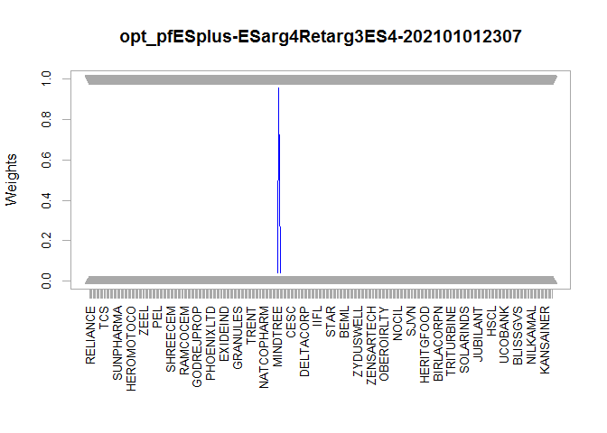

    ## [1] "Starting opt_pfESplus-ESarg3Retarg2ES1-202101012307"
    ## ***********************************
    ## PortfolioAnalytics Optimization
    ## ***********************************
    ## 
    ## Call:
    ## optimize.portfolio(R = R, portfolio = pfESplus, optimize_method = "ROI", 
    ##     trace = TRUE, momentFUN = cRebalSpec$momentFUN[cRebalSpec.ix])
    ## 
    ## Optimal Weights:
    ##   RELIANCE   HDFCBANK  ICICIBANK       HDFC        ITC   AXISBANK       SBIN 
    ##     0.0000     0.0000     0.0000     0.0000     0.0000     0.0000     0.0000 
    ##         LT BAJFINANCE       INFY BHARTIARTL        TCS        M.M  KOTAKBANK 
    ##     0.0000     0.0000     0.0791     0.0000     0.0000     0.0000     0.0000 
    ## INDUSINDBK       ONGC       NTPC TATAMOTORS  TATASTEEL     MARUTI   DIVISLAB 
    ##     0.0000     0.0000     0.0000     0.0000     0.0000     0.0000     0.0000 
    ##   HINDALCO  SUNPHARMA       VEDL HINDUNILVR    HCLTECH BAJAJFINSV  POWERGRID 
    ##     0.0000     0.0000     0.0000     0.0000     0.0000     0.0000     0.0000 
    ##       BPCL ASIANPAINT      TITAN    DRREDDY       GAIL HEROMOTOCO  COALINDIA 
    ##     0.0000     0.0000     0.0000     0.0000     0.0000     0.0000     0.0000 
    ##        IOC      TECHM ULTRACEMCO BAJAJ.AUTO ADANIPORTS     GRASIM      WIPRO 
    ##     0.0000     0.0000     0.0000     0.0000     0.0000     0.0000     0.0000 
    ##        UPL   JSWSTEEL       ZEEL     NAUKRI FEDERALBNK MOTHERSUMI  TATAPOWER 
    ##     0.0000     0.0000     0.0000     0.0106     0.0000     0.0000     0.0000 
    ##  BRITANNIA  AMBUJACEM  EICHERMOT AUROPHARMA SRTRANSFIN        BEL        PEL 
    ##     0.0000     0.0000     0.0000     0.0000     0.0000     0.0000     0.0000 
    ##   PETRONET        DLF      LUPIN     VOLTAS    HAVELLS     BIOCON        PFC 
    ##     0.0000     0.0000     0.0000     0.0000     0.0000     0.0000     0.0000 
    ##   ASHOKLEY   CHOLAFIN      CIPLA   SHREECEM     COLPAL BHARATFORG        SRF 
    ##     0.0000     0.0046     0.0000     0.0000     0.0000     0.0000     0.0000 
    ## PIDILITIND JINDALSTEL   ADANIENT     RECLTD     CONCOR    ESCORTS        ACC 
    ##     0.0064     0.0000     0.0000     0.0000     0.0000     0.0000     0.0000 
    ##   RAMCOCEM     MARICO     M.MFIN   GODREJCP  NESTLEIND  LICHSGFIN MANAPPURAM 
    ##     0.0000     0.0000     0.0000     0.0000     0.0000     0.0000     0.0000 
    ## BALKRISIND   CADILAHC      PIIND   BOSCHLTD GODREJPROP       NMDC BANKBARODA 
    ##     0.0000     0.0000     0.0000     0.0000     0.0000     0.0000     0.0000 
    ##   INDHOTEL    SIEMENS APOLLOHOSP TORNTPHARM   TVSMOTOR   JUBLFOOD CUMMINSIND 
    ##     0.0000     0.0000     0.0000     0.0000     0.0000     0.0000     0.0000 
    ##       IDEA PHOENIXLTD   GMRINFRA        MRF        IGL  BATAINDIA APOLLOTYRE 
    ##     0.0000     0.0000     0.0000     0.0000     0.0763     0.0000     0.0000 
    ## MUTHOOTFIN SUNDRMFAST     APLLTD       BHEL      L.TFH   EXIDEIND NATIONALUM 
    ##     0.0000     0.0000     0.0707     0.0000     0.0000     0.0000     0.0000 
    ##        CUB   GLENMARK AMARAJABAT        PVR SUPREMEIND NAVINFLUOR TORNTPOWER 
    ##     0.0000     0.0000     0.0000     0.0000     0.0000     0.0693     0.0000 
    ##      CANBK   DEEPAKNI   GRANULES    PAGEIND TATAMTRDVR BERGEPAINT   AARTIIND 
    ##     0.0000     0.0000     0.0000     0.0000     0.0000     0.0000     0.0000 
    ##  APLAPOLLO        PNB        UBL      DABUR  WHIRLPOOL       GSPL      TRENT 
    ##     0.0000     0.0000     0.0000     0.0000     0.0000     0.0000     0.0000 
    ##     FORTIS    DCBBANK   TATACOMM        NCC  TATAELXSI     CYIENT       IDFC 
    ##     0.0000     0.0000     0.0000     0.0000     0.0000     0.0000     0.0000 
    ##      GLAXO        OIL JMFINANCIL NATCOPHARM CANFINHOME       RAIN       ATUL 
    ##     0.0000     0.0000     0.0000     0.0000     0.0000     0.0000     0.0000 
    ## RAJESHEXPO       SAIL   SPICEJET       NHPC        MCX      SUNTV  REDINGTON 
    ##     0.0000     0.0000     0.0000     0.0000     0.0000     0.0000     0.0000 
    ##   MINDTREE   X3MINDIA      TANLA   EIDPARRY   GRAPHITE  GODREJIND  EDELWEISS 
    ##     0.0171     0.0000     0.0000     0.0000     0.0000     0.0000     0.0000 
    ##  LAXMIMACH     GESHIP   HINDZINC CASTROLIND       CESC   INDIACEM        FSL 
    ##     0.0000     0.0000     0.0000     0.0000     0.0000     0.0000     0.0000 
    ##       GNFC ABBOTINDIA ADANIPOWER  VAKRANGEE  UNIONBANK DCMSHRIRAM    WELCORP 
    ##     0.0000     0.0699     0.0000     0.0000     0.0000     0.0000     0.0000 
    ##   ALOKTEXT  DELTACORP  IBREALEST    KPRMILL        ABB  FINCABLES    CEATLTD 
    ##     0.0000     0.0000     0.0000     0.0000     0.0000     0.0000     0.0000 
    ##     VIPIND    KTKBANK     RALLIS CENTURYTEX BALRAMCHIN       IIFL       OFSS 
    ##     0.0000     0.0000     0.0000     0.0000     0.0000     0.0000     0.0000 
    ##     RELAXO        KEC AJANTPHARM   WESTLIFE TV18BRDCST  SOUTHBANK       GPPL 
    ##     0.0709     0.0000     0.0000     0.0277     0.0000     0.0000     0.0000 
    ## KALPATPOWR HINDCOPPER       STAR AARTIDRUGS SHRIRAMCIT       CERA WOCKPHARMA 
    ##     0.0000     0.0000     0.0000     0.0552     0.0000     0.0000     0.0000 
    ##  BAJAJELEC ENGINERSIN       GSFC COROMANDEL   AEGISLOG      IOLCP       BEML 
    ##     0.0000     0.0000     0.0000     0.0000     0.0000     0.0283     0.0000 
    ##        IRB      UFLEX       BASF    INDIANB  AKZOINDIA       BBTC SONATSOFTW 
    ##     0.0000     0.0000     0.0000     0.0000     0.0000     0.0000     0.0000 
    ##    SEQUENT    EIHOTEL  BAYERCROP  ZYDUSWELL  JSWENERGY WELSPUNIND     DISHTV 
    ##     0.0000     0.0000     0.0000     0.0000     0.0000     0.0000     0.0000 
    ## CARBORUNIV        HEG        PTC VINATIORGA     TIMKEN       HFCL        VTL 
    ##     0.0000     0.0000     0.0000     0.0000     0.0000     0.0000     0.0000 
    ## ZENSARTECH      SPARC     ECLERX    RAYMOND    TRIDENT     ASHOKA     RADICO 
    ##     0.0000     0.0000     0.0000     0.0000     0.0000     0.0000     0.0000 
    ## ALKYLAMINE  BANKINDIA SUDARSCHEM    IPCALAB OBEROIRLTY        FDC GODFRYPHLP 
    ##     0.1318     0.0000     0.0000     0.0000     0.0000     0.0000     0.0000 
    ##  SHILPAMED PHILIPCARB       MOIL      SOBHA       MEGH   PRESTIGE     VSTIND 
    ##     0.0000     0.0000     0.0000     0.0000     0.0000     0.0000     0.0000 
    ## MAHSCOOTER      NOCIL INOXLEISUR       GHCL TATAINVEST   NLCINDIA  JYOTHYLAB 
    ##     0.0000     0.0000     0.0000     0.0000     0.0000     0.0000     0.0000 
    ## KAJARIACER   GILLETTE  RESPONIND MOTILALOFS       KRBL       SJVN   ALLCARGO 
    ##     0.0000     0.0000     0.0000     0.0000     0.0000     0.0000     0.0000 
    ##  ORIENTREF       DCAL CHENNPETRO   SKFINDIA FINOLEXIND CENTURYPLY        SCI 
    ##     0.0000     0.0000     0.0000     0.0000     0.0000     0.0000     0.0000 
    ##        GDL GREAVESCOT HERITGFOOD SHOPERSTOP  BOMDYEING     KNRCON HAWKINCOOK 
    ##     0.0000     0.0000     0.0000     0.0000     0.0000     0.0000     0.0000 
    ##     VENKYS  JINDALSAW    JKPAPER  ESABINDIA   MAHABANK SCHAEFFLER BIRLACORPN 
    ##     0.0000     0.0000     0.0000     0.0000     0.0000     0.0000     0.0000 
    ## BALMLAWRIE       MFSL       PGHH   MINDAIND     VGUARD LINDEINDIA      JCHAC 
    ##     0.0000     0.0000     0.0839     0.0371     0.0000     0.0000     0.0000 
    ##       KSCL    LAOPALA TATACOFFEE TRITURBINE DEEPAKFERT   ASTRAZEN  JKLAKSHMI 
    ##     0.0000     0.0050     0.0000     0.0000     0.0000     0.0000     0.0000 
    ## VAIBHAVGBL   SUPRAJIT        GMM     IFBIND       IDBI   FORCEMOT    THERMAX 
    ##     0.0557     0.0000     0.0000     0.0000     0.0000     0.0000     0.0000 
    ##  SOLARINDS   BLUEDART      NESCO  JAMNAAUTO        JSL    DHANUKA TVSSRICHAK 
    ##     0.0175     0.0000     0.0000     0.0000     0.0000     0.0000     0.0000 
    ## TATAMETALI       MRPL NBVENTURES BAJAJHLDNG   JUBILANT JBCHEPHARM CHAMBLFERT 
    ##     0.0000     0.0000     0.0000     0.0000     0.0000     0.0000     0.0000 
    ##        KEI TTKPRESTIG    SUNTECK      CAPPL  NETWORK18  GUJALKALI  CENTRALBK 
    ##     0.0000     0.0000     0.0000     0.0000     0.0000     0.0000     0.0000 
    ##    J.KBANK       HSCL    GMDCLTD     PFIZER      MHRIL NAVNETEDUL        RCF 
    ##     0.0000     0.0000     0.0000     0.0000     0.0000     0.0000     0.0000 
    ##        IOB    TVTODAY  SCHNEIDER  RATNAMANI     JKTYRE    UCOBANK      GEPIL 
    ##     0.0000     0.0000     0.0000     0.0000     0.0000     0.0000     0.0000 
    ##  FCONSUMER TIMETECHNO     JAGRAN       MMTC     SANOFI        CCL SWANENERGY 
    ##     0.0000     0.0000     0.0000     0.0000     0.0000     0.0000     0.0000 
    ## JAICORPLTD     DBCORP   BLISSGVS WABCOINDIA      OMAXE    HATHWAY  MAHINDCIE 
    ##     0.0000     0.0000     0.0000     0.0000     0.0000     0.0000     0.0000 
    ##    MAHLIFE        ITI   EMAMILTD     ASTRAL   SYMPHONY     INDOCO   NILKAMAL 
    ##     0.0000     0.0000     0.0000     0.0827     0.0000     0.0000     0.0000 
    ##     SUZLON       IFCI       ITDC     CRISIL    BRIGADE BLUESTARCO MAHSEAMLES 
    ##     0.0000     0.0000     0.0000     0.0000     0.0000     0.0000     0.0000 
    ## HEIDELBERG    POLYMED  GRINDWELL  KANSAINER     AIAENG   TASTYBIT PERSISTENT 
    ##     0.0000     0.0000     0.0000     0.0000     0.0000     0.0000     0.0000 
    ##   JKCEMENT    MPHASIS     HONAUT  HINDPETRO 
    ##     0.0000     0.0000     0.0000     0.0000 
    ## 
    ## Objective Measure:
    ##     mean 
    ## 0.009028 
    ## 
    ## 
    ##      ES 
    ## 0.03268


    ## [1] "Starting opt_pfESplus-ESarg3Retarg2ES2-202101012308"
    ## ***********************************
    ## PortfolioAnalytics Optimization
    ## ***********************************
    ## 
    ## Call:
    ## optimize.portfolio(R = R, portfolio = pfESplus, optimize_method = "ROI", 
    ##     trace = TRUE, momentFUN = cRebalSpec$momentFUN[cRebalSpec.ix])
    ## 
    ## Optimal Weights:
    ##   RELIANCE   HDFCBANK  ICICIBANK       HDFC        ITC   AXISBANK       SBIN 
    ##     0.0000     0.0000     0.0000     0.0000     0.0000     0.0000     0.0000 
    ##         LT BAJFINANCE       INFY BHARTIARTL        TCS        M.M  KOTAKBANK 
    ##     0.0000     0.0000     0.0791     0.0000     0.0000     0.0000     0.0000 
    ## INDUSINDBK       ONGC       NTPC TATAMOTORS  TATASTEEL     MARUTI   DIVISLAB 
    ##     0.0000     0.0000     0.0000     0.0000     0.0000     0.0000     0.0000 
    ##   HINDALCO  SUNPHARMA       VEDL HINDUNILVR    HCLTECH BAJAJFINSV  POWERGRID 
    ##     0.0000     0.0000     0.0000     0.0000     0.0000     0.0000     0.0000 
    ##       BPCL ASIANPAINT      TITAN    DRREDDY       GAIL HEROMOTOCO  COALINDIA 
    ##     0.0000     0.0000     0.0000     0.0000     0.0000     0.0000     0.0000 
    ##        IOC      TECHM ULTRACEMCO BAJAJ.AUTO ADANIPORTS     GRASIM      WIPRO 
    ##     0.0000     0.0000     0.0000     0.0000     0.0000     0.0000     0.0000 
    ##        UPL   JSWSTEEL       ZEEL     NAUKRI FEDERALBNK MOTHERSUMI  TATAPOWER 
    ##     0.0000     0.0000     0.0000     0.0106     0.0000     0.0000     0.0000 
    ##  BRITANNIA  AMBUJACEM  EICHERMOT AUROPHARMA SRTRANSFIN        BEL        PEL 
    ##     0.0000     0.0000     0.0000     0.0000     0.0000     0.0000     0.0000 
    ##   PETRONET        DLF      LUPIN     VOLTAS    HAVELLS     BIOCON        PFC 
    ##     0.0000     0.0000     0.0000     0.0000     0.0000     0.0000     0.0000 
    ##   ASHOKLEY   CHOLAFIN      CIPLA   SHREECEM     COLPAL BHARATFORG        SRF 
    ##     0.0000     0.0046     0.0000     0.0000     0.0000     0.0000     0.0000 
    ## PIDILITIND JINDALSTEL   ADANIENT     RECLTD     CONCOR    ESCORTS        ACC 
    ##     0.0064     0.0000     0.0000     0.0000     0.0000     0.0000     0.0000 
    ##   RAMCOCEM     MARICO     M.MFIN   GODREJCP  NESTLEIND  LICHSGFIN MANAPPURAM 
    ##     0.0000     0.0000     0.0000     0.0000     0.0000     0.0000     0.0000 
    ## BALKRISIND   CADILAHC      PIIND   BOSCHLTD GODREJPROP       NMDC BANKBARODA 
    ##     0.0000     0.0000     0.0000     0.0000     0.0000     0.0000     0.0000 
    ##   INDHOTEL    SIEMENS APOLLOHOSP TORNTPHARM   TVSMOTOR   JUBLFOOD CUMMINSIND 
    ##     0.0000     0.0000     0.0000     0.0000     0.0000     0.0000     0.0000 
    ##       IDEA PHOENIXLTD   GMRINFRA        MRF        IGL  BATAINDIA APOLLOTYRE 
    ##     0.0000     0.0000     0.0000     0.0000     0.0763     0.0000     0.0000 
    ## MUTHOOTFIN SUNDRMFAST     APLLTD       BHEL      L.TFH   EXIDEIND NATIONALUM 
    ##     0.0000     0.0000     0.0707     0.0000     0.0000     0.0000     0.0000 
    ##        CUB   GLENMARK AMARAJABAT        PVR SUPREMEIND NAVINFLUOR TORNTPOWER 
    ##     0.0000     0.0000     0.0000     0.0000     0.0000     0.0693     0.0000 
    ##      CANBK   DEEPAKNI   GRANULES    PAGEIND TATAMTRDVR BERGEPAINT   AARTIIND 
    ##     0.0000     0.0000     0.0000     0.0000     0.0000     0.0000     0.0000 
    ##  APLAPOLLO        PNB        UBL      DABUR  WHIRLPOOL       GSPL      TRENT 
    ##     0.0000     0.0000     0.0000     0.0000     0.0000     0.0000     0.0000 
    ##     FORTIS    DCBBANK   TATACOMM        NCC  TATAELXSI     CYIENT       IDFC 
    ##     0.0000     0.0000     0.0000     0.0000     0.0000     0.0000     0.0000 
    ##      GLAXO        OIL JMFINANCIL NATCOPHARM CANFINHOME       RAIN       ATUL 
    ##     0.0000     0.0000     0.0000     0.0000     0.0000     0.0000     0.0000 
    ## RAJESHEXPO       SAIL   SPICEJET       NHPC        MCX      SUNTV  REDINGTON 
    ##     0.0000     0.0000     0.0000     0.0000     0.0000     0.0000     0.0000 
    ##   MINDTREE   X3MINDIA      TANLA   EIDPARRY   GRAPHITE  GODREJIND  EDELWEISS 
    ##     0.0171     0.0000     0.0000     0.0000     0.0000     0.0000     0.0000 
    ##  LAXMIMACH     GESHIP   HINDZINC CASTROLIND       CESC   INDIACEM        FSL 
    ##     0.0000     0.0000     0.0000     0.0000     0.0000     0.0000     0.0000 
    ##       GNFC ABBOTINDIA ADANIPOWER  VAKRANGEE  UNIONBANK DCMSHRIRAM    WELCORP 
    ##     0.0000     0.0699     0.0000     0.0000     0.0000     0.0000     0.0000 
    ##   ALOKTEXT  DELTACORP  IBREALEST    KPRMILL        ABB  FINCABLES    CEATLTD 
    ##     0.0000     0.0000     0.0000     0.0000     0.0000     0.0000     0.0000 
    ##     VIPIND    KTKBANK     RALLIS CENTURYTEX BALRAMCHIN       IIFL       OFSS 
    ##     0.0000     0.0000     0.0000     0.0000     0.0000     0.0000     0.0000 
    ##     RELAXO        KEC AJANTPHARM   WESTLIFE TV18BRDCST  SOUTHBANK       GPPL 
    ##     0.0709     0.0000     0.0000     0.0277     0.0000     0.0000     0.0000 
    ## KALPATPOWR HINDCOPPER       STAR AARTIDRUGS SHRIRAMCIT       CERA WOCKPHARMA 
    ##     0.0000     0.0000     0.0000     0.0552     0.0000     0.0000     0.0000 
    ##  BAJAJELEC ENGINERSIN       GSFC COROMANDEL   AEGISLOG      IOLCP       BEML 
    ##     0.0000     0.0000     0.0000     0.0000     0.0000     0.0283     0.0000 
    ##        IRB      UFLEX       BASF    INDIANB  AKZOINDIA       BBTC SONATSOFTW 
    ##     0.0000     0.0000     0.0000     0.0000     0.0000     0.0000     0.0000 
    ##    SEQUENT    EIHOTEL  BAYERCROP  ZYDUSWELL  JSWENERGY WELSPUNIND     DISHTV 
    ##     0.0000     0.0000     0.0000     0.0000     0.0000     0.0000     0.0000 
    ## CARBORUNIV        HEG        PTC VINATIORGA     TIMKEN       HFCL        VTL 
    ##     0.0000     0.0000     0.0000     0.0000     0.0000     0.0000     0.0000 
    ## ZENSARTECH      SPARC     ECLERX    RAYMOND    TRIDENT     ASHOKA     RADICO 
    ##     0.0000     0.0000     0.0000     0.0000     0.0000     0.0000     0.0000 
    ## ALKYLAMINE  BANKINDIA SUDARSCHEM    IPCALAB OBEROIRLTY        FDC GODFRYPHLP 
    ##     0.1318     0.0000     0.0000     0.0000     0.0000     0.0000     0.0000 
    ##  SHILPAMED PHILIPCARB       MOIL      SOBHA       MEGH   PRESTIGE     VSTIND 
    ##     0.0000     0.0000     0.0000     0.0000     0.0000     0.0000     0.0000 
    ## MAHSCOOTER      NOCIL INOXLEISUR       GHCL TATAINVEST   NLCINDIA  JYOTHYLAB 
    ##     0.0000     0.0000     0.0000     0.0000     0.0000     0.0000     0.0000 
    ## KAJARIACER   GILLETTE  RESPONIND MOTILALOFS       KRBL       SJVN   ALLCARGO 
    ##     0.0000     0.0000     0.0000     0.0000     0.0000     0.0000     0.0000 
    ##  ORIENTREF       DCAL CHENNPETRO   SKFINDIA FINOLEXIND CENTURYPLY        SCI 
    ##     0.0000     0.0000     0.0000     0.0000     0.0000     0.0000     0.0000 
    ##        GDL GREAVESCOT HERITGFOOD SHOPERSTOP  BOMDYEING     KNRCON HAWKINCOOK 
    ##     0.0000     0.0000     0.0000     0.0000     0.0000     0.0000     0.0000 
    ##     VENKYS  JINDALSAW    JKPAPER  ESABINDIA   MAHABANK SCHAEFFLER BIRLACORPN 
    ##     0.0000     0.0000     0.0000     0.0000     0.0000     0.0000     0.0000 
    ## BALMLAWRIE       MFSL       PGHH   MINDAIND     VGUARD LINDEINDIA      JCHAC 
    ##     0.0000     0.0000     0.0839     0.0371     0.0000     0.0000     0.0000 
    ##       KSCL    LAOPALA TATACOFFEE TRITURBINE DEEPAKFERT   ASTRAZEN  JKLAKSHMI 
    ##     0.0000     0.0050     0.0000     0.0000     0.0000     0.0000     0.0000 
    ## VAIBHAVGBL   SUPRAJIT        GMM     IFBIND       IDBI   FORCEMOT    THERMAX 
    ##     0.0557     0.0000     0.0000     0.0000     0.0000     0.0000     0.0000 
    ##  SOLARINDS   BLUEDART      NESCO  JAMNAAUTO        JSL    DHANUKA TVSSRICHAK 
    ##     0.0175     0.0000     0.0000     0.0000     0.0000     0.0000     0.0000 
    ## TATAMETALI       MRPL NBVENTURES BAJAJHLDNG   JUBILANT JBCHEPHARM CHAMBLFERT 
    ##     0.0000     0.0000     0.0000     0.0000     0.0000     0.0000     0.0000 
    ##        KEI TTKPRESTIG    SUNTECK      CAPPL  NETWORK18  GUJALKALI  CENTRALBK 
    ##     0.0000     0.0000     0.0000     0.0000     0.0000     0.0000     0.0000 
    ##    J.KBANK       HSCL    GMDCLTD     PFIZER      MHRIL NAVNETEDUL        RCF 
    ##     0.0000     0.0000     0.0000     0.0000     0.0000     0.0000     0.0000 
    ##        IOB    TVTODAY  SCHNEIDER  RATNAMANI     JKTYRE    UCOBANK      GEPIL 
    ##     0.0000     0.0000     0.0000     0.0000     0.0000     0.0000     0.0000 
    ##  FCONSUMER TIMETECHNO     JAGRAN       MMTC     SANOFI        CCL SWANENERGY 
    ##     0.0000     0.0000     0.0000     0.0000     0.0000     0.0000     0.0000 
    ## JAICORPLTD     DBCORP   BLISSGVS WABCOINDIA      OMAXE    HATHWAY  MAHINDCIE 
    ##     0.0000     0.0000     0.0000     0.0000     0.0000     0.0000     0.0000 
    ##    MAHLIFE        ITI   EMAMILTD     ASTRAL   SYMPHONY     INDOCO   NILKAMAL 
    ##     0.0000     0.0000     0.0000     0.0827     0.0000     0.0000     0.0000 
    ##     SUZLON       IFCI       ITDC     CRISIL    BRIGADE BLUESTARCO MAHSEAMLES 
    ##     0.0000     0.0000     0.0000     0.0000     0.0000     0.0000     0.0000 
    ## HEIDELBERG    POLYMED  GRINDWELL  KANSAINER     AIAENG   TASTYBIT PERSISTENT 
    ##     0.0000     0.0000     0.0000     0.0000     0.0000     0.0000     0.0000 
    ##   JKCEMENT    MPHASIS     HONAUT  HINDPETRO 
    ##     0.0000     0.0000     0.0000     0.0000 
    ## 
    ## Objective Measure:
    ##     mean 
    ## 0.009028 
    ## 
    ## 
    ##      ES 
    ## 0.03268


    ## [1] "Starting opt_pfESplus-ESarg3Retarg2ES3-202101012308"
    ## ***********************************
    ## PortfolioAnalytics Optimization
    ## ***********************************
    ## 
    ## Call:
    ## optimize.portfolio(R = R, portfolio = pfESplus, optimize_method = "ROI", 
    ##     trace = TRUE, momentFUN = cRebalSpec$momentFUN[cRebalSpec.ix])
    ## 
    ## Optimal Weights:
    ##   RELIANCE   HDFCBANK  ICICIBANK       HDFC        ITC   AXISBANK       SBIN 
    ##     0.0000     0.0000     0.0000     0.0000     0.0000     0.0000     0.0000 
    ##         LT BAJFINANCE       INFY BHARTIARTL        TCS        M.M  KOTAKBANK 
    ##     0.0000     0.0000     0.0791     0.0000     0.0000     0.0000     0.0000 
    ## INDUSINDBK       ONGC       NTPC TATAMOTORS  TATASTEEL     MARUTI   DIVISLAB 
    ##     0.0000     0.0000     0.0000     0.0000     0.0000     0.0000     0.0000 
    ##   HINDALCO  SUNPHARMA       VEDL HINDUNILVR    HCLTECH BAJAJFINSV  POWERGRID 
    ##     0.0000     0.0000     0.0000     0.0000     0.0000     0.0000     0.0000 
    ##       BPCL ASIANPAINT      TITAN    DRREDDY       GAIL HEROMOTOCO  COALINDIA 
    ##     0.0000     0.0000     0.0000     0.0000     0.0000     0.0000     0.0000 
    ##        IOC      TECHM ULTRACEMCO BAJAJ.AUTO ADANIPORTS     GRASIM      WIPRO 
    ##     0.0000     0.0000     0.0000     0.0000     0.0000     0.0000     0.0000 
    ##        UPL   JSWSTEEL       ZEEL     NAUKRI FEDERALBNK MOTHERSUMI  TATAPOWER 
    ##     0.0000     0.0000     0.0000     0.0106     0.0000     0.0000     0.0000 
    ##  BRITANNIA  AMBUJACEM  EICHERMOT AUROPHARMA SRTRANSFIN        BEL        PEL 
    ##     0.0000     0.0000     0.0000     0.0000     0.0000     0.0000     0.0000 
    ##   PETRONET        DLF      LUPIN     VOLTAS    HAVELLS     BIOCON        PFC 
    ##     0.0000     0.0000     0.0000     0.0000     0.0000     0.0000     0.0000 
    ##   ASHOKLEY   CHOLAFIN      CIPLA   SHREECEM     COLPAL BHARATFORG        SRF 
    ##     0.0000     0.0046     0.0000     0.0000     0.0000     0.0000     0.0000 
    ## PIDILITIND JINDALSTEL   ADANIENT     RECLTD     CONCOR    ESCORTS        ACC 
    ##     0.0064     0.0000     0.0000     0.0000     0.0000     0.0000     0.0000 
    ##   RAMCOCEM     MARICO     M.MFIN   GODREJCP  NESTLEIND  LICHSGFIN MANAPPURAM 
    ##     0.0000     0.0000     0.0000     0.0000     0.0000     0.0000     0.0000 
    ## BALKRISIND   CADILAHC      PIIND   BOSCHLTD GODREJPROP       NMDC BANKBARODA 
    ##     0.0000     0.0000     0.0000     0.0000     0.0000     0.0000     0.0000 
    ##   INDHOTEL    SIEMENS APOLLOHOSP TORNTPHARM   TVSMOTOR   JUBLFOOD CUMMINSIND 
    ##     0.0000     0.0000     0.0000     0.0000     0.0000     0.0000     0.0000 
    ##       IDEA PHOENIXLTD   GMRINFRA        MRF        IGL  BATAINDIA APOLLOTYRE 
    ##     0.0000     0.0000     0.0000     0.0000     0.0763     0.0000     0.0000 
    ## MUTHOOTFIN SUNDRMFAST     APLLTD       BHEL      L.TFH   EXIDEIND NATIONALUM 
    ##     0.0000     0.0000     0.0707     0.0000     0.0000     0.0000     0.0000 
    ##        CUB   GLENMARK AMARAJABAT        PVR SUPREMEIND NAVINFLUOR TORNTPOWER 
    ##     0.0000     0.0000     0.0000     0.0000     0.0000     0.0693     0.0000 
    ##      CANBK   DEEPAKNI   GRANULES    PAGEIND TATAMTRDVR BERGEPAINT   AARTIIND 
    ##     0.0000     0.0000     0.0000     0.0000     0.0000     0.0000     0.0000 
    ##  APLAPOLLO        PNB        UBL      DABUR  WHIRLPOOL       GSPL      TRENT 
    ##     0.0000     0.0000     0.0000     0.0000     0.0000     0.0000     0.0000 
    ##     FORTIS    DCBBANK   TATACOMM        NCC  TATAELXSI     CYIENT       IDFC 
    ##     0.0000     0.0000     0.0000     0.0000     0.0000     0.0000     0.0000 
    ##      GLAXO        OIL JMFINANCIL NATCOPHARM CANFINHOME       RAIN       ATUL 
    ##     0.0000     0.0000     0.0000     0.0000     0.0000     0.0000     0.0000 
    ## RAJESHEXPO       SAIL   SPICEJET       NHPC        MCX      SUNTV  REDINGTON 
    ##     0.0000     0.0000     0.0000     0.0000     0.0000     0.0000     0.0000 
    ##   MINDTREE   X3MINDIA      TANLA   EIDPARRY   GRAPHITE  GODREJIND  EDELWEISS 
    ##     0.0171     0.0000     0.0000     0.0000     0.0000     0.0000     0.0000 
    ##  LAXMIMACH     GESHIP   HINDZINC CASTROLIND       CESC   INDIACEM        FSL 
    ##     0.0000     0.0000     0.0000     0.0000     0.0000     0.0000     0.0000 
    ##       GNFC ABBOTINDIA ADANIPOWER  VAKRANGEE  UNIONBANK DCMSHRIRAM    WELCORP 
    ##     0.0000     0.0699     0.0000     0.0000     0.0000     0.0000     0.0000 
    ##   ALOKTEXT  DELTACORP  IBREALEST    KPRMILL        ABB  FINCABLES    CEATLTD 
    ##     0.0000     0.0000     0.0000     0.0000     0.0000     0.0000     0.0000 
    ##     VIPIND    KTKBANK     RALLIS CENTURYTEX BALRAMCHIN       IIFL       OFSS 
    ##     0.0000     0.0000     0.0000     0.0000     0.0000     0.0000     0.0000 
    ##     RELAXO        KEC AJANTPHARM   WESTLIFE TV18BRDCST  SOUTHBANK       GPPL 
    ##     0.0709     0.0000     0.0000     0.0277     0.0000     0.0000     0.0000 
    ## KALPATPOWR HINDCOPPER       STAR AARTIDRUGS SHRIRAMCIT       CERA WOCKPHARMA 
    ##     0.0000     0.0000     0.0000     0.0552     0.0000     0.0000     0.0000 
    ##  BAJAJELEC ENGINERSIN       GSFC COROMANDEL   AEGISLOG      IOLCP       BEML 
    ##     0.0000     0.0000     0.0000     0.0000     0.0000     0.0283     0.0000 
    ##        IRB      UFLEX       BASF    INDIANB  AKZOINDIA       BBTC SONATSOFTW 
    ##     0.0000     0.0000     0.0000     0.0000     0.0000     0.0000     0.0000 
    ##    SEQUENT    EIHOTEL  BAYERCROP  ZYDUSWELL  JSWENERGY WELSPUNIND     DISHTV 
    ##     0.0000     0.0000     0.0000     0.0000     0.0000     0.0000     0.0000 
    ## CARBORUNIV        HEG        PTC VINATIORGA     TIMKEN       HFCL        VTL 
    ##     0.0000     0.0000     0.0000     0.0000     0.0000     0.0000     0.0000 
    ## ZENSARTECH      SPARC     ECLERX    RAYMOND    TRIDENT     ASHOKA     RADICO 
    ##     0.0000     0.0000     0.0000     0.0000     0.0000     0.0000     0.0000 
    ## ALKYLAMINE  BANKINDIA SUDARSCHEM    IPCALAB OBEROIRLTY        FDC GODFRYPHLP 
    ##     0.1318     0.0000     0.0000     0.0000     0.0000     0.0000     0.0000 
    ##  SHILPAMED PHILIPCARB       MOIL      SOBHA       MEGH   PRESTIGE     VSTIND 
    ##     0.0000     0.0000     0.0000     0.0000     0.0000     0.0000     0.0000 
    ## MAHSCOOTER      NOCIL INOXLEISUR       GHCL TATAINVEST   NLCINDIA  JYOTHYLAB 
    ##     0.0000     0.0000     0.0000     0.0000     0.0000     0.0000     0.0000 
    ## KAJARIACER   GILLETTE  RESPONIND MOTILALOFS       KRBL       SJVN   ALLCARGO 
    ##     0.0000     0.0000     0.0000     0.0000     0.0000     0.0000     0.0000 
    ##  ORIENTREF       DCAL CHENNPETRO   SKFINDIA FINOLEXIND CENTURYPLY        SCI 
    ##     0.0000     0.0000     0.0000     0.0000     0.0000     0.0000     0.0000 
    ##        GDL GREAVESCOT HERITGFOOD SHOPERSTOP  BOMDYEING     KNRCON HAWKINCOOK 
    ##     0.0000     0.0000     0.0000     0.0000     0.0000     0.0000     0.0000 
    ##     VENKYS  JINDALSAW    JKPAPER  ESABINDIA   MAHABANK SCHAEFFLER BIRLACORPN 
    ##     0.0000     0.0000     0.0000     0.0000     0.0000     0.0000     0.0000 
    ## BALMLAWRIE       MFSL       PGHH   MINDAIND     VGUARD LINDEINDIA      JCHAC 
    ##     0.0000     0.0000     0.0839     0.0371     0.0000     0.0000     0.0000 
    ##       KSCL    LAOPALA TATACOFFEE TRITURBINE DEEPAKFERT   ASTRAZEN  JKLAKSHMI 
    ##     0.0000     0.0050     0.0000     0.0000     0.0000     0.0000     0.0000 
    ## VAIBHAVGBL   SUPRAJIT        GMM     IFBIND       IDBI   FORCEMOT    THERMAX 
    ##     0.0557     0.0000     0.0000     0.0000     0.0000     0.0000     0.0000 
    ##  SOLARINDS   BLUEDART      NESCO  JAMNAAUTO        JSL    DHANUKA TVSSRICHAK 
    ##     0.0175     0.0000     0.0000     0.0000     0.0000     0.0000     0.0000 
    ## TATAMETALI       MRPL NBVENTURES BAJAJHLDNG   JUBILANT JBCHEPHARM CHAMBLFERT 
    ##     0.0000     0.0000     0.0000     0.0000     0.0000     0.0000     0.0000 
    ##        KEI TTKPRESTIG    SUNTECK      CAPPL  NETWORK18  GUJALKALI  CENTRALBK 
    ##     0.0000     0.0000     0.0000     0.0000     0.0000     0.0000     0.0000 
    ##    J.KBANK       HSCL    GMDCLTD     PFIZER      MHRIL NAVNETEDUL        RCF 
    ##     0.0000     0.0000     0.0000     0.0000     0.0000     0.0000     0.0000 
    ##        IOB    TVTODAY  SCHNEIDER  RATNAMANI     JKTYRE    UCOBANK      GEPIL 
    ##     0.0000     0.0000     0.0000     0.0000     0.0000     0.0000     0.0000 
    ##  FCONSUMER TIMETECHNO     JAGRAN       MMTC     SANOFI        CCL SWANENERGY 
    ##     0.0000     0.0000     0.0000     0.0000     0.0000     0.0000     0.0000 
    ## JAICORPLTD     DBCORP   BLISSGVS WABCOINDIA      OMAXE    HATHWAY  MAHINDCIE 
    ##     0.0000     0.0000     0.0000     0.0000     0.0000     0.0000     0.0000 
    ##    MAHLIFE        ITI   EMAMILTD     ASTRAL   SYMPHONY     INDOCO   NILKAMAL 
    ##     0.0000     0.0000     0.0000     0.0827     0.0000     0.0000     0.0000 
    ##     SUZLON       IFCI       ITDC     CRISIL    BRIGADE BLUESTARCO MAHSEAMLES 
    ##     0.0000     0.0000     0.0000     0.0000     0.0000     0.0000     0.0000 
    ## HEIDELBERG    POLYMED  GRINDWELL  KANSAINER     AIAENG   TASTYBIT PERSISTENT 
    ##     0.0000     0.0000     0.0000     0.0000     0.0000     0.0000     0.0000 
    ##   JKCEMENT    MPHASIS     HONAUT  HINDPETRO 
    ##     0.0000     0.0000     0.0000     0.0000 
    ## 
    ## Objective Measure:
    ##     mean 
    ## 0.009028 
    ## 
    ## 
    ##      ES 
    ## 0.03268


    ## [1] "Starting opt_pfESplus-ESarg3Retarg2ES4-202101012308"
    ## ***********************************
    ## PortfolioAnalytics Optimization
    ## ***********************************
    ## 
    ## Call:
    ## optimize.portfolio(R = R, portfolio = pfESplus, optimize_method = "ROI", 
    ##     trace = TRUE, momentFUN = cRebalSpec$momentFUN[cRebalSpec.ix])
    ## 
    ## Optimal Weights:
    ##   RELIANCE   HDFCBANK  ICICIBANK       HDFC        ITC   AXISBANK       SBIN 
    ##     0.0000     0.0000     0.0000     0.0000     0.0000     0.0000     0.0000 
    ##         LT BAJFINANCE       INFY BHARTIARTL        TCS        M.M  KOTAKBANK 
    ##     0.0000     0.0000     0.0000     0.0000     0.0000     0.0000     0.0000 
    ## INDUSINDBK       ONGC       NTPC TATAMOTORS  TATASTEEL     MARUTI   DIVISLAB 
    ##     0.0000     0.0000     0.0000     0.0000     0.0000     0.0000     0.0000 
    ##   HINDALCO  SUNPHARMA       VEDL HINDUNILVR    HCLTECH BAJAJFINSV  POWERGRID 
    ##     0.0000     0.0000     0.0000     0.0000     0.0000     0.0000     0.0000 
    ##       BPCL ASIANPAINT      TITAN    DRREDDY       GAIL HEROMOTOCO  COALINDIA 
    ##     0.0000     0.0000     0.0000     0.0000     0.0000     0.0000     0.0000 
    ##        IOC      TECHM ULTRACEMCO BAJAJ.AUTO ADANIPORTS     GRASIM      WIPRO 
    ##     0.0000     0.0000     0.0000     0.0000     0.0000     0.0000     0.0000 
    ##        UPL   JSWSTEEL       ZEEL     NAUKRI FEDERALBNK MOTHERSUMI  TATAPOWER 
    ##     0.0000     0.0000     0.0000     0.0000     0.0000     0.0000     0.0000 
    ##  BRITANNIA  AMBUJACEM  EICHERMOT AUROPHARMA SRTRANSFIN        BEL        PEL 
    ##     0.0000     0.0000     0.0000     0.0000     0.0000     0.0000     0.0000 
    ##   PETRONET        DLF      LUPIN     VOLTAS    HAVELLS     BIOCON        PFC 
    ##     0.0000     0.0000     0.0000     0.0000     0.0000     0.0000     0.0000 
    ##   ASHOKLEY   CHOLAFIN      CIPLA   SHREECEM     COLPAL BHARATFORG        SRF 
    ##     0.0000     0.0000     0.0000     0.0000     0.0000     0.0000     0.0000 
    ## PIDILITIND JINDALSTEL   ADANIENT     RECLTD     CONCOR    ESCORTS        ACC 
    ##     0.0000     0.0000     0.0000     0.0000     0.0000     0.0000     0.0000 
    ##   RAMCOCEM     MARICO     M.MFIN   GODREJCP  NESTLEIND  LICHSGFIN MANAPPURAM 
    ##     0.0000     0.0000     0.0000     0.0000     0.0000     0.0000     0.0000 
    ## BALKRISIND   CADILAHC      PIIND   BOSCHLTD GODREJPROP       NMDC BANKBARODA 
    ##     0.0000     0.0000     0.0000     0.0000     0.0000     0.0000     0.0000 
    ##   INDHOTEL    SIEMENS APOLLOHOSP TORNTPHARM   TVSMOTOR   JUBLFOOD CUMMINSIND 
    ##     0.0000     0.0000     0.0000     0.0000     0.0000     0.0000     0.0000 
    ##       IDEA PHOENIXLTD   GMRINFRA        MRF        IGL  BATAINDIA APOLLOTYRE 
    ##     0.0000     0.0000     0.0000     0.0000     0.0000     0.0000     0.0000 
    ## MUTHOOTFIN SUNDRMFAST     APLLTD       BHEL      L.TFH   EXIDEIND NATIONALUM 
    ##     0.0000     0.0000     0.0000     0.0000     0.0000     0.0000     0.0000 
    ##        CUB   GLENMARK AMARAJABAT        PVR SUPREMEIND NAVINFLUOR TORNTPOWER 
    ##     0.0000     0.0000     0.0000     0.0000     0.0000     0.0000     0.0000 
    ##      CANBK   DEEPAKNI   GRANULES    PAGEIND TATAMTRDVR BERGEPAINT   AARTIIND 
    ##     0.0000     0.0000     0.0000     0.0000     0.0000     0.0000     0.0000 
    ##  APLAPOLLO        PNB        UBL      DABUR  WHIRLPOOL       GSPL      TRENT 
    ##     0.0000     0.0000     0.0000     0.0000     0.0000     0.0000     0.0000 
    ##     FORTIS    DCBBANK   TATACOMM        NCC  TATAELXSI     CYIENT       IDFC 
    ##     0.0000     0.0000     0.0000     0.0000     0.0000     0.0000     0.0000 
    ##      GLAXO        OIL JMFINANCIL NATCOPHARM CANFINHOME       RAIN       ATUL 
    ##     0.0000     0.0000     0.0000     0.0000     0.0000     0.0000     0.0000 
    ## RAJESHEXPO       SAIL   SPICEJET       NHPC        MCX      SUNTV  REDINGTON 
    ##     0.0000     0.0000     0.0000     0.0000     0.0000     0.0000     0.0000 
    ##   MINDTREE   X3MINDIA      TANLA   EIDPARRY   GRAPHITE  GODREJIND  EDELWEISS 
    ##     0.0000     0.0000     0.5053     0.0000     0.0000     0.0000     0.0000 
    ##  LAXMIMACH     GESHIP   HINDZINC CASTROLIND       CESC   INDIACEM        FSL 
    ##     0.0000     0.0000     0.0000     0.0000     0.0000     0.0000     0.0000 
    ##       GNFC ABBOTINDIA ADANIPOWER  VAKRANGEE  UNIONBANK DCMSHRIRAM    WELCORP 
    ##     0.0000     0.0000     0.0000     0.0000     0.0000     0.0000     0.0000 
    ##   ALOKTEXT  DELTACORP  IBREALEST    KPRMILL        ABB  FINCABLES    CEATLTD 
    ##     0.0000     0.0000     0.0000     0.0000     0.0000     0.0000     0.0000 
    ##     VIPIND    KTKBANK     RALLIS CENTURYTEX BALRAMCHIN       IIFL       OFSS 
    ##     0.0000     0.0000     0.0000     0.0000     0.0000     0.0000     0.0000 
    ##     RELAXO        KEC AJANTPHARM   WESTLIFE TV18BRDCST  SOUTHBANK       GPPL 
    ##     0.0000     0.0000     0.0000     0.0000     0.0000     0.0000     0.0000 
    ## KALPATPOWR HINDCOPPER       STAR AARTIDRUGS SHRIRAMCIT       CERA WOCKPHARMA 
    ##     0.0000     0.0000     0.0000     0.0000     0.0000     0.0000     0.0000 
    ##  BAJAJELEC ENGINERSIN       GSFC COROMANDEL   AEGISLOG      IOLCP       BEML 
    ##     0.0000     0.0000     0.0000     0.0000     0.0000     0.0000     0.0000 
    ##        IRB      UFLEX       BASF    INDIANB  AKZOINDIA       BBTC SONATSOFTW 
    ##     0.0000     0.0000     0.0000     0.0000     0.0000     0.0000     0.0000 
    ##    SEQUENT    EIHOTEL  BAYERCROP  ZYDUSWELL  JSWENERGY WELSPUNIND     DISHTV 
    ##     0.0000     0.0000     0.0000     0.0000     0.0000     0.0000     0.0000 
    ## CARBORUNIV        HEG        PTC VINATIORGA     TIMKEN       HFCL        VTL 
    ##     0.0000     0.0000     0.0000     0.0000     0.0000     0.0000     0.0000 
    ## ZENSARTECH      SPARC     ECLERX    RAYMOND    TRIDENT     ASHOKA     RADICO 
    ##     0.0000     0.0000     0.0000     0.0000     0.0000     0.0000     0.0000 
    ## ALKYLAMINE  BANKINDIA SUDARSCHEM    IPCALAB OBEROIRLTY        FDC GODFRYPHLP 
    ##     0.0000     0.0000     0.0000     0.0000     0.0000     0.0000     0.0000 
    ##  SHILPAMED PHILIPCARB       MOIL      SOBHA       MEGH   PRESTIGE     VSTIND 
    ##     0.0000     0.0000     0.0000     0.0000     0.0000     0.0000     0.0000 
    ## MAHSCOOTER      NOCIL INOXLEISUR       GHCL TATAINVEST   NLCINDIA  JYOTHYLAB 
    ##     0.0000     0.0000     0.0000     0.0000     0.0000     0.0000     0.0000 
    ## KAJARIACER   GILLETTE  RESPONIND MOTILALOFS       KRBL       SJVN   ALLCARGO 
    ##     0.0000     0.0000     0.0000     0.0000     0.0000     0.0000     0.0000 
    ##  ORIENTREF       DCAL CHENNPETRO   SKFINDIA FINOLEXIND CENTURYPLY        SCI 
    ##     0.0000     0.0000     0.0000     0.0000     0.0000     0.0000     0.0000 
    ##        GDL GREAVESCOT HERITGFOOD SHOPERSTOP  BOMDYEING     KNRCON HAWKINCOOK 
    ##     0.0000     0.0000     0.0000     0.0000     0.0000     0.0000     0.0000 
    ##     VENKYS  JINDALSAW    JKPAPER  ESABINDIA   MAHABANK SCHAEFFLER BIRLACORPN 
    ##     0.0000     0.0000     0.0000     0.0000     0.0000     0.0000     0.0000 
    ## BALMLAWRIE       MFSL       PGHH   MINDAIND     VGUARD LINDEINDIA      JCHAC 
    ##     0.0000     0.0000     0.0000     0.0000     0.0000     0.0000     0.0000 
    ##       KSCL    LAOPALA TATACOFFEE TRITURBINE DEEPAKFERT   ASTRAZEN  JKLAKSHMI 
    ##     0.0000     0.0000     0.0000     0.0000     0.0000     0.0000     0.0000 
    ## VAIBHAVGBL   SUPRAJIT        GMM     IFBIND       IDBI   FORCEMOT    THERMAX 
    ##     0.0000     0.0000     0.0000     0.0000     0.0000     0.0000     0.0000 
    ##  SOLARINDS   BLUEDART      NESCO  JAMNAAUTO        JSL    DHANUKA TVSSRICHAK 
    ##     0.0000     0.0000     0.0000     0.0000     0.0000     0.0000     0.0000 
    ## TATAMETALI       MRPL NBVENTURES BAJAJHLDNG   JUBILANT JBCHEPHARM CHAMBLFERT 
    ##     0.0000     0.0000     0.0000     0.0000     0.0000     0.0000     0.0000 
    ##        KEI TTKPRESTIG    SUNTECK      CAPPL  NETWORK18  GUJALKALI  CENTRALBK 
    ##     0.0000     0.0000     0.0000     0.0000     0.0000     0.0000     0.0000 
    ##    J.KBANK       HSCL    GMDCLTD     PFIZER      MHRIL NAVNETEDUL        RCF 
    ##     0.0000     0.0000     0.0000     0.0000     0.0000     0.0000     0.0000 
    ##        IOB    TVTODAY  SCHNEIDER  RATNAMANI     JKTYRE    UCOBANK      GEPIL 
    ##     0.0000     0.0000     0.0000     0.0000     0.0000     0.0000     0.0000 
    ##  FCONSUMER TIMETECHNO     JAGRAN       MMTC     SANOFI        CCL SWANENERGY 
    ##     0.0000     0.0000     0.0000     0.4947     0.0000     0.0000     0.0000 
    ## JAICORPLTD     DBCORP   BLISSGVS WABCOINDIA      OMAXE    HATHWAY  MAHINDCIE 
    ##     0.0000     0.0000     0.0000     0.0000     0.0000     0.0000     0.0000 
    ##    MAHLIFE        ITI   EMAMILTD     ASTRAL   SYMPHONY     INDOCO   NILKAMAL 
    ##     0.0000     0.0000     0.0000     0.0000     0.0000     0.0000     0.0000 
    ##     SUZLON       IFCI       ITDC     CRISIL    BRIGADE BLUESTARCO MAHSEAMLES 
    ##     0.0000     0.0000     0.0000     0.0000     0.0000     0.0000     0.0000 
    ## HEIDELBERG    POLYMED  GRINDWELL  KANSAINER     AIAENG   TASTYBIT PERSISTENT 
    ##     0.0000     0.0000     0.0000     0.0000     0.0000     0.0000     0.0000 
    ##   JKCEMENT    MPHASIS     HONAUT  HINDPETRO 
    ##     0.0000     0.0000     0.0000     0.0000 
    ## 
    ## Objective Measure:
    ##     mean 
    ## 0.005931


    ## [1] "Starting opt_pfESplus-ESarg3Retarg3ES1-202101012308"
    ## ***********************************
    ## PortfolioAnalytics Optimization
    ## ***********************************
    ## 
    ## Call:
    ## optimize.portfolio(R = R, portfolio = pfESplus, optimize_method = "ROI", 
    ##     trace = TRUE, momentFUN = cRebalSpec$momentFUN[cRebalSpec.ix])
    ## 
    ## Optimal Weights:
    ##   RELIANCE   HDFCBANK  ICICIBANK       HDFC        ITC   AXISBANK       SBIN 
    ##     0.0000     0.0000     0.0000     0.0000     0.0000     0.0000     0.0000 
    ##         LT BAJFINANCE       INFY BHARTIARTL        TCS        M.M  KOTAKBANK 
    ##     0.0000     0.0000     0.0791     0.0000     0.0000     0.0000     0.0000 
    ## INDUSINDBK       ONGC       NTPC TATAMOTORS  TATASTEEL     MARUTI   DIVISLAB 
    ##     0.0000     0.0000     0.0000     0.0000     0.0000     0.0000     0.0000 
    ##   HINDALCO  SUNPHARMA       VEDL HINDUNILVR    HCLTECH BAJAJFINSV  POWERGRID 
    ##     0.0000     0.0000     0.0000     0.0000     0.0000     0.0000     0.0000 
    ##       BPCL ASIANPAINT      TITAN    DRREDDY       GAIL HEROMOTOCO  COALINDIA 
    ##     0.0000     0.0000     0.0000     0.0000     0.0000     0.0000     0.0000 
    ##        IOC      TECHM ULTRACEMCO BAJAJ.AUTO ADANIPORTS     GRASIM      WIPRO 
    ##     0.0000     0.0000     0.0000     0.0000     0.0000     0.0000     0.0000 
    ##        UPL   JSWSTEEL       ZEEL     NAUKRI FEDERALBNK MOTHERSUMI  TATAPOWER 
    ##     0.0000     0.0000     0.0000     0.0106     0.0000     0.0000     0.0000 
    ##  BRITANNIA  AMBUJACEM  EICHERMOT AUROPHARMA SRTRANSFIN        BEL        PEL 
    ##     0.0000     0.0000     0.0000     0.0000     0.0000     0.0000     0.0000 
    ##   PETRONET        DLF      LUPIN     VOLTAS    HAVELLS     BIOCON        PFC 
    ##     0.0000     0.0000     0.0000     0.0000     0.0000     0.0000     0.0000 
    ##   ASHOKLEY   CHOLAFIN      CIPLA   SHREECEM     COLPAL BHARATFORG        SRF 
    ##     0.0000     0.0046     0.0000     0.0000     0.0000     0.0000     0.0000 
    ## PIDILITIND JINDALSTEL   ADANIENT     RECLTD     CONCOR    ESCORTS        ACC 
    ##     0.0064     0.0000     0.0000     0.0000     0.0000     0.0000     0.0000 
    ##   RAMCOCEM     MARICO     M.MFIN   GODREJCP  NESTLEIND  LICHSGFIN MANAPPURAM 
    ##     0.0000     0.0000     0.0000     0.0000     0.0000     0.0000     0.0000 
    ## BALKRISIND   CADILAHC      PIIND   BOSCHLTD GODREJPROP       NMDC BANKBARODA 
    ##     0.0000     0.0000     0.0000     0.0000     0.0000     0.0000     0.0000 
    ##   INDHOTEL    SIEMENS APOLLOHOSP TORNTPHARM   TVSMOTOR   JUBLFOOD CUMMINSIND 
    ##     0.0000     0.0000     0.0000     0.0000     0.0000     0.0000     0.0000 
    ##       IDEA PHOENIXLTD   GMRINFRA        MRF        IGL  BATAINDIA APOLLOTYRE 
    ##     0.0000     0.0000     0.0000     0.0000     0.0763     0.0000     0.0000 
    ## MUTHOOTFIN SUNDRMFAST     APLLTD       BHEL      L.TFH   EXIDEIND NATIONALUM 
    ##     0.0000     0.0000     0.0707     0.0000     0.0000     0.0000     0.0000 
    ##        CUB   GLENMARK AMARAJABAT        PVR SUPREMEIND NAVINFLUOR TORNTPOWER 
    ##     0.0000     0.0000     0.0000     0.0000     0.0000     0.0693     0.0000 
    ##      CANBK   DEEPAKNI   GRANULES    PAGEIND TATAMTRDVR BERGEPAINT   AARTIIND 
    ##     0.0000     0.0000     0.0000     0.0000     0.0000     0.0000     0.0000 
    ##  APLAPOLLO        PNB        UBL      DABUR  WHIRLPOOL       GSPL      TRENT 
    ##     0.0000     0.0000     0.0000     0.0000     0.0000     0.0000     0.0000 
    ##     FORTIS    DCBBANK   TATACOMM        NCC  TATAELXSI     CYIENT       IDFC 
    ##     0.0000     0.0000     0.0000     0.0000     0.0000     0.0000     0.0000 
    ##      GLAXO        OIL JMFINANCIL NATCOPHARM CANFINHOME       RAIN       ATUL 
    ##     0.0000     0.0000     0.0000     0.0000     0.0000     0.0000     0.0000 
    ## RAJESHEXPO       SAIL   SPICEJET       NHPC        MCX      SUNTV  REDINGTON 
    ##     0.0000     0.0000     0.0000     0.0000     0.0000     0.0000     0.0000 
    ##   MINDTREE   X3MINDIA      TANLA   EIDPARRY   GRAPHITE  GODREJIND  EDELWEISS 
    ##     0.0171     0.0000     0.0000     0.0000     0.0000     0.0000     0.0000 
    ##  LAXMIMACH     GESHIP   HINDZINC CASTROLIND       CESC   INDIACEM        FSL 
    ##     0.0000     0.0000     0.0000     0.0000     0.0000     0.0000     0.0000 
    ##       GNFC ABBOTINDIA ADANIPOWER  VAKRANGEE  UNIONBANK DCMSHRIRAM    WELCORP 
    ##     0.0000     0.0699     0.0000     0.0000     0.0000     0.0000     0.0000 
    ##   ALOKTEXT  DELTACORP  IBREALEST    KPRMILL        ABB  FINCABLES    CEATLTD 
    ##     0.0000     0.0000     0.0000     0.0000     0.0000     0.0000     0.0000 
    ##     VIPIND    KTKBANK     RALLIS CENTURYTEX BALRAMCHIN       IIFL       OFSS 
    ##     0.0000     0.0000     0.0000     0.0000     0.0000     0.0000     0.0000 
    ##     RELAXO        KEC AJANTPHARM   WESTLIFE TV18BRDCST  SOUTHBANK       GPPL 
    ##     0.0709     0.0000     0.0000     0.0277     0.0000     0.0000     0.0000 
    ## KALPATPOWR HINDCOPPER       STAR AARTIDRUGS SHRIRAMCIT       CERA WOCKPHARMA 
    ##     0.0000     0.0000     0.0000     0.0552     0.0000     0.0000     0.0000 
    ##  BAJAJELEC ENGINERSIN       GSFC COROMANDEL   AEGISLOG      IOLCP       BEML 
    ##     0.0000     0.0000     0.0000     0.0000     0.0000     0.0283     0.0000 
    ##        IRB      UFLEX       BASF    INDIANB  AKZOINDIA       BBTC SONATSOFTW 
    ##     0.0000     0.0000     0.0000     0.0000     0.0000     0.0000     0.0000 
    ##    SEQUENT    EIHOTEL  BAYERCROP  ZYDUSWELL  JSWENERGY WELSPUNIND     DISHTV 
    ##     0.0000     0.0000     0.0000     0.0000     0.0000     0.0000     0.0000 
    ## CARBORUNIV        HEG        PTC VINATIORGA     TIMKEN       HFCL        VTL 
    ##     0.0000     0.0000     0.0000     0.0000     0.0000     0.0000     0.0000 
    ## ZENSARTECH      SPARC     ECLERX    RAYMOND    TRIDENT     ASHOKA     RADICO 
    ##     0.0000     0.0000     0.0000     0.0000     0.0000     0.0000     0.0000 
    ## ALKYLAMINE  BANKINDIA SUDARSCHEM    IPCALAB OBEROIRLTY        FDC GODFRYPHLP 
    ##     0.1318     0.0000     0.0000     0.0000     0.0000     0.0000     0.0000 
    ##  SHILPAMED PHILIPCARB       MOIL      SOBHA       MEGH   PRESTIGE     VSTIND 
    ##     0.0000     0.0000     0.0000     0.0000     0.0000     0.0000     0.0000 
    ## MAHSCOOTER      NOCIL INOXLEISUR       GHCL TATAINVEST   NLCINDIA  JYOTHYLAB 
    ##     0.0000     0.0000     0.0000     0.0000     0.0000     0.0000     0.0000 
    ## KAJARIACER   GILLETTE  RESPONIND MOTILALOFS       KRBL       SJVN   ALLCARGO 
    ##     0.0000     0.0000     0.0000     0.0000     0.0000     0.0000     0.0000 
    ##  ORIENTREF       DCAL CHENNPETRO   SKFINDIA FINOLEXIND CENTURYPLY        SCI 
    ##     0.0000     0.0000     0.0000     0.0000     0.0000     0.0000     0.0000 
    ##        GDL GREAVESCOT HERITGFOOD SHOPERSTOP  BOMDYEING     KNRCON HAWKINCOOK 
    ##     0.0000     0.0000     0.0000     0.0000     0.0000     0.0000     0.0000 
    ##     VENKYS  JINDALSAW    JKPAPER  ESABINDIA   MAHABANK SCHAEFFLER BIRLACORPN 
    ##     0.0000     0.0000     0.0000     0.0000     0.0000     0.0000     0.0000 
    ## BALMLAWRIE       MFSL       PGHH   MINDAIND     VGUARD LINDEINDIA      JCHAC 
    ##     0.0000     0.0000     0.0839     0.0371     0.0000     0.0000     0.0000 
    ##       KSCL    LAOPALA TATACOFFEE TRITURBINE DEEPAKFERT   ASTRAZEN  JKLAKSHMI 
    ##     0.0000     0.0050     0.0000     0.0000     0.0000     0.0000     0.0000 
    ## VAIBHAVGBL   SUPRAJIT        GMM     IFBIND       IDBI   FORCEMOT    THERMAX 
    ##     0.0557     0.0000     0.0000     0.0000     0.0000     0.0000     0.0000 
    ##  SOLARINDS   BLUEDART      NESCO  JAMNAAUTO        JSL    DHANUKA TVSSRICHAK 
    ##     0.0175     0.0000     0.0000     0.0000     0.0000     0.0000     0.0000 
    ## TATAMETALI       MRPL NBVENTURES BAJAJHLDNG   JUBILANT JBCHEPHARM CHAMBLFERT 
    ##     0.0000     0.0000     0.0000     0.0000     0.0000     0.0000     0.0000 
    ##        KEI TTKPRESTIG    SUNTECK      CAPPL  NETWORK18  GUJALKALI  CENTRALBK 
    ##     0.0000     0.0000     0.0000     0.0000     0.0000     0.0000     0.0000 
    ##    J.KBANK       HSCL    GMDCLTD     PFIZER      MHRIL NAVNETEDUL        RCF 
    ##     0.0000     0.0000     0.0000     0.0000     0.0000     0.0000     0.0000 
    ##        IOB    TVTODAY  SCHNEIDER  RATNAMANI     JKTYRE    UCOBANK      GEPIL 
    ##     0.0000     0.0000     0.0000     0.0000     0.0000     0.0000     0.0000 
    ##  FCONSUMER TIMETECHNO     JAGRAN       MMTC     SANOFI        CCL SWANENERGY 
    ##     0.0000     0.0000     0.0000     0.0000     0.0000     0.0000     0.0000 
    ## JAICORPLTD     DBCORP   BLISSGVS WABCOINDIA      OMAXE    HATHWAY  MAHINDCIE 
    ##     0.0000     0.0000     0.0000     0.0000     0.0000     0.0000     0.0000 
    ##    MAHLIFE        ITI   EMAMILTD     ASTRAL   SYMPHONY     INDOCO   NILKAMAL 
    ##     0.0000     0.0000     0.0000     0.0827     0.0000     0.0000     0.0000 
    ##     SUZLON       IFCI       ITDC     CRISIL    BRIGADE BLUESTARCO MAHSEAMLES 
    ##     0.0000     0.0000     0.0000     0.0000     0.0000     0.0000     0.0000 
    ## HEIDELBERG    POLYMED  GRINDWELL  KANSAINER     AIAENG   TASTYBIT PERSISTENT 
    ##     0.0000     0.0000     0.0000     0.0000     0.0000     0.0000     0.0000 
    ##   JKCEMENT    MPHASIS     HONAUT  HINDPETRO 
    ##     0.0000     0.0000     0.0000     0.0000 
    ## 
    ## Objective Measure:
    ##     mean 
    ## 0.009028 
    ## 
    ## 
    ##      ES 
    ## 0.03268


    ## [1] "Starting opt_pfESplus-ESarg3Retarg3ES2-202101012308"
    ## ***********************************
    ## PortfolioAnalytics Optimization
    ## ***********************************
    ## 
    ## Call:
    ## optimize.portfolio(R = R, portfolio = pfESplus, optimize_method = "ROI", 
    ##     trace = TRUE, momentFUN = cRebalSpec$momentFUN[cRebalSpec.ix])
    ## 
    ## Optimal Weights:
    ##   RELIANCE   HDFCBANK  ICICIBANK       HDFC        ITC   AXISBANK       SBIN 
    ##     0.0000     0.0000     0.0000     0.0000     0.0000     0.0000     0.0000 
    ##         LT BAJFINANCE       INFY BHARTIARTL        TCS        M.M  KOTAKBANK 
    ##     0.0000     0.0000     0.0791     0.0000     0.0000     0.0000     0.0000 
    ## INDUSINDBK       ONGC       NTPC TATAMOTORS  TATASTEEL     MARUTI   DIVISLAB 
    ##     0.0000     0.0000     0.0000     0.0000     0.0000     0.0000     0.0000 
    ##   HINDALCO  SUNPHARMA       VEDL HINDUNILVR    HCLTECH BAJAJFINSV  POWERGRID 
    ##     0.0000     0.0000     0.0000     0.0000     0.0000     0.0000     0.0000 
    ##       BPCL ASIANPAINT      TITAN    DRREDDY       GAIL HEROMOTOCO  COALINDIA 
    ##     0.0000     0.0000     0.0000     0.0000     0.0000     0.0000     0.0000 
    ##        IOC      TECHM ULTRACEMCO BAJAJ.AUTO ADANIPORTS     GRASIM      WIPRO 
    ##     0.0000     0.0000     0.0000     0.0000     0.0000     0.0000     0.0000 
    ##        UPL   JSWSTEEL       ZEEL     NAUKRI FEDERALBNK MOTHERSUMI  TATAPOWER 
    ##     0.0000     0.0000     0.0000     0.0106     0.0000     0.0000     0.0000 
    ##  BRITANNIA  AMBUJACEM  EICHERMOT AUROPHARMA SRTRANSFIN        BEL        PEL 
    ##     0.0000     0.0000     0.0000     0.0000     0.0000     0.0000     0.0000 
    ##   PETRONET        DLF      LUPIN     VOLTAS    HAVELLS     BIOCON        PFC 
    ##     0.0000     0.0000     0.0000     0.0000     0.0000     0.0000     0.0000 
    ##   ASHOKLEY   CHOLAFIN      CIPLA   SHREECEM     COLPAL BHARATFORG        SRF 
    ##     0.0000     0.0046     0.0000     0.0000     0.0000     0.0000     0.0000 
    ## PIDILITIND JINDALSTEL   ADANIENT     RECLTD     CONCOR    ESCORTS        ACC 
    ##     0.0064     0.0000     0.0000     0.0000     0.0000     0.0000     0.0000 
    ##   RAMCOCEM     MARICO     M.MFIN   GODREJCP  NESTLEIND  LICHSGFIN MANAPPURAM 
    ##     0.0000     0.0000     0.0000     0.0000     0.0000     0.0000     0.0000 
    ## BALKRISIND   CADILAHC      PIIND   BOSCHLTD GODREJPROP       NMDC BANKBARODA 
    ##     0.0000     0.0000     0.0000     0.0000     0.0000     0.0000     0.0000 
    ##   INDHOTEL    SIEMENS APOLLOHOSP TORNTPHARM   TVSMOTOR   JUBLFOOD CUMMINSIND 
    ##     0.0000     0.0000     0.0000     0.0000     0.0000     0.0000     0.0000 
    ##       IDEA PHOENIXLTD   GMRINFRA        MRF        IGL  BATAINDIA APOLLOTYRE 
    ##     0.0000     0.0000     0.0000     0.0000     0.0763     0.0000     0.0000 
    ## MUTHOOTFIN SUNDRMFAST     APLLTD       BHEL      L.TFH   EXIDEIND NATIONALUM 
    ##     0.0000     0.0000     0.0707     0.0000     0.0000     0.0000     0.0000 
    ##        CUB   GLENMARK AMARAJABAT        PVR SUPREMEIND NAVINFLUOR TORNTPOWER 
    ##     0.0000     0.0000     0.0000     0.0000     0.0000     0.0693     0.0000 
    ##      CANBK   DEEPAKNI   GRANULES    PAGEIND TATAMTRDVR BERGEPAINT   AARTIIND 
    ##     0.0000     0.0000     0.0000     0.0000     0.0000     0.0000     0.0000 
    ##  APLAPOLLO        PNB        UBL      DABUR  WHIRLPOOL       GSPL      TRENT 
    ##     0.0000     0.0000     0.0000     0.0000     0.0000     0.0000     0.0000 
    ##     FORTIS    DCBBANK   TATACOMM        NCC  TATAELXSI     CYIENT       IDFC 
    ##     0.0000     0.0000     0.0000     0.0000     0.0000     0.0000     0.0000 
    ##      GLAXO        OIL JMFINANCIL NATCOPHARM CANFINHOME       RAIN       ATUL 
    ##     0.0000     0.0000     0.0000     0.0000     0.0000     0.0000     0.0000 
    ## RAJESHEXPO       SAIL   SPICEJET       NHPC        MCX      SUNTV  REDINGTON 
    ##     0.0000     0.0000     0.0000     0.0000     0.0000     0.0000     0.0000 
    ##   MINDTREE   X3MINDIA      TANLA   EIDPARRY   GRAPHITE  GODREJIND  EDELWEISS 
    ##     0.0171     0.0000     0.0000     0.0000     0.0000     0.0000     0.0000 
    ##  LAXMIMACH     GESHIP   HINDZINC CASTROLIND       CESC   INDIACEM        FSL 
    ##     0.0000     0.0000     0.0000     0.0000     0.0000     0.0000     0.0000 
    ##       GNFC ABBOTINDIA ADANIPOWER  VAKRANGEE  UNIONBANK DCMSHRIRAM    WELCORP 
    ##     0.0000     0.0699     0.0000     0.0000     0.0000     0.0000     0.0000 
    ##   ALOKTEXT  DELTACORP  IBREALEST    KPRMILL        ABB  FINCABLES    CEATLTD 
    ##     0.0000     0.0000     0.0000     0.0000     0.0000     0.0000     0.0000 
    ##     VIPIND    KTKBANK     RALLIS CENTURYTEX BALRAMCHIN       IIFL       OFSS 
    ##     0.0000     0.0000     0.0000     0.0000     0.0000     0.0000     0.0000 
    ##     RELAXO        KEC AJANTPHARM   WESTLIFE TV18BRDCST  SOUTHBANK       GPPL 
    ##     0.0709     0.0000     0.0000     0.0277     0.0000     0.0000     0.0000 
    ## KALPATPOWR HINDCOPPER       STAR AARTIDRUGS SHRIRAMCIT       CERA WOCKPHARMA 
    ##     0.0000     0.0000     0.0000     0.0552     0.0000     0.0000     0.0000 
    ##  BAJAJELEC ENGINERSIN       GSFC COROMANDEL   AEGISLOG      IOLCP       BEML 
    ##     0.0000     0.0000     0.0000     0.0000     0.0000     0.0283     0.0000 
    ##        IRB      UFLEX       BASF    INDIANB  AKZOINDIA       BBTC SONATSOFTW 
    ##     0.0000     0.0000     0.0000     0.0000     0.0000     0.0000     0.0000 
    ##    SEQUENT    EIHOTEL  BAYERCROP  ZYDUSWELL  JSWENERGY WELSPUNIND     DISHTV 
    ##     0.0000     0.0000     0.0000     0.0000     0.0000     0.0000     0.0000 
    ## CARBORUNIV        HEG        PTC VINATIORGA     TIMKEN       HFCL        VTL 
    ##     0.0000     0.0000     0.0000     0.0000     0.0000     0.0000     0.0000 
    ## ZENSARTECH      SPARC     ECLERX    RAYMOND    TRIDENT     ASHOKA     RADICO 
    ##     0.0000     0.0000     0.0000     0.0000     0.0000     0.0000     0.0000 
    ## ALKYLAMINE  BANKINDIA SUDARSCHEM    IPCALAB OBEROIRLTY        FDC GODFRYPHLP 
    ##     0.1318     0.0000     0.0000     0.0000     0.0000     0.0000     0.0000 
    ##  SHILPAMED PHILIPCARB       MOIL      SOBHA       MEGH   PRESTIGE     VSTIND 
    ##     0.0000     0.0000     0.0000     0.0000     0.0000     0.0000     0.0000 
    ## MAHSCOOTER      NOCIL INOXLEISUR       GHCL TATAINVEST   NLCINDIA  JYOTHYLAB 
    ##     0.0000     0.0000     0.0000     0.0000     0.0000     0.0000     0.0000 
    ## KAJARIACER   GILLETTE  RESPONIND MOTILALOFS       KRBL       SJVN   ALLCARGO 
    ##     0.0000     0.0000     0.0000     0.0000     0.0000     0.0000     0.0000 
    ##  ORIENTREF       DCAL CHENNPETRO   SKFINDIA FINOLEXIND CENTURYPLY        SCI 
    ##     0.0000     0.0000     0.0000     0.0000     0.0000     0.0000     0.0000 
    ##        GDL GREAVESCOT HERITGFOOD SHOPERSTOP  BOMDYEING     KNRCON HAWKINCOOK 
    ##     0.0000     0.0000     0.0000     0.0000     0.0000     0.0000     0.0000 
    ##     VENKYS  JINDALSAW    JKPAPER  ESABINDIA   MAHABANK SCHAEFFLER BIRLACORPN 
    ##     0.0000     0.0000     0.0000     0.0000     0.0000     0.0000     0.0000 
    ## BALMLAWRIE       MFSL       PGHH   MINDAIND     VGUARD LINDEINDIA      JCHAC 
    ##     0.0000     0.0000     0.0839     0.0371     0.0000     0.0000     0.0000 
    ##       KSCL    LAOPALA TATACOFFEE TRITURBINE DEEPAKFERT   ASTRAZEN  JKLAKSHMI 
    ##     0.0000     0.0050     0.0000     0.0000     0.0000     0.0000     0.0000 
    ## VAIBHAVGBL   SUPRAJIT        GMM     IFBIND       IDBI   FORCEMOT    THERMAX 
    ##     0.0557     0.0000     0.0000     0.0000     0.0000     0.0000     0.0000 
    ##  SOLARINDS   BLUEDART      NESCO  JAMNAAUTO        JSL    DHANUKA TVSSRICHAK 
    ##     0.0175     0.0000     0.0000     0.0000     0.0000     0.0000     0.0000 
    ## TATAMETALI       MRPL NBVENTURES BAJAJHLDNG   JUBILANT JBCHEPHARM CHAMBLFERT 
    ##     0.0000     0.0000     0.0000     0.0000     0.0000     0.0000     0.0000 
    ##        KEI TTKPRESTIG    SUNTECK      CAPPL  NETWORK18  GUJALKALI  CENTRALBK 
    ##     0.0000     0.0000     0.0000     0.0000     0.0000     0.0000     0.0000 
    ##    J.KBANK       HSCL    GMDCLTD     PFIZER      MHRIL NAVNETEDUL        RCF 
    ##     0.0000     0.0000     0.0000     0.0000     0.0000     0.0000     0.0000 
    ##        IOB    TVTODAY  SCHNEIDER  RATNAMANI     JKTYRE    UCOBANK      GEPIL 
    ##     0.0000     0.0000     0.0000     0.0000     0.0000     0.0000     0.0000 
    ##  FCONSUMER TIMETECHNO     JAGRAN       MMTC     SANOFI        CCL SWANENERGY 
    ##     0.0000     0.0000     0.0000     0.0000     0.0000     0.0000     0.0000 
    ## JAICORPLTD     DBCORP   BLISSGVS WABCOINDIA      OMAXE    HATHWAY  MAHINDCIE 
    ##     0.0000     0.0000     0.0000     0.0000     0.0000     0.0000     0.0000 
    ##    MAHLIFE        ITI   EMAMILTD     ASTRAL   SYMPHONY     INDOCO   NILKAMAL 
    ##     0.0000     0.0000     0.0000     0.0827     0.0000     0.0000     0.0000 
    ##     SUZLON       IFCI       ITDC     CRISIL    BRIGADE BLUESTARCO MAHSEAMLES 
    ##     0.0000     0.0000     0.0000     0.0000     0.0000     0.0000     0.0000 
    ## HEIDELBERG    POLYMED  GRINDWELL  KANSAINER     AIAENG   TASTYBIT PERSISTENT 
    ##     0.0000     0.0000     0.0000     0.0000     0.0000     0.0000     0.0000 
    ##   JKCEMENT    MPHASIS     HONAUT  HINDPETRO 
    ##     0.0000     0.0000     0.0000     0.0000 
    ## 
    ## Objective Measure:
    ##     mean 
    ## 0.009028 
    ## 
    ## 
    ##      ES 
    ## 0.03268


    ## [1] "Starting opt_pfESplus-ESarg3Retarg3ES3-202101012309"
    ## ***********************************
    ## PortfolioAnalytics Optimization
    ## ***********************************
    ## 
    ## Call:
    ## optimize.portfolio(R = R, portfolio = pfESplus, optimize_method = "ROI", 
    ##     trace = TRUE, momentFUN = cRebalSpec$momentFUN[cRebalSpec.ix])
    ## 
    ## Optimal Weights:
    ##   RELIANCE   HDFCBANK  ICICIBANK       HDFC        ITC   AXISBANK       SBIN 
    ##     0.0000     0.0000     0.0000     0.0000     0.0000     0.0000     0.0000 
    ##         LT BAJFINANCE       INFY BHARTIARTL        TCS        M.M  KOTAKBANK 
    ##     0.0000     0.0000     0.0791     0.0000     0.0000     0.0000     0.0000 
    ## INDUSINDBK       ONGC       NTPC TATAMOTORS  TATASTEEL     MARUTI   DIVISLAB 
    ##     0.0000     0.0000     0.0000     0.0000     0.0000     0.0000     0.0000 
    ##   HINDALCO  SUNPHARMA       VEDL HINDUNILVR    HCLTECH BAJAJFINSV  POWERGRID 
    ##     0.0000     0.0000     0.0000     0.0000     0.0000     0.0000     0.0000 
    ##       BPCL ASIANPAINT      TITAN    DRREDDY       GAIL HEROMOTOCO  COALINDIA 
    ##     0.0000     0.0000     0.0000     0.0000     0.0000     0.0000     0.0000 
    ##        IOC      TECHM ULTRACEMCO BAJAJ.AUTO ADANIPORTS     GRASIM      WIPRO 
    ##     0.0000     0.0000     0.0000     0.0000     0.0000     0.0000     0.0000 
    ##        UPL   JSWSTEEL       ZEEL     NAUKRI FEDERALBNK MOTHERSUMI  TATAPOWER 
    ##     0.0000     0.0000     0.0000     0.0106     0.0000     0.0000     0.0000 
    ##  BRITANNIA  AMBUJACEM  EICHERMOT AUROPHARMA SRTRANSFIN        BEL        PEL 
    ##     0.0000     0.0000     0.0000     0.0000     0.0000     0.0000     0.0000 
    ##   PETRONET        DLF      LUPIN     VOLTAS    HAVELLS     BIOCON        PFC 
    ##     0.0000     0.0000     0.0000     0.0000     0.0000     0.0000     0.0000 
    ##   ASHOKLEY   CHOLAFIN      CIPLA   SHREECEM     COLPAL BHARATFORG        SRF 
    ##     0.0000     0.0046     0.0000     0.0000     0.0000     0.0000     0.0000 
    ## PIDILITIND JINDALSTEL   ADANIENT     RECLTD     CONCOR    ESCORTS        ACC 
    ##     0.0064     0.0000     0.0000     0.0000     0.0000     0.0000     0.0000 
    ##   RAMCOCEM     MARICO     M.MFIN   GODREJCP  NESTLEIND  LICHSGFIN MANAPPURAM 
    ##     0.0000     0.0000     0.0000     0.0000     0.0000     0.0000     0.0000 
    ## BALKRISIND   CADILAHC      PIIND   BOSCHLTD GODREJPROP       NMDC BANKBARODA 
    ##     0.0000     0.0000     0.0000     0.0000     0.0000     0.0000     0.0000 
    ##   INDHOTEL    SIEMENS APOLLOHOSP TORNTPHARM   TVSMOTOR   JUBLFOOD CUMMINSIND 
    ##     0.0000     0.0000     0.0000     0.0000     0.0000     0.0000     0.0000 
    ##       IDEA PHOENIXLTD   GMRINFRA        MRF        IGL  BATAINDIA APOLLOTYRE 
    ##     0.0000     0.0000     0.0000     0.0000     0.0763     0.0000     0.0000 
    ## MUTHOOTFIN SUNDRMFAST     APLLTD       BHEL      L.TFH   EXIDEIND NATIONALUM 
    ##     0.0000     0.0000     0.0707     0.0000     0.0000     0.0000     0.0000 
    ##        CUB   GLENMARK AMARAJABAT        PVR SUPREMEIND NAVINFLUOR TORNTPOWER 
    ##     0.0000     0.0000     0.0000     0.0000     0.0000     0.0693     0.0000 
    ##      CANBK   DEEPAKNI   GRANULES    PAGEIND TATAMTRDVR BERGEPAINT   AARTIIND 
    ##     0.0000     0.0000     0.0000     0.0000     0.0000     0.0000     0.0000 
    ##  APLAPOLLO        PNB        UBL      DABUR  WHIRLPOOL       GSPL      TRENT 
    ##     0.0000     0.0000     0.0000     0.0000     0.0000     0.0000     0.0000 
    ##     FORTIS    DCBBANK   TATACOMM        NCC  TATAELXSI     CYIENT       IDFC 
    ##     0.0000     0.0000     0.0000     0.0000     0.0000     0.0000     0.0000 
    ##      GLAXO        OIL JMFINANCIL NATCOPHARM CANFINHOME       RAIN       ATUL 
    ##     0.0000     0.0000     0.0000     0.0000     0.0000     0.0000     0.0000 
    ## RAJESHEXPO       SAIL   SPICEJET       NHPC        MCX      SUNTV  REDINGTON 
    ##     0.0000     0.0000     0.0000     0.0000     0.0000     0.0000     0.0000 
    ##   MINDTREE   X3MINDIA      TANLA   EIDPARRY   GRAPHITE  GODREJIND  EDELWEISS 
    ##     0.0171     0.0000     0.0000     0.0000     0.0000     0.0000     0.0000 
    ##  LAXMIMACH     GESHIP   HINDZINC CASTROLIND       CESC   INDIACEM        FSL 
    ##     0.0000     0.0000     0.0000     0.0000     0.0000     0.0000     0.0000 
    ##       GNFC ABBOTINDIA ADANIPOWER  VAKRANGEE  UNIONBANK DCMSHRIRAM    WELCORP 
    ##     0.0000     0.0699     0.0000     0.0000     0.0000     0.0000     0.0000 
    ##   ALOKTEXT  DELTACORP  IBREALEST    KPRMILL        ABB  FINCABLES    CEATLTD 
    ##     0.0000     0.0000     0.0000     0.0000     0.0000     0.0000     0.0000 
    ##     VIPIND    KTKBANK     RALLIS CENTURYTEX BALRAMCHIN       IIFL       OFSS 
    ##     0.0000     0.0000     0.0000     0.0000     0.0000     0.0000     0.0000 
    ##     RELAXO        KEC AJANTPHARM   WESTLIFE TV18BRDCST  SOUTHBANK       GPPL 
    ##     0.0709     0.0000     0.0000     0.0277     0.0000     0.0000     0.0000 
    ## KALPATPOWR HINDCOPPER       STAR AARTIDRUGS SHRIRAMCIT       CERA WOCKPHARMA 
    ##     0.0000     0.0000     0.0000     0.0552     0.0000     0.0000     0.0000 
    ##  BAJAJELEC ENGINERSIN       GSFC COROMANDEL   AEGISLOG      IOLCP       BEML 
    ##     0.0000     0.0000     0.0000     0.0000     0.0000     0.0283     0.0000 
    ##        IRB      UFLEX       BASF    INDIANB  AKZOINDIA       BBTC SONATSOFTW 
    ##     0.0000     0.0000     0.0000     0.0000     0.0000     0.0000     0.0000 
    ##    SEQUENT    EIHOTEL  BAYERCROP  ZYDUSWELL  JSWENERGY WELSPUNIND     DISHTV 
    ##     0.0000     0.0000     0.0000     0.0000     0.0000     0.0000     0.0000 
    ## CARBORUNIV        HEG        PTC VINATIORGA     TIMKEN       HFCL        VTL 
    ##     0.0000     0.0000     0.0000     0.0000     0.0000     0.0000     0.0000 
    ## ZENSARTECH      SPARC     ECLERX    RAYMOND    TRIDENT     ASHOKA     RADICO 
    ##     0.0000     0.0000     0.0000     0.0000     0.0000     0.0000     0.0000 
    ## ALKYLAMINE  BANKINDIA SUDARSCHEM    IPCALAB OBEROIRLTY        FDC GODFRYPHLP 
    ##     0.1318     0.0000     0.0000     0.0000     0.0000     0.0000     0.0000 
    ##  SHILPAMED PHILIPCARB       MOIL      SOBHA       MEGH   PRESTIGE     VSTIND 
    ##     0.0000     0.0000     0.0000     0.0000     0.0000     0.0000     0.0000 
    ## MAHSCOOTER      NOCIL INOXLEISUR       GHCL TATAINVEST   NLCINDIA  JYOTHYLAB 
    ##     0.0000     0.0000     0.0000     0.0000     0.0000     0.0000     0.0000 
    ## KAJARIACER   GILLETTE  RESPONIND MOTILALOFS       KRBL       SJVN   ALLCARGO 
    ##     0.0000     0.0000     0.0000     0.0000     0.0000     0.0000     0.0000 
    ##  ORIENTREF       DCAL CHENNPETRO   SKFINDIA FINOLEXIND CENTURYPLY        SCI 
    ##     0.0000     0.0000     0.0000     0.0000     0.0000     0.0000     0.0000 
    ##        GDL GREAVESCOT HERITGFOOD SHOPERSTOP  BOMDYEING     KNRCON HAWKINCOOK 
    ##     0.0000     0.0000     0.0000     0.0000     0.0000     0.0000     0.0000 
    ##     VENKYS  JINDALSAW    JKPAPER  ESABINDIA   MAHABANK SCHAEFFLER BIRLACORPN 
    ##     0.0000     0.0000     0.0000     0.0000     0.0000     0.0000     0.0000 
    ## BALMLAWRIE       MFSL       PGHH   MINDAIND     VGUARD LINDEINDIA      JCHAC 
    ##     0.0000     0.0000     0.0839     0.0371     0.0000     0.0000     0.0000 
    ##       KSCL    LAOPALA TATACOFFEE TRITURBINE DEEPAKFERT   ASTRAZEN  JKLAKSHMI 
    ##     0.0000     0.0050     0.0000     0.0000     0.0000     0.0000     0.0000 
    ## VAIBHAVGBL   SUPRAJIT        GMM     IFBIND       IDBI   FORCEMOT    THERMAX 
    ##     0.0557     0.0000     0.0000     0.0000     0.0000     0.0000     0.0000 
    ##  SOLARINDS   BLUEDART      NESCO  JAMNAAUTO        JSL    DHANUKA TVSSRICHAK 
    ##     0.0175     0.0000     0.0000     0.0000     0.0000     0.0000     0.0000 
    ## TATAMETALI       MRPL NBVENTURES BAJAJHLDNG   JUBILANT JBCHEPHARM CHAMBLFERT 
    ##     0.0000     0.0000     0.0000     0.0000     0.0000     0.0000     0.0000 
    ##        KEI TTKPRESTIG    SUNTECK      CAPPL  NETWORK18  GUJALKALI  CENTRALBK 
    ##     0.0000     0.0000     0.0000     0.0000     0.0000     0.0000     0.0000 
    ##    J.KBANK       HSCL    GMDCLTD     PFIZER      MHRIL NAVNETEDUL        RCF 
    ##     0.0000     0.0000     0.0000     0.0000     0.0000     0.0000     0.0000 
    ##        IOB    TVTODAY  SCHNEIDER  RATNAMANI     JKTYRE    UCOBANK      GEPIL 
    ##     0.0000     0.0000     0.0000     0.0000     0.0000     0.0000     0.0000 
    ##  FCONSUMER TIMETECHNO     JAGRAN       MMTC     SANOFI        CCL SWANENERGY 
    ##     0.0000     0.0000     0.0000     0.0000     0.0000     0.0000     0.0000 
    ## JAICORPLTD     DBCORP   BLISSGVS WABCOINDIA      OMAXE    HATHWAY  MAHINDCIE 
    ##     0.0000     0.0000     0.0000     0.0000     0.0000     0.0000     0.0000 
    ##    MAHLIFE        ITI   EMAMILTD     ASTRAL   SYMPHONY     INDOCO   NILKAMAL 
    ##     0.0000     0.0000     0.0000     0.0827     0.0000     0.0000     0.0000 
    ##     SUZLON       IFCI       ITDC     CRISIL    BRIGADE BLUESTARCO MAHSEAMLES 
    ##     0.0000     0.0000     0.0000     0.0000     0.0000     0.0000     0.0000 
    ## HEIDELBERG    POLYMED  GRINDWELL  KANSAINER     AIAENG   TASTYBIT PERSISTENT 
    ##     0.0000     0.0000     0.0000     0.0000     0.0000     0.0000     0.0000 
    ##   JKCEMENT    MPHASIS     HONAUT  HINDPETRO 
    ##     0.0000     0.0000     0.0000     0.0000 
    ## 
    ## Objective Measure:
    ##     mean 
    ## 0.009028 
    ## 
    ## 
    ##      ES 
    ## 0.03268


    ## [1] "Starting opt_pfESplus-ESarg3Retarg3ES4-202101012309"
    ## ***********************************
    ## PortfolioAnalytics Optimization
    ## ***********************************
    ## 
    ## Call:
    ## optimize.portfolio(R = R, portfolio = pfESplus, optimize_method = "ROI", 
    ##     trace = TRUE, momentFUN = cRebalSpec$momentFUN[cRebalSpec.ix])
    ## 
    ## Optimal Weights:
    ##   RELIANCE   HDFCBANK  ICICIBANK       HDFC        ITC   AXISBANK       SBIN 
    ##          0          0          0          0          0          0          0 
    ##         LT BAJFINANCE       INFY BHARTIARTL        TCS        M.M  KOTAKBANK 
    ##          0          0          0          0          0          0          0 
    ## INDUSINDBK       ONGC       NTPC TATAMOTORS  TATASTEEL     MARUTI   DIVISLAB 
    ##          0          0          0          0          0          0          0 
    ##   HINDALCO  SUNPHARMA       VEDL HINDUNILVR    HCLTECH BAJAJFINSV  POWERGRID 
    ##          0          0          0          0          0          0          0 
    ##       BPCL ASIANPAINT      TITAN    DRREDDY       GAIL HEROMOTOCO  COALINDIA 
    ##          0          0          0          0          0          0          0 
    ##        IOC      TECHM ULTRACEMCO BAJAJ.AUTO ADANIPORTS     GRASIM      WIPRO 
    ##          0          0          0          0          0          0          0 
    ##        UPL   JSWSTEEL       ZEEL     NAUKRI FEDERALBNK MOTHERSUMI  TATAPOWER 
    ##          0          0          0          0          0          0          0 
    ##  BRITANNIA  AMBUJACEM  EICHERMOT AUROPHARMA SRTRANSFIN        BEL        PEL 
    ##          0          0          0          0          0          0          0 
    ##   PETRONET        DLF      LUPIN     VOLTAS    HAVELLS     BIOCON        PFC 
    ##          0          0          0          0          0          0          0 
    ##   ASHOKLEY   CHOLAFIN      CIPLA   SHREECEM     COLPAL BHARATFORG        SRF 
    ##          0          0          0          0          0          0          0 
    ## PIDILITIND JINDALSTEL   ADANIENT     RECLTD     CONCOR    ESCORTS        ACC 
    ##          0          0          0          0          0          0          0 
    ##   RAMCOCEM     MARICO     M.MFIN   GODREJCP  NESTLEIND  LICHSGFIN MANAPPURAM 
    ##          0          0          0          0          0          0          0 
    ## BALKRISIND   CADILAHC      PIIND   BOSCHLTD GODREJPROP       NMDC BANKBARODA 
    ##          0          0          0          0          0          0          0 
    ##   INDHOTEL    SIEMENS APOLLOHOSP TORNTPHARM   TVSMOTOR   JUBLFOOD CUMMINSIND 
    ##          0          0          0          0          0          0          0 
    ##       IDEA PHOENIXLTD   GMRINFRA        MRF        IGL  BATAINDIA APOLLOTYRE 
    ##          0          0          0          0          0          0          0 
    ## MUTHOOTFIN SUNDRMFAST     APLLTD       BHEL      L.TFH   EXIDEIND NATIONALUM 
    ##          0          0          0          0          0          0          0 
    ##        CUB   GLENMARK AMARAJABAT        PVR SUPREMEIND NAVINFLUOR TORNTPOWER 
    ##          0          0          0          0          0          0          0 
    ##      CANBK   DEEPAKNI   GRANULES    PAGEIND TATAMTRDVR BERGEPAINT   AARTIIND 
    ##          0          0          0          0          0          0          0 
    ##  APLAPOLLO        PNB        UBL      DABUR  WHIRLPOOL       GSPL      TRENT 
    ##          0          0          0          0          0          0          0 
    ##     FORTIS    DCBBANK   TATACOMM        NCC  TATAELXSI     CYIENT       IDFC 
    ##          0          0          0          0          0          0          0 
    ##      GLAXO        OIL JMFINANCIL NATCOPHARM CANFINHOME       RAIN       ATUL 
    ##          0          0          0          0          0          0          0 
    ## RAJESHEXPO       SAIL   SPICEJET       NHPC        MCX      SUNTV  REDINGTON 
    ##          0          0          0          0          0          0          0 
    ##   MINDTREE   X3MINDIA      TANLA   EIDPARRY   GRAPHITE  GODREJIND  EDELWEISS 
    ##          0          0          1          0          0          0          0 
    ##  LAXMIMACH     GESHIP   HINDZINC CASTROLIND       CESC   INDIACEM        FSL 
    ##          0          0          0          0          0          0          0 
    ##       GNFC ABBOTINDIA ADANIPOWER  VAKRANGEE  UNIONBANK DCMSHRIRAM    WELCORP 
    ##          0          0          0          0          0          0          0 
    ##   ALOKTEXT  DELTACORP  IBREALEST    KPRMILL        ABB  FINCABLES    CEATLTD 
    ##          0          0          0          0          0          0          0 
    ##     VIPIND    KTKBANK     RALLIS CENTURYTEX BALRAMCHIN       IIFL       OFSS 
    ##          0          0          0          0          0          0          0 
    ##     RELAXO        KEC AJANTPHARM   WESTLIFE TV18BRDCST  SOUTHBANK       GPPL 
    ##          0          0          0          0          0          0          0 
    ## KALPATPOWR HINDCOPPER       STAR AARTIDRUGS SHRIRAMCIT       CERA WOCKPHARMA 
    ##          0          0          0          0          0          0          0 
    ##  BAJAJELEC ENGINERSIN       GSFC COROMANDEL   AEGISLOG      IOLCP       BEML 
    ##          0          0          0          0          0          0          0 
    ##        IRB      UFLEX       BASF    INDIANB  AKZOINDIA       BBTC SONATSOFTW 
    ##          0          0          0          0          0          0          0 
    ##    SEQUENT    EIHOTEL  BAYERCROP  ZYDUSWELL  JSWENERGY WELSPUNIND     DISHTV 
    ##          0          0          0          0          0          0          0 
    ## CARBORUNIV        HEG        PTC VINATIORGA     TIMKEN       HFCL        VTL 
    ##          0          0          0          0          0          0          0 
    ## ZENSARTECH      SPARC     ECLERX    RAYMOND    TRIDENT     ASHOKA     RADICO 
    ##          0          0          0          0          0          0          0 
    ## ALKYLAMINE  BANKINDIA SUDARSCHEM    IPCALAB OBEROIRLTY        FDC GODFRYPHLP 
    ##          0          0          0          0          0          0          0 
    ##  SHILPAMED PHILIPCARB       MOIL      SOBHA       MEGH   PRESTIGE     VSTIND 
    ##          0          0          0          0          0          0          0 
    ## MAHSCOOTER      NOCIL INOXLEISUR       GHCL TATAINVEST   NLCINDIA  JYOTHYLAB 
    ##          0          0          0          0          0          0          0 
    ## KAJARIACER   GILLETTE  RESPONIND MOTILALOFS       KRBL       SJVN   ALLCARGO 
    ##          0          0          0          0          0          0          0 
    ##  ORIENTREF       DCAL CHENNPETRO   SKFINDIA FINOLEXIND CENTURYPLY        SCI 
    ##          0          0          0          0          0          0          0 
    ##        GDL GREAVESCOT HERITGFOOD SHOPERSTOP  BOMDYEING     KNRCON HAWKINCOOK 
    ##          0          0          0          0          0          0          0 
    ##     VENKYS  JINDALSAW    JKPAPER  ESABINDIA   MAHABANK SCHAEFFLER BIRLACORPN 
    ##          0          0          0          0          0          0          0 
    ## BALMLAWRIE       MFSL       PGHH   MINDAIND     VGUARD LINDEINDIA      JCHAC 
    ##          0          0          0          0          0          0          0 
    ##       KSCL    LAOPALA TATACOFFEE TRITURBINE DEEPAKFERT   ASTRAZEN  JKLAKSHMI 
    ##          0          0          0          0          0          0          0 
    ## VAIBHAVGBL   SUPRAJIT        GMM     IFBIND       IDBI   FORCEMOT    THERMAX 
    ##          0          0          0          0          0          0          0 
    ##  SOLARINDS   BLUEDART      NESCO  JAMNAAUTO        JSL    DHANUKA TVSSRICHAK 
    ##          0          0          0          0          0          0          0 
    ## TATAMETALI       MRPL NBVENTURES BAJAJHLDNG   JUBILANT JBCHEPHARM CHAMBLFERT 
    ##          0          0          0          0          0          0          0 
    ##        KEI TTKPRESTIG    SUNTECK      CAPPL  NETWORK18  GUJALKALI  CENTRALBK 
    ##          0          0          0          0          0          0          0 
    ##    J.KBANK       HSCL    GMDCLTD     PFIZER      MHRIL NAVNETEDUL        RCF 
    ##          0          0          0          0          0          0          0 
    ##        IOB    TVTODAY  SCHNEIDER  RATNAMANI     JKTYRE    UCOBANK      GEPIL 
    ##          0          0          0          0          0          0          0 
    ##  FCONSUMER TIMETECHNO     JAGRAN       MMTC     SANOFI        CCL SWANENERGY 
    ##          0          0          0          0          0          0          0 
    ## JAICORPLTD     DBCORP   BLISSGVS WABCOINDIA      OMAXE    HATHWAY  MAHINDCIE 
    ##          0          0          0          0          0          0          0 
    ##    MAHLIFE        ITI   EMAMILTD     ASTRAL   SYMPHONY     INDOCO   NILKAMAL 
    ##          0          0          0          0          0          0          0 
    ##     SUZLON       IFCI       ITDC     CRISIL    BRIGADE BLUESTARCO MAHSEAMLES 
    ##          0          0          0          0          0          0          0 
    ## HEIDELBERG    POLYMED  GRINDWELL  KANSAINER     AIAENG   TASTYBIT PERSISTENT 
    ##          0          0          0          0          0          0          0 
    ##   JKCEMENT    MPHASIS     HONAUT  HINDPETRO 
    ##          0          0          0          0 
    ## 
    ## Objective Measure:
    ##    mean 
    ## 0.01533


The reader can see that the last three portfolio specifications show similar (static) Reward-Risk trade-off charts and portfolio weights, as tabulated ahead in descending order of (statically-optimized) weights:

|  BIOCON.BO|    TSLA|    MERV|  BPCL.BO|    NZ50|  SUVENadj|  GOLDBEES|
|----------:|-------:|-------:|--------:|-------:|---------:|---------:|
|     0.3297|  0.2900|  0.1204|   0.1063|  0.1020|    0.0379|    0.0126|

The first three portfolio specifications show optimal portfolios (marked by a blue dot on the Reward-Risk chart) located similar to asset `N10GS` (India's `NIFTY 10-year benchmark G-Sec Index`) though weights of only `40.6%` are allocated to `N10GS` and the rest are allocated to `UUP` and other assets.

Rebalancing Optimization Performance with Rolling Windows
---------------------------------------------------------

Looking at the Rebalancing performance ahead of the last three portfolio specifications, the reader can see Annualized Portfolio Rebalancing Return being reported as `0.2212168`; this is `log return`, which is equal to `exp(0.2212168)-1 =0.2475939 =24.8%` CAGR. That is during `34` (quarterly) Rebalancing dates till 2020-Nov. Rebalancing code `9` referred to makes the optimizer use "rolling windows" of `52*2` weeks (2 years) to train on when it rebalances, and that Rebalancing is repeated each quarter. The reader might also note that quarterly Rebalancing can change weights, resulting in transaction costs and taxation for short-term capital gains. These have not been penalized in the portfolio Objectives, and so, the reader has to consider that separately.

``` r
warning("Ensure correct files list in flist via DOS cmd: > dir /b /o-d bt* > flist.txt")
```

    ## Warning: Ensure correct files list in flist via DOS cmd: > dir /b /o-d bt* >
    ## flist.txt

``` r
flist <- read.csv(file=paste0(results.dir, "/flist2021Jan011229.txt"), stringsAsFactors=FALSE, header=FALSE)
# flist <- read.csv(file=paste0(results.dir, "/flist2020Dec311957.txt"), stringsAsFactors=FALSE, header=FALSE)
# flist <- read.csv(file=paste0(results.dir, "/flist2020Dec292200.txt"), stringsAsFactors=FALSE, header=FALSE)
flist <- c(flist[,1])

flist.invest500CAGR36.20201228 <- paste0(c(
  "bt-rebal11opt_pfESplus-ESarg3Retarg2ES3-202012282103-202012282103",
  "bt-rebal11opt_pfESplus-ESarg3Retarg2ES2-202012282103-202012282103",
  "bt-rebal11opt_pfESplus-ESarg3Retarg2ES1-202012282102-202012282103",

  "bt-rebal10opt_pfESplus-ESarg3Retarg2ES3-202012281932-202012281933",
  "bt-rebal10opt_pfESplus-ESarg3Retarg2ES2-202012281931-202012281932",
  "bt-rebal10opt_pfESplus-ESarg3Retarg2ES1-202012281929-202012281930",
   "bt-rebal9opt_pfESplus-ESarg3Retarg2ES3-202012281928-202012281929",
   "bt-rebal9opt_pfESplus-ESarg3Retarg2ES2-202012281927-202012281928",
   "bt-rebal9opt_pfESplus-ESarg3Retarg2ES1-202012281926-202012281927"
  ), ".rds"
)
flist.invest500CAGR36.20201227 <- paste0(c(
  "bt-rebal9opt_pfESplus-ESarg3-targRet2ES3-202012270813-202012270814",
  "bt-rebal9opt_pfESplus-ESarg3-targRet2ES2-202012270812-202012270813",
  "bt-rebal9opt_pfESplus-ESarg3-targRet2ES1-202012270811-202012270812"
  ), ".rds"
)
flist.momentObjectives <- c(
  "bt-rebal9opt_pfESplus-cleanT-targRet2ES3-202012191820-202012191847.rds",
  "bt-rebal9opt_pfESplus-cleanT-targRet2ES2-202012191749-202012191816.rds",
  "bt-rebal9opt_pfESplus-cleanT-targRet2ES1-202012191727-202012191745.rds",
  "bt-rebal9opt_pfESplus-cleanF-targRet2ES3-202012191724-202012191724.rds",
  "bt-rebal9opt_pfESplus-cleanF-targRet2ES2-202012191723-202012191723.rds",
  "bt-rebal9opt_pfESplus-cleanF-targRet2ES1-202012191722-202012191723.rds"
)

flist <- rev(flist) # reverse into the order of execution of rebalancing optimization.
btouts <- list()
btouts.rets <- list()
rebalWts <- list()
for(ix in 1:length(flist)){ # Was: 6:1
  btouts[[ix]] <- readRDS(file=paste0(results.dir, "/", flist[ix]))
  btout <- btouts[[ix]]
  # stop("copied into earlier chunk")
  btouts.rets[[ix]] <- summary(btout)$portfolio_returns # takes few mins for BSE500.
  names(btouts.rets)[[ix]] <- paste0("bt", ix)
  # duh5 <- summary(btout)$portfolio_returns; colnames(duh5) <- paste0("bt", ix)
  # print(btout)
  rebalWts[[ix]] <- mychart.Weights(btout, main=paste0("Weights for ", names(btouts.rets)[[ix]])) # charTitle)
    print(tail(round(rebalWts[[ix]], 3), 6))
  # chart.Weights(btout, main=paste0("Weights for ", names(btouts.rets)[[ix]]), # charTitle),
  #   cex.legend=0.8/2, colorset=my_colors) # ylim=c(1.2),
  #   # col=my_colors # bluemono)
}
```


    ##                       TCS CHOLAFIN ABBOTINDIA   IGL RESPONIND ECLERX SOLARINDS
    ## 2019-09-27 05:30:00 0.223        0      0.070 0.000     0.109      0         0
    ## 2019-12-27 05:30:00 0.286        0      0.082 0.000     0.124      0         0
    ## 2020-03-27 05:30:00 0.000        0      0.381 0.000     0.190      0         0
    ## 2020-06-26 05:30:00 0.000        0      0.211 0.000     0.000      0         0
    ## 2020-09-25 05:30:00 0.000        0      0.000 0.000     0.181      0         0
    ## 2020-12-18 05:30:00 0.000        0      0.225 0.053     0.178      0         0
    ##                     HDFCBANK IOC BRITANNIA POWERGRID   GMM  INFY SWANENERGY
    ## 2019-09-27 05:30:00        0   0         0         0 0.032 0.098          0
    ## 2019-12-27 05:30:00        0   0         0         0 0.040 0.047          0
    ## 2020-03-27 05:30:00        0   0         0         0 0.221 0.000          0
    ## 2020-06-26 05:30:00        0   0         0         0 0.225 0.000          0
    ## 2020-09-25 05:30:00        0   0         0         0 0.000 0.075          0
    ## 2020-12-18 05:30:00        0   0         0         0 0.000 0.037          0
    ##                     NAUKRI PAGEIND HEG KRBL RAJESHEXPO IPCALAB HCLTECH SANOFI
    ## 2019-09-27 05:30:00  0.082       0   0    0          0   0.001   0.037      0
    ## 2019-12-27 05:30:00  0.096       0   0    0          0   0.015   0.000      0
    ## 2020-03-27 05:30:00  0.000       0   0    0          0   0.000   0.000      0
    ## 2020-06-26 05:30:00  0.000       0   0    0          0   0.033   0.000      0
    ## 2020-09-25 05:30:00  0.000       0   0    0          0   0.204   0.000      0
    ## 2020-12-18 05:30:00  0.000       0   0    0          0   0.116   0.000      0
    ##                     VAKRANGEE OMAXE ALKYLAMINE TECHM MINDAIND MPHASIS DIVISLAB
    ## 2019-09-27 05:30:00         0 0.000      0.000 0.000        0       0    0.000
    ## 2019-12-27 05:30:00         0 0.000      0.000 0.042        0       0    0.000
    ## 2020-03-27 05:30:00         0 0.000      0.000 0.000        0       0    0.069
    ## 2020-06-26 05:30:00         0 0.108      0.000 0.000        0       0    0.245
    ## 2020-09-25 05:30:00         0 0.000      0.158 0.000        0       0    0.000
    ## 2020-12-18 05:30:00         0 0.000      0.000 0.000        0       0    0.000
    ##                     JCHAC CANFINHOME NAVINFLUOR BATAINDIA HINDPETRO GRAPHITE
    ## 2019-09-27 05:30:00     0          0      0.000     0.000         0        0
    ## 2019-12-27 05:30:00     0          0      0.000     0.008         0        0
    ## 2020-03-27 05:30:00     0          0      0.097     0.000         0        0
    ## 2020-06-26 05:30:00     0          0      0.040     0.000         0        0
    ## 2020-09-25 05:30:00     0          0      0.118     0.000         0        0
    ## 2020-12-18 05:30:00     0          0      0.021     0.000         0        0
    ##                     POLYMED TITAN WESTLIFE IOLCP MINDTREE DHANUKA PGHH MRF
    ## 2019-09-27 05:30:00       0  0.04        0 0.023        0       0    0   0
    ## 2019-12-27 05:30:00       0  0.00        0 0.000        0       0    0   0
    ## 2020-03-27 05:30:00       0  0.00        0 0.000        0       0    0   0
    ## 2020-06-26 05:30:00       0  0.00        0 0.000        0       0    0   0
    ## 2020-09-25 05:30:00       0  0.00        0 0.000        0       0    0   0
    ## 2020-12-18 05:30:00       0  0.00        0 0.016        0       0    0   0
    ##                     RELAXO PHOENIXLTD MARICO TRENT NATCOPHARM BPCL AARTIDRUGS
    ## 2019-09-27 05:30:00      0          0      0 0.060          0    0        0.0
    ## 2019-12-27 05:30:00      0          0      0 0.134          0    0        0.0
    ## 2020-03-27 05:30:00      0          0      0 0.000          0    0        0.0
    ## 2020-06-26 05:30:00      0          0      0 0.000          0    0        0.0
    ## 2020-09-25 05:30:00      0          0      0 0.000          0    0        0.1
    ## 2020-12-18 05:30:00      0          0      0 0.000          0    0        0.0
    ##                     PIDILITIND INDIACEM NTPC LUPIN GDL GRINDWELL APOLLOHOSP
    ## 2019-09-27 05:30:00          0    0.000    0     0   0         0      0.000
    ## 2019-12-27 05:30:00          0    0.000    0     0   0         0      0.000
    ## 2020-03-27 05:30:00          0    0.000    0     0   0         0      0.000
    ## 2020-06-26 05:30:00          0    0.051    0     0   0         0      0.000
    ## 2020-09-25 05:30:00          0    0.023    0     0   0         0      0.078
    ## 2020-12-18 05:30:00          0    0.095    0     0   0         0      0.052
    ##                     RATNAMANI  SJVN ASTRAZEN INOXLEISUR CHENNPETRO KEC
    ## 2019-09-27 05:30:00         0 0.060    0.000      0.055          0   0
    ## 2019-12-27 05:30:00         0 0.003    0.000      0.000          0   0
    ## 2020-03-27 05:30:00         0 0.000    0.000      0.000          0   0
    ## 2020-06-26 05:30:00         0 0.000    0.000      0.000          0   0
    ## 2020-09-25 05:30:00         0 0.000    0.000      0.000          0   0
    ## 2020-12-18 05:30:00         0 0.000    0.011      0.000          0   0
    ##                     TTKPRESTIG HINDUNILVR GRANULES JBCHEPHARM APLAPOLLO
    ## 2019-09-27 05:30:00          0      0.000    0.000      0.000         0
    ## 2019-12-27 05:30:00          0      0.000    0.000      0.000         0
    ## 2020-03-27 05:30:00          0      0.041    0.000      0.000         0
    ## 2020-06-26 05:30:00          0      0.000    0.000      0.000         0
    ## 2020-09-25 05:30:00          0      0.000    0.000      0.062         0
    ## 2020-12-18 05:30:00          0      0.000    0.097      0.033         0
    ##                     WELSPUNIND AARTIIND JSWSTEEL TATAMETALI COROMANDEL
    ## 2019-09-27 05:30:00          0        0        0          0      0.000
    ## 2019-12-27 05:30:00          0        0        0          0      0.000
    ## 2020-03-27 05:30:00          0        0        0          0      0.000
    ## 2020-06-26 05:30:00          0        0        0          0      0.076
    ## 2020-09-25 05:30:00          0        0        0          0      0.000
    ## 2020-12-18 05:30:00          0        0        0          0      0.000
    ##                     TORNTPHARM
    ## 2019-09-27 05:30:00          0
    ## 2019-12-27 05:30:00          0
    ## 2020-03-27 05:30:00          0
    ## 2020-06-26 05:30:00          0
    ## 2020-09-25 05:30:00          0
    ## 2020-12-18 05:30:00          0


    ##                       TCS CHOLAFIN ABBOTINDIA   IGL RESPONIND ECLERX SOLARINDS
    ## 2019-09-27 05:30:00 0.223        0      0.070 0.000     0.109      0         0
    ## 2019-12-27 05:30:00 0.286        0      0.082 0.000     0.124      0         0
    ## 2020-03-27 05:30:00 0.000        0      0.381 0.000     0.190      0         0
    ## 2020-06-26 05:30:00 0.000        0      0.211 0.000     0.000      0         0
    ## 2020-09-25 05:30:00 0.000        0      0.000 0.000     0.181      0         0
    ## 2020-12-18 05:30:00 0.000        0      0.225 0.053     0.178      0         0
    ##                     HDFCBANK IOC BRITANNIA POWERGRID   GMM  INFY SWANENERGY
    ## 2019-09-27 05:30:00        0   0         0         0 0.032 0.098          0
    ## 2019-12-27 05:30:00        0   0         0         0 0.040 0.047          0
    ## 2020-03-27 05:30:00        0   0         0         0 0.221 0.000          0
    ## 2020-06-26 05:30:00        0   0         0         0 0.225 0.000          0
    ## 2020-09-25 05:30:00        0   0         0         0 0.000 0.075          0
    ## 2020-12-18 05:30:00        0   0         0         0 0.000 0.037          0
    ##                     NAUKRI PAGEIND HEG KRBL RAJESHEXPO IPCALAB HCLTECH SANOFI
    ## 2019-09-27 05:30:00  0.082       0   0    0          0   0.001   0.037      0
    ## 2019-12-27 05:30:00  0.096       0   0    0          0   0.015   0.000      0
    ## 2020-03-27 05:30:00  0.000       0   0    0          0   0.000   0.000      0
    ## 2020-06-26 05:30:00  0.000       0   0    0          0   0.033   0.000      0
    ## 2020-09-25 05:30:00  0.000       0   0    0          0   0.204   0.000      0
    ## 2020-12-18 05:30:00  0.000       0   0    0          0   0.116   0.000      0
    ##                     VAKRANGEE OMAXE ALKYLAMINE TECHM MINDAIND MPHASIS DIVISLAB
    ## 2019-09-27 05:30:00         0 0.000      0.000 0.000        0       0    0.000
    ## 2019-12-27 05:30:00         0 0.000      0.000 0.042        0       0    0.000
    ## 2020-03-27 05:30:00         0 0.000      0.000 0.000        0       0    0.069
    ## 2020-06-26 05:30:00         0 0.108      0.000 0.000        0       0    0.245
    ## 2020-09-25 05:30:00         0 0.000      0.158 0.000        0       0    0.000
    ## 2020-12-18 05:30:00         0 0.000      0.000 0.000        0       0    0.000
    ##                     JCHAC CANFINHOME NAVINFLUOR BATAINDIA HINDPETRO GRAPHITE
    ## 2019-09-27 05:30:00     0          0      0.000     0.000         0        0
    ## 2019-12-27 05:30:00     0          0      0.000     0.008         0        0
    ## 2020-03-27 05:30:00     0          0      0.097     0.000         0        0
    ## 2020-06-26 05:30:00     0          0      0.040     0.000         0        0
    ## 2020-09-25 05:30:00     0          0      0.118     0.000         0        0
    ## 2020-12-18 05:30:00     0          0      0.021     0.000         0        0
    ##                     POLYMED TITAN WESTLIFE IOLCP MINDTREE DHANUKA PGHH MRF
    ## 2019-09-27 05:30:00       0  0.04        0 0.023        0       0    0   0
    ## 2019-12-27 05:30:00       0  0.00        0 0.000        0       0    0   0
    ## 2020-03-27 05:30:00       0  0.00        0 0.000        0       0    0   0
    ## 2020-06-26 05:30:00       0  0.00        0 0.000        0       0    0   0
    ## 2020-09-25 05:30:00       0  0.00        0 0.000        0       0    0   0
    ## 2020-12-18 05:30:00       0  0.00        0 0.016        0       0    0   0
    ##                     RELAXO PHOENIXLTD MARICO TRENT NATCOPHARM BPCL AARTIDRUGS
    ## 2019-09-27 05:30:00      0          0      0 0.060          0    0        0.0
    ## 2019-12-27 05:30:00      0          0      0 0.134          0    0        0.0
    ## 2020-03-27 05:30:00      0          0      0 0.000          0    0        0.0
    ## 2020-06-26 05:30:00      0          0      0 0.000          0    0        0.0
    ## 2020-09-25 05:30:00      0          0      0 0.000          0    0        0.1
    ## 2020-12-18 05:30:00      0          0      0 0.000          0    0        0.0
    ##                     PIDILITIND INDIACEM NTPC LUPIN GDL GRINDWELL APOLLOHOSP
    ## 2019-09-27 05:30:00          0    0.000    0     0   0         0      0.000
    ## 2019-12-27 05:30:00          0    0.000    0     0   0         0      0.000
    ## 2020-03-27 05:30:00          0    0.000    0     0   0         0      0.000
    ## 2020-06-26 05:30:00          0    0.051    0     0   0         0      0.000
    ## 2020-09-25 05:30:00          0    0.023    0     0   0         0      0.078
    ## 2020-12-18 05:30:00          0    0.095    0     0   0         0      0.052
    ##                     RATNAMANI  SJVN ASTRAZEN INOXLEISUR CHENNPETRO KEC
    ## 2019-09-27 05:30:00         0 0.060    0.000      0.055          0   0
    ## 2019-12-27 05:30:00         0 0.003    0.000      0.000          0   0
    ## 2020-03-27 05:30:00         0 0.000    0.000      0.000          0   0
    ## 2020-06-26 05:30:00         0 0.000    0.000      0.000          0   0
    ## 2020-09-25 05:30:00         0 0.000    0.000      0.000          0   0
    ## 2020-12-18 05:30:00         0 0.000    0.011      0.000          0   0
    ##                     TTKPRESTIG HINDUNILVR GRANULES JBCHEPHARM APLAPOLLO
    ## 2019-09-27 05:30:00          0      0.000    0.000      0.000         0
    ## 2019-12-27 05:30:00          0      0.000    0.000      0.000         0
    ## 2020-03-27 05:30:00          0      0.041    0.000      0.000         0
    ## 2020-06-26 05:30:00          0      0.000    0.000      0.000         0
    ## 2020-09-25 05:30:00          0      0.000    0.000      0.062         0
    ## 2020-12-18 05:30:00          0      0.000    0.097      0.033         0
    ##                     WELSPUNIND AARTIIND JSWSTEEL TATAMETALI COROMANDEL
    ## 2019-09-27 05:30:00          0        0        0          0      0.000
    ## 2019-12-27 05:30:00          0        0        0          0      0.000
    ## 2020-03-27 05:30:00          0        0        0          0      0.000
    ## 2020-06-26 05:30:00          0        0        0          0      0.076
    ## 2020-09-25 05:30:00          0        0        0          0      0.000
    ## 2020-12-18 05:30:00          0        0        0          0      0.000
    ##                     TORNTPHARM
    ## 2019-09-27 05:30:00          0
    ## 2019-12-27 05:30:00          0
    ## 2020-03-27 05:30:00          0
    ## 2020-06-26 05:30:00          0
    ## 2020-09-25 05:30:00          0
    ## 2020-12-18 05:30:00          0

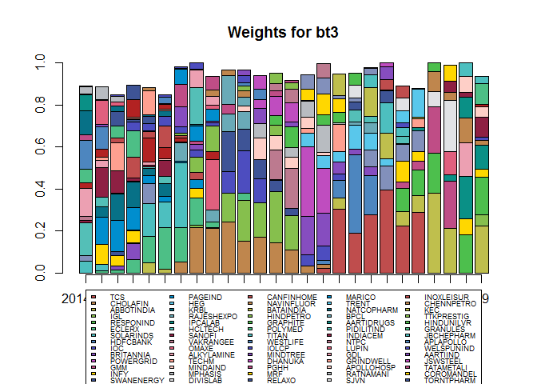

    ##                       TCS CHOLAFIN ABBOTINDIA   IGL RESPONIND ECLERX SOLARINDS
    ## 2019-09-27 05:30:00 0.223        0      0.070 0.000     0.109      0         0
    ## 2019-12-27 05:30:00 0.286        0      0.082 0.000     0.124      0         0
    ## 2020-03-27 05:30:00 0.000        0      0.381 0.000     0.190      0         0
    ## 2020-06-26 05:30:00 0.000        0      0.211 0.000     0.000      0         0
    ## 2020-09-25 05:30:00 0.000        0      0.000 0.000     0.181      0         0
    ## 2020-12-18 05:30:00 0.000        0      0.225 0.053     0.178      0         0
    ##                     HDFCBANK IOC BRITANNIA POWERGRID   GMM  INFY SWANENERGY
    ## 2019-09-27 05:30:00        0   0         0         0 0.032 0.098          0
    ## 2019-12-27 05:30:00        0   0         0         0 0.040 0.047          0
    ## 2020-03-27 05:30:00        0   0         0         0 0.221 0.000          0
    ## 2020-06-26 05:30:00        0   0         0         0 0.225 0.000          0
    ## 2020-09-25 05:30:00        0   0         0         0 0.000 0.075          0
    ## 2020-12-18 05:30:00        0   0         0         0 0.000 0.037          0
    ##                     NAUKRI PAGEIND HEG KRBL RAJESHEXPO IPCALAB HCLTECH SANOFI
    ## 2019-09-27 05:30:00  0.082       0   0    0          0   0.001   0.037      0
    ## 2019-12-27 05:30:00  0.096       0   0    0          0   0.015   0.000      0
    ## 2020-03-27 05:30:00  0.000       0   0    0          0   0.000   0.000      0
    ## 2020-06-26 05:30:00  0.000       0   0    0          0   0.033   0.000      0
    ## 2020-09-25 05:30:00  0.000       0   0    0          0   0.204   0.000      0
    ## 2020-12-18 05:30:00  0.000       0   0    0          0   0.116   0.000      0
    ##                     VAKRANGEE OMAXE ALKYLAMINE TECHM MINDAIND MPHASIS DIVISLAB
    ## 2019-09-27 05:30:00         0 0.000      0.000 0.000        0       0    0.000
    ## 2019-12-27 05:30:00         0 0.000      0.000 0.042        0       0    0.000
    ## 2020-03-27 05:30:00         0 0.000      0.000 0.000        0       0    0.069
    ## 2020-06-26 05:30:00         0 0.108      0.000 0.000        0       0    0.245
    ## 2020-09-25 05:30:00         0 0.000      0.158 0.000        0       0    0.000
    ## 2020-12-18 05:30:00         0 0.000      0.000 0.000        0       0    0.000
    ##                     JCHAC CANFINHOME NAVINFLUOR BATAINDIA HINDPETRO GRAPHITE
    ## 2019-09-27 05:30:00     0          0      0.000     0.000         0        0
    ## 2019-12-27 05:30:00     0          0      0.000     0.008         0        0
    ## 2020-03-27 05:30:00     0          0      0.097     0.000         0        0
    ## 2020-06-26 05:30:00     0          0      0.040     0.000         0        0
    ## 2020-09-25 05:30:00     0          0      0.118     0.000         0        0
    ## 2020-12-18 05:30:00     0          0      0.021     0.000         0        0
    ##                     POLYMED TITAN WESTLIFE IOLCP MINDTREE DHANUKA PGHH MRF
    ## 2019-09-27 05:30:00       0  0.04        0 0.023        0       0    0   0
    ## 2019-12-27 05:30:00       0  0.00        0 0.000        0       0    0   0
    ## 2020-03-27 05:30:00       0  0.00        0 0.000        0       0    0   0
    ## 2020-06-26 05:30:00       0  0.00        0 0.000        0       0    0   0
    ## 2020-09-25 05:30:00       0  0.00        0 0.000        0       0    0   0
    ## 2020-12-18 05:30:00       0  0.00        0 0.016        0       0    0   0
    ##                     RELAXO PHOENIXLTD MARICO TRENT NATCOPHARM BPCL AARTIDRUGS
    ## 2019-09-27 05:30:00      0          0      0 0.060          0    0        0.0
    ## 2019-12-27 05:30:00      0          0      0 0.134          0    0        0.0
    ## 2020-03-27 05:30:00      0          0      0 0.000          0    0        0.0
    ## 2020-06-26 05:30:00      0          0      0 0.000          0    0        0.0
    ## 2020-09-25 05:30:00      0          0      0 0.000          0    0        0.1
    ## 2020-12-18 05:30:00      0          0      0 0.000          0    0        0.0
    ##                     PIDILITIND INDIACEM NTPC LUPIN GDL GRINDWELL APOLLOHOSP
    ## 2019-09-27 05:30:00          0    0.000    0     0   0         0      0.000
    ## 2019-12-27 05:30:00          0    0.000    0     0   0         0      0.000
    ## 2020-03-27 05:30:00          0    0.000    0     0   0         0      0.000
    ## 2020-06-26 05:30:00          0    0.051    0     0   0         0      0.000
    ## 2020-09-25 05:30:00          0    0.023    0     0   0         0      0.078
    ## 2020-12-18 05:30:00          0    0.095    0     0   0         0      0.052
    ##                     RATNAMANI  SJVN ASTRAZEN INOXLEISUR CHENNPETRO KEC
    ## 2019-09-27 05:30:00         0 0.060    0.000      0.055          0   0
    ## 2019-12-27 05:30:00         0 0.003    0.000      0.000          0   0
    ## 2020-03-27 05:30:00         0 0.000    0.000      0.000          0   0
    ## 2020-06-26 05:30:00         0 0.000    0.000      0.000          0   0
    ## 2020-09-25 05:30:00         0 0.000    0.000      0.000          0   0
    ## 2020-12-18 05:30:00         0 0.000    0.011      0.000          0   0
    ##                     TTKPRESTIG HINDUNILVR GRANULES JBCHEPHARM APLAPOLLO
    ## 2019-09-27 05:30:00          0      0.000    0.000      0.000         0
    ## 2019-12-27 05:30:00          0      0.000    0.000      0.000         0
    ## 2020-03-27 05:30:00          0      0.041    0.000      0.000         0
    ## 2020-06-26 05:30:00          0      0.000    0.000      0.000         0
    ## 2020-09-25 05:30:00          0      0.000    0.000      0.062         0
    ## 2020-12-18 05:30:00          0      0.000    0.097      0.033         0
    ##                     WELSPUNIND AARTIIND JSWSTEEL TATAMETALI COROMANDEL
    ## 2019-09-27 05:30:00          0        0        0          0      0.000
    ## 2019-12-27 05:30:00          0        0        0          0      0.000
    ## 2020-03-27 05:30:00          0        0        0          0      0.000
    ## 2020-06-26 05:30:00          0        0        0          0      0.076
    ## 2020-09-25 05:30:00          0        0        0          0      0.000
    ## 2020-12-18 05:30:00          0        0        0          0      0.000
    ##                     TORNTPHARM
    ## 2019-09-27 05:30:00          0
    ## 2019-12-27 05:30:00          0
    ## 2020-03-27 05:30:00          0
    ## 2020-06-26 05:30:00          0
    ## 2020-09-25 05:30:00          0
    ## 2020-12-18 05:30:00          0


    ##                     HEG JINDALSTEL TATAMTRDVR TASTYBIT CAPPL MAHABANK IOLCP
    ## 2019-09-27 05:30:00   0          0          0        0     0        0 0.711
    ## 2019-12-27 05:30:00   0          0          0        0     0        0 0.000
    ## 2020-03-27 05:30:00   0          0          0        0     0        0 0.000
    ## 2020-06-26 05:30:00   0          0          0        0     0        0 0.598
    ## 2020-09-25 05:30:00   0          0          0        0     0        0 0.000
    ## 2020-12-18 05:30:00   0          0          0        0     0        0 0.000
    ##                     ITDC WOCKPHARMA MMTC EDELWEISS TANLA ADANIENT   GMM
    ## 2019-09-27 05:30:00    0          0    0         0 0.000    0.000 0.000
    ## 2019-12-27 05:30:00    0          0    0         0 0.000    0.774 0.000
    ## 2020-03-27 05:30:00    0          0    0         0 0.000    0.000 0.704
    ## 2020-06-26 05:30:00    0          0    0         0 0.000    0.000 0.000
    ## 2020-09-25 05:30:00    0          0    0         0 0.509    0.000 0.000
    ## 2020-12-18 05:30:00    0          0    0         0 0.350    0.000 0.000
    ##                     CENTRALBK FCONSUMER SEQUENT LUPIN BANKINDIA ALOKTEXT
    ## 2019-09-27 05:30:00     0.000      0.00       0     0         0        0
    ## 2019-12-27 05:30:00     0.226      0.00       0     0         0        0
    ## 2020-03-27 05:30:00     0.000      0.00       0     0         0        0
    ## 2020-06-26 05:30:00     0.000      0.00       0     0         0        0
    ## 2020-09-25 05:30:00     0.000      0.00       0     0         0        0
    ## 2020-12-18 05:30:00     0.000      0.65       0     0         0        0
    ##                     INDIANB TATAMETALI DISHTV WELSPUNIND HSCL   NCC  IDEA
    ## 2019-09-27 05:30:00   0.000          0  0.000          0    0 0.000 0.289
    ## 2019-12-27 05:30:00   0.000          0  0.000          0    0 0.000 0.000
    ## 2020-03-27 05:30:00   0.000          0  0.000          0    0 0.296 0.000
    ## 2020-06-26 05:30:00   0.000          0  0.402          0    0 0.000 0.000
    ## 2020-09-25 05:30:00   0.491          0  0.000          0    0 0.000 0.000
    ## 2020-12-18 05:30:00   0.000          0  0.000          0    0 0.000 0.000


    ##                       TCS CHOLAFIN ABBOTINDIA   IGL RESPONIND ECLERX SOLARINDS
    ## 2019-09-27 05:30:00 0.223        0      0.070 0.000     0.109      0         0
    ## 2019-12-27 05:30:00 0.286        0      0.082 0.000     0.124      0         0
    ## 2020-03-27 05:30:00 0.000        0      0.381 0.000     0.190      0         0
    ## 2020-06-26 05:30:00 0.000        0      0.211 0.000     0.000      0         0
    ## 2020-09-25 05:30:00 0.000        0      0.000 0.000     0.181      0         0
    ## 2020-12-18 05:30:00 0.000        0      0.225 0.053     0.178      0         0
    ##                     HDFCBANK IOC BRITANNIA POWERGRID   GMM  INFY SWANENERGY
    ## 2019-09-27 05:30:00        0   0         0         0 0.032 0.098          0
    ## 2019-12-27 05:30:00        0   0         0         0 0.040 0.047          0
    ## 2020-03-27 05:30:00        0   0         0         0 0.221 0.000          0
    ## 2020-06-26 05:30:00        0   0         0         0 0.225 0.000          0
    ## 2020-09-25 05:30:00        0   0         0         0 0.000 0.075          0
    ## 2020-12-18 05:30:00        0   0         0         0 0.000 0.037          0
    ##                     NAUKRI PAGEIND HEG KRBL RAJESHEXPO IPCALAB HCLTECH SANOFI
    ## 2019-09-27 05:30:00  0.082       0   0    0          0   0.001   0.037      0
    ## 2019-12-27 05:30:00  0.096       0   0    0          0   0.015   0.000      0
    ## 2020-03-27 05:30:00  0.000       0   0    0          0   0.000   0.000      0
    ## 2020-06-26 05:30:00  0.000       0   0    0          0   0.033   0.000      0
    ## 2020-09-25 05:30:00  0.000       0   0    0          0   0.204   0.000      0
    ## 2020-12-18 05:30:00  0.000       0   0    0          0   0.116   0.000      0
    ##                     VAKRANGEE OMAXE ALKYLAMINE TECHM MINDAIND MPHASIS DIVISLAB
    ## 2019-09-27 05:30:00         0 0.000      0.000 0.000        0       0    0.000
    ## 2019-12-27 05:30:00         0 0.000      0.000 0.042        0       0    0.000
    ## 2020-03-27 05:30:00         0 0.000      0.000 0.000        0       0    0.069
    ## 2020-06-26 05:30:00         0 0.108      0.000 0.000        0       0    0.245
    ## 2020-09-25 05:30:00         0 0.000      0.158 0.000        0       0    0.000
    ## 2020-12-18 05:30:00         0 0.000      0.000 0.000        0       0    0.000
    ##                     JCHAC CANFINHOME NAVINFLUOR BATAINDIA HINDPETRO GRAPHITE
    ## 2019-09-27 05:30:00     0          0      0.000     0.000         0        0
    ## 2019-12-27 05:30:00     0          0      0.000     0.008         0        0
    ## 2020-03-27 05:30:00     0          0      0.097     0.000         0        0
    ## 2020-06-26 05:30:00     0          0      0.040     0.000         0        0
    ## 2020-09-25 05:30:00     0          0      0.118     0.000         0        0
    ## 2020-12-18 05:30:00     0          0      0.021     0.000         0        0
    ##                     POLYMED TITAN WESTLIFE IOLCP MINDTREE DHANUKA PGHH MRF
    ## 2019-09-27 05:30:00       0  0.04        0 0.023        0       0    0   0
    ## 2019-12-27 05:30:00       0  0.00        0 0.000        0       0    0   0
    ## 2020-03-27 05:30:00       0  0.00        0 0.000        0       0    0   0
    ## 2020-06-26 05:30:00       0  0.00        0 0.000        0       0    0   0
    ## 2020-09-25 05:30:00       0  0.00        0 0.000        0       0    0   0
    ## 2020-12-18 05:30:00       0  0.00        0 0.016        0       0    0   0
    ##                     RELAXO PHOENIXLTD MARICO TRENT NATCOPHARM BPCL AARTIDRUGS
    ## 2019-09-27 05:30:00      0          0      0 0.060          0    0        0.0
    ## 2019-12-27 05:30:00      0          0      0 0.134          0    0        0.0
    ## 2020-03-27 05:30:00      0          0      0 0.000          0    0        0.0
    ## 2020-06-26 05:30:00      0          0      0 0.000          0    0        0.0
    ## 2020-09-25 05:30:00      0          0      0 0.000          0    0        0.1
    ## 2020-12-18 05:30:00      0          0      0 0.000          0    0        0.0
    ##                     PIDILITIND INDIACEM NTPC LUPIN GDL GRINDWELL APOLLOHOSP
    ## 2019-09-27 05:30:00          0    0.000    0     0   0         0      0.000
    ## 2019-12-27 05:30:00          0    0.000    0     0   0         0      0.000
    ## 2020-03-27 05:30:00          0    0.000    0     0   0         0      0.000
    ## 2020-06-26 05:30:00          0    0.051    0     0   0         0      0.000
    ## 2020-09-25 05:30:00          0    0.023    0     0   0         0      0.078
    ## 2020-12-18 05:30:00          0    0.095    0     0   0         0      0.052
    ##                     RATNAMANI  SJVN ASTRAZEN INOXLEISUR CHENNPETRO KEC
    ## 2019-09-27 05:30:00         0 0.060    0.000      0.055          0   0
    ## 2019-12-27 05:30:00         0 0.003    0.000      0.000          0   0
    ## 2020-03-27 05:30:00         0 0.000    0.000      0.000          0   0
    ## 2020-06-26 05:30:00         0 0.000    0.000      0.000          0   0
    ## 2020-09-25 05:30:00         0 0.000    0.000      0.000          0   0
    ## 2020-12-18 05:30:00         0 0.000    0.011      0.000          0   0
    ##                     TTKPRESTIG HINDUNILVR GRANULES JBCHEPHARM APLAPOLLO
    ## 2019-09-27 05:30:00          0      0.000    0.000      0.000         0
    ## 2019-12-27 05:30:00          0      0.000    0.000      0.000         0
    ## 2020-03-27 05:30:00          0      0.041    0.000      0.000         0
    ## 2020-06-26 05:30:00          0      0.000    0.000      0.000         0
    ## 2020-09-25 05:30:00          0      0.000    0.000      0.062         0
    ## 2020-12-18 05:30:00          0      0.000    0.097      0.033         0
    ##                     WELSPUNIND AARTIIND JSWSTEEL TATAMETALI COROMANDEL
    ## 2019-09-27 05:30:00          0        0        0          0      0.000
    ## 2019-12-27 05:30:00          0        0        0          0      0.000
    ## 2020-03-27 05:30:00          0        0        0          0      0.000
    ## 2020-06-26 05:30:00          0        0        0          0      0.076
    ## 2020-09-25 05:30:00          0        0        0          0      0.000
    ## 2020-12-18 05:30:00          0        0        0          0      0.000
    ##                     TORNTPHARM
    ## 2019-09-27 05:30:00          0
    ## 2019-12-27 05:30:00          0
    ## 2020-03-27 05:30:00          0
    ## 2020-06-26 05:30:00          0
    ## 2020-09-25 05:30:00          0
    ## 2020-12-18 05:30:00          0


    ##                       TCS CHOLAFIN ABBOTINDIA   IGL RESPONIND ECLERX SOLARINDS
    ## 2019-09-27 05:30:00 0.223        0      0.070 0.000     0.109      0         0
    ## 2019-12-27 05:30:00 0.286        0      0.082 0.000     0.124      0         0
    ## 2020-03-27 05:30:00 0.000        0      0.381 0.000     0.190      0         0
    ## 2020-06-26 05:30:00 0.000        0      0.211 0.000     0.000      0         0
    ## 2020-09-25 05:30:00 0.000        0      0.000 0.000     0.181      0         0
    ## 2020-12-18 05:30:00 0.000        0      0.225 0.053     0.178      0         0
    ##                     HDFCBANK IOC BRITANNIA POWERGRID   GMM  INFY SWANENERGY
    ## 2019-09-27 05:30:00        0   0         0         0 0.032 0.098          0
    ## 2019-12-27 05:30:00        0   0         0         0 0.040 0.047          0
    ## 2020-03-27 05:30:00        0   0         0         0 0.221 0.000          0
    ## 2020-06-26 05:30:00        0   0         0         0 0.225 0.000          0
    ## 2020-09-25 05:30:00        0   0         0         0 0.000 0.075          0
    ## 2020-12-18 05:30:00        0   0         0         0 0.000 0.037          0
    ##                     NAUKRI PAGEIND HEG KRBL RAJESHEXPO IPCALAB HCLTECH SANOFI
    ## 2019-09-27 05:30:00  0.082       0   0    0          0   0.001   0.037      0
    ## 2019-12-27 05:30:00  0.096       0   0    0          0   0.015   0.000      0
    ## 2020-03-27 05:30:00  0.000       0   0    0          0   0.000   0.000      0
    ## 2020-06-26 05:30:00  0.000       0   0    0          0   0.033   0.000      0
    ## 2020-09-25 05:30:00  0.000       0   0    0          0   0.204   0.000      0
    ## 2020-12-18 05:30:00  0.000       0   0    0          0   0.116   0.000      0
    ##                     VAKRANGEE OMAXE ALKYLAMINE TECHM MINDAIND MPHASIS DIVISLAB
    ## 2019-09-27 05:30:00         0 0.000      0.000 0.000        0       0    0.000
    ## 2019-12-27 05:30:00         0 0.000      0.000 0.042        0       0    0.000
    ## 2020-03-27 05:30:00         0 0.000      0.000 0.000        0       0    0.069
    ## 2020-06-26 05:30:00         0 0.108      0.000 0.000        0       0    0.245
    ## 2020-09-25 05:30:00         0 0.000      0.158 0.000        0       0    0.000
    ## 2020-12-18 05:30:00         0 0.000      0.000 0.000        0       0    0.000
    ##                     JCHAC CANFINHOME NAVINFLUOR BATAINDIA HINDPETRO GRAPHITE
    ## 2019-09-27 05:30:00     0          0      0.000     0.000         0        0
    ## 2019-12-27 05:30:00     0          0      0.000     0.008         0        0
    ## 2020-03-27 05:30:00     0          0      0.097     0.000         0        0
    ## 2020-06-26 05:30:00     0          0      0.040     0.000         0        0
    ## 2020-09-25 05:30:00     0          0      0.118     0.000         0        0
    ## 2020-12-18 05:30:00     0          0      0.021     0.000         0        0
    ##                     POLYMED TITAN WESTLIFE IOLCP MINDTREE DHANUKA PGHH MRF
    ## 2019-09-27 05:30:00       0  0.04        0 0.023        0       0    0   0
    ## 2019-12-27 05:30:00       0  0.00        0 0.000        0       0    0   0
    ## 2020-03-27 05:30:00       0  0.00        0 0.000        0       0    0   0
    ## 2020-06-26 05:30:00       0  0.00        0 0.000        0       0    0   0
    ## 2020-09-25 05:30:00       0  0.00        0 0.000        0       0    0   0
    ## 2020-12-18 05:30:00       0  0.00        0 0.016        0       0    0   0
    ##                     RELAXO PHOENIXLTD MARICO TRENT NATCOPHARM BPCL AARTIDRUGS
    ## 2019-09-27 05:30:00      0          0      0 0.060          0    0        0.0
    ## 2019-12-27 05:30:00      0          0      0 0.134          0    0        0.0
    ## 2020-03-27 05:30:00      0          0      0 0.000          0    0        0.0
    ## 2020-06-26 05:30:00      0          0      0 0.000          0    0        0.0
    ## 2020-09-25 05:30:00      0          0      0 0.000          0    0        0.1
    ## 2020-12-18 05:30:00      0          0      0 0.000          0    0        0.0
    ##                     PIDILITIND INDIACEM NTPC LUPIN GDL GRINDWELL APOLLOHOSP
    ## 2019-09-27 05:30:00          0    0.000    0     0   0         0      0.000
    ## 2019-12-27 05:30:00          0    0.000    0     0   0         0      0.000
    ## 2020-03-27 05:30:00          0    0.000    0     0   0         0      0.000
    ## 2020-06-26 05:30:00          0    0.051    0     0   0         0      0.000
    ## 2020-09-25 05:30:00          0    0.023    0     0   0         0      0.078
    ## 2020-12-18 05:30:00          0    0.095    0     0   0         0      0.052
    ##                     RATNAMANI  SJVN ASTRAZEN INOXLEISUR CHENNPETRO KEC
    ## 2019-09-27 05:30:00         0 0.060    0.000      0.055          0   0
    ## 2019-12-27 05:30:00         0 0.003    0.000      0.000          0   0
    ## 2020-03-27 05:30:00         0 0.000    0.000      0.000          0   0
    ## 2020-06-26 05:30:00         0 0.000    0.000      0.000          0   0
    ## 2020-09-25 05:30:00         0 0.000    0.000      0.000          0   0
    ## 2020-12-18 05:30:00         0 0.000    0.011      0.000          0   0
    ##                     TTKPRESTIG HINDUNILVR GRANULES JBCHEPHARM APLAPOLLO
    ## 2019-09-27 05:30:00          0      0.000    0.000      0.000         0
    ## 2019-12-27 05:30:00          0      0.000    0.000      0.000         0
    ## 2020-03-27 05:30:00          0      0.041    0.000      0.000         0
    ## 2020-06-26 05:30:00          0      0.000    0.000      0.000         0
    ## 2020-09-25 05:30:00          0      0.000    0.000      0.062         0
    ## 2020-12-18 05:30:00          0      0.000    0.097      0.033         0
    ##                     WELSPUNIND AARTIIND JSWSTEEL TATAMETALI COROMANDEL
    ## 2019-09-27 05:30:00          0        0        0          0      0.000
    ## 2019-12-27 05:30:00          0        0        0          0      0.000
    ## 2020-03-27 05:30:00          0        0        0          0      0.000
    ## 2020-06-26 05:30:00          0        0        0          0      0.076
    ## 2020-09-25 05:30:00          0        0        0          0      0.000
    ## 2020-12-18 05:30:00          0        0        0          0      0.000
    ##                     TORNTPHARM
    ## 2019-09-27 05:30:00          0
    ## 2019-12-27 05:30:00          0
    ## 2020-03-27 05:30:00          0
    ## 2020-06-26 05:30:00          0
    ## 2020-09-25 05:30:00          0
    ## 2020-12-18 05:30:00          0


    ##                       TCS CHOLAFIN ABBOTINDIA   IGL RESPONIND ECLERX SOLARINDS
    ## 2019-09-27 05:30:00 0.223        0      0.070 0.000     0.109      0         0
    ## 2019-12-27 05:30:00 0.286        0      0.082 0.000     0.124      0         0
    ## 2020-03-27 05:30:00 0.000        0      0.381 0.000     0.190      0         0
    ## 2020-06-26 05:30:00 0.000        0      0.211 0.000     0.000      0         0
    ## 2020-09-25 05:30:00 0.000        0      0.000 0.000     0.181      0         0
    ## 2020-12-18 05:30:00 0.000        0      0.225 0.053     0.178      0         0
    ##                     HDFCBANK IOC BRITANNIA POWERGRID   GMM  INFY SWANENERGY
    ## 2019-09-27 05:30:00        0   0         0         0 0.032 0.098          0
    ## 2019-12-27 05:30:00        0   0         0         0 0.040 0.047          0
    ## 2020-03-27 05:30:00        0   0         0         0 0.221 0.000          0
    ## 2020-06-26 05:30:00        0   0         0         0 0.225 0.000          0
    ## 2020-09-25 05:30:00        0   0         0         0 0.000 0.075          0
    ## 2020-12-18 05:30:00        0   0         0         0 0.000 0.037          0
    ##                     NAUKRI PAGEIND HEG KRBL RAJESHEXPO IPCALAB HCLTECH SANOFI
    ## 2019-09-27 05:30:00  0.082       0   0    0          0   0.001   0.037      0
    ## 2019-12-27 05:30:00  0.096       0   0    0          0   0.015   0.000      0
    ## 2020-03-27 05:30:00  0.000       0   0    0          0   0.000   0.000      0
    ## 2020-06-26 05:30:00  0.000       0   0    0          0   0.033   0.000      0
    ## 2020-09-25 05:30:00  0.000       0   0    0          0   0.204   0.000      0
    ## 2020-12-18 05:30:00  0.000       0   0    0          0   0.116   0.000      0
    ##                     VAKRANGEE OMAXE ALKYLAMINE TECHM MINDAIND MPHASIS DIVISLAB
    ## 2019-09-27 05:30:00         0 0.000      0.000 0.000        0       0    0.000
    ## 2019-12-27 05:30:00         0 0.000      0.000 0.042        0       0    0.000
    ## 2020-03-27 05:30:00         0 0.000      0.000 0.000        0       0    0.069
    ## 2020-06-26 05:30:00         0 0.108      0.000 0.000        0       0    0.245
    ## 2020-09-25 05:30:00         0 0.000      0.158 0.000        0       0    0.000
    ## 2020-12-18 05:30:00         0 0.000      0.000 0.000        0       0    0.000
    ##                     JCHAC CANFINHOME NAVINFLUOR BATAINDIA HINDPETRO GRAPHITE
    ## 2019-09-27 05:30:00     0          0      0.000     0.000         0        0
    ## 2019-12-27 05:30:00     0          0      0.000     0.008         0        0
    ## 2020-03-27 05:30:00     0          0      0.097     0.000         0        0
    ## 2020-06-26 05:30:00     0          0      0.040     0.000         0        0
    ## 2020-09-25 05:30:00     0          0      0.118     0.000         0        0
    ## 2020-12-18 05:30:00     0          0      0.021     0.000         0        0
    ##                     POLYMED TITAN WESTLIFE IOLCP MINDTREE DHANUKA PGHH MRF
    ## 2019-09-27 05:30:00       0  0.04        0 0.023        0       0    0   0
    ## 2019-12-27 05:30:00       0  0.00        0 0.000        0       0    0   0
    ## 2020-03-27 05:30:00       0  0.00        0 0.000        0       0    0   0
    ## 2020-06-26 05:30:00       0  0.00        0 0.000        0       0    0   0
    ## 2020-09-25 05:30:00       0  0.00        0 0.000        0       0    0   0
    ## 2020-12-18 05:30:00       0  0.00        0 0.016        0       0    0   0
    ##                     RELAXO PHOENIXLTD MARICO TRENT NATCOPHARM BPCL AARTIDRUGS
    ## 2019-09-27 05:30:00      0          0      0 0.060          0    0        0.0
    ## 2019-12-27 05:30:00      0          0      0 0.134          0    0        0.0
    ## 2020-03-27 05:30:00      0          0      0 0.000          0    0        0.0
    ## 2020-06-26 05:30:00      0          0      0 0.000          0    0        0.0
    ## 2020-09-25 05:30:00      0          0      0 0.000          0    0        0.1
    ## 2020-12-18 05:30:00      0          0      0 0.000          0    0        0.0
    ##                     PIDILITIND INDIACEM NTPC LUPIN GDL GRINDWELL APOLLOHOSP
    ## 2019-09-27 05:30:00          0    0.000    0     0   0         0      0.000
    ## 2019-12-27 05:30:00          0    0.000    0     0   0         0      0.000
    ## 2020-03-27 05:30:00          0    0.000    0     0   0         0      0.000
    ## 2020-06-26 05:30:00          0    0.051    0     0   0         0      0.000
    ## 2020-09-25 05:30:00          0    0.023    0     0   0         0      0.078
    ## 2020-12-18 05:30:00          0    0.095    0     0   0         0      0.052
    ##                     RATNAMANI  SJVN ASTRAZEN INOXLEISUR CHENNPETRO KEC
    ## 2019-09-27 05:30:00         0 0.060    0.000      0.055          0   0
    ## 2019-12-27 05:30:00         0 0.003    0.000      0.000          0   0
    ## 2020-03-27 05:30:00         0 0.000    0.000      0.000          0   0
    ## 2020-06-26 05:30:00         0 0.000    0.000      0.000          0   0
    ## 2020-09-25 05:30:00         0 0.000    0.000      0.000          0   0
    ## 2020-12-18 05:30:00         0 0.000    0.011      0.000          0   0
    ##                     TTKPRESTIG HINDUNILVR GRANULES JBCHEPHARM APLAPOLLO
    ## 2019-09-27 05:30:00          0      0.000    0.000      0.000         0
    ## 2019-12-27 05:30:00          0      0.000    0.000      0.000         0
    ## 2020-03-27 05:30:00          0      0.041    0.000      0.000         0
    ## 2020-06-26 05:30:00          0      0.000    0.000      0.000         0
    ## 2020-09-25 05:30:00          0      0.000    0.000      0.062         0
    ## 2020-12-18 05:30:00          0      0.000    0.097      0.033         0
    ##                     WELSPUNIND AARTIIND JSWSTEEL TATAMETALI COROMANDEL
    ## 2019-09-27 05:30:00          0        0        0          0      0.000
    ## 2019-12-27 05:30:00          0        0        0          0      0.000
    ## 2020-03-27 05:30:00          0        0        0          0      0.000
    ## 2020-06-26 05:30:00          0        0        0          0      0.076
    ## 2020-09-25 05:30:00          0        0        0          0      0.000
    ## 2020-12-18 05:30:00          0        0        0          0      0.000
    ##                     TORNTPHARM
    ## 2019-09-27 05:30:00          0
    ## 2019-12-27 05:30:00          0
    ## 2020-03-27 05:30:00          0
    ## 2020-06-26 05:30:00          0
    ## 2020-09-25 05:30:00          0
    ## 2020-12-18 05:30:00          0

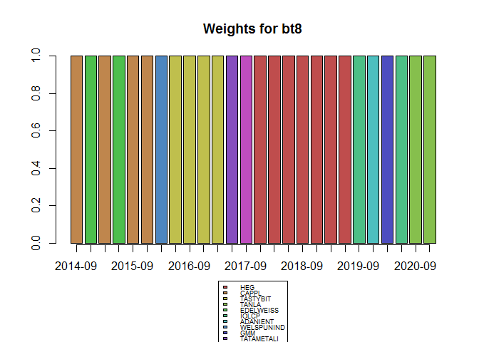

    ##                     HEG CAPPL TASTYBIT TANLA EDELWEISS IOLCP ADANIENT
    ## 2019-09-27 05:30:00   0     0        0     0         0     1        0
    ## 2019-12-27 05:30:00   0     0        0     0         0     0        1
    ## 2020-03-27 05:30:00   0     0        0     0         0     0        0
    ## 2020-06-26 05:30:00   0     0        0     0         0     1        0
    ## 2020-09-25 05:30:00   0     0        0     1         0     0        0
    ## 2020-12-18 05:30:00   0     0        0     1         0     0        0
    ##                     WELSPUNIND GMM TATAMETALI HSCL
    ## 2019-09-27 05:30:00          0   0          0    0
    ## 2019-12-27 05:30:00          0   0          0    0
    ## 2020-03-27 05:30:00          0   1          0    0
    ## 2020-06-26 05:30:00          0   0          0    0
    ## 2020-09-25 05:30:00          0   0          0    0
    ## 2020-12-18 05:30:00          0   0          0    0


    ##                       TCS CHOLAFIN ABBOTINDIA   IGL RESPONIND ECLERX SOLARINDS
    ## 2019-09-27 05:30:00 0.223        0      0.070 0.000     0.109      0         0
    ## 2019-12-27 05:30:00 0.286        0      0.082 0.000     0.124      0         0
    ## 2020-03-27 05:30:00 0.000        0      0.381 0.000     0.190      0         0
    ## 2020-06-26 05:30:00 0.000        0      0.211 0.000     0.000      0         0
    ## 2020-09-25 05:30:00 0.000        0      0.000 0.000     0.181      0         0
    ## 2020-12-18 05:30:00 0.000        0      0.225 0.053     0.178      0         0
    ##                     HDFCBANK IOC BRITANNIA POWERGRID   GMM  INFY SWANENERGY
    ## 2019-09-27 05:30:00        0   0         0         0 0.032 0.098          0
    ## 2019-12-27 05:30:00        0   0         0         0 0.040 0.047          0
    ## 2020-03-27 05:30:00        0   0         0         0 0.221 0.000          0
    ## 2020-06-26 05:30:00        0   0         0         0 0.225 0.000          0
    ## 2020-09-25 05:30:00        0   0         0         0 0.000 0.075          0
    ## 2020-12-18 05:30:00        0   0         0         0 0.000 0.037          0
    ##                     NAUKRI PAGEIND HEG KRBL RAJESHEXPO IPCALAB HCLTECH SANOFI
    ## 2019-09-27 05:30:00  0.082       0   0    0          0   0.001   0.037      0
    ## 2019-12-27 05:30:00  0.096       0   0    0          0   0.015   0.000      0
    ## 2020-03-27 05:30:00  0.000       0   0    0          0   0.000   0.000      0
    ## 2020-06-26 05:30:00  0.000       0   0    0          0   0.033   0.000      0
    ## 2020-09-25 05:30:00  0.000       0   0    0          0   0.204   0.000      0
    ## 2020-12-18 05:30:00  0.000       0   0    0          0   0.116   0.000      0
    ##                     VAKRANGEE OMAXE ALKYLAMINE TECHM MINDAIND MPHASIS DIVISLAB
    ## 2019-09-27 05:30:00         0 0.000      0.000 0.000        0       0    0.000
    ## 2019-12-27 05:30:00         0 0.000      0.000 0.042        0       0    0.000
    ## 2020-03-27 05:30:00         0 0.000      0.000 0.000        0       0    0.069
    ## 2020-06-26 05:30:00         0 0.108      0.000 0.000        0       0    0.245
    ## 2020-09-25 05:30:00         0 0.000      0.158 0.000        0       0    0.000
    ## 2020-12-18 05:30:00         0 0.000      0.000 0.000        0       0    0.000
    ##                     JCHAC CANFINHOME NAVINFLUOR BATAINDIA HINDPETRO GRAPHITE
    ## 2019-09-27 05:30:00     0          0      0.000     0.000         0        0
    ## 2019-12-27 05:30:00     0          0      0.000     0.008         0        0
    ## 2020-03-27 05:30:00     0          0      0.097     0.000         0        0
    ## 2020-06-26 05:30:00     0          0      0.040     0.000         0        0
    ## 2020-09-25 05:30:00     0          0      0.118     0.000         0        0
    ## 2020-12-18 05:30:00     0          0      0.021     0.000         0        0
    ##                     POLYMED TITAN WESTLIFE IOLCP MINDTREE DHANUKA PGHH MRF
    ## 2019-09-27 05:30:00       0  0.04        0 0.023        0       0    0   0
    ## 2019-12-27 05:30:00       0  0.00        0 0.000        0       0    0   0
    ## 2020-03-27 05:30:00       0  0.00        0 0.000        0       0    0   0
    ## 2020-06-26 05:30:00       0  0.00        0 0.000        0       0    0   0
    ## 2020-09-25 05:30:00       0  0.00        0 0.000        0       0    0   0
    ## 2020-12-18 05:30:00       0  0.00        0 0.016        0       0    0   0
    ##                     RELAXO PHOENIXLTD MARICO TRENT NATCOPHARM BPCL AARTIDRUGS
    ## 2019-09-27 05:30:00      0          0      0 0.060          0    0        0.0
    ## 2019-12-27 05:30:00      0          0      0 0.134          0    0        0.0
    ## 2020-03-27 05:30:00      0          0      0 0.000          0    0        0.0
    ## 2020-06-26 05:30:00      0          0      0 0.000          0    0        0.0
    ## 2020-09-25 05:30:00      0          0      0 0.000          0    0        0.1
    ## 2020-12-18 05:30:00      0          0      0 0.000          0    0        0.0
    ##                     PIDILITIND INDIACEM NTPC LUPIN GDL GRINDWELL APOLLOHOSP
    ## 2019-09-27 05:30:00          0    0.000    0     0   0         0      0.000
    ## 2019-12-27 05:30:00          0    0.000    0     0   0         0      0.000
    ## 2020-03-27 05:30:00          0    0.000    0     0   0         0      0.000
    ## 2020-06-26 05:30:00          0    0.051    0     0   0         0      0.000
    ## 2020-09-25 05:30:00          0    0.023    0     0   0         0      0.078
    ## 2020-12-18 05:30:00          0    0.095    0     0   0         0      0.052
    ##                     RATNAMANI  SJVN ASTRAZEN INOXLEISUR CHENNPETRO KEC
    ## 2019-09-27 05:30:00         0 0.060    0.000      0.055          0   0
    ## 2019-12-27 05:30:00         0 0.003    0.000      0.000          0   0
    ## 2020-03-27 05:30:00         0 0.000    0.000      0.000          0   0
    ## 2020-06-26 05:30:00         0 0.000    0.000      0.000          0   0
    ## 2020-09-25 05:30:00         0 0.000    0.000      0.000          0   0
    ## 2020-12-18 05:30:00         0 0.000    0.011      0.000          0   0
    ##                     TTKPRESTIG HINDUNILVR GRANULES JBCHEPHARM APLAPOLLO
    ## 2019-09-27 05:30:00          0      0.000    0.000      0.000         0
    ## 2019-12-27 05:30:00          0      0.000    0.000      0.000         0
    ## 2020-03-27 05:30:00          0      0.041    0.000      0.000         0
    ## 2020-06-26 05:30:00          0      0.000    0.000      0.000         0
    ## 2020-09-25 05:30:00          0      0.000    0.000      0.062         0
    ## 2020-12-18 05:30:00          0      0.000    0.097      0.033         0
    ##                     WELSPUNIND AARTIIND JSWSTEEL TATAMETALI COROMANDEL
    ## 2019-09-27 05:30:00          0        0        0          0      0.000
    ## 2019-12-27 05:30:00          0        0        0          0      0.000
    ## 2020-03-27 05:30:00          0        0        0          0      0.000
    ## 2020-06-26 05:30:00          0        0        0          0      0.076
    ## 2020-09-25 05:30:00          0        0        0          0      0.000
    ## 2020-12-18 05:30:00          0        0        0          0      0.000
    ##                     TORNTPHARM
    ## 2019-09-27 05:30:00          0
    ## 2019-12-27 05:30:00          0
    ## 2020-03-27 05:30:00          0
    ## 2020-06-26 05:30:00          0
    ## 2020-09-25 05:30:00          0
    ## 2020-12-18 05:30:00          0


    ##                       TCS CHOLAFIN ABBOTINDIA   IGL RESPONIND ECLERX SOLARINDS
    ## 2019-09-27 05:30:00 0.223        0      0.070 0.000     0.109      0         0
    ## 2019-12-27 05:30:00 0.286        0      0.082 0.000     0.124      0         0
    ## 2020-03-27 05:30:00 0.000        0      0.381 0.000     0.190      0         0
    ## 2020-06-26 05:30:00 0.000        0      0.211 0.000     0.000      0         0
    ## 2020-09-25 05:30:00 0.000        0      0.000 0.000     0.181      0         0
    ## 2020-12-18 05:30:00 0.000        0      0.225 0.053     0.178      0         0
    ##                     HDFCBANK IOC BRITANNIA POWERGRID   GMM  INFY SWANENERGY
    ## 2019-09-27 05:30:00        0   0         0         0 0.032 0.098          0
    ## 2019-12-27 05:30:00        0   0         0         0 0.040 0.047          0
    ## 2020-03-27 05:30:00        0   0         0         0 0.221 0.000          0
    ## 2020-06-26 05:30:00        0   0         0         0 0.225 0.000          0
    ## 2020-09-25 05:30:00        0   0         0         0 0.000 0.075          0
    ## 2020-12-18 05:30:00        0   0         0         0 0.000 0.037          0
    ##                     NAUKRI PAGEIND HEG KRBL RAJESHEXPO IPCALAB HCLTECH SANOFI
    ## 2019-09-27 05:30:00  0.082       0   0    0          0   0.001   0.037      0
    ## 2019-12-27 05:30:00  0.096       0   0    0          0   0.015   0.000      0
    ## 2020-03-27 05:30:00  0.000       0   0    0          0   0.000   0.000      0
    ## 2020-06-26 05:30:00  0.000       0   0    0          0   0.033   0.000      0
    ## 2020-09-25 05:30:00  0.000       0   0    0          0   0.204   0.000      0
    ## 2020-12-18 05:30:00  0.000       0   0    0          0   0.116   0.000      0
    ##                     VAKRANGEE OMAXE ALKYLAMINE TECHM MINDAIND MPHASIS DIVISLAB
    ## 2019-09-27 05:30:00         0 0.000      0.000 0.000        0       0    0.000
    ## 2019-12-27 05:30:00         0 0.000      0.000 0.042        0       0    0.000
    ## 2020-03-27 05:30:00         0 0.000      0.000 0.000        0       0    0.069
    ## 2020-06-26 05:30:00         0 0.108      0.000 0.000        0       0    0.245
    ## 2020-09-25 05:30:00         0 0.000      0.158 0.000        0       0    0.000
    ## 2020-12-18 05:30:00         0 0.000      0.000 0.000        0       0    0.000
    ##                     JCHAC CANFINHOME NAVINFLUOR BATAINDIA HINDPETRO GRAPHITE
    ## 2019-09-27 05:30:00     0          0      0.000     0.000         0        0
    ## 2019-12-27 05:30:00     0          0      0.000     0.008         0        0
    ## 2020-03-27 05:30:00     0          0      0.097     0.000         0        0
    ## 2020-06-26 05:30:00     0          0      0.040     0.000         0        0
    ## 2020-09-25 05:30:00     0          0      0.118     0.000         0        0
    ## 2020-12-18 05:30:00     0          0      0.021     0.000         0        0
    ##                     POLYMED TITAN WESTLIFE IOLCP MINDTREE DHANUKA PGHH MRF
    ## 2019-09-27 05:30:00       0  0.04        0 0.023        0       0    0   0
    ## 2019-12-27 05:30:00       0  0.00        0 0.000        0       0    0   0
    ## 2020-03-27 05:30:00       0  0.00        0 0.000        0       0    0   0
    ## 2020-06-26 05:30:00       0  0.00        0 0.000        0       0    0   0
    ## 2020-09-25 05:30:00       0  0.00        0 0.000        0       0    0   0
    ## 2020-12-18 05:30:00       0  0.00        0 0.016        0       0    0   0
    ##                     RELAXO PHOENIXLTD MARICO TRENT NATCOPHARM BPCL AARTIDRUGS
    ## 2019-09-27 05:30:00      0          0      0 0.060          0    0        0.0
    ## 2019-12-27 05:30:00      0          0      0 0.134          0    0        0.0
    ## 2020-03-27 05:30:00      0          0      0 0.000          0    0        0.0
    ## 2020-06-26 05:30:00      0          0      0 0.000          0    0        0.0
    ## 2020-09-25 05:30:00      0          0      0 0.000          0    0        0.1
    ## 2020-12-18 05:30:00      0          0      0 0.000          0    0        0.0
    ##                     PIDILITIND INDIACEM NTPC LUPIN GDL GRINDWELL APOLLOHOSP
    ## 2019-09-27 05:30:00          0    0.000    0     0   0         0      0.000
    ## 2019-12-27 05:30:00          0    0.000    0     0   0         0      0.000
    ## 2020-03-27 05:30:00          0    0.000    0     0   0         0      0.000
    ## 2020-06-26 05:30:00          0    0.051    0     0   0         0      0.000
    ## 2020-09-25 05:30:00          0    0.023    0     0   0         0      0.078
    ## 2020-12-18 05:30:00          0    0.095    0     0   0         0      0.052
    ##                     RATNAMANI  SJVN ASTRAZEN INOXLEISUR CHENNPETRO KEC
    ## 2019-09-27 05:30:00         0 0.060    0.000      0.055          0   0
    ## 2019-12-27 05:30:00         0 0.003    0.000      0.000          0   0
    ## 2020-03-27 05:30:00         0 0.000    0.000      0.000          0   0
    ## 2020-06-26 05:30:00         0 0.000    0.000      0.000          0   0
    ## 2020-09-25 05:30:00         0 0.000    0.000      0.000          0   0
    ## 2020-12-18 05:30:00         0 0.000    0.011      0.000          0   0
    ##                     TTKPRESTIG HINDUNILVR GRANULES JBCHEPHARM APLAPOLLO
    ## 2019-09-27 05:30:00          0      0.000    0.000      0.000         0
    ## 2019-12-27 05:30:00          0      0.000    0.000      0.000         0
    ## 2020-03-27 05:30:00          0      0.041    0.000      0.000         0
    ## 2020-06-26 05:30:00          0      0.000    0.000      0.000         0
    ## 2020-09-25 05:30:00          0      0.000    0.000      0.062         0
    ## 2020-12-18 05:30:00          0      0.000    0.097      0.033         0
    ##                     WELSPUNIND AARTIIND JSWSTEEL TATAMETALI COROMANDEL
    ## 2019-09-27 05:30:00          0        0        0          0      0.000
    ## 2019-12-27 05:30:00          0        0        0          0      0.000
    ## 2020-03-27 05:30:00          0        0        0          0      0.000
    ## 2020-06-26 05:30:00          0        0        0          0      0.076
    ## 2020-09-25 05:30:00          0        0        0          0      0.000
    ## 2020-12-18 05:30:00          0        0        0          0      0.000
    ##                     TORNTPHARM
    ## 2019-09-27 05:30:00          0
    ## 2019-12-27 05:30:00          0
    ## 2020-03-27 05:30:00          0
    ## 2020-06-26 05:30:00          0
    ## 2020-09-25 05:30:00          0
    ## 2020-12-18 05:30:00          0


    ##                       TCS CHOLAFIN ABBOTINDIA   IGL RESPONIND ECLERX SOLARINDS
    ## 2019-09-27 05:30:00 0.223        0      0.070 0.000     0.109      0         0
    ## 2019-12-27 05:30:00 0.286        0      0.082 0.000     0.124      0         0
    ## 2020-03-27 05:30:00 0.000        0      0.381 0.000     0.190      0         0
    ## 2020-06-26 05:30:00 0.000        0      0.211 0.000     0.000      0         0
    ## 2020-09-25 05:30:00 0.000        0      0.000 0.000     0.181      0         0
    ## 2020-12-18 05:30:00 0.000        0      0.225 0.053     0.178      0         0
    ##                     HDFCBANK IOC BRITANNIA POWERGRID   GMM  INFY SWANENERGY
    ## 2019-09-27 05:30:00        0   0         0         0 0.032 0.098          0
    ## 2019-12-27 05:30:00        0   0         0         0 0.040 0.047          0
    ## 2020-03-27 05:30:00        0   0         0         0 0.221 0.000          0
    ## 2020-06-26 05:30:00        0   0         0         0 0.225 0.000          0
    ## 2020-09-25 05:30:00        0   0         0         0 0.000 0.075          0
    ## 2020-12-18 05:30:00        0   0         0         0 0.000 0.037          0
    ##                     NAUKRI PAGEIND HEG KRBL RAJESHEXPO IPCALAB HCLTECH SANOFI
    ## 2019-09-27 05:30:00  0.082       0   0    0          0   0.001   0.037      0
    ## 2019-12-27 05:30:00  0.096       0   0    0          0   0.015   0.000      0
    ## 2020-03-27 05:30:00  0.000       0   0    0          0   0.000   0.000      0
    ## 2020-06-26 05:30:00  0.000       0   0    0          0   0.033   0.000      0
    ## 2020-09-25 05:30:00  0.000       0   0    0          0   0.204   0.000      0
    ## 2020-12-18 05:30:00  0.000       0   0    0          0   0.116   0.000      0
    ##                     VAKRANGEE OMAXE ALKYLAMINE TECHM MINDAIND MPHASIS DIVISLAB
    ## 2019-09-27 05:30:00         0 0.000      0.000 0.000        0       0    0.000
    ## 2019-12-27 05:30:00         0 0.000      0.000 0.042        0       0    0.000
    ## 2020-03-27 05:30:00         0 0.000      0.000 0.000        0       0    0.069
    ## 2020-06-26 05:30:00         0 0.108      0.000 0.000        0       0    0.245
    ## 2020-09-25 05:30:00         0 0.000      0.158 0.000        0       0    0.000
    ## 2020-12-18 05:30:00         0 0.000      0.000 0.000        0       0    0.000
    ##                     JCHAC CANFINHOME NAVINFLUOR BATAINDIA HINDPETRO GRAPHITE
    ## 2019-09-27 05:30:00     0          0      0.000     0.000         0        0
    ## 2019-12-27 05:30:00     0          0      0.000     0.008         0        0
    ## 2020-03-27 05:30:00     0          0      0.097     0.000         0        0
    ## 2020-06-26 05:30:00     0          0      0.040     0.000         0        0
    ## 2020-09-25 05:30:00     0          0      0.118     0.000         0        0
    ## 2020-12-18 05:30:00     0          0      0.021     0.000         0        0
    ##                     POLYMED TITAN WESTLIFE IOLCP MINDTREE DHANUKA PGHH MRF
    ## 2019-09-27 05:30:00       0  0.04        0 0.023        0       0    0   0
    ## 2019-12-27 05:30:00       0  0.00        0 0.000        0       0    0   0
    ## 2020-03-27 05:30:00       0  0.00        0 0.000        0       0    0   0
    ## 2020-06-26 05:30:00       0  0.00        0 0.000        0       0    0   0
    ## 2020-09-25 05:30:00       0  0.00        0 0.000        0       0    0   0
    ## 2020-12-18 05:30:00       0  0.00        0 0.016        0       0    0   0
    ##                     RELAXO PHOENIXLTD MARICO TRENT NATCOPHARM BPCL AARTIDRUGS
    ## 2019-09-27 05:30:00      0          0      0 0.060          0    0        0.0
    ## 2019-12-27 05:30:00      0          0      0 0.134          0    0        0.0
    ## 2020-03-27 05:30:00      0          0      0 0.000          0    0        0.0
    ## 2020-06-26 05:30:00      0          0      0 0.000          0    0        0.0
    ## 2020-09-25 05:30:00      0          0      0 0.000          0    0        0.1
    ## 2020-12-18 05:30:00      0          0      0 0.000          0    0        0.0
    ##                     PIDILITIND INDIACEM NTPC LUPIN GDL GRINDWELL APOLLOHOSP
    ## 2019-09-27 05:30:00          0    0.000    0     0   0         0      0.000
    ## 2019-12-27 05:30:00          0    0.000    0     0   0         0      0.000
    ## 2020-03-27 05:30:00          0    0.000    0     0   0         0      0.000
    ## 2020-06-26 05:30:00          0    0.051    0     0   0         0      0.000
    ## 2020-09-25 05:30:00          0    0.023    0     0   0         0      0.078
    ## 2020-12-18 05:30:00          0    0.095    0     0   0         0      0.052
    ##                     RATNAMANI  SJVN ASTRAZEN INOXLEISUR CHENNPETRO KEC
    ## 2019-09-27 05:30:00         0 0.060    0.000      0.055          0   0
    ## 2019-12-27 05:30:00         0 0.003    0.000      0.000          0   0
    ## 2020-03-27 05:30:00         0 0.000    0.000      0.000          0   0
    ## 2020-06-26 05:30:00         0 0.000    0.000      0.000          0   0
    ## 2020-09-25 05:30:00         0 0.000    0.000      0.000          0   0
    ## 2020-12-18 05:30:00         0 0.000    0.011      0.000          0   0
    ##                     TTKPRESTIG HINDUNILVR GRANULES JBCHEPHARM APLAPOLLO
    ## 2019-09-27 05:30:00          0      0.000    0.000      0.000         0
    ## 2019-12-27 05:30:00          0      0.000    0.000      0.000         0
    ## 2020-03-27 05:30:00          0      0.041    0.000      0.000         0
    ## 2020-06-26 05:30:00          0      0.000    0.000      0.000         0
    ## 2020-09-25 05:30:00          0      0.000    0.000      0.062         0
    ## 2020-12-18 05:30:00          0      0.000    0.097      0.033         0
    ##                     WELSPUNIND AARTIIND JSWSTEEL TATAMETALI COROMANDEL
    ## 2019-09-27 05:30:00          0        0        0          0      0.000
    ## 2019-12-27 05:30:00          0        0        0          0      0.000
    ## 2020-03-27 05:30:00          0        0        0          0      0.000
    ## 2020-06-26 05:30:00          0        0        0          0      0.076
    ## 2020-09-25 05:30:00          0        0        0          0      0.000
    ## 2020-12-18 05:30:00          0        0        0          0      0.000
    ##                     TORNTPHARM
    ## 2019-09-27 05:30:00          0
    ## 2019-12-27 05:30:00          0
    ## 2020-03-27 05:30:00          0
    ## 2020-06-26 05:30:00          0
    ## 2020-09-25 05:30:00          0
    ## 2020-12-18 05:30:00          0


    ##                     HEG JINDALSTEL TATAMTRDVR TASTYBIT CAPPL MAHABANK IOLCP
    ## 2019-09-27 05:30:00   0          0          0        0     0        0 0.711
    ## 2019-12-27 05:30:00   0          0          0        0     0        0 0.000
    ## 2020-03-27 05:30:00   0          0          0        0     0        0 0.000
    ## 2020-06-26 05:30:00   0          0          0        0     0        0 0.598
    ## 2020-09-25 05:30:00   0          0          0        0     0        0 0.000
    ## 2020-12-18 05:30:00   0          0          0        0     0        0 0.000
    ##                     ITDC WOCKPHARMA MMTC EDELWEISS TANLA ADANIENT   GMM
    ## 2019-09-27 05:30:00    0          0    0         0 0.000    0.000 0.000
    ## 2019-12-27 05:30:00    0          0    0         0 0.000    0.774 0.000
    ## 2020-03-27 05:30:00    0          0    0         0 0.000    0.000 0.704
    ## 2020-06-26 05:30:00    0          0    0         0 0.000    0.000 0.000
    ## 2020-09-25 05:30:00    0          0    0         0 0.509    0.000 0.000
    ## 2020-12-18 05:30:00    0          0    0         0 0.350    0.000 0.000
    ##                     CENTRALBK FCONSUMER SEQUENT LUPIN BANKINDIA ALOKTEXT
    ## 2019-09-27 05:30:00     0.000      0.00       0     0         0        0
    ## 2019-12-27 05:30:00     0.226      0.00       0     0         0        0
    ## 2020-03-27 05:30:00     0.000      0.00       0     0         0        0
    ## 2020-06-26 05:30:00     0.000      0.00       0     0         0        0
    ## 2020-09-25 05:30:00     0.000      0.00       0     0         0        0
    ## 2020-12-18 05:30:00     0.000      0.65       0     0         0        0
    ##                     INDIANB TATAMETALI DISHTV WELSPUNIND HSCL   NCC  IDEA
    ## 2019-09-27 05:30:00   0.000          0  0.000          0    0 0.000 0.289
    ## 2019-12-27 05:30:00   0.000          0  0.000          0    0 0.000 0.000
    ## 2020-03-27 05:30:00   0.000          0  0.000          0    0 0.296 0.000
    ## 2020-06-26 05:30:00   0.000          0  0.402          0    0 0.000 0.000
    ## 2020-09-25 05:30:00   0.491          0  0.000          0    0 0.000 0.000
    ## 2020-12-18 05:30:00   0.000          0  0.000          0    0 0.000 0.000


    ##                       TCS CHOLAFIN ABBOTINDIA   IGL RESPONIND ECLERX SOLARINDS
    ## 2019-09-27 05:30:00 0.223        0      0.070 0.000     0.109      0         0
    ## 2019-12-27 05:30:00 0.286        0      0.082 0.000     0.124      0         0
    ## 2020-03-27 05:30:00 0.000        0      0.381 0.000     0.190      0         0
    ## 2020-06-26 05:30:00 0.000        0      0.211 0.000     0.000      0         0
    ## 2020-09-25 05:30:00 0.000        0      0.000 0.000     0.181      0         0
    ## 2020-12-18 05:30:00 0.000        0      0.225 0.053     0.178      0         0
    ##                     HDFCBANK IOC BRITANNIA POWERGRID   GMM  INFY SWANENERGY
    ## 2019-09-27 05:30:00        0   0         0         0 0.032 0.098          0
    ## 2019-12-27 05:30:00        0   0         0         0 0.040 0.047          0
    ## 2020-03-27 05:30:00        0   0         0         0 0.221 0.000          0
    ## 2020-06-26 05:30:00        0   0         0         0 0.225 0.000          0
    ## 2020-09-25 05:30:00        0   0         0         0 0.000 0.075          0
    ## 2020-12-18 05:30:00        0   0         0         0 0.000 0.037          0
    ##                     NAUKRI PAGEIND HEG KRBL RAJESHEXPO IPCALAB HCLTECH SANOFI
    ## 2019-09-27 05:30:00  0.082       0   0    0          0   0.001   0.037      0
    ## 2019-12-27 05:30:00  0.096       0   0    0          0   0.015   0.000      0
    ## 2020-03-27 05:30:00  0.000       0   0    0          0   0.000   0.000      0
    ## 2020-06-26 05:30:00  0.000       0   0    0          0   0.033   0.000      0
    ## 2020-09-25 05:30:00  0.000       0   0    0          0   0.204   0.000      0
    ## 2020-12-18 05:30:00  0.000       0   0    0          0   0.116   0.000      0
    ##                     VAKRANGEE OMAXE ALKYLAMINE TECHM MINDAIND MPHASIS DIVISLAB
    ## 2019-09-27 05:30:00         0 0.000      0.000 0.000        0       0    0.000
    ## 2019-12-27 05:30:00         0 0.000      0.000 0.042        0       0    0.000
    ## 2020-03-27 05:30:00         0 0.000      0.000 0.000        0       0    0.069
    ## 2020-06-26 05:30:00         0 0.108      0.000 0.000        0       0    0.245
    ## 2020-09-25 05:30:00         0 0.000      0.158 0.000        0       0    0.000
    ## 2020-12-18 05:30:00         0 0.000      0.000 0.000        0       0    0.000
    ##                     JCHAC CANFINHOME NAVINFLUOR BATAINDIA HINDPETRO GRAPHITE
    ## 2019-09-27 05:30:00     0          0      0.000     0.000         0        0
    ## 2019-12-27 05:30:00     0          0      0.000     0.008         0        0
    ## 2020-03-27 05:30:00     0          0      0.097     0.000         0        0
    ## 2020-06-26 05:30:00     0          0      0.040     0.000         0        0
    ## 2020-09-25 05:30:00     0          0      0.118     0.000         0        0
    ## 2020-12-18 05:30:00     0          0      0.021     0.000         0        0
    ##                     POLYMED TITAN WESTLIFE IOLCP MINDTREE DHANUKA PGHH MRF
    ## 2019-09-27 05:30:00       0  0.04        0 0.023        0       0    0   0
    ## 2019-12-27 05:30:00       0  0.00        0 0.000        0       0    0   0
    ## 2020-03-27 05:30:00       0  0.00        0 0.000        0       0    0   0
    ## 2020-06-26 05:30:00       0  0.00        0 0.000        0       0    0   0
    ## 2020-09-25 05:30:00       0  0.00        0 0.000        0       0    0   0
    ## 2020-12-18 05:30:00       0  0.00        0 0.016        0       0    0   0
    ##                     RELAXO PHOENIXLTD MARICO TRENT NATCOPHARM BPCL AARTIDRUGS
    ## 2019-09-27 05:30:00      0          0      0 0.060          0    0        0.0
    ## 2019-12-27 05:30:00      0          0      0 0.134          0    0        0.0
    ## 2020-03-27 05:30:00      0          0      0 0.000          0    0        0.0
    ## 2020-06-26 05:30:00      0          0      0 0.000          0    0        0.0
    ## 2020-09-25 05:30:00      0          0      0 0.000          0    0        0.1
    ## 2020-12-18 05:30:00      0          0      0 0.000          0    0        0.0
    ##                     PIDILITIND INDIACEM NTPC LUPIN GDL GRINDWELL APOLLOHOSP
    ## 2019-09-27 05:30:00          0    0.000    0     0   0         0      0.000
    ## 2019-12-27 05:30:00          0    0.000    0     0   0         0      0.000
    ## 2020-03-27 05:30:00          0    0.000    0     0   0         0      0.000
    ## 2020-06-26 05:30:00          0    0.051    0     0   0         0      0.000
    ## 2020-09-25 05:30:00          0    0.023    0     0   0         0      0.078
    ## 2020-12-18 05:30:00          0    0.095    0     0   0         0      0.052
    ##                     RATNAMANI  SJVN ASTRAZEN INOXLEISUR CHENNPETRO KEC
    ## 2019-09-27 05:30:00         0 0.060    0.000      0.055          0   0
    ## 2019-12-27 05:30:00         0 0.003    0.000      0.000          0   0
    ## 2020-03-27 05:30:00         0 0.000    0.000      0.000          0   0
    ## 2020-06-26 05:30:00         0 0.000    0.000      0.000          0   0
    ## 2020-09-25 05:30:00         0 0.000    0.000      0.000          0   0
    ## 2020-12-18 05:30:00         0 0.000    0.011      0.000          0   0
    ##                     TTKPRESTIG HINDUNILVR GRANULES JBCHEPHARM APLAPOLLO
    ## 2019-09-27 05:30:00          0      0.000    0.000      0.000         0
    ## 2019-12-27 05:30:00          0      0.000    0.000      0.000         0
    ## 2020-03-27 05:30:00          0      0.041    0.000      0.000         0
    ## 2020-06-26 05:30:00          0      0.000    0.000      0.000         0
    ## 2020-09-25 05:30:00          0      0.000    0.000      0.062         0
    ## 2020-12-18 05:30:00          0      0.000    0.097      0.033         0
    ##                     WELSPUNIND AARTIIND JSWSTEEL TATAMETALI COROMANDEL
    ## 2019-09-27 05:30:00          0        0        0          0      0.000
    ## 2019-12-27 05:30:00          0        0        0          0      0.000
    ## 2020-03-27 05:30:00          0        0        0          0      0.000
    ## 2020-06-26 05:30:00          0        0        0          0      0.076
    ## 2020-09-25 05:30:00          0        0        0          0      0.000
    ## 2020-12-18 05:30:00          0        0        0          0      0.000
    ##                     TORNTPHARM
    ## 2019-09-27 05:30:00          0
    ## 2019-12-27 05:30:00          0
    ## 2020-03-27 05:30:00          0
    ## 2020-06-26 05:30:00          0
    ## 2020-09-25 05:30:00          0
    ## 2020-12-18 05:30:00          0


    ##                       TCS CHOLAFIN ABBOTINDIA   IGL RESPONIND ECLERX SOLARINDS
    ## 2019-09-27 05:30:00 0.223        0      0.070 0.000     0.109      0         0
    ## 2019-12-27 05:30:00 0.286        0      0.082 0.000     0.124      0         0
    ## 2020-03-27 05:30:00 0.000        0      0.381 0.000     0.190      0         0
    ## 2020-06-26 05:30:00 0.000        0      0.211 0.000     0.000      0         0
    ## 2020-09-25 05:30:00 0.000        0      0.000 0.000     0.181      0         0
    ## 2020-12-18 05:30:00 0.000        0      0.225 0.053     0.178      0         0
    ##                     HDFCBANK IOC BRITANNIA POWERGRID   GMM  INFY SWANENERGY
    ## 2019-09-27 05:30:00        0   0         0         0 0.032 0.098          0
    ## 2019-12-27 05:30:00        0   0         0         0 0.040 0.047          0
    ## 2020-03-27 05:30:00        0   0         0         0 0.221 0.000          0
    ## 2020-06-26 05:30:00        0   0         0         0 0.225 0.000          0
    ## 2020-09-25 05:30:00        0   0         0         0 0.000 0.075          0
    ## 2020-12-18 05:30:00        0   0         0         0 0.000 0.037          0
    ##                     NAUKRI PAGEIND HEG KRBL RAJESHEXPO IPCALAB HCLTECH SANOFI
    ## 2019-09-27 05:30:00  0.082       0   0    0          0   0.001   0.037      0
    ## 2019-12-27 05:30:00  0.096       0   0    0          0   0.015   0.000      0
    ## 2020-03-27 05:30:00  0.000       0   0    0          0   0.000   0.000      0
    ## 2020-06-26 05:30:00  0.000       0   0    0          0   0.033   0.000      0
    ## 2020-09-25 05:30:00  0.000       0   0    0          0   0.204   0.000      0
    ## 2020-12-18 05:30:00  0.000       0   0    0          0   0.116   0.000      0
    ##                     VAKRANGEE OMAXE ALKYLAMINE TECHM MINDAIND MPHASIS DIVISLAB
    ## 2019-09-27 05:30:00         0 0.000      0.000 0.000        0       0    0.000
    ## 2019-12-27 05:30:00         0 0.000      0.000 0.042        0       0    0.000
    ## 2020-03-27 05:30:00         0 0.000      0.000 0.000        0       0    0.069
    ## 2020-06-26 05:30:00         0 0.108      0.000 0.000        0       0    0.245
    ## 2020-09-25 05:30:00         0 0.000      0.158 0.000        0       0    0.000
    ## 2020-12-18 05:30:00         0 0.000      0.000 0.000        0       0    0.000
    ##                     JCHAC CANFINHOME NAVINFLUOR BATAINDIA HINDPETRO GRAPHITE
    ## 2019-09-27 05:30:00     0          0      0.000     0.000         0        0
    ## 2019-12-27 05:30:00     0          0      0.000     0.008         0        0
    ## 2020-03-27 05:30:00     0          0      0.097     0.000         0        0
    ## 2020-06-26 05:30:00     0          0      0.040     0.000         0        0
    ## 2020-09-25 05:30:00     0          0      0.118     0.000         0        0
    ## 2020-12-18 05:30:00     0          0      0.021     0.000         0        0
    ##                     POLYMED TITAN WESTLIFE IOLCP MINDTREE DHANUKA PGHH MRF
    ## 2019-09-27 05:30:00       0  0.04        0 0.023        0       0    0   0
    ## 2019-12-27 05:30:00       0  0.00        0 0.000        0       0    0   0
    ## 2020-03-27 05:30:00       0  0.00        0 0.000        0       0    0   0
    ## 2020-06-26 05:30:00       0  0.00        0 0.000        0       0    0   0
    ## 2020-09-25 05:30:00       0  0.00        0 0.000        0       0    0   0
    ## 2020-12-18 05:30:00       0  0.00        0 0.016        0       0    0   0
    ##                     RELAXO PHOENIXLTD MARICO TRENT NATCOPHARM BPCL AARTIDRUGS
    ## 2019-09-27 05:30:00      0          0      0 0.060          0    0        0.0
    ## 2019-12-27 05:30:00      0          0      0 0.134          0    0        0.0
    ## 2020-03-27 05:30:00      0          0      0 0.000          0    0        0.0
    ## 2020-06-26 05:30:00      0          0      0 0.000          0    0        0.0
    ## 2020-09-25 05:30:00      0          0      0 0.000          0    0        0.1
    ## 2020-12-18 05:30:00      0          0      0 0.000          0    0        0.0
    ##                     PIDILITIND INDIACEM NTPC LUPIN GDL GRINDWELL APOLLOHOSP
    ## 2019-09-27 05:30:00          0    0.000    0     0   0         0      0.000
    ## 2019-12-27 05:30:00          0    0.000    0     0   0         0      0.000
    ## 2020-03-27 05:30:00          0    0.000    0     0   0         0      0.000
    ## 2020-06-26 05:30:00          0    0.051    0     0   0         0      0.000
    ## 2020-09-25 05:30:00          0    0.023    0     0   0         0      0.078
    ## 2020-12-18 05:30:00          0    0.095    0     0   0         0      0.052
    ##                     RATNAMANI  SJVN ASTRAZEN INOXLEISUR CHENNPETRO KEC
    ## 2019-09-27 05:30:00         0 0.060    0.000      0.055          0   0
    ## 2019-12-27 05:30:00         0 0.003    0.000      0.000          0   0
    ## 2020-03-27 05:30:00         0 0.000    0.000      0.000          0   0
    ## 2020-06-26 05:30:00         0 0.000    0.000      0.000          0   0
    ## 2020-09-25 05:30:00         0 0.000    0.000      0.000          0   0
    ## 2020-12-18 05:30:00         0 0.000    0.011      0.000          0   0
    ##                     TTKPRESTIG HINDUNILVR GRANULES JBCHEPHARM APLAPOLLO
    ## 2019-09-27 05:30:00          0      0.000    0.000      0.000         0
    ## 2019-12-27 05:30:00          0      0.000    0.000      0.000         0
    ## 2020-03-27 05:30:00          0      0.041    0.000      0.000         0
    ## 2020-06-26 05:30:00          0      0.000    0.000      0.000         0
    ## 2020-09-25 05:30:00          0      0.000    0.000      0.062         0
    ## 2020-12-18 05:30:00          0      0.000    0.097      0.033         0
    ##                     WELSPUNIND AARTIIND JSWSTEEL TATAMETALI COROMANDEL
    ## 2019-09-27 05:30:00          0        0        0          0      0.000
    ## 2019-12-27 05:30:00          0        0        0          0      0.000
    ## 2020-03-27 05:30:00          0        0        0          0      0.000
    ## 2020-06-26 05:30:00          0        0        0          0      0.076
    ## 2020-09-25 05:30:00          0        0        0          0      0.000
    ## 2020-12-18 05:30:00          0        0        0          0      0.000
    ##                     TORNTPHARM
    ## 2019-09-27 05:30:00          0
    ## 2019-12-27 05:30:00          0
    ## 2020-03-27 05:30:00          0
    ## 2020-06-26 05:30:00          0
    ## 2020-09-25 05:30:00          0
    ## 2020-12-18 05:30:00          0


    ##                       TCS CHOLAFIN ABBOTINDIA   IGL RESPONIND ECLERX SOLARINDS
    ## 2019-09-27 05:30:00 0.223        0      0.070 0.000     0.109      0         0
    ## 2019-12-27 05:30:00 0.286        0      0.082 0.000     0.124      0         0
    ## 2020-03-27 05:30:00 0.000        0      0.381 0.000     0.190      0         0
    ## 2020-06-26 05:30:00 0.000        0      0.211 0.000     0.000      0         0
    ## 2020-09-25 05:30:00 0.000        0      0.000 0.000     0.181      0         0
    ## 2020-12-18 05:30:00 0.000        0      0.225 0.053     0.178      0         0
    ##                     HDFCBANK IOC BRITANNIA POWERGRID   GMM  INFY SWANENERGY
    ## 2019-09-27 05:30:00        0   0         0         0 0.032 0.098          0
    ## 2019-12-27 05:30:00        0   0         0         0 0.040 0.047          0
    ## 2020-03-27 05:30:00        0   0         0         0 0.221 0.000          0
    ## 2020-06-26 05:30:00        0   0         0         0 0.225 0.000          0
    ## 2020-09-25 05:30:00        0   0         0         0 0.000 0.075          0
    ## 2020-12-18 05:30:00        0   0         0         0 0.000 0.037          0
    ##                     NAUKRI PAGEIND HEG KRBL RAJESHEXPO IPCALAB HCLTECH SANOFI
    ## 2019-09-27 05:30:00  0.082       0   0    0          0   0.001   0.037      0
    ## 2019-12-27 05:30:00  0.096       0   0    0          0   0.015   0.000      0
    ## 2020-03-27 05:30:00  0.000       0   0    0          0   0.000   0.000      0
    ## 2020-06-26 05:30:00  0.000       0   0    0          0   0.033   0.000      0
    ## 2020-09-25 05:30:00  0.000       0   0    0          0   0.204   0.000      0
    ## 2020-12-18 05:30:00  0.000       0   0    0          0   0.116   0.000      0
    ##                     VAKRANGEE OMAXE ALKYLAMINE TECHM MINDAIND MPHASIS DIVISLAB
    ## 2019-09-27 05:30:00         0 0.000      0.000 0.000        0       0    0.000
    ## 2019-12-27 05:30:00         0 0.000      0.000 0.042        0       0    0.000
    ## 2020-03-27 05:30:00         0 0.000      0.000 0.000        0       0    0.069
    ## 2020-06-26 05:30:00         0 0.108      0.000 0.000        0       0    0.245
    ## 2020-09-25 05:30:00         0 0.000      0.158 0.000        0       0    0.000
    ## 2020-12-18 05:30:00         0 0.000      0.000 0.000        0       0    0.000
    ##                     JCHAC CANFINHOME NAVINFLUOR BATAINDIA HINDPETRO GRAPHITE
    ## 2019-09-27 05:30:00     0          0      0.000     0.000         0        0
    ## 2019-12-27 05:30:00     0          0      0.000     0.008         0        0
    ## 2020-03-27 05:30:00     0          0      0.097     0.000         0        0
    ## 2020-06-26 05:30:00     0          0      0.040     0.000         0        0
    ## 2020-09-25 05:30:00     0          0      0.118     0.000         0        0
    ## 2020-12-18 05:30:00     0          0      0.021     0.000         0        0
    ##                     POLYMED TITAN WESTLIFE IOLCP MINDTREE DHANUKA PGHH MRF
    ## 2019-09-27 05:30:00       0  0.04        0 0.023        0       0    0   0
    ## 2019-12-27 05:30:00       0  0.00        0 0.000        0       0    0   0
    ## 2020-03-27 05:30:00       0  0.00        0 0.000        0       0    0   0
    ## 2020-06-26 05:30:00       0  0.00        0 0.000        0       0    0   0
    ## 2020-09-25 05:30:00       0  0.00        0 0.000        0       0    0   0
    ## 2020-12-18 05:30:00       0  0.00        0 0.016        0       0    0   0
    ##                     RELAXO PHOENIXLTD MARICO TRENT NATCOPHARM BPCL AARTIDRUGS
    ## 2019-09-27 05:30:00      0          0      0 0.060          0    0        0.0
    ## 2019-12-27 05:30:00      0          0      0 0.134          0    0        0.0
    ## 2020-03-27 05:30:00      0          0      0 0.000          0    0        0.0
    ## 2020-06-26 05:30:00      0          0      0 0.000          0    0        0.0
    ## 2020-09-25 05:30:00      0          0      0 0.000          0    0        0.1
    ## 2020-12-18 05:30:00      0          0      0 0.000          0    0        0.0
    ##                     PIDILITIND INDIACEM NTPC LUPIN GDL GRINDWELL APOLLOHOSP
    ## 2019-09-27 05:30:00          0    0.000    0     0   0         0      0.000
    ## 2019-12-27 05:30:00          0    0.000    0     0   0         0      0.000
    ## 2020-03-27 05:30:00          0    0.000    0     0   0         0      0.000
    ## 2020-06-26 05:30:00          0    0.051    0     0   0         0      0.000
    ## 2020-09-25 05:30:00          0    0.023    0     0   0         0      0.078
    ## 2020-12-18 05:30:00          0    0.095    0     0   0         0      0.052
    ##                     RATNAMANI  SJVN ASTRAZEN INOXLEISUR CHENNPETRO KEC
    ## 2019-09-27 05:30:00         0 0.060    0.000      0.055          0   0
    ## 2019-12-27 05:30:00         0 0.003    0.000      0.000          0   0
    ## 2020-03-27 05:30:00         0 0.000    0.000      0.000          0   0
    ## 2020-06-26 05:30:00         0 0.000    0.000      0.000          0   0
    ## 2020-09-25 05:30:00         0 0.000    0.000      0.000          0   0
    ## 2020-12-18 05:30:00         0 0.000    0.011      0.000          0   0
    ##                     TTKPRESTIG HINDUNILVR GRANULES JBCHEPHARM APLAPOLLO
    ## 2019-09-27 05:30:00          0      0.000    0.000      0.000         0
    ## 2019-12-27 05:30:00          0      0.000    0.000      0.000         0
    ## 2020-03-27 05:30:00          0      0.041    0.000      0.000         0
    ## 2020-06-26 05:30:00          0      0.000    0.000      0.000         0
    ## 2020-09-25 05:30:00          0      0.000    0.000      0.062         0
    ## 2020-12-18 05:30:00          0      0.000    0.097      0.033         0
    ##                     WELSPUNIND AARTIIND JSWSTEEL TATAMETALI COROMANDEL
    ## 2019-09-27 05:30:00          0        0        0          0      0.000
    ## 2019-12-27 05:30:00          0        0        0          0      0.000
    ## 2020-03-27 05:30:00          0        0        0          0      0.000
    ## 2020-06-26 05:30:00          0        0        0          0      0.076
    ## 2020-09-25 05:30:00          0        0        0          0      0.000
    ## 2020-12-18 05:30:00          0        0        0          0      0.000
    ##                     TORNTPHARM
    ## 2019-09-27 05:30:00          0
    ## 2019-12-27 05:30:00          0
    ## 2020-03-27 05:30:00          0
    ## 2020-06-26 05:30:00          0
    ## 2020-09-25 05:30:00          0
    ## 2020-12-18 05:30:00          0


    ##                     HEG CAPPL TASTYBIT TANLA EDELWEISS IOLCP ADANIENT
    ## 2019-09-27 05:30:00   0     0        0     0         0     1        0
    ## 2019-12-27 05:30:00   0     0        0     0         0     0        1
    ## 2020-03-27 05:30:00   0     0        0     0         0     0        0
    ## 2020-06-26 05:30:00   0     0        0     0         0     1        0
    ## 2020-09-25 05:30:00   0     0        0     1         0     0        0
    ## 2020-12-18 05:30:00   0     0        0     1         0     0        0
    ##                     WELSPUNIND GMM TATAMETALI HSCL
    ## 2019-09-27 05:30:00          0   0          0    0
    ## 2019-12-27 05:30:00          0   0          0    0
    ## 2020-03-27 05:30:00          0   1          0    0
    ## 2020-06-26 05:30:00          0   0          0    0
    ## 2020-09-25 05:30:00          0   0          0    0
    ## 2020-12-18 05:30:00          0   0          0    0


    ##                       TCS CHOLAFIN ABBOTINDIA   IGL RESPONIND ECLERX SOLARINDS
    ## 2019-09-27 05:30:00 0.223        0      0.070 0.000     0.109      0         0
    ## 2019-12-27 05:30:00 0.286        0      0.082 0.000     0.124      0         0
    ## 2020-03-27 05:30:00 0.000        0      0.381 0.000     0.190      0         0
    ## 2020-06-26 05:30:00 0.000        0      0.211 0.000     0.000      0         0
    ## 2020-09-25 05:30:00 0.000        0      0.000 0.000     0.181      0         0
    ## 2020-12-18 05:30:00 0.000        0      0.225 0.053     0.178      0         0
    ##                     HDFCBANK IOC BRITANNIA POWERGRID   GMM  INFY SWANENERGY
    ## 2019-09-27 05:30:00        0   0         0         0 0.032 0.098          0
    ## 2019-12-27 05:30:00        0   0         0         0 0.040 0.047          0
    ## 2020-03-27 05:30:00        0   0         0         0 0.221 0.000          0
    ## 2020-06-26 05:30:00        0   0         0         0 0.225 0.000          0
    ## 2020-09-25 05:30:00        0   0         0         0 0.000 0.075          0
    ## 2020-12-18 05:30:00        0   0         0         0 0.000 0.037          0
    ##                     NAUKRI PAGEIND HEG KRBL RAJESHEXPO IPCALAB HCLTECH SANOFI
    ## 2019-09-27 05:30:00  0.082       0   0    0          0   0.001   0.037      0
    ## 2019-12-27 05:30:00  0.096       0   0    0          0   0.015   0.000      0
    ## 2020-03-27 05:30:00  0.000       0   0    0          0   0.000   0.000      0
    ## 2020-06-26 05:30:00  0.000       0   0    0          0   0.033   0.000      0
    ## 2020-09-25 05:30:00  0.000       0   0    0          0   0.204   0.000      0
    ## 2020-12-18 05:30:00  0.000       0   0    0          0   0.116   0.000      0
    ##                     VAKRANGEE OMAXE ALKYLAMINE TECHM MINDAIND MPHASIS DIVISLAB
    ## 2019-09-27 05:30:00         0 0.000      0.000 0.000        0       0    0.000
    ## 2019-12-27 05:30:00         0 0.000      0.000 0.042        0       0    0.000
    ## 2020-03-27 05:30:00         0 0.000      0.000 0.000        0       0    0.069
    ## 2020-06-26 05:30:00         0 0.108      0.000 0.000        0       0    0.245
    ## 2020-09-25 05:30:00         0 0.000      0.158 0.000        0       0    0.000
    ## 2020-12-18 05:30:00         0 0.000      0.000 0.000        0       0    0.000
    ##                     JCHAC CANFINHOME NAVINFLUOR BATAINDIA HINDPETRO GRAPHITE
    ## 2019-09-27 05:30:00     0          0      0.000     0.000         0        0
    ## 2019-12-27 05:30:00     0          0      0.000     0.008         0        0
    ## 2020-03-27 05:30:00     0          0      0.097     0.000         0        0
    ## 2020-06-26 05:30:00     0          0      0.040     0.000         0        0
    ## 2020-09-25 05:30:00     0          0      0.118     0.000         0        0
    ## 2020-12-18 05:30:00     0          0      0.021     0.000         0        0
    ##                     POLYMED TITAN WESTLIFE IOLCP MINDTREE DHANUKA PGHH MRF
    ## 2019-09-27 05:30:00       0  0.04        0 0.023        0       0    0   0
    ## 2019-12-27 05:30:00       0  0.00        0 0.000        0       0    0   0
    ## 2020-03-27 05:30:00       0  0.00        0 0.000        0       0    0   0
    ## 2020-06-26 05:30:00       0  0.00        0 0.000        0       0    0   0
    ## 2020-09-25 05:30:00       0  0.00        0 0.000        0       0    0   0
    ## 2020-12-18 05:30:00       0  0.00        0 0.016        0       0    0   0
    ##                     RELAXO PHOENIXLTD MARICO TRENT NATCOPHARM BPCL AARTIDRUGS
    ## 2019-09-27 05:30:00      0          0      0 0.060          0    0        0.0
    ## 2019-12-27 05:30:00      0          0      0 0.134          0    0        0.0
    ## 2020-03-27 05:30:00      0          0      0 0.000          0    0        0.0
    ## 2020-06-26 05:30:00      0          0      0 0.000          0    0        0.0
    ## 2020-09-25 05:30:00      0          0      0 0.000          0    0        0.1
    ## 2020-12-18 05:30:00      0          0      0 0.000          0    0        0.0
    ##                     PIDILITIND INDIACEM NTPC LUPIN GDL GRINDWELL APOLLOHOSP
    ## 2019-09-27 05:30:00          0    0.000    0     0   0         0      0.000
    ## 2019-12-27 05:30:00          0    0.000    0     0   0         0      0.000
    ## 2020-03-27 05:30:00          0    0.000    0     0   0         0      0.000
    ## 2020-06-26 05:30:00          0    0.051    0     0   0         0      0.000
    ## 2020-09-25 05:30:00          0    0.023    0     0   0         0      0.078
    ## 2020-12-18 05:30:00          0    0.095    0     0   0         0      0.052
    ##                     RATNAMANI  SJVN ASTRAZEN INOXLEISUR CHENNPETRO KEC
    ## 2019-09-27 05:30:00         0 0.060    0.000      0.055          0   0
    ## 2019-12-27 05:30:00         0 0.003    0.000      0.000          0   0
    ## 2020-03-27 05:30:00         0 0.000    0.000      0.000          0   0
    ## 2020-06-26 05:30:00         0 0.000    0.000      0.000          0   0
    ## 2020-09-25 05:30:00         0 0.000    0.000      0.000          0   0
    ## 2020-12-18 05:30:00         0 0.000    0.011      0.000          0   0
    ##                     TTKPRESTIG HINDUNILVR GRANULES JBCHEPHARM APLAPOLLO
    ## 2019-09-27 05:30:00          0      0.000    0.000      0.000         0
    ## 2019-12-27 05:30:00          0      0.000    0.000      0.000         0
    ## 2020-03-27 05:30:00          0      0.041    0.000      0.000         0
    ## 2020-06-26 05:30:00          0      0.000    0.000      0.000         0
    ## 2020-09-25 05:30:00          0      0.000    0.000      0.062         0
    ## 2020-12-18 05:30:00          0      0.000    0.097      0.033         0
    ##                     WELSPUNIND AARTIIND JSWSTEEL TATAMETALI COROMANDEL
    ## 2019-09-27 05:30:00          0        0        0          0      0.000
    ## 2019-12-27 05:30:00          0        0        0          0      0.000
    ## 2020-03-27 05:30:00          0        0        0          0      0.000
    ## 2020-06-26 05:30:00          0        0        0          0      0.076
    ## 2020-09-25 05:30:00          0        0        0          0      0.000
    ## 2020-12-18 05:30:00          0        0        0          0      0.000
    ##                     TORNTPHARM
    ## 2019-09-27 05:30:00          0
    ## 2019-12-27 05:30:00          0
    ## 2020-03-27 05:30:00          0
    ## 2020-06-26 05:30:00          0
    ## 2020-09-25 05:30:00          0
    ## 2020-12-18 05:30:00          0


    ##                       TCS CHOLAFIN ABBOTINDIA   IGL RESPONIND ECLERX SOLARINDS
    ## 2019-09-27 05:30:00 0.223        0      0.070 0.000     0.109      0         0
    ## 2019-12-27 05:30:00 0.286        0      0.082 0.000     0.124      0         0
    ## 2020-03-27 05:30:00 0.000        0      0.381 0.000     0.190      0         0
    ## 2020-06-26 05:30:00 0.000        0      0.211 0.000     0.000      0         0
    ## 2020-09-25 05:30:00 0.000        0      0.000 0.000     0.181      0         0
    ## 2020-12-18 05:30:00 0.000        0      0.225 0.053     0.178      0         0
    ##                     HDFCBANK IOC BRITANNIA POWERGRID   GMM  INFY SWANENERGY
    ## 2019-09-27 05:30:00        0   0         0         0 0.032 0.098          0
    ## 2019-12-27 05:30:00        0   0         0         0 0.040 0.047          0
    ## 2020-03-27 05:30:00        0   0         0         0 0.221 0.000          0
    ## 2020-06-26 05:30:00        0   0         0         0 0.225 0.000          0
    ## 2020-09-25 05:30:00        0   0         0         0 0.000 0.075          0
    ## 2020-12-18 05:30:00        0   0         0         0 0.000 0.037          0
    ##                     NAUKRI PAGEIND HEG KRBL RAJESHEXPO IPCALAB HCLTECH SANOFI
    ## 2019-09-27 05:30:00  0.082       0   0    0          0   0.001   0.037      0
    ## 2019-12-27 05:30:00  0.096       0   0    0          0   0.015   0.000      0
    ## 2020-03-27 05:30:00  0.000       0   0    0          0   0.000   0.000      0
    ## 2020-06-26 05:30:00  0.000       0   0    0          0   0.033   0.000      0
    ## 2020-09-25 05:30:00  0.000       0   0    0          0   0.204   0.000      0
    ## 2020-12-18 05:30:00  0.000       0   0    0          0   0.116   0.000      0
    ##                     VAKRANGEE OMAXE ALKYLAMINE TECHM MINDAIND MPHASIS DIVISLAB
    ## 2019-09-27 05:30:00         0 0.000      0.000 0.000        0       0    0.000
    ## 2019-12-27 05:30:00         0 0.000      0.000 0.042        0       0    0.000
    ## 2020-03-27 05:30:00         0 0.000      0.000 0.000        0       0    0.069
    ## 2020-06-26 05:30:00         0 0.108      0.000 0.000        0       0    0.245
    ## 2020-09-25 05:30:00         0 0.000      0.158 0.000        0       0    0.000
    ## 2020-12-18 05:30:00         0 0.000      0.000 0.000        0       0    0.000
    ##                     JCHAC CANFINHOME NAVINFLUOR BATAINDIA HINDPETRO GRAPHITE
    ## 2019-09-27 05:30:00     0          0      0.000     0.000         0        0
    ## 2019-12-27 05:30:00     0          0      0.000     0.008         0        0
    ## 2020-03-27 05:30:00     0          0      0.097     0.000         0        0
    ## 2020-06-26 05:30:00     0          0      0.040     0.000         0        0
    ## 2020-09-25 05:30:00     0          0      0.118     0.000         0        0
    ## 2020-12-18 05:30:00     0          0      0.021     0.000         0        0
    ##                     POLYMED TITAN WESTLIFE IOLCP MINDTREE DHANUKA PGHH MRF
    ## 2019-09-27 05:30:00       0  0.04        0 0.023        0       0    0   0
    ## 2019-12-27 05:30:00       0  0.00        0 0.000        0       0    0   0
    ## 2020-03-27 05:30:00       0  0.00        0 0.000        0       0    0   0
    ## 2020-06-26 05:30:00       0  0.00        0 0.000        0       0    0   0
    ## 2020-09-25 05:30:00       0  0.00        0 0.000        0       0    0   0
    ## 2020-12-18 05:30:00       0  0.00        0 0.016        0       0    0   0
    ##                     RELAXO PHOENIXLTD MARICO TRENT NATCOPHARM BPCL AARTIDRUGS
    ## 2019-09-27 05:30:00      0          0      0 0.060          0    0        0.0
    ## 2019-12-27 05:30:00      0          0      0 0.134          0    0        0.0
    ## 2020-03-27 05:30:00      0          0      0 0.000          0    0        0.0
    ## 2020-06-26 05:30:00      0          0      0 0.000          0    0        0.0
    ## 2020-09-25 05:30:00      0          0      0 0.000          0    0        0.1
    ## 2020-12-18 05:30:00      0          0      0 0.000          0    0        0.0
    ##                     PIDILITIND INDIACEM NTPC LUPIN GDL GRINDWELL APOLLOHOSP
    ## 2019-09-27 05:30:00          0    0.000    0     0   0         0      0.000
    ## 2019-12-27 05:30:00          0    0.000    0     0   0         0      0.000
    ## 2020-03-27 05:30:00          0    0.000    0     0   0         0      0.000
    ## 2020-06-26 05:30:00          0    0.051    0     0   0         0      0.000
    ## 2020-09-25 05:30:00          0    0.023    0     0   0         0      0.078
    ## 2020-12-18 05:30:00          0    0.095    0     0   0         0      0.052
    ##                     RATNAMANI  SJVN ASTRAZEN INOXLEISUR CHENNPETRO KEC
    ## 2019-09-27 05:30:00         0 0.060    0.000      0.055          0   0
    ## 2019-12-27 05:30:00         0 0.003    0.000      0.000          0   0
    ## 2020-03-27 05:30:00         0 0.000    0.000      0.000          0   0
    ## 2020-06-26 05:30:00         0 0.000    0.000      0.000          0   0
    ## 2020-09-25 05:30:00         0 0.000    0.000      0.000          0   0
    ## 2020-12-18 05:30:00         0 0.000    0.011      0.000          0   0
    ##                     TTKPRESTIG HINDUNILVR GRANULES JBCHEPHARM APLAPOLLO
    ## 2019-09-27 05:30:00          0      0.000    0.000      0.000         0
    ## 2019-12-27 05:30:00          0      0.000    0.000      0.000         0
    ## 2020-03-27 05:30:00          0      0.041    0.000      0.000         0
    ## 2020-06-26 05:30:00          0      0.000    0.000      0.000         0
    ## 2020-09-25 05:30:00          0      0.000    0.000      0.062         0
    ## 2020-12-18 05:30:00          0      0.000    0.097      0.033         0
    ##                     WELSPUNIND AARTIIND JSWSTEEL TATAMETALI COROMANDEL
    ## 2019-09-27 05:30:00          0        0        0          0      0.000
    ## 2019-12-27 05:30:00          0        0        0          0      0.000
    ## 2020-03-27 05:30:00          0        0        0          0      0.000
    ## 2020-06-26 05:30:00          0        0        0          0      0.076
    ## 2020-09-25 05:30:00          0        0        0          0      0.000
    ## 2020-12-18 05:30:00          0        0        0          0      0.000
    ##                     TORNTPHARM
    ## 2019-09-27 05:30:00          0
    ## 2019-12-27 05:30:00          0
    ## 2020-03-27 05:30:00          0
    ## 2020-06-26 05:30:00          0
    ## 2020-09-25 05:30:00          0
    ## 2020-12-18 05:30:00          0


    ##                       TCS CHOLAFIN ABBOTINDIA   IGL RESPONIND ECLERX SOLARINDS
    ## 2019-09-27 05:30:00 0.223        0      0.070 0.000     0.109      0         0
    ## 2019-12-27 05:30:00 0.286        0      0.082 0.000     0.124      0         0
    ## 2020-03-27 05:30:00 0.000        0      0.381 0.000     0.190      0         0
    ## 2020-06-26 05:30:00 0.000        0      0.211 0.000     0.000      0         0
    ## 2020-09-25 05:30:00 0.000        0      0.000 0.000     0.181      0         0
    ## 2020-12-18 05:30:00 0.000        0      0.225 0.053     0.178      0         0
    ##                     HDFCBANK IOC BRITANNIA POWERGRID   GMM  INFY SWANENERGY
    ## 2019-09-27 05:30:00        0   0         0         0 0.032 0.098          0
    ## 2019-12-27 05:30:00        0   0         0         0 0.040 0.047          0
    ## 2020-03-27 05:30:00        0   0         0         0 0.221 0.000          0
    ## 2020-06-26 05:30:00        0   0         0         0 0.225 0.000          0
    ## 2020-09-25 05:30:00        0   0         0         0 0.000 0.075          0
    ## 2020-12-18 05:30:00        0   0         0         0 0.000 0.037          0
    ##                     NAUKRI PAGEIND HEG KRBL RAJESHEXPO IPCALAB HCLTECH SANOFI
    ## 2019-09-27 05:30:00  0.082       0   0    0          0   0.001   0.037      0
    ## 2019-12-27 05:30:00  0.096       0   0    0          0   0.015   0.000      0
    ## 2020-03-27 05:30:00  0.000       0   0    0          0   0.000   0.000      0
    ## 2020-06-26 05:30:00  0.000       0   0    0          0   0.033   0.000      0
    ## 2020-09-25 05:30:00  0.000       0   0    0          0   0.204   0.000      0
    ## 2020-12-18 05:30:00  0.000       0   0    0          0   0.116   0.000      0
    ##                     VAKRANGEE OMAXE ALKYLAMINE TECHM MINDAIND MPHASIS DIVISLAB
    ## 2019-09-27 05:30:00         0 0.000      0.000 0.000        0       0    0.000
    ## 2019-12-27 05:30:00         0 0.000      0.000 0.042        0       0    0.000
    ## 2020-03-27 05:30:00         0 0.000      0.000 0.000        0       0    0.069
    ## 2020-06-26 05:30:00         0 0.108      0.000 0.000        0       0    0.245
    ## 2020-09-25 05:30:00         0 0.000      0.158 0.000        0       0    0.000
    ## 2020-12-18 05:30:00         0 0.000      0.000 0.000        0       0    0.000
    ##                     JCHAC CANFINHOME NAVINFLUOR BATAINDIA HINDPETRO GRAPHITE
    ## 2019-09-27 05:30:00     0          0      0.000     0.000         0        0
    ## 2019-12-27 05:30:00     0          0      0.000     0.008         0        0
    ## 2020-03-27 05:30:00     0          0      0.097     0.000         0        0
    ## 2020-06-26 05:30:00     0          0      0.040     0.000         0        0
    ## 2020-09-25 05:30:00     0          0      0.118     0.000         0        0
    ## 2020-12-18 05:30:00     0          0      0.021     0.000         0        0
    ##                     POLYMED TITAN WESTLIFE IOLCP MINDTREE DHANUKA PGHH MRF
    ## 2019-09-27 05:30:00       0  0.04        0 0.023        0       0    0   0
    ## 2019-12-27 05:30:00       0  0.00        0 0.000        0       0    0   0
    ## 2020-03-27 05:30:00       0  0.00        0 0.000        0       0    0   0
    ## 2020-06-26 05:30:00       0  0.00        0 0.000        0       0    0   0
    ## 2020-09-25 05:30:00       0  0.00        0 0.000        0       0    0   0
    ## 2020-12-18 05:30:00       0  0.00        0 0.016        0       0    0   0
    ##                     RELAXO PHOENIXLTD MARICO TRENT NATCOPHARM BPCL AARTIDRUGS
    ## 2019-09-27 05:30:00      0          0      0 0.060          0    0        0.0
    ## 2019-12-27 05:30:00      0          0      0 0.134          0    0        0.0
    ## 2020-03-27 05:30:00      0          0      0 0.000          0    0        0.0
    ## 2020-06-26 05:30:00      0          0      0 0.000          0    0        0.0
    ## 2020-09-25 05:30:00      0          0      0 0.000          0    0        0.1
    ## 2020-12-18 05:30:00      0          0      0 0.000          0    0        0.0
    ##                     PIDILITIND INDIACEM NTPC LUPIN GDL GRINDWELL APOLLOHOSP
    ## 2019-09-27 05:30:00          0    0.000    0     0   0         0      0.000
    ## 2019-12-27 05:30:00          0    0.000    0     0   0         0      0.000
    ## 2020-03-27 05:30:00          0    0.000    0     0   0         0      0.000
    ## 2020-06-26 05:30:00          0    0.051    0     0   0         0      0.000
    ## 2020-09-25 05:30:00          0    0.023    0     0   0         0      0.078
    ## 2020-12-18 05:30:00          0    0.095    0     0   0         0      0.052
    ##                     RATNAMANI  SJVN ASTRAZEN INOXLEISUR CHENNPETRO KEC
    ## 2019-09-27 05:30:00         0 0.060    0.000      0.055          0   0
    ## 2019-12-27 05:30:00         0 0.003    0.000      0.000          0   0
    ## 2020-03-27 05:30:00         0 0.000    0.000      0.000          0   0
    ## 2020-06-26 05:30:00         0 0.000    0.000      0.000          0   0
    ## 2020-09-25 05:30:00         0 0.000    0.000      0.000          0   0
    ## 2020-12-18 05:30:00         0 0.000    0.011      0.000          0   0
    ##                     TTKPRESTIG HINDUNILVR GRANULES JBCHEPHARM APLAPOLLO
    ## 2019-09-27 05:30:00          0      0.000    0.000      0.000         0
    ## 2019-12-27 05:30:00          0      0.000    0.000      0.000         0
    ## 2020-03-27 05:30:00          0      0.041    0.000      0.000         0
    ## 2020-06-26 05:30:00          0      0.000    0.000      0.000         0
    ## 2020-09-25 05:30:00          0      0.000    0.000      0.062         0
    ## 2020-12-18 05:30:00          0      0.000    0.097      0.033         0
    ##                     WELSPUNIND AARTIIND JSWSTEEL TATAMETALI COROMANDEL
    ## 2019-09-27 05:30:00          0        0        0          0      0.000
    ## 2019-12-27 05:30:00          0        0        0          0      0.000
    ## 2020-03-27 05:30:00          0        0        0          0      0.000
    ## 2020-06-26 05:30:00          0        0        0          0      0.076
    ## 2020-09-25 05:30:00          0        0        0          0      0.000
    ## 2020-12-18 05:30:00          0        0        0          0      0.000
    ##                     TORNTPHARM
    ## 2019-09-27 05:30:00          0
    ## 2019-12-27 05:30:00          0
    ## 2020-03-27 05:30:00          0
    ## 2020-06-26 05:30:00          0
    ## 2020-09-25 05:30:00          0
    ## 2020-12-18 05:30:00          0


    ##                     HEG JINDALSTEL TATAMTRDVR TASTYBIT CAPPL MAHABANK IOLCP
    ## 2019-09-27 05:30:00   0          0          0        0     0        0 0.711
    ## 2019-12-27 05:30:00   0          0          0        0     0        0 0.000
    ## 2020-03-27 05:30:00   0          0          0        0     0        0 0.000
    ## 2020-06-26 05:30:00   0          0          0        0     0        0 0.598
    ## 2020-09-25 05:30:00   0          0          0        0     0        0 0.000
    ## 2020-12-18 05:30:00   0          0          0        0     0        0 0.000
    ##                     ITDC WOCKPHARMA MMTC EDELWEISS TANLA ADANIENT   GMM
    ## 2019-09-27 05:30:00    0          0    0         0 0.000    0.000 0.000
    ## 2019-12-27 05:30:00    0          0    0         0 0.000    0.774 0.000
    ## 2020-03-27 05:30:00    0          0    0         0 0.000    0.000 0.704
    ## 2020-06-26 05:30:00    0          0    0         0 0.000    0.000 0.000
    ## 2020-09-25 05:30:00    0          0    0         0 0.509    0.000 0.000
    ## 2020-12-18 05:30:00    0          0    0         0 0.350    0.000 0.000
    ##                     CENTRALBK FCONSUMER SEQUENT LUPIN BANKINDIA ALOKTEXT
    ## 2019-09-27 05:30:00     0.000      0.00       0     0         0        0
    ## 2019-12-27 05:30:00     0.226      0.00       0     0         0        0
    ## 2020-03-27 05:30:00     0.000      0.00       0     0         0        0
    ## 2020-06-26 05:30:00     0.000      0.00       0     0         0        0
    ## 2020-09-25 05:30:00     0.000      0.00       0     0         0        0
    ## 2020-12-18 05:30:00     0.000      0.65       0     0         0        0
    ##                     INDIANB TATAMETALI DISHTV WELSPUNIND HSCL   NCC  IDEA
    ## 2019-09-27 05:30:00   0.000          0  0.000          0    0 0.000 0.289
    ## 2019-12-27 05:30:00   0.000          0  0.000          0    0 0.000 0.000
    ## 2020-03-27 05:30:00   0.000          0  0.000          0    0 0.296 0.000
    ## 2020-06-26 05:30:00   0.000          0  0.402          0    0 0.000 0.000
    ## 2020-09-25 05:30:00   0.491          0  0.000          0    0 0.000 0.000
    ## 2020-12-18 05:30:00   0.000          0  0.000          0    0 0.000 0.000


    ##                       TCS CHOLAFIN ABBOTINDIA   IGL RESPONIND ECLERX SOLARINDS
    ## 2019-09-27 05:30:00 0.223        0      0.070 0.000     0.109      0         0
    ## 2019-12-27 05:30:00 0.286        0      0.082 0.000     0.124      0         0
    ## 2020-03-27 05:30:00 0.000        0      0.381 0.000     0.190      0         0
    ## 2020-06-26 05:30:00 0.000        0      0.211 0.000     0.000      0         0
    ## 2020-09-25 05:30:00 0.000        0      0.000 0.000     0.181      0         0
    ## 2020-12-18 05:30:00 0.000        0      0.225 0.053     0.178      0         0
    ##                     HDFCBANK IOC BRITANNIA POWERGRID   GMM  INFY SWANENERGY
    ## 2019-09-27 05:30:00        0   0         0         0 0.032 0.098          0
    ## 2019-12-27 05:30:00        0   0         0         0 0.040 0.047          0
    ## 2020-03-27 05:30:00        0   0         0         0 0.221 0.000          0
    ## 2020-06-26 05:30:00        0   0         0         0 0.225 0.000          0
    ## 2020-09-25 05:30:00        0   0         0         0 0.000 0.075          0
    ## 2020-12-18 05:30:00        0   0         0         0 0.000 0.037          0
    ##                     NAUKRI PAGEIND HEG KRBL RAJESHEXPO IPCALAB HCLTECH SANOFI
    ## 2019-09-27 05:30:00  0.082       0   0    0          0   0.001   0.037      0
    ## 2019-12-27 05:30:00  0.096       0   0    0          0   0.015   0.000      0
    ## 2020-03-27 05:30:00  0.000       0   0    0          0   0.000   0.000      0
    ## 2020-06-26 05:30:00  0.000       0   0    0          0   0.033   0.000      0
    ## 2020-09-25 05:30:00  0.000       0   0    0          0   0.204   0.000      0
    ## 2020-12-18 05:30:00  0.000       0   0    0          0   0.116   0.000      0
    ##                     VAKRANGEE OMAXE ALKYLAMINE TECHM MINDAIND MPHASIS DIVISLAB
    ## 2019-09-27 05:30:00         0 0.000      0.000 0.000        0       0    0.000
    ## 2019-12-27 05:30:00         0 0.000      0.000 0.042        0       0    0.000
    ## 2020-03-27 05:30:00         0 0.000      0.000 0.000        0       0    0.069
    ## 2020-06-26 05:30:00         0 0.108      0.000 0.000        0       0    0.245
    ## 2020-09-25 05:30:00         0 0.000      0.158 0.000        0       0    0.000
    ## 2020-12-18 05:30:00         0 0.000      0.000 0.000        0       0    0.000
    ##                     JCHAC CANFINHOME NAVINFLUOR BATAINDIA HINDPETRO GRAPHITE
    ## 2019-09-27 05:30:00     0          0      0.000     0.000         0        0
    ## 2019-12-27 05:30:00     0          0      0.000     0.008         0        0
    ## 2020-03-27 05:30:00     0          0      0.097     0.000         0        0
    ## 2020-06-26 05:30:00     0          0      0.040     0.000         0        0
    ## 2020-09-25 05:30:00     0          0      0.118     0.000         0        0
    ## 2020-12-18 05:30:00     0          0      0.021     0.000         0        0
    ##                     POLYMED TITAN WESTLIFE IOLCP MINDTREE DHANUKA PGHH MRF
    ## 2019-09-27 05:30:00       0  0.04        0 0.023        0       0    0   0
    ## 2019-12-27 05:30:00       0  0.00        0 0.000        0       0    0   0
    ## 2020-03-27 05:30:00       0  0.00        0 0.000        0       0    0   0
    ## 2020-06-26 05:30:00       0  0.00        0 0.000        0       0    0   0
    ## 2020-09-25 05:30:00       0  0.00        0 0.000        0       0    0   0
    ## 2020-12-18 05:30:00       0  0.00        0 0.016        0       0    0   0
    ##                     RELAXO PHOENIXLTD MARICO TRENT NATCOPHARM BPCL AARTIDRUGS
    ## 2019-09-27 05:30:00      0          0      0 0.060          0    0        0.0
    ## 2019-12-27 05:30:00      0          0      0 0.134          0    0        0.0
    ## 2020-03-27 05:30:00      0          0      0 0.000          0    0        0.0
    ## 2020-06-26 05:30:00      0          0      0 0.000          0    0        0.0
    ## 2020-09-25 05:30:00      0          0      0 0.000          0    0        0.1
    ## 2020-12-18 05:30:00      0          0      0 0.000          0    0        0.0
    ##                     PIDILITIND INDIACEM NTPC LUPIN GDL GRINDWELL APOLLOHOSP
    ## 2019-09-27 05:30:00          0    0.000    0     0   0         0      0.000
    ## 2019-12-27 05:30:00          0    0.000    0     0   0         0      0.000
    ## 2020-03-27 05:30:00          0    0.000    0     0   0         0      0.000
    ## 2020-06-26 05:30:00          0    0.051    0     0   0         0      0.000
    ## 2020-09-25 05:30:00          0    0.023    0     0   0         0      0.078
    ## 2020-12-18 05:30:00          0    0.095    0     0   0         0      0.052
    ##                     RATNAMANI  SJVN ASTRAZEN INOXLEISUR CHENNPETRO KEC
    ## 2019-09-27 05:30:00         0 0.060    0.000      0.055          0   0
    ## 2019-12-27 05:30:00         0 0.003    0.000      0.000          0   0
    ## 2020-03-27 05:30:00         0 0.000    0.000      0.000          0   0
    ## 2020-06-26 05:30:00         0 0.000    0.000      0.000          0   0
    ## 2020-09-25 05:30:00         0 0.000    0.000      0.000          0   0
    ## 2020-12-18 05:30:00         0 0.000    0.011      0.000          0   0
    ##                     TTKPRESTIG HINDUNILVR GRANULES JBCHEPHARM APLAPOLLO
    ## 2019-09-27 05:30:00          0      0.000    0.000      0.000         0
    ## 2019-12-27 05:30:00          0      0.000    0.000      0.000         0
    ## 2020-03-27 05:30:00          0      0.041    0.000      0.000         0
    ## 2020-06-26 05:30:00          0      0.000    0.000      0.000         0
    ## 2020-09-25 05:30:00          0      0.000    0.000      0.062         0
    ## 2020-12-18 05:30:00          0      0.000    0.097      0.033         0
    ##                     WELSPUNIND AARTIIND JSWSTEEL TATAMETALI COROMANDEL
    ## 2019-09-27 05:30:00          0        0        0          0      0.000
    ## 2019-12-27 05:30:00          0        0        0          0      0.000
    ## 2020-03-27 05:30:00          0        0        0          0      0.000
    ## 2020-06-26 05:30:00          0        0        0          0      0.076
    ## 2020-09-25 05:30:00          0        0        0          0      0.000
    ## 2020-12-18 05:30:00          0        0        0          0      0.000
    ##                     TORNTPHARM
    ## 2019-09-27 05:30:00          0
    ## 2019-12-27 05:30:00          0
    ## 2020-03-27 05:30:00          0
    ## 2020-06-26 05:30:00          0
    ## 2020-09-25 05:30:00          0
    ## 2020-12-18 05:30:00          0


    ##                       TCS CHOLAFIN ABBOTINDIA   IGL RESPONIND ECLERX SOLARINDS
    ## 2019-09-27 05:30:00 0.223        0      0.070 0.000     0.109      0         0
    ## 2019-12-27 05:30:00 0.286        0      0.082 0.000     0.124      0         0
    ## 2020-03-27 05:30:00 0.000        0      0.381 0.000     0.190      0         0
    ## 2020-06-26 05:30:00 0.000        0      0.211 0.000     0.000      0         0
    ## 2020-09-25 05:30:00 0.000        0      0.000 0.000     0.181      0         0
    ## 2020-12-18 05:30:00 0.000        0      0.225 0.053     0.178      0         0
    ##                     HDFCBANK IOC BRITANNIA POWERGRID   GMM  INFY SWANENERGY
    ## 2019-09-27 05:30:00        0   0         0         0 0.032 0.098          0
    ## 2019-12-27 05:30:00        0   0         0         0 0.040 0.047          0
    ## 2020-03-27 05:30:00        0   0         0         0 0.221 0.000          0
    ## 2020-06-26 05:30:00        0   0         0         0 0.225 0.000          0
    ## 2020-09-25 05:30:00        0   0         0         0 0.000 0.075          0
    ## 2020-12-18 05:30:00        0   0         0         0 0.000 0.037          0
    ##                     NAUKRI PAGEIND HEG KRBL RAJESHEXPO IPCALAB HCLTECH SANOFI
    ## 2019-09-27 05:30:00  0.082       0   0    0          0   0.001   0.037      0
    ## 2019-12-27 05:30:00  0.096       0   0    0          0   0.015   0.000      0
    ## 2020-03-27 05:30:00  0.000       0   0    0          0   0.000   0.000      0
    ## 2020-06-26 05:30:00  0.000       0   0    0          0   0.033   0.000      0
    ## 2020-09-25 05:30:00  0.000       0   0    0          0   0.204   0.000      0
    ## 2020-12-18 05:30:00  0.000       0   0    0          0   0.116   0.000      0
    ##                     VAKRANGEE OMAXE ALKYLAMINE TECHM MINDAIND MPHASIS DIVISLAB
    ## 2019-09-27 05:30:00         0 0.000      0.000 0.000        0       0    0.000
    ## 2019-12-27 05:30:00         0 0.000      0.000 0.042        0       0    0.000
    ## 2020-03-27 05:30:00         0 0.000      0.000 0.000        0       0    0.069
    ## 2020-06-26 05:30:00         0 0.108      0.000 0.000        0       0    0.245
    ## 2020-09-25 05:30:00         0 0.000      0.158 0.000        0       0    0.000
    ## 2020-12-18 05:30:00         0 0.000      0.000 0.000        0       0    0.000
    ##                     JCHAC CANFINHOME NAVINFLUOR BATAINDIA HINDPETRO GRAPHITE
    ## 2019-09-27 05:30:00     0          0      0.000     0.000         0        0
    ## 2019-12-27 05:30:00     0          0      0.000     0.008         0        0
    ## 2020-03-27 05:30:00     0          0      0.097     0.000         0        0
    ## 2020-06-26 05:30:00     0          0      0.040     0.000         0        0
    ## 2020-09-25 05:30:00     0          0      0.118     0.000         0        0
    ## 2020-12-18 05:30:00     0          0      0.021     0.000         0        0
    ##                     POLYMED TITAN WESTLIFE IOLCP MINDTREE DHANUKA PGHH MRF
    ## 2019-09-27 05:30:00       0  0.04        0 0.023        0       0    0   0
    ## 2019-12-27 05:30:00       0  0.00        0 0.000        0       0    0   0
    ## 2020-03-27 05:30:00       0  0.00        0 0.000        0       0    0   0
    ## 2020-06-26 05:30:00       0  0.00        0 0.000        0       0    0   0
    ## 2020-09-25 05:30:00       0  0.00        0 0.000        0       0    0   0
    ## 2020-12-18 05:30:00       0  0.00        0 0.016        0       0    0   0
    ##                     RELAXO PHOENIXLTD MARICO TRENT NATCOPHARM BPCL AARTIDRUGS
    ## 2019-09-27 05:30:00      0          0      0 0.060          0    0        0.0
    ## 2019-12-27 05:30:00      0          0      0 0.134          0    0        0.0
    ## 2020-03-27 05:30:00      0          0      0 0.000          0    0        0.0
    ## 2020-06-26 05:30:00      0          0      0 0.000          0    0        0.0
    ## 2020-09-25 05:30:00      0          0      0 0.000          0    0        0.1
    ## 2020-12-18 05:30:00      0          0      0 0.000          0    0        0.0
    ##                     PIDILITIND INDIACEM NTPC LUPIN GDL GRINDWELL APOLLOHOSP
    ## 2019-09-27 05:30:00          0    0.000    0     0   0         0      0.000
    ## 2019-12-27 05:30:00          0    0.000    0     0   0         0      0.000
    ## 2020-03-27 05:30:00          0    0.000    0     0   0         0      0.000
    ## 2020-06-26 05:30:00          0    0.051    0     0   0         0      0.000
    ## 2020-09-25 05:30:00          0    0.023    0     0   0         0      0.078
    ## 2020-12-18 05:30:00          0    0.095    0     0   0         0      0.052
    ##                     RATNAMANI  SJVN ASTRAZEN INOXLEISUR CHENNPETRO KEC
    ## 2019-09-27 05:30:00         0 0.060    0.000      0.055          0   0
    ## 2019-12-27 05:30:00         0 0.003    0.000      0.000          0   0
    ## 2020-03-27 05:30:00         0 0.000    0.000      0.000          0   0
    ## 2020-06-26 05:30:00         0 0.000    0.000      0.000          0   0
    ## 2020-09-25 05:30:00         0 0.000    0.000      0.000          0   0
    ## 2020-12-18 05:30:00         0 0.000    0.011      0.000          0   0
    ##                     TTKPRESTIG HINDUNILVR GRANULES JBCHEPHARM APLAPOLLO
    ## 2019-09-27 05:30:00          0      0.000    0.000      0.000         0
    ## 2019-12-27 05:30:00          0      0.000    0.000      0.000         0
    ## 2020-03-27 05:30:00          0      0.041    0.000      0.000         0
    ## 2020-06-26 05:30:00          0      0.000    0.000      0.000         0
    ## 2020-09-25 05:30:00          0      0.000    0.000      0.062         0
    ## 2020-12-18 05:30:00          0      0.000    0.097      0.033         0
    ##                     WELSPUNIND AARTIIND JSWSTEEL TATAMETALI COROMANDEL
    ## 2019-09-27 05:30:00          0        0        0          0      0.000
    ## 2019-12-27 05:30:00          0        0        0          0      0.000
    ## 2020-03-27 05:30:00          0        0        0          0      0.000
    ## 2020-06-26 05:30:00          0        0        0          0      0.076
    ## 2020-09-25 05:30:00          0        0        0          0      0.000
    ## 2020-12-18 05:30:00          0        0        0          0      0.000
    ##                     TORNTPHARM
    ## 2019-09-27 05:30:00          0
    ## 2019-12-27 05:30:00          0
    ## 2020-03-27 05:30:00          0
    ## 2020-06-26 05:30:00          0
    ## 2020-09-25 05:30:00          0
    ## 2020-12-18 05:30:00          0


    ##                       TCS CHOLAFIN ABBOTINDIA   IGL RESPONIND ECLERX SOLARINDS
    ## 2019-09-27 05:30:00 0.223        0      0.070 0.000     0.109      0         0
    ## 2019-12-27 05:30:00 0.286        0      0.082 0.000     0.124      0         0
    ## 2020-03-27 05:30:00 0.000        0      0.381 0.000     0.190      0         0
    ## 2020-06-26 05:30:00 0.000        0      0.211 0.000     0.000      0         0
    ## 2020-09-25 05:30:00 0.000        0      0.000 0.000     0.181      0         0
    ## 2020-12-18 05:30:00 0.000        0      0.225 0.053     0.178      0         0
    ##                     HDFCBANK IOC BRITANNIA POWERGRID   GMM  INFY SWANENERGY
    ## 2019-09-27 05:30:00        0   0         0         0 0.032 0.098          0
    ## 2019-12-27 05:30:00        0   0         0         0 0.040 0.047          0
    ## 2020-03-27 05:30:00        0   0         0         0 0.221 0.000          0
    ## 2020-06-26 05:30:00        0   0         0         0 0.225 0.000          0
    ## 2020-09-25 05:30:00        0   0         0         0 0.000 0.075          0
    ## 2020-12-18 05:30:00        0   0         0         0 0.000 0.037          0
    ##                     NAUKRI PAGEIND HEG KRBL RAJESHEXPO IPCALAB HCLTECH SANOFI
    ## 2019-09-27 05:30:00  0.082       0   0    0          0   0.001   0.037      0
    ## 2019-12-27 05:30:00  0.096       0   0    0          0   0.015   0.000      0
    ## 2020-03-27 05:30:00  0.000       0   0    0          0   0.000   0.000      0
    ## 2020-06-26 05:30:00  0.000       0   0    0          0   0.033   0.000      0
    ## 2020-09-25 05:30:00  0.000       0   0    0          0   0.204   0.000      0
    ## 2020-12-18 05:30:00  0.000       0   0    0          0   0.116   0.000      0
    ##                     VAKRANGEE OMAXE ALKYLAMINE TECHM MINDAIND MPHASIS DIVISLAB
    ## 2019-09-27 05:30:00         0 0.000      0.000 0.000        0       0    0.000
    ## 2019-12-27 05:30:00         0 0.000      0.000 0.042        0       0    0.000
    ## 2020-03-27 05:30:00         0 0.000      0.000 0.000        0       0    0.069
    ## 2020-06-26 05:30:00         0 0.108      0.000 0.000        0       0    0.245
    ## 2020-09-25 05:30:00         0 0.000      0.158 0.000        0       0    0.000
    ## 2020-12-18 05:30:00         0 0.000      0.000 0.000        0       0    0.000
    ##                     JCHAC CANFINHOME NAVINFLUOR BATAINDIA HINDPETRO GRAPHITE
    ## 2019-09-27 05:30:00     0          0      0.000     0.000         0        0
    ## 2019-12-27 05:30:00     0          0      0.000     0.008         0        0
    ## 2020-03-27 05:30:00     0          0      0.097     0.000         0        0
    ## 2020-06-26 05:30:00     0          0      0.040     0.000         0        0
    ## 2020-09-25 05:30:00     0          0      0.118     0.000         0        0
    ## 2020-12-18 05:30:00     0          0      0.021     0.000         0        0
    ##                     POLYMED TITAN WESTLIFE IOLCP MINDTREE DHANUKA PGHH MRF
    ## 2019-09-27 05:30:00       0  0.04        0 0.023        0       0    0   0
    ## 2019-12-27 05:30:00       0  0.00        0 0.000        0       0    0   0
    ## 2020-03-27 05:30:00       0  0.00        0 0.000        0       0    0   0
    ## 2020-06-26 05:30:00       0  0.00        0 0.000        0       0    0   0
    ## 2020-09-25 05:30:00       0  0.00        0 0.000        0       0    0   0
    ## 2020-12-18 05:30:00       0  0.00        0 0.016        0       0    0   0
    ##                     RELAXO PHOENIXLTD MARICO TRENT NATCOPHARM BPCL AARTIDRUGS
    ## 2019-09-27 05:30:00      0          0      0 0.060          0    0        0.0
    ## 2019-12-27 05:30:00      0          0      0 0.134          0    0        0.0
    ## 2020-03-27 05:30:00      0          0      0 0.000          0    0        0.0
    ## 2020-06-26 05:30:00      0          0      0 0.000          0    0        0.0
    ## 2020-09-25 05:30:00      0          0      0 0.000          0    0        0.1
    ## 2020-12-18 05:30:00      0          0      0 0.000          0    0        0.0
    ##                     PIDILITIND INDIACEM NTPC LUPIN GDL GRINDWELL APOLLOHOSP
    ## 2019-09-27 05:30:00          0    0.000    0     0   0         0      0.000
    ## 2019-12-27 05:30:00          0    0.000    0     0   0         0      0.000
    ## 2020-03-27 05:30:00          0    0.000    0     0   0         0      0.000
    ## 2020-06-26 05:30:00          0    0.051    0     0   0         0      0.000
    ## 2020-09-25 05:30:00          0    0.023    0     0   0         0      0.078
    ## 2020-12-18 05:30:00          0    0.095    0     0   0         0      0.052
    ##                     RATNAMANI  SJVN ASTRAZEN INOXLEISUR CHENNPETRO KEC
    ## 2019-09-27 05:30:00         0 0.060    0.000      0.055          0   0
    ## 2019-12-27 05:30:00         0 0.003    0.000      0.000          0   0
    ## 2020-03-27 05:30:00         0 0.000    0.000      0.000          0   0
    ## 2020-06-26 05:30:00         0 0.000    0.000      0.000          0   0
    ## 2020-09-25 05:30:00         0 0.000    0.000      0.000          0   0
    ## 2020-12-18 05:30:00         0 0.000    0.011      0.000          0   0
    ##                     TTKPRESTIG HINDUNILVR GRANULES JBCHEPHARM APLAPOLLO
    ## 2019-09-27 05:30:00          0      0.000    0.000      0.000         0
    ## 2019-12-27 05:30:00          0      0.000    0.000      0.000         0
    ## 2020-03-27 05:30:00          0      0.041    0.000      0.000         0
    ## 2020-06-26 05:30:00          0      0.000    0.000      0.000         0
    ## 2020-09-25 05:30:00          0      0.000    0.000      0.062         0
    ## 2020-12-18 05:30:00          0      0.000    0.097      0.033         0
    ##                     WELSPUNIND AARTIIND JSWSTEEL TATAMETALI COROMANDEL
    ## 2019-09-27 05:30:00          0        0        0          0      0.000
    ## 2019-12-27 05:30:00          0        0        0          0      0.000
    ## 2020-03-27 05:30:00          0        0        0          0      0.000
    ## 2020-06-26 05:30:00          0        0        0          0      0.076
    ## 2020-09-25 05:30:00          0        0        0          0      0.000
    ## 2020-12-18 05:30:00          0        0        0          0      0.000
    ##                     TORNTPHARM
    ## 2019-09-27 05:30:00          0
    ## 2019-12-27 05:30:00          0
    ## 2020-03-27 05:30:00          0
    ## 2020-06-26 05:30:00          0
    ## 2020-09-25 05:30:00          0
    ## 2020-12-18 05:30:00          0


    ##                     HEG CAPPL TASTYBIT TANLA EDELWEISS IOLCP ADANIENT
    ## 2019-09-27 05:30:00   0     0        0     0         0     1        0
    ## 2019-12-27 05:30:00   0     0        0     0         0     0        1
    ## 2020-03-27 05:30:00   0     0        0     0         0     0        0
    ## 2020-06-26 05:30:00   0     0        0     0         0     1        0
    ## 2020-09-25 05:30:00   0     0        0     1         0     0        0
    ## 2020-12-18 05:30:00   0     0        0     1         0     0        0
    ##                     WELSPUNIND GMM TATAMETALI HSCL
    ## 2019-09-27 05:30:00          0   0          0    0
    ## 2019-12-27 05:30:00          0   0          0    0
    ## 2020-03-27 05:30:00          0   1          0    0
    ## 2020-06-26 05:30:00          0   0          0    0
    ## 2020-09-25 05:30:00          0   0          0    0
    ## 2020-12-18 05:30:00          0   0          0    0


    ##                       TCS CHOLAFIN ABBOTINDIA   IGL RESPONIND ECLERX SOLARINDS
    ## 2019-09-27 05:30:00 0.223        0      0.070 0.000     0.109      0         0
    ## 2019-12-27 05:30:00 0.286        0      0.082 0.000     0.124      0         0
    ## 2020-03-27 05:30:00 0.000        0      0.381 0.000     0.190      0         0
    ## 2020-06-26 05:30:00 0.000        0      0.211 0.000     0.000      0         0
    ## 2020-09-25 05:30:00 0.000        0      0.000 0.000     0.181      0         0
    ## 2020-12-18 05:30:00 0.000        0      0.225 0.053     0.178      0         0
    ##                     HDFCBANK IOC BRITANNIA POWERGRID   GMM  INFY SWANENERGY
    ## 2019-09-27 05:30:00        0   0         0         0 0.032 0.098          0
    ## 2019-12-27 05:30:00        0   0         0         0 0.040 0.047          0
    ## 2020-03-27 05:30:00        0   0         0         0 0.221 0.000          0
    ## 2020-06-26 05:30:00        0   0         0         0 0.225 0.000          0
    ## 2020-09-25 05:30:00        0   0         0         0 0.000 0.075          0
    ## 2020-12-18 05:30:00        0   0         0         0 0.000 0.037          0
    ##                     NAUKRI PAGEIND HEG KRBL RAJESHEXPO IPCALAB HCLTECH SANOFI
    ## 2019-09-27 05:30:00  0.082       0   0    0          0   0.001   0.037      0
    ## 2019-12-27 05:30:00  0.096       0   0    0          0   0.015   0.000      0
    ## 2020-03-27 05:30:00  0.000       0   0    0          0   0.000   0.000      0
    ## 2020-06-26 05:30:00  0.000       0   0    0          0   0.033   0.000      0
    ## 2020-09-25 05:30:00  0.000       0   0    0          0   0.204   0.000      0
    ## 2020-12-18 05:30:00  0.000       0   0    0          0   0.116   0.000      0
    ##                     VAKRANGEE OMAXE ALKYLAMINE TECHM MINDAIND MPHASIS DIVISLAB
    ## 2019-09-27 05:30:00         0 0.000      0.000 0.000        0       0    0.000
    ## 2019-12-27 05:30:00         0 0.000      0.000 0.042        0       0    0.000
    ## 2020-03-27 05:30:00         0 0.000      0.000 0.000        0       0    0.069
    ## 2020-06-26 05:30:00         0 0.108      0.000 0.000        0       0    0.245
    ## 2020-09-25 05:30:00         0 0.000      0.158 0.000        0       0    0.000
    ## 2020-12-18 05:30:00         0 0.000      0.000 0.000        0       0    0.000
    ##                     JCHAC CANFINHOME NAVINFLUOR BATAINDIA HINDPETRO GRAPHITE
    ## 2019-09-27 05:30:00     0          0      0.000     0.000         0        0
    ## 2019-12-27 05:30:00     0          0      0.000     0.008         0        0
    ## 2020-03-27 05:30:00     0          0      0.097     0.000         0        0
    ## 2020-06-26 05:30:00     0          0      0.040     0.000         0        0
    ## 2020-09-25 05:30:00     0          0      0.118     0.000         0        0
    ## 2020-12-18 05:30:00     0          0      0.021     0.000         0        0
    ##                     POLYMED TITAN WESTLIFE IOLCP MINDTREE DHANUKA PGHH MRF
    ## 2019-09-27 05:30:00       0  0.04        0 0.023        0       0    0   0
    ## 2019-12-27 05:30:00       0  0.00        0 0.000        0       0    0   0
    ## 2020-03-27 05:30:00       0  0.00        0 0.000        0       0    0   0
    ## 2020-06-26 05:30:00       0  0.00        0 0.000        0       0    0   0
    ## 2020-09-25 05:30:00       0  0.00        0 0.000        0       0    0   0
    ## 2020-12-18 05:30:00       0  0.00        0 0.016        0       0    0   0
    ##                     RELAXO PHOENIXLTD MARICO TRENT NATCOPHARM BPCL AARTIDRUGS
    ## 2019-09-27 05:30:00      0          0      0 0.060          0    0        0.0
    ## 2019-12-27 05:30:00      0          0      0 0.134          0    0        0.0
    ## 2020-03-27 05:30:00      0          0      0 0.000          0    0        0.0
    ## 2020-06-26 05:30:00      0          0      0 0.000          0    0        0.0
    ## 2020-09-25 05:30:00      0          0      0 0.000          0    0        0.1
    ## 2020-12-18 05:30:00      0          0      0 0.000          0    0        0.0
    ##                     PIDILITIND INDIACEM NTPC LUPIN GDL GRINDWELL APOLLOHOSP
    ## 2019-09-27 05:30:00          0    0.000    0     0   0         0      0.000
    ## 2019-12-27 05:30:00          0    0.000    0     0   0         0      0.000
    ## 2020-03-27 05:30:00          0    0.000    0     0   0         0      0.000
    ## 2020-06-26 05:30:00          0    0.051    0     0   0         0      0.000
    ## 2020-09-25 05:30:00          0    0.023    0     0   0         0      0.078
    ## 2020-12-18 05:30:00          0    0.095    0     0   0         0      0.052
    ##                     RATNAMANI  SJVN ASTRAZEN INOXLEISUR CHENNPETRO KEC
    ## 2019-09-27 05:30:00         0 0.060    0.000      0.055          0   0
    ## 2019-12-27 05:30:00         0 0.003    0.000      0.000          0   0
    ## 2020-03-27 05:30:00         0 0.000    0.000      0.000          0   0
    ## 2020-06-26 05:30:00         0 0.000    0.000      0.000          0   0
    ## 2020-09-25 05:30:00         0 0.000    0.000      0.000          0   0
    ## 2020-12-18 05:30:00         0 0.000    0.011      0.000          0   0
    ##                     TTKPRESTIG HINDUNILVR GRANULES JBCHEPHARM APLAPOLLO
    ## 2019-09-27 05:30:00          0      0.000    0.000      0.000         0
    ## 2019-12-27 05:30:00          0      0.000    0.000      0.000         0
    ## 2020-03-27 05:30:00          0      0.041    0.000      0.000         0
    ## 2020-06-26 05:30:00          0      0.000    0.000      0.000         0
    ## 2020-09-25 05:30:00          0      0.000    0.000      0.062         0
    ## 2020-12-18 05:30:00          0      0.000    0.097      0.033         0
    ##                     WELSPUNIND AARTIIND JSWSTEEL TATAMETALI COROMANDEL
    ## 2019-09-27 05:30:00          0        0        0          0      0.000
    ## 2019-12-27 05:30:00          0        0        0          0      0.000
    ## 2020-03-27 05:30:00          0        0        0          0      0.000
    ## 2020-06-26 05:30:00          0        0        0          0      0.076
    ## 2020-09-25 05:30:00          0        0        0          0      0.000
    ## 2020-12-18 05:30:00          0        0        0          0      0.000
    ##                     TORNTPHARM
    ## 2019-09-27 05:30:00          0
    ## 2019-12-27 05:30:00          0
    ## 2020-03-27 05:30:00          0
    ## 2020-06-26 05:30:00          0
    ## 2020-09-25 05:30:00          0
    ## 2020-12-18 05:30:00          0


    ##                       TCS CHOLAFIN ABBOTINDIA   IGL RESPONIND ECLERX SOLARINDS
    ## 2019-09-27 05:30:00 0.223        0      0.070 0.000     0.109      0         0
    ## 2019-12-27 05:30:00 0.286        0      0.082 0.000     0.124      0         0
    ## 2020-03-27 05:30:00 0.000        0      0.381 0.000     0.190      0         0
    ## 2020-06-26 05:30:00 0.000        0      0.211 0.000     0.000      0         0
    ## 2020-09-25 05:30:00 0.000        0      0.000 0.000     0.181      0         0
    ## 2020-12-18 05:30:00 0.000        0      0.225 0.053     0.178      0         0
    ##                     HDFCBANK IOC BRITANNIA POWERGRID   GMM  INFY SWANENERGY
    ## 2019-09-27 05:30:00        0   0         0         0 0.032 0.098          0
    ## 2019-12-27 05:30:00        0   0         0         0 0.040 0.047          0
    ## 2020-03-27 05:30:00        0   0         0         0 0.221 0.000          0
    ## 2020-06-26 05:30:00        0   0         0         0 0.225 0.000          0
    ## 2020-09-25 05:30:00        0   0         0         0 0.000 0.075          0
    ## 2020-12-18 05:30:00        0   0         0         0 0.000 0.037          0
    ##                     NAUKRI PAGEIND HEG KRBL RAJESHEXPO IPCALAB HCLTECH SANOFI
    ## 2019-09-27 05:30:00  0.082       0   0    0          0   0.001   0.037      0
    ## 2019-12-27 05:30:00  0.096       0   0    0          0   0.015   0.000      0
    ## 2020-03-27 05:30:00  0.000       0   0    0          0   0.000   0.000      0
    ## 2020-06-26 05:30:00  0.000       0   0    0          0   0.033   0.000      0
    ## 2020-09-25 05:30:00  0.000       0   0    0          0   0.204   0.000      0
    ## 2020-12-18 05:30:00  0.000       0   0    0          0   0.116   0.000      0
    ##                     VAKRANGEE OMAXE ALKYLAMINE TECHM MINDAIND MPHASIS DIVISLAB
    ## 2019-09-27 05:30:00         0 0.000      0.000 0.000        0       0    0.000
    ## 2019-12-27 05:30:00         0 0.000      0.000 0.042        0       0    0.000
    ## 2020-03-27 05:30:00         0 0.000      0.000 0.000        0       0    0.069
    ## 2020-06-26 05:30:00         0 0.108      0.000 0.000        0       0    0.245
    ## 2020-09-25 05:30:00         0 0.000      0.158 0.000        0       0    0.000
    ## 2020-12-18 05:30:00         0 0.000      0.000 0.000        0       0    0.000
    ##                     JCHAC CANFINHOME NAVINFLUOR BATAINDIA HINDPETRO GRAPHITE
    ## 2019-09-27 05:30:00     0          0      0.000     0.000         0        0
    ## 2019-12-27 05:30:00     0          0      0.000     0.008         0        0
    ## 2020-03-27 05:30:00     0          0      0.097     0.000         0        0
    ## 2020-06-26 05:30:00     0          0      0.040     0.000         0        0
    ## 2020-09-25 05:30:00     0          0      0.118     0.000         0        0
    ## 2020-12-18 05:30:00     0          0      0.021     0.000         0        0
    ##                     POLYMED TITAN WESTLIFE IOLCP MINDTREE DHANUKA PGHH MRF
    ## 2019-09-27 05:30:00       0  0.04        0 0.023        0       0    0   0
    ## 2019-12-27 05:30:00       0  0.00        0 0.000        0       0    0   0
    ## 2020-03-27 05:30:00       0  0.00        0 0.000        0       0    0   0
    ## 2020-06-26 05:30:00       0  0.00        0 0.000        0       0    0   0
    ## 2020-09-25 05:30:00       0  0.00        0 0.000        0       0    0   0
    ## 2020-12-18 05:30:00       0  0.00        0 0.016        0       0    0   0
    ##                     RELAXO PHOENIXLTD MARICO TRENT NATCOPHARM BPCL AARTIDRUGS
    ## 2019-09-27 05:30:00      0          0      0 0.060          0    0        0.0
    ## 2019-12-27 05:30:00      0          0      0 0.134          0    0        0.0
    ## 2020-03-27 05:30:00      0          0      0 0.000          0    0        0.0
    ## 2020-06-26 05:30:00      0          0      0 0.000          0    0        0.0
    ## 2020-09-25 05:30:00      0          0      0 0.000          0    0        0.1
    ## 2020-12-18 05:30:00      0          0      0 0.000          0    0        0.0
    ##                     PIDILITIND INDIACEM NTPC LUPIN GDL GRINDWELL APOLLOHOSP
    ## 2019-09-27 05:30:00          0    0.000    0     0   0         0      0.000
    ## 2019-12-27 05:30:00          0    0.000    0     0   0         0      0.000
    ## 2020-03-27 05:30:00          0    0.000    0     0   0         0      0.000
    ## 2020-06-26 05:30:00          0    0.051    0     0   0         0      0.000
    ## 2020-09-25 05:30:00          0    0.023    0     0   0         0      0.078
    ## 2020-12-18 05:30:00          0    0.095    0     0   0         0      0.052
    ##                     RATNAMANI  SJVN ASTRAZEN INOXLEISUR CHENNPETRO KEC
    ## 2019-09-27 05:30:00         0 0.060    0.000      0.055          0   0
    ## 2019-12-27 05:30:00         0 0.003    0.000      0.000          0   0
    ## 2020-03-27 05:30:00         0 0.000    0.000      0.000          0   0
    ## 2020-06-26 05:30:00         0 0.000    0.000      0.000          0   0
    ## 2020-09-25 05:30:00         0 0.000    0.000      0.000          0   0
    ## 2020-12-18 05:30:00         0 0.000    0.011      0.000          0   0
    ##                     TTKPRESTIG HINDUNILVR GRANULES JBCHEPHARM APLAPOLLO
    ## 2019-09-27 05:30:00          0      0.000    0.000      0.000         0
    ## 2019-12-27 05:30:00          0      0.000    0.000      0.000         0
    ## 2020-03-27 05:30:00          0      0.041    0.000      0.000         0
    ## 2020-06-26 05:30:00          0      0.000    0.000      0.000         0
    ## 2020-09-25 05:30:00          0      0.000    0.000      0.062         0
    ## 2020-12-18 05:30:00          0      0.000    0.097      0.033         0
    ##                     WELSPUNIND AARTIIND JSWSTEEL TATAMETALI COROMANDEL
    ## 2019-09-27 05:30:00          0        0        0          0      0.000
    ## 2019-12-27 05:30:00          0        0        0          0      0.000
    ## 2020-03-27 05:30:00          0        0        0          0      0.000
    ## 2020-06-26 05:30:00          0        0        0          0      0.076
    ## 2020-09-25 05:30:00          0        0        0          0      0.000
    ## 2020-12-18 05:30:00          0        0        0          0      0.000
    ##                     TORNTPHARM
    ## 2019-09-27 05:30:00          0
    ## 2019-12-27 05:30:00          0
    ## 2020-03-27 05:30:00          0
    ## 2020-06-26 05:30:00          0
    ## 2020-09-25 05:30:00          0
    ## 2020-12-18 05:30:00          0


    ##                       TCS CHOLAFIN ABBOTINDIA   IGL RESPONIND ECLERX SOLARINDS
    ## 2019-09-27 05:30:00 0.223        0      0.070 0.000     0.109      0         0
    ## 2019-12-27 05:30:00 0.286        0      0.082 0.000     0.124      0         0
    ## 2020-03-27 05:30:00 0.000        0      0.381 0.000     0.190      0         0
    ## 2020-06-26 05:30:00 0.000        0      0.211 0.000     0.000      0         0
    ## 2020-09-25 05:30:00 0.000        0      0.000 0.000     0.181      0         0
    ## 2020-12-18 05:30:00 0.000        0      0.225 0.053     0.178      0         0
    ##                     HDFCBANK IOC BRITANNIA POWERGRID   GMM  INFY SWANENERGY
    ## 2019-09-27 05:30:00        0   0         0         0 0.032 0.098          0
    ## 2019-12-27 05:30:00        0   0         0         0 0.040 0.047          0
    ## 2020-03-27 05:30:00        0   0         0         0 0.221 0.000          0
    ## 2020-06-26 05:30:00        0   0         0         0 0.225 0.000          0
    ## 2020-09-25 05:30:00        0   0         0         0 0.000 0.075          0
    ## 2020-12-18 05:30:00        0   0         0         0 0.000 0.037          0
    ##                     NAUKRI PAGEIND HEG KRBL RAJESHEXPO IPCALAB HCLTECH SANOFI
    ## 2019-09-27 05:30:00  0.082       0   0    0          0   0.001   0.037      0
    ## 2019-12-27 05:30:00  0.096       0   0    0          0   0.015   0.000      0
    ## 2020-03-27 05:30:00  0.000       0   0    0          0   0.000   0.000      0
    ## 2020-06-26 05:30:00  0.000       0   0    0          0   0.033   0.000      0
    ## 2020-09-25 05:30:00  0.000       0   0    0          0   0.204   0.000      0
    ## 2020-12-18 05:30:00  0.000       0   0    0          0   0.116   0.000      0
    ##                     VAKRANGEE OMAXE ALKYLAMINE TECHM MINDAIND MPHASIS DIVISLAB
    ## 2019-09-27 05:30:00         0 0.000      0.000 0.000        0       0    0.000
    ## 2019-12-27 05:30:00         0 0.000      0.000 0.042        0       0    0.000
    ## 2020-03-27 05:30:00         0 0.000      0.000 0.000        0       0    0.069
    ## 2020-06-26 05:30:00         0 0.108      0.000 0.000        0       0    0.245
    ## 2020-09-25 05:30:00         0 0.000      0.158 0.000        0       0    0.000
    ## 2020-12-18 05:30:00         0 0.000      0.000 0.000        0       0    0.000
    ##                     JCHAC CANFINHOME NAVINFLUOR BATAINDIA HINDPETRO GRAPHITE
    ## 2019-09-27 05:30:00     0          0      0.000     0.000         0        0
    ## 2019-12-27 05:30:00     0          0      0.000     0.008         0        0
    ## 2020-03-27 05:30:00     0          0      0.097     0.000         0        0
    ## 2020-06-26 05:30:00     0          0      0.040     0.000         0        0
    ## 2020-09-25 05:30:00     0          0      0.118     0.000         0        0
    ## 2020-12-18 05:30:00     0          0      0.021     0.000         0        0
    ##                     POLYMED TITAN WESTLIFE IOLCP MINDTREE DHANUKA PGHH MRF
    ## 2019-09-27 05:30:00       0  0.04        0 0.023        0       0    0   0
    ## 2019-12-27 05:30:00       0  0.00        0 0.000        0       0    0   0
    ## 2020-03-27 05:30:00       0  0.00        0 0.000        0       0    0   0
    ## 2020-06-26 05:30:00       0  0.00        0 0.000        0       0    0   0
    ## 2020-09-25 05:30:00       0  0.00        0 0.000        0       0    0   0
    ## 2020-12-18 05:30:00       0  0.00        0 0.016        0       0    0   0
    ##                     RELAXO PHOENIXLTD MARICO TRENT NATCOPHARM BPCL AARTIDRUGS
    ## 2019-09-27 05:30:00      0          0      0 0.060          0    0        0.0
    ## 2019-12-27 05:30:00      0          0      0 0.134          0    0        0.0
    ## 2020-03-27 05:30:00      0          0      0 0.000          0    0        0.0
    ## 2020-06-26 05:30:00      0          0      0 0.000          0    0        0.0
    ## 2020-09-25 05:30:00      0          0      0 0.000          0    0        0.1
    ## 2020-12-18 05:30:00      0          0      0 0.000          0    0        0.0
    ##                     PIDILITIND INDIACEM NTPC LUPIN GDL GRINDWELL APOLLOHOSP
    ## 2019-09-27 05:30:00          0    0.000    0     0   0         0      0.000
    ## 2019-12-27 05:30:00          0    0.000    0     0   0         0      0.000
    ## 2020-03-27 05:30:00          0    0.000    0     0   0         0      0.000
    ## 2020-06-26 05:30:00          0    0.051    0     0   0         0      0.000
    ## 2020-09-25 05:30:00          0    0.023    0     0   0         0      0.078
    ## 2020-12-18 05:30:00          0    0.095    0     0   0         0      0.052
    ##                     RATNAMANI  SJVN ASTRAZEN INOXLEISUR CHENNPETRO KEC
    ## 2019-09-27 05:30:00         0 0.060    0.000      0.055          0   0
    ## 2019-12-27 05:30:00         0 0.003    0.000      0.000          0   0
    ## 2020-03-27 05:30:00         0 0.000    0.000      0.000          0   0
    ## 2020-06-26 05:30:00         0 0.000    0.000      0.000          0   0
    ## 2020-09-25 05:30:00         0 0.000    0.000      0.000          0   0
    ## 2020-12-18 05:30:00         0 0.000    0.011      0.000          0   0
    ##                     TTKPRESTIG HINDUNILVR GRANULES JBCHEPHARM APLAPOLLO
    ## 2019-09-27 05:30:00          0      0.000    0.000      0.000         0
    ## 2019-12-27 05:30:00          0      0.000    0.000      0.000         0
    ## 2020-03-27 05:30:00          0      0.041    0.000      0.000         0
    ## 2020-06-26 05:30:00          0      0.000    0.000      0.000         0
    ## 2020-09-25 05:30:00          0      0.000    0.000      0.062         0
    ## 2020-12-18 05:30:00          0      0.000    0.097      0.033         0
    ##                     WELSPUNIND AARTIIND JSWSTEEL TATAMETALI COROMANDEL
    ## 2019-09-27 05:30:00          0        0        0          0      0.000
    ## 2019-12-27 05:30:00          0        0        0          0      0.000
    ## 2020-03-27 05:30:00          0        0        0          0      0.000
    ## 2020-06-26 05:30:00          0        0        0          0      0.076
    ## 2020-09-25 05:30:00          0        0        0          0      0.000
    ## 2020-12-18 05:30:00          0        0        0          0      0.000
    ##                     TORNTPHARM
    ## 2019-09-27 05:30:00          0
    ## 2019-12-27 05:30:00          0
    ## 2020-03-27 05:30:00          0
    ## 2020-06-26 05:30:00          0
    ## 2020-09-25 05:30:00          0
    ## 2020-12-18 05:30:00          0

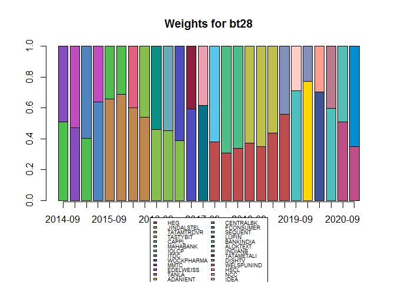

    ##                     HEG JINDALSTEL TATAMTRDVR TASTYBIT CAPPL MAHABANK IOLCP
    ## 2019-09-27 05:30:00   0          0          0        0     0        0 0.711
    ## 2019-12-27 05:30:00   0          0          0        0     0        0 0.000
    ## 2020-03-27 05:30:00   0          0          0        0     0        0 0.000
    ## 2020-06-26 05:30:00   0          0          0        0     0        0 0.598
    ## 2020-09-25 05:30:00   0          0          0        0     0        0 0.000
    ## 2020-12-18 05:30:00   0          0          0        0     0        0 0.000
    ##                     ITDC WOCKPHARMA MMTC EDELWEISS TANLA ADANIENT   GMM
    ## 2019-09-27 05:30:00    0          0    0         0 0.000    0.000 0.000
    ## 2019-12-27 05:30:00    0          0    0         0 0.000    0.774 0.000
    ## 2020-03-27 05:30:00    0          0    0         0 0.000    0.000 0.704
    ## 2020-06-26 05:30:00    0          0    0         0 0.000    0.000 0.000
    ## 2020-09-25 05:30:00    0          0    0         0 0.509    0.000 0.000
    ## 2020-12-18 05:30:00    0          0    0         0 0.350    0.000 0.000
    ##                     CENTRALBK FCONSUMER SEQUENT LUPIN BANKINDIA ALOKTEXT
    ## 2019-09-27 05:30:00     0.000      0.00       0     0         0        0
    ## 2019-12-27 05:30:00     0.226      0.00       0     0         0        0
    ## 2020-03-27 05:30:00     0.000      0.00       0     0         0        0
    ## 2020-06-26 05:30:00     0.000      0.00       0     0         0        0
    ## 2020-09-25 05:30:00     0.000      0.00       0     0         0        0
    ## 2020-12-18 05:30:00     0.000      0.65       0     0         0        0
    ##                     INDIANB TATAMETALI DISHTV WELSPUNIND HSCL   NCC  IDEA
    ## 2019-09-27 05:30:00   0.000          0  0.000          0    0 0.000 0.289
    ## 2019-12-27 05:30:00   0.000          0  0.000          0    0 0.000 0.000
    ## 2020-03-27 05:30:00   0.000          0  0.000          0    0 0.296 0.000
    ## 2020-06-26 05:30:00   0.000          0  0.402          0    0 0.000 0.000
    ## 2020-09-25 05:30:00   0.491          0  0.000          0    0 0.000 0.000
    ## 2020-12-18 05:30:00   0.000          0  0.000          0    0 0.000 0.000


    ##                       TCS CHOLAFIN ABBOTINDIA   IGL RESPONIND ECLERX SOLARINDS
    ## 2019-09-27 05:30:00 0.223        0      0.070 0.000     0.109      0         0
    ## 2019-12-27 05:30:00 0.286        0      0.082 0.000     0.124      0         0
    ## 2020-03-27 05:30:00 0.000        0      0.381 0.000     0.190      0         0
    ## 2020-06-26 05:30:00 0.000        0      0.211 0.000     0.000      0         0
    ## 2020-09-25 05:30:00 0.000        0      0.000 0.000     0.181      0         0
    ## 2020-12-18 05:30:00 0.000        0      0.225 0.053     0.178      0         0
    ##                     HDFCBANK IOC BRITANNIA POWERGRID   GMM  INFY SWANENERGY
    ## 2019-09-27 05:30:00        0   0         0         0 0.032 0.098          0
    ## 2019-12-27 05:30:00        0   0         0         0 0.040 0.047          0
    ## 2020-03-27 05:30:00        0   0         0         0 0.221 0.000          0
    ## 2020-06-26 05:30:00        0   0         0         0 0.225 0.000          0
    ## 2020-09-25 05:30:00        0   0         0         0 0.000 0.075          0
    ## 2020-12-18 05:30:00        0   0         0         0 0.000 0.037          0
    ##                     NAUKRI PAGEIND HEG KRBL RAJESHEXPO IPCALAB HCLTECH SANOFI
    ## 2019-09-27 05:30:00  0.082       0   0    0          0   0.001   0.037      0
    ## 2019-12-27 05:30:00  0.096       0   0    0          0   0.015   0.000      0
    ## 2020-03-27 05:30:00  0.000       0   0    0          0   0.000   0.000      0
    ## 2020-06-26 05:30:00  0.000       0   0    0          0   0.033   0.000      0
    ## 2020-09-25 05:30:00  0.000       0   0    0          0   0.204   0.000      0
    ## 2020-12-18 05:30:00  0.000       0   0    0          0   0.116   0.000      0
    ##                     VAKRANGEE OMAXE ALKYLAMINE TECHM MINDAIND MPHASIS DIVISLAB
    ## 2019-09-27 05:30:00         0 0.000      0.000 0.000        0       0    0.000
    ## 2019-12-27 05:30:00         0 0.000      0.000 0.042        0       0    0.000
    ## 2020-03-27 05:30:00         0 0.000      0.000 0.000        0       0    0.069
    ## 2020-06-26 05:30:00         0 0.108      0.000 0.000        0       0    0.245
    ## 2020-09-25 05:30:00         0 0.000      0.158 0.000        0       0    0.000
    ## 2020-12-18 05:30:00         0 0.000      0.000 0.000        0       0    0.000
    ##                     JCHAC CANFINHOME NAVINFLUOR BATAINDIA HINDPETRO GRAPHITE
    ## 2019-09-27 05:30:00     0          0      0.000     0.000         0        0
    ## 2019-12-27 05:30:00     0          0      0.000     0.008         0        0
    ## 2020-03-27 05:30:00     0          0      0.097     0.000         0        0
    ## 2020-06-26 05:30:00     0          0      0.040     0.000         0        0
    ## 2020-09-25 05:30:00     0          0      0.118     0.000         0        0
    ## 2020-12-18 05:30:00     0          0      0.021     0.000         0        0
    ##                     POLYMED TITAN WESTLIFE IOLCP MINDTREE DHANUKA PGHH MRF
    ## 2019-09-27 05:30:00       0  0.04        0 0.023        0       0    0   0
    ## 2019-12-27 05:30:00       0  0.00        0 0.000        0       0    0   0
    ## 2020-03-27 05:30:00       0  0.00        0 0.000        0       0    0   0
    ## 2020-06-26 05:30:00       0  0.00        0 0.000        0       0    0   0
    ## 2020-09-25 05:30:00       0  0.00        0 0.000        0       0    0   0
    ## 2020-12-18 05:30:00       0  0.00        0 0.016        0       0    0   0
    ##                     RELAXO PHOENIXLTD MARICO TRENT NATCOPHARM BPCL AARTIDRUGS
    ## 2019-09-27 05:30:00      0          0      0 0.060          0    0        0.0
    ## 2019-12-27 05:30:00      0          0      0 0.134          0    0        0.0
    ## 2020-03-27 05:30:00      0          0      0 0.000          0    0        0.0
    ## 2020-06-26 05:30:00      0          0      0 0.000          0    0        0.0
    ## 2020-09-25 05:30:00      0          0      0 0.000          0    0        0.1
    ## 2020-12-18 05:30:00      0          0      0 0.000          0    0        0.0
    ##                     PIDILITIND INDIACEM NTPC LUPIN GDL GRINDWELL APOLLOHOSP
    ## 2019-09-27 05:30:00          0    0.000    0     0   0         0      0.000
    ## 2019-12-27 05:30:00          0    0.000    0     0   0         0      0.000
    ## 2020-03-27 05:30:00          0    0.000    0     0   0         0      0.000
    ## 2020-06-26 05:30:00          0    0.051    0     0   0         0      0.000
    ## 2020-09-25 05:30:00          0    0.023    0     0   0         0      0.078
    ## 2020-12-18 05:30:00          0    0.095    0     0   0         0      0.052
    ##                     RATNAMANI  SJVN ASTRAZEN INOXLEISUR CHENNPETRO KEC
    ## 2019-09-27 05:30:00         0 0.060    0.000      0.055          0   0
    ## 2019-12-27 05:30:00         0 0.003    0.000      0.000          0   0
    ## 2020-03-27 05:30:00         0 0.000    0.000      0.000          0   0
    ## 2020-06-26 05:30:00         0 0.000    0.000      0.000          0   0
    ## 2020-09-25 05:30:00         0 0.000    0.000      0.000          0   0
    ## 2020-12-18 05:30:00         0 0.000    0.011      0.000          0   0
    ##                     TTKPRESTIG HINDUNILVR GRANULES JBCHEPHARM APLAPOLLO
    ## 2019-09-27 05:30:00          0      0.000    0.000      0.000         0
    ## 2019-12-27 05:30:00          0      0.000    0.000      0.000         0
    ## 2020-03-27 05:30:00          0      0.041    0.000      0.000         0
    ## 2020-06-26 05:30:00          0      0.000    0.000      0.000         0
    ## 2020-09-25 05:30:00          0      0.000    0.000      0.062         0
    ## 2020-12-18 05:30:00          0      0.000    0.097      0.033         0
    ##                     WELSPUNIND AARTIIND JSWSTEEL TATAMETALI COROMANDEL
    ## 2019-09-27 05:30:00          0        0        0          0      0.000
    ## 2019-12-27 05:30:00          0        0        0          0      0.000
    ## 2020-03-27 05:30:00          0        0        0          0      0.000
    ## 2020-06-26 05:30:00          0        0        0          0      0.076
    ## 2020-09-25 05:30:00          0        0        0          0      0.000
    ## 2020-12-18 05:30:00          0        0        0          0      0.000
    ##                     TORNTPHARM
    ## 2019-09-27 05:30:00          0
    ## 2019-12-27 05:30:00          0
    ## 2020-03-27 05:30:00          0
    ## 2020-06-26 05:30:00          0
    ## 2020-09-25 05:30:00          0
    ## 2020-12-18 05:30:00          0


    ##                       TCS CHOLAFIN ABBOTINDIA   IGL RESPONIND ECLERX SOLARINDS
    ## 2019-09-27 05:30:00 0.223        0      0.070 0.000     0.109      0         0
    ## 2019-12-27 05:30:00 0.286        0      0.082 0.000     0.124      0         0
    ## 2020-03-27 05:30:00 0.000        0      0.381 0.000     0.190      0         0
    ## 2020-06-26 05:30:00 0.000        0      0.211 0.000     0.000      0         0
    ## 2020-09-25 05:30:00 0.000        0      0.000 0.000     0.181      0         0
    ## 2020-12-18 05:30:00 0.000        0      0.225 0.053     0.178      0         0
    ##                     HDFCBANK IOC BRITANNIA POWERGRID   GMM  INFY SWANENERGY
    ## 2019-09-27 05:30:00        0   0         0         0 0.032 0.098          0
    ## 2019-12-27 05:30:00        0   0         0         0 0.040 0.047          0
    ## 2020-03-27 05:30:00        0   0         0         0 0.221 0.000          0
    ## 2020-06-26 05:30:00        0   0         0         0 0.225 0.000          0
    ## 2020-09-25 05:30:00        0   0         0         0 0.000 0.075          0
    ## 2020-12-18 05:30:00        0   0         0         0 0.000 0.037          0
    ##                     NAUKRI PAGEIND HEG KRBL RAJESHEXPO IPCALAB HCLTECH SANOFI
    ## 2019-09-27 05:30:00  0.082       0   0    0          0   0.001   0.037      0
    ## 2019-12-27 05:30:00  0.096       0   0    0          0   0.015   0.000      0
    ## 2020-03-27 05:30:00  0.000       0   0    0          0   0.000   0.000      0
    ## 2020-06-26 05:30:00  0.000       0   0    0          0   0.033   0.000      0
    ## 2020-09-25 05:30:00  0.000       0   0    0          0   0.204   0.000      0
    ## 2020-12-18 05:30:00  0.000       0   0    0          0   0.116   0.000      0
    ##                     VAKRANGEE OMAXE ALKYLAMINE TECHM MINDAIND MPHASIS DIVISLAB
    ## 2019-09-27 05:30:00         0 0.000      0.000 0.000        0       0    0.000
    ## 2019-12-27 05:30:00         0 0.000      0.000 0.042        0       0    0.000
    ## 2020-03-27 05:30:00         0 0.000      0.000 0.000        0       0    0.069
    ## 2020-06-26 05:30:00         0 0.108      0.000 0.000        0       0    0.245
    ## 2020-09-25 05:30:00         0 0.000      0.158 0.000        0       0    0.000
    ## 2020-12-18 05:30:00         0 0.000      0.000 0.000        0       0    0.000
    ##                     JCHAC CANFINHOME NAVINFLUOR BATAINDIA HINDPETRO GRAPHITE
    ## 2019-09-27 05:30:00     0          0      0.000     0.000         0        0
    ## 2019-12-27 05:30:00     0          0      0.000     0.008         0        0
    ## 2020-03-27 05:30:00     0          0      0.097     0.000         0        0
    ## 2020-06-26 05:30:00     0          0      0.040     0.000         0        0
    ## 2020-09-25 05:30:00     0          0      0.118     0.000         0        0
    ## 2020-12-18 05:30:00     0          0      0.021     0.000         0        0
    ##                     POLYMED TITAN WESTLIFE IOLCP MINDTREE DHANUKA PGHH MRF
    ## 2019-09-27 05:30:00       0  0.04        0 0.023        0       0    0   0
    ## 2019-12-27 05:30:00       0  0.00        0 0.000        0       0    0   0
    ## 2020-03-27 05:30:00       0  0.00        0 0.000        0       0    0   0
    ## 2020-06-26 05:30:00       0  0.00        0 0.000        0       0    0   0
    ## 2020-09-25 05:30:00       0  0.00        0 0.000        0       0    0   0
    ## 2020-12-18 05:30:00       0  0.00        0 0.016        0       0    0   0
    ##                     RELAXO PHOENIXLTD MARICO TRENT NATCOPHARM BPCL AARTIDRUGS
    ## 2019-09-27 05:30:00      0          0      0 0.060          0    0        0.0
    ## 2019-12-27 05:30:00      0          0      0 0.134          0    0        0.0
    ## 2020-03-27 05:30:00      0          0      0 0.000          0    0        0.0
    ## 2020-06-26 05:30:00      0          0      0 0.000          0    0        0.0
    ## 2020-09-25 05:30:00      0          0      0 0.000          0    0        0.1
    ## 2020-12-18 05:30:00      0          0      0 0.000          0    0        0.0
    ##                     PIDILITIND INDIACEM NTPC LUPIN GDL GRINDWELL APOLLOHOSP
    ## 2019-09-27 05:30:00          0    0.000    0     0   0         0      0.000
    ## 2019-12-27 05:30:00          0    0.000    0     0   0         0      0.000
    ## 2020-03-27 05:30:00          0    0.000    0     0   0         0      0.000
    ## 2020-06-26 05:30:00          0    0.051    0     0   0         0      0.000
    ## 2020-09-25 05:30:00          0    0.023    0     0   0         0      0.078
    ## 2020-12-18 05:30:00          0    0.095    0     0   0         0      0.052
    ##                     RATNAMANI  SJVN ASTRAZEN INOXLEISUR CHENNPETRO KEC
    ## 2019-09-27 05:30:00         0 0.060    0.000      0.055          0   0
    ## 2019-12-27 05:30:00         0 0.003    0.000      0.000          0   0
    ## 2020-03-27 05:30:00         0 0.000    0.000      0.000          0   0
    ## 2020-06-26 05:30:00         0 0.000    0.000      0.000          0   0
    ## 2020-09-25 05:30:00         0 0.000    0.000      0.000          0   0
    ## 2020-12-18 05:30:00         0 0.000    0.011      0.000          0   0
    ##                     TTKPRESTIG HINDUNILVR GRANULES JBCHEPHARM APLAPOLLO
    ## 2019-09-27 05:30:00          0      0.000    0.000      0.000         0
    ## 2019-12-27 05:30:00          0      0.000    0.000      0.000         0
    ## 2020-03-27 05:30:00          0      0.041    0.000      0.000         0
    ## 2020-06-26 05:30:00          0      0.000    0.000      0.000         0
    ## 2020-09-25 05:30:00          0      0.000    0.000      0.062         0
    ## 2020-12-18 05:30:00          0      0.000    0.097      0.033         0
    ##                     WELSPUNIND AARTIIND JSWSTEEL TATAMETALI COROMANDEL
    ## 2019-09-27 05:30:00          0        0        0          0      0.000
    ## 2019-12-27 05:30:00          0        0        0          0      0.000
    ## 2020-03-27 05:30:00          0        0        0          0      0.000
    ## 2020-06-26 05:30:00          0        0        0          0      0.076
    ## 2020-09-25 05:30:00          0        0        0          0      0.000
    ## 2020-12-18 05:30:00          0        0        0          0      0.000
    ##                     TORNTPHARM
    ## 2019-09-27 05:30:00          0
    ## 2019-12-27 05:30:00          0
    ## 2020-03-27 05:30:00          0
    ## 2020-06-26 05:30:00          0
    ## 2020-09-25 05:30:00          0
    ## 2020-12-18 05:30:00          0


    ##                       TCS CHOLAFIN ABBOTINDIA   IGL RESPONIND ECLERX SOLARINDS
    ## 2019-09-27 05:30:00 0.223        0      0.070 0.000     0.109      0         0
    ## 2019-12-27 05:30:00 0.286        0      0.082 0.000     0.124      0         0
    ## 2020-03-27 05:30:00 0.000        0      0.381 0.000     0.190      0         0
    ## 2020-06-26 05:30:00 0.000        0      0.211 0.000     0.000      0         0
    ## 2020-09-25 05:30:00 0.000        0      0.000 0.000     0.181      0         0
    ## 2020-12-18 05:30:00 0.000        0      0.225 0.053     0.178      0         0
    ##                     HDFCBANK IOC BRITANNIA POWERGRID   GMM  INFY SWANENERGY
    ## 2019-09-27 05:30:00        0   0         0         0 0.032 0.098          0
    ## 2019-12-27 05:30:00        0   0         0         0 0.040 0.047          0
    ## 2020-03-27 05:30:00        0   0         0         0 0.221 0.000          0
    ## 2020-06-26 05:30:00        0   0         0         0 0.225 0.000          0
    ## 2020-09-25 05:30:00        0   0         0         0 0.000 0.075          0
    ## 2020-12-18 05:30:00        0   0         0         0 0.000 0.037          0
    ##                     NAUKRI PAGEIND HEG KRBL RAJESHEXPO IPCALAB HCLTECH SANOFI
    ## 2019-09-27 05:30:00  0.082       0   0    0          0   0.001   0.037      0
    ## 2019-12-27 05:30:00  0.096       0   0    0          0   0.015   0.000      0
    ## 2020-03-27 05:30:00  0.000       0   0    0          0   0.000   0.000      0
    ## 2020-06-26 05:30:00  0.000       0   0    0          0   0.033   0.000      0
    ## 2020-09-25 05:30:00  0.000       0   0    0          0   0.204   0.000      0
    ## 2020-12-18 05:30:00  0.000       0   0    0          0   0.116   0.000      0
    ##                     VAKRANGEE OMAXE ALKYLAMINE TECHM MINDAIND MPHASIS DIVISLAB
    ## 2019-09-27 05:30:00         0 0.000      0.000 0.000        0       0    0.000
    ## 2019-12-27 05:30:00         0 0.000      0.000 0.042        0       0    0.000
    ## 2020-03-27 05:30:00         0 0.000      0.000 0.000        0       0    0.069
    ## 2020-06-26 05:30:00         0 0.108      0.000 0.000        0       0    0.245
    ## 2020-09-25 05:30:00         0 0.000      0.158 0.000        0       0    0.000
    ## 2020-12-18 05:30:00         0 0.000      0.000 0.000        0       0    0.000
    ##                     JCHAC CANFINHOME NAVINFLUOR BATAINDIA HINDPETRO GRAPHITE
    ## 2019-09-27 05:30:00     0          0      0.000     0.000         0        0
    ## 2019-12-27 05:30:00     0          0      0.000     0.008         0        0
    ## 2020-03-27 05:30:00     0          0      0.097     0.000         0        0
    ## 2020-06-26 05:30:00     0          0      0.040     0.000         0        0
    ## 2020-09-25 05:30:00     0          0      0.118     0.000         0        0
    ## 2020-12-18 05:30:00     0          0      0.021     0.000         0        0
    ##                     POLYMED TITAN WESTLIFE IOLCP MINDTREE DHANUKA PGHH MRF
    ## 2019-09-27 05:30:00       0  0.04        0 0.023        0       0    0   0
    ## 2019-12-27 05:30:00       0  0.00        0 0.000        0       0    0   0
    ## 2020-03-27 05:30:00       0  0.00        0 0.000        0       0    0   0
    ## 2020-06-26 05:30:00       0  0.00        0 0.000        0       0    0   0
    ## 2020-09-25 05:30:00       0  0.00        0 0.000        0       0    0   0
    ## 2020-12-18 05:30:00       0  0.00        0 0.016        0       0    0   0
    ##                     RELAXO PHOENIXLTD MARICO TRENT NATCOPHARM BPCL AARTIDRUGS
    ## 2019-09-27 05:30:00      0          0      0 0.060          0    0        0.0
    ## 2019-12-27 05:30:00      0          0      0 0.134          0    0        0.0
    ## 2020-03-27 05:30:00      0          0      0 0.000          0    0        0.0
    ## 2020-06-26 05:30:00      0          0      0 0.000          0    0        0.0
    ## 2020-09-25 05:30:00      0          0      0 0.000          0    0        0.1
    ## 2020-12-18 05:30:00      0          0      0 0.000          0    0        0.0
    ##                     PIDILITIND INDIACEM NTPC LUPIN GDL GRINDWELL APOLLOHOSP
    ## 2019-09-27 05:30:00          0    0.000    0     0   0         0      0.000
    ## 2019-12-27 05:30:00          0    0.000    0     0   0         0      0.000
    ## 2020-03-27 05:30:00          0    0.000    0     0   0         0      0.000
    ## 2020-06-26 05:30:00          0    0.051    0     0   0         0      0.000
    ## 2020-09-25 05:30:00          0    0.023    0     0   0         0      0.078
    ## 2020-12-18 05:30:00          0    0.095    0     0   0         0      0.052
    ##                     RATNAMANI  SJVN ASTRAZEN INOXLEISUR CHENNPETRO KEC
    ## 2019-09-27 05:30:00         0 0.060    0.000      0.055          0   0
    ## 2019-12-27 05:30:00         0 0.003    0.000      0.000          0   0
    ## 2020-03-27 05:30:00         0 0.000    0.000      0.000          0   0
    ## 2020-06-26 05:30:00         0 0.000    0.000      0.000          0   0
    ## 2020-09-25 05:30:00         0 0.000    0.000      0.000          0   0
    ## 2020-12-18 05:30:00         0 0.000    0.011      0.000          0   0
    ##                     TTKPRESTIG HINDUNILVR GRANULES JBCHEPHARM APLAPOLLO
    ## 2019-09-27 05:30:00          0      0.000    0.000      0.000         0
    ## 2019-12-27 05:30:00          0      0.000    0.000      0.000         0
    ## 2020-03-27 05:30:00          0      0.041    0.000      0.000         0
    ## 2020-06-26 05:30:00          0      0.000    0.000      0.000         0
    ## 2020-09-25 05:30:00          0      0.000    0.000      0.062         0
    ## 2020-12-18 05:30:00          0      0.000    0.097      0.033         0
    ##                     WELSPUNIND AARTIIND JSWSTEEL TATAMETALI COROMANDEL
    ## 2019-09-27 05:30:00          0        0        0          0      0.000
    ## 2019-12-27 05:30:00          0        0        0          0      0.000
    ## 2020-03-27 05:30:00          0        0        0          0      0.000
    ## 2020-06-26 05:30:00          0        0        0          0      0.076
    ## 2020-09-25 05:30:00          0        0        0          0      0.000
    ## 2020-12-18 05:30:00          0        0        0          0      0.000
    ##                     TORNTPHARM
    ## 2019-09-27 05:30:00          0
    ## 2019-12-27 05:30:00          0
    ## 2020-03-27 05:30:00          0
    ## 2020-06-26 05:30:00          0
    ## 2020-09-25 05:30:00          0
    ## 2020-12-18 05:30:00          0


    ##                     HEG CAPPL TASTYBIT TANLA EDELWEISS IOLCP ADANIENT
    ## 2019-09-27 05:30:00   0     0        0     0         0     1        0
    ## 2019-12-27 05:30:00   0     0        0     0         0     0        1
    ## 2020-03-27 05:30:00   0     0        0     0         0     0        0
    ## 2020-06-26 05:30:00   0     0        0     0         0     1        0
    ## 2020-09-25 05:30:00   0     0        0     1         0     0        0
    ## 2020-12-18 05:30:00   0     0        0     1         0     0        0
    ##                     WELSPUNIND GMM TATAMETALI HSCL
    ## 2019-09-27 05:30:00          0   0          0    0
    ## 2019-12-27 05:30:00          0   0          0    0
    ## 2020-03-27 05:30:00          0   1          0    0
    ## 2020-06-26 05:30:00          0   0          0    0
    ## 2020-09-25 05:30:00          0   0          0    0
    ## 2020-12-18 05:30:00          0   0          0    0


    ##                     RESPONIND   TCS SANOFI  INFY SWANENERGY ABBOTINDIA WESTLIFE
    ## 2015-12-24 05:30:00     0.000 0.000  0.000 0.000      0.137      0.103        0
    ## 2016-12-30 05:30:00     0.000 0.000  0.000 0.034      0.144      0.000        0
    ## 2017-12-29 05:30:00     0.000 0.000  0.000 0.000      0.000      0.000        0
    ## 2018-12-28 05:30:00     0.166 0.259  0.149 0.000      0.000      0.000        0
    ## 2019-12-27 05:30:00     0.000 0.032  0.000 0.208      0.000      0.063        0
    ## 2020-12-18 05:30:00     0.431 0.000  0.000 0.000      0.000      0.098        0
    ##                     CHOLAFIN ECLERX PAGEIND MOTILALOFS BLUESTARCO   IGL
    ## 2015-12-24 05:30:00    0.000  0.174       0      0.000      0.000 0.000
    ## 2016-12-30 05:30:00    0.228  0.000       0      0.000      0.000 0.069
    ## 2017-12-29 05:30:00    0.000  0.000       0      0.154      0.045 0.068
    ## 2018-12-28 05:30:00    0.000  0.000       0      0.000      0.000 0.000
    ## 2019-12-27 05:30:00    0.000  0.000       0      0.000      0.109 0.011
    ## 2020-12-18 05:30:00    0.000  0.000       0      0.000      0.000 0.000
    ##                     TORNTPHARM DHANUKA ALKYLAMINE GRANULES HCLTECH MINDAIND
    ## 2015-12-24 05:30:00      0.000    0.00          0    0.000   0.000    0.015
    ## 2016-12-30 05:30:00      0.000    0.14          0    0.000   0.000    0.000
    ## 2017-12-29 05:30:00      0.000    0.00          0    0.000   0.000    0.097
    ## 2018-12-28 05:30:00      0.141    0.00          0    0.000   0.038    0.000
    ## 2019-12-27 05:30:00      0.000    0.00          0    0.099   0.000    0.000
    ## 2020-12-18 05:30:00      0.000    0.00          0    0.028   0.000    0.000
    ##                     GRAPHITE OMAXE VAIBHAVGBL SEQUENT MOIL CARBORUNIV
    ## 2015-12-24 05:30:00    0.000 0.000          0   0.101  0.0      0.094
    ## 2016-12-30 05:30:00    0.000 0.000          0   0.000  0.1      0.000
    ## 2017-12-29 05:30:00    0.111 0.000          0   0.000  0.0      0.000
    ## 2018-12-28 05:30:00    0.000 0.000          0   0.000  0.0      0.000
    ## 2019-12-27 05:30:00    0.000 0.000          0   0.000  0.0      0.000
    ## 2020-12-18 05:30:00    0.000 0.109          0   0.001  0.0      0.000
    ##                     BAJAJHLDNG BALRAMCHIN NAVINFLUOR DRREDDY  BPCL  KRBL
    ## 2015-12-24 05:30:00      0.000      0.000      0.000   0.000 0.005 0.038
    ## 2016-12-30 05:30:00      0.000      0.073      0.000   0.000 0.083 0.000
    ## 2017-12-29 05:30:00      0.019      0.000      0.000   0.000 0.000 0.000
    ## 2018-12-28 05:30:00      0.000      0.000      0.000   0.000 0.000 0.000
    ## 2019-12-27 05:30:00      0.075      0.020      0.000   0.000 0.000 0.000
    ## 2020-12-18 05:30:00      0.000      0.000      0.092   0.028 0.000 0.000
    ##                     JYOTHYLAB   HEG RELAXO RATNAMANI TRENT INDIACEM VAKRANGEE
    ## 2015-12-24 05:30:00     0.016 0.000  0.000         0 0.000    0.000     0.000
    ## 2016-12-30 05:30:00     0.000 0.000  0.000         0 0.000    0.000     0.000
    ## 2017-12-29 05:30:00     0.000 0.039  0.075         0 0.000    0.000     0.071
    ## 2018-12-28 05:30:00     0.072 0.044  0.000         0 0.000    0.000     0.000
    ## 2019-12-27 05:30:00     0.000 0.000  0.006         0 0.077    0.000     0.000
    ## 2020-12-18 05:30:00     0.000 0.000  0.000         0 0.000    0.075     0.000
    ##                     IOLCP GESHIP ASTRAL ITC NATCOPHARM  IDEA IPCALAB MPHASIS
    ## 2015-12-24 05:30:00 0.022   0.04  0.000   0          0 0.000   0.000   0.059
    ## 2016-12-30 05:30:00 0.000   0.00  0.000   0          0 0.000   0.000   0.000
    ## 2017-12-29 05:30:00 0.000   0.00  0.067   0          0 0.000   0.000   0.000
    ## 2018-12-28 05:30:00 0.000   0.00  0.000   0          0 0.000   0.000   0.000
    ## 2019-12-27 05:30:00 0.000   0.00  0.000   0          0 0.000   0.061   0.000
    ## 2020-12-18 05:30:00 0.000   0.00  0.000   0          0 0.061   0.000   0.000
    ##                      PGHH CYIENT SYMPHONY GODREJCP TECHM BRIGADE  BBTC
    ## 2015-12-24 05:30:00 0.000      0        0    0.057 0.000   0.000 0.000
    ## 2016-12-30 05:30:00 0.058      0        0    0.000 0.000   0.000 0.000
    ## 2017-12-29 05:30:00 0.000      0        0    0.000 0.000   0.000 0.051
    ## 2018-12-28 05:30:00 0.000      0        0    0.000 0.049   0.000 0.000
    ## 2019-12-27 05:30:00 0.000      0        0    0.000 0.006   0.052 0.000
    ## 2020-12-18 05:30:00 0.000      0        0    0.000 0.000   0.000 0.000
    ##                     REDINGTON HINDZINC KOTAKBANK SOLARINDS   UPL JCHAC
    ## 2015-12-24 05:30:00     0.000    0.000     0.000         0 0.046     0
    ## 2016-12-30 05:30:00     0.000    0.048     0.000         0 0.000     0
    ## 2017-12-29 05:30:00     0.006    0.000     0.000         0 0.000     0
    ## 2018-12-28 05:30:00     0.000    0.000     0.000         0 0.000     0
    ## 2019-12-27 05:30:00     0.043    0.000     0.047         0 0.000     0
    ## 2020-12-18 05:30:00     0.000    0.000     0.000         0 0.000     0
    ##                     PERSISTENT JKTYRE SUNTECK TATASTEEL WIPRO RAJESHEXPO
    ## 2015-12-24 05:30:00      0.000      0   0.000     0.000 0.000      0.035
    ## 2016-12-30 05:30:00      0.000      0   0.000     0.000 0.000      0.000
    ## 2017-12-29 05:30:00      0.000      0   0.039     0.037 0.000      0.000
    ## 2018-12-28 05:30:00      0.000      0   0.000     0.000 0.006      0.000
    ## 2019-12-27 05:30:00      0.003      0   0.000     0.000 0.000      0.000
    ## 2020-12-18 05:30:00      0.040      0   0.000     0.000 0.000      0.000
    ##                     POLYMED WELSPUNIND ALLCARGO DCMSHRIRAM HINDPETRO CANFINHOME
    ## 2015-12-24 05:30:00       0          0        0       0.00     0.000          0
    ## 2016-12-30 05:30:00       0          0        0       0.00     0.000          0
    ## 2017-12-29 05:30:00       0          0        0       0.00     0.022          0
    ## 2018-12-28 05:30:00       0          0        0       0.00     0.000          0
    ## 2019-12-27 05:30:00       0          0        0       0.03     0.000          0
    ## 2020-12-18 05:30:00       0          0        0       0.00     0.000          0
    ##                     BEL ICICIBANK AARTIIND  DCAL
    ## 2015-12-24 05:30:00   0     0.000    0.000 0.021
    ## 2016-12-30 05:30:00   0     0.000    0.000 0.000
    ## 2017-12-29 05:30:00   0     0.024    0.000 0.000
    ## 2018-12-28 05:30:00   0     0.000    0.023 0.000
    ## 2019-12-27 05:30:00   0     0.000    0.000 0.000
    ## 2020-12-18 05:30:00   0     0.000    0.000 0.000


    ##                     RESPONIND   TCS SANOFI  INFY SWANENERGY ABBOTINDIA WESTLIFE
    ## 2015-12-24 05:30:00     0.000 0.000  0.000 0.000      0.137      0.103        0
    ## 2016-12-30 05:30:00     0.000 0.000  0.000 0.034      0.144      0.000        0
    ## 2017-12-29 05:30:00     0.000 0.000  0.000 0.000      0.000      0.000        0
    ## 2018-12-28 05:30:00     0.166 0.259  0.149 0.000      0.000      0.000        0
    ## 2019-12-27 05:30:00     0.000 0.032  0.000 0.208      0.000      0.063        0
    ## 2020-12-18 05:30:00     0.431 0.000  0.000 0.000      0.000      0.098        0
    ##                     CHOLAFIN ECLERX PAGEIND MOTILALOFS BLUESTARCO   IGL
    ## 2015-12-24 05:30:00    0.000  0.174       0      0.000      0.000 0.000
    ## 2016-12-30 05:30:00    0.228  0.000       0      0.000      0.000 0.069
    ## 2017-12-29 05:30:00    0.000  0.000       0      0.154      0.045 0.068
    ## 2018-12-28 05:30:00    0.000  0.000       0      0.000      0.000 0.000
    ## 2019-12-27 05:30:00    0.000  0.000       0      0.000      0.109 0.011
    ## 2020-12-18 05:30:00    0.000  0.000       0      0.000      0.000 0.000
    ##                     TORNTPHARM DHANUKA ALKYLAMINE GRANULES HCLTECH MINDAIND
    ## 2015-12-24 05:30:00      0.000    0.00          0    0.000   0.000    0.015
    ## 2016-12-30 05:30:00      0.000    0.14          0    0.000   0.000    0.000
    ## 2017-12-29 05:30:00      0.000    0.00          0    0.000   0.000    0.097
    ## 2018-12-28 05:30:00      0.141    0.00          0    0.000   0.038    0.000
    ## 2019-12-27 05:30:00      0.000    0.00          0    0.099   0.000    0.000
    ## 2020-12-18 05:30:00      0.000    0.00          0    0.028   0.000    0.000
    ##                     GRAPHITE OMAXE VAIBHAVGBL SEQUENT MOIL CARBORUNIV
    ## 2015-12-24 05:30:00    0.000 0.000          0   0.101  0.0      0.094
    ## 2016-12-30 05:30:00    0.000 0.000          0   0.000  0.1      0.000
    ## 2017-12-29 05:30:00    0.111 0.000          0   0.000  0.0      0.000
    ## 2018-12-28 05:30:00    0.000 0.000          0   0.000  0.0      0.000
    ## 2019-12-27 05:30:00    0.000 0.000          0   0.000  0.0      0.000
    ## 2020-12-18 05:30:00    0.000 0.109          0   0.001  0.0      0.000
    ##                     BAJAJHLDNG BALRAMCHIN NAVINFLUOR DRREDDY  BPCL  KRBL
    ## 2015-12-24 05:30:00      0.000      0.000      0.000   0.000 0.005 0.038
    ## 2016-12-30 05:30:00      0.000      0.073      0.000   0.000 0.083 0.000
    ## 2017-12-29 05:30:00      0.019      0.000      0.000   0.000 0.000 0.000
    ## 2018-12-28 05:30:00      0.000      0.000      0.000   0.000 0.000 0.000
    ## 2019-12-27 05:30:00      0.075      0.020      0.000   0.000 0.000 0.000
    ## 2020-12-18 05:30:00      0.000      0.000      0.092   0.028 0.000 0.000
    ##                     JYOTHYLAB   HEG RELAXO RATNAMANI TRENT INDIACEM VAKRANGEE
    ## 2015-12-24 05:30:00     0.016 0.000  0.000         0 0.000    0.000     0.000
    ## 2016-12-30 05:30:00     0.000 0.000  0.000         0 0.000    0.000     0.000
    ## 2017-12-29 05:30:00     0.000 0.039  0.075         0 0.000    0.000     0.071
    ## 2018-12-28 05:30:00     0.072 0.044  0.000         0 0.000    0.000     0.000
    ## 2019-12-27 05:30:00     0.000 0.000  0.006         0 0.077    0.000     0.000
    ## 2020-12-18 05:30:00     0.000 0.000  0.000         0 0.000    0.075     0.000
    ##                     IOLCP GESHIP ASTRAL ITC NATCOPHARM  IDEA IPCALAB MPHASIS
    ## 2015-12-24 05:30:00 0.022   0.04  0.000   0          0 0.000   0.000   0.059
    ## 2016-12-30 05:30:00 0.000   0.00  0.000   0          0 0.000   0.000   0.000
    ## 2017-12-29 05:30:00 0.000   0.00  0.067   0          0 0.000   0.000   0.000
    ## 2018-12-28 05:30:00 0.000   0.00  0.000   0          0 0.000   0.000   0.000
    ## 2019-12-27 05:30:00 0.000   0.00  0.000   0          0 0.000   0.061   0.000
    ## 2020-12-18 05:30:00 0.000   0.00  0.000   0          0 0.061   0.000   0.000
    ##                      PGHH CYIENT SYMPHONY GODREJCP TECHM BRIGADE  BBTC
    ## 2015-12-24 05:30:00 0.000      0        0    0.057 0.000   0.000 0.000
    ## 2016-12-30 05:30:00 0.058      0        0    0.000 0.000   0.000 0.000
    ## 2017-12-29 05:30:00 0.000      0        0    0.000 0.000   0.000 0.051
    ## 2018-12-28 05:30:00 0.000      0        0    0.000 0.049   0.000 0.000
    ## 2019-12-27 05:30:00 0.000      0        0    0.000 0.006   0.052 0.000
    ## 2020-12-18 05:30:00 0.000      0        0    0.000 0.000   0.000 0.000
    ##                     REDINGTON HINDZINC KOTAKBANK SOLARINDS   UPL JCHAC
    ## 2015-12-24 05:30:00     0.000    0.000     0.000         0 0.046     0
    ## 2016-12-30 05:30:00     0.000    0.048     0.000         0 0.000     0
    ## 2017-12-29 05:30:00     0.006    0.000     0.000         0 0.000     0
    ## 2018-12-28 05:30:00     0.000    0.000     0.000         0 0.000     0
    ## 2019-12-27 05:30:00     0.043    0.000     0.047         0 0.000     0
    ## 2020-12-18 05:30:00     0.000    0.000     0.000         0 0.000     0
    ##                     PERSISTENT JKTYRE SUNTECK TATASTEEL WIPRO RAJESHEXPO
    ## 2015-12-24 05:30:00      0.000      0   0.000     0.000 0.000      0.035
    ## 2016-12-30 05:30:00      0.000      0   0.000     0.000 0.000      0.000
    ## 2017-12-29 05:30:00      0.000      0   0.039     0.037 0.000      0.000
    ## 2018-12-28 05:30:00      0.000      0   0.000     0.000 0.006      0.000
    ## 2019-12-27 05:30:00      0.003      0   0.000     0.000 0.000      0.000
    ## 2020-12-18 05:30:00      0.040      0   0.000     0.000 0.000      0.000
    ##                     POLYMED WELSPUNIND ALLCARGO DCMSHRIRAM HINDPETRO CANFINHOME
    ## 2015-12-24 05:30:00       0          0        0       0.00     0.000          0
    ## 2016-12-30 05:30:00       0          0        0       0.00     0.000          0
    ## 2017-12-29 05:30:00       0          0        0       0.00     0.022          0
    ## 2018-12-28 05:30:00       0          0        0       0.00     0.000          0
    ## 2019-12-27 05:30:00       0          0        0       0.03     0.000          0
    ## 2020-12-18 05:30:00       0          0        0       0.00     0.000          0
    ##                     BEL ICICIBANK AARTIIND  DCAL
    ## 2015-12-24 05:30:00   0     0.000    0.000 0.021
    ## 2016-12-30 05:30:00   0     0.000    0.000 0.000
    ## 2017-12-29 05:30:00   0     0.024    0.000 0.000
    ## 2018-12-28 05:30:00   0     0.000    0.023 0.000
    ## 2019-12-27 05:30:00   0     0.000    0.000 0.000
    ## 2020-12-18 05:30:00   0     0.000    0.000 0.000


    ##                     RESPONIND   TCS SANOFI  INFY SWANENERGY ABBOTINDIA WESTLIFE
    ## 2015-12-24 05:30:00     0.000 0.000  0.000 0.000      0.137      0.103        0
    ## 2016-12-30 05:30:00     0.000 0.000  0.000 0.034      0.144      0.000        0
    ## 2017-12-29 05:30:00     0.000 0.000  0.000 0.000      0.000      0.000        0
    ## 2018-12-28 05:30:00     0.166 0.259  0.149 0.000      0.000      0.000        0
    ## 2019-12-27 05:30:00     0.000 0.032  0.000 0.208      0.000      0.063        0
    ## 2020-12-18 05:30:00     0.431 0.000  0.000 0.000      0.000      0.098        0
    ##                     CHOLAFIN ECLERX PAGEIND MOTILALOFS BLUESTARCO   IGL
    ## 2015-12-24 05:30:00    0.000  0.174       0      0.000      0.000 0.000
    ## 2016-12-30 05:30:00    0.228  0.000       0      0.000      0.000 0.069
    ## 2017-12-29 05:30:00    0.000  0.000       0      0.154      0.045 0.068
    ## 2018-12-28 05:30:00    0.000  0.000       0      0.000      0.000 0.000
    ## 2019-12-27 05:30:00    0.000  0.000       0      0.000      0.109 0.011
    ## 2020-12-18 05:30:00    0.000  0.000       0      0.000      0.000 0.000
    ##                     TORNTPHARM DHANUKA ALKYLAMINE GRANULES HCLTECH MINDAIND
    ## 2015-12-24 05:30:00      0.000    0.00          0    0.000   0.000    0.015
    ## 2016-12-30 05:30:00      0.000    0.14          0    0.000   0.000    0.000
    ## 2017-12-29 05:30:00      0.000    0.00          0    0.000   0.000    0.097
    ## 2018-12-28 05:30:00      0.141    0.00          0    0.000   0.038    0.000
    ## 2019-12-27 05:30:00      0.000    0.00          0    0.099   0.000    0.000
    ## 2020-12-18 05:30:00      0.000    0.00          0    0.028   0.000    0.000
    ##                     GRAPHITE OMAXE VAIBHAVGBL SEQUENT MOIL CARBORUNIV
    ## 2015-12-24 05:30:00    0.000 0.000          0   0.101  0.0      0.094
    ## 2016-12-30 05:30:00    0.000 0.000          0   0.000  0.1      0.000
    ## 2017-12-29 05:30:00    0.111 0.000          0   0.000  0.0      0.000
    ## 2018-12-28 05:30:00    0.000 0.000          0   0.000  0.0      0.000
    ## 2019-12-27 05:30:00    0.000 0.000          0   0.000  0.0      0.000
    ## 2020-12-18 05:30:00    0.000 0.109          0   0.001  0.0      0.000
    ##                     BAJAJHLDNG BALRAMCHIN NAVINFLUOR DRREDDY  BPCL  KRBL
    ## 2015-12-24 05:30:00      0.000      0.000      0.000   0.000 0.005 0.038
    ## 2016-12-30 05:30:00      0.000      0.073      0.000   0.000 0.083 0.000
    ## 2017-12-29 05:30:00      0.019      0.000      0.000   0.000 0.000 0.000
    ## 2018-12-28 05:30:00      0.000      0.000      0.000   0.000 0.000 0.000
    ## 2019-12-27 05:30:00      0.075      0.020      0.000   0.000 0.000 0.000
    ## 2020-12-18 05:30:00      0.000      0.000      0.092   0.028 0.000 0.000
    ##                     JYOTHYLAB   HEG RELAXO RATNAMANI TRENT INDIACEM VAKRANGEE
    ## 2015-12-24 05:30:00     0.016 0.000  0.000         0 0.000    0.000     0.000
    ## 2016-12-30 05:30:00     0.000 0.000  0.000         0 0.000    0.000     0.000
    ## 2017-12-29 05:30:00     0.000 0.039  0.075         0 0.000    0.000     0.071
    ## 2018-12-28 05:30:00     0.072 0.044  0.000         0 0.000    0.000     0.000
    ## 2019-12-27 05:30:00     0.000 0.000  0.006         0 0.077    0.000     0.000
    ## 2020-12-18 05:30:00     0.000 0.000  0.000         0 0.000    0.075     0.000
    ##                     IOLCP GESHIP ASTRAL ITC NATCOPHARM  IDEA IPCALAB MPHASIS
    ## 2015-12-24 05:30:00 0.022   0.04  0.000   0          0 0.000   0.000   0.059
    ## 2016-12-30 05:30:00 0.000   0.00  0.000   0          0 0.000   0.000   0.000
    ## 2017-12-29 05:30:00 0.000   0.00  0.067   0          0 0.000   0.000   0.000
    ## 2018-12-28 05:30:00 0.000   0.00  0.000   0          0 0.000   0.000   0.000
    ## 2019-12-27 05:30:00 0.000   0.00  0.000   0          0 0.000   0.061   0.000
    ## 2020-12-18 05:30:00 0.000   0.00  0.000   0          0 0.061   0.000   0.000
    ##                      PGHH CYIENT SYMPHONY GODREJCP TECHM BRIGADE  BBTC
    ## 2015-12-24 05:30:00 0.000      0        0    0.057 0.000   0.000 0.000
    ## 2016-12-30 05:30:00 0.058      0        0    0.000 0.000   0.000 0.000
    ## 2017-12-29 05:30:00 0.000      0        0    0.000 0.000   0.000 0.051
    ## 2018-12-28 05:30:00 0.000      0        0    0.000 0.049   0.000 0.000
    ## 2019-12-27 05:30:00 0.000      0        0    0.000 0.006   0.052 0.000
    ## 2020-12-18 05:30:00 0.000      0        0    0.000 0.000   0.000 0.000
    ##                     REDINGTON HINDZINC KOTAKBANK SOLARINDS   UPL JCHAC
    ## 2015-12-24 05:30:00     0.000    0.000     0.000         0 0.046     0
    ## 2016-12-30 05:30:00     0.000    0.048     0.000         0 0.000     0
    ## 2017-12-29 05:30:00     0.006    0.000     0.000         0 0.000     0
    ## 2018-12-28 05:30:00     0.000    0.000     0.000         0 0.000     0
    ## 2019-12-27 05:30:00     0.043    0.000     0.047         0 0.000     0
    ## 2020-12-18 05:30:00     0.000    0.000     0.000         0 0.000     0
    ##                     PERSISTENT JKTYRE SUNTECK TATASTEEL WIPRO RAJESHEXPO
    ## 2015-12-24 05:30:00      0.000      0   0.000     0.000 0.000      0.035
    ## 2016-12-30 05:30:00      0.000      0   0.000     0.000 0.000      0.000
    ## 2017-12-29 05:30:00      0.000      0   0.039     0.037 0.000      0.000
    ## 2018-12-28 05:30:00      0.000      0   0.000     0.000 0.006      0.000
    ## 2019-12-27 05:30:00      0.003      0   0.000     0.000 0.000      0.000
    ## 2020-12-18 05:30:00      0.040      0   0.000     0.000 0.000      0.000
    ##                     POLYMED WELSPUNIND ALLCARGO DCMSHRIRAM HINDPETRO CANFINHOME
    ## 2015-12-24 05:30:00       0          0        0       0.00     0.000          0
    ## 2016-12-30 05:30:00       0          0        0       0.00     0.000          0
    ## 2017-12-29 05:30:00       0          0        0       0.00     0.022          0
    ## 2018-12-28 05:30:00       0          0        0       0.00     0.000          0
    ## 2019-12-27 05:30:00       0          0        0       0.03     0.000          0
    ## 2020-12-18 05:30:00       0          0        0       0.00     0.000          0
    ##                     BEL ICICIBANK AARTIIND  DCAL
    ## 2015-12-24 05:30:00   0     0.000    0.000 0.021
    ## 2016-12-30 05:30:00   0     0.000    0.000 0.000
    ## 2017-12-29 05:30:00   0     0.024    0.000 0.000
    ## 2018-12-28 05:30:00   0     0.000    0.023 0.000
    ## 2019-12-27 05:30:00   0     0.000    0.000 0.000
    ## 2020-12-18 05:30:00   0     0.000    0.000 0.000

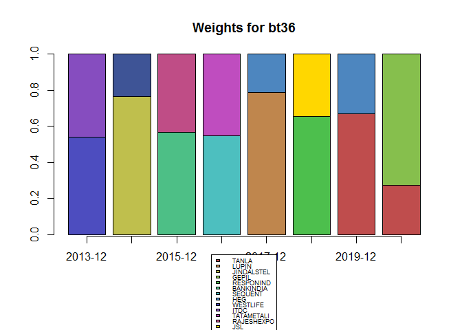

    ##                     TANLA LUPIN JINDALSTEL GEPIL RESPONIND BANKINDIA SEQUENT
    ## 2015-12-24 05:30:00 0.000 0.000          0 0.000     0.000     0.568   0.000
    ## 2016-12-30 05:30:00 0.000 0.000          0 0.000     0.000     0.000   0.546
    ## 2017-12-29 05:30:00 0.000 0.787          0 0.000     0.000     0.000   0.000
    ## 2018-12-28 05:30:00 0.000 0.000          0 0.000     0.656     0.000   0.000
    ## 2019-12-27 05:30:00 0.670 0.000          0 0.000     0.000     0.000   0.000
    ## 2020-12-18 05:30:00 0.273 0.000          0 0.727     0.000     0.000   0.000
    ##                       HEG WESTLIFE ITDC TATAMETALI RAJESHEXPO   JSL EDELWEISS
    ## 2015-12-24 05:30:00 0.000        0    0      0.000      0.432 0.000         0
    ## 2016-12-30 05:30:00 0.000        0    0      0.454      0.000 0.000         0
    ## 2017-12-29 05:30:00 0.213        0    0      0.000      0.000 0.000         0
    ## 2018-12-28 05:30:00 0.000        0    0      0.000      0.000 0.344         0
    ## 2019-12-27 05:30:00 0.330        0    0      0.000      0.000 0.000         0
    ## 2020-12-18 05:30:00 0.000        0    0      0.000      0.000 0.000         0


    ##                     RESPONIND   TCS SANOFI  INFY SWANENERGY ABBOTINDIA WESTLIFE
    ## 2015-12-24 05:30:00     0.000 0.000  0.000 0.000      0.137      0.103        0
    ## 2016-12-30 05:30:00     0.000 0.000  0.000 0.034      0.144      0.000        0
    ## 2017-12-29 05:30:00     0.000 0.000  0.000 0.000      0.000      0.000        0
    ## 2018-12-28 05:30:00     0.166 0.259  0.149 0.000      0.000      0.000        0
    ## 2019-12-27 05:30:00     0.000 0.032  0.000 0.208      0.000      0.063        0
    ## 2020-12-18 05:30:00     0.431 0.000  0.000 0.000      0.000      0.098        0
    ##                     CHOLAFIN ECLERX PAGEIND MOTILALOFS BLUESTARCO   IGL
    ## 2015-12-24 05:30:00    0.000  0.174       0      0.000      0.000 0.000
    ## 2016-12-30 05:30:00    0.228  0.000       0      0.000      0.000 0.069
    ## 2017-12-29 05:30:00    0.000  0.000       0      0.154      0.045 0.068
    ## 2018-12-28 05:30:00    0.000  0.000       0      0.000      0.000 0.000
    ## 2019-12-27 05:30:00    0.000  0.000       0      0.000      0.109 0.011
    ## 2020-12-18 05:30:00    0.000  0.000       0      0.000      0.000 0.000
    ##                     TORNTPHARM DHANUKA ALKYLAMINE GRANULES HCLTECH MINDAIND
    ## 2015-12-24 05:30:00      0.000    0.00          0    0.000   0.000    0.015
    ## 2016-12-30 05:30:00      0.000    0.14          0    0.000   0.000    0.000
    ## 2017-12-29 05:30:00      0.000    0.00          0    0.000   0.000    0.097
    ## 2018-12-28 05:30:00      0.141    0.00          0    0.000   0.038    0.000
    ## 2019-12-27 05:30:00      0.000    0.00          0    0.099   0.000    0.000
    ## 2020-12-18 05:30:00      0.000    0.00          0    0.028   0.000    0.000
    ##                     GRAPHITE OMAXE VAIBHAVGBL SEQUENT MOIL CARBORUNIV
    ## 2015-12-24 05:30:00    0.000 0.000          0   0.101  0.0      0.094
    ## 2016-12-30 05:30:00    0.000 0.000          0   0.000  0.1      0.000
    ## 2017-12-29 05:30:00    0.111 0.000          0   0.000  0.0      0.000
    ## 2018-12-28 05:30:00    0.000 0.000          0   0.000  0.0      0.000
    ## 2019-12-27 05:30:00    0.000 0.000          0   0.000  0.0      0.000
    ## 2020-12-18 05:30:00    0.000 0.109          0   0.001  0.0      0.000
    ##                     BAJAJHLDNG BALRAMCHIN NAVINFLUOR DRREDDY  BPCL  KRBL
    ## 2015-12-24 05:30:00      0.000      0.000      0.000   0.000 0.005 0.038
    ## 2016-12-30 05:30:00      0.000      0.073      0.000   0.000 0.083 0.000
    ## 2017-12-29 05:30:00      0.019      0.000      0.000   0.000 0.000 0.000
    ## 2018-12-28 05:30:00      0.000      0.000      0.000   0.000 0.000 0.000
    ## 2019-12-27 05:30:00      0.075      0.020      0.000   0.000 0.000 0.000
    ## 2020-12-18 05:30:00      0.000      0.000      0.092   0.028 0.000 0.000
    ##                     JYOTHYLAB   HEG RELAXO RATNAMANI TRENT INDIACEM VAKRANGEE
    ## 2015-12-24 05:30:00     0.016 0.000  0.000         0 0.000    0.000     0.000
    ## 2016-12-30 05:30:00     0.000 0.000  0.000         0 0.000    0.000     0.000
    ## 2017-12-29 05:30:00     0.000 0.039  0.075         0 0.000    0.000     0.071
    ## 2018-12-28 05:30:00     0.072 0.044  0.000         0 0.000    0.000     0.000
    ## 2019-12-27 05:30:00     0.000 0.000  0.006         0 0.077    0.000     0.000
    ## 2020-12-18 05:30:00     0.000 0.000  0.000         0 0.000    0.075     0.000
    ##                     IOLCP GESHIP ASTRAL ITC NATCOPHARM  IDEA IPCALAB MPHASIS
    ## 2015-12-24 05:30:00 0.022   0.04  0.000   0          0 0.000   0.000   0.059
    ## 2016-12-30 05:30:00 0.000   0.00  0.000   0          0 0.000   0.000   0.000
    ## 2017-12-29 05:30:00 0.000   0.00  0.067   0          0 0.000   0.000   0.000
    ## 2018-12-28 05:30:00 0.000   0.00  0.000   0          0 0.000   0.000   0.000
    ## 2019-12-27 05:30:00 0.000   0.00  0.000   0          0 0.000   0.061   0.000
    ## 2020-12-18 05:30:00 0.000   0.00  0.000   0          0 0.061   0.000   0.000
    ##                      PGHH CYIENT SYMPHONY GODREJCP TECHM BRIGADE  BBTC
    ## 2015-12-24 05:30:00 0.000      0        0    0.057 0.000   0.000 0.000
    ## 2016-12-30 05:30:00 0.058      0        0    0.000 0.000   0.000 0.000
    ## 2017-12-29 05:30:00 0.000      0        0    0.000 0.000   0.000 0.051
    ## 2018-12-28 05:30:00 0.000      0        0    0.000 0.049   0.000 0.000
    ## 2019-12-27 05:30:00 0.000      0        0    0.000 0.006   0.052 0.000
    ## 2020-12-18 05:30:00 0.000      0        0    0.000 0.000   0.000 0.000
    ##                     REDINGTON HINDZINC KOTAKBANK SOLARINDS   UPL JCHAC
    ## 2015-12-24 05:30:00     0.000    0.000     0.000         0 0.046     0
    ## 2016-12-30 05:30:00     0.000    0.048     0.000         0 0.000     0
    ## 2017-12-29 05:30:00     0.006    0.000     0.000         0 0.000     0
    ## 2018-12-28 05:30:00     0.000    0.000     0.000         0 0.000     0
    ## 2019-12-27 05:30:00     0.043    0.000     0.047         0 0.000     0
    ## 2020-12-18 05:30:00     0.000    0.000     0.000         0 0.000     0
    ##                     PERSISTENT JKTYRE SUNTECK TATASTEEL WIPRO RAJESHEXPO
    ## 2015-12-24 05:30:00      0.000      0   0.000     0.000 0.000      0.035
    ## 2016-12-30 05:30:00      0.000      0   0.000     0.000 0.000      0.000
    ## 2017-12-29 05:30:00      0.000      0   0.039     0.037 0.000      0.000
    ## 2018-12-28 05:30:00      0.000      0   0.000     0.000 0.006      0.000
    ## 2019-12-27 05:30:00      0.003      0   0.000     0.000 0.000      0.000
    ## 2020-12-18 05:30:00      0.040      0   0.000     0.000 0.000      0.000
    ##                     POLYMED WELSPUNIND ALLCARGO DCMSHRIRAM HINDPETRO CANFINHOME
    ## 2015-12-24 05:30:00       0          0        0       0.00     0.000          0
    ## 2016-12-30 05:30:00       0          0        0       0.00     0.000          0
    ## 2017-12-29 05:30:00       0          0        0       0.00     0.022          0
    ## 2018-12-28 05:30:00       0          0        0       0.00     0.000          0
    ## 2019-12-27 05:30:00       0          0        0       0.03     0.000          0
    ## 2020-12-18 05:30:00       0          0        0       0.00     0.000          0
    ##                     BEL ICICIBANK AARTIIND  DCAL
    ## 2015-12-24 05:30:00   0     0.000    0.000 0.021
    ## 2016-12-30 05:30:00   0     0.000    0.000 0.000
    ## 2017-12-29 05:30:00   0     0.024    0.000 0.000
    ## 2018-12-28 05:30:00   0     0.000    0.023 0.000
    ## 2019-12-27 05:30:00   0     0.000    0.000 0.000
    ## 2020-12-18 05:30:00   0     0.000    0.000 0.000


    ##                     RESPONIND   TCS SANOFI  INFY SWANENERGY ABBOTINDIA WESTLIFE
    ## 2015-12-24 05:30:00     0.000 0.000  0.000 0.000      0.137      0.103        0
    ## 2016-12-30 05:30:00     0.000 0.000  0.000 0.034      0.144      0.000        0
    ## 2017-12-29 05:30:00     0.000 0.000  0.000 0.000      0.000      0.000        0
    ## 2018-12-28 05:30:00     0.166 0.259  0.149 0.000      0.000      0.000        0
    ## 2019-12-27 05:30:00     0.000 0.032  0.000 0.208      0.000      0.063        0
    ## 2020-12-18 05:30:00     0.431 0.000  0.000 0.000      0.000      0.098        0
    ##                     CHOLAFIN ECLERX PAGEIND MOTILALOFS BLUESTARCO   IGL
    ## 2015-12-24 05:30:00    0.000  0.174       0      0.000      0.000 0.000
    ## 2016-12-30 05:30:00    0.228  0.000       0      0.000      0.000 0.069
    ## 2017-12-29 05:30:00    0.000  0.000       0      0.154      0.045 0.068
    ## 2018-12-28 05:30:00    0.000  0.000       0      0.000      0.000 0.000
    ## 2019-12-27 05:30:00    0.000  0.000       0      0.000      0.109 0.011
    ## 2020-12-18 05:30:00    0.000  0.000       0      0.000      0.000 0.000
    ##                     TORNTPHARM DHANUKA ALKYLAMINE GRANULES HCLTECH MINDAIND
    ## 2015-12-24 05:30:00      0.000    0.00          0    0.000   0.000    0.015
    ## 2016-12-30 05:30:00      0.000    0.14          0    0.000   0.000    0.000
    ## 2017-12-29 05:30:00      0.000    0.00          0    0.000   0.000    0.097
    ## 2018-12-28 05:30:00      0.141    0.00          0    0.000   0.038    0.000
    ## 2019-12-27 05:30:00      0.000    0.00          0    0.099   0.000    0.000
    ## 2020-12-18 05:30:00      0.000    0.00          0    0.028   0.000    0.000
    ##                     GRAPHITE OMAXE VAIBHAVGBL SEQUENT MOIL CARBORUNIV
    ## 2015-12-24 05:30:00    0.000 0.000          0   0.101  0.0      0.094
    ## 2016-12-30 05:30:00    0.000 0.000          0   0.000  0.1      0.000
    ## 2017-12-29 05:30:00    0.111 0.000          0   0.000  0.0      0.000
    ## 2018-12-28 05:30:00    0.000 0.000          0   0.000  0.0      0.000
    ## 2019-12-27 05:30:00    0.000 0.000          0   0.000  0.0      0.000
    ## 2020-12-18 05:30:00    0.000 0.109          0   0.001  0.0      0.000
    ##                     BAJAJHLDNG BALRAMCHIN NAVINFLUOR DRREDDY  BPCL  KRBL
    ## 2015-12-24 05:30:00      0.000      0.000      0.000   0.000 0.005 0.038
    ## 2016-12-30 05:30:00      0.000      0.073      0.000   0.000 0.083 0.000
    ## 2017-12-29 05:30:00      0.019      0.000      0.000   0.000 0.000 0.000
    ## 2018-12-28 05:30:00      0.000      0.000      0.000   0.000 0.000 0.000
    ## 2019-12-27 05:30:00      0.075      0.020      0.000   0.000 0.000 0.000
    ## 2020-12-18 05:30:00      0.000      0.000      0.092   0.028 0.000 0.000
    ##                     JYOTHYLAB   HEG RELAXO RATNAMANI TRENT INDIACEM VAKRANGEE
    ## 2015-12-24 05:30:00     0.016 0.000  0.000         0 0.000    0.000     0.000
    ## 2016-12-30 05:30:00     0.000 0.000  0.000         0 0.000    0.000     0.000
    ## 2017-12-29 05:30:00     0.000 0.039  0.075         0 0.000    0.000     0.071
    ## 2018-12-28 05:30:00     0.072 0.044  0.000         0 0.000    0.000     0.000
    ## 2019-12-27 05:30:00     0.000 0.000  0.006         0 0.077    0.000     0.000
    ## 2020-12-18 05:30:00     0.000 0.000  0.000         0 0.000    0.075     0.000
    ##                     IOLCP GESHIP ASTRAL ITC NATCOPHARM  IDEA IPCALAB MPHASIS
    ## 2015-12-24 05:30:00 0.022   0.04  0.000   0          0 0.000   0.000   0.059
    ## 2016-12-30 05:30:00 0.000   0.00  0.000   0          0 0.000   0.000   0.000
    ## 2017-12-29 05:30:00 0.000   0.00  0.067   0          0 0.000   0.000   0.000
    ## 2018-12-28 05:30:00 0.000   0.00  0.000   0          0 0.000   0.000   0.000
    ## 2019-12-27 05:30:00 0.000   0.00  0.000   0          0 0.000   0.061   0.000
    ## 2020-12-18 05:30:00 0.000   0.00  0.000   0          0 0.061   0.000   0.000
    ##                      PGHH CYIENT SYMPHONY GODREJCP TECHM BRIGADE  BBTC
    ## 2015-12-24 05:30:00 0.000      0        0    0.057 0.000   0.000 0.000
    ## 2016-12-30 05:30:00 0.058      0        0    0.000 0.000   0.000 0.000
    ## 2017-12-29 05:30:00 0.000      0        0    0.000 0.000   0.000 0.051
    ## 2018-12-28 05:30:00 0.000      0        0    0.000 0.049   0.000 0.000
    ## 2019-12-27 05:30:00 0.000      0        0    0.000 0.006   0.052 0.000
    ## 2020-12-18 05:30:00 0.000      0        0    0.000 0.000   0.000 0.000
    ##                     REDINGTON HINDZINC KOTAKBANK SOLARINDS   UPL JCHAC
    ## 2015-12-24 05:30:00     0.000    0.000     0.000         0 0.046     0
    ## 2016-12-30 05:30:00     0.000    0.048     0.000         0 0.000     0
    ## 2017-12-29 05:30:00     0.006    0.000     0.000         0 0.000     0
    ## 2018-12-28 05:30:00     0.000    0.000     0.000         0 0.000     0
    ## 2019-12-27 05:30:00     0.043    0.000     0.047         0 0.000     0
    ## 2020-12-18 05:30:00     0.000    0.000     0.000         0 0.000     0
    ##                     PERSISTENT JKTYRE SUNTECK TATASTEEL WIPRO RAJESHEXPO
    ## 2015-12-24 05:30:00      0.000      0   0.000     0.000 0.000      0.035
    ## 2016-12-30 05:30:00      0.000      0   0.000     0.000 0.000      0.000
    ## 2017-12-29 05:30:00      0.000      0   0.039     0.037 0.000      0.000
    ## 2018-12-28 05:30:00      0.000      0   0.000     0.000 0.006      0.000
    ## 2019-12-27 05:30:00      0.003      0   0.000     0.000 0.000      0.000
    ## 2020-12-18 05:30:00      0.040      0   0.000     0.000 0.000      0.000
    ##                     POLYMED WELSPUNIND ALLCARGO DCMSHRIRAM HINDPETRO CANFINHOME
    ## 2015-12-24 05:30:00       0          0        0       0.00     0.000          0
    ## 2016-12-30 05:30:00       0          0        0       0.00     0.000          0
    ## 2017-12-29 05:30:00       0          0        0       0.00     0.022          0
    ## 2018-12-28 05:30:00       0          0        0       0.00     0.000          0
    ## 2019-12-27 05:30:00       0          0        0       0.03     0.000          0
    ## 2020-12-18 05:30:00       0          0        0       0.00     0.000          0
    ##                     BEL ICICIBANK AARTIIND  DCAL
    ## 2015-12-24 05:30:00   0     0.000    0.000 0.021
    ## 2016-12-30 05:30:00   0     0.000    0.000 0.000
    ## 2017-12-29 05:30:00   0     0.024    0.000 0.000
    ## 2018-12-28 05:30:00   0     0.000    0.023 0.000
    ## 2019-12-27 05:30:00   0     0.000    0.000 0.000
    ## 2020-12-18 05:30:00   0     0.000    0.000 0.000


    ##                     RESPONIND   TCS SANOFI  INFY SWANENERGY ABBOTINDIA WESTLIFE
    ## 2015-12-24 05:30:00     0.000 0.000  0.000 0.000      0.137      0.103        0
    ## 2016-12-30 05:30:00     0.000 0.000  0.000 0.034      0.144      0.000        0
    ## 2017-12-29 05:30:00     0.000 0.000  0.000 0.000      0.000      0.000        0
    ## 2018-12-28 05:30:00     0.166 0.259  0.149 0.000      0.000      0.000        0
    ## 2019-12-27 05:30:00     0.000 0.032  0.000 0.208      0.000      0.063        0
    ## 2020-12-18 05:30:00     0.431 0.000  0.000 0.000      0.000      0.098        0
    ##                     CHOLAFIN ECLERX PAGEIND MOTILALOFS BLUESTARCO   IGL
    ## 2015-12-24 05:30:00    0.000  0.174       0      0.000      0.000 0.000
    ## 2016-12-30 05:30:00    0.228  0.000       0      0.000      0.000 0.069
    ## 2017-12-29 05:30:00    0.000  0.000       0      0.154      0.045 0.068
    ## 2018-12-28 05:30:00    0.000  0.000       0      0.000      0.000 0.000
    ## 2019-12-27 05:30:00    0.000  0.000       0      0.000      0.109 0.011
    ## 2020-12-18 05:30:00    0.000  0.000       0      0.000      0.000 0.000
    ##                     TORNTPHARM DHANUKA ALKYLAMINE GRANULES HCLTECH MINDAIND
    ## 2015-12-24 05:30:00      0.000    0.00          0    0.000   0.000    0.015
    ## 2016-12-30 05:30:00      0.000    0.14          0    0.000   0.000    0.000
    ## 2017-12-29 05:30:00      0.000    0.00          0    0.000   0.000    0.097
    ## 2018-12-28 05:30:00      0.141    0.00          0    0.000   0.038    0.000
    ## 2019-12-27 05:30:00      0.000    0.00          0    0.099   0.000    0.000
    ## 2020-12-18 05:30:00      0.000    0.00          0    0.028   0.000    0.000
    ##                     GRAPHITE OMAXE VAIBHAVGBL SEQUENT MOIL CARBORUNIV
    ## 2015-12-24 05:30:00    0.000 0.000          0   0.101  0.0      0.094
    ## 2016-12-30 05:30:00    0.000 0.000          0   0.000  0.1      0.000
    ## 2017-12-29 05:30:00    0.111 0.000          0   0.000  0.0      0.000
    ## 2018-12-28 05:30:00    0.000 0.000          0   0.000  0.0      0.000
    ## 2019-12-27 05:30:00    0.000 0.000          0   0.000  0.0      0.000
    ## 2020-12-18 05:30:00    0.000 0.109          0   0.001  0.0      0.000
    ##                     BAJAJHLDNG BALRAMCHIN NAVINFLUOR DRREDDY  BPCL  KRBL
    ## 2015-12-24 05:30:00      0.000      0.000      0.000   0.000 0.005 0.038
    ## 2016-12-30 05:30:00      0.000      0.073      0.000   0.000 0.083 0.000
    ## 2017-12-29 05:30:00      0.019      0.000      0.000   0.000 0.000 0.000
    ## 2018-12-28 05:30:00      0.000      0.000      0.000   0.000 0.000 0.000
    ## 2019-12-27 05:30:00      0.075      0.020      0.000   0.000 0.000 0.000
    ## 2020-12-18 05:30:00      0.000      0.000      0.092   0.028 0.000 0.000
    ##                     JYOTHYLAB   HEG RELAXO RATNAMANI TRENT INDIACEM VAKRANGEE
    ## 2015-12-24 05:30:00     0.016 0.000  0.000         0 0.000    0.000     0.000
    ## 2016-12-30 05:30:00     0.000 0.000  0.000         0 0.000    0.000     0.000
    ## 2017-12-29 05:30:00     0.000 0.039  0.075         0 0.000    0.000     0.071
    ## 2018-12-28 05:30:00     0.072 0.044  0.000         0 0.000    0.000     0.000
    ## 2019-12-27 05:30:00     0.000 0.000  0.006         0 0.077    0.000     0.000
    ## 2020-12-18 05:30:00     0.000 0.000  0.000         0 0.000    0.075     0.000
    ##                     IOLCP GESHIP ASTRAL ITC NATCOPHARM  IDEA IPCALAB MPHASIS
    ## 2015-12-24 05:30:00 0.022   0.04  0.000   0          0 0.000   0.000   0.059
    ## 2016-12-30 05:30:00 0.000   0.00  0.000   0          0 0.000   0.000   0.000
    ## 2017-12-29 05:30:00 0.000   0.00  0.067   0          0 0.000   0.000   0.000
    ## 2018-12-28 05:30:00 0.000   0.00  0.000   0          0 0.000   0.000   0.000
    ## 2019-12-27 05:30:00 0.000   0.00  0.000   0          0 0.000   0.061   0.000
    ## 2020-12-18 05:30:00 0.000   0.00  0.000   0          0 0.061   0.000   0.000
    ##                      PGHH CYIENT SYMPHONY GODREJCP TECHM BRIGADE  BBTC
    ## 2015-12-24 05:30:00 0.000      0        0    0.057 0.000   0.000 0.000
    ## 2016-12-30 05:30:00 0.058      0        0    0.000 0.000   0.000 0.000
    ## 2017-12-29 05:30:00 0.000      0        0    0.000 0.000   0.000 0.051
    ## 2018-12-28 05:30:00 0.000      0        0    0.000 0.049   0.000 0.000
    ## 2019-12-27 05:30:00 0.000      0        0    0.000 0.006   0.052 0.000
    ## 2020-12-18 05:30:00 0.000      0        0    0.000 0.000   0.000 0.000
    ##                     REDINGTON HINDZINC KOTAKBANK SOLARINDS   UPL JCHAC
    ## 2015-12-24 05:30:00     0.000    0.000     0.000         0 0.046     0
    ## 2016-12-30 05:30:00     0.000    0.048     0.000         0 0.000     0
    ## 2017-12-29 05:30:00     0.006    0.000     0.000         0 0.000     0
    ## 2018-12-28 05:30:00     0.000    0.000     0.000         0 0.000     0
    ## 2019-12-27 05:30:00     0.043    0.000     0.047         0 0.000     0
    ## 2020-12-18 05:30:00     0.000    0.000     0.000         0 0.000     0
    ##                     PERSISTENT JKTYRE SUNTECK TATASTEEL WIPRO RAJESHEXPO
    ## 2015-12-24 05:30:00      0.000      0   0.000     0.000 0.000      0.035
    ## 2016-12-30 05:30:00      0.000      0   0.000     0.000 0.000      0.000
    ## 2017-12-29 05:30:00      0.000      0   0.039     0.037 0.000      0.000
    ## 2018-12-28 05:30:00      0.000      0   0.000     0.000 0.006      0.000
    ## 2019-12-27 05:30:00      0.003      0   0.000     0.000 0.000      0.000
    ## 2020-12-18 05:30:00      0.040      0   0.000     0.000 0.000      0.000
    ##                     POLYMED WELSPUNIND ALLCARGO DCMSHRIRAM HINDPETRO CANFINHOME
    ## 2015-12-24 05:30:00       0          0        0       0.00     0.000          0
    ## 2016-12-30 05:30:00       0          0        0       0.00     0.000          0
    ## 2017-12-29 05:30:00       0          0        0       0.00     0.022          0
    ## 2018-12-28 05:30:00       0          0        0       0.00     0.000          0
    ## 2019-12-27 05:30:00       0          0        0       0.03     0.000          0
    ## 2020-12-18 05:30:00       0          0        0       0.00     0.000          0
    ##                     BEL ICICIBANK AARTIIND  DCAL
    ## 2015-12-24 05:30:00   0     0.000    0.000 0.021
    ## 2016-12-30 05:30:00   0     0.000    0.000 0.000
    ## 2017-12-29 05:30:00   0     0.024    0.000 0.000
    ## 2018-12-28 05:30:00   0     0.000    0.023 0.000
    ## 2019-12-27 05:30:00   0     0.000    0.000 0.000
    ## 2020-12-18 05:30:00   0     0.000    0.000 0.000

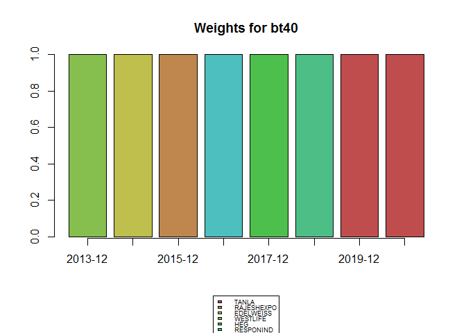

    ##                     TANLA RAJESHEXPO EDELWEISS WESTLIFE HEG RESPONIND
    ## 2015-12-24 05:30:00     0          1         0        0   0         0
    ## 2016-12-30 05:30:00     0          0         0        0   0         0
    ## 2017-12-29 05:30:00     0          0         0        0   1         0
    ## 2018-12-28 05:30:00     0          0         0        0   0         1
    ## 2019-12-27 05:30:00     1          0         0        0   0         0
    ## 2020-12-18 05:30:00     1          0         0        0   0         0
    ##                     TATAMETALI
    ## 2015-12-24 05:30:00          0
    ## 2016-12-30 05:30:00          1
    ## 2017-12-29 05:30:00          0
    ## 2018-12-28 05:30:00          0
    ## 2019-12-27 05:30:00          0
    ## 2020-12-18 05:30:00          0

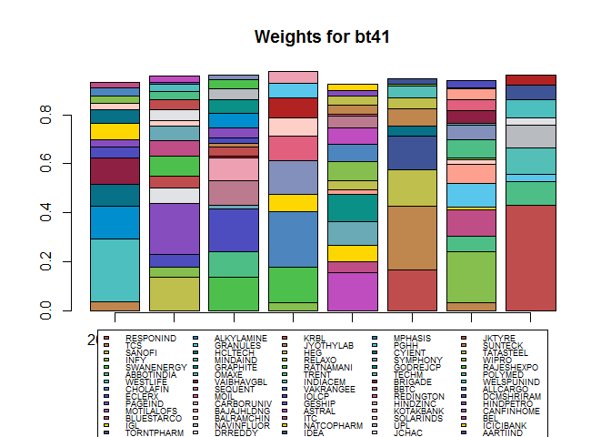

    ##                     RESPONIND   TCS SANOFI  INFY SWANENERGY ABBOTINDIA WESTLIFE
    ## 2015-12-24 05:30:00     0.000 0.000  0.000 0.000      0.137      0.103        0
    ## 2016-12-30 05:30:00     0.000 0.000  0.000 0.034      0.144      0.000        0
    ## 2017-12-29 05:30:00     0.000 0.000  0.000 0.000      0.000      0.000        0
    ## 2018-12-28 05:30:00     0.166 0.259  0.149 0.000      0.000      0.000        0
    ## 2019-12-27 05:30:00     0.000 0.032  0.000 0.208      0.000      0.063        0
    ## 2020-12-18 05:30:00     0.431 0.000  0.000 0.000      0.000      0.098        0
    ##                     CHOLAFIN ECLERX PAGEIND MOTILALOFS BLUESTARCO   IGL
    ## 2015-12-24 05:30:00    0.000  0.174       0      0.000      0.000 0.000
    ## 2016-12-30 05:30:00    0.228  0.000       0      0.000      0.000 0.069
    ## 2017-12-29 05:30:00    0.000  0.000       0      0.154      0.045 0.068
    ## 2018-12-28 05:30:00    0.000  0.000       0      0.000      0.000 0.000
    ## 2019-12-27 05:30:00    0.000  0.000       0      0.000      0.109 0.011
    ## 2020-12-18 05:30:00    0.000  0.000       0      0.000      0.000 0.000
    ##                     TORNTPHARM DHANUKA ALKYLAMINE GRANULES HCLTECH MINDAIND
    ## 2015-12-24 05:30:00      0.000    0.00          0    0.000   0.000    0.015
    ## 2016-12-30 05:30:00      0.000    0.14          0    0.000   0.000    0.000
    ## 2017-12-29 05:30:00      0.000    0.00          0    0.000   0.000    0.097
    ## 2018-12-28 05:30:00      0.141    0.00          0    0.000   0.038    0.000
    ## 2019-12-27 05:30:00      0.000    0.00          0    0.099   0.000    0.000
    ## 2020-12-18 05:30:00      0.000    0.00          0    0.028   0.000    0.000
    ##                     GRAPHITE OMAXE VAIBHAVGBL SEQUENT MOIL CARBORUNIV
    ## 2015-12-24 05:30:00    0.000 0.000          0   0.101  0.0      0.094
    ## 2016-12-30 05:30:00    0.000 0.000          0   0.000  0.1      0.000
    ## 2017-12-29 05:30:00    0.111 0.000          0   0.000  0.0      0.000
    ## 2018-12-28 05:30:00    0.000 0.000          0   0.000  0.0      0.000
    ## 2019-12-27 05:30:00    0.000 0.000          0   0.000  0.0      0.000
    ## 2020-12-18 05:30:00    0.000 0.109          0   0.001  0.0      0.000
    ##                     BAJAJHLDNG BALRAMCHIN NAVINFLUOR DRREDDY  BPCL  KRBL
    ## 2015-12-24 05:30:00      0.000      0.000      0.000   0.000 0.005 0.038
    ## 2016-12-30 05:30:00      0.000      0.073      0.000   0.000 0.083 0.000
    ## 2017-12-29 05:30:00      0.019      0.000      0.000   0.000 0.000 0.000
    ## 2018-12-28 05:30:00      0.000      0.000      0.000   0.000 0.000 0.000
    ## 2019-12-27 05:30:00      0.075      0.020      0.000   0.000 0.000 0.000
    ## 2020-12-18 05:30:00      0.000      0.000      0.092   0.028 0.000 0.000
    ##                     JYOTHYLAB   HEG RELAXO RATNAMANI TRENT INDIACEM VAKRANGEE
    ## 2015-12-24 05:30:00     0.016 0.000  0.000         0 0.000    0.000     0.000
    ## 2016-12-30 05:30:00     0.000 0.000  0.000         0 0.000    0.000     0.000
    ## 2017-12-29 05:30:00     0.000 0.039  0.075         0 0.000    0.000     0.071
    ## 2018-12-28 05:30:00     0.072 0.044  0.000         0 0.000    0.000     0.000
    ## 2019-12-27 05:30:00     0.000 0.000  0.006         0 0.077    0.000     0.000
    ## 2020-12-18 05:30:00     0.000 0.000  0.000         0 0.000    0.075     0.000
    ##                     IOLCP GESHIP ASTRAL ITC NATCOPHARM  IDEA IPCALAB MPHASIS
    ## 2015-12-24 05:30:00 0.022   0.04  0.000   0          0 0.000   0.000   0.059
    ## 2016-12-30 05:30:00 0.000   0.00  0.000   0          0 0.000   0.000   0.000
    ## 2017-12-29 05:30:00 0.000   0.00  0.067   0          0 0.000   0.000   0.000
    ## 2018-12-28 05:30:00 0.000   0.00  0.000   0          0 0.000   0.000   0.000
    ## 2019-12-27 05:30:00 0.000   0.00  0.000   0          0 0.000   0.061   0.000
    ## 2020-12-18 05:30:00 0.000   0.00  0.000   0          0 0.061   0.000   0.000
    ##                      PGHH CYIENT SYMPHONY GODREJCP TECHM BRIGADE  BBTC
    ## 2015-12-24 05:30:00 0.000      0        0    0.057 0.000   0.000 0.000
    ## 2016-12-30 05:30:00 0.058      0        0    0.000 0.000   0.000 0.000
    ## 2017-12-29 05:30:00 0.000      0        0    0.000 0.000   0.000 0.051
    ## 2018-12-28 05:30:00 0.000      0        0    0.000 0.049   0.000 0.000
    ## 2019-12-27 05:30:00 0.000      0        0    0.000 0.006   0.052 0.000
    ## 2020-12-18 05:30:00 0.000      0        0    0.000 0.000   0.000 0.000
    ##                     REDINGTON HINDZINC KOTAKBANK SOLARINDS   UPL JCHAC
    ## 2015-12-24 05:30:00     0.000    0.000     0.000         0 0.046     0
    ## 2016-12-30 05:30:00     0.000    0.048     0.000         0 0.000     0
    ## 2017-12-29 05:30:00     0.006    0.000     0.000         0 0.000     0
    ## 2018-12-28 05:30:00     0.000    0.000     0.000         0 0.000     0
    ## 2019-12-27 05:30:00     0.043    0.000     0.047         0 0.000     0
    ## 2020-12-18 05:30:00     0.000    0.000     0.000         0 0.000     0
    ##                     PERSISTENT JKTYRE SUNTECK TATASTEEL WIPRO RAJESHEXPO
    ## 2015-12-24 05:30:00      0.000      0   0.000     0.000 0.000      0.035
    ## 2016-12-30 05:30:00      0.000      0   0.000     0.000 0.000      0.000
    ## 2017-12-29 05:30:00      0.000      0   0.039     0.037 0.000      0.000
    ## 2018-12-28 05:30:00      0.000      0   0.000     0.000 0.006      0.000
    ## 2019-12-27 05:30:00      0.003      0   0.000     0.000 0.000      0.000
    ## 2020-12-18 05:30:00      0.040      0   0.000     0.000 0.000      0.000
    ##                     POLYMED WELSPUNIND ALLCARGO DCMSHRIRAM HINDPETRO CANFINHOME
    ## 2015-12-24 05:30:00       0          0        0       0.00     0.000          0
    ## 2016-12-30 05:30:00       0          0        0       0.00     0.000          0
    ## 2017-12-29 05:30:00       0          0        0       0.00     0.022          0
    ## 2018-12-28 05:30:00       0          0        0       0.00     0.000          0
    ## 2019-12-27 05:30:00       0          0        0       0.03     0.000          0
    ## 2020-12-18 05:30:00       0          0        0       0.00     0.000          0
    ##                     BEL ICICIBANK AARTIIND  DCAL
    ## 2015-12-24 05:30:00   0     0.000    0.000 0.021
    ## 2016-12-30 05:30:00   0     0.000    0.000 0.000
    ## 2017-12-29 05:30:00   0     0.024    0.000 0.000
    ## 2018-12-28 05:30:00   0     0.000    0.023 0.000
    ## 2019-12-27 05:30:00   0     0.000    0.000 0.000
    ## 2020-12-18 05:30:00   0     0.000    0.000 0.000


    ##                     RESPONIND   TCS SANOFI  INFY SWANENERGY ABBOTINDIA WESTLIFE
    ## 2015-12-24 05:30:00     0.000 0.000  0.000 0.000      0.137      0.103        0
    ## 2016-12-30 05:30:00     0.000 0.000  0.000 0.034      0.144      0.000        0
    ## 2017-12-29 05:30:00     0.000 0.000  0.000 0.000      0.000      0.000        0
    ## 2018-12-28 05:30:00     0.166 0.259  0.149 0.000      0.000      0.000        0
    ## 2019-12-27 05:30:00     0.000 0.032  0.000 0.208      0.000      0.063        0
    ## 2020-12-18 05:30:00     0.431 0.000  0.000 0.000      0.000      0.098        0
    ##                     CHOLAFIN ECLERX PAGEIND MOTILALOFS BLUESTARCO   IGL
    ## 2015-12-24 05:30:00    0.000  0.174       0      0.000      0.000 0.000
    ## 2016-12-30 05:30:00    0.228  0.000       0      0.000      0.000 0.069
    ## 2017-12-29 05:30:00    0.000  0.000       0      0.154      0.045 0.068
    ## 2018-12-28 05:30:00    0.000  0.000       0      0.000      0.000 0.000
    ## 2019-12-27 05:30:00    0.000  0.000       0      0.000      0.109 0.011
    ## 2020-12-18 05:30:00    0.000  0.000       0      0.000      0.000 0.000
    ##                     TORNTPHARM DHANUKA ALKYLAMINE GRANULES HCLTECH MINDAIND
    ## 2015-12-24 05:30:00      0.000    0.00          0    0.000   0.000    0.015
    ## 2016-12-30 05:30:00      0.000    0.14          0    0.000   0.000    0.000
    ## 2017-12-29 05:30:00      0.000    0.00          0    0.000   0.000    0.097
    ## 2018-12-28 05:30:00      0.141    0.00          0    0.000   0.038    0.000
    ## 2019-12-27 05:30:00      0.000    0.00          0    0.099   0.000    0.000
    ## 2020-12-18 05:30:00      0.000    0.00          0    0.028   0.000    0.000
    ##                     GRAPHITE OMAXE VAIBHAVGBL SEQUENT MOIL CARBORUNIV
    ## 2015-12-24 05:30:00    0.000 0.000          0   0.101  0.0      0.094
    ## 2016-12-30 05:30:00    0.000 0.000          0   0.000  0.1      0.000
    ## 2017-12-29 05:30:00    0.111 0.000          0   0.000  0.0      0.000
    ## 2018-12-28 05:30:00    0.000 0.000          0   0.000  0.0      0.000
    ## 2019-12-27 05:30:00    0.000 0.000          0   0.000  0.0      0.000
    ## 2020-12-18 05:30:00    0.000 0.109          0   0.001  0.0      0.000
    ##                     BAJAJHLDNG BALRAMCHIN NAVINFLUOR DRREDDY  BPCL  KRBL
    ## 2015-12-24 05:30:00      0.000      0.000      0.000   0.000 0.005 0.038
    ## 2016-12-30 05:30:00      0.000      0.073      0.000   0.000 0.083 0.000
    ## 2017-12-29 05:30:00      0.019      0.000      0.000   0.000 0.000 0.000
    ## 2018-12-28 05:30:00      0.000      0.000      0.000   0.000 0.000 0.000
    ## 2019-12-27 05:30:00      0.075      0.020      0.000   0.000 0.000 0.000
    ## 2020-12-18 05:30:00      0.000      0.000      0.092   0.028 0.000 0.000
    ##                     JYOTHYLAB   HEG RELAXO RATNAMANI TRENT INDIACEM VAKRANGEE
    ## 2015-12-24 05:30:00     0.016 0.000  0.000         0 0.000    0.000     0.000
    ## 2016-12-30 05:30:00     0.000 0.000  0.000         0 0.000    0.000     0.000
    ## 2017-12-29 05:30:00     0.000 0.039  0.075         0 0.000    0.000     0.071
    ## 2018-12-28 05:30:00     0.072 0.044  0.000         0 0.000    0.000     0.000
    ## 2019-12-27 05:30:00     0.000 0.000  0.006         0 0.077    0.000     0.000
    ## 2020-12-18 05:30:00     0.000 0.000  0.000         0 0.000    0.075     0.000
    ##                     IOLCP GESHIP ASTRAL ITC NATCOPHARM  IDEA IPCALAB MPHASIS
    ## 2015-12-24 05:30:00 0.022   0.04  0.000   0          0 0.000   0.000   0.059
    ## 2016-12-30 05:30:00 0.000   0.00  0.000   0          0 0.000   0.000   0.000
    ## 2017-12-29 05:30:00 0.000   0.00  0.067   0          0 0.000   0.000   0.000
    ## 2018-12-28 05:30:00 0.000   0.00  0.000   0          0 0.000   0.000   0.000
    ## 2019-12-27 05:30:00 0.000   0.00  0.000   0          0 0.000   0.061   0.000
    ## 2020-12-18 05:30:00 0.000   0.00  0.000   0          0 0.061   0.000   0.000
    ##                      PGHH CYIENT SYMPHONY GODREJCP TECHM BRIGADE  BBTC
    ## 2015-12-24 05:30:00 0.000      0        0    0.057 0.000   0.000 0.000
    ## 2016-12-30 05:30:00 0.058      0        0    0.000 0.000   0.000 0.000
    ## 2017-12-29 05:30:00 0.000      0        0    0.000 0.000   0.000 0.051
    ## 2018-12-28 05:30:00 0.000      0        0    0.000 0.049   0.000 0.000
    ## 2019-12-27 05:30:00 0.000      0        0    0.000 0.006   0.052 0.000
    ## 2020-12-18 05:30:00 0.000      0        0    0.000 0.000   0.000 0.000
    ##                     REDINGTON HINDZINC KOTAKBANK SOLARINDS   UPL JCHAC
    ## 2015-12-24 05:30:00     0.000    0.000     0.000         0 0.046     0
    ## 2016-12-30 05:30:00     0.000    0.048     0.000         0 0.000     0
    ## 2017-12-29 05:30:00     0.006    0.000     0.000         0 0.000     0
    ## 2018-12-28 05:30:00     0.000    0.000     0.000         0 0.000     0
    ## 2019-12-27 05:30:00     0.043    0.000     0.047         0 0.000     0
    ## 2020-12-18 05:30:00     0.000    0.000     0.000         0 0.000     0
    ##                     PERSISTENT JKTYRE SUNTECK TATASTEEL WIPRO RAJESHEXPO
    ## 2015-12-24 05:30:00      0.000      0   0.000     0.000 0.000      0.035
    ## 2016-12-30 05:30:00      0.000      0   0.000     0.000 0.000      0.000
    ## 2017-12-29 05:30:00      0.000      0   0.039     0.037 0.000      0.000
    ## 2018-12-28 05:30:00      0.000      0   0.000     0.000 0.006      0.000
    ## 2019-12-27 05:30:00      0.003      0   0.000     0.000 0.000      0.000
    ## 2020-12-18 05:30:00      0.040      0   0.000     0.000 0.000      0.000
    ##                     POLYMED WELSPUNIND ALLCARGO DCMSHRIRAM HINDPETRO CANFINHOME
    ## 2015-12-24 05:30:00       0          0        0       0.00     0.000          0
    ## 2016-12-30 05:30:00       0          0        0       0.00     0.000          0
    ## 2017-12-29 05:30:00       0          0        0       0.00     0.022          0
    ## 2018-12-28 05:30:00       0          0        0       0.00     0.000          0
    ## 2019-12-27 05:30:00       0          0        0       0.03     0.000          0
    ## 2020-12-18 05:30:00       0          0        0       0.00     0.000          0
    ##                     BEL ICICIBANK AARTIIND  DCAL
    ## 2015-12-24 05:30:00   0     0.000    0.000 0.021
    ## 2016-12-30 05:30:00   0     0.000    0.000 0.000
    ## 2017-12-29 05:30:00   0     0.024    0.000 0.000
    ## 2018-12-28 05:30:00   0     0.000    0.023 0.000
    ## 2019-12-27 05:30:00   0     0.000    0.000 0.000
    ## 2020-12-18 05:30:00   0     0.000    0.000 0.000


    ##                     RESPONIND   TCS SANOFI  INFY SWANENERGY ABBOTINDIA WESTLIFE
    ## 2015-12-24 05:30:00     0.000 0.000  0.000 0.000      0.137      0.103        0
    ## 2016-12-30 05:30:00     0.000 0.000  0.000 0.034      0.144      0.000        0
    ## 2017-12-29 05:30:00     0.000 0.000  0.000 0.000      0.000      0.000        0
    ## 2018-12-28 05:30:00     0.166 0.259  0.149 0.000      0.000      0.000        0
    ## 2019-12-27 05:30:00     0.000 0.032  0.000 0.208      0.000      0.063        0
    ## 2020-12-18 05:30:00     0.431 0.000  0.000 0.000      0.000      0.098        0
    ##                     CHOLAFIN ECLERX PAGEIND MOTILALOFS BLUESTARCO   IGL
    ## 2015-12-24 05:30:00    0.000  0.174       0      0.000      0.000 0.000
    ## 2016-12-30 05:30:00    0.228  0.000       0      0.000      0.000 0.069
    ## 2017-12-29 05:30:00    0.000  0.000       0      0.154      0.045 0.068
    ## 2018-12-28 05:30:00    0.000  0.000       0      0.000      0.000 0.000
    ## 2019-12-27 05:30:00    0.000  0.000       0      0.000      0.109 0.011
    ## 2020-12-18 05:30:00    0.000  0.000       0      0.000      0.000 0.000
    ##                     TORNTPHARM DHANUKA ALKYLAMINE GRANULES HCLTECH MINDAIND
    ## 2015-12-24 05:30:00      0.000    0.00          0    0.000   0.000    0.015
    ## 2016-12-30 05:30:00      0.000    0.14          0    0.000   0.000    0.000
    ## 2017-12-29 05:30:00      0.000    0.00          0    0.000   0.000    0.097
    ## 2018-12-28 05:30:00      0.141    0.00          0    0.000   0.038    0.000
    ## 2019-12-27 05:30:00      0.000    0.00          0    0.099   0.000    0.000
    ## 2020-12-18 05:30:00      0.000    0.00          0    0.028   0.000    0.000
    ##                     GRAPHITE OMAXE VAIBHAVGBL SEQUENT MOIL CARBORUNIV
    ## 2015-12-24 05:30:00    0.000 0.000          0   0.101  0.0      0.094
    ## 2016-12-30 05:30:00    0.000 0.000          0   0.000  0.1      0.000
    ## 2017-12-29 05:30:00    0.111 0.000          0   0.000  0.0      0.000
    ## 2018-12-28 05:30:00    0.000 0.000          0   0.000  0.0      0.000
    ## 2019-12-27 05:30:00    0.000 0.000          0   0.000  0.0      0.000
    ## 2020-12-18 05:30:00    0.000 0.109          0   0.001  0.0      0.000
    ##                     BAJAJHLDNG BALRAMCHIN NAVINFLUOR DRREDDY  BPCL  KRBL
    ## 2015-12-24 05:30:00      0.000      0.000      0.000   0.000 0.005 0.038
    ## 2016-12-30 05:30:00      0.000      0.073      0.000   0.000 0.083 0.000
    ## 2017-12-29 05:30:00      0.019      0.000      0.000   0.000 0.000 0.000
    ## 2018-12-28 05:30:00      0.000      0.000      0.000   0.000 0.000 0.000
    ## 2019-12-27 05:30:00      0.075      0.020      0.000   0.000 0.000 0.000
    ## 2020-12-18 05:30:00      0.000      0.000      0.092   0.028 0.000 0.000
    ##                     JYOTHYLAB   HEG RELAXO RATNAMANI TRENT INDIACEM VAKRANGEE
    ## 2015-12-24 05:30:00     0.016 0.000  0.000         0 0.000    0.000     0.000
    ## 2016-12-30 05:30:00     0.000 0.000  0.000         0 0.000    0.000     0.000
    ## 2017-12-29 05:30:00     0.000 0.039  0.075         0 0.000    0.000     0.071
    ## 2018-12-28 05:30:00     0.072 0.044  0.000         0 0.000    0.000     0.000
    ## 2019-12-27 05:30:00     0.000 0.000  0.006         0 0.077    0.000     0.000
    ## 2020-12-18 05:30:00     0.000 0.000  0.000         0 0.000    0.075     0.000
    ##                     IOLCP GESHIP ASTRAL ITC NATCOPHARM  IDEA IPCALAB MPHASIS
    ## 2015-12-24 05:30:00 0.022   0.04  0.000   0          0 0.000   0.000   0.059
    ## 2016-12-30 05:30:00 0.000   0.00  0.000   0          0 0.000   0.000   0.000
    ## 2017-12-29 05:30:00 0.000   0.00  0.067   0          0 0.000   0.000   0.000
    ## 2018-12-28 05:30:00 0.000   0.00  0.000   0          0 0.000   0.000   0.000
    ## 2019-12-27 05:30:00 0.000   0.00  0.000   0          0 0.000   0.061   0.000
    ## 2020-12-18 05:30:00 0.000   0.00  0.000   0          0 0.061   0.000   0.000
    ##                      PGHH CYIENT SYMPHONY GODREJCP TECHM BRIGADE  BBTC
    ## 2015-12-24 05:30:00 0.000      0        0    0.057 0.000   0.000 0.000
    ## 2016-12-30 05:30:00 0.058      0        0    0.000 0.000   0.000 0.000
    ## 2017-12-29 05:30:00 0.000      0        0    0.000 0.000   0.000 0.051
    ## 2018-12-28 05:30:00 0.000      0        0    0.000 0.049   0.000 0.000
    ## 2019-12-27 05:30:00 0.000      0        0    0.000 0.006   0.052 0.000
    ## 2020-12-18 05:30:00 0.000      0        0    0.000 0.000   0.000 0.000
    ##                     REDINGTON HINDZINC KOTAKBANK SOLARINDS   UPL JCHAC
    ## 2015-12-24 05:30:00     0.000    0.000     0.000         0 0.046     0
    ## 2016-12-30 05:30:00     0.000    0.048     0.000         0 0.000     0
    ## 2017-12-29 05:30:00     0.006    0.000     0.000         0 0.000     0
    ## 2018-12-28 05:30:00     0.000    0.000     0.000         0 0.000     0
    ## 2019-12-27 05:30:00     0.043    0.000     0.047         0 0.000     0
    ## 2020-12-18 05:30:00     0.000    0.000     0.000         0 0.000     0
    ##                     PERSISTENT JKTYRE SUNTECK TATASTEEL WIPRO RAJESHEXPO
    ## 2015-12-24 05:30:00      0.000      0   0.000     0.000 0.000      0.035
    ## 2016-12-30 05:30:00      0.000      0   0.000     0.000 0.000      0.000
    ## 2017-12-29 05:30:00      0.000      0   0.039     0.037 0.000      0.000
    ## 2018-12-28 05:30:00      0.000      0   0.000     0.000 0.006      0.000
    ## 2019-12-27 05:30:00      0.003      0   0.000     0.000 0.000      0.000
    ## 2020-12-18 05:30:00      0.040      0   0.000     0.000 0.000      0.000
    ##                     POLYMED WELSPUNIND ALLCARGO DCMSHRIRAM HINDPETRO CANFINHOME
    ## 2015-12-24 05:30:00       0          0        0       0.00     0.000          0
    ## 2016-12-30 05:30:00       0          0        0       0.00     0.000          0
    ## 2017-12-29 05:30:00       0          0        0       0.00     0.022          0
    ## 2018-12-28 05:30:00       0          0        0       0.00     0.000          0
    ## 2019-12-27 05:30:00       0          0        0       0.03     0.000          0
    ## 2020-12-18 05:30:00       0          0        0       0.00     0.000          0
    ##                     BEL ICICIBANK AARTIIND  DCAL
    ## 2015-12-24 05:30:00   0     0.000    0.000 0.021
    ## 2016-12-30 05:30:00   0     0.000    0.000 0.000
    ## 2017-12-29 05:30:00   0     0.024    0.000 0.000
    ## 2018-12-28 05:30:00   0     0.000    0.023 0.000
    ## 2019-12-27 05:30:00   0     0.000    0.000 0.000
    ## 2020-12-18 05:30:00   0     0.000    0.000 0.000


    ##                     TANLA LUPIN JINDALSTEL GEPIL RESPONIND BANKINDIA SEQUENT
    ## 2015-12-24 05:30:00 0.000 0.000          0 0.000     0.000     0.568   0.000
    ## 2016-12-30 05:30:00 0.000 0.000          0 0.000     0.000     0.000   0.546
    ## 2017-12-29 05:30:00 0.000 0.787          0 0.000     0.000     0.000   0.000
    ## 2018-12-28 05:30:00 0.000 0.000          0 0.000     0.656     0.000   0.000
    ## 2019-12-27 05:30:00 0.670 0.000          0 0.000     0.000     0.000   0.000
    ## 2020-12-18 05:30:00 0.273 0.000          0 0.727     0.000     0.000   0.000
    ##                       HEG WESTLIFE ITDC TATAMETALI RAJESHEXPO   JSL EDELWEISS
    ## 2015-12-24 05:30:00 0.000        0    0      0.000      0.432 0.000         0
    ## 2016-12-30 05:30:00 0.000        0    0      0.454      0.000 0.000         0
    ## 2017-12-29 05:30:00 0.213        0    0      0.000      0.000 0.000         0
    ## 2018-12-28 05:30:00 0.000        0    0      0.000      0.000 0.344         0
    ## 2019-12-27 05:30:00 0.330        0    0      0.000      0.000 0.000         0
    ## 2020-12-18 05:30:00 0.000        0    0      0.000      0.000 0.000         0


    ##                     RESPONIND   TCS SANOFI  INFY SWANENERGY ABBOTINDIA WESTLIFE
    ## 2015-12-24 05:30:00     0.000 0.000  0.000 0.000      0.137      0.103        0
    ## 2016-12-30 05:30:00     0.000 0.000  0.000 0.034      0.144      0.000        0
    ## 2017-12-29 05:30:00     0.000 0.000  0.000 0.000      0.000      0.000        0
    ## 2018-12-28 05:30:00     0.166 0.259  0.149 0.000      0.000      0.000        0
    ## 2019-12-27 05:30:00     0.000 0.032  0.000 0.208      0.000      0.063        0
    ## 2020-12-18 05:30:00     0.431 0.000  0.000 0.000      0.000      0.098        0
    ##                     CHOLAFIN ECLERX PAGEIND MOTILALOFS BLUESTARCO   IGL
    ## 2015-12-24 05:30:00    0.000  0.174       0      0.000      0.000 0.000
    ## 2016-12-30 05:30:00    0.228  0.000       0      0.000      0.000 0.069
    ## 2017-12-29 05:30:00    0.000  0.000       0      0.154      0.045 0.068
    ## 2018-12-28 05:30:00    0.000  0.000       0      0.000      0.000 0.000
    ## 2019-12-27 05:30:00    0.000  0.000       0      0.000      0.109 0.011
    ## 2020-12-18 05:30:00    0.000  0.000       0      0.000      0.000 0.000
    ##                     TORNTPHARM DHANUKA ALKYLAMINE GRANULES HCLTECH MINDAIND
    ## 2015-12-24 05:30:00      0.000    0.00          0    0.000   0.000    0.015
    ## 2016-12-30 05:30:00      0.000    0.14          0    0.000   0.000    0.000
    ## 2017-12-29 05:30:00      0.000    0.00          0    0.000   0.000    0.097
    ## 2018-12-28 05:30:00      0.141    0.00          0    0.000   0.038    0.000
    ## 2019-12-27 05:30:00      0.000    0.00          0    0.099   0.000    0.000
    ## 2020-12-18 05:30:00      0.000    0.00          0    0.028   0.000    0.000
    ##                     GRAPHITE OMAXE VAIBHAVGBL SEQUENT MOIL CARBORUNIV
    ## 2015-12-24 05:30:00    0.000 0.000          0   0.101  0.0      0.094
    ## 2016-12-30 05:30:00    0.000 0.000          0   0.000  0.1      0.000
    ## 2017-12-29 05:30:00    0.111 0.000          0   0.000  0.0      0.000
    ## 2018-12-28 05:30:00    0.000 0.000          0   0.000  0.0      0.000
    ## 2019-12-27 05:30:00    0.000 0.000          0   0.000  0.0      0.000
    ## 2020-12-18 05:30:00    0.000 0.109          0   0.001  0.0      0.000
    ##                     BAJAJHLDNG BALRAMCHIN NAVINFLUOR DRREDDY  BPCL  KRBL
    ## 2015-12-24 05:30:00      0.000      0.000      0.000   0.000 0.005 0.038
    ## 2016-12-30 05:30:00      0.000      0.073      0.000   0.000 0.083 0.000
    ## 2017-12-29 05:30:00      0.019      0.000      0.000   0.000 0.000 0.000
    ## 2018-12-28 05:30:00      0.000      0.000      0.000   0.000 0.000 0.000
    ## 2019-12-27 05:30:00      0.075      0.020      0.000   0.000 0.000 0.000
    ## 2020-12-18 05:30:00      0.000      0.000      0.092   0.028 0.000 0.000
    ##                     JYOTHYLAB   HEG RELAXO RATNAMANI TRENT INDIACEM VAKRANGEE
    ## 2015-12-24 05:30:00     0.016 0.000  0.000         0 0.000    0.000     0.000
    ## 2016-12-30 05:30:00     0.000 0.000  0.000         0 0.000    0.000     0.000
    ## 2017-12-29 05:30:00     0.000 0.039  0.075         0 0.000    0.000     0.071
    ## 2018-12-28 05:30:00     0.072 0.044  0.000         0 0.000    0.000     0.000
    ## 2019-12-27 05:30:00     0.000 0.000  0.006         0 0.077    0.000     0.000
    ## 2020-12-18 05:30:00     0.000 0.000  0.000         0 0.000    0.075     0.000
    ##                     IOLCP GESHIP ASTRAL ITC NATCOPHARM  IDEA IPCALAB MPHASIS
    ## 2015-12-24 05:30:00 0.022   0.04  0.000   0          0 0.000   0.000   0.059
    ## 2016-12-30 05:30:00 0.000   0.00  0.000   0          0 0.000   0.000   0.000
    ## 2017-12-29 05:30:00 0.000   0.00  0.067   0          0 0.000   0.000   0.000
    ## 2018-12-28 05:30:00 0.000   0.00  0.000   0          0 0.000   0.000   0.000
    ## 2019-12-27 05:30:00 0.000   0.00  0.000   0          0 0.000   0.061   0.000
    ## 2020-12-18 05:30:00 0.000   0.00  0.000   0          0 0.061   0.000   0.000
    ##                      PGHH CYIENT SYMPHONY GODREJCP TECHM BRIGADE  BBTC
    ## 2015-12-24 05:30:00 0.000      0        0    0.057 0.000   0.000 0.000
    ## 2016-12-30 05:30:00 0.058      0        0    0.000 0.000   0.000 0.000
    ## 2017-12-29 05:30:00 0.000      0        0    0.000 0.000   0.000 0.051
    ## 2018-12-28 05:30:00 0.000      0        0    0.000 0.049   0.000 0.000
    ## 2019-12-27 05:30:00 0.000      0        0    0.000 0.006   0.052 0.000
    ## 2020-12-18 05:30:00 0.000      0        0    0.000 0.000   0.000 0.000
    ##                     REDINGTON HINDZINC KOTAKBANK SOLARINDS   UPL JCHAC
    ## 2015-12-24 05:30:00     0.000    0.000     0.000         0 0.046     0
    ## 2016-12-30 05:30:00     0.000    0.048     0.000         0 0.000     0
    ## 2017-12-29 05:30:00     0.006    0.000     0.000         0 0.000     0
    ## 2018-12-28 05:30:00     0.000    0.000     0.000         0 0.000     0
    ## 2019-12-27 05:30:00     0.043    0.000     0.047         0 0.000     0
    ## 2020-12-18 05:30:00     0.000    0.000     0.000         0 0.000     0
    ##                     PERSISTENT JKTYRE SUNTECK TATASTEEL WIPRO RAJESHEXPO
    ## 2015-12-24 05:30:00      0.000      0   0.000     0.000 0.000      0.035
    ## 2016-12-30 05:30:00      0.000      0   0.000     0.000 0.000      0.000
    ## 2017-12-29 05:30:00      0.000      0   0.039     0.037 0.000      0.000
    ## 2018-12-28 05:30:00      0.000      0   0.000     0.000 0.006      0.000
    ## 2019-12-27 05:30:00      0.003      0   0.000     0.000 0.000      0.000
    ## 2020-12-18 05:30:00      0.040      0   0.000     0.000 0.000      0.000
    ##                     POLYMED WELSPUNIND ALLCARGO DCMSHRIRAM HINDPETRO CANFINHOME
    ## 2015-12-24 05:30:00       0          0        0       0.00     0.000          0
    ## 2016-12-30 05:30:00       0          0        0       0.00     0.000          0
    ## 2017-12-29 05:30:00       0          0        0       0.00     0.022          0
    ## 2018-12-28 05:30:00       0          0        0       0.00     0.000          0
    ## 2019-12-27 05:30:00       0          0        0       0.03     0.000          0
    ## 2020-12-18 05:30:00       0          0        0       0.00     0.000          0
    ##                     BEL ICICIBANK AARTIIND  DCAL
    ## 2015-12-24 05:30:00   0     0.000    0.000 0.021
    ## 2016-12-30 05:30:00   0     0.000    0.000 0.000
    ## 2017-12-29 05:30:00   0     0.024    0.000 0.000
    ## 2018-12-28 05:30:00   0     0.000    0.023 0.000
    ## 2019-12-27 05:30:00   0     0.000    0.000 0.000
    ## 2020-12-18 05:30:00   0     0.000    0.000 0.000


    ##                     RESPONIND   TCS SANOFI  INFY SWANENERGY ABBOTINDIA WESTLIFE
    ## 2015-12-24 05:30:00     0.000 0.000  0.000 0.000      0.137      0.103        0
    ## 2016-12-30 05:30:00     0.000 0.000  0.000 0.034      0.144      0.000        0
    ## 2017-12-29 05:30:00     0.000 0.000  0.000 0.000      0.000      0.000        0
    ## 2018-12-28 05:30:00     0.166 0.259  0.149 0.000      0.000      0.000        0
    ## 2019-12-27 05:30:00     0.000 0.032  0.000 0.208      0.000      0.063        0
    ## 2020-12-18 05:30:00     0.431 0.000  0.000 0.000      0.000      0.098        0
    ##                     CHOLAFIN ECLERX PAGEIND MOTILALOFS BLUESTARCO   IGL
    ## 2015-12-24 05:30:00    0.000  0.174       0      0.000      0.000 0.000
    ## 2016-12-30 05:30:00    0.228  0.000       0      0.000      0.000 0.069
    ## 2017-12-29 05:30:00    0.000  0.000       0      0.154      0.045 0.068
    ## 2018-12-28 05:30:00    0.000  0.000       0      0.000      0.000 0.000
    ## 2019-12-27 05:30:00    0.000  0.000       0      0.000      0.109 0.011
    ## 2020-12-18 05:30:00    0.000  0.000       0      0.000      0.000 0.000
    ##                     TORNTPHARM DHANUKA ALKYLAMINE GRANULES HCLTECH MINDAIND
    ## 2015-12-24 05:30:00      0.000    0.00          0    0.000   0.000    0.015
    ## 2016-12-30 05:30:00      0.000    0.14          0    0.000   0.000    0.000
    ## 2017-12-29 05:30:00      0.000    0.00          0    0.000   0.000    0.097
    ## 2018-12-28 05:30:00      0.141    0.00          0    0.000   0.038    0.000
    ## 2019-12-27 05:30:00      0.000    0.00          0    0.099   0.000    0.000
    ## 2020-12-18 05:30:00      0.000    0.00          0    0.028   0.000    0.000
    ##                     GRAPHITE OMAXE VAIBHAVGBL SEQUENT MOIL CARBORUNIV
    ## 2015-12-24 05:30:00    0.000 0.000          0   0.101  0.0      0.094
    ## 2016-12-30 05:30:00    0.000 0.000          0   0.000  0.1      0.000
    ## 2017-12-29 05:30:00    0.111 0.000          0   0.000  0.0      0.000
    ## 2018-12-28 05:30:00    0.000 0.000          0   0.000  0.0      0.000
    ## 2019-12-27 05:30:00    0.000 0.000          0   0.000  0.0      0.000
    ## 2020-12-18 05:30:00    0.000 0.109          0   0.001  0.0      0.000
    ##                     BAJAJHLDNG BALRAMCHIN NAVINFLUOR DRREDDY  BPCL  KRBL
    ## 2015-12-24 05:30:00      0.000      0.000      0.000   0.000 0.005 0.038
    ## 2016-12-30 05:30:00      0.000      0.073      0.000   0.000 0.083 0.000
    ## 2017-12-29 05:30:00      0.019      0.000      0.000   0.000 0.000 0.000
    ## 2018-12-28 05:30:00      0.000      0.000      0.000   0.000 0.000 0.000
    ## 2019-12-27 05:30:00      0.075      0.020      0.000   0.000 0.000 0.000
    ## 2020-12-18 05:30:00      0.000      0.000      0.092   0.028 0.000 0.000
    ##                     JYOTHYLAB   HEG RELAXO RATNAMANI TRENT INDIACEM VAKRANGEE
    ## 2015-12-24 05:30:00     0.016 0.000  0.000         0 0.000    0.000     0.000
    ## 2016-12-30 05:30:00     0.000 0.000  0.000         0 0.000    0.000     0.000
    ## 2017-12-29 05:30:00     0.000 0.039  0.075         0 0.000    0.000     0.071
    ## 2018-12-28 05:30:00     0.072 0.044  0.000         0 0.000    0.000     0.000
    ## 2019-12-27 05:30:00     0.000 0.000  0.006         0 0.077    0.000     0.000
    ## 2020-12-18 05:30:00     0.000 0.000  0.000         0 0.000    0.075     0.000
    ##                     IOLCP GESHIP ASTRAL ITC NATCOPHARM  IDEA IPCALAB MPHASIS
    ## 2015-12-24 05:30:00 0.022   0.04  0.000   0          0 0.000   0.000   0.059
    ## 2016-12-30 05:30:00 0.000   0.00  0.000   0          0 0.000   0.000   0.000
    ## 2017-12-29 05:30:00 0.000   0.00  0.067   0          0 0.000   0.000   0.000
    ## 2018-12-28 05:30:00 0.000   0.00  0.000   0          0 0.000   0.000   0.000
    ## 2019-12-27 05:30:00 0.000   0.00  0.000   0          0 0.000   0.061   0.000
    ## 2020-12-18 05:30:00 0.000   0.00  0.000   0          0 0.061   0.000   0.000
    ##                      PGHH CYIENT SYMPHONY GODREJCP TECHM BRIGADE  BBTC
    ## 2015-12-24 05:30:00 0.000      0        0    0.057 0.000   0.000 0.000
    ## 2016-12-30 05:30:00 0.058      0        0    0.000 0.000   0.000 0.000
    ## 2017-12-29 05:30:00 0.000      0        0    0.000 0.000   0.000 0.051
    ## 2018-12-28 05:30:00 0.000      0        0    0.000 0.049   0.000 0.000
    ## 2019-12-27 05:30:00 0.000      0        0    0.000 0.006   0.052 0.000
    ## 2020-12-18 05:30:00 0.000      0        0    0.000 0.000   0.000 0.000
    ##                     REDINGTON HINDZINC KOTAKBANK SOLARINDS   UPL JCHAC
    ## 2015-12-24 05:30:00     0.000    0.000     0.000         0 0.046     0
    ## 2016-12-30 05:30:00     0.000    0.048     0.000         0 0.000     0
    ## 2017-12-29 05:30:00     0.006    0.000     0.000         0 0.000     0
    ## 2018-12-28 05:30:00     0.000    0.000     0.000         0 0.000     0
    ## 2019-12-27 05:30:00     0.043    0.000     0.047         0 0.000     0
    ## 2020-12-18 05:30:00     0.000    0.000     0.000         0 0.000     0
    ##                     PERSISTENT JKTYRE SUNTECK TATASTEEL WIPRO RAJESHEXPO
    ## 2015-12-24 05:30:00      0.000      0   0.000     0.000 0.000      0.035
    ## 2016-12-30 05:30:00      0.000      0   0.000     0.000 0.000      0.000
    ## 2017-12-29 05:30:00      0.000      0   0.039     0.037 0.000      0.000
    ## 2018-12-28 05:30:00      0.000      0   0.000     0.000 0.006      0.000
    ## 2019-12-27 05:30:00      0.003      0   0.000     0.000 0.000      0.000
    ## 2020-12-18 05:30:00      0.040      0   0.000     0.000 0.000      0.000
    ##                     POLYMED WELSPUNIND ALLCARGO DCMSHRIRAM HINDPETRO CANFINHOME
    ## 2015-12-24 05:30:00       0          0        0       0.00     0.000          0
    ## 2016-12-30 05:30:00       0          0        0       0.00     0.000          0
    ## 2017-12-29 05:30:00       0          0        0       0.00     0.022          0
    ## 2018-12-28 05:30:00       0          0        0       0.00     0.000          0
    ## 2019-12-27 05:30:00       0          0        0       0.03     0.000          0
    ## 2020-12-18 05:30:00       0          0        0       0.00     0.000          0
    ##                     BEL ICICIBANK AARTIIND  DCAL
    ## 2015-12-24 05:30:00   0     0.000    0.000 0.021
    ## 2016-12-30 05:30:00   0     0.000    0.000 0.000
    ## 2017-12-29 05:30:00   0     0.024    0.000 0.000
    ## 2018-12-28 05:30:00   0     0.000    0.023 0.000
    ## 2019-12-27 05:30:00   0     0.000    0.000 0.000
    ## 2020-12-18 05:30:00   0     0.000    0.000 0.000


    ##                     RESPONIND   TCS SANOFI  INFY SWANENERGY ABBOTINDIA WESTLIFE
    ## 2015-12-24 05:30:00     0.000 0.000  0.000 0.000      0.137      0.103        0
    ## 2016-12-30 05:30:00     0.000 0.000  0.000 0.034      0.144      0.000        0
    ## 2017-12-29 05:30:00     0.000 0.000  0.000 0.000      0.000      0.000        0
    ## 2018-12-28 05:30:00     0.166 0.259  0.149 0.000      0.000      0.000        0
    ## 2019-12-27 05:30:00     0.000 0.032  0.000 0.208      0.000      0.063        0
    ## 2020-12-18 05:30:00     0.431 0.000  0.000 0.000      0.000      0.098        0
    ##                     CHOLAFIN ECLERX PAGEIND MOTILALOFS BLUESTARCO   IGL
    ## 2015-12-24 05:30:00    0.000  0.174       0      0.000      0.000 0.000
    ## 2016-12-30 05:30:00    0.228  0.000       0      0.000      0.000 0.069
    ## 2017-12-29 05:30:00    0.000  0.000       0      0.154      0.045 0.068
    ## 2018-12-28 05:30:00    0.000  0.000       0      0.000      0.000 0.000
    ## 2019-12-27 05:30:00    0.000  0.000       0      0.000      0.109 0.011
    ## 2020-12-18 05:30:00    0.000  0.000       0      0.000      0.000 0.000
    ##                     TORNTPHARM DHANUKA ALKYLAMINE GRANULES HCLTECH MINDAIND
    ## 2015-12-24 05:30:00      0.000    0.00          0    0.000   0.000    0.015
    ## 2016-12-30 05:30:00      0.000    0.14          0    0.000   0.000    0.000
    ## 2017-12-29 05:30:00      0.000    0.00          0    0.000   0.000    0.097
    ## 2018-12-28 05:30:00      0.141    0.00          0    0.000   0.038    0.000
    ## 2019-12-27 05:30:00      0.000    0.00          0    0.099   0.000    0.000
    ## 2020-12-18 05:30:00      0.000    0.00          0    0.028   0.000    0.000
    ##                     GRAPHITE OMAXE VAIBHAVGBL SEQUENT MOIL CARBORUNIV
    ## 2015-12-24 05:30:00    0.000 0.000          0   0.101  0.0      0.094
    ## 2016-12-30 05:30:00    0.000 0.000          0   0.000  0.1      0.000
    ## 2017-12-29 05:30:00    0.111 0.000          0   0.000  0.0      0.000
    ## 2018-12-28 05:30:00    0.000 0.000          0   0.000  0.0      0.000
    ## 2019-12-27 05:30:00    0.000 0.000          0   0.000  0.0      0.000
    ## 2020-12-18 05:30:00    0.000 0.109          0   0.001  0.0      0.000
    ##                     BAJAJHLDNG BALRAMCHIN NAVINFLUOR DRREDDY  BPCL  KRBL
    ## 2015-12-24 05:30:00      0.000      0.000      0.000   0.000 0.005 0.038
    ## 2016-12-30 05:30:00      0.000      0.073      0.000   0.000 0.083 0.000
    ## 2017-12-29 05:30:00      0.019      0.000      0.000   0.000 0.000 0.000
    ## 2018-12-28 05:30:00      0.000      0.000      0.000   0.000 0.000 0.000
    ## 2019-12-27 05:30:00      0.075      0.020      0.000   0.000 0.000 0.000
    ## 2020-12-18 05:30:00      0.000      0.000      0.092   0.028 0.000 0.000
    ##                     JYOTHYLAB   HEG RELAXO RATNAMANI TRENT INDIACEM VAKRANGEE
    ## 2015-12-24 05:30:00     0.016 0.000  0.000         0 0.000    0.000     0.000
    ## 2016-12-30 05:30:00     0.000 0.000  0.000         0 0.000    0.000     0.000
    ## 2017-12-29 05:30:00     0.000 0.039  0.075         0 0.000    0.000     0.071
    ## 2018-12-28 05:30:00     0.072 0.044  0.000         0 0.000    0.000     0.000
    ## 2019-12-27 05:30:00     0.000 0.000  0.006         0 0.077    0.000     0.000
    ## 2020-12-18 05:30:00     0.000 0.000  0.000         0 0.000    0.075     0.000
    ##                     IOLCP GESHIP ASTRAL ITC NATCOPHARM  IDEA IPCALAB MPHASIS
    ## 2015-12-24 05:30:00 0.022   0.04  0.000   0          0 0.000   0.000   0.059
    ## 2016-12-30 05:30:00 0.000   0.00  0.000   0          0 0.000   0.000   0.000
    ## 2017-12-29 05:30:00 0.000   0.00  0.067   0          0 0.000   0.000   0.000
    ## 2018-12-28 05:30:00 0.000   0.00  0.000   0          0 0.000   0.000   0.000
    ## 2019-12-27 05:30:00 0.000   0.00  0.000   0          0 0.000   0.061   0.000
    ## 2020-12-18 05:30:00 0.000   0.00  0.000   0          0 0.061   0.000   0.000
    ##                      PGHH CYIENT SYMPHONY GODREJCP TECHM BRIGADE  BBTC
    ## 2015-12-24 05:30:00 0.000      0        0    0.057 0.000   0.000 0.000
    ## 2016-12-30 05:30:00 0.058      0        0    0.000 0.000   0.000 0.000
    ## 2017-12-29 05:30:00 0.000      0        0    0.000 0.000   0.000 0.051
    ## 2018-12-28 05:30:00 0.000      0        0    0.000 0.049   0.000 0.000
    ## 2019-12-27 05:30:00 0.000      0        0    0.000 0.006   0.052 0.000
    ## 2020-12-18 05:30:00 0.000      0        0    0.000 0.000   0.000 0.000
    ##                     REDINGTON HINDZINC KOTAKBANK SOLARINDS   UPL JCHAC
    ## 2015-12-24 05:30:00     0.000    0.000     0.000         0 0.046     0
    ## 2016-12-30 05:30:00     0.000    0.048     0.000         0 0.000     0
    ## 2017-12-29 05:30:00     0.006    0.000     0.000         0 0.000     0
    ## 2018-12-28 05:30:00     0.000    0.000     0.000         0 0.000     0
    ## 2019-12-27 05:30:00     0.043    0.000     0.047         0 0.000     0
    ## 2020-12-18 05:30:00     0.000    0.000     0.000         0 0.000     0
    ##                     PERSISTENT JKTYRE SUNTECK TATASTEEL WIPRO RAJESHEXPO
    ## 2015-12-24 05:30:00      0.000      0   0.000     0.000 0.000      0.035
    ## 2016-12-30 05:30:00      0.000      0   0.000     0.000 0.000      0.000
    ## 2017-12-29 05:30:00      0.000      0   0.039     0.037 0.000      0.000
    ## 2018-12-28 05:30:00      0.000      0   0.000     0.000 0.006      0.000
    ## 2019-12-27 05:30:00      0.003      0   0.000     0.000 0.000      0.000
    ## 2020-12-18 05:30:00      0.040      0   0.000     0.000 0.000      0.000
    ##                     POLYMED WELSPUNIND ALLCARGO DCMSHRIRAM HINDPETRO CANFINHOME
    ## 2015-12-24 05:30:00       0          0        0       0.00     0.000          0
    ## 2016-12-30 05:30:00       0          0        0       0.00     0.000          0
    ## 2017-12-29 05:30:00       0          0        0       0.00     0.022          0
    ## 2018-12-28 05:30:00       0          0        0       0.00     0.000          0
    ## 2019-12-27 05:30:00       0          0        0       0.03     0.000          0
    ## 2020-12-18 05:30:00       0          0        0       0.00     0.000          0
    ##                     BEL ICICIBANK AARTIIND  DCAL
    ## 2015-12-24 05:30:00   0     0.000    0.000 0.021
    ## 2016-12-30 05:30:00   0     0.000    0.000 0.000
    ## 2017-12-29 05:30:00   0     0.024    0.000 0.000
    ## 2018-12-28 05:30:00   0     0.000    0.023 0.000
    ## 2019-12-27 05:30:00   0     0.000    0.000 0.000
    ## 2020-12-18 05:30:00   0     0.000    0.000 0.000


    ##                     TANLA RAJESHEXPO EDELWEISS WESTLIFE HEG RESPONIND
    ## 2015-12-24 05:30:00     0          1         0        0   0         0
    ## 2016-12-30 05:30:00     0          0         0        0   0         0
    ## 2017-12-29 05:30:00     0          0         0        0   1         0
    ## 2018-12-28 05:30:00     0          0         0        0   0         1
    ## 2019-12-27 05:30:00     1          0         0        0   0         0
    ## 2020-12-18 05:30:00     1          0         0        0   0         0
    ##                     TATAMETALI
    ## 2015-12-24 05:30:00          0
    ## 2016-12-30 05:30:00          1
    ## 2017-12-29 05:30:00          0
    ## 2018-12-28 05:30:00          0
    ## 2019-12-27 05:30:00          0
    ## 2020-12-18 05:30:00          0


    ##                       TCS HDFCBANK   IGL CHOLAFIN ABBOTINDIA RESPONIND
    ## 2015-12-24 05:30:00 0.000    0.000 0.000    0.000      0.018     0.000
    ## 2016-12-30 05:30:00 0.000    0.000 0.136    0.243      0.000     0.000
    ## 2017-12-29 05:30:00 0.000    0.000 0.164    0.108      0.000     0.000
    ## 2018-12-28 05:30:00 0.189    0.372 0.000    0.000      0.000     0.000
    ## 2019-12-27 05:30:00 0.286    0.000 0.000    0.000      0.082     0.124
    ## 2020-12-18 05:30:00 0.000    0.000 0.053    0.000      0.225     0.178
    ##                     SWANENERGY SANOFI ECLERX VAKRANGEE  INFY SOLARINDS PAGEIND
    ## 2015-12-24 05:30:00      0.000  0.077  0.196     0.000 0.000     0.125   0.026
    ## 2016-12-30 05:30:00      0.191  0.000  0.000     0.000 0.000     0.000   0.000
    ## 2017-12-29 05:30:00      0.037  0.000  0.000     0.191 0.000     0.000   0.000
    ## 2018-12-28 05:30:00      0.000  0.000  0.000     0.000 0.000     0.000   0.000
    ## 2019-12-27 05:30:00      0.000  0.000  0.000     0.000 0.047     0.000   0.000
    ## 2020-12-18 05:30:00      0.000  0.000  0.000     0.000 0.037     0.000   0.000
    ##                     HCLTECH  BPCL TRENT IPCALAB LUPIN   HEG  KRBL WESTLIFE
    ## 2015-12-24 05:30:00   0.037 0.000 0.000   0.000     0 0.000 0.059        0
    ## 2016-12-30 05:30:00   0.000 0.137 0.000   0.000     0 0.000 0.000        0
    ## 2017-12-29 05:30:00   0.000 0.000 0.000   0.000     0 0.000 0.000        0
    ## 2018-12-28 05:30:00   0.057 0.000 0.000   0.000     0 0.114 0.000        0
    ## 2019-12-27 05:30:00   0.000 0.000 0.134   0.015     0 0.000 0.000        0
    ## 2020-12-18 05:30:00   0.000 0.000 0.000   0.116     0 0.000 0.000        0
    ##                       IOC GRAPHITE CANFINHOME GRANULES RAJESHEXPO NAUKRI
    ## 2015-12-24 05:30:00 0.000    0.000      0.101    0.000      0.000  0.000
    ## 2016-12-30 05:30:00 0.104    0.000      0.000    0.000      0.082  0.000
    ## 2017-12-29 05:30:00 0.000    0.101      0.000    0.000      0.000  0.000
    ## 2018-12-28 05:30:00 0.000    0.000      0.000    0.000      0.015  0.000
    ## 2019-12-27 05:30:00 0.000    0.000      0.000    0.000      0.000  0.096
    ## 2020-12-18 05:30:00 0.000    0.000      0.000    0.097      0.000  0.000
    ##                     INDIACEM DHANUKA JCHAC BAJFINANCE  SJVN  NTPC IOLCP
    ## 2015-12-24 05:30:00    0.000   0.000 0.055      0.065 0.000 0.000 0.046
    ## 2016-12-30 05:30:00    0.000   0.000 0.000      0.000 0.000 0.000 0.000
    ## 2017-12-29 05:30:00    0.000   0.095 0.000      0.000 0.000 0.065 0.000
    ## 2018-12-28 05:30:00    0.000   0.000 0.000      0.000 0.062 0.000 0.000
    ## 2019-12-27 05:30:00    0.000   0.000 0.000      0.000 0.003 0.000 0.000
    ## 2020-12-18 05:30:00    0.095   0.000 0.000      0.000 0.000 0.000 0.016
    ##                     RATNAMANI MINDAIND HINDUNILVR TECHM SEQUENT APOLLOHOSP
    ## 2015-12-24 05:30:00         0    0.006      0.000 0.000   0.048      0.000
    ## 2016-12-30 05:30:00         0    0.000      0.000 0.000   0.000      0.000
    ## 2017-12-29 05:30:00         0    0.051      0.000 0.000   0.000      0.000
    ## 2018-12-28 05:30:00         0    0.000      0.057 0.000   0.000      0.000
    ## 2019-12-27 05:30:00         0    0.000      0.000 0.042   0.000      0.000
    ## 2020-12-18 05:30:00         0    0.000      0.000 0.000   0.000      0.052
    ##                      PGHH MPHASIS JYOTHYLAB RELAXO  GMM KAJARIACER SUNPHARMA
    ## 2015-12-24 05:30:00 0.000   0.000     0.000   0.00 0.00      0.036         0
    ## 2016-12-30 05:30:00 0.046   0.000     0.000   0.00 0.00      0.000         0
    ## 2017-12-29 05:30:00 0.000   0.046     0.000   0.00 0.00      0.000         0
    ## 2018-12-28 05:30:00 0.000   0.000     0.042   0.04 0.00      0.000         0
    ## 2019-12-27 05:30:00 0.000   0.000     0.000   0.00 0.04      0.000         0
    ## 2020-12-18 05:30:00 0.000   0.000     0.000   0.00 0.00      0.000         0
    ##                     ALKYLAMINE JBCHEPHARM REDINGTON  ATUL APLAPOLLO TANLA
    ## 2015-12-24 05:30:00          0      0.000     0.000 0.000     0.032 0.000
    ## 2016-12-30 05:30:00          0      0.000     0.000 0.000     0.000 0.000
    ## 2017-12-29 05:30:00          0      0.000     0.033 0.000     0.000 0.000
    ## 2018-12-28 05:30:00          0      0.000     0.000 0.000     0.000 0.000
    ## 2019-12-27 05:30:00          0      0.000     0.000 0.033     0.000 0.000
    ## 2020-12-18 05:30:00          0      0.033     0.000 0.000     0.000 0.032
    ##                     X3MINDIA ASTRAZEN EDELWEISS CHENNPETRO MINDTREE DEEPAKNI
    ## 2015-12-24 05:30:00    0.000    0.020      0.00      0.003     0.00     0.00
    ## 2016-12-30 05:30:00    0.000    0.000      0.03      0.027     0.00     0.00
    ## 2017-12-29 05:30:00    0.031    0.000      0.00      0.000     0.02     0.00
    ## 2018-12-28 05:30:00    0.000    0.000      0.00      0.000     0.00     0.00
    ## 2019-12-27 05:30:00    0.000    0.000      0.00      0.000     0.00     0.00
    ## 2020-12-18 05:30:00    0.000    0.011      0.00      0.000     0.00     0.03
    ##                       SRF TTKPRESTIG BRITANNIA NATCOPHARM BALRAMCHIN ALLCARGO
    ## 2015-12-24 05:30:00 0.000      0.000     0.000      0.025      0.000        0
    ## 2016-12-30 05:30:00 0.000      0.000     0.000      0.000      0.000        0
    ## 2017-12-29 05:30:00 0.000      0.029     0.000      0.000      0.000        0
    ## 2018-12-28 05:30:00 0.000      0.000     0.028      0.000      0.000        0
    ## 2019-12-27 05:30:00 0.029      0.000     0.000      0.000      0.025        0
    ## 2020-12-18 05:30:00 0.000      0.000     0.000      0.000      0.000        0
    ##                     JKTYRE COLPAL NAVINFLUOR J.KBANK
    ## 2015-12-24 05:30:00      0  0.000      0.000       0
    ## 2016-12-30 05:30:00      0  0.000      0.000       0
    ## 2017-12-29 05:30:00      0  0.000      0.000       0
    ## 2018-12-28 05:30:00      0  0.000      0.000       0
    ## 2019-12-27 05:30:00      0  0.021      0.000       0
    ## 2020-12-18 05:30:00      0  0.000      0.021       0


    ##                       TCS HDFCBANK   IGL CHOLAFIN ABBOTINDIA RESPONIND
    ## 2015-12-24 05:30:00 0.000    0.000 0.000    0.000      0.018     0.000
    ## 2016-12-30 05:30:00 0.000    0.000 0.136    0.243      0.000     0.000
    ## 2017-12-29 05:30:00 0.000    0.000 0.164    0.108      0.000     0.000
    ## 2018-12-28 05:30:00 0.189    0.372 0.000    0.000      0.000     0.000
    ## 2019-12-27 05:30:00 0.286    0.000 0.000    0.000      0.082     0.124
    ## 2020-12-18 05:30:00 0.000    0.000 0.053    0.000      0.225     0.178
    ##                     SWANENERGY SANOFI ECLERX VAKRANGEE  INFY SOLARINDS PAGEIND
    ## 2015-12-24 05:30:00      0.000  0.077  0.196     0.000 0.000     0.125   0.026
    ## 2016-12-30 05:30:00      0.191  0.000  0.000     0.000 0.000     0.000   0.000
    ## 2017-12-29 05:30:00      0.037  0.000  0.000     0.191 0.000     0.000   0.000
    ## 2018-12-28 05:30:00      0.000  0.000  0.000     0.000 0.000     0.000   0.000
    ## 2019-12-27 05:30:00      0.000  0.000  0.000     0.000 0.047     0.000   0.000
    ## 2020-12-18 05:30:00      0.000  0.000  0.000     0.000 0.037     0.000   0.000
    ##                     HCLTECH  BPCL TRENT IPCALAB LUPIN   HEG  KRBL WESTLIFE
    ## 2015-12-24 05:30:00   0.037 0.000 0.000   0.000     0 0.000 0.059        0
    ## 2016-12-30 05:30:00   0.000 0.137 0.000   0.000     0 0.000 0.000        0
    ## 2017-12-29 05:30:00   0.000 0.000 0.000   0.000     0 0.000 0.000        0
    ## 2018-12-28 05:30:00   0.057 0.000 0.000   0.000     0 0.114 0.000        0
    ## 2019-12-27 05:30:00   0.000 0.000 0.134   0.015     0 0.000 0.000        0
    ## 2020-12-18 05:30:00   0.000 0.000 0.000   0.116     0 0.000 0.000        0
    ##                       IOC GRAPHITE CANFINHOME GRANULES RAJESHEXPO NAUKRI
    ## 2015-12-24 05:30:00 0.000    0.000      0.101    0.000      0.000  0.000
    ## 2016-12-30 05:30:00 0.104    0.000      0.000    0.000      0.082  0.000
    ## 2017-12-29 05:30:00 0.000    0.101      0.000    0.000      0.000  0.000
    ## 2018-12-28 05:30:00 0.000    0.000      0.000    0.000      0.015  0.000
    ## 2019-12-27 05:30:00 0.000    0.000      0.000    0.000      0.000  0.096
    ## 2020-12-18 05:30:00 0.000    0.000      0.000    0.097      0.000  0.000
    ##                     INDIACEM DHANUKA JCHAC BAJFINANCE  SJVN  NTPC IOLCP
    ## 2015-12-24 05:30:00    0.000   0.000 0.055      0.065 0.000 0.000 0.046
    ## 2016-12-30 05:30:00    0.000   0.000 0.000      0.000 0.000 0.000 0.000
    ## 2017-12-29 05:30:00    0.000   0.095 0.000      0.000 0.000 0.065 0.000
    ## 2018-12-28 05:30:00    0.000   0.000 0.000      0.000 0.062 0.000 0.000
    ## 2019-12-27 05:30:00    0.000   0.000 0.000      0.000 0.003 0.000 0.000
    ## 2020-12-18 05:30:00    0.095   0.000 0.000      0.000 0.000 0.000 0.016
    ##                     RATNAMANI MINDAIND HINDUNILVR TECHM SEQUENT APOLLOHOSP
    ## 2015-12-24 05:30:00         0    0.006      0.000 0.000   0.048      0.000
    ## 2016-12-30 05:30:00         0    0.000      0.000 0.000   0.000      0.000
    ## 2017-12-29 05:30:00         0    0.051      0.000 0.000   0.000      0.000
    ## 2018-12-28 05:30:00         0    0.000      0.057 0.000   0.000      0.000
    ## 2019-12-27 05:30:00         0    0.000      0.000 0.042   0.000      0.000
    ## 2020-12-18 05:30:00         0    0.000      0.000 0.000   0.000      0.052
    ##                      PGHH MPHASIS JYOTHYLAB RELAXO  GMM KAJARIACER SUNPHARMA
    ## 2015-12-24 05:30:00 0.000   0.000     0.000   0.00 0.00      0.036         0
    ## 2016-12-30 05:30:00 0.046   0.000     0.000   0.00 0.00      0.000         0
    ## 2017-12-29 05:30:00 0.000   0.046     0.000   0.00 0.00      0.000         0
    ## 2018-12-28 05:30:00 0.000   0.000     0.042   0.04 0.00      0.000         0
    ## 2019-12-27 05:30:00 0.000   0.000     0.000   0.00 0.04      0.000         0
    ## 2020-12-18 05:30:00 0.000   0.000     0.000   0.00 0.00      0.000         0
    ##                     ALKYLAMINE JBCHEPHARM REDINGTON  ATUL APLAPOLLO TANLA
    ## 2015-12-24 05:30:00          0      0.000     0.000 0.000     0.032 0.000
    ## 2016-12-30 05:30:00          0      0.000     0.000 0.000     0.000 0.000
    ## 2017-12-29 05:30:00          0      0.000     0.033 0.000     0.000 0.000
    ## 2018-12-28 05:30:00          0      0.000     0.000 0.000     0.000 0.000
    ## 2019-12-27 05:30:00          0      0.000     0.000 0.033     0.000 0.000
    ## 2020-12-18 05:30:00          0      0.033     0.000 0.000     0.000 0.032
    ##                     X3MINDIA ASTRAZEN EDELWEISS CHENNPETRO MINDTREE DEEPAKNI
    ## 2015-12-24 05:30:00    0.000    0.020      0.00      0.003     0.00     0.00
    ## 2016-12-30 05:30:00    0.000    0.000      0.03      0.027     0.00     0.00
    ## 2017-12-29 05:30:00    0.031    0.000      0.00      0.000     0.02     0.00
    ## 2018-12-28 05:30:00    0.000    0.000      0.00      0.000     0.00     0.00
    ## 2019-12-27 05:30:00    0.000    0.000      0.00      0.000     0.00     0.00
    ## 2020-12-18 05:30:00    0.000    0.011      0.00      0.000     0.00     0.03
    ##                       SRF TTKPRESTIG BRITANNIA NATCOPHARM BALRAMCHIN ALLCARGO
    ## 2015-12-24 05:30:00 0.000      0.000     0.000      0.025      0.000        0
    ## 2016-12-30 05:30:00 0.000      0.000     0.000      0.000      0.000        0
    ## 2017-12-29 05:30:00 0.000      0.029     0.000      0.000      0.000        0
    ## 2018-12-28 05:30:00 0.000      0.000     0.028      0.000      0.000        0
    ## 2019-12-27 05:30:00 0.029      0.000     0.000      0.000      0.025        0
    ## 2020-12-18 05:30:00 0.000      0.000     0.000      0.000      0.000        0
    ##                     JKTYRE COLPAL NAVINFLUOR J.KBANK
    ## 2015-12-24 05:30:00      0  0.000      0.000       0
    ## 2016-12-30 05:30:00      0  0.000      0.000       0
    ## 2017-12-29 05:30:00      0  0.000      0.000       0
    ## 2018-12-28 05:30:00      0  0.000      0.000       0
    ## 2019-12-27 05:30:00      0  0.021      0.000       0
    ## 2020-12-18 05:30:00      0  0.000      0.021       0


    ##                       TCS HDFCBANK   IGL CHOLAFIN ABBOTINDIA RESPONIND
    ## 2015-12-24 05:30:00 0.000    0.000 0.000    0.000      0.018     0.000
    ## 2016-12-30 05:30:00 0.000    0.000 0.136    0.243      0.000     0.000
    ## 2017-12-29 05:30:00 0.000    0.000 0.164    0.108      0.000     0.000
    ## 2018-12-28 05:30:00 0.189    0.372 0.000    0.000      0.000     0.000
    ## 2019-12-27 05:30:00 0.286    0.000 0.000    0.000      0.082     0.124
    ## 2020-12-18 05:30:00 0.000    0.000 0.053    0.000      0.225     0.178
    ##                     SWANENERGY SANOFI ECLERX VAKRANGEE  INFY SOLARINDS PAGEIND
    ## 2015-12-24 05:30:00      0.000  0.077  0.196     0.000 0.000     0.125   0.026
    ## 2016-12-30 05:30:00      0.191  0.000  0.000     0.000 0.000     0.000   0.000
    ## 2017-12-29 05:30:00      0.037  0.000  0.000     0.191 0.000     0.000   0.000
    ## 2018-12-28 05:30:00      0.000  0.000  0.000     0.000 0.000     0.000   0.000
    ## 2019-12-27 05:30:00      0.000  0.000  0.000     0.000 0.047     0.000   0.000
    ## 2020-12-18 05:30:00      0.000  0.000  0.000     0.000 0.037     0.000   0.000
    ##                     HCLTECH  BPCL TRENT IPCALAB LUPIN   HEG  KRBL WESTLIFE
    ## 2015-12-24 05:30:00   0.037 0.000 0.000   0.000     0 0.000 0.059        0
    ## 2016-12-30 05:30:00   0.000 0.137 0.000   0.000     0 0.000 0.000        0
    ## 2017-12-29 05:30:00   0.000 0.000 0.000   0.000     0 0.000 0.000        0
    ## 2018-12-28 05:30:00   0.057 0.000 0.000   0.000     0 0.114 0.000        0
    ## 2019-12-27 05:30:00   0.000 0.000 0.134   0.015     0 0.000 0.000        0
    ## 2020-12-18 05:30:00   0.000 0.000 0.000   0.116     0 0.000 0.000        0
    ##                       IOC GRAPHITE CANFINHOME GRANULES RAJESHEXPO NAUKRI
    ## 2015-12-24 05:30:00 0.000    0.000      0.101    0.000      0.000  0.000
    ## 2016-12-30 05:30:00 0.104    0.000      0.000    0.000      0.082  0.000
    ## 2017-12-29 05:30:00 0.000    0.101      0.000    0.000      0.000  0.000
    ## 2018-12-28 05:30:00 0.000    0.000      0.000    0.000      0.015  0.000
    ## 2019-12-27 05:30:00 0.000    0.000      0.000    0.000      0.000  0.096
    ## 2020-12-18 05:30:00 0.000    0.000      0.000    0.097      0.000  0.000
    ##                     INDIACEM DHANUKA JCHAC BAJFINANCE  SJVN  NTPC IOLCP
    ## 2015-12-24 05:30:00    0.000   0.000 0.055      0.065 0.000 0.000 0.046
    ## 2016-12-30 05:30:00    0.000   0.000 0.000      0.000 0.000 0.000 0.000
    ## 2017-12-29 05:30:00    0.000   0.095 0.000      0.000 0.000 0.065 0.000
    ## 2018-12-28 05:30:00    0.000   0.000 0.000      0.000 0.062 0.000 0.000
    ## 2019-12-27 05:30:00    0.000   0.000 0.000      0.000 0.003 0.000 0.000
    ## 2020-12-18 05:30:00    0.095   0.000 0.000      0.000 0.000 0.000 0.016
    ##                     RATNAMANI MINDAIND HINDUNILVR TECHM SEQUENT APOLLOHOSP
    ## 2015-12-24 05:30:00         0    0.006      0.000 0.000   0.048      0.000
    ## 2016-12-30 05:30:00         0    0.000      0.000 0.000   0.000      0.000
    ## 2017-12-29 05:30:00         0    0.051      0.000 0.000   0.000      0.000
    ## 2018-12-28 05:30:00         0    0.000      0.057 0.000   0.000      0.000
    ## 2019-12-27 05:30:00         0    0.000      0.000 0.042   0.000      0.000
    ## 2020-12-18 05:30:00         0    0.000      0.000 0.000   0.000      0.052
    ##                      PGHH MPHASIS JYOTHYLAB RELAXO  GMM KAJARIACER SUNPHARMA
    ## 2015-12-24 05:30:00 0.000   0.000     0.000   0.00 0.00      0.036         0
    ## 2016-12-30 05:30:00 0.046   0.000     0.000   0.00 0.00      0.000         0
    ## 2017-12-29 05:30:00 0.000   0.046     0.000   0.00 0.00      0.000         0
    ## 2018-12-28 05:30:00 0.000   0.000     0.042   0.04 0.00      0.000         0
    ## 2019-12-27 05:30:00 0.000   0.000     0.000   0.00 0.04      0.000         0
    ## 2020-12-18 05:30:00 0.000   0.000     0.000   0.00 0.00      0.000         0
    ##                     ALKYLAMINE JBCHEPHARM REDINGTON  ATUL APLAPOLLO TANLA
    ## 2015-12-24 05:30:00          0      0.000     0.000 0.000     0.032 0.000
    ## 2016-12-30 05:30:00          0      0.000     0.000 0.000     0.000 0.000
    ## 2017-12-29 05:30:00          0      0.000     0.033 0.000     0.000 0.000
    ## 2018-12-28 05:30:00          0      0.000     0.000 0.000     0.000 0.000
    ## 2019-12-27 05:30:00          0      0.000     0.000 0.033     0.000 0.000
    ## 2020-12-18 05:30:00          0      0.033     0.000 0.000     0.000 0.032
    ##                     X3MINDIA ASTRAZEN EDELWEISS CHENNPETRO MINDTREE DEEPAKNI
    ## 2015-12-24 05:30:00    0.000    0.020      0.00      0.003     0.00     0.00
    ## 2016-12-30 05:30:00    0.000    0.000      0.03      0.027     0.00     0.00
    ## 2017-12-29 05:30:00    0.031    0.000      0.00      0.000     0.02     0.00
    ## 2018-12-28 05:30:00    0.000    0.000      0.00      0.000     0.00     0.00
    ## 2019-12-27 05:30:00    0.000    0.000      0.00      0.000     0.00     0.00
    ## 2020-12-18 05:30:00    0.000    0.011      0.00      0.000     0.00     0.03
    ##                       SRF TTKPRESTIG BRITANNIA NATCOPHARM BALRAMCHIN ALLCARGO
    ## 2015-12-24 05:30:00 0.000      0.000     0.000      0.025      0.000        0
    ## 2016-12-30 05:30:00 0.000      0.000     0.000      0.000      0.000        0
    ## 2017-12-29 05:30:00 0.000      0.029     0.000      0.000      0.000        0
    ## 2018-12-28 05:30:00 0.000      0.000     0.028      0.000      0.000        0
    ## 2019-12-27 05:30:00 0.029      0.000     0.000      0.000      0.025        0
    ## 2020-12-18 05:30:00 0.000      0.000     0.000      0.000      0.000        0
    ##                     JKTYRE COLPAL NAVINFLUOR J.KBANK
    ## 2015-12-24 05:30:00      0  0.000      0.000       0
    ## 2016-12-30 05:30:00      0  0.000      0.000       0
    ## 2017-12-29 05:30:00      0  0.000      0.000       0
    ## 2018-12-28 05:30:00      0  0.000      0.000       0
    ## 2019-12-27 05:30:00      0  0.021      0.000       0
    ## 2020-12-18 05:30:00      0  0.000      0.021       0

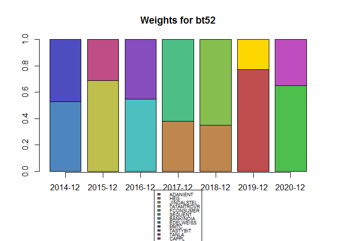

    ##                     ADANIENT   HEG JINDALSTEL TATAMTRDVR FCONSUMER SEQUENT
    ## 2015-12-24 05:30:00    0.000 0.000      0.689       0.00      0.00   0.000
    ## 2016-12-30 05:30:00    0.000 0.000      0.000       0.00      0.00   0.000
    ## 2017-12-29 05:30:00    0.000 0.378      0.000       0.00      0.00   0.622
    ## 2018-12-28 05:30:00    0.000 0.350      0.000       0.65      0.00   0.000
    ## 2019-12-27 05:30:00    0.774 0.000      0.000       0.00      0.00   0.000
    ## 2020-12-18 05:30:00    0.000 0.000      0.000       0.00      0.65   0.000
    ##                     BANKINDIA EDELWEISS MMTC TASTYBIT TANLA CAPPL CENTRALBK
    ## 2015-12-24 05:30:00     0.000         0    0    0.000  0.00 0.311     0.000
    ## 2016-12-30 05:30:00     0.549         0    0    0.451  0.00 0.000     0.000
    ## 2017-12-29 05:30:00     0.000         0    0    0.000  0.00 0.000     0.000
    ## 2018-12-28 05:30:00     0.000         0    0    0.000  0.00 0.000     0.000
    ## 2019-12-27 05:30:00     0.000         0    0    0.000  0.00 0.000     0.226
    ## 2020-12-18 05:30:00     0.000         0    0    0.000  0.35 0.000     0.000


    ##                       TCS HDFCBANK   IGL CHOLAFIN ABBOTINDIA RESPONIND
    ## 2015-12-24 05:30:00 0.000    0.000 0.000    0.000      0.018     0.000
    ## 2016-12-30 05:30:00 0.000    0.000 0.136    0.243      0.000     0.000
    ## 2017-12-29 05:30:00 0.000    0.000 0.164    0.108      0.000     0.000
    ## 2018-12-28 05:30:00 0.189    0.372 0.000    0.000      0.000     0.000
    ## 2019-12-27 05:30:00 0.286    0.000 0.000    0.000      0.082     0.124
    ## 2020-12-18 05:30:00 0.000    0.000 0.053    0.000      0.225     0.178
    ##                     SWANENERGY SANOFI ECLERX VAKRANGEE  INFY SOLARINDS PAGEIND
    ## 2015-12-24 05:30:00      0.000  0.077  0.196     0.000 0.000     0.125   0.026
    ## 2016-12-30 05:30:00      0.191  0.000  0.000     0.000 0.000     0.000   0.000
    ## 2017-12-29 05:30:00      0.037  0.000  0.000     0.191 0.000     0.000   0.000
    ## 2018-12-28 05:30:00      0.000  0.000  0.000     0.000 0.000     0.000   0.000
    ## 2019-12-27 05:30:00      0.000  0.000  0.000     0.000 0.047     0.000   0.000
    ## 2020-12-18 05:30:00      0.000  0.000  0.000     0.000 0.037     0.000   0.000
    ##                     HCLTECH  BPCL TRENT IPCALAB LUPIN   HEG  KRBL WESTLIFE
    ## 2015-12-24 05:30:00   0.037 0.000 0.000   0.000     0 0.000 0.059        0
    ## 2016-12-30 05:30:00   0.000 0.137 0.000   0.000     0 0.000 0.000        0
    ## 2017-12-29 05:30:00   0.000 0.000 0.000   0.000     0 0.000 0.000        0
    ## 2018-12-28 05:30:00   0.057 0.000 0.000   0.000     0 0.114 0.000        0
    ## 2019-12-27 05:30:00   0.000 0.000 0.134   0.015     0 0.000 0.000        0
    ## 2020-12-18 05:30:00   0.000 0.000 0.000   0.116     0 0.000 0.000        0
    ##                       IOC GRAPHITE CANFINHOME GRANULES RAJESHEXPO NAUKRI
    ## 2015-12-24 05:30:00 0.000    0.000      0.101    0.000      0.000  0.000
    ## 2016-12-30 05:30:00 0.104    0.000      0.000    0.000      0.082  0.000
    ## 2017-12-29 05:30:00 0.000    0.101      0.000    0.000      0.000  0.000
    ## 2018-12-28 05:30:00 0.000    0.000      0.000    0.000      0.015  0.000
    ## 2019-12-27 05:30:00 0.000    0.000      0.000    0.000      0.000  0.096
    ## 2020-12-18 05:30:00 0.000    0.000      0.000    0.097      0.000  0.000
    ##                     INDIACEM DHANUKA JCHAC BAJFINANCE  SJVN  NTPC IOLCP
    ## 2015-12-24 05:30:00    0.000   0.000 0.055      0.065 0.000 0.000 0.046
    ## 2016-12-30 05:30:00    0.000   0.000 0.000      0.000 0.000 0.000 0.000
    ## 2017-12-29 05:30:00    0.000   0.095 0.000      0.000 0.000 0.065 0.000
    ## 2018-12-28 05:30:00    0.000   0.000 0.000      0.000 0.062 0.000 0.000
    ## 2019-12-27 05:30:00    0.000   0.000 0.000      0.000 0.003 0.000 0.000
    ## 2020-12-18 05:30:00    0.095   0.000 0.000      0.000 0.000 0.000 0.016
    ##                     RATNAMANI MINDAIND HINDUNILVR TECHM SEQUENT APOLLOHOSP
    ## 2015-12-24 05:30:00         0    0.006      0.000 0.000   0.048      0.000
    ## 2016-12-30 05:30:00         0    0.000      0.000 0.000   0.000      0.000
    ## 2017-12-29 05:30:00         0    0.051      0.000 0.000   0.000      0.000
    ## 2018-12-28 05:30:00         0    0.000      0.057 0.000   0.000      0.000
    ## 2019-12-27 05:30:00         0    0.000      0.000 0.042   0.000      0.000
    ## 2020-12-18 05:30:00         0    0.000      0.000 0.000   0.000      0.052
    ##                      PGHH MPHASIS JYOTHYLAB RELAXO  GMM KAJARIACER SUNPHARMA
    ## 2015-12-24 05:30:00 0.000   0.000     0.000   0.00 0.00      0.036         0
    ## 2016-12-30 05:30:00 0.046   0.000     0.000   0.00 0.00      0.000         0
    ## 2017-12-29 05:30:00 0.000   0.046     0.000   0.00 0.00      0.000         0
    ## 2018-12-28 05:30:00 0.000   0.000     0.042   0.04 0.00      0.000         0
    ## 2019-12-27 05:30:00 0.000   0.000     0.000   0.00 0.04      0.000         0
    ## 2020-12-18 05:30:00 0.000   0.000     0.000   0.00 0.00      0.000         0
    ##                     ALKYLAMINE JBCHEPHARM REDINGTON  ATUL APLAPOLLO TANLA
    ## 2015-12-24 05:30:00          0      0.000     0.000 0.000     0.032 0.000
    ## 2016-12-30 05:30:00          0      0.000     0.000 0.000     0.000 0.000
    ## 2017-12-29 05:30:00          0      0.000     0.033 0.000     0.000 0.000
    ## 2018-12-28 05:30:00          0      0.000     0.000 0.000     0.000 0.000
    ## 2019-12-27 05:30:00          0      0.000     0.000 0.033     0.000 0.000
    ## 2020-12-18 05:30:00          0      0.033     0.000 0.000     0.000 0.032
    ##                     X3MINDIA ASTRAZEN EDELWEISS CHENNPETRO MINDTREE DEEPAKNI
    ## 2015-12-24 05:30:00    0.000    0.020      0.00      0.003     0.00     0.00
    ## 2016-12-30 05:30:00    0.000    0.000      0.03      0.027     0.00     0.00
    ## 2017-12-29 05:30:00    0.031    0.000      0.00      0.000     0.02     0.00
    ## 2018-12-28 05:30:00    0.000    0.000      0.00      0.000     0.00     0.00
    ## 2019-12-27 05:30:00    0.000    0.000      0.00      0.000     0.00     0.00
    ## 2020-12-18 05:30:00    0.000    0.011      0.00      0.000     0.00     0.03
    ##                       SRF TTKPRESTIG BRITANNIA NATCOPHARM BALRAMCHIN ALLCARGO
    ## 2015-12-24 05:30:00 0.000      0.000     0.000      0.025      0.000        0
    ## 2016-12-30 05:30:00 0.000      0.000     0.000      0.000      0.000        0
    ## 2017-12-29 05:30:00 0.000      0.029     0.000      0.000      0.000        0
    ## 2018-12-28 05:30:00 0.000      0.000     0.028      0.000      0.000        0
    ## 2019-12-27 05:30:00 0.029      0.000     0.000      0.000      0.025        0
    ## 2020-12-18 05:30:00 0.000      0.000     0.000      0.000      0.000        0
    ##                     JKTYRE COLPAL NAVINFLUOR J.KBANK
    ## 2015-12-24 05:30:00      0  0.000      0.000       0
    ## 2016-12-30 05:30:00      0  0.000      0.000       0
    ## 2017-12-29 05:30:00      0  0.000      0.000       0
    ## 2018-12-28 05:30:00      0  0.000      0.000       0
    ## 2019-12-27 05:30:00      0  0.021      0.000       0
    ## 2020-12-18 05:30:00      0  0.000      0.021       0

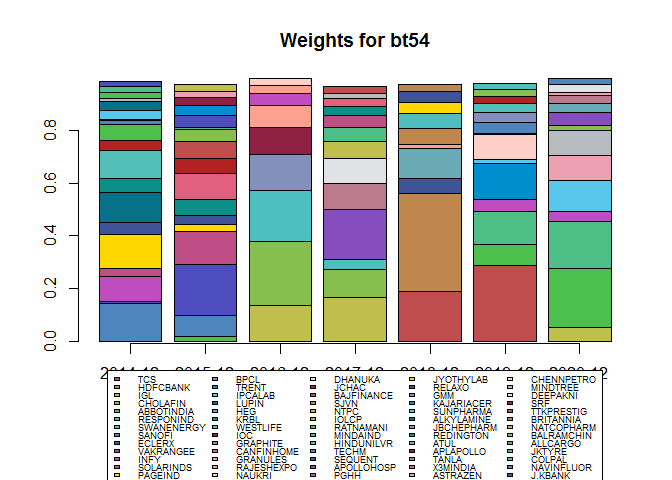

    ##                       TCS HDFCBANK   IGL CHOLAFIN ABBOTINDIA RESPONIND
    ## 2015-12-24 05:30:00 0.000    0.000 0.000    0.000      0.018     0.000
    ## 2016-12-30 05:30:00 0.000    0.000 0.136    0.243      0.000     0.000
    ## 2017-12-29 05:30:00 0.000    0.000 0.164    0.108      0.000     0.000
    ## 2018-12-28 05:30:00 0.189    0.372 0.000    0.000      0.000     0.000
    ## 2019-12-27 05:30:00 0.286    0.000 0.000    0.000      0.082     0.124
    ## 2020-12-18 05:30:00 0.000    0.000 0.053    0.000      0.225     0.178
    ##                     SWANENERGY SANOFI ECLERX VAKRANGEE  INFY SOLARINDS PAGEIND
    ## 2015-12-24 05:30:00      0.000  0.077  0.196     0.000 0.000     0.125   0.026
    ## 2016-12-30 05:30:00      0.191  0.000  0.000     0.000 0.000     0.000   0.000
    ## 2017-12-29 05:30:00      0.037  0.000  0.000     0.191 0.000     0.000   0.000
    ## 2018-12-28 05:30:00      0.000  0.000  0.000     0.000 0.000     0.000   0.000
    ## 2019-12-27 05:30:00      0.000  0.000  0.000     0.000 0.047     0.000   0.000
    ## 2020-12-18 05:30:00      0.000  0.000  0.000     0.000 0.037     0.000   0.000
    ##                     HCLTECH  BPCL TRENT IPCALAB LUPIN   HEG  KRBL WESTLIFE
    ## 2015-12-24 05:30:00   0.037 0.000 0.000   0.000     0 0.000 0.059        0
    ## 2016-12-30 05:30:00   0.000 0.137 0.000   0.000     0 0.000 0.000        0
    ## 2017-12-29 05:30:00   0.000 0.000 0.000   0.000     0 0.000 0.000        0
    ## 2018-12-28 05:30:00   0.057 0.000 0.000   0.000     0 0.114 0.000        0
    ## 2019-12-27 05:30:00   0.000 0.000 0.134   0.015     0 0.000 0.000        0
    ## 2020-12-18 05:30:00   0.000 0.000 0.000   0.116     0 0.000 0.000        0
    ##                       IOC GRAPHITE CANFINHOME GRANULES RAJESHEXPO NAUKRI
    ## 2015-12-24 05:30:00 0.000    0.000      0.101    0.000      0.000  0.000
    ## 2016-12-30 05:30:00 0.104    0.000      0.000    0.000      0.082  0.000
    ## 2017-12-29 05:30:00 0.000    0.101      0.000    0.000      0.000  0.000
    ## 2018-12-28 05:30:00 0.000    0.000      0.000    0.000      0.015  0.000
    ## 2019-12-27 05:30:00 0.000    0.000      0.000    0.000      0.000  0.096
    ## 2020-12-18 05:30:00 0.000    0.000      0.000    0.097      0.000  0.000
    ##                     INDIACEM DHANUKA JCHAC BAJFINANCE  SJVN  NTPC IOLCP
    ## 2015-12-24 05:30:00    0.000   0.000 0.055      0.065 0.000 0.000 0.046
    ## 2016-12-30 05:30:00    0.000   0.000 0.000      0.000 0.000 0.000 0.000
    ## 2017-12-29 05:30:00    0.000   0.095 0.000      0.000 0.000 0.065 0.000
    ## 2018-12-28 05:30:00    0.000   0.000 0.000      0.000 0.062 0.000 0.000
    ## 2019-12-27 05:30:00    0.000   0.000 0.000      0.000 0.003 0.000 0.000
    ## 2020-12-18 05:30:00    0.095   0.000 0.000      0.000 0.000 0.000 0.016
    ##                     RATNAMANI MINDAIND HINDUNILVR TECHM SEQUENT APOLLOHOSP
    ## 2015-12-24 05:30:00         0    0.006      0.000 0.000   0.048      0.000
    ## 2016-12-30 05:30:00         0    0.000      0.000 0.000   0.000      0.000
    ## 2017-12-29 05:30:00         0    0.051      0.000 0.000   0.000      0.000
    ## 2018-12-28 05:30:00         0    0.000      0.057 0.000   0.000      0.000
    ## 2019-12-27 05:30:00         0    0.000      0.000 0.042   0.000      0.000
    ## 2020-12-18 05:30:00         0    0.000      0.000 0.000   0.000      0.052
    ##                      PGHH MPHASIS JYOTHYLAB RELAXO  GMM KAJARIACER SUNPHARMA
    ## 2015-12-24 05:30:00 0.000   0.000     0.000   0.00 0.00      0.036         0
    ## 2016-12-30 05:30:00 0.046   0.000     0.000   0.00 0.00      0.000         0
    ## 2017-12-29 05:30:00 0.000   0.046     0.000   0.00 0.00      0.000         0
    ## 2018-12-28 05:30:00 0.000   0.000     0.042   0.04 0.00      0.000         0
    ## 2019-12-27 05:30:00 0.000   0.000     0.000   0.00 0.04      0.000         0
    ## 2020-12-18 05:30:00 0.000   0.000     0.000   0.00 0.00      0.000         0
    ##                     ALKYLAMINE JBCHEPHARM REDINGTON  ATUL APLAPOLLO TANLA
    ## 2015-12-24 05:30:00          0      0.000     0.000 0.000     0.032 0.000
    ## 2016-12-30 05:30:00          0      0.000     0.000 0.000     0.000 0.000
    ## 2017-12-29 05:30:00          0      0.000     0.033 0.000     0.000 0.000
    ## 2018-12-28 05:30:00          0      0.000     0.000 0.000     0.000 0.000
    ## 2019-12-27 05:30:00          0      0.000     0.000 0.033     0.000 0.000
    ## 2020-12-18 05:30:00          0      0.033     0.000 0.000     0.000 0.032
    ##                     X3MINDIA ASTRAZEN EDELWEISS CHENNPETRO MINDTREE DEEPAKNI
    ## 2015-12-24 05:30:00    0.000    0.020      0.00      0.003     0.00     0.00
    ## 2016-12-30 05:30:00    0.000    0.000      0.03      0.027     0.00     0.00
    ## 2017-12-29 05:30:00    0.031    0.000      0.00      0.000     0.02     0.00
    ## 2018-12-28 05:30:00    0.000    0.000      0.00      0.000     0.00     0.00
    ## 2019-12-27 05:30:00    0.000    0.000      0.00      0.000     0.00     0.00
    ## 2020-12-18 05:30:00    0.000    0.011      0.00      0.000     0.00     0.03
    ##                       SRF TTKPRESTIG BRITANNIA NATCOPHARM BALRAMCHIN ALLCARGO
    ## 2015-12-24 05:30:00 0.000      0.000     0.000      0.025      0.000        0
    ## 2016-12-30 05:30:00 0.000      0.000     0.000      0.000      0.000        0
    ## 2017-12-29 05:30:00 0.000      0.029     0.000      0.000      0.000        0
    ## 2018-12-28 05:30:00 0.000      0.000     0.028      0.000      0.000        0
    ## 2019-12-27 05:30:00 0.029      0.000     0.000      0.000      0.025        0
    ## 2020-12-18 05:30:00 0.000      0.000     0.000      0.000      0.000        0
    ##                     JKTYRE COLPAL NAVINFLUOR J.KBANK
    ## 2015-12-24 05:30:00      0  0.000      0.000       0
    ## 2016-12-30 05:30:00      0  0.000      0.000       0
    ## 2017-12-29 05:30:00      0  0.000      0.000       0
    ## 2018-12-28 05:30:00      0  0.000      0.000       0
    ## 2019-12-27 05:30:00      0  0.021      0.000       0
    ## 2020-12-18 05:30:00      0  0.000      0.021       0


    ##                       TCS HDFCBANK   IGL CHOLAFIN ABBOTINDIA RESPONIND
    ## 2015-12-24 05:30:00 0.000    0.000 0.000    0.000      0.018     0.000
    ## 2016-12-30 05:30:00 0.000    0.000 0.136    0.243      0.000     0.000
    ## 2017-12-29 05:30:00 0.000    0.000 0.164    0.108      0.000     0.000
    ## 2018-12-28 05:30:00 0.189    0.372 0.000    0.000      0.000     0.000
    ## 2019-12-27 05:30:00 0.286    0.000 0.000    0.000      0.082     0.124
    ## 2020-12-18 05:30:00 0.000    0.000 0.053    0.000      0.225     0.178
    ##                     SWANENERGY SANOFI ECLERX VAKRANGEE  INFY SOLARINDS PAGEIND
    ## 2015-12-24 05:30:00      0.000  0.077  0.196     0.000 0.000     0.125   0.026
    ## 2016-12-30 05:30:00      0.191  0.000  0.000     0.000 0.000     0.000   0.000
    ## 2017-12-29 05:30:00      0.037  0.000  0.000     0.191 0.000     0.000   0.000
    ## 2018-12-28 05:30:00      0.000  0.000  0.000     0.000 0.000     0.000   0.000
    ## 2019-12-27 05:30:00      0.000  0.000  0.000     0.000 0.047     0.000   0.000
    ## 2020-12-18 05:30:00      0.000  0.000  0.000     0.000 0.037     0.000   0.000
    ##                     HCLTECH  BPCL TRENT IPCALAB LUPIN   HEG  KRBL WESTLIFE
    ## 2015-12-24 05:30:00   0.037 0.000 0.000   0.000     0 0.000 0.059        0
    ## 2016-12-30 05:30:00   0.000 0.137 0.000   0.000     0 0.000 0.000        0
    ## 2017-12-29 05:30:00   0.000 0.000 0.000   0.000     0 0.000 0.000        0
    ## 2018-12-28 05:30:00   0.057 0.000 0.000   0.000     0 0.114 0.000        0
    ## 2019-12-27 05:30:00   0.000 0.000 0.134   0.015     0 0.000 0.000        0
    ## 2020-12-18 05:30:00   0.000 0.000 0.000   0.116     0 0.000 0.000        0
    ##                       IOC GRAPHITE CANFINHOME GRANULES RAJESHEXPO NAUKRI
    ## 2015-12-24 05:30:00 0.000    0.000      0.101    0.000      0.000  0.000
    ## 2016-12-30 05:30:00 0.104    0.000      0.000    0.000      0.082  0.000
    ## 2017-12-29 05:30:00 0.000    0.101      0.000    0.000      0.000  0.000
    ## 2018-12-28 05:30:00 0.000    0.000      0.000    0.000      0.015  0.000
    ## 2019-12-27 05:30:00 0.000    0.000      0.000    0.000      0.000  0.096
    ## 2020-12-18 05:30:00 0.000    0.000      0.000    0.097      0.000  0.000
    ##                     INDIACEM DHANUKA JCHAC BAJFINANCE  SJVN  NTPC IOLCP
    ## 2015-12-24 05:30:00    0.000   0.000 0.055      0.065 0.000 0.000 0.046
    ## 2016-12-30 05:30:00    0.000   0.000 0.000      0.000 0.000 0.000 0.000
    ## 2017-12-29 05:30:00    0.000   0.095 0.000      0.000 0.000 0.065 0.000
    ## 2018-12-28 05:30:00    0.000   0.000 0.000      0.000 0.062 0.000 0.000
    ## 2019-12-27 05:30:00    0.000   0.000 0.000      0.000 0.003 0.000 0.000
    ## 2020-12-18 05:30:00    0.095   0.000 0.000      0.000 0.000 0.000 0.016
    ##                     RATNAMANI MINDAIND HINDUNILVR TECHM SEQUENT APOLLOHOSP
    ## 2015-12-24 05:30:00         0    0.006      0.000 0.000   0.048      0.000
    ## 2016-12-30 05:30:00         0    0.000      0.000 0.000   0.000      0.000
    ## 2017-12-29 05:30:00         0    0.051      0.000 0.000   0.000      0.000
    ## 2018-12-28 05:30:00         0    0.000      0.057 0.000   0.000      0.000
    ## 2019-12-27 05:30:00         0    0.000      0.000 0.042   0.000      0.000
    ## 2020-12-18 05:30:00         0    0.000      0.000 0.000   0.000      0.052
    ##                      PGHH MPHASIS JYOTHYLAB RELAXO  GMM KAJARIACER SUNPHARMA
    ## 2015-12-24 05:30:00 0.000   0.000     0.000   0.00 0.00      0.036         0
    ## 2016-12-30 05:30:00 0.046   0.000     0.000   0.00 0.00      0.000         0
    ## 2017-12-29 05:30:00 0.000   0.046     0.000   0.00 0.00      0.000         0
    ## 2018-12-28 05:30:00 0.000   0.000     0.042   0.04 0.00      0.000         0
    ## 2019-12-27 05:30:00 0.000   0.000     0.000   0.00 0.04      0.000         0
    ## 2020-12-18 05:30:00 0.000   0.000     0.000   0.00 0.00      0.000         0
    ##                     ALKYLAMINE JBCHEPHARM REDINGTON  ATUL APLAPOLLO TANLA
    ## 2015-12-24 05:30:00          0      0.000     0.000 0.000     0.032 0.000
    ## 2016-12-30 05:30:00          0      0.000     0.000 0.000     0.000 0.000
    ## 2017-12-29 05:30:00          0      0.000     0.033 0.000     0.000 0.000
    ## 2018-12-28 05:30:00          0      0.000     0.000 0.000     0.000 0.000
    ## 2019-12-27 05:30:00          0      0.000     0.000 0.033     0.000 0.000
    ## 2020-12-18 05:30:00          0      0.033     0.000 0.000     0.000 0.032
    ##                     X3MINDIA ASTRAZEN EDELWEISS CHENNPETRO MINDTREE DEEPAKNI
    ## 2015-12-24 05:30:00    0.000    0.020      0.00      0.003     0.00     0.00
    ## 2016-12-30 05:30:00    0.000    0.000      0.03      0.027     0.00     0.00
    ## 2017-12-29 05:30:00    0.031    0.000      0.00      0.000     0.02     0.00
    ## 2018-12-28 05:30:00    0.000    0.000      0.00      0.000     0.00     0.00
    ## 2019-12-27 05:30:00    0.000    0.000      0.00      0.000     0.00     0.00
    ## 2020-12-18 05:30:00    0.000    0.011      0.00      0.000     0.00     0.03
    ##                       SRF TTKPRESTIG BRITANNIA NATCOPHARM BALRAMCHIN ALLCARGO
    ## 2015-12-24 05:30:00 0.000      0.000     0.000      0.025      0.000        0
    ## 2016-12-30 05:30:00 0.000      0.000     0.000      0.000      0.000        0
    ## 2017-12-29 05:30:00 0.000      0.029     0.000      0.000      0.000        0
    ## 2018-12-28 05:30:00 0.000      0.000     0.028      0.000      0.000        0
    ## 2019-12-27 05:30:00 0.029      0.000     0.000      0.000      0.025        0
    ## 2020-12-18 05:30:00 0.000      0.000     0.000      0.000      0.000        0
    ##                     JKTYRE COLPAL NAVINFLUOR J.KBANK
    ## 2015-12-24 05:30:00      0  0.000      0.000       0
    ## 2016-12-30 05:30:00      0  0.000      0.000       0
    ## 2017-12-29 05:30:00      0  0.000      0.000       0
    ## 2018-12-28 05:30:00      0  0.000      0.000       0
    ## 2019-12-27 05:30:00      0  0.021      0.000       0
    ## 2020-12-18 05:30:00      0  0.000      0.021       0


    ##                     HEG ADANIENT TANLA EDELWEISS CAPPL TASTYBIT
    ## 2015-12-24 05:30:00   0        0     0         0     1        0
    ## 2016-12-30 05:30:00   0        0     0         0     0        1
    ## 2017-12-29 05:30:00   1        0     0         0     0        0
    ## 2018-12-28 05:30:00   1        0     0         0     0        0
    ## 2019-12-27 05:30:00   0        1     0         0     0        0
    ## 2020-12-18 05:30:00   0        0     1         0     0        0


    ##                       TCS HDFCBANK   IGL CHOLAFIN ABBOTINDIA RESPONIND
    ## 2015-12-24 05:30:00 0.000    0.000 0.000    0.000      0.018     0.000
    ## 2016-12-30 05:30:00 0.000    0.000 0.136    0.243      0.000     0.000
    ## 2017-12-29 05:30:00 0.000    0.000 0.164    0.108      0.000     0.000
    ## 2018-12-28 05:30:00 0.189    0.372 0.000    0.000      0.000     0.000
    ## 2019-12-27 05:30:00 0.286    0.000 0.000    0.000      0.082     0.124
    ## 2020-12-18 05:30:00 0.000    0.000 0.053    0.000      0.225     0.178
    ##                     SWANENERGY SANOFI ECLERX VAKRANGEE  INFY SOLARINDS PAGEIND
    ## 2015-12-24 05:30:00      0.000  0.077  0.196     0.000 0.000     0.125   0.026
    ## 2016-12-30 05:30:00      0.191  0.000  0.000     0.000 0.000     0.000   0.000
    ## 2017-12-29 05:30:00      0.037  0.000  0.000     0.191 0.000     0.000   0.000
    ## 2018-12-28 05:30:00      0.000  0.000  0.000     0.000 0.000     0.000   0.000
    ## 2019-12-27 05:30:00      0.000  0.000  0.000     0.000 0.047     0.000   0.000
    ## 2020-12-18 05:30:00      0.000  0.000  0.000     0.000 0.037     0.000   0.000
    ##                     HCLTECH  BPCL TRENT IPCALAB LUPIN   HEG  KRBL WESTLIFE
    ## 2015-12-24 05:30:00   0.037 0.000 0.000   0.000     0 0.000 0.059        0
    ## 2016-12-30 05:30:00   0.000 0.137 0.000   0.000     0 0.000 0.000        0
    ## 2017-12-29 05:30:00   0.000 0.000 0.000   0.000     0 0.000 0.000        0
    ## 2018-12-28 05:30:00   0.057 0.000 0.000   0.000     0 0.114 0.000        0
    ## 2019-12-27 05:30:00   0.000 0.000 0.134   0.015     0 0.000 0.000        0
    ## 2020-12-18 05:30:00   0.000 0.000 0.000   0.116     0 0.000 0.000        0
    ##                       IOC GRAPHITE CANFINHOME GRANULES RAJESHEXPO NAUKRI
    ## 2015-12-24 05:30:00 0.000    0.000      0.101    0.000      0.000  0.000
    ## 2016-12-30 05:30:00 0.104    0.000      0.000    0.000      0.082  0.000
    ## 2017-12-29 05:30:00 0.000    0.101      0.000    0.000      0.000  0.000
    ## 2018-12-28 05:30:00 0.000    0.000      0.000    0.000      0.015  0.000
    ## 2019-12-27 05:30:00 0.000    0.000      0.000    0.000      0.000  0.096
    ## 2020-12-18 05:30:00 0.000    0.000      0.000    0.097      0.000  0.000
    ##                     INDIACEM DHANUKA JCHAC BAJFINANCE  SJVN  NTPC IOLCP
    ## 2015-12-24 05:30:00    0.000   0.000 0.055      0.065 0.000 0.000 0.046
    ## 2016-12-30 05:30:00    0.000   0.000 0.000      0.000 0.000 0.000 0.000
    ## 2017-12-29 05:30:00    0.000   0.095 0.000      0.000 0.000 0.065 0.000
    ## 2018-12-28 05:30:00    0.000   0.000 0.000      0.000 0.062 0.000 0.000
    ## 2019-12-27 05:30:00    0.000   0.000 0.000      0.000 0.003 0.000 0.000
    ## 2020-12-18 05:30:00    0.095   0.000 0.000      0.000 0.000 0.000 0.016
    ##                     RATNAMANI MINDAIND HINDUNILVR TECHM SEQUENT APOLLOHOSP
    ## 2015-12-24 05:30:00         0    0.006      0.000 0.000   0.048      0.000
    ## 2016-12-30 05:30:00         0    0.000      0.000 0.000   0.000      0.000
    ## 2017-12-29 05:30:00         0    0.051      0.000 0.000   0.000      0.000
    ## 2018-12-28 05:30:00         0    0.000      0.057 0.000   0.000      0.000
    ## 2019-12-27 05:30:00         0    0.000      0.000 0.042   0.000      0.000
    ## 2020-12-18 05:30:00         0    0.000      0.000 0.000   0.000      0.052
    ##                      PGHH MPHASIS JYOTHYLAB RELAXO  GMM KAJARIACER SUNPHARMA
    ## 2015-12-24 05:30:00 0.000   0.000     0.000   0.00 0.00      0.036         0
    ## 2016-12-30 05:30:00 0.046   0.000     0.000   0.00 0.00      0.000         0
    ## 2017-12-29 05:30:00 0.000   0.046     0.000   0.00 0.00      0.000         0
    ## 2018-12-28 05:30:00 0.000   0.000     0.042   0.04 0.00      0.000         0
    ## 2019-12-27 05:30:00 0.000   0.000     0.000   0.00 0.04      0.000         0
    ## 2020-12-18 05:30:00 0.000   0.000     0.000   0.00 0.00      0.000         0
    ##                     ALKYLAMINE JBCHEPHARM REDINGTON  ATUL APLAPOLLO TANLA
    ## 2015-12-24 05:30:00          0      0.000     0.000 0.000     0.032 0.000
    ## 2016-12-30 05:30:00          0      0.000     0.000 0.000     0.000 0.000
    ## 2017-12-29 05:30:00          0      0.000     0.033 0.000     0.000 0.000
    ## 2018-12-28 05:30:00          0      0.000     0.000 0.000     0.000 0.000
    ## 2019-12-27 05:30:00          0      0.000     0.000 0.033     0.000 0.000
    ## 2020-12-18 05:30:00          0      0.033     0.000 0.000     0.000 0.032
    ##                     X3MINDIA ASTRAZEN EDELWEISS CHENNPETRO MINDTREE DEEPAKNI
    ## 2015-12-24 05:30:00    0.000    0.020      0.00      0.003     0.00     0.00
    ## 2016-12-30 05:30:00    0.000    0.000      0.03      0.027     0.00     0.00
    ## 2017-12-29 05:30:00    0.031    0.000      0.00      0.000     0.02     0.00
    ## 2018-12-28 05:30:00    0.000    0.000      0.00      0.000     0.00     0.00
    ## 2019-12-27 05:30:00    0.000    0.000      0.00      0.000     0.00     0.00
    ## 2020-12-18 05:30:00    0.000    0.011      0.00      0.000     0.00     0.03
    ##                       SRF TTKPRESTIG BRITANNIA NATCOPHARM BALRAMCHIN ALLCARGO
    ## 2015-12-24 05:30:00 0.000      0.000     0.000      0.025      0.000        0
    ## 2016-12-30 05:30:00 0.000      0.000     0.000      0.000      0.000        0
    ## 2017-12-29 05:30:00 0.000      0.029     0.000      0.000      0.000        0
    ## 2018-12-28 05:30:00 0.000      0.000     0.028      0.000      0.000        0
    ## 2019-12-27 05:30:00 0.029      0.000     0.000      0.000      0.025        0
    ## 2020-12-18 05:30:00 0.000      0.000     0.000      0.000      0.000        0
    ##                     JKTYRE COLPAL NAVINFLUOR J.KBANK
    ## 2015-12-24 05:30:00      0  0.000      0.000       0
    ## 2016-12-30 05:30:00      0  0.000      0.000       0
    ## 2017-12-29 05:30:00      0  0.000      0.000       0
    ## 2018-12-28 05:30:00      0  0.000      0.000       0
    ## 2019-12-27 05:30:00      0  0.021      0.000       0
    ## 2020-12-18 05:30:00      0  0.000      0.021       0


    ##                       TCS HDFCBANK   IGL CHOLAFIN ABBOTINDIA RESPONIND
    ## 2015-12-24 05:30:00 0.000    0.000 0.000    0.000      0.018     0.000
    ## 2016-12-30 05:30:00 0.000    0.000 0.136    0.243      0.000     0.000
    ## 2017-12-29 05:30:00 0.000    0.000 0.164    0.108      0.000     0.000
    ## 2018-12-28 05:30:00 0.189    0.372 0.000    0.000      0.000     0.000
    ## 2019-12-27 05:30:00 0.286    0.000 0.000    0.000      0.082     0.124
    ## 2020-12-18 05:30:00 0.000    0.000 0.053    0.000      0.225     0.178
    ##                     SWANENERGY SANOFI ECLERX VAKRANGEE  INFY SOLARINDS PAGEIND
    ## 2015-12-24 05:30:00      0.000  0.077  0.196     0.000 0.000     0.125   0.026
    ## 2016-12-30 05:30:00      0.191  0.000  0.000     0.000 0.000     0.000   0.000
    ## 2017-12-29 05:30:00      0.037  0.000  0.000     0.191 0.000     0.000   0.000
    ## 2018-12-28 05:30:00      0.000  0.000  0.000     0.000 0.000     0.000   0.000
    ## 2019-12-27 05:30:00      0.000  0.000  0.000     0.000 0.047     0.000   0.000
    ## 2020-12-18 05:30:00      0.000  0.000  0.000     0.000 0.037     0.000   0.000
    ##                     HCLTECH  BPCL TRENT IPCALAB LUPIN   HEG  KRBL WESTLIFE
    ## 2015-12-24 05:30:00   0.037 0.000 0.000   0.000     0 0.000 0.059        0
    ## 2016-12-30 05:30:00   0.000 0.137 0.000   0.000     0 0.000 0.000        0
    ## 2017-12-29 05:30:00   0.000 0.000 0.000   0.000     0 0.000 0.000        0
    ## 2018-12-28 05:30:00   0.057 0.000 0.000   0.000     0 0.114 0.000        0
    ## 2019-12-27 05:30:00   0.000 0.000 0.134   0.015     0 0.000 0.000        0
    ## 2020-12-18 05:30:00   0.000 0.000 0.000   0.116     0 0.000 0.000        0
    ##                       IOC GRAPHITE CANFINHOME GRANULES RAJESHEXPO NAUKRI
    ## 2015-12-24 05:30:00 0.000    0.000      0.101    0.000      0.000  0.000
    ## 2016-12-30 05:30:00 0.104    0.000      0.000    0.000      0.082  0.000
    ## 2017-12-29 05:30:00 0.000    0.101      0.000    0.000      0.000  0.000
    ## 2018-12-28 05:30:00 0.000    0.000      0.000    0.000      0.015  0.000
    ## 2019-12-27 05:30:00 0.000    0.000      0.000    0.000      0.000  0.096
    ## 2020-12-18 05:30:00 0.000    0.000      0.000    0.097      0.000  0.000
    ##                     INDIACEM DHANUKA JCHAC BAJFINANCE  SJVN  NTPC IOLCP
    ## 2015-12-24 05:30:00    0.000   0.000 0.055      0.065 0.000 0.000 0.046
    ## 2016-12-30 05:30:00    0.000   0.000 0.000      0.000 0.000 0.000 0.000
    ## 2017-12-29 05:30:00    0.000   0.095 0.000      0.000 0.000 0.065 0.000
    ## 2018-12-28 05:30:00    0.000   0.000 0.000      0.000 0.062 0.000 0.000
    ## 2019-12-27 05:30:00    0.000   0.000 0.000      0.000 0.003 0.000 0.000
    ## 2020-12-18 05:30:00    0.095   0.000 0.000      0.000 0.000 0.000 0.016
    ##                     RATNAMANI MINDAIND HINDUNILVR TECHM SEQUENT APOLLOHOSP
    ## 2015-12-24 05:30:00         0    0.006      0.000 0.000   0.048      0.000
    ## 2016-12-30 05:30:00         0    0.000      0.000 0.000   0.000      0.000
    ## 2017-12-29 05:30:00         0    0.051      0.000 0.000   0.000      0.000
    ## 2018-12-28 05:30:00         0    0.000      0.057 0.000   0.000      0.000
    ## 2019-12-27 05:30:00         0    0.000      0.000 0.042   0.000      0.000
    ## 2020-12-18 05:30:00         0    0.000      0.000 0.000   0.000      0.052
    ##                      PGHH MPHASIS JYOTHYLAB RELAXO  GMM KAJARIACER SUNPHARMA
    ## 2015-12-24 05:30:00 0.000   0.000     0.000   0.00 0.00      0.036         0
    ## 2016-12-30 05:30:00 0.046   0.000     0.000   0.00 0.00      0.000         0
    ## 2017-12-29 05:30:00 0.000   0.046     0.000   0.00 0.00      0.000         0
    ## 2018-12-28 05:30:00 0.000   0.000     0.042   0.04 0.00      0.000         0
    ## 2019-12-27 05:30:00 0.000   0.000     0.000   0.00 0.04      0.000         0
    ## 2020-12-18 05:30:00 0.000   0.000     0.000   0.00 0.00      0.000         0
    ##                     ALKYLAMINE JBCHEPHARM REDINGTON  ATUL APLAPOLLO TANLA
    ## 2015-12-24 05:30:00          0      0.000     0.000 0.000     0.032 0.000
    ## 2016-12-30 05:30:00          0      0.000     0.000 0.000     0.000 0.000
    ## 2017-12-29 05:30:00          0      0.000     0.033 0.000     0.000 0.000
    ## 2018-12-28 05:30:00          0      0.000     0.000 0.000     0.000 0.000
    ## 2019-12-27 05:30:00          0      0.000     0.000 0.033     0.000 0.000
    ## 2020-12-18 05:30:00          0      0.033     0.000 0.000     0.000 0.032
    ##                     X3MINDIA ASTRAZEN EDELWEISS CHENNPETRO MINDTREE DEEPAKNI
    ## 2015-12-24 05:30:00    0.000    0.020      0.00      0.003     0.00     0.00
    ## 2016-12-30 05:30:00    0.000    0.000      0.03      0.027     0.00     0.00
    ## 2017-12-29 05:30:00    0.031    0.000      0.00      0.000     0.02     0.00
    ## 2018-12-28 05:30:00    0.000    0.000      0.00      0.000     0.00     0.00
    ## 2019-12-27 05:30:00    0.000    0.000      0.00      0.000     0.00     0.00
    ## 2020-12-18 05:30:00    0.000    0.011      0.00      0.000     0.00     0.03
    ##                       SRF TTKPRESTIG BRITANNIA NATCOPHARM BALRAMCHIN ALLCARGO
    ## 2015-12-24 05:30:00 0.000      0.000     0.000      0.025      0.000        0
    ## 2016-12-30 05:30:00 0.000      0.000     0.000      0.000      0.000        0
    ## 2017-12-29 05:30:00 0.000      0.029     0.000      0.000      0.000        0
    ## 2018-12-28 05:30:00 0.000      0.000     0.028      0.000      0.000        0
    ## 2019-12-27 05:30:00 0.029      0.000     0.000      0.000      0.025        0
    ## 2020-12-18 05:30:00 0.000      0.000     0.000      0.000      0.000        0
    ##                     JKTYRE COLPAL NAVINFLUOR J.KBANK
    ## 2015-12-24 05:30:00      0  0.000      0.000       0
    ## 2016-12-30 05:30:00      0  0.000      0.000       0
    ## 2017-12-29 05:30:00      0  0.000      0.000       0
    ## 2018-12-28 05:30:00      0  0.000      0.000       0
    ## 2019-12-27 05:30:00      0  0.021      0.000       0
    ## 2020-12-18 05:30:00      0  0.000      0.021       0


    ##                       TCS HDFCBANK   IGL CHOLAFIN ABBOTINDIA RESPONIND
    ## 2015-12-24 05:30:00 0.000    0.000 0.000    0.000      0.018     0.000
    ## 2016-12-30 05:30:00 0.000    0.000 0.136    0.243      0.000     0.000
    ## 2017-12-29 05:30:00 0.000    0.000 0.164    0.108      0.000     0.000
    ## 2018-12-28 05:30:00 0.189    0.372 0.000    0.000      0.000     0.000
    ## 2019-12-27 05:30:00 0.286    0.000 0.000    0.000      0.082     0.124
    ## 2020-12-18 05:30:00 0.000    0.000 0.053    0.000      0.225     0.178
    ##                     SWANENERGY SANOFI ECLERX VAKRANGEE  INFY SOLARINDS PAGEIND
    ## 2015-12-24 05:30:00      0.000  0.077  0.196     0.000 0.000     0.125   0.026
    ## 2016-12-30 05:30:00      0.191  0.000  0.000     0.000 0.000     0.000   0.000
    ## 2017-12-29 05:30:00      0.037  0.000  0.000     0.191 0.000     0.000   0.000
    ## 2018-12-28 05:30:00      0.000  0.000  0.000     0.000 0.000     0.000   0.000
    ## 2019-12-27 05:30:00      0.000  0.000  0.000     0.000 0.047     0.000   0.000
    ## 2020-12-18 05:30:00      0.000  0.000  0.000     0.000 0.037     0.000   0.000
    ##                     HCLTECH  BPCL TRENT IPCALAB LUPIN   HEG  KRBL WESTLIFE
    ## 2015-12-24 05:30:00   0.037 0.000 0.000   0.000     0 0.000 0.059        0
    ## 2016-12-30 05:30:00   0.000 0.137 0.000   0.000     0 0.000 0.000        0
    ## 2017-12-29 05:30:00   0.000 0.000 0.000   0.000     0 0.000 0.000        0
    ## 2018-12-28 05:30:00   0.057 0.000 0.000   0.000     0 0.114 0.000        0
    ## 2019-12-27 05:30:00   0.000 0.000 0.134   0.015     0 0.000 0.000        0
    ## 2020-12-18 05:30:00   0.000 0.000 0.000   0.116     0 0.000 0.000        0
    ##                       IOC GRAPHITE CANFINHOME GRANULES RAJESHEXPO NAUKRI
    ## 2015-12-24 05:30:00 0.000    0.000      0.101    0.000      0.000  0.000
    ## 2016-12-30 05:30:00 0.104    0.000      0.000    0.000      0.082  0.000
    ## 2017-12-29 05:30:00 0.000    0.101      0.000    0.000      0.000  0.000
    ## 2018-12-28 05:30:00 0.000    0.000      0.000    0.000      0.015  0.000
    ## 2019-12-27 05:30:00 0.000    0.000      0.000    0.000      0.000  0.096
    ## 2020-12-18 05:30:00 0.000    0.000      0.000    0.097      0.000  0.000
    ##                     INDIACEM DHANUKA JCHAC BAJFINANCE  SJVN  NTPC IOLCP
    ## 2015-12-24 05:30:00    0.000   0.000 0.055      0.065 0.000 0.000 0.046
    ## 2016-12-30 05:30:00    0.000   0.000 0.000      0.000 0.000 0.000 0.000
    ## 2017-12-29 05:30:00    0.000   0.095 0.000      0.000 0.000 0.065 0.000
    ## 2018-12-28 05:30:00    0.000   0.000 0.000      0.000 0.062 0.000 0.000
    ## 2019-12-27 05:30:00    0.000   0.000 0.000      0.000 0.003 0.000 0.000
    ## 2020-12-18 05:30:00    0.095   0.000 0.000      0.000 0.000 0.000 0.016
    ##                     RATNAMANI MINDAIND HINDUNILVR TECHM SEQUENT APOLLOHOSP
    ## 2015-12-24 05:30:00         0    0.006      0.000 0.000   0.048      0.000
    ## 2016-12-30 05:30:00         0    0.000      0.000 0.000   0.000      0.000
    ## 2017-12-29 05:30:00         0    0.051      0.000 0.000   0.000      0.000
    ## 2018-12-28 05:30:00         0    0.000      0.057 0.000   0.000      0.000
    ## 2019-12-27 05:30:00         0    0.000      0.000 0.042   0.000      0.000
    ## 2020-12-18 05:30:00         0    0.000      0.000 0.000   0.000      0.052
    ##                      PGHH MPHASIS JYOTHYLAB RELAXO  GMM KAJARIACER SUNPHARMA
    ## 2015-12-24 05:30:00 0.000   0.000     0.000   0.00 0.00      0.036         0
    ## 2016-12-30 05:30:00 0.046   0.000     0.000   0.00 0.00      0.000         0
    ## 2017-12-29 05:30:00 0.000   0.046     0.000   0.00 0.00      0.000         0
    ## 2018-12-28 05:30:00 0.000   0.000     0.042   0.04 0.00      0.000         0
    ## 2019-12-27 05:30:00 0.000   0.000     0.000   0.00 0.04      0.000         0
    ## 2020-12-18 05:30:00 0.000   0.000     0.000   0.00 0.00      0.000         0
    ##                     ALKYLAMINE JBCHEPHARM REDINGTON  ATUL APLAPOLLO TANLA
    ## 2015-12-24 05:30:00          0      0.000     0.000 0.000     0.032 0.000
    ## 2016-12-30 05:30:00          0      0.000     0.000 0.000     0.000 0.000
    ## 2017-12-29 05:30:00          0      0.000     0.033 0.000     0.000 0.000
    ## 2018-12-28 05:30:00          0      0.000     0.000 0.000     0.000 0.000
    ## 2019-12-27 05:30:00          0      0.000     0.000 0.033     0.000 0.000
    ## 2020-12-18 05:30:00          0      0.033     0.000 0.000     0.000 0.032
    ##                     X3MINDIA ASTRAZEN EDELWEISS CHENNPETRO MINDTREE DEEPAKNI
    ## 2015-12-24 05:30:00    0.000    0.020      0.00      0.003     0.00     0.00
    ## 2016-12-30 05:30:00    0.000    0.000      0.03      0.027     0.00     0.00
    ## 2017-12-29 05:30:00    0.031    0.000      0.00      0.000     0.02     0.00
    ## 2018-12-28 05:30:00    0.000    0.000      0.00      0.000     0.00     0.00
    ## 2019-12-27 05:30:00    0.000    0.000      0.00      0.000     0.00     0.00
    ## 2020-12-18 05:30:00    0.000    0.011      0.00      0.000     0.00     0.03
    ##                       SRF TTKPRESTIG BRITANNIA NATCOPHARM BALRAMCHIN ALLCARGO
    ## 2015-12-24 05:30:00 0.000      0.000     0.000      0.025      0.000        0
    ## 2016-12-30 05:30:00 0.000      0.000     0.000      0.000      0.000        0
    ## 2017-12-29 05:30:00 0.000      0.029     0.000      0.000      0.000        0
    ## 2018-12-28 05:30:00 0.000      0.000     0.028      0.000      0.000        0
    ## 2019-12-27 05:30:00 0.029      0.000     0.000      0.000      0.025        0
    ## 2020-12-18 05:30:00 0.000      0.000     0.000      0.000      0.000        0
    ##                     JKTYRE COLPAL NAVINFLUOR J.KBANK
    ## 2015-12-24 05:30:00      0  0.000      0.000       0
    ## 2016-12-30 05:30:00      0  0.000      0.000       0
    ## 2017-12-29 05:30:00      0  0.000      0.000       0
    ## 2018-12-28 05:30:00      0  0.000      0.000       0
    ## 2019-12-27 05:30:00      0  0.021      0.000       0
    ## 2020-12-18 05:30:00      0  0.000      0.021       0

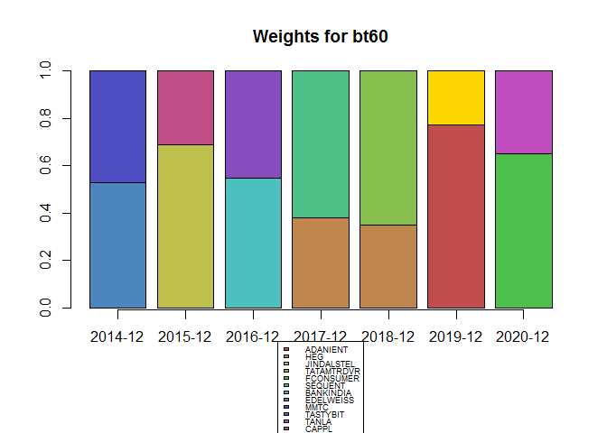

    ##                     ADANIENT   HEG JINDALSTEL TATAMTRDVR FCONSUMER SEQUENT
    ## 2015-12-24 05:30:00    0.000 0.000      0.689       0.00      0.00   0.000
    ## 2016-12-30 05:30:00    0.000 0.000      0.000       0.00      0.00   0.000
    ## 2017-12-29 05:30:00    0.000 0.378      0.000       0.00      0.00   0.622
    ## 2018-12-28 05:30:00    0.000 0.350      0.000       0.65      0.00   0.000
    ## 2019-12-27 05:30:00    0.774 0.000      0.000       0.00      0.00   0.000
    ## 2020-12-18 05:30:00    0.000 0.000      0.000       0.00      0.65   0.000
    ##                     BANKINDIA EDELWEISS MMTC TASTYBIT TANLA CAPPL CENTRALBK
    ## 2015-12-24 05:30:00     0.000         0    0    0.000  0.00 0.311     0.000
    ## 2016-12-30 05:30:00     0.549         0    0    0.451  0.00 0.000     0.000
    ## 2017-12-29 05:30:00     0.000         0    0    0.000  0.00 0.000     0.000
    ## 2018-12-28 05:30:00     0.000         0    0    0.000  0.00 0.000     0.000
    ## 2019-12-27 05:30:00     0.000         0    0    0.000  0.00 0.000     0.226
    ## 2020-12-18 05:30:00     0.000         0    0    0.000  0.35 0.000     0.000


    ##                       TCS HDFCBANK   IGL CHOLAFIN ABBOTINDIA RESPONIND
    ## 2015-12-24 05:30:00 0.000    0.000 0.000    0.000      0.018     0.000
    ## 2016-12-30 05:30:00 0.000    0.000 0.136    0.243      0.000     0.000
    ## 2017-12-29 05:30:00 0.000    0.000 0.164    0.108      0.000     0.000
    ## 2018-12-28 05:30:00 0.189    0.372 0.000    0.000      0.000     0.000
    ## 2019-12-27 05:30:00 0.286    0.000 0.000    0.000      0.082     0.124
    ## 2020-12-18 05:30:00 0.000    0.000 0.053    0.000      0.225     0.178
    ##                     SWANENERGY SANOFI ECLERX VAKRANGEE  INFY SOLARINDS PAGEIND
    ## 2015-12-24 05:30:00      0.000  0.077  0.196     0.000 0.000     0.125   0.026
    ## 2016-12-30 05:30:00      0.191  0.000  0.000     0.000 0.000     0.000   0.000
    ## 2017-12-29 05:30:00      0.037  0.000  0.000     0.191 0.000     0.000   0.000
    ## 2018-12-28 05:30:00      0.000  0.000  0.000     0.000 0.000     0.000   0.000
    ## 2019-12-27 05:30:00      0.000  0.000  0.000     0.000 0.047     0.000   0.000
    ## 2020-12-18 05:30:00      0.000  0.000  0.000     0.000 0.037     0.000   0.000
    ##                     HCLTECH  BPCL TRENT IPCALAB LUPIN   HEG  KRBL WESTLIFE
    ## 2015-12-24 05:30:00   0.037 0.000 0.000   0.000     0 0.000 0.059        0
    ## 2016-12-30 05:30:00   0.000 0.137 0.000   0.000     0 0.000 0.000        0
    ## 2017-12-29 05:30:00   0.000 0.000 0.000   0.000     0 0.000 0.000        0
    ## 2018-12-28 05:30:00   0.057 0.000 0.000   0.000     0 0.114 0.000        0
    ## 2019-12-27 05:30:00   0.000 0.000 0.134   0.015     0 0.000 0.000        0
    ## 2020-12-18 05:30:00   0.000 0.000 0.000   0.116     0 0.000 0.000        0
    ##                       IOC GRAPHITE CANFINHOME GRANULES RAJESHEXPO NAUKRI
    ## 2015-12-24 05:30:00 0.000    0.000      0.101    0.000      0.000  0.000
    ## 2016-12-30 05:30:00 0.104    0.000      0.000    0.000      0.082  0.000
    ## 2017-12-29 05:30:00 0.000    0.101      0.000    0.000      0.000  0.000
    ## 2018-12-28 05:30:00 0.000    0.000      0.000    0.000      0.015  0.000
    ## 2019-12-27 05:30:00 0.000    0.000      0.000    0.000      0.000  0.096
    ## 2020-12-18 05:30:00 0.000    0.000      0.000    0.097      0.000  0.000
    ##                     INDIACEM DHANUKA JCHAC BAJFINANCE  SJVN  NTPC IOLCP
    ## 2015-12-24 05:30:00    0.000   0.000 0.055      0.065 0.000 0.000 0.046
    ## 2016-12-30 05:30:00    0.000   0.000 0.000      0.000 0.000 0.000 0.000
    ## 2017-12-29 05:30:00    0.000   0.095 0.000      0.000 0.000 0.065 0.000
    ## 2018-12-28 05:30:00    0.000   0.000 0.000      0.000 0.062 0.000 0.000
    ## 2019-12-27 05:30:00    0.000   0.000 0.000      0.000 0.003 0.000 0.000
    ## 2020-12-18 05:30:00    0.095   0.000 0.000      0.000 0.000 0.000 0.016
    ##                     RATNAMANI MINDAIND HINDUNILVR TECHM SEQUENT APOLLOHOSP
    ## 2015-12-24 05:30:00         0    0.006      0.000 0.000   0.048      0.000
    ## 2016-12-30 05:30:00         0    0.000      0.000 0.000   0.000      0.000
    ## 2017-12-29 05:30:00         0    0.051      0.000 0.000   0.000      0.000
    ## 2018-12-28 05:30:00         0    0.000      0.057 0.000   0.000      0.000
    ## 2019-12-27 05:30:00         0    0.000      0.000 0.042   0.000      0.000
    ## 2020-12-18 05:30:00         0    0.000      0.000 0.000   0.000      0.052
    ##                      PGHH MPHASIS JYOTHYLAB RELAXO  GMM KAJARIACER SUNPHARMA
    ## 2015-12-24 05:30:00 0.000   0.000     0.000   0.00 0.00      0.036         0
    ## 2016-12-30 05:30:00 0.046   0.000     0.000   0.00 0.00      0.000         0
    ## 2017-12-29 05:30:00 0.000   0.046     0.000   0.00 0.00      0.000         0
    ## 2018-12-28 05:30:00 0.000   0.000     0.042   0.04 0.00      0.000         0
    ## 2019-12-27 05:30:00 0.000   0.000     0.000   0.00 0.04      0.000         0
    ## 2020-12-18 05:30:00 0.000   0.000     0.000   0.00 0.00      0.000         0
    ##                     ALKYLAMINE JBCHEPHARM REDINGTON  ATUL APLAPOLLO TANLA
    ## 2015-12-24 05:30:00          0      0.000     0.000 0.000     0.032 0.000
    ## 2016-12-30 05:30:00          0      0.000     0.000 0.000     0.000 0.000
    ## 2017-12-29 05:30:00          0      0.000     0.033 0.000     0.000 0.000
    ## 2018-12-28 05:30:00          0      0.000     0.000 0.000     0.000 0.000
    ## 2019-12-27 05:30:00          0      0.000     0.000 0.033     0.000 0.000
    ## 2020-12-18 05:30:00          0      0.033     0.000 0.000     0.000 0.032
    ##                     X3MINDIA ASTRAZEN EDELWEISS CHENNPETRO MINDTREE DEEPAKNI
    ## 2015-12-24 05:30:00    0.000    0.020      0.00      0.003     0.00     0.00
    ## 2016-12-30 05:30:00    0.000    0.000      0.03      0.027     0.00     0.00
    ## 2017-12-29 05:30:00    0.031    0.000      0.00      0.000     0.02     0.00
    ## 2018-12-28 05:30:00    0.000    0.000      0.00      0.000     0.00     0.00
    ## 2019-12-27 05:30:00    0.000    0.000      0.00      0.000     0.00     0.00
    ## 2020-12-18 05:30:00    0.000    0.011      0.00      0.000     0.00     0.03
    ##                       SRF TTKPRESTIG BRITANNIA NATCOPHARM BALRAMCHIN ALLCARGO
    ## 2015-12-24 05:30:00 0.000      0.000     0.000      0.025      0.000        0
    ## 2016-12-30 05:30:00 0.000      0.000     0.000      0.000      0.000        0
    ## 2017-12-29 05:30:00 0.000      0.029     0.000      0.000      0.000        0
    ## 2018-12-28 05:30:00 0.000      0.000     0.028      0.000      0.000        0
    ## 2019-12-27 05:30:00 0.029      0.000     0.000      0.000      0.025        0
    ## 2020-12-18 05:30:00 0.000      0.000     0.000      0.000      0.000        0
    ##                     JKTYRE COLPAL NAVINFLUOR J.KBANK
    ## 2015-12-24 05:30:00      0  0.000      0.000       0
    ## 2016-12-30 05:30:00      0  0.000      0.000       0
    ## 2017-12-29 05:30:00      0  0.000      0.000       0
    ## 2018-12-28 05:30:00      0  0.000      0.000       0
    ## 2019-12-27 05:30:00      0  0.021      0.000       0
    ## 2020-12-18 05:30:00      0  0.000      0.021       0


    ##                       TCS HDFCBANK   IGL CHOLAFIN ABBOTINDIA RESPONIND
    ## 2015-12-24 05:30:00 0.000    0.000 0.000    0.000      0.018     0.000
    ## 2016-12-30 05:30:00 0.000    0.000 0.136    0.243      0.000     0.000
    ## 2017-12-29 05:30:00 0.000    0.000 0.164    0.108      0.000     0.000
    ## 2018-12-28 05:30:00 0.189    0.372 0.000    0.000      0.000     0.000
    ## 2019-12-27 05:30:00 0.286    0.000 0.000    0.000      0.082     0.124
    ## 2020-12-18 05:30:00 0.000    0.000 0.053    0.000      0.225     0.178
    ##                     SWANENERGY SANOFI ECLERX VAKRANGEE  INFY SOLARINDS PAGEIND
    ## 2015-12-24 05:30:00      0.000  0.077  0.196     0.000 0.000     0.125   0.026
    ## 2016-12-30 05:30:00      0.191  0.000  0.000     0.000 0.000     0.000   0.000
    ## 2017-12-29 05:30:00      0.037  0.000  0.000     0.191 0.000     0.000   0.000
    ## 2018-12-28 05:30:00      0.000  0.000  0.000     0.000 0.000     0.000   0.000
    ## 2019-12-27 05:30:00      0.000  0.000  0.000     0.000 0.047     0.000   0.000
    ## 2020-12-18 05:30:00      0.000  0.000  0.000     0.000 0.037     0.000   0.000
    ##                     HCLTECH  BPCL TRENT IPCALAB LUPIN   HEG  KRBL WESTLIFE
    ## 2015-12-24 05:30:00   0.037 0.000 0.000   0.000     0 0.000 0.059        0
    ## 2016-12-30 05:30:00   0.000 0.137 0.000   0.000     0 0.000 0.000        0
    ## 2017-12-29 05:30:00   0.000 0.000 0.000   0.000     0 0.000 0.000        0
    ## 2018-12-28 05:30:00   0.057 0.000 0.000   0.000     0 0.114 0.000        0
    ## 2019-12-27 05:30:00   0.000 0.000 0.134   0.015     0 0.000 0.000        0
    ## 2020-12-18 05:30:00   0.000 0.000 0.000   0.116     0 0.000 0.000        0
    ##                       IOC GRAPHITE CANFINHOME GRANULES RAJESHEXPO NAUKRI
    ## 2015-12-24 05:30:00 0.000    0.000      0.101    0.000      0.000  0.000
    ## 2016-12-30 05:30:00 0.104    0.000      0.000    0.000      0.082  0.000
    ## 2017-12-29 05:30:00 0.000    0.101      0.000    0.000      0.000  0.000
    ## 2018-12-28 05:30:00 0.000    0.000      0.000    0.000      0.015  0.000
    ## 2019-12-27 05:30:00 0.000    0.000      0.000    0.000      0.000  0.096
    ## 2020-12-18 05:30:00 0.000    0.000      0.000    0.097      0.000  0.000
    ##                     INDIACEM DHANUKA JCHAC BAJFINANCE  SJVN  NTPC IOLCP
    ## 2015-12-24 05:30:00    0.000   0.000 0.055      0.065 0.000 0.000 0.046
    ## 2016-12-30 05:30:00    0.000   0.000 0.000      0.000 0.000 0.000 0.000
    ## 2017-12-29 05:30:00    0.000   0.095 0.000      0.000 0.000 0.065 0.000
    ## 2018-12-28 05:30:00    0.000   0.000 0.000      0.000 0.062 0.000 0.000
    ## 2019-12-27 05:30:00    0.000   0.000 0.000      0.000 0.003 0.000 0.000
    ## 2020-12-18 05:30:00    0.095   0.000 0.000      0.000 0.000 0.000 0.016
    ##                     RATNAMANI MINDAIND HINDUNILVR TECHM SEQUENT APOLLOHOSP
    ## 2015-12-24 05:30:00         0    0.006      0.000 0.000   0.048      0.000
    ## 2016-12-30 05:30:00         0    0.000      0.000 0.000   0.000      0.000
    ## 2017-12-29 05:30:00         0    0.051      0.000 0.000   0.000      0.000
    ## 2018-12-28 05:30:00         0    0.000      0.057 0.000   0.000      0.000
    ## 2019-12-27 05:30:00         0    0.000      0.000 0.042   0.000      0.000
    ## 2020-12-18 05:30:00         0    0.000      0.000 0.000   0.000      0.052
    ##                      PGHH MPHASIS JYOTHYLAB RELAXO  GMM KAJARIACER SUNPHARMA
    ## 2015-12-24 05:30:00 0.000   0.000     0.000   0.00 0.00      0.036         0
    ## 2016-12-30 05:30:00 0.046   0.000     0.000   0.00 0.00      0.000         0
    ## 2017-12-29 05:30:00 0.000   0.046     0.000   0.00 0.00      0.000         0
    ## 2018-12-28 05:30:00 0.000   0.000     0.042   0.04 0.00      0.000         0
    ## 2019-12-27 05:30:00 0.000   0.000     0.000   0.00 0.04      0.000         0
    ## 2020-12-18 05:30:00 0.000   0.000     0.000   0.00 0.00      0.000         0
    ##                     ALKYLAMINE JBCHEPHARM REDINGTON  ATUL APLAPOLLO TANLA
    ## 2015-12-24 05:30:00          0      0.000     0.000 0.000     0.032 0.000
    ## 2016-12-30 05:30:00          0      0.000     0.000 0.000     0.000 0.000
    ## 2017-12-29 05:30:00          0      0.000     0.033 0.000     0.000 0.000
    ## 2018-12-28 05:30:00          0      0.000     0.000 0.000     0.000 0.000
    ## 2019-12-27 05:30:00          0      0.000     0.000 0.033     0.000 0.000
    ## 2020-12-18 05:30:00          0      0.033     0.000 0.000     0.000 0.032
    ##                     X3MINDIA ASTRAZEN EDELWEISS CHENNPETRO MINDTREE DEEPAKNI
    ## 2015-12-24 05:30:00    0.000    0.020      0.00      0.003     0.00     0.00
    ## 2016-12-30 05:30:00    0.000    0.000      0.03      0.027     0.00     0.00
    ## 2017-12-29 05:30:00    0.031    0.000      0.00      0.000     0.02     0.00
    ## 2018-12-28 05:30:00    0.000    0.000      0.00      0.000     0.00     0.00
    ## 2019-12-27 05:30:00    0.000    0.000      0.00      0.000     0.00     0.00
    ## 2020-12-18 05:30:00    0.000    0.011      0.00      0.000     0.00     0.03
    ##                       SRF TTKPRESTIG BRITANNIA NATCOPHARM BALRAMCHIN ALLCARGO
    ## 2015-12-24 05:30:00 0.000      0.000     0.000      0.025      0.000        0
    ## 2016-12-30 05:30:00 0.000      0.000     0.000      0.000      0.000        0
    ## 2017-12-29 05:30:00 0.000      0.029     0.000      0.000      0.000        0
    ## 2018-12-28 05:30:00 0.000      0.000     0.028      0.000      0.000        0
    ## 2019-12-27 05:30:00 0.029      0.000     0.000      0.000      0.025        0
    ## 2020-12-18 05:30:00 0.000      0.000     0.000      0.000      0.000        0
    ##                     JKTYRE COLPAL NAVINFLUOR J.KBANK
    ## 2015-12-24 05:30:00      0  0.000      0.000       0
    ## 2016-12-30 05:30:00      0  0.000      0.000       0
    ## 2017-12-29 05:30:00      0  0.000      0.000       0
    ## 2018-12-28 05:30:00      0  0.000      0.000       0
    ## 2019-12-27 05:30:00      0  0.021      0.000       0
    ## 2020-12-18 05:30:00      0  0.000      0.021       0


    ##                       TCS HDFCBANK   IGL CHOLAFIN ABBOTINDIA RESPONIND
    ## 2015-12-24 05:30:00 0.000    0.000 0.000    0.000      0.018     0.000
    ## 2016-12-30 05:30:00 0.000    0.000 0.136    0.243      0.000     0.000
    ## 2017-12-29 05:30:00 0.000    0.000 0.164    0.108      0.000     0.000
    ## 2018-12-28 05:30:00 0.189    0.372 0.000    0.000      0.000     0.000
    ## 2019-12-27 05:30:00 0.286    0.000 0.000    0.000      0.082     0.124
    ## 2020-12-18 05:30:00 0.000    0.000 0.053    0.000      0.225     0.178
    ##                     SWANENERGY SANOFI ECLERX VAKRANGEE  INFY SOLARINDS PAGEIND
    ## 2015-12-24 05:30:00      0.000  0.077  0.196     0.000 0.000     0.125   0.026
    ## 2016-12-30 05:30:00      0.191  0.000  0.000     0.000 0.000     0.000   0.000
    ## 2017-12-29 05:30:00      0.037  0.000  0.000     0.191 0.000     0.000   0.000
    ## 2018-12-28 05:30:00      0.000  0.000  0.000     0.000 0.000     0.000   0.000
    ## 2019-12-27 05:30:00      0.000  0.000  0.000     0.000 0.047     0.000   0.000
    ## 2020-12-18 05:30:00      0.000  0.000  0.000     0.000 0.037     0.000   0.000
    ##                     HCLTECH  BPCL TRENT IPCALAB LUPIN   HEG  KRBL WESTLIFE
    ## 2015-12-24 05:30:00   0.037 0.000 0.000   0.000     0 0.000 0.059        0
    ## 2016-12-30 05:30:00   0.000 0.137 0.000   0.000     0 0.000 0.000        0
    ## 2017-12-29 05:30:00   0.000 0.000 0.000   0.000     0 0.000 0.000        0
    ## 2018-12-28 05:30:00   0.057 0.000 0.000   0.000     0 0.114 0.000        0
    ## 2019-12-27 05:30:00   0.000 0.000 0.134   0.015     0 0.000 0.000        0
    ## 2020-12-18 05:30:00   0.000 0.000 0.000   0.116     0 0.000 0.000        0
    ##                       IOC GRAPHITE CANFINHOME GRANULES RAJESHEXPO NAUKRI
    ## 2015-12-24 05:30:00 0.000    0.000      0.101    0.000      0.000  0.000
    ## 2016-12-30 05:30:00 0.104    0.000      0.000    0.000      0.082  0.000
    ## 2017-12-29 05:30:00 0.000    0.101      0.000    0.000      0.000  0.000
    ## 2018-12-28 05:30:00 0.000    0.000      0.000    0.000      0.015  0.000
    ## 2019-12-27 05:30:00 0.000    0.000      0.000    0.000      0.000  0.096
    ## 2020-12-18 05:30:00 0.000    0.000      0.000    0.097      0.000  0.000
    ##                     INDIACEM DHANUKA JCHAC BAJFINANCE  SJVN  NTPC IOLCP
    ## 2015-12-24 05:30:00    0.000   0.000 0.055      0.065 0.000 0.000 0.046
    ## 2016-12-30 05:30:00    0.000   0.000 0.000      0.000 0.000 0.000 0.000
    ## 2017-12-29 05:30:00    0.000   0.095 0.000      0.000 0.000 0.065 0.000
    ## 2018-12-28 05:30:00    0.000   0.000 0.000      0.000 0.062 0.000 0.000
    ## 2019-12-27 05:30:00    0.000   0.000 0.000      0.000 0.003 0.000 0.000
    ## 2020-12-18 05:30:00    0.095   0.000 0.000      0.000 0.000 0.000 0.016
    ##                     RATNAMANI MINDAIND HINDUNILVR TECHM SEQUENT APOLLOHOSP
    ## 2015-12-24 05:30:00         0    0.006      0.000 0.000   0.048      0.000
    ## 2016-12-30 05:30:00         0    0.000      0.000 0.000   0.000      0.000
    ## 2017-12-29 05:30:00         0    0.051      0.000 0.000   0.000      0.000
    ## 2018-12-28 05:30:00         0    0.000      0.057 0.000   0.000      0.000
    ## 2019-12-27 05:30:00         0    0.000      0.000 0.042   0.000      0.000
    ## 2020-12-18 05:30:00         0    0.000      0.000 0.000   0.000      0.052
    ##                      PGHH MPHASIS JYOTHYLAB RELAXO  GMM KAJARIACER SUNPHARMA
    ## 2015-12-24 05:30:00 0.000   0.000     0.000   0.00 0.00      0.036         0
    ## 2016-12-30 05:30:00 0.046   0.000     0.000   0.00 0.00      0.000         0
    ## 2017-12-29 05:30:00 0.000   0.046     0.000   0.00 0.00      0.000         0
    ## 2018-12-28 05:30:00 0.000   0.000     0.042   0.04 0.00      0.000         0
    ## 2019-12-27 05:30:00 0.000   0.000     0.000   0.00 0.04      0.000         0
    ## 2020-12-18 05:30:00 0.000   0.000     0.000   0.00 0.00      0.000         0
    ##                     ALKYLAMINE JBCHEPHARM REDINGTON  ATUL APLAPOLLO TANLA
    ## 2015-12-24 05:30:00          0      0.000     0.000 0.000     0.032 0.000
    ## 2016-12-30 05:30:00          0      0.000     0.000 0.000     0.000 0.000
    ## 2017-12-29 05:30:00          0      0.000     0.033 0.000     0.000 0.000
    ## 2018-12-28 05:30:00          0      0.000     0.000 0.000     0.000 0.000
    ## 2019-12-27 05:30:00          0      0.000     0.000 0.033     0.000 0.000
    ## 2020-12-18 05:30:00          0      0.033     0.000 0.000     0.000 0.032
    ##                     X3MINDIA ASTRAZEN EDELWEISS CHENNPETRO MINDTREE DEEPAKNI
    ## 2015-12-24 05:30:00    0.000    0.020      0.00      0.003     0.00     0.00
    ## 2016-12-30 05:30:00    0.000    0.000      0.03      0.027     0.00     0.00
    ## 2017-12-29 05:30:00    0.031    0.000      0.00      0.000     0.02     0.00
    ## 2018-12-28 05:30:00    0.000    0.000      0.00      0.000     0.00     0.00
    ## 2019-12-27 05:30:00    0.000    0.000      0.00      0.000     0.00     0.00
    ## 2020-12-18 05:30:00    0.000    0.011      0.00      0.000     0.00     0.03
    ##                       SRF TTKPRESTIG BRITANNIA NATCOPHARM BALRAMCHIN ALLCARGO
    ## 2015-12-24 05:30:00 0.000      0.000     0.000      0.025      0.000        0
    ## 2016-12-30 05:30:00 0.000      0.000     0.000      0.000      0.000        0
    ## 2017-12-29 05:30:00 0.000      0.029     0.000      0.000      0.000        0
    ## 2018-12-28 05:30:00 0.000      0.000     0.028      0.000      0.000        0
    ## 2019-12-27 05:30:00 0.029      0.000     0.000      0.000      0.025        0
    ## 2020-12-18 05:30:00 0.000      0.000     0.000      0.000      0.000        0
    ##                     JKTYRE COLPAL NAVINFLUOR J.KBANK
    ## 2015-12-24 05:30:00      0  0.000      0.000       0
    ## 2016-12-30 05:30:00      0  0.000      0.000       0
    ## 2017-12-29 05:30:00      0  0.000      0.000       0
    ## 2018-12-28 05:30:00      0  0.000      0.000       0
    ## 2019-12-27 05:30:00      0  0.021      0.000       0
    ## 2020-12-18 05:30:00      0  0.000      0.021       0

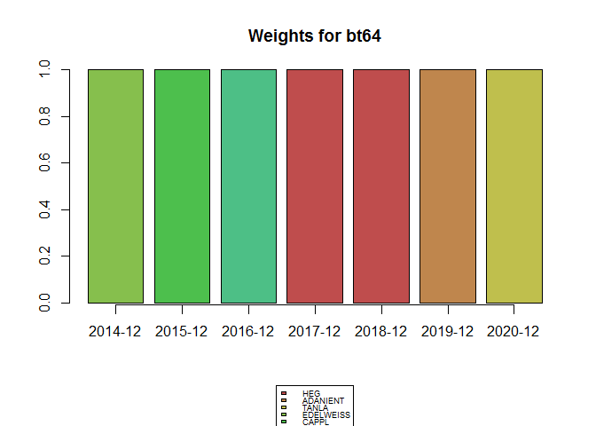

    ##                     HEG ADANIENT TANLA EDELWEISS CAPPL TASTYBIT
    ## 2015-12-24 05:30:00   0        0     0         0     1        0
    ## 2016-12-30 05:30:00   0        0     0         0     0        1
    ## 2017-12-29 05:30:00   1        0     0         0     0        0
    ## 2018-12-28 05:30:00   1        0     0         0     0        0
    ## 2019-12-27 05:30:00   0        1     0         0     0        0
    ## 2020-12-18 05:30:00   0        0     1         0     0        0


    ##                     WESTLIFE ABBOTINDIA RESPONIND MPHASIS   TCS CHOLAFIN KRBL
    ## 2019-09-27 05:30:00        0      0.031     0.000       0 0.034        0    0
    ## 2019-12-27 05:30:00        0      0.155     0.000       0 0.049        0    0
    ## 2020-03-27 05:30:00        0      0.326     0.000       0 0.000        0    0
    ## 2020-06-26 05:30:00        0      0.098     0.282       0 0.000        0    0
    ## 2020-09-25 05:30:00        0      0.040     0.388       0 0.000        0    0
    ## 2020-12-18 05:30:00        0      0.000     0.164       0 0.000        0    0
    ##                     VAKRANGEE PAGEIND PGHH SEQUENT HCLTECH  INFY DEEPAKNI
    ## 2019-09-27 05:30:00         0       0    0   0.000       0 0.115    0.000
    ## 2019-12-27 05:30:00         0       0    0   0.027       0 0.206    0.083
    ## 2020-03-27 05:30:00         0       0    0   0.000       0 0.000    0.000
    ## 2020-06-26 05:30:00         0       0    0   0.015       0 0.000    0.000
    ## 2020-09-25 05:30:00         0       0    0   0.000       0 0.000    0.000
    ## 2020-12-18 05:30:00         0       0    0   0.000       0 0.000    0.000
    ##                     INDIACEM MARICO GRAPHITE APLLTD ITDC SUNTECK MOTILALOFS
    ## 2019-09-27 05:30:00    0.000      0        0  0.000    0       0          0
    ## 2019-12-27 05:30:00    0.000      0        0  0.029    0       0          0
    ## 2020-03-27 05:30:00    0.109      0        0  0.000    0       0          0
    ## 2020-06-26 05:30:00    0.167      0        0  0.022    0       0          0
    ## 2020-09-25 05:30:00    0.172      0        0  0.138    0       0          0
    ## 2020-12-18 05:30:00    0.000      0        0  0.100    0       0          0
    ##                     IPCALAB SWANENERGY SYMPHONY RAJESHEXPO BRITANNIA GRANULES
    ## 2019-09-27 05:30:00   0.155          0        0          0         0    0.000
    ## 2019-12-27 05:30:00   0.000          0        0          0         0    0.017
    ## 2020-03-27 05:30:00   0.032          0        0          0         0    0.000
    ## 2020-06-26 05:30:00   0.000          0        0          0         0    0.000
    ## 2020-09-25 05:30:00   0.000          0        0          0         0    0.087
    ## 2020-12-18 05:30:00   0.000          0        0          0         0    0.114
    ##                     WIPRO VAIBHAVGBL INDHOTEL DRREDDY NAUKRI SONATSOFTW OMAXE
    ## 2019-09-27 05:30:00 0.015          0        0    0.00  0.037          0     0
    ## 2019-12-27 05:30:00 0.000          0        0    0.00  0.000          0     0
    ## 2020-03-27 05:30:00 0.000          0        0    0.00  0.000          0     0
    ## 2020-06-26 05:30:00 0.000          0        0    0.19  0.000          0     0
    ## 2020-09-25 05:30:00 0.000          0        0    0.00  0.000          0     0
    ## 2020-12-18 05:30:00 0.000          0        0    0.00  0.000          0     0
    ##                     GUJALKALI MANAPPURAM WHIRLPOOL RELAXO   IGL ITC HEG TECHM
    ## 2019-09-27 05:30:00         0       0.02     0.000      0 0.073   0   0     0
    ## 2019-12-27 05:30:00         0       0.00     0.000      0 0.000   0   0     0
    ## 2020-03-27 05:30:00         0       0.00     0.252      0 0.000   0   0     0
    ## 2020-06-26 05:30:00         0       0.00     0.000      0 0.000   0   0     0
    ## 2020-09-25 05:30:00         0       0.00     0.000      0 0.000   0   0     0
    ## 2020-12-18 05:30:00         0       0.00     0.000      0 0.000   0   0     0
    ##                     ALKYLAMINE ECLERX JSWSTEEL DCMSHRIRAM PIIND MINDAIND
    ## 2019-09-27 05:30:00      0.000      0        0      0.069     0        0
    ## 2019-12-27 05:30:00      0.000      0        0      0.000     0        0
    ## 2020-03-27 05:30:00      0.000      0        0      0.000     0        0
    ## 2020-06-26 05:30:00      0.000      0        0      0.000     0        0
    ## 2020-09-25 05:30:00      0.024      0        0      0.000     0        0
    ## 2020-12-18 05:30:00      0.000      0        0      0.000     0        0
    ##                     BALMLAWRIE SANOFI HATHWAY  IDEA CANFINHOME MINDTREE JCHAC
    ## 2019-09-27 05:30:00          0      0       0 0.000          0        0     0
    ## 2019-12-27 05:30:00          0      0       0 0.000          0        0     0
    ## 2020-03-27 05:30:00          0      0       0 0.042          0        0     0
    ## 2020-06-26 05:30:00          0      0       0 0.077          0        0     0
    ## 2020-09-25 05:30:00          0      0       0 0.073          0        0     0
    ## 2020-12-18 05:30:00          0      0       0 0.010          0        0     0
    ##                     ZYDUSWELL JYOTHYLAB VEDL EDELWEISS APLAPOLLO NAVINFLUOR
    ## 2019-09-27 05:30:00      0.14         0    0         0         0      0.000
    ## 2019-12-27 05:30:00      0.00         0    0         0         0      0.000
    ## 2020-03-27 05:30:00      0.00         0    0         0         0      0.118
    ## 2020-06-26 05:30:00      0.00         0    0         0         0      0.049
    ## 2020-09-25 05:30:00      0.00         0    0         0         0      0.000
    ## 2020-12-18 05:30:00      0.00         0    0         0         0      0.000
    ##                     ORIENTREF ASTRAL VSTIND REDINGTON CENTRALBK AIAENG IOLCP
    ## 2019-09-27 05:30:00         0      0      0     0.048         0      0     0
    ## 2019-12-27 05:30:00         0      0      0     0.058         0      0     0
    ## 2020-03-27 05:30:00         0      0      0     0.000         0      0     0
    ## 2020-06-26 05:30:00         0      0      0     0.000         0      0     0
    ## 2020-09-25 05:30:00         0      0      0     0.000         0      0     0
    ## 2020-12-18 05:30:00         0      0      0     0.048         0      0     0
    ##                     NATCOPHARM JKTYRE IFBIND HINDUNILVR CRISIL DCBBANK
    ## 2019-09-27 05:30:00          0      0  0.000      0.011      0   0.004
    ## 2019-12-27 05:30:00          0      0  0.000      0.000      0   0.000
    ## 2020-03-27 05:30:00          0      0  0.000      0.086      0   0.000
    ## 2020-06-26 05:30:00          0      0  0.000      0.000      0   0.000
    ## 2020-09-25 05:30:00          0      0  0.000      0.000      0   0.000
    ## 2020-12-18 05:30:00          0      0  0.093      0.000      0   0.000
    ##                     BALRAMCHIN HINDPETRO PERSISTENT TRENT ESCORTS PHOENIXLTD
    ## 2019-09-27 05:30:00          0         0      0.000 0.004   0.000          0
    ## 2019-12-27 05:30:00          0         0      0.000 0.118   0.000          0
    ## 2020-03-27 05:30:00          0         0      0.000 0.000   0.000          0
    ## 2020-06-26 05:30:00          0         0      0.000 0.000   0.000          0
    ## 2020-09-25 05:30:00          0         0      0.007 0.000   0.000          0
    ## 2020-12-18 05:30:00          0         0      0.124 0.000   0.084          0
    ##                     LINDEINDIA TATASTEEL GRINDWELL M.M AARTIIND JUBLFOOD
    ## 2019-09-27 05:30:00      0.000         0         0   0        0        0
    ## 2019-12-27 05:30:00      0.093         0         0   0        0        0
    ## 2020-03-27 05:30:00      0.000         0         0   0        0        0
    ## 2020-06-26 05:30:00      0.000         0         0   0        0        0
    ## 2020-09-25 05:30:00      0.000         0         0   0        0        0
    ## 2020-12-18 05:30:00      0.000         0         0   0        0        0
    ##                     APOLLOTYRE EMAMILTD SPICEJET FORTIS TVSMOTOR SUPRAJIT
    ## 2019-09-27 05:30:00          0        0        0      0        0        0
    ## 2019-12-27 05:30:00          0        0        0      0        0        0
    ## 2020-03-27 05:30:00          0        0        0      0        0        0
    ## 2020-06-26 05:30:00          0        0        0      0        0        0
    ## 2020-09-25 05:30:00          0        0        0      0        0        0
    ## 2020-12-18 05:30:00          0        0        0      0        0        0
    ##                     KOTAKBANK WELSPUNIND KPRMILL POLYMED MAHSCOOTER KEC IOC
    ## 2019-09-27 05:30:00     0.102          0       0       0          0   0   0
    ## 2019-12-27 05:30:00     0.000          0       0       0          0   0   0
    ## 2020-03-27 05:30:00     0.000          0       0       0          0   0   0
    ## 2020-06-26 05:30:00     0.000          0       0       0          0   0   0
    ## 2020-09-25 05:30:00     0.000          0       0       0          0   0   0
    ## 2020-12-18 05:30:00     0.000          0       0       0          0   0   0
    ##                     MAHINDCIE FORCEMOT TITAN NTPC UPL AUROPHARMA VINATIORGA VTL
    ## 2019-09-27 05:30:00     0.000        0     0    0   0          0          0   0
    ## 2019-12-27 05:30:00     0.000        0     0    0   0          0          0   0
    ## 2020-03-27 05:30:00     0.000        0     0    0   0          0          0   0
    ## 2020-06-26 05:30:00     0.000        0     0    0   0          0          0   0
    ## 2020-09-25 05:30:00     0.000        0     0    0   0          0          0   0
    ## 2020-12-18 05:30:00     0.098        0     0    0   0          0          0   0
    ##                     OBEROIRLTY J.KBANK BEL NLCINDIA ASTRAZEN GODREJPROP
    ## 2019-09-27 05:30:00          0       0   0        0    0.000          0
    ## 2019-12-27 05:30:00          0       0   0        0    0.000          0
    ## 2020-03-27 05:30:00          0       0   0        0    0.000          0
    ## 2020-06-26 05:30:00          0       0   0        0    0.000          0
    ## 2020-09-25 05:30:00          0       0   0        0    0.048          0
    ## 2020-12-18 05:30:00          0       0   0        0    0.000          0
    ##                     PETRONET
    ## 2019-09-27 05:30:00     0.07
    ## 2019-12-27 05:30:00     0.00
    ## 2020-03-27 05:30:00     0.00
    ## 2020-06-26 05:30:00     0.00
    ## 2020-09-25 05:30:00     0.00
    ## 2020-12-18 05:30:00     0.00


    ##                     WESTLIFE ABBOTINDIA RESPONIND MPHASIS   TCS CHOLAFIN KRBL
    ## 2019-09-27 05:30:00        0      0.031     0.000       0 0.034        0    0
    ## 2019-12-27 05:30:00        0      0.155     0.000       0 0.049        0    0
    ## 2020-03-27 05:30:00        0      0.326     0.000       0 0.000        0    0
    ## 2020-06-26 05:30:00        0      0.098     0.282       0 0.000        0    0
    ## 2020-09-25 05:30:00        0      0.040     0.388       0 0.000        0    0
    ## 2020-12-18 05:30:00        0      0.000     0.164       0 0.000        0    0
    ##                     VAKRANGEE PAGEIND PGHH SEQUENT HCLTECH  INFY DEEPAKNI
    ## 2019-09-27 05:30:00         0       0    0   0.000       0 0.115    0.000
    ## 2019-12-27 05:30:00         0       0    0   0.027       0 0.206    0.083
    ## 2020-03-27 05:30:00         0       0    0   0.000       0 0.000    0.000
    ## 2020-06-26 05:30:00         0       0    0   0.015       0 0.000    0.000
    ## 2020-09-25 05:30:00         0       0    0   0.000       0 0.000    0.000
    ## 2020-12-18 05:30:00         0       0    0   0.000       0 0.000    0.000
    ##                     INDIACEM MARICO GRAPHITE APLLTD ITDC SUNTECK MOTILALOFS
    ## 2019-09-27 05:30:00    0.000      0        0  0.000    0       0          0
    ## 2019-12-27 05:30:00    0.000      0        0  0.029    0       0          0
    ## 2020-03-27 05:30:00    0.109      0        0  0.000    0       0          0
    ## 2020-06-26 05:30:00    0.167      0        0  0.022    0       0          0
    ## 2020-09-25 05:30:00    0.172      0        0  0.138    0       0          0
    ## 2020-12-18 05:30:00    0.000      0        0  0.100    0       0          0
    ##                     IPCALAB SWANENERGY SYMPHONY RAJESHEXPO BRITANNIA GRANULES
    ## 2019-09-27 05:30:00   0.155          0        0          0         0    0.000
    ## 2019-12-27 05:30:00   0.000          0        0          0         0    0.017
    ## 2020-03-27 05:30:00   0.032          0        0          0         0    0.000
    ## 2020-06-26 05:30:00   0.000          0        0          0         0    0.000
    ## 2020-09-25 05:30:00   0.000          0        0          0         0    0.087
    ## 2020-12-18 05:30:00   0.000          0        0          0         0    0.114
    ##                     WIPRO VAIBHAVGBL INDHOTEL DRREDDY NAUKRI SONATSOFTW OMAXE
    ## 2019-09-27 05:30:00 0.015          0        0    0.00  0.037          0     0
    ## 2019-12-27 05:30:00 0.000          0        0    0.00  0.000          0     0
    ## 2020-03-27 05:30:00 0.000          0        0    0.00  0.000          0     0
    ## 2020-06-26 05:30:00 0.000          0        0    0.19  0.000          0     0
    ## 2020-09-25 05:30:00 0.000          0        0    0.00  0.000          0     0
    ## 2020-12-18 05:30:00 0.000          0        0    0.00  0.000          0     0
    ##                     GUJALKALI MANAPPURAM WHIRLPOOL RELAXO   IGL ITC HEG TECHM
    ## 2019-09-27 05:30:00         0       0.02     0.000      0 0.073   0   0     0
    ## 2019-12-27 05:30:00         0       0.00     0.000      0 0.000   0   0     0
    ## 2020-03-27 05:30:00         0       0.00     0.252      0 0.000   0   0     0
    ## 2020-06-26 05:30:00         0       0.00     0.000      0 0.000   0   0     0
    ## 2020-09-25 05:30:00         0       0.00     0.000      0 0.000   0   0     0
    ## 2020-12-18 05:30:00         0       0.00     0.000      0 0.000   0   0     0
    ##                     ALKYLAMINE ECLERX JSWSTEEL DCMSHRIRAM PIIND MINDAIND
    ## 2019-09-27 05:30:00      0.000      0        0      0.069     0        0
    ## 2019-12-27 05:30:00      0.000      0        0      0.000     0        0
    ## 2020-03-27 05:30:00      0.000      0        0      0.000     0        0
    ## 2020-06-26 05:30:00      0.000      0        0      0.000     0        0
    ## 2020-09-25 05:30:00      0.024      0        0      0.000     0        0
    ## 2020-12-18 05:30:00      0.000      0        0      0.000     0        0
    ##                     BALMLAWRIE SANOFI HATHWAY  IDEA CANFINHOME MINDTREE JCHAC
    ## 2019-09-27 05:30:00          0      0       0 0.000          0        0     0
    ## 2019-12-27 05:30:00          0      0       0 0.000          0        0     0
    ## 2020-03-27 05:30:00          0      0       0 0.042          0        0     0
    ## 2020-06-26 05:30:00          0      0       0 0.077          0        0     0
    ## 2020-09-25 05:30:00          0      0       0 0.073          0        0     0
    ## 2020-12-18 05:30:00          0      0       0 0.010          0        0     0
    ##                     ZYDUSWELL JYOTHYLAB VEDL EDELWEISS APLAPOLLO NAVINFLUOR
    ## 2019-09-27 05:30:00      0.14         0    0         0         0      0.000
    ## 2019-12-27 05:30:00      0.00         0    0         0         0      0.000
    ## 2020-03-27 05:30:00      0.00         0    0         0         0      0.118
    ## 2020-06-26 05:30:00      0.00         0    0         0         0      0.049
    ## 2020-09-25 05:30:00      0.00         0    0         0         0      0.000
    ## 2020-12-18 05:30:00      0.00         0    0         0         0      0.000
    ##                     ORIENTREF ASTRAL VSTIND REDINGTON CENTRALBK AIAENG IOLCP
    ## 2019-09-27 05:30:00         0      0      0     0.048         0      0     0
    ## 2019-12-27 05:30:00         0      0      0     0.058         0      0     0
    ## 2020-03-27 05:30:00         0      0      0     0.000         0      0     0
    ## 2020-06-26 05:30:00         0      0      0     0.000         0      0     0
    ## 2020-09-25 05:30:00         0      0      0     0.000         0      0     0
    ## 2020-12-18 05:30:00         0      0      0     0.048         0      0     0
    ##                     NATCOPHARM JKTYRE IFBIND HINDUNILVR CRISIL DCBBANK
    ## 2019-09-27 05:30:00          0      0  0.000      0.011      0   0.004
    ## 2019-12-27 05:30:00          0      0  0.000      0.000      0   0.000
    ## 2020-03-27 05:30:00          0      0  0.000      0.086      0   0.000
    ## 2020-06-26 05:30:00          0      0  0.000      0.000      0   0.000
    ## 2020-09-25 05:30:00          0      0  0.000      0.000      0   0.000
    ## 2020-12-18 05:30:00          0      0  0.093      0.000      0   0.000
    ##                     BALRAMCHIN HINDPETRO PERSISTENT TRENT ESCORTS PHOENIXLTD
    ## 2019-09-27 05:30:00          0         0      0.000 0.004   0.000          0
    ## 2019-12-27 05:30:00          0         0      0.000 0.118   0.000          0
    ## 2020-03-27 05:30:00          0         0      0.000 0.000   0.000          0
    ## 2020-06-26 05:30:00          0         0      0.000 0.000   0.000          0
    ## 2020-09-25 05:30:00          0         0      0.007 0.000   0.000          0
    ## 2020-12-18 05:30:00          0         0      0.124 0.000   0.084          0
    ##                     LINDEINDIA TATASTEEL GRINDWELL M.M AARTIIND JUBLFOOD
    ## 2019-09-27 05:30:00      0.000         0         0   0        0        0
    ## 2019-12-27 05:30:00      0.093         0         0   0        0        0
    ## 2020-03-27 05:30:00      0.000         0         0   0        0        0
    ## 2020-06-26 05:30:00      0.000         0         0   0        0        0
    ## 2020-09-25 05:30:00      0.000         0         0   0        0        0
    ## 2020-12-18 05:30:00      0.000         0         0   0        0        0
    ##                     APOLLOTYRE EMAMILTD SPICEJET FORTIS TVSMOTOR SUPRAJIT
    ## 2019-09-27 05:30:00          0        0        0      0        0        0
    ## 2019-12-27 05:30:00          0        0        0      0        0        0
    ## 2020-03-27 05:30:00          0        0        0      0        0        0
    ## 2020-06-26 05:30:00          0        0        0      0        0        0
    ## 2020-09-25 05:30:00          0        0        0      0        0        0
    ## 2020-12-18 05:30:00          0        0        0      0        0        0
    ##                     KOTAKBANK WELSPUNIND KPRMILL POLYMED MAHSCOOTER KEC IOC
    ## 2019-09-27 05:30:00     0.102          0       0       0          0   0   0
    ## 2019-12-27 05:30:00     0.000          0       0       0          0   0   0
    ## 2020-03-27 05:30:00     0.000          0       0       0          0   0   0
    ## 2020-06-26 05:30:00     0.000          0       0       0          0   0   0
    ## 2020-09-25 05:30:00     0.000          0       0       0          0   0   0
    ## 2020-12-18 05:30:00     0.000          0       0       0          0   0   0
    ##                     MAHINDCIE FORCEMOT TITAN NTPC UPL AUROPHARMA VINATIORGA VTL
    ## 2019-09-27 05:30:00     0.000        0     0    0   0          0          0   0
    ## 2019-12-27 05:30:00     0.000        0     0    0   0          0          0   0
    ## 2020-03-27 05:30:00     0.000        0     0    0   0          0          0   0
    ## 2020-06-26 05:30:00     0.000        0     0    0   0          0          0   0
    ## 2020-09-25 05:30:00     0.000        0     0    0   0          0          0   0
    ## 2020-12-18 05:30:00     0.098        0     0    0   0          0          0   0
    ##                     OBEROIRLTY J.KBANK BEL NLCINDIA ASTRAZEN GODREJPROP
    ## 2019-09-27 05:30:00          0       0   0        0    0.000          0
    ## 2019-12-27 05:30:00          0       0   0        0    0.000          0
    ## 2020-03-27 05:30:00          0       0   0        0    0.000          0
    ## 2020-06-26 05:30:00          0       0   0        0    0.000          0
    ## 2020-09-25 05:30:00          0       0   0        0    0.048          0
    ## 2020-12-18 05:30:00          0       0   0        0    0.000          0
    ##                     PETRONET
    ## 2019-09-27 05:30:00     0.07
    ## 2019-12-27 05:30:00     0.00
    ## 2020-03-27 05:30:00     0.00
    ## 2020-06-26 05:30:00     0.00
    ## 2020-09-25 05:30:00     0.00
    ## 2020-12-18 05:30:00     0.00


    ##                     WESTLIFE ABBOTINDIA RESPONIND MPHASIS   TCS CHOLAFIN KRBL
    ## 2019-09-27 05:30:00        0      0.031     0.000       0 0.034        0    0
    ## 2019-12-27 05:30:00        0      0.155     0.000       0 0.049        0    0
    ## 2020-03-27 05:30:00        0      0.326     0.000       0 0.000        0    0
    ## 2020-06-26 05:30:00        0      0.098     0.282       0 0.000        0    0
    ## 2020-09-25 05:30:00        0      0.040     0.388       0 0.000        0    0
    ## 2020-12-18 05:30:00        0      0.000     0.164       0 0.000        0    0
    ##                     VAKRANGEE PAGEIND PGHH SEQUENT HCLTECH  INFY DEEPAKNI
    ## 2019-09-27 05:30:00         0       0    0   0.000       0 0.115    0.000
    ## 2019-12-27 05:30:00         0       0    0   0.027       0 0.206    0.083
    ## 2020-03-27 05:30:00         0       0    0   0.000       0 0.000    0.000
    ## 2020-06-26 05:30:00         0       0    0   0.015       0 0.000    0.000
    ## 2020-09-25 05:30:00         0       0    0   0.000       0 0.000    0.000
    ## 2020-12-18 05:30:00         0       0    0   0.000       0 0.000    0.000
    ##                     INDIACEM MARICO GRAPHITE APLLTD ITDC SUNTECK MOTILALOFS
    ## 2019-09-27 05:30:00    0.000      0        0  0.000    0       0          0
    ## 2019-12-27 05:30:00    0.000      0        0  0.029    0       0          0
    ## 2020-03-27 05:30:00    0.109      0        0  0.000    0       0          0
    ## 2020-06-26 05:30:00    0.167      0        0  0.022    0       0          0
    ## 2020-09-25 05:30:00    0.172      0        0  0.138    0       0          0
    ## 2020-12-18 05:30:00    0.000      0        0  0.100    0       0          0
    ##                     IPCALAB SWANENERGY SYMPHONY RAJESHEXPO BRITANNIA GRANULES
    ## 2019-09-27 05:30:00   0.155          0        0          0         0    0.000
    ## 2019-12-27 05:30:00   0.000          0        0          0         0    0.017
    ## 2020-03-27 05:30:00   0.032          0        0          0         0    0.000
    ## 2020-06-26 05:30:00   0.000          0        0          0         0    0.000
    ## 2020-09-25 05:30:00   0.000          0        0          0         0    0.087
    ## 2020-12-18 05:30:00   0.000          0        0          0         0    0.114
    ##                     WIPRO VAIBHAVGBL INDHOTEL DRREDDY NAUKRI SONATSOFTW OMAXE
    ## 2019-09-27 05:30:00 0.015          0        0    0.00  0.037          0     0
    ## 2019-12-27 05:30:00 0.000          0        0    0.00  0.000          0     0
    ## 2020-03-27 05:30:00 0.000          0        0    0.00  0.000          0     0
    ## 2020-06-26 05:30:00 0.000          0        0    0.19  0.000          0     0
    ## 2020-09-25 05:30:00 0.000          0        0    0.00  0.000          0     0
    ## 2020-12-18 05:30:00 0.000          0        0    0.00  0.000          0     0
    ##                     GUJALKALI MANAPPURAM WHIRLPOOL RELAXO   IGL ITC HEG TECHM
    ## 2019-09-27 05:30:00         0       0.02     0.000      0 0.073   0   0     0
    ## 2019-12-27 05:30:00         0       0.00     0.000      0 0.000   0   0     0
    ## 2020-03-27 05:30:00         0       0.00     0.252      0 0.000   0   0     0
    ## 2020-06-26 05:30:00         0       0.00     0.000      0 0.000   0   0     0
    ## 2020-09-25 05:30:00         0       0.00     0.000      0 0.000   0   0     0
    ## 2020-12-18 05:30:00         0       0.00     0.000      0 0.000   0   0     0
    ##                     ALKYLAMINE ECLERX JSWSTEEL DCMSHRIRAM PIIND MINDAIND
    ## 2019-09-27 05:30:00      0.000      0        0      0.069     0        0
    ## 2019-12-27 05:30:00      0.000      0        0      0.000     0        0
    ## 2020-03-27 05:30:00      0.000      0        0      0.000     0        0
    ## 2020-06-26 05:30:00      0.000      0        0      0.000     0        0
    ## 2020-09-25 05:30:00      0.024      0        0      0.000     0        0
    ## 2020-12-18 05:30:00      0.000      0        0      0.000     0        0
    ##                     BALMLAWRIE SANOFI HATHWAY  IDEA CANFINHOME MINDTREE JCHAC
    ## 2019-09-27 05:30:00          0      0       0 0.000          0        0     0
    ## 2019-12-27 05:30:00          0      0       0 0.000          0        0     0
    ## 2020-03-27 05:30:00          0      0       0 0.042          0        0     0
    ## 2020-06-26 05:30:00          0      0       0 0.077          0        0     0
    ## 2020-09-25 05:30:00          0      0       0 0.073          0        0     0
    ## 2020-12-18 05:30:00          0      0       0 0.010          0        0     0
    ##                     ZYDUSWELL JYOTHYLAB VEDL EDELWEISS APLAPOLLO NAVINFLUOR
    ## 2019-09-27 05:30:00      0.14         0    0         0         0      0.000
    ## 2019-12-27 05:30:00      0.00         0    0         0         0      0.000
    ## 2020-03-27 05:30:00      0.00         0    0         0         0      0.118
    ## 2020-06-26 05:30:00      0.00         0    0         0         0      0.049
    ## 2020-09-25 05:30:00      0.00         0    0         0         0      0.000
    ## 2020-12-18 05:30:00      0.00         0    0         0         0      0.000
    ##                     ORIENTREF ASTRAL VSTIND REDINGTON CENTRALBK AIAENG IOLCP
    ## 2019-09-27 05:30:00         0      0      0     0.048         0      0     0
    ## 2019-12-27 05:30:00         0      0      0     0.058         0      0     0
    ## 2020-03-27 05:30:00         0      0      0     0.000         0      0     0
    ## 2020-06-26 05:30:00         0      0      0     0.000         0      0     0
    ## 2020-09-25 05:30:00         0      0      0     0.000         0      0     0
    ## 2020-12-18 05:30:00         0      0      0     0.048         0      0     0
    ##                     NATCOPHARM JKTYRE IFBIND HINDUNILVR CRISIL DCBBANK
    ## 2019-09-27 05:30:00          0      0  0.000      0.011      0   0.004
    ## 2019-12-27 05:30:00          0      0  0.000      0.000      0   0.000
    ## 2020-03-27 05:30:00          0      0  0.000      0.086      0   0.000
    ## 2020-06-26 05:30:00          0      0  0.000      0.000      0   0.000
    ## 2020-09-25 05:30:00          0      0  0.000      0.000      0   0.000
    ## 2020-12-18 05:30:00          0      0  0.093      0.000      0   0.000
    ##                     BALRAMCHIN HINDPETRO PERSISTENT TRENT ESCORTS PHOENIXLTD
    ## 2019-09-27 05:30:00          0         0      0.000 0.004   0.000          0
    ## 2019-12-27 05:30:00          0         0      0.000 0.118   0.000          0
    ## 2020-03-27 05:30:00          0         0      0.000 0.000   0.000          0
    ## 2020-06-26 05:30:00          0         0      0.000 0.000   0.000          0
    ## 2020-09-25 05:30:00          0         0      0.007 0.000   0.000          0
    ## 2020-12-18 05:30:00          0         0      0.124 0.000   0.084          0
    ##                     LINDEINDIA TATASTEEL GRINDWELL M.M AARTIIND JUBLFOOD
    ## 2019-09-27 05:30:00      0.000         0         0   0        0        0
    ## 2019-12-27 05:30:00      0.093         0         0   0        0        0
    ## 2020-03-27 05:30:00      0.000         0         0   0        0        0
    ## 2020-06-26 05:30:00      0.000         0         0   0        0        0
    ## 2020-09-25 05:30:00      0.000         0         0   0        0        0
    ## 2020-12-18 05:30:00      0.000         0         0   0        0        0
    ##                     APOLLOTYRE EMAMILTD SPICEJET FORTIS TVSMOTOR SUPRAJIT
    ## 2019-09-27 05:30:00          0        0        0      0        0        0
    ## 2019-12-27 05:30:00          0        0        0      0        0        0
    ## 2020-03-27 05:30:00          0        0        0      0        0        0
    ## 2020-06-26 05:30:00          0        0        0      0        0        0
    ## 2020-09-25 05:30:00          0        0        0      0        0        0
    ## 2020-12-18 05:30:00          0        0        0      0        0        0
    ##                     KOTAKBANK WELSPUNIND KPRMILL POLYMED MAHSCOOTER KEC IOC
    ## 2019-09-27 05:30:00     0.102          0       0       0          0   0   0
    ## 2019-12-27 05:30:00     0.000          0       0       0          0   0   0
    ## 2020-03-27 05:30:00     0.000          0       0       0          0   0   0
    ## 2020-06-26 05:30:00     0.000          0       0       0          0   0   0
    ## 2020-09-25 05:30:00     0.000          0       0       0          0   0   0
    ## 2020-12-18 05:30:00     0.000          0       0       0          0   0   0
    ##                     MAHINDCIE FORCEMOT TITAN NTPC UPL AUROPHARMA VINATIORGA VTL
    ## 2019-09-27 05:30:00     0.000        0     0    0   0          0          0   0
    ## 2019-12-27 05:30:00     0.000        0     0    0   0          0          0   0
    ## 2020-03-27 05:30:00     0.000        0     0    0   0          0          0   0
    ## 2020-06-26 05:30:00     0.000        0     0    0   0          0          0   0
    ## 2020-09-25 05:30:00     0.000        0     0    0   0          0          0   0
    ## 2020-12-18 05:30:00     0.098        0     0    0   0          0          0   0
    ##                     OBEROIRLTY J.KBANK BEL NLCINDIA ASTRAZEN GODREJPROP
    ## 2019-09-27 05:30:00          0       0   0        0    0.000          0
    ## 2019-12-27 05:30:00          0       0   0        0    0.000          0
    ## 2020-03-27 05:30:00          0       0   0        0    0.000          0
    ## 2020-06-26 05:30:00          0       0   0        0    0.000          0
    ## 2020-09-25 05:30:00          0       0   0        0    0.048          0
    ## 2020-12-18 05:30:00          0       0   0        0    0.000          0
    ##                     PETRONET
    ## 2019-09-27 05:30:00     0.07
    ## 2019-12-27 05:30:00     0.00
    ## 2020-03-27 05:30:00     0.00
    ## 2020-06-26 05:30:00     0.00
    ## 2020-09-25 05:30:00     0.00
    ## 2020-12-18 05:30:00     0.00


    ##                     IOLCP MMTC ITDC HEG ALOKTEXT WESTLIFE TANLA RESPONIND
    ## 2019-09-27 05:30:00     0    0    0   0    0.353        0 0.647         0
    ## 2019-12-27 05:30:00     0    0    0   0    0.000        0 0.000         0
    ## 2020-03-27 05:30:00     0    0    0   0    0.000        0 0.000         0
    ## 2020-06-26 05:30:00     0    0    0   0    0.396        0 0.000         0
    ## 2020-09-25 05:30:00     0    0    0   0    0.000        0 0.000         0
    ## 2020-12-18 05:30:00     0    0    0   0    0.000        0 0.154         0
    ##                     JINDALSTEL ADANIPOWER TATAMETALI CAPPL OMAXE JSL RADICO
    ## 2019-09-27 05:30:00          0          0          0     0 0.000   0      0
    ## 2019-12-27 05:30:00          0          0          0     0 0.000   0      0
    ## 2020-03-27 05:30:00          0          0          0     0 0.000   0      0
    ## 2020-06-26 05:30:00          0          0          0     0 0.000   0      0
    ## 2020-09-25 05:30:00          0          0          0     0 0.000   0      0
    ## 2020-12-18 05:30:00          0          0          0     0 0.846   0      0
    ##                     MAHABANK WOCKPHARMA JAICORPLTD  SCI CEATLTD  GMM CANBK
    ## 2019-09-27 05:30:00        0          0          0 0.00       0 0.00 0.000
    ## 2019-12-27 05:30:00        0          0          0 0.65       0 0.00 0.000
    ## 2020-03-27 05:30:00        0          0          0 0.00       0 0.64 0.000
    ## 2020-06-26 05:30:00        0          0          0 0.00       0 0.00 0.000
    ## 2020-09-25 05:30:00        0          0          0 0.00       0 0.00 0.628
    ## 2020-12-18 05:30:00        0          0          0 0.00       0 0.00 0.000
    ##                     EIHOTEL BLISSGVS EDELWEISS BHEL VAIBHAVGBL DCMSHRIRAM
    ## 2019-09-27 05:30:00   0.000        0         0    0          0          0
    ## 2019-12-27 05:30:00   0.000        0         0    0          0          0
    ## 2020-03-27 05:30:00   0.000        0         0    0          0          0
    ## 2020-06-26 05:30:00   0.604        0         0    0          0          0
    ## 2020-09-25 05:30:00   0.000        0         0    0          0          0
    ## 2020-12-18 05:30:00   0.000        0         0    0          0          0
    ##                     GRAPHITE RAJESHEXPO KSCL BALRAMCHIN ITI SPICEJET SPARC
    ## 2019-09-27 05:30:00        0          0    0          0   0        0     0
    ## 2019-12-27 05:30:00        0          0    0          0   0        0     0
    ## 2020-03-27 05:30:00        0          0    0          0   0        0     0
    ## 2020-06-26 05:30:00        0          0    0          0   0        0     0
    ## 2020-09-25 05:30:00        0          0    0          0   0        0     0
    ## 2020-12-18 05:30:00        0          0    0          0   0        0     0
    ##                     AARTIDRUGS NBVENTURES MOTILALOFS HSCL JCHAC IFBIND
    ## 2019-09-27 05:30:00      0.000       0.00          0 0.00     0      0
    ## 2019-12-27 05:30:00      0.000       0.00          0 0.35     0      0
    ## 2020-03-27 05:30:00      0.000       0.36          0 0.00     0      0
    ## 2020-06-26 05:30:00      0.000       0.00          0 0.00     0      0
    ## 2020-09-25 05:30:00      0.372       0.00          0 0.00     0      0
    ## 2020-12-18 05:30:00      0.000       0.00          0 0.00     0      0


    ##                     WESTLIFE ABBOTINDIA RESPONIND MPHASIS   TCS CHOLAFIN KRBL
    ## 2019-09-27 05:30:00        0      0.031     0.000       0 0.034        0    0
    ## 2019-12-27 05:30:00        0      0.155     0.000       0 0.049        0    0
    ## 2020-03-27 05:30:00        0      0.326     0.000       0 0.000        0    0
    ## 2020-06-26 05:30:00        0      0.098     0.282       0 0.000        0    0
    ## 2020-09-25 05:30:00        0      0.040     0.388       0 0.000        0    0
    ## 2020-12-18 05:30:00        0      0.000     0.164       0 0.000        0    0
    ##                     VAKRANGEE PAGEIND PGHH SEQUENT HCLTECH  INFY DEEPAKNI
    ## 2019-09-27 05:30:00         0       0    0   0.000       0 0.115    0.000
    ## 2019-12-27 05:30:00         0       0    0   0.027       0 0.206    0.083
    ## 2020-03-27 05:30:00         0       0    0   0.000       0 0.000    0.000
    ## 2020-06-26 05:30:00         0       0    0   0.015       0 0.000    0.000
    ## 2020-09-25 05:30:00         0       0    0   0.000       0 0.000    0.000
    ## 2020-12-18 05:30:00         0       0    0   0.000       0 0.000    0.000
    ##                     INDIACEM MARICO GRAPHITE APLLTD ITDC SUNTECK MOTILALOFS
    ## 2019-09-27 05:30:00    0.000      0        0  0.000    0       0          0
    ## 2019-12-27 05:30:00    0.000      0        0  0.029    0       0          0
    ## 2020-03-27 05:30:00    0.109      0        0  0.000    0       0          0
    ## 2020-06-26 05:30:00    0.167      0        0  0.022    0       0          0
    ## 2020-09-25 05:30:00    0.172      0        0  0.138    0       0          0
    ## 2020-12-18 05:30:00    0.000      0        0  0.100    0       0          0
    ##                     IPCALAB SWANENERGY SYMPHONY RAJESHEXPO BRITANNIA GRANULES
    ## 2019-09-27 05:30:00   0.155          0        0          0         0    0.000
    ## 2019-12-27 05:30:00   0.000          0        0          0         0    0.017
    ## 2020-03-27 05:30:00   0.032          0        0          0         0    0.000
    ## 2020-06-26 05:30:00   0.000          0        0          0         0    0.000
    ## 2020-09-25 05:30:00   0.000          0        0          0         0    0.087
    ## 2020-12-18 05:30:00   0.000          0        0          0         0    0.114
    ##                     WIPRO VAIBHAVGBL INDHOTEL DRREDDY NAUKRI SONATSOFTW OMAXE
    ## 2019-09-27 05:30:00 0.015          0        0    0.00  0.037          0     0
    ## 2019-12-27 05:30:00 0.000          0        0    0.00  0.000          0     0
    ## 2020-03-27 05:30:00 0.000          0        0    0.00  0.000          0     0
    ## 2020-06-26 05:30:00 0.000          0        0    0.19  0.000          0     0
    ## 2020-09-25 05:30:00 0.000          0        0    0.00  0.000          0     0
    ## 2020-12-18 05:30:00 0.000          0        0    0.00  0.000          0     0
    ##                     GUJALKALI MANAPPURAM WHIRLPOOL RELAXO   IGL ITC HEG TECHM
    ## 2019-09-27 05:30:00         0       0.02     0.000      0 0.073   0   0     0
    ## 2019-12-27 05:30:00         0       0.00     0.000      0 0.000   0   0     0
    ## 2020-03-27 05:30:00         0       0.00     0.252      0 0.000   0   0     0
    ## 2020-06-26 05:30:00         0       0.00     0.000      0 0.000   0   0     0
    ## 2020-09-25 05:30:00         0       0.00     0.000      0 0.000   0   0     0
    ## 2020-12-18 05:30:00         0       0.00     0.000      0 0.000   0   0     0
    ##                     ALKYLAMINE ECLERX JSWSTEEL DCMSHRIRAM PIIND MINDAIND
    ## 2019-09-27 05:30:00      0.000      0        0      0.069     0        0
    ## 2019-12-27 05:30:00      0.000      0        0      0.000     0        0
    ## 2020-03-27 05:30:00      0.000      0        0      0.000     0        0
    ## 2020-06-26 05:30:00      0.000      0        0      0.000     0        0
    ## 2020-09-25 05:30:00      0.024      0        0      0.000     0        0
    ## 2020-12-18 05:30:00      0.000      0        0      0.000     0        0
    ##                     BALMLAWRIE SANOFI HATHWAY  IDEA CANFINHOME MINDTREE JCHAC
    ## 2019-09-27 05:30:00          0      0       0 0.000          0        0     0
    ## 2019-12-27 05:30:00          0      0       0 0.000          0        0     0
    ## 2020-03-27 05:30:00          0      0       0 0.042          0        0     0
    ## 2020-06-26 05:30:00          0      0       0 0.077          0        0     0
    ## 2020-09-25 05:30:00          0      0       0 0.073          0        0     0
    ## 2020-12-18 05:30:00          0      0       0 0.010          0        0     0
    ##                     ZYDUSWELL JYOTHYLAB VEDL EDELWEISS APLAPOLLO NAVINFLUOR
    ## 2019-09-27 05:30:00      0.14         0    0         0         0      0.000
    ## 2019-12-27 05:30:00      0.00         0    0         0         0      0.000
    ## 2020-03-27 05:30:00      0.00         0    0         0         0      0.118
    ## 2020-06-26 05:30:00      0.00         0    0         0         0      0.049
    ## 2020-09-25 05:30:00      0.00         0    0         0         0      0.000
    ## 2020-12-18 05:30:00      0.00         0    0         0         0      0.000
    ##                     ORIENTREF ASTRAL VSTIND REDINGTON CENTRALBK AIAENG IOLCP
    ## 2019-09-27 05:30:00         0      0      0     0.048         0      0     0
    ## 2019-12-27 05:30:00         0      0      0     0.058         0      0     0
    ## 2020-03-27 05:30:00         0      0      0     0.000         0      0     0
    ## 2020-06-26 05:30:00         0      0      0     0.000         0      0     0
    ## 2020-09-25 05:30:00         0      0      0     0.000         0      0     0
    ## 2020-12-18 05:30:00         0      0      0     0.048         0      0     0
    ##                     NATCOPHARM JKTYRE IFBIND HINDUNILVR CRISIL DCBBANK
    ## 2019-09-27 05:30:00          0      0  0.000      0.011      0   0.004
    ## 2019-12-27 05:30:00          0      0  0.000      0.000      0   0.000
    ## 2020-03-27 05:30:00          0      0  0.000      0.086      0   0.000
    ## 2020-06-26 05:30:00          0      0  0.000      0.000      0   0.000
    ## 2020-09-25 05:30:00          0      0  0.000      0.000      0   0.000
    ## 2020-12-18 05:30:00          0      0  0.093      0.000      0   0.000
    ##                     BALRAMCHIN HINDPETRO PERSISTENT TRENT ESCORTS PHOENIXLTD
    ## 2019-09-27 05:30:00          0         0      0.000 0.004   0.000          0
    ## 2019-12-27 05:30:00          0         0      0.000 0.118   0.000          0
    ## 2020-03-27 05:30:00          0         0      0.000 0.000   0.000          0
    ## 2020-06-26 05:30:00          0         0      0.000 0.000   0.000          0
    ## 2020-09-25 05:30:00          0         0      0.007 0.000   0.000          0
    ## 2020-12-18 05:30:00          0         0      0.124 0.000   0.084          0
    ##                     LINDEINDIA TATASTEEL GRINDWELL M.M AARTIIND JUBLFOOD
    ## 2019-09-27 05:30:00      0.000         0         0   0        0        0
    ## 2019-12-27 05:30:00      0.093         0         0   0        0        0
    ## 2020-03-27 05:30:00      0.000         0         0   0        0        0
    ## 2020-06-26 05:30:00      0.000         0         0   0        0        0
    ## 2020-09-25 05:30:00      0.000         0         0   0        0        0
    ## 2020-12-18 05:30:00      0.000         0         0   0        0        0
    ##                     APOLLOTYRE EMAMILTD SPICEJET FORTIS TVSMOTOR SUPRAJIT
    ## 2019-09-27 05:30:00          0        0        0      0        0        0
    ## 2019-12-27 05:30:00          0        0        0      0        0        0
    ## 2020-03-27 05:30:00          0        0        0      0        0        0
    ## 2020-06-26 05:30:00          0        0        0      0        0        0
    ## 2020-09-25 05:30:00          0        0        0      0        0        0
    ## 2020-12-18 05:30:00          0        0        0      0        0        0
    ##                     KOTAKBANK WELSPUNIND KPRMILL POLYMED MAHSCOOTER KEC IOC
    ## 2019-09-27 05:30:00     0.102          0       0       0          0   0   0
    ## 2019-12-27 05:30:00     0.000          0       0       0          0   0   0
    ## 2020-03-27 05:30:00     0.000          0       0       0          0   0   0
    ## 2020-06-26 05:30:00     0.000          0       0       0          0   0   0
    ## 2020-09-25 05:30:00     0.000          0       0       0          0   0   0
    ## 2020-12-18 05:30:00     0.000          0       0       0          0   0   0
    ##                     MAHINDCIE FORCEMOT TITAN NTPC UPL AUROPHARMA VINATIORGA VTL
    ## 2019-09-27 05:30:00     0.000        0     0    0   0          0          0   0
    ## 2019-12-27 05:30:00     0.000        0     0    0   0          0          0   0
    ## 2020-03-27 05:30:00     0.000        0     0    0   0          0          0   0
    ## 2020-06-26 05:30:00     0.000        0     0    0   0          0          0   0
    ## 2020-09-25 05:30:00     0.000        0     0    0   0          0          0   0
    ## 2020-12-18 05:30:00     0.098        0     0    0   0          0          0   0
    ##                     OBEROIRLTY J.KBANK BEL NLCINDIA ASTRAZEN GODREJPROP
    ## 2019-09-27 05:30:00          0       0   0        0    0.000          0
    ## 2019-12-27 05:30:00          0       0   0        0    0.000          0
    ## 2020-03-27 05:30:00          0       0   0        0    0.000          0
    ## 2020-06-26 05:30:00          0       0   0        0    0.000          0
    ## 2020-09-25 05:30:00          0       0   0        0    0.048          0
    ## 2020-12-18 05:30:00          0       0   0        0    0.000          0
    ##                     PETRONET
    ## 2019-09-27 05:30:00     0.07
    ## 2019-12-27 05:30:00     0.00
    ## 2020-03-27 05:30:00     0.00
    ## 2020-06-26 05:30:00     0.00
    ## 2020-09-25 05:30:00     0.00
    ## 2020-12-18 05:30:00     0.00


    ##                     WESTLIFE ABBOTINDIA RESPONIND MPHASIS   TCS CHOLAFIN KRBL
    ## 2019-09-27 05:30:00        0      0.031     0.000       0 0.034        0    0
    ## 2019-12-27 05:30:00        0      0.155     0.000       0 0.049        0    0
    ## 2020-03-27 05:30:00        0      0.326     0.000       0 0.000        0    0
    ## 2020-06-26 05:30:00        0      0.098     0.282       0 0.000        0    0
    ## 2020-09-25 05:30:00        0      0.040     0.388       0 0.000        0    0
    ## 2020-12-18 05:30:00        0      0.000     0.164       0 0.000        0    0
    ##                     VAKRANGEE PAGEIND PGHH SEQUENT HCLTECH  INFY DEEPAKNI
    ## 2019-09-27 05:30:00         0       0    0   0.000       0 0.115    0.000
    ## 2019-12-27 05:30:00         0       0    0   0.027       0 0.206    0.083
    ## 2020-03-27 05:30:00         0       0    0   0.000       0 0.000    0.000
    ## 2020-06-26 05:30:00         0       0    0   0.015       0 0.000    0.000
    ## 2020-09-25 05:30:00         0       0    0   0.000       0 0.000    0.000
    ## 2020-12-18 05:30:00         0       0    0   0.000       0 0.000    0.000
    ##                     INDIACEM MARICO GRAPHITE APLLTD ITDC SUNTECK MOTILALOFS
    ## 2019-09-27 05:30:00    0.000      0        0  0.000    0       0          0
    ## 2019-12-27 05:30:00    0.000      0        0  0.029    0       0          0
    ## 2020-03-27 05:30:00    0.109      0        0  0.000    0       0          0
    ## 2020-06-26 05:30:00    0.167      0        0  0.022    0       0          0
    ## 2020-09-25 05:30:00    0.172      0        0  0.138    0       0          0
    ## 2020-12-18 05:30:00    0.000      0        0  0.100    0       0          0
    ##                     IPCALAB SWANENERGY SYMPHONY RAJESHEXPO BRITANNIA GRANULES
    ## 2019-09-27 05:30:00   0.155          0        0          0         0    0.000
    ## 2019-12-27 05:30:00   0.000          0        0          0         0    0.017
    ## 2020-03-27 05:30:00   0.032          0        0          0         0    0.000
    ## 2020-06-26 05:30:00   0.000          0        0          0         0    0.000
    ## 2020-09-25 05:30:00   0.000          0        0          0         0    0.087
    ## 2020-12-18 05:30:00   0.000          0        0          0         0    0.114
    ##                     WIPRO VAIBHAVGBL INDHOTEL DRREDDY NAUKRI SONATSOFTW OMAXE
    ## 2019-09-27 05:30:00 0.015          0        0    0.00  0.037          0     0
    ## 2019-12-27 05:30:00 0.000          0        0    0.00  0.000          0     0
    ## 2020-03-27 05:30:00 0.000          0        0    0.00  0.000          0     0
    ## 2020-06-26 05:30:00 0.000          0        0    0.19  0.000          0     0
    ## 2020-09-25 05:30:00 0.000          0        0    0.00  0.000          0     0
    ## 2020-12-18 05:30:00 0.000          0        0    0.00  0.000          0     0
    ##                     GUJALKALI MANAPPURAM WHIRLPOOL RELAXO   IGL ITC HEG TECHM
    ## 2019-09-27 05:30:00         0       0.02     0.000      0 0.073   0   0     0
    ## 2019-12-27 05:30:00         0       0.00     0.000      0 0.000   0   0     0
    ## 2020-03-27 05:30:00         0       0.00     0.252      0 0.000   0   0     0
    ## 2020-06-26 05:30:00         0       0.00     0.000      0 0.000   0   0     0
    ## 2020-09-25 05:30:00         0       0.00     0.000      0 0.000   0   0     0
    ## 2020-12-18 05:30:00         0       0.00     0.000      0 0.000   0   0     0
    ##                     ALKYLAMINE ECLERX JSWSTEEL DCMSHRIRAM PIIND MINDAIND
    ## 2019-09-27 05:30:00      0.000      0        0      0.069     0        0
    ## 2019-12-27 05:30:00      0.000      0        0      0.000     0        0
    ## 2020-03-27 05:30:00      0.000      0        0      0.000     0        0
    ## 2020-06-26 05:30:00      0.000      0        0      0.000     0        0
    ## 2020-09-25 05:30:00      0.024      0        0      0.000     0        0
    ## 2020-12-18 05:30:00      0.000      0        0      0.000     0        0
    ##                     BALMLAWRIE SANOFI HATHWAY  IDEA CANFINHOME MINDTREE JCHAC
    ## 2019-09-27 05:30:00          0      0       0 0.000          0        0     0
    ## 2019-12-27 05:30:00          0      0       0 0.000          0        0     0
    ## 2020-03-27 05:30:00          0      0       0 0.042          0        0     0
    ## 2020-06-26 05:30:00          0      0       0 0.077          0        0     0
    ## 2020-09-25 05:30:00          0      0       0 0.073          0        0     0
    ## 2020-12-18 05:30:00          0      0       0 0.010          0        0     0
    ##                     ZYDUSWELL JYOTHYLAB VEDL EDELWEISS APLAPOLLO NAVINFLUOR
    ## 2019-09-27 05:30:00      0.14         0    0         0         0      0.000
    ## 2019-12-27 05:30:00      0.00         0    0         0         0      0.000
    ## 2020-03-27 05:30:00      0.00         0    0         0         0      0.118
    ## 2020-06-26 05:30:00      0.00         0    0         0         0      0.049
    ## 2020-09-25 05:30:00      0.00         0    0         0         0      0.000
    ## 2020-12-18 05:30:00      0.00         0    0         0         0      0.000
    ##                     ORIENTREF ASTRAL VSTIND REDINGTON CENTRALBK AIAENG IOLCP
    ## 2019-09-27 05:30:00         0      0      0     0.048         0      0     0
    ## 2019-12-27 05:30:00         0      0      0     0.058         0      0     0
    ## 2020-03-27 05:30:00         0      0      0     0.000         0      0     0
    ## 2020-06-26 05:30:00         0      0      0     0.000         0      0     0
    ## 2020-09-25 05:30:00         0      0      0     0.000         0      0     0
    ## 2020-12-18 05:30:00         0      0      0     0.048         0      0     0
    ##                     NATCOPHARM JKTYRE IFBIND HINDUNILVR CRISIL DCBBANK
    ## 2019-09-27 05:30:00          0      0  0.000      0.011      0   0.004
    ## 2019-12-27 05:30:00          0      0  0.000      0.000      0   0.000
    ## 2020-03-27 05:30:00          0      0  0.000      0.086      0   0.000
    ## 2020-06-26 05:30:00          0      0  0.000      0.000      0   0.000
    ## 2020-09-25 05:30:00          0      0  0.000      0.000      0   0.000
    ## 2020-12-18 05:30:00          0      0  0.093      0.000      0   0.000
    ##                     BALRAMCHIN HINDPETRO PERSISTENT TRENT ESCORTS PHOENIXLTD
    ## 2019-09-27 05:30:00          0         0      0.000 0.004   0.000          0
    ## 2019-12-27 05:30:00          0         0      0.000 0.118   0.000          0
    ## 2020-03-27 05:30:00          0         0      0.000 0.000   0.000          0
    ## 2020-06-26 05:30:00          0         0      0.000 0.000   0.000          0
    ## 2020-09-25 05:30:00          0         0      0.007 0.000   0.000          0
    ## 2020-12-18 05:30:00          0         0      0.124 0.000   0.084          0
    ##                     LINDEINDIA TATASTEEL GRINDWELL M.M AARTIIND JUBLFOOD
    ## 2019-09-27 05:30:00      0.000         0         0   0        0        0
    ## 2019-12-27 05:30:00      0.093         0         0   0        0        0
    ## 2020-03-27 05:30:00      0.000         0         0   0        0        0
    ## 2020-06-26 05:30:00      0.000         0         0   0        0        0
    ## 2020-09-25 05:30:00      0.000         0         0   0        0        0
    ## 2020-12-18 05:30:00      0.000         0         0   0        0        0
    ##                     APOLLOTYRE EMAMILTD SPICEJET FORTIS TVSMOTOR SUPRAJIT
    ## 2019-09-27 05:30:00          0        0        0      0        0        0
    ## 2019-12-27 05:30:00          0        0        0      0        0        0
    ## 2020-03-27 05:30:00          0        0        0      0        0        0
    ## 2020-06-26 05:30:00          0        0        0      0        0        0
    ## 2020-09-25 05:30:00          0        0        0      0        0        0
    ## 2020-12-18 05:30:00          0        0        0      0        0        0
    ##                     KOTAKBANK WELSPUNIND KPRMILL POLYMED MAHSCOOTER KEC IOC
    ## 2019-09-27 05:30:00     0.102          0       0       0          0   0   0
    ## 2019-12-27 05:30:00     0.000          0       0       0          0   0   0
    ## 2020-03-27 05:30:00     0.000          0       0       0          0   0   0
    ## 2020-06-26 05:30:00     0.000          0       0       0          0   0   0
    ## 2020-09-25 05:30:00     0.000          0       0       0          0   0   0
    ## 2020-12-18 05:30:00     0.000          0       0       0          0   0   0
    ##                     MAHINDCIE FORCEMOT TITAN NTPC UPL AUROPHARMA VINATIORGA VTL
    ## 2019-09-27 05:30:00     0.000        0     0    0   0          0          0   0
    ## 2019-12-27 05:30:00     0.000        0     0    0   0          0          0   0
    ## 2020-03-27 05:30:00     0.000        0     0    0   0          0          0   0
    ## 2020-06-26 05:30:00     0.000        0     0    0   0          0          0   0
    ## 2020-09-25 05:30:00     0.000        0     0    0   0          0          0   0
    ## 2020-12-18 05:30:00     0.098        0     0    0   0          0          0   0
    ##                     OBEROIRLTY J.KBANK BEL NLCINDIA ASTRAZEN GODREJPROP
    ## 2019-09-27 05:30:00          0       0   0        0    0.000          0
    ## 2019-12-27 05:30:00          0       0   0        0    0.000          0
    ## 2020-03-27 05:30:00          0       0   0        0    0.000          0
    ## 2020-06-26 05:30:00          0       0   0        0    0.000          0
    ## 2020-09-25 05:30:00          0       0   0        0    0.048          0
    ## 2020-12-18 05:30:00          0       0   0        0    0.000          0
    ##                     PETRONET
    ## 2019-09-27 05:30:00     0.07
    ## 2019-12-27 05:30:00     0.00
    ## 2020-03-27 05:30:00     0.00
    ## 2020-06-26 05:30:00     0.00
    ## 2020-09-25 05:30:00     0.00
    ## 2020-12-18 05:30:00     0.00

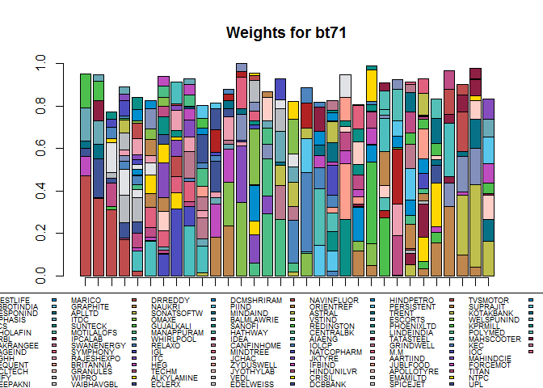

    ##                     WESTLIFE ABBOTINDIA RESPONIND MPHASIS   TCS CHOLAFIN KRBL
    ## 2019-09-27 05:30:00        0      0.031     0.000       0 0.034        0    0
    ## 2019-12-27 05:30:00        0      0.155     0.000       0 0.049        0    0
    ## 2020-03-27 05:30:00        0      0.326     0.000       0 0.000        0    0
    ## 2020-06-26 05:30:00        0      0.098     0.282       0 0.000        0    0
    ## 2020-09-25 05:30:00        0      0.040     0.388       0 0.000        0    0
    ## 2020-12-18 05:30:00        0      0.000     0.164       0 0.000        0    0
    ##                     VAKRANGEE PAGEIND PGHH SEQUENT HCLTECH  INFY DEEPAKNI
    ## 2019-09-27 05:30:00         0       0    0   0.000       0 0.115    0.000
    ## 2019-12-27 05:30:00         0       0    0   0.027       0 0.206    0.083
    ## 2020-03-27 05:30:00         0       0    0   0.000       0 0.000    0.000
    ## 2020-06-26 05:30:00         0       0    0   0.015       0 0.000    0.000
    ## 2020-09-25 05:30:00         0       0    0   0.000       0 0.000    0.000
    ## 2020-12-18 05:30:00         0       0    0   0.000       0 0.000    0.000
    ##                     INDIACEM MARICO GRAPHITE APLLTD ITDC SUNTECK MOTILALOFS
    ## 2019-09-27 05:30:00    0.000      0        0  0.000    0       0          0
    ## 2019-12-27 05:30:00    0.000      0        0  0.029    0       0          0
    ## 2020-03-27 05:30:00    0.109      0        0  0.000    0       0          0
    ## 2020-06-26 05:30:00    0.167      0        0  0.022    0       0          0
    ## 2020-09-25 05:30:00    0.172      0        0  0.138    0       0          0
    ## 2020-12-18 05:30:00    0.000      0        0  0.100    0       0          0
    ##                     IPCALAB SWANENERGY SYMPHONY RAJESHEXPO BRITANNIA GRANULES
    ## 2019-09-27 05:30:00   0.155          0        0          0         0    0.000
    ## 2019-12-27 05:30:00   0.000          0        0          0         0    0.017
    ## 2020-03-27 05:30:00   0.032          0        0          0         0    0.000
    ## 2020-06-26 05:30:00   0.000          0        0          0         0    0.000
    ## 2020-09-25 05:30:00   0.000          0        0          0         0    0.087
    ## 2020-12-18 05:30:00   0.000          0        0          0         0    0.114
    ##                     WIPRO VAIBHAVGBL INDHOTEL DRREDDY NAUKRI SONATSOFTW OMAXE
    ## 2019-09-27 05:30:00 0.015          0        0    0.00  0.037          0     0
    ## 2019-12-27 05:30:00 0.000          0        0    0.00  0.000          0     0
    ## 2020-03-27 05:30:00 0.000          0        0    0.00  0.000          0     0
    ## 2020-06-26 05:30:00 0.000          0        0    0.19  0.000          0     0
    ## 2020-09-25 05:30:00 0.000          0        0    0.00  0.000          0     0
    ## 2020-12-18 05:30:00 0.000          0        0    0.00  0.000          0     0
    ##                     GUJALKALI MANAPPURAM WHIRLPOOL RELAXO   IGL ITC HEG TECHM
    ## 2019-09-27 05:30:00         0       0.02     0.000      0 0.073   0   0     0
    ## 2019-12-27 05:30:00         0       0.00     0.000      0 0.000   0   0     0
    ## 2020-03-27 05:30:00         0       0.00     0.252      0 0.000   0   0     0
    ## 2020-06-26 05:30:00         0       0.00     0.000      0 0.000   0   0     0
    ## 2020-09-25 05:30:00         0       0.00     0.000      0 0.000   0   0     0
    ## 2020-12-18 05:30:00         0       0.00     0.000      0 0.000   0   0     0
    ##                     ALKYLAMINE ECLERX JSWSTEEL DCMSHRIRAM PIIND MINDAIND
    ## 2019-09-27 05:30:00      0.000      0        0      0.069     0        0
    ## 2019-12-27 05:30:00      0.000      0        0      0.000     0        0
    ## 2020-03-27 05:30:00      0.000      0        0      0.000     0        0
    ## 2020-06-26 05:30:00      0.000      0        0      0.000     0        0
    ## 2020-09-25 05:30:00      0.024      0        0      0.000     0        0
    ## 2020-12-18 05:30:00      0.000      0        0      0.000     0        0
    ##                     BALMLAWRIE SANOFI HATHWAY  IDEA CANFINHOME MINDTREE JCHAC
    ## 2019-09-27 05:30:00          0      0       0 0.000          0        0     0
    ## 2019-12-27 05:30:00          0      0       0 0.000          0        0     0
    ## 2020-03-27 05:30:00          0      0       0 0.042          0        0     0
    ## 2020-06-26 05:30:00          0      0       0 0.077          0        0     0
    ## 2020-09-25 05:30:00          0      0       0 0.073          0        0     0
    ## 2020-12-18 05:30:00          0      0       0 0.010          0        0     0
    ##                     ZYDUSWELL JYOTHYLAB VEDL EDELWEISS APLAPOLLO NAVINFLUOR
    ## 2019-09-27 05:30:00      0.14         0    0         0         0      0.000
    ## 2019-12-27 05:30:00      0.00         0    0         0         0      0.000
    ## 2020-03-27 05:30:00      0.00         0    0         0         0      0.118
    ## 2020-06-26 05:30:00      0.00         0    0         0         0      0.049
    ## 2020-09-25 05:30:00      0.00         0    0         0         0      0.000
    ## 2020-12-18 05:30:00      0.00         0    0         0         0      0.000
    ##                     ORIENTREF ASTRAL VSTIND REDINGTON CENTRALBK AIAENG IOLCP
    ## 2019-09-27 05:30:00         0      0      0     0.048         0      0     0
    ## 2019-12-27 05:30:00         0      0      0     0.058         0      0     0
    ## 2020-03-27 05:30:00         0      0      0     0.000         0      0     0
    ## 2020-06-26 05:30:00         0      0      0     0.000         0      0     0
    ## 2020-09-25 05:30:00         0      0      0     0.000         0      0     0
    ## 2020-12-18 05:30:00         0      0      0     0.048         0      0     0
    ##                     NATCOPHARM JKTYRE IFBIND HINDUNILVR CRISIL DCBBANK
    ## 2019-09-27 05:30:00          0      0  0.000      0.011      0   0.004
    ## 2019-12-27 05:30:00          0      0  0.000      0.000      0   0.000
    ## 2020-03-27 05:30:00          0      0  0.000      0.086      0   0.000
    ## 2020-06-26 05:30:00          0      0  0.000      0.000      0   0.000
    ## 2020-09-25 05:30:00          0      0  0.000      0.000      0   0.000
    ## 2020-12-18 05:30:00          0      0  0.093      0.000      0   0.000
    ##                     BALRAMCHIN HINDPETRO PERSISTENT TRENT ESCORTS PHOENIXLTD
    ## 2019-09-27 05:30:00          0         0      0.000 0.004   0.000          0
    ## 2019-12-27 05:30:00          0         0      0.000 0.118   0.000          0
    ## 2020-03-27 05:30:00          0         0      0.000 0.000   0.000          0
    ## 2020-06-26 05:30:00          0         0      0.000 0.000   0.000          0
    ## 2020-09-25 05:30:00          0         0      0.007 0.000   0.000          0
    ## 2020-12-18 05:30:00          0         0      0.124 0.000   0.084          0
    ##                     LINDEINDIA TATASTEEL GRINDWELL M.M AARTIIND JUBLFOOD
    ## 2019-09-27 05:30:00      0.000         0         0   0        0        0
    ## 2019-12-27 05:30:00      0.093         0         0   0        0        0
    ## 2020-03-27 05:30:00      0.000         0         0   0        0        0
    ## 2020-06-26 05:30:00      0.000         0         0   0        0        0
    ## 2020-09-25 05:30:00      0.000         0         0   0        0        0
    ## 2020-12-18 05:30:00      0.000         0         0   0        0        0
    ##                     APOLLOTYRE EMAMILTD SPICEJET FORTIS TVSMOTOR SUPRAJIT
    ## 2019-09-27 05:30:00          0        0        0      0        0        0
    ## 2019-12-27 05:30:00          0        0        0      0        0        0
    ## 2020-03-27 05:30:00          0        0        0      0        0        0
    ## 2020-06-26 05:30:00          0        0        0      0        0        0
    ## 2020-09-25 05:30:00          0        0        0      0        0        0
    ## 2020-12-18 05:30:00          0        0        0      0        0        0
    ##                     KOTAKBANK WELSPUNIND KPRMILL POLYMED MAHSCOOTER KEC IOC
    ## 2019-09-27 05:30:00     0.102          0       0       0          0   0   0
    ## 2019-12-27 05:30:00     0.000          0       0       0          0   0   0
    ## 2020-03-27 05:30:00     0.000          0       0       0          0   0   0
    ## 2020-06-26 05:30:00     0.000          0       0       0          0   0   0
    ## 2020-09-25 05:30:00     0.000          0       0       0          0   0   0
    ## 2020-12-18 05:30:00     0.000          0       0       0          0   0   0
    ##                     MAHINDCIE FORCEMOT TITAN NTPC UPL AUROPHARMA VINATIORGA VTL
    ## 2019-09-27 05:30:00     0.000        0     0    0   0          0          0   0
    ## 2019-12-27 05:30:00     0.000        0     0    0   0          0          0   0
    ## 2020-03-27 05:30:00     0.000        0     0    0   0          0          0   0
    ## 2020-06-26 05:30:00     0.000        0     0    0   0          0          0   0
    ## 2020-09-25 05:30:00     0.000        0     0    0   0          0          0   0
    ## 2020-12-18 05:30:00     0.098        0     0    0   0          0          0   0
    ##                     OBEROIRLTY J.KBANK BEL NLCINDIA ASTRAZEN GODREJPROP
    ## 2019-09-27 05:30:00          0       0   0        0    0.000          0
    ## 2019-12-27 05:30:00          0       0   0        0    0.000          0
    ## 2020-03-27 05:30:00          0       0   0        0    0.000          0
    ## 2020-06-26 05:30:00          0       0   0        0    0.000          0
    ## 2020-09-25 05:30:00          0       0   0        0    0.048          0
    ## 2020-12-18 05:30:00          0       0   0        0    0.000          0
    ##                     PETRONET
    ## 2019-09-27 05:30:00     0.07
    ## 2019-12-27 05:30:00     0.00
    ## 2020-03-27 05:30:00     0.00
    ## 2020-06-26 05:30:00     0.00
    ## 2020-09-25 05:30:00     0.00
    ## 2020-12-18 05:30:00     0.00

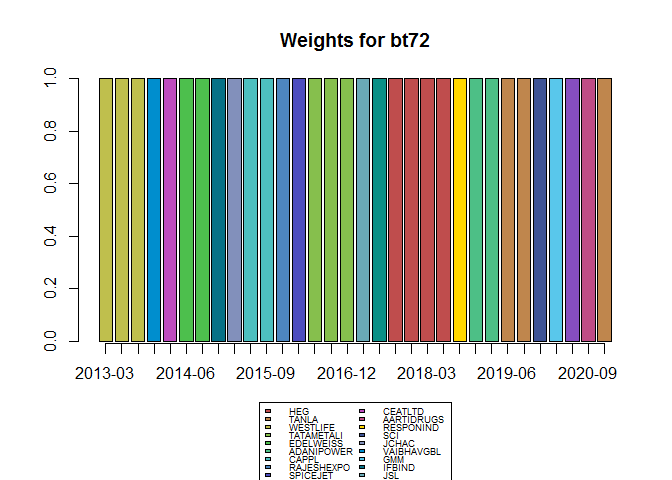

    ##                     HEG TANLA WESTLIFE TATAMETALI EDELWEISS ADANIPOWER CAPPL
    ## 2019-09-27 05:30:00   0     1        0          0         0          0     0
    ## 2019-12-27 05:30:00   0     0        0          0         0          0     0
    ## 2020-03-27 05:30:00   0     0        0          0         0          0     0
    ## 2020-06-26 05:30:00   0     0        0          0         0          0     0
    ## 2020-09-25 05:30:00   0     0        0          0         0          0     0
    ## 2020-12-18 05:30:00   0     1        0          0         0          0     0
    ##                     RAJESHEXPO SPICEJET ALOKTEXT CEATLTD AARTIDRUGS RESPONIND
    ## 2019-09-27 05:30:00          0        0        0       0          0         0
    ## 2019-12-27 05:30:00          0        0        0       0          0         0
    ## 2020-03-27 05:30:00          0        0        0       0          0         0
    ## 2020-06-26 05:30:00          0        0        1       0          0         0
    ## 2020-09-25 05:30:00          0        0        0       0          1         0
    ## 2020-12-18 05:30:00          0        0        0       0          0         0
    ##                     SCI JCHAC VAIBHAVGBL GMM IFBIND JSL ITI
    ## 2019-09-27 05:30:00   0     0          0   0      0   0   0
    ## 2019-12-27 05:30:00   1     0          0   0      0   0   0
    ## 2020-03-27 05:30:00   0     0          0   1      0   0   0
    ## 2020-06-26 05:30:00   0     0          0   0      0   0   0
    ## 2020-09-25 05:30:00   0     0          0   0      0   0   0
    ## 2020-12-18 05:30:00   0     0          0   0      0   0   0


    ##                     WESTLIFE ABBOTINDIA RESPONIND MPHASIS   TCS CHOLAFIN KRBL
    ## 2019-09-27 05:30:00        0      0.031     0.000       0 0.034        0    0
    ## 2019-12-27 05:30:00        0      0.155     0.000       0 0.049        0    0
    ## 2020-03-27 05:30:00        0      0.326     0.000       0 0.000        0    0
    ## 2020-06-26 05:30:00        0      0.098     0.282       0 0.000        0    0
    ## 2020-09-25 05:30:00        0      0.040     0.388       0 0.000        0    0
    ## 2020-12-18 05:30:00        0      0.000     0.164       0 0.000        0    0
    ##                     VAKRANGEE PAGEIND PGHH SEQUENT HCLTECH  INFY DEEPAKNI
    ## 2019-09-27 05:30:00         0       0    0   0.000       0 0.115    0.000
    ## 2019-12-27 05:30:00         0       0    0   0.027       0 0.206    0.083
    ## 2020-03-27 05:30:00         0       0    0   0.000       0 0.000    0.000
    ## 2020-06-26 05:30:00         0       0    0   0.015       0 0.000    0.000
    ## 2020-09-25 05:30:00         0       0    0   0.000       0 0.000    0.000
    ## 2020-12-18 05:30:00         0       0    0   0.000       0 0.000    0.000
    ##                     INDIACEM MARICO GRAPHITE APLLTD ITDC SUNTECK MOTILALOFS
    ## 2019-09-27 05:30:00    0.000      0        0  0.000    0       0          0
    ## 2019-12-27 05:30:00    0.000      0        0  0.029    0       0          0
    ## 2020-03-27 05:30:00    0.109      0        0  0.000    0       0          0
    ## 2020-06-26 05:30:00    0.167      0        0  0.022    0       0          0
    ## 2020-09-25 05:30:00    0.172      0        0  0.138    0       0          0
    ## 2020-12-18 05:30:00    0.000      0        0  0.100    0       0          0
    ##                     IPCALAB SWANENERGY SYMPHONY RAJESHEXPO BRITANNIA GRANULES
    ## 2019-09-27 05:30:00   0.155          0        0          0         0    0.000
    ## 2019-12-27 05:30:00   0.000          0        0          0         0    0.017
    ## 2020-03-27 05:30:00   0.032          0        0          0         0    0.000
    ## 2020-06-26 05:30:00   0.000          0        0          0         0    0.000
    ## 2020-09-25 05:30:00   0.000          0        0          0         0    0.087
    ## 2020-12-18 05:30:00   0.000          0        0          0         0    0.114
    ##                     WIPRO VAIBHAVGBL INDHOTEL DRREDDY NAUKRI SONATSOFTW OMAXE
    ## 2019-09-27 05:30:00 0.015          0        0    0.00  0.037          0     0
    ## 2019-12-27 05:30:00 0.000          0        0    0.00  0.000          0     0
    ## 2020-03-27 05:30:00 0.000          0        0    0.00  0.000          0     0
    ## 2020-06-26 05:30:00 0.000          0        0    0.19  0.000          0     0
    ## 2020-09-25 05:30:00 0.000          0        0    0.00  0.000          0     0
    ## 2020-12-18 05:30:00 0.000          0        0    0.00  0.000          0     0
    ##                     GUJALKALI MANAPPURAM WHIRLPOOL RELAXO   IGL ITC HEG TECHM
    ## 2019-09-27 05:30:00         0       0.02     0.000      0 0.073   0   0     0
    ## 2019-12-27 05:30:00         0       0.00     0.000      0 0.000   0   0     0
    ## 2020-03-27 05:30:00         0       0.00     0.252      0 0.000   0   0     0
    ## 2020-06-26 05:30:00         0       0.00     0.000      0 0.000   0   0     0
    ## 2020-09-25 05:30:00         0       0.00     0.000      0 0.000   0   0     0
    ## 2020-12-18 05:30:00         0       0.00     0.000      0 0.000   0   0     0
    ##                     ALKYLAMINE ECLERX JSWSTEEL DCMSHRIRAM PIIND MINDAIND
    ## 2019-09-27 05:30:00      0.000      0        0      0.069     0        0
    ## 2019-12-27 05:30:00      0.000      0        0      0.000     0        0
    ## 2020-03-27 05:30:00      0.000      0        0      0.000     0        0
    ## 2020-06-26 05:30:00      0.000      0        0      0.000     0        0
    ## 2020-09-25 05:30:00      0.024      0        0      0.000     0        0
    ## 2020-12-18 05:30:00      0.000      0        0      0.000     0        0
    ##                     BALMLAWRIE SANOFI HATHWAY  IDEA CANFINHOME MINDTREE JCHAC
    ## 2019-09-27 05:30:00          0      0       0 0.000          0        0     0
    ## 2019-12-27 05:30:00          0      0       0 0.000          0        0     0
    ## 2020-03-27 05:30:00          0      0       0 0.042          0        0     0
    ## 2020-06-26 05:30:00          0      0       0 0.077          0        0     0
    ## 2020-09-25 05:30:00          0      0       0 0.073          0        0     0
    ## 2020-12-18 05:30:00          0      0       0 0.010          0        0     0
    ##                     ZYDUSWELL JYOTHYLAB VEDL EDELWEISS APLAPOLLO NAVINFLUOR
    ## 2019-09-27 05:30:00      0.14         0    0         0         0      0.000
    ## 2019-12-27 05:30:00      0.00         0    0         0         0      0.000
    ## 2020-03-27 05:30:00      0.00         0    0         0         0      0.118
    ## 2020-06-26 05:30:00      0.00         0    0         0         0      0.049
    ## 2020-09-25 05:30:00      0.00         0    0         0         0      0.000
    ## 2020-12-18 05:30:00      0.00         0    0         0         0      0.000
    ##                     ORIENTREF ASTRAL VSTIND REDINGTON CENTRALBK AIAENG IOLCP
    ## 2019-09-27 05:30:00         0      0      0     0.048         0      0     0
    ## 2019-12-27 05:30:00         0      0      0     0.058         0      0     0
    ## 2020-03-27 05:30:00         0      0      0     0.000         0      0     0
    ## 2020-06-26 05:30:00         0      0      0     0.000         0      0     0
    ## 2020-09-25 05:30:00         0      0      0     0.000         0      0     0
    ## 2020-12-18 05:30:00         0      0      0     0.048         0      0     0
    ##                     NATCOPHARM JKTYRE IFBIND HINDUNILVR CRISIL DCBBANK
    ## 2019-09-27 05:30:00          0      0  0.000      0.011      0   0.004
    ## 2019-12-27 05:30:00          0      0  0.000      0.000      0   0.000
    ## 2020-03-27 05:30:00          0      0  0.000      0.086      0   0.000
    ## 2020-06-26 05:30:00          0      0  0.000      0.000      0   0.000
    ## 2020-09-25 05:30:00          0      0  0.000      0.000      0   0.000
    ## 2020-12-18 05:30:00          0      0  0.093      0.000      0   0.000
    ##                     BALRAMCHIN HINDPETRO PERSISTENT TRENT ESCORTS PHOENIXLTD
    ## 2019-09-27 05:30:00          0         0      0.000 0.004   0.000          0
    ## 2019-12-27 05:30:00          0         0      0.000 0.118   0.000          0
    ## 2020-03-27 05:30:00          0         0      0.000 0.000   0.000          0
    ## 2020-06-26 05:30:00          0         0      0.000 0.000   0.000          0
    ## 2020-09-25 05:30:00          0         0      0.007 0.000   0.000          0
    ## 2020-12-18 05:30:00          0         0      0.124 0.000   0.084          0
    ##                     LINDEINDIA TATASTEEL GRINDWELL M.M AARTIIND JUBLFOOD
    ## 2019-09-27 05:30:00      0.000         0         0   0        0        0
    ## 2019-12-27 05:30:00      0.093         0         0   0        0        0
    ## 2020-03-27 05:30:00      0.000         0         0   0        0        0
    ## 2020-06-26 05:30:00      0.000         0         0   0        0        0
    ## 2020-09-25 05:30:00      0.000         0         0   0        0        0
    ## 2020-12-18 05:30:00      0.000         0         0   0        0        0
    ##                     APOLLOTYRE EMAMILTD SPICEJET FORTIS TVSMOTOR SUPRAJIT
    ## 2019-09-27 05:30:00          0        0        0      0        0        0
    ## 2019-12-27 05:30:00          0        0        0      0        0        0
    ## 2020-03-27 05:30:00          0        0        0      0        0        0
    ## 2020-06-26 05:30:00          0        0        0      0        0        0
    ## 2020-09-25 05:30:00          0        0        0      0        0        0
    ## 2020-12-18 05:30:00          0        0        0      0        0        0
    ##                     KOTAKBANK WELSPUNIND KPRMILL POLYMED MAHSCOOTER KEC IOC
    ## 2019-09-27 05:30:00     0.102          0       0       0          0   0   0
    ## 2019-12-27 05:30:00     0.000          0       0       0          0   0   0
    ## 2020-03-27 05:30:00     0.000          0       0       0          0   0   0
    ## 2020-06-26 05:30:00     0.000          0       0       0          0   0   0
    ## 2020-09-25 05:30:00     0.000          0       0       0          0   0   0
    ## 2020-12-18 05:30:00     0.000          0       0       0          0   0   0
    ##                     MAHINDCIE FORCEMOT TITAN NTPC UPL AUROPHARMA VINATIORGA VTL
    ## 2019-09-27 05:30:00     0.000        0     0    0   0          0          0   0
    ## 2019-12-27 05:30:00     0.000        0     0    0   0          0          0   0
    ## 2020-03-27 05:30:00     0.000        0     0    0   0          0          0   0
    ## 2020-06-26 05:30:00     0.000        0     0    0   0          0          0   0
    ## 2020-09-25 05:30:00     0.000        0     0    0   0          0          0   0
    ## 2020-12-18 05:30:00     0.098        0     0    0   0          0          0   0
    ##                     OBEROIRLTY J.KBANK BEL NLCINDIA ASTRAZEN GODREJPROP
    ## 2019-09-27 05:30:00          0       0   0        0    0.000          0
    ## 2019-12-27 05:30:00          0       0   0        0    0.000          0
    ## 2020-03-27 05:30:00          0       0   0        0    0.000          0
    ## 2020-06-26 05:30:00          0       0   0        0    0.000          0
    ## 2020-09-25 05:30:00          0       0   0        0    0.048          0
    ## 2020-12-18 05:30:00          0       0   0        0    0.000          0
    ##                     PETRONET
    ## 2019-09-27 05:30:00     0.07
    ## 2019-12-27 05:30:00     0.00
    ## 2020-03-27 05:30:00     0.00
    ## 2020-06-26 05:30:00     0.00
    ## 2020-09-25 05:30:00     0.00
    ## 2020-12-18 05:30:00     0.00


    ##                     WESTLIFE ABBOTINDIA RESPONIND MPHASIS   TCS CHOLAFIN KRBL
    ## 2019-09-27 05:30:00        0      0.031     0.000       0 0.034        0    0
    ## 2019-12-27 05:30:00        0      0.155     0.000       0 0.049        0    0
    ## 2020-03-27 05:30:00        0      0.326     0.000       0 0.000        0    0
    ## 2020-06-26 05:30:00        0      0.098     0.282       0 0.000        0    0
    ## 2020-09-25 05:30:00        0      0.040     0.388       0 0.000        0    0
    ## 2020-12-18 05:30:00        0      0.000     0.164       0 0.000        0    0
    ##                     VAKRANGEE PAGEIND PGHH SEQUENT HCLTECH  INFY DEEPAKNI
    ## 2019-09-27 05:30:00         0       0    0   0.000       0 0.115    0.000
    ## 2019-12-27 05:30:00         0       0    0   0.027       0 0.206    0.083
    ## 2020-03-27 05:30:00         0       0    0   0.000       0 0.000    0.000
    ## 2020-06-26 05:30:00         0       0    0   0.015       0 0.000    0.000
    ## 2020-09-25 05:30:00         0       0    0   0.000       0 0.000    0.000
    ## 2020-12-18 05:30:00         0       0    0   0.000       0 0.000    0.000
    ##                     INDIACEM MARICO GRAPHITE APLLTD ITDC SUNTECK MOTILALOFS
    ## 2019-09-27 05:30:00    0.000      0        0  0.000    0       0          0
    ## 2019-12-27 05:30:00    0.000      0        0  0.029    0       0          0
    ## 2020-03-27 05:30:00    0.109      0        0  0.000    0       0          0
    ## 2020-06-26 05:30:00    0.167      0        0  0.022    0       0          0
    ## 2020-09-25 05:30:00    0.172      0        0  0.138    0       0          0
    ## 2020-12-18 05:30:00    0.000      0        0  0.100    0       0          0
    ##                     IPCALAB SWANENERGY SYMPHONY RAJESHEXPO BRITANNIA GRANULES
    ## 2019-09-27 05:30:00   0.155          0        0          0         0    0.000
    ## 2019-12-27 05:30:00   0.000          0        0          0         0    0.017
    ## 2020-03-27 05:30:00   0.032          0        0          0         0    0.000
    ## 2020-06-26 05:30:00   0.000          0        0          0         0    0.000
    ## 2020-09-25 05:30:00   0.000          0        0          0         0    0.087
    ## 2020-12-18 05:30:00   0.000          0        0          0         0    0.114
    ##                     WIPRO VAIBHAVGBL INDHOTEL DRREDDY NAUKRI SONATSOFTW OMAXE
    ## 2019-09-27 05:30:00 0.015          0        0    0.00  0.037          0     0
    ## 2019-12-27 05:30:00 0.000          0        0    0.00  0.000          0     0
    ## 2020-03-27 05:30:00 0.000          0        0    0.00  0.000          0     0
    ## 2020-06-26 05:30:00 0.000          0        0    0.19  0.000          0     0
    ## 2020-09-25 05:30:00 0.000          0        0    0.00  0.000          0     0
    ## 2020-12-18 05:30:00 0.000          0        0    0.00  0.000          0     0
    ##                     GUJALKALI MANAPPURAM WHIRLPOOL RELAXO   IGL ITC HEG TECHM
    ## 2019-09-27 05:30:00         0       0.02     0.000      0 0.073   0   0     0
    ## 2019-12-27 05:30:00         0       0.00     0.000      0 0.000   0   0     0
    ## 2020-03-27 05:30:00         0       0.00     0.252      0 0.000   0   0     0
    ## 2020-06-26 05:30:00         0       0.00     0.000      0 0.000   0   0     0
    ## 2020-09-25 05:30:00         0       0.00     0.000      0 0.000   0   0     0
    ## 2020-12-18 05:30:00         0       0.00     0.000      0 0.000   0   0     0
    ##                     ALKYLAMINE ECLERX JSWSTEEL DCMSHRIRAM PIIND MINDAIND
    ## 2019-09-27 05:30:00      0.000      0        0      0.069     0        0
    ## 2019-12-27 05:30:00      0.000      0        0      0.000     0        0
    ## 2020-03-27 05:30:00      0.000      0        0      0.000     0        0
    ## 2020-06-26 05:30:00      0.000      0        0      0.000     0        0
    ## 2020-09-25 05:30:00      0.024      0        0      0.000     0        0
    ## 2020-12-18 05:30:00      0.000      0        0      0.000     0        0
    ##                     BALMLAWRIE SANOFI HATHWAY  IDEA CANFINHOME MINDTREE JCHAC
    ## 2019-09-27 05:30:00          0      0       0 0.000          0        0     0
    ## 2019-12-27 05:30:00          0      0       0 0.000          0        0     0
    ## 2020-03-27 05:30:00          0      0       0 0.042          0        0     0
    ## 2020-06-26 05:30:00          0      0       0 0.077          0        0     0
    ## 2020-09-25 05:30:00          0      0       0 0.073          0        0     0
    ## 2020-12-18 05:30:00          0      0       0 0.010          0        0     0
    ##                     ZYDUSWELL JYOTHYLAB VEDL EDELWEISS APLAPOLLO NAVINFLUOR
    ## 2019-09-27 05:30:00      0.14         0    0         0         0      0.000
    ## 2019-12-27 05:30:00      0.00         0    0         0         0      0.000
    ## 2020-03-27 05:30:00      0.00         0    0         0         0      0.118
    ## 2020-06-26 05:30:00      0.00         0    0         0         0      0.049
    ## 2020-09-25 05:30:00      0.00         0    0         0         0      0.000
    ## 2020-12-18 05:30:00      0.00         0    0         0         0      0.000
    ##                     ORIENTREF ASTRAL VSTIND REDINGTON CENTRALBK AIAENG IOLCP
    ## 2019-09-27 05:30:00         0      0      0     0.048         0      0     0
    ## 2019-12-27 05:30:00         0      0      0     0.058         0      0     0
    ## 2020-03-27 05:30:00         0      0      0     0.000         0      0     0
    ## 2020-06-26 05:30:00         0      0      0     0.000         0      0     0
    ## 2020-09-25 05:30:00         0      0      0     0.000         0      0     0
    ## 2020-12-18 05:30:00         0      0      0     0.048         0      0     0
    ##                     NATCOPHARM JKTYRE IFBIND HINDUNILVR CRISIL DCBBANK
    ## 2019-09-27 05:30:00          0      0  0.000      0.011      0   0.004
    ## 2019-12-27 05:30:00          0      0  0.000      0.000      0   0.000
    ## 2020-03-27 05:30:00          0      0  0.000      0.086      0   0.000
    ## 2020-06-26 05:30:00          0      0  0.000      0.000      0   0.000
    ## 2020-09-25 05:30:00          0      0  0.000      0.000      0   0.000
    ## 2020-12-18 05:30:00          0      0  0.093      0.000      0   0.000
    ##                     BALRAMCHIN HINDPETRO PERSISTENT TRENT ESCORTS PHOENIXLTD
    ## 2019-09-27 05:30:00          0         0      0.000 0.004   0.000          0
    ## 2019-12-27 05:30:00          0         0      0.000 0.118   0.000          0
    ## 2020-03-27 05:30:00          0         0      0.000 0.000   0.000          0
    ## 2020-06-26 05:30:00          0         0      0.000 0.000   0.000          0
    ## 2020-09-25 05:30:00          0         0      0.007 0.000   0.000          0
    ## 2020-12-18 05:30:00          0         0      0.124 0.000   0.084          0
    ##                     LINDEINDIA TATASTEEL GRINDWELL M.M AARTIIND JUBLFOOD
    ## 2019-09-27 05:30:00      0.000         0         0   0        0        0
    ## 2019-12-27 05:30:00      0.093         0         0   0        0        0
    ## 2020-03-27 05:30:00      0.000         0         0   0        0        0
    ## 2020-06-26 05:30:00      0.000         0         0   0        0        0
    ## 2020-09-25 05:30:00      0.000         0         0   0        0        0
    ## 2020-12-18 05:30:00      0.000         0         0   0        0        0
    ##                     APOLLOTYRE EMAMILTD SPICEJET FORTIS TVSMOTOR SUPRAJIT
    ## 2019-09-27 05:30:00          0        0        0      0        0        0
    ## 2019-12-27 05:30:00          0        0        0      0        0        0
    ## 2020-03-27 05:30:00          0        0        0      0        0        0
    ## 2020-06-26 05:30:00          0        0        0      0        0        0
    ## 2020-09-25 05:30:00          0        0        0      0        0        0
    ## 2020-12-18 05:30:00          0        0        0      0        0        0
    ##                     KOTAKBANK WELSPUNIND KPRMILL POLYMED MAHSCOOTER KEC IOC
    ## 2019-09-27 05:30:00     0.102          0       0       0          0   0   0
    ## 2019-12-27 05:30:00     0.000          0       0       0          0   0   0
    ## 2020-03-27 05:30:00     0.000          0       0       0          0   0   0
    ## 2020-06-26 05:30:00     0.000          0       0       0          0   0   0
    ## 2020-09-25 05:30:00     0.000          0       0       0          0   0   0
    ## 2020-12-18 05:30:00     0.000          0       0       0          0   0   0
    ##                     MAHINDCIE FORCEMOT TITAN NTPC UPL AUROPHARMA VINATIORGA VTL
    ## 2019-09-27 05:30:00     0.000        0     0    0   0          0          0   0
    ## 2019-12-27 05:30:00     0.000        0     0    0   0          0          0   0
    ## 2020-03-27 05:30:00     0.000        0     0    0   0          0          0   0
    ## 2020-06-26 05:30:00     0.000        0     0    0   0          0          0   0
    ## 2020-09-25 05:30:00     0.000        0     0    0   0          0          0   0
    ## 2020-12-18 05:30:00     0.098        0     0    0   0          0          0   0
    ##                     OBEROIRLTY J.KBANK BEL NLCINDIA ASTRAZEN GODREJPROP
    ## 2019-09-27 05:30:00          0       0   0        0    0.000          0
    ## 2019-12-27 05:30:00          0       0   0        0    0.000          0
    ## 2020-03-27 05:30:00          0       0   0        0    0.000          0
    ## 2020-06-26 05:30:00          0       0   0        0    0.000          0
    ## 2020-09-25 05:30:00          0       0   0        0    0.048          0
    ## 2020-12-18 05:30:00          0       0   0        0    0.000          0
    ##                     PETRONET
    ## 2019-09-27 05:30:00     0.07
    ## 2019-12-27 05:30:00     0.00
    ## 2020-03-27 05:30:00     0.00
    ## 2020-06-26 05:30:00     0.00
    ## 2020-09-25 05:30:00     0.00
    ## 2020-12-18 05:30:00     0.00


    ##                     WESTLIFE ABBOTINDIA RESPONIND MPHASIS   TCS CHOLAFIN KRBL
    ## 2019-09-27 05:30:00        0      0.031     0.000       0 0.034        0    0
    ## 2019-12-27 05:30:00        0      0.155     0.000       0 0.049        0    0
    ## 2020-03-27 05:30:00        0      0.326     0.000       0 0.000        0    0
    ## 2020-06-26 05:30:00        0      0.098     0.282       0 0.000        0    0
    ## 2020-09-25 05:30:00        0      0.040     0.388       0 0.000        0    0
    ## 2020-12-18 05:30:00        0      0.000     0.164       0 0.000        0    0
    ##                     VAKRANGEE PAGEIND PGHH SEQUENT HCLTECH  INFY DEEPAKNI
    ## 2019-09-27 05:30:00         0       0    0   0.000       0 0.115    0.000
    ## 2019-12-27 05:30:00         0       0    0   0.027       0 0.206    0.083
    ## 2020-03-27 05:30:00         0       0    0   0.000       0 0.000    0.000
    ## 2020-06-26 05:30:00         0       0    0   0.015       0 0.000    0.000
    ## 2020-09-25 05:30:00         0       0    0   0.000       0 0.000    0.000
    ## 2020-12-18 05:30:00         0       0    0   0.000       0 0.000    0.000
    ##                     INDIACEM MARICO GRAPHITE APLLTD ITDC SUNTECK MOTILALOFS
    ## 2019-09-27 05:30:00    0.000      0        0  0.000    0       0          0
    ## 2019-12-27 05:30:00    0.000      0        0  0.029    0       0          0
    ## 2020-03-27 05:30:00    0.109      0        0  0.000    0       0          0
    ## 2020-06-26 05:30:00    0.167      0        0  0.022    0       0          0
    ## 2020-09-25 05:30:00    0.172      0        0  0.138    0       0          0
    ## 2020-12-18 05:30:00    0.000      0        0  0.100    0       0          0
    ##                     IPCALAB SWANENERGY SYMPHONY RAJESHEXPO BRITANNIA GRANULES
    ## 2019-09-27 05:30:00   0.155          0        0          0         0    0.000
    ## 2019-12-27 05:30:00   0.000          0        0          0         0    0.017
    ## 2020-03-27 05:30:00   0.032          0        0          0         0    0.000
    ## 2020-06-26 05:30:00   0.000          0        0          0         0    0.000
    ## 2020-09-25 05:30:00   0.000          0        0          0         0    0.087
    ## 2020-12-18 05:30:00   0.000          0        0          0         0    0.114
    ##                     WIPRO VAIBHAVGBL INDHOTEL DRREDDY NAUKRI SONATSOFTW OMAXE
    ## 2019-09-27 05:30:00 0.015          0        0    0.00  0.037          0     0
    ## 2019-12-27 05:30:00 0.000          0        0    0.00  0.000          0     0
    ## 2020-03-27 05:30:00 0.000          0        0    0.00  0.000          0     0
    ## 2020-06-26 05:30:00 0.000          0        0    0.19  0.000          0     0
    ## 2020-09-25 05:30:00 0.000          0        0    0.00  0.000          0     0
    ## 2020-12-18 05:30:00 0.000          0        0    0.00  0.000          0     0
    ##                     GUJALKALI MANAPPURAM WHIRLPOOL RELAXO   IGL ITC HEG TECHM
    ## 2019-09-27 05:30:00         0       0.02     0.000      0 0.073   0   0     0
    ## 2019-12-27 05:30:00         0       0.00     0.000      0 0.000   0   0     0
    ## 2020-03-27 05:30:00         0       0.00     0.252      0 0.000   0   0     0
    ## 2020-06-26 05:30:00         0       0.00     0.000      0 0.000   0   0     0
    ## 2020-09-25 05:30:00         0       0.00     0.000      0 0.000   0   0     0
    ## 2020-12-18 05:30:00         0       0.00     0.000      0 0.000   0   0     0
    ##                     ALKYLAMINE ECLERX JSWSTEEL DCMSHRIRAM PIIND MINDAIND
    ## 2019-09-27 05:30:00      0.000      0        0      0.069     0        0
    ## 2019-12-27 05:30:00      0.000      0        0      0.000     0        0
    ## 2020-03-27 05:30:00      0.000      0        0      0.000     0        0
    ## 2020-06-26 05:30:00      0.000      0        0      0.000     0        0
    ## 2020-09-25 05:30:00      0.024      0        0      0.000     0        0
    ## 2020-12-18 05:30:00      0.000      0        0      0.000     0        0
    ##                     BALMLAWRIE SANOFI HATHWAY  IDEA CANFINHOME MINDTREE JCHAC
    ## 2019-09-27 05:30:00          0      0       0 0.000          0        0     0
    ## 2019-12-27 05:30:00          0      0       0 0.000          0        0     0
    ## 2020-03-27 05:30:00          0      0       0 0.042          0        0     0
    ## 2020-06-26 05:30:00          0      0       0 0.077          0        0     0
    ## 2020-09-25 05:30:00          0      0       0 0.073          0        0     0
    ## 2020-12-18 05:30:00          0      0       0 0.010          0        0     0
    ##                     ZYDUSWELL JYOTHYLAB VEDL EDELWEISS APLAPOLLO NAVINFLUOR
    ## 2019-09-27 05:30:00      0.14         0    0         0         0      0.000
    ## 2019-12-27 05:30:00      0.00         0    0         0         0      0.000
    ## 2020-03-27 05:30:00      0.00         0    0         0         0      0.118
    ## 2020-06-26 05:30:00      0.00         0    0         0         0      0.049
    ## 2020-09-25 05:30:00      0.00         0    0         0         0      0.000
    ## 2020-12-18 05:30:00      0.00         0    0         0         0      0.000
    ##                     ORIENTREF ASTRAL VSTIND REDINGTON CENTRALBK AIAENG IOLCP
    ## 2019-09-27 05:30:00         0      0      0     0.048         0      0     0
    ## 2019-12-27 05:30:00         0      0      0     0.058         0      0     0
    ## 2020-03-27 05:30:00         0      0      0     0.000         0      0     0
    ## 2020-06-26 05:30:00         0      0      0     0.000         0      0     0
    ## 2020-09-25 05:30:00         0      0      0     0.000         0      0     0
    ## 2020-12-18 05:30:00         0      0      0     0.048         0      0     0
    ##                     NATCOPHARM JKTYRE IFBIND HINDUNILVR CRISIL DCBBANK
    ## 2019-09-27 05:30:00          0      0  0.000      0.011      0   0.004
    ## 2019-12-27 05:30:00          0      0  0.000      0.000      0   0.000
    ## 2020-03-27 05:30:00          0      0  0.000      0.086      0   0.000
    ## 2020-06-26 05:30:00          0      0  0.000      0.000      0   0.000
    ## 2020-09-25 05:30:00          0      0  0.000      0.000      0   0.000
    ## 2020-12-18 05:30:00          0      0  0.093      0.000      0   0.000
    ##                     BALRAMCHIN HINDPETRO PERSISTENT TRENT ESCORTS PHOENIXLTD
    ## 2019-09-27 05:30:00          0         0      0.000 0.004   0.000          0
    ## 2019-12-27 05:30:00          0         0      0.000 0.118   0.000          0
    ## 2020-03-27 05:30:00          0         0      0.000 0.000   0.000          0
    ## 2020-06-26 05:30:00          0         0      0.000 0.000   0.000          0
    ## 2020-09-25 05:30:00          0         0      0.007 0.000   0.000          0
    ## 2020-12-18 05:30:00          0         0      0.124 0.000   0.084          0
    ##                     LINDEINDIA TATASTEEL GRINDWELL M.M AARTIIND JUBLFOOD
    ## 2019-09-27 05:30:00      0.000         0         0   0        0        0
    ## 2019-12-27 05:30:00      0.093         0         0   0        0        0
    ## 2020-03-27 05:30:00      0.000         0         0   0        0        0
    ## 2020-06-26 05:30:00      0.000         0         0   0        0        0
    ## 2020-09-25 05:30:00      0.000         0         0   0        0        0
    ## 2020-12-18 05:30:00      0.000         0         0   0        0        0
    ##                     APOLLOTYRE EMAMILTD SPICEJET FORTIS TVSMOTOR SUPRAJIT
    ## 2019-09-27 05:30:00          0        0        0      0        0        0
    ## 2019-12-27 05:30:00          0        0        0      0        0        0
    ## 2020-03-27 05:30:00          0        0        0      0        0        0
    ## 2020-06-26 05:30:00          0        0        0      0        0        0
    ## 2020-09-25 05:30:00          0        0        0      0        0        0
    ## 2020-12-18 05:30:00          0        0        0      0        0        0
    ##                     KOTAKBANK WELSPUNIND KPRMILL POLYMED MAHSCOOTER KEC IOC
    ## 2019-09-27 05:30:00     0.102          0       0       0          0   0   0
    ## 2019-12-27 05:30:00     0.000          0       0       0          0   0   0
    ## 2020-03-27 05:30:00     0.000          0       0       0          0   0   0
    ## 2020-06-26 05:30:00     0.000          0       0       0          0   0   0
    ## 2020-09-25 05:30:00     0.000          0       0       0          0   0   0
    ## 2020-12-18 05:30:00     0.000          0       0       0          0   0   0
    ##                     MAHINDCIE FORCEMOT TITAN NTPC UPL AUROPHARMA VINATIORGA VTL
    ## 2019-09-27 05:30:00     0.000        0     0    0   0          0          0   0
    ## 2019-12-27 05:30:00     0.000        0     0    0   0          0          0   0
    ## 2020-03-27 05:30:00     0.000        0     0    0   0          0          0   0
    ## 2020-06-26 05:30:00     0.000        0     0    0   0          0          0   0
    ## 2020-09-25 05:30:00     0.000        0     0    0   0          0          0   0
    ## 2020-12-18 05:30:00     0.098        0     0    0   0          0          0   0
    ##                     OBEROIRLTY J.KBANK BEL NLCINDIA ASTRAZEN GODREJPROP
    ## 2019-09-27 05:30:00          0       0   0        0    0.000          0
    ## 2019-12-27 05:30:00          0       0   0        0    0.000          0
    ## 2020-03-27 05:30:00          0       0   0        0    0.000          0
    ## 2020-06-26 05:30:00          0       0   0        0    0.000          0
    ## 2020-09-25 05:30:00          0       0   0        0    0.048          0
    ## 2020-12-18 05:30:00          0       0   0        0    0.000          0
    ##                     PETRONET
    ## 2019-09-27 05:30:00     0.07
    ## 2019-12-27 05:30:00     0.00
    ## 2020-03-27 05:30:00     0.00
    ## 2020-06-26 05:30:00     0.00
    ## 2020-09-25 05:30:00     0.00
    ## 2020-12-18 05:30:00     0.00

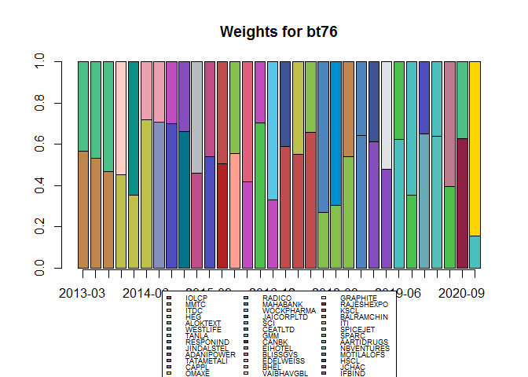

    ##                     IOLCP MMTC ITDC HEG ALOKTEXT WESTLIFE TANLA RESPONIND
    ## 2019-09-27 05:30:00     0    0    0   0    0.353        0 0.647         0
    ## 2019-12-27 05:30:00     0    0    0   0    0.000        0 0.000         0
    ## 2020-03-27 05:30:00     0    0    0   0    0.000        0 0.000         0
    ## 2020-06-26 05:30:00     0    0    0   0    0.396        0 0.000         0
    ## 2020-09-25 05:30:00     0    0    0   0    0.000        0 0.000         0
    ## 2020-12-18 05:30:00     0    0    0   0    0.000        0 0.154         0
    ##                     JINDALSTEL ADANIPOWER TATAMETALI CAPPL OMAXE JSL RADICO
    ## 2019-09-27 05:30:00          0          0          0     0 0.000   0      0
    ## 2019-12-27 05:30:00          0          0          0     0 0.000   0      0
    ## 2020-03-27 05:30:00          0          0          0     0 0.000   0      0
    ## 2020-06-26 05:30:00          0          0          0     0 0.000   0      0
    ## 2020-09-25 05:30:00          0          0          0     0 0.000   0      0
    ## 2020-12-18 05:30:00          0          0          0     0 0.846   0      0
    ##                     MAHABANK WOCKPHARMA JAICORPLTD  SCI CEATLTD  GMM CANBK
    ## 2019-09-27 05:30:00        0          0          0 0.00       0 0.00 0.000
    ## 2019-12-27 05:30:00        0          0          0 0.65       0 0.00 0.000
    ## 2020-03-27 05:30:00        0          0          0 0.00       0 0.64 0.000
    ## 2020-06-26 05:30:00        0          0          0 0.00       0 0.00 0.000
    ## 2020-09-25 05:30:00        0          0          0 0.00       0 0.00 0.628
    ## 2020-12-18 05:30:00        0          0          0 0.00       0 0.00 0.000
    ##                     EIHOTEL BLISSGVS EDELWEISS BHEL VAIBHAVGBL DCMSHRIRAM
    ## 2019-09-27 05:30:00   0.000        0         0    0          0          0
    ## 2019-12-27 05:30:00   0.000        0         0    0          0          0
    ## 2020-03-27 05:30:00   0.000        0         0    0          0          0
    ## 2020-06-26 05:30:00   0.604        0         0    0          0          0
    ## 2020-09-25 05:30:00   0.000        0         0    0          0          0
    ## 2020-12-18 05:30:00   0.000        0         0    0          0          0
    ##                     GRAPHITE RAJESHEXPO KSCL BALRAMCHIN ITI SPICEJET SPARC
    ## 2019-09-27 05:30:00        0          0    0          0   0        0     0
    ## 2019-12-27 05:30:00        0          0    0          0   0        0     0
    ## 2020-03-27 05:30:00        0          0    0          0   0        0     0
    ## 2020-06-26 05:30:00        0          0    0          0   0        0     0
    ## 2020-09-25 05:30:00        0          0    0          0   0        0     0
    ## 2020-12-18 05:30:00        0          0    0          0   0        0     0
    ##                     AARTIDRUGS NBVENTURES MOTILALOFS HSCL JCHAC IFBIND
    ## 2019-09-27 05:30:00      0.000       0.00          0 0.00     0      0
    ## 2019-12-27 05:30:00      0.000       0.00          0 0.35     0      0
    ## 2020-03-27 05:30:00      0.000       0.36          0 0.00     0      0
    ## 2020-06-26 05:30:00      0.000       0.00          0 0.00     0      0
    ## 2020-09-25 05:30:00      0.372       0.00          0 0.00     0      0
    ## 2020-12-18 05:30:00      0.000       0.00          0 0.00     0      0


    ##                     WESTLIFE ABBOTINDIA RESPONIND MPHASIS   TCS CHOLAFIN KRBL
    ## 2019-09-27 05:30:00        0      0.031     0.000       0 0.034        0    0
    ## 2019-12-27 05:30:00        0      0.155     0.000       0 0.049        0    0
    ## 2020-03-27 05:30:00        0      0.326     0.000       0 0.000        0    0
    ## 2020-06-26 05:30:00        0      0.098     0.282       0 0.000        0    0
    ## 2020-09-25 05:30:00        0      0.040     0.388       0 0.000        0    0
    ## 2020-12-18 05:30:00        0      0.000     0.164       0 0.000        0    0
    ##                     VAKRANGEE PAGEIND PGHH SEQUENT HCLTECH  INFY DEEPAKNI
    ## 2019-09-27 05:30:00         0       0    0   0.000       0 0.115    0.000
    ## 2019-12-27 05:30:00         0       0    0   0.027       0 0.206    0.083
    ## 2020-03-27 05:30:00         0       0    0   0.000       0 0.000    0.000
    ## 2020-06-26 05:30:00         0       0    0   0.015       0 0.000    0.000
    ## 2020-09-25 05:30:00         0       0    0   0.000       0 0.000    0.000
    ## 2020-12-18 05:30:00         0       0    0   0.000       0 0.000    0.000
    ##                     INDIACEM MARICO GRAPHITE APLLTD ITDC SUNTECK MOTILALOFS
    ## 2019-09-27 05:30:00    0.000      0        0  0.000    0       0          0
    ## 2019-12-27 05:30:00    0.000      0        0  0.029    0       0          0
    ## 2020-03-27 05:30:00    0.109      0        0  0.000    0       0          0
    ## 2020-06-26 05:30:00    0.167      0        0  0.022    0       0          0
    ## 2020-09-25 05:30:00    0.172      0        0  0.138    0       0          0
    ## 2020-12-18 05:30:00    0.000      0        0  0.100    0       0          0
    ##                     IPCALAB SWANENERGY SYMPHONY RAJESHEXPO BRITANNIA GRANULES
    ## 2019-09-27 05:30:00   0.155          0        0          0         0    0.000
    ## 2019-12-27 05:30:00   0.000          0        0          0         0    0.017
    ## 2020-03-27 05:30:00   0.032          0        0          0         0    0.000
    ## 2020-06-26 05:30:00   0.000          0        0          0         0    0.000
    ## 2020-09-25 05:30:00   0.000          0        0          0         0    0.087
    ## 2020-12-18 05:30:00   0.000          0        0          0         0    0.114
    ##                     WIPRO VAIBHAVGBL INDHOTEL DRREDDY NAUKRI SONATSOFTW OMAXE
    ## 2019-09-27 05:30:00 0.015          0        0    0.00  0.037          0     0
    ## 2019-12-27 05:30:00 0.000          0        0    0.00  0.000          0     0
    ## 2020-03-27 05:30:00 0.000          0        0    0.00  0.000          0     0
    ## 2020-06-26 05:30:00 0.000          0        0    0.19  0.000          0     0
    ## 2020-09-25 05:30:00 0.000          0        0    0.00  0.000          0     0
    ## 2020-12-18 05:30:00 0.000          0        0    0.00  0.000          0     0
    ##                     GUJALKALI MANAPPURAM WHIRLPOOL RELAXO   IGL ITC HEG TECHM
    ## 2019-09-27 05:30:00         0       0.02     0.000      0 0.073   0   0     0
    ## 2019-12-27 05:30:00         0       0.00     0.000      0 0.000   0   0     0
    ## 2020-03-27 05:30:00         0       0.00     0.252      0 0.000   0   0     0
    ## 2020-06-26 05:30:00         0       0.00     0.000      0 0.000   0   0     0
    ## 2020-09-25 05:30:00         0       0.00     0.000      0 0.000   0   0     0
    ## 2020-12-18 05:30:00         0       0.00     0.000      0 0.000   0   0     0
    ##                     ALKYLAMINE ECLERX JSWSTEEL DCMSHRIRAM PIIND MINDAIND
    ## 2019-09-27 05:30:00      0.000      0        0      0.069     0        0
    ## 2019-12-27 05:30:00      0.000      0        0      0.000     0        0
    ## 2020-03-27 05:30:00      0.000      0        0      0.000     0        0
    ## 2020-06-26 05:30:00      0.000      0        0      0.000     0        0
    ## 2020-09-25 05:30:00      0.024      0        0      0.000     0        0
    ## 2020-12-18 05:30:00      0.000      0        0      0.000     0        0
    ##                     BALMLAWRIE SANOFI HATHWAY  IDEA CANFINHOME MINDTREE JCHAC
    ## 2019-09-27 05:30:00          0      0       0 0.000          0        0     0
    ## 2019-12-27 05:30:00          0      0       0 0.000          0        0     0
    ## 2020-03-27 05:30:00          0      0       0 0.042          0        0     0
    ## 2020-06-26 05:30:00          0      0       0 0.077          0        0     0
    ## 2020-09-25 05:30:00          0      0       0 0.073          0        0     0
    ## 2020-12-18 05:30:00          0      0       0 0.010          0        0     0
    ##                     ZYDUSWELL JYOTHYLAB VEDL EDELWEISS APLAPOLLO NAVINFLUOR
    ## 2019-09-27 05:30:00      0.14         0    0         0         0      0.000
    ## 2019-12-27 05:30:00      0.00         0    0         0         0      0.000
    ## 2020-03-27 05:30:00      0.00         0    0         0         0      0.118
    ## 2020-06-26 05:30:00      0.00         0    0         0         0      0.049
    ## 2020-09-25 05:30:00      0.00         0    0         0         0      0.000
    ## 2020-12-18 05:30:00      0.00         0    0         0         0      0.000
    ##                     ORIENTREF ASTRAL VSTIND REDINGTON CENTRALBK AIAENG IOLCP
    ## 2019-09-27 05:30:00         0      0      0     0.048         0      0     0
    ## 2019-12-27 05:30:00         0      0      0     0.058         0      0     0
    ## 2020-03-27 05:30:00         0      0      0     0.000         0      0     0
    ## 2020-06-26 05:30:00         0      0      0     0.000         0      0     0
    ## 2020-09-25 05:30:00         0      0      0     0.000         0      0     0
    ## 2020-12-18 05:30:00         0      0      0     0.048         0      0     0
    ##                     NATCOPHARM JKTYRE IFBIND HINDUNILVR CRISIL DCBBANK
    ## 2019-09-27 05:30:00          0      0  0.000      0.011      0   0.004
    ## 2019-12-27 05:30:00          0      0  0.000      0.000      0   0.000
    ## 2020-03-27 05:30:00          0      0  0.000      0.086      0   0.000
    ## 2020-06-26 05:30:00          0      0  0.000      0.000      0   0.000
    ## 2020-09-25 05:30:00          0      0  0.000      0.000      0   0.000
    ## 2020-12-18 05:30:00          0      0  0.093      0.000      0   0.000
    ##                     BALRAMCHIN HINDPETRO PERSISTENT TRENT ESCORTS PHOENIXLTD
    ## 2019-09-27 05:30:00          0         0      0.000 0.004   0.000          0
    ## 2019-12-27 05:30:00          0         0      0.000 0.118   0.000          0
    ## 2020-03-27 05:30:00          0         0      0.000 0.000   0.000          0
    ## 2020-06-26 05:30:00          0         0      0.000 0.000   0.000          0
    ## 2020-09-25 05:30:00          0         0      0.007 0.000   0.000          0
    ## 2020-12-18 05:30:00          0         0      0.124 0.000   0.084          0
    ##                     LINDEINDIA TATASTEEL GRINDWELL M.M AARTIIND JUBLFOOD
    ## 2019-09-27 05:30:00      0.000         0         0   0        0        0
    ## 2019-12-27 05:30:00      0.093         0         0   0        0        0
    ## 2020-03-27 05:30:00      0.000         0         0   0        0        0
    ## 2020-06-26 05:30:00      0.000         0         0   0        0        0
    ## 2020-09-25 05:30:00      0.000         0         0   0        0        0
    ## 2020-12-18 05:30:00      0.000         0         0   0        0        0
    ##                     APOLLOTYRE EMAMILTD SPICEJET FORTIS TVSMOTOR SUPRAJIT
    ## 2019-09-27 05:30:00          0        0        0      0        0        0
    ## 2019-12-27 05:30:00          0        0        0      0        0        0
    ## 2020-03-27 05:30:00          0        0        0      0        0        0
    ## 2020-06-26 05:30:00          0        0        0      0        0        0
    ## 2020-09-25 05:30:00          0        0        0      0        0        0
    ## 2020-12-18 05:30:00          0        0        0      0        0        0
    ##                     KOTAKBANK WELSPUNIND KPRMILL POLYMED MAHSCOOTER KEC IOC
    ## 2019-09-27 05:30:00     0.102          0       0       0          0   0   0
    ## 2019-12-27 05:30:00     0.000          0       0       0          0   0   0
    ## 2020-03-27 05:30:00     0.000          0       0       0          0   0   0
    ## 2020-06-26 05:30:00     0.000          0       0       0          0   0   0
    ## 2020-09-25 05:30:00     0.000          0       0       0          0   0   0
    ## 2020-12-18 05:30:00     0.000          0       0       0          0   0   0
    ##                     MAHINDCIE FORCEMOT TITAN NTPC UPL AUROPHARMA VINATIORGA VTL
    ## 2019-09-27 05:30:00     0.000        0     0    0   0          0          0   0
    ## 2019-12-27 05:30:00     0.000        0     0    0   0          0          0   0
    ## 2020-03-27 05:30:00     0.000        0     0    0   0          0          0   0
    ## 2020-06-26 05:30:00     0.000        0     0    0   0          0          0   0
    ## 2020-09-25 05:30:00     0.000        0     0    0   0          0          0   0
    ## 2020-12-18 05:30:00     0.098        0     0    0   0          0          0   0
    ##                     OBEROIRLTY J.KBANK BEL NLCINDIA ASTRAZEN GODREJPROP
    ## 2019-09-27 05:30:00          0       0   0        0    0.000          0
    ## 2019-12-27 05:30:00          0       0   0        0    0.000          0
    ## 2020-03-27 05:30:00          0       0   0        0    0.000          0
    ## 2020-06-26 05:30:00          0       0   0        0    0.000          0
    ## 2020-09-25 05:30:00          0       0   0        0    0.048          0
    ## 2020-12-18 05:30:00          0       0   0        0    0.000          0
    ##                     PETRONET
    ## 2019-09-27 05:30:00     0.07
    ## 2019-12-27 05:30:00     0.00
    ## 2020-03-27 05:30:00     0.00
    ## 2020-06-26 05:30:00     0.00
    ## 2020-09-25 05:30:00     0.00
    ## 2020-12-18 05:30:00     0.00


    ##                     WESTLIFE ABBOTINDIA RESPONIND MPHASIS   TCS CHOLAFIN KRBL
    ## 2019-09-27 05:30:00        0      0.031     0.000       0 0.034        0    0
    ## 2019-12-27 05:30:00        0      0.155     0.000       0 0.049        0    0
    ## 2020-03-27 05:30:00        0      0.326     0.000       0 0.000        0    0
    ## 2020-06-26 05:30:00        0      0.098     0.282       0 0.000        0    0
    ## 2020-09-25 05:30:00        0      0.040     0.388       0 0.000        0    0
    ## 2020-12-18 05:30:00        0      0.000     0.164       0 0.000        0    0
    ##                     VAKRANGEE PAGEIND PGHH SEQUENT HCLTECH  INFY DEEPAKNI
    ## 2019-09-27 05:30:00         0       0    0   0.000       0 0.115    0.000
    ## 2019-12-27 05:30:00         0       0    0   0.027       0 0.206    0.083
    ## 2020-03-27 05:30:00         0       0    0   0.000       0 0.000    0.000
    ## 2020-06-26 05:30:00         0       0    0   0.015       0 0.000    0.000
    ## 2020-09-25 05:30:00         0       0    0   0.000       0 0.000    0.000
    ## 2020-12-18 05:30:00         0       0    0   0.000       0 0.000    0.000
    ##                     INDIACEM MARICO GRAPHITE APLLTD ITDC SUNTECK MOTILALOFS
    ## 2019-09-27 05:30:00    0.000      0        0  0.000    0       0          0
    ## 2019-12-27 05:30:00    0.000      0        0  0.029    0       0          0
    ## 2020-03-27 05:30:00    0.109      0        0  0.000    0       0          0
    ## 2020-06-26 05:30:00    0.167      0        0  0.022    0       0          0
    ## 2020-09-25 05:30:00    0.172      0        0  0.138    0       0          0
    ## 2020-12-18 05:30:00    0.000      0        0  0.100    0       0          0
    ##                     IPCALAB SWANENERGY SYMPHONY RAJESHEXPO BRITANNIA GRANULES
    ## 2019-09-27 05:30:00   0.155          0        0          0         0    0.000
    ## 2019-12-27 05:30:00   0.000          0        0          0         0    0.017
    ## 2020-03-27 05:30:00   0.032          0        0          0         0    0.000
    ## 2020-06-26 05:30:00   0.000          0        0          0         0    0.000
    ## 2020-09-25 05:30:00   0.000          0        0          0         0    0.087
    ## 2020-12-18 05:30:00   0.000          0        0          0         0    0.114
    ##                     WIPRO VAIBHAVGBL INDHOTEL DRREDDY NAUKRI SONATSOFTW OMAXE
    ## 2019-09-27 05:30:00 0.015          0        0    0.00  0.037          0     0
    ## 2019-12-27 05:30:00 0.000          0        0    0.00  0.000          0     0
    ## 2020-03-27 05:30:00 0.000          0        0    0.00  0.000          0     0
    ## 2020-06-26 05:30:00 0.000          0        0    0.19  0.000          0     0
    ## 2020-09-25 05:30:00 0.000          0        0    0.00  0.000          0     0
    ## 2020-12-18 05:30:00 0.000          0        0    0.00  0.000          0     0
    ##                     GUJALKALI MANAPPURAM WHIRLPOOL RELAXO   IGL ITC HEG TECHM
    ## 2019-09-27 05:30:00         0       0.02     0.000      0 0.073   0   0     0
    ## 2019-12-27 05:30:00         0       0.00     0.000      0 0.000   0   0     0
    ## 2020-03-27 05:30:00         0       0.00     0.252      0 0.000   0   0     0
    ## 2020-06-26 05:30:00         0       0.00     0.000      0 0.000   0   0     0
    ## 2020-09-25 05:30:00         0       0.00     0.000      0 0.000   0   0     0
    ## 2020-12-18 05:30:00         0       0.00     0.000      0 0.000   0   0     0
    ##                     ALKYLAMINE ECLERX JSWSTEEL DCMSHRIRAM PIIND MINDAIND
    ## 2019-09-27 05:30:00      0.000      0        0      0.069     0        0
    ## 2019-12-27 05:30:00      0.000      0        0      0.000     0        0
    ## 2020-03-27 05:30:00      0.000      0        0      0.000     0        0
    ## 2020-06-26 05:30:00      0.000      0        0      0.000     0        0
    ## 2020-09-25 05:30:00      0.024      0        0      0.000     0        0
    ## 2020-12-18 05:30:00      0.000      0        0      0.000     0        0
    ##                     BALMLAWRIE SANOFI HATHWAY  IDEA CANFINHOME MINDTREE JCHAC
    ## 2019-09-27 05:30:00          0      0       0 0.000          0        0     0
    ## 2019-12-27 05:30:00          0      0       0 0.000          0        0     0
    ## 2020-03-27 05:30:00          0      0       0 0.042          0        0     0
    ## 2020-06-26 05:30:00          0      0       0 0.077          0        0     0
    ## 2020-09-25 05:30:00          0      0       0 0.073          0        0     0
    ## 2020-12-18 05:30:00          0      0       0 0.010          0        0     0
    ##                     ZYDUSWELL JYOTHYLAB VEDL EDELWEISS APLAPOLLO NAVINFLUOR
    ## 2019-09-27 05:30:00      0.14         0    0         0         0      0.000
    ## 2019-12-27 05:30:00      0.00         0    0         0         0      0.000
    ## 2020-03-27 05:30:00      0.00         0    0         0         0      0.118
    ## 2020-06-26 05:30:00      0.00         0    0         0         0      0.049
    ## 2020-09-25 05:30:00      0.00         0    0         0         0      0.000
    ## 2020-12-18 05:30:00      0.00         0    0         0         0      0.000
    ##                     ORIENTREF ASTRAL VSTIND REDINGTON CENTRALBK AIAENG IOLCP
    ## 2019-09-27 05:30:00         0      0      0     0.048         0      0     0
    ## 2019-12-27 05:30:00         0      0      0     0.058         0      0     0
    ## 2020-03-27 05:30:00         0      0      0     0.000         0      0     0
    ## 2020-06-26 05:30:00         0      0      0     0.000         0      0     0
    ## 2020-09-25 05:30:00         0      0      0     0.000         0      0     0
    ## 2020-12-18 05:30:00         0      0      0     0.048         0      0     0
    ##                     NATCOPHARM JKTYRE IFBIND HINDUNILVR CRISIL DCBBANK
    ## 2019-09-27 05:30:00          0      0  0.000      0.011      0   0.004
    ## 2019-12-27 05:30:00          0      0  0.000      0.000      0   0.000
    ## 2020-03-27 05:30:00          0      0  0.000      0.086      0   0.000
    ## 2020-06-26 05:30:00          0      0  0.000      0.000      0   0.000
    ## 2020-09-25 05:30:00          0      0  0.000      0.000      0   0.000
    ## 2020-12-18 05:30:00          0      0  0.093      0.000      0   0.000
    ##                     BALRAMCHIN HINDPETRO PERSISTENT TRENT ESCORTS PHOENIXLTD
    ## 2019-09-27 05:30:00          0         0      0.000 0.004   0.000          0
    ## 2019-12-27 05:30:00          0         0      0.000 0.118   0.000          0
    ## 2020-03-27 05:30:00          0         0      0.000 0.000   0.000          0
    ## 2020-06-26 05:30:00          0         0      0.000 0.000   0.000          0
    ## 2020-09-25 05:30:00          0         0      0.007 0.000   0.000          0
    ## 2020-12-18 05:30:00          0         0      0.124 0.000   0.084          0
    ##                     LINDEINDIA TATASTEEL GRINDWELL M.M AARTIIND JUBLFOOD
    ## 2019-09-27 05:30:00      0.000         0         0   0        0        0
    ## 2019-12-27 05:30:00      0.093         0         0   0        0        0
    ## 2020-03-27 05:30:00      0.000         0         0   0        0        0
    ## 2020-06-26 05:30:00      0.000         0         0   0        0        0
    ## 2020-09-25 05:30:00      0.000         0         0   0        0        0
    ## 2020-12-18 05:30:00      0.000         0         0   0        0        0
    ##                     APOLLOTYRE EMAMILTD SPICEJET FORTIS TVSMOTOR SUPRAJIT
    ## 2019-09-27 05:30:00          0        0        0      0        0        0
    ## 2019-12-27 05:30:00          0        0        0      0        0        0
    ## 2020-03-27 05:30:00          0        0        0      0        0        0
    ## 2020-06-26 05:30:00          0        0        0      0        0        0
    ## 2020-09-25 05:30:00          0        0        0      0        0        0
    ## 2020-12-18 05:30:00          0        0        0      0        0        0
    ##                     KOTAKBANK WELSPUNIND KPRMILL POLYMED MAHSCOOTER KEC IOC
    ## 2019-09-27 05:30:00     0.102          0       0       0          0   0   0
    ## 2019-12-27 05:30:00     0.000          0       0       0          0   0   0
    ## 2020-03-27 05:30:00     0.000          0       0       0          0   0   0
    ## 2020-06-26 05:30:00     0.000          0       0       0          0   0   0
    ## 2020-09-25 05:30:00     0.000          0       0       0          0   0   0
    ## 2020-12-18 05:30:00     0.000          0       0       0          0   0   0
    ##                     MAHINDCIE FORCEMOT TITAN NTPC UPL AUROPHARMA VINATIORGA VTL
    ## 2019-09-27 05:30:00     0.000        0     0    0   0          0          0   0
    ## 2019-12-27 05:30:00     0.000        0     0    0   0          0          0   0
    ## 2020-03-27 05:30:00     0.000        0     0    0   0          0          0   0
    ## 2020-06-26 05:30:00     0.000        0     0    0   0          0          0   0
    ## 2020-09-25 05:30:00     0.000        0     0    0   0          0          0   0
    ## 2020-12-18 05:30:00     0.098        0     0    0   0          0          0   0
    ##                     OBEROIRLTY J.KBANK BEL NLCINDIA ASTRAZEN GODREJPROP
    ## 2019-09-27 05:30:00          0       0   0        0    0.000          0
    ## 2019-12-27 05:30:00          0       0   0        0    0.000          0
    ## 2020-03-27 05:30:00          0       0   0        0    0.000          0
    ## 2020-06-26 05:30:00          0       0   0        0    0.000          0
    ## 2020-09-25 05:30:00          0       0   0        0    0.048          0
    ## 2020-12-18 05:30:00          0       0   0        0    0.000          0
    ##                     PETRONET
    ## 2019-09-27 05:30:00     0.07
    ## 2019-12-27 05:30:00     0.00
    ## 2020-03-27 05:30:00     0.00
    ## 2020-06-26 05:30:00     0.00
    ## 2020-09-25 05:30:00     0.00
    ## 2020-12-18 05:30:00     0.00


    ##                     WESTLIFE ABBOTINDIA RESPONIND MPHASIS   TCS CHOLAFIN KRBL
    ## 2019-09-27 05:30:00        0      0.031     0.000       0 0.034        0    0
    ## 2019-12-27 05:30:00        0      0.155     0.000       0 0.049        0    0
    ## 2020-03-27 05:30:00        0      0.326     0.000       0 0.000        0    0
    ## 2020-06-26 05:30:00        0      0.098     0.282       0 0.000        0    0
    ## 2020-09-25 05:30:00        0      0.040     0.388       0 0.000        0    0
    ## 2020-12-18 05:30:00        0      0.000     0.164       0 0.000        0    0
    ##                     VAKRANGEE PAGEIND PGHH SEQUENT HCLTECH  INFY DEEPAKNI
    ## 2019-09-27 05:30:00         0       0    0   0.000       0 0.115    0.000
    ## 2019-12-27 05:30:00         0       0    0   0.027       0 0.206    0.083
    ## 2020-03-27 05:30:00         0       0    0   0.000       0 0.000    0.000
    ## 2020-06-26 05:30:00         0       0    0   0.015       0 0.000    0.000
    ## 2020-09-25 05:30:00         0       0    0   0.000       0 0.000    0.000
    ## 2020-12-18 05:30:00         0       0    0   0.000       0 0.000    0.000
    ##                     INDIACEM MARICO GRAPHITE APLLTD ITDC SUNTECK MOTILALOFS
    ## 2019-09-27 05:30:00    0.000      0        0  0.000    0       0          0
    ## 2019-12-27 05:30:00    0.000      0        0  0.029    0       0          0
    ## 2020-03-27 05:30:00    0.109      0        0  0.000    0       0          0
    ## 2020-06-26 05:30:00    0.167      0        0  0.022    0       0          0
    ## 2020-09-25 05:30:00    0.172      0        0  0.138    0       0          0
    ## 2020-12-18 05:30:00    0.000      0        0  0.100    0       0          0
    ##                     IPCALAB SWANENERGY SYMPHONY RAJESHEXPO BRITANNIA GRANULES
    ## 2019-09-27 05:30:00   0.155          0        0          0         0    0.000
    ## 2019-12-27 05:30:00   0.000          0        0          0         0    0.017
    ## 2020-03-27 05:30:00   0.032          0        0          0         0    0.000
    ## 2020-06-26 05:30:00   0.000          0        0          0         0    0.000
    ## 2020-09-25 05:30:00   0.000          0        0          0         0    0.087
    ## 2020-12-18 05:30:00   0.000          0        0          0         0    0.114
    ##                     WIPRO VAIBHAVGBL INDHOTEL DRREDDY NAUKRI SONATSOFTW OMAXE
    ## 2019-09-27 05:30:00 0.015          0        0    0.00  0.037          0     0
    ## 2019-12-27 05:30:00 0.000          0        0    0.00  0.000          0     0
    ## 2020-03-27 05:30:00 0.000          0        0    0.00  0.000          0     0
    ## 2020-06-26 05:30:00 0.000          0        0    0.19  0.000          0     0
    ## 2020-09-25 05:30:00 0.000          0        0    0.00  0.000          0     0
    ## 2020-12-18 05:30:00 0.000          0        0    0.00  0.000          0     0
    ##                     GUJALKALI MANAPPURAM WHIRLPOOL RELAXO   IGL ITC HEG TECHM
    ## 2019-09-27 05:30:00         0       0.02     0.000      0 0.073   0   0     0
    ## 2019-12-27 05:30:00         0       0.00     0.000      0 0.000   0   0     0
    ## 2020-03-27 05:30:00         0       0.00     0.252      0 0.000   0   0     0
    ## 2020-06-26 05:30:00         0       0.00     0.000      0 0.000   0   0     0
    ## 2020-09-25 05:30:00         0       0.00     0.000      0 0.000   0   0     0
    ## 2020-12-18 05:30:00         0       0.00     0.000      0 0.000   0   0     0
    ##                     ALKYLAMINE ECLERX JSWSTEEL DCMSHRIRAM PIIND MINDAIND
    ## 2019-09-27 05:30:00      0.000      0        0      0.069     0        0
    ## 2019-12-27 05:30:00      0.000      0        0      0.000     0        0
    ## 2020-03-27 05:30:00      0.000      0        0      0.000     0        0
    ## 2020-06-26 05:30:00      0.000      0        0      0.000     0        0
    ## 2020-09-25 05:30:00      0.024      0        0      0.000     0        0
    ## 2020-12-18 05:30:00      0.000      0        0      0.000     0        0
    ##                     BALMLAWRIE SANOFI HATHWAY  IDEA CANFINHOME MINDTREE JCHAC
    ## 2019-09-27 05:30:00          0      0       0 0.000          0        0     0
    ## 2019-12-27 05:30:00          0      0       0 0.000          0        0     0
    ## 2020-03-27 05:30:00          0      0       0 0.042          0        0     0
    ## 2020-06-26 05:30:00          0      0       0 0.077          0        0     0
    ## 2020-09-25 05:30:00          0      0       0 0.073          0        0     0
    ## 2020-12-18 05:30:00          0      0       0 0.010          0        0     0
    ##                     ZYDUSWELL JYOTHYLAB VEDL EDELWEISS APLAPOLLO NAVINFLUOR
    ## 2019-09-27 05:30:00      0.14         0    0         0         0      0.000
    ## 2019-12-27 05:30:00      0.00         0    0         0         0      0.000
    ## 2020-03-27 05:30:00      0.00         0    0         0         0      0.118
    ## 2020-06-26 05:30:00      0.00         0    0         0         0      0.049
    ## 2020-09-25 05:30:00      0.00         0    0         0         0      0.000
    ## 2020-12-18 05:30:00      0.00         0    0         0         0      0.000
    ##                     ORIENTREF ASTRAL VSTIND REDINGTON CENTRALBK AIAENG IOLCP
    ## 2019-09-27 05:30:00         0      0      0     0.048         0      0     0
    ## 2019-12-27 05:30:00         0      0      0     0.058         0      0     0
    ## 2020-03-27 05:30:00         0      0      0     0.000         0      0     0
    ## 2020-06-26 05:30:00         0      0      0     0.000         0      0     0
    ## 2020-09-25 05:30:00         0      0      0     0.000         0      0     0
    ## 2020-12-18 05:30:00         0      0      0     0.048         0      0     0
    ##                     NATCOPHARM JKTYRE IFBIND HINDUNILVR CRISIL DCBBANK
    ## 2019-09-27 05:30:00          0      0  0.000      0.011      0   0.004
    ## 2019-12-27 05:30:00          0      0  0.000      0.000      0   0.000
    ## 2020-03-27 05:30:00          0      0  0.000      0.086      0   0.000
    ## 2020-06-26 05:30:00          0      0  0.000      0.000      0   0.000
    ## 2020-09-25 05:30:00          0      0  0.000      0.000      0   0.000
    ## 2020-12-18 05:30:00          0      0  0.093      0.000      0   0.000
    ##                     BALRAMCHIN HINDPETRO PERSISTENT TRENT ESCORTS PHOENIXLTD
    ## 2019-09-27 05:30:00          0         0      0.000 0.004   0.000          0
    ## 2019-12-27 05:30:00          0         0      0.000 0.118   0.000          0
    ## 2020-03-27 05:30:00          0         0      0.000 0.000   0.000          0
    ## 2020-06-26 05:30:00          0         0      0.000 0.000   0.000          0
    ## 2020-09-25 05:30:00          0         0      0.007 0.000   0.000          0
    ## 2020-12-18 05:30:00          0         0      0.124 0.000   0.084          0
    ##                     LINDEINDIA TATASTEEL GRINDWELL M.M AARTIIND JUBLFOOD
    ## 2019-09-27 05:30:00      0.000         0         0   0        0        0
    ## 2019-12-27 05:30:00      0.093         0         0   0        0        0
    ## 2020-03-27 05:30:00      0.000         0         0   0        0        0
    ## 2020-06-26 05:30:00      0.000         0         0   0        0        0
    ## 2020-09-25 05:30:00      0.000         0         0   0        0        0
    ## 2020-12-18 05:30:00      0.000         0         0   0        0        0
    ##                     APOLLOTYRE EMAMILTD SPICEJET FORTIS TVSMOTOR SUPRAJIT
    ## 2019-09-27 05:30:00          0        0        0      0        0        0
    ## 2019-12-27 05:30:00          0        0        0      0        0        0
    ## 2020-03-27 05:30:00          0        0        0      0        0        0
    ## 2020-06-26 05:30:00          0        0        0      0        0        0
    ## 2020-09-25 05:30:00          0        0        0      0        0        0
    ## 2020-12-18 05:30:00          0        0        0      0        0        0
    ##                     KOTAKBANK WELSPUNIND KPRMILL POLYMED MAHSCOOTER KEC IOC
    ## 2019-09-27 05:30:00     0.102          0       0       0          0   0   0
    ## 2019-12-27 05:30:00     0.000          0       0       0          0   0   0
    ## 2020-03-27 05:30:00     0.000          0       0       0          0   0   0
    ## 2020-06-26 05:30:00     0.000          0       0       0          0   0   0
    ## 2020-09-25 05:30:00     0.000          0       0       0          0   0   0
    ## 2020-12-18 05:30:00     0.000          0       0       0          0   0   0
    ##                     MAHINDCIE FORCEMOT TITAN NTPC UPL AUROPHARMA VINATIORGA VTL
    ## 2019-09-27 05:30:00     0.000        0     0    0   0          0          0   0
    ## 2019-12-27 05:30:00     0.000        0     0    0   0          0          0   0
    ## 2020-03-27 05:30:00     0.000        0     0    0   0          0          0   0
    ## 2020-06-26 05:30:00     0.000        0     0    0   0          0          0   0
    ## 2020-09-25 05:30:00     0.000        0     0    0   0          0          0   0
    ## 2020-12-18 05:30:00     0.098        0     0    0   0          0          0   0
    ##                     OBEROIRLTY J.KBANK BEL NLCINDIA ASTRAZEN GODREJPROP
    ## 2019-09-27 05:30:00          0       0   0        0    0.000          0
    ## 2019-12-27 05:30:00          0       0   0        0    0.000          0
    ## 2020-03-27 05:30:00          0       0   0        0    0.000          0
    ## 2020-06-26 05:30:00          0       0   0        0    0.000          0
    ## 2020-09-25 05:30:00          0       0   0        0    0.048          0
    ## 2020-12-18 05:30:00          0       0   0        0    0.000          0
    ##                     PETRONET
    ## 2019-09-27 05:30:00     0.07
    ## 2019-12-27 05:30:00     0.00
    ## 2020-03-27 05:30:00     0.00
    ## 2020-06-26 05:30:00     0.00
    ## 2020-09-25 05:30:00     0.00
    ## 2020-12-18 05:30:00     0.00


    ##                     HEG TANLA WESTLIFE TATAMETALI EDELWEISS ADANIPOWER CAPPL
    ## 2019-09-27 05:30:00   0     1        0          0         0          0     0
    ## 2019-12-27 05:30:00   0     0        0          0         0          0     0
    ## 2020-03-27 05:30:00   0     0        0          0         0          0     0
    ## 2020-06-26 05:30:00   0     0        0          0         0          0     0
    ## 2020-09-25 05:30:00   0     0        0          0         0          0     0
    ## 2020-12-18 05:30:00   0     1        0          0         0          0     0
    ##                     RAJESHEXPO SPICEJET ALOKTEXT CEATLTD AARTIDRUGS RESPONIND
    ## 2019-09-27 05:30:00          0        0        0       0          0         0
    ## 2019-12-27 05:30:00          0        0        0       0          0         0
    ## 2020-03-27 05:30:00          0        0        0       0          0         0
    ## 2020-06-26 05:30:00          0        0        1       0          0         0
    ## 2020-09-25 05:30:00          0        0        0       0          1         0
    ## 2020-12-18 05:30:00          0        0        0       0          0         0
    ##                     SCI JCHAC VAIBHAVGBL GMM IFBIND JSL ITI
    ## 2019-09-27 05:30:00   0     0          0   0      0   0   0
    ## 2019-12-27 05:30:00   1     0          0   0      0   0   0
    ## 2020-03-27 05:30:00   0     0          0   1      0   0   0
    ## 2020-06-26 05:30:00   0     0          0   0      0   0   0
    ## 2020-09-25 05:30:00   0     0          0   0      0   0   0
    ## 2020-12-18 05:30:00   0     0          0   0      0   0   0


    ##                     ABBOTINDIA   TCS PAGEIND  INFY CHOLAFIN MPHASIS  VEDL
    ## 2015-12-24 05:30:00      0.234 0.000       0 0.000    0.000   0.208 0.000
    ## 2016-12-30 05:30:00      0.000 0.000       0 0.000    0.265   0.000 0.104
    ## 2017-12-29 05:30:00      0.000 0.000       0 0.000    0.000   0.000 0.000
    ## 2018-12-28 05:30:00      0.000 0.274       0 0.000    0.000   0.000 0.000
    ## 2019-12-27 05:30:00      0.155 0.049       0 0.206    0.000   0.000 0.000
    ## 2020-12-18 05:30:00      0.000 0.000       0 0.000    0.000   0.000 0.000
    ##                     SEQUENT SWANENERGY WESTLIFE RESPONIND ORIENTREF ASTRAL
    ## 2015-12-24 05:30:00   0.155      0.020        0     0.000     0.000  0.000
    ## 2016-12-30 05:30:00   0.000      0.159        0     0.000     0.000  0.000
    ## 2017-12-29 05:30:00   0.000      0.000        0     0.000     0.000  0.098
    ## 2018-12-28 05:30:00   0.000      0.000        0     0.000     0.163  0.000
    ## 2019-12-27 05:30:00   0.027      0.000        0     0.000     0.000  0.000
    ## 2020-12-18 05:30:00   0.000      0.000        0     0.164     0.000  0.000
    ##                     AIAENG DEEPAKNI BALMLAWRIE MINDAIND   IGL WIPRO GRANULES
    ## 2015-12-24 05:30:00  0.000    0.000      0.000    0.038 0.000     0    0.000
    ## 2016-12-30 05:30:00  0.000    0.000      0.145    0.014 0.000     0    0.000
    ## 2017-12-29 05:30:00  0.000    0.000      0.000    0.091 0.142     0    0.000
    ## 2018-12-28 05:30:00  0.157    0.000      0.000    0.000 0.000     0    0.000
    ## 2019-12-27 05:30:00  0.000    0.083      0.000    0.000 0.000     0    0.017
    ## 2020-12-18 05:30:00  0.000    0.000      0.000    0.000 0.000     0    0.114
    ##                     APLLTD PERSISTENT JCHAC VAIBHAVGBL TRENT LINDEINDIA
    ## 2015-12-24 05:30:00  0.000      0.000     0          0 0.000      0.000
    ## 2016-12-30 05:30:00  0.000      0.000     0          0 0.000      0.000
    ## 2017-12-29 05:30:00  0.000      0.000     0          0 0.000      0.000
    ## 2018-12-28 05:30:00  0.000      0.000     0          0 0.000      0.024
    ## 2019-12-27 05:30:00  0.029      0.000     0          0 0.118      0.093
    ## 2020-12-18 05:30:00  0.100      0.124     0          0 0.000      0.000
    ##                     RAJESHEXPO REDINGTON MAHSCOOTER RELAXO   IOC SONATSOFTW
    ## 2015-12-24 05:30:00       0.11     0.000          0  0.000 0.000      0.000
    ## 2016-12-30 05:30:00       0.00     0.000          0  0.000 0.099      0.098
    ## 2017-12-29 05:30:00       0.00     0.000          0  0.059 0.000      0.000
    ## 2018-12-28 05:30:00       0.00     0.000          0  0.000 0.000      0.000
    ## 2019-12-27 05:30:00       0.00     0.058          0  0.000 0.000      0.000
    ## 2020-12-18 05:30:00       0.00     0.048          0  0.000 0.000      0.000
    ##                     MAHINDCIE GRAPHITE IFBIND DRREDDY SUNTECK NLCINDIA
    ## 2015-12-24 05:30:00     0.000    0.000  0.000       0   0.000     0.00
    ## 2016-12-30 05:30:00     0.000    0.000  0.000       0   0.000     0.00
    ## 2017-12-29 05:30:00     0.000    0.097  0.002       0   0.091     0.00
    ## 2018-12-28 05:30:00     0.000    0.000  0.000       0   0.000     0.09
    ## 2019-12-27 05:30:00     0.000    0.000  0.000       0   0.000     0.00
    ## 2020-12-18 05:30:00     0.098    0.000  0.093       0   0.000     0.00
    ##                     MOTILALOFS ESCORTS BLUEDART ITC SYMPHONY NATCOPHARM
    ## 2015-12-24 05:30:00      0.000   0.000    0.000   0        0      0.000
    ## 2016-12-30 05:30:00      0.000   0.000    0.000   0        0      0.001
    ## 2017-12-29 05:30:00      0.087   0.000    0.000   0        0      0.000
    ## 2018-12-28 05:30:00      0.000   0.000    0.000   0        0      0.000
    ## 2019-12-27 05:30:00      0.000   0.000    0.000   0        0      0.000
    ## 2020-12-18 05:30:00      0.000   0.084    0.081   0        0      0.000
    ##                     JUBILANT X3MINDIA HATHWAY HAWKINCOOK JYOTHYLAB JKTYRE
    ## 2015-12-24 05:30:00    0.068    0.000   0.000      0.000     0.000      0
    ## 2016-12-30 05:30:00    0.000    0.000   0.000      0.000     0.000      0
    ## 2017-12-29 05:30:00    0.000    0.067   0.000      0.000     0.000      0
    ## 2018-12-28 05:30:00    0.000    0.000   0.058      0.000     0.057      0
    ## 2019-12-27 05:30:00    0.000    0.000   0.000      0.057     0.000      0
    ## 2020-12-18 05:30:00    0.000    0.000   0.000      0.000     0.000      0
    ##                     GODREJPROP  HSCL EDELWEISS COLPAL BRIGADE CEATLTD HINDPETRO
    ## 2015-12-24 05:30:00      0.000 0.000     0.000  0.000   0.000       0     0.000
    ## 2016-12-30 05:30:00      0.000 0.000     0.042  0.000   0.000       0     0.000
    ## 2017-12-29 05:30:00      0.048 0.045     0.000  0.000   0.000       0     0.039
    ## 2018-12-28 05:30:00      0.000 0.000     0.000  0.042   0.000       0     0.000
    ## 2019-12-27 05:30:00      0.000 0.000     0.000  0.000   0.041       0     0.000
    ## 2020-12-18 05:30:00      0.000 0.000     0.000  0.000   0.000       0     0.000
    ##                     SUDARSCHEM ASTRAZEN LAXMIMACH ECLERX SUNDRMFAST INDHOTEL
    ## 2015-12-24 05:30:00          0    0.000     0.000  0.035      0.000    0.000
    ## 2016-12-30 05:30:00          0    0.000     0.000  0.000      0.035    0.000
    ## 2017-12-29 05:30:00          0    0.000     0.000  0.000      0.000    0.000
    ## 2018-12-28 05:30:00          0    0.038     0.000  0.000      0.000    0.035
    ## 2019-12-27 05:30:00          0    0.000     0.000  0.000      0.000    0.000
    ## 2020-12-18 05:30:00          0    0.000     0.036  0.000      0.000    0.000
    ##                     IOLCP APLAPOLLO J.KBANK KANSAINER SANOFI ICICIBANK
    ## 2015-12-24 05:30:00 0.022     0.033       0     0.031      0     0.000
    ## 2016-12-30 05:30:00 0.000     0.000       0     0.000      0     0.000
    ## 2017-12-29 05:30:00 0.000     0.000       0     0.000      0     0.013
    ## 2018-12-28 05:30:00 0.000     0.000       0     0.000      0     0.016
    ## 2019-12-27 05:30:00 0.000     0.000       0     0.000      0     0.000
    ## 2020-12-18 05:30:00 0.000     0.000       0     0.000      0     0.000
    ##                     SOLARINDS M.MFIN JKCEMENT JSWSTEEL BRITANNIA  ITDC
    ## 2015-12-24 05:30:00         0      0        0        0     0.000 0.024
    ## 2016-12-30 05:30:00         0      0        0        0     0.000 0.000
    ## 2017-12-29 05:30:00         0      0        0        0     0.026 0.000
    ## 2018-12-28 05:30:00         0      0        0        0     0.000 0.000
    ## 2019-12-27 05:30:00         0      0        0        0     0.000 0.000
    ## 2020-12-18 05:30:00         0      0        0        0     0.000 0.000
    ##                     BIRLACORPN
    ## 2015-12-24 05:30:00      0.000
    ## 2016-12-30 05:30:00      0.000
    ## 2017-12-29 05:30:00      0.000
    ## 2018-12-28 05:30:00      0.000
    ## 2019-12-27 05:30:00      0.022
    ## 2020-12-18 05:30:00      0.000


    ##                     ABBOTINDIA   TCS PAGEIND  INFY CHOLAFIN MPHASIS  VEDL
    ## 2015-12-24 05:30:00      0.234 0.000       0 0.000    0.000   0.208 0.000
    ## 2016-12-30 05:30:00      0.000 0.000       0 0.000    0.265   0.000 0.104
    ## 2017-12-29 05:30:00      0.000 0.000       0 0.000    0.000   0.000 0.000
    ## 2018-12-28 05:30:00      0.000 0.274       0 0.000    0.000   0.000 0.000
    ## 2019-12-27 05:30:00      0.155 0.049       0 0.206    0.000   0.000 0.000
    ## 2020-12-18 05:30:00      0.000 0.000       0 0.000    0.000   0.000 0.000
    ##                     SEQUENT SWANENERGY WESTLIFE RESPONIND ORIENTREF ASTRAL
    ## 2015-12-24 05:30:00   0.155      0.020        0     0.000     0.000  0.000
    ## 2016-12-30 05:30:00   0.000      0.159        0     0.000     0.000  0.000
    ## 2017-12-29 05:30:00   0.000      0.000        0     0.000     0.000  0.098
    ## 2018-12-28 05:30:00   0.000      0.000        0     0.000     0.163  0.000
    ## 2019-12-27 05:30:00   0.027      0.000        0     0.000     0.000  0.000
    ## 2020-12-18 05:30:00   0.000      0.000        0     0.164     0.000  0.000
    ##                     AIAENG DEEPAKNI BALMLAWRIE MINDAIND   IGL WIPRO GRANULES
    ## 2015-12-24 05:30:00  0.000    0.000      0.000    0.038 0.000     0    0.000
    ## 2016-12-30 05:30:00  0.000    0.000      0.145    0.014 0.000     0    0.000
    ## 2017-12-29 05:30:00  0.000    0.000      0.000    0.091 0.142     0    0.000
    ## 2018-12-28 05:30:00  0.157    0.000      0.000    0.000 0.000     0    0.000
    ## 2019-12-27 05:30:00  0.000    0.083      0.000    0.000 0.000     0    0.017
    ## 2020-12-18 05:30:00  0.000    0.000      0.000    0.000 0.000     0    0.114
    ##                     APLLTD PERSISTENT JCHAC VAIBHAVGBL TRENT LINDEINDIA
    ## 2015-12-24 05:30:00  0.000      0.000     0          0 0.000      0.000
    ## 2016-12-30 05:30:00  0.000      0.000     0          0 0.000      0.000
    ## 2017-12-29 05:30:00  0.000      0.000     0          0 0.000      0.000
    ## 2018-12-28 05:30:00  0.000      0.000     0          0 0.000      0.024
    ## 2019-12-27 05:30:00  0.029      0.000     0          0 0.118      0.093
    ## 2020-12-18 05:30:00  0.100      0.124     0          0 0.000      0.000
    ##                     RAJESHEXPO REDINGTON MAHSCOOTER RELAXO   IOC SONATSOFTW
    ## 2015-12-24 05:30:00       0.11     0.000          0  0.000 0.000      0.000
    ## 2016-12-30 05:30:00       0.00     0.000          0  0.000 0.099      0.098
    ## 2017-12-29 05:30:00       0.00     0.000          0  0.059 0.000      0.000
    ## 2018-12-28 05:30:00       0.00     0.000          0  0.000 0.000      0.000
    ## 2019-12-27 05:30:00       0.00     0.058          0  0.000 0.000      0.000
    ## 2020-12-18 05:30:00       0.00     0.048          0  0.000 0.000      0.000
    ##                     MAHINDCIE GRAPHITE IFBIND DRREDDY SUNTECK NLCINDIA
    ## 2015-12-24 05:30:00     0.000    0.000  0.000       0   0.000     0.00
    ## 2016-12-30 05:30:00     0.000    0.000  0.000       0   0.000     0.00
    ## 2017-12-29 05:30:00     0.000    0.097  0.002       0   0.091     0.00
    ## 2018-12-28 05:30:00     0.000    0.000  0.000       0   0.000     0.09
    ## 2019-12-27 05:30:00     0.000    0.000  0.000       0   0.000     0.00
    ## 2020-12-18 05:30:00     0.098    0.000  0.093       0   0.000     0.00
    ##                     MOTILALOFS ESCORTS BLUEDART ITC SYMPHONY NATCOPHARM
    ## 2015-12-24 05:30:00      0.000   0.000    0.000   0        0      0.000
    ## 2016-12-30 05:30:00      0.000   0.000    0.000   0        0      0.001
    ## 2017-12-29 05:30:00      0.087   0.000    0.000   0        0      0.000
    ## 2018-12-28 05:30:00      0.000   0.000    0.000   0        0      0.000
    ## 2019-12-27 05:30:00      0.000   0.000    0.000   0        0      0.000
    ## 2020-12-18 05:30:00      0.000   0.084    0.081   0        0      0.000
    ##                     JUBILANT X3MINDIA HATHWAY HAWKINCOOK JYOTHYLAB JKTYRE
    ## 2015-12-24 05:30:00    0.068    0.000   0.000      0.000     0.000      0
    ## 2016-12-30 05:30:00    0.000    0.000   0.000      0.000     0.000      0
    ## 2017-12-29 05:30:00    0.000    0.067   0.000      0.000     0.000      0
    ## 2018-12-28 05:30:00    0.000    0.000   0.058      0.000     0.057      0
    ## 2019-12-27 05:30:00    0.000    0.000   0.000      0.057     0.000      0
    ## 2020-12-18 05:30:00    0.000    0.000   0.000      0.000     0.000      0
    ##                     GODREJPROP  HSCL EDELWEISS COLPAL BRIGADE CEATLTD HINDPETRO
    ## 2015-12-24 05:30:00      0.000 0.000     0.000  0.000   0.000       0     0.000
    ## 2016-12-30 05:30:00      0.000 0.000     0.042  0.000   0.000       0     0.000
    ## 2017-12-29 05:30:00      0.048 0.045     0.000  0.000   0.000       0     0.039
    ## 2018-12-28 05:30:00      0.000 0.000     0.000  0.042   0.000       0     0.000
    ## 2019-12-27 05:30:00      0.000 0.000     0.000  0.000   0.041       0     0.000
    ## 2020-12-18 05:30:00      0.000 0.000     0.000  0.000   0.000       0     0.000
    ##                     SUDARSCHEM ASTRAZEN LAXMIMACH ECLERX SUNDRMFAST INDHOTEL
    ## 2015-12-24 05:30:00          0    0.000     0.000  0.035      0.000    0.000
    ## 2016-12-30 05:30:00          0    0.000     0.000  0.000      0.035    0.000
    ## 2017-12-29 05:30:00          0    0.000     0.000  0.000      0.000    0.000
    ## 2018-12-28 05:30:00          0    0.038     0.000  0.000      0.000    0.035
    ## 2019-12-27 05:30:00          0    0.000     0.000  0.000      0.000    0.000
    ## 2020-12-18 05:30:00          0    0.000     0.036  0.000      0.000    0.000
    ##                     IOLCP APLAPOLLO J.KBANK KANSAINER SANOFI ICICIBANK
    ## 2015-12-24 05:30:00 0.022     0.033       0     0.031      0     0.000
    ## 2016-12-30 05:30:00 0.000     0.000       0     0.000      0     0.000
    ## 2017-12-29 05:30:00 0.000     0.000       0     0.000      0     0.013
    ## 2018-12-28 05:30:00 0.000     0.000       0     0.000      0     0.016
    ## 2019-12-27 05:30:00 0.000     0.000       0     0.000      0     0.000
    ## 2020-12-18 05:30:00 0.000     0.000       0     0.000      0     0.000
    ##                     SOLARINDS M.MFIN JKCEMENT JSWSTEEL BRITANNIA  ITDC
    ## 2015-12-24 05:30:00         0      0        0        0     0.000 0.024
    ## 2016-12-30 05:30:00         0      0        0        0     0.000 0.000
    ## 2017-12-29 05:30:00         0      0        0        0     0.026 0.000
    ## 2018-12-28 05:30:00         0      0        0        0     0.000 0.000
    ## 2019-12-27 05:30:00         0      0        0        0     0.000 0.000
    ## 2020-12-18 05:30:00         0      0        0        0     0.000 0.000
    ##                     BIRLACORPN
    ## 2015-12-24 05:30:00      0.000
    ## 2016-12-30 05:30:00      0.000
    ## 2017-12-29 05:30:00      0.000
    ## 2018-12-28 05:30:00      0.000
    ## 2019-12-27 05:30:00      0.022
    ## 2020-12-18 05:30:00      0.000

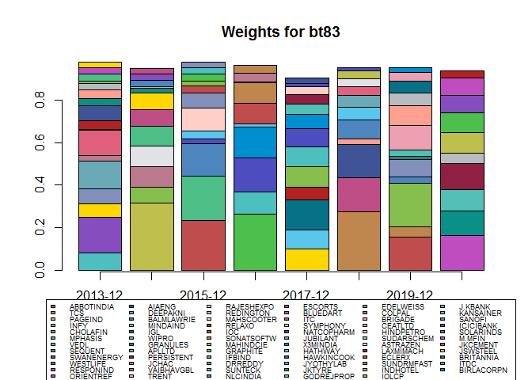

    ##                     ABBOTINDIA   TCS PAGEIND  INFY CHOLAFIN MPHASIS  VEDL
    ## 2015-12-24 05:30:00      0.234 0.000       0 0.000    0.000   0.208 0.000
    ## 2016-12-30 05:30:00      0.000 0.000       0 0.000    0.265   0.000 0.104
    ## 2017-12-29 05:30:00      0.000 0.000       0 0.000    0.000   0.000 0.000
    ## 2018-12-28 05:30:00      0.000 0.274       0 0.000    0.000   0.000 0.000
    ## 2019-12-27 05:30:00      0.155 0.049       0 0.206    0.000   0.000 0.000
    ## 2020-12-18 05:30:00      0.000 0.000       0 0.000    0.000   0.000 0.000
    ##                     SEQUENT SWANENERGY WESTLIFE RESPONIND ORIENTREF ASTRAL
    ## 2015-12-24 05:30:00   0.155      0.020        0     0.000     0.000  0.000
    ## 2016-12-30 05:30:00   0.000      0.159        0     0.000     0.000  0.000
    ## 2017-12-29 05:30:00   0.000      0.000        0     0.000     0.000  0.098
    ## 2018-12-28 05:30:00   0.000      0.000        0     0.000     0.163  0.000
    ## 2019-12-27 05:30:00   0.027      0.000        0     0.000     0.000  0.000
    ## 2020-12-18 05:30:00   0.000      0.000        0     0.164     0.000  0.000
    ##                     AIAENG DEEPAKNI BALMLAWRIE MINDAIND   IGL WIPRO GRANULES
    ## 2015-12-24 05:30:00  0.000    0.000      0.000    0.038 0.000     0    0.000
    ## 2016-12-30 05:30:00  0.000    0.000      0.145    0.014 0.000     0    0.000
    ## 2017-12-29 05:30:00  0.000    0.000      0.000    0.091 0.142     0    0.000
    ## 2018-12-28 05:30:00  0.157    0.000      0.000    0.000 0.000     0    0.000
    ## 2019-12-27 05:30:00  0.000    0.083      0.000    0.000 0.000     0    0.017
    ## 2020-12-18 05:30:00  0.000    0.000      0.000    0.000 0.000     0    0.114
    ##                     APLLTD PERSISTENT JCHAC VAIBHAVGBL TRENT LINDEINDIA
    ## 2015-12-24 05:30:00  0.000      0.000     0          0 0.000      0.000
    ## 2016-12-30 05:30:00  0.000      0.000     0          0 0.000      0.000
    ## 2017-12-29 05:30:00  0.000      0.000     0          0 0.000      0.000
    ## 2018-12-28 05:30:00  0.000      0.000     0          0 0.000      0.024
    ## 2019-12-27 05:30:00  0.029      0.000     0          0 0.118      0.093
    ## 2020-12-18 05:30:00  0.100      0.124     0          0 0.000      0.000
    ##                     RAJESHEXPO REDINGTON MAHSCOOTER RELAXO   IOC SONATSOFTW
    ## 2015-12-24 05:30:00       0.11     0.000          0  0.000 0.000      0.000
    ## 2016-12-30 05:30:00       0.00     0.000          0  0.000 0.099      0.098
    ## 2017-12-29 05:30:00       0.00     0.000          0  0.059 0.000      0.000
    ## 2018-12-28 05:30:00       0.00     0.000          0  0.000 0.000      0.000
    ## 2019-12-27 05:30:00       0.00     0.058          0  0.000 0.000      0.000
    ## 2020-12-18 05:30:00       0.00     0.048          0  0.000 0.000      0.000
    ##                     MAHINDCIE GRAPHITE IFBIND DRREDDY SUNTECK NLCINDIA
    ## 2015-12-24 05:30:00     0.000    0.000  0.000       0   0.000     0.00
    ## 2016-12-30 05:30:00     0.000    0.000  0.000       0   0.000     0.00
    ## 2017-12-29 05:30:00     0.000    0.097  0.002       0   0.091     0.00
    ## 2018-12-28 05:30:00     0.000    0.000  0.000       0   0.000     0.09
    ## 2019-12-27 05:30:00     0.000    0.000  0.000       0   0.000     0.00
    ## 2020-12-18 05:30:00     0.098    0.000  0.093       0   0.000     0.00
    ##                     MOTILALOFS ESCORTS BLUEDART ITC SYMPHONY NATCOPHARM
    ## 2015-12-24 05:30:00      0.000   0.000    0.000   0        0      0.000
    ## 2016-12-30 05:30:00      0.000   0.000    0.000   0        0      0.001
    ## 2017-12-29 05:30:00      0.087   0.000    0.000   0        0      0.000
    ## 2018-12-28 05:30:00      0.000   0.000    0.000   0        0      0.000
    ## 2019-12-27 05:30:00      0.000   0.000    0.000   0        0      0.000
    ## 2020-12-18 05:30:00      0.000   0.084    0.081   0        0      0.000
    ##                     JUBILANT X3MINDIA HATHWAY HAWKINCOOK JYOTHYLAB JKTYRE
    ## 2015-12-24 05:30:00    0.068    0.000   0.000      0.000     0.000      0
    ## 2016-12-30 05:30:00    0.000    0.000   0.000      0.000     0.000      0
    ## 2017-12-29 05:30:00    0.000    0.067   0.000      0.000     0.000      0
    ## 2018-12-28 05:30:00    0.000    0.000   0.058      0.000     0.057      0
    ## 2019-12-27 05:30:00    0.000    0.000   0.000      0.057     0.000      0
    ## 2020-12-18 05:30:00    0.000    0.000   0.000      0.000     0.000      0
    ##                     GODREJPROP  HSCL EDELWEISS COLPAL BRIGADE CEATLTD HINDPETRO
    ## 2015-12-24 05:30:00      0.000 0.000     0.000  0.000   0.000       0     0.000
    ## 2016-12-30 05:30:00      0.000 0.000     0.042  0.000   0.000       0     0.000
    ## 2017-12-29 05:30:00      0.048 0.045     0.000  0.000   0.000       0     0.039
    ## 2018-12-28 05:30:00      0.000 0.000     0.000  0.042   0.000       0     0.000
    ## 2019-12-27 05:30:00      0.000 0.000     0.000  0.000   0.041       0     0.000
    ## 2020-12-18 05:30:00      0.000 0.000     0.000  0.000   0.000       0     0.000
    ##                     SUDARSCHEM ASTRAZEN LAXMIMACH ECLERX SUNDRMFAST INDHOTEL
    ## 2015-12-24 05:30:00          0    0.000     0.000  0.035      0.000    0.000
    ## 2016-12-30 05:30:00          0    0.000     0.000  0.000      0.035    0.000
    ## 2017-12-29 05:30:00          0    0.000     0.000  0.000      0.000    0.000
    ## 2018-12-28 05:30:00          0    0.038     0.000  0.000      0.000    0.035
    ## 2019-12-27 05:30:00          0    0.000     0.000  0.000      0.000    0.000
    ## 2020-12-18 05:30:00          0    0.000     0.036  0.000      0.000    0.000
    ##                     IOLCP APLAPOLLO J.KBANK KANSAINER SANOFI ICICIBANK
    ## 2015-12-24 05:30:00 0.022     0.033       0     0.031      0     0.000
    ## 2016-12-30 05:30:00 0.000     0.000       0     0.000      0     0.000
    ## 2017-12-29 05:30:00 0.000     0.000       0     0.000      0     0.013
    ## 2018-12-28 05:30:00 0.000     0.000       0     0.000      0     0.016
    ## 2019-12-27 05:30:00 0.000     0.000       0     0.000      0     0.000
    ## 2020-12-18 05:30:00 0.000     0.000       0     0.000      0     0.000
    ##                     SOLARINDS M.MFIN JKCEMENT JSWSTEEL BRITANNIA  ITDC
    ## 2015-12-24 05:30:00         0      0        0        0     0.000 0.024
    ## 2016-12-30 05:30:00         0      0        0        0     0.000 0.000
    ## 2017-12-29 05:30:00         0      0        0        0     0.026 0.000
    ## 2018-12-28 05:30:00         0      0        0        0     0.000 0.000
    ## 2019-12-27 05:30:00         0      0        0        0     0.000 0.000
    ## 2020-12-18 05:30:00         0      0        0        0     0.000 0.000
    ##                     BIRLACORPN
    ## 2015-12-24 05:30:00      0.000
    ## 2016-12-30 05:30:00      0.000
    ## 2017-12-29 05:30:00      0.000
    ## 2018-12-28 05:30:00      0.000
    ## 2019-12-27 05:30:00      0.022
    ## 2020-12-18 05:30:00      0.000


    ##                     OMAXE RESPONIND JINDALSTEL WOCKPHARMA  SCI ADANIPOWER
    ## 2015-12-24 05:30:00 0.000      0.00          0      0.000 0.00      0.000
    ## 2016-12-30 05:30:00 0.000      0.00          0      0.671 0.00      0.000
    ## 2017-12-29 05:30:00 0.000      0.73          0      0.000 0.00      0.000
    ## 2018-12-28 05:30:00 0.000      0.00          0      0.000 0.00      0.612
    ## 2019-12-27 05:30:00 0.000      0.00          0      0.000 0.65      0.000
    ## 2020-12-18 05:30:00 0.846      0.00          0      0.000 0.00      0.000
    ##                     VAIBHAVGBL RAJESHEXPO  KSCL ITDC   JSL HSCL TATAMETALI
    ## 2015-12-24 05:30:00          0      0.506 0.494    0 0.000 0.00      0.000
    ## 2016-12-30 05:30:00          0      0.000 0.000    0 0.000 0.00      0.329
    ## 2017-12-29 05:30:00          0      0.000 0.000    0 0.000 0.00      0.000
    ## 2018-12-28 05:30:00          0      0.000 0.000    0 0.388 0.00      0.000
    ## 2019-12-27 05:30:00          0      0.000 0.000    0 0.000 0.35      0.000
    ## 2020-12-18 05:30:00          0      0.000 0.000    0 0.000 0.00      0.000
    ##                     IFBIND  HEG TANLA
    ## 2015-12-24 05:30:00      0 0.00 0.000
    ## 2016-12-30 05:30:00      0 0.00 0.000
    ## 2017-12-29 05:30:00      0 0.27 0.000
    ## 2018-12-28 05:30:00      0 0.00 0.000
    ## 2019-12-27 05:30:00      0 0.00 0.000
    ## 2020-12-18 05:30:00      0 0.00 0.154


    ##                     ABBOTINDIA   TCS PAGEIND  INFY CHOLAFIN MPHASIS  VEDL
    ## 2015-12-24 05:30:00      0.234 0.000       0 0.000    0.000   0.208 0.000
    ## 2016-12-30 05:30:00      0.000 0.000       0 0.000    0.265   0.000 0.104
    ## 2017-12-29 05:30:00      0.000 0.000       0 0.000    0.000   0.000 0.000
    ## 2018-12-28 05:30:00      0.000 0.274       0 0.000    0.000   0.000 0.000
    ## 2019-12-27 05:30:00      0.155 0.049       0 0.206    0.000   0.000 0.000
    ## 2020-12-18 05:30:00      0.000 0.000       0 0.000    0.000   0.000 0.000
    ##                     SEQUENT SWANENERGY WESTLIFE RESPONIND ORIENTREF ASTRAL
    ## 2015-12-24 05:30:00   0.155      0.020        0     0.000     0.000  0.000
    ## 2016-12-30 05:30:00   0.000      0.159        0     0.000     0.000  0.000
    ## 2017-12-29 05:30:00   0.000      0.000        0     0.000     0.000  0.098
    ## 2018-12-28 05:30:00   0.000      0.000        0     0.000     0.163  0.000
    ## 2019-12-27 05:30:00   0.027      0.000        0     0.000     0.000  0.000
    ## 2020-12-18 05:30:00   0.000      0.000        0     0.164     0.000  0.000
    ##                     AIAENG DEEPAKNI BALMLAWRIE MINDAIND   IGL WIPRO GRANULES
    ## 2015-12-24 05:30:00  0.000    0.000      0.000    0.038 0.000     0    0.000
    ## 2016-12-30 05:30:00  0.000    0.000      0.145    0.014 0.000     0    0.000
    ## 2017-12-29 05:30:00  0.000    0.000      0.000    0.091 0.142     0    0.000
    ## 2018-12-28 05:30:00  0.157    0.000      0.000    0.000 0.000     0    0.000
    ## 2019-12-27 05:30:00  0.000    0.083      0.000    0.000 0.000     0    0.017
    ## 2020-12-18 05:30:00  0.000    0.000      0.000    0.000 0.000     0    0.114
    ##                     APLLTD PERSISTENT JCHAC VAIBHAVGBL TRENT LINDEINDIA
    ## 2015-12-24 05:30:00  0.000      0.000     0          0 0.000      0.000
    ## 2016-12-30 05:30:00  0.000      0.000     0          0 0.000      0.000
    ## 2017-12-29 05:30:00  0.000      0.000     0          0 0.000      0.000
    ## 2018-12-28 05:30:00  0.000      0.000     0          0 0.000      0.024
    ## 2019-12-27 05:30:00  0.029      0.000     0          0 0.118      0.093
    ## 2020-12-18 05:30:00  0.100      0.124     0          0 0.000      0.000
    ##                     RAJESHEXPO REDINGTON MAHSCOOTER RELAXO   IOC SONATSOFTW
    ## 2015-12-24 05:30:00       0.11     0.000          0  0.000 0.000      0.000
    ## 2016-12-30 05:30:00       0.00     0.000          0  0.000 0.099      0.098
    ## 2017-12-29 05:30:00       0.00     0.000          0  0.059 0.000      0.000
    ## 2018-12-28 05:30:00       0.00     0.000          0  0.000 0.000      0.000
    ## 2019-12-27 05:30:00       0.00     0.058          0  0.000 0.000      0.000
    ## 2020-12-18 05:30:00       0.00     0.048          0  0.000 0.000      0.000
    ##                     MAHINDCIE GRAPHITE IFBIND DRREDDY SUNTECK NLCINDIA
    ## 2015-12-24 05:30:00     0.000    0.000  0.000       0   0.000     0.00
    ## 2016-12-30 05:30:00     0.000    0.000  0.000       0   0.000     0.00
    ## 2017-12-29 05:30:00     0.000    0.097  0.002       0   0.091     0.00
    ## 2018-12-28 05:30:00     0.000    0.000  0.000       0   0.000     0.09
    ## 2019-12-27 05:30:00     0.000    0.000  0.000       0   0.000     0.00
    ## 2020-12-18 05:30:00     0.098    0.000  0.093       0   0.000     0.00
    ##                     MOTILALOFS ESCORTS BLUEDART ITC SYMPHONY NATCOPHARM
    ## 2015-12-24 05:30:00      0.000   0.000    0.000   0        0      0.000
    ## 2016-12-30 05:30:00      0.000   0.000    0.000   0        0      0.001
    ## 2017-12-29 05:30:00      0.087   0.000    0.000   0        0      0.000
    ## 2018-12-28 05:30:00      0.000   0.000    0.000   0        0      0.000
    ## 2019-12-27 05:30:00      0.000   0.000    0.000   0        0      0.000
    ## 2020-12-18 05:30:00      0.000   0.084    0.081   0        0      0.000
    ##                     JUBILANT X3MINDIA HATHWAY HAWKINCOOK JYOTHYLAB JKTYRE
    ## 2015-12-24 05:30:00    0.068    0.000   0.000      0.000     0.000      0
    ## 2016-12-30 05:30:00    0.000    0.000   0.000      0.000     0.000      0
    ## 2017-12-29 05:30:00    0.000    0.067   0.000      0.000     0.000      0
    ## 2018-12-28 05:30:00    0.000    0.000   0.058      0.000     0.057      0
    ## 2019-12-27 05:30:00    0.000    0.000   0.000      0.057     0.000      0
    ## 2020-12-18 05:30:00    0.000    0.000   0.000      0.000     0.000      0
    ##                     GODREJPROP  HSCL EDELWEISS COLPAL BRIGADE CEATLTD HINDPETRO
    ## 2015-12-24 05:30:00      0.000 0.000     0.000  0.000   0.000       0     0.000
    ## 2016-12-30 05:30:00      0.000 0.000     0.042  0.000   0.000       0     0.000
    ## 2017-12-29 05:30:00      0.048 0.045     0.000  0.000   0.000       0     0.039
    ## 2018-12-28 05:30:00      0.000 0.000     0.000  0.042   0.000       0     0.000
    ## 2019-12-27 05:30:00      0.000 0.000     0.000  0.000   0.041       0     0.000
    ## 2020-12-18 05:30:00      0.000 0.000     0.000  0.000   0.000       0     0.000
    ##                     SUDARSCHEM ASTRAZEN LAXMIMACH ECLERX SUNDRMFAST INDHOTEL
    ## 2015-12-24 05:30:00          0    0.000     0.000  0.035      0.000    0.000
    ## 2016-12-30 05:30:00          0    0.000     0.000  0.000      0.035    0.000
    ## 2017-12-29 05:30:00          0    0.000     0.000  0.000      0.000    0.000
    ## 2018-12-28 05:30:00          0    0.038     0.000  0.000      0.000    0.035
    ## 2019-12-27 05:30:00          0    0.000     0.000  0.000      0.000    0.000
    ## 2020-12-18 05:30:00          0    0.000     0.036  0.000      0.000    0.000
    ##                     IOLCP APLAPOLLO J.KBANK KANSAINER SANOFI ICICIBANK
    ## 2015-12-24 05:30:00 0.022     0.033       0     0.031      0     0.000
    ## 2016-12-30 05:30:00 0.000     0.000       0     0.000      0     0.000
    ## 2017-12-29 05:30:00 0.000     0.000       0     0.000      0     0.013
    ## 2018-12-28 05:30:00 0.000     0.000       0     0.000      0     0.016
    ## 2019-12-27 05:30:00 0.000     0.000       0     0.000      0     0.000
    ## 2020-12-18 05:30:00 0.000     0.000       0     0.000      0     0.000
    ##                     SOLARINDS M.MFIN JKCEMENT JSWSTEEL BRITANNIA  ITDC
    ## 2015-12-24 05:30:00         0      0        0        0     0.000 0.024
    ## 2016-12-30 05:30:00         0      0        0        0     0.000 0.000
    ## 2017-12-29 05:30:00         0      0        0        0     0.026 0.000
    ## 2018-12-28 05:30:00         0      0        0        0     0.000 0.000
    ## 2019-12-27 05:30:00         0      0        0        0     0.000 0.000
    ## 2020-12-18 05:30:00         0      0        0        0     0.000 0.000
    ##                     BIRLACORPN
    ## 2015-12-24 05:30:00      0.000
    ## 2016-12-30 05:30:00      0.000
    ## 2017-12-29 05:30:00      0.000
    ## 2018-12-28 05:30:00      0.000
    ## 2019-12-27 05:30:00      0.022
    ## 2020-12-18 05:30:00      0.000


    ##                     ABBOTINDIA   TCS PAGEIND  INFY CHOLAFIN MPHASIS  VEDL
    ## 2015-12-24 05:30:00      0.234 0.000       0 0.000    0.000   0.208 0.000
    ## 2016-12-30 05:30:00      0.000 0.000       0 0.000    0.265   0.000 0.104
    ## 2017-12-29 05:30:00      0.000 0.000       0 0.000    0.000   0.000 0.000
    ## 2018-12-28 05:30:00      0.000 0.274       0 0.000    0.000   0.000 0.000
    ## 2019-12-27 05:30:00      0.155 0.049       0 0.206    0.000   0.000 0.000
    ## 2020-12-18 05:30:00      0.000 0.000       0 0.000    0.000   0.000 0.000
    ##                     SEQUENT SWANENERGY WESTLIFE RESPONIND ORIENTREF ASTRAL
    ## 2015-12-24 05:30:00   0.155      0.020        0     0.000     0.000  0.000
    ## 2016-12-30 05:30:00   0.000      0.159        0     0.000     0.000  0.000
    ## 2017-12-29 05:30:00   0.000      0.000        0     0.000     0.000  0.098
    ## 2018-12-28 05:30:00   0.000      0.000        0     0.000     0.163  0.000
    ## 2019-12-27 05:30:00   0.027      0.000        0     0.000     0.000  0.000
    ## 2020-12-18 05:30:00   0.000      0.000        0     0.164     0.000  0.000
    ##                     AIAENG DEEPAKNI BALMLAWRIE MINDAIND   IGL WIPRO GRANULES
    ## 2015-12-24 05:30:00  0.000    0.000      0.000    0.038 0.000     0    0.000
    ## 2016-12-30 05:30:00  0.000    0.000      0.145    0.014 0.000     0    0.000
    ## 2017-12-29 05:30:00  0.000    0.000      0.000    0.091 0.142     0    0.000
    ## 2018-12-28 05:30:00  0.157    0.000      0.000    0.000 0.000     0    0.000
    ## 2019-12-27 05:30:00  0.000    0.083      0.000    0.000 0.000     0    0.017
    ## 2020-12-18 05:30:00  0.000    0.000      0.000    0.000 0.000     0    0.114
    ##                     APLLTD PERSISTENT JCHAC VAIBHAVGBL TRENT LINDEINDIA
    ## 2015-12-24 05:30:00  0.000      0.000     0          0 0.000      0.000
    ## 2016-12-30 05:30:00  0.000      0.000     0          0 0.000      0.000
    ## 2017-12-29 05:30:00  0.000      0.000     0          0 0.000      0.000
    ## 2018-12-28 05:30:00  0.000      0.000     0          0 0.000      0.024
    ## 2019-12-27 05:30:00  0.029      0.000     0          0 0.118      0.093
    ## 2020-12-18 05:30:00  0.100      0.124     0          0 0.000      0.000
    ##                     RAJESHEXPO REDINGTON MAHSCOOTER RELAXO   IOC SONATSOFTW
    ## 2015-12-24 05:30:00       0.11     0.000          0  0.000 0.000      0.000
    ## 2016-12-30 05:30:00       0.00     0.000          0  0.000 0.099      0.098
    ## 2017-12-29 05:30:00       0.00     0.000          0  0.059 0.000      0.000
    ## 2018-12-28 05:30:00       0.00     0.000          0  0.000 0.000      0.000
    ## 2019-12-27 05:30:00       0.00     0.058          0  0.000 0.000      0.000
    ## 2020-12-18 05:30:00       0.00     0.048          0  0.000 0.000      0.000
    ##                     MAHINDCIE GRAPHITE IFBIND DRREDDY SUNTECK NLCINDIA
    ## 2015-12-24 05:30:00     0.000    0.000  0.000       0   0.000     0.00
    ## 2016-12-30 05:30:00     0.000    0.000  0.000       0   0.000     0.00
    ## 2017-12-29 05:30:00     0.000    0.097  0.002       0   0.091     0.00
    ## 2018-12-28 05:30:00     0.000    0.000  0.000       0   0.000     0.09
    ## 2019-12-27 05:30:00     0.000    0.000  0.000       0   0.000     0.00
    ## 2020-12-18 05:30:00     0.098    0.000  0.093       0   0.000     0.00
    ##                     MOTILALOFS ESCORTS BLUEDART ITC SYMPHONY NATCOPHARM
    ## 2015-12-24 05:30:00      0.000   0.000    0.000   0        0      0.000
    ## 2016-12-30 05:30:00      0.000   0.000    0.000   0        0      0.001
    ## 2017-12-29 05:30:00      0.087   0.000    0.000   0        0      0.000
    ## 2018-12-28 05:30:00      0.000   0.000    0.000   0        0      0.000
    ## 2019-12-27 05:30:00      0.000   0.000    0.000   0        0      0.000
    ## 2020-12-18 05:30:00      0.000   0.084    0.081   0        0      0.000
    ##                     JUBILANT X3MINDIA HATHWAY HAWKINCOOK JYOTHYLAB JKTYRE
    ## 2015-12-24 05:30:00    0.068    0.000   0.000      0.000     0.000      0
    ## 2016-12-30 05:30:00    0.000    0.000   0.000      0.000     0.000      0
    ## 2017-12-29 05:30:00    0.000    0.067   0.000      0.000     0.000      0
    ## 2018-12-28 05:30:00    0.000    0.000   0.058      0.000     0.057      0
    ## 2019-12-27 05:30:00    0.000    0.000   0.000      0.057     0.000      0
    ## 2020-12-18 05:30:00    0.000    0.000   0.000      0.000     0.000      0
    ##                     GODREJPROP  HSCL EDELWEISS COLPAL BRIGADE CEATLTD HINDPETRO
    ## 2015-12-24 05:30:00      0.000 0.000     0.000  0.000   0.000       0     0.000
    ## 2016-12-30 05:30:00      0.000 0.000     0.042  0.000   0.000       0     0.000
    ## 2017-12-29 05:30:00      0.048 0.045     0.000  0.000   0.000       0     0.039
    ## 2018-12-28 05:30:00      0.000 0.000     0.000  0.042   0.000       0     0.000
    ## 2019-12-27 05:30:00      0.000 0.000     0.000  0.000   0.041       0     0.000
    ## 2020-12-18 05:30:00      0.000 0.000     0.000  0.000   0.000       0     0.000
    ##                     SUDARSCHEM ASTRAZEN LAXMIMACH ECLERX SUNDRMFAST INDHOTEL
    ## 2015-12-24 05:30:00          0    0.000     0.000  0.035      0.000    0.000
    ## 2016-12-30 05:30:00          0    0.000     0.000  0.000      0.035    0.000
    ## 2017-12-29 05:30:00          0    0.000     0.000  0.000      0.000    0.000
    ## 2018-12-28 05:30:00          0    0.038     0.000  0.000      0.000    0.035
    ## 2019-12-27 05:30:00          0    0.000     0.000  0.000      0.000    0.000
    ## 2020-12-18 05:30:00          0    0.000     0.036  0.000      0.000    0.000
    ##                     IOLCP APLAPOLLO J.KBANK KANSAINER SANOFI ICICIBANK
    ## 2015-12-24 05:30:00 0.022     0.033       0     0.031      0     0.000
    ## 2016-12-30 05:30:00 0.000     0.000       0     0.000      0     0.000
    ## 2017-12-29 05:30:00 0.000     0.000       0     0.000      0     0.013
    ## 2018-12-28 05:30:00 0.000     0.000       0     0.000      0     0.016
    ## 2019-12-27 05:30:00 0.000     0.000       0     0.000      0     0.000
    ## 2020-12-18 05:30:00 0.000     0.000       0     0.000      0     0.000
    ##                     SOLARINDS M.MFIN JKCEMENT JSWSTEEL BRITANNIA  ITDC
    ## 2015-12-24 05:30:00         0      0        0        0     0.000 0.024
    ## 2016-12-30 05:30:00         0      0        0        0     0.000 0.000
    ## 2017-12-29 05:30:00         0      0        0        0     0.026 0.000
    ## 2018-12-28 05:30:00         0      0        0        0     0.000 0.000
    ## 2019-12-27 05:30:00         0      0        0        0     0.000 0.000
    ## 2020-12-18 05:30:00         0      0        0        0     0.000 0.000
    ##                     BIRLACORPN
    ## 2015-12-24 05:30:00      0.000
    ## 2016-12-30 05:30:00      0.000
    ## 2017-12-29 05:30:00      0.000
    ## 2018-12-28 05:30:00      0.000
    ## 2019-12-27 05:30:00      0.022
    ## 2020-12-18 05:30:00      0.000

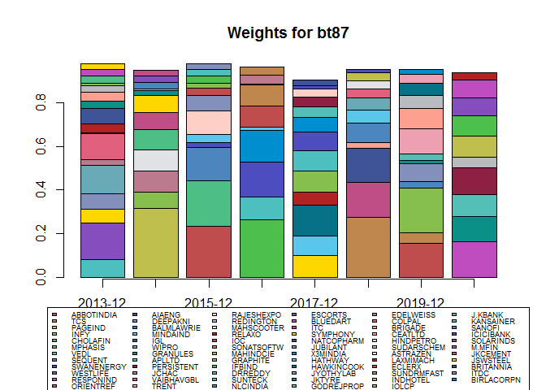

    ##                     ABBOTINDIA   TCS PAGEIND  INFY CHOLAFIN MPHASIS  VEDL
    ## 2015-12-24 05:30:00      0.234 0.000       0 0.000    0.000   0.208 0.000
    ## 2016-12-30 05:30:00      0.000 0.000       0 0.000    0.265   0.000 0.104
    ## 2017-12-29 05:30:00      0.000 0.000       0 0.000    0.000   0.000 0.000
    ## 2018-12-28 05:30:00      0.000 0.274       0 0.000    0.000   0.000 0.000
    ## 2019-12-27 05:30:00      0.155 0.049       0 0.206    0.000   0.000 0.000
    ## 2020-12-18 05:30:00      0.000 0.000       0 0.000    0.000   0.000 0.000
    ##                     SEQUENT SWANENERGY WESTLIFE RESPONIND ORIENTREF ASTRAL
    ## 2015-12-24 05:30:00   0.155      0.020        0     0.000     0.000  0.000
    ## 2016-12-30 05:30:00   0.000      0.159        0     0.000     0.000  0.000
    ## 2017-12-29 05:30:00   0.000      0.000        0     0.000     0.000  0.098
    ## 2018-12-28 05:30:00   0.000      0.000        0     0.000     0.163  0.000
    ## 2019-12-27 05:30:00   0.027      0.000        0     0.000     0.000  0.000
    ## 2020-12-18 05:30:00   0.000      0.000        0     0.164     0.000  0.000
    ##                     AIAENG DEEPAKNI BALMLAWRIE MINDAIND   IGL WIPRO GRANULES
    ## 2015-12-24 05:30:00  0.000    0.000      0.000    0.038 0.000     0    0.000
    ## 2016-12-30 05:30:00  0.000    0.000      0.145    0.014 0.000     0    0.000
    ## 2017-12-29 05:30:00  0.000    0.000      0.000    0.091 0.142     0    0.000
    ## 2018-12-28 05:30:00  0.157    0.000      0.000    0.000 0.000     0    0.000
    ## 2019-12-27 05:30:00  0.000    0.083      0.000    0.000 0.000     0    0.017
    ## 2020-12-18 05:30:00  0.000    0.000      0.000    0.000 0.000     0    0.114
    ##                     APLLTD PERSISTENT JCHAC VAIBHAVGBL TRENT LINDEINDIA
    ## 2015-12-24 05:30:00  0.000      0.000     0          0 0.000      0.000
    ## 2016-12-30 05:30:00  0.000      0.000     0          0 0.000      0.000
    ## 2017-12-29 05:30:00  0.000      0.000     0          0 0.000      0.000
    ## 2018-12-28 05:30:00  0.000      0.000     0          0 0.000      0.024
    ## 2019-12-27 05:30:00  0.029      0.000     0          0 0.118      0.093
    ## 2020-12-18 05:30:00  0.100      0.124     0          0 0.000      0.000
    ##                     RAJESHEXPO REDINGTON MAHSCOOTER RELAXO   IOC SONATSOFTW
    ## 2015-12-24 05:30:00       0.11     0.000          0  0.000 0.000      0.000
    ## 2016-12-30 05:30:00       0.00     0.000          0  0.000 0.099      0.098
    ## 2017-12-29 05:30:00       0.00     0.000          0  0.059 0.000      0.000
    ## 2018-12-28 05:30:00       0.00     0.000          0  0.000 0.000      0.000
    ## 2019-12-27 05:30:00       0.00     0.058          0  0.000 0.000      0.000
    ## 2020-12-18 05:30:00       0.00     0.048          0  0.000 0.000      0.000
    ##                     MAHINDCIE GRAPHITE IFBIND DRREDDY SUNTECK NLCINDIA
    ## 2015-12-24 05:30:00     0.000    0.000  0.000       0   0.000     0.00
    ## 2016-12-30 05:30:00     0.000    0.000  0.000       0   0.000     0.00
    ## 2017-12-29 05:30:00     0.000    0.097  0.002       0   0.091     0.00
    ## 2018-12-28 05:30:00     0.000    0.000  0.000       0   0.000     0.09
    ## 2019-12-27 05:30:00     0.000    0.000  0.000       0   0.000     0.00
    ## 2020-12-18 05:30:00     0.098    0.000  0.093       0   0.000     0.00
    ##                     MOTILALOFS ESCORTS BLUEDART ITC SYMPHONY NATCOPHARM
    ## 2015-12-24 05:30:00      0.000   0.000    0.000   0        0      0.000
    ## 2016-12-30 05:30:00      0.000   0.000    0.000   0        0      0.001
    ## 2017-12-29 05:30:00      0.087   0.000    0.000   0        0      0.000
    ## 2018-12-28 05:30:00      0.000   0.000    0.000   0        0      0.000
    ## 2019-12-27 05:30:00      0.000   0.000    0.000   0        0      0.000
    ## 2020-12-18 05:30:00      0.000   0.084    0.081   0        0      0.000
    ##                     JUBILANT X3MINDIA HATHWAY HAWKINCOOK JYOTHYLAB JKTYRE
    ## 2015-12-24 05:30:00    0.068    0.000   0.000      0.000     0.000      0
    ## 2016-12-30 05:30:00    0.000    0.000   0.000      0.000     0.000      0
    ## 2017-12-29 05:30:00    0.000    0.067   0.000      0.000     0.000      0
    ## 2018-12-28 05:30:00    0.000    0.000   0.058      0.000     0.057      0
    ## 2019-12-27 05:30:00    0.000    0.000   0.000      0.057     0.000      0
    ## 2020-12-18 05:30:00    0.000    0.000   0.000      0.000     0.000      0
    ##                     GODREJPROP  HSCL EDELWEISS COLPAL BRIGADE CEATLTD HINDPETRO
    ## 2015-12-24 05:30:00      0.000 0.000     0.000  0.000   0.000       0     0.000
    ## 2016-12-30 05:30:00      0.000 0.000     0.042  0.000   0.000       0     0.000
    ## 2017-12-29 05:30:00      0.048 0.045     0.000  0.000   0.000       0     0.039
    ## 2018-12-28 05:30:00      0.000 0.000     0.000  0.042   0.000       0     0.000
    ## 2019-12-27 05:30:00      0.000 0.000     0.000  0.000   0.041       0     0.000
    ## 2020-12-18 05:30:00      0.000 0.000     0.000  0.000   0.000       0     0.000
    ##                     SUDARSCHEM ASTRAZEN LAXMIMACH ECLERX SUNDRMFAST INDHOTEL
    ## 2015-12-24 05:30:00          0    0.000     0.000  0.035      0.000    0.000
    ## 2016-12-30 05:30:00          0    0.000     0.000  0.000      0.035    0.000
    ## 2017-12-29 05:30:00          0    0.000     0.000  0.000      0.000    0.000
    ## 2018-12-28 05:30:00          0    0.038     0.000  0.000      0.000    0.035
    ## 2019-12-27 05:30:00          0    0.000     0.000  0.000      0.000    0.000
    ## 2020-12-18 05:30:00          0    0.000     0.036  0.000      0.000    0.000
    ##                     IOLCP APLAPOLLO J.KBANK KANSAINER SANOFI ICICIBANK
    ## 2015-12-24 05:30:00 0.022     0.033       0     0.031      0     0.000
    ## 2016-12-30 05:30:00 0.000     0.000       0     0.000      0     0.000
    ## 2017-12-29 05:30:00 0.000     0.000       0     0.000      0     0.013
    ## 2018-12-28 05:30:00 0.000     0.000       0     0.000      0     0.016
    ## 2019-12-27 05:30:00 0.000     0.000       0     0.000      0     0.000
    ## 2020-12-18 05:30:00 0.000     0.000       0     0.000      0     0.000
    ##                     SOLARINDS M.MFIN JKCEMENT JSWSTEEL BRITANNIA  ITDC
    ## 2015-12-24 05:30:00         0      0        0        0     0.000 0.024
    ## 2016-12-30 05:30:00         0      0        0        0     0.000 0.000
    ## 2017-12-29 05:30:00         0      0        0        0     0.026 0.000
    ## 2018-12-28 05:30:00         0      0        0        0     0.000 0.000
    ## 2019-12-27 05:30:00         0      0        0        0     0.000 0.000
    ## 2020-12-18 05:30:00         0      0        0        0     0.000 0.000
    ##                     BIRLACORPN
    ## 2015-12-24 05:30:00      0.000
    ## 2016-12-30 05:30:00      0.000
    ## 2017-12-29 05:30:00      0.000
    ## 2018-12-28 05:30:00      0.000
    ## 2019-12-27 05:30:00      0.022
    ## 2020-12-18 05:30:00      0.000

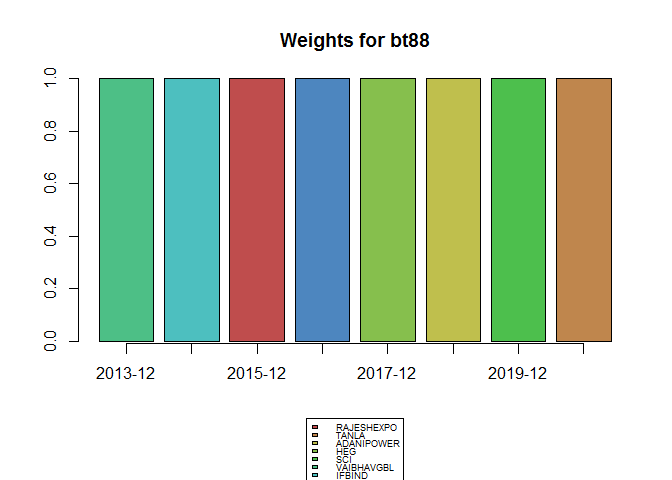

    ##                     RAJESHEXPO TANLA ADANIPOWER HEG SCI VAIBHAVGBL IFBIND
    ## 2015-12-24 05:30:00          1     0          0   0   0          0      0
    ## 2016-12-30 05:30:00          0     0          0   0   0          0      0
    ## 2017-12-29 05:30:00          0     0          0   1   0          0      0
    ## 2018-12-28 05:30:00          0     0          1   0   0          0      0
    ## 2019-12-27 05:30:00          0     0          0   0   1          0      0
    ## 2020-12-18 05:30:00          0     1          0   0   0          0      0
    ##                     TATAMETALI
    ## 2015-12-24 05:30:00          0
    ## 2016-12-30 05:30:00          1
    ## 2017-12-29 05:30:00          0
    ## 2018-12-28 05:30:00          0
    ## 2019-12-27 05:30:00          0
    ## 2020-12-18 05:30:00          0


    ##                     ABBOTINDIA   TCS PAGEIND  INFY CHOLAFIN MPHASIS  VEDL
    ## 2015-12-24 05:30:00      0.234 0.000       0 0.000    0.000   0.208 0.000
    ## 2016-12-30 05:30:00      0.000 0.000       0 0.000    0.265   0.000 0.104
    ## 2017-12-29 05:30:00      0.000 0.000       0 0.000    0.000   0.000 0.000
    ## 2018-12-28 05:30:00      0.000 0.274       0 0.000    0.000   0.000 0.000
    ## 2019-12-27 05:30:00      0.155 0.049       0 0.206    0.000   0.000 0.000
    ## 2020-12-18 05:30:00      0.000 0.000       0 0.000    0.000   0.000 0.000
    ##                     SEQUENT SWANENERGY WESTLIFE RESPONIND ORIENTREF ASTRAL
    ## 2015-12-24 05:30:00   0.155      0.020        0     0.000     0.000  0.000
    ## 2016-12-30 05:30:00   0.000      0.159        0     0.000     0.000  0.000
    ## 2017-12-29 05:30:00   0.000      0.000        0     0.000     0.000  0.098
    ## 2018-12-28 05:30:00   0.000      0.000        0     0.000     0.163  0.000
    ## 2019-12-27 05:30:00   0.027      0.000        0     0.000     0.000  0.000
    ## 2020-12-18 05:30:00   0.000      0.000        0     0.164     0.000  0.000
    ##                     AIAENG DEEPAKNI BALMLAWRIE MINDAIND   IGL WIPRO GRANULES
    ## 2015-12-24 05:30:00  0.000    0.000      0.000    0.038 0.000     0    0.000
    ## 2016-12-30 05:30:00  0.000    0.000      0.145    0.014 0.000     0    0.000
    ## 2017-12-29 05:30:00  0.000    0.000      0.000    0.091 0.142     0    0.000
    ## 2018-12-28 05:30:00  0.157    0.000      0.000    0.000 0.000     0    0.000
    ## 2019-12-27 05:30:00  0.000    0.083      0.000    0.000 0.000     0    0.017
    ## 2020-12-18 05:30:00  0.000    0.000      0.000    0.000 0.000     0    0.114
    ##                     APLLTD PERSISTENT JCHAC VAIBHAVGBL TRENT LINDEINDIA
    ## 2015-12-24 05:30:00  0.000      0.000     0          0 0.000      0.000
    ## 2016-12-30 05:30:00  0.000      0.000     0          0 0.000      0.000
    ## 2017-12-29 05:30:00  0.000      0.000     0          0 0.000      0.000
    ## 2018-12-28 05:30:00  0.000      0.000     0          0 0.000      0.024
    ## 2019-12-27 05:30:00  0.029      0.000     0          0 0.118      0.093
    ## 2020-12-18 05:30:00  0.100      0.124     0          0 0.000      0.000
    ##                     RAJESHEXPO REDINGTON MAHSCOOTER RELAXO   IOC SONATSOFTW
    ## 2015-12-24 05:30:00       0.11     0.000          0  0.000 0.000      0.000
    ## 2016-12-30 05:30:00       0.00     0.000          0  0.000 0.099      0.098
    ## 2017-12-29 05:30:00       0.00     0.000          0  0.059 0.000      0.000
    ## 2018-12-28 05:30:00       0.00     0.000          0  0.000 0.000      0.000
    ## 2019-12-27 05:30:00       0.00     0.058          0  0.000 0.000      0.000
    ## 2020-12-18 05:30:00       0.00     0.048          0  0.000 0.000      0.000
    ##                     MAHINDCIE GRAPHITE IFBIND DRREDDY SUNTECK NLCINDIA
    ## 2015-12-24 05:30:00     0.000    0.000  0.000       0   0.000     0.00
    ## 2016-12-30 05:30:00     0.000    0.000  0.000       0   0.000     0.00
    ## 2017-12-29 05:30:00     0.000    0.097  0.002       0   0.091     0.00
    ## 2018-12-28 05:30:00     0.000    0.000  0.000       0   0.000     0.09
    ## 2019-12-27 05:30:00     0.000    0.000  0.000       0   0.000     0.00
    ## 2020-12-18 05:30:00     0.098    0.000  0.093       0   0.000     0.00
    ##                     MOTILALOFS ESCORTS BLUEDART ITC SYMPHONY NATCOPHARM
    ## 2015-12-24 05:30:00      0.000   0.000    0.000   0        0      0.000
    ## 2016-12-30 05:30:00      0.000   0.000    0.000   0        0      0.001
    ## 2017-12-29 05:30:00      0.087   0.000    0.000   0        0      0.000
    ## 2018-12-28 05:30:00      0.000   0.000    0.000   0        0      0.000
    ## 2019-12-27 05:30:00      0.000   0.000    0.000   0        0      0.000
    ## 2020-12-18 05:30:00      0.000   0.084    0.081   0        0      0.000
    ##                     JUBILANT X3MINDIA HATHWAY HAWKINCOOK JYOTHYLAB JKTYRE
    ## 2015-12-24 05:30:00    0.068    0.000   0.000      0.000     0.000      0
    ## 2016-12-30 05:30:00    0.000    0.000   0.000      0.000     0.000      0
    ## 2017-12-29 05:30:00    0.000    0.067   0.000      0.000     0.000      0
    ## 2018-12-28 05:30:00    0.000    0.000   0.058      0.000     0.057      0
    ## 2019-12-27 05:30:00    0.000    0.000   0.000      0.057     0.000      0
    ## 2020-12-18 05:30:00    0.000    0.000   0.000      0.000     0.000      0
    ##                     GODREJPROP  HSCL EDELWEISS COLPAL BRIGADE CEATLTD HINDPETRO
    ## 2015-12-24 05:30:00      0.000 0.000     0.000  0.000   0.000       0     0.000
    ## 2016-12-30 05:30:00      0.000 0.000     0.042  0.000   0.000       0     0.000
    ## 2017-12-29 05:30:00      0.048 0.045     0.000  0.000   0.000       0     0.039
    ## 2018-12-28 05:30:00      0.000 0.000     0.000  0.042   0.000       0     0.000
    ## 2019-12-27 05:30:00      0.000 0.000     0.000  0.000   0.041       0     0.000
    ## 2020-12-18 05:30:00      0.000 0.000     0.000  0.000   0.000       0     0.000
    ##                     SUDARSCHEM ASTRAZEN LAXMIMACH ECLERX SUNDRMFAST INDHOTEL
    ## 2015-12-24 05:30:00          0    0.000     0.000  0.035      0.000    0.000
    ## 2016-12-30 05:30:00          0    0.000     0.000  0.000      0.035    0.000
    ## 2017-12-29 05:30:00          0    0.000     0.000  0.000      0.000    0.000
    ## 2018-12-28 05:30:00          0    0.038     0.000  0.000      0.000    0.035
    ## 2019-12-27 05:30:00          0    0.000     0.000  0.000      0.000    0.000
    ## 2020-12-18 05:30:00          0    0.000     0.036  0.000      0.000    0.000
    ##                     IOLCP APLAPOLLO J.KBANK KANSAINER SANOFI ICICIBANK
    ## 2015-12-24 05:30:00 0.022     0.033       0     0.031      0     0.000
    ## 2016-12-30 05:30:00 0.000     0.000       0     0.000      0     0.000
    ## 2017-12-29 05:30:00 0.000     0.000       0     0.000      0     0.013
    ## 2018-12-28 05:30:00 0.000     0.000       0     0.000      0     0.016
    ## 2019-12-27 05:30:00 0.000     0.000       0     0.000      0     0.000
    ## 2020-12-18 05:30:00 0.000     0.000       0     0.000      0     0.000
    ##                     SOLARINDS M.MFIN JKCEMENT JSWSTEEL BRITANNIA  ITDC
    ## 2015-12-24 05:30:00         0      0        0        0     0.000 0.024
    ## 2016-12-30 05:30:00         0      0        0        0     0.000 0.000
    ## 2017-12-29 05:30:00         0      0        0        0     0.026 0.000
    ## 2018-12-28 05:30:00         0      0        0        0     0.000 0.000
    ## 2019-12-27 05:30:00         0      0        0        0     0.000 0.000
    ## 2020-12-18 05:30:00         0      0        0        0     0.000 0.000
    ##                     BIRLACORPN
    ## 2015-12-24 05:30:00      0.000
    ## 2016-12-30 05:30:00      0.000
    ## 2017-12-29 05:30:00      0.000
    ## 2018-12-28 05:30:00      0.000
    ## 2019-12-27 05:30:00      0.022
    ## 2020-12-18 05:30:00      0.000


    ##                     ABBOTINDIA   TCS PAGEIND  INFY CHOLAFIN MPHASIS  VEDL
    ## 2015-12-24 05:30:00      0.234 0.000       0 0.000    0.000   0.208 0.000
    ## 2016-12-30 05:30:00      0.000 0.000       0 0.000    0.265   0.000 0.104
    ## 2017-12-29 05:30:00      0.000 0.000       0 0.000    0.000   0.000 0.000
    ## 2018-12-28 05:30:00      0.000 0.274       0 0.000    0.000   0.000 0.000
    ## 2019-12-27 05:30:00      0.155 0.049       0 0.206    0.000   0.000 0.000
    ## 2020-12-18 05:30:00      0.000 0.000       0 0.000    0.000   0.000 0.000
    ##                     SEQUENT SWANENERGY WESTLIFE RESPONIND ORIENTREF ASTRAL
    ## 2015-12-24 05:30:00   0.155      0.020        0     0.000     0.000  0.000
    ## 2016-12-30 05:30:00   0.000      0.159        0     0.000     0.000  0.000
    ## 2017-12-29 05:30:00   0.000      0.000        0     0.000     0.000  0.098
    ## 2018-12-28 05:30:00   0.000      0.000        0     0.000     0.163  0.000
    ## 2019-12-27 05:30:00   0.027      0.000        0     0.000     0.000  0.000
    ## 2020-12-18 05:30:00   0.000      0.000        0     0.164     0.000  0.000
    ##                     AIAENG DEEPAKNI BALMLAWRIE MINDAIND   IGL WIPRO GRANULES
    ## 2015-12-24 05:30:00  0.000    0.000      0.000    0.038 0.000     0    0.000
    ## 2016-12-30 05:30:00  0.000    0.000      0.145    0.014 0.000     0    0.000
    ## 2017-12-29 05:30:00  0.000    0.000      0.000    0.091 0.142     0    0.000
    ## 2018-12-28 05:30:00  0.157    0.000      0.000    0.000 0.000     0    0.000
    ## 2019-12-27 05:30:00  0.000    0.083      0.000    0.000 0.000     0    0.017
    ## 2020-12-18 05:30:00  0.000    0.000      0.000    0.000 0.000     0    0.114
    ##                     APLLTD PERSISTENT JCHAC VAIBHAVGBL TRENT LINDEINDIA
    ## 2015-12-24 05:30:00  0.000      0.000     0          0 0.000      0.000
    ## 2016-12-30 05:30:00  0.000      0.000     0          0 0.000      0.000
    ## 2017-12-29 05:30:00  0.000      0.000     0          0 0.000      0.000
    ## 2018-12-28 05:30:00  0.000      0.000     0          0 0.000      0.024
    ## 2019-12-27 05:30:00  0.029      0.000     0          0 0.118      0.093
    ## 2020-12-18 05:30:00  0.100      0.124     0          0 0.000      0.000
    ##                     RAJESHEXPO REDINGTON MAHSCOOTER RELAXO   IOC SONATSOFTW
    ## 2015-12-24 05:30:00       0.11     0.000          0  0.000 0.000      0.000
    ## 2016-12-30 05:30:00       0.00     0.000          0  0.000 0.099      0.098
    ## 2017-12-29 05:30:00       0.00     0.000          0  0.059 0.000      0.000
    ## 2018-12-28 05:30:00       0.00     0.000          0  0.000 0.000      0.000
    ## 2019-12-27 05:30:00       0.00     0.058          0  0.000 0.000      0.000
    ## 2020-12-18 05:30:00       0.00     0.048          0  0.000 0.000      0.000
    ##                     MAHINDCIE GRAPHITE IFBIND DRREDDY SUNTECK NLCINDIA
    ## 2015-12-24 05:30:00     0.000    0.000  0.000       0   0.000     0.00
    ## 2016-12-30 05:30:00     0.000    0.000  0.000       0   0.000     0.00
    ## 2017-12-29 05:30:00     0.000    0.097  0.002       0   0.091     0.00
    ## 2018-12-28 05:30:00     0.000    0.000  0.000       0   0.000     0.09
    ## 2019-12-27 05:30:00     0.000    0.000  0.000       0   0.000     0.00
    ## 2020-12-18 05:30:00     0.098    0.000  0.093       0   0.000     0.00
    ##                     MOTILALOFS ESCORTS BLUEDART ITC SYMPHONY NATCOPHARM
    ## 2015-12-24 05:30:00      0.000   0.000    0.000   0        0      0.000
    ## 2016-12-30 05:30:00      0.000   0.000    0.000   0        0      0.001
    ## 2017-12-29 05:30:00      0.087   0.000    0.000   0        0      0.000
    ## 2018-12-28 05:30:00      0.000   0.000    0.000   0        0      0.000
    ## 2019-12-27 05:30:00      0.000   0.000    0.000   0        0      0.000
    ## 2020-12-18 05:30:00      0.000   0.084    0.081   0        0      0.000
    ##                     JUBILANT X3MINDIA HATHWAY HAWKINCOOK JYOTHYLAB JKTYRE
    ## 2015-12-24 05:30:00    0.068    0.000   0.000      0.000     0.000      0
    ## 2016-12-30 05:30:00    0.000    0.000   0.000      0.000     0.000      0
    ## 2017-12-29 05:30:00    0.000    0.067   0.000      0.000     0.000      0
    ## 2018-12-28 05:30:00    0.000    0.000   0.058      0.000     0.057      0
    ## 2019-12-27 05:30:00    0.000    0.000   0.000      0.057     0.000      0
    ## 2020-12-18 05:30:00    0.000    0.000   0.000      0.000     0.000      0
    ##                     GODREJPROP  HSCL EDELWEISS COLPAL BRIGADE CEATLTD HINDPETRO
    ## 2015-12-24 05:30:00      0.000 0.000     0.000  0.000   0.000       0     0.000
    ## 2016-12-30 05:30:00      0.000 0.000     0.042  0.000   0.000       0     0.000
    ## 2017-12-29 05:30:00      0.048 0.045     0.000  0.000   0.000       0     0.039
    ## 2018-12-28 05:30:00      0.000 0.000     0.000  0.042   0.000       0     0.000
    ## 2019-12-27 05:30:00      0.000 0.000     0.000  0.000   0.041       0     0.000
    ## 2020-12-18 05:30:00      0.000 0.000     0.000  0.000   0.000       0     0.000
    ##                     SUDARSCHEM ASTRAZEN LAXMIMACH ECLERX SUNDRMFAST INDHOTEL
    ## 2015-12-24 05:30:00          0    0.000     0.000  0.035      0.000    0.000
    ## 2016-12-30 05:30:00          0    0.000     0.000  0.000      0.035    0.000
    ## 2017-12-29 05:30:00          0    0.000     0.000  0.000      0.000    0.000
    ## 2018-12-28 05:30:00          0    0.038     0.000  0.000      0.000    0.035
    ## 2019-12-27 05:30:00          0    0.000     0.000  0.000      0.000    0.000
    ## 2020-12-18 05:30:00          0    0.000     0.036  0.000      0.000    0.000
    ##                     IOLCP APLAPOLLO J.KBANK KANSAINER SANOFI ICICIBANK
    ## 2015-12-24 05:30:00 0.022     0.033       0     0.031      0     0.000
    ## 2016-12-30 05:30:00 0.000     0.000       0     0.000      0     0.000
    ## 2017-12-29 05:30:00 0.000     0.000       0     0.000      0     0.013
    ## 2018-12-28 05:30:00 0.000     0.000       0     0.000      0     0.016
    ## 2019-12-27 05:30:00 0.000     0.000       0     0.000      0     0.000
    ## 2020-12-18 05:30:00 0.000     0.000       0     0.000      0     0.000
    ##                     SOLARINDS M.MFIN JKCEMENT JSWSTEEL BRITANNIA  ITDC
    ## 2015-12-24 05:30:00         0      0        0        0     0.000 0.024
    ## 2016-12-30 05:30:00         0      0        0        0     0.000 0.000
    ## 2017-12-29 05:30:00         0      0        0        0     0.026 0.000
    ## 2018-12-28 05:30:00         0      0        0        0     0.000 0.000
    ## 2019-12-27 05:30:00         0      0        0        0     0.000 0.000
    ## 2020-12-18 05:30:00         0      0        0        0     0.000 0.000
    ##                     BIRLACORPN
    ## 2015-12-24 05:30:00      0.000
    ## 2016-12-30 05:30:00      0.000
    ## 2017-12-29 05:30:00      0.000
    ## 2018-12-28 05:30:00      0.000
    ## 2019-12-27 05:30:00      0.022
    ## 2020-12-18 05:30:00      0.000


    ##                     ABBOTINDIA   TCS PAGEIND  INFY CHOLAFIN MPHASIS  VEDL
    ## 2015-12-24 05:30:00      0.234 0.000       0 0.000    0.000   0.208 0.000
    ## 2016-12-30 05:30:00      0.000 0.000       0 0.000    0.265   0.000 0.104
    ## 2017-12-29 05:30:00      0.000 0.000       0 0.000    0.000   0.000 0.000
    ## 2018-12-28 05:30:00      0.000 0.274       0 0.000    0.000   0.000 0.000
    ## 2019-12-27 05:30:00      0.155 0.049       0 0.206    0.000   0.000 0.000
    ## 2020-12-18 05:30:00      0.000 0.000       0 0.000    0.000   0.000 0.000
    ##                     SEQUENT SWANENERGY WESTLIFE RESPONIND ORIENTREF ASTRAL
    ## 2015-12-24 05:30:00   0.155      0.020        0     0.000     0.000  0.000
    ## 2016-12-30 05:30:00   0.000      0.159        0     0.000     0.000  0.000
    ## 2017-12-29 05:30:00   0.000      0.000        0     0.000     0.000  0.098
    ## 2018-12-28 05:30:00   0.000      0.000        0     0.000     0.163  0.000
    ## 2019-12-27 05:30:00   0.027      0.000        0     0.000     0.000  0.000
    ## 2020-12-18 05:30:00   0.000      0.000        0     0.164     0.000  0.000
    ##                     AIAENG DEEPAKNI BALMLAWRIE MINDAIND   IGL WIPRO GRANULES
    ## 2015-12-24 05:30:00  0.000    0.000      0.000    0.038 0.000     0    0.000
    ## 2016-12-30 05:30:00  0.000    0.000      0.145    0.014 0.000     0    0.000
    ## 2017-12-29 05:30:00  0.000    0.000      0.000    0.091 0.142     0    0.000
    ## 2018-12-28 05:30:00  0.157    0.000      0.000    0.000 0.000     0    0.000
    ## 2019-12-27 05:30:00  0.000    0.083      0.000    0.000 0.000     0    0.017
    ## 2020-12-18 05:30:00  0.000    0.000      0.000    0.000 0.000     0    0.114
    ##                     APLLTD PERSISTENT JCHAC VAIBHAVGBL TRENT LINDEINDIA
    ## 2015-12-24 05:30:00  0.000      0.000     0          0 0.000      0.000
    ## 2016-12-30 05:30:00  0.000      0.000     0          0 0.000      0.000
    ## 2017-12-29 05:30:00  0.000      0.000     0          0 0.000      0.000
    ## 2018-12-28 05:30:00  0.000      0.000     0          0 0.000      0.024
    ## 2019-12-27 05:30:00  0.029      0.000     0          0 0.118      0.093
    ## 2020-12-18 05:30:00  0.100      0.124     0          0 0.000      0.000
    ##                     RAJESHEXPO REDINGTON MAHSCOOTER RELAXO   IOC SONATSOFTW
    ## 2015-12-24 05:30:00       0.11     0.000          0  0.000 0.000      0.000
    ## 2016-12-30 05:30:00       0.00     0.000          0  0.000 0.099      0.098
    ## 2017-12-29 05:30:00       0.00     0.000          0  0.059 0.000      0.000
    ## 2018-12-28 05:30:00       0.00     0.000          0  0.000 0.000      0.000
    ## 2019-12-27 05:30:00       0.00     0.058          0  0.000 0.000      0.000
    ## 2020-12-18 05:30:00       0.00     0.048          0  0.000 0.000      0.000
    ##                     MAHINDCIE GRAPHITE IFBIND DRREDDY SUNTECK NLCINDIA
    ## 2015-12-24 05:30:00     0.000    0.000  0.000       0   0.000     0.00
    ## 2016-12-30 05:30:00     0.000    0.000  0.000       0   0.000     0.00
    ## 2017-12-29 05:30:00     0.000    0.097  0.002       0   0.091     0.00
    ## 2018-12-28 05:30:00     0.000    0.000  0.000       0   0.000     0.09
    ## 2019-12-27 05:30:00     0.000    0.000  0.000       0   0.000     0.00
    ## 2020-12-18 05:30:00     0.098    0.000  0.093       0   0.000     0.00
    ##                     MOTILALOFS ESCORTS BLUEDART ITC SYMPHONY NATCOPHARM
    ## 2015-12-24 05:30:00      0.000   0.000    0.000   0        0      0.000
    ## 2016-12-30 05:30:00      0.000   0.000    0.000   0        0      0.001
    ## 2017-12-29 05:30:00      0.087   0.000    0.000   0        0      0.000
    ## 2018-12-28 05:30:00      0.000   0.000    0.000   0        0      0.000
    ## 2019-12-27 05:30:00      0.000   0.000    0.000   0        0      0.000
    ## 2020-12-18 05:30:00      0.000   0.084    0.081   0        0      0.000
    ##                     JUBILANT X3MINDIA HATHWAY HAWKINCOOK JYOTHYLAB JKTYRE
    ## 2015-12-24 05:30:00    0.068    0.000   0.000      0.000     0.000      0
    ## 2016-12-30 05:30:00    0.000    0.000   0.000      0.000     0.000      0
    ## 2017-12-29 05:30:00    0.000    0.067   0.000      0.000     0.000      0
    ## 2018-12-28 05:30:00    0.000    0.000   0.058      0.000     0.057      0
    ## 2019-12-27 05:30:00    0.000    0.000   0.000      0.057     0.000      0
    ## 2020-12-18 05:30:00    0.000    0.000   0.000      0.000     0.000      0
    ##                     GODREJPROP  HSCL EDELWEISS COLPAL BRIGADE CEATLTD HINDPETRO
    ## 2015-12-24 05:30:00      0.000 0.000     0.000  0.000   0.000       0     0.000
    ## 2016-12-30 05:30:00      0.000 0.000     0.042  0.000   0.000       0     0.000
    ## 2017-12-29 05:30:00      0.048 0.045     0.000  0.000   0.000       0     0.039
    ## 2018-12-28 05:30:00      0.000 0.000     0.000  0.042   0.000       0     0.000
    ## 2019-12-27 05:30:00      0.000 0.000     0.000  0.000   0.041       0     0.000
    ## 2020-12-18 05:30:00      0.000 0.000     0.000  0.000   0.000       0     0.000
    ##                     SUDARSCHEM ASTRAZEN LAXMIMACH ECLERX SUNDRMFAST INDHOTEL
    ## 2015-12-24 05:30:00          0    0.000     0.000  0.035      0.000    0.000
    ## 2016-12-30 05:30:00          0    0.000     0.000  0.000      0.035    0.000
    ## 2017-12-29 05:30:00          0    0.000     0.000  0.000      0.000    0.000
    ## 2018-12-28 05:30:00          0    0.038     0.000  0.000      0.000    0.035
    ## 2019-12-27 05:30:00          0    0.000     0.000  0.000      0.000    0.000
    ## 2020-12-18 05:30:00          0    0.000     0.036  0.000      0.000    0.000
    ##                     IOLCP APLAPOLLO J.KBANK KANSAINER SANOFI ICICIBANK
    ## 2015-12-24 05:30:00 0.022     0.033       0     0.031      0     0.000
    ## 2016-12-30 05:30:00 0.000     0.000       0     0.000      0     0.000
    ## 2017-12-29 05:30:00 0.000     0.000       0     0.000      0     0.013
    ## 2018-12-28 05:30:00 0.000     0.000       0     0.000      0     0.016
    ## 2019-12-27 05:30:00 0.000     0.000       0     0.000      0     0.000
    ## 2020-12-18 05:30:00 0.000     0.000       0     0.000      0     0.000
    ##                     SOLARINDS M.MFIN JKCEMENT JSWSTEEL BRITANNIA  ITDC
    ## 2015-12-24 05:30:00         0      0        0        0     0.000 0.024
    ## 2016-12-30 05:30:00         0      0        0        0     0.000 0.000
    ## 2017-12-29 05:30:00         0      0        0        0     0.026 0.000
    ## 2018-12-28 05:30:00         0      0        0        0     0.000 0.000
    ## 2019-12-27 05:30:00         0      0        0        0     0.000 0.000
    ## 2020-12-18 05:30:00         0      0        0        0     0.000 0.000
    ##                     BIRLACORPN
    ## 2015-12-24 05:30:00      0.000
    ## 2016-12-30 05:30:00      0.000
    ## 2017-12-29 05:30:00      0.000
    ## 2018-12-28 05:30:00      0.000
    ## 2019-12-27 05:30:00      0.022
    ## 2020-12-18 05:30:00      0.000

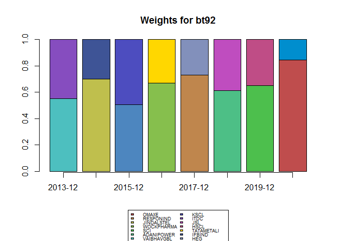

    ##                     OMAXE RESPONIND JINDALSTEL WOCKPHARMA  SCI ADANIPOWER
    ## 2015-12-24 05:30:00 0.000      0.00          0      0.000 0.00      0.000
    ## 2016-12-30 05:30:00 0.000      0.00          0      0.671 0.00      0.000
    ## 2017-12-29 05:30:00 0.000      0.73          0      0.000 0.00      0.000
    ## 2018-12-28 05:30:00 0.000      0.00          0      0.000 0.00      0.612
    ## 2019-12-27 05:30:00 0.000      0.00          0      0.000 0.65      0.000
    ## 2020-12-18 05:30:00 0.846      0.00          0      0.000 0.00      0.000
    ##                     VAIBHAVGBL RAJESHEXPO  KSCL ITDC   JSL HSCL TATAMETALI
    ## 2015-12-24 05:30:00          0      0.506 0.494    0 0.000 0.00      0.000
    ## 2016-12-30 05:30:00          0      0.000 0.000    0 0.000 0.00      0.329
    ## 2017-12-29 05:30:00          0      0.000 0.000    0 0.000 0.00      0.000
    ## 2018-12-28 05:30:00          0      0.000 0.000    0 0.388 0.00      0.000
    ## 2019-12-27 05:30:00          0      0.000 0.000    0 0.000 0.35      0.000
    ## 2020-12-18 05:30:00          0      0.000 0.000    0 0.000 0.00      0.000
    ##                     IFBIND  HEG TANLA
    ## 2015-12-24 05:30:00      0 0.00 0.000
    ## 2016-12-30 05:30:00      0 0.00 0.000
    ## 2017-12-29 05:30:00      0 0.27 0.000
    ## 2018-12-28 05:30:00      0 0.00 0.000
    ## 2019-12-27 05:30:00      0 0.00 0.000
    ## 2020-12-18 05:30:00      0 0.00 0.154


    ##                     ABBOTINDIA   TCS PAGEIND  INFY CHOLAFIN MPHASIS  VEDL
    ## 2015-12-24 05:30:00      0.234 0.000       0 0.000    0.000   0.208 0.000
    ## 2016-12-30 05:30:00      0.000 0.000       0 0.000    0.265   0.000 0.104
    ## 2017-12-29 05:30:00      0.000 0.000       0 0.000    0.000   0.000 0.000
    ## 2018-12-28 05:30:00      0.000 0.274       0 0.000    0.000   0.000 0.000
    ## 2019-12-27 05:30:00      0.155 0.049       0 0.206    0.000   0.000 0.000
    ## 2020-12-18 05:30:00      0.000 0.000       0 0.000    0.000   0.000 0.000
    ##                     SEQUENT SWANENERGY WESTLIFE RESPONIND ORIENTREF ASTRAL
    ## 2015-12-24 05:30:00   0.155      0.020        0     0.000     0.000  0.000
    ## 2016-12-30 05:30:00   0.000      0.159        0     0.000     0.000  0.000
    ## 2017-12-29 05:30:00   0.000      0.000        0     0.000     0.000  0.098
    ## 2018-12-28 05:30:00   0.000      0.000        0     0.000     0.163  0.000
    ## 2019-12-27 05:30:00   0.027      0.000        0     0.000     0.000  0.000
    ## 2020-12-18 05:30:00   0.000      0.000        0     0.164     0.000  0.000
    ##                     AIAENG DEEPAKNI BALMLAWRIE MINDAIND   IGL WIPRO GRANULES
    ## 2015-12-24 05:30:00  0.000    0.000      0.000    0.038 0.000     0    0.000
    ## 2016-12-30 05:30:00  0.000    0.000      0.145    0.014 0.000     0    0.000
    ## 2017-12-29 05:30:00  0.000    0.000      0.000    0.091 0.142     0    0.000
    ## 2018-12-28 05:30:00  0.157    0.000      0.000    0.000 0.000     0    0.000
    ## 2019-12-27 05:30:00  0.000    0.083      0.000    0.000 0.000     0    0.017
    ## 2020-12-18 05:30:00  0.000    0.000      0.000    0.000 0.000     0    0.114
    ##                     APLLTD PERSISTENT JCHAC VAIBHAVGBL TRENT LINDEINDIA
    ## 2015-12-24 05:30:00  0.000      0.000     0          0 0.000      0.000
    ## 2016-12-30 05:30:00  0.000      0.000     0          0 0.000      0.000
    ## 2017-12-29 05:30:00  0.000      0.000     0          0 0.000      0.000
    ## 2018-12-28 05:30:00  0.000      0.000     0          0 0.000      0.024
    ## 2019-12-27 05:30:00  0.029      0.000     0          0 0.118      0.093
    ## 2020-12-18 05:30:00  0.100      0.124     0          0 0.000      0.000
    ##                     RAJESHEXPO REDINGTON MAHSCOOTER RELAXO   IOC SONATSOFTW
    ## 2015-12-24 05:30:00       0.11     0.000          0  0.000 0.000      0.000
    ## 2016-12-30 05:30:00       0.00     0.000          0  0.000 0.099      0.098
    ## 2017-12-29 05:30:00       0.00     0.000          0  0.059 0.000      0.000
    ## 2018-12-28 05:30:00       0.00     0.000          0  0.000 0.000      0.000
    ## 2019-12-27 05:30:00       0.00     0.058          0  0.000 0.000      0.000
    ## 2020-12-18 05:30:00       0.00     0.048          0  0.000 0.000      0.000
    ##                     MAHINDCIE GRAPHITE IFBIND DRREDDY SUNTECK NLCINDIA
    ## 2015-12-24 05:30:00     0.000    0.000  0.000       0   0.000     0.00
    ## 2016-12-30 05:30:00     0.000    0.000  0.000       0   0.000     0.00
    ## 2017-12-29 05:30:00     0.000    0.097  0.002       0   0.091     0.00
    ## 2018-12-28 05:30:00     0.000    0.000  0.000       0   0.000     0.09
    ## 2019-12-27 05:30:00     0.000    0.000  0.000       0   0.000     0.00
    ## 2020-12-18 05:30:00     0.098    0.000  0.093       0   0.000     0.00
    ##                     MOTILALOFS ESCORTS BLUEDART ITC SYMPHONY NATCOPHARM
    ## 2015-12-24 05:30:00      0.000   0.000    0.000   0        0      0.000
    ## 2016-12-30 05:30:00      0.000   0.000    0.000   0        0      0.001
    ## 2017-12-29 05:30:00      0.087   0.000    0.000   0        0      0.000
    ## 2018-12-28 05:30:00      0.000   0.000    0.000   0        0      0.000
    ## 2019-12-27 05:30:00      0.000   0.000    0.000   0        0      0.000
    ## 2020-12-18 05:30:00      0.000   0.084    0.081   0        0      0.000
    ##                     JUBILANT X3MINDIA HATHWAY HAWKINCOOK JYOTHYLAB JKTYRE
    ## 2015-12-24 05:30:00    0.068    0.000   0.000      0.000     0.000      0
    ## 2016-12-30 05:30:00    0.000    0.000   0.000      0.000     0.000      0
    ## 2017-12-29 05:30:00    0.000    0.067   0.000      0.000     0.000      0
    ## 2018-12-28 05:30:00    0.000    0.000   0.058      0.000     0.057      0
    ## 2019-12-27 05:30:00    0.000    0.000   0.000      0.057     0.000      0
    ## 2020-12-18 05:30:00    0.000    0.000   0.000      0.000     0.000      0
    ##                     GODREJPROP  HSCL EDELWEISS COLPAL BRIGADE CEATLTD HINDPETRO
    ## 2015-12-24 05:30:00      0.000 0.000     0.000  0.000   0.000       0     0.000
    ## 2016-12-30 05:30:00      0.000 0.000     0.042  0.000   0.000       0     0.000
    ## 2017-12-29 05:30:00      0.048 0.045     0.000  0.000   0.000       0     0.039
    ## 2018-12-28 05:30:00      0.000 0.000     0.000  0.042   0.000       0     0.000
    ## 2019-12-27 05:30:00      0.000 0.000     0.000  0.000   0.041       0     0.000
    ## 2020-12-18 05:30:00      0.000 0.000     0.000  0.000   0.000       0     0.000
    ##                     SUDARSCHEM ASTRAZEN LAXMIMACH ECLERX SUNDRMFAST INDHOTEL
    ## 2015-12-24 05:30:00          0    0.000     0.000  0.035      0.000    0.000
    ## 2016-12-30 05:30:00          0    0.000     0.000  0.000      0.035    0.000
    ## 2017-12-29 05:30:00          0    0.000     0.000  0.000      0.000    0.000
    ## 2018-12-28 05:30:00          0    0.038     0.000  0.000      0.000    0.035
    ## 2019-12-27 05:30:00          0    0.000     0.000  0.000      0.000    0.000
    ## 2020-12-18 05:30:00          0    0.000     0.036  0.000      0.000    0.000
    ##                     IOLCP APLAPOLLO J.KBANK KANSAINER SANOFI ICICIBANK
    ## 2015-12-24 05:30:00 0.022     0.033       0     0.031      0     0.000
    ## 2016-12-30 05:30:00 0.000     0.000       0     0.000      0     0.000
    ## 2017-12-29 05:30:00 0.000     0.000       0     0.000      0     0.013
    ## 2018-12-28 05:30:00 0.000     0.000       0     0.000      0     0.016
    ## 2019-12-27 05:30:00 0.000     0.000       0     0.000      0     0.000
    ## 2020-12-18 05:30:00 0.000     0.000       0     0.000      0     0.000
    ##                     SOLARINDS M.MFIN JKCEMENT JSWSTEEL BRITANNIA  ITDC
    ## 2015-12-24 05:30:00         0      0        0        0     0.000 0.024
    ## 2016-12-30 05:30:00         0      0        0        0     0.000 0.000
    ## 2017-12-29 05:30:00         0      0        0        0     0.026 0.000
    ## 2018-12-28 05:30:00         0      0        0        0     0.000 0.000
    ## 2019-12-27 05:30:00         0      0        0        0     0.000 0.000
    ## 2020-12-18 05:30:00         0      0        0        0     0.000 0.000
    ##                     BIRLACORPN
    ## 2015-12-24 05:30:00      0.000
    ## 2016-12-30 05:30:00      0.000
    ## 2017-12-29 05:30:00      0.000
    ## 2018-12-28 05:30:00      0.000
    ## 2019-12-27 05:30:00      0.022
    ## 2020-12-18 05:30:00      0.000


    ##                     ABBOTINDIA   TCS PAGEIND  INFY CHOLAFIN MPHASIS  VEDL
    ## 2015-12-24 05:30:00      0.234 0.000       0 0.000    0.000   0.208 0.000
    ## 2016-12-30 05:30:00      0.000 0.000       0 0.000    0.265   0.000 0.104
    ## 2017-12-29 05:30:00      0.000 0.000       0 0.000    0.000   0.000 0.000
    ## 2018-12-28 05:30:00      0.000 0.274       0 0.000    0.000   0.000 0.000
    ## 2019-12-27 05:30:00      0.155 0.049       0 0.206    0.000   0.000 0.000
    ## 2020-12-18 05:30:00      0.000 0.000       0 0.000    0.000   0.000 0.000
    ##                     SEQUENT SWANENERGY WESTLIFE RESPONIND ORIENTREF ASTRAL
    ## 2015-12-24 05:30:00   0.155      0.020        0     0.000     0.000  0.000
    ## 2016-12-30 05:30:00   0.000      0.159        0     0.000     0.000  0.000
    ## 2017-12-29 05:30:00   0.000      0.000        0     0.000     0.000  0.098
    ## 2018-12-28 05:30:00   0.000      0.000        0     0.000     0.163  0.000
    ## 2019-12-27 05:30:00   0.027      0.000        0     0.000     0.000  0.000
    ## 2020-12-18 05:30:00   0.000      0.000        0     0.164     0.000  0.000
    ##                     AIAENG DEEPAKNI BALMLAWRIE MINDAIND   IGL WIPRO GRANULES
    ## 2015-12-24 05:30:00  0.000    0.000      0.000    0.038 0.000     0    0.000
    ## 2016-12-30 05:30:00  0.000    0.000      0.145    0.014 0.000     0    0.000
    ## 2017-12-29 05:30:00  0.000    0.000      0.000    0.091 0.142     0    0.000
    ## 2018-12-28 05:30:00  0.157    0.000      0.000    0.000 0.000     0    0.000
    ## 2019-12-27 05:30:00  0.000    0.083      0.000    0.000 0.000     0    0.017
    ## 2020-12-18 05:30:00  0.000    0.000      0.000    0.000 0.000     0    0.114
    ##                     APLLTD PERSISTENT JCHAC VAIBHAVGBL TRENT LINDEINDIA
    ## 2015-12-24 05:30:00  0.000      0.000     0          0 0.000      0.000
    ## 2016-12-30 05:30:00  0.000      0.000     0          0 0.000      0.000
    ## 2017-12-29 05:30:00  0.000      0.000     0          0 0.000      0.000
    ## 2018-12-28 05:30:00  0.000      0.000     0          0 0.000      0.024
    ## 2019-12-27 05:30:00  0.029      0.000     0          0 0.118      0.093
    ## 2020-12-18 05:30:00  0.100      0.124     0          0 0.000      0.000
    ##                     RAJESHEXPO REDINGTON MAHSCOOTER RELAXO   IOC SONATSOFTW
    ## 2015-12-24 05:30:00       0.11     0.000          0  0.000 0.000      0.000
    ## 2016-12-30 05:30:00       0.00     0.000          0  0.000 0.099      0.098
    ## 2017-12-29 05:30:00       0.00     0.000          0  0.059 0.000      0.000
    ## 2018-12-28 05:30:00       0.00     0.000          0  0.000 0.000      0.000
    ## 2019-12-27 05:30:00       0.00     0.058          0  0.000 0.000      0.000
    ## 2020-12-18 05:30:00       0.00     0.048          0  0.000 0.000      0.000
    ##                     MAHINDCIE GRAPHITE IFBIND DRREDDY SUNTECK NLCINDIA
    ## 2015-12-24 05:30:00     0.000    0.000  0.000       0   0.000     0.00
    ## 2016-12-30 05:30:00     0.000    0.000  0.000       0   0.000     0.00
    ## 2017-12-29 05:30:00     0.000    0.097  0.002       0   0.091     0.00
    ## 2018-12-28 05:30:00     0.000    0.000  0.000       0   0.000     0.09
    ## 2019-12-27 05:30:00     0.000    0.000  0.000       0   0.000     0.00
    ## 2020-12-18 05:30:00     0.098    0.000  0.093       0   0.000     0.00
    ##                     MOTILALOFS ESCORTS BLUEDART ITC SYMPHONY NATCOPHARM
    ## 2015-12-24 05:30:00      0.000   0.000    0.000   0        0      0.000
    ## 2016-12-30 05:30:00      0.000   0.000    0.000   0        0      0.001
    ## 2017-12-29 05:30:00      0.087   0.000    0.000   0        0      0.000
    ## 2018-12-28 05:30:00      0.000   0.000    0.000   0        0      0.000
    ## 2019-12-27 05:30:00      0.000   0.000    0.000   0        0      0.000
    ## 2020-12-18 05:30:00      0.000   0.084    0.081   0        0      0.000
    ##                     JUBILANT X3MINDIA HATHWAY HAWKINCOOK JYOTHYLAB JKTYRE
    ## 2015-12-24 05:30:00    0.068    0.000   0.000      0.000     0.000      0
    ## 2016-12-30 05:30:00    0.000    0.000   0.000      0.000     0.000      0
    ## 2017-12-29 05:30:00    0.000    0.067   0.000      0.000     0.000      0
    ## 2018-12-28 05:30:00    0.000    0.000   0.058      0.000     0.057      0
    ## 2019-12-27 05:30:00    0.000    0.000   0.000      0.057     0.000      0
    ## 2020-12-18 05:30:00    0.000    0.000   0.000      0.000     0.000      0
    ##                     GODREJPROP  HSCL EDELWEISS COLPAL BRIGADE CEATLTD HINDPETRO
    ## 2015-12-24 05:30:00      0.000 0.000     0.000  0.000   0.000       0     0.000
    ## 2016-12-30 05:30:00      0.000 0.000     0.042  0.000   0.000       0     0.000
    ## 2017-12-29 05:30:00      0.048 0.045     0.000  0.000   0.000       0     0.039
    ## 2018-12-28 05:30:00      0.000 0.000     0.000  0.042   0.000       0     0.000
    ## 2019-12-27 05:30:00      0.000 0.000     0.000  0.000   0.041       0     0.000
    ## 2020-12-18 05:30:00      0.000 0.000     0.000  0.000   0.000       0     0.000
    ##                     SUDARSCHEM ASTRAZEN LAXMIMACH ECLERX SUNDRMFAST INDHOTEL
    ## 2015-12-24 05:30:00          0    0.000     0.000  0.035      0.000    0.000
    ## 2016-12-30 05:30:00          0    0.000     0.000  0.000      0.035    0.000
    ## 2017-12-29 05:30:00          0    0.000     0.000  0.000      0.000    0.000
    ## 2018-12-28 05:30:00          0    0.038     0.000  0.000      0.000    0.035
    ## 2019-12-27 05:30:00          0    0.000     0.000  0.000      0.000    0.000
    ## 2020-12-18 05:30:00          0    0.000     0.036  0.000      0.000    0.000
    ##                     IOLCP APLAPOLLO J.KBANK KANSAINER SANOFI ICICIBANK
    ## 2015-12-24 05:30:00 0.022     0.033       0     0.031      0     0.000
    ## 2016-12-30 05:30:00 0.000     0.000       0     0.000      0     0.000
    ## 2017-12-29 05:30:00 0.000     0.000       0     0.000      0     0.013
    ## 2018-12-28 05:30:00 0.000     0.000       0     0.000      0     0.016
    ## 2019-12-27 05:30:00 0.000     0.000       0     0.000      0     0.000
    ## 2020-12-18 05:30:00 0.000     0.000       0     0.000      0     0.000
    ##                     SOLARINDS M.MFIN JKCEMENT JSWSTEEL BRITANNIA  ITDC
    ## 2015-12-24 05:30:00         0      0        0        0     0.000 0.024
    ## 2016-12-30 05:30:00         0      0        0        0     0.000 0.000
    ## 2017-12-29 05:30:00         0      0        0        0     0.026 0.000
    ## 2018-12-28 05:30:00         0      0        0        0     0.000 0.000
    ## 2019-12-27 05:30:00         0      0        0        0     0.000 0.000
    ## 2020-12-18 05:30:00         0      0        0        0     0.000 0.000
    ##                     BIRLACORPN
    ## 2015-12-24 05:30:00      0.000
    ## 2016-12-30 05:30:00      0.000
    ## 2017-12-29 05:30:00      0.000
    ## 2018-12-28 05:30:00      0.000
    ## 2019-12-27 05:30:00      0.022
    ## 2020-12-18 05:30:00      0.000


    ##                     ABBOTINDIA   TCS PAGEIND  INFY CHOLAFIN MPHASIS  VEDL
    ## 2015-12-24 05:30:00      0.234 0.000       0 0.000    0.000   0.208 0.000
    ## 2016-12-30 05:30:00      0.000 0.000       0 0.000    0.265   0.000 0.104
    ## 2017-12-29 05:30:00      0.000 0.000       0 0.000    0.000   0.000 0.000
    ## 2018-12-28 05:30:00      0.000 0.274       0 0.000    0.000   0.000 0.000
    ## 2019-12-27 05:30:00      0.155 0.049       0 0.206    0.000   0.000 0.000
    ## 2020-12-18 05:30:00      0.000 0.000       0 0.000    0.000   0.000 0.000
    ##                     SEQUENT SWANENERGY WESTLIFE RESPONIND ORIENTREF ASTRAL
    ## 2015-12-24 05:30:00   0.155      0.020        0     0.000     0.000  0.000
    ## 2016-12-30 05:30:00   0.000      0.159        0     0.000     0.000  0.000
    ## 2017-12-29 05:30:00   0.000      0.000        0     0.000     0.000  0.098
    ## 2018-12-28 05:30:00   0.000      0.000        0     0.000     0.163  0.000
    ## 2019-12-27 05:30:00   0.027      0.000        0     0.000     0.000  0.000
    ## 2020-12-18 05:30:00   0.000      0.000        0     0.164     0.000  0.000
    ##                     AIAENG DEEPAKNI BALMLAWRIE MINDAIND   IGL WIPRO GRANULES
    ## 2015-12-24 05:30:00  0.000    0.000      0.000    0.038 0.000     0    0.000
    ## 2016-12-30 05:30:00  0.000    0.000      0.145    0.014 0.000     0    0.000
    ## 2017-12-29 05:30:00  0.000    0.000      0.000    0.091 0.142     0    0.000
    ## 2018-12-28 05:30:00  0.157    0.000      0.000    0.000 0.000     0    0.000
    ## 2019-12-27 05:30:00  0.000    0.083      0.000    0.000 0.000     0    0.017
    ## 2020-12-18 05:30:00  0.000    0.000      0.000    0.000 0.000     0    0.114
    ##                     APLLTD PERSISTENT JCHAC VAIBHAVGBL TRENT LINDEINDIA
    ## 2015-12-24 05:30:00  0.000      0.000     0          0 0.000      0.000
    ## 2016-12-30 05:30:00  0.000      0.000     0          0 0.000      0.000
    ## 2017-12-29 05:30:00  0.000      0.000     0          0 0.000      0.000
    ## 2018-12-28 05:30:00  0.000      0.000     0          0 0.000      0.024
    ## 2019-12-27 05:30:00  0.029      0.000     0          0 0.118      0.093
    ## 2020-12-18 05:30:00  0.100      0.124     0          0 0.000      0.000
    ##                     RAJESHEXPO REDINGTON MAHSCOOTER RELAXO   IOC SONATSOFTW
    ## 2015-12-24 05:30:00       0.11     0.000          0  0.000 0.000      0.000
    ## 2016-12-30 05:30:00       0.00     0.000          0  0.000 0.099      0.098
    ## 2017-12-29 05:30:00       0.00     0.000          0  0.059 0.000      0.000
    ## 2018-12-28 05:30:00       0.00     0.000          0  0.000 0.000      0.000
    ## 2019-12-27 05:30:00       0.00     0.058          0  0.000 0.000      0.000
    ## 2020-12-18 05:30:00       0.00     0.048          0  0.000 0.000      0.000
    ##                     MAHINDCIE GRAPHITE IFBIND DRREDDY SUNTECK NLCINDIA
    ## 2015-12-24 05:30:00     0.000    0.000  0.000       0   0.000     0.00
    ## 2016-12-30 05:30:00     0.000    0.000  0.000       0   0.000     0.00
    ## 2017-12-29 05:30:00     0.000    0.097  0.002       0   0.091     0.00
    ## 2018-12-28 05:30:00     0.000    0.000  0.000       0   0.000     0.09
    ## 2019-12-27 05:30:00     0.000    0.000  0.000       0   0.000     0.00
    ## 2020-12-18 05:30:00     0.098    0.000  0.093       0   0.000     0.00
    ##                     MOTILALOFS ESCORTS BLUEDART ITC SYMPHONY NATCOPHARM
    ## 2015-12-24 05:30:00      0.000   0.000    0.000   0        0      0.000
    ## 2016-12-30 05:30:00      0.000   0.000    0.000   0        0      0.001
    ## 2017-12-29 05:30:00      0.087   0.000    0.000   0        0      0.000
    ## 2018-12-28 05:30:00      0.000   0.000    0.000   0        0      0.000
    ## 2019-12-27 05:30:00      0.000   0.000    0.000   0        0      0.000
    ## 2020-12-18 05:30:00      0.000   0.084    0.081   0        0      0.000
    ##                     JUBILANT X3MINDIA HATHWAY HAWKINCOOK JYOTHYLAB JKTYRE
    ## 2015-12-24 05:30:00    0.068    0.000   0.000      0.000     0.000      0
    ## 2016-12-30 05:30:00    0.000    0.000   0.000      0.000     0.000      0
    ## 2017-12-29 05:30:00    0.000    0.067   0.000      0.000     0.000      0
    ## 2018-12-28 05:30:00    0.000    0.000   0.058      0.000     0.057      0
    ## 2019-12-27 05:30:00    0.000    0.000   0.000      0.057     0.000      0
    ## 2020-12-18 05:30:00    0.000    0.000   0.000      0.000     0.000      0
    ##                     GODREJPROP  HSCL EDELWEISS COLPAL BRIGADE CEATLTD HINDPETRO
    ## 2015-12-24 05:30:00      0.000 0.000     0.000  0.000   0.000       0     0.000
    ## 2016-12-30 05:30:00      0.000 0.000     0.042  0.000   0.000       0     0.000
    ## 2017-12-29 05:30:00      0.048 0.045     0.000  0.000   0.000       0     0.039
    ## 2018-12-28 05:30:00      0.000 0.000     0.000  0.042   0.000       0     0.000
    ## 2019-12-27 05:30:00      0.000 0.000     0.000  0.000   0.041       0     0.000
    ## 2020-12-18 05:30:00      0.000 0.000     0.000  0.000   0.000       0     0.000
    ##                     SUDARSCHEM ASTRAZEN LAXMIMACH ECLERX SUNDRMFAST INDHOTEL
    ## 2015-12-24 05:30:00          0    0.000     0.000  0.035      0.000    0.000
    ## 2016-12-30 05:30:00          0    0.000     0.000  0.000      0.035    0.000
    ## 2017-12-29 05:30:00          0    0.000     0.000  0.000      0.000    0.000
    ## 2018-12-28 05:30:00          0    0.038     0.000  0.000      0.000    0.035
    ## 2019-12-27 05:30:00          0    0.000     0.000  0.000      0.000    0.000
    ## 2020-12-18 05:30:00          0    0.000     0.036  0.000      0.000    0.000
    ##                     IOLCP APLAPOLLO J.KBANK KANSAINER SANOFI ICICIBANK
    ## 2015-12-24 05:30:00 0.022     0.033       0     0.031      0     0.000
    ## 2016-12-30 05:30:00 0.000     0.000       0     0.000      0     0.000
    ## 2017-12-29 05:30:00 0.000     0.000       0     0.000      0     0.013
    ## 2018-12-28 05:30:00 0.000     0.000       0     0.000      0     0.016
    ## 2019-12-27 05:30:00 0.000     0.000       0     0.000      0     0.000
    ## 2020-12-18 05:30:00 0.000     0.000       0     0.000      0     0.000
    ##                     SOLARINDS M.MFIN JKCEMENT JSWSTEEL BRITANNIA  ITDC
    ## 2015-12-24 05:30:00         0      0        0        0     0.000 0.024
    ## 2016-12-30 05:30:00         0      0        0        0     0.000 0.000
    ## 2017-12-29 05:30:00         0      0        0        0     0.026 0.000
    ## 2018-12-28 05:30:00         0      0        0        0     0.000 0.000
    ## 2019-12-27 05:30:00         0      0        0        0     0.000 0.000
    ## 2020-12-18 05:30:00         0      0        0        0     0.000 0.000
    ##                     BIRLACORPN
    ## 2015-12-24 05:30:00      0.000
    ## 2016-12-30 05:30:00      0.000
    ## 2017-12-29 05:30:00      0.000
    ## 2018-12-28 05:30:00      0.000
    ## 2019-12-27 05:30:00      0.022
    ## 2020-12-18 05:30:00      0.000


    ##                     RAJESHEXPO TANLA ADANIPOWER HEG SCI VAIBHAVGBL IFBIND
    ## 2015-12-24 05:30:00          1     0          0   0   0          0      0
    ## 2016-12-30 05:30:00          0     0          0   0   0          0      0
    ## 2017-12-29 05:30:00          0     0          0   1   0          0      0
    ## 2018-12-28 05:30:00          0     0          1   0   0          0      0
    ## 2019-12-27 05:30:00          0     0          0   0   1          0      0
    ## 2020-12-18 05:30:00          0     1          0   0   0          0      0
    ##                     TATAMETALI
    ## 2015-12-24 05:30:00          0
    ## 2016-12-30 05:30:00          1
    ## 2017-12-29 05:30:00          0
    ## 2018-12-28 05:30:00          0
    ## 2019-12-27 05:30:00          0
    ## 2020-12-18 05:30:00          0

``` r
  btouts.rets.mx <- do.call(cbind, btouts.rets)
  colnames(btouts.rets.mx) <- names(btouts.rets) # Was: paste("bt", 1:length(btouts.rets.mx), sep="")
  mycharts.PerformanceSummary(btouts.rets.mx, main=paste0("Rebalancing performance"))
```

    ## Warning in mycharts.PerformanceSummary(btouts.rets.mx, main =
    ## paste0("Rebalancing performance")): Rf=0, geometric=TRUE, ylog=FALSE.

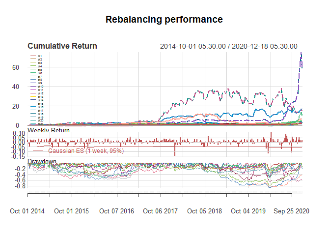

    ## NULL

Peek at a Latest Rebalancing: Weights and More
----------------------------------------------

``` r
  btExplain.df <- data.frame(bt=1:length(colnames(btouts.rets.mx)), fname=flist,
    periodMeanReturn=colMeans(btouts.rets.mx, na.rm=TRUE),
    periodMeanReturn.half=colMeans(btouts.rets.mx[1:round(nrow(btouts.rets.mx)/2),], na.rm=TRUE),
    stringsAsFactors=FALSE); str(btExplain.df)
```

    ## 'data.frame':    96 obs. of  4 variables:
    ##  $ bt                   : int  1 2 3 4 5 6 7 8 9 10 ...
    ##  $ fname                : chr  "bt-rebal9opt_pfESplus-ESarg4Retarg2ES1-202012311907-202012311908.rds" "bt-rebal9opt_pfESplus-ESarg4Retarg2ES2-202012311908-202012311909.rds" "bt-rebal9opt_pfESplus-ESarg4Retarg2ES3-202012311909-202012311910.rds" "bt-rebal9opt_pfESplus-ESarg4Retarg2ES4-202012311910-202012311910.rds" ...
    ##  $ periodMeanReturn     : num  0.00362 0.00362 0.00362 0.00627 0.00362 ...
    ##  $ periodMeanReturn.half: num  0.00272 0.00272 0.00272 0.01123 0.00272 ...

``` r
  btExplain.df <- cbind(parseBtFnames(flist), btExplain.df, stringsAsFactors=FALSE)
  # tmp3 <- btExplain.df[order(btExplain.df$periodMeanReturn),]; tail(tmp3)
  boxplot(periodMeanReturn ~ rebal+ESarg+Retarg+ES, data=btExplain.df, las=2, cex.axis=0.5)
```

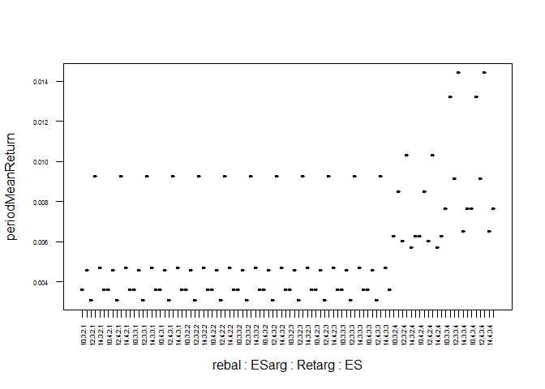

``` r
  boxplot(periodMeanReturn.half ~ rebal+ESarg+Retarg+ES, data=btExplain.df, las=2, cex.axis=0.5)
```

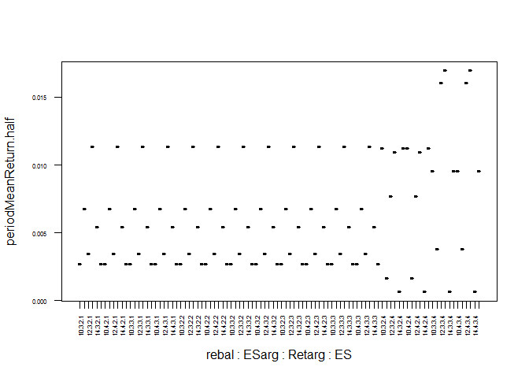

``` r
  # 2021Jan01:
  # To avoid <1-year taxation, investor might prefer rebal[11,12,14] to rebalance on "years",
  # instead of "quarters".
  # rebal13 >> rebal[11?,14?,  9,10,12]. rebal10 too rebalances on quarters, but did not perform
  #   as well. Considering first half periods, after rebal13, rebal11 (followed by rebal14) seems
  #   better than the others for ES[1,2,3] and worse overall (rebal14 seems worst) for ES4 with
  #   Retarg2.
  #   So, 36-period Training (and Rolling) Window dominates (52-period or longer) Windows,
  #   apparently.
  # ES4 >> ES[1-3]. So, a (pass-through or) nil ES Objective allows Return Objective (variants)
  #   to maximize freely.
  #   In ES4 scenarios when varying other optimization drivers, backtest performance is better
  #   when Retarg3, i.e.,
  #   "unbridled" Return maximization, as opposed to mean-targeted Retarg2.  In non-ES4
  #   scenarios, Retarg3 and Retarg2 seem to perform similarly.
  # ESarg does not seem to matter.

  Reqwt.rebalQtr <- Return.portfolio(R, rebalance_on="quarters") # rowSums(R) / 
  btouts.rets.IR <- InformationRatio(Ra=btouts.rets.mx, Rb=Reqwt.rebalQtr, scale=52)
    # coz 52 weeks in a year.
    # [William Sharpe now recommends InformationRatio preferentially to the original Sharpe
    # Ratio], says a vignette.
  # IRhigh.ix <- which(btouts.rets.IR > 0)
  # (btouts.rets.IR[IRhigh.ix]) # tail(sort(btouts.rets.IR))
  # IRhigh.ix.names <- dimnames(btouts.rets.IR)[[2]][IRhigh.ix] # c("bt1","bt2",...)
  btExplain.df <- cbind(btExplain.df, IR=btouts.rets.IR[1,], stringsAsFactors=FALSE); str(btExplain.df)
```

    ## 'data.frame':    96 obs. of  9 variables:
    ##  $ rebal                : chr  "9" "9" "9" "9" ...
    ##  $ ESarg                : chr  "4" "4" "4" "4" ...
    ##  $ Retarg               : chr  "2" "2" "2" "2" ...
    ##  $ ES                   : chr  "1" "2" "3" "4" ...
    ##  $ bt                   : int  1 2 3 4 5 6 7 8 9 10 ...
    ##  $ fname                : chr  "bt-rebal9opt_pfESplus-ESarg4Retarg2ES1-202012311907-202012311908.rds" "bt-rebal9opt_pfESplus-ESarg4Retarg2ES2-202012311908-202012311909.rds" "bt-rebal9opt_pfESplus-ESarg4Retarg2ES3-202012311909-202012311910.rds" "bt-rebal9opt_pfESplus-ESarg4Retarg2ES4-202012311910-202012311910.rds" ...
    ##  $ periodMeanReturn     : num  0.00362 0.00362 0.00362 0.00627 0.00362 ...
    ##  $ periodMeanReturn.half: num  0.00272 0.00272 0.00272 0.01123 0.00272 ...
    ##  $ IR                   : num  -0.00473 -0.00473 -0.00473 0.0879 -0.00473 ...

``` r
  cRebalSpec.df <- as.data.frame(cRebalSpec, stringsAsFactors=FALSE)
  cRebalSpec.df <- cbind(ix=1:nrow(cRebalSpec.df), cRebalSpec.df, stringsAsFactors=FALSE)
  tmp2 <- do.call(rbind, lapply(as.integer(btExplain.df$rebal),
    FUN=function(ix) cRebalSpec.df[ix == cRebalSpec.df$ix,]))
    # , stringsAsFactors=FALSE) # [1:nrow(btExplain.df)]
  btExplain.df <- cbind(btExplain.df, tmp2, stringsAsFactors=FALSE); str(btExplain.df)
```

    ## 'data.frame':    96 obs. of  14 variables:
    ##  $ rebal                : chr  "9" "9" "9" "9" ...
    ##  $ ESarg                : chr  "4" "4" "4" "4" ...
    ##  $ Retarg               : chr  "2" "2" "2" "2" ...
    ##  $ ES                   : chr  "1" "2" "3" "4" ...
    ##  $ bt                   : int  1 2 3 4 5 6 7 8 9 10 ...
    ##  $ fname                : chr  "bt-rebal9opt_pfESplus-ESarg4Retarg2ES1-202012311907-202012311908.rds" "bt-rebal9opt_pfESplus-ESarg4Retarg2ES2-202012311908-202012311909.rds" "bt-rebal9opt_pfESplus-ESarg4Retarg2ES3-202012311909-202012311910.rds" "bt-rebal9opt_pfESplus-ESarg4Retarg2ES4-202012311910-202012311910.rds" ...
    ##  $ periodMeanReturn     : num  0.00362 0.00362 0.00362 0.00627 0.00362 ...
    ##  $ periodMeanReturn.half: num  0.00272 0.00272 0.00272 0.01123 0.00272 ...
    ##  $ IR                   : num  -0.00473 -0.00473 -0.00473 0.0879 -0.00473 ...
    ##  $ ix                   : int  9 9 9 9 9 9 9 9 9 9 ...
    ##  $ momentFUN            : chr  "set.portfolio.moments" "set.portfolio.moments" "set.portfolio.moments" "set.portfolio.moments" ...
    ##  $ rebalance_on         : chr  "quarters" "quarters" "quarters" "quarters" ...
    ##  $ training_period      : num  104 104 104 104 104 104 104 104 104 104 ...
    ##  $ rolling_window       : num  104 104 104 104 104 104 104 104 104 104 ...

``` r
  plot(periodMeanReturn ~ IR, data=btExplain.df); plot(periodMeanReturn.half ~ IR,
    data=btExplain.df)
```

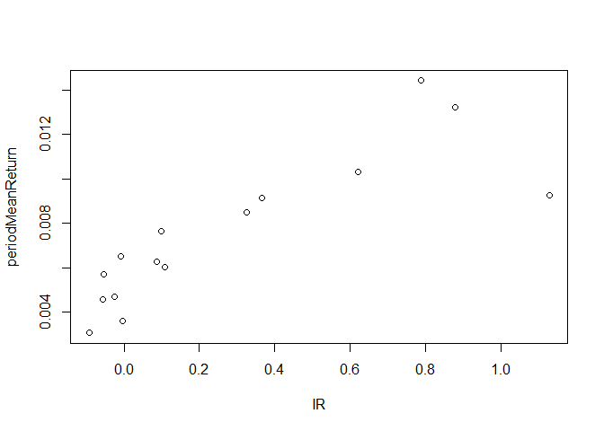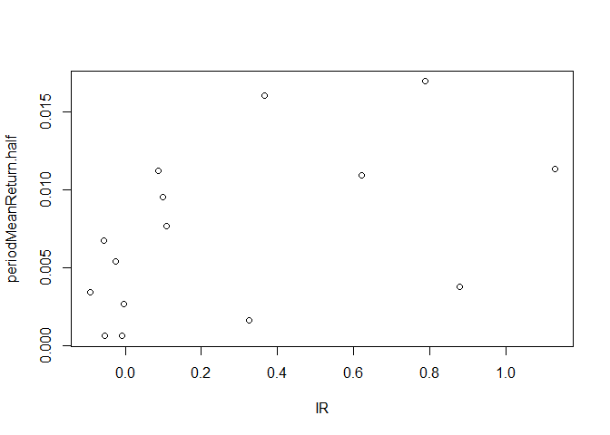

``` r
    # Beware: there are overlapped points, since we did not jitter them.
    # So, IR cannot be rejected as a reasonable indicator of mean Return. And it is already well
    # accepted as an indicator of fund-management goodness.

  IR.interest.cutoffChosen <- c(0.5, 1)[2]
  bt.interestSet.names <-
    rownames(btExplain.df[btExplain.df$IR >= IR.interest.cutoffChosen & TRUE,])
  bt.interestSet.names
```

    ##  [1] "bt65" "bt66" "bt67" "bt69" "bt70" "bt71" "bt73" "bt74" "bt75" "bt77"
    ## [11] "bt78" "bt79"

``` r
  mycharts.PerformanceSummary(btouts.rets.mx[, bt.interestSet.names],
    main=paste0("Rebalancing performance (InformationRatio >=", IR.interest.cutoffChosen, ")"))
```

    ## Warning in mycharts.PerformanceSummary(btouts.rets.mx[, bt.interestSet.names], :
    ## Rf=0, geometric=TRUE, ylog=FALSE.

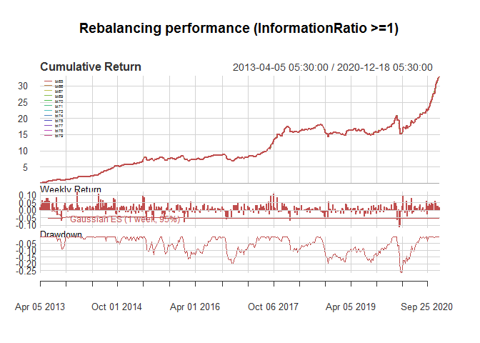

    ## NULL

``` r
  # "bt77"

  bt.interestSet <- c(77)
    # c(24,16,8,20)
    # bt.interestSet.not <- setdiff(colnames(btouts.rets.mx), paste0("bt", bt.interestSet))
  # mycharts.PerformanceSummary(btouts.rets.mx[,bt.interestSet.not],
  #   main=paste0("Rebalancing performance"))
  # mycharts.PerformanceSummary(btouts.rets.mx[,paste0("bt", c(4,12,20))],
  #   main=paste0("Rebalancing performance"))

ix <- bt.interestSet[1] # Was 7. Corresponding to bt<ix>. Presently, ix=1,2,3 are similar.
btout <- btouts[[ix]]
# names(btout)
# length(btout$opt_rebalancing)
# btout$opt_rebalancing[[1]] # first Rebalancing weights.
# btout$opt_rebalancing[[1]]$data_summary
btout.rebal.last <- btout$opt_rebalancing[[length(btout$opt_rebalancing)]] # weights from latest Rebalancing
# btout.rebal.last
tail(sort(btout.rebal.last$weights), 20)
```

    ##    JKCEMENT     MPHASIS      HONAUT   HINDPETRO    TATACOMM  HINDCOPPER 
    ## 0.000000000 0.000000000 0.000000000 0.000000000 0.002701332 0.002776040 
    ##   TATAELXSI        IDEA  ZENSARTECH  APOLLOHOSP   LAXMIMACH   REDINGTON 
    ## 0.005231897 0.009671393 0.019001967 0.020172145 0.035598496 0.048115976 
    ##    BLUEDART     ESCORTS      IFBIND   MAHINDCIE      APLLTD    GRANULES 
    ## 0.080507742 0.083504416 0.093143320 0.097832826 0.100098027 0.114086973 
    ##  PERSISTENT   RESPONIND 
    ## 0.124027283 0.163530168

``` r
# btout$opt_rebalancing[[length(btout$opt_rebalancing)]]$data_summary
# Brief optimization result and return/risk measures:
btout.summary <- summary(btout)
# btout.summary
head(extractObjectiveMeasures(btout)); tail(extractObjectiveMeasures(btout))
```

    ##                           mean          ES
    ## 2013-03-28 05:30:00 0.03847186 -0.02055696
    ## 2013-06-28 05:30:00 0.03440486 -0.01920620
    ## 2013-09-27 05:30:00 0.02477663 -0.01526597
    ## 2013-12-27 05:30:00 0.02393043 -0.01727395
    ## 2014-03-28 05:30:00 0.02237974 -0.01483882
    ## 2014-06-27 05:30:00 0.03260340 -0.02366522

    ##                            mean            ES
    ## 2019-09-27 05:30:00 0.006106190 -0.0003786346
    ## 2019-12-27 05:30:00 0.007735650 -0.0006891503
    ## 2020-03-27 05:30:00 0.009886654  0.0182978811
    ## 2020-06-26 05:30:00 0.011600032  0.0050587370
    ## 2020-09-25 05:30:00 0.013372769  0.0094190932
    ## 2020-12-18 05:30:00 0.026236461 -0.0157854193

``` r
# par(ask=TRUE); plot.new()
if(FALSE){ # iff ES.contribution columns via specifying prisk= specified eg bt5
  chart.RiskBudget(btout, match.col="ES", risk.type="percentage", col=my_color) # "CVaR"
} # else continue

print(btout)
```

    ## **************************************************
    ## PortfolioAnalytics Optimization with Rebalancing
    ## **************************************************
    ## 
    ## Call:
    ## optimize.portfolio.rebalancing(R = R, portfolio = pfESplus, optimize_method = "ROI", 
    ##     trace = TRUE, momentFUN = cRebalSpec$momentFUN[cRebalSpec.ix], 
    ##     rebalance_on = cRebalSpec$rebalance_on[cRebalSpec.ix], training_period = cRebalSpec$training_period[cRebalSpec.ix], 
    ##     rolling_window = cRebalSpec$rolling_window[cRebalSpec.ix])
    ## 
    ## Number of rebalancing dates:  32 
    ## First rebalance date:
    ## [1] "2013-03-28"
    ## Last rebalance date:
    ## [1] "2020-12-18"
    ## 
    ## Annualized Portfolio Rebalancing Return:
    ## [1] 0.5770982
    ## 
    ## Annualized Portfolio Standard Deviation:
    ## [1] 0.2220162

``` r
rebalWts <- mychart.Weights(btout, main=paste0("Weights bt", ix)); print(tail(round(rebalWts, 3), 6))
```


    ##                     WESTLIFE ABBOTINDIA RESPONIND MPHASIS   TCS CHOLAFIN KRBL
    ## 2019-09-27 05:30:00        0      0.031     0.000       0 0.034        0    0
    ## 2019-12-27 05:30:00        0      0.155     0.000       0 0.049        0    0
    ## 2020-03-27 05:30:00        0      0.326     0.000       0 0.000        0    0
    ## 2020-06-26 05:30:00        0      0.098     0.282       0 0.000        0    0
    ## 2020-09-25 05:30:00        0      0.040     0.388       0 0.000        0    0
    ## 2020-12-18 05:30:00        0      0.000     0.164       0 0.000        0    0
    ##                     VAKRANGEE PAGEIND PGHH SEQUENT HCLTECH  INFY DEEPAKNI
    ## 2019-09-27 05:30:00         0       0    0   0.000       0 0.115    0.000
    ## 2019-12-27 05:30:00         0       0    0   0.027       0 0.206    0.083
    ## 2020-03-27 05:30:00         0       0    0   0.000       0 0.000    0.000
    ## 2020-06-26 05:30:00         0       0    0   0.015       0 0.000    0.000
    ## 2020-09-25 05:30:00         0       0    0   0.000       0 0.000    0.000
    ## 2020-12-18 05:30:00         0       0    0   0.000       0 0.000    0.000
    ##                     INDIACEM MARICO GRAPHITE APLLTD ITDC SUNTECK MOTILALOFS
    ## 2019-09-27 05:30:00    0.000      0        0  0.000    0       0          0
    ## 2019-12-27 05:30:00    0.000      0        0  0.029    0       0          0
    ## 2020-03-27 05:30:00    0.109      0        0  0.000    0       0          0
    ## 2020-06-26 05:30:00    0.167      0        0  0.022    0       0          0
    ## 2020-09-25 05:30:00    0.172      0        0  0.138    0       0          0
    ## 2020-12-18 05:30:00    0.000      0        0  0.100    0       0          0
    ##                     IPCALAB SWANENERGY SYMPHONY RAJESHEXPO BRITANNIA GRANULES
    ## 2019-09-27 05:30:00   0.155          0        0          0         0    0.000
    ## 2019-12-27 05:30:00   0.000          0        0          0         0    0.017
    ## 2020-03-27 05:30:00   0.032          0        0          0         0    0.000
    ## 2020-06-26 05:30:00   0.000          0        0          0         0    0.000
    ## 2020-09-25 05:30:00   0.000          0        0          0         0    0.087
    ## 2020-12-18 05:30:00   0.000          0        0          0         0    0.114
    ##                     WIPRO VAIBHAVGBL INDHOTEL DRREDDY NAUKRI SONATSOFTW OMAXE
    ## 2019-09-27 05:30:00 0.015          0        0    0.00  0.037          0     0
    ## 2019-12-27 05:30:00 0.000          0        0    0.00  0.000          0     0
    ## 2020-03-27 05:30:00 0.000          0        0    0.00  0.000          0     0
    ## 2020-06-26 05:30:00 0.000          0        0    0.19  0.000          0     0
    ## 2020-09-25 05:30:00 0.000          0        0    0.00  0.000          0     0
    ## 2020-12-18 05:30:00 0.000          0        0    0.00  0.000          0     0
    ##                     GUJALKALI MANAPPURAM WHIRLPOOL RELAXO   IGL ITC HEG TECHM
    ## 2019-09-27 05:30:00         0       0.02     0.000      0 0.073   0   0     0
    ## 2019-12-27 05:30:00         0       0.00     0.000      0 0.000   0   0     0
    ## 2020-03-27 05:30:00         0       0.00     0.252      0 0.000   0   0     0
    ## 2020-06-26 05:30:00         0       0.00     0.000      0 0.000   0   0     0
    ## 2020-09-25 05:30:00         0       0.00     0.000      0 0.000   0   0     0
    ## 2020-12-18 05:30:00         0       0.00     0.000      0 0.000   0   0     0
    ##                     ALKYLAMINE ECLERX JSWSTEEL DCMSHRIRAM PIIND MINDAIND
    ## 2019-09-27 05:30:00      0.000      0        0      0.069     0        0
    ## 2019-12-27 05:30:00      0.000      0        0      0.000     0        0
    ## 2020-03-27 05:30:00      0.000      0        0      0.000     0        0
    ## 2020-06-26 05:30:00      0.000      0        0      0.000     0        0
    ## 2020-09-25 05:30:00      0.024      0        0      0.000     0        0
    ## 2020-12-18 05:30:00      0.000      0        0      0.000     0        0
    ##                     BALMLAWRIE SANOFI HATHWAY  IDEA CANFINHOME MINDTREE JCHAC
    ## 2019-09-27 05:30:00          0      0       0 0.000          0        0     0
    ## 2019-12-27 05:30:00          0      0       0 0.000          0        0     0
    ## 2020-03-27 05:30:00          0      0       0 0.042          0        0     0
    ## 2020-06-26 05:30:00          0      0       0 0.077          0        0     0
    ## 2020-09-25 05:30:00          0      0       0 0.073          0        0     0
    ## 2020-12-18 05:30:00          0      0       0 0.010          0        0     0
    ##                     ZYDUSWELL JYOTHYLAB VEDL EDELWEISS APLAPOLLO NAVINFLUOR
    ## 2019-09-27 05:30:00      0.14         0    0         0         0      0.000
    ## 2019-12-27 05:30:00      0.00         0    0         0         0      0.000
    ## 2020-03-27 05:30:00      0.00         0    0         0         0      0.118
    ## 2020-06-26 05:30:00      0.00         0    0         0         0      0.049
    ## 2020-09-25 05:30:00      0.00         0    0         0         0      0.000
    ## 2020-12-18 05:30:00      0.00         0    0         0         0      0.000
    ##                     ORIENTREF ASTRAL VSTIND REDINGTON CENTRALBK AIAENG IOLCP
    ## 2019-09-27 05:30:00         0      0      0     0.048         0      0     0
    ## 2019-12-27 05:30:00         0      0      0     0.058         0      0     0
    ## 2020-03-27 05:30:00         0      0      0     0.000         0      0     0
    ## 2020-06-26 05:30:00         0      0      0     0.000         0      0     0
    ## 2020-09-25 05:30:00         0      0      0     0.000         0      0     0
    ## 2020-12-18 05:30:00         0      0      0     0.048         0      0     0
    ##                     NATCOPHARM JKTYRE IFBIND HINDUNILVR CRISIL DCBBANK
    ## 2019-09-27 05:30:00          0      0  0.000      0.011      0   0.004
    ## 2019-12-27 05:30:00          0      0  0.000      0.000      0   0.000
    ## 2020-03-27 05:30:00          0      0  0.000      0.086      0   0.000
    ## 2020-06-26 05:30:00          0      0  0.000      0.000      0   0.000
    ## 2020-09-25 05:30:00          0      0  0.000      0.000      0   0.000
    ## 2020-12-18 05:30:00          0      0  0.093      0.000      0   0.000
    ##                     BALRAMCHIN HINDPETRO PERSISTENT TRENT ESCORTS PHOENIXLTD
    ## 2019-09-27 05:30:00          0         0      0.000 0.004   0.000          0
    ## 2019-12-27 05:30:00          0         0      0.000 0.118   0.000          0
    ## 2020-03-27 05:30:00          0         0      0.000 0.000   0.000          0
    ## 2020-06-26 05:30:00          0         0      0.000 0.000   0.000          0
    ## 2020-09-25 05:30:00          0         0      0.007 0.000   0.000          0
    ## 2020-12-18 05:30:00          0         0      0.124 0.000   0.084          0
    ##                     LINDEINDIA TATASTEEL GRINDWELL M.M AARTIIND JUBLFOOD
    ## 2019-09-27 05:30:00      0.000         0         0   0        0        0
    ## 2019-12-27 05:30:00      0.093         0         0   0        0        0
    ## 2020-03-27 05:30:00      0.000         0         0   0        0        0
    ## 2020-06-26 05:30:00      0.000         0         0   0        0        0
    ## 2020-09-25 05:30:00      0.000         0         0   0        0        0
    ## 2020-12-18 05:30:00      0.000         0         0   0        0        0
    ##                     APOLLOTYRE EMAMILTD SPICEJET FORTIS TVSMOTOR SUPRAJIT
    ## 2019-09-27 05:30:00          0        0        0      0        0        0
    ## 2019-12-27 05:30:00          0        0        0      0        0        0
    ## 2020-03-27 05:30:00          0        0        0      0        0        0
    ## 2020-06-26 05:30:00          0        0        0      0        0        0
    ## 2020-09-25 05:30:00          0        0        0      0        0        0
    ## 2020-12-18 05:30:00          0        0        0      0        0        0
    ##                     KOTAKBANK WELSPUNIND KPRMILL POLYMED MAHSCOOTER KEC IOC
    ## 2019-09-27 05:30:00     0.102          0       0       0          0   0   0
    ## 2019-12-27 05:30:00     0.000          0       0       0          0   0   0
    ## 2020-03-27 05:30:00     0.000          0       0       0          0   0   0
    ## 2020-06-26 05:30:00     0.000          0       0       0          0   0   0
    ## 2020-09-25 05:30:00     0.000          0       0       0          0   0   0
    ## 2020-12-18 05:30:00     0.000          0       0       0          0   0   0
    ##                     MAHINDCIE FORCEMOT TITAN NTPC UPL AUROPHARMA VINATIORGA VTL
    ## 2019-09-27 05:30:00     0.000        0     0    0   0          0          0   0
    ## 2019-12-27 05:30:00     0.000        0     0    0   0          0          0   0
    ## 2020-03-27 05:30:00     0.000        0     0    0   0          0          0   0
    ## 2020-06-26 05:30:00     0.000        0     0    0   0          0          0   0
    ## 2020-09-25 05:30:00     0.000        0     0    0   0          0          0   0
    ## 2020-12-18 05:30:00     0.098        0     0    0   0          0          0   0
    ##                     OBEROIRLTY J.KBANK BEL NLCINDIA ASTRAZEN GODREJPROP
    ## 2019-09-27 05:30:00          0       0   0        0    0.000          0
    ## 2019-12-27 05:30:00          0       0   0        0    0.000          0
    ## 2020-03-27 05:30:00          0       0   0        0    0.000          0
    ## 2020-06-26 05:30:00          0       0   0        0    0.000          0
    ## 2020-09-25 05:30:00          0       0   0        0    0.048          0
    ## 2020-12-18 05:30:00          0       0   0        0    0.000          0
    ##                     PETRONET
    ## 2019-09-27 05:30:00     0.07
    ## 2019-12-27 05:30:00     0.00
    ## 2020-03-27 05:30:00     0.00
    ## 2020-06-26 05:30:00     0.00
    ## 2020-09-25 05:30:00     0.00
    ## 2020-12-18 05:30:00     0.00

``` r
# chart.Weights(btout, main=paste0("Weights bt", ix),
#   cex.legend=0.8/2, col=my_colors) # ylim=c(1.2),
#   # col=my_colors # bluemono)
mycharts.PerformanceSummary(btout.summary$portfolio_returns, main=paste0("Performance bt", ix))
```

    ## Warning in mycharts.PerformanceSummary(btout.summary$portfolio_returns, : Rf=0,
    ## geometric=TRUE, ylog=FALSE.

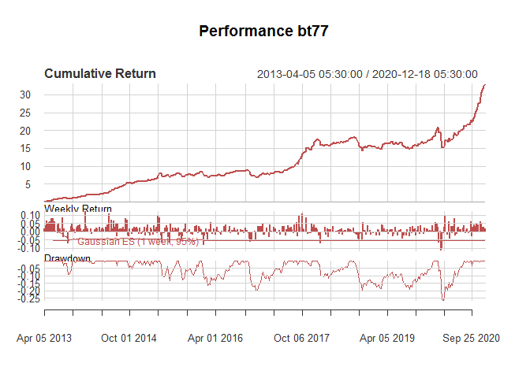

    ## NULL

For this portfolio specification, weights from the (latest at the time of writing) Rebalancing of 2020-Nov show up as tabulated here:

|  GOLDBEES|  PFIZER.NS|   N10GS|    TSLA|     UUP|
|---------:|----------:|-------:|-------:|-------:|
|    0.4456|     0.3260|  0.0838|  0.0820|  0.0626|

Appendix: Runtime Environment
=============================

Here's the runtime environment used. It's reported here for reproducibility:

``` r
sessionInfo() # Sys.info()[['sysname']]
```

    ## R version 3.6.2 (2019-12-12)
    ## Platform: x86_64-w64-mingw32/x64 (64-bit)
    ## Running under: Windows 8.1 x64 (build 9600)
    ## 
    ## Matrix products: default
    ## 
    ## locale:
    ## [1] LC_COLLATE=English_India.1252  LC_CTYPE=English_India.1252   
    ## [3] LC_MONETARY=English_India.1252 LC_NUMERIC=C                  
    ## [5] LC_TIME=English_India.1252    
    ## 
    ## attached base packages:
    ## [1] parallel  stats     graphics  grDevices utils     datasets  methods  
    ## [8] base     
    ## 
    ## other attached packages:
    ##  [1] quadprog_1.5-8             Rglpk_0.6-4               
    ##  [3] slam_0.1-47                unikn_0.3.0               
    ##  [5] PortfolioAnalytics_1.1.0   PerformanceAnalytics_2.0.4
    ##  [7] foreach_1.4.8              xts_0.12.1                
    ##  [9] zoo_1.8-7                  ROI.plugin.quadprog_1.0-0 
    ## [11] ROI.plugin.glpk_1.0-0      ROI_1.0-0                 
    ## [13] DEoptim_2.2-5             
    ## 
    ## loaded via a namespace (and not attached):
    ##  [1] Rcpp_1.0.3          pillar_1.4.3        compiler_3.6.2     
    ##  [4] iterators_1.0.12    tools_3.6.2         digest_0.6.24      
    ##  [7] tibble_2.1.3        evaluate_0.14       lifecycle_0.1.0    
    ## [10] gtable_0.3.0        lattice_0.20-38     pkgconfig_2.0.3    
    ## [13] rlang_0.4.4         registry_0.5-1      yaml_2.2.1         
    ## [16] xfun_0.19           dplyr_0.8.3         stringr_1.4.0      
    ## [19] knitr_1.27          tidyselect_0.2.5    grid_3.6.2         
    ## [22] glue_1.3.1          R6_2.4.1            rmarkdown_2.1      
    ## [25] purrr_0.3.3         ggplot2_3.3.2       magrittr_1.5       
    ## [28] scales_1.1.0        codetools_0.2-16    htmltools_0.4.0    
    ## [31] assertthat_0.2.1    colorspace_1.4-1    numDeriv_2016.8-1.1
    ## [34] stringi_1.4.6       munsell_0.5.0       crayon_1.3.4
