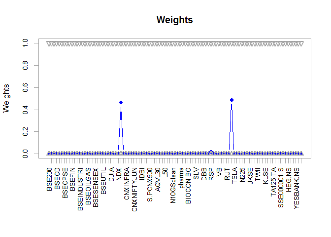
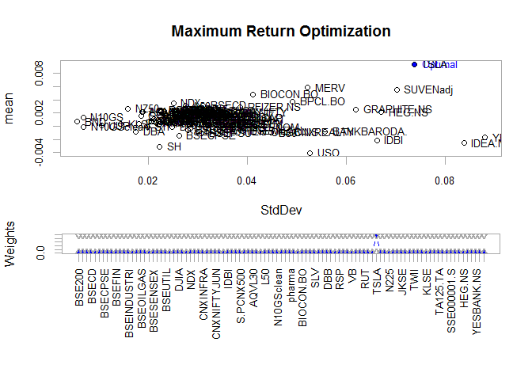
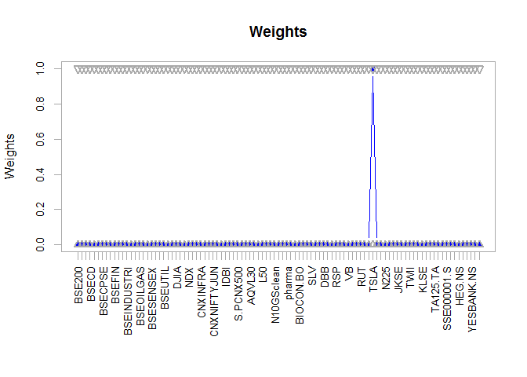
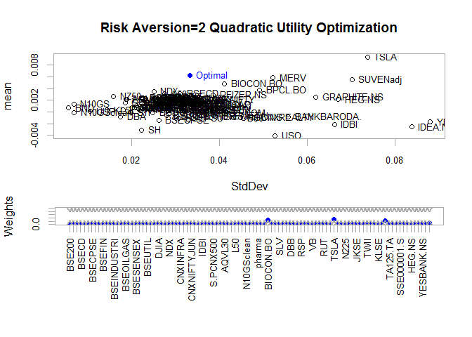
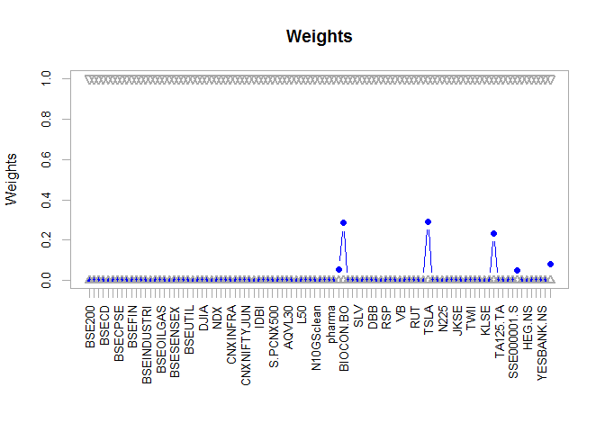
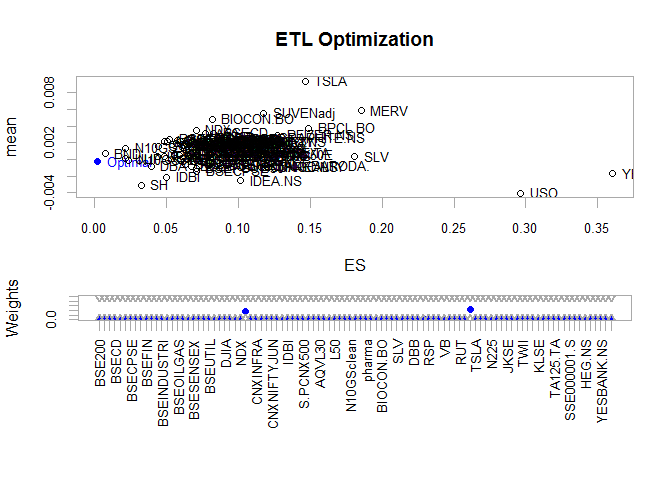
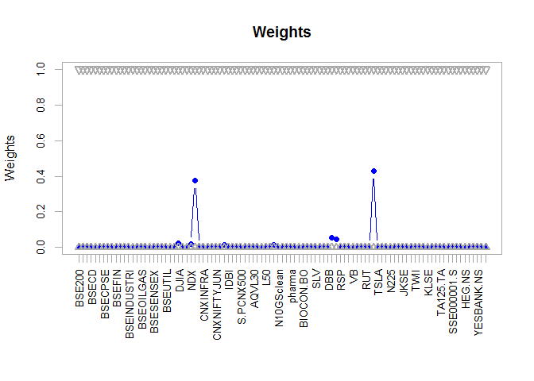
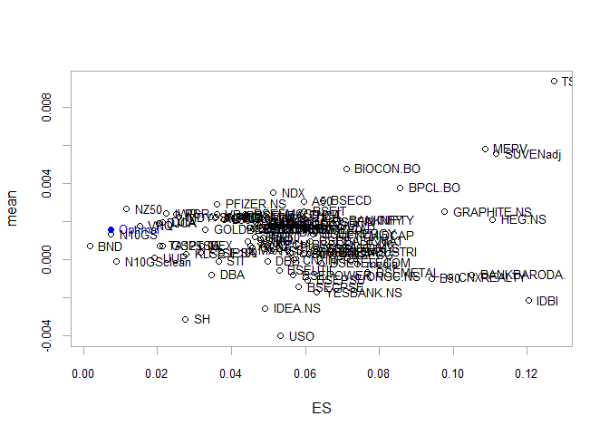
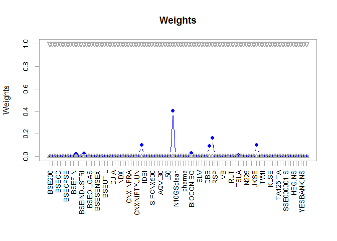
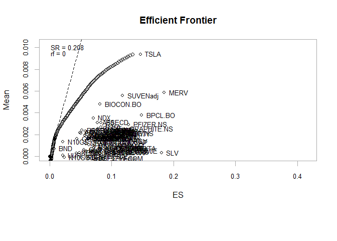

Exploring Objectives with `R`-Optimization Infrastructure (`ROI`)
================
Vinit Kaushik.
December 22, 2020

We shall adapt various vignettes for this research viewpoint, while building further on what's discussed at earlier viewpoint [Risk-free Nay Ratna](https://github.com/yadevinit/pf4pf/blob/main/riskfreeNayRatna.md). That way, we raise workability and avoid inadvertent programming errors. From each heading's hyperlink, readers can also refer to the vignette for the corresponding heading's text to aid understanding. As a vignette says, this is to "solve complex optimization problems." The reader might find this viewpoint technically challenging, but wading through this will help the reader prefer a smaller set of Objectives to refine further (e.g., using custom Moments) and have them tested in out-of-sample settings using re-balancing, before possibly considering investing using them. The [author](mailto:yadevinit@gmail.com) recommends that the reader at least browse through the content under heading [6.4 Maximize quadratic utility with ROI](#maximize-quadratic-utility-with-roi); that seems to call for further support using a coherent risk measure `ES`, maybe superior Moment estimates, and out-of-sample test via re-balancing. And in case the reader wishes to challenge this viewpoint, study its `R`-source code, or extend it, (./momentObjective.Rmd) has the `R`markdown including libraries (packages) and other function definitions.

The data the author compiled for this viewpoint has daily price data from 2010-July for a universe of about 100 assets (stocks, indices, bonds, commodities, realty, and others) across India (considered an Emerging Market), USA (considered a Developed Market), and other regions of the world. Weekly *log returns* from that are used in this study, as recommended by some vignettes and researchers. (Given `p1` and `p2` successive asset prices, ordinarily return would be `-1 + p2/p1`; in contrast, *log return* would be `log(p2/p1) = log(p2) - log(p1)`.)

A. [Custom Moment and Objective Functions 2018-May](https://cran.r-project.org/web/packages/PortfolioAnalytics/vignettes/custom_moments_objectives.pdf) Adapted
===============================================================================================================================================================

1 Getting Started: Load Packages and Data
-----------------------------------------

``` r
source("gettingStarted.R")
```

    ## Warning in eval(ei, envir): cannot include others' data into repos

    ## Daily periodicity from 2010-07-01 05:30:00 to 2020-11-30 05:30:00 
    ## [1] 3567  118
    ## [1] 543  99
    ## An 'xts' object on 2010-07-18 05:30:00/2020-11-30 05:30:00 containing:
    ##   Data: num [1:543, 1:99] 0.00824 0.00759 -0.01018 0.01291 0.00535 ...
    ##  - attr(*, "dimnames")=List of 2
    ##   ..$ : NULL
    ##   ..$ : chr [1:99] "BSE200" "BSEAUTO" "BSEBASICMAT" "BSECD" ...
    ##   Indexed by objects of class: [POSIXct,POSIXt] TZ: 
    ##   xts Attributes:  
    ##  NULL

    ## Warning: package 'DEoptim' was built under R version 3.6.3

    ## Loading required package: parallel

    ## 
    ## DEoptim package
    ## Differential Evolution algorithm in R
    ## Authors: D. Ardia, K. Mullen, B. Peterson and J. Ulrich

    ## Loading required package: unikn

    ## Warning: package 'unikn' was built under R version 3.6.3

    ## Welcome to unikn (v0.3.0)!

    ## unikn.guide() opens user guides.


2 Setting the Portfolio Moments
-------------------------------

``` r
library(PortfolioAnalytics)
# Construct initial portfolio with basic constraints.
init.portFL <- portfolio.spec(assets=funds)
init.portFL <- add.constraint(portfolio=init.portFL, type="full_investment")
init.portFL <- add.constraint(portfolio=init.portFL, type="long_only")
# Portfolio with standard deviation as an objective
SD.portf <- add.objective(portfolio=init.portFL, type="risk", name="StdDev")
# Portfolio with expected shortfall as an objective
ES.portf <- add.objective(portfolio=init.portFL, type="risk", name="ES")
sd.moments <- set.portfolio.moments(R, SD.portf)
names(sd.moments)
```

    ## [1] "mu"    "sigma"

``` r
es.moments <- set.portfolio.moments(R, ES.portf)
names(es.moments)
```

    ## [1] "mu"    "sigma" "m3"    "m4"

3 Custom Moment Functions
-------------------------

``` r
sigma.robust <- function(R){
  require(MASS)
  out <- list()
  set.seed(1234)
  out$sigma <- cov.rob(R, method="mcd")$cov
    # Ref https://r.789695.n4.nabble.com/Using-optimize-portfolio-td4763805.html:
    # sigma <- cov(returns) # but then I changed it to
    # sigma <- cov(returns, use = "pairwise.complete.obs") # per Brian's suggestion
  return(out)
}
opt.sd <- optimize.portfolio(R, SD.portf,
  optimize_method="ROI",
  momentFUN="sigma.robust")
opt.sd
```

    ## ***********************************
    ## PortfolioAnalytics Optimization
    ## ***********************************
    ## 
    ## Call:
    ## optimize.portfolio(R = R, portfolio = SD.portf, optimize_method = "ROI", 
    ##     momentFUN = "sigma.robust")
    ## 
    ## Optimal Weights:
    ##      BSE200     BSEAUTO BSEBASICMAT       BSECD     BSECDGS       BSECG 
    ##      0.0000      0.0000      0.0000      0.0000      0.0000      0.0000 
    ##     BSECPSE BSEDOLLEX20   BSEENERGY      BSEFIN     BSEFMCG BSEHEALTHCA 
    ##      0.0000      0.0000      0.0003      0.0000      0.0000      0.0000 
    ## BSEINDUSTRI       BSEIT    BSEMETAL   BSEOILGAS    BSEPOWER      BSEPSU 
    ##      0.0000      0.0000      0.0000      0.0000      0.0000      0.0000 
    ##   BSESENSEX     BSETECK  BSETELECOM     BSEUTIL         DAX        DJCA 
    ##      0.0000      0.0000      0.0000      0.0000      0.0000      0.0018 
    ##        DJIA     FTSE100         HSI         NDX      SNP500   BANKNIFTY 
    ##      0.0019      0.0000      0.0000      0.0000      0.4640      0.0000 
    ##    CNXINFRA       CNXIT   CNXMIDCAP CNXNIFTYJUN   CNXREALTY    GOLDBEES 
    ##      0.0000      0.0000      0.0000      0.0000      0.0000      0.0010 
    ##        IDBI        INFY NIFTYMIDCAP   S.PCNX500     SENIFTY         A50 
    ##      0.0005      0.0007      0.0000      0.0000      0.0000      0.0000 
    ##      AQVL30         B50 commodities         L50       media       N10GS 
    ##      0.0000      0.0000      0.0000      0.0000      0.0000      0.0031 
    ##  N10GSclean        NE50  NGrowthS15      pharma      V20N50     BPCL.BO 
    ##      0.0000      0.0000      0.0000      0.0000      0.0000      0.0000 
    ##   BIOCON.BO         VNQ         GLD         SLV         DBA         USO 
    ##      0.0000      0.0000      0.0021      0.0000      0.0030      0.0000 
    ##         DBB         BND         UUP         RSP         IWR         MDY 
    ##      0.0000      0.0081      0.0060      0.0182      0.0000      0.0000 
    ##          VB         IJR       W5000         RUT         IWM          SH 
    ##      0.0000      0.0000      0.0000      0.0000      0.0000      0.4881 
    ##        TSLA        FCHI    STOXX50E        N225         BFX         STI 
    ##      0.0000      0.0003      0.0000      0.0000      0.0000      0.0000 
    ##        JKSE        NZ50        KS11        TWII      GSPTSE         MXX 
    ##      0.0003      0.0000      0.0000      0.0000      0.0000      0.0000 
    ##        KLSE        IPSA        MERV    TA125.TA        SSMI        AXJO 
    ##      0.0000      0.0000      0.0000      0.0000      0.0000      0.0005 
    ## SSE000001.S   PFIZER.NS GRAPHITE.NS      HEG.NS     ONGC.NS BANKBARODA. 
    ##      0.0000      0.0000      0.0000      0.0000      0.0000      0.0000 
    ##  YESBANK.NS     IDEA.NS    SUVENadj 
    ##      0.0000      0.0000      0.0000 
    ## 
    ## Objective Measure:
    ##    StdDev 
    ## 0.0004377

``` r
  # Beware: possibly due to data range, this output differs
  # from that of vignette (though the Objective StdDev is close) which says:
  # Optimal Weights:
  # CA CTAG DS EM
  # 0.6598 0.1441 0.1961 0.0000
  # Objective Measure:
  # StdDev
  # 0.008646
  # but StdDev verifies sqrt() == extractObjectiveMeasures()$StdDev.
  # So, robust estimate of the covariance matrix was indeed used.
weights <- extractWeights(opt.sd)
sigma <- sigma.robust(R)$sigma
sqrt(t(weights) %*% sigma %*% weights)
```

    ##              [,1]
    ## [1,] 0.0004377499

``` r
extractObjectiveMeasures(opt.sd)$StdDev
```

    ##       StdDev 
    ## 0.0004377499

``` r
chart.Weights(opt.sd)
```



B. [Introduction to PortfolioAnalytics 2018-May](https://cran.r-project.org/web/packages/PortfolioAnalytics/vignettes/portfolio_vignette.pdf) Adapted
=====================================================================================================================================================

6.1 Initial Portfolio Object
----------------------------

``` r
if(matchVignette){
  data(edhec)
  R <- edhec[cDateRange, 1:6]
  colnames(R) <- c("CA", "CTAG", "DS", "EM", "EQMN", "ED")
  dim(R)
  head(R, 2); tail(R, 2)
  funds <- colnames(R)
  # Create an initial portfolio object with leverage and box constraints
  init <- portfolio.spec(assets=funds)
  init <- add.constraint(portfolio=init, type="leverage",
    min_sum=0.99, max_sum=1.01)
  init <- add.constraint(portfolio=init, type="box", min=0.05, max=0.65)
} else {
  init <- init.portFL # portf0LI
}
```

6.2 Maximize mean return with ROI
---------------------------------

``` r
maxret <- add.objective(portfolio=init.portFL, type="return", name="mean")
print(maxret)
```

    ## **************************************************
    ## PortfolioAnalytics Portfolio Specification 
    ## **************************************************
    ## 
    ## Call:
    ## portfolio.spec(assets = funds)
    ## 
    ## Number of assets: 99 
    ## Asset Names
    ##  [1] "BSE200"      "BSEAUTO"     "BSEBASICMAT" "BSECD"       "BSECDGS"    
    ##  [6] "BSECG"       "BSECPSE"     "BSEDOLLEX20" "BSEENERGY"   "BSEFIN"     
    ## More than 10 assets, only printing the first 10
    ## 
    ## Constraints
    ## Enabled constraint types
    ##      - full_investment 
    ##      - long_only 
    ## 
    ## Objectives:
    ## Enabled objective names
    ##      - mean

``` r
# Run the optimization.
opt_maxret <- optimize.portfolio(R=R, portfolio=maxret, optimize_method="ROI", trace=TRUE)
print(opt_maxret)
```

    ## ***********************************
    ## PortfolioAnalytics Optimization
    ## ***********************************
    ## 
    ## Call:
    ## optimize.portfolio(R = R, portfolio = maxret, optimize_method = "ROI", 
    ##     trace = TRUE)
    ## 
    ## Optimal Weights:
    ##      BSE200     BSEAUTO BSEBASICMAT       BSECD     BSECDGS       BSECG 
    ##           0           0           0           0           0           0 
    ##     BSECPSE BSEDOLLEX20   BSEENERGY      BSEFIN     BSEFMCG BSEHEALTHCA 
    ##           0           0           0           0           0           0 
    ## BSEINDUSTRI       BSEIT    BSEMETAL   BSEOILGAS    BSEPOWER      BSEPSU 
    ##           0           0           0           0           0           0 
    ##   BSESENSEX     BSETECK  BSETELECOM     BSEUTIL         DAX        DJCA 
    ##           0           0           0           0           0           0 
    ##        DJIA     FTSE100         HSI         NDX      SNP500   BANKNIFTY 
    ##           0           0           0           0           0           0 
    ##    CNXINFRA       CNXIT   CNXMIDCAP CNXNIFTYJUN   CNXREALTY    GOLDBEES 
    ##           0           0           0           0           0           0 
    ##        IDBI        INFY NIFTYMIDCAP   S.PCNX500     SENIFTY         A50 
    ##           0           0           0           0           0           0 
    ##      AQVL30         B50 commodities         L50       media       N10GS 
    ##           0           0           0           0           0           0 
    ##  N10GSclean        NE50  NGrowthS15      pharma      V20N50     BPCL.BO 
    ##           0           0           0           0           0           0 
    ##   BIOCON.BO         VNQ         GLD         SLV         DBA         USO 
    ##           0           0           0           0           0           0 
    ##         DBB         BND         UUP         RSP         IWR         MDY 
    ##           0           0           0           0           0           0 
    ##          VB         IJR       W5000         RUT         IWM          SH 
    ##           0           0           0           0           0           0 
    ##        TSLA        FCHI    STOXX50E        N225         BFX         STI 
    ##           1           0           0           0           0           0 
    ##        JKSE        NZ50        KS11        TWII      GSPTSE         MXX 
    ##           0           0           0           0           0           0 
    ##        KLSE        IPSA        MERV    TA125.TA        SSMI        AXJO 
    ##           0           0           0           0           0           0 
    ## SSE000001.S   PFIZER.NS GRAPHITE.NS      HEG.NS     ONGC.NS BANKBARODA. 
    ##           0           0           0           0           0           0 
    ##  YESBANK.NS     IDEA.NS    SUVENadj 
    ##           0           0           0 
    ## 
    ## Objective Measure:
    ##     mean 
    ## 0.009382

``` r
plot(opt_maxret, risk.col="StdDev", return.col="mean",
  main="Maximum Return Optimization", chart.assets=TRUE)
```



``` r
  # , xlim=c(0, 0.05), ylim=c(0,0.0085)
# extractStats(opt_maxret)
chart.Weights(opt_maxret)
```

 That does maximize (mean) return, but if the investor is unwilling to tolerate the associated risk (or in this case, volatility in the form of `StdDev`) and such a concentrated portfolio, we need to explore further.

6.4 Maximize quadratic utility with ROI
---------------------------------------

You might recall earlier research viewpoint [Nay Ratna](https://github.com/yadevinit/pf4pf/blob/main/nayRatna/nayRatna.md) sharing a commitment to transform the wealth ecosystem onto another realm of growth with harmonized incentive structures, e.g., a business model with fees based on Net Present Value. That seems to be consistent with an investor-customizable risk aversion, as part of a (CRRA-maximization or other) portfolio objective. And the harmonization vibes with ["Skin in the Game: Hidden Asymmetries in Daily Life"](https://en.wikipedia.org/wiki/Skin_in_the_Game_(book)):

> If an actor pockets some rewards from a policy they enact or support without accepting any of the risks, economists consider it to be a problem of "missing incentives". In contrast, to Taleb, the problem is more fundamentally one of asymmetry: one actor gets the rewards, the other is stuck with the risks.\[1\] Taleb argues that "For social justice, focus on symmetry and risk sharing. You cannot make profits and transfer the risks to others, as bankers and large corporations do ... Forcing skin in the game corrects this asymmetry better than thousands of laws and regulations."

``` r
qu <- add.objective(portfolio=init.portFL, type="return", name="mean")
qu <- add.objective(portfolio=qu, type="risk", name="var", risk_aversion=quRiskAversion)
# Run the optimization.
opt_qu <- optimize.portfolio(R=R, portfolio=qu, optimize_method="ROI", trace=TRUE)
print(opt_qu)
```

    ## ***********************************
    ## PortfolioAnalytics Optimization
    ## ***********************************
    ## 
    ## Call:
    ## optimize.portfolio(R = R, portfolio = qu, optimize_method = "ROI", 
    ##     trace = TRUE)
    ## 
    ## Optimal Weights:
    ##      BSE200     BSEAUTO BSEBASICMAT       BSECD     BSECDGS       BSECG 
    ##      0.0000      0.0000      0.0000      0.0000      0.0000      0.0000 
    ##     BSECPSE BSEDOLLEX20   BSEENERGY      BSEFIN     BSEFMCG BSEHEALTHCA 
    ##      0.0000      0.0000      0.0000      0.0000      0.0000      0.0000 
    ## BSEINDUSTRI       BSEIT    BSEMETAL   BSEOILGAS    BSEPOWER      BSEPSU 
    ##      0.0000      0.0000      0.0000      0.0000      0.0000      0.0000 
    ##   BSESENSEX     BSETECK  BSETELECOM     BSEUTIL         DAX        DJCA 
    ##      0.0000      0.0000      0.0000      0.0000      0.0000      0.0000 
    ##        DJIA     FTSE100         HSI         NDX      SNP500   BANKNIFTY 
    ##      0.0000      0.0000      0.0000      0.0000      0.0000      0.0000 
    ##    CNXINFRA       CNXIT   CNXMIDCAP CNXNIFTYJUN   CNXREALTY    GOLDBEES 
    ##      0.0000      0.0000      0.0000      0.0000      0.0000      0.0000 
    ##        IDBI        INFY NIFTYMIDCAP   S.PCNX500     SENIFTY         A50 
    ##      0.0000      0.0000      0.0000      0.0000      0.0000      0.0000 
    ##      AQVL30         B50 commodities         L50       media       N10GS 
    ##      0.0000      0.0000      0.0000      0.0000      0.0000      0.0000 
    ##  N10GSclean        NE50  NGrowthS15      pharma      V20N50     BPCL.BO 
    ##      0.0000      0.0000      0.0000      0.0000      0.0000      0.0562 
    ##   BIOCON.BO         VNQ         GLD         SLV         DBA         USO 
    ##      0.2859      0.0000      0.0000      0.0000      0.0000      0.0000 
    ##         DBB         BND         UUP         RSP         IWR         MDY 
    ##      0.0000      0.0000      0.0000      0.0000      0.0000      0.0000 
    ##          VB         IJR       W5000         RUT         IWM          SH 
    ##      0.0000      0.0000      0.0000      0.0000      0.0000      0.0000 
    ##        TSLA        FCHI    STOXX50E        N225         BFX         STI 
    ##      0.2918      0.0000      0.0000      0.0000      0.0000      0.0000 
    ##        JKSE        NZ50        KS11        TWII      GSPTSE         MXX 
    ##      0.0000      0.0000      0.0000      0.0000      0.0000      0.0000 
    ##        KLSE        IPSA        MERV    TA125.TA        SSMI        AXJO 
    ##      0.0000      0.0000      0.2344      0.0000      0.0000      0.0000 
    ## SSE000001.S   PFIZER.NS GRAPHITE.NS      HEG.NS     ONGC.NS BANKBARODA. 
    ##      0.0000      0.0516      0.0000      0.0000      0.0000      0.0000 
    ##  YESBANK.NS     IDEA.NS    SUVENadj 
    ##      0.0000      0.0000      0.0801 
    ## 
    ## Objective Measure:
    ##     mean 
    ## 0.006288 
    ## 
    ## 
    ##  StdDev 
    ## 0.03318

``` r
  # Output differs from vignette's, especially weights for DS and EM assets and objectives
  # mean and StdDev:
  # Optimal Weights:
  # CA CTAG DS EM EQMN ED
  # 0.0500 0.0500 0.2714 0.5386 0.0500 0.0500
  # Objective Measure:
  # mean
  # 0.007926
  # StdDev
  # 0.02663
plot(opt_qu, risk.col="StdDev", return.col="mean",
  main=paste0("Risk Aversion=", quRiskAversion, " Quadratic Utility Optimization"),
  chart.assets=TRUE) # , xlim=c(0, 0.05), ylim=c(0, 0.0085)
```



``` r
chart.Weights(opt_qu)
```



[A Machine Learning Integrated Portfolio Rebalance Framework with Risk-Aversion Adjustment](https://www.mdpi.com/1911-8074/13/7/155) offers some insights: &gt; Though the mean-variance model is widely used in practice, it has two main well-known limitations. The solution of the mean-variance model is consistent with the principle of utility maximization only if the asset returns are normally distributed or the utility function is quadratic, where the normality and quadraticity are not usually satisfied in the real financial world. ... The efficient solutions of the bi-objective mean-risk portfolios can typically be achieved by solvingone of the three optimization models: (1) maximizing the expected return subject to an upper-bounded budget level on the risk measure; (2) minimizing the risk measure while requiring the mean return to exceed an acceptable threshold value; (3) maximizing the risk-adjusted mean return, which takes the form of mean return less the risk measure multiplied by a risk-aversion coefficient selected by the investor. This risk-aversion coefficient represents the preference or risk attitude of the investor toward the market environment, which is a reflection of the market trend.

6.5 Minimize expected tail loss with ROI
----------------------------------------

If the exploration so far is making the investor loss averse, let's take this position now, with a coherent measure of risk `ETL` (also known as `CVaR` or `ES`) instead of `StdDev`.

``` r
etl <- add.objective(portfolio=init.portFL, type="risk", name="ETL")
# Run the optimization.
opt_etl <- optimize.portfolio(R=R, portfolio=etl, optimize_method="ROI", trace=TRUE)
print(opt_etl)
```

    ## ***********************************
    ## PortfolioAnalytics Optimization
    ## ***********************************
    ## 
    ## Call:
    ## optimize.portfolio(R = R, portfolio = etl, optimize_method = "ROI", 
    ##     trace = TRUE)
    ## 
    ## Optimal Weights:
    ##      BSE200     BSEAUTO BSEBASICMAT       BSECD     BSECDGS       BSECG 
    ##      0.0000      0.0000      0.0000      0.0000      0.0000      0.0000 
    ##     BSECPSE BSEDOLLEX20   BSEENERGY      BSEFIN     BSEFMCG BSEHEALTHCA 
    ##      0.0000      0.0000      0.0000      0.0000      0.0030      0.0000 
    ## BSEINDUSTRI       BSEIT    BSEMETAL   BSEOILGAS    BSEPOWER      BSEPSU 
    ##      0.0000      0.0000      0.0000      0.0000      0.0000      0.0000 
    ##   BSESENSEX     BSETECK  BSETELECOM     BSEUTIL         DAX        DJCA 
    ##      0.0000      0.0000      0.0000      0.0000      0.0000      0.0059 
    ##        DJIA     FTSE100         HSI         NDX      SNP500   BANKNIFTY 
    ##      0.0246      0.0000      0.0000      0.0186      0.3745      0.0000 
    ##    CNXINFRA       CNXIT   CNXMIDCAP CNXNIFTYJUN   CNXREALTY    GOLDBEES 
    ##      0.0000      0.0000      0.0000      0.0000      0.0000      0.0132 
    ##        IDBI        INFY NIFTYMIDCAP   S.PCNX500     SENIFTY         A50 
    ##      0.0000      0.0030      0.0000      0.0000      0.0000      0.0000 
    ##      AQVL30         B50 commodities         L50       media       N10GS 
    ##      0.0000      0.0000      0.0000      0.0000      0.0000      0.0125 
    ##  N10GSclean        NE50  NGrowthS15      pharma      V20N50     BPCL.BO 
    ##      0.0000      0.0000      0.0000      0.0000      0.0000      0.0000 
    ##   BIOCON.BO         VNQ         GLD         SLV         DBA         USO 
    ##      0.0011      0.0000      0.0000      0.0000      0.0052      0.0000 
    ##         DBB         BND         UUP         RSP         IWR         MDY 
    ##      0.0000      0.0565      0.0457      0.0009      0.0000      0.0000 
    ##          VB         IJR       W5000         RUT         IWM          SH 
    ##      0.0000      0.0000      0.0000      0.0000      0.0000      0.4277 
    ##        TSLA        FCHI    STOXX50E        N225         BFX         STI 
    ##      0.0000      0.0000      0.0000      0.0000      0.0000      0.0000 
    ##        JKSE        NZ50        KS11        TWII      GSPTSE         MXX 
    ##      0.0000      0.0000      0.0000      0.0000      0.0000      0.0000 
    ##        KLSE        IPSA        MERV    TA125.TA        SSMI        AXJO 
    ##      0.0000      0.0069      0.0000      0.0000      0.0000      0.0000 
    ## SSE000001.S   PFIZER.NS GRAPHITE.NS      HEG.NS     ONGC.NS BANKBARODA. 
    ##      0.0000      0.0007      0.0000      0.0000      0.0000      0.0000 
    ##  YESBANK.NS     IDEA.NS    SUVENadj 
    ##      0.0000      0.0000      0.0000 
    ## 
    ## Objective Measure:
    ##      ETL 
    ## 0.002683

``` r
# Differs from vignette's CTAG and EQMN weights as well as objective ETL:
# Optimal Weights:
# CA CTAG DS EM EQMN ED
# 0.0500 0.2968 0.0500 0.0500 0.4932 0.0500
# Objective Measure:
# ETL
# 0.01967
plot(opt_etl, risk.col="ES", return.col="mean", main="ETL Optimization", chart.assets=TRUE)
```



``` r
  # , xlim=c(0, 0.14), ylim=c(0,0.0085)
chart.Weights(opt_etl)
```



C. [Maximizing Modified Sharpe Ratio Demo 2014](https://github.com/braverock/PortfolioAnalytics/blob/master/demo/demo_max_STARR.R) Adapted
==========================================================================================================================================

This gets you what's called as a tangency portfolio. Positioning for a mean return beyond that tangency position forces the investor to also tolerate disproportionately-higher risk. This tangency position is visualized in the Efficienct Frontier charted ahead.

``` r
#' This script demonstrates how to solve a constrained portfolio optimization 
#' problem to maximize modified Sharpe Ratio using ES as the risk measure.
# full_investment and long_only without relaxed weights are preferred.
init.portf <- add.objective(portfolio=init.portFL, type="return", name="mean")
init.portf <- add.objective(portfolio=init.portf, type="risk", name="ES",
                            arguments=list(p=0.925))
init.portf
```

    ## **************************************************
    ## PortfolioAnalytics Portfolio Specification 
    ## **************************************************
    ## 
    ## Call:
    ## portfolio.spec(assets = funds)
    ## 
    ## Number of assets: 99 
    ## Asset Names
    ##  [1] "BSE200"      "BSEAUTO"     "BSEBASICMAT" "BSECD"       "BSECDGS"    
    ##  [6] "BSECG"       "BSECPSE"     "BSEDOLLEX20" "BSEENERGY"   "BSEFIN"     
    ## More than 10 assets, only printing the first 10
    ## 
    ## Constraints
    ## Enabled constraint types
    ##      - full_investment 
    ##      - long_only 
    ## 
    ## Objectives:
    ## Enabled objective names
    ##      - mean 
    ##      - ES

``` r
#' Maximizing STARR Ratio can be formulated as a linear programming 
#' problem and solved very quickly using optimize_method="ROI". 
#' The default action if "mean" and "ES" are specified as objectives with
#' optimize_method="ROI" is to maximize STARR. If we want to use
#' both mean and ES in the objective function, but only minimize ES, we need to 
#' pass in maxSTARR=FALSE to optimize.portfolio.
maxSTARR.lo.ROI <- optimize.portfolio(R=R, portfolio=init.portf, optimize_method="ROI",
  trace=TRUE) # maxSTARR=TRUE default for mean-ES
maxSTARR.lo.ROI
```

    ## ***********************************
    ## PortfolioAnalytics Optimization
    ## ***********************************
    ## 
    ## Call:
    ## optimize.portfolio(R = R, portfolio = init.portf, optimize_method = "ROI", 
    ##     trace = TRUE)
    ## 
    ## Optimal Weights:
    ##      BSE200     BSEAUTO BSEBASICMAT       BSECD     BSECDGS       BSECG 
    ##      0.0000      0.0000      0.0000      0.0000      0.0000      0.0000 
    ##     BSECPSE BSEDOLLEX20   BSEENERGY      BSEFIN     BSEFMCG BSEHEALTHCA 
    ##      0.0000      0.0000      0.0000      0.0000      0.0214      0.0000 
    ## BSEINDUSTRI       BSEIT    BSEMETAL   BSEOILGAS    BSEPOWER      BSEPSU 
    ##      0.0000      0.0261      0.0000      0.0000      0.0000      0.0000 
    ##   BSESENSEX     BSETECK  BSETELECOM     BSEUTIL         DAX        DJCA 
    ##      0.0000      0.0000      0.0000      0.0000      0.0000      0.0000 
    ##        DJIA     FTSE100         HSI         NDX      SNP500   BANKNIFTY 
    ##      0.0000      0.0000      0.0000      0.0016      0.0000      0.0000 
    ##    CNXINFRA       CNXIT   CNXMIDCAP CNXNIFTYJUN   CNXREALTY    GOLDBEES 
    ##      0.0000      0.0000      0.0000      0.0000      0.0000      0.1057 
    ##        IDBI        INFY NIFTYMIDCAP   S.PCNX500     SENIFTY         A50 
    ##      0.0000      0.0000      0.0000      0.0000      0.0000      0.0000 
    ##      AQVL30         B50 commodities         L50       media       N10GS 
    ##      0.0000      0.0000      0.0000      0.0000      0.0000      0.4066 
    ##  N10GSclean        NE50  NGrowthS15      pharma      V20N50     BPCL.BO 
    ##      0.0000      0.0000      0.0000      0.0000      0.0000      0.0000 
    ##   BIOCON.BO         VNQ         GLD         SLV         DBA         USO 
    ##      0.0322      0.0000      0.0000      0.0000      0.0000      0.0000 
    ##         DBB         BND         UUP         RSP         IWR         MDY 
    ##      0.0000      0.0945      0.1654      0.0000      0.0000      0.0000 
    ##          VB         IJR       W5000         RUT         IWM          SH 
    ##      0.0000      0.0000      0.0000      0.0000      0.0000      0.0000 
    ##        TSLA        FCHI    STOXX50E        N225         BFX         STI 
    ##      0.0153      0.0000      0.0000      0.0000      0.0000      0.0000 
    ##        JKSE        NZ50        KS11        TWII      GSPTSE         MXX 
    ##      0.0000      0.1029      0.0000      0.0000      0.0000      0.0000 
    ##        KLSE        IPSA        MERV    TA125.TA        SSMI        AXJO 
    ##      0.0000      0.0000      0.0069      0.0000      0.0000      0.0000 
    ## SSE000001.S   PFIZER.NS GRAPHITE.NS      HEG.NS     ONGC.NS BANKBARODA. 
    ##      0.0028      0.0118      0.0000      0.0000      0.0000      0.0000 
    ##  YESBANK.NS     IDEA.NS    SUVENadj 
    ##      0.0024      0.0000      0.0044 
    ## 
    ## Objective Measure:
    ##     mean 
    ## 0.001581 
    ## 
    ## 
    ##       ES 
    ## 0.007594

``` r
chart.RiskReward(maxSTARR.lo.ROI, risk.col="ES", return.col="mean", chart.assets=TRUE)
```



``` r
chart.Weights(maxSTARR.lo.ROI)
```



``` r
# Calculate STARR ratio from efficient frontier and optimization; they are identical:
ef2 <- create.EfficientFrontier(R=R, portfolio=init.portf, type="mean-ES", n.portfolios=100)
```

    ## Warning: executing %dopar% sequentially: no parallel backend registered

``` r
max(ef2$frontier[,"mean"] / ef2$frontier[,"ES"])
```

    ## [1] 0.2080282

``` r
maxSTARR.lo.ROI$objective_measures$mean / maxSTARR.lo.ROI$objective_measures$ES
```

    ## [1] 0.2082183

``` r
chart.EfficientFrontier(ef2)
```



Appendix
========

Here's the runtime environment used. It's reported here for reproducibility:

``` r
sessionInfo() # Sys.info()[['sysname']]
```

    ## R version 3.6.2 (2019-12-12)
    ## Platform: x86_64-w64-mingw32/x64 (64-bit)
    ## Running under: Windows 8.1 x64 (build 9600)
    ## 
    ## Matrix products: default
    ## 
    ## locale:
    ## [1] LC_COLLATE=English_India.1252  LC_CTYPE=English_India.1252   
    ## [3] LC_MONETARY=English_India.1252 LC_NUMERIC=C                  
    ## [5] LC_TIME=English_India.1252    
    ## 
    ## attached base packages:
    ## [1] parallel  stats     graphics  grDevices utils     datasets  methods  
    ## [8] base     
    ## 
    ## other attached packages:
    ##  [1] unikn_0.3.0                DEoptim_2.2-5             
    ##  [3] ROI.plugin.quadprog_1.0-0  ROI.plugin.glpk_1.0-0     
    ##  [5] ROI_1.0-0                  MASS_7.3-51.4             
    ##  [7] PortfolioAnalytics_1.1.0   PerformanceAnalytics_2.0.4
    ##  [9] foreach_1.4.8              xts_0.12.1                
    ## [11] zoo_1.8-7                 
    ## 
    ## loaded via a namespace (and not attached):
    ##  [1] Rcpp_1.0.3          pillar_1.4.3        compiler_3.6.2     
    ##  [4] iterators_1.0.12    tools_3.6.2         digest_0.6.24      
    ##  [7] tibble_2.1.3        evaluate_0.14       lifecycle_0.1.0    
    ## [10] gtable_0.3.0        lattice_0.20-38     pkgconfig_2.0.3    
    ## [13] rlang_0.4.4         registry_0.5-1      Rglpk_0.6-4        
    ## [16] yaml_2.2.1          xfun_0.19           dplyr_0.8.3        
    ## [19] stringr_1.4.0       knitr_1.27          tidyselect_0.2.5   
    ## [22] grid_3.6.2          glue_1.3.1          R6_2.4.1           
    ## [25] rmarkdown_2.1       purrr_0.3.3         ggplot2_3.3.2      
    ## [28] magrittr_1.5        scales_1.1.0        codetools_0.2-16   
    ## [31] htmltools_0.4.0     assertthat_0.2.1    colorspace_1.4-1   
    ## [34] numDeriv_2016.8-1.1 quadprog_1.5-8      stringi_1.4.6      
    ## [37] munsell_0.5.0       slam_0.1-47         crayon_1.3.4
