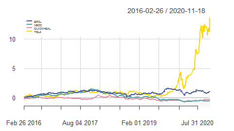
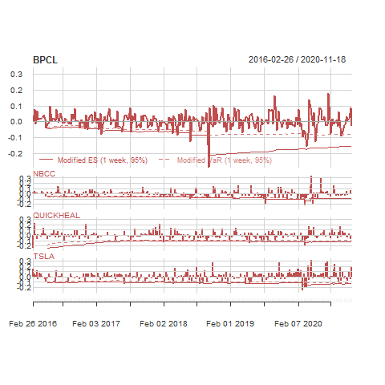
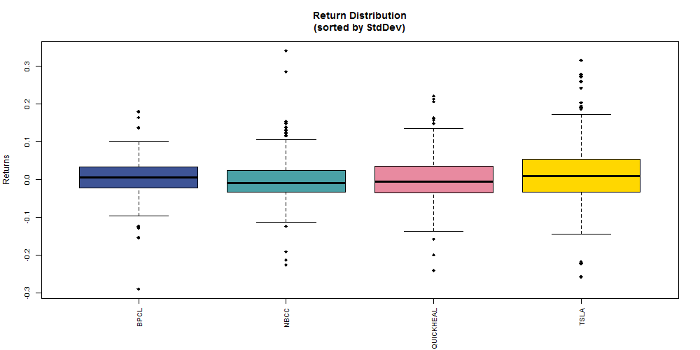
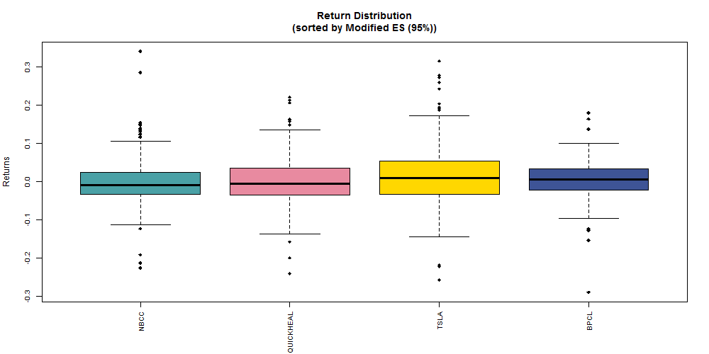
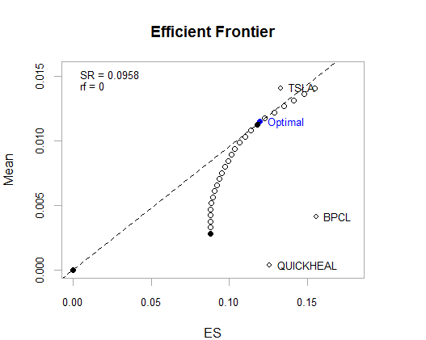
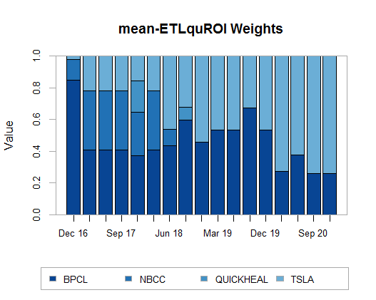
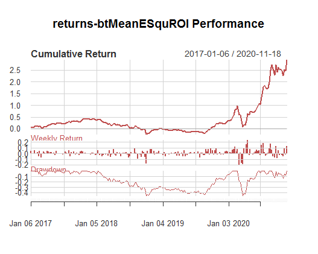
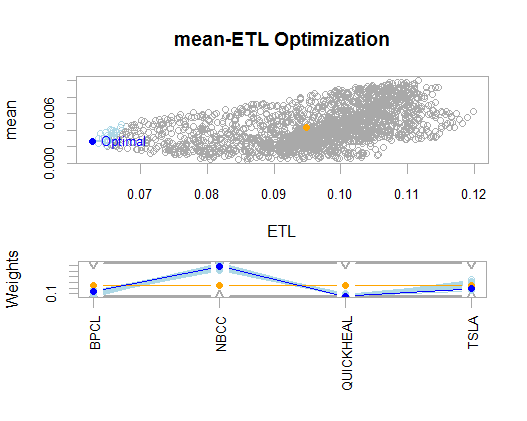

```{r setup, include=FALSE}
knitr::opts_chunk$set(echo = TRUE)
```

## Background
In early 2020-Nov, this [author](mailto:yadevinit@gmail.com) messaged his former schoolmates: "Struggling with Portfolio Optimization with an objective of maximizing Net Present Value. Didn't realize optimization was such a hard problem: maximizing (mean) return while also minimizing risk (Extreme Shortfall)". Some friends joked on the understandability. A friend asked if the author was into shares trading and messaged: "I have some. But down by 65%. Bought 6 years back. Sort of stuck. Not getting any positive solutions to mitigate the losses." Over a conversation, this friend agreed that we typically take such decisions one asset at a time: in isolation and considering each single asset's XIRR from point of purchase. The alternative generated was to explore a (composite) portfolio perspective, e.g., which welcomes assets that move differently to provide a superior risk-adjusted return.

Related courseware [Portfolio Management] is sobering though long. If you want to shorten the viewing, see after the 1-hour mark, e.g., here's a screenshot of [asset diversification that can offer a "near-free lunch"](./diversificationNearFreeLunch-2assetPf.png).

## Assets
The friend held shares of [NBCC], [BPCL], and [QUICKHEAL]. He was considering buying [TSLA]. Some of the stocks held are considered "Ratna" category; refer [List of Maharatna, Navratna and Miniratna CPSEs] or [Public sector undertakings in India]. Whether to say nay to Ratna was the dilemma he was dealing with; hence, this research viewpoint got its title.

The author compiled daily-return data for these assets. Their comulative-return performance shows [TSLA] has moved up significantly in the recent year:



The following plots weekly returns for the assets. It also plots (downside-) risk measures such as (Modified Extreme Shortfall) "Modified ES" estimated using rolling windows. You can also see those estimates getting breached, e.g., that breach for [BPCL] in late 2018 tells us that if all we hold is [BPCL] stock, we must be willing to tolerate a weekly (notional) "extreme" loss of over 30% and a more-routine (notional) loss of 8%-15% weekly. If we are unwilling to tolerate that downside risk, being fully invested in [BPCL] would be unsuitable for us and we must re-consider altering our holdings.



Popular media mentions Standard Deviation (`StdDev`) as a measure of risk. Following plot on the left shows (Boxplots of the return distribution of) the assets sorted in increasing order of `StdDev`. The plot on right has assets sorted in increasing order of `Modified ES`. (Also known as Extreme Tail Loss or Conditional Value at Risk, ES is a more-coherent measure that's now recommended as part of BASEL norms too.) You can see [BPCL] has relatively the least (estimated) `StdDev` but the most `Modified ES`, and there are outliers as well which could affect stability of estimates (and cannot be ignored for more-conservative investors):





## Quadratic-Utility Portfolio Optimization using Method ROI
Following are outputs from this approach:
```{R, eval=FALSE}
> extractStats(opt_qu)
       mean          ES         out      w.BPCL      w.NBCC w.QUICKHEAL      w.TSLA 
 0.01149878  0.11971382  0.11971382  0.26013091  0.00000000  0.00000000  0.73986909 
> extractWeights(opt_qu)
     BPCL      NBCC QUICKHEAL      TSLA 
0.2601309 0.0000000 0.0000000 0.7398691
```
While the optimal portfolio (for the given objectives and constraints) shows zero weight allocated to [NBCC] and [QUICKHEAL], [BPCL] gets a `0.26` weight, and [TSLA] gets the rest (totalling to `1.0`). So, there was merit in exploring a portfolio perspective for informing the friend's investment decision. The return-risk profiles of this optimized portfolio and its assets are charted on the left as shown, and the Efficient Frontier enveloping the feasible portfolios is shown on the right:




Optimizing with rebalancing shows the following allocation of weights, e.g., increasing weightage in recent times to [TSLA]:



And here are annualized measures and a chart summarizing the performance:
```{R, eval=FALSE}
> bt_qu.retPf <- Return.portfolio(R = returns, weights = extractWeights(bt_qu))
> colnames(bt_qu.retPf) # <- "btMeanESquROI"
[1] "portfolio.returns"
> colnames(bt_qu.retPf) <- "returns-btMeanESquROI"
> table.AnnualizedReturns(R=bt_qu.retPf)
                          returns-btMeanESquROI
Annualized Return                        0.4210
Annualized Std Dev                       0.4009
Annualized Sharpe (Rf=0%)                1.0501
> charts.PerformanceSummary(R=bt_qu.retPf)
```



What the above chart shows also is that to get that Cumulative Return, one has to withstand Drawdowns of over 40%.


## Random-Sample Method for Portfolio Optimization
Now, let's consider this different approach. The return-risk profiles of this optimized portfolio and the corresponding weights are charted as shown:



The chart shows the Random portfolios generated in grey. The optimal portfolio (in blue with some of its neighbours) has been selected from those. The orange dot shows an Equal-Weighted portfolio. The following optimization output shows weights allocated to all assets this time:
```{R, eval=FALSE}
> print(opt_meanETL)
***********************************
PortfolioAnalytics Optimization
***********************************

Call:
optimize.portfolio(R = R, portfolio = meanETL, optimize_method = "random", 
    search_size = 2000, trace = TRUE)

Optimal Weights:
     BPCL      NBCC QUICKHEAL      TSLA 
    0.142     0.594     0.052     0.192 

Objective Measures:
    mean 
0.002675 


    ETL 
0.06271 
```

## Way Forward
Now informed through this research viewpoint, the friend can choose a suitable portfolio approach for the longer term.

```{r, eval=FALSE, echo=FALSE}
print("Directly from optimization outputs, consider knitting performance charts and weights")
```

[Portfolio Management]: <https://www.youtube.com/watch?v=8TJQhQ2GZ0Y>
[NBCC]: <https://finance.yahoo.com/quote/NBCC.BO>
[BPCL]: <https://finance.yahoo.com/quote/BPCL.BO>
[QUICKHEAL]: <https://finance.yahoo.com/quote/QUICKHEAL.BO>
[TSLA]: <https://finance.yahoo.com/quote/TSLA>
[List of Maharatna, Navratna and Miniratna CPSEs]: <https://dpe.gov.in/about-us/divisions/list-maharatna-navratna-and-miniratna-cpses>
[Public sector undertakings in India]: <https://en.wikipedia.org/wiki/Public_sector_undertakings_in_India>
