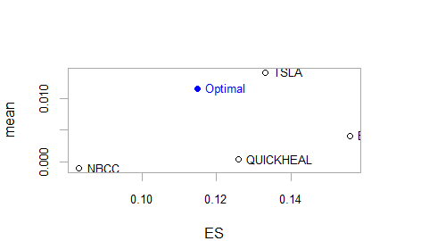

```{r setup, include=FALSE}
knitr::opts_chunk$set(echo = TRUE)
```

## Background
In early 2020-Nov, this [author](mailto:yadevinit@gmail.com) messaged his former schoolmates: "Struggling with Portfolio Optimization with an objective of maximizing Net Present Value. Didn't realize optimization was such a hard problem: maximizing (mean) return while also minimizing risk (Extreme Shortfall)". Some friends joked on the understandability. A friend asked if the author was into shares trading and messaged: "I have some. But down by 65%. Bought 6 years back. Sort of stuck. Not getting any positive solutions to mitigate the losses." Over a conversation, this friend agreed that we typically take such decisions one asset at a time: in isolation and considering each single asset's XIRR from point of purchase. The alternative generated was to explore a (composite) portfolio perspective, e.g., which welcomes assets that move differently to provide a superior risk-adjusted return.

Related courseware [Portfolio Management] is sobering though long. If you want to shorten the viewing, see after the 1-hour mark, e.g., here's a screenshot of [asset diversification that can offer a "near-free lunch"](./diversificationNearFreeLunch-2assetPf.png).

## Assets
The friend held shares of [NBCC], [BPCL], and [QUICKHEAL]. He was considering buying [TSLA]. Some of the stocks held are considered "Ratna" category; refer [List of Maharatna, Navratna and Miniratna CPSEs] or [Public sector undertakings in India]. Whether to say nay to Ratna was the dilemma he was dealing with; hence, this research viewpoint got its title.

The author compiled daily-return data for these assets. Their comulative-return performance shows [TSLA] has moved up significantly in the recent year:


The following plots weekly returns for the assets. It also plots (downside-) risk measures such as (Modified Extreme Shortfall) "Modified ES" estimated using rolling windows. You can also see those estimates getting breached, e.g., for [BPCL] in late 2018.


Popular media mentions Standard Deviation (`StdDev`) as a measure of risk. Following plot on the left shows (Boxplots of the return distribution of) the assets sorted in increasing order of `StdDev`. The plot on right has assets sorted in increasing order of `Modified ES`, which is a more-coherent measure now recommended as part of BASEL norms too. You can see [BPCL] has relatively the least (estimated) `StdDev` but the most `Modified ES`:


## Optimization
Following are outputs through a Quadratic Utility optimization using method ROI:

```{R, eval=FALSE}
> extractStats(opt_qu)
       mean          ES         out      w.BPCL      w.NBCC w.QUICKHEAL      w.TSLA 
 0.01149878  0.11971382  0.11971382  0.26013091  0.00000000  0.00000000  0.73986909 
> extractWeights(opt_qu)
     BPCL      NBCC QUICKHEAL      TSLA 
0.2601309 0.0000000 0.0000000 0.7398691
```
The return-risk profiles of this optimized portfolio and its assets are charted as shown:




## Way Forward
One can consider methods other than ROI too. Rebalancing and rolling performance can be compared for different approaches. Then one can choose a suitable portfolio approach for the longer term.

```{r, eval=FALSE, echo=FALSE}
print("Directly from optimization outputs, consider knitting performance charts and weights")
```

[Portfolio Management]: <https://www.youtube.com/watch?v=8TJQhQ2GZ0Y>
[NBCC]: <https://finance.yahoo.com/quote/NBCC.BO>
[BPCL]: <https://finance.yahoo.com/quote/BPCL.BO>
[QUICKHEAL]: <https://finance.yahoo.com/quote/QUICKHEAL.BO>
[TSLA]: <https://finance.yahoo.com/quote/TSLA>
[List of Maharatna, Navratna and Miniratna CPSEs]: <https://dpe.gov.in/about-us/divisions/list-maharatna-navratna-and-miniratna-cpses>
[Public sector undertakings in India]: <https://en.wikipedia.org/wiki/Public_sector_undertakings_in_India>
