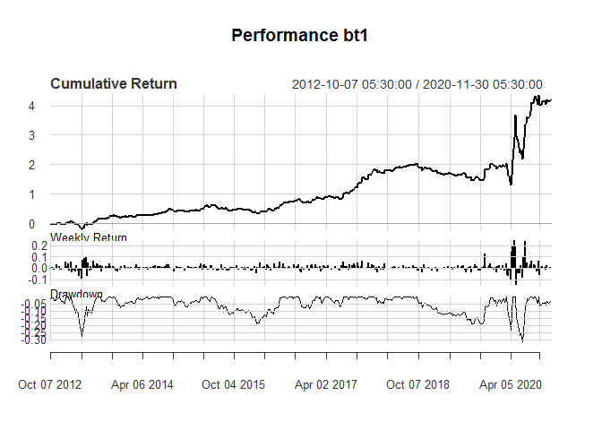

Rebalancing Objectives
================
Vinit Kaushik.
December 20, 2020

This builds on earlier research viewpoint and data: (static) [Exploring Objectives with R-Optimization Infrastructure (ROI)](https://github.com/yadevinit/pf4pf/blob/main/momentObjective.md). It adds dynamic Rebalancing, i.e., at periodic endpoints in time, it re-optimizes portfolio weights for select Objectives. Some of those Objectives were taking multiple hours to run using `DEoptim` (Differential-Evolution-inspired optimization) and other packages integrated with `PortfolioAnalytics` that implement various optimization-supporting methods on the laptop of the [author](mailto:yadevinit@gmail.com): 64-bit `Microsoft Windows 8.1` on `Intel CORE i3` with 4GB RAM. Instead, the author here chose a different combination of Objectives that positions similarly on the Reward-Risk trade-off chart. Targeting return while minimzing risk also seems consistent with related research (excerpts ahead) for pension-fund management in this Defined-Contribution era, into which many nations are moving from the Defined-Benefit regime.

Target Return and Rebalancing on \[6.5 Minimize expected tail loss with ROI\]
=============================================================================

This also adapts [Vignette: Portfolio Optimization with CVaR budgetsin PortfolioAnalytics 2010](https://cran.r-project.org/web/packages/PortfolioAnalytics/vignettes/risk_budget_optimization.pdf) for targeting (mean weekly) return equivalent to 36% CAGR while also minimizing risk as measured by (Expected Shortfall) `ES`, possibly also budgeting for (a) a component risk (as a percentage range) or (b) concentration (as equal budget). These variants of portfolio specification are iterated through ahead.

Static Optimization Now
-----------------------

    ## ***********************************
    ## PortfolioAnalytics Optimization
    ## ***********************************
    ## 
    ## Call:
    ## optimize.portfolio(R = R, portfolio = pfESplus, optimize_method = "ROI", 
    ##     trace = TRUE)
    ## 
    ## Optimal Weights:
    ##      BSE200     BSEAUTO BSEBASICMAT       BSECD     BSECDGS       BSECG 
    ##      0.0000      0.0000      0.0000      0.0000      0.0000      0.0000 
    ##     BSECPSE BSEDOLLEX20   BSEENERGY      BSEFIN     BSEFMCG BSEHEALTHCA 
    ##      0.0000      0.0000      0.0000      0.0000      0.0214      0.0000 
    ## BSEINDUSTRI       BSEIT    BSEMETAL   BSEOILGAS    BSEPOWER      BSEPSU 
    ##      0.0000      0.0261      0.0000      0.0000      0.0000      0.0000 
    ##   BSESENSEX     BSETECK  BSETELECOM     BSEUTIL         DAX        DJCA 
    ##      0.0000      0.0000      0.0000      0.0000      0.0000      0.0000 
    ##        DJIA     FTSE100         HSI         NDX      SNP500   BANKNIFTY 
    ##      0.0000      0.0000      0.0000      0.0016      0.0000      0.0000 
    ##    CNXINFRA       CNXIT   CNXMIDCAP CNXNIFTYJUN   CNXREALTY    GOLDBEES 
    ##      0.0000      0.0000      0.0000      0.0000      0.0000      0.1057 
    ##        IDBI        INFY NIFTYMIDCAP   S.PCNX500     SENIFTY         A50 
    ##      0.0000      0.0000      0.0000      0.0000      0.0000      0.0000 
    ##      AQVL30         B50 commodities         L50       media       N10GS 
    ##      0.0000      0.0000      0.0000      0.0000      0.0000      0.4066 
    ##  N10GSclean        NE50  NGrowthS15      pharma      V20N50     BPCL.BO 
    ##      0.0000      0.0000      0.0000      0.0000      0.0000      0.0000 
    ##   BIOCON.BO         VNQ         GLD         SLV         DBA         USO 
    ##      0.0322      0.0000      0.0000      0.0000      0.0000      0.0000 
    ##         DBB         BND         UUP         RSP         IWR         MDY 
    ##      0.0000      0.0945      0.1654      0.0000      0.0000      0.0000 
    ##          VB         IJR       W5000         RUT         IWM          SH 
    ##      0.0000      0.0000      0.0000      0.0000      0.0000      0.0000 
    ##        TSLA        FCHI    STOXX50E        N225         BFX         STI 
    ##      0.0153      0.0000      0.0000      0.0000      0.0000      0.0000 
    ##        JKSE        NZ50        KS11        TWII      GSPTSE         MXX 
    ##      0.0000      0.1029      0.0000      0.0000      0.0000      0.0000 
    ##        KLSE        IPSA        MERV    TA125.TA        SSMI        AXJO 
    ##      0.0000      0.0000      0.0069      0.0000      0.0000      0.0000 
    ## SSE000001.S   PFIZER.NS GRAPHITE.NS      HEG.NS     ONGC.NS BANKBARODA. 
    ##      0.0028      0.0118      0.0000      0.0000      0.0000      0.0000 
    ##  YESBANK.NS     IDEA.NS    SUVENadj 
    ##      0.0024      0.0000      0.0044 
    ## 
    ## Objective Measure:
    ##     mean 
    ## 0.001581 
    ## 
    ## 
    ##       ES 
    ## 0.007594


    ## ***********************************
    ## PortfolioAnalytics Optimization
    ## ***********************************
    ## 
    ## Call:
    ## optimize.portfolio(R = R, portfolio = pfESplus, optimize_method = "ROI", 
    ##     trace = TRUE)
    ## 
    ## Optimal Weights:
    ##      BSE200     BSEAUTO BSEBASICMAT       BSECD     BSECDGS       BSECG 
    ##      0.0000      0.0000      0.0000      0.0000      0.0000      0.0000 
    ##     BSECPSE BSEDOLLEX20   BSEENERGY      BSEFIN     BSEFMCG BSEHEALTHCA 
    ##      0.0000      0.0000      0.0000      0.0000      0.0214      0.0000 
    ## BSEINDUSTRI       BSEIT    BSEMETAL   BSEOILGAS    BSEPOWER      BSEPSU 
    ##      0.0000      0.0261      0.0000      0.0000      0.0000      0.0000 
    ##   BSESENSEX     BSETECK  BSETELECOM     BSEUTIL         DAX        DJCA 
    ##      0.0000      0.0000      0.0000      0.0000      0.0000      0.0000 
    ##        DJIA     FTSE100         HSI         NDX      SNP500   BANKNIFTY 
    ##      0.0000      0.0000      0.0000      0.0016      0.0000      0.0000 
    ##    CNXINFRA       CNXIT   CNXMIDCAP CNXNIFTYJUN   CNXREALTY    GOLDBEES 
    ##      0.0000      0.0000      0.0000      0.0000      0.0000      0.1057 
    ##        IDBI        INFY NIFTYMIDCAP   S.PCNX500     SENIFTY         A50 
    ##      0.0000      0.0000      0.0000      0.0000      0.0000      0.0000 
    ##      AQVL30         B50 commodities         L50       media       N10GS 
    ##      0.0000      0.0000      0.0000      0.0000      0.0000      0.4066 
    ##  N10GSclean        NE50  NGrowthS15      pharma      V20N50     BPCL.BO 
    ##      0.0000      0.0000      0.0000      0.0000      0.0000      0.0000 
    ##   BIOCON.BO         VNQ         GLD         SLV         DBA         USO 
    ##      0.0322      0.0000      0.0000      0.0000      0.0000      0.0000 
    ##         DBB         BND         UUP         RSP         IWR         MDY 
    ##      0.0000      0.0945      0.1654      0.0000      0.0000      0.0000 
    ##          VB         IJR       W5000         RUT         IWM          SH 
    ##      0.0000      0.0000      0.0000      0.0000      0.0000      0.0000 
    ##        TSLA        FCHI    STOXX50E        N225         BFX         STI 
    ##      0.0153      0.0000      0.0000      0.0000      0.0000      0.0000 
    ##        JKSE        NZ50        KS11        TWII      GSPTSE         MXX 
    ##      0.0000      0.1029      0.0000      0.0000      0.0000      0.0000 
    ##        KLSE        IPSA        MERV    TA125.TA        SSMI        AXJO 
    ##      0.0000      0.0000      0.0069      0.0000      0.0000      0.0000 
    ## SSE000001.S   PFIZER.NS GRAPHITE.NS      HEG.NS     ONGC.NS BANKBARODA. 
    ##      0.0028      0.0118      0.0000      0.0000      0.0000      0.0000 
    ##  YESBANK.NS     IDEA.NS    SUVENadj 
    ##      0.0024      0.0000      0.0044 
    ## 
    ## Objective Measure:
    ##     mean 
    ## 0.001581 
    ## 
    ## 
    ##       ES 
    ## 0.007594


    ## ***********************************
    ## PortfolioAnalytics Optimization
    ## ***********************************
    ## 
    ## Call:
    ## optimize.portfolio(R = R, portfolio = pfESplus, optimize_method = "ROI", 
    ##     trace = TRUE)
    ## 
    ## Optimal Weights:
    ##      BSE200     BSEAUTO BSEBASICMAT       BSECD     BSECDGS       BSECG 
    ##      0.0000      0.0000      0.0000      0.0000      0.0000      0.0000 
    ##     BSECPSE BSEDOLLEX20   BSEENERGY      BSEFIN     BSEFMCG BSEHEALTHCA 
    ##      0.0000      0.0000      0.0000      0.0000      0.0214      0.0000 
    ## BSEINDUSTRI       BSEIT    BSEMETAL   BSEOILGAS    BSEPOWER      BSEPSU 
    ##      0.0000      0.0261      0.0000      0.0000      0.0000      0.0000 
    ##   BSESENSEX     BSETECK  BSETELECOM     BSEUTIL         DAX        DJCA 
    ##      0.0000      0.0000      0.0000      0.0000      0.0000      0.0000 
    ##        DJIA     FTSE100         HSI         NDX      SNP500   BANKNIFTY 
    ##      0.0000      0.0000      0.0000      0.0016      0.0000      0.0000 
    ##    CNXINFRA       CNXIT   CNXMIDCAP CNXNIFTYJUN   CNXREALTY    GOLDBEES 
    ##      0.0000      0.0000      0.0000      0.0000      0.0000      0.1057 
    ##        IDBI        INFY NIFTYMIDCAP   S.PCNX500     SENIFTY         A50 
    ##      0.0000      0.0000      0.0000      0.0000      0.0000      0.0000 
    ##      AQVL30         B50 commodities         L50       media       N10GS 
    ##      0.0000      0.0000      0.0000      0.0000      0.0000      0.4066 
    ##  N10GSclean        NE50  NGrowthS15      pharma      V20N50     BPCL.BO 
    ##      0.0000      0.0000      0.0000      0.0000      0.0000      0.0000 
    ##   BIOCON.BO         VNQ         GLD         SLV         DBA         USO 
    ##      0.0322      0.0000      0.0000      0.0000      0.0000      0.0000 
    ##         DBB         BND         UUP         RSP         IWR         MDY 
    ##      0.0000      0.0945      0.1654      0.0000      0.0000      0.0000 
    ##          VB         IJR       W5000         RUT         IWM          SH 
    ##      0.0000      0.0000      0.0000      0.0000      0.0000      0.0000 
    ##        TSLA        FCHI    STOXX50E        N225         BFX         STI 
    ##      0.0153      0.0000      0.0000      0.0000      0.0000      0.0000 
    ##        JKSE        NZ50        KS11        TWII      GSPTSE         MXX 
    ##      0.0000      0.1029      0.0000      0.0000      0.0000      0.0000 
    ##        KLSE        IPSA        MERV    TA125.TA        SSMI        AXJO 
    ##      0.0000      0.0000      0.0069      0.0000      0.0000      0.0000 
    ## SSE000001.S   PFIZER.NS GRAPHITE.NS      HEG.NS     ONGC.NS BANKBARODA. 
    ##      0.0028      0.0118      0.0000      0.0000      0.0000      0.0000 
    ##  YESBANK.NS     IDEA.NS    SUVENadj 
    ##      0.0024      0.0000      0.0044 
    ## 
    ## Objective Measure:
    ##     mean 
    ## 0.001581 
    ## 
    ## 
    ##       ES 
    ## 0.007594


    ## ***********************************
    ## PortfolioAnalytics Optimization
    ## ***********************************
    ## 
    ## Call:
    ## optimize.portfolio(R = R, portfolio = pfESplus, optimize_method = "ROI", 
    ##     trace = TRUE)
    ## 
    ## Optimal Weights:
    ##      BSE200     BSEAUTO BSEBASICMAT       BSECD     BSECDGS       BSECG 
    ##      0.0000      0.0000      0.0000      0.0000      0.0000      0.0000 
    ##     BSECPSE BSEDOLLEX20   BSEENERGY      BSEFIN     BSEFMCG BSEHEALTHCA 
    ##      0.0000      0.0000      0.0000      0.0000      0.0000      0.0000 
    ## BSEINDUSTRI       BSEIT    BSEMETAL   BSEOILGAS    BSEPOWER      BSEPSU 
    ##      0.0000      0.0000      0.0000      0.0000      0.0000      0.0000 
    ##   BSESENSEX     BSETECK  BSETELECOM     BSEUTIL         DAX        DJCA 
    ##      0.0000      0.0000      0.0000      0.0000      0.0000      0.0000 
    ##        DJIA     FTSE100         HSI         NDX      SNP500   BANKNIFTY 
    ##      0.0000      0.0000      0.0000      0.0000      0.0000      0.0000 
    ##    CNXINFRA       CNXIT   CNXMIDCAP CNXNIFTYJUN   CNXREALTY    GOLDBEES 
    ##      0.0000      0.0000      0.0000      0.0000      0.0000      0.0126 
    ##        IDBI        INFY NIFTYMIDCAP   S.PCNX500     SENIFTY         A50 
    ##      0.0000      0.0000      0.0000      0.0000      0.0000      0.0000 
    ##      AQVL30         B50 commodities         L50       media       N10GS 
    ##      0.0000      0.0000      0.0000      0.0000      0.0000      0.0000 
    ##  N10GSclean        NE50  NGrowthS15      pharma      V20N50     BPCL.BO 
    ##      0.0000      0.0000      0.0000      0.0000      0.0000      0.1063 
    ##   BIOCON.BO         VNQ         GLD         SLV         DBA         USO 
    ##      0.3297      0.0000      0.0000      0.0000      0.0000      0.0000 
    ##         DBB         BND         UUP         RSP         IWR         MDY 
    ##      0.0000      0.0000      0.0000      0.0000      0.0000      0.0000 
    ##          VB         IJR       W5000         RUT         IWM          SH 
    ##      0.0000      0.0000      0.0000      0.0000      0.0000      0.0000 
    ##        TSLA        FCHI    STOXX50E        N225         BFX         STI 
    ##      0.2900      0.0000      0.0000      0.0000      0.0000      0.0000 
    ##        JKSE        NZ50        KS11        TWII      GSPTSE         MXX 
    ##      0.0000      0.1020      0.0000      0.0000      0.0000      0.0000 
    ##        KLSE        IPSA        MERV    TA125.TA        SSMI        AXJO 
    ##      0.0000      0.0000      0.1204      0.0000      0.0000      0.0000 
    ## SSE000001.S   PFIZER.NS GRAPHITE.NS      HEG.NS     ONGC.NS BANKBARODA. 
    ##      0.0000      0.0011      0.0000      0.0000      0.0000      0.0000 
    ##  YESBANK.NS     IDEA.NS    SUVENadj 
    ##      0.0000      0.0000      0.0379 
    ## 
    ## Objective Measure:
    ##      ES 
    ## 0.05325


    ## ***********************************
    ## PortfolioAnalytics Optimization
    ## ***********************************
    ## 
    ## Call:
    ## optimize.portfolio(R = R, portfolio = pfESplus, optimize_method = "ROI", 
    ##     trace = TRUE)
    ## 
    ## Optimal Weights:
    ##      BSE200     BSEAUTO BSEBASICMAT       BSECD     BSECDGS       BSECG 
    ##      0.0000      0.0000      0.0000      0.0000      0.0000      0.0000 
    ##     BSECPSE BSEDOLLEX20   BSEENERGY      BSEFIN     BSEFMCG BSEHEALTHCA 
    ##      0.0000      0.0000      0.0000      0.0000      0.0000      0.0000 
    ## BSEINDUSTRI       BSEIT    BSEMETAL   BSEOILGAS    BSEPOWER      BSEPSU 
    ##      0.0000      0.0000      0.0000      0.0000      0.0000      0.0000 
    ##   BSESENSEX     BSETECK  BSETELECOM     BSEUTIL         DAX        DJCA 
    ##      0.0000      0.0000      0.0000      0.0000      0.0000      0.0000 
    ##        DJIA     FTSE100         HSI         NDX      SNP500   BANKNIFTY 
    ##      0.0000      0.0000      0.0000      0.0000      0.0000      0.0000 
    ##    CNXINFRA       CNXIT   CNXMIDCAP CNXNIFTYJUN   CNXREALTY    GOLDBEES 
    ##      0.0000      0.0000      0.0000      0.0000      0.0000      0.0126 
    ##        IDBI        INFY NIFTYMIDCAP   S.PCNX500     SENIFTY         A50 
    ##      0.0000      0.0000      0.0000      0.0000      0.0000      0.0000 
    ##      AQVL30         B50 commodities         L50       media       N10GS 
    ##      0.0000      0.0000      0.0000      0.0000      0.0000      0.0000 
    ##  N10GSclean        NE50  NGrowthS15      pharma      V20N50     BPCL.BO 
    ##      0.0000      0.0000      0.0000      0.0000      0.0000      0.1063 
    ##   BIOCON.BO         VNQ         GLD         SLV         DBA         USO 
    ##      0.3297      0.0000      0.0000      0.0000      0.0000      0.0000 
    ##         DBB         BND         UUP         RSP         IWR         MDY 
    ##      0.0000      0.0000      0.0000      0.0000      0.0000      0.0000 
    ##          VB         IJR       W5000         RUT         IWM          SH 
    ##      0.0000      0.0000      0.0000      0.0000      0.0000      0.0000 
    ##        TSLA        FCHI    STOXX50E        N225         BFX         STI 
    ##      0.2900      0.0000      0.0000      0.0000      0.0000      0.0000 
    ##        JKSE        NZ50        KS11        TWII      GSPTSE         MXX 
    ##      0.0000      0.1020      0.0000      0.0000      0.0000      0.0000 
    ##        KLSE        IPSA        MERV    TA125.TA        SSMI        AXJO 
    ##      0.0000      0.0000      0.1204      0.0000      0.0000      0.0000 
    ## SSE000001.S   PFIZER.NS GRAPHITE.NS      HEG.NS     ONGC.NS BANKBARODA. 
    ##      0.0000      0.0011      0.0000      0.0000      0.0000      0.0000 
    ##  YESBANK.NS     IDEA.NS    SUVENadj 
    ##      0.0000      0.0000      0.0379 
    ## 
    ## Objective Measure:
    ##      ES 
    ## 0.05325


    ## ***********************************
    ## PortfolioAnalytics Optimization
    ## ***********************************
    ## 
    ## Call:
    ## optimize.portfolio(R = R, portfolio = pfESplus, optimize_method = "ROI", 
    ##     trace = TRUE)
    ## 
    ## Optimal Weights:
    ##      BSE200     BSEAUTO BSEBASICMAT       BSECD     BSECDGS       BSECG 
    ##      0.0000      0.0000      0.0000      0.0000      0.0000      0.0000 
    ##     BSECPSE BSEDOLLEX20   BSEENERGY      BSEFIN     BSEFMCG BSEHEALTHCA 
    ##      0.0000      0.0000      0.0000      0.0000      0.0000      0.0000 
    ## BSEINDUSTRI       BSEIT    BSEMETAL   BSEOILGAS    BSEPOWER      BSEPSU 
    ##      0.0000      0.0000      0.0000      0.0000      0.0000      0.0000 
    ##   BSESENSEX     BSETECK  BSETELECOM     BSEUTIL         DAX        DJCA 
    ##      0.0000      0.0000      0.0000      0.0000      0.0000      0.0000 
    ##        DJIA     FTSE100         HSI         NDX      SNP500   BANKNIFTY 
    ##      0.0000      0.0000      0.0000      0.0000      0.0000      0.0000 
    ##    CNXINFRA       CNXIT   CNXMIDCAP CNXNIFTYJUN   CNXREALTY    GOLDBEES 
    ##      0.0000      0.0000      0.0000      0.0000      0.0000      0.0126 
    ##        IDBI        INFY NIFTYMIDCAP   S.PCNX500     SENIFTY         A50 
    ##      0.0000      0.0000      0.0000      0.0000      0.0000      0.0000 
    ##      AQVL30         B50 commodities         L50       media       N10GS 
    ##      0.0000      0.0000      0.0000      0.0000      0.0000      0.0000 
    ##  N10GSclean        NE50  NGrowthS15      pharma      V20N50     BPCL.BO 
    ##      0.0000      0.0000      0.0000      0.0000      0.0000      0.1063 
    ##   BIOCON.BO         VNQ         GLD         SLV         DBA         USO 
    ##      0.3297      0.0000      0.0000      0.0000      0.0000      0.0000 
    ##         DBB         BND         UUP         RSP         IWR         MDY 
    ##      0.0000      0.0000      0.0000      0.0000      0.0000      0.0000 
    ##          VB         IJR       W5000         RUT         IWM          SH 
    ##      0.0000      0.0000      0.0000      0.0000      0.0000      0.0000 
    ##        TSLA        FCHI    STOXX50E        N225         BFX         STI 
    ##      0.2900      0.0000      0.0000      0.0000      0.0000      0.0000 
    ##        JKSE        NZ50        KS11        TWII      GSPTSE         MXX 
    ##      0.0000      0.1020      0.0000      0.0000      0.0000      0.0000 
    ##        KLSE        IPSA        MERV    TA125.TA        SSMI        AXJO 
    ##      0.0000      0.0000      0.1204      0.0000      0.0000      0.0000 
    ## SSE000001.S   PFIZER.NS GRAPHITE.NS      HEG.NS     ONGC.NS BANKBARODA. 
    ##      0.0000      0.0011      0.0000      0.0000      0.0000      0.0000 
    ##  YESBANK.NS     IDEA.NS    SUVENadj 
    ##      0.0000      0.0000      0.0379 
    ## 
    ## Objective Measure:
    ##      ES 
    ## 0.05325


The reader can see that the last three portfolio specifications show similar (static) Reward-Risk trade-off charts and portfolio weights, as tabulated ahead in descending order of (statically-optimized) weights:

|  BIOCON.BO|    TSLA|    MERV|  BPCL.BO|    NZ50|  SUVENadj|  GOLDBEES|
|----------:|-------:|-------:|--------:|-------:|---------:|---------:|
|     0.3297|  0.2900|  0.1204|   0.1063|  0.1020|    0.0379|    0.0126|

The first three portfolio specifications show optimal portfolios (marked by a blue dot on the Reward-Risk chart) located similar to asset `N10GS` (India's `NIFTY 10-year benchmark G-Sec Index`) though weights of only `40.6%` are allocated to `N10GS` and the rest are allocated to `UUP` and other assets.

Rebalancing Optimization Performance with Rolling Windows
---------------------------------------------------------

Looking at the Rebalancing performance ahead of the last three portfolio specifications, the reader can see Annualized Portfolio Rebalancing Return being reported as `0.2212168`; this is `log return`, which is equal to `exp(0.2212168)-1 =0.2475939 =24.8%` CAGR. That is during `34` (quarterly) Rebalancing dates till 2020-Nov. Rebalancing code `9` referred to makes the optimizer use "rolling windows" of `52*2` weeks (2 years) to train on when it rebalances, and that Rebalancing is repeated each quarter. The reader might also note that quarterly Rebalancing can change weights, resulting in transaction costs and taxation for short-term capital gains. These have not been penalized in the portfolio Objectives, and so, the reader has to consider that separately.

``` r
flist <- c(
  "bt-rebal9opt_pfESplus-cleanT-targRet2ES3-202012191820-202012191847.rds",
  "bt-rebal9opt_pfESplus-cleanT-targRet2ES2-202012191749-202012191816.rds",
  "bt-rebal9opt_pfESplus-cleanT-targRet2ES1-202012191727-202012191745.rds",
  "bt-rebal9opt_pfESplus-cleanF-targRet2ES3-202012191724-202012191724.rds",
  "bt-rebal9opt_pfESplus-cleanF-targRet2ES2-202012191723-202012191723.rds",
  "bt-rebal9opt_pfESplus-cleanF-targRet2ES1-202012191722-202012191723.rds"
  )

btouts <- list()
btouts.rets <- list()
for(ix in 6:1){
  btouts[[ix]] <- readRDS(file=paste0(results.dir, "/", flist[ix]))
  btout <- btouts[[ix]]
# stop("copied into earlier chunk")
  btouts.rets[[ix]] <- summary(btout)$portfolio_returns
  names(btouts.rets)[[ix]] <- paste0("bt", ix)
  # duh5 <- summary(btout)$portfolio_returns; colnames(duh5) <- paste0("bt", ix)
  chart.Weights(btout, main=paste0("Weights for ", names(btouts.rets)[[ix]]), # charTitle),
    cex.legend=0.8/2, colorset=my_colors) # ylim=c(1.2),
    # col=my_colors # bluemono)
  print(btout)
}
```


    ## **************************************************
    ## PortfolioAnalytics Optimization with Rebalancing
    ## **************************************************
    ## 
    ## Call:
    ## optimize.portfolio.rebalancing(R = R, portfolio = pfESplus, optimize_method = "ROI", 
    ##     trace = TRUE, rebalance_on = cRebalSpec$rebalance_on[cRebalSpec.ix], 
    ##     training_period = cRebalSpec$training_period[cRebalSpec.ix], 
    ##     rolling_window = cRebalSpec$rolling_window[cRebalSpec.ix])
    ## 
    ## Number of rebalancing dates:  34 
    ## First rebalance date:
    ## [1] "2012-09-30"
    ## Last rebalance date:
    ## [1] "2020-11-30"
    ## 
    ## Annualized Portfolio Rebalancing Return:
    ## [1] 0.06267963
    ## 
    ## Annualized Portfolio Standard Deviation:
    ## [1] 0.04639053


    ## **************************************************
    ## PortfolioAnalytics Optimization with Rebalancing
    ## **************************************************
    ## 
    ## Call:
    ## optimize.portfolio.rebalancing(R = R, portfolio = pfESplus, optimize_method = "ROI", 
    ##     trace = TRUE, rebalance_on = cRebalSpec$rebalance_on[cRebalSpec.ix], 
    ##     training_period = cRebalSpec$training_period[cRebalSpec.ix], 
    ##     rolling_window = cRebalSpec$rolling_window[cRebalSpec.ix])
    ## 
    ## Number of rebalancing dates:  34 
    ## First rebalance date:
    ## [1] "2012-09-30"
    ## Last rebalance date:
    ## [1] "2020-11-30"
    ## 
    ## Annualized Portfolio Rebalancing Return:
    ## [1] 0.06267963
    ## 
    ## Annualized Portfolio Standard Deviation:
    ## [1] 0.04639053


    ## **************************************************
    ## PortfolioAnalytics Optimization with Rebalancing
    ## **************************************************
    ## 
    ## Call:
    ## optimize.portfolio.rebalancing(R = R, portfolio = pfESplus, optimize_method = "ROI", 
    ##     trace = TRUE, rebalance_on = cRebalSpec$rebalance_on[cRebalSpec.ix], 
    ##     training_period = cRebalSpec$training_period[cRebalSpec.ix], 
    ##     rolling_window = cRebalSpec$rolling_window[cRebalSpec.ix])
    ## 
    ## Number of rebalancing dates:  34 
    ## First rebalance date:
    ## [1] "2012-09-30"
    ## Last rebalance date:
    ## [1] "2020-11-30"
    ## 
    ## Annualized Portfolio Rebalancing Return:
    ## [1] 0.06267963
    ## 
    ## Annualized Portfolio Standard Deviation:
    ## [1] 0.04639053


    ## **************************************************
    ## PortfolioAnalytics Optimization with Rebalancing
    ## **************************************************
    ## 
    ## Call:
    ## optimize.portfolio.rebalancing(R = R, portfolio = pfESplus, optimize_method = "ROI", 
    ##     trace = TRUE, rebalance_on = cRebalSpec$rebalance_on[cRebalSpec.ix], 
    ##     training_period = cRebalSpec$training_period[cRebalSpec.ix], 
    ##     rolling_window = cRebalSpec$rolling_window[cRebalSpec.ix])
    ## 
    ## Number of rebalancing dates:  34 
    ## First rebalance date:
    ## [1] "2012-09-30"
    ## Last rebalance date:
    ## [1] "2020-11-30"
    ## 
    ## Annualized Portfolio Rebalancing Return:
    ## [1] 0.2212168
    ## 
    ## Annualized Portfolio Standard Deviation:
    ## [1] 0.2403202


    ## **************************************************
    ## PortfolioAnalytics Optimization with Rebalancing
    ## **************************************************
    ## 
    ## Call:
    ## optimize.portfolio.rebalancing(R = R, portfolio = pfESplus, optimize_method = "ROI", 
    ##     trace = TRUE, rebalance_on = cRebalSpec$rebalance_on[cRebalSpec.ix], 
    ##     training_period = cRebalSpec$training_period[cRebalSpec.ix], 
    ##     rolling_window = cRebalSpec$rolling_window[cRebalSpec.ix])
    ## 
    ## Number of rebalancing dates:  34 
    ## First rebalance date:
    ## [1] "2012-09-30"
    ## Last rebalance date:
    ## [1] "2020-11-30"
    ## 
    ## Annualized Portfolio Rebalancing Return:
    ## [1] 0.2212168
    ## 
    ## Annualized Portfolio Standard Deviation:
    ## [1] 0.2403202


    ## **************************************************
    ## PortfolioAnalytics Optimization with Rebalancing
    ## **************************************************
    ## 
    ## Call:
    ## optimize.portfolio.rebalancing(R = R, portfolio = pfESplus, optimize_method = "ROI", 
    ##     trace = TRUE, rebalance_on = cRebalSpec$rebalance_on[cRebalSpec.ix], 
    ##     training_period = cRebalSpec$training_period[cRebalSpec.ix], 
    ##     rolling_window = cRebalSpec$rolling_window[cRebalSpec.ix])
    ## 
    ## Number of rebalancing dates:  34 
    ## First rebalance date:
    ## [1] "2012-09-30"
    ## Last rebalance date:
    ## [1] "2020-11-30"
    ## 
    ## Annualized Portfolio Rebalancing Return:
    ## [1] 0.2212168
    ## 
    ## Annualized Portfolio Standard Deviation:
    ## [1] 0.2403202

``` r
  btouts.rets.mx <- do.call(cbind, btouts.rets)
  # colnames(btouts.rets.mx) # <- paste("bt", 6:1, sep="")
  charts.PerformanceSummary(btouts.rets.mx, main=paste0("Rebalancing performance"),
    colorset=my_colors, legend.cex=0.8/2)
```


Peek at a Latest Rebalancing: Weights and More
----------------------------------------------

``` r
ix <- 1 # Corresponding to bt<ix>. Presently, ix=1,2,3 are similar.
btout <- btouts[[ix]]
names(btout)
```

    ## [1] "portfolio"       "R"               "call"            "elapsed_time"   
    ## [5] "opt_rebalancing"

``` r
length(btout$opt_rebalancing)
```

    ## [1] 34

``` r
btout$opt_rebalancing[[1]] # first Rebalancing weights.
```

    ## ***********************************
    ## PortfolioAnalytics Optimization
    ## ***********************************
    ## 
    ## Call:
    ## optimize.portfolio(R = R[(ifelse(ep - rolling_window >= 1, ep - 
    ##     rolling_window, 1)):ep, ], portfolio = portfolio, optimize_method = optimize_method, 
    ##     search_size = search_size, trace = trace, parallel = FALSE, 
    ##     rp = rp)
    ## 
    ## Optimal Weights:
    ##      BSE200     BSEAUTO BSEBASICMAT       BSECD     BSECDGS       BSECG 
    ##           0           0           0           0           0           0 
    ##     BSECPSE BSEDOLLEX20   BSEENERGY      BSEFIN     BSEFMCG BSEHEALTHCA 
    ##           0           0           0           0           0           0 
    ## BSEINDUSTRI       BSEIT    BSEMETAL   BSEOILGAS    BSEPOWER      BSEPSU 
    ##           0           0           0           0           0           0 
    ##   BSESENSEX     BSETECK  BSETELECOM     BSEUTIL         DAX        DJCA 
    ##           0           0           0           0           0           0 
    ##        DJIA     FTSE100         HSI         NDX      SNP500   BANKNIFTY 
    ##           0           0           0           0           0           0 
    ##    CNXINFRA       CNXIT   CNXMIDCAP CNXNIFTYJUN   CNXREALTY    GOLDBEES 
    ##           0           0           0           0           0           1 
    ##        IDBI        INFY NIFTYMIDCAP   S.PCNX500     SENIFTY         A50 
    ##           0           0           0           0           0           0 
    ##      AQVL30         B50 commodities         L50       media       N10GS 
    ##           0           0           0           0           0           0 
    ##  N10GSclean        NE50  NGrowthS15      pharma      V20N50     BPCL.BO 
    ##           0           0           0           0           0           0 
    ##   BIOCON.BO         VNQ         GLD         SLV         DBA         USO 
    ##           0           0           0           0           0           0 
    ##         DBB         BND         UUP         RSP         IWR         MDY 
    ##           0           0           0           0           0           0 
    ##          VB         IJR       W5000         RUT         IWM          SH 
    ##           0           0           0           0           0           0 
    ##        TSLA        FCHI    STOXX50E        N225         BFX         STI 
    ##           0           0           0           0           0           0 
    ##        JKSE        NZ50        KS11        TWII      GSPTSE         MXX 
    ##           0           0           0           0           0           0 
    ##        KLSE        IPSA        MERV    TA125.TA        SSMI        AXJO 
    ##           0           0           0           0           0           0 
    ## SSE000001.S   PFIZER.NS GRAPHITE.NS      HEG.NS     ONGC.NS BANKBARODA. 
    ##           0           0           0           0           0           0 
    ##  YESBANK.NS     IDEA.NS    SUVENadj 
    ##           0           0           0 
    ## 
    ## Objective Measure:
    ##      ES 
    ## 0.04147

``` r
# btout$opt_rebalancing[[1]]$data_summary
btout$opt_rebalancing[[length(btout$opt_rebalancing)]] # weights from latest Rebalancing
```

    ## ***********************************
    ## PortfolioAnalytics Optimization
    ## ***********************************
    ## 
    ## Call:
    ## optimize.portfolio(R = R[(ifelse(ep - rolling_window >= 1, ep - 
    ##     rolling_window, 1)):ep, ], portfolio = portfolio, optimize_method = optimize_method, 
    ##     search_size = search_size, trace = trace, parallel = FALSE, 
    ##     rp = rp)
    ## 
    ## Optimal Weights:
    ##      BSE200     BSEAUTO BSEBASICMAT       BSECD     BSECDGS       BSECG 
    ##      0.0000      0.0000      0.0000      0.0000      0.0000      0.0000 
    ##     BSECPSE BSEDOLLEX20   BSEENERGY      BSEFIN     BSEFMCG BSEHEALTHCA 
    ##      0.0000      0.0000      0.0000      0.0000      0.0000      0.0000 
    ## BSEINDUSTRI       BSEIT    BSEMETAL   BSEOILGAS    BSEPOWER      BSEPSU 
    ##      0.0000      0.0000      0.0000      0.0000      0.0000      0.0000 
    ##   BSESENSEX     BSETECK  BSETELECOM     BSEUTIL         DAX        DJCA 
    ##      0.0000      0.0000      0.0000      0.0000      0.0000      0.0000 
    ##        DJIA     FTSE100         HSI         NDX      SNP500   BANKNIFTY 
    ##      0.0000      0.0000      0.0000      0.0000      0.0000      0.0000 
    ##    CNXINFRA       CNXIT   CNXMIDCAP CNXNIFTYJUN   CNXREALTY    GOLDBEES 
    ##      0.0000      0.0000      0.0000      0.0000      0.0000      0.4456 
    ##        IDBI        INFY NIFTYMIDCAP   S.PCNX500     SENIFTY         A50 
    ##      0.0000      0.0000      0.0000      0.0000      0.0000      0.0000 
    ##      AQVL30         B50 commodities         L50       media       N10GS 
    ##      0.0000      0.0000      0.0000      0.0000      0.0000      0.0838 
    ##  N10GSclean        NE50  NGrowthS15      pharma      V20N50     BPCL.BO 
    ##      0.0000      0.0000      0.0000      0.0000      0.0000      0.0000 
    ##   BIOCON.BO         VNQ         GLD         SLV         DBA         USO 
    ##      0.0000      0.0000      0.0000      0.0000      0.0000      0.0000 
    ##         DBB         BND         UUP         RSP         IWR         MDY 
    ##      0.0000      0.0000      0.0626      0.0000      0.0000      0.0000 
    ##          VB         IJR       W5000         RUT         IWM          SH 
    ##      0.0000      0.0000      0.0000      0.0000      0.0000      0.0000 
    ##        TSLA        FCHI    STOXX50E        N225         BFX         STI 
    ##      0.0820      0.0000      0.0000      0.0000      0.0000      0.0000 
    ##        JKSE        NZ50        KS11        TWII      GSPTSE         MXX 
    ##      0.0000      0.0000      0.0000      0.0000      0.0000      0.0000 
    ##        KLSE        IPSA        MERV    TA125.TA        SSMI        AXJO 
    ##      0.0000      0.0000      0.0000      0.0000      0.0000      0.0000 
    ## SSE000001.S   PFIZER.NS GRAPHITE.NS      HEG.NS     ONGC.NS BANKBARODA. 
    ##      0.0000      0.3260      0.0000      0.0000      0.0000      0.0000 
    ##  YESBANK.NS     IDEA.NS    SUVENadj 
    ##      0.0000      0.0000      0.0000 
    ## 
    ## Objective Measure:
    ##      ES 
    ## 0.02789

``` r
# btout$opt_rebalancing[[length(btout$opt_rebalancing)]]$data_summary
# Brief optimization result and return/risk measures:
btout.summary <- summary(btout); btout.summary
```

    ## **************************************************
    ## PortfolioAnalytics Optimization with Rebalancing
    ## **************************************************
    ## 
    ## Call:
    ## optimize.portfolio.rebalancing(R = R, portfolio = pfESplus, optimize_method = "ROI", 
    ##     trace = TRUE, rebalance_on = cRebalSpec$rebalance_on[cRebalSpec.ix], 
    ##     training_period = cRebalSpec$training_period[cRebalSpec.ix], 
    ##     rolling_window = cRebalSpec$rolling_window[cRebalSpec.ix])
    ## 
    ## First rebalance date:
    ## [1] "2012-09-30"
    ## 
    ## Last rebalance date:
    ## [1] "2020-11-30"
    ## 
    ## Annualized Portfolio Rebalancing Return:
    ## [1] 0.2212168
    ## 
    ## Annualized Portfolio Standard Deviation:
    ## [1] 0.2403202
    ## 
    ## Downside Risk Measures:
    ##                                            portfolio.returns
    ## Semi Deviation                                        0.0194
    ## Gain Deviation                                        0.0321
    ## Loss Deviation                                        0.0201
    ## Downside Deviation (MAR=43.3333333333333%)            0.0214
    ## Downside Deviation (Rf=0%)                            0.0173
    ## Downside Deviation (0%)                               0.0173
    ## Maximum Drawdown                                      0.3159
    ## Historical VaR (95%)                                 -0.0351
    ## Historical ES (95%)                                  -0.0594
    ## Modified VaR (95%)                                   -0.0135
    ## Modified ES (95%)                                    -0.0534

``` r
head(extractObjectiveMeasures(btout))
```

    ##                             ES
    ## 2012-09-30 05:30:00 0.04146880
    ## 2012-12-30 05:30:00 0.10015060
    ## 2013-03-31 05:30:00 0.08608800
    ## 2013-06-30 05:30:00 0.02904150
    ## 2013-09-29 05:30:00 0.01555734
    ## 2013-12-29 05:30:00 0.01124458

``` r
tail(extractObjectiveMeasures(btout))
```

    ##                             ES
    ## 2019-09-27 05:30:00 0.04834328
    ## 2019-12-29 05:30:00 0.04560090
    ## 2020-03-29 05:30:00 0.18907748
    ## 2020-06-28 05:30:00 0.04322926
    ## 2020-09-25 05:30:00 0.03460419
    ## 2020-11-30 05:30:00 0.02788959

``` r
# par(ask=TRUE); plot.new()
if(FALSE){ # iff ES.contribution columns via specifying prisk= specified eg bt5
  chart.RiskBudget(btout, match.col="ES", risk.type="percentage", col=my_color) # "CVaR"
} # else continue

chart.Weights(btout, main=paste0("Weights bt", ix),
  cex.legend=0.8/2, col=my_colors) # ylim=c(1.2),
```


``` r
  # col=my_colors # bluemono)
print(btout)
```

    ## **************************************************
    ## PortfolioAnalytics Optimization with Rebalancing
    ## **************************************************
    ## 
    ## Call:
    ## optimize.portfolio.rebalancing(R = R, portfolio = pfESplus, optimize_method = "ROI", 
    ##     trace = TRUE, rebalance_on = cRebalSpec$rebalance_on[cRebalSpec.ix], 
    ##     training_period = cRebalSpec$training_period[cRebalSpec.ix], 
    ##     rolling_window = cRebalSpec$rolling_window[cRebalSpec.ix])
    ## 
    ## Number of rebalancing dates:  34 
    ## First rebalance date:
    ## [1] "2012-09-30"
    ## Last rebalance date:
    ## [1] "2020-11-30"
    ## 
    ## Annualized Portfolio Rebalancing Return:
    ## [1] 0.2212168
    ## 
    ## Annualized Portfolio Standard Deviation:
    ## [1] 0.2403202

``` r
charts.PerformanceSummary(summary(btout)$portfolio_returns, main=paste0("Performance bt", ix))
```



For this portfolio specification, weights from the (latest at the time of writing) Rebalancing of 2020-Nov show up as tabulated here:

|  GOLDBEES|  PFIZER.NS|   N10GS|    TSLA|     UUP|
|---------:|----------:|-------:|-------:|-------:|
|    0.4456|     0.3260|  0.0838|  0.0820|  0.0626|

Appendix: Runtime Environment
=============================

Here's the runtime environment used. It's reported here for reproducibility:

``` r
sessionInfo() # Sys.info()[['sysname']]
```

    ## R version 3.6.2 (2019-12-12)
    ## Platform: x86_64-w64-mingw32/x64 (64-bit)
    ## Running under: Windows 8.1 x64 (build 9600)
    ## 
    ## Matrix products: default
    ## 
    ## locale:
    ## [1] LC_COLLATE=English_India.1252  LC_CTYPE=English_India.1252   
    ## [3] LC_MONETARY=English_India.1252 LC_NUMERIC=C                  
    ## [5] LC_TIME=English_India.1252    
    ## 
    ## attached base packages:
    ## [1] parallel  stats     graphics  grDevices utils     datasets  methods  
    ## [8] base     
    ## 
    ## other attached packages:
    ##  [1] unikn_0.3.0                DEoptim_2.2-5             
    ##  [3] PortfolioAnalytics_1.1.0   PerformanceAnalytics_2.0.4
    ##  [5] foreach_1.4.8              xts_0.12.1                
    ##  [7] zoo_1.8-7                  ROI.plugin.quadprog_1.0-0 
    ##  [9] ROI.plugin.glpk_1.0-0      ROI_1.0-0                 
    ## 
    ## loaded via a namespace (and not attached):
    ##  [1] Rcpp_1.0.3          DEoptimR_1.0-8      pillar_1.4.3       
    ##  [4] compiler_3.6.2      iterators_1.0.12    tools_3.6.2        
    ##  [7] digest_0.6.24       tibble_2.1.3        evaluate_0.14      
    ## [10] lifecycle_0.1.0     gtable_0.3.0        lattice_0.20-38    
    ## [13] pkgconfig_2.0.3     rlang_0.4.4         registry_0.5-1     
    ## [16] Rglpk_0.6-4         yaml_2.2.1          xfun_0.19          
    ## [19] dplyr_0.8.3         stringr_1.4.0       knitr_1.27         
    ## [22] tidyselect_0.2.5    grid_3.6.2          robustbase_0.93-7  
    ## [25] glue_1.3.1          R6_2.4.1            rmarkdown_2.1      
    ## [28] purrr_0.3.3         ggplot2_3.3.2       magrittr_1.5       
    ## [31] scales_1.1.0        codetools_0.2-16    htmltools_0.4.0    
    ## [34] assertthat_0.2.1    colorspace_1.4-1    numDeriv_2016.8-1.1
    ## [37] quadprog_1.5-8      stringi_1.4.6       munsell_0.5.0      
    ## [40] slam_0.1-47         crayon_1.3.4

Appendix: Excerpts from Research on (Pension) Fund Management
=============================================================

These excerpts are snipped and included here, without seeking any permissions, considering reader convenience. Without including these here, many readers might never seek directly such research content, which offer insights relevant to broader socio-economic and political challenges as well.

On Equity Premium and Risk Aversion
-----------------------------------

[Equity Premium puzzle](https://en.wikipedia.org/wiki/Equity_premium_puzzle) says:

> The process of calculating the equity risk premium, and selection of the data used, is highly subjective to the study in question, but is generally accepted to be in the range of 3-7% in the long-run. Dimson et al. calculated a premium of "around 3-3.5% on a geometric mean basis" for global equity markets during 1900-2005 (2006).\[5\] However, over any one decade, the premium shows great variability-from over 19% in the 1950s to 0.3% in the 1970s.

["What is a realistic aversion to risk for real-world individual investors?"](http://www.sba21.com/personal/RiskAversion.pdf) says:

> for the purposes of mediocre risk taking, an average investor's risk aversion parameter is in order of p = 30. Few investors, usually with enough experience, exhibit aversion to risk below p = 20 ... Additionally, we are able to address other issues in financial economics. Namely, the assumption of higher risk aversion resolves the equity premium puzzle. It is possible to obtain the low participation in stock market even with small transaction costs, assuming high risk aversion for some agents. We can also conclude that the risk free rate is not too low for sufficiently high risk aversion. ... 2.2 Estimating personal risk aversion. The only known attempt to measure a real risk aversion was performed by Binswanger \[3\] in rural India. The author offered a positive games to randomly chosen farmers in India. The farmers could decide between accepting certain monetary sum, or participating in a gamble with better expected return but risk. ... we get very similar numbers when assuming constant relative risk aversion. Taking the suggested wealth level of 10,000 as given, the experiment suggests that the relative risk aversion of individual farmers under the assumption of power utility is in the range of 10-30.

On Portfolio Selection in Defined-Contribution Pension
------------------------------------------------------

The following excerpt offers insight consistent with targeting return, instead of gauging risk aversion. [On efficiency of mean-variance based portfolio selection in DC pension schemes](https://www.carloalberto.org/wp-%20content/uploads/2018/11/no.154.pdf) says:

> Introduction ... The crisis of international Pay As You Go public pension systems is forcing governments of most countries to cut drastically pension benefits of future generations and to encourage the development of fully funded pension schemes. It is well-known that the reforms undertaken in most industrialized countries give a preference towards defined contribution (DC) plans rather than defined benefit (DB) plans. Thus, defined contribution pension schemes will play a crucial role in the social pension systems and financial advisors of DC plans will be needing flexible decision making tools to be appropriately tailored to a member's needs, to help her making optimal and conscious choices. Given that the member of a DC pension scheme has some freedom in choosing the investment allocation of her fund in the accumulation phase, she has to solve a portfolio selection problem. ... 6 Concluding remarks and further research ...We have shown that the M-V approach is equivalent to a target-based approach, driven by the achievement of a desired target via minimization of a quadratic loss function. We have supported the target-based approach for portfolio selection in pension funds for several advantages. Firstly, it transforms the difficult problem of selecting the individual's risk aversion coefficient of a generic utility function into the easiest task of choosing an appropriate target. In fact, it is evidently difficult for an agent to specify her own utility function and the corresponding risk aversion parameter. On the contrary, it is relatively easy to reason in terms of targets to reach. This was observed also by Kahneman and Tversky (1979) in their classical paper on Prospect Theory and more recently by Bordley and Li Calzi (2000). Secondly, it is quite intuitive and largely adaptable to the member's needs and preferences, due to the flexibility in choosing the target - typically linked also to initial wealth and market conditions. Thirdly, it is efficient in the mean-variance sense. ... Moreover, the mean-variance criterion is still the most used tool to value and compare investment funds performances. It is evidently appreciable if member and investment manager pursue the same goal. ... Then, we have addressed the issue of comparison between an optimal portfolio derived with the expected utility approach with a generic utility function and the corresponding efficient portfolio. We have defined the M-V inefficiency through the natural notions of Variance Inefficiency and Mean Inefficiency. In the special cases of CARA and CRRA utility functions, we have proven the intuitive but not trivial results that the inefficiency decreases with the risk aversion, and increases with the time horizon and the Sharpe ratio of the risky asset. The dependence of the inefficiency on initial wealth and contribution rate is different for the CARA and the CRRA classes, independent in the former case, increasing in the latter. As a corollary, we have proven the expected and known result that the CARA and the CRRA utility functions produce optimal portfolios that are inefficient in the mean-variance setting. ... We have found out that with short time durations (i.e. up to five years) the inefficiency is quite small and both the CARA and the CRRA optimal portfolios can be considered good approximations of the mean-variance efficient portfolio. This can be seen an extension of Merton (1971) classical result, stating that at instantaneous level EU-optimality and M-V efficiency coincide. Furthermore, this seems also a relieving result, for most of the financial literature on portfolio selection makes use of these two classes of utility functions. However, when the time horizon increases, e.g. for durations longer than 15 years, the inefficiency increases remarkably and makes results likely to be unacceptable from the member's point of view. Indeed, with time durations of 15-30 years, quite typical for pension funds, the relative MI ranges between 15% and 60%. This significant loss of expected value of final wealth is likely to be highly undesirable for pension fund members. Similarly, when the inefficiency is measured with the variance inefficiency, for durations longer than 15 years the increase in standard deviation of final wealth ranges between about 150% and as much as 1500%. This means that the member should accept in most cases a significantly higher negative deviation from the target, in exchange of having the chance of exceeding it in a few cases. Considering that the targeted wealth is future retirement income, we may expect the average prudential pension fund member not to be willing to accept these conditions. Concluding, the practical impact of inefficiency with long time horizons illustrated by these numerical results provides another element to support the T-B approach in DC pension schemes. This work leaves ample scope for further research. The two questions arisen in Section 3 could be answered for other classes of utility functions, still within the more general HARA class. We could consider a model with time-dependent drift and volatility. At a much more difficult level, stochastic volatility could be included in the model. The extension to the multi-period discrete time framework is also appealing. Finally, the inclusion of a stochastic interest rate in the financial market is also worth exploring.
