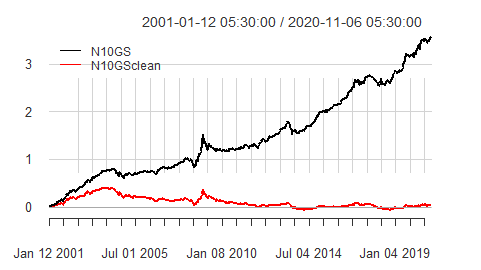
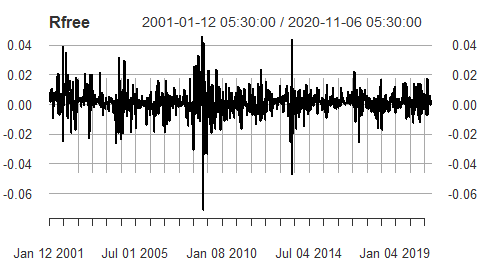
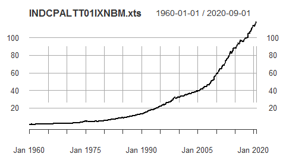
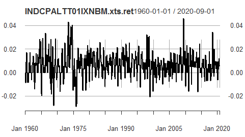

Risk-free Nay Ratna
================

What's on "Menu" for this Research Viewpoint
--------------------------------------------

1.  In [Nay Ratna](https://github.com/yadevinit/pf4pf/blob/main/nayRatna/nayRatna.md), optimal portfolios are located at very different positions on the risk-return chart for the Efficient Frontier. While different optimization approaches (including objectives, constraints, and rebalancing) can differ in their outputs, let's check, e.g., whether one approach is tilting to minimize risk while the other is inclined to maximizing return at the same optimization time.
2.  `Rf=0` in [Nay Ratna](https://github.com/yadevinit/pf4pf/blob/main/nayRatna/nayRatna.md). Let's include time series of returns of `Rf` say 10-year Government Securities.

Positions on Risk-Return Chart
------------------------------

Constraint of `full_investment` on weight sum and `long_only` on boxes were specified. The objective was specified as maximizing `mean` return while also minimizing risk `ES` with `risk_aversion=0.25`. [Portfolio Optimization with ROI in PortfolioAnalytics](https://cran.r-project.org/web/packages/PortfolioAnalytics/vignettes/ROI_vignette.pdf) says `risk_aversion` parameter controls how much portfolio variance is penalized. So, we would expect increasing this parameter would locate the optimal portfolio to a lesser-risk position. But nay, that does not happen. So either the way we specify to the ROI (`R` Optimization Infrastructure) solver was not ok, or the ROI solver does not support that. Ah, the music's stopped. We have to understand this deeper before we can rely on this fuller. Beyond Constraints and Objectives, it looks like there are choices that affect robustness: of Estimator (of covariances, etc.) and Solver. And there's something unnerving about diversification disappearing during extreme market events: you might have seen herds of stocks move down together during 2008! [The Black Swan: The Impact of the Highly Improbable](https://en.wikipedia.org/wiki/The_Black_Swan:_The_Impact_of_the_Highly_Improbable) and [Fooled by Randomness](https://en.wikipedia.org/wiki/Fooled_by_Randomness) might have crossed your mind by now. Couples passing soon after one another is studied and used in actuarial science (to model longevity for insurance). [Copula (linguistics)](https://en.m.wikipedia.org/wiki/Copula_(linguistics)) and [Recipe for Disaster: The Formula That Killed Wall Street](https://www.wired.com/2009/02/wp-quant/amp) give other interpretations. And there's [Emergence](https://en.wikipedia.org/wiki/Emergence). Coming back to Portfolios, it seems you can estimate copulae-based bivariate tail risk, which seems useful for Portfolios constrained by tail-risk budgets. And coming back to present times, we have, or rather, the stock markets have traced a "V", like the "W" of 2008; so, this trailing year would likely show that "going down together rapidly as a herd or couple" syndrome. "The essence of finance, however, is imprecise information, speculative forecasts based on incomplete information, judgement and risk-taking" says <https://twitter.com/ajay_shah/status/1312979556601528321?s=08>. And so, you hear of heteroscedasticity, volatility clustering, and regime shifts.

In the `R` source code for ROI approach, changing the risk measure to `var` instead of `ES` and setting `risk_aversion=25` gives us a mean return close to what the Random portfolios approach gave us with `ES`. It also chose as optimal a higher weight for [BPCL](https://finance.yahoo.com/quote/BPCL.BO), instead of mostly for [TSLA](https://finance.yahoo.com/quote/TSLA). These can be seen in following session output:

``` r
> var_obj <- portfolio_risk_objective(name="var", # Was: ES",
+     risk_aversion=25.0) # Was: 0.25
>   # Combine the objectives into a list
> qu_obj <- list(ret_obj, var_obj)
> opt_qu <- optimize.portfolio(R=returns, portfolio=init_portf, constraints=qu_constr,
+     objectives=qu_obj, optimize_method="ROI", # maxSTARR=TRUE,
+     trace=TRUE)
> extractStats(opt_qu)
       mean      StdDev         out      w.BPCL      w.NBCC w.QUICKHEAL      w.TSLA 
0.005189066 0.040270378 0.035353517 0.518196010 0.096401713 0.164998346 0.220403931 
> var_obj <- portfolio_risk_objective(name="var", # Was: ES",
+     risk_aversion=0.25) # Was: 0.25
> qu_obj <- list(ret_obj, var_obj)
> opt_qu <- optimize.portfolio(R=returns, portfolio=init_portf, constraints=qu_constr,
+     objectives=qu_obj, optimize_method="ROI", # maxSTARR=TRUE,
+     trace=TRUE)
> extractStats(opt_qu)
         mean        StdDev           out        w.BPCL        w.NBCC   w.QUICKHEAL 
 1.409758e-02  8.152840e-02 -1.243586e-02 -1.110223e-16  1.218326e-16  0.000000e+00 
       w.TSLA 
 1.000000e+00 
```

So inadvertently, the author's portfolio programming could introduce risk, especially considering that the author dealt with (optimization in) Operations Research as `1/(7*2*4) <= 2%` of undergraduate-engineering subjects in the 1980s and the [Workshop on Advanced Applications of `R` in Portfolio Management](https://ifrogs.org/PDF/2011032526_portfolioopt.pdf) attended was in 2011. Serves him right for not brushing up the pre-requisites and for steering away now from *λ* and other (Math or) Greek foundations! And if you're wondering what's that *λ* or `risk_aversion`, you could (pluck the courage to) look up [Risk Aversion](https://en.wikipedia.org/wiki/Risk_aversion), which in turn, also introduces Constant Relative Risk Aversion (CRRA). Whew! There's so much to know; it's endless and can get increasingly difficult. But we've got something to get done, in finite time.

Risk-free
---------

What's landed are: cyclone Nivar around India's southwest coast, [The Market Mafia](https://www.sundayguardianlive.com/news/stock-market-mafia-nse-scandal), and various conversations, including with that ex classmate and a "newbie" who's doubled his money on the US stock markets since 2019 summer using [Robinhood](https://robinhood.com). `www` search shows more market happenings: [Penny Stocks on Fire in India as Robinhood Traders Pile In](https://www.bloomberg.com/news/articles/2020-07-23/penny-stocks-catch-fever-in-india-as-robinhood-investors-rush-in) and [Zerodha's Indian 'Robinhood' dream has an Ant problem](https://www.livemint.com/market/stock-market-news/zerodha-paytm-money-indian-robinhood-dream-has-an-ant-problem-11600495880651.html) ... And I'm writing now on Risk-free.

Following plots show chosen relatively risk-free index of Government securities as per [NIFTY 10 yr Benchmark G-Sec Index](https://www1.nseindia.com/products/content/equities/indices/nifty_10_b_gsec.htm). (The similar-sounding [NIFTY 10 yr Benchmark G-Sec (Clean Price) index](https://www1.nseindia.com/products/content/equities/indices/nifty_10_b_gsec_cp.htm) says: "Accrued Interest and coupon payments are not considered for index calculations." So, it's use would be for a different purpose.) Why not use shorter- or longer-duration bonds here, you might ask. The author chose this because this index gives us the farthest data, going back to 2001. Cumulative returns are on the left, and weekly returns are to the right:

 

[The Inflation Rate in India: Some Applied Issues 2008](https://www.rbi.org.in/Scripts/bs_viewcontent.aspx?Id=2024) says:

> Abstract ... Based on various empirical exercises pertaining to the relationship of inflation with money, output growth,interest rate and asset price variation, the study finds evidence that the standard year-on-year inflation rate could be more meaningful than the monthly inflation rate. ... Section III Empirical Evidence Chart 1 shows the two measures of inflation rate i.e., annual inflation rate (INFSA) and the monthly inflation rate (INFSM) ... The monthly inflation rate is highly volatile; at times, it could be higher than 20-30 per cent on annualised basis and such high rates generally being followed by low or negative values.

Let's download monthly CPI data from:

> Organization for Economic Co-operation and Development, Consumer Price Index: All items: Total: Total for India `[INDCPALTT01IXNBM]`, retrieved from FRED, Federal Reserve Bank of St. Louis; <https://fred.stlouisfed.org/series/INDCPALTT01IXNBM>, November 24, 2020.

And here's the code-session output and following plots (for the CPI index on left and its monthly growth rate on right):

``` r
> INDCPALTT01IXNBM <- read.csv(file=paste0(tmp.fpath, "INDCPALTT01IXNBM.csv"))
> INDCPALTT01IXNBM.xts.date <- as.Date(INDCPALTT01IXNBM$DATE, format="%Y-%m-%d")
> INDCPALTT01IXNBM.xts <- xts(INDCPALTT01IXNBM$INDCPALTT01IXNBM,
+   order.by=INDCPALTT01IXNBM.xts.date)
> INDCPALTT01IXNBM.xts.ret <- Return.calculate(INDCPALTT01IXNBM.xts,
+     method="discrete") # method: c("discrete","log","difference")
> plot(INDCPALTT01IXNBM.xts)
> plot(INDCPALTT01IXNBM.xts.ret)
> print(summary(INDCPALTT01IXNBM.xts.ret))
     Index            INDCPALTT01IXNBM.xts.ret
 Min.   :1960-01-01   Min.   :-0.028866       
 1st Qu.:1975-03-01   1st Qu.: 0.000000       
 Median :1990-05-01   Median : 0.006093       
 Mean   :1990-05-01   Mean   : 0.006039       
 3rd Qu.:2005-07-01   3rd Qu.: 0.011265       
 Max.   :2020-09-01   Max.   : 0.045752       
                      NA's   :1
> (1+0.006039)^12 - 1
[1] 0.07492411
```

 

Beware: this way of looking at CPI growth from one month to the next might not match how inflation is typically studied for national policy. Here, the intention is to have its variation in the background so that we see in perspective what's being labelled Risk-free. For example, CPI's 3rd quartile being `0.011` tells us that a quarter of months see CPI growing by `1.1%` or more, which puts an upward pressure on the portfolio growth individual investors must seek to protect household wealth from eroding in value or purchasing power. Maybe we could consider hedging currency and country risk as well, but let's leave that for another viewpoint later. What the author realized through all this is that there are so many people, including Government, who work to stabilize the (economy and) financial world for individuals. Without that work, one can see how choppy the world could be. Building on those shoulders of stability, the author is creating a next level, maybe a speck in the vast cosmos.
