INFY Stability, in a World that is
================
October 30, 2021

Historical [INFY](https://finance.yahoo.com/quote/INFY.NS/) stock returns for the company [Infosys Technologies Ltd](https://www.infosys.com/) have been considered here as an exemplar investment asset that could be stabilized further and systematically, as guided by [Stable Portfolio Design using Bayesian Change Point Models and Geometric Shape Factors](https://www.openmetrics.ch/post/stable-portfolio-design-using-bayesian-change-point-models-and-geometric-shape-factors-1). What's possible then is stabler holdings and growth in wealth for stakeholders en masse.

Asset Stability: from Bayesian Change Points to Morlet-Wavelet-Spectrum Analytics
---------------------------------------------------------------------------------

    ## Series:
    ##  INFY 
    ## Turning Points: 12 
    ##  [1] "2000-06-09" "2001-10-12" "2002-12-13" "2003-05-23" "2007-02-15"
    ##  [6] "2008-12-26" "2010-12-31" "2012-09-14" "2016-03-23" "2017-06-30"
    ## [11] "2019-07-19" "2020-02-07"

    ## Series:
    ##  INFY 
    ## Turning Points: 12 
    ##  [1] "2000-06-09" "2001-10-12" "2002-12-13" "2003-05-23" "2007-02-15"
    ##  [6] "2008-12-26" "2010-12-31" "2012-09-14" "2016-03-23" "2017-06-30"
    ## [11] "2019-07-19" "2020-02-07"

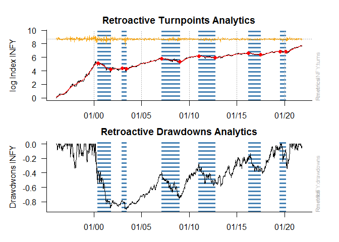

    ## 
    ## Series Initialization:
    ##  ARMA Model:                arma
    ##  Formula Mean:              ~ arma(0, 0)
    ##  GARCH Model:               garch
    ##  Formula Variance:          ~ garch(1, 1)
    ##  ARMA Order:                0 0
    ##  Max ARMA Order:            0
    ##  GARCH Order:               1 1
    ##  Max GARCH Order:           1
    ##  Maximum Order:             1
    ##  Conditional Dist:          norm
    ##  h.start:                   2
    ##  llh.start:                 1
    ##  Length of Series:          1345
    ##  Recursion Init:            mci
    ##  Series Scale:              5.558602
    ## 
    ## Parameter Initialization:
    ##  Initial Parameters:          $params
    ##  Limits of Transformations:   $U, $V
    ##  Which Parameters are Fixed?  $includes
    ##  Parameter Matrix:
    ##                      U          V    params includes
    ##     mu     -1.02756648   1.027566 0.1027566     TRUE
    ##     omega   0.00000100 100.000000 0.1000000     TRUE
    ##     alpha1  0.00000001   1.000000 0.1000000     TRUE
    ##     gamma1 -0.99999999   1.000000 0.1000000    FALSE
    ##     beta1   0.00000001   1.000000 0.8000000     TRUE
    ##     delta   0.00000000   2.000000 2.0000000    FALSE
    ##     skew    0.10000000  10.000000 1.0000000    FALSE
    ##     shape   1.00000000  10.000000 4.0000000    FALSE
    ##  Index List of Parameters to be Optimized:
    ##     mu  omega alpha1  beta1 
    ##      1      2      3      5 
    ##  Persistence:                  0.9 
    ## 
    ## 
    ## --- START OF TRACE ---
    ## Selected Algorithm: nlminb 
    ## 
    ## R coded nlminb Solver: 
    ## 
    ##   0:     1770.2163: 0.102757 0.100000 0.100000 0.800000
    ##   1:     1763.8559: 0.102746 0.0810653 0.103165 0.795909
    ##   2:     1759.6283: 0.102730 0.0800093 0.117597 0.809170
    ##   3:     1753.7128: 0.102688 0.0435944 0.130211 0.816641
    ##   4:     1746.0733: 0.102579 0.0367651 0.134691 0.855024
    ##   5:     1738.0750: 0.102421 0.0174780 0.111941 0.880503
    ##   6:     1731.6936: 0.102196 0.0176809 0.0817555 0.905505
    ##   7:     1730.4140: 0.101953 0.00608483 0.0583000 0.934676
    ##   8:     1727.8837: 0.101952 0.00923489 0.0593510 0.936345
    ##   9:     1727.0634: 0.101742 0.00910317 0.0562698 0.936724
    ##  10:     1726.7662: 0.101647 0.00754176 0.0545237 0.939457
    ##  11:     1724.5445: 0.100508 0.000822535 0.0373131 0.965075
    ##  12:     1723.0734: 0.100504 0.00400359 0.0346157 0.963024
    ##  13:     1722.6525: 0.100504 0.00321398 0.0341863 0.962576
    ##  14:     1722.4377: 0.100460 0.00348057 0.0336590 0.963270
    ##  15:     1722.1518: 0.100179 0.00327882 0.0295637 0.966585
    ##  16:     1722.1211: 0.100179 0.00336743 0.0296439 0.966686
    ##  17:     1722.1091: 0.100178 0.00322842 0.0296830 0.966745
    ##  18:     1722.1022: 0.100148 0.00327112 0.0297482 0.966837
    ##  19:     1722.0936: 0.100117 0.00319382 0.0297353 0.966829
    ##  20:     1722.0860: 0.100054 0.00319185 0.0297845 0.966912
    ##  21:     1722.0740: 0.0999255 0.00312759 0.0297709 0.966909
    ##  22:     1721.2609: 0.0834833 0.00302722 0.0297510 0.967192
    ##  23:     1721.2364: 0.0821835 0.00287466 0.0280274 0.968784
    ##  24:     1721.1990: 0.0808620 0.00270941 0.0283457 0.968635
    ##  25:     1721.1248: 0.0776039 0.00293937 0.0285133 0.968125
    ##  26:     1721.0676: 0.0710868 0.00276561 0.0289305 0.968465
    ##  27:     1721.0316: 0.0686260 0.00284847 0.0292145 0.967795
    ##  28:     1721.0305: 0.0694116 0.00284587 0.0291592 0.967876
    ##  29:     1721.0305: 0.0693882 0.00284408 0.0291504 0.967887
    ##  30:     1721.0305: 0.0693883 0.00284410 0.0291507 0.967887
    ## 
    ## Final Estimate of the Negative LLH:
    ##  LLH:  4028.172    norm LLH:  2.994923 
    ##         mu      omega     alpha1      beta1 
    ## 0.38570188 0.08787701 0.02915068 0.96788660 
    ## 
    ## R-optimhess Difference Approximated Hessian Matrix:
    ##               mu        omega      alpha1        beta1
    ## mu     -71.52280     14.24219     100.527     141.3026
    ## omega   14.24219  -2406.79725  -30177.953  -37349.4266
    ## alpha1 100.52695 -30177.95254 -564967.576 -638877.7339
    ## beta1  141.30257 -37349.42657 -638877.734 -781350.5186
    ## attr(,"time")
    ## Time difference of 0.03124785 secs
    ## 
    ## --- END OF TRACE ---
    ## 
    ## 
    ## Time to Estimate Parameters:
    ##  Time difference of 0.1912339 secs
    ## Series:
    ##  INFY 
    ## Turning Points: 12 
    ##  [1] "2000-06-09" "2001-10-12" "2002-12-13" "2003-05-23" "2007-02-15"
    ##  [6] "2008-12-26" "2010-12-31" "2012-09-14" "2016-03-23" "2017-06-30"
    ## [11] "2019-07-19" "2020-02-07"

    ## Series:
    ##  INFY 
    ## Turning Points: 12 
    ##  [1] "2000-06-09" "2001-10-12" "2002-12-13" "2003-05-23" "2007-02-15"
    ##  [6] "2008-12-26" "2010-12-31" "2012-09-14" "2016-03-23" "2017-06-30"
    ## [11] "2019-07-19" "2020-02-07"

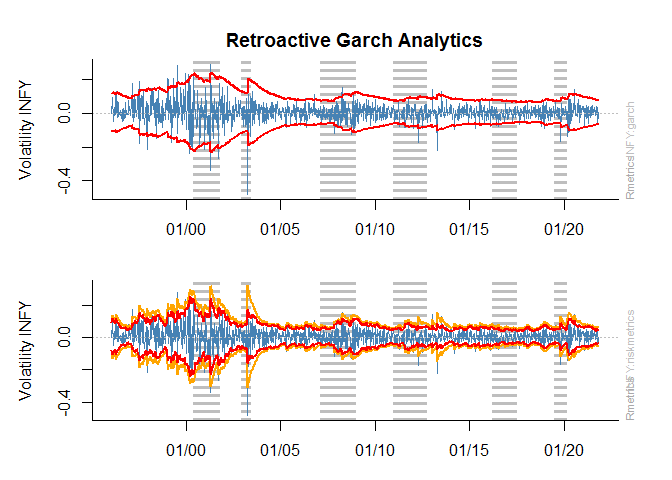

    ## Series:
    ##  INFY 
    ## Turning Points: 12 
    ##  [1] "2000-06-09" "2001-10-12" "2002-12-13" "2003-05-23" "2007-02-15"
    ##  [6] "2008-12-26" "2010-12-31" "2012-09-14" "2016-03-23" "2017-06-30"
    ## [11] "2019-07-19" "2020-02-07"

    ## Series:
    ##  INFY 
    ## Turning Points: 12 
    ##  [1] "2000-06-09" "2001-10-12" "2002-12-13" "2003-05-23" "2007-02-15"
    ##  [6] "2008-12-26" "2010-12-31" "2012-09-14" "2016-03-23" "2017-06-30"
    ## [11] "2019-07-19" "2020-02-07"

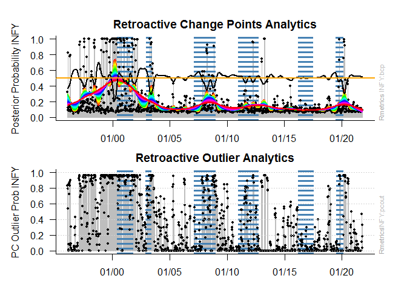

    ## Warning in Var * fft_theor: Recycling array of length 1 in array-vector arithmetic is deprecated.
    ##   Use c() or as.vector() instead.

    ## Series:
    ##  INFY 
    ## Turning Points: 12 
    ##  [1] "2000-06-09" "2001-10-12" "2002-12-13" "2003-05-23" "2007-02-15"
    ##  [6] "2008-12-26" "2010-12-31" "2012-09-14" "2016-03-23" "2017-06-30"
    ## [11] "2019-07-19" "2020-02-07"
    ## Stats Measures:
    ##         mean           sd         skew         kurt 
    ##  0.003131456  0.004534000  3.839152190 34.923620048 
    ##         O         I         F         M 
    ## 9.8853197 0.5273236 1.3096545 0.1061410

    ## NULL

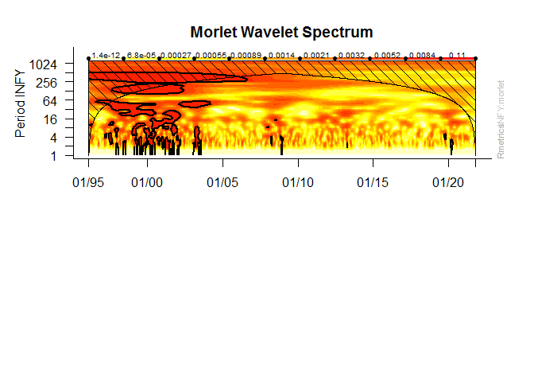

Bayesian Instantaneous Sharpe Ratio Weighted by Stability
---------------------------------------------------------

    ## Loading required package: TTR

    ## Warning: package 'TTR' was built under R version 3.6.3

    ## 
    ## Attaching package: 'TTR'

    ## The following object is masked from 'package:fBasics':
    ## 
    ##     volatility

    ## [1] "INFY:15:1;2;2;1;1;2;FALSE;36;4;0.2;0.1 spec starting."

    ## Warning in indicToSig(dtkIndicator, stabSpec.i): stabSpec.i TDR==2 etc might
    ## need changes for Binary Switching.

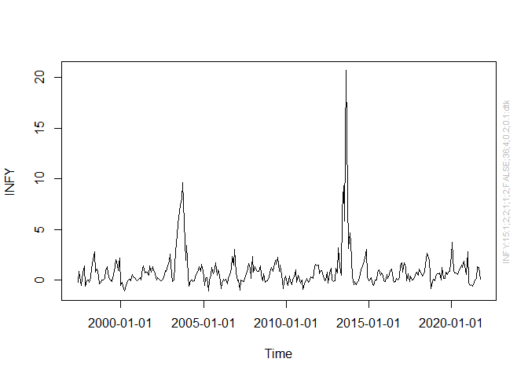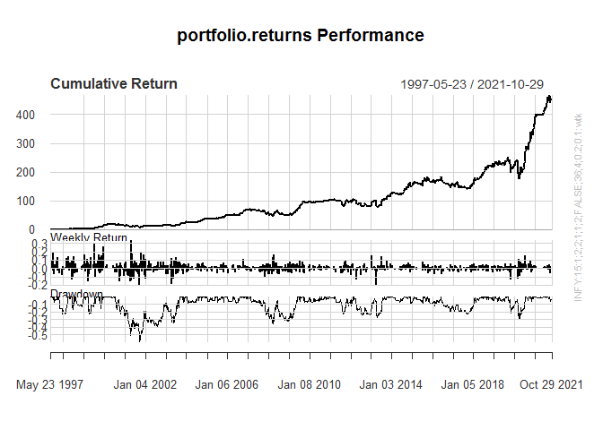

    ## [1] "About to chart.RelativePerformance()."
    ##    period_lengths portfolio.returns INFY total periods
    ## 1               1               559  700          1259
    ## 2               4               494  772          1266
    ## 3              12               480  784          1264
    ## 4              36               551  689          1240
    ## 5              52               579  645          1224
    ## 6             104               616  556          1172
    ## 7             156               617  503          1120
    ## 8             208               672  396          1068
    ## 9             260               739  277          1016
    ## 10            312               730  234           964
    ## 11            364               698  214           912
    ##    prob_portfolio.returns_outperformance prob_INFY_outperformance
    ## 1                              0.4440032                0.5559968
    ## 2                              0.3902054                0.6097946
    ## 3                              0.3797468                0.6202532
    ## 4                              0.4443548                0.5556452
    ## 5                              0.4730392                0.5269608
    ## 6                              0.5255973                0.4744027
    ## 7                              0.5508929                0.4491071
    ## 8                              0.6292135                0.3707865
    ## 9                              0.7273622                0.2726378
    ## 10                             0.7572614                0.2427386
    ## 11                             0.7653509                0.2346491
    ##  int [1:316] 1 2 3 4 5 6 7 8 9 10 ...
    ## NULL
    ##         0%         2%         4%         6%         8%        10%        12% 
    ## 0.00000000 0.00000000 0.01567502 0.03189235 0.07644977 0.15113473 0.21007920 
    ##        14%        16%        18%        20%        25%        33%        50% 
    ## 0.24549906 0.31622474 0.38447297 0.42353530 0.50619184 0.59463814 0.89267806 
    ##        66%        75%        80%       100% 
    ## 0.96976438 0.99153532 0.99563121 1.00000000

    ## Warning in weightsAnalyze(wtkWeights): Return.portfolio(,
    ## weights=wtkWeights.adj); then chart.RelativePerformance(Ra=2,Rb=INFY)

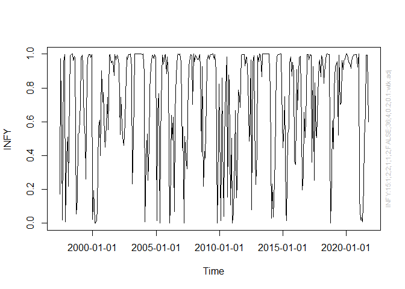

    ## [1] "INFY:14:1;4;8;1;1;2;FALSE;36;4;0.2;0.1 spec starting."

    ## Warning in indicToSig(dtkIndicator, stabSpec.i): stabSpec.i TDR==2 etc might
    ## need changes for Binary Switching.

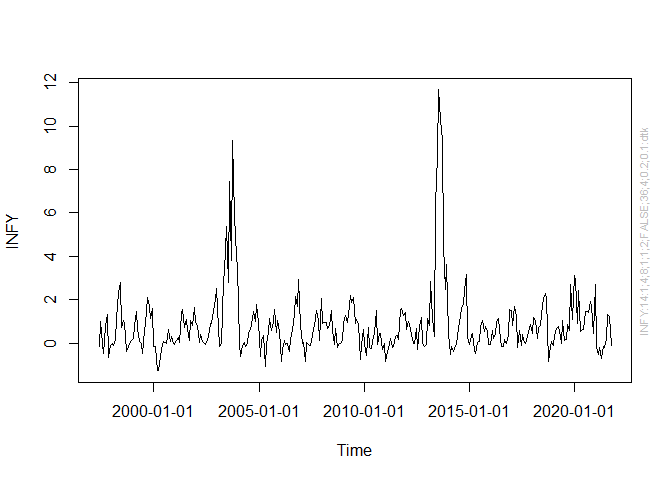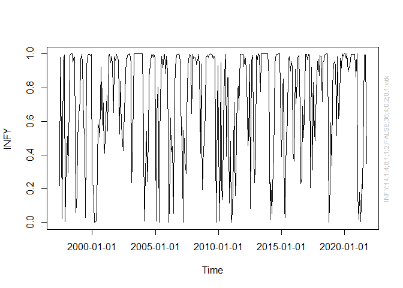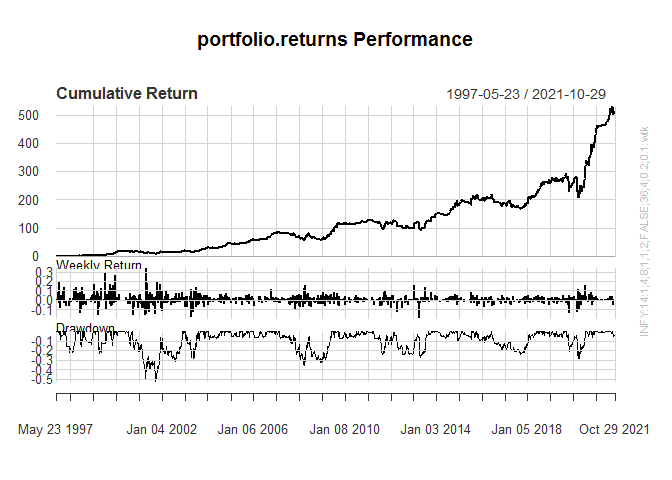

    ## [1] "About to chart.RelativePerformance()."
    ##    period_lengths portfolio.returns INFY total periods
    ## 1               1               558  697          1255
    ## 2               4               499  762          1261
    ## 3              12               479  783          1262
    ## 4              36               541  699          1240
    ## 5              52               575  649          1224
    ## 6             104               630  542          1172
    ## 7             156               632  488          1120
    ## 8             208               697  371          1068
    ## 9             260               737  279          1016
    ## 10            312               718  246           964
    ## 11            364               719  193           912
    ##    prob_portfolio.returns_outperformance prob_INFY_outperformance
    ## 1                              0.4446215                0.5553785
    ## 2                              0.3957177                0.6042823
    ## 3                              0.3795563                0.6204437
    ## 4                              0.4362903                0.5637097
    ## 5                              0.4697712                0.5302288
    ## 6                              0.5375427                0.4624573
    ## 7                              0.5642857                0.4357143
    ## 8                              0.6526217                0.3473783
    ## 9                              0.7253937                0.2746063
    ## 10                             0.7448133                0.2551867
    ## 11                             0.7883772                0.2116228
    ##  int [1:315] 1 2 3 4 5 6 7 8 9 10 ...
    ## NULL
    ##          0%          2%          4%          6%          8%         10% 
    ## 0.000000000 0.000000000 0.009867885 0.049933718 0.097298356 0.178591009 
    ##         12%         14%         16%         18%         20%         25% 
    ## 0.219574931 0.238197283 0.296873908 0.358141901 0.402997690 0.493496511 
    ##         33%         50%         66%         75%         80%        100% 
    ## 0.587507312 0.915423579 0.975956623 0.990256256 0.996829671 1.000000000

    ## Warning in weightsAnalyze(wtkWeights): Return.portfolio(,
    ## weights=wtkWeights.adj); then chart.RelativePerformance(Ra=2,Rb=INFY)


    ## [1] "INFY:13:1;2;2;1;1;2;FALSE;36;4;0.2;0.2 spec starting."

    ## Warning in indicToSig(dtkIndicator, stabSpec.i): stabSpec.i TDR==2 etc might
    ## need changes for Binary Switching.

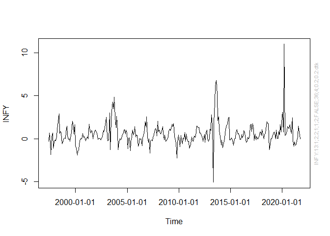

    ## [1] "About to chart.RelativePerformance()."
    ##    period_lengths portfolio.returns INFY total periods
    ## 1               1               562  708          1270
    ## 2               4               486  785          1271
    ## 3              12               463  801          1264
    ## 4              36               536  704          1240
    ## 5              52               566  658          1224
    ## 6             104               577  595          1172
    ## 7             156               580  540          1120
    ## 8             208               652  416          1068
    ## 9             260               638  378          1016
    ## 10            312               596  368           964
    ## 11            364               618  294           912
    ##    prob_portfolio.returns_outperformance prob_INFY_outperformance
    ## 1                              0.4425197                0.5574803
    ## 2                              0.3823761                0.6176239
    ## 3                              0.3662975                0.6337025
    ## 4                              0.4322581                0.5677419
    ## 5                              0.4624183                0.5375817
    ## 6                              0.4923208                0.5076792
    ## 7                              0.5178571                0.4821429
    ## 8                              0.6104869                0.3895131
    ## 9                              0.6279528                0.3720472
    ## 10                             0.6182573                0.3817427
    ## 11                             0.6776316                0.3223684
    ##  int [1:318] 1 2 3 4 5 6 7 8 9 10 ...
    ## NULL
    ##          0%          2%          4%          6%          8%         10% 
    ## 0.000000000 0.000000000 0.000000000 0.000000000 0.002464711 0.020601844 
    ##         12%         14%         16%         18%         20%         25% 
    ## 0.034880265 0.063624185 0.087407810 0.112684335 0.151394659 0.315905317 
    ##         33%         50%         66%         75%         80%        100% 
    ## 0.488082677 0.801005848 0.954171299 0.980863660 0.991385144 1.000000000

    ## Warning in weightsAnalyze(wtkWeights): Return.portfolio(,
    ## weights=wtkWeights.adj); then chart.RelativePerformance(Ra=2,Rb=INFY)

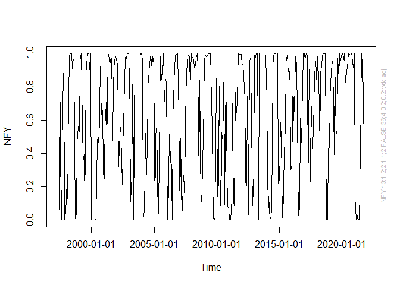

    ## [1] "INFY:12:1;4;8;1;1;2;FALSE;36;4;0.2;0.2 spec starting."

    ## Warning in indicToSig(dtkIndicator, stabSpec.i): stabSpec.i TDR==2 etc might
    ## need changes for Binary Switching.

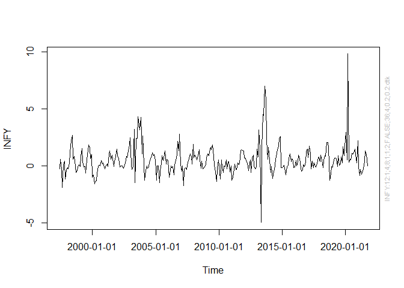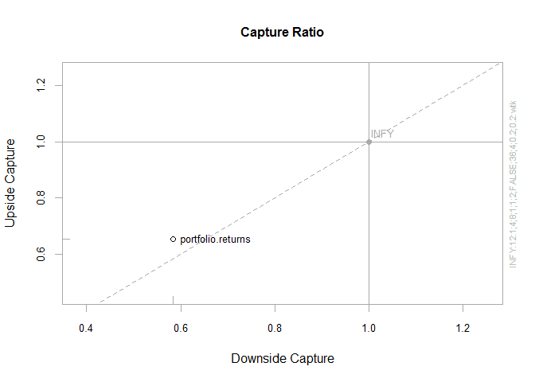

    ## [1] "About to chart.RelativePerformance()."
    ##    period_lengths portfolio.returns INFY total periods
    ## 1               1               562  708          1270
    ## 2               4               498  773          1271
    ## 3              12               489  775          1264
    ## 4              36               566  674          1240
    ## 5              52               573  651          1224
    ## 6             104               582  590          1172
    ## 7             156               553  567          1120
    ## 8             208               655  413          1068
    ## 9             260               643  373          1016
    ## 10            312               684  280           964
    ## 11            364               604  308           912
    ##    prob_portfolio.returns_outperformance prob_INFY_outperformance
    ## 1                              0.4425197                0.5574803
    ## 2                              0.3918175                0.6081825
    ## 3                              0.3868671                0.6131329
    ## 4                              0.4564516                0.5435484
    ## 5                              0.4681373                0.5318627
    ## 6                              0.4965870                0.5034130
    ## 7                              0.4937500                0.5062500
    ## 8                              0.6132959                0.3867041
    ## 9                              0.6328740                0.3671260
    ## 10                             0.7095436                0.2904564
    ## 11                             0.6622807                0.3377193
    ##  int [1:318] 1 2 3 4 5 6 7 8 9 10 ...
    ## NULL
    ##          0%          2%          4%          6%          8%         10% 
    ## 0.000000000 0.000000000 0.000000000 0.000000000 0.005271526 0.017159151 
    ##         12%         14%         16%         18%         20%         25% 
    ## 0.033520034 0.069745042 0.107781157 0.126465638 0.193093316 0.325419139 
    ##         33%         50%         66%         75%         80%        100% 
    ## 0.491039427 0.817106298 0.948847917 0.979859427 0.988061547 1.000000000

    ## Warning in weightsAnalyze(wtkWeights): Return.portfolio(,
    ## weights=wtkWeights.adj); then chart.RelativePerformance(Ra=2,Rb=INFY)

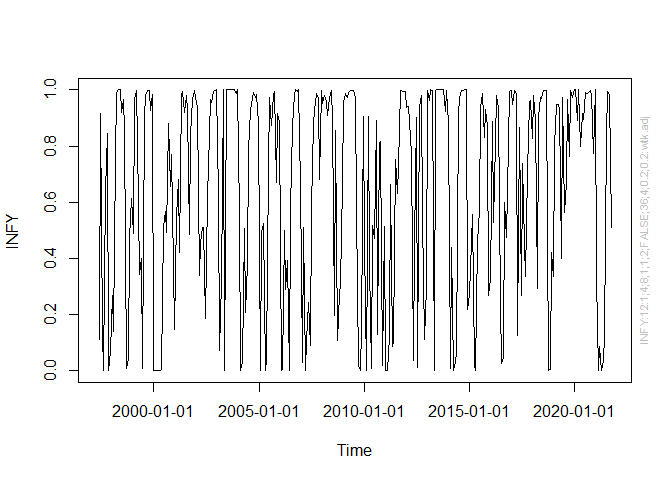

    ## [1] "INFY:11:1;2;2;1;1;2;FALSE;36;4;0.2;0.3 spec starting."

    ## Warning in indicToSig(dtkIndicator, stabSpec.i): stabSpec.i TDR==2 etc might
    ## need changes for Binary Switching.

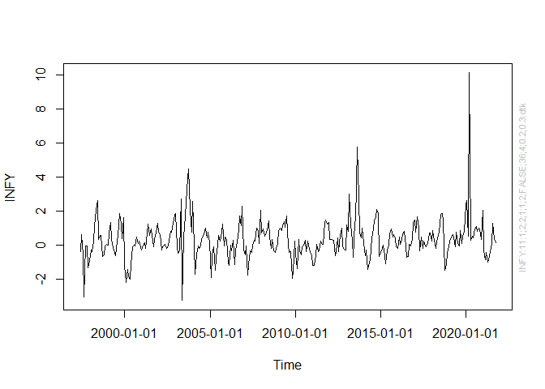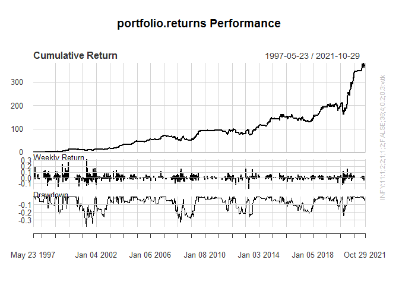

    ## [1] "About to chart.RelativePerformance()."
    ##    period_lengths portfolio.returns INFY total periods
    ## 1               1               562  708          1270
    ## 2               4               496  775          1271
    ## 3              12               465  799          1264
    ## 4              36               532  708          1240
    ## 5              52               549  675          1224
    ## 6             104               552  620          1172
    ## 7             156               529  591          1120
    ## 8             208               512  556          1068
    ## 9             260               530  486          1016
    ## 10            312               545  419           964
    ## 11            364               540  372           912
    ##    prob_portfolio.returns_outperformance prob_INFY_outperformance
    ## 1                              0.4425197                0.5574803
    ## 2                              0.3902439                0.6097561
    ## 3                              0.3678797                0.6321203
    ## 4                              0.4290323                0.5709677
    ## 5                              0.4485294                0.5514706
    ## 6                              0.4709898                0.5290102
    ## 7                              0.4723214                0.5276786
    ## 8                              0.4794007                0.5205993
    ## 9                              0.5216535                0.4783465
    ## 10                             0.5653527                0.4346473
    ## 11                             0.5921053                0.4078947
    ##  int [1:318] 1 2 3 4 5 6 7 8 9 10 ...
    ## NULL
    ##          0%          2%          4%          6%          8%         10% 
    ## 0.000000000 0.000000000 0.000000000 0.000000000 0.000000000 0.000000000 
    ##         12%         14%         16%         18%         20%         25% 
    ## 0.005792420 0.008632893 0.018954187 0.034901863 0.047472487 0.092128511 
    ##         33%         50%         66%         75%         80%        100% 
    ## 0.356506983 0.721064736 0.904990545 0.959925362 0.979394125 1.000000000

    ## Warning in weightsAnalyze(wtkWeights): Return.portfolio(,
    ## weights=wtkWeights.adj); then chart.RelativePerformance(Ra=2,Rb=INFY)

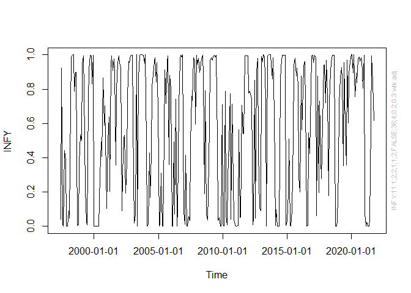

    ## [1] "INFY:10:1;4;8;1;1;2;FALSE;36;4;0.2;0.3 spec starting."

    ## Warning in indicToSig(dtkIndicator, stabSpec.i): stabSpec.i TDR==2 etc might
    ## need changes for Binary Switching.

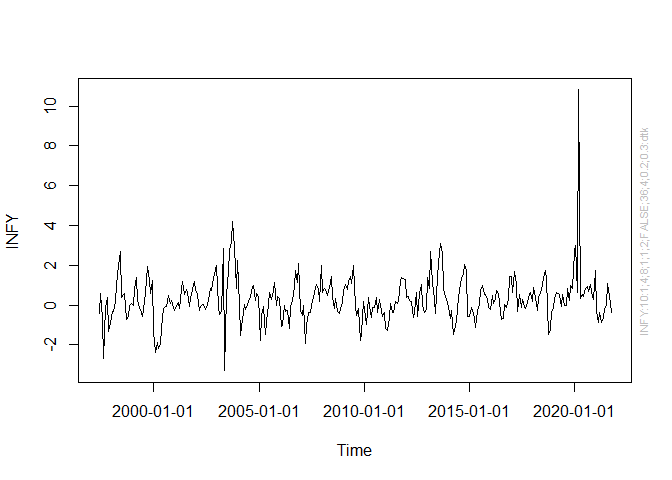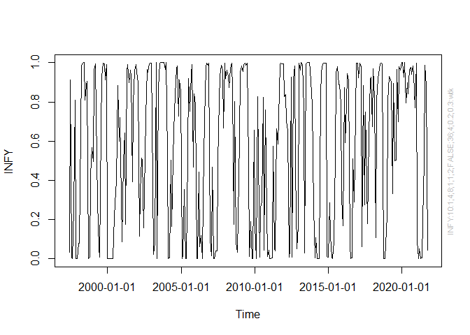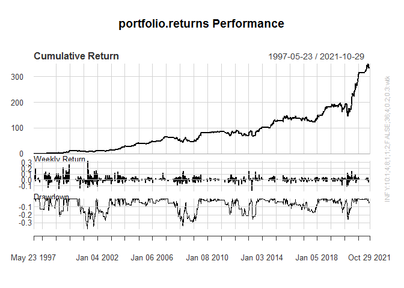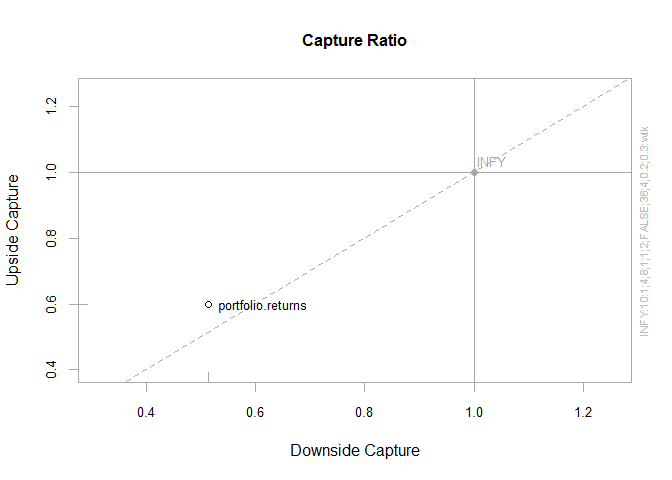

    ## [1] "About to chart.RelativePerformance()."
    ##    period_lengths portfolio.returns INFY total periods
    ## 1               1               562  708          1270
    ## 2               4               485  786          1271
    ## 3              12               471  793          1264
    ## 4              36               529  711          1240
    ## 5              52               539  685          1224
    ## 6             104               559  613          1172
    ## 7             156               526  594          1120
    ## 8             208               552  516          1068
    ## 9             260               546  470          1016
    ## 10            312               555  409           964
    ## 11            364               534  378           912
    ##    prob_portfolio.returns_outperformance prob_INFY_outperformance
    ## 1                              0.4425197                0.5574803
    ## 2                              0.3815893                0.6184107
    ## 3                              0.3726266                0.6273734
    ## 4                              0.4266129                0.5733871
    ## 5                              0.4403595                0.5596405
    ## 6                              0.4769625                0.5230375
    ## 7                              0.4696429                0.5303571
    ## 8                              0.5168539                0.4831461
    ## 9                              0.5374016                0.4625984
    ## 10                             0.5757261                0.4242739
    ## 11                             0.5855263                0.4144737
    ##  int [1:318] 1 2 3 4 5 6 7 8 9 10 ...
    ## NULL
    ##          0%          2%          4%          6%          8%         10% 
    ## 0.000000000 0.000000000 0.000000000 0.000000000 0.000000000 0.000000000 
    ##         12%         14%         16%         18%         20%         25% 
    ## 0.005452138 0.008864570 0.016162171 0.040336394 0.051278245 0.108368942 
    ##         33%         50%         66%         75%         80%        100% 
    ## 0.309998075 0.722579058 0.912733694 0.958680014 0.976769300 1.000000000

    ## Warning in weightsAnalyze(wtkWeights): Return.portfolio(,
    ## weights=wtkWeights.adj); then chart.RelativePerformance(Ra=2,Rb=INFY)


    ## [1] "INFY:9:1;4;8;1;2;1;FALSE;36;4;0.2;0.3 spec starting."

    ## Warning in indicToSig(dtkIndicator, stabSpec.i): stabSpec.i TDR==2 etc might
    ## need changes for Binary Switching.

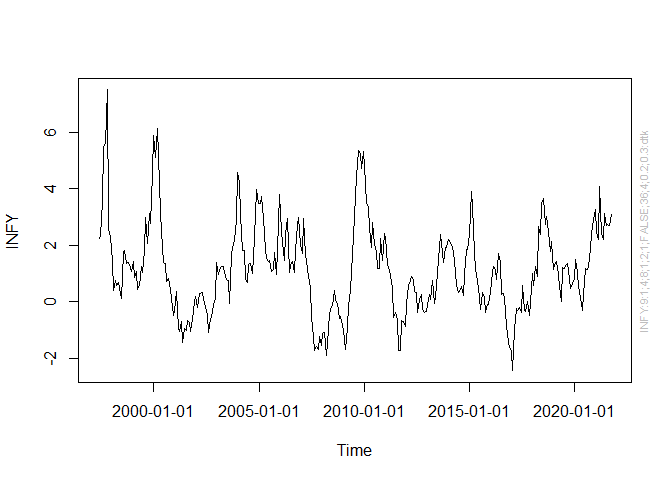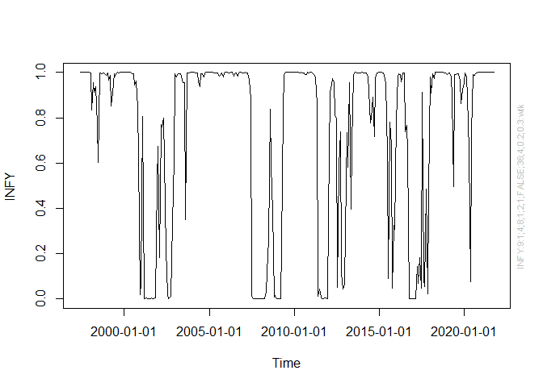

    ## [1] "About to chart.RelativePerformance()."
    ##    period_lengths portfolio.returns INFY total periods
    ## 1               1               564  710          1274
    ## 2               4               509  763          1272
    ## 3              12               438  826          1264
    ## 4              36               338  902          1240
    ## 5              52               325  899          1224
    ## 6             104               365  807          1172
    ## 7             156               429  691          1120
    ## 8             208               465  603          1068
    ## 9             260               459  557          1016
    ## 10            312               434  530           964
    ## 11            364               392  520           912
    ##    prob_portfolio.returns_outperformance prob_INFY_outperformance
    ## 1                              0.4427002                0.5572998
    ## 2                              0.4001572                0.5998428
    ## 3                              0.3465190                0.6534810
    ## 4                              0.2725806                0.7274194
    ## 5                              0.2655229                0.7344771
    ## 6                              0.3114334                0.6885666
    ## 7                              0.3830357                0.6169643
    ## 8                              0.4353933                0.5646067
    ## 9                              0.4517717                0.5482283
    ## 10                             0.4502075                0.5497925
    ## 11                             0.4298246                0.5701754
    ##  int [1:319] 1 2 3 4 5 6 7 8 9 10 ...
    ## NULL
    ##          0%          2%          4%          6%          8%         10% 
    ## 0.000000000 0.000000000 0.000000000 0.000000000 0.000000000 0.000000000 
    ##         12%         14%         16%         18%         20%         25% 
    ## 0.009050959 0.021229740 0.050088064 0.089153695 0.207551091 0.582983225 
    ##         33%         50%         66%         75%         80%        100% 
    ## 0.797183499 0.984813002 0.998161840 0.999723423 0.999923424 1.000000000

    ## Warning in weightsAnalyze(wtkWeights): Return.portfolio(,
    ## weights=wtkWeights.adj); then chart.RelativePerformance(Ra=2,Rb=INFY)

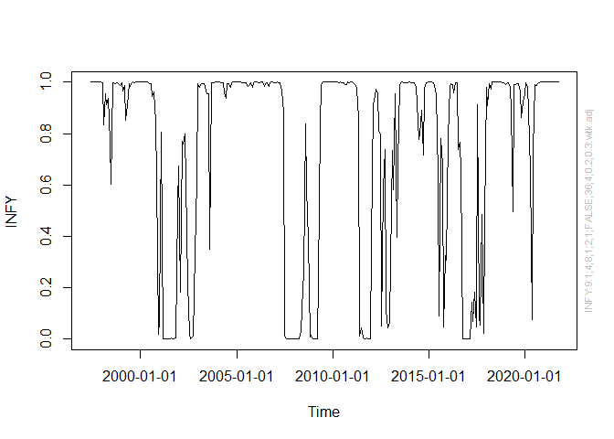

    ## [1] "INFY:8:1;2;2;1;2;1;FALSE;36;4;0.2;0.3 spec starting."

    ## Warning in indicToSig(dtkIndicator, stabSpec.i): stabSpec.i TDR==2 etc might
    ## need changes for Binary Switching.

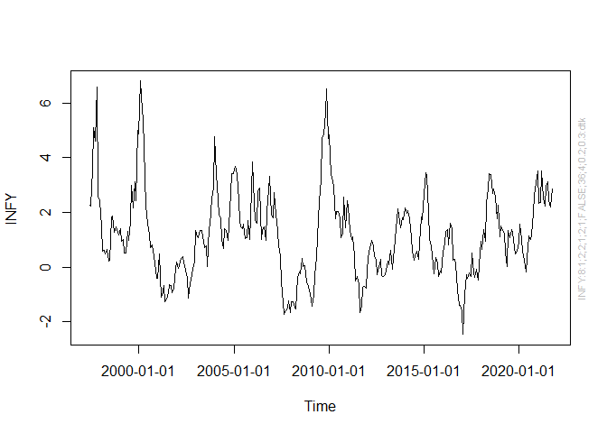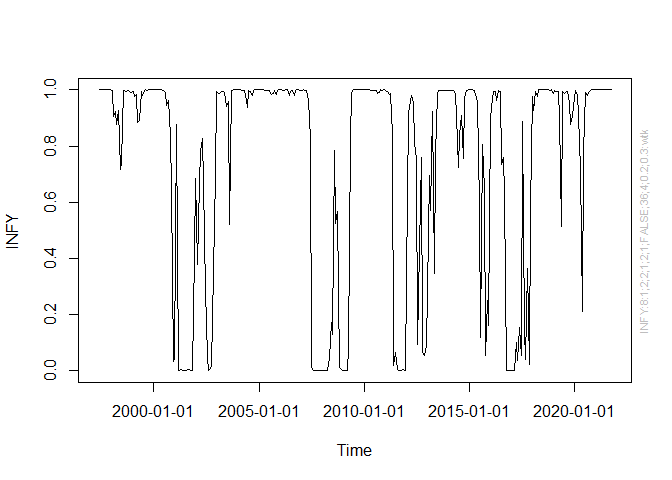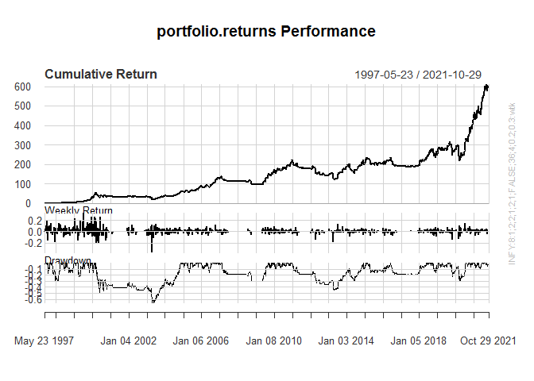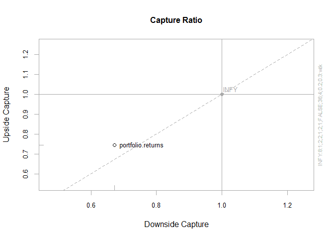

    ## [1] "About to chart.RelativePerformance()."
    ##    period_lengths portfolio.returns INFY total periods
    ## 1               1               564  710          1274
    ## 2               4               508  764          1272
    ## 3              12               447  817          1264
    ## 4              36               324  916          1240
    ## 5              52               319  905          1224
    ## 6             104               363  809          1172
    ## 7             156               424  696          1120
    ## 8             208               458  610          1068
    ## 9             260               451  565          1016
    ## 10            312               432  532           964
    ## 11            364               388  524           912
    ##    prob_portfolio.returns_outperformance prob_INFY_outperformance
    ## 1                              0.4427002                0.5572998
    ## 2                              0.3993711                0.6006289
    ## 3                              0.3536392                0.6463608
    ## 4                              0.2612903                0.7387097
    ## 5                              0.2606209                0.7393791
    ## 6                              0.3097270                0.6902730
    ## 7                              0.3785714                0.6214286
    ## 8                              0.4288390                0.5711610
    ## 9                              0.4438976                0.5561024
    ## 10                             0.4481328                0.5518672
    ## 11                             0.4254386                0.5745614
    ##  int [1:319] 1 2 3 4 5 6 7 8 9 10 ...
    ## NULL
    ##          0%          2%          4%          6%          8%         10% 
    ## 0.000000000 0.000000000 0.000000000 0.000000000 0.000000000 0.000000000 
    ##         12%         14%         16%         18%         20%         25% 
    ## 0.008760245 0.035029236 0.054596462 0.096051512 0.167533729 0.568713157 
    ##         33%         50%         66%         75%         80%        100% 
    ## 0.814048446 0.984354203 0.998289379 0.999710435 0.999916317 1.000000000

    ## Warning in weightsAnalyze(wtkWeights): Return.portfolio(,
    ## weights=wtkWeights.adj); then chart.RelativePerformance(Ra=2,Rb=INFY)


    ## [1] "INFY:7:1;4;8;2;1;1;FALSE;36;4;0.2;0.3 spec starting."

    ## Warning in indicToSig(dtkIndicator, stabSpec.i): stabSpec.i TDR==2 etc might
    ## need changes for Binary Switching.

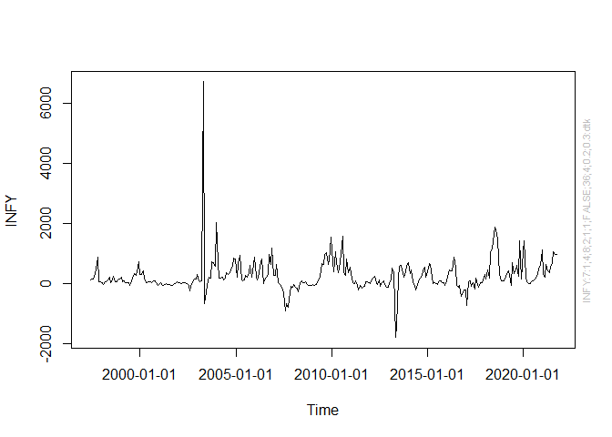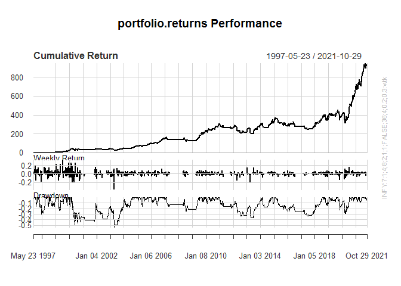

    ## [1] "About to chart.RelativePerformance()."
    ##    period_lengths portfolio.returns INFY total periods
    ## 1               1               156  168           324
    ## 2               4               185  223           408
    ## 3              12               242  342           584
    ## 4              36               320  582           902
    ## 5              52               363  641          1004
    ## 6             104               455  668          1123
    ## 7             156               503  617          1120
    ## 8             208               549  519          1068
    ## 9             260               565  451          1016
    ## 10            312               550  414           964
    ## 11            364               549  363           912
    ##    prob_portfolio.returns_outperformance prob_INFY_outperformance
    ## 1                              0.4814815                0.5185185
    ## 2                              0.4534314                0.5465686
    ## 3                              0.4143836                0.5856164
    ## 4                              0.3547672                0.6452328
    ## 5                              0.3615538                0.6384462
    ## 6                              0.4051647                0.5948353
    ## 7                              0.4491071                0.5508929
    ## 8                              0.5140449                0.4859551
    ## 9                              0.5561024                0.4438976
    ## 10                             0.5705394                0.4294606
    ## 11                             0.6019737                0.3980263
    ##  int [1:82] 10 28 40 47 48 50 51 52 53 54 ...
    ## NULL
    ##   0%   2%   4%   6%   8%  10%  12%  14%  16%  18%  20%  25%  33%  50%  66%  75% 
    ##    0    0    0    0    0    0    0    0    0    0    0    1    1    1    1    1 
    ##  80% 100% 
    ##    1    1

    ## Warning in weightsAnalyze(wtkWeights): Return.portfolio(,
    ## weights=wtkWeights.adj); then chart.RelativePerformance(Ra=2,Rb=INFY)

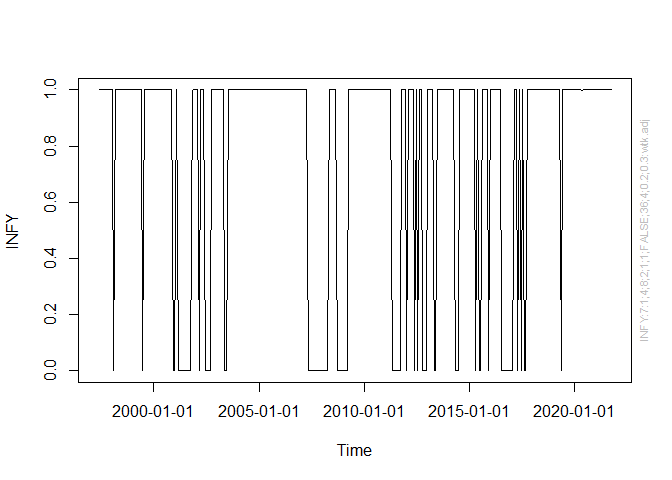

    ## [1] "INFY:6:3;4;8;1;1;1;FALSE;36;4;0.2;0.3 spec starting."

    ## Warning in indicToSig(dtkIndicator, stabSpec.i): stabSpec.i TDR==2 etc might
    ## need changes for Binary Switching.

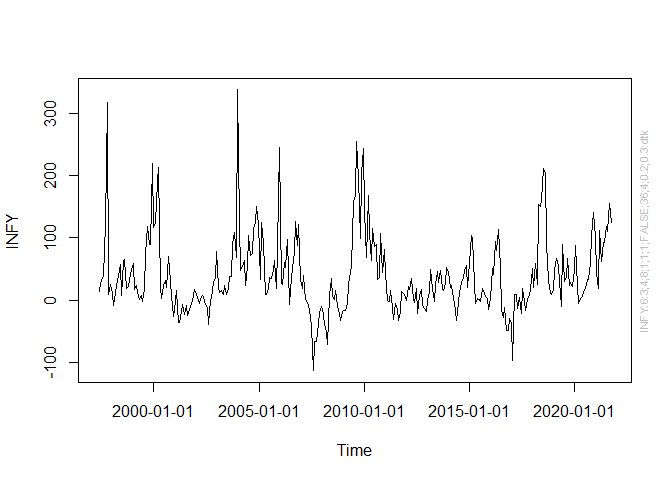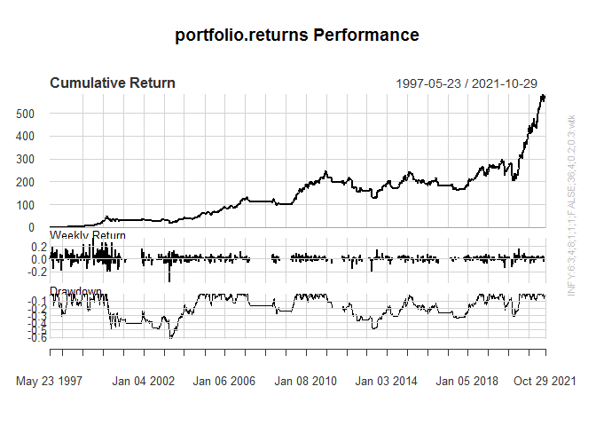

    ## [1] "About to chart.RelativePerformance()."
    ##    period_lengths portfolio.returns INFY total periods
    ## 1               1               211  208           419
    ## 2               4               238  260           498
    ## 3              12               264  381           645
    ## 4              36               315  599           914
    ## 5              52               355  642           997
    ## 6             104               400  687          1087
    ## 7             156               440  647          1087
    ## 8             208               472  596          1068
    ## 9             260               473  543          1016
    ## 10            312               465  499           964
    ## 11            364               432  480           912
    ##    prob_portfolio.returns_outperformance prob_INFY_outperformance
    ## 1                              0.5035800                0.4964200
    ## 2                              0.4779116                0.5220884
    ## 3                              0.4093023                0.5906977
    ## 4                              0.3446389                0.6553611
    ## 5                              0.3560682                0.6439318
    ## 6                              0.3679853                0.6320147
    ## 7                              0.4047838                0.5952162
    ## 8                              0.4419476                0.5580524
    ## 9                              0.4655512                0.5344488
    ## 10                             0.4823651                0.5176349
    ## 11                             0.4736842                0.5263158
    ##  int [1:110] 10 15 26 27 28 40 46 47 48 50 ...
    ## NULL
    ##       0%       2%       4%       6%       8%      10%      12%      14% 
    ## 0.000000 0.000000 0.000000 0.000000 0.000000 0.000000 0.000000 0.000000 
    ##      16%      18%      20%      25%      33%      50%      66%      75% 
    ## 0.000000 0.000000 0.000000 0.997653 1.000000 1.000000 1.000000 1.000000 
    ##      80%     100% 
    ## 1.000000 1.000000

    ## Warning in weightsAnalyze(wtkWeights): Return.portfolio(,
    ## weights=wtkWeights.adj); then chart.RelativePerformance(Ra=2,Rb=INFY)

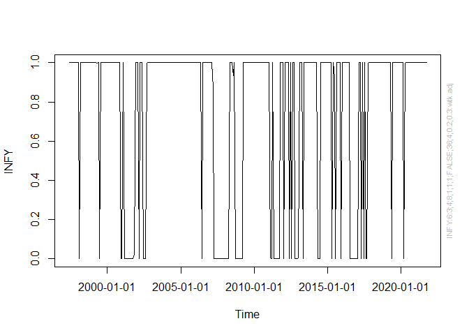

    ## [1] "INFY:5:2;4;8;1;1;1;FALSE;36;4;0.2;0.3 spec starting."

    ## Warning in indicToSig(dtkIndicator, stabSpec.i): stabSpec.i TDR==2 etc might
    ## need changes for Binary Switching.

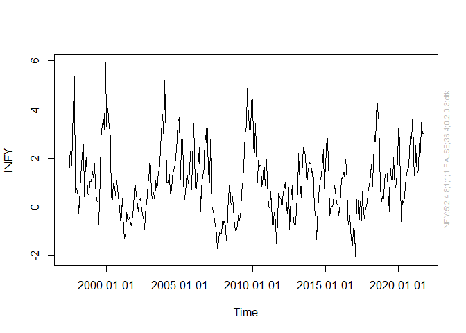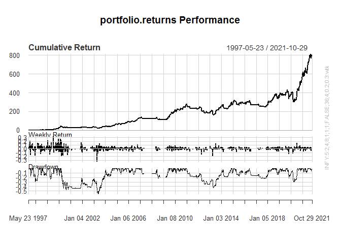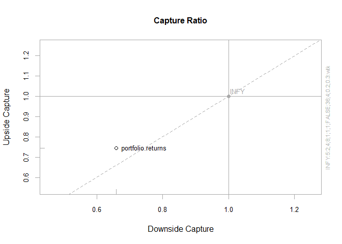

    ## [1] "About to chart.RelativePerformance()."
    ##    period_lengths portfolio.returns INFY total periods
    ## 1               1               564  710          1274
    ## 2               4               501  771          1272
    ## 3              12               438  826          1264
    ## 4              36               403  837          1240
    ## 5              52               408  816          1224
    ## 6             104               457  715          1172
    ## 7             156               505  615          1120
    ## 8             208               506  562          1068
    ## 9             260               519  497          1016
    ## 10            312               544  420           964
    ## 11            364               546  366           912
    ##    prob_portfolio.returns_outperformance prob_INFY_outperformance
    ## 1                              0.4427002                0.5572998
    ## 2                              0.3938679                0.6061321
    ## 3                              0.3465190                0.6534810
    ## 4                              0.3250000                0.6750000
    ## 5                              0.3333333                0.6666667
    ## 6                              0.3899317                0.6100683
    ## 7                              0.4508929                0.5491071
    ## 8                              0.4737828                0.5262172
    ## 9                              0.5108268                0.4891732
    ## 10                             0.5643154                0.4356846
    ## 11                             0.5986842                0.4013158
    ##  int [1:319] 1 2 3 4 5 6 7 8 9 10 ...
    ## NULL
    ##         0%         2%         4%         6%         8%        10%        12% 
    ## 0.00000000 0.00000000 0.00000000 0.00000000 0.00000000 0.00000000 0.01158874 
    ##        14%        16%        18%        20%        25%        33%        50% 
    ## 0.01947261 0.04553644 0.08592644 0.18126709 0.53087741 0.79254711 0.97461897 
    ##        66%        75%        80%       100% 
    ## 0.99612504 0.99921865 0.99982097 1.00000000

    ## Warning in weightsAnalyze(wtkWeights): Return.portfolio(,
    ## weights=wtkWeights.adj); then chart.RelativePerformance(Ra=2,Rb=INFY)


    ## [1] "INFY:4:1;4;8;1;1;1;FALSE;36;4;0.2;0.3 spec starting."

    ## Warning in indicToSig(dtkIndicator, stabSpec.i): stabSpec.i TDR==2 etc might
    ## need changes for Binary Switching.

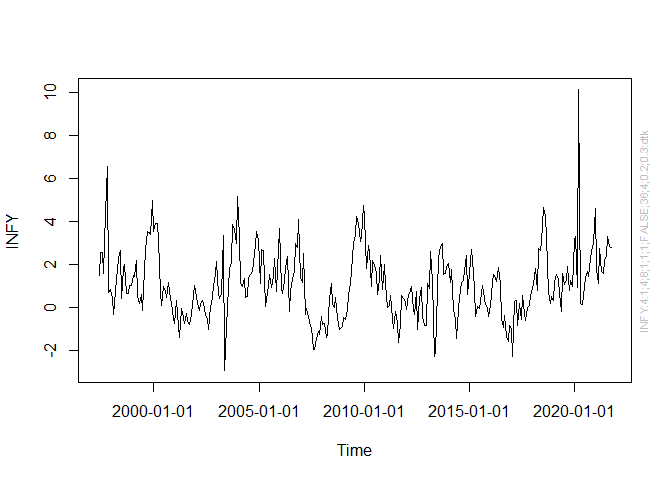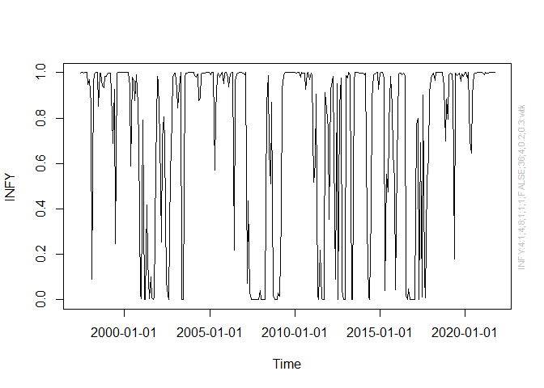

    ## [1] "About to chart.RelativePerformance()."
    ##    period_lengths portfolio.returns INFY total periods
    ## 1               1               562  708          1270
    ## 2               4               495  776          1271
    ## 3              12               447  817          1264
    ## 4              36               419  821          1240
    ## 5              52               425  799          1224
    ## 6             104               443  729          1172
    ## 7             156               499  621          1120
    ## 8             208               516  552          1068
    ## 9             260               519  497          1016
    ## 10            312               546  418           964
    ## 11            364               558  354           912
    ##    prob_portfolio.returns_outperformance prob_INFY_outperformance
    ## 1                              0.4425197                0.5574803
    ## 2                              0.3894571                0.6105429
    ## 3                              0.3536392                0.6463608
    ## 4                              0.3379032                0.6620968
    ## 5                              0.3472222                0.6527778
    ## 6                              0.3779863                0.6220137
    ## 7                              0.4455357                0.5544643
    ## 8                              0.4831461                0.5168539
    ## 9                              0.5108268                0.4891732
    ## 10                             0.5663900                0.4336100
    ## 11                             0.6118421                0.3881579
    ##  int [1:318] 1 2 3 4 5 6 7 8 9 10 ...
    ## NULL
    ##          0%          2%          4%          6%          8%         10% 
    ## 0.000000000 0.000000000 0.000000000 0.000000000 0.000000000 0.000000000 
    ##         12%         14%         16%         18%         20%         25% 
    ## 0.004729897 0.015919894 0.034203096 0.074342404 0.179022323 0.530255417 
    ##         33%         50%         66%         75%         80%        100% 
    ## 0.794480788 0.977163228 0.997805954 0.999510902 0.999923466 1.000000000

    ## Warning in weightsAnalyze(wtkWeights): Return.portfolio(,
    ## weights=wtkWeights.adj); then chart.RelativePerformance(Ra=2,Rb=INFY)


    ## [1] "INFY:3:3;2;2;1;1;1;FALSE;36;4;0.2;0.3 spec starting."

    ## Warning in indicToSig(dtkIndicator, stabSpec.i): stabSpec.i TDR==2 etc might
    ## need changes for Binary Switching.

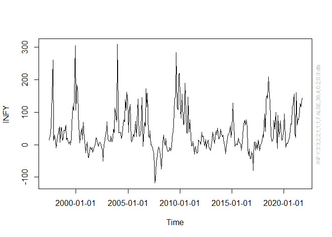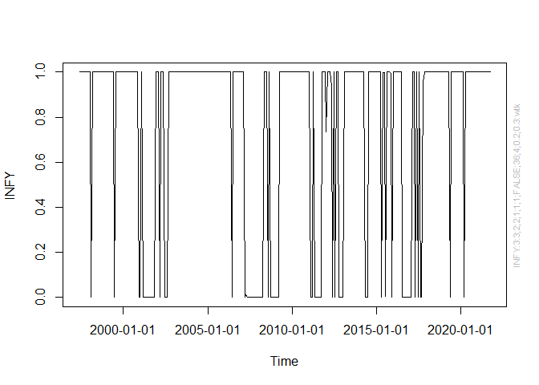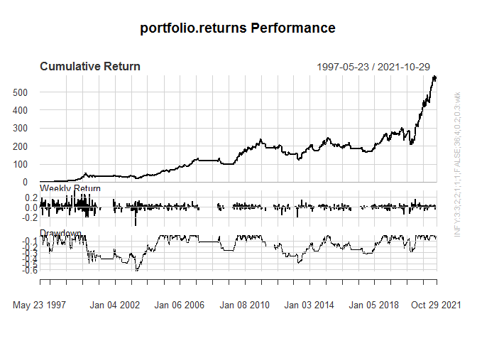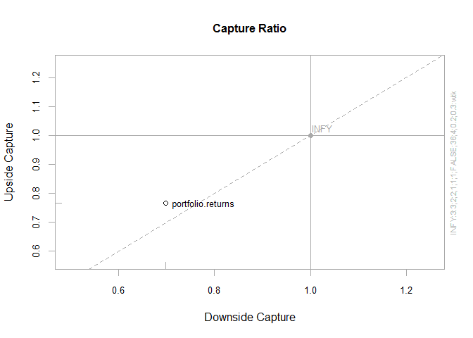

    ## [1] "About to chart.RelativePerformance()."
    ##    period_lengths portfolio.returns INFY total periods
    ## 1               1               209  207           416
    ## 2               4               238  259           497
    ## 3              12               265  376           641
    ## 4              36               313  601           914
    ## 5              52               344  653           997
    ## 6             104               405  682          1087
    ## 7             156               442  645          1087
    ## 8             208               472  596          1068
    ## 9             260               471  545          1016
    ## 10            312               463  501           964
    ## 11            364               432  480           912
    ##    prob_portfolio.returns_outperformance prob_INFY_outperformance
    ## 1                              0.5024038                0.4975962
    ## 2                              0.4788732                0.5211268
    ## 3                              0.4134165                0.5865835
    ## 4                              0.3424508                0.6575492
    ## 5                              0.3450351                0.6549649
    ## 6                              0.3725851                0.6274149
    ## 7                              0.4066237                0.5933763
    ## 8                              0.4419476                0.5580524
    ## 9                              0.4635827                0.5364173
    ## 10                             0.4802905                0.5197095
    ## 11                             0.4736842                0.5263158
    ##  int [1:109] 10 15 26 28 40 47 48 49 50 51 ...
    ## NULL
    ##        0%        2%        4%        6%        8%       10%       12%       14% 
    ## 0.0000000 0.0000000 0.0000000 0.0000000 0.0000000 0.0000000 0.0000000 0.0000000 
    ##       16%       18%       20%       25%       33%       50%       66%       75% 
    ## 0.0000000 0.0000000 0.0000000 0.9960885 1.0000000 1.0000000 1.0000000 1.0000000 
    ##       80%      100% 
    ## 1.0000000 1.0000000

    ## Warning in weightsAnalyze(wtkWeights): Return.portfolio(,
    ## weights=wtkWeights.adj); then chart.RelativePerformance(Ra=2,Rb=INFY)


    ## [1] "INFY:2:2;2;2;1;1;1;FALSE;36;4;0.2;0.3 spec starting."

    ## Warning in indicToSig(dtkIndicator, stabSpec.i): stabSpec.i TDR==2 etc might
    ## need changes for Binary Switching.

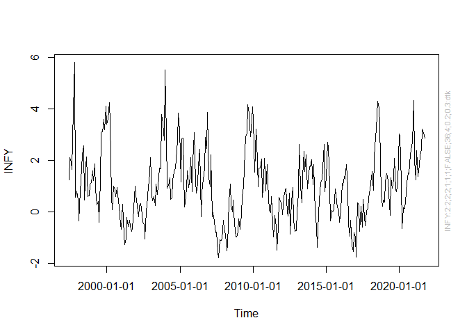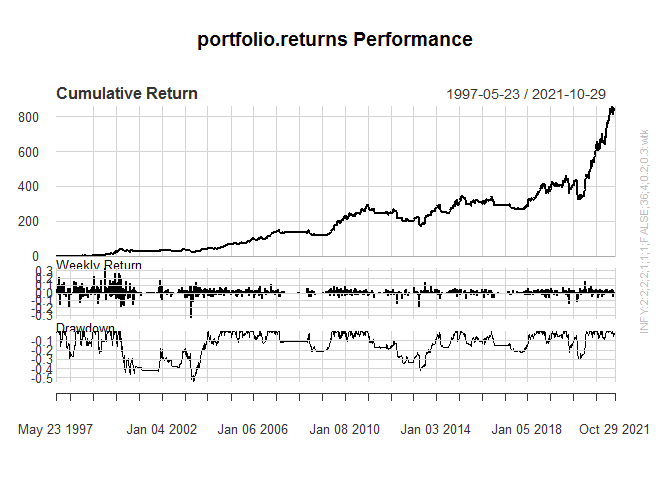

    ## [1] "About to chart.RelativePerformance()."
    ##    period_lengths portfolio.returns INFY total periods
    ## 1               1               564  710          1274
    ## 2               4               501  771          1272
    ## 3              12               442  822          1264
    ## 4              36               406  834          1240
    ## 5              52               404  820          1224
    ## 6             104               455  717          1172
    ## 7             156               501  619          1120
    ## 8             208               504  564          1068
    ## 9             260               522  494          1016
    ## 10            312               550  414           964
    ## 11            364               546  366           912
    ##    prob_portfolio.returns_outperformance prob_INFY_outperformance
    ## 1                              0.4427002                0.5572998
    ## 2                              0.3938679                0.6061321
    ## 3                              0.3496835                0.6503165
    ## 4                              0.3274194                0.6725806
    ## 5                              0.3300654                0.6699346
    ## 6                              0.3882253                0.6117747
    ## 7                              0.4473214                0.5526786
    ## 8                              0.4719101                0.5280899
    ## 9                              0.5137795                0.4862205
    ## 10                             0.5705394                0.4294606
    ## 11                             0.5986842                0.4013158
    ##  int [1:319] 1 2 3 4 5 6 7 8 9 10 ...
    ## NULL
    ##          0%          2%          4%          6%          8%         10% 
    ## 0.000000000 0.000000000 0.000000000 0.000000000 0.000000000 0.004331966 
    ##         12%         14%         16%         18%         20%         25% 
    ## 0.008938770 0.020337695 0.042000084 0.076708099 0.192611079 0.548753871 
    ##         33%         50%         66%         75%         80%        100% 
    ## 0.800431357 0.972571244 0.995066215 0.999233555 0.999787347 1.000000000

    ## Warning in weightsAnalyze(wtkWeights): Return.portfolio(,
    ## weights=wtkWeights.adj); then chart.RelativePerformance(Ra=2,Rb=INFY)

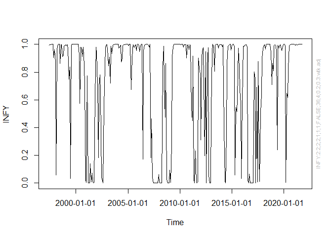

    ## [1] "INFY:1:1;2;2;1;1;1;FALSE;36;4;0.2;0.3 spec starting."

    ## Warning in indicToSig(dtkIndicator, stabSpec.i): stabSpec.i TDR==2 etc might
    ## need changes for Binary Switching.

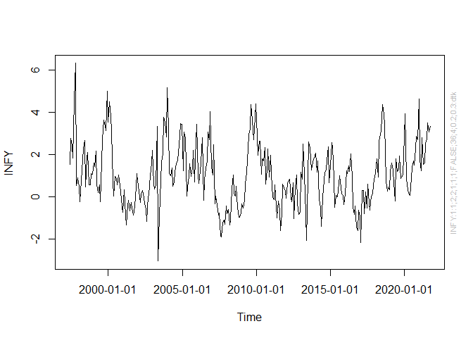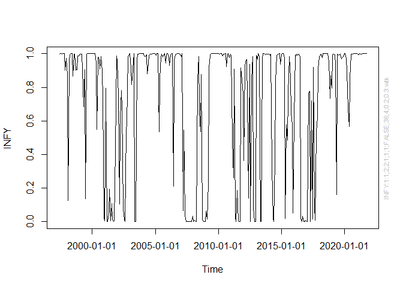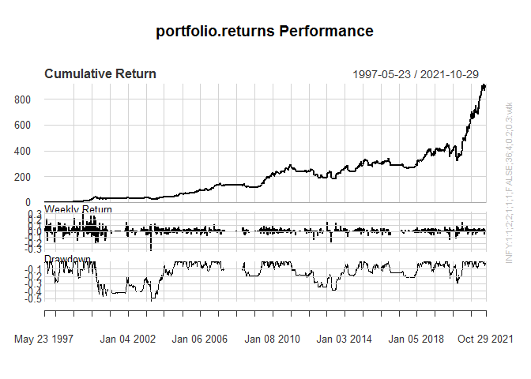

    ## [1] "About to chart.RelativePerformance()."
    ##    period_lengths portfolio.returns INFY total periods
    ## 1               1               564  710          1274
    ## 2               4               488  784          1272
    ## 3              12               444  820          1264
    ## 4              36               424  816          1240
    ## 5              52               435  789          1224
    ## 6             104               470  702          1172
    ## 7             156               505  615          1120
    ## 8             208               510  558          1068
    ## 9             260               513  503          1016
    ## 10            312               542  422           964
    ## 11            364               544  368           912
    ##    prob_portfolio.returns_outperformance prob_INFY_outperformance
    ## 1                              0.4427002                0.5572998
    ## 2                              0.3836478                0.6163522
    ## 3                              0.3512658                0.6487342
    ## 4                              0.3419355                0.6580645
    ## 5                              0.3553922                0.6446078
    ## 6                              0.4010239                0.5989761
    ## 7                              0.4508929                0.5491071
    ## 8                              0.4775281                0.5224719
    ## 9                              0.5049213                0.4950787
    ## 10                             0.5622407                0.4377593
    ## 11                             0.5964912                0.4035088
    ##  int [1:319] 1 2 3 4 5 6 7 8 9 10 ...
    ## NULL
    ##          0%          2%          4%          6%          8%         10% 
    ## 0.000000000 0.000000000 0.000000000 0.000000000 0.000000000 0.000000000 
    ##         12%         14%         16%         18%         20%         25% 
    ## 0.006889499 0.016064477 0.032547568 0.067980154 0.131149484 0.534992794 
    ##         33%         50%         66%         75%         80%        100% 
    ## 0.779485303 0.975839402 0.997384944 0.999429903 0.999913047 1.000000000

    ## Warning in weightsAnalyze(wtkWeights): Return.portfolio(,
    ## weights=wtkWeights.adj); then chart.RelativePerformance(Ra=2,Rb=INFY)

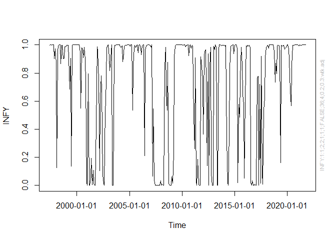

Review of the As-Is Asset Index and Returns
-------------------------------------------

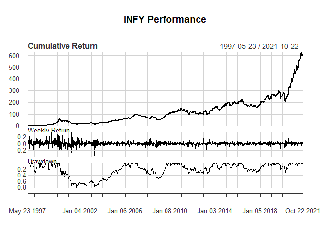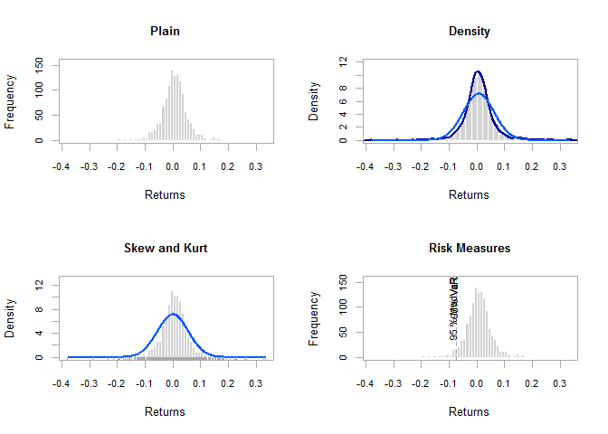

    ##                                               INFY
    ## Semi Deviation                              0.0387
    ## Gain Deviation                              0.0427
    ## Loss Deviation                              0.0404
    ## Downside Deviation (MAR=43.3333333333333%)  0.0395
    ## Downside Deviation (Rf=8%)                  0.0363
    ## Downside Deviation (0%)                     0.0356
    ## Maximum Drawdown                            0.8095
    ## Historical VaR (95%)                       -0.0734
    ## Historical ES (95%)                        -0.1217
    ## Modified VaR (95%)                         -0.0750
    ## Modified ES (95%)                          -0.1026

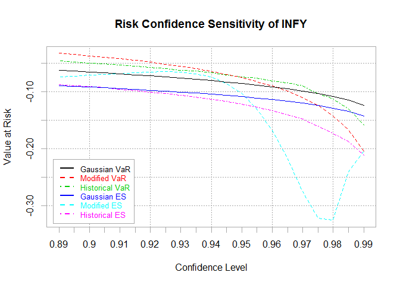

    ## [1] "0.36 HurstIndex means returns are mean reverting"

Implementation
--------------

[Hedging with Futures](https://zerodha.com/varsity/chapter/hedging-futures/) is one way to implement the recommended change in asset weights without selling or buying the asset itself; the latter might incur more [Impact Cost](https://www1.nseindia.com/products/content/equities/indices/impact_cost.htm#:~:text=Impact%20cost%20represents%20the%20cost,to%20the%20bid%2Dask%20spread.) as well as transaction cost. Related research such as [Hedging performance of Nifty index futures](http://www.igidr.ac.in/conf/money/mfc-13/Hedging%20performance%20of%20Nifty%20index%20futures_Anjali%20Prashad.pdf) could be considered. Options would be another way to implement, e.g., (a) buying `PUT` options to limit the downside to the premiums for the hedge itself and (b) avoiding quarterly-contract orders and instead using possibly multi-year derivative options. Of course, the reader might consider it wiser to keep in background the allocation across asset classes (categories); and maybe attempt a "global optimization" first---and hopefully, diversify away the risk---rather than stabilize locally alone. The reader is invited to explore these further elsewhere or extend this project along these lines.

Appendix: Runtime Environment
=============================

Here's the runtime environment used. It's reported here for reproducibility:

``` r
sessionInfo() # Sys.info()[['sysname']]
```

    ## R version 3.6.2 (2019-12-12)
    ## Platform: x86_64-w64-mingw32/x64 (64-bit)
    ## Running under: Windows 8.1 x64 (build 9600)
    ## 
    ## Matrix products: default
    ## 
    ## locale:
    ## [1] LC_COLLATE=English_India.1252  LC_CTYPE=English_India.1252   
    ## [3] LC_MONETARY=English_India.1252 LC_NUMERIC=C                  
    ## [5] LC_TIME=English_India.1252    
    ## 
    ## attached base packages:
    ## [1] parallel  grid      stats     graphics  grDevices utils     datasets 
    ## [8] methods   base     
    ## 
    ## other attached packages:
    ##  [1] TTR_0.24.2                 DEoptim_2.2-5             
    ##  [3] PerformanceAnalytics_2.0.4 xts_0.12.1                
    ##  [5] strucchange_1.5-2          sandwich_2.5-1            
    ##  [7] zoo_1.8-7                  fGarch_3042.83            
    ##  [9] mvoutlier_2.0.9            sgeostat_1.0-27           
    ## [11] dplR_1.7.1                 bcp_4.0.3                 
    ## [13] fPortfolio_3042.83         fAssets_3042.84           
    ## [15] fBasics_3042.89            timeSeries_3062.101       
    ## [17] timeDate_3043.103         
    ## 
    ## loaded via a namespace (and not attached):
    ##   [1] colorspace_1.4-1      fMultivar_3042.80     class_7.3-15         
    ##   [4] modeltools_0.2-23     rio_0.5.16            mclust_5.4.6         
    ##   [7] pls_2.7-3             cvTools_0.3.2         flexmix_2.3-17       
    ##  [10] mvtnorm_1.1-1         ranger_0.12.1         splines_3.6.2        
    ##  [13] R.methodsS3_1.8.1     sROC_0.1-2            mnormt_2.0.2         
    ##  [16] robustbase_0.93-7     knitr_1.27            robCompositions_2.2.1
    ##  [19] cluster_2.1.0         kernlab_0.9-29        png_0.1-7            
    ##  [22] R.oo_1.24.0           rrcov_1.5-5           compiler_3.6.2       
    ##  [25] assertthat_0.2.1      Matrix_1.2-18         htmltools_0.4.0      
    ##  [28] tools_3.6.2           ecodist_2.0.7         gtable_0.3.0         
    ##  [31] glue_1.3.1            dplyr_0.8.3           Rcpp_1.0.3           
    ##  [34] carData_3.0-3         slam_0.1-47           cellranger_1.1.0     
    ##  [37] zCompositions_1.3.4   vctrs_0.2.2           rneos_0.4-0          
    ##  [40] fpc_2.2-8             lmtest_0.9-37         xfun_0.19            
    ##  [43] laeken_0.5.1          stringr_1.4.0         openxlsx_4.2.3       
    ##  [46] spatial_7.3-11        lifecycle_0.1.0       XML_3.99-0.3         
    ##  [49] DEoptimR_1.0-8        MASS_7.3-51.4         scales_1.1.0         
    ##  [52] VIM_6.0.0             hms_0.5.3             fCopulae_3042.82     
    ##  [55] RColorBrewer_1.1-2    yaml_2.2.1            curl_4.3             
    ##  [58] NADA_1.6-1.1          ggplot2_3.3.2         mvnormtest_0.1-9     
    ##  [61] reshape_0.8.8         stringi_1.4.6         pcaPP_1.9-73         
    ##  [64] e1071_1.7-4           energy_1.7-7          boot_1.3-23          
    ##  [67] zip_2.1.1             truncnorm_1.0-8       rlang_0.4.4          
    ##  [70] pkgconfig_2.0.3       prabclus_2.3-2        matrixStats_0.55.0   
    ##  [73] bitops_1.0-6          Rsolnp_1.16           evaluate_0.14        
    ##  [76] lattice_0.20-38       purrr_0.3.3           tidyselect_0.2.5     
    ##  [79] GGally_2.0.0          plyr_1.8.5            magrittr_1.5         
    ##  [82] R6_2.4.1              pillar_1.4.3          haven_2.2.0          
    ##  [85] foreign_0.8-72        sn_1.6-2              survival_3.1-8       
    ##  [88] abind_1.4-5           RCurl_1.98-1.1        sp_1.4-4             
    ##  [91] nnet_7.3-12           tibble_2.1.3          crayon_1.3.4         
    ##  [94] car_3.0-10            Rglpk_0.6-4           tmvnsim_1.0-2        
    ##  [97] rmarkdown_2.1         readxl_1.3.1          data.table_1.12.8    
    ## [100] forcats_0.4.0         vcd_1.4-8             digest_0.6.24        
    ## [103] diptest_0.75-7        tidyr_1.0.2           numDeriv_2016.8-1.1  
    ## [106] R.utils_2.10.1        signal_0.7-6          stats4_3.6.2         
    ## [109] munsell_0.5.0         quadprog_1.5-8
