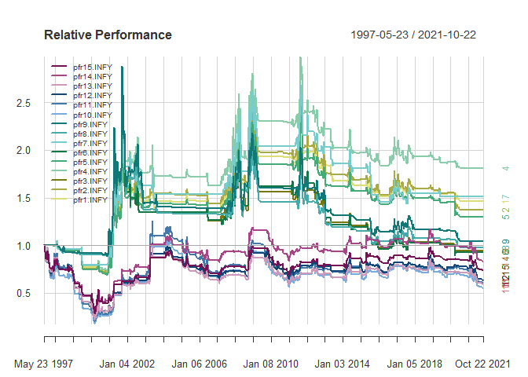

Explaining the Stability Simulations
================
November 19, 2021

Don't want to let go? [Bayesian Stability concepts](https://www.openmetrics.ch/post/stable-portfolio-design-using-bayesian-change-point-models-and-geometric-shape-factors-1) offer a way to hold on to investable assets such as [INFY](https://finance.yahoo.com/quote/INFY.NS/). A (work-in-progress) research viewpoint [INFY Stability, in a World that is](https://github.com/yadevinit/pf4pf/blob/main/stability.md#infy-stability-in-a-world-that-is) simulates 15 Bayesian stabilizations and observes most of them reducing weights (exposure). A text search for "`INFY:4:`" in that viewpoint takes you to a simulation \#4 that recommends holding in full weight and last recommended weight reduction (and subsequent restoration) in early 2020. That simulation's Performance chart shows about 45% Drawdown in 2000 that recovered by 2004, whereas INFY had shown an 80% Drawdown and recovered later.

Relative Performance: Stabilized Asset vs. As-Is Asset (Index)
--------------------------------------------------------------

Instantaneous (Stability-weighted) Bayesian Sharpe Ratio (ISWBSR) has been chosen as the measure for stabilization. For its simulation, the following is a brief glossary of terms that have to be specified:

-   `howWeightStability` specifies whether to weight using `1-probBCP` or `1/probBCP` where `probBCP` is the posterior probability of a Bayesian Change Point.
-   `steepPlus` and `steepMinus` specify factors to use with rising and declining indicators when converting to a signaling range of `0` to `1` as per a sigmoid logistic model.
-   `varianceS` specifies whether to use a square root (for deviation) or posterior variance as is.
-   `aggMethod` specifies whether to aggregate Sharpe Ratio using EMA (Exponential Moving Average) or Median.
-   `TDR` specifies a (Position) Threshold Decision Rule.
-   `TDRquantileProb` specifies a quantile probability whose exceedances (over a recent window) support a `TDR`.

(In case the reader seeks further details, she may please refer to [Bayesian Stability concepts](https://www.openmetrics.ch/post/stable-portfolio-design-using-bayesian-change-point-models-and-geometric-shape-factors-1).) Now the following code-session output tabulates the specifications of the simulations and then plots their (stabilized) relative performances vs. the (unstabilized) as-is asset.

    ##    howWeightStability steepPlus steepMinus varianceS aggMethod TDR useLogReturn
    ## 1                   1         2          2         1         1   1        FALSE
    ## 2                   2         2          2         1         1   1        FALSE
    ## 3                   3         2          2         1         1   1        FALSE
    ## 4                   1         4          8         1         1   1        FALSE
    ## 5                   2         4          8         1         1   1        FALSE
    ## 6                   3         4          8         1         1   1        FALSE
    ## 7                   1         4          8         2         1   1        FALSE
    ## 8                   1         2          2         1         2   1        FALSE
    ## 9                   1         4          8         1         2   1        FALSE
    ## 10                  1         4          8         1         1   2        FALSE
    ## 11                  1         2          2         1         1   2        FALSE
    ## 12                  1         4          8         1         1   2        FALSE
    ## 13                  1         2          2         1         1   2        FALSE
    ## 14                  1         4          8         1         1   2        FALSE
    ## 15                  1         2          2         1         1   2        FALSE
    ##    windowPeriod shiftBy lambdaD TDRquantileProb
    ## 1            36       4     0.2             0.3
    ## 2            36       4     0.2             0.3
    ## 3            36       4     0.2             0.3
    ## 4            36       4     0.2             0.3
    ## 5            36       4     0.2             0.3
    ## 6            36       4     0.2             0.3
    ## 7            36       4     0.2             0.3
    ## 8            36       4     0.2             0.3
    ## 9            36       4     0.2             0.3
    ## 10           36       4     0.2             0.3
    ## 11           36       4     0.2             0.3
    ## 12           36       4     0.2             0.2
    ## 13           36       4     0.2             0.2
    ## 14           36       4     0.2             0.1
    ## 15           36       4     0.2             0.1

Here are few observations from the above outputs:

-   The "non-greenish" curves show a relative performance that's smoother (over time) but lesser than the rest, i.e., presence of a Thresholding Decision Rule (`TDR=2`) underperforms stabilizations where it is absent (`TDR=1`).
-   Across the various specified stabilizations, relative performances seem to be flat. In the case of the "non-greenish" ones, relative performances seem to be declining in recent years.
-   Stabilization specification \#4 seems to relatively perform better than the others.

Example Stabilization \#4
-------------------------

    ##   howWeightStability steepPlus steepMinus varianceS aggMethod TDR useLogReturn
    ## 4                  1         4          8         1         1   1        FALSE
    ##   windowPeriod shiftBy lambdaD TDRquantileProb
    ## 4           36       4     0.2             0.3

 As mentioned earlier, the weekly time series of returns of the asset (index) have been taken as data input. With the stabilization specification \#4, the adjacent figure reproduces its indicator chosen to be the ISWBSR measure using estimates of Bayesian Change Points from rolling windows of width 36, each time shifted by 4.

That indicator is converted to a signal with a weight spanning from `0` to `1` as shown in adjacent graph. 

The performance summary of the stabilized signal is charted in the adjacent figure. 

Its Capture Ratios show more Upside than Downside being captured of the underlying asset (index). 

Consider the table of outperformance probabilities there. Windows of (`period_lengths >= 260` or) 5 years or more show that's when such a stabilized asset is `0.51` likelier to outperform the as-is asset (index); shorter time windows show the as-is asset outperforms the stabilization. 20th percentile is `0.179`, i.e., 1/5th of windows expose less than `18%` of the asset to the markets; hedging could be in effect then. Alternatively if you consider stabilization \#14, windows of (`period_lengths >= 104` or) 2 years or more show that's when such a stabilized asset is `0.537` likelier to outperform the as-is asset (index). 20th percentile is `0.40`, i.e., 1/5th of windows expose less than `40%` of the asset to the markets.

Next considering the step-like discrete exposure expected by minimum lot sizes of Futures contracts, there's a minimum implementable exposure weight; adjusting for that gives the adjacent signal curve. 

"William Sharpe now recommends [Information Ratio](https://en.wikipedia.org/wiki/Information_ratio) preferentially to the original Sharpe Ratio", says [`R`-package `PerformanceAnalytics`](https://cran.r-project.org/package=PerformanceAnalytics). If you consider that measure to order the various stabilizations that have been simulated, the following code-session output prefers stabilization \#4 with the highest Information Ratio `0.162`.

    ##   pfr4   pfr7   pfr1   pfr2   pfr5   pfr9   pfr8   pfr3   pfr6  pfr14  pfr15 
    ##  0.162  0.105  0.098  0.081  0.067  0.011 -0.006 -0.014 -0.018 -0.051 -0.085 
    ##  pfr11  pfr12  pfr13  pfr10 
    ## -0.104 -0.106 -0.121 -0.126

[Implementation](https://github.com/yadevinit/pf4pf/blob/main/stability.md#implementation) considerations have already been outlined in the earlier research viewpoint.
