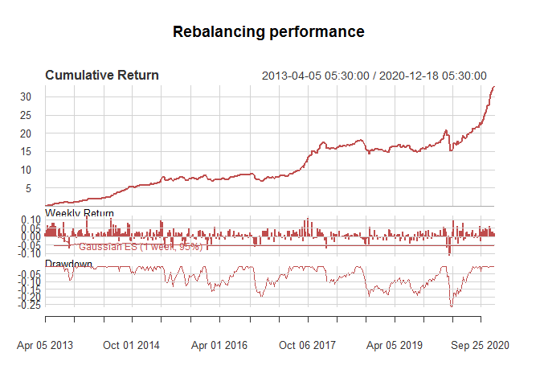
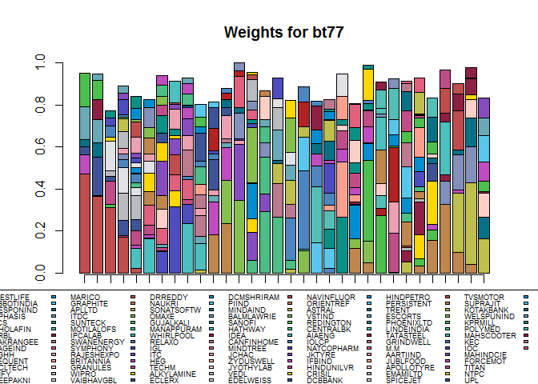
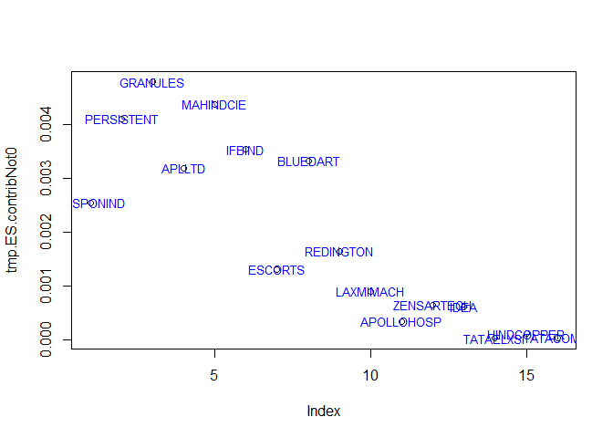
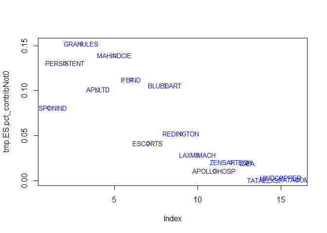
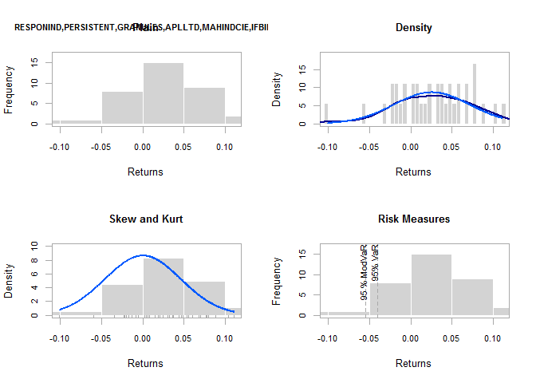
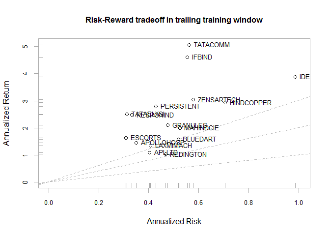
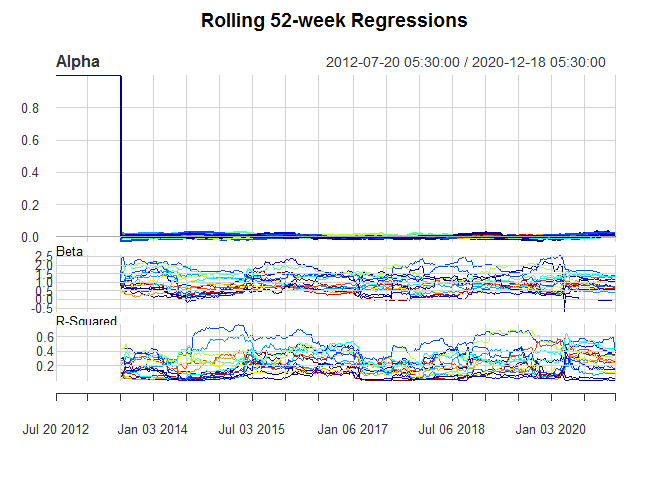

Weights to AUM to Invest
================
January 10, 2021

Here, the [author](mailto:yadevinit@gmail.com) illustrates a particular `bt77` Portfolio-optimization rebalancing selected from an earlier research viewpoint [500 Invest for 36% CAGR](https://github.com/yadevinit/pf4pf): to move it from its latest-rebalancing weights to the (Assets Under Management) AUM monies required to invest using it where fractional shares are unsupported. This demonstrates feasibility of really investing with it, of course, without any advice or suitability recommendation to do so for anyone referring to this.

Looks like INR 4 lakhs (Rs 400,000) suffices to invest on the latest Portfolio rebalancing. And we saw in the previous viewpoint that this `bt77` is one of those whose performance exceeded the return target of 36% CAGR. We also saw there that its Information Ratio exceeded 1 during the period of study when using as benchmark an Equal-Weighted Portfolio rebalancing quarterly across the over 380 stocks being used (an asset universe taken from the `BSE500` market-capitalization-based index).

Considering that `bt77` has been developed using FOSS (Free Open Source Software) and is published reproducibly, the author asserts that it can serve as a benchmark index.

    - Individual or other investors could use it to negotiate extraordinary performance and incentive structures with their providers of wealth-management services and products; they could also build on it in collaborative or Do-It-Yourself mode.
    - For greater societal impact, [PFRDA] could similarly nudge Pension Fund Managers for the committed Minimum Assured Return. The author is not a qualified Actuarial professional, but browsing through related published content on `www`, there seems to be an underlying belief that the Equity asset category presently permitted within National Pension System is limited to the "market return" provided by `NIFTY50` market-capitalization-based index. Continuing that way, the fund has to continue tolerating Drawdowns ("downsides") of 30% to 50% while the upside is less than 20% CAGR long term. Almost certainly then, growth would continue to be ordinary while tolerating high Drawdown (or Expected Tail Loss) risk. Instead, what [PFRDA] and India's Ministry of Finance could consider (if not already done so) is extraordinary growth (at possibly-lesser risk as exemplified via `bt77` investible benchmark). Creating that alternative future is consistent with a Suitable and sustainable pensions. India's Minister of Finance has invited inputs from all for the upcoming Budget, a once-in-a-100-years kind of Budget. May this proposal from the author find its way forward to transform the wealth ecosystem. Through Clawbacks or other loss-sharing provisions, incentive structures can be harmonized:

    + in quantum and timing with real positive growth in wealth (e.g., as measured by Net Present Value adjusted by Time Value of Money and Risk Premium).
    + and creating an exemplar fund-management enterprise as a Yunus-style Social Business could (a) deny the incentive of perpetual dividend to owners of Pension-Fund Manager institutions and (b) devote that enterprise's profits and actions solely and maximally for its societal purpose of serving adequate pensions forever. That enterprise could "own" and maintain `bt77` as part of causing Peer production (and aggregation) of wealth-management-related cultural and information artefacts in the Commons. Commons-based Peer production of such artefacts sustainably beats both the markets and companies (or organizations that are hierachically managed for scale), as evidenced by Nobel Laureates in Economics who have studied this space.

``` r
cESpValue <- 0.925
warning("Ensure correct files list in flist via DOS cmd: > dir /b /o-d bt* > flist.txt")
```

    ## Warning: Ensure correct files list in flist via DOS cmd: > dir /b /o-d bt* >
    ## flist.txt

``` r
cBtOptFilenames <- "/flist2021Jan011229.txt" # Was: "/flist2020Dec311957.txt" "/flist2020Dec292200.txt" flist.* ahead.
cOptFilenames <- "/flistopt202101011205.txt"

flist <- read.csv(file=paste0(results.dir, cBtOptFilenames), stringsAsFactors=FALSE, header=FALSE)
flist <- c(flist[,1])
flistopt <- read.csv(file=paste0(results.dir, cOptFilenames), stringsAsFactors=FALSE, header=FALSE)
flistopt <- c(flistopt[,1])

flist <- rev(flist) # reverse into the order of execution of rebalancing optimization.
flistopt <- rev(flistopt)
```

Portfolio Rebalancing Performance and Weights
---------------------------------------------

``` r
### Last revised: 2021Jan05 by Yadevinit@gmail.com.
print("Presumed parts of gettingStarted.R have a Portfolio optimization rebalancing (eg bt77) before entering this code.")
```

    ## [1] "Presumed parts of gettingStarted.R have a Portfolio optimization rebalancing (eg bt77) before entering this code."

``` r
stopifnot(exists("flist") & exists("gIx") & exists("getLastNonNA0") & exists("flistopt"))
  # Assert globals exist in environment.
getAUMvec <- function(pfShareCount.adj, stkPrice.vec, multipleShareCount=1){
  # Now re-run earlier code (copy-paste for visibility):
  print("This would require the stock-wise wealth or AUM invested to be:")
  AUM.vec <- stkPrice.vec * (pfShareCount.adj * multipleShareCount); print(AUM.vec)
  AUM <- sum(AUM.vec); print(paste("So, total AUM=", round(AUM, 0)))

  # print("Starting with that AUM, you can cross-verify now to estimate share counts which you would have to round off:")
  # TBD seems incorrect: print(pfShareCount.adj * AUM) # Or print(pfShareCount * AUM) / min(pfShareCount))

  print("Let's pray this works, and you don't face liquidity issues.")
  print("Beware that market prices at Buy could still differ from the prices this estimation has been worked out with:")
  print(stkPrice.vec)
  return(AUM.vec)
}
mychartRiskBudgets <- function(fname){
  tmp.btout <- readRDS(file=paste0(results.dir, "/", fname))
  chart.Weights(tmp.btout)
  chart.RiskBudget(tmp.btout, match.col="ES", # "CVaR". risk.type="percentage",
    col=my_color)
  return()
}


print(date())
```

    ## [1] "Sun Jan 10 17:35:41 2021"

``` r
ix <- c(69,70,71,  77)[4]
print(ix); print(flist[ix]) # Ensure these refer to bt77 or other Portfolio-optimization process of interest.
```

    ## [1] 77

    ## [1] "bt-rebal13opt_pfESplus-ESarg3Retarg3ES1-202012311954-202012311955.rds"

``` r
# > flist[c(69,70,71,  77)]
# [1] "bt-rebal13opt_pfESplus-ESarg4Retarg3ES1-202012311949-202012311950.rds"
#     "bt-rebal13opt_pfESplus-ESarg4Retarg3ES2-202012311950-202012311951.rds"
# [3] "bt-rebal13opt_pfESplus-ESarg4Retarg3ES3-202012311951-202012311951.rds"
#     "bt-rebal13opt_pfESplus-ESarg3Retarg3ES1-202012311954-202012311955.rds"
btout <- readRDS(file=paste0(results.dir, "/", flist[ix]))
# btout$opt_rebalancing[[1]] # first Rebalancing weights.
btout.rebal.last <- btout$opt_rebalancing[[length(btout$opt_rebalancing)]] # weights from latest Rebalancing
pfLastWts <- btout.rebal.last$weights # has latest applicable pf weights, many of which might be 0.
# pfLastWts.gt0 <- pfLastWts[pfLastWts > 0] # Beware: might get confused with sorted equivalent!
pfLastWts.sortGt0 <- sort(pfLastWts[pfLastWts > 0], decreasing=TRUE); print(pfLastWts.sortGt0)
```

    ##   RESPONIND  PERSISTENT    GRANULES      APLLTD   MAHINDCIE      IFBIND 
    ## 0.163530168 0.124027283 0.114086973 0.100098027 0.097832826 0.093143320 
    ##     ESCORTS    BLUEDART   REDINGTON   LAXMIMACH  APOLLOHOSP  ZENSARTECH 
    ## 0.083504416 0.080507742 0.048115976 0.035598496 0.020172145 0.019001967 
    ##        IDEA   TATAELXSI  HINDCOPPER    TATACOMM 
    ## 0.009671393 0.005231897 0.002776040 0.002701332

``` r
  btouts.rets <- list(); rebalWts <- list()
  btouts.rets[[ix]] <- summary(btout)$portfolio_returns # takes few mins for BSE500.
  names(btouts.rets)[[ix]] <- paste0("bt", ix)
  # duh5 <- summary(btout)$portfolio_returns; colnames(duh5) <- paste0("bt", ix)
  # print(btout)
  # btouts.rets.mx <- do.call(cbind, btouts.rets)
  # colnames(btouts.rets.mx) <- names(btouts.rets)
  mycharts.PerformanceSummary(btouts.rets[[ix]], # btouts.rets.mx,
    main=paste0("Rebalancing performance"))
```

    ## Warning in mycharts.PerformanceSummary(btouts.rets[[ix]], main =
    ## paste0("Rebalancing performance")): Rf=0, geometric=TRUE, ylog=FALSE.



    ## NULL

``` r
  rebalWts[[ix]] <- mychart.Weights(btout, main=paste0("Weights for ", names(btouts.rets)[[ix]]))
```



Translating Portfolio Weights to Share Counts
---------------------------------------------

``` r
stkPrice.vec <- getLastNonNA0(which(index(btout.rebal.last$data_summary$last) == index(gIx)),
    # Was: nrow(gIx) but that might not be exactly at rebalancing time.
  gIx[, names(pfLastWts.sortGt0)], cLookBackRows=(7-1))
  # Was: index(btout.rebal.last$data_summary$last)
  # Was: <- colMeans(tail(gIx[, names(pfLastWts.sortGt0)], 6), na.rm=TRUE); stkPrice.vec # NAs might exist coz from 1991.
# If Rs (or $) 1 total wealth or AUM were to be invested, then @ corresponding share prices stkPrice.vec,
# count of corresponding shares in pf would be:
pfShareCount <- pfLastWts.sortGt0 / stkPrice.vec # These are estimates as of 2020Dec18 Close prices on BSE.

# If instead of 1 total wealth or AUM, 10^k is to be invested, share counts would be approx:
#   AUM <- 10^4; pfShareCount * AUM
# Since fractional shares are not supported, you might be forced to drop counts < 0.5 and round up counts >= 0.5.
# Correspondingly, you would have to tolerate or incur a tracking error vs. the backtested portfolio performance.
stkPrice.vec.2020Dec18Close <- stkPrice.vec; print(stkPrice.vec.2020Dec18Close) # coz 2020Dec18 Close prices rebalancing.
```

    ##                     RESPONIND PERSISTENT GRANULES  APLLTD MAHINDCIE  IFBIND
    ## 2020-12-18 05:30:00    194.65    1299.75   369.85 1107.15     158.4 1086.55
    ##                     ESCORTS BLUEDART REDINGTON LAXMIMACH APOLLOHOSP ZENSARTECH
    ## 2020-12-18 05:30:00  1336.7     3868    134.45    4815.8    2387.15      237.8
    ##                     IDEA TATAELXSI HINDCOPPER TATACOMM
    ## 2020-12-18 05:30:00 9.84    1634.4      63.85   997.45

``` r
# If one wants the pf as designed, the least share count has to be >= 1. So, the adjusted share counts become:
pfShareCount.adj <- pfShareCount / min(pfShareCount); print(pfShareCount.adj)
```

    ##                     RESPONIND PERSISTENT GRANULES   APLLTD MAHINDCIE   IFBIND
    ## 2020-12-18 05:30:00  310.2106    35.2347    113.9 33.38352  228.0566 31.65302
    ##                      ESCORTS BLUEDART REDINGTON LAXMIMACH APOLLOHOSP ZENSARTECH
    ## 2020-12-18 05:30:00 23.06687 7.685362  132.1422  2.729458   3.120222   29.50529
    ##                         IDEA TATAELXSI HINDCOPPER TATACOMM
    ## 2020-12-18 05:30:00 362.9168   1.18199    16.0538        1

``` r
AUM2020Dec18.vec <- getAUMvec(pfShareCount.adj, stkPrice.vec=stkPrice.vec.2020Dec18Close,
  multipleShareCount=1)
```

    ## [1] "This would require the stock-wise wealth or AUM invested to be:"
    ##                     RESPONIND PERSISTENT GRANULES   APLLTD MAHINDCIE   IFBIND
    ## 2020-12-18 05:30:00  60382.49    45796.3  42125.9 36960.57  36124.16 34392.59
    ##                      ESCORTS BLUEDART REDINGTON LAXMIMACH APOLLOHOSP ZENSARTECH
    ## 2020-12-18 05:30:00 30833.48 29726.98  17766.52  13144.52   7448.438   7016.357
    ##                         IDEA TATAELXSI HINDCOPPER TATACOMM
    ## 2020-12-18 05:30:00 3571.101  1931.845   1025.035   997.45
    ## [1] "So, total AUM= 369244"
    ## [1] "Let's pray this works, and you don't face liquidity issues."
    ## [1] "Beware that market prices at Buy could still differ from the prices this estimation has been worked out with:"
    ##                     RESPONIND PERSISTENT GRANULES  APLLTD MAHINDCIE  IFBIND
    ## 2020-12-18 05:30:00    194.65    1299.75   369.85 1107.15     158.4 1086.55
    ##                     ESCORTS BLUEDART REDINGTON LAXMIMACH APOLLOHOSP ZENSARTECH
    ## 2020-12-18 05:30:00  1336.7     3868    134.45    4815.8    2387.15      237.8
    ##                     IDEA TATAELXSI HINDCOPPER TATACOMM
    ## 2020-12-18 05:30:00 9.84    1634.4      63.85   997.45

``` r
print("If you seek share counts as per last-rebalancing weights, you can use a multiple of the following:")
```

    ## [1] "If you seek share counts as per last-rebalancing weights, you can use a multiple of the following:"

``` r
print(pfShareCount.adj)
```

    ##                     RESPONIND PERSISTENT GRANULES   APLLTD MAHINDCIE   IFBIND
    ## 2020-12-18 05:30:00  310.2106    35.2347    113.9 33.38352  228.0566 31.65302
    ##                      ESCORTS BLUEDART REDINGTON LAXMIMACH APOLLOHOSP ZENSARTECH
    ## 2020-12-18 05:30:00 23.06687 7.685362  132.1422  2.729458   3.120222   29.50529
    ##                         IDEA TATAELXSI HINDCOPPER TATACOMM
    ## 2020-12-18 05:30:00 362.9168   1.18199    16.0538        1

``` r
print("Browse further for any deeper understanding you might wish.")
```

    ## [1] "Browse further for any deeper understanding you might wish."

Another Market-Executed Example Investment
------------------------------------------

``` r
### Added following code 2021Jan03 0750am:
# Thanks to RamakrishnanM for alerting me: some of these stock prices have moved up 50%-100%. While that's good
# news if you had rebalanced your portfolio on 2020Dec18 itself (near that EOD Close price), if you are
# rebalancing with EOD Close prices of 2021Jan01:
print(date())
```

    ## [1] "Sun Jan 10 17:37:47 2021"

``` r
stkPrice.vec.2021Jan01Close <- c(
  # For example, using BSE prices eg via https://in.finance.yahoo.com/quote/RESPONIND.BO?p=RESPONIND.BO&.tsrc=fin-srch
  # Beware: ICICIDirect uses ALEPHA for APLLTD (ALEMBIC PHARMA) and LAKMAC for LAXMIMAC (LAXMI MACHINERY).
   187.20, 1498.70,  359.20, 1041.40, 174.80,
  1190.05, 1287.80, 4067.25,  133.10, 4686.00,
  2407.75,  241.70,   11.20, 1868.60,   62.05,
  1100.00
)
names(stkPrice.vec.2021Jan01Close) <- names(stkPrice.vec.2020Dec18Close); print(stkPrice.vec.2021Jan01Close)
```

    ##  RESPONIND PERSISTENT   GRANULES     APLLTD  MAHINDCIE     IFBIND    ESCORTS 
    ##     187.20    1498.70     359.20    1041.40     174.80    1190.05    1287.80 
    ##   BLUEDART  REDINGTON  LAXMIMACH APOLLOHOSP ZENSARTECH       IDEA  TATAELXSI 
    ##    4067.25     133.10    4686.00    2407.75     241.70      11.20    1868.60 
    ## HINDCOPPER   TATACOMM 
    ##      62.05    1100.00

``` r
print("Price growth after last rebalancing and now given prices (= the stock-component-wise AUM growth or return):")
```

    ## [1] "Price growth after last rebalancing and now given prices (= the stock-component-wise AUM growth or return):"

``` r
print(stkPrice.vec.2021Jan01Close / stkPrice.vec.2020Dec18Close - 1)
```

    ##                      RESPONIND PERSISTENT    GRANULES      APLLTD MAHINDCIE
    ## 2020-12-18 05:30:00 -0.0382738  0.1530679 -0.02879547 -0.05938673 0.1035354
    ##                         IFBIND     ESCORTS   BLUEDART   REDINGTON   LAXMIMACH
    ## 2020-12-18 05:30:00 0.09525558 -0.03658259 0.05151241 -0.01004089 -0.02695291
    ##                      APOLLOHOSP ZENSARTECH      IDEA TATAELXSI  HINDCOPPER
    ## 2020-12-18 05:30:00 0.008629579 0.01640032 0.1382114 0.1432942 -0.02819104
    ##                      TATACOMM
    ## 2020-12-18 05:30:00 0.1028122

``` r
# Assertion: pfShareCount.adj got using the optimally-rebalanced portfolio weights is the count of shares that has to be
# had/bought at today's prices, rather than at the recorded rebalancing time.
# stkPrice.vec <- stkPrice.vec.2021Jan01Close; print(stkPrice.vec)
AUM2021Jan01.vec <- getAUMvec(pfShareCount.adj, stkPrice.vec=stkPrice.vec.2021Jan01Close, multipleShareCount=1)
```

    ## [1] "This would require the stock-wise wealth or AUM invested to be:"
    ##                     RESPONIND PERSISTENT GRANULES  APLLTD MAHINDCIE   IFBIND
    ## 2020-12-18 05:30:00  58071.42   52806.24 40912.86 34765.6  39864.29 37668.67
    ##                      ESCORTS BLUEDART REDINGTON LAXMIMACH APOLLOHOSP ZENSARTECH
    ## 2020-12-18 05:30:00 29705.51 31258.29  17588.13  12790.24   7512.715   7131.428
    ##                         IDEA TATAELXSI HINDCOPPER TATACOMM
    ## 2020-12-18 05:30:00 4064.668  2208.667   996.1384     1100
    ## [1] "So, total AUM= 378445"
    ## [1] "Let's pray this works, and you don't face liquidity issues."
    ## [1] "Beware that market prices at Buy could still differ from the prices this estimation has been worked out with:"
    ##  RESPONIND PERSISTENT   GRANULES     APLLTD  MAHINDCIE     IFBIND    ESCORTS 
    ##     187.20    1498.70     359.20    1041.40     174.80    1190.05    1287.80 
    ##   BLUEDART  REDINGTON  LAXMIMACH APOLLOHOSP ZENSARTECH       IDEA  TATAELXSI 
    ##    4067.25     133.10    4686.00    2407.75     241.70      11.20    1868.60 
    ## HINDCOPPER   TATACOMM 
    ##      62.05    1100.00

``` r
# print(AUM2020Dec18.vec); print(AUM2021Jan01.vec)
# > sum(AUM2021Jan01.vec) / sum(AUM2020Dec18.vec) - 1
# [1] 0.02491889 # about +2.5% growth.

# Another market-executed example with a multiple:
multiple.Yadevinit <- 8
AUM2021Jan01.Yadevinit.vec <- getAUMvec(pfShareCount.adj, stkPrice.vec=stkPrice.vec.2021Jan01Close,
  multipleShareCount=multiple.Yadevinit); print(pfShareCount.adj * multiple.Yadevinit) # Done around 2021Jan04.
```

    ## [1] "This would require the stock-wise wealth or AUM invested to be:"
    ##                     RESPONIND PERSISTENT GRANULES   APLLTD MAHINDCIE   IFBIND
    ## 2020-12-18 05:30:00  464571.4   422449.9 327302.9 278124.8  318914.3 301349.4
    ##                      ESCORTS BLUEDART REDINGTON LAXMIMACH APOLLOHOSP ZENSARTECH
    ## 2020-12-18 05:30:00 237644.1 250066.3    140705  102321.9   60101.72   57051.42
    ##                         IDEA TATAELXSI HINDCOPPER TATACOMM
    ## 2020-12-18 05:30:00 32517.34  17669.34   7969.107     8800
    ## [1] "So, total AUM= 3027559"
    ## [1] "Let's pray this works, and you don't face liquidity issues."
    ## [1] "Beware that market prices at Buy could still differ from the prices this estimation has been worked out with:"
    ##  RESPONIND PERSISTENT   GRANULES     APLLTD  MAHINDCIE     IFBIND    ESCORTS 
    ##     187.20    1498.70     359.20    1041.40     174.80    1190.05    1287.80 
    ##   BLUEDART  REDINGTON  LAXMIMACH APOLLOHOSP ZENSARTECH       IDEA  TATAELXSI 
    ##    4067.25     133.10    4686.00    2407.75     241.70      11.20    1868.60 
    ## HINDCOPPER   TATACOMM 
    ##      62.05    1100.00

    ##                     RESPONIND PERSISTENT GRANULES   APLLTD MAHINDCIE   IFBIND
    ## 2020-12-18 05:30:00  2481.685   281.8776 911.1996 267.0682  1824.452 253.2241
    ##                      ESCORTS BLUEDART REDINGTON LAXMIMACH APOLLOHOSP ZENSARTECH
    ## 2020-12-18 05:30:00 184.5349 61.48289  1057.138  21.83566   24.96178   236.0423
    ##                         IDEA TATAELXSI HINDCOPPER TATACOMM
    ## 2020-12-18 05:30:00 2903.334  9.455923   128.4304        8

``` r
pfShareCount.Yadevinit2021Jan05 <- c(2573, 292, 920, 278, 1936,
  254, 191, 64, 1093, 23,
  26, 241, 2971, 10, 146,
  8)
print("So, pending shares to be bought to track 2020Dec bt77 portfolio rebalancing:")
```

    ## [1] "So, pending shares to be bought to track 2020Dec bt77 portfolio rebalancing:"

``` r
print((pfShareCount.adj * multiple.Yadevinit) - pfShareCount.Yadevinit2021Jan05)
```

    ##                     RESPONIND PERSISTENT  GRANULES    APLLTD MAHINDCIE
    ## 2020-12-18 05:30:00 -91.31532  -10.12243 -8.800359 -10.93182 -111.5476
    ##                         IFBIND   ESCORTS  BLUEDART REDINGTON LAXMIMACH
    ## 2020-12-18 05:30:00 -0.7758692 -6.465053 -2.517108 -35.86217 -1.164339
    ##                     APOLLOHOSP ZENSARTECH      IDEA TATAELXSI HINDCOPPER
    ## 2020-12-18 05:30:00  -1.038223  -4.957708 -67.66583 -0.544077  -17.56959
    ##                     TATACOMM
    ## 2020-12-18 05:30:00        0

``` r
#                     RESPONIND PERSISTENT  GRANULES    APLLTD MAHINDCIE     IFBIND   ESCORTS  BLUEDART REDINGTON
# 2020-12-18 05:30:00 -91.31532  -10.12243 -8.800359 -10.93182 -111.5476 -0.7758692 -6.465053 -2.517108 -35.86217
#                     LAXMIMACH APOLLOHOSP ZENSARTECH      IDEA TATAELXSI HINDCOPPER TATACOMM
# 2020-12-18 05:30:00 -1.164339  -1.038223  -4.957708 -67.66583 -0.544077  -17.56959        0
print("To get this market-executed portfolio back on track with the share counts expected, you can sell excess shares.")
```

    ## [1] "To get this market-executed portfolio back on track with the share counts expected, you can sell excess shares."

``` r
print("Or instead, buy another minimal-portfolio shares adjusting for the excess shares already held as follows:")
```

    ## [1] "Or instead, buy another minimal-portfolio shares adjusting for the excess shares already held as follows:"

``` r
print((pfShareCount.adj * multiple.Yadevinit) - pfShareCount.Yadevinit2021Jan05 + pfShareCount.adj)
```

    ##                     RESPONIND PERSISTENT GRANULES   APLLTD MAHINDCIE   IFBIND
    ## 2020-12-18 05:30:00  218.8953   25.11226 105.0996 22.45171   116.509 30.87715
    ##                      ESCORTS BLUEDART REDINGTON LAXMIMACH APOLLOHOSP ZENSARTECH
    ## 2020-12-18 05:30:00 16.60181 5.168254  96.28006  1.565118   2.081999   24.54758
    ##                         IDEA TATAELXSI HINDCOPPER TATACOMM
    ## 2020-12-18 05:30:00 295.2509 0.6379134  -1.515788        1

``` r
#                     RESPONIND PERSISTENT GRANULES   APLLTD MAHINDCIE   IFBIND  ESCORTS BLUEDART REDINGTON LAXMIMACH
# 2020-12-18 05:30:00  218.8953   25.11226 105.0996 22.45171   116.509 30.87715 16.60181 5.168254  96.28006  1.565118
#                     APOLLOHOSP ZENSARTECH     IDEA TATAELXSI HINDCOPPER TATACOMM
# 2020-12-18 05:30:00   2.081999   24.54758 295.2509 0.6379134  -1.515788        1
# > date()
# [1] "Tue Jan 05 22:37:07 2021"
# This addition too was executed by Yadevinit 2021Jan06.
```

(Contribution to) Expected Tail Loss of Portfolio
-------------------------------------------------

``` r
flistopt[c(69,70,71,  77)]
```

    ## [1] "opt_pfESplus-ESarg4Retarg3ES1-202012311949.rds"
    ## [2] "opt_pfESplus-ESarg4Retarg3ES2-202012311950.rds"
    ## [3] "opt_pfESplus-ESarg4Retarg3ES3-202012311951.rds"
    ## [4] "opt_pfESplus-ESarg3Retarg3ES1-202012311954.rds"

``` r
# mychartRiskBudgets(flistopt[c(69,70,71,  77)][1]) # does not yet work!!

RtrgWin <- R[(nrow(R)-36+1) : nrow(R),]
tmp.ES <- ES(RtrgWin,
  p=cESpValue, clean="none", method="gaussian", portfolio_method="component",
  weights=pfLastWts,
  sigma=lw.sigma(RtrgWin)$sigma # via momentFUN=
); str(tmp.ES) # ES : num -0.00248 !!
```

    ## List of 3
    ##  $ ES            : num 0.0315
    ##  $ contribution  : Named num [1:382] 0 0 0 0 0 0 0 0 0 0 ...
    ##   ..- attr(*, "names")= chr [1:382] "RELIANCE" "HDFCBANK" "ICICIBANK" "HDFC" ...
    ##  $ pct_contrib_ES: Named num [1:382] 0 0 0 0 0 0 0 0 0 0 ...
    ##   ..- attr(*, "names")= chr [1:382] "RELIANCE" "HDFCBANK" "ICICIBANK" "HDFC" ...

``` r
tmp.ES.contribNot0 <- (tmp.ES$contribution[tmp.ES$contribution != 0])[names(pfLastWts.sortGt0)]; str(tmp.ES.contribNot0)
```

    ##  Named num [1:16] 0.00255 0.00412 0.0048 0.00319 0.00438 ...
    ##  - attr(*, "names")= chr [1:16] "RESPONIND" "PERSISTENT" "GRANULES" "APLLTD" ...

``` r
tmp.ES.pct_contribNot0 <- (tmp.ES$pct_contrib_ES[tmp.ES$pct_contrib_ES != 0])[names(pfLastWts.sortGt0)]
str(tmp.ES.pct_contribNot0)
```

    ##  Named num [1:16] 0.0808 0.1306 0.1523 0.1013 0.1391 ...
    ##  - attr(*, "names")= chr [1:16] "RESPONIND" "PERSISTENT" "GRANULES" "APLLTD" ...

``` r
plot(tmp.ES.contribNot0); text(tmp.ES.contribNot0, names(tmp.ES.contribNot0), cex=0.8/1.0, col="blue")
```



``` r
plot(tmp.ES.pct_contribNot0); text(tmp.ES.pct_contribNot0, names(tmp.ES.contribNot0), cex=0.8/1.0, col="blue")
```



Normality of Returns and Other Investigations
---------------------------------------------

``` r
# ref https://cran.csiro.au/web/packages/PerformanceAnalytics/vignettes/PA-charts.pdf:
assetRet <- RtrgWin[, names(pfLastWts.sortGt0)] # R[, "GRANULES"] # R
layout(rbind(c(1,2),c(3,4)))
chart.Histogram(assetRet, main = "Plain", methods = NULL)
title(paste(head(colnames(assetRet)), collapse=","), cex.main=0.8)
chart.Histogram(assetRet, main = "Density", breaks=40, methods = c("add.density", "add.normal"))
chart.Histogram(assetRet, main = "Skew and Kurt", methods = c("add.centered", "add.rug"))
chart.Histogram(assetRet, main = "Risk Measures", methods = c("add.risk"))
```



``` r
layout(c(1,1))
if(! exists("Rf")){ Rf <- 0.08/52 } # else continue. Presuming long-term inflation at 8% CAGR.
if(! exists("Reqwt.rebalQtr")){
  Reqwt.rebalQtr <- Return.portfolio(R, rebalance_on="quarters") # rowSums(R) /
} # else continue
chart.RiskReturnScatter(assetRet, Rf=Rf, main="Risk-Reward tradeoff in trailing training window")
```



``` r
  # sharpe.ratio = NULL, add.names = NULL. Beware: Risk =/= ES component!
  # It might be StDev or ES univariate/single marginal.
charts.RollingRegression(Ra=R[, names(pfLastWts.sortGt0)], Rb=Reqwt.rebalQtr, width=52, Rf=Rf, colorset=tim12equal,
  lwd=2) # rich12equal)
```



``` r
### TBD:
# - Serve this as a Jupyter Notebook with the bt file that users can upload into Google Colab and run DIY.
# - Include min AUM at each rebalancing, conditional to minShareCount that's multiplied to satisfy {Natural}.
# -done: Include min AUM needed (for last rebalancing). As suggested by ChandruVN.
# -done: "Tail (loss) significance" as requested by AshutoshSemwal.
```

Appendix: Runtime Environment
=============================

Here's the runtime environment used. It's reported here for reproducibility:

``` r
sessionInfo() # Sys.info()[['sysname']]
```

    ## R version 3.6.2 (2019-12-12)
    ## Platform: x86_64-w64-mingw32/x64 (64-bit)
    ## Running under: Windows 8.1 x64 (build 9600)
    ## 
    ## Matrix products: default
    ## 
    ## locale:
    ## [1] LC_COLLATE=English_India.1252  LC_CTYPE=English_India.1252   
    ## [3] LC_MONETARY=English_India.1252 LC_NUMERIC=C                  
    ## [5] LC_TIME=English_India.1252    
    ## 
    ## attached base packages:
    ## [1] parallel  stats     graphics  grDevices utils     datasets  methods  
    ## [8] base     
    ## 
    ## other attached packages:
    ##  [1] unikn_0.3.0                PortfolioAnalytics_1.1.0  
    ##  [3] PerformanceAnalytics_2.0.4 foreach_1.4.8             
    ##  [5] xts_0.12.1                 zoo_1.8-7                 
    ##  [7] ROI.plugin.quadprog_1.0-0  ROI.plugin.glpk_1.0-0     
    ##  [9] ROI_1.0-0                  DEoptim_2.2-5             
    ## 
    ## loaded via a namespace (and not attached):
    ##  [1] Rcpp_1.0.3          pillar_1.4.3        compiler_3.6.2     
    ##  [4] iterators_1.0.12    tools_3.6.2         digest_0.6.24      
    ##  [7] tibble_2.1.3        evaluate_0.14       lifecycle_0.1.0    
    ## [10] gtable_0.3.0        lattice_0.20-38     pkgconfig_2.0.3    
    ## [13] rlang_0.4.4         rstudioapi_0.10     registry_0.5-1     
    ## [16] Rglpk_0.6-4         yaml_2.2.1          xfun_0.19          
    ## [19] dplyr_0.8.3         stringr_1.4.0       knitr_1.27         
    ## [22] tidyselect_0.2.5    grid_3.6.2          glue_1.3.1         
    ## [25] R6_2.4.1            rmarkdown_2.1       purrr_0.3.3        
    ## [28] ggplot2_3.3.2       magrittr_1.5        scales_1.1.0       
    ## [31] codetools_0.2-16    htmltools_0.4.0     assertthat_0.2.1   
    ## [34] colorspace_1.4-1    numDeriv_2016.8-1.1 quadprog_1.5-8     
    ## [37] stringi_1.4.6       munsell_0.5.0       slam_0.1-47        
    ## [40] crayon_1.3.4
